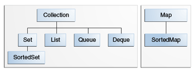

# Java Cheat Sheet for Coding Interviews

Java reference for interview coding problems/light competitive programming.

## How

I built this Java cheatsheet while leetcoding for fun. This cheetsheet only contains code that I didn't know but needed to use to solve a specific coding problem. I did this to try to get a smaller high frequency subset of Python vs a comprehensive list of all methods. Additionally, the act of recording the syntax and algorithms helped me store it in memory and as a result I almost never actually referenced this sheet. Hopefully it helps you in your efforts or inspires you to build your own and best of luck!

## Data Structures in Java

---

### Java Collections Framework Overview

| Interface | Hash Table | Resizable Array | Balanced Tree | Linked List  | Hash Table + Linked List |
| :-        | :-         | :-              | :-            | :-           | :-                       |
| `Set`     | `HashSet`  |                 | `TreeSet`     |              | `LinkedHashSet`          |
| `List`    |            | `ArrayList`     |               | `LinkedList` |                          |
| `Deque`   |            | `ArrayDeque`    |               | `LinkedList` |                          |
| `Map`     | `HashMap`  |                 | `TreeMap`     |              | `LinkedHashMap`          |



The Collection Interface: https://docs.oracle.com/javase/tutorial/collections/interfaces/collection.html
Map Interface: https://docs.oracle.com/javase/tutorial/collections/interfaces/map.html

---

### Big_O time complexity of Data Structures implemented in Java

---

https://robgrzel.github.io/data structures/complexity/datastructures-time-complexity/
[Stack Overflow: What are the time complexities of various data structures?](https://stackoverflow.com/questions/7294634/what-are-the-time-complexities-of-various-data-structures) 👍
https://robgrzel.github.io/assets/images/datastructures-complexity-java.pdf
http://files.zeroturnaround.com/pdf/zt_java_collections_cheat_sheet.pdf 👍
[Baeldung: Time Complexity of Java Collections](https://www.baeldung.com/java-collections-complexity) 👍

---

### Below are the Big O performance of common functions of different Java Collections.

---

#### `java.util.List`

| List                 | Add  | Remove | Get  | Contains | Next | Data Structure |
| :-                   | :-   | :-     | :-   | :-       | :-   | :-             |
| ArrayList            | O(1) | O(n)   | O(1) | O(n)     | O(1) | Array          |
| LinkedList           | O(1) | O(1)   | O(n) | O(n)     | O(1) | Linked List    |
| CopyOnWriteArrayList | O(n) | O(n)   | O(1) | O(n)     | O(1) | Array          |

#### `java.util.Set`

| Set                  | Add      | Remove   | Get      | Contains | Next | Data Structure            |
| :-                   | :-       | :-       | :-       | :-       | :-   | :-                        |
| HashSet              | O(1)     | O(1)     | O(1)     | O(h/n)   | O(1) | Hash Table                |
| LinkedHashSet        | O(1)     | O(1)     | O(1)     | O(1)     | O(1) | Hash Table + Linked List  |
| EnumSet              | O(1)     | O(1)     | O(1)     | O(1)     | O(1) | Bit Vector                |
| TreeSet              | O(log n) | O(log n) | O(log n) | O(log n) | O(1) | Red-black tree            |
| CopyOnWriteArraySet  | O(n)     | O(n)     | O(n)     | O(1)     | O(1) | Array                     |
| CopyOnSkipListSet    | O(log n) | O(log n) | O(log n) | O(1)     | O(n) | Skip List                 |

#### `java.util.Queue`

| Queue                  | Offer    | Peek     | Pool     | Remove | Size | Data Structure            |
| :-                     | :-       | :-       | :-       | :-     | :-   | :-                        |
| PriorityQueue          | O(log n) | O(1)     | O(log n) | O(n)   | O(1) | Priority Heap             |
| LinkedList             | O(1)     | O(1)     | O(1)     | O(1)   | O(1) | Array                     |
| ArrayDeque             | O(1)     | O(1)     | O(1)     | O(n)   | O(1) | Linked List               |
| ConcurrentLinkedQueue  | O(1)     | O(1)     | O(1)     | O(n)   | O(n) | Linked List               |
| ArrayBlockingQueue     | O(1)     | O(1)     | O(1)     | O(n)   | O(1) | Array                     |
| PriorityBlockingQueue  | O(log n) | O(1)     | O(log n) | O(n)   | O(1) | Priority Heap             |
| SynchronousQueue       | O(1)     | O(1)     | O(1)     | O(n)   | O(1) | None!                     |
| DelayQueue             | O(log n) | O(1)     | O(log n) | O(n)   | O(1) | Priority Heap             |
| LinkedBlockingQueue    | O(1)     | O(1)     | O(1)     | O(n)   | O(1) | Linked List               |

#### `java.util.Map`

| Map                   | Get      | ContainsKey | Next     | Data Structure            |
| :-                    | :-       | :-          | :-       | :-                        |
| HashMap               | O(1)     | O(1)        | O(h/n)   | Hash Table                |
| LinkedHashMap         | O(1)     | O(1)        | O(1)     | Hash Table + Linked List  |
| IdentityHashMap       | O(1)     | O(1)        | O(h/n)   | Array                     |
| WeakHashMap           | O(1)     | O(1)        | O(h/n)   | Hash Table                |
| EnumMap               | O(1)     | O(1)        | O(1)     | Array                     |
| TreeMap               | O(log n) | O(log n)    | O(log n) | Red-black tree            |
| ConcurrentHashMap     | O(1)     | O(1)        | O(h/n)   | Hash Tables               |
| ConcurrentSkipListMap | O(log n) | O(log n)    | O(1)     | Skip List                 |

#### Things you should know for Coding Interviews

##### 1. Map // collection
1. Definition ->Map<K, V> map = new HashMap<>();
2. insert / update -> V put(k1, v1); // TC: O(1)
3. delete -> V remove(k1); // TC: O(1)
4. get -> V get(k1); // TC: O(1)
5. size -> int size(); // TC: O(1)
6. check for Empty -> boolean isEmpty(); // TC: O(1)
7. value present -> boolean containsKey(k1); // TC: O(1)
8. remove all map values -> clear(); // TC: O(2n + 1) -> O(n) (n-key, n-value, 1 for map itself)

##### 2. ArrayList // Collection
1. Definition -> ArrayList list = new ArrayList<>();
2. insert -> boolean add(t) [TC: O(1)] / add(int index, T) [TC: O(n)]
3. delete -> T remove(int index); // TC: O(n) as you have to shuffle the elements above that point
4. set/update index value -> T set(int index, T); // TC: O(1)
5. get index-> T get(int index); // TC: O(1)
6. size -> int list.size(); // TC: O(1)
7. clear elements -> void clear(); // TC: O(n) & removeAll : O(n^2).
8. check for Empty -> boolean isEmpty(); // TC: O(1)
9. value contain check -> boolean contains(t); // TC: O(n)
10. get Index of value -> int indexOf(t); // TC: O(n), checking each element one by one
11. non premitive to premitive list -> toArray(); // TC: O(n)
12. Sorting for List ->

Collections.sort(list, (a, b) -> a - b); // ascending , TC: O(nlogn)
Collections.sort(list, (a, b) -> b - a); // descending , TC: O(nlogn)

##### 3. Array
1. Definition ->T arr [ ]= new T[N]; // N: static size , T : datatype
2. insert -> arr[index] = v1; // TC: O(1)
3. update -> arr[index] = v2; // TC: O(1)
4. get -> T arr[index] // TC: O(1)
5. size -> int arr.length // TC: O(1)
6. Arrays.fill(arr, 0); // filled array with value=0, TC: O(n)
7. And find if (and the index of) an element in an array without having to write a binary search function yourself -> Arrays.binarySearch(a, b)
8. Sorting -> TC: O(nlogn)

premitive (int[] ..)
Arrays.sort(arr); // default ascending,
non-premetive (Integer[] ..)
Arrays.sort(arr); // default ascending
Arrays.sort(arr, (a,b) -> b-a); // descening

##### 4. Stack // Collection
1. Definition ->Stack st = new Stack<>();
2. insert -> T push(t); // TC: O(1)
3. size -> int size(); // TC: O(1)
4. look up for head element -> T peek(); // TC: O(1)
5. remove head element -> T pop(); // TC: O(1)
6. check for Empty -> boolean isEmpty(); // TC: O(1)

##### 4a. Stack ( preferred over 4 ) // Collection
1. Definition ->Deque<> stack = new ArrayDeque<>();
2. insert -> T push(t); // TC: O(1)
3. size -> int size(); // TC: O(1)
4. look up for head element -> T peek(); // TC: O(1)
5. remove head element -> T pop(); // TC: O(1)
6. check for Empty -> boolean isEmpty(); // TC: O(1)
**Note:** As per Oracle Java documentation => "A more complete and consistent set of LIFO stack operations is provided by the Deque interface and its implementations, which should be used in preference to this class."

##### 5. Queue // Collection
1. Definition -> Queue queue = new LinkedList<>();
2. insert -> boolean add(t); // TC: O(1)
3. size -> int size(); // TC: O(1)
4. look up for head element -> T peek(); // TC: O(1)
5. remove head element -> T poll(); // TC: O(1)
6. check for Empty -> boolean isEmpty(); // TC: O(1)
7. points to remember :
queue poll vs stack pop
queue add vs stack push
we can define queue via LinkedList, PriorityQueue based on use case

##### 6. String / StringBuilder
1. Definition -> String str = new String();
2. size -> int length();// TC: O(1)
3. convert to char Array -> toCharArray(); // TC: O(n)
4. value for specific index -> charAt(int index); // TC: O(1)
5. substring from string -> substring(a,b] // a : inclusive, b: Exclusive, TC: O(n)
6. transform to Lowercase -> toLowerCase(); // TC: O(n)
7. transform to UpperCase -> toUpperCase(); // TC: O(n)
8. replace all characters in string -> replaceAll(from, to) // TC: O(n)
9. Some useful Character properties
`Character.isLetter();`
`Character.isAlphabetic();`
`Character.isUpperCase();`
`Character.isLowerCase();`
`Character.isDigit();`
Concatenation
T str1 + str2
10. StringBuilder ->
new StringBuilder() / new StringBuilder(int)
append("adding string") // better way to do
toString() // converting back to string
`setCharAt()` - to change at particular index
`setLength()` - especially useful when deleting the last element

##### 7. HashSet // Collection
1. Definition ->Set set = new HashSet<>();
2. insert / update -> boolean add(t); // TC: O(1)
3. delete -> boolean remove(t); // TC: O(1)
4. get -> boolean contains(t); // TC: O(1)
5. size -> int size(); // TC: O(1)
6. check for Empty -> boolean isEmpty(); // TC: O(1)
7. remove all set values -> clear(); // TC: O(n)

##### 8. Sorting
**To sort an array/Collections:**
```java
Arrays.sort(array, (a,b) ->  a[0] - b[0]); //ascending sorting 2d array based on first index
Arrays.sort(array,(a,b)-> {
            if(a[1]==b[1]) return 0;
            if(a[1]<b[1]) return -1;
            return 1;
        }); //to avoid overflow
//Sorting map keys
Map<Integer,Integer> count = new HashMap();
        for(int i : nums){
            count.put(i , count.getOrDefault(i,0)+1);
        }
      List<Integer> candidates = new ArrayList(count.keySet()); 
        Collections.sort(candidates, (w1, w2) -> count.get(w1).equals(count.get(w2)) ?
                w1.compareTo(w2) : count.get(w2) - count.get(w1));
```
**To sort an array/Collections using JDK8:**

> **Use [Collections.sort()](https://docs.oracle.com/javase/7/docs/api/java/util/List.html) API for sorting a List in Java 7. This API uses a modified mergesort and offers guaranteed `O(n*log(n))` performance.**
>

**Sorting a List**
```java
//Unsorted list
Integer[] numbers = new Integer[] { 15, 11, 9, 55, 47, 18, 1123, 520, 366, 420 };
List<Integer> numbersList = Arrays.asList(numbers);
 
//Sort the list in ascending order
Collections.sort(numbersList);
 
//Print list to confirm
System.out.println(numbersList);

//Unsorted list
Integer[] numbers = new Integer[] { 15, 11, 9, 55, 47, 18, 1123, 520, 366, 420 };
List<Integer> numbersList = Arrays.asList(numbers);
 
//Sort the list in descending order
Collections.sort(numbersList, Collections.reverseOrder());
 
//Print list to confirm
System.out.println(numbersList);
```

**Sorting a Set**
```java
//Unsorted list
HashSet<Integer> numbersSet = new LinkedHashSet<>( 
        Arrays.asList(15, 11, 9, 55, 47, 18, 1123, 520, 366, 420) );
 
List<Integer> numbersList = new ArrayList<Integer>(numbersSet) ;        //set -> list
 
//Sort the list
Collections.sort(numbersList);
 
numbersSet = new LinkedHashSet<>(numbersList);          //list -> set
 
//Print set to confirm
System.out.println(numbersSet);
```

**Sorting a Map by Key**
```java
HashMap<Integer, String> map = new HashMap<>();
         
map.put(50, "Alex");
map.put(20, "Charles");
map.put(60, "Brian");
map.put(70, "Edwin");
map.put(120, "George");
map.put(10, "David");
 
TreeMap<Integer, String> treeMap = new TreeMap<>(map);
 
System.out.println(treeMap);
```

**Sorting a Map by Value**
```java
HashMap<Integer, String> unSortedMap = new HashMap<>();
         
unSortedMap.put(50, "Alex");
unSortedMap.put(20, "Charles");
unSortedMap.put(60, "Brian");
unSortedMap.put(70, "Edwin");
unSortedMap.put(120, "George");
unSortedMap.put(10, "David");
 
//LinkedHashMap preserve the ordering of elements in which they are inserted
LinkedHashMap<Integer, String> sortedMap = new LinkedHashMap<>();
 
unSortedMap.entrySet()
    .stream()
    .sorted(Map.Entry.comparingByValue())
    .forEachOrdered(x -> sortedMap.put(x.getKey(), x.getValue()));
 
System.out.println(sortedMap);
```

**Sorting Custom Objects using Comparable**
```java
import java.time.LocalDate;
 
public class Employee implements Comparable<Employee> {
 
    private Long id;
    private String name;
    private LocalDate dob;
 
    public Employee(Long id, String name, LocalDate dob) {
        super();
        this.id = id;
        this.name = name;
        this.dob = dob;
    }
     
    @Override
    public int compareTo(Employee o) {
        return this.getId().compareTo(o.getId());
    }
 
    //Getters and Setters shall be added here
 
    @Override
    public String toString() {
        return "Employee [id=" + id + ", name=" + name + ", dob=" + dob + "]";
    }
}

// Java sort comparable objects
ArrayList<Employee> list = new ArrayList<>();
         
list.add(new Employee(1l, "Alex", LocalDate.of(2018, Month.APRIL, 21)));
list.add(new Employee(4l, "Brian", LocalDate.of(2018, Month.APRIL, 22)));
list.add(new Employee(3l, "Piyush", LocalDate.of(2018, Month.APRIL, 25)));
list.add(new Employee(5l, "Charles", LocalDate.of(2018, Month.APRIL, 23)));
list.add(new Employee(2l, "Pawan", LocalDate.of(2018, Month.APRIL, 24)));
 
Collections.sort(list);
 
System.out.println(list);
```

**Sorting Custom Objects using Comparator**
```java
import java.util.Comparator;
 
public class NameSorter implements Comparator<Employee>
{
    @Override
    public int compare(Employee e1, Employee e2) 
    {
        return e1.getName().compareToIgnoreCase( e2.getName() );
    }
}
```
```java
ArrayList<Employee> list = new ArrayList<>();
         
list.add(new Employee(1l, "Alex", LocalDate.of(2018, Month.APRIL, 21)));
list.add(new Employee(4l, "Brian", LocalDate.of(2018, Month.APRIL, 22)));
list.add(new Employee(3l, "Piyush", LocalDate.of(2018, Month.APRIL, 25)));
list.add(new Employee(5l, "Charles", LocalDate.of(2018, Month.APRIL, 23)));
list.add(new Employee(2l, "Pawan", LocalDate.of(2018, Month.APRIL, 24)));
 
Collections.sort(list, new NameSorter());
 
System.out.println(list);
```

**Sorting with Java 8 Lambda**
```java
Comparator<Employee> nameSorter = (a, b) -> a.getName().compareToIgnoreCase(b.getName());
         
Collections.sort(list, nameSorter);
```

**Grouping by sorting**
```java
ArrayList<Employee> list = new ArrayList<>();
         
list.add(new Employee(1l, "Alex", LocalDate.of(2018, Month.APRIL, 21)));
list.add(new Employee(4l, "Brian", LocalDate.of(2018, Month.APRIL, 01)));
list.add(new Employee(3l, "Alex", LocalDate.of(2018, Month.APRIL, 25)));
list.add(new Employee(5l, "Charles", LocalDate.of(2018, Month.APRIL, 23)));
list.add(new Employee(2l, "Alex", LocalDate.of(2018, Month.APRIL, 30)));
 
Collections.sort(list, Comparator
                        .comparing(Employee::getName)
                        .thenComparing(Employee::getDob));
 
System.out.println(list);
```

##### 9. Priority Queue & Max heap
PriorityQueue<Character> pq = new PriorityQueue<>((a, b) -> count[b] - count[a]);
//Places b on top of a in heap
//Max heap
PriorityQueue<Integer> heap = new PriorityQueue<>(Comparator.reverseOrder());

##### 10. Convert an array to list:
Arrays.asList(i,j) 
