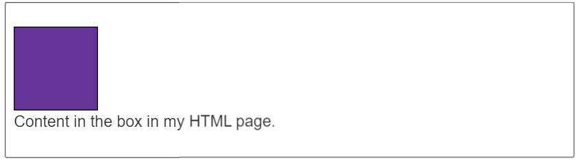
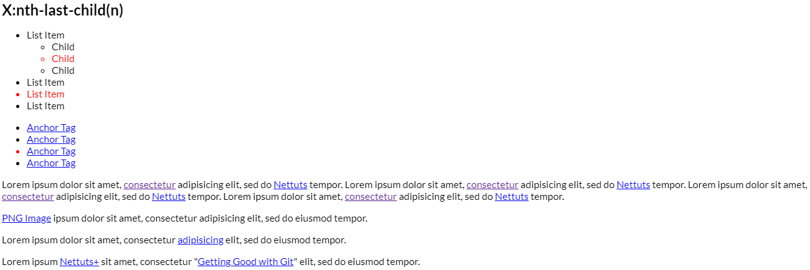

Here is a curated list of resources, question and exercises to go through that covers the essentials of being a competent full stack JS developer.

The contents have been broken down into **4** phases, covering the basics from HTML/CSS to APIs. It would be best to cover these phases in chronological order to gain a broad understanding from the basics to the more advanced topics.

# Personal Project Information (Recent Projects Only)
---
### A) **PADP** ( <ins><string>P</strong></ins>rovider <ins><string>A</strong></ins>gnostic <ins><string>D</strong></ins>ata <ins><string>P</strong></ins>arser )
---
##### Application key-points:
  * Ability to handle multiple data formats from different market data vendors ( Bloomberg, Reuters, IDC ).
  * Ability to push content to multiple clients while maintaining the least number of connections possible:
      * What we wanted to do is basically have each device create one connection into our infrastructure, and then over that one connection, multiplex or send multiple requests through virtual streams. This way, we can make efficient use of the number of connections, and we could actually lower the number of servers that we required because it wouldn't have to maintain as many connections between devices.
  * Ability to handle multiple requests from clients gracefully and scalably and in a reactive manner.

##### Backpressure control:
  * In the current implementation of the WebFlux module, the backpressure is regulated by the transport flow control, but it does not expose the real demand of the recipient. In order to finally see the interaction flow, please see the following diagram:

  * Fair backpressure with RSocket Protocol
    In order to achieve logical-elements backpressure through the network boundaries, we need an appropriate protocol for that. Fortunately, there is one called [RScoket protocol](http://rsocket.io/). RSocket is an application-level protocol that allows transferring real demand through the network boundaries. There is an RSocket-Java implementation of that protocol that allows to set up an RSocket server. In the case of a server to server communication, the same RSocket-Java library provides a client implementation as well. To learn more how to use RSocket-Java, please see the following examples [here](https://github.com/rsocket/rsocket-java/tree/1.0.x/rsocket-examples/src/main/java/io/rsocket/examples/transport/tcp). For browser-server communication, there is an [RSocket-JS](https://github.com/rsocket/rsocket-js) implementation which allows wiring the streaming communication between browser and server through WebSocket.

**NOTE:** **Backpressure** is when the progress of turning that input to output is resisted in some way. In most cases that resistance is computational speed — trouble computing the output as fast as the input comes in — so that’s by far the easiest way to look at it. But other forms of backpressure can happen too: for example, if your software has to wait for the user to take some action.

###### Technologies Used:
  * Message Exchange Format: [<ins><string>C</strong></ins>oncise <ins><string>B</strong></ins>inary <ins><string>O</strong></ins>bject <ins><string>R</strong></ins>epresentation](https://cbor.io/)
  * Transport Layer: [RSocket: Application protocol providing Reactive Streams semantics](https://rsocket.io/)
      * Why?
	      * **RSocket** is a Message-based Binary Protocol, in RSocket, there is a concept of a requester and responder, they interact with each other by sending binary frames between each other as messages. We picked binary for this instead of text-based because it's up to 30% faster, we found from testing to actually process binary data. When you get to a distributed system, latency becomes more and more important, the slower your system is, it actually affects calls down, your graph of services, creating a worse experience.
		  * **Bi-Directional** Once the connection is established, they're co-equal members of the transit of the connection, a client connect to a server, and then the server can actually go ahead and request API calls from the client as if it's connected to itself. This lets you do stuff like actually have a web browser connect to a service, and then you can go ahead and call API's that exist in the JavaScript code running in the browser.
  * Server Side: Spring Boot (Java)
  * Client Side: React (Typescript)
  
  
### B) **CDash** ( <ins><string>C</strong></ins>yptocurrency Asset <ins><string>D</strong></ins>ashboard )
---
##### Application key-points:
  * Ability to fetch data from major Cryptocurreny Asset Exchanges and provide it to clients in an easy-to-use dashboard UI format.
  * Ability to push content to multiple clients while maintaining the least number of connections possible:
      * What we wanted to do is basically have each device create one connection into our infrastructure, and then over that one connection, multiplex or send multiple requests through virtual streams. This way, we can make efficient use of the number of connections, and we could actually lower the number of servers that we required because it wouldn't have to maintain as many connections between devices.
  * Ability to handle multiple requests from clients gracefully and scalably and in a reactive manner.

##### Backpressure control:
  * In the current implementation of the WebFlux module, the backpressure is regulated by the transport flow control, but it does not expose the real demand of the recipient. In order to finally see the interaction flow, please see the following diagram:

  * Fair backpressure with RSocket Protocol
    In order to achieve logical-elements backpressure through the network boundaries, we need an appropriate protocol for that. Fortunately, there is one called [RScoket protocol](http://rsocket.io/). RSocket is an application-level protocol that allows transferring real demand through the network boundaries. There is an RSocket-Java implementation of that protocol that allows to set up an RSocket server. In the case of a server to server communication, the same RSocket-Java library provides a client implementation as well. To learn more how to use RSocket-Java, please see the following examples [here](https://github.com/rsocket/rsocket-java/tree/1.0.x/rsocket-examples/src/main/java/io/rsocket/examples/transport/tcp). For browser-server communication, there is an [RSocket-JS](https://github.com/rsocket/rsocket-js) implementation which allows wiring the streaming communication between browser and server through WebSocket.

**NOTE:** **Backpressure** is when the progress of turning that input to output is resisted in some way. In most cases that resistance is computational speed — trouble computing the output as fast as the input comes in — so that’s by far the easiest way to look at it. But other forms of backpressure can happen too: for example, if your software has to wait for the user to take some action.

###### Technologies Used:
  * Message Exchange Format: [<ins><string>C</strong></ins>oncise <ins><string>B</strong></ins>inary <ins><string>O</strong></ins>bject <ins><string>R</strong></ins>epresentation](https://cbor.io/)
  * Transport Layer: [RSocket: Application protocol providing Reactive Streams semantics](https://rsocket.io/)
      * Why?
	      * **RSocket** is a Message-based Binary Protocol, in RSocket, there is a concept of a requester and responder, they interact with each other by sending binary frames between each other as messages. We picked binary for this instead of text-based because it's up to 30% faster, we found from testing to actually process binary data. When you get to a distributed system, latency becomes more and more important, the slower your system is, it actually affects calls down, your graph of services, creating a worse experience.
		  * **Bi-Directional** Once the connection is established, they're co-equal members of the transit of the connection, a client connect to a server, and then the server can actually go ahead and request API calls from the client as if it's connected to itself. This lets you do stuff like actually have a web browser connect to a service, and then you can go ahead and call API's that exist in the JavaScript code running in the browser.
  * Server Side: Spring Boot (Java)
  * Client Side: React (Typescript)

# Phase 0
---
### A) Ice Breaker Questions

#### Open-Ended Questions

1. [What happens when you type a URL in the browser and press enter?](https://medium.com/@maneesha.wijesinghe1/what-happens-when-you-type-an-url-in-the-browser-and-press-enter-bb0aa2449c1a)
   For a detailed explanation refer to [What happens when... on GitHub](https://github.com/alex/what-happens-when).

#### General Questions
Believe it or not, some people find that the most difficult part of the interview is the icebreaker portion that involves small talk 
and requires some clever improvisation on your part. You can prepare by knowing some of the questions potential employers might ask 
during this interview phase. Come up with a good story for each of the questions. If you don't have an answer for these, then maybe 
you are not as gung-ho about web design as you thought you were.

1. Have you learned something new or interesting lately?
   * Make sure you know all the relevant news and blogs. You should be reading them regardless, but doing so on a daily basis during your job search is important. Be ready to talk casually and fluently about the latest web trends.

2. Why did you get into coding, programming, etc.?
   * "Because I can make good $," "I don't like to dress up or shave," and "because I loved the movie Hackers," are not good enough answers. Well ... a comment about Hackers might fly but make sure you have a real backstory that describes your "Aha!" moment.
   
3. What is your preferred development environment?
   * This is your chance to talk shop and demonstrate some industry knowledge. Be prepared to talk about your favorite editor, browser, plug-ins, operating system, and other tools. Freshen up on your lingo.

4. What is the coolest thing you ever coded? Do you have any personal projects you are working on?
   * These two questions are interchangeable. Any developer worth his weight had to practice somewhere or on something before they landed their first gig. If not, how did you get this interview anyway?! Review your past experiences, and even if they were boring to you, figure out a new frame of reference that demonstrates passion and a zest for learning.

### B) General Website Optimization Questions
1. How do you optimize a website's assets?
   * There are a number of answers to this question: File concatenation, file compression, CDN Hosting, offloading assets, re-organizing and refining code, etc. Have a few ready.

2. What are three ways to reduce page load time?
   * Again there are many answers here: Reduce image sizes, remove unnecessary widgets, HTTP compression, put CSS at the top and script references at the bottom or in external files, reduce lookups, minimize redirects, caching, etc.

3. What kind of things must you be wary of when design or developing for multilingual sites?
   * Another problem with many solutions: setting the default language, using Unicode encoding, using the 'lang' attribute, being aware of standard font sizes and text direction, and language word length (may affect layout).

---

# Roadmap

* [Wed Developer Roadmap 2021](https://github.com/kamranahmedse/developer-roadmap)

# Phase 1
---
### A) HTML

* [10 Typical HTML Exercises](https://github.com/sm2774us/full_stack_interview_prep_2021#10-typical-html-exercises)
* [16 Essential HTML5 Questions](https://github.com/sm2774us/full_stack_interview_prep_2021#16-essential-html5-questions)
* [28 Helpful HTML & HTML5 Questions & Answers](https://github.com/sm2774us/full_stack_interview_prep_2021#28-helpful-html--html5-questions--answers)
* [40 important HTML interview questions with answers](https://github.com/sm2774us/full_stack_interview_prep_2021#40-important-html-interview-questions-with-answers)
* [HTML questions and answers for freshers and experienced developers](https://github.com/sm2774us/full_stack_interview_prep_2021#html-questions-and-answers-for-freshers-and-experienced-developers)
* [Top 60 HTML Questions](https://github.com/sm2774us/full_stack_interview_prep_2021#top-60-html-questions)
* [Common HTML questions for freshers](https://github.com/sm2774us/full_stack_interview_prep_2021#common-html-questions-for-freshers)

### B) CSS

- [25 helpful CSS questions and answers](https://github.com/sm2774us/full_stack_interview_prep_2021#25-helpful-css-questions-and-answers)
- [Top 25 CSS Interview Questions and Answers for Experienced](https://github.com/sm2774us/full_stack_interview_prep_2021#top-25-css-interview-questions-and-answers-for-experienced)
- [CSS questions and answers for freshers and experienced developers](https://github.com/sm2774us/full_stack_interview_prep_2021#css-questions-and-answers-for-freshers-and-experienced-developers)
- [CSS Questions and Answers](https://github.com/sm2774us/full_stack_interview_prep_2021#css-questions-and-answers)
- [Questions and Exercises About CSS](https://github.com/sm2774us/full_stack_interview_prep_2021#questions-and-exercises-about-css)
- [The 30 CSS Selectors You Must Memorize](https://github.com/sm2774us/full_stack_interview_prep_2021#the-30-css-selectors-you-must-memorize)

### C) Sass

- [Top 40 Sass & Less Interview Questions and Answers](https://github.com/sm2774us/full_stack_interview_prep_2021#top-40-sass--less-interview-questions-and-answers)

---

# Phase 2

### A) JavaScript

* [The Modern JavaScript Tutorial](https://javascript.info/)
* [10 Questions Every JavaScript Developer Should Know](https://medium.com/javascript-scene/10-interview-questions-every-javascript-developer-should-know-6fa6bdf5ad95)
* [21 Essential JavaScript Questions from best mentors all over the world](https://www.codementor.io/javascript/tutorial/21-essential-javascript-tech-interview-practice-questions-answers)
* [25 Essential JavaScript Questions from top 3% developers company](http://www.toptal.com/javascript/interview-questions)
* [5 More JavaScript Exercises](http://www.sitepoint.com/5-javascript-interview-exercises/)
* [5 Typical JavaScript Exercises](http://www.sitepoint.com/5-typical-javascript-interview-exercises/)
* [Development hiring managers and potential interviewees may find these sample JavaScript proficiency Q&As and code snippets useful](http://www.techrepublic.com/blog/software-engineer/javascript-interview-questions-and-answers/)
* [JavaScript 101 Question](https://github.com/nishant8BITS/101-JavaScript-Interview-Question)
* [JavaScript Questions have been designed specially to get you acquainted with the nature of questions you may encounter during your for the subject of JavaScript](http://www.tutorialspoint.com/javascript/javascript_interview_questions.htm)
* [JS: Basics and Tricky Questions](http://www.thatjsdude.com/interview/js2.html)
* [JS: Algorithm](http://thatjsdude.com/interview/js1.html)
* [Some basic javascript coding challenges and questions](https://github.com/kolodny/exercises)
* [Some JavaScript exercises](https://github.com/csvenja/javascript-exercises)
* [Ten Questions I've Been Asked, Most More Than Once, Over Six Technical JavaScript / Front-End Engineer Job Interviews.](https://www.reddit.com/r/javascript/comments/3rb88w/ten_questions_ive_been_asked_most_more_than_once)
* [Top 85 JavaScript Questions](http://career.guru99.com/top-85-javascript-interview-questions/)
* [Cake JavaScript Questions](https://www.interviewcake.com/javascript-interview-questions)
* [The Best Frontend JavaScript Questions (written by a Frontend Engineer)](https://performancejs.com/post/hde6d32/The-Best-Frontend-JavaScript-Interview-Questions-(written-by-a-Frontend-Engineer))

## B) Data Structures & Algorithms

- [Data Structures - Notes](./cs_fundamentals/Data_Structures/Notes/README.md)
- [`Data Structures and Algorithms using Python` by Rance D. Necaise](./cs_fundamentals/Data_Structures/Data_Structures_and_Algorithms_Using_Python_The_Book_And_Source_Code/Data%20Structures%20and%20Algorithms%20Using%20Python.pdf)
- [Algorithms - Notes](./cs_fundamentals/Algorithms/Notes/README.md)
- [`Grokking Algorithms - An illustrated guide for programmers and other curious people` by Aditya Y. Bhargava](./cs_fundamentals/Algorithms/Grokking_Algorithms_The_Book_and_Source_Code/Grokking%20Algorithms%20-%20An%20illustrated%20guide%20for%20programmers%20and%20other%20curious%20people.pdf)
- [EKAlgorithms contains some well known CS algorithms & data structures](https://github.com/EvgenyKarkan/EKAlgorithms)
- [Five programming problems every Software Engineer should be able to solve in less than 1 hour](http://www.shiftedup.com/2015/05/07/five-programming-problems-every-software-engineer-should-be-able-to-solve-in-less-than-1-hour)
- [Top 10 Algorithms for Coding Interview](http://www.programcreek.com/2012/11/top-10-algorithms-for-coding-interview/)
- [Top 50 Data Structure Questions from Career Guru](http://career.guru99.com/top-50-data-structure-interview-questions/)

## C) LeetCode

- [Important and Useful links from all over the LeetCode](https://leetcode.com/discuss/general-discussion/665604/Important-and-Useful-links-from-all-over-the-Leetcode)
- [LeetCode - Curated List of 75 Problems - Solutions in Python and Kotlin](./curated_list_of_75_leetcode_solutions_in_Python_and_Kotlin/README.md)
- [LeetCode - Curated List of 75 Problems - Solutions in Java](./curated_list_of_75_leetcode_solutions_in_Java/README.md)

## D) Company-wise Preparation

- [Amazon](./company_wise_prep/amazon_interview_prep_2021/README.md)
- [Facebook](./curated_list_of_75_leetcode_questions/README.md)

## E) Coding exercises

- [Common questions and puzzles solved in a number of languages](https://github.com/mre/the-coding-interview)

---

# Phase 3

### AngularJS

- [10 Essential AngularJS Questions](http://www.toptal.com/angular-js/interview-questions)
- [An AngularJS exam with questions from beginner to expert](https://github.com/gdi2290/ngExam)
- [29 AngularJS Questions – Can You Answer Them All?](https://www.codementor.io/angularjs/tutorial/angularjs-interview-questions-sample-answers)
- [AngularJS questions and answers for experienced developers](http://www.web-technology-experts-notes.in/2014/11/angularjs-interview-questions-and-answers-for-experienced.html)
- [AngularJS Questions which have been designed specially to get you acquainted with the nature of questions you may encounter during your for the subject of AngularJS](http://www.tutorialspoint.com/angularjs/angularjs_interview_questions.htm)
- [This article discusses the top 50 Most occurred AngularJS question with answers](http://www.codeproject.com/Articles/891718/AngularJS-Interview-Questions-and-Answers)
- [Top 25 Angularjs Questions and Quiz](http://career.guru99.com/top-25-angular-js-interview-questions/)

### ReactJS

- [Reddit users share their expectations from ReactJS interview](https://www.reddit.com/r/reactjs/comments/3m5equ/react_what_interview_questions_to_expect/)
- [This is a first in the series of questions related with ReactJS](http://interview-questions-247.appspot.com/reactjs-interview-questions-set-1)
- [This quiz intends to test your understanding around ReactJS fundamentals (Set 3)](http://interview-questions-247.appspot.com/reactjs-interview-questions-set-3)
- [This quiz intends to test your understanding around ReactJS fundamentals](http://interview-questions-247.appspot.com/reactjs-interview-questions-set-2)
- [5 Essential React.js Questions](https://www.codementor.io/reactjs/tutorial/5-essential-reactjs-interview-questions)
- [React Questions](https://tylermcginnis.com/react-interview-questions/)

---

# Phase 4

### NodeJS

* [7 Essential Nodejs Questions](http://www.toptal.com/nodejs/interview-questions)
* [Node.js Questions & Answers from LazyQuestion.com](http://www.lazyquestion.com/interview-questions-and-answer/nodejs)
* [Node.JS Questions have been designed specially to get you acquainted with the nature of questions you may encounter during your for the subject of Node.JS](http://www.tutorialspoint.com/nodejs/nodejs_interview_questions.htm)
* [There are two sides of the table: you either want to hire Nodejs developers or you want to get hired as a Nodejs developer This list helps you navigate a bit in this space, giving you some questions to ask, and a list of questions you should know the answer to](https://blog.risingstack.com/node-js-interview-questions/)
* [Top 25 Nodejs Questions & Answers from Career Guru](http://career.guru99.com/top-25-interview-questions-on-node-js/)

---

# Phase 5

### Garbage Collection

* [Garbage Collection](./java_garbage_collection_handbook/README.md)

### Python

* [Python Cheat Sheet](./Python_Study_Notes/python_cheatsheet.md)

### Java

* [Java Cheat Sheet](./Java_Study_Notes/java_cheatsheet.md)
* [OOP](https://github.com/sm2774us/full_stack_interview_prep_2021#oop)
* [SOLID](https://github.com/sm2774us/full_stack_interview_prep_2021#solid)
* [Design Patterns](./Java-Design-Patterns/README.md)
* [Java OOP Cheat Sheet — A Quick Guide to Object-Oriented Programming in Java](https://medium.com/edureka/java-oop-cheat-sheet-9c6ebb5e1175)
* [Explain the difference between "Inversion of Control", "Dependency Injection" and "Dependency Inversion Principle"](https://github.com/sm2774us/full_stack_interview_prep_2021#explain-the-difference-between-inversion-of-control-dependency-injection-and-dependency-inversion-principle)
* [Write Java Code that will produce a deadlock and how would you fix it](https://github.com/sm2774us/full_stack_interview_prep_2021#write-java-code-that-will-produce-a-deadlock-and-how-would-you-fix-it)
* [JVM Tutorial - Java Virtual Machine Architecture Explained for Beginners](https://www.freecodecamp.org/news/jvm-tutorial-java-virtual-machine-architecture-explained-for-beginners/)
* [What is a Java Classloader](https://stackoverflow.com/questions/2424604/what-is-a-java-classloader)
* [Explain how ClassLoader works in Java with an example](https://javarevisited.blogspot.com/2012/12/how-classloader-works-in-java.html)
* [Memory Management in Java Interview Questions (+Answers)](https://www.baeldung.com/java-memory-management-interview-questions)
* [JVM Garbage Collectors](https://www.baeldung.com/jvm-garbage-collectors)
* [100+ Top Java Interview Questions and Answers in 2021](https://hackr.io/blog/java-interview-questions)
* [160+ Top Java Interview Questions and Answers in 2021](https://www.mygreatlearning.com/blog/java-interview-questions/)
* [10 Tricky Java Interview Questions with Answers](https://github.com/sm2774us/full_stack_interview_prep_2021#10-trick-java-interview-questions-with-answers)
* [Top 10 Tough Core Java Interview Questions Answers for Programmers](https://www.java67.com/2012/09/top-10-tough-core-java-interview-questions-answers.html)
* [42 Advanced Java Interview Questions For Senior Developers](https://www.fullstack.cafe/blog/advanced-java-interview-questions)
* [String, StringBuilder, and StringBuffer Do you know the difference?](https://github.com/sm2774us/full_stack_interview_prep_2021#string--stringbuilder--and-stringbuffer-do-you-know-the-difference)
* [9 New Features in Java 11](https://github.com/sm2774us/full_stack_interview_prep_2021#9-new-features-in-java-11)

### Spring
[Top Spring Framework Interview Questions](https://www.baeldung.com/spring-interview-questions)
[Spring Interview Questions](https://hackr.io/blog/spring-interview-questions)
[Java Spring Interview Questions](https://mindmajix.com/java-spring-interview-questions)

### Spring Boot
[Spring Boot Interview Questions](https://www.baeldung.com/spring-boot-interview-questions)
[11 Spring Boot Interview Questions That Make You Think](https://www.marcobehler.com/guides/spring-boot-interview-questions)

### Gradle
[Top 50 Gradle Interview Questions And Answers In 2021](https://mindmajix.com/gradle-interview-questions)
[Gradle Interview Questions and Answers](https://www.qaautomation.co.in/2019/07/gradle-interview-questions-and-answers.html)

### Cryptography
[18 Cryptography Interview Questions You'll Be Asked On Your Next Tech Interview](https://www.fullstack.cafe/blog/cryptography-interview-questions)

---

# Phase 6

### Postgres

* [13 PostgreSQL Q&A](http://www.dotnetfunda.com/interviews/cat/208/postgresql)
* [Frequently Asked Basic PostgreSQL Questions and Answers](http://nazafbtemplate.blogspot.com.by/2014/06/frequently-asked-basic-postgresql.html)
* [PostgreSQL Preparation Guide](http://www.globalguideline.com/interview_questions/Questions.php?sc=postgresqk_database_](http://www.globalguideline.com/interview_questions/Questions.php?sc=postgresqk_database_))
* [PostgreSQL Q&A](http://www.coolinterview.com/type.asp?iType=411)

### SQL

* [10 Frequently asked SQL Query Questions](http://java67.blogspot.com.by/2013/04/10-frequently-asked-sql-query-interview-questions-answers-database.html)
* [18 Essential SQL Questions](http://www.toptal.com/sql/interview-questions)
* [Common Questions and Answers](http://www.indiabix.com/technical/sql-server-common-questions/)
* [General Questions and Answers](http://www.indiabix.com/technical/sql-server-general-questions/)
* [Schema, Questions & Solutions for SQL Exercising](https://github.com/XD-DENG/SQL-exercise)
* [SQL Questions that have been designed specially to get you acquainted with the nature of questions you may encounter during your for the subject of SQL](http://www.tutorialspoint.com/sql/sql_interview_questions.htm)
* [Top 20 SQL Questions with Answers](http://dwbi.org/database/sql/72-top-20-sql-interview-questions-with-answers)

---
### PHASE - 1
---
#### A: HTML
---

#### 10 Typical HTML Exercises

---

##### Q1. Markup validation
Consider the following markup:
```html
<figure>
   <picture>
      <source media="(min-width: 40em)"
      srcset="large.jpg 1024w, medium.jpg 640w, small.jpg 320y">
      
   </picture>
   <figcaption>A landscape of London by night</figcaption>
</figure>
```
Is it valid? If not, can you explain why?

##### A1.
The markup uses [the picture element](https://www.w3.org/TR/html-picture-element/), which is a pretty new addition to the specification.
The code is all valid apart from the last image specified in the **`srcset`** attribute; **`320y`** isn't a valid value.
If the **`y`** is replaced with a **`w`**, it becomes valid though.

##### Q2. The `main` element
Can you explain the definition of the `main` element? What is its goal? Are the two specifications (WHATWG and W3C) in agreement on its definition?

##### A2.
The **`main`** element has two different definitions depending on the specification used.

The W3C specification [describes it](https://www.w3.org/TR/html51/grouping-content.html#the-main-element) as the main content of the page, that is,
the content that describes the main topic of a page or is the central functionality of an application.
The specification also states that a document must not include more than one **`main`** element.

The WHATWG specification doesn't assign any semantic value to the **`main`** element and [describes it](https://html.spec.whatwg.org/multipage/semantics.html#the-main-element)
as a container for the dominant contents of another element. Also, according to WHATWG, you don't have a limit in the number of times 
you can use the **`main`** element in a single document. If you have multiple **`article`** elements on a page, you may want to markup the 
**`main`** content of each **`article`** with a separate **`main`** element.

##### Q3. WAI-ARIA
Consider the following snippet:
```html
<header>
   <h1>Main title</h1>
   <form action="/" method="get">
      <input type="search">
      <input type="submit">
   </form>
</header>
<ul>
   <li><a href="/">Home</a></li>
   <li><a href="/products">Products</a></li>
   <li><a href="/about">About</a></li>
</ul>
<main>
   <article>
      <h1>Main title</h1>
      <p>This is the content of this section</p>
   </article>
</main>
<footer>
   <small>Copyright &amp;copy; Aurelio De Rosa 2014</small>
</footer>
```

Can you improve its accessibility using [WAI-ARIA roles](https://www.w3.org/WAI/intro/aria.php) where appropriate,
taking into account older technologies?

##### A3.
The code can be rewritten as follows:
```html
<header role="header">
  <h1>Main title</h1>
  <form action="/" method="get" role="search">
     <label for="search">Search:</label>
     <input id="search" type="search">
     <input type="submit">
  </form>
</header>
<nav role="navigation">
  <ul>
     <li><a href="/">Home</a></li>
     <li><a href="/products">Products</a></li>
     <li><a href="/about">About</a></li>
  </ul>
</nav>
<main role="main">
  <article role="article">
     <h1>Main title</h1>
     <p>This is the content of this section</p>
  </article>
</main>
<footer role="contentinfo">
  <small>Copyright &amp;copy; Aurelio De Rosa 2014</small>
</footer>
```

To improve the accessibility, the main navigation list has been wrapped with a **`nav`** element.
To improve the accessibility in older technologies that don't support the new semantic elements,
the role of **`header`**, **`navigation`**, **`main`**, **`article`**, and **`contentinfo`** have been added 
to the **`header`**, **`nav`**, **`main`**, **`article`**, and **`footer`** elements respectively.

Other improvements have been made on the search form. First of all the form has been marked using the **`search`** role.
Then, an explicit **`label`** element has been added to give context for the **`input`** field, and it has been associated with 
the **`input`** through the use of the **`for`** attribute.

##### Q4. The **`small`** element
Describe when it's appropriate to use the **`small`** element and provide an example.

##### A4.
In HTML 4.01 the **`small`** element was a presentational element to mark up smaller text. [In HTML5](https://www.w3.org/TR/html5/text-level-semantics.html#the-small-element)
it should be used semantically to represent legal disclaimers, caveats, and so on. The text may well be "small", but this isn't required.

An example of its use is shown below:

```html

<small>The copyright of this image is owned by Aurelio De Rosa</small>
```

##### Q5. Subheadings
Subheadings are one of the most common elements in any website. A few years ago the **`hgroup`** tag was introduced to address this need, 
but it has since been removed from the specs. Can you describe why **`hgroup`** was dropped and how the markup can be addressed today?

##### A5.
The **`hgroup`** element was introduced to group multiple heading elements (**`h1`**–**`h6`**) in order to avoid the creation of an 
unintended sublevel in the hierarchy. To understand what problem it tried to address, let's consider the following markup:

```html
<article>
   <h1>Main title</h1>
   <h2>This is a subtitle</h2>
   <p>This is the content of this section</p>
</article>
```

Outlining the document hierarchy of the previous snippet gives us the following representation:

```
h1
|
---h2
   |
   p
```

This simple schema shows that the paragraph content of the snippet is seen as the content of the **`h2`** instead of the **`h1`**,
regardless if this was the intended behavior or not. So if the intention was simply to create a subheading and to associate 
the **`p`** with **`h1`**, the original markup was incorrect.

The **`hgroup`** element was introduced to address this issue with ease. Therefore, it was removed from the HTML5 specification in April 2013,
due to lack of implementations and lack of use cases, making its use invalid.

A possible solution to create a subtitle so that the paragraph is associated to the **`h1`** is shown below:

```html
<article>
   <h1>
       Main title
       <span>This is a subtitle</span>
   </h1>
   <p>This is the content of this section</p>
</article>
```

##### Q6. Images and accessibility
Is the **`alt`** attribute mandatory on **`img`** elements? If not, can you describe a scenario where it can be set to an empty value?
Does an empty value affect accessibility in any way?

##### A6.
The [alt attribute](https://www.w3.org/TR/html5/embedded-content-0.html#alt) is mandatory on **`img`** elements but its value can be empty 
(i.e. **`alt=""`**). An empty value is recommended when the image shown is used for decorative purposes only and therefore isn't part of 
the content of the page. With regards to accessibility, if the **`alt`** attribute is empty, screen readers will ignore the image. 
This is highly recommended because using a value of something like "Content separator" will only disturb the user when this text is spoken.

##### Q7. The **`time`** element
Is it possible to express a date range using a single **`time`** element?

##### A7.
No, it isn't possible. The information can be expressed using two [time elements](https://www.w3.org/TR/html5/text-level-semantics.html#the-time-element) though.
For example to describe a time interval ranging from November 6, 2014 to November 9, 2014, a developer can write:

```html
<time datetime="2014-11-06">6</time>-
<time datetime="2014-11-09">9 November 2014</time>
```

##### Q8. **`meter`** and **`progress`**
What's the difference between the **`meter`** element and the **`progress`** element?

##### A8.
The [meter element](https://www.w3.org/TR/html5/forms.html#the-meter-element) represents a scalar measurement within a _known_ range,
or a fractional value. This element isn't a good fit to measure something like external temperature because it doesn't have a fixed range.
However, **`meter`** can be used to describe the occupied memory of a hard disk.

The [progress element](https://www.w3.org/TR/html5/forms.html#the-progress-element) is used to show the completion progress of a task. Unlike the **`meter`** element, the progress described by 
**`progress`** can be indeterminate. For example you could describe that a given task is progressing but that it is unknown when 
the task will be completed.

##### Q9. The **`longdesc`** attribute
What is the **`longdesc`** attribute? Can you explain its purpose?

##### A9.
[The **`longdesc`** attribute of the **`img`** element](https://www.w3.org/TR/html-longdesc/) has been around since HTML 4 and is also 
valid in HTML5. This attribute is designed to provide a more detailed description of an image, compared to the information offered in the 
**`alt`** attribute. The interesting thing is that instead of providing a description by itself (like the **`alt`** attribute does), 
**`longdesc`** points to a hyperlink containing the description.

An example of the use of **`longdesc`** is presented below:

```html


<!-- other content here ... -->

<section id="description">
  <h2>Italy</h2>
  <p>The shown map of Italy illustrates its division 
  in regions...</p>
</section>
```

##### Q10. The **`mark`** element
What is the **`mark`** element? Can you describe an example of use for this element?

##### A10.
The [mark element](https://www.w3.org/TR/html5/text-level-semantics.html#the-mark-element) represents highlighted text.
A typical use is to highlight every instance of the keyword or keywords searched by a user.

---

#### 16 Essential HTML5 Questions

---

##### Q1. Give a simple implementation of the `<video>` tag to embed a video stored at `http://www.example.com/amazing_video.mp4`. Give the video a width of 640 pixels by 360 pixels. Provide the user with controls.

##### A1.
Here is one simple implementation:

```html
<video src="http://www.example.com/amazing_video.mp4" width="640" height="360" controls></video>
```

Alternatively, the source file may be indicated with a separate <source> tag inside the <video> element, as in:

```html
<video width="640" height="360" controls>
  <source src="http://www.example.com/amazing_video.mp4">
</video>
```

##### Q2. What were some of the key goals and motivations for the HTML5 specification?

##### A2.
HTML5 was designed to replace both HTML 4, XHTML, and the HTML DOM Level 2.

Major goals of the [HTML specification](http://www.w3.org/TR/html5/) were to:

* Deliver rich content (graphics, movies, etc.) without the need for additional plugins (e.g., Flash).
* Provide better semantic support for web page structure through the introduction of new structural element tags.
* Provide a stricter parsing standard to simplify error handling, ensure more consistent cross-browser behavior, and simplify backward compatibility with documents written to older standards.
* Provide better cross-platform support (i.e., to work well whether running on a PC, Tablet, or Smartphone).

##### Q3. What are some of the key new features in HTML5?

##### A3.
Key new features of HTML5 include:

* Improved support for embedding graphics, audio, and video content via the new [`<canvas>`](http://www.w3schools.com/tags/tag_canvas.asp), 
  [`<audio>`](http://www.w3schools.com/tags/tag_audio.asp), and [`<video>`](http://www.w3schools.com/tags/tag_video.asp) tags.
* Extensions to the JavaScript API such as [geolocation](http://www.w3schools.com/html/html5_geolocation.asp) and [drag-and-drop](http://www.w3schools.com/html/html5_draganddrop.asp) 
  as well for [storage](http://www.w3schools.com/html/html5_webstorage.asp) and [caching](http://www.w3schools.com/html/html5_app_cache.asp).
* Introduction of ["web workers"](http://www.w3schools.com/html/html5_webworkers.asp).
* Several new semantic tags were also added to complement the structural logic of modern web applications.
  These include the `<main>`, `<nav>`, `<article>`, `<section>`, `<header>`, `<footer>`, and `<aside>` tags.
* New form controls, such as `<calendar>`, `<date>`, `<time>`, `<email>`, `<url>`, and `<search>`.

##### Q4. What are "web workers"?

##### A4.
[Web workers](http://www.w3schools.com/html/html5_webworkers.asp) at long last bring multi-threading to JavaScript.

A web worker is a script that runs in the background (i.e., in another thread) without the page needing to wait for it to complete.
The user can continue to interact with the page while the web worker runs in the background. Workers utilize thread-like 
message passing to achieve parallelism.

##### Q5. How do you indicate the character set being used by an HTML5 document? How does this differ from older HTML standards?

##### A5.
In HTML5, the encoding used can be indicated with the `charset` attribute of a `<meta>` tag inside the document's `<head>` element:

```html
<!DOCTYPE html>
<html>
<head>
...
<meta charset="UTF-8">
...
</head>
...
</html>
```

This is a slightly simpler syntax from older HTML standards, which did not have the `charset` attribute.
For example, an HTML 4.01 document would use the `<meta>` tag as follows:

```html
<!DOCTYPE HTML PUBLIC "-//W3C//DTD HTML 4.01//EN" "http://www.w3.org/TR/html4/strict.dtd">
<html>
  <head>
    ...
    <meta http-equiv="Content-Type" content="text/html; charset=utf-8">
    ...
  </head>
  ...
</html>
```

##### Q6. Discuss the differences between an HTML specification and a browser's implementation thereof.

##### A6.
HTML specifications such as HTML5 define a set of rules that a document must adhere to in order to be "valid" according to that specification.
In addition, a specification provides instructions on how a browser must interpret and render such a document.

A browser is said to "support" a specification if it handles valid documents according to the rules of the specification.
As of yet, no browser supports all aspects of the HTML5 specification (although all of the major browser support most of it),
and as a result, it is necessary for the developer to confirm whether the aspect they are making use of will be supported by 
all of the browsers on which they hope to display their content. This is why cross-browser support continues to be a headache 
for developers, despite the improved specificiations.

In addition, while HTML5 defines some rules to follow for an invalid HTML5 document (i.e., one that contains syntactical errors), 
invalid documents may contain anything, and it is impossible for the specification to handle all possibilities comprehensively. 
Thus, many decisions about how to handle malformed documents are left up to the browser.

##### Q7. Briefly describe the correct usage of the following HTML5 semantic elements: `<header>`, `<article>`, `<section>`, `<footer>`.

##### A7.
The `<header>` element is used to contain introductory and navigational information about a section of the page. 
This can include the section heading, the author's name, time and date of publication, table of contents, or other navigational information.

The `<article>` element is meant to house a self-contained composition that can logically be independently recreated outside of the page 
without losing it's meaining. Individual blog posts or news stories are good examples.

The `<section>` element is a flexible container for holding content that shares a common informational theme or purpose.

The `<footer>` element is used to hold information that should appear at the end of a section of content and contain additional 
information about the section. Author's name, copyright information, and related links are typical examples of such content.

##### Q8. Can a `<section>` contain `<article>` elements? Can an `<article>` contain `<section>` elements? Provide usage examples.

##### A8.
The answer to both questions is yes; i.e., a `<section>` can contain `<article>` elements, and an `<article>` can contain `<section>` elements.

For example, a personal dashboard page might contain a `<section>` for social network interactions as well as a `<section>` for the latest news articles, 
the latter of which could contain several `<article>` elements.

Conversely, an `<article>` might contain a `<section>` at the end for reader comments.

##### Q9. Can a web page contain multiple `<header>` elements? What about `<footer>` elements?

##### A9.
Yes to both. In fact, both the `<header>` and `<footer>` tags are designed to serve their respective purposes in relation to whatever their parent 
"section" may be. So not only can the page `<body>` contain a header and a footer, but so can every `<article>` and `<section>` element. 
In fact, a `<header>` should be present for all of these, although a `<footer>` is not always necessary.

##### Q10. Describe the relationship between the <header> and <h1> tags in HTML5.

##### A10.
In previous specifications of HTML, only one `<h1>` element was typically present on a page, used for the heading of the entire page. 
HTML5 specifies that `<h1>` represents the top-level heading of a "section", whether that be the page `<body>`, or an `<article>` or `<section>` element. 
In fact, every `<header>` element should at least contain an `<h1>` element. If there is no natural heading for the section, it is a good 
indication it should not use an `<article>` or `<section>` tag.

##### Q11. Write the code necessary to create a 300 pixel by 300 pixel `<canvas>`. Within it, paint a blue 100 pixel by 100 pixel square with the top-left corner of the square located 50 pixels from both the top and left edges of the canvas.

##### A11.
Here is one simple implementation:

```html
<canvas id="c" width="300" height="300"></canvas>

<script>
  var canvas = document.getElementById( "c" );
  var drawing_context = canvas.getContext( "2d" );
  drawing_context.fillStyle = "blue";
  drawing_context.fillRect( 50, 50, 100, 100 );
</script>
```

##### Q12. What is HTML5 Web Storage? Explain localStorage and sessionStorage.

##### A12.
With HTML5, web pages can store data locally within the user's browser.

Earlier, this was done with cookies. However, Web Storage is more secure and faster. The data is not included with every server request, 
but used ONLY when asked for.

The data is stored in name/value pairs, and a web page can only access data stored by itself. Unlike cookies, the storage limit is far 
larger (at least 5MB) and information is never transferred to the server.

The difference between localStorage and sessionStorage involves the lifetime and scope of the storage.

Data stored through localStorage is permanent: it does not expire and remains stored on the user's computer until a web app deletes it 
or the user asks the browser to delete it. SessionStorage has the same lifetime as the top-level window or browser tab in which the 
script that stored it is running. When the window or tab is permanently closed, any data stored through sessionStorage is deleted.

Both forms of storage are scoped to the document origin so that documents with different origins will never share the stored objects. 
But sessionStorage is also scoped on a per-window basis. If a user has two browser tabs displaying documents from the same origin, 
those two tabs have separate sessionStorage data: the scripts running in one tab cannot read or overwrite the data written by scripts 
in the other tab, even if both tabs are visiting exactly the same page and are running exactly the same scripts.

##### Q13. What is the difference between `span` and `div`?

##### A13.
The difference is that `span` gives the output with `display: inline` and `div` gives the output with `display: block`.

`span` is used when we need our elements to be shown in a line, one after the other.

##### Q14. What is the Geolocation API in HTML5?

##### A14.
HTML5's Geolocation API lets users share their physical location with chosen web sites. JavaScript can capture a user's latitude and longitude 
and can send it to the back-end web server to enable location-aware features like finding local businesses or showing their location on a map.

Today, most browsers and mobile devices support the Geolocation API. The Geolocation API works with a new property of the global `navigator` object.

A Geolocation object can be created as follows:

```JavaScript
var geolocation = navigator.geolocation;
```

The `geolocation` object is a service object that allows widgets to retrieve information about the geographic location of the user's device.

##### Q15. What's one main result if you do not specify a `doctype` in an HTML page?

##### A15.
New HTML5-specific tags will not be interpreted by the browser.

##### Q16. What's the difference between the `<svg>` and `<canvas>` elements?

##### A16.
The `<svg>` element is a container for SVG graphics. SVG has several methods for drawing paths, boxes, circles, text, and even bitmap images.

SVG is a language for describing 2D graphics, but `<canvas>` allows you to draw 2D graphics on the fly using JavaScript.

SVG is XML-based, which means that every element is available within the SVG DOM. You can attach JavaScript event handlers for an element.

In SVG, each drawn shape is remembered as an object. If attributes of an SVG object are changed, the browser can automatically re-render the shape.

Canvas is rendered pixel by pixel. In canvas, once the graphic is drawn, it is forgotten by the browser. If its position should be changed, 
the entire scene needs to be redrawn, including any objects that might have been covered by the graphic.

##### Q12. What is the Geolocation API in HTML5?

##### A12.

##### Q12. What is the Geolocation API in HTML5?

##### A12.

---

#### C: 28 Helpful HTML & HTML5 Questions & Answers

---

##### Beginner HTML Questions

###### Q1. What is HTML?
###### A1.
HTML stands for **H**yper**T**ext **M**arkup **L**anguage. It is the dominant markup language for creating websites and anything that can be viewed in a web browser. If you want to get some extra bonus points, you can learn the history of HTML and throw in some obscure facts.

###### Q2. What is the difference between HTML elements and tags?
###### A2.
HTML elements communicate to the browser how to render text. When surrounded by angular brackets `<>` they form HTML tags. For the most part, tags come in pairs and surround text.

###### Q3. What is "Semantic HTML?"
###### A3.
Semantic HTML is a coding style where the tags embody what the text is meant to convey. 
In Semantic HTML, tags like `<b></b>` for bold, and `<i></i>` for italic should not be used, reason being they just represent formatting, and provide no indication of meaning or structure.
The semantically correct thing to do is use `<strong></strong>` and `<em></em>`. 
These tags will have the same bold and italic effects, while demonstrating meaning and structure (emphasis in this case).

###### Q4. What does `DOCTYPE` mean?
###### A4.
The term `DOCTYPE` tells the browser which type of HTML is used on a webpage. In turn, the browsers use `DOCTYPE` to determine how to render a page. 
Failing to use `DOCTYPE` or using a wrong `DOCTYPE` may load your page in Quirks Mode. See example:

```html
<!DOCTYPE HTML PUBLIC "-//W3C//DTD HTML 4.01 Transitional//EN" "http://www.w3.org/TR/html4/loose.dtd">
```

###### Q5. What's the difference between standards mode and quirks mode?
###### A5.
Quirks Mode is a default compatibility mode and may be different from browser to browser, which may result to a lack of consistency in appearance from browser to browser.

###### Q6. What are the limitations when serving XHTML pages?
###### A6.
Perhaps the biggest issue is the poor browser support XHTML currently enjoys. Internet Explorer and a number of other user agents cannot parse XHTML as XML. Thus, it is not the extensible language it was promised to be. There are many other issues. Take your pick.

###### Q7. How many HTML tags are should be used for the most simple of web pages?
###### A7.
8 total. 4 pairs of tags.

> `<HTML>`
>
> `<HEAD>`
>
> `<TITLE>Simplest page ever!</TITLE>`
>
> `</HEAD>`
>
> `<BODY>`
>
> `Doesn't get simpler than this.`
>
> `</BODY>`
>
> `</HTML>`
>

###### Q8. How do you make comments without text being picked up by the browser?
###### A8.
Comments are used to explain and clarify code or to prevent code from being recognized by the browser. Comments start with "`*<!--`" and end with " `-->`".

###### Q9. What is the difference between linking to an image, a website, and an email address?
###### A9.
To link an image, use `` tags. You need specify the image in quotes using the source attribute, `src` in the opening tag. 
For hyperlinking, the anchor tag, `<a>`, is used and the link is specified in the `href` attribute. Text to be hyperlinked should be 
placed between the anchor tags. Little known fact: href stands for "hypertext reference." When linking to an email, the `href` 
specification will be `"mailto:send@here.com."` See examples below:

```html
<a href="skilprelaunch2.wpengine.com">Skilledup</a>
```

```html
<a href="brad@skilledup.com">Email Me</a>
```

###### Q10. My hyperlink or image is not displaying correctly, what is wrong with it?
###### A10.
It could be any number of things, but the most common mistakes are leaving out a tag bracket or quote missing for `href`, `src`, or `alt` 
text may be the issue. You should also verify the link itself.

###### Q11. What is the syntax difference between a bulleted list and numbered list?
###### A11.
Bulleted lists use the `<ul>` tag, which stands for "unordered," whereas `<ol>` is used to create an ordered list.

###### Q12. What is the difference between `<div>` and `<frame>`?
###### A12.
A `<div>` is a generic container element for grouping and styling, whereas a `<frame>` creates divisions within a web page and 
should be used within the `<frameset>` tag. The use of `<frame>` and `<frameset>` are no longer popular and are now being replaced 
with the more flexible `<iframe>`, which has become popular for embedding foreign elements (ie. Youtube videos) into a page.

##### HTML5 Interview Questions

###### Q13. What is the difference between the application model of HTML and HTML5?
###### A13.
Trick question, there is no difference. HTML5 is a continuum of HTML and just a souped up version of the original HTML. There has been no major paradigm shift.

###### Q14. Ok, what's the real difference between HTML and HTML5?
###### A14.
There are many. From a broader perspective, HTML was a simple language for laying out text and images on a webpage, whereas HTML5 can be viewed as an application development platform that does what HTML does that and more, including better support for audio, video, and interactive graphics. It has a number of new elements, supports offline data storage for applications, and has more robust exchange protocols. Thus, proprietary plug-in technologies like Adobe Flash, Microsoft Silverlight, Apache Pivot, and Sun JavaFX are no longer needed, because browsers can now process these elements without additional requirements.

###### Q15. What is the new `DOCTYPE`?
###### A15.
Instead of typing out a ridiculously long `DOCTYPE` statement to tell the browser how to render your webpage, this long line of code has been truncated to `<!doctype html>`.

###### Q16. What are some new HTML5 markup elements?
###### A16.
There are several: `<article>`, `<aside>`, `<bdi>`, `<command>`, `<details>`, `<figure>`, `<figcaption>`, `<summary>`, `<header>`, `<footer>`, `<hgroup>`, `<mark>`, `<meter>`, `<nav>`, `<progress>`, `<ruby>`, `<rt>`, `<section>`, `<time>`, and `<wpr>`.

###### Q17. What elements have disappeared?
###### A17.
As mentioned above, `<frame>` and `<frameset>` have been eliminated. Other elements that are no longer supported include: `<noframe>`, `<applet>`, `<bigcenter>` and `<basefront>`.

###### Q18. What are the new media-related elements in HTML5?
###### A18.
HTML5 has strong support for media. There are now special `<audio>` and `<video>` tags. There are additional A/V support tags as well: `<embed>` is a container for 3rd party applications. `<track>` is for adding text tracks to media. `<source>` is useful for A/V media from multiple sources.

###### Q19. What are the new image elements in HTML5?
###### A19.
Canvas and WebGL. `<Canvas>` is a new element that acts as a container for graphical elements like images and graphics. Coupled with JavaScript, it supports 2D graphics. WebGL stands for Web Graphics Language, a free cross-platform API that is used for generating 3D graphics in web browsers.

###### Q20. What is the difference between SVG and `<Canvas>`?
###### A20.
`<Canvas>` is an element that manipulates two-dimensional (2D) pixels while Scalable Vector Graphics works in 2D and three-dimensional (3D) vectors. Essentially, `<Canvas>`is to SVG as Photoshop is to Illustrator.

###### Q21. What are some new input attributes in HTML5?
###### A21.
There are many new form elements including: `datalist`, `datetime`, `output`, `keygen`, `date`, `month`, `week`, `time`, `number`, `range`, `email`, and `url`.

###### Q22. What are `data`**-** attributes good for?
###### A22.
The HTML5 `data`**-** attribute is a new addition that assigns custom data to an element. It was built to store sensitive or private data that is exclusive to a page or application, for which there are no other matching attributes or elements.

###### Q23. What is the difference between HTML5 interaction in Sencha and Twitter/Bootstrap?
###### A23.
Sencha and Twitter/Bootstrap are both HTML development frameworks that integrate HTML5, CSS3, and JavaScript. The major difference is that in Sencha, the three languages are all comingled together in code, whereas in Bootstrap, HTML and CSS and decoupled.

###### Q24. What purpose do Work Workers serve and what are some of their benefits?
###### A24.
Web Workers are background scripts that do not interfere with the user interface or user interactions on a webpage, allowing HTML to render uninterrupted while JavaScript works in the background.

###### Q25. Describe the difference between cookies, `sessionStorage`, and `localStorage`.
###### A25.
Cookies are small text files that websites place in a browser for tracking or login purposes. Meanwhile, `localStorage` and `sessionStorage` are new objects, both of which are storage specifications but vary in scope and duration. Of the two, `localStorage` is permanent and website-specific whereas `sessionStorage` only lasts as long as the duration of the longest open tab.

###### Q26. What are some of the major new API's that come standard with HTML5?
###### A26.
To name a few: Media API, Text Track API, Application Cache API, User Interaction, Data Transfer API, Command API, Constraint Validation API, and the History API.

###### Q27. What is the difference in caching between HTML5 and the old HTML?
###### A27.
An important feature of HTML5 is the Application Cache. It creates an offline version of a web application. and stores website files such as HTML files, CSS, images, and JavaScript, locally. It is a feature that speeds up site performance.

###### Q28. Did you remember your portfolio?
###### A28.
If you have past experience, all eyes will be on your work portfolio.

**Tips:**
---
Whether you learned your web development skills through online self-study or through a traditional classroom, chances are, you're at least half-ready  for an interview, especially if you were diligent in your studies. If that's the case, these HTML5 interview questions will serve as a great refresher. If not, then they are a good gauge of your employment prospects unless you really prepare for the interview. Either way, relax and don't sound like a robot spitting out recorded answers. Over-rehearsing won't land you the job but it may get you an interview horror story. Remember that one of the most important things you can do is to bring a portfolio of past web work examples. Beyond knowing the ins and outs of HTML, it is the one thing that can truly demonstrate the quality of your work, and it can open the door to many web development jobs. Good luck on your interview!

---

#### 40 important HTML interview questions with answers

---

##### Q1. What is the relationship between SGML, HTML, XML and XHTML ?
##### A1.
SGML (**S**tandard **G**eneralized **M**arkup **L**anguage) is a standard which tells how to specify 
document markup. It's only a Meta language which describes how a document markup should 
be. HTML is a markup language which is described using SGML. 
So by SGML they created DTD which the HTML refers and needs to adhere to the same. So you 
will always find `DOCTYPE` attribute at the top of HTML page which defines which `DTD` is 
used for parsing purpose.

```html
<!DOCTYPE html PUBLIC "-//W3C//DTD HTML 4.01//EN" "http://www.w3.org/TR/html4/strict.dtd"> 
```

Now parsing SGML was a pain so they created XML to make things better. XML uses SGML. 
For example in SGML you have to start and end tags but in XML you can have closing tags 
which close automatically (`</customer>`).

XHTML was created from XML which was used in HTML 4.0. So for example in SGML 
derived HTML `</br>` is not valid but in XHTML it's valid. You can refer XML DTD as shown 
in the below code snippet.

```html
<!DOCTYPE html PUBLIC "-//W3C//DTD XHTML 1.0 Transitional//EN" "http://www.w3.org/TR/xhtml1/DTD/xhtml1-transitional.dtd">
```


In short SGML is the parent of every one. Older HTML utilizes SGML and HTML 4.0 uses 
XHTML which derived from XML.

##### Q2. What is HTML 5
##### A2.
HTML 5 is a new standard for HTML whose main target is to deliver everything without need to 
any additional plugins like flash, Silverlight etc. It has everything from animations, videos, rich 
GUI etc.
HTML5 is cooperation output between World Wide Web Consortium (W3C) and the Web 
Hypertext Application Technology Working Group (WHATWG).

##### Q3. In HTML 5 we do not need DTD why?
##### A3.
HTML 5 does not use SGML or XHTML it's completely a new thing so you do not need to refer 
DTD. For HTML 5 you just need to put the below doctype code which makes the browser 
identify that this is a HTML 5 document.

```html
<!DOCTYPE html
```

##### Q4. If I do not put <! DOCTYPE html> will HTML 5 work?
##### A4.
No, browser will not be able to identify that it's a HTML document and HTML 5 tags will not 
function properly.

##### Q5. Which browsers support HTML 5?
##### A5.
Almost all browsers i.e. Safari, Chrome, Firefox, Opera, Internet Explorer support HTML 5.

##### Q6. How is the page structure of HTML 5 different from HTML 4 or previous HTML?
##### A6.
A typical web page has headers, footers, navigation, central area and side bars. Now if we want 
to represent the same in HTML 4 with proper names to the HTML section we would probably 
use a DIV tag. 
But in HTML 5 they have made it more clear by creating element names for those sections which
makes your HTML more readable.


Below are more details of the HTML 5 elements which form the page structure.
 * `<header>`: Represents header data of HTML.
 * `<footer>`: Footer section of the page.
 * `<nav>`: Navigation elements in the page.
 * `<article>`: Self-contained content.
 * `<section>`: Used inside article to define sections or group content in to sections.
 * `<aside>`: Represent side bar contents of a page.

##### Q7. What is datalist in HTML 5?
##### A7.
Datalist element in HTML 5 helps to provide autocomplete feature in a textbox as shown below.


Below is the HTML code for DataList feature:-
```html
<input list="Country">
<datalist id="Country">
 <option value="India">
 <option value="Italy"> <option value="Iran">
 <option value="Israel">
 <option value="Indonesia">
</datalist>
```

##### Q8. What are the different new form element types in HTML 5?
##### A8.
There are 10 important new form elements introduced in HTML 5:-

1. Color.
2. Date
3. Datetime-local
4. Email 
5. Time 
6. Url
7. Range
8. Telephone 
9. Number
10. Search

Let's understand these elements step by step.

If you want to show color picker dialog box.

```html
<input type="color" name="favcolor">
```


If you want to show calendar dialog box.

```html
<input type="date" name="bday">
```


If you want to show calendar with local time.

```html
<input type="datetime-local" name="bdaytime">
```


If you want to create a HTML text with email validation we can set the type as "email".

```html
<input type="email" name="email">
```


For URL validation set the type as "url" as shown in the below HTML code.

```html
<input type="url" name="sitename">
```


For URL validation set the type as "url" as shown in the below HTML code.
If you want to display textbox with number range you can set type to number.

```html
<input type="number" name="quantity" min="1" max="5">
```


If you want to display a range control you can use type as range.

```html
<input type="range" min="0" max="10" step="2" value="6">
```


Want to make text box as search engine box.

```html
<input type="search" name="googleengine">
```

Want to only take time input.

```html
<input type="time" name="usr_time">
```

If you want to make text box to accept telephone numbers.

```html
<input type="tel" name="mytel">
```

##### Q9. What is output element in HTML 5
##### A9.
Output element is needed when you need calculation from two inputs to be summarized in to a 
label. For instance you have two textboxes ( see the below figure) and you want to add numbers 
from these textboxes and send them to a label.

[HTML-5-output-element-image](./assets/HTML-5-output-element.PNG)

Below goes the code of how to use output element with HTML 5.

```html
<form onsubmit="return false" oninput="o.value = parseInt(a.value) + 
parseInt(b.value)">
 <input name="a" type="number"> +
 <input name="b" type="number"> =
 <output name="o"></output>
</form>
```

You can also replace "parseInt" with "valueAsNumber" for simplicity. You can also use "for" in 
the output element for more readability.

```html
<output name="o" for="a b"></output>
```

##### Q10. What is SVG?
##### A10.
SVG stands for **S**calable **V**ector **G**raphics. It's a text based graphic language which draws images 
using text, lines, dots etc. This makes it lightweight and renders faster.

##### Q11. Can we see a simple example of SVG using HTML 5?
##### A11.
Let's say we want to display the below simple line using HTML 5 SVG.


Below is how the code of HTML 5. You can see the SVG tag which encloses the polygon tag for 
displaying the star image.

```svg
<svg id="svgelem" height="200" xmlns="http://www.w3.org/2000/svg">
 <line x1="0" y1="0" x2="200" y2="100"
 style="stroke:red;stroke-width:2"/>
</svg>
```

##### Q12. What is canvas in HTML 5?
##### A12.
Canvas is an HTML area on which you can draw graphics.

##### Q13. So how can we draw a simple line on Canvas?
##### A13.
* Define the Canvas area.
* Get access to canvas context area.
* Draw the graphic.

**Define the canvas area**

So to define canvas area you need to use the below HTML code. This defines the area on which you can draw.

```html
<canvas id="mycanvas" width="600" height="500" style="border:1px solid #000000;"></canvas>
```

**Get access to canvas area**

To draw on the canvas area we need to first get reference of the context section. Below is the code for canvas section.

```JavaScript
var c=document.getElementById("mycanvas");
var ctx=c.getContext("2d");
```

**Draw the graphic**

Now once you have access to the context object we can start drawing on the context. So first call the "move" method and start from a point, 
use line method and draw the line and then apply stroke over it.

```JavaScript
ctx.moveTo(10,10);
ctx.lineTo(200,100);
ctx.stroke();
```

Below is the complete code.

```JavaScript
<body onload="DrawMe();">
<canvas id="mycanvas" width="600" height="500" style="border:1px solid 
#000000;"></canvas>
</body>
<script>
function DrawMe()
{
  var c=document.getElementById("mycanvas");
  var ctx=c.getContext("2d");
  ctx.moveTo(10,10);
  ctx.lineTo(200,100);
  ctx.stroke();
}
```

You should get the below output.


##### Q14. What is the difference between Canvas and SVG graphics?
> Note :- If you see the previous two questions both canvas and SVG can draw 
>
> graphics on the browser. So in this question interviewer wants to know when 
>
> will you use what.
>

##### A14.

| SVG                                                       | Canvas                                                 |
| --------------------------------------------------------- | ------------------------------------------------------ |
| Here's it's like draw and remember. In other words any    | Canvas is like draw and forget. Once something is      |  
| shape drawn by using SVG can be remembered and            | drawn you cannot access that pixel and manipulate it.  |
| manipulated and browser can render it again.              |                                                        |

| SVG                                                       | Canvas                                                 |
| --------------------------------------------------------- | ------------------------------------------------------ |
| SVG is good for creating graphics like CAD software's     | Canvas is good for draw and forget scenarios like      |
| where once something is drawn the user wants to           | animation and games.                                   |
| manipulate it.                                            |                                                        |

| SVG                                                       | Canvas                                                 |
| --------------------------------------------------------- | ------------------------------------------------------ |
| This is slow as it needs to remember the co-ordinates for | This is faster as there is no intention of remembering |
| later manipulations.                                      | things later.                                          |

| SVG                                                       | Canvas                                                 |
| --------------------------------------------------------- | ------------------------------------------------------ |
| We can have event handler associated with the drawing     | Here we cannot associate event handlers with drawing   |
| object.                                                   | objects as we do not have reference of them.           |

| SVG                                                       | Canvas                                                 |
| --------------------------------------------------------- | ------------------------------------------------------ |
| Resolution independent.                                   | Resolution dependent.                                  |

##### Q15. How to draw rectangle using Canvas and SVG using HTML 5 ?
##### A15.
HTML 5 code Rectangle code using SVG.
```svg
<svg xmlns="http://www.w3.org/2000/svg" version="1.1">
 <rect width="300" height="100"
 style="fill:rgb(0,0,255);stroke-width:1;stroke:rgb(0,0,0)"/>
</svg>
```

HTML 5 Rectangle code using canvas.
```JavaScript
var c=document.getElementById("myCanvas");
var ctx=c.getContext("2d");
ctx.rect(20,20,150,100);
ctx.stroke();
```

```svg
<svg xmlns="http://www.w3.org/2000/svg" version="1.1">
 <circle cx="100" cy="50" r="40" stroke="black"
 stroke-width="2" fill="red"/>
</svg
```

```JavaScript
var canvas = document.getElementById('myCanvas');
var context = canvas.getContext('2d');
var centerX = canvas.width / 2;
var centerY = canvas.height / 2;
var radius = 70;
context.beginPath();
context.arc(centerX, centerY, radius, 0, 2 * Math.PI, false);
context.fillStyle = 'green';
context.fill();
context.lineWidth = 5;
context.strokeStyle = '#003300';
context.stroke();
```

```html
<!DOCTYPE html>
<html>
<body onload="DrawMe();">
<svg width="500" height="100">
 <circle id="circle1" cx="20" cy="20" r="10"
 style="stroke: none; fill: #ff0000;"/>
</svg>
</body>
<script>
var timerFunction = setInterval(DrawMe, 20);
alert("ddd");
function DrawMe()
{
var circle = document.getElementById("circle1");
var x = circle.getAttribute("cx");
var newX = 2 + parseInt(x);
if(newX > 500) 
{
 newX = 20;
}
 circle.setAttribute("cx", newX);
}
</script>
</html>
```

##### Q16. What are selectors in CSS?
##### A16.
Selectors help to select an element to which you want to apply a style. For example below is a 
simple style called as ‘intro” which applies red color to background of a HTML element.

```css
<style>
.intro
{
background-color:red;
}
</style>
```

To apply the above “intro” style to div we can use the "class" selector as shown below.

```html
<div class="intro">
  <p>My name is Shivprasad koirala.</p>
  <p>I write interview questions.</p>
</div>
```

##### Q17. How can you apply CSS style using ID value?
##### A17.
So let's say you have a HTML paragraph tag with id "mytext" as shown in the below snippet.

```html
<p id="mytext">This is HTML interview questions.</p>
```

You can create a style using "#" selector with the "id" name and apply the CSS value to the 
paragraph tag. So to apply style to "mytext" element we can use "#mytext" as shown in the 
below CSS code.

```css
<style>
#mytext
{
background-color:yellow;
}
</style>
```

##### Q18. Quick revision of some important selectors.
##### A18.
Set all paragraph tags back ground color to yellow.
```css
P,h1
{
  background-color:yellow;
}
```

Sets all paragraph tags inside div tag to yellow background.
```css
div p
{
  background-color:yellow;
}
```

Sets all paragraph tags following div tags to yellow background.
```css
div+p
{
  background-color:yellow;
}
```

Sets all attribute with “target” to yellow background.
```html
a[target]
{
  background-color:yellow;
}

<a href="http://www.questpond.com">ASP.NET interview questions</a>
<a href="http://www.questpond.com" target="_blank">c# interview questions</a>
<a href="http://www.questpond.org" target="_top">.NET interview questions with answers</a>
```

Set all elements to yellow background when control gets focus.
```css
input:focus
{
  background-color:yellow;
}
```

Set hyperlinks according to action on links.
```css
a:link {color:green;}
a:visited {color:green;}
a:hover {color:red;}
a:active {color:yellow;}
```

##### Q19. What is the use of column layout in CSS?
##### A19.
CSS column layout helps you to divide your text in to columns. For example consider the below 
magazine news which is one big text but we need to divide the same in to 3 columns with a 
border in between. That's where HTML 5 column layout comes to help.


To implement column layout we need to specify the following:-
* How many columns we want to divide the text in to ?

To specify number of columns we need to us column-count. "webkit" and "moz-column" are needed for chrome and firefox respectively.
```css
-moz-column-count:3; /* Firefox */
-webkit-column-count:3; /* Safari and Chrome */
column-count:3;
```

* How much gap we want to give between those columns ?
```css
-moz-column-gap:40px; /* Firefox */
-webkit-column-gap:40px; /* Safari and Chrome */
column-gap:20px;
```

* Do you want to draw a line between those columns , if yes how much thick ?
```css
-moz-column-rule:4px outset #ff00ff; /* Firefox */
-webkit-column-rule:4px outset #ff00ff; /* Safari and Chrome */
column-rule:6px outset #ff00ff;
```

Below is the complete code for the same.

```html
<style>
.magazine
{
-moz-column-count:3; /* Firefox */
-webkit-column-count:3; /* Safari and Chrome */
column-count:3;
-moz-column-gap:40px; /* Firefox */
-webkit-column-gap:40px; /* Safari and Chrome */
column-gap:20px;
-moz-column-rule:4px outset #ff00ff; /* Firefox */
-webkit-column-rule:4px outset #ff00ff; /* Safari and Chrome */
column-rule:6px outset #ff00ff;
}
</style>
```

You can then apply the style to the text by using the class attribute.

```html
<div class="magazine">
Your text goes here which you want to divide in to 3 columns.
</div>
```

##### Q20. Can you explain CSS box model?
##### A20.
CSS box model is a rectangular space around a HTML element which defines border, padding and margin. 

Border: - This defines the maximum area in which the element will be contained. We can make the border visible, invisible, define height and width etc.

Padding: - This defines the spacing between border and element.

Margin: - This defines the spacing between border and any neighboring elements.


For instance below is a simple CSS code which defines a box with border , padding and margin values.

```css
.box {
 width: 200px;
 border: 10px solid #99c;
 padding: 20px;
 margin: 50px;
}
```

Now if we apply the above CSS to a DIV tag as shown in the below code , your output would be as shown in the figure below. 
I have created two test "Some text" and "Some other text" so that we can see how margin property functions.

```html
<div align="middle" class="box">
Some text
</div>

Some other text
```


##### Q21. Can you explain some text effects in CSS 3?
##### A21.
Here the interviewer is expecting you to answer one of two text effects by CSS. Below are two effects which are worth noting.

1. Shadow text effect

```css
.specialtext
{
  text-shadow: 5px 5px 5px #FF0000;
}
```


2. Word wrap effect

```css
<style> 
.breakword
{word-wrap:break-word;}
</style>
```


##### Q22. What are web workers and why do we need them ?
##### A22.
Consider the below heavy for loop code which runs above million times. 

```JavaScript
function SomeHeavyFunction() {
  for (i = 0; i < 10000000000000; i++) {
    x = i + x;
  }
}
```

Let's say the above for loop code is executed on a HTML button click. Now this method execution is synchronous.
In other words the complete browser will wait until the for loop completes.

```html
<input type="button" onclick="SomeHeavyFunction();" />
```

This can further lead to browser getting freezed and unresponsive with an error message as  shown in the screen below.


So if we can move this heavy for loop in a JavaScript file and run it asynchronously that means 
the browser does need to wait for the loop then we can have a more responsive browser. That's 
what web worker are for.

Web worker helps to execute JavaScript file asynchronously.

##### Q23. What are the restrictions of Web Worker thread ?
##### A23.
Web worker threads cannot modify HTML elements, global variables and some window  properties like Window.Location.
You are free to use javascript data types, XMLHttpRequest calls etc.

##### Q24. So how do we create a worker thread in JavaScript?
##### A24.
To create a worker thread we need to pass the JavaScript file name and create the worker object.

```JavaScript
var worker = new Worker("MyHeavyProcess.js");
```

To send message to the worker object we need to use "PostMessage", below is the code for the same. 

```JavaScript
worker.postMessage();
```

When the worker thread sends data we get it in the "OnMessage" event on the callers end.

```JavaScript
worker.onmessage = function (e) {
document.getElementById("txt1").value = e.data;
};
```


The heavy loop is in the "MyHeavyProcess.js" javascript file, below is the code for the same. 
When the JavaScript file wants to send message he uses "postmessage" and any message sent from the caller 
is received in the "onmessage" event. 

```JavaScript
var x =0
self.onmessage = function (e) {
  for (i = 0; i < 1000000000; i++) {
    x = i + x;
  }
  self.postMessage(x); 
};
```

##### Q25. How to terminate a web worker
##### A25.

```JavaScript
w.terminate();
```

##### Q26. Why do we need HTML 5 server-sent events?
##### A26.
One of the common requirements in web world is getting updates from the server. Take the example 
of a stock ticker application where the browser has to take regular updates from the server for the
recent stock value.


Now to implement this kind of requirement developers normally write some kind of PULL code 
which goes to the server and fetches data in certain interval. Now PULL solution is good but it 
makes the network chatty with lot of calls and also it adds load on the server.
So rather than PULL it would be great if we can have some kind of PUSH solution. In simple 
words when the server has updates it will send updates to the browser client. That can be 
achieved by using "SERVER SENT EVENTS".

So the first thing the browser needs to do is connect to the server source which will send updates.
Let's say we have page "stock.aspx" which sends stock updates. So to connect to the page we 
need to use attach to the event source object as shown in the below code.

```JavaScript
var source = new EventSource("stock.aspx");
```

We also need to attach the function where we will receive messages when server sends update. 
For than we need to attach function to the "onmessage" event as shown in the below code.
```JavaScript
source.onmessage = function (event) {
  document.getElementById("result").innerHTML += event.data + "<br>";
};
```
 
Now from the server side we need to send events. Below are some lists of important events with 
command that needs to be sent from the server side. 

| Event | Command |
| :-    | :-      |
| Send data to the client. | data: hello |
| Tell client to retry in 10 seconds | retry: 10000 |
| Raise a specific event with data | event: success<br/>data: Your are logged in |

So for example if we want to send data below is the ASP.NET code for the same. Please note the content type is set to text/event.

```C#
Response.ContentType="text/event-stream";
Response.Expires=-1;
Response.Write("data: " + DateTime.Now.ToString());
Response.Flush();
```

To retry after 10 second below is the command.

```C#
Response.Write("retry: 10000");
```

If you want to attach an event we need to use the "addEventListener" event as shown in the below code.

```JavaScript
source.addEventListener('message', function(e) {
  console.log(e.data);
}, false);
```

From the server side the below message will trigger the "message" function of javascript.

```JSON
event: message
data : hello
```

##### Q27. What is local storage concept in HTML 5?
##### A27.
Many times we would like to store information about the user locally in the computer. For 
example let's say user has half-filled a long form and suddenly the internet connection breaks 
off. So the user would like you to store this information locally and when the internet comes 
back.He would like to get that information and send it to the server for storage.

Modern browsers have storage called as "Local storage" in which you can store this information.

##### Q28. How can we add and remove data from local storage?
##### A28.
Data is added to local storage using "key" and "value". Below sample code shows country data "India" added with key value "Key001".

```JavaScript
localStorage.setItem("Key001","India");
```

To retrieve data from local storage we need to use "getItem" providing the key name.

```JavaScript
var country = localStorage.getItem("Key001");
```

You can also store JavaScript object's in the local storage using the below code.

```JavaScript
var country = {};
country.name = "India";
country.code = "I001";
localStorage.setItem("I001", country);
var country1 = localStorage.getItem("I001");
```

If you want to store in JSON format you can use "JSON.stringify" function as shown in the  below code.

```JavaScript
localStorage.setItem("I001",JSON.stringify(country));
```

##### Q29. What is the lifetime of local storage?
##### A29.
Local storage does not have a life time it will stay until either the user clear it from the browser 
or you remove it using JavaScript code

##### Q30. What is the difference between local storage and cookies?
##### A30.
|    | Cookies | Local storage |
| :- | :-      | :-            |
| **Client side / Server side** | Data accessible both at client side and<br/>server side. Cookie data is sent to the<br/>server side with every request. | Data is accessible only at the local<br/>browser side. Server cannot access local<br/>storage until deliberately sent to the<br/>server via POST or GET |
| **Size**                      | 4095 bytes per cookie. | 5 MB per domain. |
| **Expiration**                | Cookies have expiration attached to it.<br/>So after that expiration the cookie and<br/>the cookie data get's deleted. | There is no expiration data. Either the<br/>end user needs to delete it from the<br/>browser or programmatically using<br/>JavaScript we need to remove the same |

##### Q31. What is session storage and how can you create one?
##### A31.
Session storage is same like local storage but the data is valid for a session. In simple words the data is deleted as soon as you close 
the browser. To create a session storage you need to use "sessionStorage.variablename".

In the below code we have a created a variable called as "clickcount".

If you refresh the browser the count increases. But if you close the browser and start again the "clickcount" variable starts from zero.

```JavaScript
if(sessionStorage.clickcount) {
  sessionStorage.clickcount=Number(sessionStorage.clickcount)+1;
} else {
  sessionStorage.clickcount = 0;
}
```

##### Q32. What is difference between session storage and local storage?
##### A32.
Local storage data persists forever but session storage is valid until the browser is open, as soon 
as the browser closes the session variable resets.

##### Q33. What is WebSQL?
##### A33.
WebSQL is a structured relational database at the client browser side. It's a local RDBMS inside the browser on which you can fire SQL queries.

##### Q34. Is WebSQL a part of HTML 5 specification?
##### A34.
No, many people label it as HTML 5 but it’s not part of HTML 5 specification. The specification is based around SQLite

##### Q35. So how can we use WebSQL ?
##### A35.
The first step we need to do is open the database by using “OpenDatabase” function as shown below. The first argument is the name of the database, the next is the version, then a simple 
textual title and finally the size of the database.

```JavaScript
var db=openDatabase('dbCustomer','1.0','Customer app’, 2 * 1024 * 1024);
```

To execute SQL we then need to use "transaction" function and call "executeSql" function to fire SQL.

```JavaScript
db.transaction(function (tx) {
  tx.executeSql('CREATE TABLE IF NOT EXISTS tblCust(id unique, customername)');
  tx.executeSql('INSERT INTO tblcust (id, customername) VALUES(1, "shiv")');
  tx.executeSql('INSERT INTO tblcust (id, customername) VALUES (2, "raju")');
}
```

In case you are firing “select” query you will get data is “results” collection which we can loop and display in the HTML UI.

```JavaScript
db.transaction(function (tx) {
  tx.executeSql('SELECT * FROM tblcust', [], function (tx, results) {
    for (i = 0; i < len; i++) {
      msg = "<p><b>" + results.rows.item(i).log + "</b></p>";
      document.querySelector('#customer).innerHTML += msg;
    }
  }, null);
});
```

##### Q36. What is application cache in HTML5?
##### A36.
One of the most demanded things by end user is offline browsing. In other words if internet connection is not available page should come 
from browser cache i.e. offline and application cache helps you to achieve the same.

Application cache helps you to specify which files should be cached and not cached.


##### Q37. So how do we implement application cache in HTML 5 ?
##### A37.
The first thing in we need to specify is the "manifest" file. "manifest" file helps you to define 
how your caching should work. Below is the structure of the manifest file:

```
CACHE MANIFEST
# version 1.0
CACHE :
Login.aspx
```

* All manifest file starts with CACHE MANIFEST statement.
* #( hash tag) helps to provide the version of the cache file.
* CACHE command specifies which files needs to be cached.
* The content type of the manifest file should be "text/cache-manifest".

Below is how cache manifest has been provided using ASP.NET C#.

```C#
Response.ContentType = "text/cache-manifest";
Response.Write("CACHE MANIFEST \n");
Response.Write("# 2012-02-21 v1.0.0 \n");
Response.Write("CACHE : \n");
Response.Write("Login.aspx \n");
Response.Flush();
Response.End();
```

One the cache manifest file is created the next thing is to provide the link of the manifest file in 
the HTML page as shown below.

```html
<html manifest="cache.aspx">
```

When the above file runs first time it gets added in the browser application cache and in case server goes down the page is served from the application cache.

##### Q38. So how do we refresh the application cache of the browser?
##### A38.
Application cache is removed by changing version number to a new version number as specified in the "#" tag in the below code.

```
CACHE MANIFEST
# version 2.0(new)
CACHE :
Login.aspx
Aboutus.aspx
NETWORK :
Pages.aspx
```

##### Q39. What is fallback in Application cache?
##### A39.
Fallback in application cache helps you to specify the file which will displayed if the server is 
not reachable. For instance in the below manifest file we are saying if someone hits "/home" and 
if the server is not reachable then "homeoffline.html" file should be served. 

```
FALLBACK:
/home/ /homeoffline.html
```

##### Q40. What is network in application cache ?
##### A40.
Network command says files which should not be cached. For example in the below code we are saying that "home.aspx" should never be 
cached and or available offline.

```
NETWORK:
home.aspx
```

---

#### E: HTML questions and answers for freshers and experienced developers

---

##### Q1. Do all HTML tags come in pair?
##### A1.
No, not all HTMLS tags come in pair. For e.g. ``, `<br>`.

##### Q2. What are some of the common lists that can be used when designing a page?
##### A2.
Some of the common lists that can be used are:

a) Ordered list
b) Unordered list
c) Definition list
d) Menu list
e) Directory list

##### Q3. What is the advantage of collapsing white space?
##### A3.
* The browser collapses the multiple white spaces into a single white space in HTML.
* This allows the developers to arrange the HTML code in a well organized and legible format.

##### Q4. Is it possible to list elements straight in an html file?
##### A4.
Yes, it is possible with the use of indents.

##### Q5. Does a hyperlink apply only to text?
##### A5.
* No. The hyperlinks can be applied to both text as well as the images.
* It means that even the images can become clickable links with a capability to take the visitor to the next page.
* This can be done simply by using `<a href>` tag.

##### Q6. What hierarchy is being followed when in style sheets?
##### A6.
* Inline style takes priority over embedded style sheets.
* Embedded style take priority over external style sheets.
* If a single selector includes three different style definitions, the definition that is closest to the actual tag gets the priority.

##### Q7. What happens if the list-style-type property is used on a non-list element like a paragraph?
##### A7.
* Here the property will be ignored without having any effect on the paragraph.

##### Q8. What is the advantage of using frames?
##### A8.
* Frames make it easier to navigate through a site.
* The links that appear in the frame can appear through out the site.

##### Q9. How can I hide my source?
##### A9.
* No. you can’t hide your source as it is required by the browser to display your document.

##### Q10. How will you align a table to the right or left?
##### A10.
* To align the table to the right, you can use <TABLE ALIGN="right">
* To align the table to the left, you can use <TABLE ALIGN="left">

##### Q11. Why doesn't **`<TABLE WIDTH="100%">`** use the full browser width?
##### A11.
* This is because the graphical browser is designed to leave a margin between the display area and actual content.
* The navigator also leaves some space for the scroll bar on the right side of the display area. Though, if the page is not long enough, the scroll bar doesn’t appear.

##### Q12. How would you automatically transfer your visitors to a new web page?
##### A12.
* You can do it with the help of meta tag mentioned below:
```html
<META HTTP-EQUIV="Refresh" CONTENT="2"; URL="http://www.yourname.com">
```
* Place this tag between `<HEAD></HEAD>`.
* It will load yousite.com in 2 seconds.

##### Q13. You want only a vertical scrollbar and no horizontal scrollbar on your page. How would you do it?
##### A13.
* This can be done by defining the frame with SCROLLING = auto and having content to just fit into this frame.
* SCROLLING="yes" gets the scroll bar on both the sides, even when not needed.
* SCROLLING="no" doesn’t get the scrollbars at all, even when they are needed.

##### Q14. How do you refer to the .css file in the web page?
##### A14.
* .css file in the web page can be referred with the use of `<link>` tag.
* It should be kept between `<head></head>` tag.
Example:
```html
<link href="/css/mystyle.css" type="text/css" rel="stylesheet" />
```

##### Q15. What is a better way to design the layout of a web page – a table `tag` or `div`?
##### A15.
* The better way to design the layout of the webpage is by using the `<div>` tag.
* The `<table>` tag is used to present the data in tabular format.

##### Q16. What is a `<dl>` tag in HTML?
##### A16.
* `<dl>` is a definition list tag used in HTML.
* It is used with `<dt>` and `<dd>`.
* `<dt>` list the item while `<dd>` describes it.

##### Q17. What are empty HTML elements?
##### A17.
* HTML elements with no content are called empty elements.
* For eg: `<br>`

##### Q18.How to create nest tables within tables in HTML?
##### A18.
We can create nest table i.e. table inside a table.

To create table we use following attributes:

* `<table>……</table>`: declare starting and ending of table.
* `<tr>…</tr>`: declare table row.
* `<td>…</td>`: table data.

```html
<table>
       <tr>
             <td>first cell of the outer table</td>
             <td>second cell of the outer table, creating second table inside the first table
                           <table>
                                  <tr>
                                           <td>first cell of the second table</td>
                                           <td>second cell of the second table</td>
                                  </tr>
                           </table>
             </td>
       </tr>
</table>
```

##### Q19. Explain Non Breaking space in HTML.
##### A19.
When we add many spaces in the content then HTML remove all space except one space this is Non Breaking Space.
To overcome this problem we use '`&nbsp;`' (without space between & and nbsp;). Suppose we want to add 3 space 
between two words then we have to use &nbsp; three time.

Example:
actual code:- hello I m Rohit Srivastava.
Display as:- Hello I m Rohit Srivastava.

But when we use &nbsp:
Actual code:- Hello I&nbsp;m Rohit Srivastava.
Display as:- Hello I m Rohit Srivastava
NOTE: (without space between & and nbsp;)

##### Q20. How do I link to a location in the middle of an HTML document?
##### A20.

We can link to a location in the middle of an HTML document. Using Following steps:

**1. Label the destination of the link :** There are two ways of labeling destination using Anchor:
- NAME attribute:

Example:
```html
<h2><a name="destination">Destination: Explanation</a></h2>
```

- ID attribute:

Example:
```html
<h2 id="Destination_ID"> Destination: Explanation </h2>
```

**2. Link to the labeled destination :** We can link with the destination in the same URL page and with Different URL page.

Example:
Same URL: `<a href="#Destination"> Visit to destination</a>` or
Different URL: `<a href="thesis.html#section2">go to Section 2 of my thesis</a>`

##### Q21. Explain Cell Padding and Cell Spacing.
##### A21.
- **Cell Padding :** It refers to the gap or space between the cell content and cell border or cell wall.
- **Cell Spacing :** It refers to the gap between the two cells of same tables.

In HTML cell spacing and padding both are used with Table Border layout.

Example:
```html
<table border cellpadding=2>
<table border cellspacing=2>
<table border cellpadding=2 cellspacing=2>
```

##### Q22. How to create a button which acts like a link?
##### A22.
To create buttons which act as a hyperlink, there are two ways:
```html
<FORM ACTION="[url]" METHOD=get>
<INPUT TYPE=submit VALUE="Text on button">
</FORM>
```

```html
<INPUT TYPE="submit" VALUE="Go to my link location"
ONCLICK=" http://www.careerride.com/;" />
```

##### Q23. What is difference between HTML and XHTML?
##### A23.
The differences between HTML and XHTML are:

1. HTML is application of Standard Generalized Markup Language(SGML) whereas XML is application of Extensible Markup Language(XML).
2. HTML is a static Web Page whereas XHTML is dynamic Web Page.
3. HTML allows programmer to perform changes in the tags and use attribute minimization whereas XHTML when user need a new markup tag then user can define it in this.
4. HTML is about displaying information whereas XHTML is about describing the information.

##### Q24. How many types CSS can be include in HTML?
##### A24.
There are three ways to include the CSS with HTML:

**1. Inline CSS :** It is used when only small context is to be styled.
 * To use inline styles add the style attribute in the relevant tag.
**2. External Style Sheet :** Is used when the style is applied to many pages.
 * Each page must link to the style sheet using the `<link>` tag. The `<link>` tag goes inside the head section:
```html
<head>
  <link rel="stylesheet" type="text/css" href="mystyle.css" />
</head>
```
**3. Internal Style Sheet :** Is used when a single document has a unique style.
 * Internal styles sheet needs to put in the head section of an HTML page, by using the <style> tag, like this:
```html
<head>
<style type="text/css">
hr {color:sienna}
p {margin-left:20px}
body {background-image:url("images/back40.gif")}
</style>
</head>
```

##### Q25. What are logical and physical tags in HTML?
##### A25.
* Logical tags are used to tell the meaning of the enclosed text. The example of the logical tag is `<strong> </strong>` tag.
  When we enclosed text in strong tag then it tell the browser that enclosed text is more important than other text.
* Physical text are used to tell the browser that how to display the text enclosed in the physical tag. Some example of the 
  physical tags are: `<b>`, `<big>`, `<i>`

##### Q26. Does HTML support JavaScript?
##### A26.
Yes, HTML supports JavaScript. We can use JavaScript anywhere in the HTML Coding. Mainly there are four sections 
where we can add JavaScript in HTML.

1. Head Section : We can add JavaScript in Head section of HTML.
`<head>…Javascript…</head>`
2. Body Section : `<body>…Javascript…</body>`
3. Head and Body both : We can add Javascript in both head and body section.
`<body…Javascript…</body>` and `<head>…Javascript…</head>`
4. External File : Script in and external file and then include in `<head>…</head>` section.

##### Q27. Explain `marquee` tag.
##### A27.
`Marquee` tag : `Marquee` tag is used when we want that some text or content move in the web page whether 
horizontally or vertically.

Syntax of Marquee tag:
```html
<marquee>move text</marquee>
```

Attribute of `Marquee` tag are: `bgcolor`, `direction`, `height`, `width`, `vspace` etc.

##### Q28. How do I add midi music to my web page?
##### A28.
We can add midi Music in our HTML web page using following tag:

```html
<bgsound src="music.mid" loop="1">
```

**Attribute LOOP = 1 :** Shows that music.mid is played only for one time. We can also set the value of loop to infinite. This tag is supported by Netscape and Internet Explorer.

Example:
```html
<embed src="canyon.mid" Autostart=TRUE Width=145 Height=60 Loop=true>
```

##### Q29. What are new Media Elements in HTML5?
##### A29.
Following are the New Media Elements are present in HTML5:

**1. <audio> tag :** For playing audio.
**2. <video> tag :** For playing video.
**3. <source> tag :** For media resources for media elements.
**4. <embed> tag :** For embedded content.
**5. <track> tag :** For text tracks used in media players.

##### Q30. Explain various HTML list tags.
##### A30.
In HTML we can list the element in two ways:

**1. Ordered list :** In this list item are marked with numbers.
Syntax:
```html
<ol>
<li> first item </li>
<li>second item </li></ol>
```

Display as:
1. First item
2. Second item.

**2. Unordered Lists :** In this item are marked with bullets.
Syntax:
```html
<ul>
<li> first item</li>
<li>second item </li></ul>
```

Display as:
- First item
- Second item.

##### Q31. Explain HTML background.
##### A31.
There are two types of background in HTML:

**1. Colored Background :** In this the background of the html is colored.
The Syntax is:
```html
<body bgcolor = “red”>
```

The value of the `bgcolor` can be set in three ways by hexadecimal number, an RGB value and Color name.

Example:
```html
<body bgcolor = “black”>
<body bgcolor = “rgb(0,0,0)”>
<body bgcolor = “#000000”>
```

**2. Image Background :** In this we set the background of the website by an image. Syntax used for this is :
```html
<body background=”study.gif”>
```

##### Q32. What is CSS?
##### A32.
CSS stands for **C**ascading **S**tyle **S**heets. By using CSS with HTML we can change the look of the web page by 
changing the font size and color of the font. CSS plays an important role in building the website. 
Well written CSS file can be used to change the presentation of each web page. By including only one CSS file. 
It gives web site developer and user more control over the web pages.

##### Q33. What is difference between HTML and HTML5?
##### A33.
The differences between HTML and HTML5 are:

1. Document of HTML is very large as compare to the HTML5.
2. Audio and Video tags are not present in HTML whereas HTML5 contains audio and video tags.
3. Vector technology is not integral part of HTML whereas HTML5 Vector technology is the integral part of it.
4. HTML supported by all old browsers whereas HTML5 is supported by new browser.
5. In HTML web sockets are not available whereas in HTML5 Full duplex communication channel is present.

##### Q34. How to insert JavaScript in HTML?
##### A34.
We can insert JavaScript in HTML using `<script>` tag. JavaScript can be enclosed in `<script type = text/javascript>` 
and ending with `</script>`.

Example:
```html
<html>
  <body>
        <script type="text/javascript">
               ...JavaScript….
        </script>
  </body>
</html>
```

##### Q35. What is the Use of SPAN in HTML and give one example?
##### A35.
**SPAN :** Used for the following things:

1. Highlight the any color text
2. For adding colored text
3. For adding background image to text.

Example:
```html
<p>
<span style="color:#000000;">
In this page we use span.
</span>
</p>
```

##### Q36. What are the different way in which website layout can be made?
##### A36.
Website layout describes how the webpage of the website will look. 
It describes the content that has to be placed in columns i.e. it can be either one or many columns. 
There are two ways in which different layout can be created and these are called as using table method or using div method.

There are basically two tags that are used `<table>` and `<div>`.

`<table>` : Using this is the simplest way to create a layout.

The example code is given as:
```html
<html>
<body>
<table width="500" border="0">
<tr>
<td colspan="2" style="background-color:#FFA500;">
<h1>Main Title</h1>
</td>
</tr>
<tr>
<td colspan="2" style="background-color:#FFA500;text-align:center;">
This is my page</td>
</tr>
</table>
</body>
</html>
```

`<div>` : It is used as a block element and is defined to group HTML elements together in one.
The `<div>` tag is used to create multiple layouts.

The sample code is given as:
```html
<html>
<body>
<div id="container" style="width:500px">
<h1 style="margin-bottom:0;">Main Title of Web Page</h1></div>
<b>Menu</b><br />
</div>
</body>
</html>
```

##### Q37. What is the importance of Doctype in HTML?
##### A37.
`Doctype` tag is not a HTML tag, it is just an instruction that is passed to the web browser to check for the information 
that is being provided by the markup language in which the page is written. Doctype is sometimes referred as 
Document type definition (DTD) that describes some rules that has to be followed while writing the markup language so to make 
the web browser understand the language and the content correctly. Doctype is very important to be placed in the beginning of the HTML 
and before the <HTML> tag to allow easy rendering of the pages that are used.
Differentiate different types of Doctypes from one another
Doctype helps the web browser to correctly render the web pages. There are different types of Doctype that are available and they are as follows:

1. Strict Doctype : It consists of all the HTML elements and it is also known as DTD (Document type definition) but it doesn't include the presentational and deprecated elements i.e. font, center, etc. Framesets related elements are also not allowed in this.
For example:
`<!DOCTYPE HTML PUBLIC "-//W3C//DTD HTML 4.01//EN" "http://www.w3.org/TR/html4/strict.dtd">`

2. Transitional Doctype : It consists of all the HTML elements and attributes. It is also known as DTD (Document type definition). It includes the presentational and deprecated elements i.e. font, center, etc. Framesets related elements are also not allowed in this.
For example:
`<!DOCTYPE HTML PUBLIC "-//W3C//DTD HTML 4.01 Transitional//EN" "http://www.w3.org/TR/html4/loose.dtd">`

3. Frameset Doctype : It consists of all the HTML elements and attributes. It is also known as DTD (Document type definition). It includes the presentational and deprecated elements i.e. font, center, etc. Framesets related elements are also allowed in this.
For example:
`<!DOCTYPE HTML PUBLIC "-//W3C//DTD HTML 4.01 Frameset//EN" "http://www.w3.org/TR/html4/frameset.dtd">`

##### Q38. Why it is important to set the meta information?
##### A38.
Metadata is the data about the data or the information about the data. There is a tag `<meta>` that is being provided for the HTML document.
This information won't be displayed anywhere and will not be visible to the user. It will be parsable by the machine which will 
parse it according to the requirement. It consists of the elements that are related to the page description, keywords, document 
related element. The tag that is being used resides in the <head> section in HTML. The meta information is being used by the web browser 
or by the search engines to rank and let the user find the pages easily.
The meta information is being written as:
```html
<meta name="description" content="Here you will get everything" />
```

##### Q39. What are the different types of entities in HTML?
##### Q39.
The different types of entities that are present in HTML are < (less than) or > (greater then).
It allows the special or the reserved characters are matched with the source code and then it is saved.
The sample code is being given by:
```
&entity_name;
```
OR
```
&#entity_number;
```

There is always a concept associated with it that will create more simpler provision to avoid the spaces that are being coming in between the characters or the text.

##### Q40. What does the elements mean in syntax given for URL in HTML?
##### A40.
URL stands for Uniform Resource locater. This helps just like the Internet pooling concept where the people 
recognize themselves and others people connected together with each other. URL allows a document to be located on World Wide Web (www).
The example of the URL is as follows with the complete element:
scheme://host.domain:port/path/filename

This code has got with no meaning but there are some elements that are defined:

scheme - Is the type of internet service. In this HTTP can be used which has to most common type.
Host – It is used to control the host name and fetch the information from other templates as well.
Domain – It defines the internet domain that is google.com.
:port – It defines the port number on the Host where the default port that is being used is 80.
path – This defines the path of the server that consists of a hierarchical directory structure.
filename - It defines the unique name for the file or the document that saves it.

##### Q41. How to add helper plug-ins on the webpage using HTML?
##### A41.
A helper application is a program that is used in the browser to help the users with lots of information that is not being provided with the applications. These helper application is known as Plug-ins. Helper application includes audio, video, etc. The tag that is used to embed is <object>. Helper application allows easy incorporation of audio and video that is controlled by the user. Helper application allow the control over the volume setting and other functions like play, stop,etc.
```
<object width="420" height="360" classid="clsid:02BF25D5-8C17-4B23-BC80-D3488ABDDC6B" codebase="http://www.career.com/qtplugin.cab">
<param name="src" value="hello.wav"/>
<param name="controller" value="true"/>
</object>
```

##### Q42. What is the purpose of canvas in HTML?
##### A42.
Canvas is an element that is used for the graphics for the web page. It uses JavaScript to bring the graphics functionality live. It allows easy way to draw the graphics and use different types of tools to create drawing on the web page. Canvas is just a rectangular area that controls the pixel of every element that is used in the web page. Canvas uses methods like paths, circles, etc.
The canvas element will be used as follows:
```html
<canvas id="can" width="200" height="100"></canvas>
```

The canvas element includes id, width and height settings and with the javascript it gets used like:
```html
<script type="text/javascript">
var c=document.getElementById("can");
var ctx=c.getContext("2d");
ctx.fillStyle="#FF0000";
ctx.fillRect(0,0,150,75);
</script>
```

##### Q43. What is the purpose of iframe in HTML?
##### Q43.
Iframe is called as inline frame that places one HTML document in a frame. It is different from the object element as the inline frame can be made in the target frame. The target frame consists of the links that is defined by other elements used in the web page. Iframe is used to focus on printing or viewing of the source. Iframe can be used by the user in those browser that supports it. If they have used iframe also then the incompatible browser won't display the actual but display of the alternative text will take place. The content of the iframe is being written in between <iframe>.........</iframe>.
The sample example is given below:
```html
<iframe src="http://www.abc.com"></iframe>
```

##### Q44. What are the different types of frames tags used in HTML?
##### Q44.
Frames allow the display of the document visually. It allows the window to be split into segments that can contain multiple different documents. It can utilize many resources and repeat some parts of the layout that can be used in a frame.

Frames consists of different types of tags and they are as follows:

1. `<frameset>...</frameset>` : It consists of the frames that includes the layout using the attributes of rows and cols.
2. `<frame>` or `<frame/>` : It consists of a single frame and gets included within the frameset. It is always come up with a src attribute that provides the source that has to be shown in a particular frame.
3. `<noframes>...</noframes>` : It consists of the normal HTML content that is used to show no frames.
4. `<iframe>...</iframe>` : It consists of internal frame that will contain the src attribute to include the frame that is internal to a particular region.

##### Q45. Write a code to change the color of the background or text? Explain the elements involved in it.
##### A45.
To change the color of the background of the body or the text there is a <body> tag that has to be included where there are 
some elements that has to be used to set the properties of it.
The code is as follows:
```html
<html>
<head>
</head>
<BODY BGCOLOR="#ffffff" TEXT="#000000" LINK="#000000" VLINK="#000000" ALINK="#ffff00">
</body>
</html>
```

The elements that are used in this tag is as follows:

1. BGCOLOR : Represents the background color which will be applied totally on the body if there is no other bgcolor used with any other tag internally.
2. TEXT : Represents the color of the text that will be applied to the complete text present in the body.
3. LINK : Represents the color of all the text links that are present inside the body.
4. VLINK : Represents the color of the links that has already been visited.
5. ALINK : Represents the color of the text links that will change when the page accessed will be active.

##### Q46. What is the main function of `<pre>` tag in HTML?
##### A46.
`<pre>` tag defines the pre-formatted text that is used to display the text with the fixed width and uses a predefined fonts and it keeps both spaces and line breaks separate and show the text as it is.
The code that can be used to display the text that can be written in whatever way the user wants is as follows:
```html
<pre>
Text in a pre element ----//
is displayed in a fixed-width
font, and it preserves
both spaces and
line breaks
</pre>
```

##### Q47. How can tables be made nested in HTML?
##### A47.
Tables can be made nested by making it come in another table. This consists of many attributes and tags that can be used in nesting the tables.

The tags that are used for the table is as follows:

`<TR>` : This is the tag that has to be written after the <table> tag and before any other tags. This makes a table row that store the data elements.
`<TD>` : This tag can be used anywhere and it consists of the data that has to come on the website.
`<TH>` : This tag consists of the table heading.

The sample code will explain the above explanation much better:
```html
<table>
<tr>
<td>this is the first cell</td>
<td>this is the second cell
<table> <!--Starting of the table that is embedded inside another table-->
<tr>
<td>this is the first cell second table</td>
<td>this is the second cell of second table</td>
</tr>
</table>
</td>
</tr>
</table>
```

##### Q48. How can tables be used inside a form? Explain with an example.
##### A48.
A form can consist of the table and its properties to display it on the web page. The form is placed with the 
`<td>` tag that includes the data of the table. This can also be used to position the form in relation to the other content. 
The table will be added within the form.

The code is given as:
```html
<FORM ACTION="[URL]">
<TABLE>
<TR>
<TH>This is the table heading</TH>
<TD><INPUT TYPE="text" NAME="account"></TD>
</TR>
<TR>
<TH>This is another heading for a button</TH>
<TD><INPUT TYPE="password" NAME="password"></TD>
</TR>
<TR>
<TD> </TD>
<TD><INPUT TYPE="submit" NAME="Log On"></TD>
</TR>
</TABLE>
</FORM>
```

In this the form elements are getting used inside the table tags like `<input type>`, `<text area>`, etc.
The form input will be given using the <td> tag that displays the table data and related information accordingly.

##### Q49. What are the different ways to use different colors for different links or same link?
##### A49.
The presentation is being done by CSS that is used with the HTML, to give the style to the HTML content.
This is called as style sheet. The links can be specified in different colors by the following way:
```css
a:link {color: blue; background: white}
a:visited {color: purple; background: white}
a:active {color: red; background: white}
```

This is the CSS properties that is being defined to set the color for the links that are active, visited and normal link. User can use the class attribute in the tags like <a> to use it and see the change in the link color. It is shown as:
```html
<a class="exp" href="[URL]">example of the link</a>
```

The style sheet can be modified according to the code that is being written. The coding will include:
```css
a.exp:link {color: yellow; background: black}
a.exp:visited {color: white; background: black}
a.exp:active {color: red; background: black}
```

##### Q50. How to upload files using HTML to website?
##### A50.
The uploading of files requires some necessary configuration like: An HTTP server that acts as a transaction between 
the user and the server. Access to the directory of cgi-bin that consists of the receiving script.

There are some scripts that are already available. Form for the implementation and the coding of it will be like:
```html
<form method="post" enctype="multipart/form-data" action="up.cgi">
```

The form that has to be uploaded will be done by the following given code:

```html
<input type=file name=upload><br>
This tag will contain the file name that has to be uploaded on the website.
Any remarks about the file will be written like:
<input type=text name=remark><br>
<input type=submit value=Press> This form will allow user to upload their own file in an easy way.
</form>
```

##### Q51. Write a program to include the custom button with the form
##### A51. 
Custom button can be given just by putting the image with the button or by using any other button then normal. Usually the button is being made by the <input> tag like:
```html
<input type= “submit” value= submit>
```

An image can be used for the custom button as an input type like:
```html
<input type = ”image” value = submit>
```

The input in the image format defines the graphical button that has to be placed in the form of submit on the web site. Image input type return the x-y coordinates rather than the normal text as a value. The attributes of Value and Alt will be used to set the name value attribute. The example for the same will be given as:
```html
<input type="image" name="submit" alt="submit" value="submit" src="submit.jpg">
```

##### Q52. How to prevent the display of "Getting framed" in HTML?
##### A52.
Getting framed refers to the document that is being displayed in someone else's frameset in your HTML.
This will be password protected and the permissions has to be taken before inserting the frameset.
The framing of the document can be avoided by using TARGET=_top applied to all the links that will lead to the document that are 
outside the scope of a particular user without permission. A javaScript can be used that will automatically handle the request 
to remove the existing framesets. This can be given as:
```html
<script type="text/javascript">
if (top.frames.length!=0)
{
    if (window.location.href.replace)
       top.location.replace(self.location.href);
    else
       top.location.href=self.document.href;
}
</script>
```

##### Q53. How to include a frameset inside another frameset?
##### A53.
One frameset can be defined inside another frameset if the accessing permission are provided directly. The frameset can be stored by using the JavaScript in the document that is being written by the user and the script is as follows:
```html
<SCRIPT TYPE="text/javascript">
if (parent.location.href == self.location.href)
{
    if (window.location.href.replace)
       window.location.replace('frame.html');
    else
       // causes problems with back button, but works
       window.location.href = 'frame.html';
}
</SCRIPT>
```

The anchor `<a>` tag is used to link the frameset that can be used to restore the frames that has been stored.
```html
<A HREF="frameset.html" TARGET="_top">Restore the frame
```

There is always a separate frameset document written for every content document. The frameset documents are generated automatically. 
The content document can be linked separately rather than linking them together.

##### Q54. How to update two frames at the same time using HTML?
##### A54.
To update the two frames at the same time there is a requirement for the HTML based techniques that links the documents with a 
new frameset document. It specifies a new frames that can be combined with other frames. There is a JavaScript that will be 
used to link the updated frame and the method that will be used is onClick(). HTML based technique allow the new frameset 
document with the attribute of TARGET=_top. In this the first frameset document uses a secondary frameset document that 
will be defined as the nested frameset. The following code explains it further:

```html
<frameset cols="*,3*">
<frame src="first.html" name="first_frameset">
<frame src="second.html" name="sec_frameset">
<noframes>
</body></noframes>
</frameset>
```

---

#### Top 60 HTML Questions

---

##### Q1. What is HTML?
##### A1.
HTML is short for **H**yper**T**ext **M**arkup **L**anguage and is the language of the World Wide Web.
It is the standard text formatting language used for creating and displaying pages on the Web.
HTML documents are made up of two things: the content and the tags that format it for proper display on pages.

##### Q2. What are tags?
##### A2.
Content is placed in between HTML tags in order to properly format it.
It makes use of the less than symbol (`<`) and the greater than symbol (`>`). A slash symbol is also used as a closing tag.
For example:

```html
<strong>sample</strong>
```

##### Q3. Do all HTML tags come in a pair?
##### A3.
No, there are single HTML tags that do not need a closing tag. Examples are the `` tag and `<br>` tags.

##### Q4. What are some of the common lists that can be used when designing a page?
##### A4.
You can insert any or a combination of the following list types:
– ordered list
– unordered list
– definition list
– menu list
– directory list
Each of this list types makes use of a different tag set to compose

##### Q5. How do you insert a comment in HTML?
##### A5.

Comments in HTML begins with `<!–` and ends with `–>`. For example:

```html
<!-- A SAMPLE COMMENT -->
```
 
##### Q6. Do all character entities display properly on all systems?
##### A6.
No, there are some character entities that cannot be displayed when the operating system that the browser is running on 
does not support the characters. When that happens, these characters are displayed as boxes.

##### Q7. What is an image map?
##### A7.
Image map lets you link to many different web pages using a single image.
You can define shapes in images that you want to make part of an image mapping.

##### Q8. What is the advantage of collapsing white space?
##### A8.
White spaces are a blank sequence of space characters, which is treated as a single space character in HTML.
Because the browser collapses multiple spaces into a single space, you can indent lines of text without worrying about multiple spaces.
This enables you to organize the HTML code into a much more readable format.

##### Q9. Can attribute values be set to anything or are there specific values that they accept?
##### A9.
Some attribute values can be set to only predefined values. Other attributes can accept any numerical value 
that represents the number of pixels for a size.

##### Q10. How do you insert a copyright symbol on a browser page?
##### A10.
To insert the copyright symbol, you need to type `&copy;` or & `#169;` in an HTML file.

##### Q11. How do you create links to sections within the same page?
##### A11.
Links can be created using the `<a>` tag, with referencing through the use of the number (`#`) symbol.
For example, you can have one line as `<a href="#topmost">BACK TO TOP</a>`, which would result in the words 
`"BACK TO TOP"` appearing on the webpage and links to a bookmark named topmost. You then create a separate tag 
command like `<a name="topmost">` somewhere on the top of the same webpage so that the user will be linked 
to that spot when he clicked on `"BACK TO TOP"`.

##### Q12. Is there any way to keep list elements straight in an HTML file?
##### A12.
By using indents, you can keep the list elements straight. If you indent each subnested list in further than the parent list 
that contains it, you can at a glance determine the various lists and the elements that it contains.

##### Q13. If you see a web address on a magazine, to which web page does it point?
##### A13.
Every web page on the web can have a separate web address. Most of these addresses are relative to the top-most web page.
The published web address that appears within magazines typically points this top-most page. From this top level page,
you can access all other pages within the website.

##### Q14. What is the use of alternative text in image mapping?
##### A14.
When you use image maps, it can easily become confusing and difficult to determine which hotspots correspond to which links.
Using alternative text lets, you put a descriptive text on each hotspot link.

##### Q15. Do older HTML files work on newer browsers?
##### A15.
Yes, older HTML files are compliant to the HTML standard. Most older files work on the newer browsers, though some features may not work.

##### Q16. Does a hyperlink apply to text only?
##### A16.
No, hyperlinks can be used in the text as well as images. That means you can convert an image into a link that will allow users to 
link to another page when clicked. Surround the image within the `<a href=" ">…</a>` tag combinations.

##### Q17. If the user’s operating system does not support the needed character, how can the symbol be represented?
##### A17.
In cases wherein their operating system does not support a particular character, it is still possible to display that character 
by showing it as an image instead.

##### Q18. How do you change the number type in the middle of a list?
##### A18.
The `<li>` tag includes two attributes – type and value. The type attribute can be used to change the numbering type for any list item.
The value attribute can change the number index.

##### Q19. What are style sheets?
##### A19.
Style sheets enable you to build consistent, transportable, and well-defined style templates. These templates can be linked 
to several different web pages, making it easy to maintain and change the look and feel of all the web pages within site.

##### Q20. State  bullet types available in HTML.
##### A20.
With ordered lists, you can select to use some different list types including alphabetical and Roman numerals.
The `type` attribute for unordered lists can be set to `disc`, `square`, or `circle`.

##### Q21. How do you create multicolored text in a webpage?
##### A11.
To create text with different colors, use the `<font color="color">…</font>` tags for every character that you want to apply 
color. You can use this tag combination as many times as needed, surrounding a single character or an entire word.

##### Q22. Why are there both numerical and named character entity values?
##### A22.
The numerical values are taken from the ASCII values for the various characters, but these can be difficult to remember.
Because of this, named character entity values were created to make it easier for web page designers to use.

##### Q23. Write an HTML table tag sequence that outputs the following: `50 pcs 100 500<br/>10 pcs 5 50`
##### A23.
```html
<table> 
<tr> 
<td>50 pcs</td> 
<td>100</td> 
<td>500</td> 
</tr> 
<tr> 
<td>10 pcs</td> 
<td>5</td> 
<td>50</td> 
</tr> 
</table>
```

##### Q24. What is the advantage of grouping several checkboxes together?
##### A24.
Although checkboxes don’t affect one another, grouping checkboxes together help to organize them.
Checkbox buttons can have their name and do not need to belong to a group. A single web page can have many different groups 
of checkboxes.

##### Q25. What will happen if you overlap sets of tags?
##### A25.
If two sets of HTML tags are overlapped, only the first tag will be recognized. You will find this problem when the text 
does not display properly on the browser screen.

##### Q26. What are applets?
##### A26.
Applets are small programs that can be embedded within web pages to perform some specific functionality, 
such as computations, animations, and information processing. Applets are written using the Java language.

##### Q27. What if there is no text between the tags or if a text was omitted by mistake? Will it affect the display of the HTML file?
##### A27.
If there is no text between the tags, then there is nothing to format. Therefore no formatting will appear.
Some tags, especially tags without a closing tag like the `` tag, do not require any text between them.

##### Q28. Is it possible to set specific colors for table borders?
##### A28.
You can specify a border color using style sheets, but the colors for a table that does not use style sheets 
will be the same as the text color.

##### Q29. How do you create a link that will connect to another web page when clicked?
##### A29.
To create hyperlinks, or links that connect to another web page, use the href tag. The general format for this is: 

```html
<a href="site">text</a>
```

Replace "site" with the actual page URL that is supposed to be linked to when the text is clicked.

##### Q30. What other ways can be used to align images and wrap text?
##### A30.
Tables can be used to position text and images. Another useful way to wrap text around an image is to use style sheets.

##### Q31. Can a single text link point to two different web pages?
##### A31.
No. The `<a>` tag can accept only a single href attribute, and it can point to only a single web page.

##### Q32. What is the difference between the directory and menu lists and the unordered list?
##### A32.
The key difference is that the directory and menu lists do not include attributes for changing the bullet style.

##### Q33. Can you change the color of bullets?
##### A33.
The bullet color is always the same as that of the first character in the list item. If you surround the 
`<li>` and the first character with a set of `<font>` tags with the color attribute set, the bullet color, 
and the first character will be a different color from the text.

##### Q34. What are the limits of the text field size?
##### A34.
The default size for a text field is around 13 characters. However, if you include the size attribute, 
you can set the size value to be as low as 1. The maximum size value will be determined by the browser width. 
If the size attribute is set to 0, the size will be set to the default size of 13 characters.

##### Q35. Do `<th>` tags always need to come at the start of a row or column?
##### A35.
Any `<tr>` tag can be changed to a `<th>` tag. This causes the text contained within the `<th>` tag to be displayed as bold 
in the browser. Although `<th>` tags are mainly used for headings, they do not need to be used exclusively for headings.

##### Q36. What is the relationship between the `border` and `rule` attributes?
##### A36.
Default cell borders, with a thickness of 1 pixel, are automatically added between cells if the `border` attribute 
is set to a nonzero value. Likewise, If the `border` attribute is not included, a default 1-pixel border appears 
if the rules attribute is added to the `<table>` tag.

##### Q37. What is a `marquee`?
##### A37.
A `marquee` allows you to put a scrolling text in a web page. To do this, place whatever text you want to appear 
scrolling within the `<marquee>` and `</marquee>` tags.

##### Q38. How do you create text on a webpage that will allow you to send an email when clicked?
##### A38.
To change text into a clickable link to send email, use the mailto command within the href tag.
The format is as follows:

```html
<A HREF="mailto:youremailaddress">text to be clicked</A>
```
 
##### Q39. Are `<br>` tags the only way to separate sections of text?
##### A39.
No. The `<br>` tag is only one way to separate lines of text. Other tags, like the `<p>` tag and `<blockquote>` tag, 
also separate sections of text.

##### Q40. Are there instances where the text will appear outside of the browser?
##### A40.
By default, the text is wrapped to appear within the browser window. However, if the text is part of a table cell 
with a defined width, the text could extend beyond the browser window.

##### Q41. How are active links different from normal links?
##### A41.
The default color for normal and active links is blue. Some browsers recognize an active link when the mouse cursor 
is placed over that link; others recognize active links when the link has the focus. Those that don’t have a mouse 
cursor over that link is considered a normal link.

##### Q42. Do style sheets limit the number of new style definitions that can be included within the brackets?
##### A42.
Style sheets do not limit the number of style definitions that can be included within the brackets for a given selector.
Every new style definition, however, must be separated from the others by a semicolon symbol.

##### Q43. Can I specify fractional weight values such as 670 or 973 for font weight?
##### A43.
Implementation largely depends on the browser, but the standard does not support fractional weight values.
Acceptable values must end with two zeroes.

##### Q44. What is the hierarchy that is being followed when it comes to style sheets?
##### A44.
If a single selector includes three different style definitions, the definition that is closest to the actual tag 
takes precedence. Inline style takes priority over embedded style sheets, which takes priority over external style sheets.

##### Q45. Can several selectors with class names be grouped together?
##### A45.
You can define several selectors with the same style definition by separating them with commas. This same technique 
also works for selectors with class names.

##### Q46. What happens if you open the external CSS file in a browser?
##### A46.
When you try to open the external CSS file in a browser, the browser cannot open the file, because the file has a 
different extension. The only way to use an external CSS file is to reference it using `<link/>` tag within another 
HTML document.

##### Q47. How do you make a picture into a background image of a web page?
##### A47.
To do this, place a tag code after the `</head>` tag as follows:

```html
<body background = "image.gif">
```

Replace image.gif with the name of your image file. This will take the picture and make it the background image 
of your web page.

##### Q48. What happens if the list-style-type property is used on a non-list element like a paragraph?
##### A48.
If the list-style-type property is used on a non-list element like a paragraph, the property will be ignored 
and do not affect the paragraph.

##### Q49. When is it appropriate to use frames?
##### A49.
Frames can make navigating a site much easier. If the main links to the site are located in a frame that appears 
at the top or along the edge of the browser, the content for those links can be displayed in the remainder of the 
browser window.

##### Q50. What happens if the number of values in the rows or cols attribute doesn’t add up to 100 percent?
##### A50.
The browser sizes the frames relative to the total sum of the values. If the cols attribute is set to 100%, 200% 
the browser displays two vertical frames with the second being twice as big as the first.

##### Q51. Which browsers support HTML5?
##### A51.
The latest versions of Google Chrome, Apple Safari, Mozilla Firefox, and Opera all support most of the HTML5 features.

##### Q52. Name two new tags included in the HTML 5.
##### A52.
`<Video>` and `<Audio>` are new tags which are included in HTML5 version. They are mainly used as a replacement for 
Flash, Silverlight, and similar technologies to play multimedia items.

##### Q53. Do you know which are two semantic tags are included in HTML5 version?
##### A53.
The `<article>` and `<section>` tags are two new tags that are included in HTML5. Articles can be composed of 
multiple sections that can have multiple articles. An article tag represents a full block of content which is a 
section of a bigger whole.

##### Q54. What is `<figure>` in HTML5?
##### A54.
This tag represents a piece of self-contained flow content. It is mostly used as a single unit as a reference 
the main flow of the document.

##### Q55. What is the use of `Canvas` element?
##### A55.
The `canvas` element helps to build charts, graphs, bypass Photoshop to create 2D images and place them 
directly into HTML5 code.

##### Q56. What are the new `FORM` elements which are available in HTML5?
##### A56.
The new `Form` elements in HTML5 offers much better functionality than the earlier versions.

The tags given provided to carry out these functions are:

1) `<datalist>` – This tag is use to specify a list of options for input controls.

2) `<keygen>` – This tag represents a key-pair generator field.

3) `<output>` – It represents the result of any scripting calculation.

##### Q57. Tell me two benefits of HTML5 Web Storage.
##### A57.
Two main benefits of HTML5 Web Storage:

* It can store up to 10 MB data which is certainly more than what cookies have.
* Web storage data cannot be transferred with the HTTP request. It helps to increase the performance of the application.

##### Q58. What are two types of Web Storage in HTML5?
##### A58.
Two storage types of HTML5 are:

* **Session Storage:**

It stores data of current session only. It means that the data stored in session storage clear automatically when the browser is closed.

* **Local Storage:**

Local storage is another type of HTML5 Web Storage. In local storage, data is not deleted automatically when the current browser window is closed.

##### Q59. What is the Application Cache in HTML5 and why it is used?
##### A59.
The Application Cache concept means that a web application is cached. It can be accessible without the need for internet connection.

Some advantages of Application Cache:

1. **Offline browsing –** Web users can also use the application when they are offline.
2. **Speed –** Cached resources load quicker
3. **Reduce the server load –** The web browser will only download updated resources from the server.

##### Q60. Explain five new input types provided by HTML5 for forms?
##### A60.
Following are the important, new data types offered by HTML5:

1. **date:** It allows the user to select a date.
2. **datetime-local:** This input type allows the user to select a date and time without time zone.
3. **datetime:** This input type allows the user to select a date and time with time zone.
4. **month:** It enables the user to select a month and year
5. **email:** These input fields used to contain an e-mail address.

---

#### Common HTML questions for freshers

---

##### Q1. What is HTML?
##### A1.
HTML stands for **H**yper **T**ext **M**arkup **L**anguage. It is a language of World Wide Web. It is a standard text formatting language 
which is used to create and display pages on the Web. It makes the text more interactive and dynamic. It can turn text 
into images, tables, links. 

##### Q2. What are Tags?
##### A2.
HTML tags are composed of three things: an opening tag, content and ending tag. Some tags are unclosed tags.

HTML documents contain two things:

 * `content`, and
 * `tags`

When a web browser reads an HTML document, the browser reads it from top to bottom and left to right. HTML tags are used to create HTML documents and render their properties. Each HTML tags have different properties.

Syntax

```html
<tag> content </tag>
```

Content is placed between tags to display data on the web page.

##### Q3. Do all HTML tags have an end tag?
##### A3.
No. There are some HTML tags that don't need a closing tag. For example: `<image>` tag, `<br>` tag. 

##### Q4. What is formatting in HTML?
##### A4.
The HTML formatting is a process of format the text for a better look and feel. It uses different tags to make text bold, italicized, underlined.

##### Q5. How many types of heading does an HTML contain?
##### A5.
The HTML contains six types of headings which are defined with the <h1> to <h6> tags. Each type of heading tag displays different text size from another. So, <h1> is the largest heading tag and <h6> is the smallest one. For example:

```html
<h1>Heading no. 1</h1>
<h2>Heading no. 2</h2>
<h3>Heading no. 3</h3>
<h4>Heading no. 4</h4>
<h5>Heading no. 5</h5>
<h6>Heading no. 6</h6>
```

##### Q6. How to create a hyperlink in HTML?
##### A6.
The HTML provides an `anchor` tag to create a hyperlink that links one page to another page. These tags can appear in any of the following ways:

* **Unvisited link -** It is displayed, underlined and blue.
* **Visited link -** It is displayed, underlined and purple.
* **Active link -** It is displayed, underlined and red.

##### Q7. Which HTML tag is used to display the data in the tabular form?
##### A7.

The HTML `table` tag is used to display data in tabular form (row * column). It also manages the layout of the page, e.g., 
header section, navigation bar, body content, footer section. 
Here is the list of tags used while displaying the data in the tabular form:

| Tag | Description |
| :- | :- |
| `<table>` | It defines a table. |
| `<tr>` | It defines a row in a table. |
| `<th>` | It defines a header cell in a table. |
| `<td>` | It defines a cell in a table. |
| `<caption>` | It defines the table caption. |
| `<colgroup>` | It specifies a group of one or more columns in a table for formatting. |
| `<col>` | It is used with `<colgroup>` element to specify column properties for each column. |
| `<tbody>` | It is used to group the body content in a table. |
| `<thead>` | It is used to group the header content in a table. |
| `<tfooter>` | It is used to group the footer content in a table. |

##### Q8. What are some common lists that are used when designing a page? 
##### A8.
There are many common lists which are used to design a page. You can choose any or a combination of the following list types:
* **Ordered list -** The ordered list displays elements in numbered format. It is represented by **`<ol>`** tag.
* **Unordered list -** The unordered list displays elements in bulleted format. It is represented by **`<ul>`** tag.
* **Definition list -** The definition list displays elements in definition form like in dictionary. The **`<dl>`**, **`<dt>`** and **`<dd>`** tags are used to define description list.

##### Q9. What is the difference between HTML elements and tags?
##### A9.
HTML elements communicate to the browser to render text. When the elements are enclosed by brackets `<>`, 
they form HTML tags. Most of the time, tags come in a pair and surround content.

##### Q10. What is semantic HTML?
##### A10.
Semantic HTML is a coding style. It is the use of HTML markup to reinforce the semantics or meaning of the content.
For example: In semantic HTML `<b> </b>` tag is not used for bold statement as well as `<i> </i>` tag is used for italic.
Instead of these we use `<strong></strong>` and `<em></em>` tags.

##### Q11. What is an image map?
##### A11.
Image map facilitates you to link many different web pages using a single image. It is represented by `<map>` tag. You can define shapes in images that you want to make part of an image mapping.

##### Q12. How to insert a copyright symbol on a browser page?
##### A12.
You can insert a copyright symbol by using `&copy;` or `&#169;` in an HTML file.

##### Q13. How to create a nested webpage in HTML?
##### A13.
The HTML `iframe` tag is used to display a nested webpage. In other words, it represents a webpage within a webpage. The HTML `<iframe>` tag defines an inline frame. For example:

```html
<!DOCTYPE html>
<html>
<body>
<h2>HTML Iframes example</h2>
<p>Use the height and width attributes to specify the size of the iframe:</p>
<iframe src="https://www.javatpoint.com/" height="300" width="400"></iframe>
</body>
</html>
```

##### Q14. How do you keep list elements straight in an HTML file?
##### A14.
You can keep the list elements straight by using indents.

##### Q15. Does a hyperlink only apply to text?
##### A15.
No, you can use hyperlinks on text and images both. The HTML **`anchor`** tag defines a hyperlink that links one page to another page.
The **`href`** attribute is the most important attribute of the HTML anchor tag.

Syntax:
```html
<a href = "..........."> Link Text </a>
```  

##### Q16. What is a style sheet?
##### A16.
A style sheet is used to build a consistent, transportable, and well-designed style template. You can add these templates on several different web pages. 
It describes the look and formatting of a document written in markup language.

##### Q17. Can you create a multi-colored text on a web page?
##### A17.
Yes. To create a multicolor text on a web page you can use `<font color ="color"> </font>` for the specific texts you want to color.

##### Q18. Is it possible to change the color of the bullet?
##### A18.
The color of the bullet is always the color of the first text of the list. So, if you want to change the color of the bullet, you must change the color of the text.

##### Q19. Explain the layout of HTML?
##### A19.
HTML layout specifies a way in which the web page is arranged.


Every website has a specific layout to display content in a specific manner.

Following are different HTML5 elements which are used to define the different parts of a webpage.

* **`<header>`:** It is used to define a header for a document or a section.
* **`<nav>`:** It is used to define a container for navigation links
* **`<section>`:** It is used to define a section in a document
* **`<article>`:** It is used to define an independent, self-contained article
* **`<aside>`:** It is used to define content aside from the content (like a sidebar)
* **`<footer>`:** It is used to define a footer for a document or a section

##### Q20. What is a **`marquee`**?
##### A20.
**`Marquee`** is used to put the scrolling text on a web page. It scrolls the image or text up, down, left or right 
automatically. You should put the text which you want to scroll within the `<marquee>......</marquee>` tag.

##### Q21. How many tags can be used to separate a section of texts?
##### A21.
Three tags are used to separate the texts.

* **`<br>` tag -** Usually `<br>` tag is used to separate the line of text. It breaks the current line and conveys the flow to the next line
* **`<p>` tag -** The `<p>` tag contains the text in the form of a new paragraph.
* **`<blockquote>` tag -** It is used to define a large quoted section. If you have a large quotation, then put the entire text within **`<blockquote>.............</blockquote>`** tag.

##### Q22. How to make a picture of a background image of a web page?
##### A22.
To make a picture a background image on a web page, you should put the following tag code after the </head> tag.

> `<body background = "image.gif">`
>

Here, replace the "image.gif" with the name of your image file which you want to display on your web page.

##### Q23. What are empty elements?
##### A23.
HTML elements with no content are called empty elements. For example: **`<br>`**, **`<hr>`** etc.

##### Q24. What is the use of a span tag? Give one example.
##### A24.
The span tag is used for following things:

* For adding color on text
* For adding background on text
* Highlight any color text

Example:

```html
<p>  
<span style="color:#ffffff;">  
In this page we use span.  
</span>  
</p>  
```

##### Q25. What is the use of an iframe tag?
##### A25.
An **`iframe`** is used to display a web page within a web page.

Syntax:

```html
<iframe src="URL"></iframe>
```
Example:

```html
<iframe src="demo_iframe.html" width="200px" height="200px"></iframe>
```

Target to a link:

```html
<iframe src="http://www.javatpoint.com" name="iframe_a"></iframe>
```

##### Q26. What are the entities in HTML?
##### A26.
The HTML character entities are used as a replacement for reserved characters in HTML. 
You can also replace characters that are not present on your keyboard by entities. 
These characters are replaced because some characters are reserved in HTML.

##### Q27. Why is a URL encoded in HTML?
##### A27.
An URL is encoded to convert non-ASCII characters into a format that can be used over 
the Internet because a URL is sent over the Internet by using the ASCII character-set only. 
If a URL contains characters outside the ASCII set, the URL has to be converted. The non-ASCII 
characters are replaced with a "%" followed by hexadecimal digits.

##### Q28. Does a **`<!DOCTYPE html>`** tag is a HTML tag?
##### A28.
No, the **`<!DOCTYPE html>`** declaration is not an HTML tag. There are many type of HTML e.g. 
* HTML 4.01 Strict,
* HTML 4.01 Transitional,
* HTML 4.01 Frameset,
* XHTML 1.0 Strict,
* XHTML 1.0 Transitional,
* XHTML 1.0 Frameset,
* XHTML 1.1 etc.

So, **`<!DOCTYPE html>`** is used to instruct the web browser about the HTML page.

##### Q29. What is the **`canvas`** element in HTML5?
##### A29.
The `<canvas>` element is a container that is used to draw graphics on the web page using scripting language 
like JavaScript. It allows for dynamic and scriptable rendering of 2D shapes and bitmap images. There are several 
methods in canvas to draw paths, boxes, circles, text and add images. For Example:

```html
<canvas id="myCanvas1" width="300" height="100" style="border:2px solid;">    
Your browser does not support the HTML5 canvas tag.    
</canvas>    
```

##### Q30. What is SVG?
##### A30.
HTML SVG is used to describe the two-dimensional vector and vector/raster graphics. SVG images and their behaviors are defined in XML text files. So as XML files, you can create and edit an SVG image with the text editor. It is mostly used for vector type diagrams like pie charts, 2-Dimensional graphs in an X, Y coordinate system.

```html
<svg width="100" height="100">    
 <circle cx="50" cy="50" r="40" stroke="yellow" stroke-width="4" fill="red" />    
</svg>   
```

##### Q31. What are the different new form element types in HTML 5?
##### A31.
Following is a list of 10 frequently used new elements in HTML 5:

* **Color**
* **Date**
* **Datetime-local**
* **Email**
* **Time**
* **Url**
* **Range**
* **Telephone**
* **Number**
* **Search**

##### Q32. Is there any need to change the web browsers to support HTML5?
##### A32.
No. Almost all browsers (updated versions) support HTML 5. For example Chrome, Firefox, Opera, Safari, IE.

##### Q33. Which type of video formats are supported by HTML5?
##### A33.
HTML 5 supports three types of video format:

* **mp4**
* **WebM**
* **Ogg**

##### Q34. Is audio tag supported in HTML 5?
##### A34.
Yes. It is used to add sound or music files on the web page. There are three supported file formats for HTML 5 audio tag.

* **mp3**
* **WAV**
* **Ogg**

Let's see the code to play mp3 file using HTML audio tag.

```html
<audio controls>    
  <source src="koyal.mp3" type="audio/mpeg">    
Your browser does not support the html audio tag.    
</audio>
```
    
Instead of koyal.mp3, you can pass any mp3 file name.

##### Q35. What is the difference between `progress` and `meter` tag?
##### A35.
The `progress` tag is used to represent the progress of the task only while the `meter` tag is used to measure data within a given range.

##### Q36. What is the use of `figure` tag in HTML 5?
##### A36.
The `figure` tag is used to add a photo in the document on the web page. It is used to handle the group of diagrams, photos, code listing with some embedded content.

```html
<p>The Taj Mahal is widely recognized as "the jewel of Muslim art in India and one of the universally admired masterpieces of the world's heritage."</p>    
<figure>    
      
</figure>
```

##### Q37. What is the use of `figcaption` tag in HTML 5?
##### A37.
The **`<figcaption>`** element is used to provide a caption to an image. It is an optional tag and can appear before 
or after the content within the **`<figure>`** tag. The **`<figcaption>`** element is used with **`<figure>`** element 
and it can be placed as the first or last child of the **`<figure>`** element.

```html
<figure>    
      
  <figcaption>Fig.1.1 - A front view of the great Taj Mahal in Agra.</figcaption>    
</figure>
```

##### Q38. What is button tag?
##### A38.
The **`button`** tag is used in HTML 5. It is used to create a clickable button within the HTML form on the web page. It is generally used to create a "submit" or "reset" button. Let's see the code to display the button.

```html
<button name="button" type="button">Click Here</button>    
```

##### Q39. What is the use of `details` and `summary` tag?
##### A39.
The `details` tag is used to specify some additional details on the web page. It can be viewed or hidden on demand. The `summary` tag is used with `details` tag.

##### Q40. What is `datalist` tag?
##### A40.
The HTML 5 **`datalist`** tag provides an autocomplete feature on the form element. It facilitates users to choose the predefined options to the users to select data.

```html
<label>    
 Enter your favorite cricket player: Press any character<br />    
 <input type="text" id="favCktPlayer" list="CktPlayers">    
 <datalist id="CktPlayers">    
 <option value="Sachin Tendulkar">    
 <option value="Brian Lara">    
 <option value="Jacques Kallis">     
 <option value="Ricky Ponting">     
 <option value="Rahul Dravid">     
 <option value="Shane Warne">     
 <option value="Rohit Sharma">     
 <option value="Donald Bradman">     
 <option value="Saurav Ganguly ">     
 <option value="AB diVilliers">     
 <option value="Mahendra Singh Dhoni">     
 <option value="Adam Gilchrist">    
 </datalist>    
</label>
```

##### Q41. How are tags migrated from HTML4 to HTML5?
##### A41.

| No. | Typical HTML4 | Typical HTML4 |
| :- | :- | :- |
| 1) | `<div id="header">` | `<header>` |
| 2) | `<div id="menu">` | `<nav>` |
| 3) | `<div id="content">` | `<section>` |
| 4) | `<div id="post">` | `<article>` |
| 5) | `<div id="footer">` | `<footer>` |

**Header and Footer Example**

_HTML_ _4_ _Header_ _and_ _Footer:_
```html
<div id="header">  
  <h1>Monday Times</h1>  
</div>  
.  
.  
.  
<div id="footer">  
  <p>&copy; JavaTpoint. All rights reserved.</p>  
</div>  
```

_HTML_ _5_ _Header_ _and_ _Footer:_
```html
<header>  
  <h1>Monday Times</h1>  
</header>  
.  
.  
.  
<footer>  
  <p>&copy; JavaTpoint. All rights reserved.</p>  
</footer>   
```

##### Q42. If I do not put **`<!DOCTYPE html>`** will HTML 5 work?
##### A42.
No, the browser will not be able to identify that it is an HTML document and HTML 5 tags do not function properly..

##### Q43. What is the use of the required attribute in HTML5?
##### A43.
It forces a user to fill text on the text field or text area before submitting the form. It is used for form validation.

Example:

> `Name: <input type="text" name="name" required>`
>

##### Q44. What are the new **`<input>`** types for form validation in HTML5?
##### A44.
The new input types for form validation are `email`, `URL`, `number`, `tel`, and `date`.

Example:

> `<input type="email">`
>

---
### B: CSS
---

#### 25 helpful CSS questions and answers

---

##### Q1. What do you mean by CSS?
##### A1.
CSS refers to Cascading style sheets. It is a styling language which is easy enough for HTML basics. 
It is accepted in web designing, and its application is ordinary in XHTML.

##### Q2. Tell me some limitations of CSS?
##### A2.
Some of the limitations are:

* No expressions.
* No column declaration.
* Limitations of vertical control.
* Ascending by selectors is not possible etc.

##### Q3. Name some advantages of CSS?
##### A3.
Some of the advantages are:

* Accessibility.
* Bandwidth.
* Page reformatting.
* Site-wide consistency.
* Content separated from presentation.

##### Q4. What do you mean by CSS frameworks?
##### A4.
It is a pre-planned library, which permits easier and more values complaint webpage styling, using CSS language.

Popular CSS frameworks in 2021:
**1. [Tailwind CSS](https://tailwindcss.com/) -** Tailwind CSS is a utility-first CSS framework that is different from other best CSS frameworks like Bulma, Bootstrap where you get pre-designed components, which you can use as a base for further development. It does not come with a predefined template but allows you to incorporate your unique style quickly.
**2. [Bootstrap](https://getbootstrap.com/) -** Bootstrap is considered to be one of the best CSS frameworks due to its responsive design. It was developed by Twitter and released in the year 2011. HTML, SASS, and Javascript are all configured into the Bootstrap framework. For mobile devices, there is no need for a separate layout for mobile view – add the required classes, and the website will adjust to the viewport size depending on the device.
                                                Most web developers choose them for [front-end frameworks](https://www.lambdatest.com/blog/how-do-software-engineers-choose-which-front-end-framework-to-use/). In general, Bootstrap is primarily responsible for CSS’s popularity as a framework alternative for web development. 
**3. [Pure CSS](https://purecss.io/) -** Pure CSS is another popular CSS framework. Pure CSS is built on Normalize.css and developed by Yahoo. It comprises a set of small, responsive CSS modules that you can use in every web project. Websites that are intuitive, faster, and visually appealing can be quickly built.
**4. [Bulma CSS](https://bulma.io/) -** Bulma is another popular CSS Framework based on flexbox. It is a 100% responsive open-source CSS library and includes a variety of predefined components. Bulma utilizes a system known as tiles to build grids, which makes the page sleek and smooth. It has a lightweight structure that allows you to import only the elements you want to use in your modern web design.
**5. [Foundation CSS](https://get.foundation/) -** Foundation is yet another popular CSS framework. It is a sophisticated frontend CSS framework that includes HTML, CSS, SASS, and Javascript. Foundation is developed with a mobile-first approach and is highly responsive, best suited for large web applications that need a design host.
**6. [Skeleton CSS](http://getskeleton.com/) -** Skeleton is a super-light or boilerplate CSS framework designed for the development of responsive and [mobile friendly websites](https://www.lambdatest.com/mobile-friendly-tester). Skeleton includes all of the standard components for [responsive web design](https://www.lambdatest.com/blog/responsive-web-design-all-you-need-to-know/), such as the grid, aside from its small size. Skeleton split the entire web page into several grids of 12 columns. Skeleton is a good CSS framework that is best suited for small websites and one-page web apps.
**7. [Materialize CSS](https://materializecss.com/) -** Materialize CSS is another popular CSS framework. It is a CSS UI component library developed by Google with CSS, Javascript and HTML. It is also known as Material Design. It has several interactive components that help accelerate development and provide a good user experience. Animations offer visual input for users and make the development team work more manageable.
**8. [Tachyons](https://tachyons.io/) -** Tachyons is another popular CSS framework. It is a lightweight, responsive CSS toolkit (utility first design) that claims to be ‘built for designing’. Going by the name ‘Tachyons’ means ‘a hypothetical particle that travels faster than light. This library will surely make a developer think of it as a good option for lightning-fast execution.
**9. [Semantic UI](https://semantic-ui.com/) -** Semantic UI is another one of the good CSS frameworks released in 2013 by Jack Lukic. It contains pre-built semantic components that are super helpful in creating a beautiful and responsive layout using human-friendly HTML syntax.
**10. [UIKit](https://getuikit.com/) -** UIKit is regarded as one of the best CSS frameworks. It is a lightweight, open-source and modular front-end framework for developing fast and powerful web interfaces. UIKit framework is simple to learn and is used to build user interfaces for iOS and Android-based web applications. It includes all of the necessary elements such as labels, buttons, table views, etc. There are several ready-to-use themes available, and you can implement them by modifying the relevant SASS or LESS file.
**11. [Primer CSS](https://primer.style/) -** Primer is a CSS framework created by Github, now it is open source and is accessible for the public to use in their projects. It uses colour, typography, and spacing consistently and systematically. Along with its excellent features and functionalities, it is also clear and concise. Therefore, it is regarded as one of the good CSS frameworks among both developers and non-developers.
**12. [Ant Design](https://ant.design/) -** Ant Design is regarded as one of the best CSS frameworks. It is used in JavaScript and ReactJS libraries. Since the Ant Design framework has 24 columns, you can now tailor the visible areas. With its various filled and outline icons, it fulfils many app requirements.
**13. [Miligram CSS](https://milligram.io/) -** Milligram also comes under the category of good CSS frameworks. It is a lightweight CSS framework with a vast developer community. Milligram is terrific as you can start from scratch when designing your interfaces, and it has been built to improve efficiency and productivity. However, given the features within, it is very flexible; it comes with a collection of web development assets to satisfy your needs.

##### Q5. What does CSS selector mean?
##### A5.
A CSS selector is the first part of a CSS Rule. It is a pattern of elements and other terms that tell the browser 
which HTML elements should be selected to have the **CSS property values inside the rule applied to them**.

**CSS selectors** are used to _select_ _the_ _content_ _you_ _want_ _to_ _style_.
Selectors are the part of CSS rule set. CSS selectors select HTML elements according to its id, class, type, attribute etc.

There are several different types of selectors in CSS.

1. CSS Element Selector
2. CSS Id Selector
3. CSS Class Selector
4. CSS Universal Selector
5. CSS Group Selector

**1) CSS Element Selector**
The element selector selects the HTML element by name.
```html
<!DOCTYPE html>  
<html>  
<head>  
<style>  
p{  
    text-align: center;  
    color: blue;  
}   
</style>  
</head>  
<body>  
<p>This style will be applied on every paragraph.</p>  
<p id="para1">Me too!</p>  
<p>And me!</p>  
</body>  
</html>
```

**2) CSS Id Selector**
The id selector selects the id attribute of an HTML element to select a specific element. 
An id is always unique within the page so it is chosen to select a single, unique element.

It is written with the hash character (`#`), followed by the id of the element.

Let's take an example with the id "para1".
```html
<!DOCTYPE html>  
<html>  
<head>  
<style>  
#para1 {  
    text-align: center;  
    color: blue;  
}  
</style>  
</head>  
<body>  
<p id="para1">Hello Javatpoint.com</p>  
<p>This paragraph will not be affected.</p>  
</body>  
</html>    
```

**3) CSS Class Selector**
The class selector selects HTML elements with a specific class attribute. It is used with a period character. 
(full stop symbol) followed by the class name.

Note: A class name should not be started with a number.
Let's take an example with a class "center".
```html
<!DOCTYPE html>  
<html>  
<head>  
<style>  
.center {  
    text-align: center;  
    color: blue;  
}  
</style>  
</head>  
<body>  
<h1 class="center">This heading is blue and center-aligned.</h1>  
<p class="center">This paragraph is blue and center-aligned.</p>   
</body>  
</html>
```  

---

**CSS Class Selector for specific element**

If you want to specify that only one specific HTML element should be affected then you should use the element name 
with class selector.

Let's see an example.
```html
<!DOCTYPE html>  
<html>  
<head>  
<style>  
p.center {  
    text-align: center;  
    color: blue;  
}  
</style>  
</head>  
<body>  
<h1 class="center">This heading is not affected</h1>  
<p class="center">This paragraph is blue and center-aligned.</p>   
</body>  
</html>   
```

**4) CSS Universal Selector**
The universal selector is used as a wildcard character. It selects all the elements on the pages.

```html
<!DOCTYPE html>  
<html>  
<head>  
<style>  
* {  
   color: green;  
   font-size: 20px;  
}   
</style>  
</head>  
<body>  
<h2>This is heading</h2>  
<p>This style will be applied on every paragraph.</p>  
<p id="para1">Me too!</p>  
<p>And me!</p>  
</body>  
</html>
```    

**5) CSS Group Selector**
The grouping selector is used to select all the elements with the same style definitions.

Grouping selector is used to minimize the code. Commas are used to separate each selector in grouping.

Let's see the CSS code without group selector.
```css
h1 {  
    text-align: center;  
    color: blue;  
}  
h2 {  
    text-align: center;  
    color: blue;  
}  
p {  
    text-align: center;  
    color: blue;  
}
```

As you can see, you need to define CSS properties for all the elements. It can be grouped in following ways:

```css
h1,h2,p {  
    text-align: center;  
    color: blue;  
}
```

Let's see the full example of CSS group selector.

```html
<!DOCTYPE html>  
<html>  
<head>  
<style>  
h1, h2, p {  
    text-align: center;  
    color: blue;  
}  
</style>  
</head>  
<body>  
<h1>Hello Javatpoint.com</h1>  
<h2>Hello Javatpoint.com (In smaller font)</h2>  
<p>This is a paragraph.</p>  
</body>  
</html>
```

##### Q6. Differentiate logical tags from physical tags?
##### A6.
The difference between them is:

* Physical tags are new versions, while logical tags are old and focus on content.
* Physical tags are also referred to as presentational score; logical tags are ineffective for appearances.

##### Q7. Explain Declaration block?
##### A7.
A list of instructions within braces consisting of property, value and colon is known as declaration block.
Example: [Property 1: value 3]

##### Q8. What are the various "fonts" attributes?
##### A8.
Some of them are:

* Caption
* Icon
* Font weight
* Font family
* Font style etc.

##### Q9. State the difference between class selector from the ID selector?
##### A9.
While the general block is set to the class selector, the ID selector prefers only a particular element conflicting 
from other elements.

##### Q10. Name the different types of media used?
##### A10.
Different media has different properties as they are case insensitive:

* **Handheld-** uses handheld plans.
* **Aural-** for noise synthesizers and verbal communication
* **Projection-** projects the CSS on projectors.
* **Screen-** computers and laptop screens. Etc. 

##### Q11. What do you mean by Inline style?
##### A11.
The Inline style in a CSS is utilized to add up styling to an entity HTML element.

##### Q12. What are some major versions of CSS?
##### A12.
Some major versions of CSS are:

* **CSS1**
* **CSS2**
* **CSS2.1**
* **CSS3**
* **CSS4**

##### Q13. Who maintain the CSS specifications?
##### A13.
World Wide Web Consortium upholds the CSS specifications.

##### Q14. Enlist the media type CSS allows?
##### A14.
The plan and customization of documents are rendered by media. By applying media power over the exterior style sheets, they can be retrieved and used by loading it from the system.

##### Q15. Why is it easy to insert a file by importing it?
##### A15.
Importing allows combining outside sheets with being included in many sheets. Different files and sheets can be utilized to have diverse functions. Syntax:

```css
@import notation
```
,used with,
```css 
<style>
``` 
tag.

##### Q16. What do you mean by contextual selector?
##### A16.
Selector used to choose particular occurrences of a constituent is called the contextual selector. A gap separates the individual selectors. Only the last part of the pattern is addressed in this type of selector.
For e.g.: 
```css
TD P TEXT {color: red}
```

##### Q17. How can the dimensions be defined as an element?
##### A17.
Dimension properties can be defined by:

* **Max-height**
* **Height**
* **Width**
* **Max-width** etc.

##### Q18. Explain Attribute selector?
##### A18.
It is distinct by a set of elements, parts and its value.

##### Q19. What do you mean by `at-rule`?
##### A19.
Rule, which is appropriate in the whole sheet and not partly, is known as `at-rule`. It is proceeding by `@` followed by `A-Z`, `a-z` or `0-9`.

##### Q20. Define Inline style?
##### A20.
The Inline style is used to add up styling to character HTML elements.

##### Q21. How can comments be added in CSS?
##### A21.
The comments in CSS can be supplementary with `/*` and `*/`.

##### Q22. Are quotes mandatory in URL?
##### A22.
Quotes are not obligatory in URL's, and it can be single or double.

##### Q23. How does the `Z index` function?
##### A23.
Overlapping may happen while using CSS for positioning HTML elements. `Z index` useful to specify the overlapping element. 
It is a figure which can be positive or negative, the non-payment value being zero.

##### Q24. What is the way to backward compatibility be designed in CSS?
##### A24.
HTML sheet methods are collaborated with CSS and used accordingly.

##### Q25. Define the float property of CSS?
##### A25.
By float property, the picture can be stimulated to the right or the left along with the text to wrap around it. 
Elements previous to this property is functional and do not change their properties.

---

#### Top 25 CSS Interview Questions and Answers for Experienced

---

##### Q1. What is CSS?
##### A1.
CSS summarizes the design of an HTML webpage. It’s a language where we can set the behavior of an HTML webpage. 
It clarifies how the HTML content is going to be shown on screen.

##### Q2. Name all of the modules which are used in the current version of CSS.
##### A2.
There are several modules in CSS as stated below:
* Selectors
* Box Model
* Backgrounds and Borders
* Text Effects
* 2D/3D Transformations
* Animations
* Multiple Column Layout
* User Interface.

This is the problem that CSS Modules solve. Let's look at the official definition of a [CSS Module](https://github.com/css-modules/css-modules):

> A CSS Module is a CSS file in which all class names and animation names are scoped locally by default.
>

The key words here are **scoped locally**. With CSS Modules, your CSS class names become similar to local variables in JavaScript.

By the way, a 'CSS Module' is just a `.css` file. You call it a 'CSS Module' if you plan on using it with a CSS Modules compiler.

Let's visualize what we have so far:


A CSS Module goes into the compiler, and CSS comes out the other side.

> Where do you get a CSS Modules compiler? If you are using Webpack, you already have one.
>
> Just add the "?modules" option to "css-loader".
>
> For an example, see: [github.com/css-modules/webpack-demo](github.com/css-modules/webpack-demo)
>

To use a CSS Module with React you would add the CSS to your web page and import the JavaScript object into your component.
Let's add that to the diagram:


**Conclusion**

On big projects, this approach really pays off.

The real joy of working with CSS Modules is this:

> Whenever I start a new component, I know that there are no global styles that will interfere with my work.
>

Still confused? Maybe you learn better with examples? 
[Check out CSS Modules by example](https://www.javascriptstuff.com/css-modules-by-example/). I run you through a list of the most common scenarios you'll encounter with CSS Modules, and I show you exactly how the CSS Modules compiler will behave in each instance.

##### Q3. Select between CSS2 and CSS3.
##### A3.
CSS3 is divided into two different sections, which are known as a module.
Whereas in CSS2, that which accedes into one file with all the information in it.

CSS3 modules are supported nearly on every browser, and on the flip side, 
modules of CSS and CSS2 aren’t supported in every browser.

In CSS3, we will discover that many graphics related characteristics are introduced 
like Border-radius or even box-shadow, flexbox.

In CSS3, a user can use precise multiple desktop images on a page by using 
properties such as background-image, background-position, and background-repeat styles.

##### Q4. Cite different types of CSS.
##### A4.
Response: There are three types of CSS, as mentioned under:

* **External:** All these are written in separate files.
* **Internal:** All these are cited on top of the webpage code record.
* **Inline:** All these are written right alongside the text.

##### Q5. Why is an external style sheet useful?
##### A5.
External style sheet is very useful as we write all of the styling codes in one file, and it may be used everywhere 
by simply referring to the connection of that external style sheet file.

If we make any changes in that external file, then the changes can also be observed on the page. 
Thus, it is quite useful and makes your work easy while working on bigger files.

##### Q6. What are the uses of an embedded style sheet?
##### A6.
Response: Embedded style sheet gives us the privilege to define styles in 1 place in an HTML document.
We can create numerous classes utilizing an embedded style sheet to use on multiple label kinds of a web page, 
and also there is no extra downloading required for importing the info.

Following is the example of embed CSS based on the above syntax:

```html
<!DOCTYPE html>
<html>
   <head>
      <style media = "all">
         body {
            background-color: orange;
         }
         h1 {
            color: yellow;
            margin-left: 30px;
         }
      </style>
   </head>
   <body>
      <h1>This is a heading</h1>
      <p>This is a paragraph.</p>
   </body>
</html>
```

| Attribute | Value | Description |
| :- | :- | :- |
| Type | `text/css` | Specifies the style sheet language as a content-type (MIME type). This is required attribute. |
| media | screen<br/>tty<br/>tv<br/>projection<br/>handheld<br/>print<br/>braille<br/>aural<br/>all | Specifies the device the document will be displayed on. |

##### Q7. How to use CSS selector?
##### A7.
A CSS selector is the first part of a CSS Rule. It is a pattern of elements and other terms that tell the browser 
which HTML elements should be selected to have the **CSS property values inside the rule applied to them**.

**CSS selectors** are used to _select_ _the_ _content_ _you_ _want_ _to_ _style_.
Selectors are the part of CSS rule set. CSS selectors select HTML elements according to its id, class, type, attribute etc.

There are several different types of selectors in CSS.

1. CSS Element Selector
2. CSS Id Selector
3. CSS Class Selector
4. CSS Universal Selector
5. CSS Group Selector

**1) CSS Element Selector**
The element selector selects the HTML element by name.
```html
<!DOCTYPE html>  
<html>  
<head>  
<style>  
p{  
    text-align: center;  
    color: blue;  
}   
</style>  
</head>  
<body>  
<p>This style will be applied on every paragraph.</p>  
<p id="para1">Me too!</p>  
<p>And me!</p>  
</body>  
</html>
```

**2) CSS Id Selector**
The id selector selects the id attribute of an HTML element to select a specific element. 
An id is always unique within the page so it is chosen to select a single, unique element.

It is written with the hash character (`#`), followed by the id of the element.

Let's take an example with the id "para1".
```html
<!DOCTYPE html>  
<html>  
<head>  
<style>  
#para1 {  
    text-align: center;  
    color: blue;  
}  
</style>  
</head>  
<body>  
<p id="para1">Hello Javatpoint.com</p>  
<p>This paragraph will not be affected.</p>  
</body>  
</html>    
```

**3) CSS Class Selector**
The class selector selects HTML elements with a specific class attribute. It is used with a period character. 
(full stop symbol) followed by the class name.

Note: A class name should not be started with a number.
Let's take an example with a class "center".
```html
<!DOCTYPE html>  
<html>  
<head>  
<style>  
.center {  
    text-align: center;  
    color: blue;  
}  
</style>  
</head>  
<body>  
<h1 class="center">This heading is blue and center-aligned.</h1>  
<p class="center">This paragraph is blue and center-aligned.</p>   
</body>  
</html>
```  

---

**CSS Class Selector for specific element**

If you want to specify that only one specific HTML element should be affected then you should use the element name 
with class selector.

Let's see an example.
```html
<!DOCTYPE html>  
<html>  
<head>  
<style>  
p.center {  
    text-align: center;  
    color: blue;  
}  
</style>  
</head>  
<body>  
<h1 class="center">This heading is not affected</h1>  
<p class="center">This paragraph is blue and center-aligned.</p>   
</body>  
</html>   
```

**4) CSS Universal Selector**
The universal selector is used as a wildcard character. It selects all the elements on the pages.

```html
<!DOCTYPE html>  
<html>  
<head>  
<style>  
* {  
   color: green;  
   font-size: 20px;  
}   
</style>  
</head>  
<body>  
<h2>This is heading</h2>  
<p>This style will be applied on every paragraph.</p>  
<p id="para1">Me too!</p>  
<p>And me!</p>  
</body>  
</html>
```    

**5) CSS Group Selector**
The grouping selector is used to select all the elements with the same style definitions.

Grouping selector is used to minimize the code. Commas are used to separate each selector in grouping.

Let's see the CSS code without group selector.
```css
h1 {  
    text-align: center;  
    color: blue;  
}  
h2 {  
    text-align: center;  
    color: blue;  
}  
p {  
    text-align: center;  
    color: blue;  
}
```

As you can see, you need to define CSS properties for all the elements. It can be grouped in following ways:

```css
h1,h2,p {  
    text-align: center;  
    color: blue;  
}
```

Let's see the full example of CSS group selector.

```html
<!DOCTYPE html>  
<html>  
<head>  
<style>  
h1, h2, p {  
    text-align: center;  
    color: blue;  
}  
</style>  
</head>  
<body>  
<h1>Hello Javatpoint.com</h1>  
<h2>Hello Javatpoint.com (In smaller font)</h2>  
<p>This is a paragraph.</p>  
</body>  
</html>
```

##### Q8. What is Tweening in CSS.
##### A8.
Tweening is not a term that's used too often in CSS. As you discovered it has its roots in computer animation.
Rather than telling the program exactly how to render each frame, the animator would tell the program what 
position the objects are in at two "keyframes" and the program would figure out how to transition the objects 
between those two points.

In CSS we usually use the term "animate", but the concepts are the same. MDN has a good introduction [here](https://developer.mozilla.org/en-US/docs/Web/CSS/CSS_Animations/Using_CSS_animations).
This simple example (from the article) demonstrates how to make a `<p>` element slide in from off the right edge 
of the browser window:

```css
p {
  animation-duration: 3s;
  animation-name: slidein;
}

@keyframes slidein {
  from {
    margin-left: 100%;
    width: 300%; 
  }

  to {
    margin-left: 0%;
    width: 100%;
  }
}
```

**Uses: It's mainly used for producing cartoons.**

##### Q9. Define CSS picture scripts.
##### A9.
CSS image broadcasts are a group of images that are put into a single picture.
It lowers the load period and request number into the server while projecting multiple images into one web page.

##### Q10. Explain the term **Responsive Web Design**.
##### A10.
**Responsive Web Design** is a technique in which we design and develop a web page based on the consumer activities 
and requirements, which are based on various elements like the size of the screen, portability of the web page on the 
different devices, etc. 
It is carried out by using different elastic designs and grids.

##### Q11. What are **CSS counters**?
##### A11.
**CSS counters** are all variables that can be incremented by CSS principles that inspector monitor how many times the 
variable was used.

##### Q12. What's **CSS specificity**?
##### A12.
**CSS specificity** is a score or position that decides which style declaration needs to be accustomed to a component.

There are four classes in CSS which authorize the specificity level of this selector.

* **Inline style.**
* **IDs.**
* **Groups, Characteristics, and pseudo-classes.**
* **Components and pseudo-elements.**

##### Q13. How do we calculate **specificity**?
##### A13.
To calculate **specificity** we will begin with 0, then we must add 1000 for every single ID, and we must include 10 
to the attributes, classes, or pseudo-classes with every element name or pseudo-element and after we have to add them.

##### Q14. How do we make a rounded corner by using CSS?
##### A14.
We can make a rounded corner by using the property `border-radius`. We can employ this land to any component.

Example:
```css
#example-one {
  border-radius: 10px;
  background: #BADA55;
}
#example-two {
  border-radius: 10px;
  border: 3px solid #BADA55;
}
```

Result:


[More on CSS Border Radius](https://css-tricks.com/almanac/properties/b/border-radius/)

##### Q15. How will you add `border images` to an HTML element?
##### A15.
CSS allows you to display a smooth transformation between 2 or more than two defined colors.
There are two types of gradients that are present in CSS. They are:
* **Linear Gradient**
* **Radial Gradient**
* **Conic Gradient**

**Example-1 - Without border image :**
First, consider a box class that establishes some dimensions and centers the content:
```css
.box {
  width: 400px;
  height: 200px;
  max-width: 100%;
  margin: 1rem auto;
  display: flex;
  align-items: center;
  justify-content: center;
  font-size: 2rem;
}
```
Next, use this class in a div element:
```html
<div class="box">
  Example box without a border.
</div>
```
Now, you can create a new with-border class:
```css
.with-border {
  border-color: black;
  border-style: solid;
  border-width: 30px;
}
```
Then, add it to the markup:
```html
<div class="box with-border">
  Example box with a border.
</div>
``` 
This code will render the following:


**Example-2 - Using border image :**
First, create a new with-border-image class:
```css
.with-border-image {
  border-style: solid;
  border-width: 20px;
  border-image-source: url(/url/to/some/fancy/image.jpg);
  border-image-slice: 60 30;
}
```

You'll notice that there's still needs to be a regular border applied to the element because the border image replaces 
the regular border style.

`border-image-source` specifies the source image, which can be a URL to a raster or vector-based image (SVG) or a data URI.

`border-image-slice` refers to a slicing process that divides an image into nine regions. By defining up to four values, 
you dictate which part of the images will repeat as part of the border.

Then, add it to the markup:

```html
<div class="box with-border-image">
  Example box with a border image.
</div>
```
 
This code will render the following:


**Using the Shorthand Property**
There is a shorthand property to specify the values for both `border-image-source` and `border-image-slice`
all at once: `border-image`.

Recall how the previous example used separate properties:

```css
.with-border-image {
  border-style: solid;
  border-width: 20px;
  border-image-source: url(/url/to/some/fancy/image.jpg);
  border-image-slice: 60 30;
}
```
 
This is the same example rewritten with the shorthand property:

```css
.with-border-image {
  border-style: solid;
  border-width: 20px;
  border-image: url(/url/to/some/fancy/image.jpg) 60 30;
}
```
 
These values are equivalent.

**There are three types of gradients that are supported: linear, radial, and conic. With gradients, you will need to specify a border-image-slice value of 1.**

**Example-3 - Using border image with Linear Gradient :**
Here is an example of a **linear gradient**:

```css
.with-linear-gradient {
  border-style: solid;
  border-width: 10px;
  border-image: linear-gradient(45deg, rgb(0,143,104), rgb(250,224,66)) 1;
}
```
 
Add this to your markup. This code will render the following:


You now have an element with a linear gradient using `linear-gradient`.

**Example-4 - Using border image with Radial Gradient :**
Here is an example of a **radial gradient**:

```css
.with-radial-gradient {
  border-style: solid;
  border-width: 10px;
  border-image: radial-gradient(rgb(0,143,104), rgb(250,224,66)) 1;
}
```
 
Add this to your markup. This code will render the following:


You now have an element with a border image and using `radial-gradient`.

**Example-5 - Using border image with Conic Gradient :**
Here is an example of a **conic gradient**:

```css
.with-conic-gradient {
  border-style: solid;
  border-width: 10px;
  border-image: conic-gradient(red, yellow, lime, aqua, blue, magenta, red) 1;
}
```
 
Add this to your markup. This code will render the following:


You now have an element with a border image and using `conic-gradient`.

##### Q16. What is CSS flexbox?
##### A16.
It allows you to design a flexible, reactive design structure without having any float or positioning property of CSS. To utilize CSS flexbox, you want to define a bend container initially.

##### Q17. Write all the properties of the flexbox.
##### A17.
There are numerous properties of this flexbox that are employed in the HTML webpage.
They are:
* **`flex-direction`**
* **`flex-wrap`**
* **`flex-flow`**
* **`justify-content`**
* **`align-items`**
* **`align-content`**

##### Q18. How to align image vertically in a division that spans vertically on the whole webpage?
##### A18.
It can be accomplished by using the syntax `verticle-align: middle` from the component as well as we can bind 
the two text spans around with a different span, and after this, we have to utilize `verticle-align: middl`e in 
the content `#icon`.

##### Q19. What's the distinction between `margin` and `padding`?
##### A19.
The **CSS properties, margin and padding**, are both aspects of spacing of an element and it’s content. 
**Margin** is the outside spacing of an HTML element from other elements. 
**Padding** is the spacing of the inside content from the perimeters of the element. Both are very commonly 
used and each one can be expressed collectively in terms of the sides of an HTML element. However, they 
can also be used to define the spacing of only one side. Also, both of these properties have a shorthand 
for defining the spacing of each side.

**CSS Margin Property**
As mentioned, the margin property gives an invisible border around an element. This property is very useful because it can prevent overcrowding. Time for an example.

Example:
```html
<style type="text/css">
    div.special
    {
        width:200px;
		border-style: solid;
		border-width:thin;
		border-color:#000;
		margin:30px 20px 10px 25px;
	}
</style>
<div class=”special”> Sample Text </div>
```
Result:


I have already set the width property and given it a border so that you can better understand this illustration.
All right, so what’s with the 4 measurements? The margin property when defined in shorthand is top right bottom left.
So, top is 30px, right is 20px, bottom is 10px, and left is 25px.

**CSS Padding Property**

Example:
```html
<style type="text/css">
    div.special2
    {
        width:200px;
        border-style: solid;
        border-width:thin;
        border-color:#000;
        padding:30px 20px 10px 25px;
    }
</style>
<div class="special2">
    Sample Text
</div>
```
Result:


Now, we see the difference between margin and padding. Obviously, our div was bigger in the padding example. 
This is because the CSS property padding creates spacing between the div element and its contents. 
Clearly, this makes the div larger because of the extra internal spacing.

##### Q20. What is the use of the Box Model in CSS?
##### A20.
In CSS, the box design is a box that binds all the HTML elements, and it contains features 
like margins, border, padding, and the actual content.
By using a box model, we'll get the ability to add the borders all over the components, and we could even 
define the space between the components.

##### Q21. How do we add icons to the webpage?
##### A21.
We could add icons to the HTML webpage by using an icon library like `font-awesome`.
We must add the title of the specified icon category to some inline HTML element.

##### Q22. What is a CSS pseudo-class?
##### A22.
A **pseudo-class** is a **selector** that selects elements that are in a specific state, e.g. they are the first element of their 
type, or they are being hovered over by the mouse pointer. They tend to act as if you had applied a class to some part of 
your document, often helping you cut down on excess classes in your markup, and giving you more flexible, maintainable code.

Pseudo-classes are keywords that start with a colon `:`

> `:pseudo-class-name`
>

**Simple pseudo-class example**
Let's look at a simple example. If we wanted to make the first paragraph in an article larger and bold, 
we could add a class to that paragraph and then add CSS to that class, as shown in the first example below:

```css
.first {
    font-size: 120%;
    font-weight: bold;
}
```
```html
<article>
    <p class="first">Veggies es bonus vobis, proinde vos postulo essum magis kohlrabi welsh onion daikon amaranth tatsoi tomatillo
            melon azuki bean garlic.</p>

    <p>Gumbo beet greens corn soko endive gumbo gourd. Parsley shallot courgette tatsoi pea sprouts fava bean collard
            greens dandelion okra wakame tomato. Dandelion cucumber earthnut pea peanut soko zucchini.</p>
</article>
```

However, this could be annoying to maintain — what if a new paragraph got added to the top of the document?
We'd need to move the class over to the new paragraph. Instead of adding the class, 
we could use the `:first-child` pseudo-class selector — this will _**always**_ target the first child element in the article, 
and we will no longer need to edit the HTML (this may not always be possible anyway, 
maybe due to it being generated by a CMS.)


```css
article p:first-child {
    font-size: 120%;
    font-weight: bold;
}
```
```html
<article>
    <p>Veggies es bonus vobis, proinde vos postulo essum magis kohlrabi welsh onion daikon amaranth tatsoi tomatillo
            melon azuki bean garlic.</p>

    <p>Gumbo beet greens corn soko endive gumbo gourd. Parsley shallot courgette tatsoi pea sprouts fava bean collard
            greens dandelion okra wakame tomato. Dandelion cucumber earthnut pea peanut soko zucchini.</p>
</article>
```

All pseudo-classes behave in this same kind of way. They target some bit of your document that is in a certain state, 
behaving as if you had added a class into your HTML. Take a look at some other examples on MDN:

* [:last-child](https://developer.mozilla.org/en-US/docs/Web/CSS/:last-child)
* [:only-child](https://developer.mozilla.org/en-US/docs/Web/CSS/:only-child)
* [:invalid](https://developer.mozilla.org/en-US/docs/Web/CSS/:invalid)

> **Note:** It is valid to write pseudo-classes and elements without any element selector preceding them. 
> In the example above, you could write :first-child and the rule would apply to any element that is the first child 
> of an `<article>` element, not just a paragraph first child — `:first-child` is equivalent to 
> `*:first-child`. However, usually you want more control than that, so you need to be more specific.
>

**User-action pseudo classes**

Some **pseudo-classes** only apply when the user interacts with the document in some way. 
These **user-action pseudo-classes**, sometimes referred to as **dynamic pseudo-classes**, act as if a class had been 
added to the element when the user interacts with it. Examples include:

* [:hover](https://developer.mozilla.org/en-US/docs/Web/CSS/:hover) — mentioned above; this only applies if the user moves their pointer over an element, typically a link.
* [:focus](https://developer.mozilla.org/en-US/docs/Web/CSS/:focus) — only applies if the user focuses the element using keyboard controls.

** `:hover` Example:
HTML
```html
<a href="#">Try hovering over this link.</a>
```
CSS
```css
a {
  background-color: powderblue;
  transition: background-color .5s;
}

a:hover {
  background-color: gold;
}
```
RESULT


** `:focus` Example:
HTML
```html
<div><input class="red-input" value="I'll be red when focused."></div>
<div><input class="blue-input" value="I'll be blue when focused."></div>
```
CSS
```css
.red-input:focus {
  background: yellow;
  color: red;
}

.blue-input:focus {
  background: yellow;
  color: blue;
}
```
RESULT


##### Q23. What is a **pseudo-element** in CSS?
##### A23.
Pseudo-elements behave in a similar way to pseudo-classes. However, they act as if you had added a whole new HTML element 
into the markup, rather than applying a class to existing elements. Pseudo-elements start with a double colon `::`.

`::pseudo-element-name`

> **Note:** Some early pseudo-elements used the single colon syntax, so you may sometimes see this in code or examples.
> Modern browsers support the early pseudo-elements with single- or double-colon syntax for backwards compatibility.
>

For example, if you wanted to select the first line of a paragraph you could wrap it in a `<span>` element and use an 
element selector; however, that would fail if the number of words you had wrapped were longer or shorter 
than the parent element's width. As we tend not to know how many words will fit on a line — as that will change 
if the screen width or font-size changes — it is impossible to robustly do this by adding HTML.

The `::first-line` pseudo-element selector will do this for you reliably — if the number of words increases or decreases 
it will still only select the first line.


```css
article p::first-line {
    font-size: 120%;
    font-weight: bold;
}
```

```html
<article>
    <p>Veggies es bonus vobis, proinde vos postulo essum magis kohlrabi welsh onion daikon amaranth tatsoi tomatillo
            melon azuki bean garlic.</p>

    <p>Gumbo beet greens corn soko endive gumbo gourd. Parsley shallot courgette tatsoi pea sprouts fava bean collard
            greens dandelion okra wakame tomato. Dandelion cucumber earthnut pea peanut soko zucchini.</p>
</article>
```

It acts as if a `<span>` was magically wrapped around that first formatted line, and updated each time the line length changed.

You can see that this selects the first line of both paragraphs.

##### Q24. Provide an example of combining pseudo-class with a pseudo-element?
##### A24.

If you wanted to make the first line of the first paragraph bold you could chain the `:first-child` and `::first-line` 
selectors together. Try editing the previous live example so it uses the following CSS. We are saying that we want 
to select the first line, of the first `<p>` element, which is inside an `<article>` element.

> ```css
> article p:first-child::first-line {
>   font-size: 120%;
>   font-weight: bold;
> }
> ```
>

**Special pseudo-elements**

There are a couple of special pseudo-elements, which are used along with the content property to insert content 
into your document using CSS.

You could use these to insert a string of text, such as in the live example below. Try changing the text value of 
the content property and see it change in the output. You could also change the `::before` pseudo-element to `::after` 
and see the text inserted at the end of the element instead of the beginning.


```css
.box::before {
    content: "This should show before the other content."
}   
```
```html
<p class="box">Content in the box in my HTML page.</p>
```

Inserting strings of text from CSS isn't really something we do very often on the web however, 
as that text is inaccessible to some screen readers and might be hard for someone to find and edit in the future.

A more valid use of these pseudo-elements is to insert an icon, for example the little arrow added in the example below, 
which is a visual indicator that we wouldn't want read out by a screenreader:


```css
.box::after {
    content: " ➥"
}   
```
```html
<p class="box">Content in the box in my HTML page.</p>
```

These pseudo-elements are also frequently used to insert an empty string, which can then be styled just like any 
element on the page.

In this next example, we have added an empty string using the `::before` pseudo-element. We have set this to 
`display:` block in order that we can style it with a width and height. We then use CSS to style it just like 
any element. You can play around with the CSS and change how it looks and behaves.



```css
.box::before {
    content: "";
    display: block;
    width: 100px;
    height: 100px;
    background-color: rebeccapurple;
    border: 1px solid black;
}   
```
```html
<p class="box">Content in the box in my HTML page.</p>
```

The use of the `::before` and `::after` pseudo-elements along with the content property is referred to as 
**"Generated Content"** in CSS, and you will often see this technique being used for various tasks. 
A great example is the site [CSS Arrow Please](https://www.cssarrowplease.com/), which helps you to generate 
an arrow with CSS. Look at the CSS as you create your arrow and you will see the `::before` and `::after` pseudo-elements 
in use. Whenever you see these selectors, look at the content property to see what is being added to the document.

**Reference Section:**

There are a large number of pseudo-classes and pseudo-elements, and it is useful to have a list to refer to.
Below are tables listing them, with links to their reference pages on MDN.
Use this as a reference to see the kinds of things that are available for you to target.

**Pseudo-classes**
| Selector | Description |
| :- | :- |
| `:active` | Matches when the user activates (for example clicks on) an element. |
| `:any-link` | Matches both the :link and :visited states of a link. |
| `:blank` | Matches an <input> element whose input value is empty. |
| `:checked` | Matches a radio button or checkbox in the selected state. |
| `:current` | Matches the element, or an ancestor of the element, that is currently being displayed. |
| `:default` | Matches the one or more UI elements that are the default among a set of similar elements. |
| `:dir` | Select an element based on its directionality (value of the HTML dir attribute or CSS direction property). |
| `:disabled` | Matches user interface elements that are in an disabled state. |
| `:empty` | Matches an element that has no children except optionally white space. |
| `:enabled` | Matches user interface elements that are in an enabled state. |
| `:first` | In Paged Media, matches the first page. |
| `:first-child` | Matches an element that is first among its siblings. |
| `:first-of-type` | Matches an element which is first of a certain type among its siblings. |
| `:focus` | Matches when an element has focus. |
| `:focus-visible` | Matches when an element has focus and the focus should be visible to the user. |
| `:focus-within` | Matches an element with focus plus an element with a descendent that has focus. |
| `:future` | Matches the elements after the current element. |
| `:hover` | Matches when the user hovers over an element. |
| `:indeterminate` | Matches UI elements whose value is in an indeterminate state, usually checkboxes. |
| `:in-range` | Matches an element with a range when its value is in-range. |
| `:invalid` | Matches an element, such as an <input>, in an invalid state. |
| `:lang` | Matches an element based on language (value of the HTML lang attribute). |
| `:last-child` | Matches an element which is last among its siblings. |
| `:last-of-type` | Matches an element of a certain type that is last among its siblings. |
| `:left` | In Paged Media, matches left-hand pages. |
| `:link` | Matches unvisited links. |
| `:local-link` | Matches links pointing to pages that are in the same site as the current document. |
| `:is()` | Matches any of the selectors in the selector list that is passed in. |
| `:not` | Matches things not matched by selectors that are passed in as a value to this selector. |
| `:nth-child` | Matches elements from a list of siblings — the siblings are matched by a formula of the form an+b (e.g. `2n + 1` would match elements `1`, `3`, `5`, `7`, etc. All the odd ones.)
| `:nth-of-type` | Matches elements from a list of siblings that are of a certain type (e.g. `<p>` elements) — the siblings are matched by a formula of the form `an+b` (e.g. `2n + 1` would match that type of element, numbers `1`, `3`, `5`, `7`, etc. All the odd ones.)
| `:nth-last-child` | Matches elements from a list of siblings, counting backwards from the end. The siblings are matched by a formula of the form `an+b` (e.g. `2n + 1` would match the last element in the sequence, then two elements before that, then two elements before that, etc. All the odd ones, counting from the end.)
| `:nth-last-of-type` | Matches elements from a list of siblings that are of a certain type (e.g. `<p>` elements), counting backwards from the end. The siblings are matched by a formula of the form `an+b` (e.g. `2n + 1` would match the last element of that type in the sequence, then two elements before that, then two elements before that, etc. All the odd ones, counting from the end.)
| `:only-child` | Matches an element that has no siblings. |
| `:only-of-type` | Matches an element that is the only one of its type among its siblings. |
| `:optional` | Matches form elements that are not required. |
| `:out-of-range` | Matches an element with a range when its value is out of range. |
| `:past` | Matches the elements before the current element. |
| `:placeholder-shown` | Matches an input element that is showing placeholder text. |
| `:playing` | Matches an element representing an audio, video, or similar resource that is capable of being "played" or "paused", when that element is "playing". |
| `:paused` | Matches an element representing an audio, video, or similar resource that is capable of being "played" or "paused", when that element is "paused". |
| `:read-only` | Matches an element if it is not user-alterable. |
| `:read-write` | Matches an element if it is user-alterable. |
| `:required` | Matches form elements that are required. |
| `:right` | In Paged Media, matches right-hand pages. |
| `:root` | Matches an element that is the root of the document. |
| `:scope` | Matches any element that is a scope element. |
| `:valid` | Matches an element such as an <input> element, in a valid state. |
| `:target` | Matches an element if it is the target of the current URL (i.e. if it has an ID matching the current URL fragment). |
| `:visited` | Matches visited links. |

**Pseudo-elements**
| Selector | Description |
| :- | :- |
| `::after` | Matches a stylable element appearing after the originating element's actual content. |
| `::before` | Matches a stylable element appearing before the originating element's actual content. |
| `::first-letter` | Matches the first letter of the element. |
| `::first-line` | Matches the first line of the containing element. |
| `::grammar-error` | Matches a portion of the document containing a grammar error as flagged by the browser. |
| `::marker` | Matches the marker box of a list item, which typically contains a bullet or number. |
| `::selection` | Matches the portion of the document that has been selected. |
| `::spelling-error` | Matches a portion of the document containing a spelling error as flagged by the browser. |

##### Q25. What is CSS opacity?
##### A25.
The `opacity` property sets the opacity level for an element.

The opacity-level describes the transparency-level, where 
* 1 is not transparent at all,
* 0.5 is 50% see-through, and, 
* 0 is completely transparent.


**Note:** When using the `opacity` property to add transparency to the background of an element, all of its 
child elements become transparent as well. This can make the text inside a fully transparent element hard to read. 
If you do not want to apply opacity to child elements, use RGBA color values instead.

##### Q26. Is it possible to use CSS3 animations without having the animations tween between frames?
##### A26.

Yes it is possible using [steps()](https://developer.mozilla.org/en-US/docs/Web/CSS/timing-function#The_steps()_class_of_timing-functions).

It is a simple yet powerful way for animating sprites. Below there's an animation of old Duke waving.
```css
@keyframes wink {
    from { background-position: 0px; }
    to { background-position: -500px; }
}

.hi {
    width: 50px;
    height: 72px;
    background-image: url("http://i.stack.imgur.com/1Ad8o.png");
    margin: 0 auto;      
    animation: wink .8s steps(10, end) infinite;
}
```
```html

<div class="hi"></div>
```


There's a demo you can play with on [cssdeck](http://cssdeck.com/item/302/css-image-sprite-animations-with-steps-function).

---

#### CSS questions and answers for freshers and experienced developers

---

##### Q1. What are different ways to integrate a CSS into a Web page?
##### A1.
There are three ways to integrate CSS into a Web page

**1) Inline :** HTML elements may have CSS applied to them via the STYLE attribute.
**2) Embedded :** By placing the code in a STYLE element within the HEAD element.
**3) Linked/ Imported :** Place the CSS in an external file and link it via a link element.

##### Q2. If background and colour should always be set together, why do they exist as separate properties?
##### A2.
The reasons for this are as follows:

1. It increases the legibility of the style sheets. The background property is a complex property in CSS. If it is combined with color, the complexity will further increase.
2. Color is inherited, but background isn’t. This can further increase the confusion.

##### Q3. Explain external Style Sheet? How would you link to it?
##### A3.
1. External Style Sheet can be called as a template/document/file which contains style information and can be linked with more than one HTML documents.
2. Using this the entire site can be formatted and styles just by editing one file.
3. The file is linked with HTML documents via the LINK element inside the HEAD element.

```html
<HEAD> <LINK REL=STYLESHEET HREF="style.css" TYPE="text/css"> </HEAD>
```

##### Q4. What are the advantages and disadvantages of External Style Sheets?
##### A4.
**The advantages of External Style Sheets are:**

1. Using them, the styles of multiple documents can be controlled from one file.
2. Classes can be created for use on multiple HTML element types in many documents.
3. In complex situations, selector and grouping methods can be used to apply styles.

**The disadvantages of External Style Sheets are:**

1. In order to import style information for each document, an extra download is needed.
2. Until the external style sheet is loaded, it may not be possible to render the document.
3. For small number of style definitions, it is not viable.

##### Q5. What are the advantages and disadvantages of Embedded Style Sheets?
##### A5.
**The advantages of Embedded Style Sheets are:**

1. It is possible to create classes for use on multiple tag types in the document
2. Under complex situations, selector and grouping methods can be used to apply styles.
3. No extra download is required to import the information.

**The disadvantages of Embedded Style Sheets are:**

1. It is not possible to control the styles for multiple documents from one file, using this method.

##### Q6. What are the advantages and disadvantages of Inline Styles?
##### A6.
**The advantages of Inline Styles are:**

1. It is especially useful for small number of style definitions.
2. It has the ability to override other style specification methods at the local level.

**The disadvantages of Inline Styles are:**

1. It does not separate out the style information from content.
2. The styles for many documents can not be controlled from one source.
3. Selector grouping methods can not be used to handle complex situations.
4. Control classes can not be created to control multiple element types within the document.

##### Q7. How can you eliminate the blue border around linked images on web page?
##### A7.
This can be done by specifying the border property for linked images in your CSS as none:
For Example:
```css
a img { border: none ; }
```

However, this makes it difficult for the users to differentiate between the clickable and non-clickable images.

##### Q8. What is CSS selector?
##### A8.
1. Basically it is a string that identifies the elements to which a particular declaration or set of declarations will apply.
2. It can also be referred to as a link between the HTML document and the style sheet.
3. It is equivalent of HTML elements.

For example:
```css
A {text-indent: 12pt}
```

Here, the selector is A, which is called as type selector.

##### Q9. What is Tweening?
##### A9.
1. It is the short form for in-betweening.
2. It is the process of generating intermediate frames between two images.
3. It gives the impression that the first image has smoothly evolved into the second one.
4. It is an important method used in all types of animations.
5. In CSS3, Transforms(matrix,translate,rotate,scale etc) module can be used to achieve tweening.

##### Q10. Explain **RWD**.
##### A10.
1. **RWD** is the abbreviation for **R**esponsive **W**eb **D**esign.
2. In this technique, the designed page is perfectly displayed on every screen size and device, be it desktop, mobile, laptop or any other device. You don’t need to create a different page for each device.

##### Q11. What is the use of CSS sprites?
##### A11.
1. A web page with large number of images takes a longer time to load. This is because each image separately sends out a http request.
2. The concept of CSS sprite helps in reducing this loading time for a web page by combining various small images into one image. This reduces the numbers of http request and hence the loading time.

Here’s an example sprite, with three different countries flags combined into a single image:


You set the same background-image on several CSS classes and set the background position and dimensions of the individual classes to display a single portion of the sprite. Here’s some code that demonstrates the concept:

```css
.flags-canada, .flags-mexico, .flags-usa {
  background-image: url('../images/flags.png');
  background-repeat: no-repeat;
}

.flags-canada {
  height: 128px;
  background-position: -5px -5px;
}

.flags-usa {
  height: 135px;
  background-position: -5px -143px;
}

.flags-mexico {
  height: 147px;
  background-position: -5px -288px;
}
```

If you’re thinking that there has to be a way to automate this so that you aren’t manually creating these sprites and then adjusting your stylesheet to match, you’re right, and you’re in luck!

**Generate Sprites with Grunt / Gulp / Node**

If you’re using Grunt, Gulp, or Node in general, [~~css-sprite~~](https://github.com/aslansky/css-sprite) (now called [sprity](https://www.npmjs.com/package/sprity)) 
is a wonderful node package that creates sprites from a glob of images. 
Sprity has a lot of great features including formatting output as PNG, JPG (or [Data URIs](https://css-tricks.com/data-uris/) of those), 
and stylesheet generation in CSS, LESS, Sass, and Stylus.

To compile sprites via command line, install css-sprite globally with:

```bash
$ npm install sprity -g
```

Then, to generate sprites and the corresponding stylesheet, run:

```bash
$ sprity ./output-directory/ ./input-directory/*.png
```

For more information on using css-sprite with Grunt or Gulp (or many other environments), 
head over to [the project’s repository on GitHub](https://github.com/sprity/sprity).

##### Q12. What is the syntax to link external style sheet?
##### A12.
External style sheet are made up of css format only, it contains style information that can be linked with the HTML document 
externally. It is one of the easy and structured way as it keeps the style separate from the structure. 
It is a convenient way as only one file will be affected if any changes will be made overall. The file is linked 
through Link tag used inside the HTML Head.

```html
<html>
<head>
<link rel=stylesheet href="style.css" type="text/css">
</head>
</html>
```

##### Q13. How embedded style can be linked with HTML documents?
##### A13.
Embedded style is inside the HTML code only. It is written using the <Style> tag and used under the <Head> structure. It gets applied to the element for which the style will be written.

The syntax of it is as follows:

```html
<head>
<style type="text/css">
p {text-indent: 10pt;}
h1{text-color: #ffffff;}
</style>
</head>
```

##### Q14. Why imported is an easy way to insert the file?
##### A14.
Imported style sheet allows you to import the files which are external or combine one style sheet with another. 
There can be created many files, different style sheets to have different functions. 
`import` function gives the provision to combine many elements or functionality into one. 
The syntax to import any file is `@import` notation, which is used inside the `<style>` tag. 
There is a one rule that implies that the last imported sheet will override the previous ones.

The syntax is shown by coding as:
```html
<link rel=stylesheet href="main.css" type="text/css">
<styletype="text=css">
<!--
@import url(http://www.careerride.css);
@import url(http://www.carrerride.main.css);
.... your code
-->
</style>
```

The `<!-- -->` is used as a comment for those browsers that doesn’t support css.

##### Q15. How do I combine multiple sheets into one?
##### A15.
Multiple sheets can be combined into by using the <link> tag and the with the title attribute. 
The title value allows one or more <link> tags to link with each other. After combination that theme 
will be applied as combined and will be shown to the user.

The syntax of it will be as follows:
```html
<link rel= “text/css” href="default.css" title="combined">
<link rel= “text/css” href="style.css" title="combined">
<link rel= “text/css” href="para.css" title="combined">
```

Another way to combine the style sheets is the use of import which can be used in the `<style>` tag and the 
syntax can be given as follows:
```html
@import url(site_url);
```

##### Q16. What are the rules in CSS ruleset?
##### A16.
CSS consists of two types of CSS rules, first is for ruleset which identifies the style and the selector. 
It combines the style and the selector.

**1. Ruleset is a combination of CSS rules,**
For Example : 
```css
h1{text-color: 15pt;}
```
, where this is the CSS rule.

**2. Ruleset is selector + declaration**
For Example : 
```css
h1 + {text-color: 15pt;}
```

##### Q17. What are CLASS selectors used for?
##### A17.
Class selectors are the selectors which are stand alone to a specific style that is declared. 
Class attribute can be used to declare the style and make an association with any HTML element.

The syntax for creation of class selector is: `.classname`.
The name can be from a-z, A-z or in digits.

The example code is shown as below:

```
.head{font: 12em;}, this is a class selector
<body class= "head"> this is the class that is associated with the element </body>.
```

##### Q18. What is the difference between class selector and ID selector?
##### A18.
1. Class selector can be given to an overall block. This is sometimes termed as block element as well, 
   whereas ID selector identifies a unique name and a style for a specific element.
2. ID selector declares the style for only one particular element which can be differentiated from other element, 
   whereas Class selector is being given for the whole complete block.

Example of ID selector is being written like this:
```css
#idname {color: red; background: black;}
```

This can be used in HTML as
```html
<p id= "idname">this element only will be affected by the use of this id element</p>
```

##### Q19. What is contextual selector?
##### A19.
Contextual selector specifies a specific occurrence of an element. It is combination of many selectors that are 
separated by white spaces. In this only the element that matches the specified element will be used not all the elements.

For example the syntax of it is being given as:
```css
td p code {color: #000000}
```

The element which is being defined as code will only be displayed as red as its color is being mentioned as red. 
But this is being done only if it occurs in the `p` text.
```css
td p code, h1, em {color: red}
```

The element `code` and `em` will only be displayed in red only when it occurs in `h1` or `p`.

##### Q20. What do you understand by parent-child selector?
##### A20.
Parent-child selector represents the direct relationship between parent element and child element. 
It is been created by using two or more (`~`) tilde separated selectors.

For example:
```css
body ~ p {background-color: red; text: #ff00ff;}
```

Here the `p` element gets declared for a specific element and style only that element but if it 
has some child element then those elements will also get styled.

One more example to show the parent-child relationship as:
```css
body ~ p ~ em {background-color: red; text: #ff00ff;}
```

The syntax in HTML will be written as:
```html
<body><p><em> It will show the two colors for em and p</em></p></body>
```

##### Q21. What is 'important' declaration used in CSS?
##### A21.
Important declarations are those declarations which have high weightage then normal declarations. 
These declarations override other declarations of less importance while executing. 
If suppose there are two statements from two users and both consist of important declaration then 
one of the user's declaration will override the another user's declaration.

For example:
```css
body {background: #ff00ff !important; color: grey}
```

In this body background has more weight than the color.

##### Q22. Is there any provision to include one or more declaration in a selector?
##### A22.
There is a provision to include one or more declaration in a selector by using the semicolon 
as this shows the separation of the properties.

For example:
```css
selector {declaration1; declaration2}
p {background: white; color: black}
```

##### Q23. What is the use and syntax of class in CSS?
##### A23.
A CSS class is an attribute used to define a group of HTML elements in order to apply unique formatting to those 
elements in CSS. This group can contain more than one type of element.

The class attribute doesn't impact the semantic meaning of the HTML document. Meaning, simply adding a class attribute to an element without any CSS will not change the appearance or formatting of the element on the front end.

However, you should still choose a name that's not based on the appearance of the element to avoid confusion when adding CSS. For instance, say you want to make all the headings on your page bold and change their font color to blue. To start, you'd create and add a class name to your heading elements. Instead of using a class name like .bold, opt for a name like .bright. That way, you won't confuse the class name with the HTML bold element.

Class names don't have to be one word either. A widely-accepted practice for creating CSS classes is to use lowercase and replace spaces with hyphens. Some examples include .bright-blue and .fancy-text.

Now that we understand what a CSS class is and how it appears in the body section of an HTML file, let's take a look at common use cases.

**How to Use CSS Classes**
You can use CSS classes to group HTML elements and then apply custom styles to them.

For example, in [Bootstrap CSS](https://blog.hubspot.com/website/bootstrap-css?_ga=2.250361094.1857383017.1604334734-658134876.1604334734), 
the CSS class `.btn` can be used with the `<button>` element as well as the `<a>` and `<input>` elements. 
Since Bootstrap's default stylesheet contains CSS that will automatically format any elements defined with the `.btn` class, 
simply adding this class attribute to an HTML element will change its appearance and behavior. 
For example, adding the `.btn` class to a button element will set the font and font size, 
and if a visitor clicks on the button text, then an outline of a button with rounded edges will appear. 

**How to Create a Class in CSS**
Creating a CSS class is easy. You just need to add some HTML and CSS to your web pages.

Start by adding a class attribute to the HTML elements you want to style. To do so properly, just add **class="class-name"** inside the opening tags of those element.

Let's look at an example below.

Here's the HTML:
```html
<h1>Not green</h1>
<p class="pastoral">Green</p>
<p>Not green</p>
<p><a href="default.asp" target="_blank" class ="pastoral">The link</a> that appears within this paragraph is green.</p>
```

Then, you can create a rule set for that particular class. You simply need a class selector and a declaration block. The declaration block consists of CSS properties defined with values.  In the example below, for example, the CSS color property is defined with the color name "green."

Here's the CSS:

```css
.pastoral {
  color: green;
}
```

Here's the result:


##### Q24. How does grouping happen inside a CSS?
##### A24.
Grouping in CSS can be done by using the comma (`,`) separator in between one or more selectors 
that share the same style. A list of separator can be separated by using a semicolon as well.

For Example:
```css
h1 {font-style: italic}
p.first {font-style: italic}
.name {font-style: italic}
```

In the above example all the css element share the same style so instead of writing like that it can be written as:
```css
h1, p.first, .name {font-style: italic}
```

This reduces the size of the style sheet and also save the writing time for those sheets.

##### Q25. What is the purpose of pseudo-elements?
##### A25.
> **Pseudo elements** allow the use of the part of element and not the element itself. 
>
> They are applied to block level element, which is used for the complete block for which the CSS is being written. 
>
> This allow the subpart of an element to be styled like paragraphs and headings.
>

For example:
```css
selector:pseudo-element {property:value;}
p: first-line {text-transform: lowercase;}
```

It adds the style to the first line of the code in the paragraph.

##### Q26. How pseudo-classes are different from pseudo-elements?
##### A26.
> **Pseudo classes** are used to add style and special effects to some selectors which is being used inside some class.
>

The syntax it as follows
```css
selector:pseudo-class {property:value;}
a:link {color:#FF0000;}
```

**pseudo classes** can be combined with other classes as well.
The syntax of it will be shown as:
```css
selector.class:pseudo-class {property:value;}
a.red:visited {color:#FF0000;}
```

##### Q27. What does cascade and cascading order defines?
##### A27.
**Cascade** is a method in CSS that defines the importance of particular style rules. This doesn’t allow any 
conflict to occur between other elements that is being defined within the same CSS. Declaration with more 
importance get executed first then others.

The syntax is as follows:
```css
selector{property: value ! important} /* increased weight */
selector (property: value} /* normal weight */
```

**Cascading order** is a sorting method that consists of some rules of the declarations through which it can be sorted 
and the conflict can be resolved which might occur between it. In this all the declarations has to be found that 
apply the selector and properties to a specific elements.

##### Q28. What are the different sorting methods used inside the cascading order?
##### A28.
Cascading order is a sorting method that allows many different sorting methods like:

**1. Sort by origin :** In this some rules will be defined like:
- Normal weight in provider’s style sheet will override the style sheet rules of the user’s.
- Increased weight in user’s style sheet will override normal weight of style sheet of provider.

**2. Sort by selector's specificity :** In this more specific selector will override the selectors that are less specific: For Example:
- ID selector is the most specific one.
- Contextual selectors are less specific.
- So, ID selector will override the contextual selector style sheets.

**3. Sort by order specified :** If two selectors are same in the weight and other properties then the specification will be seen for overriding.
**For Example:**
- Style attribute used for inline style will override all other styles.
- Link element used for external style will override imported style.

##### Q29. How are inline and block elements different from each other?
##### A29.
1. Inline elements don’t have line breaks. An Inline element doesn’t have elements to set width and height.
For Example:
```
em, strong, etc. codes are few examples of inline elements.
```

2. Block elements do have line breaks and they define the width by setting a container. It also allowed setting height. 
   It can contain the elements that occur in inline elements.
For Example:
```
width and height
max-width and max-height
min-width and min-height
hi (i=1-6)- heading element
p- paragraph element.
```

##### Q30. How does inheritance work in CSS?
##### A30.
Inheritance is a concept that is used in HTML and other languages but it is used in CSS as well to define the 
hierarchy of the element from top level to bottom level. In inheritance child will inherit the properties of parent. 
In this the restriction is being applied that not all the properties can be applied. Inheritance passes its properties 
to its children class so that the same property doesn’t have to define the same property. Inherited properties 
can be overrided by the children class if child uses the same name properties.

For Example:
```css
body {font-size: 10pt;}
```

And another definition is being defined in the child class
```css
body {font-size: 10pt;}
h1 {font-size: 14pt;}
```

All the paragraph text will be displayed using the property defined in the body except for the h1 style which will 
show the text in font 14 only.

##### Q31. What are the advantages of the external over inline style methods?
##### A31.
1. External Style Sheets are useful as it keeps the style and content separately and doesn't allow it to mix with each other. 
   It can control the styles for multiple documents, whereas inline style mixes the content with the style and make the code messier.
2. External style sheet allows the creation of various classes in a structured way, whereas inline style sheet can't create 
   or control class elements.
3. External style sheet can use selector and grouping methods to apply styles, whereas inline styles can't use selector 
   and grouping methods.

##### Q32. How do you override the underlining of hyperlinks?
##### A32.
The concept of override the underlining of hyperlinks in CSS is done by using control statements 
and using external style sheet.

For Example:
```css
a { text-decoration: none; }
```

Suppose this is being written in CSS file and in the anchor tag in HTML the format is being written as:
```html
<a href="career.html" style="text-decoration: none">link text</a>
```

So, anything thing written as inline will override the style for the hyperlink used in external style sheet.

##### Q33. How to center the block-elements with CSS?
##### A33.
CSS allows you to style your web-pages and sheets so that you can visualize it in better way.

This can be done in two ways:
1. It can be done by defining the properties like margin-left and right to auto and width can be given any value.
For Example:
```css
body {width: 30em; background: cyan;}
h1 {width: 22em; margin-left: auto; margin-right: auto}
```

2. It can be done by the use of table like:
```css
table {margin-left: auto; margin-right: auto; width: 400px;}
```

This table width is being defined by the content used. These are the methods that are used to center the block element.

##### Q34. What will happen if we will use floats across the page with 100% width?
##### A34.
In CSS if float declaration is being made then it add some width in the form of border and it allow it to float even more. 
So, the width can be used just by adding the border of say 1 pixel in CSS element.

##### Q35. What is the Difference between id and class?
##### A35.
The id and class is being used in HTML and includes the values from CSS. The difference is as follows:

1. Id is an attribute that it uniquely assigns a name to a particular element, whereas class defines an element with certain set of properties which can be used for a complete block.
2. Id can be used for an element and uniquely identifies it, whereas class is used as block element and applied to many tags where it is used.
3. Id restricts the use of properties to one specific element, whereas class applies the rules and properties to specific block or group of elements.

##### Q36. How to restore the default property value using CSS?
##### A36.
CSS doesn’t provide any default values that can be used if the user wants to revert back to the old values. 
The only option which can be performed to restore the default property value is to re-declare the property 
which you want to revert back to. Rules should be defined for using the selectors like tag name, etc. that you 
want to override for more specific values.

##### Q37. What is the purpose of Nesting Selectors?
##### A37.
Nesting selectors are the selectors that define a selector inside another selector.

For Example:
```css
h1
{color:blue;
text-align:center;}
.marked
{background-color:red;}
.marked h1
{color:white;}
```

In this a particular style is being defined for the element of h1, and another is given for all other elements. 
Here the class is given as "marked" and one more style given for h1 element within the h1 style.

##### Q38. How CSS float works?
##### A38.
CSS float is useful when you don’t have to give width for an element or you don’t want to keep the element fixed. 
It allows the elements to be given left or right boundaries to expand and wrap all other elements. 
Float is basically used for images and for layouts. Elements in this can be made float horizontally i.e. left or right.

For Example:
```css
img{float:right;}
```

##### Q39. What is the use of Media Types in CSS?
##### A39.
Media types in CSS define the media like audio and video to be used in your HTML document to represent the properties in a better way. The font property can be used for media types as it can be used for print media or screen media. Document requires a defined media to represent the screen that can be read on the paper. It is used as:@media

```html
<html>
<head>
<style>
@media screen
{
    p.test {font-family:verdana,sans-serif;font-size:14px;}
}
@media print
{
    p.test {font-family:times,serif;font-size:10px;}
}
</style>
</head>
<body>
----------Your code here----------
</body>
</html>
```

##### Q40. What are the different Media Types included in CSS?
##### A40.
Media types are not case sensitive and it allows you to define different properties in different media.

The different media type that is included in CSS is:

**1. Aural –** Used for speech and sound synthesizers
**2. Print –** Used to show the content as they will look when you will use the print command
**3. Projection -** Used to show the CSS for the projectors
**4. Handheld -** Used for handheld devices
**5. Screen -** Used for screens like computers and laptops. 

##### Q41. Why CSS Box Model is used? What are the elements that it includes?
##### A41.
CSS box model defines the design and layout of the styling element. It is a box that shows the elements that will come before others. Like, it consists of margins, borders, padding, and the actual content. It allows a structured way to show the elements in comparison to other elements.

The terms that are used in box model is shown as:

**1. Margin –** It shows the top most layer and it shows the overall structure which consists of border and other elements that is being shown below.
**2. Border –** It shows the padding and content option and keep a border around it. Border can be affected by background color.
**3. Padding –** It shows the space between the content blocks. It is affected by the background color.
**4. Content –** It shows the actual content like text and images. These all are essential terms that allows you to understand the structure and apply it to your code.

##### Q42. Write the css code showing the usage of all the background properties.
##### A42.
With the help of css there are several ways to change the background properties of an html page. For ex. the following code will place the background image at the center of the body element. Also the background would not be repeated and the scroll would be locked.
```css
body
{
    font-family : "Verdana, Arial, Helvetica, sans-serif;
    background-image: url(images/background_image.gif);
    background-repeat: no-repeat;
    background-position: center;
    background-attachment: fixed;
    background-color: #FF00FF;
    color : #FF0000;
    margin: 20px;
}
```

##### Q43. How are contextual selectors used in CSS?
##### A43.
The contextual selector is a special type of selector that is used to select special occurrences of an element. 
This selector is a string of individual selectors separated by spaces. It defines a search patterns of the element where only the last element in the pattern is addressed to.

For Example:
```css
td p text {color: blue}
```

This implies that the `text` will appear blue in color only if it occurs in the context of the element 
`p` which itself occurs in the context of `td`.
```css
p.about {color: red}
```

This implies that any element specified with class .about will appear in red color but only 
if it occurs in context to `p`.

##### Q44. How can the same properties be defined for different elements without repeating them again and again? Explain with an example.
##### A44.
In order to specify the same style properties for multiple elements in css we can make use of class. 
Class in general are a group of of instances of the same elements to which the same style can be assigned 
or it can be a group of different instances to which a common style can be assigned.

For Example:

CSS code
```css
p.class1 {color: red} /* defines a class of p selector */
p.class2 {color: blue} /* defines another class of p selector */
.class3 {color: green} /*this class can be used with any element*/
```

HTML code
```html
<p class=class1>This paragraph will be colored in red</p>
<p class=class2>This paragraph will be colored in blue</p>
<p class=class3>This paragraph will be shown in green</p>
<li class=class3>This list item will also be green</li>
```

##### Q45. How can imported style sheets be linked? Explain with the help of an example?
##### A45.
- Imported style sheets are those style sheets which as their name suggests can be combined for use with another sheet. 
  By doing so the designer is able to create a single main sheet which has declarations that apply to the whole site 
  and specific style sheets that apply only to certain specific elements.
- In order to import a style sheet the style element must contain the `@` notation. In case of multiple sheets being 
  imported they will be done so in the order they are imported. The last imported sheet would over write any previous 
  style sheet property.

For Example:
```html
<link rel=stylesheet href="major.css" type="text/css">
<styletype="text=css">
<!--
@import url(http://www.css.stylesheet1.css);
@import url(http://www.css.stylesheet2.css);
-->
</style>
```

##### Q46. Explain with the help of an example the usage of a parent-child selector.
##### A46.
The parent-child selector as the name suggests is used for selecting the direct descendent of a parent element. 
This selector is represented by using the “`~`” tilde symbol between two selectors.

For Example:
```css
body ~ li {background: blue; color: red}
```

This specifies that the `li` element will be declared the above style rules only when the `li` would be a 
descendant of the `body` element.
```css
body ~ li ~ em {background: blue; color: white}
```

In this example the `em` will be specified the above properties only when it is a descendant of `li` which itself 
is a child of body. The parent child selector can be used to specify a particular element when there are multiple 
instances of the same element.

##### Q47. Why should inline styles be used carefully?
##### A47.
Inline style rules allows a user to attach individual styles to individual elements in an HTML document. 
The syntax of an inline style rule attached to an HTML element:
```html
<p style=”color: red;”> Red text</p>
```

Inline styles are generally not the preferred way of applying a style rule and must be used carefully 
because of the following reasons:

1. The style rules can easily get mixed up in an HTML page code.
2. The entire rule must be specified in the value of the style attribute, this can be tough in case of long rules.
3. By using inline styles the user is unable to take advantage of CSS properties such as grouping selectors and re usability of a style sheet.
4. It is generally advised to use either internal or external style sheets as they are more convenient to manage and can be changed easily as they are at the same place.

##### Q48. How do hexadecimal color codes differ from RGB values?
##### A48.
In CSS a user can specify a color in two ways:

**1. Hexadecimal color codes :** These as their name suggest use six characters to represent a color. 
     It is a combination of numbers and letters. When you use a hexadecimal code to specify a color it should 
     always be precede by a "`#`". This ensures that the color is displayed correctly in a browser.
Example :
```css
p {color: #0000FF;}
```

**2. RGB color values :** Every color can be defined as a mixture of red, green and blue. 
     In CSS the user can also define the value of a color by specifying the RGB values in two different ways:

**- rgb(r,g,b) :** In this type the values can be in between the integers 0 and 255.
**- rgb(r%,g%,b%) :** The rgb basically represent the percentage of red, green and blue of the color.

The hexadecimal values of a color are the ones that are most widely used.

##### Q49. What is the use of a pseudo class? Explain with the help of an example?
##### A49.
The pseudo classes are used to define the css properties of an element that does not exist otherwise.
Pseudo classes enables the user to define the style properties of an element which otherwise would not have been possible. 
The pseudo class name is always preceded by a colon " `:` ".

Pseudo classes can be used with:

1. Elements
2. Classes
3. ID's

Some of the common pseudo classes that are used with hyperlink are:

1. link defines the properties of the link that have not been visited.
2. visited defines the properties if the links that have been visited.
3. hover defines the properties of the link when the mouse cursor hovers on them.

For Example:
```css
a:link {color: black;}
```

This will set the color of any hypelink that points to an unvisited link and will appear in black color.

##### Q50. How is a CSS executed in case of more than one conflicting rule?
##### A50.
If there are two or more css rules which are pointing towards the same element there are some basic rules 
that a browser follows in order to know which is the most specific and will be executed `/` applied.

For Example:
```css
p {color: red;}
p {color: blue;}
```

In the above case all the `p` contents would appear blue as this rule was specified the last.
In css every element is assigned a unique specificity value. Based on the specificity value a style rule is executed.

For Example:
**p :** this has the specificity of 1
**div p :** this has a specificity of 2 ( ie 1 + 1 of two selectors )
**.class :** has a specificity of 10
**#id :** This has a specificity of 100.

In this way whichever selector has the highest specificity will apply in case of multiple selectors 
pointing at the same element.

##### Q51. Explain with the help of examples how the display property is used in CSS.
##### A51.
In CSS the user has the ability to define how the content will be displayed. There are three fundamental types of display:

**1. Inline :** The elements are displayed in a line.
**2. Block :** In this display style a line break is placed before and after every element.
**3. None :** Does not display the elements.

The syntax of specifying a display style is :
```css
h1 { display: inline; }
```

CSS provides the user with further more display styles such as:

**1. list-item :** Does the same work as the HTML li element. Displays the content in a list.
**2. marker :** This property is exclusively used with the pseudo elements :before and :after.
**3. Tables :** The table properties can be used in similar way to the table elements provided by HTML but css further extends the functionality by providing properties like table-column, table-caption etc.

For Example:
```css
div.test
{
    display:inline;
    zoom:1.0;
}
```

##### Q52. Explain what are image sprites and how are they used in css.
##### A52.
Image sprites are basically a collection of images put into a single image. A web page can contain multiple images 
and loading them all one by one can be a slow process. By using image sprites only a single image is used and by specifying the area of the image to be displayed the same image can be used multiple times.

For example: 
We have a an image.gif which contains the home, forward and back navigation buttons. With the help of css the user 
can simply specify only the part of the image that is needed. Now the user wants to only display the home part of 
the image for the home button.

CSS code:
```css
img.home
{
    width:50px;
    height: 44px;
    background: url (image.gif) 0 0 ;
}
```

In the above css code only a part of the overall image.gif will be used, in this case the home page button area only. 
By using image sprites the page loading time can be reduced by substantial margins. The user only needs to know 
absolute image area to be dispalyed.

##### Q53. With the help of examples explain grouping and nesting of css selectors.
##### A53.
**Grouping selectors :** In css the designer can reduce the code by simply groping together selectors with the 
same property values.

For Example:
```css
h1 {color: green;}
h2 {color: green;}
p {color: green;}
```

As you can see from the above code the all the elements have the same property. To avoid rewriting the same code again and again the user can simply group the selectors by separating each selector with a comma.
**Grouped selectors :**
```css
h1,h2,p {color: green;}
```

**Nesting selectors :** This enables the user to specify a style for a selector within a selector.
For Example:
```css
p
{
color:blue;
text-align:center;
}
.marked
{
background-color:red;
}
.marked p
{
color:white;
}
```

In the above example separate properties are assigned for `p` and the `.marked` class. 
But the last value that is `.marked p` implies that the property will apply to `p` elements with class defined 
as `.marked`.

##### Q54. How can HTML elements be styled having specific attributes?
##### A54.
CSS allows the user to style the html elements that have specific attributes. It does not only rely on class and id.

For Example:
```css
[title]
{
color:red;
}
```

This will simply color any attribute containing `title`.

CSS also allows the user to specify an attribute with a particular value.
For Example:
```css
[title=test]
{
color:red;
}
```

This will simply color the text `test` that appears anywhere in the `title` attribute.

Also the user can specify an attribute with multiple values.
For Example:
```css
[title~=test] {color:blue;}
```

##### Q55. What are the different provision provided in css to define the dimension of an element?
##### A55.
In css the user can choose from multiple dimension properties to style an element. The list of css dimension properties are:

**1. height :** This property allows the user to specify the height of a specific element.
**2. max-height :** This allows the user to set the maximum height of an element.
**3. max-width :** This specifies the maximum width of an element.
**4. min-height :** It allows the user to specify the minimum height of an element.
**5. min-width :** Used to set the minimum width of an element.
**6. width :** This property is used to set the width of an element.

For Example:
```css
img.big {height:100px} <!-- specifies the height of an element-->
img.big {max-height:100px} <!-- specifies the maximum height of an element-->
```

##### Q56. Explain the concept of the box model in css.
##### A56.
CSS uses the concept of a box model which implies that every HTML element is a box. This term is used when we are 
talking about design and layout. The CSS box model is actually a box that wraps an HTML element.

A box comprises of the following components:

**1. margins :** Used to clear an area around a border.
**2. border :** Border goes around the padding and the content.
**3. padding :** Used to clear the area around the content.
**4. content :** This contains the actual content of the box that is the text and the images.

It is important to note that when a user sets the height and width of an element, they are doing so only for the content area. 
To know the fill size of the element the user must also specify the other layers i.e. the padding border and margins.

For Example:
```css
p
{
    width:220px;
    padding:10px;
    border:5px solid gray;
    margin:0px;
}
```

The `total width` of an `element` is calculated like this:
`Total element width = width + left padding + right padding + left border + right border + left margin + right margin`

The `total height` of an `element` is calculated like this:
`Total element height = height + top padding + bottom padding + top border + bottom border + top margin + bottom margin`

##### Q57. How is the float property implemented in css?
##### A57.
The css float property allows an element to be pushed to the left or right which allows other elements to wrap 
around the floated element. The elements specified before the float element will not be effected. Only the elements 
specified after the floated elements will float around the element.

For Example:
```css
img { float:right;}
```

This implies that if an image is floated towards the right then the text that follows its would flow around it on the left. 
The user can also float multiple elements together. The elements would float if there is space available for them to float. 
Any float element will cause the other elements following it to float around it, to avoid this the user can make use of the 
clear property. The clear property is used to specify the sides of an element on which the floating of elements is not 
allowed.

For Example:
```css
.line {clear:both;}
```

This would prevent the elements from floating around after the float element.

##### Q58. What is the purpose of the `z-index`? Explain with the help of an example.
##### A58.
While using css to position html elements they may overlap each other. The `z-index` is used to specify which 
element overlaps which element. The `z-index` is a number which can either have a positive or a negative value. 
By default the `z-index` value is zero. In case elements have the same `z-index` number specified then the browser 
will layer them according to the order in which they appear in the HTML.

For Example:
We have a list of 4 elements each with their defined numbers:
```css
element1 - z-index number 25
element2 - z-index number -34
element3 - z-index number 10
element4 - z-index number not defined
```

In this case the order of their stack would be:
```
element1
element3
element4
element2
```

##### Q59. Explain the meaning of **graceful degradation** in reference to CSS.
##### A59.
Generally **graceful degradation** is a concept that allows a system to continue to operate properly in the event 
of a failure of a component. In web design the graceful degradation is a very important area. When a developer 
creates a website he creates it to take advantage of the latest browser support etc. but care should also be 
taken to render the website properly on older browsers. In this way the designer is able to get a wider audience 
by stepping down some of the features to provide basic functionality to people with older browsers. 

For example while specifying an image in the html css code many time an alt tag is used. This means that in case 
the image cannot be shown in a browser it will instead show the text specified within the alt tag.

##### Q60. What is the other alternative to graceful degradation?
##### A60.
The other concept is know as **progressive enhancement**. **Progressive enhancement** focuses on the content of a web 
rather than the browsers itself. In this way a website can be viewed on different platforms according to the amount of 
resources available. For ex a user with the latest browser and a high bandwidth connection might get some extra eye candy 
as compared to a user visiting the same site on a dial-up and old browser. But the overall functionality provided would 
be the same. Gmail does so as well where users with slow connections are provided a plain html view whereas high bandwidth 
users get the complete site to access. This concept recently has come into play as mobile devices with Internet surfing 
capabilities have started to grow and expand its user base.

##### Q61. How are shorthand properties are used in css? Give examples.
##### A61.
One of the primary advantages of css is that it greatly reduces page load times. Writing multiple properties and their 
values in a single line of css code is known as css shorthand technique. One thing to be kept in mind is that while 
using the css shorthand technique is that the order of specifying the values of an attribute must be maintained. 
In case the user wants to keep a value as default it is not needed to be mentioned.

For Example:
```css
margin-top: 5em;
margin-bottom: 3em;
margin-right: 1em;
margin-left: 1em
```
Becomes:
```css
margin: 5em 1em 3em (top, right and left, bottom);
```

And,
```css
border-width:5px;
border-style:solid;
border-color:#fff;
```

Becomes:
```css
border:5px solid #fff;
```

---

#### CSS Questions and Answers

---

##### Q1. What is CSS?
##### A1.
CSS is a standard for applying style to HTML elements. This styling includes margins, positioning, fonts, colors, and so forth. The styling can apply to the complete document or be granular and apply to a specific element. Theoretically, the use of CSS promotes the separation of content and design, allowing the designer to focus on how a Web application will look while the developer(s) concentrate on the structure and functionality.

The main part of CSS is a rule. A rule consists of a selector (i.e., what will be styled) followed by a declaration (i.e., the style to be applied) that is broken into one or more properties and associated styles. In the following example, h1 is the selector, followed by the color property and the style of blue.

```css
h1 {color: blue;}
```

##### Q2. What does the cascading portion of CSS mean?
##### A2.
Cascading refers to cascading order. It is a system of sorting the various CSS declarations to avoid conflicts. The process begins with a search for all declarations that apply to specific elements; it ends if no match is found. Cascading occurs if multiple styles are defined for an element. In general, values will be applied from the more specific style sheet. This could be its own article, so please refer to my CSS 101 TechRepublic post for more details.

Note: CSS properties take precedence of HTML attributes, but the HTML attributes will be used when/if a browser does not support CSS.

##### Q3. Is CSS case-sensitive?
##### A3.
The CSS standard is not case-sensitive, but if an XHTML doctype is used, then CSS class names will be case-sensitive in some browsers. In addition, items like font families, image URLs, and other direct references with the style sheet can be case-sensitive. To be safe, you should stick with lower-case to avoid confusion or unexpected problems.

##### Q4. What are different ways to apply styles to a Web page?
##### A4.
There are four ways to integrate CSS into a Web page (some consider items three and four the same):

**1. Inline:** HTML elements may have CSS applied to them via the STYLE attribute.
**2. Embedded:** CSS may be embedded in a Web page by placing the code in a STYLE element within the HEAD element.
**3. Linked:** CSS may be placed in an external file (a simple text file containing CSS) and linked via the link element.
**4. Imported:** Another way to utilize external CSS files via @import.

##### Q5. What is an ID selector?
##### A5.
An ID selector is a name assigned to a specific style. In turn, it can be associated with one HTML element with the 
assigned ID. Within CSS, ID selectors are defined with the `#` character followed by the selector name. 
The name can contain characters a-z, A-Z, digits 0-9, period, hyphen, escaped characters, and so forth.

The following snippet shows the CSS `example1` defined followed by the use of an HTML element's ID attribute, 
which pairs it with the CSS selector.

```css
#example1: {background: blue;}
```
```html
<p id="example1">...</p>
```

##### Q6. What is a class?
##### A6.
A class is a style (i.e., a group of CSS attributes) that can be applied to one or more HTML elements. 
This means it can apply to instances of the same element or instances of different elements to which the 
same style can be attached. Classes are defined in CSS using a period followed by the class name. 
It is applied to an HTML element via the class attribute and the class name.

The following snippet shows a class defined, and then it being applied to an HTML DIV element.

```css
.classexample {font-family: Helvetica; font-size: 20; background: black;}
```
```html
<div class="classexample">....</div>
```

Also, you could define a style for all elements with a defined class. This is demonstrated with the following code 
that selects all P elements with the column class specified.

```css
p.column {font-color: black;}
```

##### Q7. What is the difference between an ID selector and CLASS?
##### A7.
An ID selector identifies and sets style to only one occurrence of an element, while CLASS can be attached 
to any number of elements.

##### Q8. What is contextual selector?
##### A8.
Contextual selector addresses specific occurrence of an element. It is a string of individual selectors separated 
by white space (search pattern), where only the last element in the pattern is addressed providing it matches the 
specified context.

##### Q9. What is grouping?
##### A9.
When more than one selector shares the same declaration, they may be grouped together via a comma-separated list; 
this allows you to reduce the size of the CSS (every bit and byte is important) and makes it more readable. 
The following snippet applies the same background to the first three heading elements.

```css
h1, h2, h3 {background: red;}
```

##### Q10. What are child selectors?
##### A10.
A child selector is used when you want to match an element that is the child of another specific element. 
The parent and child selectors are separated by spaces. The following selector locates an unordered list element 
within a paragraph element and makes a text within that element bold.

```css
p > ul {font-weight: bold;}
```

##### Q11. What are pseudo classes?
##### A11.
Pseudo classes allow you to identify HTML elements on characteristics (as opposed to their name or attributes). 
The classes are specified using a colon to separate the element name and pseudo class. A good example is the 
`:link` and `:visited` pseudo classes for the HTML A element. Another good example is first-child, which finds 
an element's first child element.

The following CSS makes all visited links red and green, the actual link text becomes yellow when the mouse 
pointer is positioned over it, and the text of the first element of a paragraph is bold.

```css
a:link {font-color: red;}
a:visited {font-color: green;}

a:hover {font-color: yellow;}
p.first-child {font-weight: bold;}
```

##### Q12. What does the following CSS do?
##### A12.
```css
p {font-family: Verdana, Arial, Helvetica;}
```

The CSS sets the font for the `p` element. If available in the browser, Verdana is used. 
If Verdana is not available, Arial is used. If Arial is not an option, Helvetica is utilized.

##### Q13. How do you include comments in CSS?
##### A13.
Anything placed between `/*` and `*/` in CSS is considered a comment. Comments are ignored by the browser.

##### Q14. Have you utilized any CSS libraries or frameworks?
##### A14.
The answer to this question will not be standard, but it gives you an idea of a candidate's familiarity with the landscape. 
Possible answers include the YUI Library or YAML, but there are plenty more out there.

Popular CSS frameworks in 2021:
**1. [Tailwind CSS](https://tailwindcss.com/) -** Tailwind CSS is a utility-first CSS framework that is different from other best CSS frameworks like Bulma, Bootstrap where you get pre-designed components, which you can use as a base for further development. It does not come with a predefined template but allows you to incorporate your unique style quickly.
**2. [Bootstrap](https://getbootstrap.com/) -** Bootstrap is considered to be one of the best CSS frameworks due to its responsive design. It was developed by Twitter and released in the year 2011. HTML, SASS, and Javascript are all configured into the Bootstrap framework. For mobile devices, there is no need for a separate layout for mobile view – add the required classes, and the website will adjust to the viewport size depending on the device.
                                                Most web developers choose them for [front-end frameworks](https://www.lambdatest.com/blog/how-do-software-engineers-choose-which-front-end-framework-to-use/). In general, Bootstrap is primarily responsible for CSS’s popularity as a framework alternative for web development. 
**3. [Pure CSS](https://purecss.io/) -** Pure CSS is another popular CSS framework. Pure CSS is built on Normalize.css and developed by Yahoo. It comprises a set of small, responsive CSS modules that you can use in every web project. Websites that are intuitive, faster, and visually appealing can be quickly built.
**4. [Bulma CSS](https://bulma.io/) -** Bulma is another popular CSS Framework based on flexbox. It is a 100% responsive open-source CSS library and includes a variety of predefined components. Bulma utilizes a system known as tiles to build grids, which makes the page sleek and smooth. It has a lightweight structure that allows you to import only the elements you want to use in your modern web design.
**5. [Foundation CSS](https://get.foundation/) -** Foundation is yet another popular CSS framework. It is a sophisticated frontend CSS framework that includes HTML, CSS, SASS, and Javascript. Foundation is developed with a mobile-first approach and is highly responsive, best suited for large web applications that need a design host.
**6. [Skeleton CSS](http://getskeleton.com/) -** Skeleton is a super-light or boilerplate CSS framework designed for the development of responsive and [mobile friendly websites](https://www.lambdatest.com/mobile-friendly-tester). Skeleton includes all of the standard components for [responsive web design](https://www.lambdatest.com/blog/responsive-web-design-all-you-need-to-know/), such as the grid, aside from its small size. Skeleton split the entire web page into several grids of 12 columns. Skeleton is a good CSS framework that is best suited for small websites and one-page web apps.
**7. [Materialize CSS](https://materializecss.com/) -** Materialize CSS is another popular CSS framework. It is a CSS UI component library developed by Google with CSS, Javascript and HTML. It is also known as Material Design. It has several interactive components that help accelerate development and provide a good user experience. Animations offer visual input for users and make the development team work more manageable.
**8. [Tachyons](https://tachyons.io/) -** Tachyons is another popular CSS framework. It is a lightweight, responsive CSS toolkit (utility first design) that claims to be ‘built for designing’. Going by the name ‘Tachyons’ means ‘a hypothetical particle that travels faster than light. This library will surely make a developer think of it as a good option for lightning-fast execution.
**9. [Semantic UI](https://semantic-ui.com/) -** Semantic UI is another one of the good CSS frameworks released in 2013 by Jack Lukic. It contains pre-built semantic components that are super helpful in creating a beautiful and responsive layout using human-friendly HTML syntax.
**10. [UIKit](https://getuikit.com/) -** UIKit is regarded as one of the best CSS frameworks. It is a lightweight, open-source and modular front-end framework for developing fast and powerful web interfaces. UIKit framework is simple to learn and is used to build user interfaces for iOS and Android-based web applications. It includes all of the necessary elements such as labels, buttons, table views, etc. There are several ready-to-use themes available, and you can implement them by modifying the relevant SASS or LESS file.
**11. [Primer CSS](https://primer.style/) -** Primer is a CSS framework created by Github, now it is open source and is accessible for the public to use in their projects. It uses colour, typography, and spacing consistently and systematically. Along with its excellent features and functionalities, it is also clear and concise. Therefore, it is regarded as one of the good CSS frameworks among both developers and non-developers.
**12. [Ant Design](https://ant.design/) -** Ant Design is regarded as one of the best CSS frameworks. It is used in JavaScript and ReactJS libraries. Since the Ant Design framework has 24 columns, you can now tailor the visible areas. With its various filled and outline icons, it fulfils many app requirements.
**13. [Miligram CSS](https://milligram.io/) -** Milligram also comes under the category of good CSS frameworks. It is a lightweight CSS framework with a vast developer community. Milligram is terrific as you can start from scratch when designing your interfaces, and it has been built to improve efficiency and productivity. However, given the features within, it is very flexible; it comes with a collection of web development assets to satisfy your needs.

##### Q15. What do you see in the future of Web design?
##### A15.
This is an open-ended question that is purely subjective, but I want to hear the candidate discuss the 
explosion of non-standard devices such as phones, video game consoles, and so forth. These new platforms 
are changing how sites are designed. The candidate gets extra credit if they drop the phrase **"responsive design"**.

##### Q16. Are you pro or against Flash?
##### A16.
The argument for and against Adobe Flash continues as HTML5 offers better and leaner ways to do the same thing, 
so this question allows you to hear the candidate's feeling on the subject and lets you know how well they keep 
up with industry buzz or trends.

---

#### Questions and Exercises About CSS

---

**Exercises To Do**

Seeing people’s actual work is just as important as what they say. Seeing people work their through exercises live 
might be even more important. These are some exercises that aren’t particularly difficult and anybody with 
CSS experience should be able to do. Watching/listening to them do it could be invaluable. 
Collab Mode on CodePen is kinda perfect for that (just saying).

---

##### Q1. Create This Button { Idea taken from [Mobify's CodePen account](https://codepen.io/mobify/pen/GtqKj)
##### A1.
I saw this idea on Mobify’s CodePen account. Give people an image of a button, and tell them:

> Using CSS properties alone, recreate this button:
>


This would be a great test of the candidate’s CSS3 skills. 
This button is loaded with that kind of stuff. Things interviewers are looking for:

* How did you handle [multiple borders](https://css-tricks.com/snippets/css/multiple-borders/)? `box-shadow` is probably the best way here.
* Did you use `text-transform: uppercase`; for the text? That would be best.
* How did you handle the stars? Pseudo elements would be a good candidate there. Did you use unicode? Icon font?
* Did you catch the subtle `text-shadow`?
* How did you split the background in the main part of the button? a linear-gradient with no fade would be a good technique there. Or `box-shadow`.
* Were you [careful](https://css-tricks.com/public-service-announcement-careful-with-your-nested-border-radii/) with the nested `border-radius`?

This stuff is hard to fake. You can either do it and talk about it, or you can’t.

One possible solution:

```css
/*
 * References: 
 * https://codepen.io/mobify/pen/VYyBNR 
 * https://stackoverflow.com/questions/41574855/how-to-add-two-stars-in-css-through-after
 */
/*
    
    INSTRUCTIONS

    Using CSS properties alone, recreate this button: 

        https://i.imgur.com/gnZnY.png. 

    Spend no longer than 15 minutes on it, we don't 
    expect it to be a perfect match. It's open book, 
    feel free to hit Google but be prepared to 
    explain your solution.

*/
button {
  /* Text */
  text-transform: uppercase;
  color: #555;
  font-weight: bold;
  font-size:26px;
  font-family: arial;
  letter-spacing: -1px;
  text-shadow: 0 1px 0 #DEDEDE;
  /* button box */
  height:60px;
  padding:0 30px;
  border: 1px solid #ABABAB;
  border-radius: 10px;
  box-shadow: 0 2px 2px #616161, 0 0 0 6px #CBCBCB, 0 0 0 8px #fff, 0 0 0 10px #666, 0 5px 7px 7px #D1D1D1, inset 0 28px 0 rgba(255,255,255, .2);
  /* Background*/
  background: linear-gradient(to bottom, #e3e3e3 0%, #d2d2d2 50%, #c6c6c6 51%, #adadad 100%);
  /* Position*/
  position: relative;
}

/* Pseudo Elements*/
button::before, 
button::after {
  content: "✭";
}
button::before {
  margin-right: 15px;
}
button::after {
  margin-left: 15px;
}
```

```html
<html>
  <head>
  </head>
  <body>
    <h1>Recreate the Given Button</h1>
    <button>Checkout</button>      
  </body>
</html>
```

##### Q2. Fix The Sidebar
##### A2.
The [right sidebar](https://codepen.io/chriscoyier/pen/ClGcF) here has fallen down below the content. Show me some different ways you could fix that.

Even though the two columns are 75% and 25% wide and floated opposite ways, the sidebar has fallen.
The reason is because the columns don't actually add up to 100% – they add up to more than that due to the padding.
There is a number of ways to fix it:

* Using `box-sizing: border-box;` on the appropriate elements is the most efficient fix.
* Using `calc()` on the widths to remove the `1rem` padding is another way.
* Putting the padding on an added internal wrapper element instead of the columns is a fix that will work 
  with very deep browser support.
* Adjusting the numbers to make the math work is another way. For instance making the widths of the columns 
  4% narrower and using 2% for the padding instead.

There are other ways. The more solutions you can think of, the more creative and versatile a problem solver you are.

##### Q3. Make this fixed width design fluid.
##### A3.
[Here's a design](https://codepen.io/chriscoyier/pen/lDJmf). It's a fixed 800px wide. 
Do your best at making it fit the screen more appropriately at any screen size.

This is just one ingredient to responsive design (which you should probably at least be familiar with) 
but it's an important one. It can help prove out can think spatially and make reasoned choices about layout. 
The interviw is looking for the following:

* Changing the pixel widths to percentages (how did you handle the math?)
* Did you do anything special for large screens or just small?
* Did you attempt to use a responsive images solution?
* Does the new design retain the hierarchy of importance inherit to the original?
* Did you come back with questions? (Lots of things to ask here, including what other resources might be available.)
* Did you test it? (To make sure it actually works, and find things like missing meta tags.)

##### Q4. Replace this logo markup with an image.
##### A4.
<a href="/" class="logo">Company</a>
Accessible and semantic image replacement has been a CSS topic for a lot of years and the "best way" has morphed over the years. 
Asking them to show you how it could be done a number of ways would be a way to get insight into how long they've really 
been working with CSS. Not only is it directly an important thing to know how to do, knowing how to do it multiple 
ways demonstrates the depth of their internal toolbox.

The report card consists of five major categories:

* **CSS ON / Images ON**
Represents browsers in their normal states. All techniques should pass this test, since that’s the whole point.
* **CSS ON / Images OFF**
Represents browsing with regular stylesheets applied but images turned off. This is rare but a possibility (folks with bandwidth concerns…) This is the most difficult test. Since most of these techniques go to various lengths to hide text, when the images are turned off that means that nothing is displayed which ain’t good. Displaying text only here is considered a pass.
* **CSS OFF / Images ON**
Represents browsing with no stylesheets being applied. Most techniques default to regular web text here which isn’t exactly a fail, but since images may still be turned on, I don’t consider it a pass either.
* **CSS OFF / Images OFF**
Represents browsing with both images turned off and no stylesheets applied. Defaulting to text here is considered a pass.
* **Extra Unnecessary Markup**
Having to add markup for the sole purpose of image replacement is not ideal. Does not achieve true separation from content and design.

**Technique #1**

```html
<h1 id="technique-one">
  <span>Company</span>
</h1>
```

```css
h1#technique-one {
  width: 250px;
  height: 25px;
  background-image: url(logo.gif);
}
h1#technique-one span {
  display: none;
}
```


More information: This technique is referred to as FIR or ["Fahrner Image Replacement"](http://www.stopdesign.com/articles/replace_text/). 
Much has been written about this including an [A List Apart article](http://www.alistapart.com/articles/fir/) about it’s problems 
with accessibility as well as an article from David Shea [defending it](http://www.digital-web.com/articles/in_defense_of_fahrner_image_replacement/). 
The premise here is to use a span to wrap the text inside the header and use that span to hide the text. 
It works, but using display: none will hide the text from screen readers (and presumably search bots, not good).

**Technique #2**

```html
<h1 class="technique-two">
  Company
</h1>
```

```css
h1.technique-two {
  width: 2350px; height: 75px;
  background: url("images/header-image.jpg") top right;
  margin: 0 0 0 -2000px;
}
```


**More information:** Radu Darvas is credited with this technique. Basically this technique creates a giant box that 
goes way off the screen to the left. The text, being left-justified, cannot be seen. The image is placed in the top 
left of this box. It works, but it has the common problem of failing with CSS ON / Images OFF. I can also see this 
giant box thing being a problem in more complex layouts, besides being just generally less efficient than some 
other techniques.

**Technique #3**

```html
<h1 class="technique-three">
  CSS-Tricks
</h1>
```
```css
h1.technique-three {
  width: 350px; 
  height: 75px;
  background: url("images/header-image.jpg");
  text-indent: -9999px;
}
```


**More information:** This technique is credited to Mike Rundle and referred to as the Phark Method. 
This is probably the most widely used technique today. At the time of this writing, it is certainly the one 
I use most often. There is even a [T-Shirt](https://css-tricks.com/9-awesome-css-themed-t-shirts/) based on 
this one (2nd up from the bottom). 

> The premise is deliciously simple: replace block with background image, kick text off page with indent.
>

It’s effective and keeps screen readers happy. It only fails the elusive CSS ON / Images OFF issue. 
A variation on this technique is to use [negative letter spacing instead](http://www.stuffandnonsense.co.uk/archives/examples/malarkey-method-example.html), 
which purports to resolve problems with triggering huge unwanted scrollbars in some browsers.

**Technique #4**

```html
<h1 class="technique-four">
  <a href="#">
    
  </a>
</h1>
```
```css
h1.technique-four {
	width: 350px; height: 75px;
	background: url("images/header-image.jpg");
	text-indent: -9999px;
}
```


**More information:** I'm not sure the origin of this technique, but it's basically an extension of the Phark technique. 
Instead of bumping text off the screen you are bumping an image off the screen. This has the distinct advantage of 
still showing an image when CSS is OFF and images are ON, and also has ALT text for [508 compliance](http://www.webaim.org/standards/508/checklist). 
This technique still fails with CSS ON / Images OFF. I give credit to Volkan for pointing out this is the technique 
that [Smashing Magazine](http://www.smashingmagazine.com/) is using in their header. One concern over this technique 
is whether or not it is effective SEO, specifically, if ALT text is just as good as regular web text. An extension of 
this technique would be to include regular web text inside the anchor link as well. Both the text and the image would 
get bumped off the page with the text-indent and it would alleviate the SEO concerns, but then you'd get "double text" 
with both images OFF and CSS OFF.

**Technique #5**

```html
<h1 class="technique-five">
  
  <span>CSS-Tricks</span>
</h1>
```
```css
h1.technique-five {
	width: 350px; height: 75px;
	background: url("images/header-image.jpg");
}
h1.technique-five span {
	display: none;
}
```


**More information:** Radu Darvas is also credited with this technique. By including a single-pixel transparent GIF image 
to the markup, you can restore ALT text with images turned off. This allows text to be displayed with CSS ON / Images OFF (!). 
Very effective, but adding the shim GIF is quite the blow to semantics. Also, with both CSS and Images OFF you get 
"double text", meaning both the alt text and the regular header text.

**Technique #6**

```html
<h1 class="technique-six">
  CSS-Tricks
</h1>
```
```css
h1.technique-six {
	width: 350px;
	padding: 75px 0 0 0;
	height: 0;
	background: url("images/header-image.jpg") no-repeat;
	overflow: hidden;
}
```


**More information:** This technique is credited to simultaneous discovery by [Seamus Leahy](http://moronicbajebus.com/wordpress/wp-content/cssplay/image-replacement/) and [Stuart Langridge](http://www.kryogenix.org/code/browser/lir/).
This technique creates a box which will render with a height generated solely by top padding. 
By setting overflow to hidden, text will automatically be hidden but the box will be properly sized for a background image. 
This is accessibility-friendly and fairly effective, but fails in the CSS OFF / Images ON test as well as requires a 
box model hack for older versions of IE.

**Technique #7**

```html
<h1 class="technique-seven">
	<span>CSS-Tricks</span>
</h1>
```
```css
h1.technique-seven {
	width: 350px; height: 75px;
	background: url("images/header-image.jpg") no-repeat;
}
h1.technique-seven span {
	display: block;
	width: 0;
	height: 0;
	overflow: hidden;
}
```


**More information:** Credited to Leon Dwyer. This technique is able to hide the text by putting it inside a box 0px wide 
and 0px tall with hidden overflow. Because it doesn’t use the display attribute to hide the text, it’s safe for screen 
readers.

**Technique #8**

```html
<h1 class="technique-eight">
  <span></span>CSS-Tricks
</h1>
```
```css
h1.technique-eight {
	width: 350px; height: 75px;
	position: relative;
}
h1.technique-eight span {
	background: url("images/header-image.jpg");
	position: absolute;
	width: 100%;
	height: 100%;
}
```


**More information:** This technique is credited to [Levin Alexander](http://levinalex.net/files/20030809/alternatefir.html). 
In this technique, instead of pushing the text off the page or otherwise hiding it, the background image just 
**sits on top** of the text. This is the only other technique besides #5 which passes the CSS ON / Images OFF test. 
One problem with this technique is that if your background image uses transparency, the text will show through. 
Also, while not included in the original writeup of this technique, I would suggest hiding the overflow so that 
if the text size is bumped up large enough that it breaks out of the box it won’t show.

**Technique #9**

```html
<h1 class="technique-nine">
  CSS-Tricks
</h1>
```
```css
h1.technique-nine {
  width: 350px; height: 75px;
  background: url("images/header-image.jpg") no-repeat;
  font-size: 1px;
  color: white;
}
```


**More information:** This technique is credited to [Russ Weakley](http://maxdesign.com.au/presentation/headings-as-images/#option4). With this technique, simply setting the text to an ultra-tiny 
1px size and matching it’s color to the background color of the image, you don’t even need to hide it. 
While this technique makes a lot of sense accessibility wise, it has it’s own problems. Like most of the others, 
it doesn’t work with CSS ON / Images OFF. Even at the 1px size, the text is still visible, so this will only work 
on flat color backgrounds where it can blend in perfectly. I also have my suspicions that there may be some 
SEO penalties for this, both for the very small font-size and for matching background-color and color.

**Even more information…**

* As usual, there is also a [javascript solution](http://particletree.com/features/css-rules-for-image-replacement/).
* There is a technique for doing this with [inline-blocks instead of blocks](http://www.evotech.net/blog/2007/09/css-image-replacement-method/).
* If the only reason you are using this is to _change_ _the_ _font_, you’d be better off using `@font-face`.
* Google Webmaster Tools [has an article](https://www.google.com/support/webmasters/bin/answer.py?answer=66353) about this 
  which doesn't specifically cover image replacement but reading between the lines, it seems like a reasonable amount of 
  usage of this technique will have no negatives.
* Critique on why to mark your logo up as an `image` and not an `<h1>` - [Your logo is an image, not an <h1>](https://csswizardry.com/2010/10/your-logo-is-an-image-not-a-h1/).
* [Image Replacement Museum](https://css-tricks.com/the-image-replacement-museum/)

##### Q5. Google how you would find out what the default value for backface-visibility is.
##### A5.

Being able to Google something quickly and efficiently is a huge part of any developers job. 
Are they deft at it? Did they find the right answer? Did they go to a specific trusted source in the results page?

**Answer**
The `backface-visibility` property defines whether or not the back face of an element should be visible when facing the user.

> The `back face` of an element is a mirror image of the front face being displayed.
>
> This property is useful when an element is rotated. 
>
> It lets you choose if the user should see the back face or not.

**So, Answer is Google will be displayed mirrored image.**

##### Q6. What is the "Box Model" in CSS? Which CSS properties are a part of it?
##### A6.
The CSS box model is fundamental to understanding layout and sizing and such. It's made up of:

* Width and height (or in the absence of that, default values and the content inside)
* Padding
* Border


Margin is related but not technically a part of it. I would give extra points for knowing/mentioning that, but not take away and points for including it.

##### Q7. What are Sass, Less, and Stylus? Why do people use them? How does something like Compass relate to Sass?
##### A7.
They are CSS preprocessors. They are an abstraction layer on top of CSS. They are a special syntax/language 
that compile down into CSS. They make managing CSS easier, with things like variables and mixins to handle 
vendor prefixes (among other things). They make doing best practices easier, like concatenating and compressing CSS.

Bonus points for knowing how they differ and/or having experience using them. More bonus points for knowing what 
things like Compass, Bourbon, LESSHat, Nib, etc are and how they relate.

##### Q8. Name some online resources that you reference when having CSS issues.
##### A8.
Being good at googling problems you are having is a valuable job skill. There isn't any shame in it. 
There is shame in spinning your wheels because "you should know this." If you don't have time to do the Googling 
exercise above, just asking about resources can be telling.

Google is a pretty good answer (since it's true and we all know it). But being able to name some specific sites 
is a good indicator they have done it a bunch and are familiar with the places they land and know their favorites. 
Stuff like [MDN (Mozilla Developer Network)](https://developer.mozilla.org/en-US/) is a good answer.

##### Q9. Describe what a "reset" CSS file does and how it's useful. Are you familiar with normalize.css? Do you understand how they differ?
##### A9.
Resets are so wildly common in CSS that anyone who is a front end developer type has surely used them. 
Do they do so blindly or do they know why? The reason is essentially that different browsers have different 
default styling for elements, and if you don't deal with that at all, you risk designers looking unnecessarily 
different in different browsers and possibly more dramatic breaking problems.

[Normalize](https://necolas.github.io/normalize.css/) you might call a CSS reset alternative. Instead of wiping out all styles, it delivers a set of reasonable defaults. 
It doesn't unset things that are already consistent across browsers and reasonable (e.g. bold headers). 
In that way it does some less than a reset. It also does some more than a reset in that it handles quirks 
you may never consider, like HTML5 audio element inconsistencies or line-height inconsistencies when you use sub and sup 
elements.

##### Q10. What are the various techniques for clearing floats?
##### A10.
[Floats](https://css-tricks.com/all-about-floats/) are still incredibly common. As this is published, still probably 
the most cross-browser consistent way to build layout and grids. Anyone who has worked with them is aware of float 
collapsing. That is, floated element do not add to the height of a parent element. So for example if a parent element 
contained only floated elements, it would collapse to zero height. You can deal with that like:

* Use a clearfix (bonus points for micro clearfix).
* Float the parent as well.
* Use an overflow property other than "visible" on the parent (bonus points for listing downsides like cutting off shadows).

Bonus points for "create a [new block formatting context](http://www.yuiblog.com/blog/2010/05/19/css-101-block-formatting-contexts/)". 
Possibly negative points for something like: 
```html
<br style="clear: both;">
```


As a bonus question, you could ask them to compare using inline-block and floats for building a grid. 
Good answer: there are problems either way. With inline-block you need to deal with the whitespace issue. 
With floats you need to deal with clearing.

##### Q11. What are sprites and why would use them? How do you go about creating them? What are possible alternatives to sprites?
##### A11.
[Sprites are](https://css-tricks.com/css-sprites/) essentially multiple images combined into one. 
Performance is the reason that they are used. Generally speaking, the slowest thing a website can do is request a resource. 
The fewer requests a site needs to make, the faster it is. Fast = good. 
Combining what would be many requests into one = good.


Asking how they make sprites would just seal the deal that they are actually very familiar with them. 
Manually creating sprites is certainly a possibility but it isn't very efficent. 
There are helper tools like: 
* [SpriteCow](https://css-tricks.com/video-screencasts/105-using-spritecow/)
* [SpriteMe](http://spriteme.org/)
* [Spriting with Compass](http://compass-style.org/help/tutorials/spriting/), or 
* [Grunticon](https://github.com/filamentgroup/grunticon).

It's always interesting to hear a real workflow approach.
Example workflow:
* [Workflow for creating SVG sprites with NPM scripts](https://olegvaraksin.medium.com/workflow-for-creating-svg-sprites-with-npm-scripts-7cae7014619)
* [CSS Sprites: Creating PNG Sprites and Using with CSS](https://w3bits.com/css-sprites/)

Sprites are [raster images](https://en.wikipedia.org/wiki/Raster_graphics). When asking about alternatives, good answers might be related to the fact that sprites are often 
for icons and icons often don't need to be raster. [SVG Stacks](http://simurai.com/post/20251013889/svg-stacks), [Icon Fonts](https://css-tricks.com/flat-icons-icon-fonts/), [Unicode](http://copypastecharacter.com/)…

Still more resources on CSS Sprites:
* [Image sprites or data URIs? Icon fonts or SVGs? A Grunt workflow for the 'gold' standard](https://benfrain.com/image-sprites-data-uris-icon-fonts-v-svgs/)

##### Q12. What are some accessibility concerns that come up in CSS?
##### A12.
[Hidden content](https://css-tricks.com/places-its-tempting-to-use-display-none-but-dont/) is a big one here. 
It's only acceptable to use `display: none;` if you're both trying to hide things visually and the content itself.

CSS controls colors so color [accessibility](http://colorfilter.wickline.org/) is relevant. 
[Focus styles](http://a11yproject.com/posts/never-remove-css-outlines/) are also important and directly controlled by CSS.

There is a lot more accessibility stuff that is related to HTML and JavaScript, so mentioning that stuff is great, 
but I think it's interesting to target the question solely on CSS to force focused thinking.

##### Q13. What is the difference between `inline`, `inline-block`, and `block`?
##### A13.
Bonus points for bringing up specific details like the fact that you can't transform inline elements.

** a. `inline`**
> Displays an element as an inline element. Any height and width properties will have no effect.
>


The `display` property specifics the display behavior of an element. It’s a must know for controlling the layout of an 
element. There’s a bunch of property values. But let’s start off with the essential `inline`.

This one displays the element inline or on the same line. In other words, inline elements do NOT start on a new line 
and only takes up as much width as its content. So, if you try to set any width and height, it will have NO effects.


> `inline` elements
>

Here are a few elements that have a default `inline` property:
* `span`
* `a`
* `img`

And most of the formatting tags are also are inherently `inline`:
* `em`
* `strong`
* `i`
* `small`

** b. `inline-block`**
> Displays an element as an inline-level block container. You CAN set height and width values.
>


Alright, let's move on to `inline-block`. It's essentially the same thing as `inline`, except that you can set 
height and width values.


** c. `block`**
> Check the length of the string.
>


So far, we talked about `inline`. Now let's switched to the opposite of it, `block`. 
Remember `inline` elements appears on the same line. Well, `block` starts on a NEW line and takes up the 
full width available. So that means block elements will occupy the entire width of its parent element.

> `block` elements
>

Here are a few elements that have a default `block` property:
* `div`
* `h1`
* `p`
* `li`
* `section`

**Explained in non-dev terms**
Imagine if you're attending a concert, you have rows of seats, right. If you assign 
your friend with an `inline` seat, they will sit next to you. So the thing with `inline` seats, 
it's that they all are the same physical chair.You can't manipulate the chair to make it larger or smaller. 
One size fits all they call it!

Now your friend Jennifer wants to join you, but because she is the daughter of the owner of the stadium. 
She gets assigned an `inline-block` seat. Well, she still gets to sit next to you. Cause she's "inline" 
with you (bad pun, lol 😂) and of course you want her to sit next to you. However, because she is the daughter 
of the stadium owner, her mom wants to make sure she's comfortable. So she gives her a special seat, where her chair 
is customized and can be adjusted to make it bigger or smaller. Nepotism at its finest 🤫

Your classmate Angelina is also attending the concert. Now your friend Jennifer doesn't really like her. 
So she tells her mom to assign her a `block` seat. That way Angelina is not seated next to you. 
Instead she sits in the next row.

**Final Solution**
> **inline** The element doesn’t start on a new line and only occupy just the width it requires.
> You can’t set the width or height.
>

> **inline-block** It’s formatted just like the inline element, where it doesn’t start on a new line. 
> BUT, you can set width and height values.
>

> **block** The element will start on a new line and occupy the full width available. 
> And you can set width and height values.
>


Here's a visual of how all those `diplay` elements look like:


Now, in your technical interview, you might get a variation on this questions:

* What's the difference between `inline` vs `block`
* What's the difference between `inline` vs `inline-block`

But no matter what variation, you should be able to address them! Good luck with your interview 👍

**Resources:**
* [w3schools: display](https://www.w3schools.com/cssref/pr_class_display.asp)
* [w3schools: display layout](https://www.w3schools.com/cssref/pr_class_display.asp)
* [w3schools: HTML Text Formatting](https://www.w3schools.com/html/html_formatting.asp)
* [MDN web docs: Inline Elements](https://developer.mozilla.org/en-US/docs/Web/HTML/Inline_elements)
* [CSS Tricks: display](https://developer.mozilla.org/en-US/docs/Web/HTML/Inline_elements)
* [Inline vs Inline-Block Display in CSS](https://alligator.io/css/display-inline-vs-inline-block/)


##### Q14. Explain Cross browser CSS coding?
##### A14.
Internet Explorer, Mozilla and Google Chrome all use different rendering engines. 
Particularly, CSS and HTML are not displayed identically across all browsers. As a result, a website may appear slightly off, or sometimes very off, when viewed in different browsers. There is still no definitive, ideal solution to problems such as different screen sizes, restricted bandwidth (in cases of mobile browsing), performance on high-resolution (“retina”) displays, and so on. Websites need cross browser compatibility but maybe not to every single web browser out there.

**Cross-browser Testing Checklist:**

What we need to test under browser testing:

**1)** CSS validation
**2)** HTML or XHTML validation
**3)** Page validations with and without JavaScript enabled
**4)** Ajax and JQeury functionality
**5)** Font size validation
**6)** Page layout in different resolutions
**7)** All images and alignment
**8)** Header and footer sections
**9)** Page content alignment to center, LHS or RHS
**10)** Page styles
**11)** Date formats
**12)** Special characters with HTML character encoding
**13)** Page zoom-in and zoom-out functionality

**Efficient crossbrowser CSS development starts with techniques and good practices listed few of them below:**

* JavaScript solutions that can help us serve responsive websites to older browsers lacking CSS3 support: **Respond.js**, **Modernizr**, and **adaptive.960.js**.
  - **respond.js –** which enables the older browser versions to understand and execute CSS3 media queries
  - **Modernizr –** it is a small JavaScript library that detects the availability of native implementations for next-generation web technologies, i.e. features that stem from the HTML5 and CSS3 specifications
* Use Internet Explorer First – sites should be developed in “modern” web-browsers, with standards first and then be tweaked for buggy versions of Internet Explorer.
* Use a CSS Reset or NORMALIZE – Every browser has different default CSS rules that they follow. This is why you use CSS reset stylesheet to make sure your browsers follow the same basic rules and behave consistently. You want to add one of these as the first stylesheet in order to reset unless you use a framework which will already have one.
* Conditional Comments – Conditional comments allow you to link style sheets for different browsers, which is especially helpful when it comes to design challenges that are common with Internet Explorer.
* CrossBrowserTesting – gives you access to do this in over 1,500 browsers, so you never have to wonder what users are seeing when they visit your page from a different machine
* Use Vendor Prefixes and Fallbacks The following is a list of vendor prefixes for each of the popular browsers.
  - **-webkit-** (Chrome, Safari, newer versions of Opera)
  - **-moz-** (Firefox)
  - **-o-** (Old versions of Opera)
  - **-ms-** (Internet Explorer))
* Clear Floats
* Check CSS Display Types
* Validate Your CSS
* Use Cross-Browser Plugins
* Use Testing Tools

**References :**

* [https://speckyboy.com/cross-browser-css-styling-tips/](https://speckyboy.com/cross-browser-css-styling-tips/)
* [https://www.smashingmagazine.com/2010/06/the-principles-of-cross-browser-css-coding/](https://www.smashingmagazine.com/2010/06/the-principles-of-cross-browser-css-coding/)
* [https://developer.mozilla.org/en-US/docs/Learn/Tools_and_testing/Cross_browser_testing/Introduction](https://developer.mozilla.org/en-US/docs/Learn/Tools_and_testing/Cross_browser_testing/Introduction)
* [https://www.catswhocode.com/blog/15-techniques-and-tools-for-cross-browser-css-coding](https://www.catswhocode.com/blog/15-techniques-and-tools-for-cross-browser-css-coding)

##### Q15. What tools do you use for cross-browser testing?
##### A15.
They should have some kind of strategy. Perhaps a web-based tool like BrowserStack. 
Perhaps a VM based tool like Virtual Box. Perhaps different actual computers.

Part of the job of front end design is making sure things work everywhere they can (based on decided-upon support). 
You don't have to love it, but you can't hate it. "This right here, this is the job. What kind of work were you expecting?"

**Answer**

**List of the latest and the best Cross Browser Testing Tools for your website Browser Compatibility Testing on different browsers and Operating Systems:**

* [CrossBrowserTesting.com](https://crossbrowsertesting.com/?utm_medium=referral&utm_source=smartbear.com&utm_campaign=prodnav) – Interactively test and debug on live remote devices, view your website on multiple browsers at once by taking automated, or run automated using Selenium, Appium, or your other favorite frameworks.
* [LambdaTest](https://crossbrowsertesting.com/?utm_medium=referral&utm_source=smartbear.com&utm_campaign=prodnav) – cloud-based cross-browser testing platform that helps you to perform compatibility testing of your web app or websites easily.
* [Experitest](https://experitest.com/cross-browser-testing/) – Automate your cross-browser testing by running Selenium and Appium tests on 1,000+ browser types, versions, and operating systems.
* [Ranorex Studio](https://www.ranorex.com/ranorex-studio-test-automation/) – all-in-one solution for web application and cross-browser testing. Automate tests for a broad variety of web technologies and frameworks including HTML5, Java and JavaScript websites, Salesforce, Flash and Flex applications, and many more
* [TestComplete](https://smartbear.com/product/testcomplete/cross-browser-testing-tool/) – Automate browser testing process for browser compatibility checks on different browsers and operating systems.
* [Browsershots](http://browsershots.org/) – allow you to test a website in any browser and operating system. This is a widely used browser compatibility testing tool because of its features and available customizations.
* [Turbo Browser Sandbox](https://turbo.net/browsers) – allows you to use almost all the top web browsers without installing on your machine.
* [IE NetRenderer](https://turbo.net/browsers) – free online browser compatibility check tool to test websites on almost all versions of Microsoft Internet Explorer.
* [Browsera](http://www.browsera.com/) -best tool to test cross-browser layouts and scripting errors for your website.
* [IETester](http://www.browsera.com/) – allow you to test your website on the latest IE versions at the same time using one application
* [EndTest](https://endtest.io/) – allows you to automate repetitive tests across browsers without having to write code in the way that you might need to with something like Selenium
* [BrowserStack Live](https://endtest.io/) – You can test your website on Android and iOS real devices using their cloud platform. This tool is also useful for testing websites on different operating systems and real mobile devices.
* [Browserling](https://endtest.io/) – for interactive browser testing.

**Automated Cross Browser Testing Workflow**
[Learning How to Set Up Automated, Cross-browser JavaScript Unit Testing](https://philipwalton.com/articles/learning-how-to-set-up-automated-cross-browser-javascript-unit-testing/)
[How To Get Started With Automated Browser Testing?](https://www.lambdatest.com/blog/get-started-with-automated-browser-testing/)

##### Q16. What are some of your favorite web design workflow tools?
##### A16.
What code editor to they like? Where do they go for inspiration? What experience with version control do they have? 
What was QA like where they have worked? Support? What different deployment methods have they worked with? 
Do they know Photoshop or another visual design software alternative? Are the comfortable with the terminal?

Those are just some examples, it's interesting to hear about any software they use to get the jobs done. 
Getting a sense of the tools they use (and better, the tools they like) is interesting. 
Bonus points: a sense of excitement about some of the tools.

**Popular Code Editors for Web Design**

**1)** [Sublime Text 3](http://www.sublimetext.com/) : The best code editor all-round – but you'll have to pay for it.
  * **Price:** $80 (free indefinite preview) | **Platform:** Windows, Mac OS, Linux | **Developer:** Sublime HQ
  * [+] Lightweight and speedy
  * [+] Extremely extendable
  * [-] Not free
  * [-] Nagging popup
**2)** [Visual Studio Code](https://code.visualstudio.com/) : The most fully featured, well-rounded code editor.
  * **Price:** Free | **Platform:** Windows, Mac OS, Linux | **Developer:** Microsoft
  * [+] Good for complex, larger projects
  * [+] Very robust
  * [+] Built-in Git support
  * [-] Slow to start up
**3)** [Codespaces](https://github.com/features/codespaces) : A new browser-based code editor from Microsoft and Github.
  * **Price:** Free | **Platform:** Browser | **Developer:** Microsoft
  * [+] Work from anywhere
  * [+] Good for collaboration
  * [+] Functions offline
  * [-] New and untested
**4)** [Atom](https://atom.io/) : The best free code editor, with a friendly UI.
  * **Price:** Free | **Platform:** Windows, Mac OS, Linux | **Developer:** Github
  * [+] Integrated with Git and GitHub
  * [+] Quick and reliable
  * [-] Slow to launch
  * [-] Historical performance issues
**5)** [Brackets](http://brackets.io/) : The best code editor for new users.
  * **Price:** Free | **Platform:** Windows, Mac OS, Linux | **Developer:** Adobe
  * [+] Simple customisation options
  * [+] Pleasant looking UI
  * [+] Especially suited to macOS
  * [-] Some performance issues

##### Q17. Say you found a rendering problem on one of your sites in Internet Explorer 8, which you have decided you are supporting. How would you approach fixing it?
##### A17.
This would be an alternative question to asking generally about cross browser testing. More specific. Perhaps a more difficult alternative question would be to replace IE 8 with something like "A Google Nexus running Android 2.3." Would they find a simulator? Would they seek out a design lab? Would they ask the company for an allowance for devices for testing, with some kind of smart plan? Would they find a friend with one?

##### Q18. What is responsive design all about?
##### A18.
It's about making websites work wherever the web is. Different devices with different sizes and different capabilities. 
Responsive design is about taking one code base and making it work for all of them. 
Part of that is media queries and different visuals. 
Part of that is different resources (e.g. different JavaScript to handle touch vs click or different images to 
accommodate the screen).

##### Q19. Have you ever worked with a grid layout? What are your thoughts on that?
##### A19.
* Why did they need a grid? How did they build the grid? 
* Was it home grown or did they use a grid tool? 
* Did they like the grid tool? What kind of class names did they use? 
* Did they go mobile-first or desktop-first? 
* Was a help or a hinderance? 
* Do they reach for the grid automatically on any project?

##### Q20. What are the benefits of SVG?
##### A20.
[SVG](https://css-tricks.com/using-svg/) is an image format that is vector based. It's an efficient format for that (small file sizes). 
You can scale them and they retain their sharpness at any size (bonus points for mentioning raster might 
have the upper hand at tiny sizes). You can affect parts of them with CSS and JavaScript as well as SVG 
specific filters that can do things like blurring.

##### Q21. Have you ever created a print stylesheet for a website?
##### A21.
Kind of indicative that they've "gone the extra mile" with websites before. What approach did they take? 
How did they test it?

##### Q22. Say you were tasked with coding a design that used non-standard web fonts, how would you go about it?
##### A22.
A non-leading way to get them to talk about `@font-face` and how it works. Talking about how it works as a 
core CSS technology is great, as well as talking about services that provide the fonts and can make it easier 
e.g. [Google Fonts](https://fonts.google.com/), [Typekit](https://fonts.adobe.com/typekit), [Font Deck](http://fontdeck.com/), 
[Cloud Typography](https://www.typography.com/webfonts) { AKA, [Hoefler&Co](https://www.typography.com/) }, etc.

Bonus points for obscure knowledge like the history of `@font-face` syntax or Firefox's issue with cross-origin fonts.

**Firefox doesn't allow cross-domain fonts**

---

**The scenario**
The font icon loads successfully on Chrome but not on Firefox


In this case, using the iconic font, the `<i class="icon-user"></i>` should generate an user icon. 
And it does for most of the browsers, excepting Mozilla Firefox.

```html
<!doctype html>
<html>
<head>
  <title>...</title>
  <link rel="stylesheet" href="https://www.example.com/style.css">
</head>
<body>
  <i class="icon-user"></i>
</body>
</html>
```

The _style.css_ would contain all necessary [@font-face](https://catalin.red/css3-font-face-or-how-to-use-a-custom-font-for-your-website) declarations for the iconic font.

**The problem**

It seems that, for security reasons, Firefox simply doesn’t allow you to use by default a font that is not hosted on 
your domain, not even on your subdomain. The CDN based websites can be also affected in this case.

> Web fonts are subject to the same domain restriction (font files must be on the same domain as the page using them) 
> unless HTTP access controls are used to relax this restriction.
>
> from MDN’s docs on [CSS @font-face](https://developer.mozilla.org/en-US/docs/Web/CSS/@font-face)
>

**The solution**
After some investigations, I found out the workaround: set an `Access-Control-Allow-Origin` header to the font.

```
<FilesMatch "\.(ttf|otf|eot|woff)$">
  <IfModule mod_headers.c>
    Header set Access-Control-Allow-Origin "*"
  </IfModule>
</FilesMatch>
```

Add the snippet above to a `.htaccess` file within the same folder as the font file.

Also, if you are using Nginx as your webserver you will need to include the code below in your virtual host file:

```
location ~* \.(eot|otf|ttf|woff)$ {
  add_header Access-Control-Allow-Origin *;
}
```

**Best-case scenario:** set this header and get rid of this problem.

**Worst-case scenario:** you’re using Amazon Web Services. In this case, you should know that, at this time, you’re not allowed to specify the `Access-Control-Allow-Origin` header for your files. Read more about AWS Cross-Origin Resource Sharing (CORS) in their [developer docs](https://docs.aws.amazon.com/AmazonS3/latest/dev/cors.html).

In this case, you can:

* Serve the fonts from another cloud service, that supports cross-origin file serving or where you can easily set the `Access-Control-Allow-Origin` header.
* Encode the font as a Base64 string.

##### Q23. Explain to me what's going on in this CSS selector:
##### A23.
CSS
```css
[role=navigation] > ul a:not([href^=mailto]) {

}
```

This selects anchor links that are not email links that are decedents of an unordered list that is the direct child 
of any element with a role attribute of ‘navigation`.

**Being able to verbalize a selector is proof you understand them and evidence they can communicate complex tech subjects.**

---

#### The 30 CSS Selectors You Must Memorize

---

**Basic Selectors**

---

##### Q1. `*`
##### A1.
```css
* {
 margin: 0;
 padding: 0;
}
```

Let's knock the obvious ones out, for the beginners, before we move on to the more advanced selectors.

The star symbol will target every single element on the page. Many developers will use this trick to zero 
out the margins and padding. While this is certainly fine for quick tests, I'd advise you never to use 
this in production code. It adds too much weight on the browser, and is unnecessary.

The `*` can also be used with child selectors.

```css
#container * {
 border: 1px solid black;
}
```

This will target every single element that is a child of the `#container` div. Again, try not to use this 
technique very much, if ever.

##### Q2. `#X`
##### A2.
```css
#container {
   width: 960px;
   margin: auto;
}
```

Prefixing the hash symbol to a selector allows us to target by `id`. This is easily the most common usage; however, be cautious when using `id` selectors.

> Ask yourself: do I absolutely need to apply an id to this element in order to target it?
>

`id` selectors are rigid and don't allow for reuse. If possible, first try to use a tag name, one of the new HTML5 elements, or even a pseudo-class.

##### Q3. `.X`
##### A3.
```css
.error {
  color: red;
}
```

This is a `class` selector. The difference between `id`s and `class`es is that, with the latter, you can target 
multiple elements. Use classes when you want your styling to apply to a group of elements. Alternatively, use 
`id`s to find a needle in a haystack, and style only that specific element.

##### Q4. `X`
##### A4.
```css
a { color: red; }
ul { margin-left: 0; }
```

What if you want to target all elements on a page, according to their type, rather than an `id` or `class` name?
Keep it simple, and use a type selector. If you need to target all unordered lists, use `ul {}`.

---

**Summary - of `basic selectors` we have learned so far:**

HTML
```html
<h2>* Selector</h2>
<div class="universal-selector">
   <p> My paragraph here. </p>
   <ul>
      <li> List Item 1</li>
      <li> List Item 2</li>
   </ul>

   <ul>
      <li> List Item 3</li>
      <li> List Item 4</li>
   </ul>   
</div>

<h2>#X Selector</h2>
<div id="id-selector">
   <p> My paragraph here. </p>
   <ul>
      <li> List Item 1</li>
      <li> List Item 2</li>
   </ul>

   <ul>
      <li> List Item 3</li>
      <li> List Item 4</li>
   </ul>   
</div>

<h2>.X Selector</h2>
<div id="x-container">
   <p> My paragraph here. </p>
   <ul>
      <li> List Item 1</li>
      <li> List Item 2</li>
   </ul>

   <ul>
      <li class="warning">Something went Wrong </li>
      <li> List Item 4</li>
   </ul>   
</div>

<h2>X Selector</h2>
<div class="xtype-selector">
<div id="xtype-container">
   <p> My paragraph here. </p>
   <ul>
      <li> List Item 1</li>
      <li> List Item 2</li>
   </ul>

   <ul>
      <li class="warning">Something went Wrong </li>
      <li> List Item 4</li>
   </ul>   
</div>

<p> Paragraph outside of div </p>
</div>
```

CSS
```css
* {
  font-family: 'Lato';
}

h2 {
  margin: 4rem 0 0 0;
}

div.universal-selector * { border: 1px dotted black; }

div#id-selector {
  background: #e3e3e3;
}

div#x-container li.warning {
  color: red;
} 

div.xtype-selector div {
  border: 1px solid black;
}
```


---

**Combinator Selectors**

---

##### Q5. `X Y`
##### A5.
```css
li a {
  text-decoration: none;
}
```

The next most common selector is the `descendant` selector. When you need to be more specific with your selectors, 
you use these. For example, what if, rather than targeting all anchor tags, you only need to target the anchors 
which are within an unordered list? This is specifically when you'd use a descendant selector.

> **Pro-tip:** If your selector looks like `X Y Z A B.error`, you're doing it wrong. 
> Always ask yourself if it's absolutely necessary to apply all of that weight.
>

##### Q6. `X + Y`
##### A6.
```css
ul + p {
   color: red;
}
```

This is referred to as an adjacent selector. It will select _only_ the element that is immediately preceded by the former element. In this case, only the first paragraph after each ul will have red text.

##### Q7. `X > Y`
##### A7.
```css
div#container > ul {
  border: 1px solid black;
}
```

The difference between the standard `X Y` and `X > Y` is that the latter will only select direct children. For example, consider the following markup.

```html
<div id="container">
   <ul>
      <li> List Item
        <ul>
           <li> Child </li>
        </ul>
      </li>
      <li> List Item </li>
      <li> List Item </li>
      <li> List Item </li>
   </ul>
</div>
```

A elector of `#container > ul` will only target the `ul`s which are direct children of the `div` with an `id` of `container`. It will not target, for instance, the `ul` that is a child of the first `li`.

For this reason, there are performance benefits in using the child combinator. In fact, it's recommended particularly when working with JavaScript-based CSS selector engines.

##### Q8. `X ~ Y`
##### A8.
```css
ul ~ p {
   color: red;
}
```

This sibling combinator is similar to `X + Y`, but it's less strict. While an **adjacent selector** (`ul + p`) will only 
select the first element that is immediately preceded by the former selector, this one is more generalized. 
It will select, referring to our example above, any `p` elements, as long as they follow a `ul`.

---

**Summary - of `combinator selectors` we have learned so far:**

HTML
```html
<h2>X Y Selector</h3>
<div class="xy-selector">
<div id="xy-container">
   <p> My paragraph here. </p>
   <ul>
      <li> List Item 1</li>
      <li> List Item 2</li>
   </ul>

   <ul>
      <li class="warning">Something went Wrong </li>
      <li> List Item 4</li>
   </ul>   
</div>

<p> Paragraph outside of div </p>
</div>

<h2>X + Y Selector</h2>
<div id="adj-container">
  <ul>
    <li> List Item </li>
    <li> List Item </li>
    <li> List Item </li>
    <li> List Item </li>
  </ul>

  <p> Lorem ipsum dolor sit amet, consectetur adipisicing elit, sed do eiusmod tempor. </p>
</div>

<h2>X > Y Selector</h2>

<div id="direct-container">
  <ul>
    <li> List Item
      <ul>
        <li> Child </li>
      </ul>
    </li>
    <li> List Item </li>
    <li> List Item </li>
    <li> List Item </li>
  </ul>

  <p> Lorem ipsum dolor sit amet, consectetur adipisicing elit, sed do eiusmod tempor. </p>
  <p> Lorem ipsum dolor sit amet, consectetur adipisicing elit, sed do eiusmod tempor. </p>
  <p> Lorem ipsum dolor sit amet, consectetur adipisicing elit, sed do eiusmod tempor. </p>
  <p> Lorem ipsum dolor sit amet, consectetur adipisicing elit, sed do eiusmod tempor. </p>
</div>

<h2>X ~ Y Selector</h2>
<div id="sib-container">
  <ul>
    <li> List Item
      <ul>
        <li> Child </li>
      </ul>
    </li>
    <li> List Item </li>
    <li> List Item </li>
    <li> List Item </li>
  </ul>

  <p> Lorem ipsum dolor sit amet, <a href="#" title="Some title">consectetur</a> adipisicing elit, sed do eiusmod tempor. </p>
  <p> Lorem ipsum dolor sit amet, consectetur adipisicing elit, sed do eiusmod tempor. </p>
  <p> Lorem ipsum dolor sit amet, consectetur <a href="#">adipisicing</a> elit, sed do eiusmod tempor. </p>
  <p> Lorem ipsum dolor sit amet, consectetur adipisicing elit, sed do eiusmod tempor. </p>
</div>
```

CSS
```css
* {
  font-family: "Lato";
}

h2 {
  margin: 4rem 0 0 0;
}

div.xy-selector div p {
  color: red;
}

div#adj-container ul + p {
  color: red;
}

div#direct-container > ul {
  border: 1px solid black;
}

div#sib-container ul ~ p {
  color: red;
}
```


---

**Attribute Selectors**

---

##### Q9. `X[title]`
##### A9.
```css
a[title] {
   color: green;
}
```

Referred to as an _attributes_ _selector_, in our example above, this will only select the anchor tags that have a `title` attribute. Anchor tags which do not will not receive this particular styling. But what if you need to be more specific? Check out the next example!

##### Q10. `X[href="foo"]`
##### A10.
```css
a[href="https://code.tutsplus.com"] {
  color: #83b348; /* Envato green */
}
```

The snippet above will style all anchor tags which link to https://code.tutsplus.com; they'll receive our branded green color. All other anchor tags will remain unaffected.

> Note that we're wrapping the value in quotes. Remember to also do this when using a JavaScript CSS selector engine. When possible, always use CSS3 selectors over unofficial methods.
>

This works well, although it's a bit rigid. What if the link does indeed direct to Envato Tuts+, but maybe the path is code.tutsplus.com rather than the full URL? In those cases, we can use a bit of the regular expressions syntax.

##### Q11. `X[href*="foo"]`
##### A11.
```css
a[href*="tutsplus"] {
  color: #83b348; /* Envato green */
}
```

There we go; that's what we need. The star designates that the proceeding value must appear _somewhere_ in the attribute's value. That way, this covers **tutsplus.com**, **code.tutsplus.com**, and even **webdesign.tutsplus.com**.

Keep in mind that this is a broad statement. What if the anchor tag linked to some non-Envato site with the string **tutsplus** in the URL? When you need to be more specific, use `^` and `$`, to reference the beginning and end of a string, respectively.

##### Q12. `X[href^="http"]`
##### A12.
```css
a[href^="http"] {
   background: url(path/to/external/icon.png) no-repeat;
   padding-left: 10px;
}
```

Ever wonder how some websites are able to display a little icon next to the links which are external? I'm sure you've seen these before; they're nice reminders that the link will direct you to an entirely different website.

This is a cinch with the carat symbol. It's most commonly used in regular expressions to designate the beginning of a string. If we want to target all anchor tags that have an `href` which begins with `http`, we could use a selector similar to the snippet shown above.

> Notice that we're not searching for `https://`; that's unnecessary, and doesn't account for the URLs that begin with `http://`.
>

Now, what if we wanted to instead style all anchors which link to, say, a photo? In those cases, let's search for the end of the string.

##### Q13. `X[href$=".jpg"]`
##### A13.
```css
a[href$=".jpg"] {
   color: red;
}
```

Again, we use a regular expressions symbol, `$`, to refer to the end of a string. In this case, we're searching for all 
anchors which link to an image—or at least a URL that ends with `.jpg`. Keep in mind that this won't capture 
GIF and PNG images.

##### Q14. `X[data-*="foo"]`
##### A14.
```css
a[data-filetype="image"] {
   color: red;
}
```

How do we compensate for all of the various image types? Well, we could create multiple selectors, such as:

```css
a[href$=".jpg"],
a[href$=".jpeg"],
a[href$=".png"],
a[href$=".gif"] {
   color: red;
}
```

But that's a pain, and it's inefficient. Another possible solution is to use custom attributes. 
What if we added our own `data-filetype` attribute to each anchor that links to an image?

```html
<a href="path/to/image.jpg" data-filetype="image"> Image Link </a>
```

Then, with that hook in place, we can use a standard attributes selector to target only those anchors.

```css
a[data-filetype="image"] {
   color: red;
}
```

##### Q15. `X[foo~="bar"]`
##### A15.
```css
a[data-info~="external"] {
   color: red;
}
 
a[data-info~="image"] {
   border: 1px solid black;
}
```

Here's a special one that'll impress your friends. Not too many people know about this trick. The tilde (`~`) symbol 
allows us to target an attribute which has a space-separated list of values.

Going along with our custom attribute from number 15, above, we could create a `data-info` attribute, 
which can receive a space-separated list of anything we need to make note of. In this case, we'll make note of 
external links and links to images—just for the example.

```html
<a href="path/to/image.jpg" data-info="external image"> Click Me, Fool </a>
```

With that markup in place, now we can target any tags that have either of those values, by using the `~` attributes selector trick.

```css
/* Target data-info attr that contains the value "external" */
a[data-info~="external"] {
   color: red;
}
 
/* And which contain the value "image" */
a[data-info~="image"] {
  border: 1px solid black;
}
```

Pretty nifty, huh?

---

**Summary - of `attribute selectors` we have learned so far:**

HTML
```html
<h2>X[title] Selector</h2>
<div id="aatr-container">
  <ul>
	 <li> List Item
	 <ul>
		<li> Child </li>
	 </ul>
	 </li>
	 <li> List Item </li>
	 <li> List Item </li>
	 <li> List Item </li>
  </ul>

  <p> Lorem ipsum dolor sit amet, <a href="#" title="Some title">consectetur</a> adipisicing elit, sed do eiusmod tempor. </p>
  <p> Lorem ipsum dolor sit amet, consectetur adipisicing elit, sed do eiusmod tempor. </p>
  <p> Lorem ipsum dolor sit amet, consectetur <a href="#">adipisicing</a> elit, sed do eiusmod tempor. </p>
  <p> Lorem ipsum dolor sit amet, consectetur adipisicing elit, sed do eiusmod tempor. </p>
</div>

<h2>X[href="foo"] Selector</h2>

<div id="batr-container">
  <ul>
	 <li> List Item
	 <ul>
		<li> Child </li>
	 </ul>
	 </li>
	 <li> List Item </li>
	 <li> List Item </li>
	 <li> List Item </li>
  </ul>

  <p> Lorem ipsum dolor sit amet, <a href="#" title="Some title">consectetur</a> adipisicing elit, sed do <a href="http://nettuts.com">Nettuts</a> tempor. </p>
  <p> Lorem ipsum dolor sit amet, consectetur adipisicing elit, sed do eiusmod tempor. </p>
  <p> Lorem ipsum dolor sit amet, consectetur <a href="#">adipisicing</a> elit, sed do eiusmod tempor. </p>
  <p> Lorem ipsum <a href="http://net.tutsplus.com">Nettuts+</a> sit amet, consectetur adipisicing elit, sed do eiusmod tempor. </p>
</div>

<h2>X[href*="nettuts"] Selector</h2>
<div id="catr-container">
  <ul>
	 <li> List Item
	 <ul>
		<li> Child </li>
	 </ul>
	 </li>
	 <li> List Item </li>
	 <li> List Item </li>
	 <li> List Item </li>
  </ul>

  <p> Lorem ipsum dolor sit amet, <a href="#" title="Some title">consectetur</a> adipisicing elit, sed do <a href="http://nettuts.com">Nettuts</a> tempor. </p>
  <p> Lorem ipsum dolor sit amet, consectetur adipisicing elit, sed do eiusmod tempor. </p>
  <p> Lorem ipsum dolor sit amet, consectetur <a href="#">adipisicing</a> elit, sed do eiusmod tempor. </p>
  <p> Lorem ipsum <a href="http://net.tutsplus.com">Nettuts+</a> sit amet, consectetur adipisicing elit, sed do eiusmod tempor. </p>
</div>

<h2>a[href^="http"] Selector</h2>
<div id="datr-container">
  <ul>
	 <li> List Item
	 <ul>
		<li> Child </li>
	 </ul>
	 </li>
	 <li> List Item </li>
	 <li> List Item </li>
	 <li> List Item </li>
  </ul>

  <p> Lorem ipsum dolor sit amet, <a href="#" title="Some title">consectetur</a> adipisicing elit, sed do <a href="http://nettuts.com">Nettuts</a> tempor. </p>
  <p> Lorem ipsum dolor sit amet, consectetur adipisicing elit, sed do eiusmod tempor. </p>
  <p> Lorem ipsum dolor sit amet, consectetur <a href="#">adipisicing</a> elit, sed do eiusmod tempor. </p>
  <p> Lorem ipsum <a href="http://net.tutsplus.com">Nettuts+</a> sit amet, consectetur adipisicing elit, sed do eiusmod tempor. </p>
</div>

<h2>X[href$=".jpg"] Selector</h2>
<div id="eatr-container">
  <ul>
	 <li> List Item
	 <ul>
		<li> Child </li>
	 </ul>
	 </li>
	 <li> List Item </li>
	 <li> List Item </li>
	 <li> List Item </li>
  </ul>

  <p> Lorem ipsum dolor sit amet, <a href="#" title="Some title">consectetur</a> adipisicing elit, sed do <a href="http://nettuts.com">Nettuts</a> tempor. </p>
  <p> Lorem ipsum dolor sit amet, consectetur adipisicing elit, sed do eiusmod tempor. </p>
  <p> Lorem ipsum dolor sit amet, consectetur <a href="#">adipisicing</a> elit, sed do eiusmod tempor. </p>
  <p> Lorem ipsum <a href="http://net.tutsplus.com">Nettuts+</a> sit amet, consectetur "<a href="http://d2o0t5hpnwv4c1.cloudfront.net/839_git/preview.jpg">Getting Good with Git</a>" elit, sed do eiusmod tempor. </p>
</div>

<h2>X[foo~="bar"] Selector</h2>
<div id="fatr-container">
  <ul>
	 <li> List Item
	 <ul>
		<li> Child </li>
	 </ul>
	 </li>
	 <li> List Item </li>
	 <li> List Item </li>
	 <li> List Item </li>
  </ul>

  <p> Lorem ipsum dolor sit amet, <a href="#" title="Some title">consectetur</a> adipisicing elit, sed do <a href="http://nettuts.com">Nettuts</a> tempor. </p>
  <p> <a href="http://d2o0t5hpnwv4c1.cloudfront.net/817_rubyNewbies1/preivew.png" data-filetype="image">PNG Image</a> ipsum dolor sit amet, consectetur adipisicing elit, sed do eiusmod tempor. </p>
  <p> Lorem ipsum dolor sit amet, consectetur <a href="#">adipisicing</a> elit, sed do eiusmod tempor. </p>
  <p> Lorem ipsum <a href="http://net.tutsplus.com">Nettuts+</a> sit amet, consectetur "<a href="http://d2o0t5hpnwv4c1.cloudfront.net/839_git/preview.jpg" data-filetype="image">Getting Good with Git</a>" elit, sed do eiusmod tempor. </p>
</div>
```

CSS
```css
* {
  font-family: "Lato";
}

h2 {
  margin: 4rem 0 0 0;
}

div#aatr-container a[title] {
  color: green;
}

div#batr-container a[href="http://net.tutsplus.com"] {
  color: #1f6053;
}

div#catr-container a[href*="tuts"] {
  color: #1f6053; /* nettuts green */
} 

div#datr-container a[href^="http"] {
  color: red;
}  

div#eatr-container a[href$=".jpg"] {
  color: red;
} 

div#fatr-container a[data-filetype="image"] {
  color: red;
}
```


---

**Pseudo Selectors**

---

##### Q16. `X:visited` **and** `X:link`
##### A16.
```css
a:link { color: red; }
a:visited { color: purple; }
```

We use the `:link` pseudo-class to target all anchor tags which have yet to be clicked on.

Alternatively, we also have the `:visited` pseudo class, which, as you'd expect, allows us to apply specific styling to only the anchor tags on the page which _have_ been clicked on, or "visited".

##### Q17. `X:checked`
##### A17.
```css
input[type=radio]:checked {
   border: 1px solid black;
}
```

This pseudo class will only target a user interface element that has been checked—like a radio button or checkbox. It's as simple as that.

##### Q18. `X:after`
##### A18.
The `before` and `after` pseudo classes are great. Every day, it seems, people are finding new and creative ways to use them effectively. They simply generate content around the selected element.

Many were first introduced to these classes when they encountered the clear-fix hack.

```css
.clearfix:after {
    content: "";
    display: block;
    clear: both;
    visibility: hidden;
    font-size: 0;
    height: 0;
}
 
.clearfix { 
   *display: inline-block; 
   _height: 1%;
}
```

This hack uses the `:after` pseudo class to append a space after the element, and then clear it. 
It's an excellent trick to have in your tool bag, particularly in the cases when the `overflow: hidden;` 
method isn't possible.

For another creative use of this, [refer to my quick tip on creating shadows](https://net.tutsplus.com/tutorials/html-css-techniques/quick-tip-getting-clever-with-css3-shadows/?_ga=2.28659129.422207757.1627010163-1063878658.1627010163).

> According to the CSS3 Selectors specification, you should technically use the pseudo element syntax of two colons `::`. 
> However, to remain compatible, the user-agent will accept a single colon usage as well. 
>

##### Q19. `X:hover`
##### A19.
```css
div:hover {
  background: #e3e3e3;
}
```

Oh come on. You know this one. The official term for this is "user action pseudo class". 
It sounds confusing, but it really isn't. Want to apply specific styling when a user hovers over an element? 
This will get the job done!

> Keep in mind that older versions of Internet Explorer don't respond when the `:hover` pseudo class is applied 
> to anything other than an anchor tag.
>

You'll most often use this selector when applying, for example, a `border-bottom` to anchor tags, when hovered over.

a:hover {
  border-bottom: 1px solid black;
}

> **Pro-tip:** `border-bottom: 1px solid black;` _looks_ _better_ _than_ `text-decoration: underline;`.

##### Q20. `X:not(selector)`
##### A20.
```css
div:not(#container) {
   color: blue;
}
```
 
The negation pseudo class is particularly helpful. Let's say I want to select all `div`s, except for the one which has an id of `container`. The snippet above will handle that task perfectly.

Or, if I wanted to select every single element (not advised) except for paragraph tags, we could do:
 
```css
*:not(p) {
  color: green;
}
```

##### Q21. `X::pseudoElement`
##### A21.
```css
p::first-line {
   font-weight: bold;
   font-size: 1.2em;
}
```

We can use pseudo elements (designated by `::`) to style fragments of an element, such as the first line or the first letter. Keep in mind that these must be applied to block-level elements in order to take effect.

> A pseudo-element is composed of two colons: `::`
>

**Target the First Letter of a Paragraph**

```css
p::first-letter {
   float: left;
   font-size: 2em;
   font-weight: bold;
   font-family: cursive;
   padding-right: 2px;
}
```

This snippet is an abstraction that will find all paragraphs on the page, and then sub-target only the first letter of that element.

This is most often used to create newspaper-like styling for the first letter of an article.

**Target the First Line of a Paragraph**

```css
p::first-line {
   font-weight: bold;
   font-size: 1.2em;
}
```

Similarly, the `::first-line` pseudo element will, as expected, style the first line of the element only.

"For compatibility with existing style sheets, user agents must also accept the previous one-colon notation 
for pseudo-elements introduced in CSS levels 1 and 2 (namely, `:first-line`, `:first-letter`, `:before` and `:after`). 
This compatibility is not allowed for the new pseudo-elements introduced in this specification."—[W3C Selectors Specs](https://www.w3.org/TR/css3-selectors/).

---

**Summary - of `pseudo selectors` we have learned so far:**

HTML
```html
<h2>X:visited and X:link</h2>
<div id="xvl-container">
<p>Lorem ipsum dolor sit amet, consectetur <a href="#">adipisicing</a> elit, sed do eiusmod <a href="http://net.tutsplus.com">tempor</a> incididunt ut labore et dolore magna aliqua. Ut enim ad minim veniam, quis nostrud exercitation ullamco laboris nisi ut aliquip ex ea commodo consequat.</p>
</div>

<h2>X:checked</h2>

<div id="xchk-container">
<form>
  <input type="radio" name="rad" value="Radio Button">
  <label for="rad"> Radio Button</label>
</form>
</div>

<h2>X:not(selector)</h2>
<div id="xnot-container">
<div id="container">
  <ul>
	 <li> List Item
	 <ul>
		<li> Child </li>
	 </ul>
	 </li>
	 <li> List Item </li>
	 <li> List Item </li>
	 <li> List Item </li>
  </ul>

  <ul>
	 <li>
		<a href="#"> Anchor Tag </a>
	 </li>
	 <li>
		<a href="#"> Anchor Tag </a>
	 </li>
	 <li>
		<a href="#"> Anchor Tag </a>
	 </li>
	 <li>
		<a href="#"> Anchor Tag </a>
	 </li>
  </ul>

  <p> Lorem ipsum dolor sit amet, <a href="http://www.google.com" data-info="external" title="Some title">consectetur</a> adipisicing elit, sed do <a href="http://nettuts.com">Nettuts</a> tempor. </p>
  <p> <a href="http://d2o0t5hpnwv4c1.cloudfront.net/817_rubyNewbies1/preivew.png" data-filetype="image">PNG Image</a> ipsum dolor sit amet, consectetur adipisicing elit, sed do eiusmod tempor. </p>
  <p> Lorem ipsum dolor sit amet, consectetur <a href="#">adipisicing</a> elit, sed do eiusmod tempor. </p>
  <p> Lorem ipsum <a href="http://net.tutsplus.com">Nettuts+</a> sit amet, consectetur "<a href="http://d2o0t5hpnwv4c1.cloudfront.net/839_git/preview.jpg" data-info="external image">Getting Good with Git</a>" elit, sed do eiusmod tempor. </p>
</div>

<div> Lorem ipsum dolor sit amet, consectetur adipisicing elit, sed do eiusmod tempor incididunt ut labore et dolore magna aliqua. Ut enim ad minim veniam, quis nostrud exercitation ullamco laboris nisi ut aliquip ex ea commodo consequat.  </div>
</div>

<h2>X::pseudoElement</h2>
<div id="xpsel-container">
<ul>
	 <li> List Item
	 <ul>
		<li> Child </li>
	 </ul>
	 </li>
	 <li> List Item </li>
	 <li> List Item </li>
	 <li> List Item </li>
  </ul>

  <ul>
	 <li>
		<a href="#"> Anchor Tag </a>
	 </li>
	 <li>
		<a href="#"> Anchor Tag </a>
	 </li>
	 <li>
		<a href="#"> Anchor Tag </a>
	 </li>
	 <li>
		<a href="#"> Anchor Tag </a>
	 </li>
  </ul>

  <p> Lorem ipsum dolor sit amet, <a href="http://www.google.com" data-info="external" title="Some title">consectetur</a> adipisicing elit, sed do <a href="http://nettuts.com">Nettuts</a> tempor.  Lorem ipsum dolor sit amet, <a href="http://www.google.com" data-info="external" title="Some title">consectetur</a> adipisicing elit, sed do <a href="http://nettuts.com">Nettuts</a> tempor. Lorem ipsum dolor sit amet, <a href="http://www.google.com" data-info="external" title="Some title">consectetur</a> adipisicing elit, sed do <a href="http://nettuts.com">Nettuts</a> tempor.  Lorem ipsum dolor sit amet, <a href="http://www.google.com" data-info="external" title="Some title">consectetur</a> adipisicing elit, sed do <a href="http://nettuts.com">Nettuts</a> tempor. </p>
  <p> <a href="http://d2o0t5hpnwv4c1.cloudfront.net/817_rubyNewbies1/preivew.png" data-filetype="image">PNG Image</a> ipsum dolor sit amet, consectetur adipisicing elit, sed do eiusmod tempor. </p>
  <p> Lorem ipsum dolor sit amet, consectetur <a href="#">adipisicing</a> elit, sed do eiusmod tempor. </p>
  <p> Lorem ipsum <a href="http://net.tutsplus.com">Nettuts+</a> sit amet, consectetur "<a href="http://d2o0t5hpnwv4c1.cloudfront.net/839_git/preview.jpg" data-info="external image">Getting Good with Git</a>" elit, sed do eiusmod tempor. </p>
</div>

<div> Lorem ipsum dolor sit amet, consectetur adipisicing elit, sed do eiusmod tempor incididunt ut labore et dolore magna aliqua. Ut enim ad minim veniam, quis nostrud exercitation ullamco laboris nisi ut aliquip ex ea commodo consequat.  </div>
</div>
```

CSS
```css
* {
  font-family: "Lato";
}

h2 {
  margin: 4rem 0 0 0;
}

div#xvl-container a:link { color: red; }
div#xvl-container a:visited { color: green; }

div#xchk-container input[type=radio]:checked + label {
  color: blue;
}

div#xnot-container div:not(#container) {
  color: blue;
}

div#xnot-container * *:not(p) {
  color: green;
}

div#xpsel-container p::first-line {
  font-weight: bold;
  font-size: 1.2em;
}

div#xpsel-container p::first-letter {
  float: left;
  font-weight: bold;
  font-family: cursive;
  font-size: 2em;
  padding-right: 2px;
}
```


---

**Nth Child and Type Selectors**

---

##### Q22. `X:nth-child(n)`
##### A22.
```css
li:nth-child(3) {
   color: red;
}
```

Remember the days when we had no way to target specific elements in a stack? The `nth-child` pseudo class solves that!

Please note that `nth-child` accepts an integer as a parameter, but this is not zero-based. 
If you wish to target the second list item, use `li:nth-child(2)`.

We can even use this to select a variable set of children. 
For example, we could do `li:nth-child(4n)` to select every fourth list item.

##### Q23. `X:nth-last-child(n)`
##### A23.
```css
li:nth-last-child(2) {
   color: red;
}
```

What if you had a huge list of items in a `ul`, and you only needed to access, say, the third to last item? 
Rather than doing `li:nth-child(397)`, you could instead use the `nth-last-child` pseudo class.

This technique works almost identically to number 16 above. The difference is that it begins at the end of 
the collection, and works its way back.

##### Q24. `X:nth-of-type(n)`
##### A24.
```css
ul:nth-of-type(3) {
   border: 1px solid black;
}
```

There will be times when, rather than selecting a `child`, you instead need to select according to the type of element.

Imagine markup that contains five unordered lists. If you wanted to style only the third `ul`, and didn't have a unique 
`id` to hook into, you could use the `nth-of-type(n)` pseudo class. In the snippet above, only the third `ul` will have a 
border around it.

##### Q25. `X:nth-last-of-type(n)`
##### A25.
```css
ul:nth-last-of-type(3) {
   border: 1px solid black;
}
```

And yes, to remain consistent, we can also use `nth-last-of-type` to begin at the end of the selectors list and work our way back to target the desired element.

##### Q26. `X:first-child`
##### A26.
```css
ul li:first-child {
   border-top: none;
}
```

This structural pseudo class allows us to target only the first child of the element's parent. You'll often use this to remove borders from the first and last list items.

For example, let's say you have a list of rows, and each one has a `border-top` and a `border-bottom`. Well, with that arrangement, the first and last item in that set will look a bit odd.

Many designers apply classes of `first` and `last` to compensate for this. Instead, you can use these pseudo classes.

##### Q27. `X:last-child`
##### A27.
```css
ul > li:last-child {
   color: green;
}
```

The opposite of `first-child`, `last-child` will target the last item of the element's parent.

**`last-child` Selector Example**

Let's build a simple example to demonstrate one possible use of these classes. We'll create a styled list item.

```html
<ul>
   <li> List Item </li>
   <li> List Item </li>
   <li> List Item </li>
</ul>
```

For the markup, there's nothing special: just a simple list.

Here's the CSS:

```css
ul {
 width: 200px;
 background: #292929;
 color: white;
 list-style: none;
 padding-left: 0;
}
 
li {
 padding: 10px;
 border-bottom: 1px solid black;
 border-top: 1px solid #3c3c3c;
}
```

This styling will set a background, remove the browser default padding on the ul, and apply borders to each li to provide a bit of depth.


> To add depth to your lists, apply a `border-bottom` to each `li` that is a shade or two darker than the `li`'s 
> background color. Next, apply a `border-top` which is a couple of shades lighter.
>

The only problem, as shown in the image above, is that a border will be applied to the very top and bottom of the 
unordered list—which looks odd. Let's use the `:first-child` and `:last-child` pseudo classes to fix this.

```css
li:first-child {
    border-top: none;
}
 
li:last-child {
   border-bottom: none;
}
```


There we go; that fixes it!

##### Q28. `X:only-child`
##### A28.
```css
div p:only-child {
   color: red;
}
```

Truthfully, you probably won't find yourself using the `only-child` pseudo class too often. Nonetheless, it's available, should you need it.

It allows you to target elements which are the _only_ child of its parent. For example, referencing the snippet above, only the paragraph that is the only child of the `div` will be colored red.

Let's assume the following markup.

```html
<div><p> My paragraph here. </p></div>
 
<div>
   <p> Two paragraphs total. </p>
   <p> Two paragraphs total. </p>
</div>
```

In this case, the second `div`'s paragraphs will not be targeted; only the first `div`. 
As soon as you apply more than one child to an element, the `only-child` pseudo class ceases to take effect.

##### Q29. `X:only-of-type`
##### A29.
```css
li:only-of-type {
   font-weight: bold;
}
```

This structural pseudo class can be used in some clever ways. It will target elements that do not have any 
siblings within its parent container. As an example, let's target all `ul`s which have only a single list item.

First, ask yourself how you would accomplish this task. You could do ul `li`, but this would target _all_ list items. 
The only solution is to use `only-of-type`.

```css
ul > li:only-of-type {
   font-weight: bold;
}
```

##### Q30. `X:first-of-type`
##### A30.
The `first-of-type` pseudo class allows you to select the first siblings of its type.

**A Test**
To better understand this, let's have a test. Copy the following markup into your code editor:

```html
<div>
   <p> My paragraph here. </p>
   <ul>
      <li> List Item 1 </li>
      <li> List Item 2 </li>
   </ul>
 
   <ul>
      <li> List Item 3 </li>
      <li> List Item 4 </li>
   </ul>   
</div>
```

Now, without reading further, try to figure out how to target only "List Item 2". 
When you've figured it out (or given up), read on.

**Solution 1**
There are a variety of ways to solve this test. We'll review a handful of them. Let's begin by using `first-of-type`.

```css
ul:first-of-type > li:nth-child(2) {
   font-weight: bold;
}
```

This snippet essentially says, to find the first unordered list on the page, then find only the immediate children, 
which are list items. Next, filter that down to only the second list item in that set.

**Solution 2**
Another option is to use the adjacent selector.

```css
p + ul li:last-child {
   font-weight: bold;
}
```

In this scenario, we find the `ul` that immediately proceeds the `p` tag, and then find the very last child of the element.

Solution 3
We can be as obnoxious or as playful as we want with these selectors.

```css
ul:first-of-type li:nth-last-child(1) {
   font-weight: bold;   
}
```

This time, we grab the first `ul` on the page, and then find the very first list item, but starting from the bottom! 

---

**Summary - of `Nth Child and Type Selectors` we have learned so far:**

---
HTML
```html
<h2>X:nth-child(n)</h2>
<div id="xnch-container">
  <ul>
    <li> List Item
      <ul>
        <li> Child </li>
        <li> Child </li>
        <li> Child </li>
      </ul>
    </li>
    <li> List Item </li>
    <li> List Item </li>
    <li> List Item </li>
  </ul>

  <ul>
    <li>
      <a href="#"> Anchor Tag </a>
    </li>
    <li>
      <a href="#"> Anchor Tag </a>
    </li>
    <li>
      <a href="#"> Anchor Tag </a>
    </li>
    <li>
      <a href="#"> Anchor Tag </a>
    </li>
  </ul>

  <p> Lorem ipsum dolor sit amet, <a href="http://www.google.com" data-info="external" title="Some title">consectetur</a> adipisicing elit, sed do <a href="http://nettuts.com">Nettuts</a> tempor. Lorem ipsum dolor sit amet, <a href="http://www.google.com" data-info="external" title="Some title">consectetur</a> adipisicing elit, sed do <a href="http://nettuts.com">Nettuts</a> tempor. Lorem ipsum dolor sit amet, <a href="http://www.google.com" data-info="external" title="Some title">consectetur</a> adipisicing elit, sed do <a href="http://nettuts.com">Nettuts</a> tempor. Lorem ipsum dolor sit amet, <a href="http://www.google.com" data-info="external" title="Some title">consectetur</a> adipisicing elit, sed do <a href="http://nettuts.com">Nettuts</a> tempor. </p>
  <p> <a href="http://d2o0t5hpnwv4c1.cloudfront.net/817_rubyNewbies1/preivew.png" data-filetype="image">PNG Image</a> ipsum dolor sit amet, consectetur adipisicing elit, sed do eiusmod tempor. </p>
  <p> Lorem ipsum dolor sit amet, consectetur <a href="#">adipisicing</a> elit, sed do eiusmod tempor. </p>
  <p> Lorem ipsum <a href="http://net.tutsplus.com">Nettuts+</a> sit amet, consectetur "<a href="http://d2o0t5hpnwv4c1.cloudfront.net/839_git/preview.jpg" data-info="external image">Getting Good with Git</a>" elit, sed do eiusmod tempor. </p>
</div>

<h2>X:nth-last-child(n)</h2>

<div id="xnlch-container">
  <ul>
    <li> List Item
      <ul>
        <li> Child </li>
        <li> Child </li>
        <li> Child </li>
      </ul>
    </li>
    <li> List Item </li>
    <li> List Item </li>
    <li> List Item </li>
  </ul>

  <ul>
    <li>
      <a href="#"> Anchor Tag </a>
    </li>
    <li>
      <a href="#"> Anchor Tag </a>
    </li>
    <li>
      <a href="#"> Anchor Tag </a>
    </li>
    <li>
      <a href="#"> Anchor Tag </a>
    </li>
  </ul>

  <p> Lorem ipsum dolor sit amet, <a href="http://www.google.com" data-info="external" title="Some title">consectetur</a> adipisicing elit, sed do <a href="http://nettuts.com">Nettuts</a> tempor. Lorem ipsum dolor sit amet, <a href="http://www.google.com" data-info="external" title="Some title">consectetur</a> adipisicing elit, sed do <a href="http://nettuts.com">Nettuts</a> tempor. Lorem ipsum dolor sit amet, <a href="http://www.google.com" data-info="external" title="Some title">consectetur</a> adipisicing elit, sed do <a href="http://nettuts.com">Nettuts</a> tempor. Lorem ipsum dolor sit amet, <a href="http://www.google.com" data-info="external" title="Some title">consectetur</a> adipisicing elit, sed do <a href="http://nettuts.com">Nettuts</a> tempor. </p>
  <p> <a href="http://d2o0t5hpnwv4c1.cloudfront.net/817_rubyNewbies1/preivew.png" data-filetype="image">PNG Image</a> ipsum dolor sit amet, consectetur adipisicing elit, sed do eiusmod tempor. </p>
  <p> Lorem ipsum dolor sit amet, consectetur <a href="#">adipisicing</a> elit, sed do eiusmod tempor. </p>
  <p> Lorem ipsum <a href="http://net.tutsplus.com">Nettuts+</a> sit amet, consectetur "<a href="http://d2o0t5hpnwv4c1.cloudfront.net/839_git/preview.jpg" data-info="external image">Getting Good with Git</a>" elit, sed do eiusmod tempor. </p>
</div>

<h2>X:nth-of-type(n)</h2>
<div id="xntp-container">
  <ul>
    <li> List Item
      <ul>
        <li> Child </li>
        <li> Child </li>
        <li> Child </li>
      </ul>
    </li>
    <li> List Item </li>
    <li> List Item </li>
    <li> List Item </li>
  </ul>

  <ul>
    <li>
      <a href="#"> Anchor Tag </a>
    </li>
    <li>
      <a href="#"> Anchor Tag </a>
    </li>
    <li>
      <a href="#"> Anchor Tag </a>
    </li>
    <li>
      <a href="#"> Anchor Tag </a>
    </li>
  </ul>

  <ul>
    <li> List Items </li>
    <li> List Items </li>
    <li> List Items </li>
  </ul>
</div>

<h2>X:nth-last-of-type(n)</h2>
<div id="xnltp-container">
  <ul>
    <li> List Item
      <ul>
        <li> Child </li>
        <li> Child </li>
        <li> Child </li>
      </ul>
    </li>
    <li> List Item </li>
    <li> List Item </li>
    <li> List Item </li>
  </ul>

  <ul>
    <li>
      <a href="#"> Anchor Tag </a>
    </li>
    <li>
      <a href="#"> Anchor Tag </a>
    </li>
    <li>
      <a href="#"> Anchor Tag </a>
    </li>
    <li>
      <a href="#"> Anchor Tag </a>
    </li>
  </ul>

  <ul>
    <li> List Items </li>
    <li> List Items </li>
    <li> List Items </li>
  </ul>
</div>

<h2>X:first-child and X:last-child</h2>
<div id="xflch-container">
  <ul>
    <li> List Item </li>
    <li> List Item </li>
    <li> List Item </li>
  </ul>
</div>

<h2>X:only-child</h2>
<div id="xoch-container">
  <div>
    <p> My paragraph here. </p>
  </div>
  <div>
    <p> Two paragraphs total. </p>
    <p> Two paragraphs total. </p>
  </div>
</div>

<h2>X:only-of-type</h2>
<div id="xot-container">
  <div>
    <p> My paragraph here. </p>
    <ul>
      <li> List Item </li>
      <li> List Item </li>
    </ul>
  </div>
  <div>
    <p> Two paragraphs total. </p>
    <p> Two paragraphs total. </p>
    <ul>
      <li> List Item </li>
    </ul>
  </div>
</div>

<h2>X:first-of-type</h2>
<div id="xfot-container">
  <div>
    <p> My paragraph here. </p>
    <ul>
       <li> List Item 1</li>
       <li> List Item 2</li>
    </ul>
    <ul>
       <li> List Item 3</li>
       <li> List Item 4</li>
    </ul>   
  </div>
</div>
```

CSS
```css
* {
  font-family: "Lato";
}

h2 {
  margin: 4rem 0 0 0;
}

div#xnch-container li:nth-child(2) {
  color: red;
}

div#xnlch-container li:nth-last-child(2) {
  color: red;
}

div#xntp-container ul:nth-of-type(3) {
   border: 1px solid black;
}

div#xnltp-container ul:nth-last-of-type(3) {
   border: 1px solid black;
} 

div#xflch-container ul {
  background: #292929;
  color: white;
  list-style: none;
  padding-left: 0;
}

 div#xflch-container li {
   padding: 10px;
   border-bottom: 1px solid black;
   border-top: 1px solid #3c3c3c;
}

div#xflch-container li:first-child {
    border-top: none;
}

div#xflch-container li:last-child {
   border-bottom: none;
}

div#xoch-container div p:only-child {
  color: red;
}

div#xot-container div p:only-of-type {
  color: red;
}

div#xot-container li:only-of-type {
  font-weight: bold;
}

div#xfot-container ul:first-of-type > li:nth-child(2) {
  font-weight: bold;
}
```





---
#### C: SASS
---

#### Top 40 Sass & Less Interview Questions and Answers

---

##### Q1. Explain what is Sass? How it can be used?
##### A1.
Sass stands for **S**yntactically **A**wesome **S**tyle**S**heets and was created by Hampton Catlin. 
It is an extension of CSS3, adding nested rules, mixins, variables, selector inheritance, etc.

Sass can be used in three ways

* As a command line tool
* As a standalone Ruby module
* As a plugin for any Rack-enabled framework

##### Q2. List out the key features for Sass?
##### A2.
Key features for Sass include

* Full CSS3-compatible
* Language extensions such as nesting, variables, and mixins
* Many useful functions for manipulating colors and other values
* Advanced features like control directives for libraries
* Well-formatted, customizable output

##### Q3. List out the Data Types that SassScript supports?
##### A3.
SassScript supports seven main data types

**1.** Numbers ( eg; 1,5 ,10px)
**2.** Strings of texts ( g., “foo”, ‘bar’, etc.)
**3.** Colors (blue, #04a3f9)
**4.** Booleans (true or false)
**5.** Nulls (e.g; null)
**6.** List of values, separated by space or commas (g., 1.5em, Arial, Helvetica etc.)
**7.** Maps from one value to another (g., ( key 1: value1, key 2: Value 2))

##### Q4. Explain how to define a variable in Sass?
##### A4.
Variables in Sass begin with a (**`$`**) sign and variable assignment is done with a colon(**`:`**).

##### Q5. Explain what is the difference between Sass and SCSS?
##### A5.
The difference between Sass and SCSS is that,

* Sass is a CSS pre-processor with syntax advancements and an extension of CSS3
* Sass has two syntax
* The first syntax is "SCSS" and it uses the .scss extension
* The other syntax is indented syntax or just "Sass" and it uses the .sass extension
* While Sass has loose syntax with white space and no semicolons, the SCSS resembles more to CSS
* Any CSS valid document can be converted to Sass by simply changing the extension from **`.css`** to **`.scss`**.

##### Q6. What Selector Nesting in Sass is used for?
##### A6.
In Sass, selector nesting offers a way for stylesheet authors to compute long selectors by nesting shorter selectors within each other.

##### Q7. Explain what is the `@extend` function used for in Sass?
##### A7.
In Sass, the `@extend` directive provides a simple way to allow a selector to inherit the styles of another one. 
It aims at providing a way for a selector A to extend the styles from a selector B. When doing so, the selector A 
will be added to selector B so they both share the same declarations. 
`@extend` prevents code bloat by grouping selectors that share the same style into one rule.

##### Q8. Explain what is the use of the `@import` function in Sass?
##### A8.
The `@import` function in Sass

* Extends the CSS import rule by enabling import of SCSS and Sass files
* All imported files are merged into a single outputted CSS file
* Can virtually mix and match any file and be certain of all your styles
* `@import` takes a filename to import

##### Q9. Why **`SASS`** is considered better than **`LESS`**?

##### A9.

* Saas allows you to write reusable methods and use logic statements, e., loops, and conditionals.
* Saas user can access Compass library and use some awesome features like dynamic sprite map generation, legacy browser hacks and cross-browser support for CSS3 features.
* Compass also allows you to add an external framework like Blueprint, Foundation or Bootstrap on top.
* In LESS, you can write a basic logic statement using a 'guarded mixin', which is equivalent to Sass if statements.
* In LESS, you can loop through numeric values using recursive functions while Sass allows you to iterate any kind of data.
* In Sass, you can write your own handy functions

##### Q10. Explain what is the use of Mixin function in Sass? What is the meaning of DRY-ing out a mixin?
##### A10.
Mixin allows you to define styles that can be re-used throughout the stylesheet without needing to resort to 
non-semantic classes like `.float-left`.

**DRY-ing** out of a **mixin** means splitting it into **dynamic** and **static** parts. 
* The **dynamic mixin** is the one that the user actually going to call, and 
* The **static mixin** is the pieces of information that would otherwise get duplicated

##### Q11. Explain what Sass Maps is and what is the use of Sass Maps?
##### A11.
Sass map is a structured data in a hierarchical way and not just a bunch of variables. 
It can help in organizing the code. Some great use of Sass are

* It is very useful when dealing with layers of elements in your project
* It can be helpful in color management when there is long list of different color and shade
* Use icon map for various social media icons for example: facebook: '\e607' or twitter: '\e602'
* Unlike other programming libraries, Sass map will consist only of code that is going to be used

##### Q12. Explain how Sass comments are different from regular CSS?
##### A12.
Syntax for comments in regular CSS starts with **`/* comments… */`**, while in SASS there are two type of comment, 
the single line comments **`//`** and the multiline CSS comments with **`/* */`**.

##### Q13. Does Sass support inline comments?
##### A13.
Single line comments **`//`** will be removed by the `.scss` pre-processor and won't appear in your `.css` file.

While the comment `*/` are valid CSS, and will be preserved between the translation from `.scss` to your `.css` file

##### Q14. How interpolation is used in Sass?
##### A14.
In Sass, you can define an element in a variable and interpolate it inside the Sass code.  It is useful when you 
keep your modules in separate files.

##### Q15. Explain when can you use the `%placeholders` in Sass?
##### A15.
**`%placeholders`** in Sass is useful when you want to write styles that were meant to be extended, but you don't 
want the base styles to be seen in output CSS styles

##### Q16. Is it possible to nest variables within variables in Sass?
##### A16.
Interpolation of variables names is not possible currently in Sass. However, you may use interpolation of placeholders.

##### Q17. What are Sass cons and pros?
##### A17.
**Sass Advantages**

* Sass facilitates you to write clean, easy and less CSS in a programming construct.
* It contains fewer codes so you can write CSS quicker.
* It is more stable, powerful, and elegant because it is an extension of CSS. So, it is easy for designers and developers to work more efficiently and quickly.
* It is compatible with all versions of CSS. So, you can use any available CSS libraries.
* It provides nesting so you can use nested syntax and useful functions like color manipulation, math functions, and other values.
* Sass is easy to learn especially for them who has a background of Python, Ruby or Coffescript and place using functions, writing mixins
* CSS can be easily converted to Sass
* Throughout the project, you don't have to repeat similar CSS statements using @extend attribute
* It allows to define variables that are usable throughout the entire project
* It keeps your responsive project more organized

**Sass disadvantages**

* The developer must have enough time to learn new features present in this preprocessor before using it.
* Using Sass may cause losing benefits of the browser’s built-in element inspector.
* Code has to be compiled
* Difficult Troubleshooting

##### Q18. Explain what is LESS?
##### A18.
LESS is dynamic style sheet producing language. LESS is a CSS pre-processors and extends CSS with dynamic behaviour. 
It allows for variables, mixins, operations and functions. LESS runs on server side and client side both.

##### Q19. Explain how to create LESS file and where to store it and compile it?
##### A19.
Creating or storing LESS file is similar to creating/storing CSS file. A new LESS file can be created with a .less extension, 
or you can rename existing .css file to .less file. You can write LESS code with existing CSS code.

The best way of creating it inside `~/content/` or `~/Styles/` folder

##### Q20. In what ways LESS can be used?
##### A20.

* Via npm LESS can be used on the command line.
* Download as a script file for the browser.
* Used with third party tools.

##### Q21. How is a variable is represented in LESS?
##### A21.
LESS allows variables to be defined. In LESS, the variable is represented with a **`@`** sign. 
While, variable assignment is done with a **`:`** (colon) sign. 
The values of the variables are inserted into the CSS output file as well as minified file.

##### Q22. Explain how Mixins is useful?
##### A22.
Mixins enable embedding all the properties of a class into another class by including the class name as one 
of its properties. It is just like variables but for whole classes.

##### Q23. Explain how can set code in a watch mode when you run LESS.js in an HTML5 browser?
##### A23.
If you run LESS.js in an HTML5 browser, it will use local storage to cache the generated CSS. However, from the developer point of view they cannot see the changes they made instantly. In order to see your changes instantly, you can load program in development and watch mode by following JavaScript

```html
<script type= "text/javascript">
less.env = "development ";
less.watch();
</script>
```

##### Q24. Explain what is the meaning of nesting in LESS programming?
##### A24.
Nesting in LESS is clustering of statements inside other statements, so it forms a group of related code. 
In other words when we add a code snippet and add another code inside it, then that code snippet is called nesting.

##### Q25. Mention what are the color channel functions used in LESS?
##### A25.
* hue
* saturation
* hsvhue
* saturation
* hswalue
* red
* green
* blue
* alpha
* luma
* luminance

##### Q26. Explain what is data-uri in LESS?
##### A26.
In CSS, Data URI's is one of the best technique, it allows developers to avoid external image referencing and 
instead embed them directly into a stylesheet. Data URIs are the excellent way to reduce HTTP requests

##### Q27. Explain what "Source Map Less Inline"?
##### A27.
The " Source Map Less Inline" option indicates that we should include all of the CSS files into the sourcemap. Which means that you only need your map file to get to your original source.

##### Q28. Explain what is the use of Extend "all" in LESS?
##### A28.
When you specify all keyword last in an extend argument, it tells LESS to match that selector as part of another selector.

##### Q29. Explain what is "StrictImports" in LESS?
##### A29.
The strictImports controls whether the compiler will allow a `@import` inside of either `@media` blocks or other selector blocks

##### Q30. List out the differences between LESS and Sass?
##### A30.
Each style-sheet language is good in their perspective and use; however there are few differences in their usage.

| LESS | Sass |
| :- | :- |
| – LESS uses JavaScript and processed at client-side | – Sass is coded in Ruby and thus processed to server-side |
| – Variable names are prefaced with the **`@`** symbol |– Variable name are prefaced with **`$`** symbol |
| – LESS does not inherit multiple selectors with one set of properties |– Sass inherits multiple selectors with one set of properties |
| – LESS does not work with "unknown" units neither it returns syntax error notification for incompatible units or maths related syntax error |– Sass allows you to work with "unknown" units also returns a syntax error notification for incompatible units |

##### Q31. What are the similarities between LESS and Sass?
##### A31.
Between LESS and Sass the similarities are

* Namespaces
* Color functions
* Mixins and parametric mixins
* Nesting capabilities
* JavaScript evaluations

##### Q32. Explain what is the use of `&combinator` ?
##### A32.
`&combinator` concatenates nested selector with the parent selector. It is useful for Pseudo classes 
such as `:hover` and `:focus`

##### Q33. Explain what is the use of operations in LESS?
##### A33.
Operations can be used for performing functions like

* Simple Mathematical operators: +, – , *, /
* Color functions
* Math functions
* Any size or color variable can be operated upon

##### Q34. Explain what is the use of Escaping?
##### A34.
The use of escaping in LESS

* When you need to output CSS that is not valid CSS syntax
* Proprietary syntax not recognized by LESS
* LESS compiler will throw an error if not used
* Simple prefix with `~` symbol and put in quotes

##### Q35. What does LESS elements contain?
##### A35.
Less elements contain commonly used mixins like

* **`.gradient`**
* **`.rounded`**
* **`.opacity`**
* **`.box-shadow`**
* **`.inner-shadow`**

##### Q36. List out alternatives for LESS?
##### A36.
* SASS: Syntactically Awesome Stylesheets
* SCSS: Version-2 of SASS
* Stylus

##### Q37. Explain how you can invoke the compiler from the command line?
##### A37.
You can invoke the compiler from the command line in LESS as

```bash
$ lessc styles.less
```

This will output the compiled CSS to stdout; you may then redirect it to a file of your choice

```bash
$ lessc styles.less > styles.css
```

##### Q38. What is the use of **`e()`** function?
##### A38.
With the help of **`e()`** function you can escape a value so that it passes straight through to the compiled CSS, 
without being noticed by the LESS compiler.

##### Q39. Explain how you can pre-compile LESS into CSS?
##### A39.
To pre-compile LESS into CSS you can use

* Run less.js using Node.js : By using the Node.js JavaScript framework you can run the less.js script outside the browser
* Use lessphp: For the implementation of the LESS compiler written in PHP, lessphp is used
* Use online Compiler: Use online compiler for quick compilation of LESS code without installing a compiler
* Less. app (for Mac users): Less.app is a free tool for Mac users, this tool auto compiles them into CSS files

##### Q40. Explain how merge function is used in LESS?
##### A40.
For aggregating values from multiple properties into a space or comma separated list under a single property LESS is used. 
It is useful for properties such as transform and background

##### Q41. How can you create a loop structures in LESS?
##### A41.
A mixin can call itself in LESS. Such recursive mixins, when combined with Pattern matching and Guard Expressions, 
can be used to create various iterative/loop structures.

##### Q42. Why do we need parametric mixins in LESS?
##### A42.
Parametric mixins are same like standard mixins. The only difference is that parametric mixins take parameters like functions in JavaScript. After determining parameters to the mixins, you get more control over mixins.

**Cons:**

* White space sensitive
* No inline rules

---
# Phase 5
---

# OOP


## Four Principles of OOP

The four pillars of object oriented programming are:

  * [Inheritance](https://github.com/sm2774us/full_stack_interview_prep_2021#inheritance): child classes inherit data and behaviors from parent class
  * [Encapsulation](https://github.com/sm2774us/full_stack_interview_prep_2021#encapsulation): containing information in an object, exposing only selected information
  * [Abstraction](https://github.com/sm2774us/full_stack_interview_prep_2021#abstraction): only exposing high level public methods for accessing an object
  * [Polymorphism](https://github.com/sm2774us/full_stack_interview_prep_2021#polymorphism): many methods can do the same task

#### Inheritance
**Inheritance** allows classes to inherit features of other classes. Put another way, parent classes extend attributes and behaviors to child classes. **Inheritance supports reusability**.

If basic attributes and behaviors are defined in a parent class, child classes can be created extending the functionality of the parent class, and adding additional attributes and behaviors.

For example, herding dogs have the unique ability to herd animals. In other words, all herding dogs are dogs, but not all dogs are herding dogs. We represent this difference by creating a child class `HerdingDog` from the parent class `Dog`, and then add the unique `herd()` behavior.

The benefits of inheritance are programs can create a generic parent class, and then create more specific child classes as needed. This simplifies overall programming, because instead of recreating the structure of the `Dog` class multiple times, **child classes automatically gain access to functionalities within their parent class**.

#### Encapsulation
**Encapsulation** means containing all important information **inside an object**, and only exposing selected information to the outside world. Attributes and behaviors are defined by code inside the class template.

Then, when an object is instantiated from the class, the data and methods are encapsulated in that object. Encapsulation hides the internal software code implementation inside a class, and hides internal data of inside objects.

Encapsulation requires defining some fields as private and some as public.

  * **Private/ Internal interface:** methods and properties, accessible from other methods of the same class.
  * **Public / External Interface:** methods and properties, accessible also from outside the class.

Let’s use a car as a metaphor for encapsulation. The information the car shares with the outside world, using blinkers to indicate turns, are public interfaces. In contrast, the engine is hidden under the hood.

It’s a private, internal interface. When you’re driving a car down the road, other drivers require information to make decisions, like whether you’re turning left or right. However, exposing internal, private data like the engine temperature, would just confuse other drivers.


Encapsulation adds **security**. Attributes and methods can be set to private, so they can’t be accessed outside the class. To get information about data in an object, public methods & properties are used to access or update data.

> This adds a layer of security, where the developer chooses what data can be seen on an object by exposing that data through public methods in the class definition.
>

Within classes, most programming languages have public, protected, and private sections. Public is the limited selection of methods available to the outside world, or other classes within the program. Protected is only accessible to child classes.

Private code can only be accessed from within that class. To go back to our dog/owner example, encapsulation is ideal so owners can’t access private information about other people’s dogs.

The benefits of encapsulation are summarized here:

  * **Adds security:** Only public methods and attributes are accessible from the outside
  * **Protects against common mistakes:** Only public fields & methods accessible, so developers don’t accidentally change something dangerous
  * **Protects IP:** Code is hidden in a class, only public methods are accessible by the outside developers
  * **Supportable:** Most code undergoes updates and improvements
  * **Hides complexity:** No one can see what’s behind the object’s curtain!

#### Abstraction

**Abstraction** means that the user interacts with only selected attributes and methods of an object. Abstraction uses simplified, high level tools, to access a complex object.

* Using simple things to represent complexity
* Hide complex details from user

Abstraction is using **simple classes** to **represent complexity**. Abstraction is an extension of encapsulation. For example, you don’t have to know all the details of how the engine works to drive a car.

A driver only uses a small selection of tools: like gas pedal, brake, steering wheel, blinker. The engineering is hidden from the driver. To make a car work, a lot of pieces have to work under the hood, but exposing that information to the driver would be a dangerous distraction.


Abstraction also serves an important security role. By only displaying selected pieces of data, and only allowing data to be **accessed through classes** and **modified through methods**, we protect the data from exposure. To continue with the car example, you wouldn’t want an open gas tank while driving a car.

The benefits of abstraction are summarized below:

  * Simple, high level user interfaces
  * Complex code is hidden
  * Security
  * Easier software maintenance
  * Code updates rarely change abstraction

#### Polymorphism

**Polymorphism** means designing objects to **share behaviors**. Using inheritance, objects can override shared parent behaviors, with specific child behaviors. Polymorphism allows the same method to execute different behaviors in two ways: method overriding and method overloading.

##### Method Overriding

**_Runtime_ _polymorphism_** uses **method overriding**. In method overriding, a child class can provide a different implementation than its parent class. In our dog example, we may want to give `TrackingDog` a specific type of bark different than the generic dog class.

> Method overriding could create a `bark()` method in the child class that overrides the `bark()` method in the parent `Dog` class.
>


##### Method Overloading

**_Compile_ _Time_ _polymorphism_** uses **method overloading**. Methods or functions may have the same name, but a different number of parameters passed into the method call. Different results may occur depending on the number of parameters passed in.

The benefits of Polymorphism are:

* Objects of different types can be passed through the same interface
* Method overriding
* Method overloading

---

# SOLID

* **Single responsibility principle** - A class should have only a single responsibility.

* **Open/Closed principle - A class should be open for extension but closed for modification.

* **Liskov Substitution Principle** - A type must be substitutable by its subtypes without altering the correctness of the application.

* **Interface Segregation Principle** - Clients of a class should not be forced to depend on those of its methods that they don’t use.

* **Dependency inversion principle** - High-level classes should not dependent on low-level classes. Both of them should depend on abstractions. Abstractions should not depend upon details. Details should depend upon abstractions.

---
#### S - Single Responsibility Principle (SRP) <br />
A class should have only a single responsibility.<br /><br />


---

#### O - Open/Closed Principle (OCP) <br />
A class should be open for extension but closed for modification. <br /><br />


---

#### L - Liskov’s Substitution Principle (LSP) <br />
A type must be substitutable by its subtypes without altering the correctness of the application. <br /><br />


---

#### I - Interface Segregation Principle (ISP) <br />
Clients of a class should not be forced to depend on those of its methods that they don’t use.<br /><br />


---

#### D - Dependency Inversion Principle (DIP)<br />
High-level classes should not dependent on low-level classes. Both of them should depend on abstractions.<br />
Abstractions should not depend upon details. Details should depend upon
abstractions.<br />


---

### SOLID Principles Check List
- Do methods in the class have similar responsibilities? (SRP)
- Are there any method in the class that functions different based on different variables? (OCP)
- Are there any functionless methods/properties which comes from base class/interface in your derived classes? (LSP & ISP)
- Are there initiations of non-abstract objects in a high-level class? (DIP)

---

#### Explain the difference between "Inversion of Control", "Dependency Injection" and "Dependency Inversion Principle"

---

> **1. IOC (Inversion of Control)** is about who initiates the call. If your code initiates a call, it is not IoC, if the container/system/library calls back into code that you provided it, is it IoC.
>
> So, _IOC_ answers the question => **Who** is in control of the dependency?

> **2. DIP (Dependency Inversion Principle)**, on the other hand, is about the level of the abstraction in the messages sent from your code to the thing it is calling.
>
> So, _IOC_ answers the question => **What** is being abstracted by the dependency?

> **3. DI (Dependency Injection)** is about how one object acquires a dependency. When a dependency is provided externally, then the system is using DI.
>
> So, _DI_ answers the question => **How** is the dependency delivered?


As illustrated in the above figure, IoC and DIP are high level design principles which should be used while designing application classes. As they are principles, they recommend certain best practices but do not provide any specific implementation details. Dependency Injection (DI) is a pattern and IoC container is a framework.

Let's have an overview of each term with their formal defintions before going into details.

**Inversion of Control**

IoC is a design principle which recommends the inversion of different kinds of controls in object-oriented design to achieve loose coupling between application classes. In this case, control refers to any additional responsibilities a class has, other than its main responsibility, such as control over the flow of an application, or control over the dependent object creation and binding (Remember SRP - Single Responsibility Principle). If you want to do TDD (Test Driven Development), then you must use the IoC principle, without which TDD is not possible. Learn about IoC in detail in the next chapter.

**Dependency Inversion Principle**

The DIP principle also helps in achieving loose coupling between classes. It is highly recommended to use DIP and IoC together in order to achieve loose coupling.

DIP suggests that high-level modules should not depend on low level modules. Both should depend on abstraction.

The DIP principle was invented by [Robert Martin](https://en.wikipedia.org/wiki/Robert_Cecil_Martin) (a.k.a. Uncle Bob). He is a founder of the SOLID principles.

**Dependency Injection**

Dependency Injection (DI) is a design pattern which implements the IoC principle to invert the creation of dependent objects. We will learn about it in the DI chapter.

**IoC Container**

The IoC container is a framework used to manage automatic dependency injection throughout the application, so that we as programmers do not need to put more time and effort into it. 
There are various IoC Containers for .NET, such as [Unity](https://github.com/unitycontainer/unity), [Ninject](https://github.com/ninject), [StructureMap](https://structuremap.github.io/), [Autofac](https://autofac.org/), etc.
There are various IoC Containers for Java, such as [Spring](https://spring.io/), [Guice](https://github.com/google/guice), [Dagger](https://dagger.dev/).

**From `tightly coupled classes` to `loosely coupled classes` the roadmap

We cannot achieve loosely coupled classes by using IoC alone. Along with IoC, we also need to use DIP, DI and IoC container. The following figure illustrates how we are going to achieve loosely coupled design step by step in the next few chapters.


##### References:

* [DIP in the Wild article by Martin Fowler](https://martinfowler.com/articles/dipInTheWild.html#YouMeanDependencyInversionRight)
* [Inversion of Control Tutorials](https://www.tutorialsteacher.com/ioc/introduction)

---

#### Write Java Code that will produce a deadlock and how would you fix it

---

**What is a deadlock?**

Simply put, given two threads A and B then a deadlock occurs when thread A blocks because it’s waiting for thread B to release a monitor lock, and thread B blocks because it’s waiting for thread A to release the same monitor lock.

**What are the Necessary Conditions for a deadlock to occur?**

Process1: Girl(G) Process2: Boy(B)
Resource1: Sorry Resource2: Accepting own mistake

Necessary Conditions:
1. **Mutual Exclusion:** Only one of G or B can say sorry or accept own Mistake at a time.
2. **Hold and Wait:** At a time, one is holding Sorry and other Accepting own mistake, one is waiting for Accepting own mistake to release sorry, and other is waiting for sorry to release accepting own mistake.
3. **No preemption:** Not even God can force B or G to release Sorry or Accepting own mistake. And voluntarily? Are you kidding me??
4. **Circular Wait:** Again, the one holding sorry waits for other to accept own mistakes, and one holding accept own mistakes want other to say sorry first. So it's circular.

So deadlocks occur when all these conditions are in effect at the same time

**A Java Class showing how deadlock can occur**

```java
public class Account {

	private final int number;

	private int balance;

	public Account(int number, int openingBalance) {
		this.number = number;
		this.balance = openingBalance;
	}

	public void withDrawAmount(int amount) throws OverdrawnException {

		if (amount > balance) {
			throw new OverdrawnException();
		}

		balance -= amount;
	}

	public void deposit(int amount) {

		balance += amount;
	}

	public int getNumber() {
		return number;
	}

	public int getBalance() {
		return balance;
	}
}
```

```java
import java.util.ArrayList;
import java.util.List;
import java.util.Random;

public class DeadlockDemo {

	private static final int NUM_ACCOUNTS = 10;
	private static final int NUM_THREADS = 20;
	private static final int NUM_ITERATIONS = 100000;

	static final Random rnd = new Random();

	List<Account> accounts = new ArrayList<Account>();

	public static void main(String args[]) {

		DeadlockDemo demo = new DeadlockDemo();
		demo.setUp();
		demo.run();
	}

	void setUp() {

		for (int i = 0; i < NUM_ACCOUNTS; i++) {
			Account account = new Account(i, rnd.nextInt(1000));
			accounts.add(account);
		}
	}

	void run() {

		for (int i = 0; i < NUM_THREADS; i++) {
			new BadTransferOperation(i).start();
		}
	}

	class BadTransferOperation extends Thread {

		int threadNum;

		BadTransferOperation(int threadNum) {
			this.threadNum = threadNum;
		}

		@Override
		public void run() {

			for (int i = 0; i < NUM_ITERATIONS; i++) {

				Account toAccount = accounts.get(rnd.nextInt(NUM_ACCOUNTS));
				Account fromAccount = accounts.get(rnd.nextInt(NUM_ACCOUNTS));
				int amount = rnd.nextInt(1000);

				if (!toAccount.equals(fromAccount)) {
					try {
						transfer(fromAccount, toAccount, amount);
						System.out.print(".");
					} catch (OverdrawnException e) {
						System.out.print("-");
					}

					if (i % 60 == 0) {
						System.out.print("\n");
					}
				}
			}
			// This will never get to here...
			System.out.println("Thread Complete: " + threadNum);
		}

		/**
		 * The clue to spotting deadlocks is in the nested locking -
		 * synchronized keywords. Note that the locks DON'T have to be next to
		 * each other to be nested.
		 */
		private void transfer(Account fromAccount, Account toAccount, int transferAmount) throws OverdrawnException {

			synchronized (fromAccount) {
				synchronized (toAccount) {
					fromAccount.withDrawAmount(transferAmount);
					toAccount.deposit(transferAmount);
				}
			}
		}
	}
}
```

**Obtaining a thread dump**

* **kill SIGQUIT**
On Unix/Linux servers run the command `kill -3 <pid_of_java_process>` or (kill SIGQUIT).

* **jstack**
On Windows run the command `jstack.exe <pid_of_java_process>`.

* **jVisualVM**
jVisualVM is the 'Rolls Royce' way of obtaining a thread dump. It’s provided by Oracle as tool that allows you to get hold of lots of different info about a Java VM. This includes heap dumps, CPU usage, memory profiling and much more.

jVisualVM’s actual program name is jvisualvm or jvisualvm.exe on Windows. Once running you’ll see something like this:


To obtain a thread dump, find your application in the left hand applications panel, then right click and select: “Thread Dump”.


A thread dump is then displayed in jvisualvm’s right-hand pane as shown below:


> **Note** that I have seen jvisualvm hang on several occasions when connecting to a local VM. When this happens ensure that its proxy settings are set to No Proxy
>

**How to analyze a thread dump** read the [following article](http://www.captaindebug.com/2012/10/investigating-deadlocks-part-3.html).

**Fixing the deadlocked code with Lock ordering**

In the sample code, a deadlock occurs because of a timing issue and the nested synchronized keywords in the `BadTransferOperation` class. In this code, the synchronized keywords are on adjacent lines; however, as a final point, it’s worth noting that it doesn't matter where in your code the synchronized keywords are (they don't have to be adjacent). So long as you're locking two (or more) different monitor objects with the same thread, then ordering matters and deadlocks happen.

```java
import java.util.ArrayList;
import java.util.List;
import java.util.Random;

public class AvoidsDeadlockDemo {

	private static final int NUM_ACCOUNTS = 10;
	private static final int NUM_THREADS = 20;
	private static final int NUM_ITERATIONS = 100000;

	static final Random rnd = new Random();

	List<Account> accounts = new ArrayList<Account>();

	public static void main(String args[]) {

		AvoidsDeadlockDemo demo = new AvoidsDeadlockDemo();
		demo.setUp();
		demo.run();
	}

	void setUp() {

		for (int i = 0; i < NUM_ACCOUNTS; i++) {
			Account account = new Account(i, rnd.nextInt(1000));
			accounts.add(account);
		}
	}

	void run() {

		for (int i = 0; i < NUM_THREADS; i++) {
			new BadTransferOperation(i).start();
		}
	}

	class BadTransferOperation extends Thread {

		int threadNum;

		BadTransferOperation(int threadNum) {
			this.threadNum = threadNum;
		}

		@Override
		public void run() {

			for (int i = 0; i < NUM_ITERATIONS; i++) {

				Account toAccount = accounts.get(rnd.nextInt(NUM_ACCOUNTS));
				Account fromAccount = accounts.get(rnd.nextInt(NUM_ACCOUNTS));
				int amount = rnd.nextInt(1000);

				if (!toAccount.equals(fromAccount)) {
					try {
						transfer(fromAccount, toAccount, amount);
						System.out.print(".");
					} catch (OverdrawnException e) {
						System.out.print("-");
					}

					if (i % 60 == 0) {
						System.out.print("\n");
					}
				}
			}
			System.out.println("Thread Complete: " + threadNum);
		}

		/**
		 * This is the crucial point here. The idea is that to avoid deadlock
		 * you need to ensure that threads can't try to lock the same two
		 * accounts in the same order
		 */
		private void transfer(Account fromAccount, Account toAccount, int transferAmount) throws OverdrawnException {

			if (fromAccount.getNumber() > toAccount.getNumber()) {

				synchronized (fromAccount) {
					synchronized (toAccount) {
						fromAccount.withDrawAmount(transferAmount);
						toAccount.deposit(transferAmount);
					}
				}
			} else {

				synchronized (toAccount) {
					synchronized (fromAccount) {
						fromAccount.withDrawAmount(transferAmount);
						toAccount.deposit(transferAmount);
					}
				}
			}
		}
	}
}
```

**Fixing the deadlocked code with `ReentrantLock` and the `tryLock(...)` Method**

> The idea here of calling a locking mechanism _explicit_ rather than _implicit_ is that the _explicit_ means that it is not part of the Java language and that classes have been written to fulfill the locking functionality. _Implicit_ locking, on the other hand, can be defined as locking that is part of the language and is implemented in the background using the language keyword synchronchized.
>
> You could argue as to whether or not explicit locking is a good idea. Shouldn’t the Java language be improved to include the features of explicit locking rather than adding yet another set of classes to the already enormous API? For example: `trysynchronized()`.
>

The first version of the explicit locking demo code uses the `tryLock()`.

```java
public class Account implements Lock {

  private final int number;

  private int balance;

  private final ReentrantLock lock;

  public Account(int number, int openingBalance) {
    this.number = number;
    this.balance = openingBalance;
    this.lock = new ReentrantLock();
  }

  public void withDrawAmount(int amount) throws OverdrawnException {

    if (amount > balance) {
      throw new OverdrawnException();
    }

    balance -= amount;
  }

  public void deposit(int amount) {

    balance += amount;
  }

  public int getNumber() {
    return number;
  }

  public int getBalance() {
    return balance;
  }

  // ------- Lock interface implementation

  @Override
  public void lock() {
    lock.lock();
  }

  @Override
  public void lockInterruptibly() throws InterruptedException {
    lock.lockInterruptibly();
  }

  @Override
  public Condition newCondition() {
    return lock.newCondition();
  }

  @Override
  public boolean tryLock() {
    return lock.tryLock();
  }

  @Override
  public boolean tryLock(long arg0, TimeUnit arg1) throws InterruptedException {
    return lock.tryLock(arg0, arg1);
  }

  @Override
  public void unlock() {
    if (lock.isHeldByCurrentThread()) {
      lock.unlock();
    }
  }

}
```

The second version of the explicit locking demo code uses the `tryLock(long time,TimeUnit unit)`.

```java
import java.util.ArrayList;
import java.util.List;
import java.util.Random;

import threads.deadlock.OverdrawnException;

public class TrylockDemo {

	private static final int NUM_ACCOUNTS = 10;
	private static final int NUM_THREADS = 20;
	private static final int NUM_ITERATIONS = 100000;
	private static final int LOCK_ATTEMPTS = 10000;

	static final Random rnd = new Random();

	List<Account> accounts = new ArrayList<Account>();

	public static void main(String args[]) {

		TrylockDemo demo = new TrylockDemo();
		demo.setUp();
		demo.run();
	}

	void setUp() {

		for (int i = 0; i < NUM_ACCOUNTS; i++) {
			Account account = new Account(i, 1000);
			accounts.add(account);
		}
	}

	void run() {

		for (int i = 0; i < NUM_THREADS; i++) {
			new BadTransferOperation(i).start();
		}
	}

	class BadTransferOperation extends Thread {

		int threadNum;

		BadTransferOperation(int threadNum) {
			this.threadNum = threadNum;
		}

		@Override
		public void run() {

			int transactionCount = 0;

			for (int i = 0; i < NUM_ITERATIONS; i++) {

				Account toAccount = accounts.get(rnd.nextInt(NUM_ACCOUNTS));
				Account fromAccount = accounts.get(rnd.nextInt(NUM_ACCOUNTS));
				int amount = rnd.nextInt(1000);

				if (!toAccount.equals(fromAccount)) {

					boolean successfulTransfer = false;

					try {
						successfulTransfer = transfer(fromAccount, toAccount, amount);

					} catch (OverdrawnException e) {
						successfulTransfer = true;
					}

					if (successfulTransfer) {
						transactionCount++;
					}

				}
			}

			System.out.println("Thread Complete: " + threadNum + " Successfully made " + transactionCount + " out of "
					+ NUM_ITERATIONS);
		}

		private boolean transfer(Account fromAccount, Account toAccount, int transferAmount) throws OverdrawnException {

			boolean success = false;
			for (int i = 0; i < LOCK_ATTEMPTS; i++) {

				try {
					if (fromAccount.tryLock()) {
						try {
							if (toAccount.tryLock()) {

								success = true;
								fromAccount.withDrawAmount(transferAmount);
								toAccount.deposit(transferAmount);
								break;
							}
						} finally {
							toAccount.unlock();
						}
					}
				} finally {
					fromAccount.unlock();
				}
			}

			return success;
		}

	}
}
```

The second version of my explicit locking demo code uses the `tryLock(long time,TimeUnit unit)` mentioned above.

```java
import java.util.ArrayList;
import java.util.List;
import java.util.Random;
import java.util.concurrent.TimeUnit;

import threads.deadlock.OverdrawnException;

public class TimeoutTrylockDemo {

	private static final int NUM_ACCOUNTS = 10;
	private static final int NUM_THREADS = 20;
	private static final int NUM_ITERATIONS = 100000;
	private static final int LOCK_TIMEOUT = 1;

	static final Random rnd = new Random();

	List<Account> accounts = new ArrayList<Account>();

	public static void main(String args[]) {

		TimeoutTrylockDemo demo = new TimeoutTrylockDemo();
		demo.setUp();
		demo.run();
	}

	void setUp() {

		for (int i = 0; i < NUM_ACCOUNTS; i++) {
			Account account = new Account(i, 1000);
			accounts.add(account);
		}
	}

	void run() {

		for (int i = 0; i < NUM_THREADS; i++) {
			new BadTransferOperation(i).start();
		}
	}

	class BadTransferOperation extends Thread {

		int threadNum;

		BadTransferOperation(int threadNum) {
			this.threadNum = threadNum;
		}

		@Override
		public void run() {

			int transactionCount = 0;

			for (int i = 0; i < NUM_ITERATIONS; i++) {

				Account toAccount = accounts.get(rnd.nextInt(NUM_ACCOUNTS));
				Account fromAccount = accounts.get(rnd.nextInt(NUM_ACCOUNTS));
				int amount = rnd.nextInt(1000);

				if (!toAccount.equals(fromAccount)) {

					boolean successfulTransfer = false;

					try {
						successfulTransfer = transfer(fromAccount, toAccount, amount);

					} catch (OverdrawnException e) {
						successfulTransfer = true;
					}

					if (successfulTransfer) {
						transactionCount++;
					}

				}
			}

			System.out.println("Thread Complete: " + threadNum + " Successfully made " + transactionCount + " out of "
					+ NUM_ITERATIONS);
		}

		private boolean transfer(Account fromAccount, Account toAccount, int transferAmount) throws OverdrawnException {

			boolean success = false;

			try {
				if (fromAccount.tryLock(LOCK_TIMEOUT, TimeUnit.MILLISECONDS)) {
					try {
						if (toAccount.tryLock(LOCK_TIMEOUT, TimeUnit.MILLISECONDS)) {

							success = true;
							fromAccount.withDrawAmount(transferAmount);
							toAccount.deposit(transferAmount);
						}
					} finally {
						toAccount.unlock();
					}
				}
			} catch (InterruptedException e) {
				e.printStackTrace();
			} finally {
				fromAccount.unlock();
			}

			return success;
		}

	}
}
```

##### References:
* [Captain Debug's Blog on Investigating Deadlocks](http://www.captaindebug.com/p/blogs-on-investigating-deadlocks.html)

---

#### 10 Tricky Java Interview Questions with Answers

---

##### Q1. What is the output of the given Java code?
```java
public class Test {
 public static void main(String[] args) {
  method(null);
 }
 public static void method(Object o) {
  System.out.println("Object method");
 }
 public static void method(String s) {
  System.out.println("String method");
 }
}
```

##### A1.
It will print “String method”. First of all, null is not an object in Java. But we know that we can assign null to any object reference type in Java. Java String is also an object of the class java.lang.String. Here, the Java compiler chooses to call the overloaded method with the most specific parameters. Which would be String because the String class is more specific than the Object class.

##### Q2 — What will be the output of the given Java code?
```java
public class Test{
public static void main(String[] args){
  Integer num1 = 100;
  Integer num2 = 100;
  if(num1==num2){
   System.out.println("num1 == num2");
  }
  else{
   System.out.println("num1 != num2");
  }
 }
}
```

##### A2.
It will print “num1 == num2”. Whenever two different object references are compared using “==,” the value is always “false.” But here, because of the Integer Auto-Unboxing, num1 and num2 are converted to their primitive int values. Thus num1==num2 returns “true”. Integer Auto-Unboxing happens only for values between -128 and 127.

##### Q3 — How does Garbage Collection prevent a Java application from going out of memory?

##### A3.
Java Garbage Collector does not prevent a Java application from going out of memory. It simply cleans the unused memory when an object is out of scope and no longer needed. As a result, garbage collection is not guaranteed to prevent a Java app from going out of memory.

##### Q4 — Is Java “pass-by-reference” or “pass-by-value”?

##### A4.
Java is always “pass-by-value”. However, when we pass the value of an object, we pass the reference to it because the variables store the object reference, not the object itself. But this isn’t “pass-by-reference.” This could be confusing for beginners.

##### Q5 — How many String objects are created by the below code?
```java
public class Test{
 public static void main(String[] args){
   String s = new String("Hello World");
 }
}
```

##### A5.
Two String objects are created. When the new operator is used to create a String object, if the object does not exist in the Java String Pool, it will first be created in it, and then in the heap memory as well.

##### Q6 — What is the output of the below Java code?
```java
public class Test{
 public static void main(String[] arr){
    System.out.println(0.1*3 == 0.3);
    System.out.println(0.1*2 == 0.2);
 }
}
```

##### A6.
The first print statement prints “false” and the second prints “true”. This happens simply because of the rounding error in floating-point numbers. Only numbers that are powers of 2 can be represented precisely by a simple binary representation. Numbers that do not correspond to a power of 2 must be rounded to fit into a limited number of bits. Here, because Java uses double to represent decimal values, only 64 bits are available to represent the number. Therefore, `0.1*3` would not be equal to `0.3`.

##### Q7 — Is it possible to override or overload a static method in Java?

##### A7.
It’s possible to overload static Java methods, but it’s not possible to override them. You can write another static method with the same signature in the subclass, but it’s not going to override the superclass method. It’s called method hiding in Java.

##### Q8 — What’s the most reliable way to test whether two double values are equal?

##### A8.
The most reliable and accurate way to determine whether two double values are equal to each other is to use Double.compare() and test it against 0.
```java
Double.compare(d1, d2) == 0
```

##### Q9 — Will the finally block be executed if the try or catch block executes a return statement?

##### A9.
Yes, the finally block will still be executed even if a return statement was executed in a try or catch block. This is a very popular and tricky Java question. **The only way we can stop finally block from being executed is to use the `System.exit()` method**.

##### Q10 — What happens when we run the below Java code?
```java
public class Test{ 
 public static void main(String[] args){ 
  System.out.println("main method");
 } 
 public static void main(String args){ 
  System.out.println("Overloaded main method");
 } 
}
```

##### A10.
It prints “main method”. There will be no error or exception because the main method can be overloaded in Java. It has to be called from within the main method to be executed just like any other method.

---

#### String, StringBuilder, and StringBuffer Do you know the difference?

---

Java has three classes named `String`, `StringBuilder`, and `StringBuffer`, which have methods written to manipulate Strings. These classes are included in the `java.lang` package and are imported into our code automatically.
Given below is an explanation about these classes and a discussion on how to use them and when to use them to make String manipulation easier.

##### String
Strings in Java are immutable (cannot be changed). When a change is made to a `String` object in Java, a completely new `String` object is created each time. There are two ways to declare a `String` object in Java, and this is shown in the example below.

```java
class StrEx1 {
  public static void main(String[] args) {
  String s1 = "This is a String"; // Declared using String literal
  String s2 = new String("This is another String"); // Declared using new operator
  }
}
```

The difference between these two methods is that when using the new operator, a new `String` object will be created each time in the heap memory. But when using a literal object, if the object already exists in the heap, a new object will not be created, and the reference variable will be pointed to the existing object. When using the `String` literal, the `String` object is stored in something called the **String Pool** in Java. It’s located inside the **heap memory**, and it helps to save a lot of space for **Java Runtime** even though it takes more time to create the `String`. So if you want to create a new `String` object every time, you should use the new operator to create a `String`, or if you want to save the heap memory, use the literal string to create a String.


> When using the new operator, if the object does not exist in the String Pool, first it will be created in the String pool, and then in the heap memory as well. The created string object reference always points to the heap area object. But if it already exists in the String Pool, then only in the heap memory the `String` object will be created. This is known to be a Java interview question.
>

The Java `String` class also allows access to many useful methods to manipulate Strings in a variety of ways. Some of those methods are `substring()`, `charAt()`, `length()`, `equals()`, `concat()`, `replace()`, `trim()`, `split()`, `toUpperCase()` and `toLowerCase()`. These methods can also be used individually as well as in combination with other `String` class methods to manipulate the Strings however we want.

```java
class StrEx2 {
  public static void main(String args[]) {
        String s1 = "Hello World";
        String s2 = s1.substring(0,5).concat(" r2d2").toUpperCase();
        System.out.println(s2); // HELLO R2D2
    }
}
```

Here the value of variable s1 does not change.

##### StringBuilder
The `StringBuilder` class provides an alternative to the `String` class because it creates a mutable (modifiable) set of characters. `StringBuilder` class also has a set of methods to manipulate `String` objects like in `String` class.

```java
class SbdEx1 {
 public static void main(String args[]) {
        StringBuilder sbd = new StringBuilder("Hello World");
        String s = sbd.replace(5,11,"").append(" r2d2").toString();
        System.out.println(sbd); // Hello r2d2
        System.out.println(s.toUpperCase()); // HELLO R2D2
    }
}
```

`StringBuilder` and `StringBuffer` classes provide important methods that `String` class does not provide, such as `insert()`, `delete()` and `reverse()` methods. If you use numerous string manipulations in your code, you should use `StringBuilder` or `StringBuffer` because it is much faster and consumes less memory than `String`. For example, if you use `String` concatenation in a loop, it’s better to use `StringBuilder`.

```java
class SbdEx2 {
 public static void main(String args[]){
        StringBuilder sbd = new StringBuilder("0");
        for (int i = 1; i < 100; i++) {
            sbd.append(", "+i);
        }
    }
}
```

`StringBuilder` class does not provide synchronization, which means instances of `StringBuilder` class cannot be shared between multiple threads. For `String` manipulations in a non-multi threaded environment, we should use `StringBuilder` because it is faster than `StringBuffer`.

##### StringBuffer
Just as the `StringBuilder` class, `StringBuffer` also creates a mutable `String`. And `StringBuffer` has the same methods as the `StringBuilder` class did. So the difference between the two is that the `StringBuffer` class is **thread-safe and synchronized**, which means instances of `StringBuffer` class can be shared between multiple threads. For `String` manipulations in multi-threaded environments, we should use `StringBuffer`.

Here multiple threads access the hello() method, so StringBuffer must be used to ensure thread-safety.

```java
 class Test extends Thread  {  

    public String hello(StringBuffer sbr) {
        sbr.append("Hello World ");
        return(sbr.toString());
    }
}

 public class SbrEx {  
    public static void main(String args[]) {
      StringBuffer sbrObj = new StringBuffer();
      Test thread1 = new Test(); 
      thread1.start(); 
      Test thread2 = new Test(); 
      thread2.start(); 
      System.out.println(thread1.hello(sbrObj));
      System.out.println(thread2.hello(sbrObj));
    }
}
```

Here multiple threads access the `hello()` method, so `StringBuffer` must be used to ensure thread-safety.

---

#### 9 New Features in Java 11

---

##### Q1 - Why Java 11 so crucial ?
##### A1.
Java 11 is the second release of the long-term support (LTS) after Java 8. Since Java 11, Oracle JDK is no longer free for commercial use. You can use it in the development stages, but you need to buy a license to use it commercially. After Java 11, Oracle will not provide free long-term (LTS) support for any single Java version.

##### Q2 - What is difference between Oracle JDK and OpenJDK? ?
##### A2.
Ever since Java 7, Java has been developed out in the open in the OpenJDK project. It's open source, but it's mainly driven by committers from Oracle, the owners of Java. But there are also many outside contributions from the likes of Red Hat, Twitter, and IBM. When you want to run Java, you have a choice to either use the OpenJDK releases, or to use the Oracle JDK release. The Oracle JDK release used to be a slightly extended and amended version of OpenJDK. The ultimate goal here is to have no differences between the Oracle JDK builds and the OpenJDK builds.

The main difference between Oracle JDK and OpenJDK is that Oracle JDK incorporates some commercial features. Rather than stripping these features to get conversions between Oracle JDK and OpenJDK, Oracle has committed to open source these commercial features into OpenJDK. This process already started with Java 9 and 10 and is continued with Java 11.

With Java 11, the goal of a convergence between the Oracle JDK and OpenJDK code bases have been achieved. there's some pretty big differences in licensing. OpenJDK is GPL 2 licensed, so it has a true open source license. Oracle JDK, on the other hand, has a proprietary license called the Oracle Binary Code License Agreement. Up until Java 10, you could use both OpenJDK and Oracle JDK in production free of charge. For Oracle JDK, you could buy optional support from Oracle. That's changing with Java 11. For OpenJDK there are no changes, you can still use the GPL 2 license builds. However, you can no longer use Oracle JDK free of charge in production.

##### Q3 - Which commercial features are available as open source in Java 11?
##### A3.
One of the Oracle JDK commercial features that has been open sourced is Java Flight Recorder. In addition to Java Flight Recorder, Java Mission Control has also been open sourced.

##### Q4 - What is Flight Recorder in Java 11?
##### A4.
Java Flight Recorder is an always-on, low-overhead, data collection framework that you can use to get metrics on your JVMs. It's implemented as a bounded circular buffer, which buffers internal JVM metrics for a configurable amount of minutes. The great thing about this feature is that you can leave it enabled on your production systems because it's so low overhead.

##### Q5 - What is Java Mission Control in Java 11?
##### A5.
Java Mission Control is an application that can analyze the dumps that come from Java Flight Recorder, and give you a graphical overview of what's happening inside of a JVM.

##### Q6 - How can I download the free version of Java 11?
##### A6.
You can download from [Java 11](https://jdk.java.net/11/). Download tar/zip, unzip them, install and set the environment variables to use java 11.

##### Q7 - What are Java 11 Features?
##### A7
Below is a list of the main features included in Java 11 :
* [181: Nest-Based Access Control](https://www.techgeeknext.com/java/java11-features#nbac)
* [309: Dynamic Class-File Constants](https://www.techgeeknext.com/java/java11-features#dcfc)
* [315: Improve Aarch64 Intrinsics](https://www.techgeeknext.com/java/java11-features#iai)
* [318: Epsilon: A No-Op Garbage Collector](https://www.techgeeknext.com/java/java11-features#engc)
* [320: Remove the Java EE and CORBA Modules](https://www.techgeeknext.com/java/java11-features#rjcm)
* [321: HTTP Client (Standard)](https://www.techgeeknext.com/java/java11-features#hcs)
* [323: Local-Variable Syntax for Lambda Parameters](https://www.techgeeknext.com/java/java11-features#plvslp)
* [324: Key Agreement with Curve25519 and Curve448](https://www.techgeeknext.com/java/java11-features#kacc)
* [327: Unicode 10](https://www.techgeeknext.com/java/java11-features#u10)
* [328: Flight Recorder](https://www.techgeeknext.com/java/java11-features#fr)
* [329: ChaCha20 and Poly1305 Cryptographic Algorithms](https://www.techgeeknext.com/java/java11-features#cpca)
* [330: Launch Single-File Source-Code Programs](https://www.techgeeknext.com/java/java11-features#lsfscp)
* [331: Low-Overhead Heap Profiling](https://www.techgeeknext.com/java/java11-features#lsfscp)
* [332: Transport Layer Security (TLS) 1.3](https://www.techgeeknext.com/java/java11-features#tls)
* [333: ZGC: A Scalable Low-Latency Garbage Collector(Experimental)](https://www.techgeeknext.com/java/java11-features#zgc)
* [335: Deprecate the Nashorn JavaScript Engine](https://www.techgeeknext.com/java/java11-features#dnje)
* [336: Deprecate the Pack200 Tools and API](https://www.techgeeknext.com/java/java11-features#dnje)

##### 1. Type inference for the arguments of Lambda expressions
One of the key features introduced in Java 10 was local variable type inference. It allowed the use of var as the type of the local variable instead of the actual type. The compiler inferred the type based on the value assigned to the variable.

However, we could not use this feature with lambda parameters. For example, consider the following lambda. Here we explicitly specify the types of the parameters:

> ```java
> (String s1, String s2) -> s1 + s2
> ```

We could skip the parameter types and rewrite the lambda as:

> ```java
> (s1, s2) -> s1 + s2
> ```

Even Java 8 supported this. The logical extension to this in Java 10 would be:

> ```java
> (var s1, var s2) -> s1 + s2
> ```

However, Java 10 did not support this.

Java 11 addresses this by supporting the above syntax. **This makes the usage of var uniform in both local variables and lambda parameters**.

**Benefit**
Why would we want to use var for lambda parameters when we could simply skip the types?

One benefit of uniformity is that modifiers can be applied to local variables and lambda formals without losing brevity. For example, a common modifier is a type annotation:

> ```java
> (@Nonnull var s1, @Nullable var s2) -> s1 + s2
> ```

**We cannot use such annotations without specifying the types.**

**Limitations**

There are a few limitations of using var in lambda.

For example, we cannot use var for some parameters and skip for others:

> ```java
> (var s1, s2) -> s1 + s2
> ```

Similarly, we cannot mix var with explicit types:

> ```java
> (var s1, String s2) -> s1 + s2
> ```

Finally, even though we can skip the parentheses in single parameter lambda:

> ```java
> s1 -> s1.toUpperCase
> ```

we cannot skip them while using var:

> ```java
> var s1 -> s1.toUpperCase   // WRONG: will result in compilation error
>
> var s1 -> s1.toUpperCase() // CORRECT
>
> ```

All of the above three usages will result in compilation error.

##### 2. Simplified launch of single file programs
Before Java 11 -

> ```java
> javac HelloWorld.java
> java HelloWorld
> ```

From Java 11 onwards -

> ```java
> java HelloWorld.java
> ```

This feature, in addition to JShell, complements the tools available to novice developers and also allows Oracle to upgrade Java to a lighter running language. This may illustrate its willingness to bring Java into the scripting language course in the future. Let’s wait and see!

##### 3. Evolution of the http client api
For users of the HTTP Client API introduced by Java 9 and updated by Java 10, be aware that its implementation has been almost entirely revised by Java 11. Oracle ensures that these revisions do not affect the API from a high-level standpoint, while improving a number of technical points as a result of community feedback.

The implementation is now completely asynchronous. The data flow can now be easily tracked, from user requests to sockets. This should greatly reduce the complexity of the code and maximize the possibility to reuse HTTP / 1.1 and HTTP / 2.

**The name of the API module and package is now java.net.http.**

##### 4. APis improvements
JDK 11 embeds a number of new classes and methods built into already existing modules. The list below is a non-exhaustive overview, highlighting the additions that seem appear to be, in my opinion the most important.

* **`java.lang.String`:**
    * `boolean isBlank()`: Returns true if the String is empty or composed only of whitespaces, otherwise false.
    * `stream lines()`: Returns a stream of lines extracted from the String.
    * `string repeat(int)`: returns a String that is the original String concatenated with itself n times.
    * `String strip()`: returns a String free of trailing and leading whitespaces. To put it simply, strip () is the “Unicode-aware” version of trim () whose definition of whitespace dates back from the first versions of Java.
    * `String stripLeading()`: Returns a String free of its leading whitespaces.
    * `String stripTrailing()`: returns a String free of trailing whitespaces.

* **`java.util.function.Predicate`:**
    * `Predicate not(Predicate)`: Returns a Predicate which is the negation of the Predicate passed as an argument. Example to filter a list:

* **`java.lang.CharSequence`:**
    * `int compare(CharSequence, CharSequence)`: compares two instances of CharSequence in lexicographic order. Returns a negative, null or positive value.

* **`java.lang.StringBuffer`/`java.lang.StrinBuilder`:**
    * Both classes now have access to a new `compareTo()` method that takes a `StringBuffer`/`StringBuilder` argument and returns an `int`. The comparison logic follows the same lexicographic order as the new `int compare(CharSequence, CharSequence)` method of the `CharSequence` class.

##### 5. Visibility management of nested classes attributes
Java allows multiple classes to be declared in a single source file, such as nested classes. From the user’s point of view, however, they are generally considered to belong to the “same class”. And, therefore, users expect them to share a common access regime relative to their attributes.

To preserve these expectations, compilers must extend private attribute access to classes in the same package by adding access bridges. An invocation of a private member is compiled into a call of a compiler-generated method (getter) in the target class, which in turn accesses the intended private member.

For example, in the case of a NestedClass class, nested inside a NestingClass class, which needs to access one of the private attributes of the host class:

The compiler separates the two classes and creates a public access method to nestingInt used bye the NestedClass class:

These bridges subvert the encapsulation (private no longer has the exact same meaning) and can confuse users and tools. A formal notion of a group of nesting class files (or nest), where nest partners share a common access control mechanism, makes it possible to directly obtain the desired result in a simpler, more secure, and more transparent way.

To easily connect nested classes and hosts in JDK 11, two new attributes have been added to the classes: NestHost (new host) and NestMembers (nest members).

3 methods are also added to jave.lang.Class:

* `Class getNestHost()`
* `Class[] getNestMembers()`
* `boolean isNestmateof(Class)`

##### 6. Dynamic class-file constants
This change is an extension of the class file format to support a new constants pool: `CONSTANT_Dynamic`.

It seems contradictory for a value to be both constant and dynamic. However, you can essentially consider it as a final value in Java. The value of the constant is not defined at compile time (unlike other constants), but uses a bootstrap method to determine the value at run time. **The value is therefore dynamic, but since its value is only defined once, it is also constant**. This feature introduces a new class, `java.lang.invoke.ConstantBootstraps`, with nine new methods.

##### 7. The epsilon garbage collector
**The Epsilon garbage collector** is a little unusual in the sense that it **does not collect waste**! It will allocate memory, as needed, when instantiating new objects but will not recover any space occupied by unreferenced objects. This is a totally passive, openly experimental, “no-op” GC implementation. It is an isolated change, does not affect other GCs an makes minimal changes to the rest of the JVM. This GC is mainky useful when doing performance or memory allocation tests as wall as tasks with a very short lifecycle.

##### 8. Unicode 10
The JDK 11 has taken note of the arrival of Unicode 10, and therefore supports the new version of this standard. This version includes 8,518 new symbols (from Bitcoin to emojis through traditional Chinese, Arabic or Buddhist signs) that you can use with Java 11.

##### 9.Deleted modules
The Java EE and CORBA modules, after being deprecated in JAVA SE 9, were removed from JAVA SE Platform and JDK 11. The impacted modules are:

* corba
* transaction
* activation
* xml.bind
* xml.ws
* xml.ws.annotation


JavaFX modules were also removed from JDK 11. These modules were part of previous Oracle JDKs, but absent from the latest OpenJDKs. However, do not panic! These modules are always accessible outside of the JDK.

