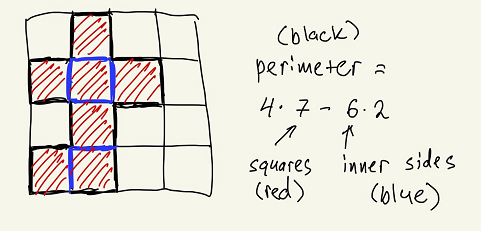

# [LeetCode - 200. Number of Islands](https://leetcode.com/problems/number-of-islands/)

#### Problem Description
> Given an `m x n` **2D** binary grid grid which represents a map of `'1'`s (land) and `'0'`s (water), return the _number_ _of_ _islands_.
>
> An **island** is surrounded by water and is formed by connecting adjacent lands horizontally or vertically. You may assume all four edges of the grid are all surrounded by water.
>

```
Example 1:

Input: grid = [
  ["1","1","1","1","0"],
  ["1","1","0","1","0"],
  ["1","1","0","0","0"],
  ["0","0","0","0","0"]
]

Output: 1


Example 2:

Input: grid = [
  ["1","1","0","0","0"],
  ["1","1","0","0","0"],
  ["0","0","1","0","0"],
  ["0","0","0","1","1"]
]

Output: 3
```

#### Solution Explanation
> **Top level overview (func numIslands):**
>
>  1. Iterate through each element in the grid.
>
>  2. At each element, `if grid[i][j] == "1"`:
>
> 	  * Increase our count of the number of islands (num_islands)
>
> 	  * Perform DFS starting at `grid[i][j]` to mark all the entire connected component as one island.
>
>
> **DFS overview (func dfs):**
>
> Given a grid and the starting row and column indices,
>
>  1. Change the value at `grid[r][c]` to "0" to mark this element as visited.
>
>  2. For each of its neighbor indices, if the neighbor is both within bounds of the grid and has a value of "1" (i.e. is part of the same island), peform dfs on that neighbor.
>

#### Complexity Analysis
> **Time complexity:** `O(M * N)`, M=number of rows and N=number of columns
>
> * In numIslands we look at every element in grid once, so `M * N`
>
> * In the worst case, a call of dfs from numIslands can look at every element if the whole grid is an island, so also `M * N`
>
> * `O(2M * N) = O(M * N)`
>
> **Space complexity:** `O(1)`
>
> * No additional space needed to store visited nodes since we update in-place
>

#### References:
[Youtube - Number Of Islands - Kevin Naughton Jr LeetCode Series](https://www.youtube.com/watch?v=o8S2bO3pmO4)

#### Difference between DFS and BFS Solutons:
  * In both solutions basically search all adjacent positions to a cell where you find a 1, 
  * The only difference is that you use a queue for BFS (iterative) and recursion for DFS, 
  * But you follow the same pattern of exhausting nearby positions that also have "land" on them (a 1 instead of a 0).

#### Solutions ( DFS and BFS )
```python
import unittest

class Solution(object):
    def is_valid(self, grid, r, c):
        m, n = len(grid), len(grid[0])
        if r < 0 or c < 0 or r >= m or c >= n:
            return False
        return True

    def numIslandsDFS(self, grid):
        """
        :type grid: List[List[str]]
        :rtype: int
        """
        if not grid or not grid[0]:
            return 0

        m, n = len(grid), len(grid[0])
        count = 0
        for i in xrange(m):
            for j in xrange(n):
                if grid[i][j] == '1':
                    self.dfs(grid, i, j)
                    count += 1
        return count

    def dfs(self, grid, r, c):
        grid[r][c] = '0'
        directions = [(0,1), (0,-1), (-1,0), (1,0)]
        for d in directions:
            nr, nc = r + d[0], c + d[1]    
            if self.is_valid(grid, nr, nc) and grid[nr][nc] == '1':
                self.dfs(grid, nr, nc)

    def numIslandsBFS(self, grid):
        """
        :type grid: List[List[str]]
        :rtype: int
        """
        if not grid or not grid[0]:
            return 0

        m, n = len(grid), len(grid[0])
        count = 0
        for i in xrange(m):
            for j in xrange(n):
                if grid[i][j] == '1':
                    self.bfs(grid, i, j)
                    count += 1
        return count

    def bfs(self, grid, r, c):
        queue = collections.deque()
        queue.append((r, c))
        grid[r][c] = '0'
        while queue:
            directions = [(0,1), (0,-1), (-1,0), (1,0)]
            r, c = queue.popleft()
            for d in directions:
                nr, nc = r + d[0], c + d[1]    
                if self.is_valid(grid, nr, nc) and grid[nr][nc] == '1':
                    queue.append((nr, nc))
                    grid[nr][nc] = '0'
					
class Test(unittest.TestCase):
    def setUp(self) -> None:
        pass

    def tearDown(self) -> None:
        pass

    def test_numIslands(self) -> None:
        sol = Solution()
        for grid, solution in (
            [
                [
                    ["1", "1", "1", "1", "0"],
                    ["1", "1", "0", "1", "0"],
                    ["1", "1", "0", "0", "0"],
                    ["0", "0", "0", "0", "0"],
                ],
                1,
            ],
            [
                [
                    ["1", "1", "0", "0", "0"],
                    ["1", "1", "0", "0", "0"],
                    ["0", "0", "1", "0", "0"],
                    ["0", "0", "0", "1", "1"],
                ],
                3,
            ],
        ):
            self.assertEqual(
                solution,
                sol.numIslandsDFS(grid),
                "Should determine the number of islands using DFS approach"
            )
            self.assertEqual(
                solution,
                sol.numIslandsBFS(grid),
                "Should determine the number of islands using BFS approach"
            )

# main
if __name__ == "__main__":
    unittest.main()
```

#### Solution ( Union Find with both path compression and union by rank )

```python
import unittest

class UnionFind:
    def __init__(self, grid):
        self.parents = {}
        self.rank = {}
        n, m = len(grid), len(grid[0])
        self.counts = sum([grid[i][j] == "1" for i in range(n) for j in range(m)])
        
    def union(self, p, q):
        i, j = self.find(p), self.find(q)

        if i != j:
            if self.rank[i] > self.rank[j]:
                self.parents[j] = i
                self.rank[i] += self.rank[j]
            else:
                self.parents[i] = j
                self.rank[j] += self.rank[i]

            self.counts -= 1         
        
    def add(self, p):
        if p not in self.parents:
            self.parents[p] = p
            self.rank[p] = 0
                
    def find(self, p):            
        if p != self.parents[p]:
            self.parents[p] = self.find(self.parents[p])

        return self.parents[p]

    def get_counts(self):
        return self.counts

class Solution:
    def numIslands(self, grid: List[List[str]]) -> int:
        if not grid or not grid[0]:
            return 0
        
        n, m = len(grid), len(grid[0])
        visited = set()
        ans = 0
        uf = UnionFind(grid)
        
        for i in range(n):
            for j in range(m):
                if grid[i][j] == "1":
                    uf.add((i, j))
                    
                    for x, y in [(1, 0), (-1, 0), (0, 1), (0, -1)]:
                        di = i + x
                        dj = j + y
                        
                        if di < 0 or di >= n or dj < 0 or dj >= m or grid[di][dj] == "0":
                            continue
                            
                        uf.add((di, dj))
                        uf.union((i, j), (di, dj))
        
        return uf.get_counts()

class Test(unittest.TestCase):
    def setUp(self) -> None:
        pass

    def tearDown(self) -> None:
        pass

    def test_numIslands(self) -> None:
        sol = Solution()
        for grid, solution in (
            [
                [
                    ["1", "1", "1", "1", "0"],
                    ["1", "1", "0", "1", "0"],
                    ["1", "1", "0", "0", "0"],
                    ["0", "0", "0", "0", "0"],
                ],
                1,
            ],
            [
                [
                    ["1", "1", "0", "0", "0"],
                    ["1", "1", "0", "0", "0"],
                    ["0", "0", "1", "0", "0"],
                    ["0", "0", "0", "1", "1"],
                ],
                3,
            ],
        ):
            self.assertEqual(
                solution,
                sol.numIslands(grid),
                "Should determine the number of islands using Union Find approach"
            )

# main
if __name__ == "__main__":
    unittest.main()
```

# [LeetCode - 695. Max Area of Island](https://leetcode.com/problems/max-area-of-island/)

#### Problem Description
> You are given an `m x n` binary matrix `grid`. An island is a group of `1`'s (representing land) connected **4-directionally** (horizontal or vertical.) You may assume all four edges of the grid are surrounded by water.
>
> The **area** of an island is the number of cells with a value `1` in the island.
>
> Return the _maximum_ **area** of an island in `grid`. If there is no island, return `0`.
>

```
# Examples

Example 1:

```
> 
>
```

Input: grid = [[0,0,1,0,0,0,0,1,0,0,0,0,0],[0,0,0,0,0,0,0,1,1,1,0,0,0],[0,1,1,0,1,0,0,0,0,0,0,0,0],[0,1,0,0,1,1,0,0,1,0,1,0,0],[0,1,0,0,1,1,0,0,1,1,1,0,0],[0,0,0,0,0,0,0,0,0,0,1,0,0],[0,0,0,0,0,0,0,1,1,1,0,0,0],[0,0,0,0,0,0,0,1,1,0,0,0,0]]
Output: 6
Explanation: The answer is not 11, because the island must be connected 4-directionally.

Example 2:

Input: grid = [[0,0,0,0,0,0,0,0]]
Output: 0
```

#### Solution Explanation
> **Idea:**
>
> So we can just use a simple iteration through the **grid** and look for islands. When we find an island, we can use a **recursive** helper function (**traverse**) to sum up all the connected pieces of land and **return** the total area of the island.
>
> As we traverse over the island, we can replace the **1**s with **0**s to prevent "finding" the same land twice. We can also keep track of the largest island found so far (**ans**), and after the **grid** has been fully traversed, we can **return ans**.
> 

#### Complexity Analysis
> ***Time Complexity: O(N * M)*** _where_ ***N*** _and_ ***M*** *are the lengths of the sides of the grid*
>
> ***Space Complexity: O(L)*** _where_ ***L*** *is the size of the largest island, representing the maximum* ***recursion stack***
>
>  * _or_ ***O(N * M + L)*** *if we create an* ***N * M*** *matrix in order to not modify the input*
>

#### Solution
```python
class Solution:
    def maxAreaOfIsland(self, grid: List[List[int]]) -> int:
        ans, n, m = 0, len(grid), len(grid[0])
        def trav(i: int, j: int) -> int:
            if i < 0 or j < 0 or i >= n or j >= m or grid[i][j] == 0: return 0
            grid[i][j] = 0
            return 1 + trav(i-1, j) + trav(i, j-1) + trav(i+1, j) + trav(i, j+1)
        for i, j in product(range(n), range(m)):
            if grid[i][j]: ans = max(ans, trav(i, j))
        return ans
```

# [LeetCode - 463. Island Perimeter](https://leetcode.com/problems/island-perimeter/)

#### Problem Description
> You are given `row x col grid` representing a map where `grid[i][j] = 1` represents land and `grid[i][j] = 0` represents water.
>
> Grid cells are connected *horizontally/vertically* (not diagonally). The `grid` is completely surrounded by water, and there is exactly one island (i.e., one or more connected land cells).
>
> The island doesn't have "lakes", meaning the water inside isn't connected to the water around the island. One cell is a square with side length 1. The grid is rectangular, width and height don't exceed 100. Determine the perimeter of the island.
>

```
# Examples:

Example 1:

```

```

Input: grid = [[0,1,0,0],[1,1,1,0],[0,1,0,0],[1,1,0,0]]
Output: 16
Explanation: The perimeter is the 16 yellow stripes in the image above.
Example 2:

Input: grid = [[1]]
Output: 4
Example 3:

Input: grid = [[1,0]]
Output: 4
```

#### Solution Explanation
> How we can evaluate perimeter of our island? We can evaluate perimeters off all squares first, and then subtract all sides of cells, which need to be removed, and that is all!
>
>  1. Perimeter of each cell is equal to `4`, so when we see non-empty cell, we add `4`.
>
>  2. For each non-empty cell with coordinates `(i,j)`, if `(i-1,j)` also non-empty, we need to subract `1` from our perimeter, which can be done with line `perimeter -= grid[i][j]*grid[i-1][j]`. Note, that for the case `1` `1`, we subtract `1` twice, so perimeter will be `4+4-1-1 = 6`, as it should be. Similar for other neibours of cell `(i,j)`.
>
> 
> 

#### Complexity Analysis
> **Time Complexity:** time complexity is `O(m*n)`, because we traverse our grid once and for each cell check `4` neighbors.
>
> **Space complexity:** is `O(1)`, because we do not use any extraspace, only `perimeter`.
>

#### Solution
```python
class Solution:
    def islandPerimeter(self, grid):
        m, n, perimeter = len(grid), len(grid[0]), 0

        for i in range(m):
            for j in range(n):
                perimeter += 4*grid[i][j]
                if i > 0:   perimeter -= grid[i][j]*grid[i-1][j]
                if i < m-1: perimeter -= grid[i][j]*grid[i+1][j]
                if j > 0:   perimeter -= grid[i][j]*grid[i][j-1]
                if j < n-1: perimeter -= grid[i][j]*grid[i][j+1]
                    
        return perimeter
```