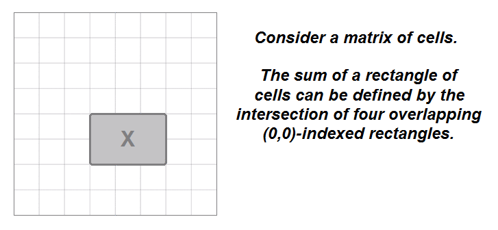
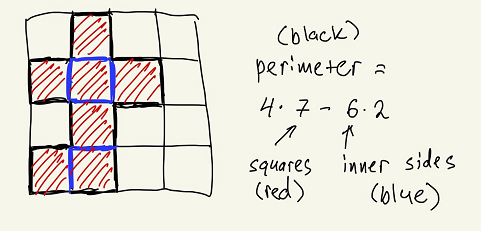

# FB Screening Interview - June 30th 2021

## Q1> Variant of [LeetCode - 304. Range Sum Query 2D - Immutable.](https://leetcode.com/problems/range-sum-query-2d-immutable/)

#### LeetCode Problem Description
> Given a 2D matrix matrix, handle multiple queries of the following type:
>
> Calculate the sum of the elements of matrix inside the rectangle defined by its upper left corner `(row1, col1)` and lower right corner `(row2, col2)`.
>
> Implement the NumMatrix class:
>
> `NumMatrix(int[][] matrix)` Initializes the object with the integer matrix matrix.
>
> `int sumRegion(int row1, int col1, int row2, int col2)` Returns the sum of the elements of matrix inside the rectangle 
> defined by its upper left corner `(row1, col1)` and lower right corner `(row2, col2)`.

#### Solution Explanation
> The sum of the rectangle `(0,0)->(i,j)` is equal to the cell `(i,j)`,
>
> plus the rectangle `(0,0)->(i,j-1)`, plus the rectangle `(0,0)->(i-1,j)`, 
>
> minus the rectangle `(0,0)->(i-1,j-1)`. We subtract the last rectangle 
>
> because it represents the overlap of the previous two rectangles that were added.
>
> 
>
> With this information, we can use a dynamic programming (DP) approach to build a prefix sum matrix (dp) from M iteratively, where dp[i][j] will represent the sum of the rectangle (0,0)->(i,j). We'll add an extra row and column in order to prevent out-of-bounds issues at i-1 and j-1 (similar to a prefix sum array), and we'll fill dp with 0s.
>
> At each cell, we'll add its value from M to the dp values of the cell on the left and the one above, which represent their respective rectangle sums, and then subtract from that the top-left diagonal value, which represents the overlapping rectangle of the previous two additions.
> 
> Then, we just reverse the process for sumRegion(): We start with the sum at dp[R2+1][C2+1] (due to the added row/column), then subtract the left and top rectangles before adding back in the doubly-subtracted top-left diagonal rectangle.
> 
> (Note: Even though the test cases will pass when using an int matrix for dp, the values of dp can range from -4e9 to 4e9 per the listed constraints, so we should use a data type capable of handling more than 32 bits.)
> 

#### References:
[Solution: Range Sum Query 2D - Immutable](https://dev.to/seanpgallivan/solution-range-sum-query-2d-immutable-9ic)

#### Complexity Analysis
> Time Complexity:
>
> constructor: O(M * N) where M and N are the dimensions of the input matrix
>
> sumRegion: O(1)
>
> ---
>
> Space Complexity:
>
> constructor: O(M * N) for the DP matrix
>
> constructor: O(1) if you're able to modify the input and use an in-place DP approach
>
> sumRegion: O(1)
>

#### My Interview Solution
```python
>>> from typing import List
>>> class NumMatrix(object):
      # TC: O(M*N)
      # SC: O(1)
      def __init__(self, matrix: List[List[int]]):
          if matrix is None or not matrix:
              return
          rows, cols = len(matrix), len(matrix[0])
          self.sums = [ [0 for j in range(cols+1)] for i in range(rows+1) ]
          for i in range(1, rows+1):
              for j in range(1, cols+1):
                  self.sums[i][j] = matrix[i-1][j-1] + self.sums[i][j-1] + self.sums[i-1][j] - self.sums[i-1][j-1]
    
      def sumRegion(self, row1: int, col1: int, row2: int, col2: int) -> int:
          row1, col1, row2, col2 = row1+1, col1+1, row2+1, col2+1
          print(f'self.sums[row2][col2] = {self.sums[row2][col2]}')
          print(f'self.sums[row2][col1-1] = {self.sums[row2][col1-1]}')
          print(f'self.sums[row1-1][col2] = {self.sums[row1-1][col2]}')
          print(f'self.sums[row1-1][col1-1] = {self.sums[row1-1][col1-1]}')
          return self.sums[row2][col2] - self.sums[row2][col1-1] - self.sums[row1-1][col2] + self.sums[row1-1][col1-1]

        
>>> numMatrix = NumMatrix2(matrix)
>>> numMatrix.sumRegion(2, 1, 4, 3)
self.sums[row2][col2] = 38
self.sums[row2][col1-1] = 14
self.sums[row1-1][col2] = 24
self.sums[row1-1][col1-1] = 8
8
```
 
#### [More Elegant Solution](https://leetcode.com/problems/range-sum-query-2d-immutable/discuss/1204283/Python-short-dp-explained)
```python
from itertools import product
from functools import lru_cache
from typing import List

class NumMatrix:
    def __init__(self, matrix: List[List[int]]):
        M, N = len(matrix), len(matrix[0])
        self.dp = [[0] * (N+1) for _ in range(M+1)] 
        for c, r in product(range(N), range(M)):
            self.dp[r+1][c+1] = matrix[r][c] + self.dp[r+1][c] + self.dp[r][c+1] - self.dp[r][c]
    
    @lru_cache(None)
    def sumRegion(self, row1: int, col1: int, row2: int, col2: int) -> int:
        print(f'self.dp[r2+1][c2+1] = {self.dp[r2+1][c2+1]}')
        print(f'self.dp[r1][c2+1] = {self.dp[r1][c2+1]}')
        print(f'self.dp[r2+1][c1] = {self.dp[r2+1][c1]}')
        print(f'self.dp[r1][c1] = {self.dp[r1][c1]}')
        return self.dp[r2+1][c2+1] - self.dp[r1][c2+1] - self.dp[r2+1][c1] + self.dp[r1][c1]
```

## Q2> Variant of [LeetCode - 200. Number of Islands](https://leetcode.com/problems/number-of-islands/) ... Similar to the question asked at [Facebook - Phone - Counts of Connected Islands](https://leetcode.com/discuss/interview-question/980711/facebook-phone-counts-of-connected-islands).

#### Similar Problem Description

> Given matrix with 0 as water and 1 as island, find the number of connected islands.
>
> If any island has another island in its proximity (all 4 adjacent vertex, diagonals not allowed), then they are connected.

```
# Examples:

[[0, 1, 0],
[0, 0, 0],
[0, 1, 0]]
Answer: 0 islands.

[[1, 1, 0],
[1, 1, 0],
[0, 1, 1]]
Answer: 6 islands are connected from top to bottom

[[0, 1, 1],
[1, 1, 0],
[0, 1, 1]]
Answer: 6 islands are connected from top to bottom.
```

#### My Interview Solution
```python
class Solution:
    def connected_islands(self, grid):
        if not grid:
            return 0
        
        num_connected, island_id = 0, 2
        
        for i in range(len(grid)):
            for j in range(len(grid[0])):
                if grid[i][j] == 1:
                    sz = self.dfs(grid, (i, j), island_id)
                    if island_id == 2:
                        num_connected += sz
                    island_id += 1
                    
        return num_connected if num_connected>1 else num_connected-1
        
        
    def dfs(self, grid, starting_point, island_id):
        r, c = starting_point
        grid[r][c] = island_id
        
        sz = 0
        
        for dx, dy in (0, 1), (0, -1), (1, 0), (-1, 0), (-1, 1), (1, 1), (1, -1), (-1, -1):
            nr = r + dy
            nc = c + dx
            
            if 0 <= nr < len(grid) and 0 <= nc < len(grid[0]) and grid[nr][nc] == 1:
                sz += self.dfs(grid, (nr, nc), island_id)
                                                     
        return sz + 1

>>> Solution().connected_islands([[0, 1, 0],[0, 0, 0],[0, 1, 0]])
0
>>> Solution().connected_islands([[1, 1, 0],[1, 1, 0],[0, 1, 1]])
6
>>> Solution().connected_islands([[0, 1, 1],[1, 1, 0],[0, 1, 1]])
6
```

---

## Similar problem(s) to Q1:

---

### [LeetCode - 303. Range Sum Query - Immutable](https://leetcode.com/problems/range-sum-query-immutable/)

#### Problem Description
> Given an integer array `nums`, handle multiple queries of the following type:
>
>   1. Calculate the **sum** of the elements of nums between indices `left` and `right` **inclusive** where `left <= right`.
> 
> Implement the `NumArray` class:
>
>   * `NumArray(int[] nums)` Initializes the object with the integer array `nums`.
>
>   * `int sumRange(int left, int right)` Returns the **sum** of the elements of `nums` between indices `left` and `right` **inclusive** (i.e. `nums[left] + nums[left + 1] + ... + nums[right]`). 
> 
```
Example 1:

Input
["NumArray", "sumRange", "sumRange", "sumRange"]
[[[-2, 0, 3, -5, 2, -1]], [0, 2], [2, 5], [0, 5]]
Output
[null, 1, -1, -3]

Explanation
NumArray numArray = new NumArray([-2, 0, 3, -5, 2, -1]);
numArray.sumRange(0, 2); // return (-2) + 0 + 3 = 1
numArray.sumRange(2, 5); // return 3 + (-5) + 2 + (-1) = -1
numArray.sumRange(0, 5); // return (-2) + 0 + 3 + (-5) + 2 + (-1) = -3
 

Constraints:
---------------------------
1 <= nums.length <= 104
-105 <= nums[i] <= 105
0 <= left <= right < nums.length
At most 104 calls will be made to sumRange.
```

#### Solution Explanation
> Hint:
>
> ---
>
> #1.
>
> Think of the concept of dynamic programming, and **look-up table**.
> 
> #2.
>
> Since **input array**, `nums`, is immutable, we can build a **prefix sum table** to **speed up range sum query** later.
>
> ---
>
> Recurrence relationship:
>
> Let `S` denotes the **prefix sum table**
>
> `S[ 0 ] = nums[ 0 ]`
>
> `S[ i ] = S[ i - 1 ] + nums[ i ]` for every `i = 1, 2, 3, ..., n`
>
> Range sum Query:
>
> `Query( i, j ) = S[ j ]`, if `i =0`
>
> `Query( i, j ) = S[ j ] - S[ i -1 ]`, otherwise.
>
> ---
>
> Algorithm:
>
> Step_#1:
>
> Build the prefix sum table based on recurrence relationship, during initialization in `O(n)`.
>
> Step_#2:
>
> Handle incoming range sum query by index lookup in prefix sum table, in `O(1)`.
>

#### Complexity Analysis
> **Time Complexity:** `O(n)` init and `O(1)` query.
>
> **Space Complexity:** `O(n)` for `prefix_sum` table.

#### References:
[OpenGenius: Prefix sum array](https://iq.opengenus.org/prefix-sum-array/)

#### Solution
```python
class NumArray:

    def __init__(self, nums: List[int]):
        
        self.size = len(nums)
        
        if self.size:
            # build prefix sum table when input nums is valid
            self.prefix_sum = [ 0 for _ in range(self.size) ]

            self.prefix_sum[0] = nums[0]
            
            # prefix_Sum[k] = nums[0] + ... + nums[k]
            # prefix_Sum[k] = prefix_Sum[k-1] + nums[k]
            for k in range(1,self.size):
                self.prefix_sum[k] = self.prefix_sum[k-1] + nums[k]
        

    def sumRange(self, i: int, j: int) -> int:
        
        # reject query with invalid index
        if self.size == 0 or i < 0 or i > j or j >= self.size:
            return 0
        
        # lookup table from prefix_Sum
        if i == 0:
            return self.prefix_sum[j]
        else:
            return self.prefix_sum[j]-self.prefix_sum[i-1]
```

### [LeetCode - 304. Range Sum Query 2D - Immutable](https://leetcode.com/problems/range-sum-query-2d-immutable/)

#### Problem Description
> Given a 2D matrix `matrix`, handle multiple queries of the following type:
>
> 1. Calculate the **sum** of the elements of `matrix` inside the rectangle defined by its **upper left corner** `(row1, col1)` and **lower right corner** `(row2, col2)`.
>
> Implement the NumMatrix class:
>
> * `NumMatrix(int[][] matrix)` Initializes the object with the integer matrix `matrix`.
>
> * `int sumRegion(int row1, int col1, int row2, int col2)` Returns the **sum** of the elements of matrix inside the rectangle defined by its **upper left corner** `(row1, col1)` and **lower right corner** `(row2, col2)`.
>
```
# Examples

Example 1:

```

```

Input
["NumMatrix", "sumRegion", "sumRegion", "sumRegion"]
[[[[3, 0, 1, 4, 2], [5, 6, 3, 2, 1], [1, 2, 0, 1, 5], [4, 1, 0, 1, 7], [1, 0, 3, 0, 5]]], [2, 1, 4, 3], [1, 1, 2, 2], [1, 2, 2, 4]]
Output
[null, 8, 11, 12]

Explanation
NumMatrix numMatrix = new NumMatrix([[3, 0, 1, 4, 2], [5, 6, 3, 2, 1], [1, 2, 0, 1, 5], [4, 1, 0, 1, 7], [1, 0, 3, 0, 5]]);
numMatrix.sumRegion(2, 1, 4, 3); // return 8 (i.e sum of the red rectangle)
numMatrix.sumRegion(1, 1, 2, 2); // return 11 (i.e sum of the green rectangle)
numMatrix.sumRegion(1, 2, 2, 4); // return 12 (i.e sum of the blue rectangle)
 

Constraints:

* m == matrix.length
* n == matrix[i].length
* 1 <= m, n <= 200
* -105 <= matrix[i][j] <= 105
* 0 <= row1 <= row2 < m
* 0 <= col1 <= col2 < n
* At most 104 calls will be made to sumRegion.
```

#### Solution Explanation
> The sum of the rectangle `(0,0)->(i,j)` is equal to the cell `(i,j)`,
>
> plus the rectangle `(0,0)->(i,j-1)`, plus the rectangle `(0,0)->(i-1,j)`, 
>
> minus the rectangle `(0,0)->(i-1,j-1)`. We subtract the last rectangle 
>
> because it represents the overlap of the previous two rectangles that were added.
>
> 
>
> With this information, we can use a dynamic programming (DP) approach to build a prefix sum matrix (dp) from M iteratively, where dp[i][j] will represent the sum of the rectangle (0,0)->(i,j). We'll add an extra row and column in order to prevent out-of-bounds issues at i-1 and j-1 (similar to a prefix sum array), and we'll fill dp with 0s.
>
> At each cell, we'll add its value from M to the dp values of the cell on the left and the one above, which represent their respective rectangle sums, and then subtract from that the top-left diagonal value, which represents the overlapping rectangle of the previous two additions.
> 
> Then, we just reverse the process for sumRegion(): We start with the sum at dp[R2+1][C2+1] (due to the added row/column), then subtract the left and top rectangles before adding back in the doubly-subtracted top-left diagonal rectangle.
> 
> (Note: Even though the test cases will pass when using an int matrix for dp, the values of dp can range from -4e9 to 4e9 per the listed constraints, so we should use a data type capable of handling more than 32 bits.)
> 

#### Complexity Analysis
> Time Complexity:
>
> constructor: O(M * N) where M and N are the dimensions of the input matrix
>
> sumRegion: O(1)
>
> ---
>
> Space Complexity:
>
> constructor: O(M * N) for the DP matrix
>
> constructor: O(1) if you're able to modify the input and use an in-place DP approach
>
> sumRegion: O(1)
>

#### References:
[Solution: Range Sum Query 2D - Immutable](https://dev.to/seanpgallivan/solution-range-sum-query-2d-immutable-9ic)

#### Solution
```python
```python
from typing import List
class NumMatrix(object):
    # TC: O(M*N)
    # SC: O(1)
    def __init__(self, matrix: List[List[int]]):
        if matrix is None or not matrix:
            return
        rows, cols = len(matrix), len(matrix[0])
        self.sums = [ [0 for j in range(cols+1)] for i in range(rows+1) ]
        for i in range(1, rows+1):
            for j in range(1, cols+1):
                self.sums[i][j] = matrix[i-1][j-1] + self.sums[i][j-1] + self.sums[i-1][j] - self.sums[i-1][j-1]
    
    def sumRegion(self, row1: int, col1: int, row2: int, col2: int) -> int:
        row1, col1, row2, col2 = row1+1, col1+1, row2+1, col2+1
        print(f'self.sums[row2][col2] = {self.sums[row2][col2]}')
        print(f'self.sums[row2][col1-1] = {self.sums[row2][col1-1]}')
        print(f'self.sums[row1-1][col2] = {self.sums[row1-1][col2]}')
        print(f'self.sums[row1-1][col1-1] = {self.sums[row1-1][col1-1]}')
        return self.sums[row2][col2] - self.sums[row2][col1-1] - self.sums[row1-1][col2] + self.sums[row1-1][col1-1]

if __name__ == "__main__":  
    numMatrix = NumMatrix(matrix)
    numMatrix.sumRegion(2, 1, 4, 3)
	# Output:
	#self.sums[row2][col2] = 38       (A)
	#self.sums[row2][col1-1] = 14    -(B)
	#self.sums[row1-1][col2] = 24    -(C)
	#self.sums[row1-1][col1-1] = 8   +(D)
	#8                                (X)
	#
	# where, 8 = 38 - 14 - 24 + 8
	#        X = A  - B  -  C + D

#
# 
# More Elegant Solution
#
#

from itertools import product
from functools import lru_cache
from typing import List

class NumMatrix:
    def __init__(self, matrix: List[List[int]]):
        M, N = len(matrix), len(matrix[0])
        self.dp = [[0] * (N+1) for _ in range(M+1)] 
        for c, r in product(range(N), range(M)):
            self.dp[r+1][c+1] = matrix[r][c] + self.dp[r+1][c] + self.dp[r][c+1] - self.dp[r][c]
    
    @lru_cache(None)
    def sumRegion(self, row1: int, col1: int, row2: int, col2: int) -> int:
        print(f'self.dp[r2+1][c2+1] = {self.dp[r2+1][c2+1]}')
        print(f'self.dp[r1][c2+1] = {self.dp[r1][c2+1]}')
        print(f'self.dp[r2+1][c1] = {self.dp[r2+1][c1]}')
        print(f'self.dp[r1][c1] = {self.dp[r1][c1]}')
        return self.dp[r2+1][c2+1] - self.dp[r1][c2+1] - self.dp[r2+1][c1] + self.dp[r1][c1]

if __name__ == "__main__":  
    numMatrix = NumMatrix(matrix)
    numMatrix.sumRegion(2, 1, 4, 3)
	# Output:
	#self.sums[row2][col2] = 38       (A)
	#self.sums[row2][col1-1] = 14    -(B)
	#self.sums[row1-1][col2] = 24    -(C)
	#self.sums[row1-1][col1-1] = 8   +(D)
	#8                                (X)
	#
	# where, 8 = 38 - 14 - 24 + 8
	#        X = A  - B  -  C + D
```

### [LeetCode - 1352. Product of the Last K Numbers](https://leetcode.com/problems/product-of-the-last-k-numbers/)

#### Problem Description
> Implement the class `ProductOfNumbers` that supports two methods:
>
> 1. `add(int num)`
>
>  * Adds the number `num` to the back of the current list of numbers.
>
> 2. `getProduct(int k)`
>
>  * Returns the product of the last `k` numbers in the current list.
>
>  * You can assume that always the current list has **at least** `k` numbers.
>
> At any time, the product of any contiguous sequence of numbers will fit into a single 32-bit integer without overflowing.
>
>
```
Example:

Input
["ProductOfNumbers","add","add","add","add","add","getProduct","getProduct","getProduct","add","getProduct"]
[[],[3],[0],[2],[5],[4],[2],[3],[4],[8],[2]]

Output
[null,null,null,null,null,null,20,40,0,null,32]

Explanation
ProductOfNumbers productOfNumbers = new ProductOfNumbers();
productOfNumbers.add(3);        // [3]
productOfNumbers.add(0);        // [3,0]
productOfNumbers.add(2);        // [3,0,2]
productOfNumbers.add(5);        // [3,0,2,5]
productOfNumbers.add(4);        // [3,0,2,5,4]
productOfNumbers.getProduct(2); // return 20. The product of the last 2 numbers is 5 * 4 = 20
productOfNumbers.getProduct(3); // return 40. The product of the last 3 numbers is 2 * 5 * 4 = 40
productOfNumbers.getProduct(4); // return 0. The product of the last 4 numbers is 0 * 2 * 5 * 4 = 0
productOfNumbers.add(8);        // [3,0,2,5,4,8]
productOfNumbers.getProduct(2); // return 32. The product of the last 2 numbers is 4 * 8 = 32 
 

Constraints:

 * There will be at most 40000 operations considering both add and getProduct.
 * 0 <= num <= 100
 * 1 <= k <= 40000
```

#### Solution Explanation
> * If we meet `0`, the product including this `0` will always be `0`.
>
> * We only need to record the prefix product after it.
>
> * So I clear the `A` and reinitialize it as `[1]`,
>
> where, `1` is the neutral element of multiplication.

#### Complexity Analysis
> **Time Complexity:** `O(1)` each for `add` and `getProduct`
>
> **Space Complexity:** `O(N)` for the `A` array.
>

#### Solution
```python
class ProductOfNumbers:

    def __init__(self):
        self.A = [1]

    def add(self, num: int) -> None:
        if num == 0:
            self.A = [1]
        else:
            self.A.append(self.A[-1] * a)

    def getProduct(self, k: int) -> int:
        if k >= len(self.A): return 0
        return self.A[-1] / self.A[-k - 1]

# Your ProductOfNumbers object will be instantiated and called as such:
# obj = ProductOfNumbers()
# obj.add(num)
# param_2 = obj.getProduct(k)
```

---

## Similar problem(s) to Q2:

---

### [LeetCode - 200. Number of Islands](https://leetcode.com/problems/number-of-islands/)

#### Problem Description
> Given an `m x n` **2D** binary grid grid which represents a map of `'1'`s (land) and `'0'`s (water), return the _number_ _of_ _islands_.
>
> An **island** is surrounded by water and is formed by connecting adjacent lands horizontally or vertically. You may assume all four edges of the grid are all surrounded by water.
>

```
Example 1:

Input: grid = [
  ["1","1","1","1","0"],
  ["1","1","0","1","0"],
  ["1","1","0","0","0"],
  ["0","0","0","0","0"]
]

Output: 1


Example 2:

Input: grid = [
  ["1","1","0","0","0"],
  ["1","1","0","0","0"],
  ["0","0","1","0","0"],
  ["0","0","0","1","1"]
]

Output: 3
```

#### Solution Explanation
> **Top level overview (func numIslands):**
>
>  1. Iterate through each element in the grid.
>
>  2. At each element, `if grid[i][j] == "1"`:
>
> 	  * Increase our count of the number of islands (num_islands)
>
> 	  * Perform DFS starting at `grid[i][j]` to mark all the entire connected component as one island.
>
>
> **DFS overview (func dfs):**
>
> Given a grid and the starting row and column indices,
>
>  1. Change the value at `grid[r][c]` to "0" to mark this element as visited.
>
>  2. For each of its neighbor indices, if the neighbor is both within bounds of the grid and has a value of "1" (i.e. is part of the same island), peform dfs on that neighbor.
>

#### Complexity Analysis
> **Time complexity:** `O(M * N)`, M=number of rows and N=number of columns
>
> * In numIslands we look at every element in grid once, so `M * N`
>
> * In the worst case, a call of dfs from numIslands can look at every element if the whole grid is an island, so also `M * N`
>
> * `O(2M * N) = O(M * N`
>
> **Space complexity:** `O(1)`
>
> * No additional space needed to store visited nodes since we update in-place
>

#### References:
[Youtube - Number Of Islands - Kevin Naughton Jr LeetCode Series](https://www.youtube.com/watch?v=o8S2bO3pmO4)

#### Solution
```python
import unittest

# DFS and BFS Solutions
class Solution(object):
    def numIslands(self, grid):
        """
        :type grid: List[List[str]]
        :rtype: int
        """
        num_islands = 0
        for i in range(len(grid)):
            for j in range(len(grid[0])):
                if grid[i][j] == "1":
                    num_islands += 1
                    self.dfs(grid, i, j)
                    
        return num_islands
    
    def dfs(self, grid, r, c):
        grid[r][c] = "0"
        for dr, dc in [(-1,0), (1,0), (0,-1), (0,1)]:
            nr = r + dr
            nc = c + dc
            if 0 <= nr < len(grid) and 0 <= nc < len(grid[0]) and grid[nr][nc] == "1":
                self.dfs(grid, nr, nc)

class Test(unittest.TestCase):
    def setUp(self) -> None:
        pass

    def tearDown(self) -> None:
        pass

    def test_numIslands(self) -> None:
        sol = Solution()
        for grid, solution in (
            [
                [
                    ["1", "1", "1", "1", "0"],
                    ["1", "1", "0", "1", "0"],
                    ["1", "1", "0", "0", "0"],
                    ["0", "0", "0", "0", "0"],
                ],
                1,
            ],
            [
                [
                    ["1", "1", "0", "0", "0"],
                    ["1", "1", "0", "0", "0"],
                    ["0", "0", "1", "0", "0"],
                    ["0", "0", "0", "1", "1"],
                ],
                3,
            ],
        ):
            self.assertEqual(
                solution,
                sol.numIslands(grid),
                "Should determine the number of islands using DFS approach"
            )

# main
if __name__ == "__main__":
    unittest.main()
```

### [LeetCode - 695. Max Area of Island](https://leetcode.com/problems/max-area-of-island/)

#### Problem Description
> You are given an `m x n` binary matrix `grid`. An island is a group of `1`'s (representing land) connected **4-directionally** (horizontal or vertical.) You may assume all four edges of the grid are surrounded by water.
>
> The **area** of an island is the number of cells with a value `1` in the island.
>
> Return the _maximum_ **area** of an island in `grid`. If there is no island, return `0`.
>

```
# Examples

Example 1:

```
> 
>
```

Input: grid = [[0,0,1,0,0,0,0,1,0,0,0,0,0],[0,0,0,0,0,0,0,1,1,1,0,0,0],[0,1,1,0,1,0,0,0,0,0,0,0,0],[0,1,0,0,1,1,0,0,1,0,1,0,0],[0,1,0,0,1,1,0,0,1,1,1,0,0],[0,0,0,0,0,0,0,0,0,0,1,0,0],[0,0,0,0,0,0,0,1,1,1,0,0,0],[0,0,0,0,0,0,0,1,1,0,0,0,0]]
Output: 6
Explanation: The answer is not 11, because the island must be connected 4-directionally.

Example 2:

Input: grid = [[0,0,0,0,0,0,0,0]]
Output: 0
```

#### Solution Explanation
> **Idea:**
>
> So we can just use a simple iteration through the **grid** and look for islands. When we find an island, we can use a **recursive** helper function (**traverse**) to sum up all the connected pieces of land and **return** the total area of the island.
>
> As we traverse over the island, we can replace the **1**s with **0**s to prevent "finding" the same land twice. We can also keep track of the largest island found so far (**ans**), and after the **grid** has been fully traversed, we can **return ans**.
> 

#### Complexity Analysis
> ***Time Complexity: O(N * M)*** _where_ ***N*** _and_ ***M*** *are the lengths of the sides of the grid*
>
> ***Space Complexity: O(L)*** _where_ ***L*** *is the size of the largest island, representing the maximum* ***recursion stack***
>
>  * _or_ ***O(N * M + L)*** *if we create an* ***N * M*** *matrix in order to not modify the input*
>

#### Solution
```python
class Solution:
    def maxAreaOfIsland(self, grid: List[List[int]]) -> int:
        ans, n, m = 0, len(grid), len(grid[0])
        def trav(i: int, j: int) -> int:
            if i < 0 or j < 0 or i >= n or j >= m or grid[i][j] == 0: return 0
            grid[i][j] = 0
            return 1 + trav(i-1, j) + trav(i, j-1) + trav(i+1, j) + trav(i, j+1)
        for i, j in product(range(n), range(m)):
            if grid[i][j]: ans = max(ans, trav(i, j))
        return ans
```

### [LeetCode - 463. Island Perimeter](https://leetcode.com/problems/island-perimeter/)

#### Problem Description
> You are given `row x col grid` representing a map where `grid[i][j] = 1` represents land and `grid[i][j] = 0` represents water.
>
> Grid cells are connected *horizontally/vertically* (not diagonally). The `grid` is completely surrounded by water, and there is exactly one island (i.e., one or more connected land cells).
>
> The island doesn't have "lakes", meaning the water inside isn't connected to the water around the island. One cell is a square with side length 1. The grid is rectangular, width and height don't exceed 100. Determine the perimeter of the island.
>

```
# Examples:

Example 1:

```

```

Input: grid = [[0,1,0,0],[1,1,1,0],[0,1,0,0],[1,1,0,0]]
Output: 16
Explanation: The perimeter is the 16 yellow stripes in the image above.
Example 2:

Input: grid = [[1]]
Output: 4
Example 3:

Input: grid = [[1,0]]
Output: 4
```

#### Solution Explanation
> How we can evaluate perimeter of our island? We can evaluate perimeters off all squares first, and then subtract all sides of cells, which need to be removed, and that is all!
>
>  1. Perimeter of each cell is equal to `4`, so when we see non-empty cell, we add `4`.
>
>  2. For each non-empty cell with coordinates `(i,j)`, if `(i-1,j)` also non-empty, we need to subract `1` from our perimeter, which can be done with line `perimeter -= grid[i][j]*grid[i-1][j]`. Note, that for the case `1` `1`, we subtract `1` twice, so perimeter will be `4+4-1-1 = 6`, as it should be. Similar for other neibours of cell `(i,j)`.
>
> 
> 

#### Complexity Analysis
> **Time Complexity:** time complexity is `O(m*n)`, because we traverse our grid once and for each cell check `4` neighbors.
>
> **Space complexity:** is `O(1)`, because we do not use any extraspace, only `perimeter`.
>

#### Solution
```python
class Solution:
    def islandPerimeter(self, grid):
        m, n, perimeter = len(grid), len(grid[0]), 0

        for i in range(m):
            for j in range(n):
                perimeter += 4*grid[i][j]
                if i > 0:   perimeter -= grid[i][j]*grid[i-1][j]
                if i < m-1: perimeter -= grid[i][j]*grid[i+1][j]
                if j > 0:   perimeter -= grid[i][j]*grid[i][j-1]
                if j < n-1: perimeter -= grid[i][j]*grid[i][j+1]
                    
        return perimeter
```