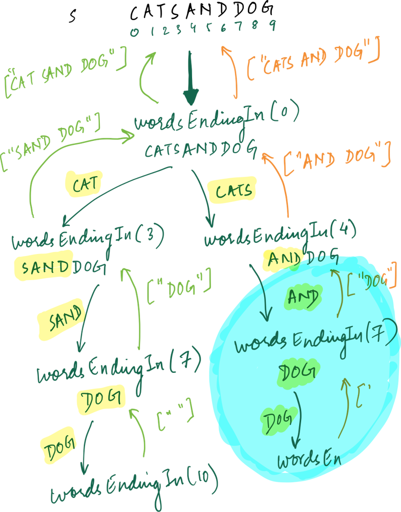
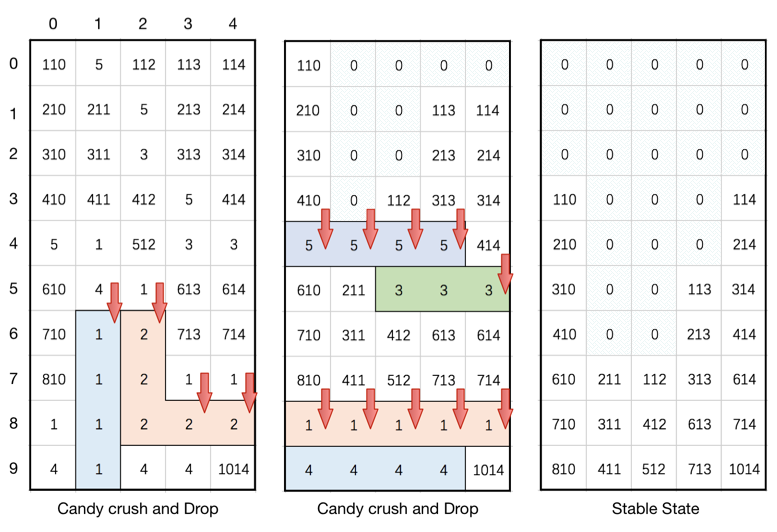
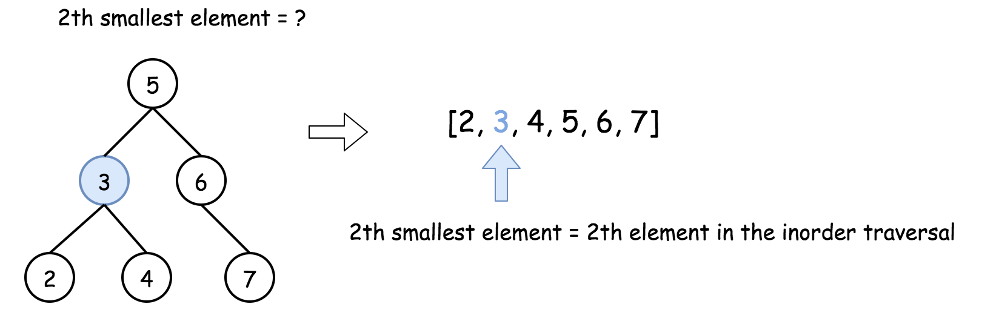
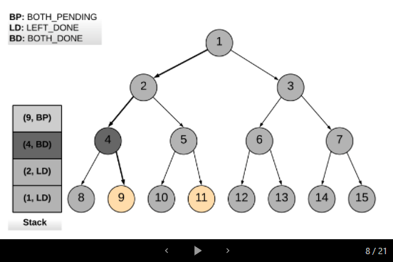

# facebook_interview_prep_2021
## Facebook Interview Process Explained
* [Hacking the Facebook Interview Process](https://candor.co/articles/interview-prep/hacking-the-facebook-interview-process)
* [Preparing for your Software Engineering Interview at Facebook](https://www.facebook.com/careers/life/preparing-for-your-software-engineering-interview-at-facebook/)

## Facebook - Interview Stages
* Stage 1 - Initial Technical Screen
1. Introductions
2. Discussion of Career Aspirations
3. Coding
4. Questions


* Stage 2 - Onsite Interview
1. Coding Interview
2. Design Interview
3. Behavioral Interview
4. Questions


## Facebook - 5 Core Values
1. Be Bold
2. Focus on Impact
3. Move Fast
4. Be Open
5. Build Social Value

## Tips for the Interview
* Familiarize yourself with our 5 core values (move fast, be bold, focus on impact, be open, and build social value). This is how we work together to make the world more open and connected. We look for people who believe in these values and practice them daily.
* Be yourself! Be open and honest about your successes and failures.
* Be humble and focus on team work, leadership and mentorship qualities.

## Important Resources
* [Facebook Phone Interview Questions](https://leetcode.com/discuss/interview-question/790428/Facebook-Phone-Interview-Questions)
* [Facebook interview experiences - All Combined from LC - Till Date 07-Jun-2020](https://leetcode.com/discuss/general-discussion/675445/facebook-interview-experiences-all-combined-from-lc-till-date-07-jun-2020)
* [Facebook Interviews](https://leetcode.com/list/xyvbjku7/)
* [FB-Phone-Interview-List](https://leetcode.com/list/5h1lvmem/)
* [Cracking the top 40 Facebook coding interview questions](https://www.educative.io/blog/cracking-top-facebook-coding-interview-questions)
* [Facebook Interview Questions and Answers](https://hackr.io/blog/facebook-interview-questions)
* [Import and Useful Links from all over the LeetCode](https://leetcode.com/discuss/general-discussion/665604/important-and-useful-links-from-all-over-the-leetcode)

## Study Links
* [DP - Idea of Dynamic Programming](https://afteracademy.com/blog/idea-of-dynamic-programming)
* [DP - Optimal Substructure and Overlapping Subproblems](https://afteracademy.com/blog/optimal-substructure-and-overlapping-subproblems)

## Data_Structure Deep-Dives
* [Heap](https://leetcode.com/discuss/general-discussion/1127238/master-heap-by-solving-23-questions-in-4-patterns-category)

## Algorithm Deep-Dives
* [Dynamic_Programming](https://leetcode.com/discuss/general-discussion/475924/my-experience-and-notes-for-learning-dp)
* [Dynamic_Programming_from_good_to_great](https://leetcode.com/problems/house-robber/discuss/156523/From-good-to-great.-How-to-approach-most-of-DP-problems.)
* [Dynamic_Programming_Patterns-MUST-READ](https://leetcode.com/discuss/general-discussion/458695/dynamic-programming-patterns)

## 1. Phone Screen:
| No. | LC-#     | Title	                                                                                                 | url                                                                                        | Time                                                       | Space                 | Difficulty | Data_Structure | Algorithm                    | Premium    |
| --- | -------- | --------------------------------------------------------------------------------------------------------- | ------------------------------------------------------------------------------------------ | ---------------------------------------------------------- | --------------------- | ---------- | -------------- | ---------------------------- | ---------- |
| 1   | 238      | [Product of Array Except Self](https://github.com/sm2774us/facebook_interview_prep_2021#lc-238product-of-array-except-self)                                       | https://leetcode.com/problems/product-of-array-except-self/                                | _O(n)_                                                     | _O(1)_                | Medium     | Array          |                              |            |
| 2   | 1428     | [Leftmost Column with at Least a One](https://github.com/sm2774us/facebook_interview_prep_2021#lc-1428leftmost-column-with-at-least-a-one)                        | https://leetcode.com/problems/leftmost-column-with-at-least-a-one/                         | _O(R+C)_ or _O(N+M)_ [ RxC matrix or N*M matrix ]          | _O(1)_                | Medium     | Array/Matrix   | Binary Search                | 🔒         |
| 3   |          | [Leftmost Column Index of 1](#leftmost-column-index-of-1) { Similar to LC-1428 }                          | https://leetcode.com/discuss/interview-question/341247/facebook-leftmost-column-index-of-1 | _O(R*log(C)_ or _O(N*log(M))_ [ RxC matrix or N*M matrix ] | _O(1)_                | Medium     | Array/Matrix   | Binary Search                |            |
| 4   | 240      | [Search a 2D Matrix II](https://github.com/sm2774us/facebook_interview_prep_2021#lc-240search-a-2d-matrix-ii)                                                     | https://leetcode.com/problems/search-a-2d-matrix-ii                                        | _O(M+N)_                                                   | _O(1)_                | Medium     | Array          |                              |            |
| 5   | 759      | [Employee Free Time](https://github.com/sm2774us/facebook_interview_prep_2021#lc-759employee-free-time)                                                           | https://leetcode.com/problems/employee-free-time/                                          | _O(m * log(n))_                                            | _O(n)_                | Hard       | Heap/Priority Queue | Greedy                  | 🔒         |
| 6   |          | [Lowest Common Ancestor When Root Node Is Not Known-GeeksforGeeks](#lowest-common-ancestor-when-root-node-is-not-known-GeeksforGeeks) | https://www.geeksforgeeks.org/lowest-common-ancestor-in-a-binary-tree-set-2-using-parent-pointer/ | _O(h)_                                              | _O(1)_                | Medium     | Binary Tree    |                              |            |
| 7   | 560      | [Subarray Sum Equals K](https://github.com/sm2774us/facebook_interview_prep_2021#lc-560subarray-sum-equals-k)                                                     | https://leetcode.com/problems/subarray-sum-equals-k/                                       | _O(n)_                                                     | _O(n)_                | Medium     | Array          | DP ; Prefix Sum              |            |
| 8   | 138      | [Copy List with Random Pointer](https://github.com/sm2774us/facebook_interview_prep_2021#lc-138copy-list-with-random-pointer)                                     | https://leetcode.com/problems/copy-list-with-random-pointer/                               | _O(n)_                                                     | _O(1)_                | Medium     | Linked List    |                              |            |
| 9   | 297      | [Serialize and Deserialize Binary Tree](https://github.com/sm2774us/facebook_interview_prep_2021#lc-297serialize-and-deserialize-binary-tree)                     | https://leetcode.com/problems/serialize-and-deserialize-binary-tree/                       | _O(n)_                                                     | _O(n)_                | Hard       | Tree           | Level Order Traversal ; DFS ; BFS |            |
| 10  | 428      | [Serialize and Deserialize N-ary Tree](https://github.com/sm2774us/facebook_interview_prep_2021#lc-428serialize-and-deserialize-n-ary-tree)                       | https://leetcode.com/problems/serialize-and-deserialize-n-ary-tree/                        | _O(n)_                                                     | _O(h)_                | Hard       | Tree           | Binary Serailzation ; DFS-Recursive ; BFS | 🔒  |
| 11  | 139      | [Word Break](https://github.com/sm2774us/facebook_interview_prep_2021#lc-139word-break)                                                                           | https://leetcode.com/problems/word-break/                                                  | _O(n^2)_                                                   | _O(n)_                | Medium     |                | DP                           |            |
| 12  | 140      | [Word Break II](https://github.com/sm2774us/facebook_interview_prep_2021#lc-140word-break-ii)                                                                     | https://leetcode.com/problems/word-break-ii/                                               | _O(n^2)_                                                   | _O(n^2)_              | Hard       |                | DP ; DFS                     |            |
| 13  | 261      | [Graph Valid Tree](https://github.com/sm2774us/facebook_interview_prep_2021#lc-261graph-valid-tree)                                                               | https://leetcode.com/problems/graph-valid-tree/                                            | _O(\|V\| + \|E\|)_                                         | _O(\|V\| + \|E\|)_    | Medium     | Graph          | BFS ; DFS ; UnionFind        | 🔒         |
| 14  | 98       | [Validate Binary Search Tree](https://github.com/sm2774us/facebook_interview_prep_2021#lc-98validate-binary-search-tree)                                          | https://leetcode.com/problems/validate-binary-search-tree/                                 | _O(N)_                                                     | _O(1)_                | Medium     | Tree           | Morris Traversal             |            |
| 15  |          | [Google And Facebook:Validate Single Binary Tree](#google-and-facebookvalidate-single-binary-tree)     | https://leetcode.com/discuss/interview-question/347374/                                    | _O(N)_                                                     | _O(N)_                | Medium     | Tree           |                              |            |
| 16  | 621      | [Task Scheduler](https://github.com/sm2774us/facebook_interview_prep_2021#lc-621task-schduler)                                                                    | https://leetcode.com/problems/task-scheduler/                                              | _O(N * n)_ where, N=number_of_tasks , n=cool_off_period    | _O(1)_                | Medium     | Heap/Priority Queue | Greedy                  |            |
| 17  |          | [FB Phone Interview - Variant of Task Scheduler](#fb-phone-interviewtask-scheduler-variant)               | https://leetcode.com/discuss/interview-question/673575/Facebook-or-Phone-or-Task-Scheduler | _O(N)_                                                     | _O(N)_                | Medium     |                | Greedy                       |            |
| 18  | 494      | [Target Sum](https://github.com/sm2774us/facebook_interview_prep_2021#lc-494target-sum)                                                                           | https://leetcode.com/problems/target-sum/                                                  | _O(|nums|*(Upperbound of Sum - Lowerbound of Sum))_        | _O(|nums|*(Upperbound of Sum - Lowerbound of Sum))_ | Medium | | DP                |            |
| 19  | 22       | [Generate Parentheses](https://github.com/sm2774us/facebook_interview_prep_2021#lc-22generate-parenetheses)                                                       | https://leetcode.com/problems/generate-parentheses/                                        | _O( 4^n / (n^ 1/2) )_                                      | _O( 4^n / (n^ 1/2) )_  | Medium    |                | Backtracking ; Catalan Numbers |          |
| 20  | 400      | [Nth Digit](https://github.com/sm2774us/facebook_interview_prep_2021#lc-400nth-digit)                                                                             | https://leetcode.com/problems/nth-digit/                                                   | _O(logn)_                                                  | _O(1)_                | Easy       |                | Binary Search                |            |
| 21  | 380      | [Insert Delete GetRandom O(1)](https://github.com/sm2774us/facebook_interview_prep_2021#lc-380insert-delete-getrandom-o1)                                         | https://leetcode.com/problems/insert-delete-getrandom-o1/                                  | _O(1)_                                                     | _O(n)_                | Hard       |                |                              |            |
| 22  | 381      | [Insert Delete GetRandom O(1) - Duplicates allowed](https://github.com/sm2774us/facebook_interview_prep_2021#lc-381insert-delete-getrandom-o1-duplicates-allowed) | https://leetcode.com/problems/insert-delete-getrandom-o1-duplicates-allowed/               | _O(1)_                                                     | _O(n)_                | Hard       |                |                              |            |
| 23  | 721      | [Accounts Merge](https://github.com/sm2774us/facebook_interview_prep_2021#lc-721accounts-merge)                                                                   | https://leetcode.com/problems/accounts-merge/                                              | _O(nlogn)_                                                 | _O(n)_                | Medium     |                | Union Find                   |            |
| 24  | 408      | [Valid Word Abbreviation](https://github.com/sm2774us/facebook_interview_prep_2021#lc-408valid-word-abbreviation)                                                 | https://leetcode.com/problems/valid-word-abbreviation/                                     | _O(n)_                                                     | _O(1)_                | Easy       |                |                              | 🔒         |
| 25  | 723      | [Candy Crush](https://github.com/sm2774us/facebook_interview_prep_2021#lc-723candy-crush)                                                                         | https://leetcode.com/problems/candy-crush/                                                 | _O((R * C)^2)_                                             | _O(1)_                | Medium     |                |                              |            |
| 26  | 875      | [Koko Eating Bananas](https://github.com/sm2774us/facebook_interview_prep_2021#lc-875koko-eating-bananas)                                                         | https://leetcode.com/problems/koko-eating-bananas/                                         | _O(nlogr)_                                                 | _O(1)_                | Medium     |                |                              |            |
| 27  | 199      | [Binary Tree Right Side View](https://github.com/sm2774us/facebook_interview_prep_2021#lc-199binary-tree-right-side-view)                                         | https://leetcode.com/problems/binary-tree-right-side-view/                                 | _O(n)_                                                     | _O(h)_                | Medium     |                |                              |            |
| 28  | 93       | [Restore IP Addresses](https://github.com/sm2774us/facebook_interview_prep_2021#lc-93restore-ip-addresses)                                                        | https://leetcode.com/problems/restore-ip-addresses/                                       | _O(1)_                                                     | _O(1)_                | Medium     |                |                              |            |
| 29  | 50       | [Pow(x, n)](https://github.com/sm2774us/facebook_interview_prep_2021#lc-50powx-n)                                                                                | https://leetcode.com/problems/powx-n/                                                      | _O(1)_                                                     | _O(1)_                | Medium     |                |                              |            |
| 30  | 354      | [Russian Doll Envelopes](https://github.com/sm2774us/facebook_interview_prep_2021#lc-354russian-doll-envelopes)                                                   | https://leetcode.com/problems/russian-doll-envelopes/                                      | _O(nlogn)_                                                 | _O(1)_                | Hard       |                |                              |            |
| 31  | 286      | [Walls and Gates](https://github.com/sm2774us/facebook_interview_prep_2021#lc-286walls-and-gates)                                                                 | https://leetcode.com/problems/walls-and-gates/                                             | _O(m * n)_                                                 | _O(g)_                | Medium     |                |                              | 🔒         |
| 32  | 121      | [Best Time to Buy and Sell Stock](https://github.com/sm2774us/facebook_interview_prep_2021#lc-121best-time-to-buy-and-sell-stock)                                 | https://leetcode.com/problems/best-time-to-buy-and-sell-stock/                             | _O(n)_                                                     | _O(1)_                | Easy       |                |                              |            |
| 33  | 515      | [Find Largest Value in Each Tree Row](https://github.com/sm2774us/facebook_interview_prep_2021#lc-515find-largest-value-in-each-tree-row)                         | https://leetcode.com/problems/find-largest-value-in-each-tree-row/                         | _O(n)_                                                     | _O(h)_                | Medium     |                |                              |            |
| 34  | 415      | [Add Strings](https://github.com/sm2774us/facebook_interview_prep_2021#lc-415add-strings)                                                                         | https://leetcode.com/problems/add-strings/                                                 | _O(n)_                                                     | _O(1)_                | Easy       |                |                              |            |
| 35  | 39       | [Combination Sum](https://github.com/sm2774us/facebook_interview_prep_2021#lc-39combination-sum)                                                                  | https://leetcode.com/problems/combination-sum/                                             | _O(k * n^k)_                                               | _O(k)_                | Medium     |                |                              |            |
| 36  | 670      | [Maximum Swap](https://github.com/sm2774us/facebook_interview_prep_2021#lc-670maximum-swap)                                                                       | https://leetcode.com/problems/maximum-swap/                                               | _O(logn)_                                                  | _O(logn)_             | Medium     |                |                              |            |
| 37  |          | [Facebook Onsite dot product of sparse vectors](#facebook-onsite-dot-product-of-two-sparse-vectors)       | https://leetcode.com/discuss/interview-question/124823/                                    | _O(h)_                                              | _O(1)_                | Medium     | Binary Tree    |                              |            |
| 38  | 1570     | [Dot Product of Two Sparse Vectors](https://github.com/sm2774us/facebook_interview_prep_2021#lc-1570dot-product-of-two-sparse-vectors)                            | https://leetcode.com/problems/dot-product-of-two-sparse-vectors/                           | ctor: _O(n)_<br>dot_product: _O(min(n, m))_                | _O(n)_                | Medium     |                |                              | 🔒          |
| 39  | 528      | [Random Pick with Weight](https://github.com/sm2774us/facebook_interview_prep_2021#lc-528random-pick-with-weight)                                                 | https://leetcode.com/problems/random-pick-with-weight/                                     | ctor: _O(n)_ <br> pick: _O(logn)_                          | _O(n)_                | Medium     |                |                              |            |
| 40  | 438      | [Find All Anagrams in a String](https://github.com/sm2774us/facebook_interview_prep_2021#lc-438find-all-anagrams-in-a-string)                                     | https://leetcode.com/problems/find-all-anagrams-in-a-string/                               | _O(n)_                                                     | _O(1)_                | Easy       |                |                              |            |
| 41  | 934      | [Shortest Bridge](https://github.com/sm2774us/facebook_interview_prep_2021#lc-934shortest-bridge)                                                                 | https://leetcode.com/problems/shortest-bridge/                                             | _O(n^2)_                                                   | _O(n^2)_              | Medium     |                | BFS, DFS                     |            |
| 42  | 403      | [Frog Jump](https://github.com/sm2774us/facebook_interview_prep_2021#lc-403frog-jump)                                                                             | https://leetcode.com/problems/frog-jump/                                                   | _O(n^2)_                                                   | _O(n^2)_              | Hard       |                |                              |            |
| 43  | 680      | [Valid Palindrome II](https://github.com/sm2774us/facebook_interview_prep_2021#lc-680valid-palindrome-II)                                                         | https://leetcode.com/problems/valid-palindrome-ii/                                         | _O(n)_                                                     | _O(1)_                | Easy       |                |                              |            |
| 44  | 230      | [Kth Smallest Element in a BST](https://github.com/sm2774us/facebook_interview_prep_2021#lc-230kth-smallest-element-in-a-bst)                                     | https://leetcode.com/problems/kth-smallest-element-in-a-bst/                               | _O(max(h, k))_                                             | _O(min(h, k))_        | Medium     |                |                              |            | 
| 45  | 523      | [Continuous Subarray Sum](https://github.com/sm2774us/facebook_interview_prep_2021#lc-523continuous-subarray-sum)                                                 | https://leetcode.com/problems/continuous-subarray-sum/                                    | _O(n)_                                                     | _O(k)_                | Medium     |                |                              |            |
| 46  |          | [Facebook OnSite Randomly generate mines on a grid](#facebook-onsite-randomly-generate-mines-on-a-grid)   | https://leetcode.com/discuss/interview-question/algorithms/124759                          | _O(k*m*n)_                                                 | _O(m*n)_              | Medium     |                | Reservoir Sampling           |            |
| 47  | 953      | [Verifying an Alien Dictionary](https://github.com/sm2774us/facebook_interview_prep_2021#lc-953verifying-an-alien-dictionary)                                     | https://leetcode.com/problems/verifying-an-alien-dictionary/                               | _O(n * l)_                                                 | _O(1)_                | Easy       |                |                              |            |
| 48  | 269      | [Alien Dictionary](https://github.com/sm2774us/facebook_interview_prep_2021#lc-269alien-dictionary)                                                               | https://leetcode.com/problems/alien-dictionary/                                            | _O(n)_                                                     | _O(1)_                | Hard       |                | Topological Sort ; BFS ; DFS | 🔒         |
| 49  | 207      | [Course Schedule](https://github.com/sm2774us/facebook_interview_prep_2021#lc-207course-schedule)                                                                 | https://leetcode.com/problems/course-schedule/                                             | _O(\|V\| + \|E\|)_                                         | _O(\|E\|)_            | Medium     |                | Topological Sort             |            |
| 50  | 986      | [Interval List Intersections](https://github.com/sm2774us/facebook_interview_prep_2021#lc-49interval-list-intersections)                                          | https://leetcode.com/problems/interval-list-intersections/                                 | _O(m + n)_                                                 | _O(1)_                | Medium     |                |                              |            |
| 51  | 1249     | [Minimum Remove to Make Valid Parentheses](https://github.com/sm2774us/facebook_interview_prep_2021#lc-1249minimum-remove-to-make-valid-parentheses)              | https://leetcode.com/problems/minimum-remove-to-make-valid-parentheses/                    | _O(n)_                                                     | _O(1)_                | Medium     |                | Stack                        |            |
| 52  | 66       | [Plus One](https://github.com/sm2774us/facebook_interview_prep_2021#lc-66plus-one)                                                                                | https://leetcode.com/problems/plus-one/                                                    | _O(n)_                                                     | _O(1)_                | Easy       |                |                              |            |
| 53  |          | [Find an index of maximum occurring element with equal probability](#find-an-index-of-maximum-occurring-element-with-equal-probability-GeeksforGeeks) | https://www.geeksforgeeks.org/find-index-maximum-occurring-element-equal-probability/      | _O(n)_                       | _O(n)_                | Medium     |                |                              |            |
| 54  | 938      | [Range Sum of BST](https://github.com/sm2774us/facebook_interview_prep_2021#lc-938range-sum-of-bst)                                                               | https://leetcode.com/problems/range-sum-of-bst/                                            | _O(n)_                                                     | _O(h)_                | Medium     |                | DFS                          |            |
| 55  | 323      | [Number of Connected Components in an Undirected Graph](https://github.com/sm2774us/facebook_interview_prep_2021#lc-323number-of-connected-components-in-an-undirected-graph/) | https://leetcode.com/problems/number-of-connected-components-in-an-undirected-graph/ | _O(n)_                                              | _O(n)_                | Medium     |                | Union Find                   | 🔒          |
| 56  |          | [Facebook Phone Connected Components in Graph](#facebook-phone-connected-components-in-graph)             | https://leetcode.com/discuss/interview-question/982506/Facebook-or-Phone-or-Connected-Components-in-Graph/798145                                        |                       | Medium     |                | BFS                          |            |
| 57  | 67       | [Add Binary](https://github.com/sm2774us/facebook_interview_prep_2021#lc-67add-binary)                                                                            | https://leetcode.com/problems/add-binary/                                                  | _O(n)_                                                     | _O(1)_                | Easy       |                |                              |            |
| 58  | 125      | [Valid Palindrome](https://github.com/sm2774us/facebook_interview_prep_2021#lc-125valid-palindrome)                                                               | https://leetcode.com/problems/valid-palindrome/                                            | _O(n)_                                                     | _O(1)_                | Easy       |                |                              |            |
| 59  | 371      | [Sum of Two Integer](https://github.com/sm2774us/facebook_interview_prep_2021#lc-371sum-of-two-integers)                                                          | https://leetcode.com/problems/sum-of-two-integers/                                         | _O(1)_                                                     | _O(1)_                | Medium     |                |                              |            |
| 60  | 989      | [Add to Array-Form of Integer](https://github.com/sm2774us/facebook_interview_prep_2021#lc-989add-to-array-form-of-integer)                                       | https://leetcode.com/problems/add-to-array-form-of-integer/                                | _O(n + logk)_                                              | _O(1)_                | Easy       |                |                              |            |
| 61  | 66       | [Plus One](https://github.com/sm2774us/facebook_interview_prep_2021#lc-66plus-one)                                                                                | https://leetcode.com/problems/plus-one/                                                    | _O(n)_                                                     | _O(1)_                | Easy       | Linked List    |                              |            |
| 62  | 2        | [Add Two Numbers](https://github.com/sm2774us/facebook_interview_prep_2021#lc-2add-two-numbers)                                                                   | https://leetcode.com/problems/add-two-numbers/                                             | _O(n)_                                                     | _O(1)_                | Medium     | Linked List    |                              |            |
| 63  | 445      | [Add Two Numbers II](https://github.com/sm2774us/facebook_interview_prep_2021#lc-445add-two-numbers-ii)                                                           | https://leetcode.com/problems/add-two-numbers-ii/                                          | _O(m + n)_                                                 | _O(m + n)_            | Medium     | Limked List    |                              |            |
| 64  | 236      | [Lowest Common Ancestor of a Binary Tree](https://github.com/sm2774us/facebook_interview_prep_2021#lc-236lowest-common-ancestor-of-a-binary-tree)                 | https://leetcode.com/problems/lowest-common-ancestor-of-a-binary-tree/                     | _O(n)_                                                     | _O(h)_                | Medium     |                |                              |            |
| 65  | 866      | [Smallest Subtree with all the Deepest Nodes](https://github.com/sm2774us/facebook_interview_prep_2021#lc-866smallest-subtree-with-all-the-deepest-nodes)         | https://leetcode.com/problems/smallest-subtree-with-all-the-deepest-nodes/                 | _O(n)_                                                     | _O(h)_                | Medium     |                | DFS                          |            |
| 66  | 257      | [Binary Tree Paths](https://github.com/sm2774us/facebook_interview_prep_2021#lc-257binary-tree-paths)                                                             | https://leetcode.com/problems/binary-tree-paths/                                           | _O(n * h)_                                                 | _O(h)_                | Easy       |                |                              |            |
| 67  | 76       | [Minimum Window Substring](https://github.com/sm2774us/facebook_interview_prep_2021#lc-76minimum-window-substring)                                                | https://leetcode.com/problems/minimum-window-substring/                                    | _O(n)_                                                     | _O(k)_                | Hard       |                |                              |            |
| 68  |          | [Google Remove Duplicates from Unsorted Array](#google-remove-duplicates-from-unsorted-array)             | https://leetcode.com/discuss/interview-question/168757/Google%3A-Remove-Duplicates-from-Unsorted-Array |                                                |                       | Hard       |                |                              |            |
| 69  | 287      | [Find the Duplicate Number](https://github.com/sm2774us/facebook_interview_prep_2021#lc-287find-the-duplicate-number)                                             | https://leetcode.com/problems/find-the-duplicate-number/                                   | _O(n)_                                                     | _O(1)_                | Hard       |                | Binary Search, Floyd's Cycle Detection |  |
| 70  |          | [Remove duplicates from an unsorted linked list-GeeksforGeeks](#remove-duplicates-from-an-unsorted-linked-list-geeksforgeeks) http://www.geeksforgeeks.org/remove-duplicates-from-an-unsorted-linked-list/ | _O(n)_                                                 | _O(1)_                | Easy       |                |                              |            |
| 71  | 83       | [Remove Duplicates from Sorted List](https://github.com/sm2774us/facebook_interview_prep_2021#lc-83remove-duplicates-from-sorted-list)                            | https://leetcode.com/problems/remove-duplicates-from-sorted-list/                          | _O(n)_                                                     | _O(1)_                | Easy       |                |                              |            |
| 72  | 26       | [Remove Duplicates from Sorted Array](https://github.com/sm2774us/facebook_interview_prep_2021#lc-26remove-duplicates-from-sorted-array)                          | https://leetcode.com/problems/remove-duplicates-from-sorted-array/                         | _O(n)_                                                     | _O(1)_                | Easy       |                | Two Pointers                 |            |
| 73  | 53       | [Maximum Subarray](https://github.com/sm2774us/facebook_interview_prep_2021#lc-53maximum-subarray)                                                                | https://leetcode.com/problems/maximum-subarray/                                            | _O(n)_                                                     | _O(1)_                | Medium     |                | `Kadane's Algorithm`         |            |
| 74  | 20       | [Valid Parentheses](https://github.com/sm2774us/facebook_interview_prep_2021#lc-20valid-parenetheses)                                                             | https://leetcode.com/problems/valid-parentheses/                                           | _O(n)_                                                     | _O(n)_                | Easy       |                |                              |            |
| 75  | 56       | [Merge Intervals](https://github.com/sm2774us/facebook_interview_prep_2021#lc-56merge-intervals)                                                                  | https://leetcode.com/problems/merge-intervals/                                             | _O(nlogn)_                                                 | _O(1)_                | Hard       |                |                              |            |
| 76  | 133      | [Clone Graph](https://github.com/sm2774us/facebook_interview_prep_2021#lc-133clone-graph)                                                                         | https://leetcode.com/problems/clone-graph/                                                 | _O(n)_                                                     | _O(n)_                | Medium     |                |                              |            |
| 77  |          | [Facebook Onsite Generate Random Max Index](#facebook-onsite-generate-random-max-index)                   | https://leetcode.com/discuss/interview-question/451431/facebook-onsite-generate-random-max-index |                                                      |                       | Medium     |                |                              |            |
| 78  |          | [Facebook Interview Question Minimum number of people to spread a message](#facebook-interview-question-minimum-number-of-people-to-spread-a-message) | https://leetcode.com/discuss/interview-question/124827/Find-minimum-number-of-people-to-reach-to-spread-a-message-across-all-people-in-twitter/ |  |  | Medium  | | | |
| 79  |          | [Facebook Phone Interview Question Given a directed graph remove return minimum of edges to keep all paths](#facebook-phone-interview-question-given-a-directed-graph-remove-return-minimum-of-edges-to-keep-all-paths) | https://leetcode.com/discuss/interview-question/630806/facebook-phone-transitive-reduction-factorial-trailing-zeroes |  |  | Medium | | | |
| 80  |          | [Facebook Phone screen Shortest Path with Obstacles](#facebook-phone-screen-shortest-path-with-obstacles) | https://leetcode.com/discuss/interview-question/301192/Facebook-phone-screen-Shortest-Path-with-Obstacles/283312 |                                      |                       | Medium     |                |                              |            |
| 81  | 785      | [Is Graph Bipartite](https://github.com/sm2774us/facebook_interview_prep_2021#lc-785is-graph-bipartite)                                                           | https://leetcode.com/problems/is-graph-bipartite/                                          | _O(\|V\| + \|E\|)_                                         | _O(\|V\| + \|E\|)_    | Medium     |                |                              |            |
| 82  | 886      | [Possible Bipartition](https://github.com/sm2774us/facebook_interview_prep_2021#lc-886possible-bipartition)                                                       | https://leetcode.com/problems/possible-bipartition/                                        | _O(\|V\| + \|E\|)_                                         | _O(\|V\| + \|E\|)_    | Medium     |                |                              |            |
| 83  | 72       | [Edit Distance](https://github.com/sm2774us/facebook_interview_prep_2021#lc-72edit-distance)                                                                      | https://leetcode.com/problems/edit-distance/                                               | _O(m * n)_                                                 | _O(m + n)_            | Hard       |                |                              |            |
| 84  | 91       | [Decode Ways](https://github.com/sm2774us/facebook_interview_prep_2021#lc-91decode-ways)                                                                          | https://leetcode.com/problems/decode-ways/                                                 | _O(n)_                                                     | _O(1)_                | Medium     |                |                              |            |
| 85  | 75       | [Sort Colors](https://github.com/sm2774us/facebook_interview_prep_2021#lc-75sort-colors)                                                                          | https://leetcode.com/problems/sort-colors/                                                 | _O(n)_                                                     | _O(1)_                | Medium     |                | Tri Partition                |            |
| 86  | 172      | [Factorial Trailing Zeroes](https://github.com/sm2774us/facebook_interview_prep_2021#lc-172factorial-trailing-zeroes)                                             | https://leetcode.com/problems/factorial-trailing-zeroes/                                   | _O(1)_                                                     | _O(1)_                | Easy       |                |                              |            |
| 87  | 273      | [Integer to English Words](https://github.com/sm2774us/facebook_interview_prep_2021#lc-273integer-to-english-words)                                               | https://leetcode.com/problems/integer-to-english-words/                                    | _O(1)_                                                     | _O(1)_                | Hard       |                |                              |            |
| 88  |          | [English Words to Integer](#english-words-to-integer)                                                     | https://leetcode.com/discuss/interview-question/633508/amazon-onsite-english-words-to-integer |                                                         |                       | Easy       |                |                              |            |
| 89  | 12       | [Integer to Roman](https://github.com/sm2774us/facebook_interview_prep_2021#lc-12integer-to-roman)                                                                | https://leetcode.com/problems/integer-to-roman/                                            | _O(n)_                                                     | _O(1)_                | Medium     |                |                              |            |
| 90  | 13       | [Roman to Integer](https://github.com/sm2774us/facebook_interview_prep_2021#lc-13roman-to-integer)                                                                | https://leetcode.com/problems/roman-to-integer/                                            | _O(n)_                                                     | _O(1)_                | Easy       |                |                              |            |
| 91  | 426      | [Convert Binary Search Tree to Sorted Doubly Linked List](https://github.com/sm2774us/facebook_interview_prep_2021#lc-426convert-binary-search-tree-to-sorted-doubly-linked-list) | https://leetcode.com/problems/convert-binary-search-tree-to-sorted-doubly-linked-list | _O(1)_                                          | _O(1)_                |            |                |                              | 🔒          |
| 92  | 173      | [Binary Search Tree Iterator](https://github.com/sm2774us/facebook_interview_prep_2021#lc-172binary-search-tree-iterator)                                         | https://leetcode.com/problems/binary-search-tree-iterator/                                 | _O(1)_, amortized                                          | _O(h)_                | Medium     |                | Design                       |            |
| 93  | 208      | [Implement Trie (Prefix Tree)](https://github.com/sm2774us/facebook_interview_prep_2021#lc-208implement-trie-prefix-tree)                                         | https://leetcode.com/problems/implement-trie-prefix-tree/                                  | _O(n)_                                                     | _O(1)_                | Medium     |                | Design                       |            |
| 94  | 347      | [Top K Frequent Elements](https://github.com/sm2774us/facebook_interview_prep_2021#lc-347top-k-frequent-elements)                                                 | https://leetcode.com/problems/top-k-frequent-elements/                                     | _O(n)_                                                     | _O(n)_                | Medium     |                | Heap, Bucket Sort            |            |
| 95  | 839      | [Similar String Groups](https://github.com/sm2774us/facebook_interview_prep_2021#lc-839similar-string-groups)                                                     | https://leetcode.com/problems/similar-string-groups/                                       | _O(n^2 * l)_                                               | _O(n)_                | Hard       |                | Union Find                   |            |
| 96  | 102      | [Binary Tree Level Order Traversal](https://github.com/sm2774us/facebook_interview_prep_2021#lc-102binary-tree-level-order-traversal)                             | https://leetcode.com/problems/binary-tree-level-order-traversal/                           | _O(n)_                                                     | _O(n)_                | Easy       |                | BFS ; DFS                    |            |
| 97  | 708      | [Insert into a Sorted Circular Linked List](https://github.com/sm2774us/facebook_interview_prep_2021#lc-708insert-into-a-sorted-circular-linked-list)             | https://leetcode.com/problems/insert-into-a-sorted-circular-linked-list/                   | _O(n)_                                                     | _O(1)_                | Easy       |                |                              |            |
| 98  | 691      | [Stickers to Spell Word](https://github.com/sm2774us/facebook_interview_prep_2021#lc-691stickers-to-spell-word)                                                   | https://leetcode.com/problems/stickers-to-spell-word/                                      | _O(T * S^T)_                                               | _O(T * S^T)_          | Hard       |                | Backtracking, Memoization    |            |
| 99  | 977      | [Squares of a Sorted Array](https://github.com/sm2774us/facebook_interview_prep_2021#lc-977squares-of-a-sorted-array)                                             | https://leetcode.com/problems/squares-of-a-sorted-array/                                   | _O(n)_                                                     | _O(1)_                | Easy       |                |                              |            |
| 100 | 232      | [Implement Queue using Stacks](https://github.com/sm2774us/facebook_interview_prep_2021#lc-232implement-queue-using-stacks)                                       | https://leetcode.com/problems/implement-queue-using-stacks/                                | _O(1), amortized_                                          | _O(n)_                | Easy       |                | Design                       |            |
| 101 | 329      | [Longest Increasing Path in a Matrix](https://github.com/sm2774us/facebook_interview_prep_2021#lc-329longest-increasing-path-in-a-matrix)                         | https://leetcode.com/problems/longest-increasing-path-in-a-matrix/                         | _O(m * n)_                                                 | _O(m * n)_            | Hard       |                | DFS, Topological Sort        |            |
| 102 | 224      | [Basic Calculator](https://github.com/sm2774us/facebook_interview_prep_2021#lc-224basic-calculator)                                                               | https://leetcode.com/problems/basic-calculator/                                            | _O(n)_                                                     | _O(n)_                | Hard       |                |                              |            |
| 103 | 227      | [Basic Calculator II](https://github.com/sm2774us/facebook_interview_prep_2021#lc-227basic-calculator-ii)                                                         | https://leetcode.com/problems/basic-calculator-ii/                                         | _O(n)_                                                     | _O(n)_                | Medium     |                |                              |            |
| 104 | 772      | [Basic Calculator III](https://github.com/sm2774us/facebook_interview_prep_2021#lc-772basic-calculator-iii)                                                       | https://leetcode.com/problems/basic-calculator-iii/                                        | _O(n)_                                                     | _O(n)_                | Hard       |                |                              | 🔒          |
| 105 | 770      | [Basic Calculator IV](https://github.com/sm2774us/facebook_interview_prep_2021#lc-770basic-calculator-iv)                                                         | https://leetcode.com/problems/basic-calculator-iv/                                         | add: _O(d * t)_<br> sub: _O(d * t)_<br> mul: _O(d * t^2)_<br> eval: _O(d * t)_ <br> to_list: _O(d * tlogt)_ | _O(e + d * t)_ | Hard | | | |
| 106 | 1597     | [Build Binary Expression Tree From Infix Expression](https://github.com/sm2774us/facebook_interview_prep_2021#lc-1597build-binary-tree-from-infix-expression)     | https://leetcode.com/problems/build-binary-expression-tree-from-infix-expression/          | _O(n)_                                                     | _O(n)_                | Medium     |                |                              | 🔒, variant of [Basic Calculator III](https://leetcode.com/problems/basic-calculator-iii/) |
| 107 | 106      | [Construct Binary Tree from Inorder and Postorder Traversal](https://github.com/sm2774us/facebook_interview_prep_2021#lc-106construct-binary-tree-from-inorder-and-postorder-traversal) | https://leetcode.com/problems/construct-binary-tree-from-inorder-and-postorder-traversal/) | _O(n)_                               | _O(n)_                | Medium     |                |                              |            |
| 108 | 108      | [Convert Sorted Array to Binary Search Tree](https://github.com/sm2774us/facebook_interview_prep_2021#lc-106convert-sorted-array-to-binary-search-tree)           | https://leetcode.com/problems/convert-sorted-array-to-binary-search-tree/                  | _O(n)_                                                     | _O(logn)_             | Medium     |                |                              |            |
| 109 | 109      | [Convert Sorted List to Binary Search Tree](https://github.com/sm2774us/facebook_interview_prep_2021#lc-108convert-sorted-list-to-binary-search-tree)             | https://leetcode.com/problems/convert-sorted-list-to-binary-search-tree/                   | _O(n)_                                                     | _O(logn)_             | Medium     |                |                              |            |
| 110 | 203      | [Remove Linked List Elements](https://github.com/sm2774us/facebook_interview_prep_2021#lc-203remove-linked-list-elements)                                         | https://leetcode.com/problems/remove-linked-list-elements/                                 | _O(n)_                                                     | _O(1)_                | Easy       |                |                              |            |
| 111 | 210      | [Course Schedule II](https://github.com/sm2774us/facebook_interview_prep_2021#lc-210course-schedule-ii)                                                           | https://leetcode.com/problems/course-schedule-ii/                                          | _O(\|V\| + \|E\|)_                                         | _O(\|E\|)_            | Medium     |                | Topological Sort             |            |
| 112 | 536      | [Construct Binary Tree from String](https://github.com/sm2774us/facebook_interview_prep_2021#lc-536construct-binary-tree-from-string)                             | https://leetcode.com/problems/construct-binary-tree-from-string/                           | _O(n)_                                                     | _O(h)_                | Medium     |                |                              | 🔒          |
| 113 | 606      | [Construct String from Binary Tree](https://github.com/sm2774us/facebook_interview_prep_2021#lc-606construct-string-from-binary-tree)                             | https://leetcode.com/problems/construct-string-from-binary-tree/)                          | _O(n)_                                                     | _O(h)_                | Easy       |                |                              |            |
| 114 | 617      | [Merge Two Binary Trees](https://github.com/sm2774us/facebook_interview_prep_2021#lc-617merge-two-binary-trees)                                                   | https://leetcode.com/problems/merge-two-binary-trees/                                      | _O(n)_                                                     | _O(h)_                | Easy       |                |                              |            |
| 115 | 226      | [Invert Binary Tree](https://github.com/sm2774us/facebook_interview_prep_2021#lc-226invert-binary-tree)                                                           | https://leetcode.com/problems/invert-binary-tree/                                          | _O(n)_                                                     | _O(h)_, _O(w)_        | Easy       |                |                              |            |
| 116 | 490      | [The Maze](https://github.com/sm2774us/facebook_interview_prep_2021#lc-490the-maze)                                                                               | https://leetcode.com/problems/the-maze/                                                    | _O(max(r, c) * w)_                                         | _O(w)_                | Medium     |                |                              |            |
| 117 | 505      | [The Maze II](https://github.com/sm2774us/facebook_interview_prep_2021#lc-505the-maze-ii)                                                                         | https://leetcode.com/problems/the-maze-ii/                                                 | _O(max(r, c) * wlogw)_                                     | _O(w)_                | Medium     |                |                              |            |
| 118 | 499      | [The Maze III](https://github.com/sm2774us/facebook_interview_prep_2021#lc-499the-maze-iii)                                                                       | https://leetcode.com/problems/the-maze-iii/                                                | _O(max(r, c) * wlogw)_                                     | _O(w^2)_              | Hard       |                |                              |            |
| 129 | 1233     | [Remove Sub-Folders from Filesystem](https://github.com/sm2774us/facebook_interview_prep_2021#lc-1233remove-sub-folders-from-filesystem)                          | https://leetcode.com/problems/remove-sub-folders-from-the-filesystem/                      | _O(n)_                                                     | _O(t)_                | Medium     |                | Trie                         |            |
| 120 | 200      | [Number of Islands](https://github.com/sm2774us/facebook_interview_prep_2021#lc-200number-of-islands)                                                             | https://leetcode.com/problems/number-of-islands/                                           | _O(m * n)_                                                 | _O(m * n)_            | Medium     |                | BFS, DFS, Union Find         |            |

#### [LC-238:Product of Array Except Self](https://leetcode.com/problems/product-of-array-except-self/)
##### Solution Explanation
```
=================================================================================================================================================================
Approach 1: Left and Right Arrays that capture the multiplication product scanning from left-to-right or right-to-left.
=================================================================================================================================================================
- We maintain a left and right array that captures the multiplication product scanning from left-to-right or right-to-left.
- The time complexity is two linear traversals, thus it's linear time.

- The tricky part is to keep a multiplicative counter with result till its previous element (not its self),
  and assign this value on to its left/right_array.

=================================================================================================================================================================
Approach 2: Optimized Space Solution. Without using extra memory of left and right product list.
=================================================================================================================================================================
Step 1. Create a list that contains the product of all left side elements except the current index of nums element.
Step 2. Create a variable of the right product and multiply with what we have in Step 1 (List that contains all the
        left side produts except the current index itself) through the loop --> this will calculate the product of
        array except for self.
Step 3. Keep updating the right product and loop.
Step 4. Return the answer.
```
##### Complexity Analysis:
```
=================================================================================================================================================================
Approach 1: Left and Right Arrays that capture the multiplication product scanning from left-to-right or right-to-left.
=================================================================================================================================================================
Time complexity : O(N) [ Technically O(2N) ]
========================
We traverse the list containing N elements twice. Each look up in the list costs only O(1) time.

Space complexity : O(1) [ As per problem, the output array does not count as extra space for space complexity analysis. ]
========================
Constant space since we only create a single output array to store the results.

=================================================================================================================================================================
Approach 2: Optimized Space Solution. Without using extra memory of left and right product list.
=================================================================================================================================================================
Time complexity : O(N) [ Technically O(2N) ]
========================
We traverse the list containing N elements twice. Each look up in the list costs only O(1) time.

Space complexity : O(1) [ As per problem, the output array does not count as extra space for space complexity analysis. ]
========================
Constant space since we only create a single output array to store the results.
```
```python
from typing import List
import unittest

class Solution(object):
    #
    # -------------------------------------------------------------------------------------------------------------------------
    # Approach 1: Left and Right Arrays that capture the multiplication product scanning from left-to-right or right-to-left.
    # -------------------------------------------------------------------------------------------------------------------------
    #
    # TC: O(N)
    # SC: O(N)
    def productExceptSelf_Solution_1(self, nums: List[int]) -> List[int]:
        """
        :type nums: List[int]
        :rtype: List[int]
        """
        if not nums: return []
        
        l = len(nums)
        left_arr, right_arr, left, right = [1]*l, [1]*l, 1, 1
        
        for i in range(1, l):
            left *= nums[i-1]
            left_arr[i] = left
        
        for j in range(l-2, -1, -1):
            right *= nums[j+1]
            right_arr[j] = right
        
        return [tup[0]*tup[1] for tup in zip(left_arr, right_arr)]

    #
    # -------------------------------------------------------------------------------------------------------------------------
    # Approach 2: Optimized Space Solution. Without using extra memory of left and right product list.
    # -------------------------------------------------------------------------------------------------------------------------
    # TC: O(N)
    # SC: O(1) [ excluding the output/result array, which does not count towards extra space, as per problem description. ]
    def productExceptSelf_Solution_2(self, nums: List[int]) -> List[int]:
        """
        :type nums: List[int]
        :rtype: List[int]
        """
        length_of_list = len(nums)
		result = [0]*length_of_list
		
        # update result with left product.
        result[0] = 1
        for i in range(1, length_of_list):
            result[i] = result[i-1] * nums[i-1]

        right_product = 1
        for i in reversed(range(length_of_list)):
            result[i] = result[i] * right_product
			right_product *= nums[i]

        return result

class Test(unittest.TestCase):
    def setUp(self) -> None:
        pass

    def tearDown(self) -> None:
        pass

    def test_reverseList(self) -> None:
        sol = Solution()
        for nums, solution in (
            [
                [1,2,3,4],
                [24,12,8,6],
            ],
            [
                [-1,1,0,-3,3],
                [0,0,9,0,0]
            ]
        ):
            self.assertEqual(
                sol.productExceptSelf_Solution_1(nums),
                solution
            )
            self.assertEqual(
                sol.productExceptSelf_Solution_2(nums),
                solution
            )

if __name__ == "__main__":
    ##Input: nums = [1,2,3,4]
    ##Output: [24,12,8,6]
    #nums = [1,2,3,4]
    #print(productExceptSelf(nums))
    ##Input: nums = [-1,1,0,-3,3]
    ##Output: [0,0,9,0,0]
    #nums = [-1,1,0,-3,3]
    #print(productExceptSelf(nums))
	unittest.main()
```

<br/>
<div align="right">
    <b><a href="#1-phone-screen">⬆️ Back to Top</a></b>
</div>
<br/>

####  [LC-1428:Leftmost Column with at Least a One](https://leetcode.com/problems/leftmost-column-with-at-least-a-one/)
##### Solution Explanation:
```
=================================================================================================================================================================
 Approach 1: Linear Search Each Row
=================================================================================================================================================================
Intuition
------------------------------------------------------------------
This approach won't pass, but we'll use it as a starting point.
Also, it might be helpful to you if you just needed an example of how to use the API, but don't want to see a complete solution yet!
------------------------------------------------------------------
The leftmost 1 is the 1 with the lowest column index.

The problem can be broken down into finding the index of the first 1 in each row and then taking the minimum of those indexes.

     0   1   2   3   4   5   6   7   8   9
   +---+---+---+---+---+---+---+---+---+---+   +---+
 0 | 0 | 0 | 0 | 0 | 0 | 0 |*1*|   |   |   |-->| 6 |
   +---+---+---+---+---+---+---+---+---+---+   +---+
 1 | 0 | 0 | 0 | 0 | 0 | 0 | 0 |*1*|   |   |-->| 7 |
   +---+---+---+---+---+---+---+---+---+---+   +---+
 2 | 0 | 0 | 0 | 0 | 0 |*1*|   |   |   |   |-->| 5 |
   +---+---+---+---+---+---+---+---+---+---+   +---+
 3 | 0 | 0 | 0 | 0 | 0 | 0 | 0 | 0 | 0 | 0 |-->|-1 |
   +---+---+---+---+---+---+---+---+---+---+   +---+
 4 | 0 | 0 | 0 | 0 | 0 |*1*|   |   |   |   |-->| 5 |
   +---+---+---+---+---+---+---+---+---+---+   +---+
 5 | 0 | 0 |*1*|   |   |   |   |   |   |   |-->+ 2 +
   +---+---+---+---+---+---+---+---+---+---+   +---+
 6 | 0 | 0 | 0 | 0 |*1*|   |   |   |   |   |-->| 4 |
   +---+---+---+---+---+---+---+---+---+---+   +---+

The simplest way of doing this would be a linear search on each row.

-------------------------------------------------------------------
Complexity Analysis for Approach-1
-------------------------------------------------------------------
If you ran this code, you would have gotten the following error.

text You made too many calls to BinaryMatrix.get().

The maximum grid size is 100 by 100 , so it would contain 10000 cells. In the worst case, the linear search algorithm we implemented has to check every cell. With the problem description telling us that we can only make up to 1000 API calls, this clearly isn't going to work.

Let N be the number of rows, and M be the number of columns.

Time complexity : O(N * M)

We don't know the time complexity of binaryMatrix.get() as its implementation isn't our concern.
Therefore, we can assume it's O(1).

In the worst case, we are retrieving a value for each of the N * M cells.
At O(1) per operation, this gives a total of O(N * M).

Space complexity : O(1).

We are only using constant extra space.

=================================================================================================================================================================
 Approach-2 ( Binary Search Each Row )
=================================================================================================================================================================
Intuition
------------------------------------------------------------------
This isn't the best approach, but it passes, and coding it up is a good opportunity to practice binary search.
------------------------------------------------------------------
When linear search is too slow, we should try to find a way to use binary search.
If you're not familiar with binary search, [check out this Explore Card!](https://leetcode.com/explore/learn/card/binary-search/).
We recommend doing the first couple of binary search questions to get familiar with the algorithm before coming back to this problem.

Also, have a go at First Bad Version.
The only difference between that problem and this one is that instead of 0 and 1 , it uses false and true.

Like we did with the linear search, we're going to apply binary search independently on each row.
The target element we're searching for is the first 1 in the row .

The core part of a binary search algorithm is how it decides whether the target element 
is to the left or the right of the middle element.
Let's figure this out by thinking through a couple of examples.

In the row below, we've determined that the middle element is a 0.
On what side must the target element (first 1 ) be?
The left, or the right? Don't forget, all the 0's are before all the 1's.
   
                                            middle
											  |
											 \|/
    +----+----+----+----+----+----+----+----******----+----+----+----+----+----+----+----+
*** | 51 | 52 | 53 | 54 | 55 | 56 | 57 | 58 * 59 * 60 | 61 | 62 | 63 | 64 | 65 | 66 | 67 | ***
    +----+----+----+----+----+----+----+----******----+----+----+----+----+----+----+----+
    +----+----********************+----+----******----+----+******************-+----+----+
*** |    |    *Is it to the left?*|    |    * 0  *    |    |*Or to the right?* |    |    | ***
    +----+----********************+----+----******----+----+******************-+----+----+

In this next row, the middle element is a 1?
What side must the target element be on? Could it also possibly be the 1 we just found?

                                            middle
											  |
											 \|/
    +----+----+----+----+----+----+----+----******----+----+----+----+----+----+----+----+
*** | 28 | 29 | 30 | 31 | 32 | 33 | 34 | 35 * 36 * 37 | 38 | 39 | 40 | 41 | 42 | 43 | 44 | ***
    +----+----+----+----+----+----+----+----******----+----+----+----+----+----+----+----+
    +----+----********************+----+----******----+----+******************-+----+----+
*** |    |    *Is it to the left?*|    |    * 1  *    |    |*Or to the right?* |    |    | ***
    +----+----********************+----+----******----+----+******************-+----+----+

For the first example, we can conclude that the target element ( if it exists ) must be to the 
**right** of the middle element.
This is because we know that everything to the left of a 0 must also be a 0.

For the second example, we can conclude that the target element is either the middle element 
itself or it is some other 1 to the **left** of the middle element.
We know that everything to the right of a 1 is also a 1,
but these can't possibly be further left than the one we just found.

In summary, if the middle element is a:

- **0** , then the target must be to the **right**.
- **1** , then the target is either this element or to the **left**.

We can then put this together into an algorithm that finds the index of the target element (first 1)
in each row, and then returns the minimum of those indexes.

-------------------------------------------------------------------
Algorithm
-------------------------------------------------------------------
If you're already quite familiar with binary search, feel free to skip down to the implementation below.
I've decided to include lots of details here, as binary search is one of those algorithms 
that a lot of people get frustrated with easily and find it difficult to master.

In a binary search, we always keep track of the range that the target might be in by using two variables: 
lo to represent the lowest possible index it could be, and hi to represent the highest possible index it could be.
Ignoring the binaryMatrix API details for the moment, here is a rough outline of our binary search in pseudocode.

define function binary_search(input_list):
  lo = the lowest possible index
  hi = the highest possible index
  while the search space contains 2 or more items:
    mid = the middle index in the remaining search space
	if the element at input_list[mid] is 0:
      lo = mid + 1 (the first 1 is *further right*, and can't be mid itself)
	else:
      hi = mid (the first 1 is either mid itself, *or is further left*)
  return the only index remaining in the search space

As always in binary search, there are a couple more key implementation details we still need to deal with:

 1. An even-length search space has two middles. Which do we choose?
 2. The row might be all 0's.

Let's tackle these issues one at a time.

The first issue, the choice of middle, is important, as otherwise, the search space might stop shrinking 
when it gets down to two elements. When the search space doesn't shrink, the algorithm does the exact 
same thing the next loop cycle, resulting in an infinite loop. Remember that when the search space 
only contains two elements, they are the ones pointed to by lo and hi. 
This means that the lower middle equals lo , and the upper-middle equals hi. 
We, therefore, need to think about which cases would shrink the search space, and which would not.

If we use the lower-middle
 - If it is a 0 , then we set lo = mid + 1. Because hi == mid + 1 , this means that lo == hi (search space is of length-one).
 - If it is a 1 , then we set hi = mid . Because mid == lo , this means that hi == lo (search space is of length-one).

If we use the upper-middle
 - If it is a 0 , then we set lo = mid + 1 . Because hi = mid , we now have hi > lo (search space is of length-zero).
 - If it is a 1 , then we set hi = mid . Because hi == mid was already true, the search space stays as is (of length-two).

If we use the lower-middle, we know the search space will always shrink.
If we use the upper-middle, it might not.
Therefore, we should go with the lower-middle.

The formula for this is mid = (low + high) / 2 .

The second issue, a row of all zeroes, is solved by recognizing that the algorithm always shrinks down the 
search space to a single element. This is supposed to be the first 1 , but if that doesn't exist, 
then it has to be a 0 . Therefore, we can detect this case by checking whether or not the last 
element in the search space is a 1 .

It is good practice to think these details through carefully so that you can write your 
binary search algorithm decisively and confidently. Resist the urge to Program by Permutation!

-------------------------------------------------------------------
Complexity Analysis for Approach-2
-------------------------------------------------------------------
Let N be the number of rows, and M be the number of columns.

Time complexity : O(N * logM).

There are M items in each row. Therefore, each binary search will have a cost of O(logM).
We are performing N of these binary searches, giving a time complexity of N * O(logM) = O(N * logM).

Space complexity : O(1).

We are using constant extra space.

=================================================================================================================================================================
 Approach-3 ( Start at Top Right, Move Only Left and Down ) 
                                ( or, Start at Bottom Left, Move only Up and Right ) 
=================================================================================================================================================================
Intuition
------------------------------------------------------------------
Did you notice in Approach 2 that we didn't need to finish searching all the rows?
One example of this was row 3 on the example in the animation.
At the point shown in the image below, it was clear that row 3 
could not possibly be better than the minimum we'd found so far.

     0   1   2   3   4   5   6   7   8   9
   +---+---+---+---+---+---+---+---+---+---+
 0 | 0 | 0 | 0 | 0 |+0+|+0+|*1*| 1 | 1 | 1 |
   +---+---+---+---+---+---+---+---+---+---+
 1 | 0 | 0 | 0 | 0 |+0+|+0+|+0+|*1*| 1 | 1 |
   +---+---+---+---+---+---+---+---+---+---+
 2 | 0 | 0 | 0 | 0 |+0+|*1*| 1 |+1+| 1 | 1 |
   +---+---+---+---+---+---+---+---+---+---+
 3 | 0 | 0 | 0 | 0 |+0+| 0 | 0 |*0*|   |   |
   +---+---+---+---+---+---+---+---+---+---+
 4 |   |   |   |   |   |   |   |   |   |   |
   +---+---+---+---+---+---+---+---+---+---+
 5 |   |   |   |   |   |   |   |   |   |   |
   +---+---+---+---+---+---+---+---+---+---+
 6 |   |   |   |   |   |   |   |   |   |   |
   +---+---+---+---+---+---+---+---+---+---+

API Calls: 12

Therefore, an optimization we could have made was to keep track of the minimum index so far,
and then abort the search on any rows where we have discovered a 0 at, or to the right of,
that minimum index.

We can do even better than that; on each search, we can set hi = smallest_index - 1, 
where smallest_index is the smallest index of a 1 we've seen so far.
In most cases, this is a substantial improvement.
It works because we're only interested in finding 1 s at lower indexes than we previously found.

Here is what the worst-case looks like. Like before, its time complexity is still O(N * log(M)).

     0   1   2   3   4   5   6   7   8   9
   +---+---+---+---+---+---+---+---+---+---+
 0 |***|***|***|***| 0 |***|***| 0 | 0 | 1 |
   +---+---+---+---+---+---+---+---+---+---+
 1 |***|***|***|***| 0 |***| 0 | 0 | 1 |***|
   +---+---+---+---+---+---+---+---+---+---+
 2 |***|***|***| 0 |***| 0 | 0 | 1 |***|***|
   +---+---+---+---+---+---+---+---+---+---+
 3 |***|***|***| 0 |***| 0 | 1 |***|***|***|
   +---+---+---+---+---+---+---+---+---+---+
 4 |***|***| 0 |***| 0 | 1 |***|***|***|***|
   +---+---+---+---+---+---+---+---+---+---+
 5 |***|***| 0 | 0 | 1 |***|***|***|***|***|
   +---+---+---+---+---+---+---+---+---+---+
 6 |***| 0 | 0 | 1 |***|***|***|***|***|***|
   +---+---+---+---+---+---+---+---+---+---+

While this is no worse than Approach 2, there is a better algorithm.

-------------------------------------------------------------------
Algorithm
-------------------------------------------------------------------

Start in the top right corner, and if the current value is a 0 , move down. If it is a 1 , then move left.

- When we encounter a 0, we know that the leftmost 1 can't be to the left of it.
- When we encounter a 1, we should continue the search on that row (move pointer to the left), in order to find an even smaller index.
------------------------------------------------------------------

-------------------------------------------------------------------
Complexity Analysis for Approach-3
-------------------------------------------------------------------
Let N be the number of rows, and M be the number of columns.

Time complexity : O(N + M).

At each step, we're moving 1 step left or 1 step down.
Therefore, we'll always finish looking at either one of the M rows or N columns.
Therefore, we'll stay in the grid for at most N+M steps, and therefore get a time complexity of O(N+M).

Space complexity : O(1).

We are using constant extra space.


```
##### Complexity Analysis:
```
N = # of rows 
M = # of columns
=================================================================================================================================================================
 Approach 1: Linear Search Each Row
=================================================================================================================================================================
TC  : O(N * M)
SC  : O(1)

=================================================================================================================================================================
 Approach-2 ( Binary Search Each Row )
=================================================================================================================================================================
TC  : O(N * log(M))
SC  : O(1)

=================================================================================================================================================================
 Approach-3 ( Start at Top Right, Move Only Left and Down ) 
=================================================================================================================================================================
TC  : O(N + M)
SC  : O(1)
```
```python
# """
# This is BinaryMatrix's API interface.
# You should not implement it, or speculate about its implementation
# """
#class BinaryMatrix(object):
#    def get(self, row: int, col: int) -> int:
#    def dimensions(self) -> list[]:
class BinaryMatrix(object):
    def get(self, row, col):
        pass

    def dimensions(self):
        pass

#=================================================================================================================================================================
# Approach 1: Linear Search Each Row
#=================================================================================================================================================================
#N = # of rows 
#M = # of columns
#
# TC: O(N *  M)
# SC: O(1)
# NOTE: This approach won't pass ( so don't use it in an interview ).
class Solution_1:
    def leftMostColumnWithOne(self, binaryMatrix: 'BinaryMatrix') -> int:
        """
        :type binaryMatrix: BinaryMatrix
        :rtype: int
        """
        row_len, col_len = binaryMatrix.dimensions()
        smallest_index = col_len
        # Go through each of the rows.
        for row in range(row_len):
            # Linear seach for the first 1 in this row.
            for col in range(col_len):
                if binaryMatrix.get(row, col) == 1:
                    smallest_index = min(smallest_index, col)
                    break
        # If we found an index, we should return it. Otherwise, return -1.
        return -1 if smallest_index == col_len else smallest_index

#=================================================================================================================================================================
# Approach-2 ( Binary Search Each Row )
#=================================================================================================================================================================
#N = # of rows 
#M = # of columns
#
#TC  : O(N * log(M))
#SC  : O(1)
#
class Solution_2:
    def leftMostColumnWithOne(self, binaryMatrix: 'BinaryMatrix') -> int:
        """
        :type binaryMatrix: BinaryMatrix
        :rtype: int
        """
        row_len, col_len = binaryMatrix.dimensions()
        smallest_index = col_len
        for row in range(row_len):
            # Binary Search for the first 1 in the row.
            lo = 0
            hi = col_len - 1
            while lo < hi:
                mid = (lo + hi) // 2
                if binaryMatrix.get(row, mid) == 0:
                    lo = mid + 1
                else:
                    hi = mid
            # If the last element in the search space is a 1, then this row
            # contained a 1.
            if binaryMatrix.get(row, lo) == 1:
                smallest_index = min(smallest_index, lo)
        # If smallest_index is still set to col_len, then there were no 1's in 
        # the grid. 
        return -1 if smallest_index == col_len else smallest_index

#=================================================================================================================================================================
# Approach-3 ( Start at Top Right, Move Only Left and Down ) 
#=================================================================================================================================================================
#N = # of rows 
#M = # of columns
#
#TC  : O(N + M)
#SC  : O(1)
#
#NOTE : This is a solution you should go for in an interview situation.
#
class Solution_3:		
    def leftMostColumnWithOne(self, binaryMatrix: 'BinaryMatrix') -> int:
        """
        :type binaryMatrix: BinaryMatrix
        :rtype: int
        """
        row_len, col_len = binaryMatrix.dimensions()
        
        # Set pointers to the top-right corner.
        current_row = 0
        current_col = col_len - 1
        
        # Repeat the search until it goes off the grid.
        while current_row < row_len and current_col >= 0:
            if binaryMatrix.get(current_row, current_col) == 0:
                current_row += 1
            else:
                current_col -= 1
        
        # If we never left the last column, it must have been all 0's.
        return current_col + 1 if current_col != col_len - 1 else -1
```

<br/>
<div align="right">
    <b><a href="#1-phone-screen">⬆️ Back to Top</a></b>
</div>
<br/>

####  [Leftmost Column Index of 1]
##### Solution Explanation:
[Refer to LC-1428:Leftmost Column with at Least a One - Complexity Analysis](https://github.com/sm2774us/facebook_interview_prep_2021#solution-explanation-1)
##### Complexity Analysis:
[Refer to LC-1428:Leftmost Column with at Least a One - Complexity Analysis](https://github.com/sm2774us/facebook_interview_prep_2021#complexity-analysis-1)
```python
#=================================================================================================================================================================
# Approach-1 ( Binary Search Each Row )
#=================================================================================================================================================================
#
#N = # of rows 
#M = # of columns
#
#TC  : O(N * log(M))
#SC  : O(1)
#
from typing import List

def leftMostColumnWithOne_using_binary_search(matrix: List[List[int]]) -> int:
    lengthOfRow = len(matrix[0])
    leftMost = float('inf')
    for row in matrix:
        # Start binary search per row
        start = 0
        end = lengthOfRow - 1
        while start < end:
            median = (start + end) // 2
            if row[median] == 1:
                end = median - 1
            else:
                start = median + 1
        if start + 1 < lengthOfRow and row[start] == 0 and row[start + 1] == 1:
            start += 1
        if row[start] == 1:
            leftMost = min(leftMost, start)
    return leftMost if leftMost != float('inf') else -1

if __name__ == "__main__":
    print(leftMostColumnWithOne_using_binary_search(
    [
        [0,0,0,0],
        [0,0,1,1],
        [0,0,1,1],
        [0,1,1,1]
    ]
    ))

    print(leftMostColumnWithOne_using_binary_search(
    [
        [0,0,0,0],
        [0,0,0,0],
        [0,0,0,0],
        [0,0,0,1]
    ]
    ))

    print(leftMostColumnWithOne_using_binary_search(
    [
        [0,0,0,0],
        [0,0,0,0],
        [0,0,0,0],
        [0,0,0,0]
    ]
    ))

    print(leftMostColumnWithOne_using_binary_search(
    [
        [0,1,1,1],
        [0,0,1,1],
        [0,0,1,1],
        [0,0,0,0]
    ]
    ))
    #Output:
    #1
    #3
    #-1
    #1

#=================================================================================================================================================================
# Approach-2 ( Start at Top Right, Move Only Left and Down ) 
#=================================================================================================================================================================
#N = # of rows 
#M = # of columns
#
#TC  : O(N + M)
#SC  : O(1)
#
#NOTE : This is a solution you should go for in an interview situation.
#
from typing import List

def leftMostColumnWithOne_using_optimal_approach(matrix: List[List[int]]) -> int:
    if not len(matrix) or not len(matrix[0]):
        # Quick response for empty matrix
        return -1
    row_len, col_len = len(matrix), len(matrix[0])

    # Set pointers to the top-right corner.
    current_row = 0
    current_col = col_len - 1
        
    # Repeat the search until it goes off the grid.
    while current_row < row_len and current_col >= 0:
        if matrix[current_row][current_col] == 0:
            current_row += 1
        else:
            current_col -= 1
        
    # If we never left the last column, it must have been all 0's.
    return current_col + 1 if current_col != col_len - 1 else -1
	
if __name__ == "__main__":
    print(leftMostColumnWithOne_using_optimal_approach(
    [
        [0,0,0,0],
        [0,0,1,1],
        [0,0,1,1],
        [0,1,1,1]
    ]
    ))

    print(leftMostColumnWithOne_using_optimal_approach(
    [
        [0,0,0,0],
        [0,0,0,0],
        [0,0,0,0],
        [0,0,0,1]
    ]
    ))

    print(leftMostColumnWithOne_using_optimal_approach(
    [
        [0,0,0,0],
        [0,0,0,0],
        [0,0,0,0],
        [0,0,0,0]
    ]
    ))

    print(leftMostColumnWithOne_using_optimal_approach(
    [
        [0,1,1,1],
        [0,0,1,1],
        [0,0,1,1],
        [0,0,0,0]
    ]
    ))
    #Output:
    #1
    #3
    #-1
    #1	

```

<br/>
<div align="right">
    <b><a href="#1-phone-screen">⬆️ Back to Top</a></b>
</div>
<br/>

####  [LC-240:Search a 2D Matrix II](https://leetcode.com/problems/search-a-2d-matrix-ii)
##### Solution Explanation:
```
=================================================================================================================================================================
 Approach-1 ( Binary Search Each Row )
=================================================================================================================================================================

Hint:

Method_#1:

Take advantage of the property with sorted ordering in row and column respectively.

"Searching in sorted element" usually has strong connection with binary search framework.

Think of classical 1D binary search, and built a element search algorithm with range check and 1D binary search.

First, use range check to locate possible candidate row.

Second, launch 1D binary search on each possible candidate row.

=================================================================================================================================================================
 Approach-2 ( Adaptive Search : Start at Top Right, Move Only Left and Down ) 
                                ( or, Start at Bottom Left, Move only Up and Right )
=================================================================================================================================================================

Hint:

Again, utilize the property with sorted ordering.

Start iteration from top right corner.

If target is larger then current element, then go right next time.
If target is smaller than current element, then go up next time.

If target is current element, then return True

When next move is out of boundary of matrix, return False ( i.e., target does Not exist in matrix )
```
##### Complexity Analysis:
```
N = # of rows 
M = # of columns

=================================================================================================================================================================
 Approach-1 ( Binary Search Each Row )
=================================================================================================================================================================
TC  : O(N * log(M))
SC  : O(1)

=================================================================================================================================================================
 Approach-2 ( Adaptive Search : Start at Top Right, Move Only Left and Down ) 
                                ( or, Start at Bottom Left, Move only Up and Right )
=================================================================================================================================================================
TC  : O(N + M)
SC  : O(1)
```
```python
#=================================================================================================================================================================
# Approach-1 ( Binary Search Each Row )
#=================================================================================================================================================================
#
#N = # of rows 
#M = # of columns
#
#TC  : O(N * log(M))
#SC  : O(1)
#
from typing import List

class Solution:
    def searchMatrix(self, matrix: List[List[int]], target: int)-> bool:
        
        
        if not len(matrix) or not len(matrix[0]):
            # Quick response for empty matrix
            return False
        
        h, w = len(matrix), len(matrix[0])
        
        for row in matrix:
			
			# range check
            if row[0] <= target <= row[-1]:
                
				# launch binary search on current possible row
				
                left, right = 0, w-1
                
                while left <= right:
                    
                    mid = left + (right - left) // 2
                    
                    mid_value = row[mid]
                    
                    if target > mid_value:
                        left = mid+1
                    elif target < mid_value:
                        right = mid-1
                    else:
                        return True
                
        return False

#=================================================================================================================================================================
# Approach-2 ( Adaptive Search : Start at Top Right, Move Only Left and Down ) 
#                                ( or, Start at Bottom Left, Move only Up and Right )
#=================================================================================================================================================================
#N = # of rows 
#M = # of columns
#
#TC  : O(N + M)
#SC  : O(1)
#
#NOTE : This is a solution you should go for in an interview situation.
#
from typing import List
import unittest

class Solution:
    # Start at Top Right, Move Only Left (target is larger then current element) and Down (target is smaller than current element)
    def searchMatrix_from_top_right(self, matrix: List[List[int]], target: int) -> bool:    
        """
        :type matrix: List[List[int]]
        :type target: int
        :rtype: bool
        """
        if not len(matrix) or not len(matrix[0]):
			# Quick response for empty matrix
            return False
        if target < matrix[0][0] or target > matrix[-1][-1]:
            return False
			
        row_len, col_len = len(matrix), len(matrix[0])
        # Set pointers to the top-right corner.
        row, col = 0, col_len-1
        while 0 <= row < row_len and 0 <= col < col_len:
            if matrix[row][col] == target:
                return True
            if matrix[row][col] < target:
                row += 1
            else:
                col -= 1
        return False
		
    # Twin Algorithm
	# Start at Bottom Left, Move Only Right (target is larger then current element) and Up (target is smaller than current element)
    def searchMatrix_from_bottom_left(self, matrix: List[List[int]], target: int) -> bool:    
        """
        :type matrix: List[List[int]]
        :type target: int
        :rtype: bool
        """
        if not len(matrix) or not len(matrix[0]):
			# Quick response for empty matrix
            return False
        if target < matrix[0][0] or target > matrix[-1][-1]:
            return False
			
        row_len, col_len = len(matrix), len(matrix[0])
        # Set pointers to the bottom-left corner.
        row, col = row_len-1, 0        
        while 0 <= row < row_len and 0 <= col < col_len:
            if matrix[row][col] == target:
                return True
            if matrix[row][col] < target:
                col += 1
            else:
                row -= 1
        return False		

class Test(unittest.TestCase):
    def setUp(self) -> None:
        pass

    def tearDown(self) -> None:
        pass

    def test_searchMatrix_from_top_right(self) -> None:
        sol = Solution()
        for matrix, target, solution in (
            [
                [[1,4,7,11,15],[2,5,8,12,19],[3,6,9,16,22],[10,13,14,17,24],[18,21,23,26,30]],
                5,
				True
            ],
            [
                [[1,4,7,11,15],[2,5,8,12,19],[3,6,9,16,22],[10,13,14,17,24],[18,21,23,26,30]],
                20,
                False
            ]
        ):
            self.assertEqual(
                sol.searchMatrix_from_top_right(matrix, target),
                solution
            )
            self.assertEqual(
                sol.searchMatrix_from_bottom_left(matrix, target),
                solution
            )

if __name__ == "__main__":
	unittest.main()
```

<br/>
<div align="right">
    <b><a href="#1-phone-screen">⬆️ Back to Top</a></b>
</div>
<br/>

####  [LC-759:Employee Free Time](https://leetcode.com/problems/employee-free-time/)
##### Solution Explanation:
```
=================================================================================================================================================================
 Approach-1 ( Using an Event Class with details about the intervals  )
=================================================================================================================================================================

=================================================================================================================================================================
 Approach-2 ( Greedy Algorithm + Priority Queue  )
=================================================================================================================================================================

```
##### Complexity Analysis:
```
=================================================================================================================================================================
 Approach-1 ( Using an Event Class with details about the intervals  )
=================================================================================================================================================================
I = number of intervals
-------------------------------
Time : O(I log I)
Space: O(I)
-------------------------------

=================================================================================================================================================================
 Approach-2 ( Greedy Algorithm + Priority Queue  )
=================================================================================================================================================================		
m is the number of schedule, n is the number of employees, m >= n
-------------------------------
Time : O(m * logn)
Space: O(n)
-------------------------------
```
```python

"""
# Definition for an Interval.
class Interval:
    def __init__(self, start: int = None, end: int = None):
        self.start = start
        self.end = end
"""

#=================================================================================================================================================================
# Approach-1 ( Using an Event Class with details about the intervals  )
#=================================================================================================================================================================
#I = number of intervals
#-------------------------------
#Time : O(I log I)
#Space: O(I)

class Event:
    def __init__(self, time: int, start: bool):
        self.time = time
        self.start = start

    def __repr__(self): return str(self.time)

class Solution:
    def employeeFreeTime(self, schedule: '[[Interval]]') -> '[Interval]':
        # Time Complexity: O(I log I), I = number of intervals
        # Space Complexity: O(I)

        num_employee = len(schedule)

        events = []
        for employee in schedule:
            for interval in employee:
                events.append(Event(interval.start, True))
                events.append(Event(interval.end, False))
        events.sort(key=lambda e: e.time)
        print(events)

        num_working = 0
        i = 0
        break_start = -1
        breaks = []

        for event in events:
            if event.start:
                num_working += 1
                if break_start != - 1:
                    if event.time - break_start > 0:
                        breaks.append(Interval(break_start, event.time))
                    break_start = -1
            else:
                num_working -= 1
                if num_working == 0:
                    break_start = event.time

        return breaks

#=================================================================================================================================================================
# Approach-2 ( Greedy Algorithm + Priority Queue  )
#=================================================================================================================================================================
#m is the number of schedule, n is the number of employees, m >= n
#-------------------------------
#Time : O(m * logn)
#Space: O(n)

import heapq

class Solution:
    def employeeFreeTime(self, schedule: '[[Interval]]') -> '[Interval]':
        # Based on LeetCode's Solution 2
        # Greedy + Priority Queue
        # Time Complexity: O(I log N), I = number of intervals
        # Space Complexity: O(N)

        num_employee = len(schedule)
        breaks = []
        next_busy_pq = [(employee[0].start, ei, 0) for ei, employee in enumerate(schedule)]
        heapq.heapify(next_busy_pq)
        break_start = min(interval.start for employee in schedule for interval in employee)

        while len(next_busy_pq) > 0:
            t, eid, iid = heapq.heappop(next_busy_pq)
            if break_start < t:
                breaks.append(Interval(break_start, t))
            break_start = max(break_start, schedule[eid][iid].end)
            if iid + 1 < len(schedule[eid]):
                heapq.heappush(next_busy_pq, (schedule[eid][iid + 1].start, eid, iid + 1))
        return breaks
```

<br/>
<div align="right">
    <b><a href="#1-phone-screen">⬆️ Back to Top</a></b>
</div>
<br/>

####  [Lowest Common Ancestor When Root Node Is Not Known-GeeksforGeeks](https://www.geeksforgeeks.org/lowest-common-ancestor-in-a-binary-tree-set-2-using-parent-pointer/)
```python
# Given two nodes of an n-ary tree, return the LCA node. you are *not* given the root node. however, each node has
# a (nullaple) parent pointer. (this problem may be presented as a binary tree; approach is the same)

class Node:
    val = ''
    parent = None
    children = set()

    def __init__(self, val, parent=None, children=None):
        self.val = val
        self.parent = parent
        if children is not None:
            self.children = children

    def __str__(self):
        return self.val


# time complexity: O(d). we don't traverse all nodes, just straight up the tree for each pointer.
# space complexity: O(1), modify the input, no extra data. hashing visited nodes would also work but, uses O(d) space.
def lca(n1: Node, n2: Node) -> Node:
    if not n1 or (not n2):
        return None

    if n1 == n2:
        return n1

    n1_level = get_level(n1)
    n2_level = get_level(n2)

    while n1_level > n2_level:
        n1 = n1.parent  # don't need to null check here since get_level() did that for us
        n1_level -= 1

    while n2_level > n1_level:
        n2 = n2.parent
        n2_level -= 1

    # keep traversing up until the two pointers collide
    while n1 != n2:
        if not n1.parent:
            # n1 and n2 are same level so don't need to null check both, check either
            return None

        n1 = n1.parent
        n2 = n2.parent

    # return either
    return n1


# root is level 0 (not level 1)
# time complexity: O(d)
# space complexity: O(1).
def get_level(node: Node) -> int:
    steps = 0
    while node.parent:
        node = node.parent
        steps += 1

    return steps


#         A
#     B      C
#   D     E  F  G
#               I
a = Node('a', None)
b = Node('b', a)
c = Node('c', a)
d = Node('d', b)
e = Node('e', c)
f = Node('f', c)
g = Node('g', c)
i = Node('i', g)
a.children = {b, c}
c.children = {d}
c.children = {e, f, g}
g.children = {i}

cases = [
    # valid cases:
    (b, g),  # => a
    (a, i),  # => a
    (b, b),  # => b
    (e, i),  # => c
    (e, e),  # => e

    # invalid cases:
    (a, None),  # => None
    (None, a),  # => None
]

for case in cases:
    print(lca(*case))
```

<br/>
<div align="right">
    <b><a href="#1-phone-screen">⬆️ Back to Top</a></b>
</div>
<br/>

####  [LC-560:Subarray Sum Equals K](https://leetcode.com/problems/subarray-sum-equals-k/)
##### Solution Explanation:
```
# --------------------------------------
# Approach 1 ( DP + Prefix Sum )
# --------------------------------------


# --------------------------------------
# Approach 2 ( given a list of 'hops' you've taken down a road ... how many of these hops travelled k meters )
# --------------------------------------
Think about it this way: you're given a list of 'hops' you've taken down a road: 1, 2, 2, 0, 3, 2, 5. Initially you hopped 1 meter, then 2, and 2 again, then 0 meters etc.

You are then asked: how many of these hops travelled 5 meters consecutively? The answer is 6:

             _
         ___
       _____
     _____     
________
______
[1,2,2,0,3,2,5]
Rather than working with individual hop data, let's think of the total distance we travelled.

Work with accumulation values
So our total distance travelled at each hop is:

nums:          1,  2,  2,  0,  3,  2,  5
accumulation:  1,  3,  5,  5,  8,  10, 15
This is something that trips me up often with DP questions: you can often end up working in a totally different solution space. We are no longer concerned with our input values.. only their accumulation values. That can take quite a leap of the imagination (no pun intended).

Could i hop back 'k'?
Let's add our starting point 0 to the accumulator, think of it as the starting point. This 'total distance travelled' data is invaluable, because we can ask it questions, namely:

0, 1, 3, 5, 5, 8, 10, 15
-
|
|
Q: have i travelled 5 meters yet
A: nope
0, 1, 3, 5, 5, 8, 10, 15
   -
   |
   |
Q: have i travelled 5 meters yet
A: nope
0, 1, 3, 5, 5, 8, 10, 15
      -
      |
      |
Q: have i travelled 5 meters yet
A: nope
0, 1, 3, 5, 5, 8, 10, 15
         -
         |
         |
Q: have i travelled 5 meters yet
A: ah yes you have
Let's think of another question to ask:

0, 1, 3, 5, 5, 8, 10, 15
x........-
         |
         |
Q: if i hop back 5 meters, do i land on a hop
A: yes
acc - k
In other words, the question we are asking is: is there an accumulation value equal to acc - k.

Let's count the 'hits':

0, 1, 3, 5, 5, 8, 10, 15
x........x
x...........x
      x........x
         x..x......x
               x......x
Now it gets a little trickier. When we travel 10 meters, and ask do i land on a hop if i travel 5 meters back? the answer is: actually you could land on two hops. Since there is a 0 in the array, there are two subarrays that add up to the same accumulation value. We need to account for that.

An easy to understand implementation
from itertools import accumulate

def subarraySum(nums, k):
    total = 0
    accum = [0] + [*accumulate(nums)]
    for i, acc in enumerate(accum[1:]):
        total += accum[: i + 1].count(acc - k)
    return total
	
We begin by adding out starting position 0 to our accumulation array (when we hop back, it's valid to land on the starting position).
We then iterate over our accumulate (barring 0).

We then ask if i hop back k meters, how many valid hops do i find?. This works, but is highly inefficient.

A more efficient implementation:

from collections import Counter
from itertools import accumulate

def subarraySum(nums, k):
    count, total = Counter({0: 1}), 0
    for acc in accumulate(nums):
        total += count[acc - k]
        count[acc] += 1
    return total
A more efficient implementation is to count the acc (distance travelled) values in a counter,
on line 8 as we go along (as we iterate over accumulate). This is purely for the O(1) lookup.

We initialise the counter with {0:1} since if we land on our starting position, we've made a valid hop.

We'll want to perform the lookup (ask the question, on line 7) before adding our accumulation value (distance) to the counter.
```
##### Complexity Analysis:
```
For both solutions:
-------------------
TC: O(N)
SC: O(N)

Time complexity : O(n). The entire numsnums array is traversed only once.

Space complexity : O(n). Hashmap mapmap can contain up to nn distinct entries in the worst case.
```
```python
# --------------------------------------
# Approach 1 ( DP + Prefix Sum )
# --------------------------------------
from typing import List

class Solution:
    def subarraySum(self, nums: List[int], k: int) -> int:
        presums = collections.defaultdict(int)
        presum = 0
        total = 0
        presums[0] = 1
        for i in range(len(nums)):
            presum = presum+nums[i]
            if presum - k in presums:
                total += presums[presum-k]                
            presums[presum] +=1

        return total

# --------------------------------------
# Approach 2 ( given a list of 'hops' you've taken down a road ... how many of these hops travelled k meters )
# --------------------------------------
from collections import Counter
from itertools import accumulate
from typing import List

class Solution:
    def subarraySum(self, nums: List[int], k: int) -> int:
        total = 0
        accum = [0] + [*accumulate(nums)]
        for i, acc in enumerate(accum[1:]):
            total += accum[: i + 1].count(acc - k)
        return total
		
    # A more efficient implementation of Approach-2
    #
    # A more efficient implementation is to count the acc (distance travelled) values in a counter,
	# on Line-5 as we go along (as we iterate over accumulate). This is purely for the O(1) lookup.
    #
    # We initialise the counter with {0:1} since if we land on our starting position, we've made a valid hop.
    #
    # We'll want to perform the lookup (ask the question, on Line-4) before adding our accumulation value (distance) to the counter.
    def subarraySum(self, nums: List[int], k: int) -> int:
        count, total = Counter({0: 1}), 0
        for acc in accumulate(nums):
            total += count[acc - k]                                  # Line-4
            count[acc] += 1                                          # Line-5
        return total
	
```

<br/>
<div align="right">
    <b><a href="#1-phone-screen">⬆️ Back to Top</a></b>
</div>
<br/>

####  [LC-138:Copy List with Random Pointer](https://leetcode.com/problems/copy-list-with-random-pointer/)
##### Solution Explanation:
```
# --------------------------------------
# Approach 1 ( Iterative )
# --------------------------------------
- Use hash table to store information {original_node: new_node}
- Two passes
  + First create new node and connect with next
  + Second use hash table to connect random node

- Time: O(n); Space: O(n)

# --------------------------------------
# Approach 2 ( Recursive )
# --------------------------------------
- Recursively create copy of each node and connect their random nodes

- Time: O(n); Space: O(n)
```
##### Complexity Analysis:
```
For both solutions:

TC : O(N)
SC : O(N)
```
```python
"""
# Definition for a Node.
class Node:
    def __init__(self, x: int, next: 'Node' = None, random: 'Node' = None):
        self.val = int(x)
        self.next = next
        self.random = random
"""

# --------------------------------------
# Approach 1 ( Iterative )
# --------------------------------------
# TC: O(N)
# SC: O(N) 
class Solution:
    def copyRandomList(self, head: 'Node') -> 'Node':
        d = {None:None}
        dummy = Node(-1)
        cur, new_cur = head, dummy
        while cur:
            new_cur.next = d[cur] = Node(cur.val)
            cur, new_cur = cur.next, new_cur.next
        cur, new_cur = head, dummy.next
        while cur:
            new_cur.random = d[cur.random]
            cur, new_cur = cur.next, new_cur.next
        return dummy.next    
# --------------------------------------
# Approach 2 ( Recursive )
# --------------------------------------
# TC: O(N)
# SC: O(N) 
class Solution:
    def copyRandomList(self, head: 'Node') -> 'Node':
        d = dict()
        def deep_copy(node):
            if not node: return
            if node in d: return d[node]
            d[node] = n = Node(node.val)
            n.next = deep_copy(node.next)
            n.random = deep_copy(node.random)
            return n
        return deep_copy(head)
```

<br/>
<div align="right">
    <b><a href="#1-phone-screen">⬆️ Back to Top</a></b>
</div>
<br/>

####  [LC-297:Serialize and Deserialize Binary Tree](https://leetcode.com/problems/serialize-and-deserialize-binary-tree/)
##### Solution Explanation:
```
# --------------------------------------
# Approach 1 ( Level Order for encoding )
#              BFS
#              DFS ( Iterative and Recursive )
# --------------------------------------
Use level-order traversal to encode ( to match LeetCode's serialization format ).

Time complexity for both serialize and deserialize are O(n), where n is the number of nodes in the binary tree.

# --------------------------------------
# Approach 2 ( Using Native Serialization )
# --------------------------------------
Efficient for large integers which can be packed into 4 bytes.

Serializes the tree in to following format:

<val><size_of_left_tree><size_of_right_tree><left_data><right_data>

So constant 12 bytes (4 + 4 + 4) followed by arbiatry sized byte sequences one each for left and right subtree.

Time complexity for both serialize and deserialize are O(n), where n is the number of nodes in the binary tree.
```
##### Complexity Analysis:
```
N = the number of nodes in the binary tree.

For both solutions:

TC : O(N)
SC : O(N)
```
```python
# Definition for a binary tree node.
# class TreeNode(object):
#     def __init__(self, x):
#         self.val = x
#         self.left = None
#         self.right = None

# --------------------------------------
# Approach 1 ( Level Order for encoding )
#              BFS
#              DFS ( Iterative and Recursive )
# --------------------------------------
# N = the number of nodes in the binary tree.
# --------------------------------------
# TC : O(N)
# SC : O(N)
#
# BFS
class Codec:
    def serialize(self, root):
        """Encodes a tree to a single string.
        
        :type root: TreeNode
        :rtype: str
        """
        if not root:
            return "#"
        queue = [root]
        res = [str(root.val)]
        while queue:
            res += [str(node.val) if node else "#" for root in queue for node in (root.left,root.right)]
            queue = [node for root in queue for node in (root.left, root.right) if node]
        return ",".join(res)

    def deserialize(self, data):
        if data == "#":
            return None
        d = iter(data.split(","))
        root = TreeNode(int(next(d)))
        queue = [root]
        while queue:
            for node in queue:
                left = next(d)
                node.left = TreeNode(int(left)) if left!="#" else None
                right = next(d)
                node.right = TreeNode(int(right)) if right!="#" else None
            queue = [node for root in queue for node in (root.left, root.right) if node]
        return root

# Recursive DFS
class Codec:   
    def serialize(self, root):
        """Encodes a tree to a single string.
        
        :type root: TreeNode
        :rtype: str
        """
        if not root:
            return "#"
        s = "{},{},{}".format(root.val, self.serialize(root.left), self.serialize(root.right))
        return s

    def deserialize(self, data):
        """Decodes your encoded data to tree.
        
        :type data: str
        :rtype: TreeNode
        """
        d = iter(data.split(','))
        def helper(d):
            root = next(d)
            if root == "#":
                return None
            root = TreeNode(root)
            root.left = helper(d)
            root.right = helper(d)
            return root
        return helper(d) 
		
# Iterative DFS
class Codec:
    def serialize(self, root):
        """Encodes a tree to a single string.
        
        :type root: TreeNode
        :rtype: str
        """
        if not root:
            return "#"
        s = "{},{},{}".format(root.val, self.serialize(root.left), self.serialize(root.right))
        return s

    def deserialize(self, data):
        """Decodes your encoded data to tree.
        
        :type data: str
        :rtype: TreeNode
        """
        if data == "#":
            return None
        
        root = TreeNode(int(d[0]))
        stack = [[root,0]]
        for i in d[1:]:
            t = TreeNode(int(i)) if i !="#" else None
            if stack:
                last, status = stack[-1]
                if status == 0:
                    last.left = t
                    stack[-1][1] += 1
                else:
                    last.right = t
                    stack.pop()
            if t:
                stack.append([t,0])
        return root

# --------------------------------------
# Approach 2 ( Using Native Serialization )
# --------------------------------------
# N = the number of nodes in the binary tree.
# --------------------------------------
# TC : O(N)
# SC : O(N)
import struct

class Codec:
    def serialize(self, root):
        if not root:
            return ''
        left = self.serialize(root.left)
        right = self.serialize(root.right)
        return struct.pack('iii{0}s{1}s'.format(len(left), len(right)),
                           root.val, len(left), len(right), left, right)

    def deserialize(self, data):
        if not data:
            return None
        val, left_size, right_size = struct.unpack('iii', data[:12])
        left_data, right_data = struct.unpack(
            '{0}s{1}s'.format(
                left_size,
                right_size,
            ), data[12:])
        root = TreeNode(val)
        root.left, root.right = self.deserialize(left_data), self.deserialize(right_data)
        return root

# --------------------------------------
# --------------------------------------
# Your Codec object will be instantiated and called as such:
# ser = Codec()
# deser = Codec()
# ans = deser.deserialize(ser.serialize(root))
```

<br/>
<div align="right">
    <b><a href="#1-phone-screen">⬆️ Back to Top</a></b>
</div>
<br/>

####  [LC-428:Serialize and Deserialize N-ary Tree](https://leetcode.com/problems/serialize-and-deserialize-n-ary-tree/)
##### Solution Explanation:
```
# --------------------------------------
# Approach 1 ( Level Order for encoding )
#              BFS           ( Queue )
#              DFS-Recursive ( Stack )
# --------------------------------------
Use level-order traversal to encode ( to match LeetCode's serialization format ).

Time complexity for both serialize and deserialize are O(n), where n is the number of nodes in the n-ary tree.
Space complexity = O(h), where h is the height of the n-ary tree.

# --------------------------------------
# Approach 2 ( Using Native Serialization )
# --------------------------------------
Efficient for large integers which can be packed into 4 bytes.

Serializes the tree in to following format:

<val><size_of_children><children_data>

So constant 12 bytes (4 + 4 + 4) followed by arbiatry sized byte sequences one each for left and right subtree.

Time complexity for both serialize and deserialize are O(n), where n is the number of nodes in the n-ary tree.
Space complexity = O(h), where h is the height of the n-ary tree.
```
##### Complexity Analysis:
```
N = the number of nodes in the binary tree.
H = height of the binary tree.

For both solutions:

TC: O(N)
SC: O(H)
```
```python
"""
# Definition for a Node.
class Node(object):
    def __init__(self, val, children):
        self.val = val
        self.children = children
"""

# --------------------------------------
# Approach 1 ( Level Order for encoding )
#              BFS           ( Queue )
#              DFS-Recursive ( Stack )
# --------------------------------------
# BFS
class Codec:
    def serialize(self, root):
        if root is None:
            return ""
        res = [root.val, "#"]
        q = collections.deque([root])
        while q:
            node = q.popleft()
            for child in node.children:
                res.append(child.val)
                q.append(child)
            res.append("#")
        return ",".join(res)

    def deserialize(self, s):
        if len(s) == 0:
            return
        vals = s.split(",")
        q = collections.deque()
        root = Node(vals[0])
        q.append(root)
        i = 1
        while q:
            node = q.popleft()
            i += 1
            while vals[i] != "#":
                child = Node(vals[i])
                node.children.append(child)
                q.append(child)
                i += 1
        return root

# Recursive DFS
class Codec:

    def serialize(self, root):
        """Encodes a tree to a single string.
        
        :type root: Node
        :rtype: str
        """
        def dfs(node, vals):
            if not node:
                return
            vals.append(str(node.val))
            for child in node.children:
                dfs(child, vals)
            vals.append("#")
        
        vals = []
        dfs(root, vals)
        return " ".join(vals)


    def deserialize(self, data):
        """Decodes your encoded data to tree.
        
        :type data: str
        :rtype: Node
        """
        def isplit(source, sep):
            sepsize = len(sep)
            start = 0
            while True:
                idx = source.find(sep, start)
                if idx == -1:
                    yield source[start:]
                    return
                yield source[start:idx]
                start = idx + sepsize
                
        def dfs(vals):
            val = next(vals)
            if val == "#":
                return None
            root = Node(int(val), [])
            child = dfs(vals)
            while child:
                root.children.append(child)
                child = dfs(vals)
            return root

        if not data:
            return None
    
        return dfs(iter(isplit(data, ' ')))
		

# --------------------------------------
# Approach 2 ( Using Native Serialization )
# --------------------------------------
import struct

class Codec:
    def _serialize(self, node):
        self.data += struct.pack('i', node.val)
        self.data += struct.pack('i', len(node.children))
        for child in node.children:
            self._serialize(child)
        return
        
    def serialize(self, root):
        """Encodes a tree to a single string.
        :type root: Node
        :rtype: str
        """
        if root == None: return ""
        self.data = ""
        self._serialize(root)
        return self.data
        
    def _deserialize(self, data):
        val = struct.unpack('i', data[self.idx:self.idx+4])[0]
        childrenNum = struct.unpack('i', data[self.idx+4:self.idx+8])[0]
        self.idx += 8
        children = []
        for i in range(childrenNum):
            children.append(self._deserialize(data))
        return Node(val, children)
        
    def deserialize(self, data):
        """Decodes your encoded data to tree.
        :type data: str
        :rtype: Node
        """
        if data == "": return None
        self.idx = 0
        return self._deserialize(data)

#
#
# Your Codec object will be instantiated and called as such:
# codec = Codec()
# codec.deserialize(codec.serialize(root))
```

<br/>
<div align="right">
    <b><a href="#1-phone-screen">⬆️ Back to Top</a></b>
</div>
<br/>

####  [LC-139:Word Break](https://leetcode.com/problems/word-break/)
##### Solution Explanation:
```
Let dp[i] = whether s[:i] can be segmented into a space-separated sequence of words, i=0,1,2,..., len(s).
Base case: dp[0] = True.
Recursive relationship: dp[i] = any([dp[j] and s[j:i] in wordDict for j = i-1, i-2, ..., 0]).

# --------------------------------------
# Approach 1 ( DP - Top Down - Memoization & Recursion )
# --------------------------------------

Solution 1: top-down approach with time O(n^2) and space O(n) (36ms, beat 95.64%)
(dp[i] will be calculated only if it is necessary).

# --------------------------------------
# Approach 2 ( DP - Bottom Up - Iterative )
# --------------------------------------

Solution 2: bottom-up approach with time O(n^2) and space O(n) (36ms, beat 95.64%)
```
##### Complexity Analysis:
```
For both solutions:

TC: O(N^2)
SC: O(N^2)
```
```python
# --------------------------------------
# Approach 1 ( DP - Top Down - Memoization & Recursion )
# --------------------------------------
# TC: O(N^2)
# SC: O(N^2)
from typing import List

class Solution:
    # dp[i] will be calculated only if it is necessary
    def wordBreak(self, s: str, wordDict: List[str]) -> bool:
        def recursive(i):
            if i in dp:
                return dp[i]
            j = i - 1
            while j >= 0:
                if s[j:i] in word_set and recursive(j):
                    dp[i] = True
                    return dp[i]
                j -= 1
            dp[i] = False
            return dp[i]
            
        word_set = set(wordDict)
        dp = {0: True}
        return recursive(len(s))

# --------------------------------------
# Approach 2 ( DP - Bottom Up - Iterative )
# --------------------------------------
# TC: O(N^2)
# SC: O(N^2)
from typing import List

class Solution:
    def wordBreak(self, s: str, wordDict: List[str]) -> bool:
        word_set = set(wordDict)
        n = len(s)
        dp = (n + 1) * [False]
        dp[0] = True
        for i in range(1, n + 1):
            j = i - 1
            while j >= 0:
                if s[j:i] in word_set and dp[j]:
                    dp[i] = True
                    break
                j -= 1
        return dp[n]
```

<br/>
<div align="right">
    <b><a href="#1-phone-screen">⬆️ Back to Top</a></b>
</div>
<br/>

####  [LC-140:Word Break II](https://leetcode.com/problems/word-break-ii/)
##### Solution Explanation:
```
# --------------------------------------
# Approach 1 ( standard DP )
# --------------------------------------
Algorithm
# --------------------------------------
Let dp[i] = a list of all possible segmentations of s[:i], i=0,1,2,...,len(s).
Initially set dp = [[] for _ in range(len(s) + 1)].
Base case: dp[0] = [''].
Recursive relationship for dp[i]:
for j = i-1, i-2, ..., 0,
     if dp[j] != [] and s[j:i] in wordDict: 
	     for each s_break in dp[j]: append s_break + ' ' + s[j:i] to dp[i].

# --------------------------------------
# Approach 2 ( standard DP + DFS reconstruction )
# --------------------------------------
Algorithm
# --------------------------------------
Let dp[i] = a list of all possible last positions of segmentations of s[:i], i=0,1,2,...,len(s).
Initially set dp = [[] for _ in range(len(s) + 1)].
Base case: dp[0] = [0].
Recursive relationship for dp[i]:
for j = i -1, i-2, ..., 0,
     if dp[j] != [] and s[j:i] in wordDict: 
	     dp[i].append(j)
Use DFS to reconstruct all possible segmentations from the end to the start.
```



##### Interview Notes
```
Approach 1 is for comparison purposes only.
Use Approach 2 in an interview situation.

Also not that for this problem traditional DP (i.e., Approach 1) is a BFS,
it will save substring for each levels until it finds the word is not breakable.
So it will cause "Memory Limit Exceeded".
```
##### Complexity Analysis:
```
# --------------------------------------
# Approach 1 ( standard DP )
# --------------------------------------
TC: O(N^2)
SC: O(N^3)

# --------------------------------------
# Approach 2 ( standard DP + DFS reconstruction )
# --------------------------------------
TC: O(N^2)
SC: O(N^2)
```
```python
# --------------------------------------
# Approach 1 ( standard DP )
# --------------------------------------
#TC: O(N^2)
#SC: O(N^3)
#
# Top Down DP ( Memoization + Recursion )
from typing import List

class Solution:
    # dp[i] will be calculated only if it is necessary. In some test cases, not all d[i] are calculated	
    def wordBreak(self, s: str, wordDict: List[str]) -> List[str]:
        def recursive(i):
            if i in dp:
                return dp[i]
            dp[i] = []
            j = i - 1
            while j >= 0:
                if s[j:i] in word_set and recursive(j) != []:
                    for s_break in dp[j]:
                        dp[i].append(s_break + (' ' if s_break != '' else '') + s[j:i])
                j -= 1
            return dp[i]
            
        word_set = set(wordDict)
        dp = {0: ['']}
        return recursive(len(s))	

# Bottom Up DP ( Iterative )
from typing import List

class Solution:
    # space complexity: dp: O(n), each dp[i]: O(n), each word in dp[i]: O(n)
    def wordBreak(self, s: str, wordDict: List[str]) -> List[str]:
        word_set = set(wordDict)
        n = len(s)
        dp = [[] for _ in range(n + 1)]
        dp[0] = ['']
        for i in range(1, n + 1):
            j = i - 1
            while j >= 0:
                if s[j:i] in word_set and dp[j] != []:
                    for s_break in dp[j]:
                        dp[i].append(s_break + (' ' if s_break != '' else '') + s[j:i])
                j -= 1
        return dp[n]

# --------------------------------------
# Approach 2 ( standard DP + DFS reconstruction )
# --------------------------------------
#TC: O(N^2)
#SC: O(N^2)
#
# Top Down DP ( Memoization + Recursion )
from typing import List

class Solution:
    # dp[i] will be calculated only if it is necessary. In some test cases, not all d[i] are calculated	
    def wordBreak(self, s: str, wordDict: List[str]) -> List[str]:
        def dfs(i, path):
            if i == 0:
                path.append(0)
                paths.append(path[::-1])
            else:
                for j in dp[i]:
                    dfs(j, path + [i])
        
        def recursive(i):
            if i in dp:
                return dp[i]
            dp[i] = []
            j = i - 1
            while j >= 0:
                if s[j:i] in word_set and recursive(j) != []:
                    dp[i].append(j)
                j -= 1
            return dp[i]
            
        word_set = set(wordDict)
        dp = {0: 0}
        recursive(len(s))
        paths = []
        dfs(len(s), [])
        res = []
        for path in paths:
            s_break = ' '.join([s[path[k]:path[k+1]] for k in range(len(path) - 1)])
            res.append(s_break)
        return res

# Bottom Up DP ( Iterative )
from typing import List

class Solution:
    def wordBreak(self, s: str, wordDict: List[str]) -> List[str]:
        def dfs(i, path):
            if i == 0:
                path.append(0)
                paths.append(path[::-1])
            else:
                for j in dp[i]:
                    dfs(j, path + [i])
                
        word_set = set(wordDict)
        n = len(s)
        dp = [[] for _ in range(n + 1)]
        dp[0] = [0]
        for i in range(1, n + 1):
            j = i - 1
            while j >= 0:
                if s[j:i] in word_set and dp[j] != []:
                    dp[i].append(j)
                j -= 1
        paths = []
        dfs(n, [])
        res = []
        for path in paths:
            s_break = ' '.join([s[path[k]:path[k+1]] for k in range(len(path) - 1)])
            res.append(s_break)
        return res
```

<br/>
<div align="right">
    <b><a href="#1-phone-screen">⬆️ Back to Top</a></b>
</div>
<br/>

####  [LC-261:Graph Valid Tree](https://leetcode.com/problems/graph-valid-tree/)
##### Problem Description:
```
Given n nodes labeled from 0 to n - 1 and a list of undirected edges (each edge is a pair of nodes), write a function to check whether these edges make up a valid tree.

For example:

Given n = 5 and edges = [[0, 1], [0, 2], [0, 3], [1, 4]], return true.

Given n = 5 and edges = [[0, 1], [1, 2], [2, 3], [1, 3], [1, 4]], return false.

Hint:

Given n = 5 and edges = [[0, 1], [1, 2], [3, 4]], what should your return? Is this case a valid tree?
According to the definition of tree on Wikipedia: “a tree is an undirected graph in which any two vertices are connected by exactly one path. In other words, any connected graph without simple cycles is a tree.”
Note: you can assume that no duplicate edges will appear in edges. Since all edges are undirected, [0, 1] is the same as [1, 0] and thus will not appear together in edges.
```
##### Solution Explanation:
```
Overall idea
-----------------------------------------
We need to check two properties to determine whether a set of edges form a valid tree:

1. it has n-1 edges
2. it is acyclic

Reference: 
-----------------------------------------
prove that a connected graph with n vertices has at least n−1 edges: https://math.stackexchange.com/questions/457042/prove-that-a-connected-graph-with-n-vertices-has-at-least-n-1-edges
                                                                     https://math.stackexchange.com/a/457062 

# --------------------------------------
# Approach 1 ( Union Find )
# --------------------------------------
Idea
# --------------------------------------
This algorithm uses an idea called union find. You first initialize each node so that each node 
itself forms a node set. 
As we traverse all edges, we will find connected components.
The union find algorithm makes sure that every node in a connected component will point to a same node set by using `find` function.
Therefore, if we see a new edge with two points in the same node set, we will return False because the edge makes a cycle in the graph.
If no cycle is found, we will finally check if there are exactly `n-1` edges to form a tree rather than disjoint parts in the graph.

# --------------------------------------
# Approach 2 ( DFS )
# --------------------------------------
Idea
# --------------------------------------
We start to visit all nodes from node 0.
If we finish traversing all reachable nodes but there are still some adjacency matrix entry left 
then we know the given edges actually form multiple separate graphs.
Therefore we should return False.

# --------------------------------------
# Approach 3 ( BFS )
# --------------------------------------
Idea
# --------------------------------------

Similar idea as in DFS. But you implement the traversal of nodes using `deque`.
```
> NOTE: The Union Find algorithm can also be used to find connected components in an undirected graph. See [LC-130:Surrounding Regions](https://leetcode.com/problems/surrounded-regions/).
>
##### Complexity Analysis:
```
E = number of edges
V = number of vertices

# --------------------------------------
# Approach 1 ( Union Find )
# --------------------------------------
TC: O(E)
SC: O(E)

# --------------------------------------
# Approach 2 ( DFS )
# --------------------------------------
TC: O(|V| + |E|)
SC: O(|V| + |E|)

# --------------------------------------
# Approach 3 ( BFS )
# --------------------------------------
TC: O(|V| + |E|)
SC: O(|V| + |E|)
```
```python
# --------------------------------------
# Approach 1 ( Union Find )
# --------------------------------------
# TC: O(E)
# SC: O(E)
#
# where, E = number of edges
#        V = number of vertices
from typing import List

class Solution:
    def find(self, root, e):
        if root[e] == e:
            return e
        else:
            root[e] = self.find(root, root[e])
            return root[e]
			
    def validTree(self, n: int, edges: List[List[int]]) -> bool:        
        # @param {int} n an integer
        # @param {int[][]} edges a list of undirected edges
        # @return {boolean} true if it's a valid tree, or false
        root = [i for i in range(n)]
        for i in edges:
            root1 = self.find(root, i[0])
            root2 = self.find(root, i[1])
            if root1 == root2:
                return False
            else:
                root[root1] = root2
        return len(edges) == n - 1

# --------------------------------------
# Approach 2 ( DFS )
# --------------------------------------
# TC: O(|V| + |E|)
# SC: O(|V| + |E|)
#
# where, E = number of edges
#        V = number of vertices
import collections

from typing import List

class Solution:
    def helper(self, curr, parent, lookup, visited):
        print curr, visited
        if visited[curr]:
            return False
        visited[curr] = True
        for i in lookup[curr]:
            if (i != parent and not self.helper(i, curr, lookup, visited)):
                return False
 
        return True
			
    def validTree(self, n: int, edges: List[List[int]]) -> bool:        
        # @param {int} n an integer
        # @param {int[][]} edges a list of undirected edges
        # @return {boolean} true if it's a valid tree, or false
        lookup = collections.defaultdict(list)
        for edge in edges:
            lookup[edge[0]].append(edge[1])
            lookup[edge[1]].append(edge[0])
        visited = [False] * n
 
        if not self.helper(0, -1, lookup, visited):
            return False
 
        for v in visited:
            if not v:
                return False
 
        return True		

# --------------------------------------
# Approach 3 ( BFS )
# --------------------------------------
# TC: O(|V| + |E|)
# SC: O(|V| + |E|)
#
# where, E = number of edges
#        V = number of vertices
import collections

from typing import List

class Solution:
    def validTree(self, n: int, edges: List[List[int]]) -> bool:        
        # @param {int} n an integer
        # @param {int[][]} edges a list of undirected edges
        # @return {boolean} true if it's a valid tree, or false
        if len(edges) != n - 1:  # Check number of edges.
            return False
 
        # init node's neighbors in dict
        neighbors = collections.defaultdict(list)
        for u, v in edges:
            neighbors[u].append(v)
            neighbors[v].append(u)
 
        # BFS to check whether the graph is valid tree.
        visited = {}
        q = collections.deque([0])
        while q:
            curr = q.popleft()
            visited[curr] = True
            for node in neighbors[curr]:
                if node not in visited:
                    visited[node] = True
                    q.append(node)
 
        return len(visited) == n
```

<br/>
<div align="right">
    <b><a href="#1-phone-screen">⬆️ Back to Top</a></b>
</div>
<br/>

####  [LC-98:Validate Binary Search Tree](https://leetcode.com/problems/validate-binary-search-tree/)
##### Solution Explanation:
```
# InOrder Traversal using Morris Traversal Algorithm
-----------------------------------------------------
If we do an inorder traversal of the nodes and find that they are increasing,
then the tree will be a binary tree (we could prove this by showing that if the
tree is not a BST then the inorder will not be increasing)

We can do an inorder traversal of the tree in O(1) space with the Morris inorder
traversal. This implementation of an inorder traversal makes use of the empty
right pointers at the far right of subtrees to store the recursion stack.

```
##### Complexity Analysis:
```
TC: O(N)
SC: O(1)
```
```python
# Definition for a binary tree node.
# class TreeNode:
#     def __init__(self, val=0, left=None, right=None):
#         self.val = val
#         self.left = left
#         self.right = right
class Solution:
    def morris(self, node):
        while node:
            if not node.left:
                yield node.val
                node = node.right
            else:
                pre = node.left
                while pre.right and pre.right is not node:
                    pre = pre.right
                
                if pre.right is node:
                    yield node.val
                    node = node.right
                    pre.right = None
                else:
                    pre.right = node
                    node = node.left
					
	def isValidBST(self, root: TreeNode) -> bool:
        if not root:
            return True
        
        values = self.morris(root)
        prev = next(values)
		# innocent until proven guilty
        result = True
        
        for value in values:
			# Make sure that the values are still increasing
            result = result and prev < value
            prev = value
        
        return result	
```

<br/>
<div align="right">
    <b><a href="#1-phone-screen">⬆️ Back to Top</a></b>
</div>
<br/>

####  [Google And Facebook:Validate Single Binary Tree](https://leetcode.com/discuss/interview-question/347374/)
##### Learning Points
> The in degree and out degree is defined for a Directed graph.
>
> 
> For a directed graph ,E(G)))
> and a vertex ),
> the **Out-Degree** of x1 refers to the number of arcs incident from x1.
> That is, the number of arcs directed away from the vertex x1. The **In-Degree** of x1 refers 
> to the number of arcs incident to x1. That is, the number of arcs directed towards the vertex x1.
>
> **Indegree:** In simple terms, the number of edges coming towards a vertex(v) in Directed graphs is the in degree of v.
>
> **Outdegree:** The number of edges going out from a vertex(v) in Directed graphs is the in degree of v.
##### Solution Explanation:
```
# --------------------------------------
# Algorithm
# --------------------------------------
For each node in the list:

  1. Check that its children are in the list as well. We use a dictionary to get that in O(1) (keys of the dictionary are the nodes in the original list).
  2. Check that its children don't have a parent other than the current node. We use the same dict as above, where the value is True if it has already been visited by its parent.

There should be exactly one root. Use a counter for this and check at the end of the code.
```
##### Complexity Analysis:
```
TC: O(N)
SC: O(N)
```
```python
from typing import List

class TreeNode:
    def __init__(self, val):
        self.left, self.right, self.val = None, None, val


def is_binary_tree(nodes_list: List[TreeNode]) -> bool:
    nodes_dict = dict() 
    for n in nodes_list:
        nodes_dict[n] = False   # each node starts without parent

    root = len(nodes_list)  # root candidates counter. Initially, all nodes are candidates.
    for n in nodes_list:
        if n.left is not None:
            if n.left not in nodes_dict:  # child not in original list
                return False
            if nodes_dict[n.left]:  # child already has a parent
                return False
            nodes_dict[n.left] = True   # we mark the child as "it already has a parent"
            root -= 1  # root candidates decrease by 1
        if n.right is not None:  # do the same for the right child
            if n.right not in nodes_dict:
                return False
            if nodes_dict[n.right]:
                return False
            nodes_dict[n.right] = True
            root -= 1

    if root != 1:
        return False
    return True
	
#   1
#  / \
# 2   3
#    /
#   4
#
n1 = TreeNode(1);
n2 = TreeNode(2);
n3 = TreeNode(3);
n4 = TreeNode(4);

n1.left = n2;
n1.right = n3;
n3.left = n4;

print(verifyBinaryTree([n4, n2, n3, n1]))
# Output: True

#   1
#  / \
# 2   3
#  \ /
#   4
#
n1 = TreeNode(1);
n2 = TreeNode(2);
n3 = TreeNode(3);
n4 = TreeNode(4);

n1.left = n2;
n1.right = n3;
n2.right = n4;
n3.left = n4;

print(verifyBinaryTree([n2, n3, n4, n1]))
# Output: False

#   1
#  / \
#  \ /
#   2
#
n1 = TreeNode(1);
n2 = TreeNode(2);

n1.left = n2;
n2.left = n1;

print(verifyBinaryTree([n1, n2]))
# Output: False


#   1     4
#  / \   / \
# 2   3 5   6
#
n1 = TreeNode(1);
n2 = TreeNode(2);
n3 = TreeNode(3);
n4 = TreeNode(4);
n5 = TreeNode(5);
n6 = TreeNode(6);

n1.left = n2;
n1.right = n3;

n4.left = n5;
n4.right = n6;

print(verifyBinaryTree([n2, n6, n4, n1, n3, n5]))
# Output: False


# 1   2
#  \ /
#   3
#
n1 = TreeNode(1);
n2 = TreeNode(2);
n3 = TreeNode(3);

n1.right = n3;
n2.left = n3;

print(verifyBinaryTree([n1, n2, n3]))
# Output: False

```

<br/>
<div align="right">
    <b><a href="#1-phone-screen">⬆️ Back to Top</a></b>
</div>
<br/>

####  [LC-621:Task Scheduler](https://leetcode.com/problems/task-scheduler/)
##### Problem Description:
```
Given a characters array tasks, representing the tasks a CPU needs to do, where each letter represents a different task.
Tasks could be done in any order. Each task is done in one unit of time. For each unit of time, the CPU could complete 
either one task or just be idle.

However, there is a non-negative integer n that represents the cooldown period between two same tasks (the same letter in the array),
that is that there must be at least n units of time between any two same tasks.

Return the least number of units of times that the CPU will take to finish all the given tasks.
------------
Example 1:

Input: tasks = ["A","A","A","B","B","B"], n = 2
Output: 8
Explanation: 
A -> B -> idle -> A -> B -> idle -> A -> B
There is at least 2 units of time between any two same tasks.
Example 2:

Input: tasks = ["A","A","A","B","B","B"], n = 0
Output: 6
Explanation: On this case any permutation of size 6 would work since n = 0.
["A","A","A","B","B","B"]
["A","B","A","B","A","B"]
["B","B","B","A","A","A"]
...
And so on.
```
##### Solution Explanation:
```
# --------------------------------------
# Algorithm
# --------------------------------------
1. This is an extremely tricky problem.

2. The main idea is to schedule the most frequent tasks as frequently as possible.
   Begin with scheduling the most frequent task. Then cool-off for n, and in that cool-off period 
   schedule tasks in order of frequency, or if no tasks are available, then be idle.

   Example: 
   ----------------------------------------------------------------------------------------------------
   Say we have the following tasks: [A,A,A,B,C,D,E] with n =2
   Now if we schedule using the idea of scheduling all unique tasks once and then calculating 
   if a cool-off is required or not, then we have: A,B,C,D,E,A,idle,dile,A i.e. 2 idle slots.

   But if we schedule using most frequent first, then we have:
   2.1: A,idle,idle,A,idle,idle,A
   2.2: A,B,C,A,D,E,A i.e. no idle slots. This is the general intuition of this problem.

3. The idea in two can be implemented using a heap and temp list. This is illustrated in the code below.

4. Time complexity is O(N * n) where N is the number of tasks and n is the cool-off period.
5. Space complexity is O(1) - will not be more than O(26).
```
##### Solution Visualization
```
Legend: '->' : heap pop operation
'#' : idle time

    [A A A A B B D E]
    using most frequent first: [A ## A ## A ## A]
    other jobs in idle time:   [A BD A BE A ## A] i.e. 10 intervals
    
    HEAP            TEMP                    TIME
    (-4,A)->        [(-3,A)]                      1
    (-2,B)->        [(-3,A), (-1,B)]          2
    (-1,D)->        [(-3,A), (-1,B)]          3
    
    *********************COOL TIME COMPLETE************************
    put items in TEMP back to HEAP
    
    HEAP becomes: [(-3,A), (-1,E), (-1,B)]
    
    HEAP            TEMP                    TIME
    (-3,A)->        [(-2,A)]                  4
    (-1,B)->        [(-2,A)]                  5
    (-1,E)->        [(-2,A)]                  6
    
    *********************COOL TIME COMPLETE************************
    put items in TEMP back to HEAP
    
    HEAP becomes: [(-2,A)]
    
    HEAP            TEMP                    TIME
    (-2,A)->        [(-1,A)]                  7
    EMPTY                                         8
    EMPTY                                         9
    
    *********************COOL TIME COMPLETE************************
    put items in TEMP back to HEAP
    
    HEAP becomes: [(-1,A)]
    
    HEAP            TEMP                    TIME
    (-1,A)->                                       10
    EMPTY         EMPTY                  break
```
##### Complexity Analysis:
```
TC: O(N * n)
SC: O(1)

where, N = number_of_tasks , n = cool_off_period
```
```python
from heapq import heappush, heappop
from collections import Counter


# Task Scheduler - https://leetcode.com/problems/task-scheduler/

class Solution:
    def inverse(self, num):
        return -1 * num

    def leastInterval(self, tasks: List[str], n: int) -> int:
        # What are the inputs here
        #   - tasks - a list of strings the represent information we're processing
        #   - n - the time between tasks of the exact same time. This would leave us room to process other tasks
        # we asking for here?
        #   - We're looking for an int as an output. That's because we're returning a count
        #   - We're looking for the minimum number of intervals that we're going to use for the problem

        # How I think we're going to solve the problem
        # 1. We process the most important tasks often
        #   - That's because we want to process everything quickly, and processing it quickly means processing the most frequent tasks immediately after the cooldown time is over is necessary.
        # 2. Determine my interval
        #   - I want to be able to determine what step I'm at
        # 3. Create a dict of counts since I last processed my task

        # Task map to store if we've seen the item before
        task_count = Counter(tasks)
        current_time = 0
        current_heap = []
        
        # Sorting from least to greatest inside of the heap current_heap
        for k,v in task_count.items():
            heappush(current_heap, (self.inverse(v), k)) # Pushes item from least to greatest (hence the negative values)        

        # Here we're running through the entire heap and processing the sorted tasks
        while current_heap: # We're running until this list runs out because we intend to pop elements from it
            index, temp = 0, []
            while index <= n:
                current_time += 1 # We're counting the interval time here
                if current_heap:
                    timing, taskid = heappop(current_heap)
                    # We're checking to see if it's at the end of the overall count. 
                    # Remember that it was negative at the beginning
                    if timing != -1:

                        temp.append((timing + 1, taskid))
                # Checking to see if we're out of tasks. Exit the inner loop if both are true.
                # This will automatically exit out of the overall tasks 
                if not current_heap and not temp:  
                    break
                else:
                    index += 1
            # Because we transfered all of the items from the heap to temp, we're transferring them back to know if we should continue
            # heap -> If we're not out of tasks -> temp
            # temp -> Because we're not out -> heap
            for item in temp:
                heappush(current_heap, item)
            # We only stop if we're out of tasks 
            # (Constantly checking the current_heap for if it's empty)
        return current_time 
```

<br/>
<div align="right">
    <b><a href="#1-phone-screen">⬆️ Back to Top</a></b>
</div>
<br/>

####  [FB Phone Interview:Task Scheduler Variant](https://leetcode.com/discuss/interview-question/673575/Facebook-or-Phone-or-Task-Scheduler)
##### Problem Description
```
A sequence of task given where each task identified by a unique id. There is cool down period to be observed before executing same task again. Find the execution time for the task sequence.

Example:
Task sequence: 1 2 1 2
cool-down period: 3

Execution time: 6 (o/p seq: 1 2 . . 1 2)
```
##### Solution Explanation:
```
```
##### Complexity Analysis:
```
TC: O(N)
SC: O(N)
```
```python
def schedule(tasks, cool):
    tasks_dict = {}
    unique_tasks = set(tasks)
    for u in unique_tasks:
        tasks_dict[u] = 0
    res = []
    left = len(tasks)
    while left > 0:
        zeroes = [k for k, v in tasks_dict.items() if v <= 0]
        if zeroes:
            curr = zeroes.pop()
            res.append(curr)
            tasks_dict[curr] = cool + 1
            left -= 1
        else:
            res.append('-')
        for k in tasks_dict:
            tasks_dict[k] -= 1
    return res, len(res)


print(schedule([1, 2, 1, 2], 3))
```

<br/>
<div align="right">
    <b><a href="#1-phone-screen">⬆️ Back to Top</a></b>
</div>
<br/>

####  [LC-494:Target Sum](https://leetcode.com/problems/target-sum/)
##### DP Notes
```
1. Category
Most dynamic programming questions can be boiled down to a few categories. It's important to recognize the category 
because it allows us to FRAME a new question into something we already know. Frame means use the framework, 
not copy an approach from another problem into the current problem.
You must understand that every DP problem is different.

Question: Identify this problem as one of the categories below before continuing.

	* 0/1 Knapsack
	* Unbounded Knapsack
	* Shortest Path (eg: Unique Paths I/II)
	* Fibonacci Sequence (eg: House Thief, Jump Game)
	* Longest Common Substring/Subsequeunce

Answer: 0/1 Knapsack

Why 0/1 Knapsack? Our 'Capacity' is the target we want to reach 'S'. Our 'Items' are the numbers in the input subset 
and the 'Weights' of the items are the values of the numbers itself. This question follows 0/1 and not 
unbounded knapsack because we can use each number ONCE.

What is the variation? The twist on this problem from standard knapsack is that we must add ALL items 
in the subset to our knapsack. We can reframe the question into adding the positive or negative value of the 
current number to our knapsack in order to reach the target capacity 'S'.

2. States
What variables we need to keep track of in order to reach our optimal result? This Quora post explains 
state beautifully, so please refer to this link if you are confused: 
www.quora.com/What-does-a-state-represent-in-terms-of-Dynamic-Programming

Question: Determine State variables.
Hint: As a general rule, Knapsack problems will require 2 states at minimum.

Answer: Index and Current Sum
Why Index? Index represents the index of the input subset we are considering. 
This tells us what values we have considered, what values we haven't considered, and what value 
we are currently considering. As a general rule, index is a required state in nearly 
all dynamic programming problems, except for shortest paths which is row and column 
instead of a single index but we'll get into that in a seperate post.

Why Current Sum? The question asks us if we can sum every item (either the positive or 
negative value of that item) in the subset to reach the target value. Current Sum gives 
us the sum of all the values we have processed so far. Our answer revolves around Current Sum being equal to Target.

3. Decisions
Dynamic Programming is all about making the optimal decision. In order to make the optimal decision, 
we will have to try all decisions first. The MIT lecture on DP (highly recommended) refers to this 
as the guessing step. My brain works better calling this a decision instead of a guess. 
Decisions will have to bring us closer to the base case and lead us towards the question we want to answer. 
Base case is covered in Step 4 but really work in tandem with the decision step.

Question: What decisions do we have to make at each recursive call?
Hint: As a general rule, Knapsack problems will require 2 decisions.

Answer: This problem requires we take ALL items in our input subset, so at every step we will be adding an item to our knapsack. Remember, we stated in Step 2 that "The question asks us if we can sum every item (either the positive or negative value of that item) in the subset to reach the target value." The decision is:

	1. Should we add the current numbers positive value
	2. Should we add the current numbers negative value

As a note, knapsack problems usually don't require us to take all items, thus a usual knapsack decision is to take the item or leave the item.

4. Base Case
Base cases need to relate directly to the conditions required by the answer we are seeking. This is why 
it is important for our decisions to work towards our base cases, as it means our decisions are working towards our answer.

Let's revisit the conditions for our answers.

	1. We use all numbers in our input subset.
	2. The sum of all numbers is equal to our target 'S'.

Question: Identify the base cases.
Hint: There are 2 base cases.

Answer: We need 2 base cases. One for when the current state is valid and one for when the current state is invalid.

	1. Valid: Index is out of bounds AND current sum is equal to target 'S'
	2. Invalid: Index is out of bounds

Why Index is out of bounds? A condition for our answer is that we use EVERY item in our input subset. When the index is out of bounds, we know we have considered every item in our input subset.

Why current sum is equal to target? A condition for our answer is that the sum of using either the positive or negative values of items in our input subet equal to the target sum 'S'.

If we have considered all the items in our input subset and our current sum is equal to our target, we have successfully met both conditions required by our answer.

On the other hand, if we have considered all the items in our input subset and our current sum is NOT equal to our target, we have only met condition required by our answer. No bueno.

5. Code it

If you've thought through all the steps and understand the problem, it's trivial to code the actual solution.

 def findTargetSumWays(self, nums, S):
     index = len(nums) - 1
     curr_sum = 0
     return self.dp(nums, S, index, curr_sum)
     
 def dp(self, nums, target, index, curr_sum):
 	# Base Cases
     if index < 0 and curr_sum == target:
         return 1
     if index < 0:
         return 0 
     
 	# Decisions
     positive = self.dp(nums, target, index-1, curr_sum + nums[index])
     negative = self.dp(nums, target, index-1, curr_sum + -nums[index])
     
     return positive + negative

6. Optimize

Once we introduce memoization, we will only solve each subproblem ONCE. We can remove recursion altogether 
and avoid the overhead and potential of a stack overflow by introducing tabulation. It's important to note 
that the top down recursive and bottom up tabulation methods perform the EXACT same amount of work. 
The only difference is memory. If they peform the exact same amount of work, the conversion just 
requires us to specify the order in which problems should be solved.

Memoization Solution for Reference

class Solution:
    def findTargetSumWays(self, nums, S):
        index = len(nums) - 1
        curr_sum = 0
        self.memo = {}
        return self.dp(nums, S, index, curr_sum)
        
    def dp(self, nums, target, index, curr_sum):
        if (index, curr_sum) in self.memo:
            return self.memo[(index, curr_sum)]
        
        if index < 0 and curr_sum == target:
            return 1
        if index < 0:
            return 0 
        
        positive = self.dp(nums, target, index-1, curr_sum + nums[index])
        negative = self.dp(nums, target, index-1, curr_sum + -nums[index])
        
        self.memo[(index, curr_sum)] = positive + negative
        return self.memo[(index, curr_sum)]
```
##### Solution Explanation:
```
# --------------------------------------
# Algorithm 1 - DP w/ Memoization
# --------------------------------------
Algorithm Explanation: https://leetcode.com/problems/target-sum/discuss/455024/DP-IS-EASY!-5-Steps-to-Think-Through-DP-Questions.

# --------------------------------------
# Algorithm 2 - Optiomal Solution (2D DP)
# --------------------------------------
Algorithm Explanation: https://ygongdev.github.io/blog/categories/leetcode/leetcode-494-target-sum
```

##### Complexity Analysis:
```
# --------------------------------------
# Algorithm 1 - DP w/ Memoization
# --------------------------------------
Complexity analysis:
------------------------------------------------------
Refer to the drawing above
1.The depth of the recursion tree is |nums|
2.The maximum possible range of sum of either postive or negative value of each int in nums is 1000 to -1000 (we are told sum won't exceed 1000 in the prompt)
3.For each level of recursion tree, there should be less than 2000 (index,curSum) pairs. Think about why?
4.The overal time compleixty is O(2000*|nums|)

The complexity could be made more generic, O(|nums|*(Upperbound of Sum - Lowerbound of Sum)).
Space complexity is the same as time complexity for this question

TC: O(|nums|*(Upperbound of Sum - Lowerbound of Sum))
SC: O(|nums|*(Upperbound of Sum - Lowerbound of Sum))

# --------------------------------------
# Algorithm 2 - Optiomal Solution (2D DP)
# --------------------------------------
Since we have to generate a 2D table of N and 2*sum(nums)+1 and also iterate through the entire table, 
we will have both time complexity and space complexity of O(N*(2*sum(nums)+1))

TC: O(N*(2*sum(nums)+1))
SC: O(N*(2*sum(nums)+1))
```
```python
# --------------------------------------
# Algorithm 1 - DP w/ Memoization
# --------------------------------------
#
# TC: O(|nums|*(Upperbound of Sum - Lowerbound of Sum))
# SC: O(|nums|*(Upperbound of Sum - Lowerbound of Sum))
#
from typing import List
class Solution:
    def findTargetSumWays(self, nums: List[int], S: int) -> int:
        self.memo = {}
        def dfs(i,curSum):
            if (i,curSum) in self.memo:
                return self.memo[(i,curSum)]
            if i == len(nums):
                return 1 if curSum == S else 0
            positive = dfs(i+1,curSum-nums[i])
            negative = dfs(i+1,curSum+nums[i])
            self.memo[(i,curSum)] = positive + negative
            return self.memo[(i,curSum)]
            
        res = dfs(0,0)
        
        return res

# --------------------------------------
# Algorithm 2 - Optiomal Solution (2D DP)
# --------------------------------------
#
# TC: O(N*(2*sum(nums)+1))
# SC: O(N*(2*sum(nums)+1))
#
from typing import List
class Solution:
    def findTargetSumWays(self, nums: List[int], S: int) -> int:
      return self.dp(nums, S)
    
    def dp(self, nums, target):
      n = len(nums)
      max_limit = sum(nums)
      
      dp = [[ 0 for i in range(max_limit*2+1) ] for j in range(n+1)]
      
      # Remember to shift by max_limit to move negative indices to correct indices
      dp[n][max_limit] = 1
      
      # iterate from n-1 -> 0
      for i in reversed(range(n)):
        for j in range(-max_limit, max_limit+1): # -3 -> 3, if limit was 3
          # Remember to shift :D
          centered_j = j + max_limit
          # Choosing a positive and deducting
          negative = centered_j - nums[i]
          # Choosing a negative and deducting
          positive = centered_j + nums[i]
          
          # it is possible for out of bounds, but we don't care because we know it is impossible to achieve a target that is outside of our limit
          if negative >= 0 and negative <= 2*max_limit:
            dp[i][centered_j] += dp[i+1][negative]
          if positive >= 0 and positive <= 2*max_limit:
            dp[i][centered_j] += dp[i+1][positive]
      
      # Remember to shift again :D
      return 0 if target < -max_limit or target > max_limit else dp[0][target + max_limit]
```

<br/>
<div align="right">
    <b><a href="#1-phone-screen">⬆️ Back to Top</a></b>
</div>
<br/>

####  [LC-22:Generate Parentheses](https://leetcode.com/problems/generate-parentheses/)
##### Problem Description:

##### Learning Points (Catalan Numbers):
```
A famous ancient question in this context is:
"How many distinct arrangements of n pairs of left-right parentheses are there all of which close?"
The answer to this question is called the n-th Catalan number, C(n).
Here are the first few answers:
  * C(1)=1         ( )
  * C(2)=2         ()() and (())
  * C(3)=5         ()()(), ()(()), (())(), (()()) and ((()))


Generating all combinations of well formed parentheses is a typical example of catalan numbers.
You can use the links at the bottom here if you are not aware of the catalan numbers since they
are at the heart of the exercise.
Let time complexity for the generating all combinations of well-formed parentheses is f(n),
then,
f(n) = g(n) * h(n) where g(n) is the time complexity for calculating nth catalan number,
and h(n) is the time required to copy this combination to result array.

Therefore, f(n) = catalan(n) * O(n) which is O((4^n/n^1.5)*(n)).
Broadly saying just remember that this is a typical example of catalan number
and it's time complexity is similar to how catalan(n) is got.
Further readings in to catalan numbers:

https://en.wikipedia.org/wiki/Catalan_number
https://www.youtube.com/watch?v=GlI17WaMrtw
https://www.youtube.com/watch?v=eoofvKI_Okg
```
##### Solution Explanation:
```
# --------------------------------------
# Backtracking Solution:
# --------------------------------------
The idea is to have a empty string, and put “(” and “)” in one by one.
We put “(” in first. In total there are n “(”. We can keep adding “(” in until we used up all the “(”.
Then we start adding “)” in. To keep the resulting string well-formed, we only add in “)”
when the number of existing “(” exceeds the number of “)” in the current string:
```

```
When current string length == 2*n, we got an answer. Therefore we record it, 
and return to previous step to search for other possible combinations.
```
##### Code Analysis
```
At first sight, it looks complicated to get a clear view of how it backtracks, specifically where the “return” returns to.
At least I struggled for a while.

I didn’t give up. In the end, I successfully get this tree, which clearly shows how the program goes.
It turned out, back tracking is just DFS, or in my opinion, traverse a tree:
```

```
Note that the tree is not full, because our two if-cases cut some of the tree branches.
```
##### Complexity Analysis:
```
My Analysis:
---------------------------------
Time Complexity: The tree has a max height of 2n, therefore the max nodes the tree has is 2^ 2n. 
Therefore the time complexity is O(2^ 2n)=O(4^n).

Space Complexity: We have 2^(2n-1) leaves at most, therefore, the time complexity is O(4^n).
Clearly, my analysis over estimated the total tree nodes, and the number of leaves.

Leetcode Analysis:
---------------------------------
The tree is not full, and the number of leaves actually can be described by n-th Catalan number, which is bounded by 4^n /(n ^ 3/2).

Time Complexity: since each sequence at most back tracks 2n steps, time complexity is n-th Catalan number*2n, which gives O( 4^n / (n^ 1/2) ).
Space Complexity: since each sequence takes at most 2*n space, the answer list takes at most n-th Catalan number*2n space, which gives O( 4^n / (n^ 1/2) ).
---------------------------------

TC: O( 4^n / (n^ 1/2) )
SC: O( 4^n / (n^ 1/2) )
```
##### References:
[Crack Leetcode 22: Generate Parentheses](https://christinalalay.medium.com/crack-leetcode-22-generate-parentheses-895de3a677c7)
```python
# TC: O( 4^n / (n^ 1/2) )
# SC: O( 4^n / (n^ 1/2) )
from typing

class Solution:
    def generateParenthesis(self, n: int) -> List[str]:
        """
		:type n: int
		:rtype: List[str]
		"""
		res = []
		self.generateHelper(res, n, 0, 0, "")
		return res
		
    def generateHelper(self, res, n, left, right, temp):
        if len(temp) == 2*n:
            res.append(temp)
            return
        else:
            if left < n:
                self.generateHelper(res, n, left+1, right, temp+"(")
            if right < left:
                self.generateHelper(res, n, left, right+1, temp+")")
```

<br/>
<div align="right">
    <b><a href="#1-phone-screen">⬆️ Back to Top</a></b>
</div>
<br/>

####  [LC-400:Nth Digit](https://leetcode.com/problems/nth-digit/)
##### Solution Explanation:
```
# --------------------------------------
# Algorithm 1 - Fast Skip Method
# --------------------------------------
How many digits of size size can we have?

1 * 9 (size 1, 1... 9)
2 * 90 (size 2, 10... 99)
3 * 900 (size 3, 100... 999)

So we can "fast-skip" those numbers until we find the size of the number that will hold our digit.
At the end of the loop, we will have:

start: first number of size size (will be power of 10)
n: will be the number of digits that we need to count after start
How do we get the number that will hold the digit? It will be start + (n - 1) // size (we use n - 1 because we need zero-based index). Once we have that number, we can get the n - 1 % size-th digit of that number, and that will be our result.

# --------------------------------------
# Algorithm 2 - Binary Search
# --------------------------------------
- Keep incrementing the power of ten until you find the onces b/w which the answer lies, by decreasing the digits found in previous (prev, curr) range.

- When such an power is found apply a binary search in (prev, curr) to find the required number

- And then you can easily find the required digit in < 10 operations
```
##### Complexity Analysis:
```
For both approaches:

TC: O(log(N))
SC: O(N)
```
```python
# --------------------------------------
# Algorithm 0 - O(N) sub-optimal solution
# Good to start off w/ this in an interview,
# and then optimize.
#
# NOTE: Will lead to TLE.
# --------------------------------------
class Solution:
    def findNthDigit(self, n: int) -> int:
        start, size = 1, 1
        while n > size:
            n, start = n - size, start + 1
            size = len(str(start))
        return int(str(start)[n-1]).
		
# --------------------------------------
# Algorithm 1 - Fast Skip Method
# --------------------------------------
class Solution:
    def findNthDigit(self, n: int) -> int:
        start, size, step = 1, 1, 9
        while n > size * step:
            n, size, step, start = n - (size * step), size + 1, step * 10, start * 10
        return int(str(start + (n - 1) // size)[(n - 1) % size])
		
# --------------------------------------
# Algorithm 2 - Binary Search
# --------------------------------------
class Solution:
    def findNthDigit(self, n: int) -> int:
        curr, prev = 10, 1
        for i in range(1, 32):

            if (n >= i * (curr - prev)):
                # Decrese the no of digits found in previous powers
                n -= i * (curr - prev)    
                # Just increment the current power of 10  
                prev = curr
                curr *= 10
            else:
                # Apply a binary search in ( prev, curr)
                mid = (curr + prev) // 2
                while (prev < curr - 1):
                    note = (mid - prev) * i
                    if (note > n):
                        curr = mid
                    else:
                        n -= note
                        prev = mid
                    mid = (curr + prev) // 2

                mid += n // i
                n = n % i
                if (n == 0):
                    return (mid - 1) % 10
                else:
                    n = i + 1 - n
                    while (n > 1):
                        mid //= 10
                        n -= 1
                    return mid % 10
```

<br/>
<div align="right">
    <b><a href="#1-phone-screen">⬆️ Back to Top</a></b>
</div>
<br/>

#### [LC-380:Insert Delete GetRandom O(1)](https://leetcode.com/problems/insert-delete-getrandom-o1/)
##### Solution Explanation:
```
# --------------------------------------
# Super Efficient Soluton Detailed Explanation
# --------------------------------------

In python, creating a simple api for a set() would be a perfect solution if not for the third operation, getRandom().
We know that we can retrieve an item from a set, and not know what that item will be, but that would not be actually random.
(This is due to the way python implements sets. In python3, when using integers, elements are popped from the set in the order they appear in the underlying
hashtable. Hence, not actually random.)

A set is implemented essentially the same as a dict in python, so the time complexity of add / delete is on average O(1).
When it comes to the random function, however, we run into the problem of needing to convert the data into a python list 
in order to return a random element. That conversion will add a significant overhead to getRandom, thus slowing the whole thing down.

Instead of having to do that type conversion (set to list) we can take an approach that involves maintaining both a list 
and a dictionary side by side. That might look something like:

data_map == {4: 0, 6: 1, 2: 2, 5: 3}
data == [4, 6, 2, 5]

Notice that the key in the data_map is the element in the list, and the value in the data_map is the index the element is at in the list.

--------------------------------------
Python Data Structure Notes:
--------------------------------------

From Python docs (https://wiki.python.org/moin/TimeComplexity) we know that list.append() takes O(1), both average and amortized.
Dictionary get and set functions take O(1) average, so we are OK.

--------------------------------------
Notes:
--------------------------------------
this can be made more efficient by removing the variables last_elem_in_list and index_of_elem_to_remove. I have used this to aid in readability.
the remove operation might appear complicated so here's a before and after of what the data looks like:
element_to_remove = 7

before:     [4, 7, 9, 3, 5]
after:      [4, 5, 9, 3]

before:     {4:0, 7:1, 9:2, 3:3, 5:4}
after:      {4:0, 9:2, 3:3, 5:1}
All we're doing is replacing the element in the list that needs to be removed with the last element in the list. And then we update the values in the dictionary to reflect that.
```
##### Complexity Analysis:
```
Problem already defines TC for us.

TC: O(1)
```
```python
# --------------------------------------
# Super Efficient Soluton
# --------------------------------------
class RandomizedSet:

    def __init__(self):
        self.data_map = {} # dictionary, aka map, aka hashtable, aka hashmap
        self.data = [] # list aka array

    def insert(self, val: int) -> bool:

        # the problem indicates we need to return False if the item 
        # is already in the RandomizedSet---checking if it's in the
        # dictionary is on average O(1) where as
        # checking the array is on average O(n)
        if val in self.data_map:
            return False

        # add the element to the dictionary. Setting the value as the 
        # length of the list will accurately point to the index of the 
        # new element. (len(some_list) is equal to the index of the last item +1)
        self.data_map[val] = len(self.data)

        # add to the list
        self.data.append(val)
        
        return True

    def remove(self, val: int) -> bool:

        # again, if the item is not in the data_map, return False. 
        # we check the dictionary instead of the list due to lookup complexity
        if not val in self.data_map:
            return False

        # essentially, we're going to move the last element in the list 
        # into the location of the element we want to remove. 
        # this is a significantly more efficient operation than the obvious 
        # solution of removing the item and shifting the values of every item 
        # in the dicitionary to match their new position in the list
        last_elem_in_list = self.data[-1]
        index_of_elem_to_remove = self.data_map[val]

        self.data_map[last_elem_in_list] = index_of_elem_to_remove
        self.data[index_of_elem_to_remove] = last_elem_in_list

        # remove the last element in the list
        self.data.pop()

        # remove the element to be removed from the dictionary
        self.data_map.pop(val)
        return True

    def getRandom(self) -> int:
        # if running outside of leetcode, you need to `import random`.
        # random.choice will randomly select an element from the list of data.
        return random.choice(self.data)
```

<br/>
<div align="right">
    <b><a href="#1-phone-screen">⬆️ Back to Top</a></b>
</div>
<br/>

#### [LC-381:Insert Delete GetRandom O(1) - Duplicates allowed](https://leetcode.com/problems/insert-delete-getrandom-o1-duplicates-allowed/)
##### Solution Explanation:
```
# --------------------------------------
# Frugal Python Solution Explanation
# --------------------------------------

Just wanted to clarify the logic for other readers:

  1. The main idea of an efficient speedup is when removing an element.
     Here you find the index of the element to be deleted as the last item in its dictionary entry (which is a list).
  2. You then swap it with the actual last element in the numbers list you are maintaining. (Some corner cases need to be handled here).

e.g. 1,2,3,1,5
If you want to delete 1, swap it with 5 at the end of the list and shrink the list!

# --------------------------------------
# NOTE about complexity:
# --------------------------------------

Very clean solution. random.choice is O(log n) as it generates a random number between 0 and len(self.vals) 
and uses that to index into self.vals. 
Generating a random bit is constant time but generating a random number in a range takes time proportional 
to the number of bits needed to distinguish between all the numbers in the range which is log of the size 
of the range. getRandom actually can't be done in constant time.

# --------------------------------------
# NOTE about the solution:
# --------------------------------------
I think the beauty about this solution is following lines, saves so much edge case handling

self.idxs[ins].add(out)
self.idxs[ins].discard(len(self.vals) - 1)
```
##### Complexity Analysis:
```
Problem already defines TC for us.

TC: O(1)
```
```python
# --------------------------------------
# Frugal Python Solution
# --------------------------------------
import random

class RandomizedCollection(object):

    def __init__(self):
        self.vals, self.idxs = [], collections.defaultdict(set)
        

    def insert(self, val):
        self.vals.append(val)
        self.idxs[val].add(len(self.vals) - 1)
        return len(self.idxs[val]) == 1
        

    #def remove(self, val):
    #    if self.idxs[val]:
    #        out, ins = self.idxs[val].pop(), self.vals[-1]
    #        self.vals[out] = ins
    #        if self.idxs[ins]:
    #            self.idxs[ins].add(out)
    #            self.idxs[ins].discard(len(self.vals) - 1)
    #        self.vals.pop()
    #        return True
    #    return False 

    # No need to check for the condition if self.idxs[ins]: if you pop from vals from the end
    # this would also work
    def remove(self, val):
        if self.idxs[val]:
            idx=self.idxs[val].pop()
            temp_val=self.vals[-1]
            self.vals[idx]=temp_val
            self.idxs[temp_val].add(idx)
            self.idxs[temp_val].discard(len(self.vals)-1)
            self.vals.pop(-1)
            return True
        return False
		
    def getRandom(self):
        return random.choice(self.vals)
```

<br/>
<div align="right">
    <b><a href="#1-phone-screen">⬆️ Back to Top</a></b>
</div>
<br/>

#### [LC-721:Accounts Merge](https://leetcode.com/problems/accounts-merge/)
##### Solution Explanation:
```
# --------------------------------------
# Approach 1 - DFS
# --------------------------------------

Algorithm
--------------------------------------
For each account, draw the edge from the first email to all other emails.
Additionally, we'll remember a map from emails to names on the side.
After finding each connected component using a depth-first search, we'll add that to our answer.

# --------------------------------------
# Approach 2 - Disjoint Set Union ( or Union Find )
# --------------------------------------

Intuition
--------------------------------------
As in Approach #1, our problem comes down to finding the connected components of a graph.
This is a natural fit for a Disjoint Set Union (DSU) structure.

Algorithm
--------------------------------------
As in Approach #1, draw edges between emails if they occur in the same account.
For easier interoperability between our DSU template, we will map each email to some integer index by using emailToID.
Then, dsu.find(email) will tell us a unique id representing what component that email is in.

For more information on DSU, please look at Approach #2 in the article here => https://leetcode.com/articles/redundant-connection/.
For brevity, the solutions showcased below do not use union-by-rank.

Reference: https://www.hackerearth.com/practice/notes/disjoint-set-union-union-find/
           https://leetcode.com/articles/redundant-connection/
```
##### Complexity Analysis:
> ###### Approach 1 - DFS
> * Time Complexity: ), where  
> is the length of accounts[i]. Without the log factor, this is the complexity to build the graph and search for each component.
> The log factor is for sorting each component at the end.
>
> * Space Complexity: , the space used by our graph and our search.
>
> ###### Approach 2 - Disjoint Set Union ( or Union Find )
> * Time Complexity: ), where ,
> and  is the length of accounts[i]. If we used union-by-rank, this complexity improves to
> )%20\approx%20O(A)), where  is the _Inverse-Ackermann_ function.
>
> * Space Complexity: ), the space used by our DSU structure.
>
```python
# --------------------------------------
# Approach 1 - DFS
# --------------------------------------
from typing import List

class Solution:
    def accountsMerge(self, accounts: List[List[str]]) -> List[List[str]]:        
        em_to_name = {}
        graph = collections.defaultdict(set)
        for acc in accounts:
            name = acc[0]
            for email in acc[1:]:
                graph[acc[1]].add(email)
                graph[email].add(acc[1])
                em_to_name[email] = name

        seen = set()
        ans = []
        for email in graph:
            if email not in seen:
                seen.add(email)
                stack = [email]
                component = []
                while stack:
                    node = stack.pop()
                    component.append(node)
                    for nei in graph[node]:
                        if nei not in seen:
                            seen.add(nei)
                            stack.append(nei)
                ans.append([em_to_name[email]] + sorted(component))
        return ans

# --------------------------------------
# Approach 2 - Disjoint Set Union ( or Union Find )
# --------------------------------------
from typing import List

class DSU:
    def __init__(self):
        self.p = range(10001)
    def find(self, x):
        if self.p[x] != x:
            self.p[x] = self.find(self.p[x])
        return self.p[x]
    def union(self, x, y):
        self.p[self.find(x)] = self.find(y)

class Solution:
    def accountsMerge(self, accounts: List[List[str]]) -> List[List[str]]:        
        dsu = DSU()
        em_to_name = {}
        em_to_id = {}
        i = 0
        for acc in accounts:
            name = acc[0]
            for email in acc[1:]:
                em_to_name[email] = name
                if email not in em_to_id:
                    em_to_id[email] = i
                    i += 1
                dsu.union(em_to_id[acc[1]], em_to_id[email])

        ans = collections.defaultdict(list)
        for email in em_to_name:
            ans[dsu.find(em_to_id[email])].append(email)

        return [[em_to_name[v[0]]] + sorted(v) for v in ans.values()]

# --------------------------------------
# Approach 3 - Union Find with Path Compression and Union By Rank
# --------------------------------------
#time: O(α(n)), where n is the total number of email accounts for all users and α(n) is the inverse Ackermann function. 
#space: O(n)
from typing import List
		
class UnionFind:
    def __init__(self, accounts):
        self.size = defaultdict(lambda: defaultdict(int))
        self.link = defaultdict(lambda: defaultdict(str))
		# initialize the dicts with each component of size 1 and itself as the link
        for account in accounts:
            name, emails = account[0], account[1:]
            for email in emails:
                self.size[name][email] = 1
                self.link[name][email] = email
    
	# find the parent for a given email and compress paths if possible
    def find(self, u, name):
        res = u
        while res != self.link[name][res]:
            res = self.link[name][res]
        while u != res:
            temp = self.link[name][u]
            self.link[name][u] = res
            u = temp
        return res
    
	# unify the smaller component to the larger one
    def union(self, u, v, name):
        u, v = self.find(u, name), self.find(v, name)
        if u == v:
            return False
        if self.size[name][u] < self.size[name][v]:
            u,v = v,u
        self.size[name][u] += self.size[name][v]
        self.size[name][v] = 0
        self.link[name][v] = self.link[name][u]
        return True
                
class Solution:
    
    def accountsMerge(self, accounts: List[List[str]]) -> List[List[str]]:
        U = UnionFind(accounts)
        res = []
        
		# draw an edge from the first email to the rest of the emails in each group 
        for account in accounts:
            name, emails = account[0], account[1:]
            for i in range(1, len(emails)):
                U.union(emails[0], emails[i], name)
        
		# compress all paths
        for name in U.link:
            for k in U.link[name]:
                U.find(k, name)
        
		# return a list of lists containing each name and each connected component in sorted order 
        for name in U.link.keys():
            link_to_emails = defaultdict(list)
            for k,v in U.link[name].items():
                link_to_emails[v].append(k)
            for v in link_to_emails.values():
                res.append([name]+sorted(v))
                
        return res
```

<br/>
<div align="right">
    <b><a href="#1-phone-screen">⬆️ Back to Top</a></b>
</div>
<br/>

#### [LC-408:Valid Word Abbreviation](https://leetcode.com/problems/valid-word-abbreviation/)
##### Solution Explanation:
```
# --------------------------------------
# Two Pointers Approach
# --------------------------------------

Use two pointers to track the start of the word and abbr.
Move abbr pointer, change word pointer accordingly, check whether we can get to the end of word
```
##### Complexity Analysis:
```
TC: O(N)
SC: O(1)
```
```python
# Time:  O(n)
# Space: O(1)

class Solution(object):
    def validWordAbbreviation(self, word, abbr):
        """
        :type word: str
        :type abbr: str
        :rtype: bool
        """
        i , digit = 0, 0
        for c in abbr:
            if c.isdigit():
                if digit == 0 and c == '0':
                    return False
                digit *= 10
                digit += int(c)
            else:
                if digit:
                    i += digit
                    digit = 0
                if i >= len(word) or word[i] != c:
                    return False
                i += 1
        if digit:
            i += digit

        return i == len(word)
```

<br/>
<div align="right">
    <b><a href="#1-phone-screen">⬆️ Back to Top</a></b>
</div>
<br/>

#### [LC-723:Candy Crush](https://leetcode.com/problems/candy-crush/)
##### Problem Description:
```
This question is about implementing a basic elimination algorithm for Candy Crush.

Given a 2D integer array board representing the grid of candy, different positive integers board[i][j] represent different types of candies. A value of board[i][j] = 0 represents that the cell at position (i, j) is empty. The given board represents the state of the game following the player's move. Now, you need to restore the board to a stable state by crushing candies according to the following rules:

  1. If three or more candies of the same type are adjacent vertically or horizontally, "crush" them all at the same time - these positions become empty.
  2. After crushing all candies simultaneously, if an empty space on the board has candies on top of itself, then these candies will drop until they hit a candy or bottom at the same time. (No new candies will drop outside the top boundary.)
  3. After the above steps, there may exist more candies that can be crushed. If so, you need to repeat the above steps.
  4. If there does not exist more candies that can be crushed (ie. the board is stable), then return the current board.

You need to perform the above rules until the board becomes stable, then return the current board.
-----------------
Example:
-----------------
Input:
board = 
[[110,5,112,113,114],[210,211,5,213,214],[310,311,3,313,314],[410,411,412,5,414],[5,1,512,3,3],[610,4,1,613,614],[710,1,2,713,714],[810,1,2,1,1],[1,1,2,2,2],[4,1,4,4,1014]]
Output:
[[0,0,0,0,0],[0,0,0,0,0],[0,0,0,0,0],[110,0,0,0,114],[210,0,0,0,214],[310,0,0,113,314],[410,0,0,213,414],[610,211,112,313,614],[710,311,412,613,714],[810,411,512,713,1014]]
Explanation:
```

```
Note:
-----------------
The length of board will be in the range [3, 50].
The length of board[i] will be in the range [3, 50].
Each board[i][j] will initially start as an integer in the range [1, 2000].
```
##### Solution Explanation:
```
# --------------------------------------
# Two Pointers Approach
# --------------------------------------

Hint
----------------
First of all, there is a place where the topic is not very clear. The title requires that the same row must be connected to 3 or more,
or that the same column must be connected to 3 or more. If an element is connected to the same row plus the same column to satisfy 3 or more,
it is not counted. So you don't need to search four directions with BFS or DFS.

Thought Process
----------------
1. Mark the crushed candidate directly on the board by negating the value
2. We check in group of 3, if they are the same absolute value, we mark them for crushing step


Algorithm
----------------
Step 1: The first step, marking all the locations to be eliminated. Because there are rows and columns in both directions,
        but rows and columns cannot be marked at the same time, the way the tags are marked is more tricky.
		This side uses the use that when searching rows, if there are several elements that meet the criteria, 
		mark them with the opposite number of one of their elements, so that absolute values can be taken to ensure 
		that the direction of the column can also consider the elements that have been marked before

Step 2: In the second step, after the element is removed, the double pointer method moves the original element.
        This side, like the elimination of music, only considers the movement up and down, that is,
		the movement in the direction of the column. For a column, 
		set two pointers p1 p2, p1 points to the position of the element that is now to be rewritten, 
		and p2 points to the position of what the overridden element is (that is, the position of the negative number). 
		The last p1 is where all the elements above are set to 0. 
		
		Why is this true?  Because the number of times p1 moves is the number of all elements greater than 0 in this column.
		And although to eliminate, the relative relationship between the elements and the top and bottom is unchanged.
		So it's definitely right to rewrite elements in a decreasing way of p1

Final Step: Finally, you need to call this function recursively, because there may be multiple steps

Complexity
----------------
Time complexity O((rc)^2), because it costs 3rc to scan the whole board then we call at most rc/3 times
Space complexity O(1)

where, 
r = # of rows
c = # of columns
```
##### Complexity Analysis:
```
TC: O((R * C)^2)
SC: O(1)

where, 
R = # of rows
C = # of columns
```
```python
class Solution:
    def candyCrush(self, board: List[List[int]]) -> List[List[int]]:
        row,col = len(board),len(board[0])
        crush = False
        
        for r in range(row-2):
            for c in range(col):
                if abs(board[r][c])==abs(board[r+1][c])==abs(board[r+2][c]) != 0:
                    board[r][c] = board[r+1][c] = board[r+2][c] = -abs(board[r][c])
                    crush = True
        
        for r in range(row):
            for c in range(col-2):
                if abs(board[r][c])==abs(board[r][c+1])==abs(board[r][c+2]) != 0:
                    board[r][c]=board[r][c+1]=board[r][c+2]=-abs(board[r][c])
                    crush = True
        
        for c in range(col):
            wp = row-1
            for r in range(row-1,-1,-1):
                if board[r][c]>0:
                    board[wp][c] = board[r][c]
                    wp -= 1
            
            for wp in range(wp,-1,-1):
                board[wp][c] = 0
        
        return self.candyCrush(board) if crush else board
```

<br/>
<div align="right">
    <b><a href="#1-phone-screen">⬆️ Back to Top</a></b>
</div>
<br/>

#### [LC-875:Koko Eating Bananas](https://leetcode.com/problems/koko-eating-bananas/)
##### Solution Explanation:
```
# --------------------------------------
# Binary Search
# --------------------------------------

Each hour, Koko chooses some pile of bananas, and eats K bananas from that pile.

There is a limited value range of K: [lo, hi].
There is a K' value, such that K(for any K >= K') can enable her to eat all the bananas within H hours: [K', hi].
We are asked to find K'.

Given a linear searching space [lo, hi], [mi, hi] (lo <= mi) satisfy a property, we can use Binary Searc to get mi.

Initially, we know that K belongs to [1, the largest element in piles[]]. 
And we follow the pattern of lower-bound Binary Search except that if (K == target) is replaced with if (canEat(piles, K, H)).
```
##### Complexity Analysis:
```
Complexity Analysis
----------------------
Time Complexity: O(NlogW), where N is the number of piles, and W is the maximum size of a pile.

Space Complexity: O(1).
```
```python
# --------------------------------------
# Binary Search
# --------------------------------------
#
# TC: O(NlogW)
# SC: O(1)
#
# N = the number of piles.
#     len(piles)
# W = the maximum size of a pile.
#     max(piles)
#
import math
from typing import List

class Solution:
    def minEatingSpeed(self, piles: List[int], h: int) -> int:
        """
        :type piles: List[int]
        :type H: int
        :rtype: int
        """
        lo,hi = 1,max(piles)
        def canEat(k):
            time = 0
            for i in range(len(piles)):
                time += int(math.ceil(piles[i]/float(k)))
                if time > H: return False
            return True
        while lo < hi:
            mid = (lo + hi) // 2
            if canEat(mid):
                hi = mid
            else:
                lo = mid + 1
        return lo
		
    # Cleaner Solution
    def minEatingSpeed(piles: List[int], H: int) -> int:
        def feasible(speed) -> bool:
            # return sum(math.ceil(pile / speed) for pile in piles) <= H  # slower        
            return sum((pile - 1) / speed + 1 for pile in piles) <= H  # faster

        left, right = 1, max(piles)
        while left < right:
            mid = left  + (right - left) // 2
            if feasible(mid):
                right = mid
            else:
                left = mid + 1
        return left
```

<br/>
<div align="right">
    <b><a href="#1-phone-screen">⬆️ Back to Top</a></b>
</div>
<br/>

#### [LC-199:Binary Tree Right Side View](https://leetcode.com/problems/binary-tree-right-side-view/)
##### Solution Explanation:
```
# --------------------------------------
# Approach-1 : DFS
# --------------------------------------
Like in many other problems about binary trees, we need to somehow traverse our tree, using dfs (inorder, preorder or postorder) or bfs. There are different solutions here, I use almost inorder traversal, with just one small change: instead of going Left -> Node -> Right, we will go Right -> Node -> Left. In this way we first visit nodes on the right side of our tree. Algorithm will look like this:

Create ans dictionary, which for each level H will keep the rightest node.
Traverse tree: first visit right children and if we do not have this H in ans yet, we put it there, then visit left children. Note again that with this order of traversal we always will put the rightest node for each level and next time we visit this level we will do nothing.
Finally, create list from our dictionary.

Complexity: time complexity is O(n) for classical dfs, space is O(h), again classical complexity for dfs as well as this amount of space we need to keep in our answer.

# --------------------------------------
# Approach-2 : BFS
# --------------------------------------
This problem looks good for a bfs, because what we need is always the rightest node.

This is the plan:

 * We perform a bfs.
 * We traverse all child nodes for each row.
 * We fill a stack and use the top as the solution node for that row.
```
##### Complexity Analysis:
```
For both approaches:
--------------------------------------
TC: O(n)
SC: O(h)

where, h = height of the tree
```
```python
# --------------------------------------
# Approach-1 : DFS
# --------------------------------------
# TC: O(n) ; SC: O(h)
#
# Definition for a binary tree node.
# class TreeNode:
#     def __init__(self, val=0, left=None, right=None):
#         self.val = val
#         self.left = left
#         self.right = right
class Solution:
    def rightSideView(self, root: TreeNode) -> List[int]:
        ans = {}
        def dfs(node, H):
            if not node: return 
            
            dfs(node.right, H + 1)
            if H not in ans: ans[H] = node.val
            dfs(node.left, H + 1)
            
        dfs(root, 0)
        return [ans[i] for i in range(len(ans))]

# --------------------------------------
# Approach-2 : BFS
# --------------------------------------
# TC: O(n) ; SC: O(h)
#
# Definition for a binary tree node.
# class TreeNode:
#     def __init__(self, val=0, left=None, right=None):
#         self.val = val
#         self.left = left
#         self.right = right
class Solution:
    def rightSideView(self, root: TreeNode) -> List[int]:
        deque = collections.deque()
        if root:
            deque.append(root)
        res = []
        while deque:
            size, val = len(deque), 0
            for _ in range(size):
                node = deque.popleft()
                val = node.val # store last value in each level
                if node.left:
                    deque.append(node.left)
                if node.right:
                    deque.append(node.right)
            res.append(val)
        return res
```

<br/>
<div align="right">
    <b><a href="#1-phone-screen">⬆️ Back to Top</a></b>
</div>
<br/>

#### [LC-93:Restore IP Addresses](https://leetcode.com/problems/restore-ip-addresses/)
##### Solution Explanation:
```
# --------------------------------------
# Approach-1 : DFS
# --------------------------------------

This problem is a classic dfs problem that I usally use recursion to recursively construct each of the solution.
Parameters:

1. build a block by taking 1 digit
2. build a block by taking 2 digits. Make sure first digit is not 0.
3. build a block by taking 3 digits. Make sure first digit is not 0 and 3 digits <= 255.
4. we created 4 blocks; so, stop here. 
   4.1 If string is empty, this means this is a valid ip address so add it to res.

# --------------------------------------
# Approach-2 : Backtracking
# --------------------------------------
## EDGE CASE : zeros 00 ## ( case : "010010")

one already put a dot that leaves only 3 possibilities for the next dot to be placed : after one digit, after two digits, or after three digits.
The first dot has only 3 available slots as well.
it's enough to check just 3×3×3=27. ==> O(1)		
```

##### Complexity Analysis:
```
# --------------------------------------
# Approach-1 : DFS
# --------------------------------------
Time complexity technically is O(1).

There at most will be 81 searches since there are 81 permutations (3^4) max for a given string that fits into an IP structure.

The algorithm above will short circuit to avoid searching the edge cases (e.g. checking for 0s and checking less than 255), so it will be actually a lot less than 81.

For example, given the following input "123456789012", if we generate all the IP permutations (short circuiting after 4 blocks), it will be 1.2.3.4, 1.2.3.45, 1.2.3.456, 1.2.34.4, ... 123.4.567.89 ... 123.456.789.012 and there will be 81 total.

# --------------------------------------
# Approach-2 : Backtracking
# --------------------------------------
TIME COMPLEXITY : O(1) 
SPACE COMPLEXITY : O(1)		
```
```python
# --------------------------------------
# Approach-1 : DFS
# --------------------------------------
class Solution:    
    def dfs(self, s, curr, res):
        # we created 4 blocks; stop here. 
        if len(curr) == 4:
            # If string is empty, this means this is a valid ip address so add it to res.
            if not s:
                res.append('.'.join(curr))
            return
        
        # build a block by taking 1 digit
        if len(s) >= 1:
            self.dfs(s[1:], [*curr, s[:1]], res)

        # build a block by taking 2 digits. Make sure first digit is not 0.
        if len(s) >= 2 and s[0] != '0':
            self.dfs(s[2:], [*curr, s[:2]], res)
            
        # build a block by taking 3 digits. Make sure first digit is not 0 and 3 digits <= 255.
        if len(s) >= 3 and s[0] != '0' and int(s[:3]) <= 255:
            self.dfs(s[3:], [*curr, s[:3]], res)

    def restoreIpAddresses(self, s: str) -> List[str]:
        res = []
        self.dfs(s, [], res)
        return res

# --------------------------------------
# Approach-2 : Backtracking
# --------------------------------------

class Solution:
    def restoreIpAddresses(self, s: str) -> List[str]:
        ## RC ##
        ## APPROACH : BACKTRACKING ##
        ## EDGE CASE : zeros 00 ## ( case : "010010")
		
        ## TIME COMPLEXITY : O(1) ##
		## SPACE COMPLEXITY : O(1) ##
        
        """
        one already put a dot that leaves only 3 possibilities for the next dot to be placed : after one digit, after two digits, or after three digits. The first dot has only 3 available slots as well.
        it's enough to check just 3×3×3=27. ==> O(1)
        """
	
        def backtrack( curr, s, k ):
            if( k < 0 ):
                return
            
            if(not s and k == 0):
                self.res.append(".".join(curr[:]))
                return
            
            if( len(s) > 3 * (4 - len(curr)) ):             # optimization early pruning, when we have too many dgitis for next slots
                return
            
            num = 0
            for i in range(min(3,len(s))):                  # max size 3
                num = num * 10 + int(s[i])
                if( i > 0 and s[0] == "0" or num > 255 ):   # edge case, when we are filling a slot starting 0, donot consider later numbers
                    break                                   # break, (not continue)
                if( 0 <= num <= 255 ):
                    backtrack( curr+[str(num)], s[i+1:], k-1 )
        
        self.res = []
        backtrack( [], s, 4 )
        return self.res
```

<br/>
<div align="right">
    <b><a href="#1-phone-screen">⬆️ Back to Top</a></b>
</div>
<br/>

#### [LC-50:Pow(x, n)](https://leetcode.com/problems/powx-n/)
##### Solution Explanation:
```
#
# Solution-1 : imagine you want to do 2^(-3). How will you do it normally? 1/(2^3), right? That's all.
#
Trick/Hint: imagine you want to do 2^(-3). How will you do it normally? 1/(2^3), right? That's all.

We should implement pow, right? What happens when you do a number to the power of sth? It's two cases, the power is either positive, zero, or negative. If it's zero, the result is 1 regardless. Right? If it's positive, you multiply your number the power times, and if it's negative, you (let's say your number is x) multiply 1/x the power times. That's exactly what we're going to do. The code has two parts, main function (myPow) and helper, both accepting the same input variabes. Let's focus on the first function, myPow.

It's doing the above. If the is >= 0, call the helper function with x and n as input (line #1). Otherwise, call the inverse of it with x and -n as input (line #2). For the last case, imagine you want to do 2^(-3). How will you do it normally? 1/(2^3), right? That's all.

# First part
class Solution:
    def myPow(self, x: float, n: int) -> float:
        if n >= 0:
            return self.helper(x, n) #1
        else:
            return 1/self.helper(x, -n) #2
    
    
# Second part
    
    def helper(self, x, n): 
        if n == 0: #3
            return 1
        
        temp = self.myPow(x, n//2) #4
         
        if int(n%2) == 0: #5
            return  temp * temp
        else:
            return temp * temp * x #6
Now, let's focus on the second part. Line #3 takes care of the base case when n is zero. Then we calculate the temp for the case that n = n/2. This way, we break down the problem into two problems, each with the same solution. So, we just need to calculate it once. If n is divisible by 2, then we multiply temp by itself (line #5) and if it's not, we multiply the product by an additional x (line #6).

That's all.

============================================================
Final note: Please let me know if you found any error/typo/etc. I'll try to fix it.

Final note 2: I've found explaining stuff in a simple way (at least I think it's simple) would be instructive for myself. I'd suggest you do the same in case you're having hard time understanding something. Thanks for reading.

#
# Solution-2 : Math based solution - Recursive
#
```

##### Complexity Analysis:
```
```
```python
#
# Solution-1 : imagine you want to do 2^(-3). How will you do it normally? 1/(2^3), right? That's all.
#
# First part
class Solution:
    def myPow(self, x: float, n: int) -> float:
        if n >= 0:
            return self.helper(x, n) #1
        else:
            return 1/self.helper(x, -n) #2
    
    
# Second part
    
    def helper(self, x, n): 
        if n == 0: #3
            return 1
        
        temp = self.myPow(x, n//2) #4
         
        if int(n%2) == 0: #5
            return  temp * temp
        else:
            return temp * temp * x #6
			
#
# Solution-2 : Math based solution - Recursive
#
class Solution:
    def myPow(self, x: float, n: int) -> float:

        def function(base = x, exponent = abs(n)):
            if exponent == 0:
                return 1
            elif exponent % 2 == 0:
                return function(base * base, exponent // 2)
            else:
                return base * function(base * base, (exponent - 1) // 2)

        f = function()
        
        return float(f) if n >= 0 else 1/f
```

<br/>
<div align="right">
    <b><a href="#1-phone-screen">⬆️ Back to Top</a></b>
</div>
<br/>

#### [LC-354:Russian Doll Envelopes](https://leetcode.com/problems/russian-doll-envelopes/)
##### Solution Explanation:
```
The idea is to order the envelopes and then calculate the longest increasing subsequence (LISS). 

We first sort the envelopes by width, 
and we also make sure that when the width is the same, the envelope with greater height comes first. 

Why? This makes sure that when we calculate the LISS, we don't have a case such as [3, 4] [3, 5] (we could increase the LISS 
but this would be wrong as the width is the same. It can't happen when [3, 5] comes first in the ordering).

We could calculate the LISS using the standard DP algorithm (quadratic runtime), but we can just use the tails array method 
with a twist: we store the index of the tail, and we do leftmost insertion point as usual to find the right index in nlogn time. 
Why not rightmost? Think about the case [1, 1], [1, 1], [1, 1].
```
##### Complexity Analysis:
```
TC: O(N*log(N))
SC: O(N)
```
```python
from typing import List

class Solution:
    def maxEnvelopes(self, envelopes: List[List[int]]) -> int:
        '''
        Time: O(nlogn)
        Space: O(n)
        '''
        n = len(envelopes)
        if n <= 1:
            return n
        
        # asend with width and desend with height
        envelopes.sort(key=lambda x:(x[0], -x[1]))
        # find the longest increasing subsequence
        size = 0
        tails = [0]*n
        
        for _, h in envelopes:
            l, r = 0, size-1
            while l <= r:
                mid = (l+r) // 2
                if tails[mid] >= h:
                    r = mid - 1
                else:
                    l = mid + 1
            
            tails[l] = h
            size = max(size, l+1)
        
        return size
```

<br/>
<div align="right">
    <b><a href="#1-phone-screen">⬆️ Back to Top</a></b>
</div>
<br/>

#### [LC-286:Walls and Gates](https://leetcode.com/problems/walls-and-gates/)
##### Problem Description:
```
You are given a m x n 2D grid initialized with these three possible values.

-1 - A wall or an obstacle.
0 - A gate.
INF - Infinity means an empty room. We use the value 231 - 1 = 2147483647 to represent INF as you may assume that the distance to a gate is less than 2147483647.
Fill each empty room with the distance to its nearest gate. If it is impossible to reach a gate, it should be filled with INF.

Example:

Given the 2D grid:

INF -1 0 INF
INF INF INF -1
INF -1 INF -1
0 -1 INF INF
After running your function, the 2D grid should be:

3 -1 0 1
2 2 1 -1
1 -1 2 -1
0 -1 3 4
————————————————
```
##### Solution Explanation:
```
# --------------------------------------
# Approach-1 : DFS
# --------------------------------------
DFS. 
--------------
Traversing the rooms, if you encounter a grid with a value of 0, update the value of the grid with dfs. Defining the dfs function, 
base case is when x, y is out of range or the value of the current grid is lower than the calculated distance (at which point the 
current grid is either an obstacle, or an empty room and a closer distance to the door has been found), directly. The body of the 
function updates the distance to the current grid, and then continues to recurs in the four directions around it.

Reference: https://leetcode.com/problems/walls-and-gates/discuss/72759/python-dfs-like-number-of-islands

# --------------------------------------
# Approach-2 : BFS
# --------------------------------------
BFS. 
--------------
Base case is returned directly when the room is empty. We first find the index of all the doors in the room, put them into q, then traverse q, 
calculate the distance from the grid around the door to the door, and then look for the empty room up and down the door, if we find the empty room, 
update the value of the empty room, and add the empty room index to q, in order to find the distance from the empty room around the empty room to the door.

```
##### Complexity Analysis:
```
```
```python
# --------------------------------------
# Approach-1 : DFS
# --------------------------------------
from typing import List

class Solution:
    def wallsAndGates(self, rooms: List[List[int]]) -> None:
        """
        :type rooms: List[List[int]]
        :rtype: void Do not return anything, modify rooms in-place instead.
        """
        # base case
        if not rooms: return
        
        row, col = len(rooms), len(rooms[0])
        for i in range(row):
            for j in range(col):
                if rooms[i][j] == 0:
                    self.dfs(rooms, i, j, 0)
                    
    def dfs(self, rooms, x, y, dist):
        row, col = len(rooms), len(rooms[0])
        if x < 0 or x >= row or y < 0 or y >= col or rooms[x][y] < dist:
            return
        rooms[x][y] = dist
        for dx, dy in [(-1,0),(1,0),(0,-1),(0,1)]:
            self.dfs(rooms, x+dx, y+dy, dist+1)

# --------------------------------------
# Approach-2 : BFS
# --------------------------------------
from typing import List

class Solution:
    def wallsAndGates(self, rooms: List[List[int]]) -> None:
        """
        :type rooms: List[List[int]]
        :rtype: void Do not return anything, modify rooms in-place instead.
        """
        # base case:
        if not rooms:
            return
        row, col = len(rooms), len(rooms[0])
        # find the index of a gate
        q = [(i, j) for i in range(row) for j in range(col) if rooms[i][j] == 0]
        for x, y in q:
            # get the distance from a gate
            distance = rooms[x][y]+1
            directions = [(-1,0), (1,0), (0,-1), (0,1)]
            for dx, dy in directions:
                # find the INF around the gate
                new_x, new_y = x+dx, y+dy
                if 0 <= new_x < row and 0 <= new_y < col and rooms[new_x][new_y] == 2147483647:
                    # update the value
                    rooms[new_x][new_y] = distance
                    q.append((new_x, new_y))

```
##### Variant (asked in FB phone interview)
```
https://leetcode.com/problems/walls-and-gates/ (premium)

Given a maze with cells being: gates, walls or empty spaces.

Example:

Input:
_ W G _
_ _ _ W
_ W _ W
G W _ _

Output:
3 W G 1
2 2 1 W
1 W 2 W
G W 3 4
Fill the empty spaces with the number of steps to the closest gate. Allowed steps: UP, RIGHT, LEFT & DOWN
```
```python
# Python Solution using BFS:
# ----------------
# Steps:
# ----------------
# 1. Loop over the maze and start BFS from each gate
# 2. For each cell, the number of steps should be the min of the step count from all the gates.
def wallsAndGates(maze):
	for i in range(len(maze)):
		for j in range(len(maze[0])):
			if maze[i][j] == 'G':
				bfs(i, j, maze)

def bfs(i, j, maze):
	m, n = len(maze), len(maze[0])	
	visited = [[False for _ in range(n)] for _ in range(m)]
	queue = [(i, j, 0)]
	while queue:
		r, c, level = queue.pop(0)
		if r < 0 or r >= m or c < 0 or c >= n:
			continue
		if visited[r][c] or maze[r][c] == 'W':
			continue
		visited[r][c] = True
		if maze[r][c] != 'G':
			if maze[r][c] == '_':
				maze[r][c] = level
			else:
				maze[r][c] = min(maze[r][c], level)
		queue.append((r-1,c,level+1))
		queue.append((r,c-1,level+1))
		queue.append((r+1,c,level+1))
		queue.append((r,c+1,level+1))
```

<br/>
<div align="right">
    <b><a href="#1-phone-screen">⬆️ Back to Top</a></b>
</div>
<br/>

#### [LC-121:Best Time to Buy and Sell Stock](https://leetcode.com/problems/best-time-to-buy-and-sell-stock/)
##### Solution Explanation
```
Approach: Dynamic Programming + State Machine
=================================================================================================================================================================

- It is impossible to have stock to sell on first day, so -infinity is set as initial value for cur_hold and cur_not_hold is set to 0
- Iterate through the list of prices
  + Either keep in hold, or just buy today with stock price
  + Either keep in not holding, or just sell today with stock price
- Max profit must be in not-hold state

                                  Sell
                                  + stock price to balance
                      +------------------------------------------------+
                     /                                                  \
   ___    _________|/_                                                   \_________    ___
  /  _\| /         \                                                     /         \ |/_  \
 |      + Not Hold  +                                                   +    Hold   +      | Keep in hold
  \___/  \_________/                                                     \_________/  \___/
                    \                                                    /
 Keep in not holding \                                                  /
                      +------------------------------------------------+
                                  Buy
                                  - stock price from balance
```
##### Complexity Analysis:
```
Time  : O(N)
========================
We traverse the list containing n elements only once.

Space : O(1)
========================
No need for a dp array. We have replaced dp array with a variable called cur_not_hold.
```
```python
from typing import List

def maxProfit(prices: List[int]) -> int:
    if not price: return 0

    # It is impossible to have stock to sell on first day, so -infinity is set as initial value
    cur_hold, cur_not_hold = -float('inf'), 0
            
    for stock_price in prices:        
        prev_hold, prev_not_hold = cur_hold, cur_not_hold
            
        # either keep in hold, or just buy today with stock price
        cur_hold = max(prev_hold, -stock_price)
            
        # either keep in not holding, or just sell today with stock price
        cur_not_hold = max(prev_not_hold, prev_hold + stock_price)
        
    # max profit must be in not-hold state
    return cur_not_hold if prices else 0

if __name__ == "__main__":
    #Input: prices = [7,1,5,3,6,4]
    #Output: 5
    #Explanation: Buy on day 2 (price = 1) and sell on day 5 (price = 6), profit = 6-1 = 5.
    prices = [7,1,5,3,6,4]
    print(maxProfit(prices))
```
```kotlin
fun maxProfit(prices: IntArray): Int {
    //if (prices?.isEmpty() ?: true) return 0
    if (prices.isEmpty()) return 0
    // It is impossible to have stock to sell on first day, so -infinity is set as initial value
    var curHold = Int.MIN_VALUE
    var curNotHold = 0

    for (stockPrice in prices) {
        val prevHold = curHold
        val prevNotHold = curNotHold
            
        // either keep in hold, or just buy today with stock price
        curHold = maxOf(prevHold, stockPrice.unaryMinus())
            
        // either keep in not holding, or just sell today with stock price
        curNotHold = maxOf(prevNotHold, prevHold + stockPrice)
    }
    // max profit must be in not-hold state
    return curNotHold
}

fun main(args: Array<String>) {
    //Input: prices = [7,1,5,3,6,4]
    //Output: 5
    //Explanation: Buy on day 2 (price = 1) and sell on day 5 (price = 6), profit = 6-1 = 5.
    var prices = intArrayOf(7, 1, 5, 3, 6, 4)
    println(maxProfit(prices))
    //Input: prices = [7,6,4,3,1]
    //Output: 0
    //Explanation: In this case, no transactions are done and the max profit = 0.
    prices = intArrayOf(7, 6, 4, 3, 1)
    println(maxProfit(prices))
    //Input: prices = []
    //Output: 0
    prices = intArrayOf()
    println(maxProfit(prices))
}
```

<br/>
<div align="right">
    <b><a href="#1-phone-screen">⬆️ Back to Top</a></b>
</div>
<br/>

#### [LC-515:Find Largest Value in Each Tree Row](https://leetcode.com/problems/find-largest-value-in-each-tree-row/)
##### Solution Explanation:
```
# --------------------------------------
# Approach-1 : DFS
# --------------------------------------

# --------------------------------------
# Approach-2 : BFS
# --------------------------------------
'''
w: BFS based level-order traveseral
h: we traverse the tree level by level and record the max for each level
'''
```
##### Complexity Analysis:
```
```
```python
# --------------------------------------
# Approach-1 : DFS
# --------------------------------------
from typing import List

# Definition for a binary tree node.
# class TreeNode:
#     def __init__(self, val=0, left=None, right=None):
#         self.val = val
#         self.left = left
#         self.right = right
class Solution:
    def __init__(self):
        self.dic = {}
        
    def largestValues(self, root: TreeNode) -> List[int]:
        """
        :type root: TreeNode
        :rtype: List[int]
        """
        def dfs(node, level):
            if node is None:
                return
            
            dfs(node.left, level+1)
            dfs(node.right, level+1)
            if level in self.dic:
                self.dic[level].append(node.val)
            else:
                self.dic[level] = [node.val]
        dfs(root,0)
        return [max(l) for l in self.dic.values()]	

# --------------------------------------
# Approach-2 : BFS
# --------------------------------------
import collections

from typing import List

# Definition for a binary tree node.
# class TreeNode:
#     def __init__(self, val=0, left=None, right=None):
#         self.val = val
#         self.left = left
#         self.right = right
class Solution:
    def largestValues(self, root: TreeNode) -> List[int]:
        if not root:
            return []
        res = []
        queue = collections.deque([root])
        
        while queue:
            size = len(queue)
            max_ = -float('inf')
            for _ in range(size):
                node = queue.popleft()
                max_ = max(max_, node.val)
                if node.left:
                    queue.append(node.left)
                if node.right:
                    queue.append(node.right)
            res.append(max_)
            
        return res
```

<br/>
<div align="right">
    <b><a href="#1-phone-screen">⬆️ Back to Top</a></b>
</div>
<br/>

#### [LC-415:Add Strings](https://leetcode.com/problems/add-strings/)
##### Solution Explanation:
> Overview
> Facebook interviewers like this question and propose it in four main variations. The choice of algorithm should be based on the input format:
> 
> 1. Strings (the current problem). Use schoolbook digit-by-digit addition. Note, that to fit into constant space is not possible 
> for languages with immutable strings, for example, for Java and Python. Here are two examples:
> 
>  * [Add Binary](https://leetcode.com/problems/add-binary/) [Refer to Solution](https://github.com/sm2774us/facebook_interview_prep_2021#lc-67add-binary): sum two binary strings.
> 
>  * [Add Strings](https://leetcode.com/problems/add-strings/): sum two non-negative numbers in a string representation without converting them to integers directly.
>
> 2. Integers. Usually, the interviewer would ask you to implement a sum without using + and - operators. Use bit manipulation approach. Here is an example:
>
>  * [Sum of Two Integers](https://leetcode.com/problems/sum-of-two-integers/) [Refer to Solution](https://github.com/sm2774us/facebook_interview_prep_2021#lc-371sum-of-two-integers): Sum two integers without using + and - operators.
>
> 3. Arrays. The same textbook addition. Here is an example:
>
>  * [Add to Array Form of Integer](https://leetcode.com/problems/add-to-array-form-of-integer/).
>
> 4. Linked Lists. Sentinel Head + Textbook Addition. Here are some examples:
>
>  * [Plus One](https://leetcode.com/problems/plus-one/) [Refer to Solution](https://github.com/sm2774us/facebook_interview_prep_2021#lc-66plus-one).
>
>  * [Add Two Numbers](https://leetcode.com/problems/add-two-numbers/) [Refer to Solution](https://github.com/sm2774us/facebook_interview_prep_2021#lc-2add-two-numbers).
>
>  * [Add Two Numbers II](https://leetcode.com/problems/add-two-numbers-ii/) [Refer to Solution](https://github.com/sm2774us/facebook_interview_prep_2021#lc-445add-two-numbers-ii).
>
> 
```
Approach 1: Elementary Math
----------------------------
Here we have two strings as input and asked not to convert them to integers. Digit-by-digit addition is the only option here.

Algorithm
--------------
* Initialize an empty res structure. Once could use array in Python and StringBuilder in Java.

* Start from carry = 0.

* Set a pointer at the end of each string: p1 = num1.length() - 1, p2 = num2.length() - 1.

* Loop over the strings from the end to the beginning using p1 and p2. Stop when both strings are used entirely.

  [] Set x1 to be equal to a digit from string nums1 at index p1. If p1 has reached the beginning of nums1, set x1 to 0.

  [] Do the same for x2. Set x2 to be equal to digit from string nums2 at index p2. If p2 has reached the beginning of nums2, set x2 to 0.

  [] Compute the current value: value = (x1 + x2 + carry) % 10, and update the carry: carry = (x1 + x2 + carry) / 10.

  [] Append the current value to the result: res.append(value).

* Now both strings are done. If the carry is still non-zero, update the result: res.append(carry).

* Reverse the result, convert it to a string, and return that string.
```


```
##### Complexity Analysis:

```python
class Solution:
    def addStrings(self, num1: str, num2: str) -> str:
        res = []

        carry = 0
        p1 = len(num1) - 1
        p2 = len(num2) - 1
        while p1 >= 0 or p2 >= 0:
            x1 = ord(num1[p1]) - ord('0') if p1 >= 0 else 0
            x2 = ord(num2[p2]) - ord('0') if p2 >= 0 else 0
            value = (x1 + x2 + carry) % 10
            carry = (x1 + x2 + carry) // 10
            res.append(value)
            p1 -= 1
            p2 -= 1
        
        if carry:
            res.append(carry)
        
        return ''.join(str(x) for x in res[::-1])
```

<br/>
<div align="right">
    <b><a href="#1-phone-screen">⬆️ Back to Top</a></b>
</div>
<br/>

#### [LC-39:Combination Sum](https://leetcode.com/problems/combination-sum/)
##### Solution Explanation:
```
# --------------------------------------
# Approach-1 : DFS (w/ Backtracking)
# --------------------------------------
Combination questions can be solved with dfs most of the time. I'm following caikehe's approach. Also, if you want to fully understand this concept and backtracking, try to finish this post and do all the examples.

We have an array [1, 2, ..., n], if k == 0, meaning combination of zero numbers which is nothing (lines #7, 8, 9), right? Return [[]].

def combine(self, n, k):
    res = [] #1
    self.dfs(range(1,n+1), k, 0, [], res) #2
    return res #3
    
def dfs(self, nums, k, index, path, res):  #4
	print('index is:', index)
    print('path is:', path)
    if k == 0:  #7
        res.append(path)  #8
        return # backtracking  #9 
    for i in range(index, len(nums)):  #10
        self.dfs(nums, k-1, i+1, path+[nums[i]], res)  #11
		
Lines #1, 2, 3 are the main function, where you initialize res = []. Also, you call the dfs function to find all the combinations, and finally, you return the res. The dfs function is the main part of the code. Lines #7, 8 were explained before. dfsfuction goes into deeper levels until these two lines get activated. Keep reading.

Let's do an example for the rest! I define levels as the number of times dfs gets called recursively before moving on in the for loop of line #10.

---- Level 0 (input: nums, k=2, index = 0, path = [], res = []).
The idea of dfs is that it starts from first entry of nums = [1, 2, ..., n]. At first, nums[0] gets chosen in line #10, it calls the dfs again in line #11 with updated inputs and goes basically one level deeper to choose the second number in the combination (note that his combination would look something like [1, ...], right? nums doesn't change, but since we have already chosen one entry, variables get updated k = k - 1. Also, since we're already chosen entry 0, index variable becomes i = i +1 to go one step deeper.

---- Level 1 (input: nums, k=1, index = 1, path = [1], res = []).
Now, in line #10, the range changes. It starts from 1 to len(nums). It goes in and calls dfs one more time.

--- Level 2 (input: nums, k=0, index = 2, path = [1,2]], res = []).
This time it gets stuck in line #7, and appends path to res. Now, res = [[1,2]].

Does this make sense?

All these level just return one combination, right? ( res = [[1,2]]). Remember going into deeper levels happened when we were in line #10 and called dfs for the first time in line #11, and then for the second time in level 1, and we ended up in level 2 and got stuck in line #7. Now, we go back one step to level 1 and move on in line #10. This time, i = 1 and index = 2. Again we go back to level 2 and return path = [1,3]. This will be appended to res to get to res = [[1,2],[1,3]]. Finally, we exhaust all indices in level 1. We end up with res = [[1,2],[1,3],[1,4]]. We go up one level, to level 0. Move on in line #10, this time, we'll get to path = [[2,3],[2,4]], and will update res = [[1,2],[1,3],[1,3],[2,3],[2,4]]. We keep going to get the final combination, we're done.

If you want to fully understand how this works, try to print some variables at the start of your dfs function. I printed index and path and this is the outcome.

index is: 0
path is: []
index is: 1
path is: [1]
index is: 2
path is: [1, 2]
index is: 3
path is: [1, 3]
index is: 4
path is: [1, 4]
index is: 2
path is: [2]
index is: 3
path is: [2, 3]
index is: 4
path is: [2, 4]
index is: 3
path is: [3]
index is: 4
path is: [3, 4]
index is: 4
path is: [4]

Final output: [[1, 2], [1, 3], [1, 4], [2, 3], [2, 4], [3, 4]]
Another way of doing this without the index variable is:

class Solution:
    def combine(self, n: int, k: int) -> List[List[int]]:
        res = []
        self.dfs(range(1,n+1), k, [], res)
        return res
        
    def dfs(self, nums, k, path, res):
        if k == 0:
            res.append(path)
            return res
        
        if len(nums) >= k:
            for i in range(len(nums)):
                self.dfs(nums[i+1:], k-1, path+[nums[i]], res)
        return
That's it!

# --------------------------------------
# Approach-2 : Dynamic Programming
# --------------------------------------
class Solution:
    def combinationSum(self, candidates: List[int], target: int) -> List[List[int]]:
        dp = [[[]]] + [[] for _ in range(target)]
        for candidate in candidates:
            for i in range(candidate, target + 1):
                dp[i] += [sublist + [candidate] for sublist in dp[i - candidate]]
        return dp[target]
```
##### Complexity Analysis:
```
```
```python
# --------------------------------------
# Approach-1 : DFS
# --------------------------------------
from typing import List

class Solution:
    def combine(self, n: int, k: int) -> List[List[int]]:
        res = []
        self.dfs(range(1,n+1), k, [], res)
        return res
        
    def dfs(self, nums, k, path, res):
        if k == 0:
            res.append(path)
            return res
        
        if len(nums) >= k:
            for i in range(len(nums)):
                self.dfs(nums[i+1:], k-1, path+[nums[i]], res)
        return

# --------------------------------------
# Approach-2 : Dynamic Programming
# --------------------------------------
from typing import List

class Solution:
    def combinationSum(self, candidates: List[int], target: int) -> List[List[int]]:
        dp = [[[]]] + [[] for _ in range(target)]
        for candidate in candidates:
            for i in range(candidate, target + 1):
                dp[i] += [sublist + [candidate] for sublist in dp[i - candidate]]
        return dp[target]
```

<br/>
<div align="right">
    <b><a href="#1-phone-screen">⬆️ Back to Top</a></b>
</div>
<br/>

#### [LC-670:Maximum Swap](https://leetcode.com/problems/maximum-swap/)
##### Solution Explanation:
```
Pyhon2>
--------
The number only has 8 digits, so there are only 8 choose 2 = 28 available swaps. 
Brute force them all for an O(N^2) solution which passes.

We will store the candidates as lists of length len(num). For each candidate swap with positions (i, j), 
we swap the number and record if the candidate is larger than the current answer, then swap back to restore the original number. 
The only detail is possibly to check that we didn't introduce a leading zero. We don't actually need to check it, because our original number doesn't have one.

def maximumSwap(self, num):
    A = list(str(num))
    ans = A[:]
    for i in range(len(A)):
        for j in range(i+1, len(A)):
            A[i], A[j] = A[j], A[i]
            if A > ans: ans = A[:]
            A[i], A[j] = A[j], A[i]

    return int("".join(ans))
We can also get an O(N) solution. At each digit, if there is a larger digit that occurs later, we want the swap it with the largest such digit that occurs the latest.

def maximumSwap(self, num):
    A = map(int, str(num))
    last = {x: i for i, x in enumerate(A)}
    for i, x in enumerate(A):
        for d in range(9, x, -1):
            if last.get(d, None) > i:
                A[i], A[last[d]] = A[last[d]], A[i]
                return int("".join(map(str, A)))
    return num
	
Python3>

For python3,
Here A needs to be converted to a list because in python3 map is a iterable. So it needs to be converted to a list.

and in the below line

            if last.get(d, None) > i:
it needs to be converted to

            if last.get(d, -1) > i: 
or any other smaller number to ensure that it is either not in the dict last or it does not come after the current element.

    def maximumSwap(self, num):
        A = list(map(int, str(num)))
        last = {x: i for i, x in enumerate(A)}
        for i, x in enumerate(A):
            for d in range(9, x, -1):
                if last.get(d, -1) > i: 
                    A[i], A[last[d]] = A[last[d]], A[i]
                    return int("".join(map(str, A)))
        return num
Another way to write that may be more clear

    def maximumSwap(self, num):
        a = list(map(int, str(num)))
        last = {x: i for i,x in enumerate(a)}
        for i,x in enumerate(a):
            for d in range(9,x,-1):
                if d in last:
                    if last[d]>i:
                        a[last[d]],a[i]=a[i],a[last[d]]
                        return int(''.join(map(str,a)))
        return num
```
##### Complexity Analysis:
```
TC: O(N)
```
```python
class Solution:
    def maximumSwap(self, num: int) -> int:
        A = map(int, str(num))
        last = {x: i for i, x in enumerate(A)}
        for i, x in enumerate(A):
            for d in range(9, x, -1):
                if last.get(d, None) > i:
                    A[i], A[last[d]] = A[last[d]], A[i]
                    return int("".join(map(str, A)))
        return num
```

<br/>
<div align="right">
    <b><a href="#1-phone-screen">⬆️ Back to Top</a></b>
</div>
<br/>

#### [Facebook Onsite dot product of sparse vectors](https://leetcode.com/discuss/interview-question/124823/)
##### Problem Description:
```
Suppose we have very large sparse vectors (most of the elements in vector are zeros)

Find a data structure to store them
Compute the Dot Product.
----------------------------------------------
Follow-up:
----------------------------------------------
What if one of the vectors is very small?
```
##### Solution Explanation:
```
If read/load array is costly, we can do this:

* read the first array and keep a linked list (or hash map) for non-zero entries. Each linked list node stores the index of the element, the value of the element,
  and a pointer to next node.
* Then read the second array, now when we do not need to read those entries, whose index are not recorded in previous operation. Instead, we only read indexes 
  that have appeared before. This can be achieved by calculating the offset of the entry in an array, because array should be stored in continuous addresses in the disk.
  Therefore, we only care about the intersection of two arrays. For the intersecting entries, we do multiplication: node->val *= arr[node->index].
  For those nodes with arr[node->index] == 0, we just delete the node in O(1) time.
* By doing this for all arrays, the linked list nodes are intersection of all arrays, and the values are dot-product of all arrays.
* Finally, we traverse the list again and sum the the values up.
* The time complexity should be O(E + K*N), where E is the size of an array, K is the number of non-zero elements in an array, and N is the number of arrays.
```
##### Complexity Analysis:
```
TC: O(E + K*N)

where,
E = the size of an array
K = the number of non-zero elements in an array
N = the number of arrays.
```
```python
#TC: O(E + K*N)
#
#where,
#E = the size of an array
#K = the number of non-zero elements in an array
#N = the number of arrays.
#
def sparseVDotProduct(a,b):
    listA=[]
    listB=[]

    for i in range(len(a)):
        if a[i]!=0:
            listA.append((i,a[i]))

    for i in range(len(b)):
        if b[i]!=0:
            listB.append((i,b[i]))

    p1=0
    p2=0
    result=0

    while (p1<len(listA) and p2<len(listB)):
        if listA[p1][0]==listB[p2][0]:
            result+= listA[p1][1]*listB[p2][1]
            p1+=1
            p2+=1
        elif listA[p1][0] < listB[p2][0]:
            p1+=1
        else:
            p2+=1

    return result

a=[0,2,3,4,0,0,0,0,0,0,5]
b=[5,1,0,0,0,0,0,0,0,0,9,3]
print(sparseVDotProduct(a, b))
```

<br/>
<div align="right">
    <b><a href="#1-phone-screen">⬆️ Back to Top</a></b>
</div>
<br/>

#### [LC-1570:Dot Product of Two Sparse Vectors](https://leetcode.com/problems/dot-product-of-two-sparse-vectors/)
##### Problem Description:
```
Given two sparse vectors, compute their dot product.

Implement class SparseVector:

SparseVector(nums) Initializes the object with the vector nums
dotProduct(vec) Compute the dot product between the instance of SparseVector and vec
A sparse vector is a vector that has mostly zero values, you should store the sparse vector efficiently and compute the dot product between two SparseVector.

Follow up: What if only one of the vectors is sparse?
-----------------------------------

-----------------------------------
Example 1:
-----------------------------------
Input: nums1 = [1,0,0,2,3], nums2 = [0,3,0,4,0]
Output: 8
Explanation: v1 = SparseVector(nums1) , v2 = SparseVector(nums2)
v1.dotProduct(v2) = 1*0 + 0*3 + 0*0 + 2*4 + 3*0 = 8
-----------------------------------
-----------------------------------
Example 2:
-----------------------------------
Input: nums1 = [0,1,0,0,0], nums2 = [0,0,0,0,2]
Output: 0
Explanation: v1 = SparseVector(nums1) , v2 = SparseVector(nums2)
v1.dotProduct(v2) = 0*0 + 1*0 + 0*0 + 0*0 + 0*2 = 0
-----------------------------------
-----------------------------------
Example 3:
-----------------------------------
Input: nums1 = [0,1,0,0,2,0,0], nums2 = [1,0,0,0,3,0,4]
Output: 6
-----------------------------------

-----------------------------------
Constraints:
-----------------------------------
n == nums1.length == nums2.length
1 <= n <= 10^5
0 <= nums1[i], nums2[i] <= 100
```
##### Solution Explanation:
```
# --------------------------------------
# Approach-1 : Hash Table
# --------------------------------------

Do element wise sum between vectors.

Use Map to store each vector.
- Each entry of map has index as key and value as the vector value at the particular index. Insert only the non zero values 
-  Iterate on one map and for each entry check whether the particular key is present in the other map.If yes update the product else ignore the current key

# --------------------------------------
# Approach-2 : Two Pointers
# --------------------------------------

```
##### Complexity Analysis:
```
-  Time Complexity :  n -> vector size
                    O(n) - for map construction 
                    O(n) - for iteration 
-  Space Complexity :  O(n) - for maps


Time complexity: O(N).
Space complexity: O(N).
```
```python
# --------------------------------------
# Approach-1 : Hash Table
# --------------------------------------
#Time complexity: O(N).
#Space complexity: O(N).

from typing import List

class SparseVector:
    def __init__(self, nums: List[int]):
        self.num = {i:x for i,x in enumerate(nums) if x != 0}

    # Return the dotProduct of two sparse vectors
    def dotProduct(self, vec: 'SparseVector') -> int:
        return sum([x*vec.num[i] if i in vec.num else 0 for i,x in self.num.items()])

# --------------------------------------
# Approach-1a : using built-in zip function
# --------------------------------------
#Time complexity: O(N).
#Space complexity: O(N).

from typing import List

class SparseVector:
    def __init__(self, nums: List[int]):
        self.nums = nums

    # Return the dotProduct of two sparse vectors
    def dotProduct(self, vec: 'SparseVector') -> int:
        result = 0
        for n1, n2 in zip(self.nums, vec.nums):
            result += n1 * n2
        
        return result

# --------------------------------------
# Approach-2 : Two Pointers
# --------------------------------------
#Time complexity: O(N).
#Space complexity: O(N).

from typing import List

class SparseVector:
    def __init__(self, nums: List[int]):
        self.nums = nums

    # Return the dotProduct of two sparse vectors
    def dotProduct(self, vec: 'SparseVector') -> int:
        i = 0
        j = 0
        result = 0
        while i < len(a) and j < len(b):
            if a[i][0] == b[j][0]:
                result += a[i][1] * b[j][1]
                i += 1
                j += 1
            elif a[i][0] < b[j][0]:
                i += 1
            else:
                j += 1
        return result

# Your SparseVector object will be instantiated and called as such:
# v1 = SparseVector(nums1)
# v2 = SparseVector(nums2)
# ans = v1.dotProduct(v2)
```

<br/>
<div align="right">
    <b><a href="#1-phone-screen">⬆️ Back to Top</a></b>
</div>
<br/>

#### [LC-528:Random Pick with Weight](https://leetcode.com/problems/random-pick-with-weight/)
##### Solution Explanation:
```
# --------------------------------------
# Approach-1 : Alias Method
# --------------------------------------
```


```
# --------------------------------------
# Approach-2 : CDF (Cumulative Density Function) of our input PDF (Probability Density Function)
# --------------------------------------

Maths background
Our input is a Probability Density Function (PDF) where probability of choosing index i is wi and 0 otherwise i.e. we have a discrete probability distribution at hand.

Selecting from a weighted discrete distribution is implemented in random.choices function by Python. We want to do similar thing. In order to do this, we first have to find a uniform distribution which will give us same weights as our discrete PDF.

Consider the Cummulative Density Function of our discrete PDF. (I am adding 0 in the starting for the sake of completion, it means there is 0 chance of selecting index -1). So,
CDF0 = 0 and CDFi = w0 + w1 .... + wi-1 for i = 1,2,..n.

Let us look at the Uniform distribution U(0, CDFn) and let p be a number chosen from this distrinution.

We can easily see that probability of p lying in range (a, b] is (b-a) / (CDFn - 0), where a >= 0 and b <= CDFn.

So, if we choose a=CDFi-1 and b = CDFi, (where i=1,2...n) the probability becomes (CDFi - CDFi-1) / (CDFn) = wi-1 / CDFn. This our desired weight for choosing index i-1.

Algorithm
This means, we should

select p from U(0, CDFn)
find an index i in {1, 2, ...n} such that CDFi-1 < p <= CDFi, we will use binary search as CDF is always a non-decreasing function.
return i-1
```
##### Complexity Analysis:
```
Complexity. Time and space complexity of preprocessing is O(n), but we do it only once. Time and space for function pickIndex is just O(1): 
all we need to do is generate uniformly distributed random variable twice!

TC: O(1) [ w/ O(N) pre-processing ]
SC: O(N)
```
```python
# --------------------------------------
# Approach-1 : Alias Method
# --------------------------------------
#
#TC: O(1) [ w/ O(N) pre-processing ]
#SC: O(N)

# Using epsilon
class Solution:
    def __init__(self, w):
        '''
        Create n uniform boxes of size 1/n each
        Fill them with (at most) 2 indices, and the weight associated with the first index
        O(n) time & space
        '''
        self.n = len(w)
        self.boxes = []
        
        ep = 10e-5
        summ = sum(w)
        weights = [elem / summ for elem in w]
        size = 1 / self.n
        big_weights = {i: x for i, x in enumerate(weights) if x >= size}
        small_weights = {i: x for i, x in enumerate(weights) if x < size}
        
        while big_weights and small_weights:
            # Pick a small and a big weight to make a full box
            i = next(iter(big_weights))
            j, w_j = small_weights.popitem()
            self.boxes.append([j, i, w_j])

            # The leftover from the big weight may now qualify as a small one
            big_weights[i] -= (size - w_j)
            if big_weights[i] < size - ep:  # I can't explain why it bugs if I remove that epsilon...
                small_weights[i] = big_weights.pop(i)
        
        self.boxes.extend([key] for key in big_weights)
        
    def pickIndex(self):
        '''
        Pick a random box (it has either 1 or 2 indices)
        If it has 2, randomly pick according to the relative weight between the two
        O(1) time & space
        '''
        box_num = random.randint(0, self.n - 1)
        
        if len(self.boxes[box_num]) == 1:
            return self.boxes[box_num][0]
        
        return self.boxes[box_num][random.uniform(0, 1 / self.n) >= self.boxes[box_num][2]]        

# Without using epsilon
import collections
Box = collections.namedtuple('Box', ('small', 'big', 'div'))

class Solution:
    def __init__(self, w):
        self.n, self.size = len(w), sum(w)
        self.boxes = []
        w = [elem * self.n for elem in w]
        bigs = {i: x for i, x in enumerate(w) if x >= self.size}
        smalls = {i: x for i, x in enumerate(w) if x < self.size}
        while smalls:
            big = next(iter(bigs))
            small, div = smalls.popitem()
            self.boxes.append(Box(small, big, div))
            bigs[big] -= self.size - div
            if bigs[big] < self.size:
                smalls[big] = bigs.pop(big)
        self.boxes += [Box(0, big, 0) for big in bigs]
        
    def pickIndex(self):
        '''
        Pick a random box (it has either 1 or 2 indices)
        If it has 2, randomly pick according to the relative weight between the two
        O(1) time & space
        box = random.choice(self.boxes)
        weight = random.randint(0, self.size)
        return box.big if weight >= box.div else box.small        '''

# --------------------------------------
# Approach-2 : CDF (Cumulative Density Function) of our input PDF (Probability Density Function)
# --------------------------------------
class Solution:

    def __init__(self, w):
        self.cdf = [0] + w
        for i in range(2, len(self.cdf)):
            self.cdf[i] += self.cdf[i-1]
            
    def binarySearch(self, target):
        low = 0
        high = len(self.cdf)
        while low <= high:
            mid = (low + high) // 2
            if self.cdf[mid-1] < target <= self.cdf[mid]:
                return mid
            elif self.cdf[mid] > target:
                high = mid - 1
            else:
                low = mid + 1
            
    def pickIndex(self):
        p = random.uniform(0, self.cdf[-1])
        return self.binarySearch(p) - 1

# Your Solution object will be instantiated and called as such:
# obj = Solution(w)
# param_1 = obj.pickIndex()
```

<br/>
<div align="right">
    <b><a href="#1-phone-screen">⬆️ Back to Top</a></b>
</div>
<br/>

#### [LC-438:Find All Anagrams in a String](https://leetcode.com/problems/find-all-anagrams-in-a-string/)
##### Solution Explanation:
```
# --------------------------------------
# Sliding Window
# --------------------------------------

Maintain a window of len(p) in s, and slide to right until finish. Time complexity is O(len(s)).
```
##### Complexity Analysis:
```
TC: O(len(s)) ; where s is the input string
SC: O(len(p)) ; window length, if we ignore the space used by the result array
```
```python
# --------------------------------------
# Sliding Window
# --------------------------------------
#
#TC: O(len(s)) ; where s is the input string
#SC: O(len(p)) ; window length, if we ignore the space used by the result array
#
from collections import Counter
from typing import List

class Solution:
    def findAnagrams(self, s: str, p: str) -> List[int]:
        """
        :type s: str
        :type p: str
        :rtype: List[int]
        """
        res = []
        pCounter = Counter(p)
        sCounter = Counter(s[:len(p)-1])
        for i in range(len(p)-1,len(s)):
            sCounter[s[i]] += 1   # include a new char in the window
            if sCounter == pCounter:    # This step is O(1), since there are at most 26 English letters 
                res.append(i-len(p)+1)   # append the starting index
            sCounter[s[i-len(p)+1]] -= 1   # decrease the count of oldest char in the window
            if sCounter[s[i-len(p)+1]] == 0:
                del sCounter[s[i-len(p)+1]]   # remove the count if it is 0
        return res

#
# Same as above without using python's collections.Counter
#
from typing import List

class Solution(object):
    def findAnagrams(self, s: str, p: str) -> List[int]:
        """
        :type s: str
        :type p: str
        :rtype: List[int]
        """
        hash = {}   # hash stores the list of characters we need to cross-off. Initially has all of p in it
        for c in p:
            if c in hash:
                hash[c] += 1
            else:
                hash[c] = 1
        count = len(p)  # number of characters still to be crossed-off
        
        # initialize
        result = []
        left = 0    # the current candidate is s[left:right+1]
        right = 0
        while right < len(s):
            # for every iteration, check if current character is a desired char. if so, cross it off. otherwise, move on to the next character
            if s[right] in hash:
                hash[s[right]] -= 1
                if hash[s[right]] >= 0: # If we have a negative hash value(meaning more than enough of that particular character), it means we are not getting any closer to the solution, so, count should not change
                    count -= 1
            
            
            # print 'left=', left, 'right=', right, 'count=', count, 'hash=', hash, 'cur_window=', s[left:right+1] 
            # if all items are crossed-off, add to result list
            if count == 0:
                result.append(left)
            
            
            # Move window only if the minimum size is met. 
            if right == left + len(p) - 1:   
                if s[left] in hash:     # If the char we are getting rid of is already in the hash, increment the hash (add to the items that we need to cross-off)
                    if hash[s[left]]>=0:    # If the hash (number of items we need to cross-off) is negative(i.e we have had double chars in out current window), do not increment the required count
                        count += 1
                    hash[s[left]] += 1
                left += 1
            right += 1
            
        return result
```

<br/>
<div align="right">
    <b><a href="#1-phone-screen">⬆️ Back to Top</a></b>
</div>
<br/>

#### [LC-934:Shortest Bridge](https://leetcode.com/problems/shortest-bridge/)
##### Problem Description:
```
In a given 2D binary array grid, there are two islands.  (An island is a 4-directionally connected group of 1s not connected to any other 1s.)

Now, we may change 0s to 1s so as to connect the two islands together to form 1 island.

Return the smallest number of 0s that must be flipped.  (It is guaranteed that the answer is at least 1.)

 

Example 1:

Input: grid = [[0,1],[1,0]]
Output: 1
Example 2:

Input: grid = [[0,1,0],[0,0,0],[0,0,1]]
Output: 2
Example 3:

Input: grid = [[1,1,1,1,1],[1,0,0,0,1],[1,0,1,0,1],[1,0,0,0,1],[1,1,1,1,1]]
Output: 1
 

Constraints:

* 2 <= grid.length == grid[0].length <= 100
* grid[i][j] == 0 or grid[i][j] == 1
```
##### Solution Explanation:
```
Key idea:

BFS
c - the number of flips to get here.
use c as the weight of the min priority queue.
Start from an arbitrary 1, c is always 0 within the same island and all those belong to the same island are handled first. Meeting 0 when walking A means we get out of an island and then c becomes greater than 0. When we meet another island(1), we're done.

Basically there are three phases in this BFS:

 1. walk one island
 2. walk the water(flip/build the bridge)
 3. meet an island again(must be another bridge)
```
##### Complexity Analysis:
```
```
```python
import heapq
from typing import List, Tuple

def find_first1(A: List[List[int]]) -> Tuple[int, int]:
    for i, row in enumerate(A):
        for j, n in enumerate(row):
            if n == 1:
                return (i, j)


class Solution:
    def shortestBridge(self, A: List[List[int]]) -> int:
        # STEP 1: find a 1
        # STEP 2: use bfs with a priority queue
        directions = [(0, 1), (0, -1), (1, 0), (-1, 0)]
        H, W = len(A), len(A[0])
        ans = 0
        first = find_first1(A)
        q = [(0, first), ]
        A[first[0]][first[1]] = 2

        while q:
            c, pos = heapq.heappop(q)
            i, j = pos
            for di, dj in directions:
                ni, nj = i+di, j+dj
                if 0 <= ni < H and 0 <= nj < W and A[ni][nj] <= 1:
                    if c > 0 and A[ni][nj] == 1:
                        return c
                    heapq.heappush(q, (0 if c == 0 and A[ni][nj] == 1 else (c+1), (ni, nj)))
                    A[ni][nj] = 2
```

<br/>
<div align="right">
    <b><a href="#1-phone-screen">⬆️ Back to Top</a></b>
</div>
<br/>

#### [LC-403:Frog Jump](https://leetcode.com/problems/frog-jump/)
##### Solution Explanation:
```
# --------------------------------------
# Approach 1 - Memoization: Time: O(N^2) and Space: O(N^2 + N)
# --------------------------------------

- The problem can be formulated as: Given we are at postiion pos and the previous jump that got us here was k, can we reach the final destination?
- The state of the problem can be described using the current position (pos) and the previous jump (k) which got us in the current position.
- Given pos and k, the set of new jumps is (k-1,k,k+1) and the set of new positions is (pos+k-1,pos+k, pos+k+1). If the new jumps are positive and the new positions are valid positions in stone array, we can make potentially three recursive calls.
- The initial condition is that at start position, the previous jump is 0. The terminating condition is pos == stones[-1].
- To rapidly test if a new position is valid, we use extra memory and store the valid positions in a set. If we do not want to use additional memory, we can use a linear scan O(N^3) or we can use binary search O(N^2 lg(N)). Otherwise the complexity is ~O(3N^2) which is N^2.

# --------------------------------------
# Approach 2 - Dynamic Programming - Time and Space as: O(N^2) 
# --------------------------------------
- Imagine at position pos, we have the set of jumps that could have brought us to position pos. Then, each of these jumps, can feed three additional jumps and 3 new positions. If at the last stone, there is even a single possible jump that could have brought us there, we know there is a path to the last stone.
- Say we iterate each of the stone positions in order (lowest to largest) and say we are at position pos. How can we know what jumps could have got us to pos?
- Maintain a map(stone_map) with key as position and value as a set of possible jumps (pjumps) that could have helped us reach pos. For the first position, we have just 1 pjump as 0. Using a pjump, we can find the potential new jumps (njumps) and then derive the new positions implied by them. If those positions are valid, we can add njump to the set corresponding to their entry in the stone_map

```
##### Complexity Analysis:
```
# --------------------------------------
# Approach 1 - Memoization: Time: O(N^2) and Space: O(N^2 + N)
# --------------------------------------

# --------------------------------------
# Approach 2 - Dynamic Programming - Time and Space as: O(N^2) 
# --------------------------------------
```
```python
# --------------------------------------
# Approach 1 - Memoization
# --------------------------------------
#TC: O(N^2)
#SC: O(N^2 + N)
#
from typing import List

class Solution:
    def helper(self, pos, k, stones, N, cache):
        if pos > N:
            return False
        elif pos == N:
            return True
        elif pos in cache and k in cache[pos]:
            return cache[pos][k]
        else:
            cache.setdefault(pos, {})[k] = False
            for jump in (k-1, k, k+1):
                if jump > 0 and (pos+jump) in stones:
                    if self.helper(pos+jump, jump, stones, N, cache):
                        cache[pos][k] = True
                        return True
            return False

    def canCross(self, stones: List[int]) -> bool:
        """
        :type stones: List[int]
        :rtype: bool
        """
        return self.helper(stones[0], 0, set(stones), stones[-1], {})

# --------------------------------------
# Approach 2 - Dynamic Programming 
# --------------------------------------
#TC: O(N^2)
#SC: O(N^2)
#
from typing import List

class Solution:
    def canCross(self, stones: List[int]) -> bool:
        """
        :type stones: List[int]
        :rtype: bool
        """
        stone_map = {pos:set([]) for pos in stones}
        stone_map[stones[0]].add(0)
        for pos in stones:
            for pjump in stone_map[pos]:
                for njump in (offset+pjump for offset in [-1,0,1] if offset+pjump > 0):
                    if njump+pos in stone_map:
                        stone_map[njump+pos].add(njump)
        return len(stone_map[stones[-1]]) > 0
```

<br/>
<div align="right">
    <b><a href="#1-phone-screen">⬆️ Back to Top</a></b>
</div>
<br/>

#### [LC-680:Valid Palindrome II](https://leetcode.com/problems/valid-palindrome-ii/)
##### Solution Explanation:
```
#
# Two Pointers ( Thinking Process )
#
Assuming i = 0, j = s.length() - 1;, s is a valid palindrome (as defined in the problem) if

 * there is only one pair of i, j such that s.charAt(i) != s.charAt(j)
* after the different pair hit, we try removing i or j, the characters in middle should be a palindrome.
* there is no pair of i, j such that s.charAt(i) != s.charAt(j)
```
##### Complexity Analysis:
```
TC: O(N)
SC: O(1)
```
```python
#
# Two Pointers
#
class Solution:
    def validPalindromeUtil(self, s, i, j):
        while i < j:
            if s[i] == s[j]:
                i += 1
                j -= 1
            else:
                return False
        
        return True
		
    def validPalindrome(self, s: str) -> bool:
        i, j = 0, len(s) - 1
        
        while i < j:
            if s[i] == s[j]:
                i += 1
                j -= 1
            else:
                return self.validPalindromeUtil(s, i + 1, j) or self.validPalindromeUtil(s, i, j - 1)
        return True		
```

<br/>
<div align="right">
    <b><a href="#1-phone-screen">⬆️ Back to Top</a></b>
</div>
<br/>

#### [LC-230:Kth Smallest Element in a BST](https://leetcode.com/problems/kth-smallest-element-in-a-bst/)
##### Data Structure and Algorithm Learning Points:
###### How to traverse the tree
There are two general strategies to traverse a tree:
* Depth First Search (DFS)
  In this strategy, we adopt the depth as the priority, so that one would start from a root 
  and reach all the way down to certain leaf, and then back to root to reach another branch.

  The DFS strategy can further be distinguished as preorder, inorder, and postorder 
  depending on the relative order among the root node, left node and right node.

* Breadth First Search (BFS)

  We scan through the tree level by level, following the order of height, from top to bottom.
  The nodes on higher level would be visited before the ones with lower levels.

On the following figure the nodes are numerated in the order you visit them,
please follow 1-2-3-4-5 to compare different strategies.


##### Python3 Learning Points
Introduced with [PEP 255](https://www.python.org/dev/peps/pep-0255), generator functions are a special kind of function  that 
return a [lazy iterator](https://en.wikipedia.org/wiki/Lazy_evaluation).
These are objects that you can loop over like a [list](https://realpython.com/python-lists-tuples/).
However, unlike lists, lazy iterators do not store their contents in memory.
##### Solution Explanation:
```
Hint: To solve the problem, one could use the property of BST : inorder traversal of BST is an array sorted in the ascending order.
-------------------------------

# --------------------------------------
# Approach 1: lazy in order traversal using an iterator with early stopping - condensed.
# --------------------------------------

It's a very straightforward approach with O(k) time complexity.
The idea is to build an inorder traversal of BST which is an array sorted in the ascending order.
Now the answer is the (k - 1)th element of this array.
```

```

# --------------------------------------
# Approach 2: morris in order traversal
# --------------------------------------


Reference: https://www.educative.io/edpresso/what-is-morris-traversal
```
##### Complexity Analysis:
```
```
```python
# --------------------------------------
# Approach 1: lazy in order traversal using an iterator with early stopping - condensed.
# --------------------------------------

# TC: O(k)
# SC: O(1)
#

# Definition for a binary tree node.
# class TreeNode:
#     def __init__(self, val=0, left=None, right=None):
#         self.val = val
#         self.left = left
#         self.right = right
class Solution:
    def kthSmallest(self, root: TreeNode, k: int) -> int:
        # lazy in order traversal using an iterator with early stopping
        def traverse(node: TreeNode):
            if not node:
                return
            yield from traverse(node.left)
            yield node.val
            yield from traverse(node.right)

        for i, val in enumerate(traverse(root)):
            if k - i == 1:
                return val

    # even more condensed
    def kthSmallest(self, root: TreeNode, k: int) -> int:  # O(k) time and O(1) space
        # lazy in order traversal using an iterator with early stopping - condensed
        def traverse(node: TreeNode):
            yield from (*traverse(node.left), node.val, *traverse(node.right)) if node else ()

        return next(val for i, val in enumerate(traverse(root), 1) if not k - i)


# --------------------------------------
# Approach 1: lazy in order traversal using an iterator with early stopping - condensed.
# --------------------------------------

# TC: O(k)
# SC: O(1)
#

# Definition for a binary tree node.
# class TreeNode:
#     def __init__(self, val=0, left=None, right=None):
#         self.val = val
#         self.left = left
#         self.right = right
class Solution:

    def kthSmallest(self, root: TreeNode, k: int) -> int:  # O(k) time and O(1) space
        # Morris traversal
        node = root
        while node:
            if not node.left:
                k -= 1
                if k == 0:
                    return node.val
                node = node.right
            else:
                rightmost = node
                node = temp = node.left
                while temp.right:
                    temp = temp.right
                rightmost.left = None
                temp.right = rightmost

    # even more condensed
    def kthSmallest(self, root: TreeNode, k: int) -> int:  # O(k) time and O(1) space
        # Morris traversal - condensed
        node, val = root, None
        while k:
            if not node.left:
                val, node, k = node.val, node.right, k - 1
            else:
                rightmost, node, temp = node, node.left, node.left
                while temp.right:
                    temp = temp.right
                rightmost.left, temp.right = None, rightmost
        return val
```

<br/>
<div align="right">
    <b><a href="#1-phone-screen">⬆️ Back to Top</a></b>
</div>
<br/>

#### [LC-523:Continuous Subarray Sum](https://leetcode.com/problems/continuous-subarray-sum/)
##### Basic Math Prerequisite (Modular Arithmetic)

[What is Modular Arithmetic](https://www.khanacademy.org/computing/computer-science/cryptography/modarithmetic/a/what-is-modular-arithmetic)
##### Math Explanation:
```
Short version of an explanation: 
-----------------------------------------
Say the the difference is d between a and b, such as d = b - a(b is on the right of a).

You want d is multiple of k, so you just need d % k = 0. Because d = b - a, so d % k = 0 = (b - a) %k.

So (b-a)%k=0 equal b%k - a%k = 0, then b%k = a%k.

Comparing to other hashtable based problem, you need check b-k whether in the hashtable. 

In this problem , you always check b%k, and always pust a%k into hashtable. 

When k = 0, you need do it as other similar problem.
```
##### Solution Explanation:
```
* cur 	: calculate the prefix sum remainder of input array A
* seen  : will record the first occurrence of the remainder.
* If we have seen the same remainder before,
* it means the subarray sum if a multiple of k
```
##### Complexity Analysis:
```
TC: O(N)
SC: O(N)
```
```python
from typing import List

class Solution:
    def checkSubarraySum(self, nums: List[int], k: int) -> bool:
        seen, cur = {0: -1}, 0
        for i, a in enumerate(A):
            cur = (cur + a) % abs(k) if k else cur + a
            if cur not in seen:
                seen[cur] = i
            elif i - seen[cur] > 1:
                return True
        return False

# Using python builtin itertools.accumulate 
import itertools
from typing import List

class Solution:
    def checkSubarraySum(self, nums: List[int], k: int) -> bool:
        mapping = {0: -1}
        for i, prefix in enumerate(itertools.accumulate(nums)):
            key = prefix % k if k else prefix
            if key not in mapping:
                mapping[key] = i
            elif i - mapping[key] > 1:
                return True
        return False
```

<br/>
<div align="right">
    <b><a href="#1-phone-screen">⬆️ Back to Top</a></b>
</div>
<br/>

#### [Facebook OnSite Randomly generate mines on a grid](https://leetcode.com/discuss/interview-question/algorithms/124759)
##### Problem Description:
```
You are given a m*n grid. You are asked to generate k mines on this grid randomly. Each cell should have equal probability of k / m*n of being chosen.
```
##### Reservoir Sampling Explained:


[Reservoir Sampling](https://www.youtube.com/watch?v=A1iwzSew5QY)
##### Solution Explanation:
```
Use reservoir sampling: k out of mn.
To make it easier to understand, assign an element ID to each grid square 1..mn.
To begin the algo, first k IDs are added to the reservoir of k elements.
Subsequently, go through the rest of the elements (k+1 .. m*n) and generate a random number (r) between 1 and the element ID in the iteration.
If the random number (r) is between 1 and k, replace the rth value in the reservoir with the new element ID.
At the end, the reservoir list will have the element IDs of the grid which need to be mined. So convert these back to the grid indices.

To see why the overall probability is exactly k/mn, check out this quora page:
https://www.quora.com/What-is-an-intuitive-explanation-of-reservoir-sampling

We can extend the 1-d reservoir sampling to 2-d. We know that using reservoir sampling, we can sample k elements from m element evenly each with a probability of k/m.

Now, extending the above to 2D, we can traverse each row we can randomly select 1 element from the n elements in each row. Hence, (k/m) * (1/n) => k / m*n

Time Complexity : O(m)
Space Complexity : O(k)
```
##### Complexity Analysis:
```
We can extend the 1-d reservoir sampling to 2-d. We know that using reservoir sampling, we can sample k elements from m element evenly each with a probability of k/m.

Now, extending the above to 2D, we can traverse each row we can randomly select 1 element from the n elements in each row. Hence, (k/m) * (1/n) => k / m*n

Time Complexity : O(m)
Space Complexity : O(k)
```
```python
#import random
#from typing import List
#
# def reservoir_sampling(nums: int, k): #1~n pick k number equal probability
#     ans = [nums[i] for i in range(k)]# select first k elements from nums
#     for i in range(k+1,len(nums)):
#         random_number = random.randint(0,i)
#         if random_number<k:
#             ans[random_number] = nums[i]
#     return ans

# print(reservoir_sampling([1,2,3,4,5,6,7,8,9],4))

import random
from typing import List

def putMines(m: int, n: int, k: int) -> List[List[int]]:
    grid = [[0]*n for _ in range(m)]
    ids = [i for i in range(m*n)]
    idx = [i for i in range(k)]
    for i in range(k+1,m*n):
        random_idx = random.randint(0,i)
        if random_idx<k:
            idx[random_idx] = ids[i]
    #print(idx)
    for id_ in idx:
        grid[id_//m][id_%m]=1
    #for line in grid:
    #    print(line)
    return grid
    
#print(putMines(5,5,5))

# Proof it is uniform
#from collections import Counter
#
#cnt = Counter()
#for j in range(100000):
#    L = sorted(putMines(2,2,2))
#    cnt[str(L)] += 1
#    
#cnt
```

<br/>
<div align="right">
    <b><a href="#1-phone-screen">⬆️ Back to Top</a></b>
</div>
<br/>

#### [LC-953:Verifying an Alien Dictionary](https://leetcode.com/problems/verifying-an-alien-dictionary/)
##### Solution Explanation:
```
-----------
Thinking
-----------
* Hash indexes of each character for better runtime
* Compare every adjacent word
* If any letter of former word is in higher order, return False
* If current letter of former word is in lower order, forget the rest of word
* If lenght of former word is longer and latter word is substring of former, return False (apple & app etc.)
* Return True

----------
Algorithm
----------

 * Initialize a hashmap/array to record the relations between each letter and its ranking in order.
 * Iterate over words and compare each pair of adjacent words.
   + Iterate over each letter to find the first different letter between words[i] and words[i + 1].
   + If words[i + 1] ends before words[i] and no different letters are found, then we need to return false because words[i + 1] should come before words[i] (for example, apple and app).
   + If we find the first different letter and the two words are in the correct order, then we can exit from the current iteration and proceed to the next pair of words.
   + If we find the first different letter and the two words are in the wrong order, then we can safely return false.
 * If we reach this point, it means that we have examined all pairs of adjacent words and that they are all sorted. Therefore we can return true.
```
##### Complexity Analysis:
```
Let N be the length of order, and M be the total number of characters in words.

Time complexity : O(M).

Storing the letter-order relation of each letter takes O(N) time.
For the nested for-loops, we examine each pair of words in the outer-loop and for the inner loop, 
we check each letter in the current word. Therefore, we will iterate over all of letters in words.

Taking both into consideration, the time complexity is O(M + N). However, we know that N is fixed as 26. Therefore, the time complexity is O(M).

Space complexity : O(1). The only extra data structure we use is the hashmap/array that serves to store the letter-order relations for each word in order.
Because the length of order is fixed as 26, this approach achieves constant space complexity.

TC: O(M)
SC: O(N)

where,
N = length of order
M = the total number of characters in words
```
```python
from typing import List

# The all(...) checks if a list is sorted or not.	

class Solution:
    # Easier to read solution
	
	# 1. Make a mapping between letters, then,
	# 2. make a lambda function that can translate words with that mapping, and, 
	# 3. then translate all of the words and see if the words actually came in dictionary order.
    def isAlienSorted(self, words: List[str], order: str) -> bool:
        human_language_mapping = {}
        for i, c in enumerate(order):
            human_language_mapping[c] = chr(97+i)
        translate = lambda word: ''.join(map(human_language_mapping.get, list(word)))
        translated_words = list(map(translate, words))
        return all(translated_words[i] <= translated_words[i + 1] for i in range(len(translated_words)-1))

    # Concise
    def isAlienSorted(self, words: List[str], order: str) -> bool:
        dt = {v: i for i, v in enumerate(order)}
        trans = lambda x: tuple(dt[i] for i in x)
        return all(trans(words[i+1]) >= trans(words[i]) for i in range(len(words) - 1))	
```

<br/>
<div align="right">
    <b><a href="#1-phone-screen">⬆️ Back to Top</a></b>
</div>
<br/>

#### [LC-269:Alien Dictionary](https://leetcode.com/problems/alien-dictionary/)
##### Solution Explanation:
```
BFS

------------------------
Thought process:
------------------------
Topological sort:
------------------------
Topological sort:
1. Build graph: 
   1.1 a map of character -> set of character.
   1.2 Also get in-degrees for each character. In-degrees will be a map of character -> integer.
2. Topological sort:
   2.1 Loop through in-degrees. Offer the characters with in-degree of 0 to queue.
   2.2 While queue is not empty:
       2.2.1 Poll from queue. Append to character to result string.
       2.2.2 Decrease the in-degree of polled character's children by 1.
       2.2.3 If any child's in-degree decreases to 0, offer it to queue.
3. At last, if result string's length is less than the number of vertices, that means there is a cycle in my graph. The order is invalid.
```
##### Complexity Analysis:
```
Time Complexity   : O(N)

- Say the number of characters in the dictionary (including duplicates) is N.
- Building the graph takes O(N).
- Topological sort takes O(V + E). V <= N.
- E also can't be larger than N.
- So the overall time complexity is O(n).
                  
Space Complexity  : O(N)
```
```python
# BFS Solution
# -----------------------------------
from typing import List

# Construct the graph.
def findEdges(word1, word2, in_degree, out_degree):
    str_len = min(len(word1), len(word2))
    for i in range(str_len):
        if word1[i] != word2[i]:
            if word2[i] not in in_degree:
                in_degree[word2[i]] = set()
            if word1[i] not in out_degree:
                out_degree[word1[i]] = set()
            in_degree[word2[i]].add(word1[i])
            out_degree[word1[i]].add(word2[i])
            break

def alienOrder(words: List[str]) -> str:
    result, in_degree, out_degree = [], {}, {}
    zero_in_degree_queue = collections.deque()
    nodes = set()
    for word in words:
        for c in word:
            nodes.add(c)

    for i in range(1, len(words)):
        if (len(words[i-1]) > len(words[i]) and
                words[i-1][:len(words[i])] == words[i]):
            return ""
        findEdges(words[i - 1], words[i], in_degree, out_degree)

    for node in nodes:
        if node not in in_degree:
            zero_in_degree_queue.append(node)

    while zero_in_degree_queue:
        precedence = zero_in_degree_queue.popleft()
        result.append(precedence)

        if precedence in out_degree:
            for c in out_degree[precedence]:
                in_degree[c].discard(precedence)
                if not in_degree[c]:
                    zero_in_degree_queue.append(c)

            del out_degree[precedence]

    if out_degree:
        return ""

    return "".join(result)

# DFS solution.
# -----------------------------------
from typing import List

# Construct the graph.
def findEdges(word1, word2, ancestors):
    min_len = min(len(word1), len(word2))
    for i in range(min_len):
        if word1[i] != word2[i]:
            ancestors[word2[i]].append(word1[i])
            break

# Topological sort, return whether there is a cycle.
def topSortDFS(root, node, ancestors, visited, result):
    if node not in visited:
        visited[node] = root
        for ancestor in ancestors[node]:
            if topSortDFS(root, ancestor, ancestors, visited, result):
                return True
        result.append(node)
    elif visited[node] == root:
        # Visited from the same root in the DFS path.
        # So it is cyclic.
        return True
    return False

def alienOrder(words: List[str]) -> str:
    # Find ancestors of each node by DFS.
    nodes, ancestors = set(), {}
    for i in range(len(words)):
        for c in words[i]:
            nodes.add(c)
    for node in nodes:
        ancestors[node] = []
    for i in range(1, len(words)):
        if (len(words[i-1]) > len(words[i]) and
                words[i-1][:len(words[i])] == words[i]):
            return ""
        findEdges(words[i - 1], words[i], ancestors)

    # Output topological order by DFS.
    result = []
    visited = {}
    for node in nodes:
        if topSortDFS(node, node, ancestors, visited, result):
            return ""

    return "".join(result)
```
```kotlin
// BFS Solution
// -----------------------------------
class MyDeque<T> {

    var backingList: MutableList<T> = arrayListOf()

    fun addFirst(element: T) {
        backingList.add(0, element)
    }

    fun getFirst(): T? {
        if (backingList.isEmpty()) {
            return null
        }
        val value = backingList.first()
        removeFirst()
        return value
    }

    fun removeFirst() {
        if (backingList.isNotEmpty()) backingList.removeAt(0)
    }

    fun peekFirst(): T? {
        return if (backingList.isNotEmpty()) backingList.first() else null
    }

    fun addLast(element: T) {
        backingList.add(element)
    }

    fun getLast(): T? {
        if (backingList.isEmpty()) {
            return null
        }
        val value = backingList.last()
        removeLast()
        return value
    }

    fun removeLast() {
        if (backingList.isNotEmpty()) backingList.removeAt(backingList.size - 1)
    }

    fun peekLast(): T? {
        return if (backingList.isNotEmpty()) backingList.last() else null
    }
}

// topological sort or return empty if cycle detected
// T:O(n) S:O(|V|+|E|)=O(26+26^2)=O(1)

// BFS
fun findEdgesBFS(word1: String, word2: String, inDegree: HashMap<Char, HashSet<Char>>, outDegree: HashMap<Char, HashSet<Char>>) {
    val len = minOf(word1.length, word2.length)
    for (i in 0..len - 1) {
        if (word1[i] != word2[i]) {
            if (word2[i] !in inDegree) {
                inDegree.put(word2[i], hashSetOf())
            }
            if (word1[i] !in outDegree) {
                outDegree.put(word1[i], hashSetOf())
            }
            inDegree[word2[i]]?.add(word1[i])
            outDegree[word1[i]]?.add(word2[i])
            break
        }
    }
}

fun getAlienDictionaryOrderBFS(words: List<String>): String {
    val ret = StringBuilder()

    // we see a char as a node
    val zeroInDegreeDq = MyDeque<Char>()
    // key is entered from values
    val inDegree = hashMapOf<Char, HashSet<Char>>()
    // key enters to values
    val outDegree = hashMapOf<Char, HashSet<Char>>()
    val nodes = hashSetOf<Char>()

    // get all chars
    words.forEach({ it.forEach { nodes.add(it) } })

    // build graph
    for (i in 1..words.size - 1) {
        if (words[i - 1].length > words[i].length
                && words[i - 1].substring(0..words[i].length - 1) == words[i])
            return ""
        findEdgesBFS(words[i - 1], words[i], inDegree, outDegree)
    }

    // get 0 in degree nodes to start with
    nodes.filter { it !in inDegree }.forEach({ zeroInDegreeDq.addFirst(it) })

    var precedence: Char
    while (zeroInDegreeDq.peekFirst() != null) {
        precedence = zeroInDegreeDq.getLast()!!
        ret.append(precedence)

        if (precedence in outDegree) {
            for (c in outDegree[precedence]!!) {
                inDegree[c]?.remove(precedence)
                if (inDegree[c]!!.isEmpty())
                    zeroInDegreeDq.addFirst(c)
            }
            outDegree.remove(precedence)
        }
    }
    if (outDegree.isNotEmpty())
        return ""
    return ret.toString()
}

// DFS Solution
// -----------------------------------
fun getAlienDictionaryOrderDFS(words: List<String>): String {
    val nodes = hashSetOf<Char>()
    val ancestors = hashMapOf<Char, ArrayList<Char>>()
    words.forEach { it.forEach { nodes.add(it) } }
    for (node in nodes)
        ancestors.put(node, arrayListOf())
    for (i in 1..words.size - 1) {
        if (words[i - 1].length > words[i].length && words[i - 1].substring(0..words[i].length - 1) == words[i])
            return ""
        findEdgesDFS(words[i - 1], words[i], ancestors)
    }
    val sb = StringBuilder()
    val visited = hashMapOf<Char, Char>()
    if (nodes.any { topSortDFS(it, it, ancestors, visited, sb) })
        return ""

    return sb.toString()
}

fun findEdgesDFS(word1: String, word2: String, ancestors: HashMap<Char, ArrayList<Char>>) {
    val minLen = minOf(word1.length, word2.length)
    for (i in 0..minLen - 1)
        if (word1[i] != word2[i]) {
            ancestors[word2[i]]?.add(word1[i])
            break
        }
}

fun topSortDFS(root: Char, node: Char, ancestors: HashMap<Char, ArrayList<Char>>, visited: HashMap<Char, Char>, sb: StringBuilder): Boolean {
    if (node !in visited) {
        visited.put(node, root)
        ancestors[node]?.any { topSortDFS(root, it, ancestors, visited, sb) }?.let {
            if (it)
                return it
        }
        sb.append(node)
    } else if (visited[node] == root) {
        return true
    }
    return false
}

fun main(args: Array<String>) {
    val words = arrayListOf(
            "wrt",
            "wrf",
            "er",
            "ett",
            "rftt"
    )
    println(getAlienDictionaryOrderBFS(words))
    println(getAlienDictionaryOrderDFS(words))
}
```

<br/>
<div align="right">
    <b><a href="#1-phone-screen">⬆️ Back to Top</a></b>
</div>
<br/>

#### [LC-207:Course Schedule](https://leetcode.com/problems/course-schedule/)
##### Solution Explanation:
```
----------------------------------
BFS with Kahn's algorithm
----------------------------------
One of these algorithms, first described by Kahn (1962), works by choosing vertices in the same order as the eventual topological sort. 
First, find a list of "start nodes" which have no incoming edges and insert them into a set S; at least one such node must exist in a non-empty acyclic graph.
Then:
----------------------------------
L ← Empty list that will contain the sorted elements
S ← Set of all nodes with no incoming edge
while S is non-empty do
    remove a node n from S
    add n to tail of L
    for each node m with an edge e from n to m do
        remove edge e from the graph
        if m has no other incoming edges then
            insert m into S
if graph has edges then
    return error   (graph has at least one cycle)
else 
    return L   (a topologically sorted order)


----------------------------------
DFS with Tarjan Algorithm
----------------------------------

An alternative algorithm for topological sorting is based on depth-first search. The algorithm loops through each node of the graph,
in an arbitrary order, initiating a depth-first search that terminates when it hits any node that has already been visited 
since the beginning of the topological sort or the node has no outgoing edges (i.e. a leaf node):
----------------------------------
L ← Empty list that will contain the sorted nodes
while there are unmarked nodes do
    select an unmarked node n
    visit(n)

function visit(node n)
    if n has a permanent mark then return
    if n has a temporary mark then stop   (not a DAG)
    mark n temporarily
    for each node m with an edge from n to m do
        visit(m)
    mark n permanently
    add n to head of L
----------------------------------

References:
----------------------------------
Kahn's Algorithm:
----------------------------------
https://en.wikipedia.org/wiki/Topological_sorting#CITEREFKahn1962
----------------------------------
Tarjan's Algorithm:
----------------------------------
https://en.wikipedia.org/wiki/Tarjan%27s_strongly_connected_components_algorithm
```
##### Complexity Analysis:
```
DFS ( Tarjan's Algorithm )
---------------
TIME COMPLEXITY  : O(V + E) => As all it does is basically run a DFS. 
                               However this asymptotic analysis assumes that looking up a vertex in a stack can be done in constant time.

SPACE COMPLEXITY : O(N)     => The space complexity is linear as it makes use of additional space for the stack.

BFS ( Kahn's Algorithm )
---------------
TIME COMPLEXITY  : O(V + E) => Since we're using an adjacency list.
                               Each edge and vertex will only be visited once throughout the main loop logic.

SPACE COMPLEXITY : O(V + E) => For the adjacency list.
```
```python
# BFS with Kahn's algorithm ( Topological Sorting )
def canFinish(numCourses: int, prerequisites: List[List[int]]) -> bool:
    #base case 
    if not prerequisites: return None  
    L = []

    in_degrees = defaultdict(int)
    graph = defaultdict(list)
    #Construct the graph 
    for dest, src in prerequisites:
        graph[src].append(dest)
        in_degrees[dest] += 1 
        
    Q = [u for u in graph if in_degrees[u]==0]
    while Q: #while Q is not empty 
        curr = Q.pop() #remove a node from Q
        L.append(curr) #add curr to tail of L
        for v in graph[curr]: #for each node v with a edge e 
            in_degrees[v] -= 1 #remove edge 
            if in_degrees[v] == 0:
                Q.append(v)

    #return number of nodes w/o cycle == total number of courses
    return len(L) == numCourses 

    #check there exist a cycle
    #for u in in_degrees: #if graph has edge 
    #    if in_degrees[u]:
    #        return False 
    #return True 

if __name__ == "__main__":
    #Input: numCourses = 2, prerequisites = [[1,0]]
    #Output: true
    #Explanation: There are a total of 2 courses to take. 
    #To take course 1 you should have finished course 0. So it is possible.
    numCourses = 2
    prerequisites = [[1,0]]
    print(canFinish(numCourses, prerequisites))

# DFS with Tarjan Algorithm
def canFinish(numCourses: int, prerequisites: List[List[int]]) -> bool:
    #base case 
    if not prerequisites: return None  

    #Construct a directed graph from `prerequisites`.
    #initiate the graph, The nodes are `0` to `n-1`(nodes are origins)
    graph = [[] for _ in range(numCourses)]
    # there is an edge from `i` to `j` if `i` is the prerequisite of `j`. 
    for x, y in prerequisites:
        graph[x].append(y)   
    #hold the paint status
    #we initiate nodes which have not been visited, paint them as 0
    paint = [0 for _ in range(numCourses)]
    #if node is being visiting, paint it as -1, if we find a node painted as -1 in dfs,then there is a ring 
    #if node has been visited, paint it as 1

    def dfs(i):
        #base cases 
        if paint[i] == -1: #a ring 
            return False
        if paint[i] == 1: #visited 
            return True
        paint[i] = -1 #paint it as being visiting.
        for j in graph[i]: #traverse i's neighbors 
            if not dfs(j): #if there exist a ring.
                return False
        paint[i] = 1 #paint as visited and jump to the next.
        return True

    for i in range(numCourses):
        if not dfs(i): #if there exist a ring.
            return False
    return True

if __name__ == "__main__":
    #Input: numCourses = 2, prerequisites = [[1,0]]
    #Output: true
    #Explanation: There are a total of 2 courses to take. 
    #To take course 1 you should have finished course 0. So it is possible.
    numCourses = 2
    prerequisites = [[1,0]]
    print(canFinish(numCourses, prerequisites))
```
```kotlin
// BFS with Kahn's algorithm ( Topological Sorting )
fun canFinish(numCourses: Int, prerequisites: Array<IntArray>): Boolean {
    //base case
    //if (prerequisites?.isEmpty() ?: true) return null
    if (prerequisites.isEmpty()) return null
    
    val graph = mutableMapOf<Int,MutableList<Int>>()
    val indegree = MutableList(numCourses,{it->0})
        
    prerequisites.forEach{value->
        var src =  value[1]
        var dest =  value [0]
        if (graph.containsKey(src)) {
            graph.get(src)?.add(dest) 
        } else {
            graph[src] = mutableListOf(dest)
        }
        indegree[dest] += 1
    }
    
    //println(prerequisites)
        
    val res = mutableListOf<Int>()
    val q = mutableListOf<Int>()
    indegree.forEachIndexed{i,v -> 
        if (v == 0) {
          q.add(i)
        }
    }
        
    while (q.isNotEmpty()) {
        var curr = q.removeAt(0)
        res.add(curr)
        if (graph.contains(curr)) {
            graph.get(curr)?.forEach{v->
                indegree[v] -= 1
                if (indegree[v] == 0) {
                    q.add(v)
                }
            }
        }
    }

    //return number of nodes w/o cycle == total number of courses        
    return res.size == numCourses 
    // check there exist a cycle
    // if graph has edge
    //indegree.forEachIndexed{i,v -> 
    //    if (v == 1) {
    //        return false
    //    }
    //}
    //return true
}

fun main(args: Array<String>) {
    //Input: numCourses = 2, prerequisites = [[1,0]]
    //Output: true
    //Explanation: There are a total of 2 courses to take. 
    //To take course 1 you should have finished course 0. So it is possible.
    val numCourses = 2
    val prerequisites = arrayOf(intArrayOf(1,0))
    println(canFinish(numCourses, prerequisites))
}

// DFS with Tarjan Algorithm
fun dfs(i: Int, paint: MutableList<Int>, graph: MutableList<MutableList<Int>>): Boolean {
    //base cases 
    //a ring
    if (paint[i] == -1) { 
        return false
    }
    //visitied
    if (paint[i] == 1) { 
        return true
    }
    //paint it as being visiting.
    paint[i] = -1
    //traverse i's neighbors 
    for (j in graph[i]) {
        //if there exist a ring.
        if (!dfs(j, paint, graph)) {
            return false
        }
    }
    //paint as visited and jump to the next.
    paint[i] = 1
    return true
}

fun canFinish(numCourses: Int, prerequisites: Array<IntArray>): Boolean {
    // convert prerequisites to a graph notation so that it can be DFS traversed
    val graph = MutableList(numCourses) { mutableListOf<Int>() }
    prerequisites.forEachIndexed { index, preq ->
        // course
        val graphIndex = preq[0]
        // prerequisite for course
        val prerequisite = preq[1]
        graph[graphIndex].add(prerequisite)
    }

    //hold the paint status
    //we initiate nodes which have not been visited, paint them as 0
    //paint = [0 for _ in range(numCourses)]
    val paint = MutableList(numCourses,{it->0})

    //if node is being visiting, paint it as -1, if we find a node painted as -1 in dfs,then there is a ring 
    //if node has been visited, paint it as 1
    for (i in 0 until numCourses) {
        // if there exist a ring.
        if (!dfs(i, paint, graph)) {
            return false
        }
    }
    return true
}

fun main(args: Array<String>) {
    //Input: numCourses = 2, prerequisites = [[1,0]]
    //Output: true
    //Explanation: There are a total of 2 courses to take. 
    //To take course 1 you should have finished course 0. So it is possible.
    val numCourses = 2
    val prerequisites = arrayOf(intArrayOf(1,0))
    println(canFinish(numCourses, prerequisites))
}
```

<br/>
<div align="right">
    <b><a href="#1-phone-screen">⬆️ Back to Top</a></b>
</div>
<br/>

#### [LC-986:Interval List Intersections](https://leetcode.com/problems/interval-list-intersections/)
##### Review
```
DeMorgan's Law
---------------------------------
```
> - `!(A and B) = !A OR !B`
> - `!A AND !B = !(A OR B)`

##### Solution Explanation:
```
# --------------------------------------
# Approach 1: Merge Intervals ( Using Two-Pointers Technique )
# --------------------------------------

Intuition
---------------------
In an interval [a, b], call b the "endpoint".

Among the given intervals, consider the interval A[0] with the smallest endpoint.
(Without loss of generality, this interval occurs in array A.)

Then, among the intervals in array B, A[0] can only intersect one such interval in array B.
(If two intervals in B intersect A[0], then they both share the endpoint of A[0] -- but intervals in B are disjoint, which is a contradiction.)


Algorithm
---------------------
If A[0] has the smallest endpoint, it can only intersect B[0]. After, we can discard A[0] since it cannot intersect anything else.

Similarly, if B[0] has the smallest endpoint, it can only intersect A[0], and we can discard B[0] after since it cannot intersect anything else.

We use two pointers, i and j, to virtually manage "discarding" A[0] or B[0] repeatedly.

# --------------------------------------
# Approach 2: Using De Morgan's Law from Set Theory
# --------------------------------------

```

##### Complexity Analysis:
```
For both solutions:
---------------------
Time Complexity  :  O(min(M,N))
Space Complexity :  O(K) [ O(1) if not considering the result array ]

where, 
M = length of firstList
N = length of secondList
K = number of intersections
```
```python
# --------------------------------------
# Approach 1: Merge Intervals ( Using Two-Pointers Technique )
# --------------------------------------
from typing import List

class Solution:
    def intervalIntersection(self, firstList: List[List[int]], secondList: List[List[int]]) -> List[List[int]]:
         i = 0
         j = 0
         
         result = []
         while i < len(A) and j < len(B):
             a_start, a_end = A[i]
             b_start, b_end = B[j]
             if a_start <= b_end and b_start <= a_end:                       # Criss-cross lock
                 result.append([max(a_start, b_start), min(a_end, b_end)])   # Squeezing
                 
             if a_end <= b_end:         # Exhausted this range in A
                 i += 1               # Point to next range in A
             else:                      # Exhausted this range in B
                 j += 1               # Point to next range in B
         return result

# --------------------------------------
# Approach 2: Using De Morgan's Law from Set Theory
# --------------------------------------
from typing import List

class Solution:
    def intervalIntersection(self, firstList: List[List[int]], secondList: List[List[int]]) -> List[List[int]]:
        i = j = 0
        m, n = len(firstList), len(secondList)
        res = []
        
        while i < m and j < n:
            if not (firstList[i][1] < secondList[j][0] or secondList[j][1] < firstList[i][0]):
                res.append([max(firstList[i][0], secondList[j][0]), min(firstList[i][1], secondList[j][1])])
            if firstList[i][1] < secondList[j][1]:
                i += 1
            else:
                j += 1
        
        return res
```

<br/>
<div align="right">
    <b><a href="#1-phone-screen">⬆️ Back to Top</a></b>
</div>
<br/>

#### [LC-1249:Minimum Remove to Make Valid Parentheses](https://leetcode.com/problems/minimum-remove-to-make-valid-parentheses/)
##### Solution Explanation:
```
# ---------------------
# Approach 1 - Convert string to list
# ---------------------
1. Convert string to list, because String is an immutable data structure in Python and it's much easier and memory-efficient to deal with a list for this task.
2. Iterate through list
3. Keep track of indices with open parentheses in the stack. In other words, when we come across open parenthesis we add an index to the stack.
4. When we come across close parenthesis we pop an element from the stack. If the stack is empty we replace current list element with an empty string
5. After iteration, we replace all indices we have in the stack with empty strings, because we don't have close parentheses for them.
6. Convert list to string and return

# ---------------------
# Approach 2 - One Pass Remove - Whatever is left in the stack are the ones to remove
# ---------------------
Another solution that is simple and readable. 
Idea is that we one-pass remove all the valid parentheses, and whatever left in the stacks are the ones to remove:
O(n) time, O(n) space
```
##### Complexity Analysis:
```
For both approaches:

TC: O(N)
SC: O(N)
```
```python
# ---------------------
# Approach 1 - Convert string to list
# ---------------------
# TC: O(N)
# SC: O(N)
class Solution:
    def minRemoveToMakeValid(self, s: str) -> str:
        s = list(s)
        stack = []
        for i, char in enumerate(s):
            if char == '(':
                stack.append(i)
            elif char == ')':
                if stack:
                    stack.pop()
                else:
                    s[i] = ''
        while stack:
            s[stack.pop()] = ''
        return ''.join(s)

# ---------------------
# Approach 2 - One Pass Remove - Whatever is left in the stack are the ones to remove
# ---------------------
# TC: O(N)
# SC: O(N)
class Solution:
    def minRemoveToMakeValid(self, s: str) -> str:
        stack, res = [], ""
        for i, ch in enumerate(s):
            if ch in {'(', ')'}: 
                if ch == ')':
                    if stack and stack[-1][1] == '(':
                        stack.pop()
                        continue
                stack.append((i, ch))
        # Whatever left in the stack are the ones to remove.
        # Initialize a set for constant-time lookup. 
        idx_set = set([i for i, _ in stack])
        return ''.join([ch for i, ch in enumerate(s) if i not in idx_set])
```

<br/>
<div align="right">
    <b><a href="#1-phone-screen">⬆️ Back to Top</a></b>
</div>
<br/>

#### [LC-66:Plus One](https://leetcode.com/problems/plus-one/)
##### [Refer to Solution](https://github.com/sm2774us/facebook_interview_prep_2021#lc-66plus-one)

<br/>
<div align="right">
    <b><a href="#1-phone-screen">⬆️ Back to Top</a></b>
</div>
<br/>

#### [Find an index of maximum occurring element with equal probability-GeeksforGeeks](https://www.geeksforgeeks.org/find-index-maximum-occurring-element-equal-probability/)
##### Solution Explanation:
```
The problem looks complicated at first look but has a straightforward solution. Following is the algorithm:
1. Store the count of each element of the input in a map.
2. Traverse the map and find the maximum occurring element.
3. Generate a random number k between 1 and the count of the maximum occurring element.
4. Traverse the input and return the index of the k'th occurrence of the maximum occurring element.
```
##### Complexity Analysis:
```
TC: O(N), where N = input size
SC: O(N)
```
```python
from random import randint

# Return the index of the maximum occurring element with equal probability
def findIndex(input):
 
    # store count of each list element in a dictionary
    count = {}
    for val in input:
        count[val] = count.get(val, 0) + 1
 
    # traverse the dictionary and find the maximum occurring element
    max_occurring = input[0]
    for key, value in count.items():
        if count[max_occurring] < value:
            max_occurring = key
 
    # generate a random number `k` between 1 and count of the maximum occurring element
    k = randint(1, count[max_occurring])
 
    # traverse the input list and return the index of the k'th occurrence
    # of the maximum occurring element
    index = 0
    while k and index < len(input):
        if input[index] == max_occurring:
            k = k - 1
        index = index + 1
 
    return index - 1
 
 
if __name__ == '__main__':
 
    input = [4, 3, 6, 8, 4, 6, 2, 4, 5, 9, 7, 4]
 
    for i in range(5):
        print("The index of the maximum occurring element is", findIndex(input))
```

<br/>
<div align="right">
    <b><a href="#1-phone-screen">⬆️ Back to Top</a></b>
</div>
<br/>

#### [LC-938:Range Sum of BST](https://leetcode.com/problems/range-sum-of-bst/)
##### Problem Description:

##### Solution Explanation:
```
# --------------------------------
# Recursive Solution
# --------------------------------


# --------------------------------
# Recursive Solution ( DFS )
# --------------------------------
Based on DFS:
----------------
One way to solve this problem is just iterate over our tree and for each element check if it is range or not. However here we are given, that out tree is BST, that is left subtree is always lesser than node lesser than right subtree. So, let us modify classical dfs a bit, where we traverse only nodes we need:

Check value node.val and if it is in our range, add it to global sum.
We need to visit left subtree only if node.val > low, that is if node.val < low, it means, that all nodes in left subtree less than node.val, that is less than low as well.
Similarly, we visit right subtree only if node.val < high.
Complexity: time complexity is O(n), where n is nubmer of nodes in our tree, space complexity potentially O(n) as well. We can impove our estimations a bit and say, that time and space is O(m), where m is number of nodes in our answer.


# --------------------------------
# Iterative Solution
# --------------------------------

```
##### Complexity Analysis:
```
TC: O(N) where N is the number of nodes in our tree
SC: O(H) where H is the maximum depth the recursion tree can go ( or height of the tree ). 
               You could argue the max depth (extremely unbalanced tree) is O(N) though.


# --------------------------------
# Recursive Solution ( DFS )
# --------------------------------
TC: O(N)
SC: O(M)

where 
N is the number of nodes in our tree
M is the number of nodes in our answer
```
```python
# --------------------------------
# Recursive Solution
# --------------------------------
#TC: O(N)
#SC: O(H)
#

# Definition for a binary tree node.
# class TreeNode:
#     def __init__(self, val=0, left=None, right=None):
#         self.val = val
#         self.left = left
#         self.right = right
class Solution:
    def rangeSumBST(self, root: TreeNode, L: int, R: int) -> int:
        if not root:
            return 0
			
        sum = 0
        if L <= root.val and R >= root.val:
            sum += root.val
        if L < root.val:
            sum += self.rangeSumBST(root.left, L, R)
        if R > root.val:
            sum += self.rangeSumBST(root.right, L, R)
        
        return sum


# --------------------------------
# Recursive Solution ( DFS )
# --------------------------------
#TC: O(N)
#SC: O(M)
#
#where 
#N is the number of nodes in our tree
#M is the number of nodes in our answer

# Definition for a binary tree node.
# class TreeNode:
#     def __init__(self, val=0, left=None, right=None):
#         self.val = val
#         self.left = left
#         self.right = right
class Solution:
    def rangeSumBST(self, root: TreeNode, L: int, R: int) -> int:
        def dfs(node):
            if not node: return
            if low <= node.val <= high: self.out += node.val
            if node.val > low:  dfs(node.left)
            if node.val < high: dfs(node.right)
                
        self.out = 0
        dfs(root)
        return self.out

# --------------------------------
# Iterative Solution
# --------------------------------
#TC: O(N)
#SC: O(H)
#

# Definition for a binary tree node.
# class TreeNode:
#     def __init__(self, val=0, left=None, right=None):
#         self.val = val
#         self.left = left
#         self.right = right
class Solution:
    def rangeSumBST(self, root: TreeNode, L: int, R: int) -> int:
        stk, sum = [root], 0
        while stk:
            node = stk.pop()
            if node:
                if node.val > L:
                    stk.append(node.left)    
                if node.val < R:
                    stk.append(node.right)
                if L <= node.val <= R:
                    sum += node.val    
        return sum
```

<br/>
<div align="right">
    <b><a href="#1-phone-screen">⬆️ Back to Top</a></b>
</div>
<br/>

#### [LC-323:Number of Connected Components in an Undirected Graph](https://leetcode.com/problems/number-of-connected-components-in-an-undirected-graph/)
##### Solution Explanation:
```
# --------------------------------------
# Approach 1 ( BFS )
# --------------------------------------
# TC: O(2N)
# SC: O(N)
#
# where, N = number of nodes

BFS
---------
- Start from index 0 to n.
- For each index : 
  - use BFS to find all it’s related numbers
  - append them to the visited set
  - if this index has no more related numbers then increment count ( count = count + 1 )
    and 
  - start from next index
  - note that if the index is in visited set. we skip to next index

# --------------------------------------
# Approach 2 ( DFS )
# --------------------------------------
# TC: O(E)
# SC: O(E + N)
#
# where, N = number of nodes
#        E = number of edges

BFS
---------
- Each time DFS removes a connection path, and puts the nodes that have been visited during the DFS process into the set
- If the currently visited node has been visited in the previous path, it proves that the current node belongs to the connected path that has been generated
- Otherwise, start a new path from this node

# --------------------------------------
# Approach 3 ( Union Find )
# --------------------------------------
# TC: O(?)
# SC: O(N)
#
# where, N = number of nodes
#        E = number of edges
```
##### Complexity Analysis:
```
# --------------------------------------
# Approach 1 ( BFS )
# --------------------------------------
Time complexity   : O(2N)

Build graph will take O(N) and traversal all number will take O(N).

Space Complexity  : O(N)

# where, N = number of nodes
# --------------------------------------
# Approach 2 ( DFS )
# --------------------------------------
TC: O(E)
SC: O(E + N)

# where, N = number of nodes
#        E = number of edges

# --------------------------------------
# Approach 3 ( Union Find )
# --------------------------------------
TC: O(?)
SC: O(N)

# where, N = number of nodes
#        E = number of edges

```
```python
# --------------------------------------
# Approach 1 ( BFS )
# --------------------------------------
# TC: O(2N)
# SC: O(N)
from collections import defaultdict, deque
from typing import List

class Solution:
    def countComponents(self, n: int, edges: List[List[int]]) -> int:
        dist = defaultdict(list)
        for source, target in edges:
            dist[source].append(target)
            dist[target].append(source)
        count = 0
        visited = set()
        queue = deque()
        for x in range(n):
            if x in visited:
                continue
            queue.append(x)
            while queue:
                source=queue.popleft()
                if source in visited:
                    continue
                visited.add(source)
                for target in dist[source]:
                    queue.append(target)
            count+=1
        return count

# --------------------------------------
# Approach 2 ( DFS )
# --------------------------------------
# TC: O(E)
# SC: O(E + N)
#
# where, N = number of nodes
#        E = number of edges
from typing import List

class Solution:
    def countComponents(self, n: int, edges: List[List[int]]) -> int:
        helper(u):
            if u in pair:
                for v in pair[u]:
                    if v not in visited:
                        visited.add(v)
                        helper(v)
            
        pair = collections.defaultdict(set)
        for u,v in edges:
            pair[u].add(v)
            pair[v].add(u)
        count = 0
        visited = set()
        for i in range(n):
            if i not in visited:
                helper(i)
                count+=1
        return count

# --------------------------------------
# Approach 3 ( Union Find )
# --------------------------------------
# TC: O(?)
# SC: O(N)
#
# where, N = number of nodes
#        E = number of edges
class Solution:
    def countComponents(self, n: int, edges: List[List[int]]) -> int:
        def unionfind(p1,p2):
            nonlocal count
            # find root of p1
            while root[p1]!=p1:
                p1 = root[p1]
            # find root of p2
            while root[p2]!=p2:
                p2 = root[p2]
            #if roots of p1 and p2 are identicle, meaning they have already been merged
            if root[p1]==root[p2]:
                return
            # merge them if not merged 
            else:
                root[p1] = p2
                count -= 1
        # initially, we have n connected path
        count = n 
        # store original roots
        root = [i for i in range(n)] 
        # go through each node pair
        for edge in edges:
            unionfind(edge[0],edge[1])
        return count
```

<br/>
<div align="right">
    <b><a href="#1-phone-screen">⬆️ Back to Top</a></b>
</div>
<br/>

#### [Facebook Phone Connected Components in Graph](https://leetcode.com/discuss/interview-question/982506/Facebook-or-Phone-or-Connected-Components-in-Graph/798145)
##### Problem Description:
```
Given information about the links between various data centers, find the groups of isolated but connected data centers. For example --> Input : {A<->B, B<->C, D<->E}, Output : {A, B, C}, {D, E}

Clarifying questions -

appears undirected-graph structure. Do we also assume A <-> A ? Interviewer suggested self-edges need not be taken into consideration.
I was also unclear about <-> notation to begin with. Clearly the problem statement did not have the method signature that I was expected to solve. I asked for some hints / help regarding the full method signature, particularly input representation. Interviewer suggested it is all up to me.
Of course, I was familiar with BFS and DFS to some degree, but not a whole lot in Graphs.
My first though about the solution was -

class Node { 
    Character value; // representing each character.
    List<Node> edges = new ArrayList<>(); //  representing it's connections.
}
Therefore, method signature was -

public Set<Set<Node>> disjointSets(List<Node> input);
Then I went ahead and implemented a naive DFS, something like backtracking, that appears to have solved the problem.

Biggest issue - no compiler. This is entirely plain text-editor, and I was expected to walk-through the solution conceptually. My solution did seem to work correctly. Only I noticed the glaring recursive stack-overflow issue, but never mentioned that.
```
##### Solution Explanation:
```
```
##### Complexity Analysis:
```
```
```python
# BFS approach
#graph = {
#'A': ['B'], 'B': ['A', 'C'], 'C': ['B'], 'D': ['E'], 'E': ['D']
#}

class Solution:
    def connected_data_centers(self, graph):
        visited = {}
        nodes = set()
        for k, v in graph.items():
            nodes.add(k)
            for n in v:
                nodes.add(n)
        for i in nodes:
            visited[i] = False

        def bfs(start):
            visited[start] = True
            queue = [start]
            path = []
            while queue:
                start = queue.pop(0)
                path.append(start)
                for node in graph[start]:
                    if not visited[node]:
                        queue.append(node)
                        visited[node] = True
            return path

        paths = []
        for i in nodes:
            if not visited[i]:
                paths.append(bfs(i))
        return paths
# Output: [['B', 'A', 'C'], ['D', 'E']]

```

<br/>
<div align="right">
    <b><a href="#1-phone-screen">⬆️ Back to Top</a></b>
</div>
<br/>

#### [LC-67:Add Binary](https://leetcode.com/problems/add-binary/)
##### Solution Explanation:
```
What we need to do in this problem is just add two numbers given in binary representation. How we can do it? Using usual schoolbook сolumnar addition of course! So, we need to start from the last column and add two digits and also not to forget about carry. We need to stop when we reached beginning of both numbers. d1 and d2 are current processed digits. We form summ string, adding element to the end and in the end we reverse it.

Complexity: time complexity is O(n + m), where n and m are lengths of numbers, space complexity is O(max(m,n)), because result will have this length.

NOTE: Though TC is O(n + m) it can be made faster by:

* using a deque and avoiding that reverse operation in the end
* avoiding // and % and using pure string checks
```
##### Complexity Analysis:
```
TC: O(m+n)
SC: O(max(m,n))

where,
m and n are lengths of numbers
```
```python
#TC: O(m+n)
#SC: O(max(m,n))

#where,
#m and n are lengths of numbers

class Solution:
    def addBinary(self, a: str, b: str) -> str:
        i, j, summ, carry = len(a) - 1, len(b) - 1, "", 0
        while i >= 0 or j >= 0 or carry:
            d1 = int(a[i]) if i >= 0 else 0
            d2 = int(b[j]) if j >= 0 else 0
            summ += str((d1 + d2 + carry) % 2)
            carry = (d1 + d2 + carry) // 2
            i, j = i-1, j-1 
        return summ[::-1]

#Pure string solution in Python
#TC: O(m+n)
#SC: O(max(m,n))

#where,
#m and n are lengths of numbers

class Solution:
    def addBinary(self, a: str, b: str) -> str:
        
        # (sum, carry)    
        addTwo = {"00": ("0", ""),
                  "01": ("1", ""),
                  "10": ("1", ""),
                  "11": ("0", "1")}
        res = ""
        
        i = len(a) - 1
        j = len(b) - 1
        carry = ''
        
        while i >= 0 or j >= 0 or carry:
            valA = a[i] if i >= 0 else "0"
            valB = b[j] if j >= 0 else "0"
            if carry:
                sumAB, newCarry = addTwo[valA + valB]
                sumAB, _ = addTwo[sumAB + carry]
                carry = newCarry
                res += sumAB
            else:
                sumAB, carry = addTwo[valA + valB]
                res += sumAB
            i -= 1
            j -= 1
            
        return res[::-1]

#Pure string solution in Python using deque
#TC: O(m+n)
#SC: O(max(m,n))

#where,
#m and n are lengths of numbers
from collections import deque

class Solution:
    def addBinary(self, a: str, b: str) -> str:
        
        # (sum, carry)    
        addTwo = {"00": ("0", ""),
                  "01": ("1", ""),
                  "10": ("1", ""),
                  "11": ("0", "1")}
        res = deque()
        
        i = len(a) - 1
        j = len(b) - 1
        carry = ''
        
        while i >= 0 or j >= 0 or carry:
            valA = a[i] if i >= 0 else "0"
            valB = b[j] if j >= 0 else "0"
            if carry:
                sumAB, newCarry = addTwo[valA + valB]
                sumAB, _ = addTwo[sumAB + carry]
                carry = newCarry
                res.appendleft(sumAB)
            else:
                sumAB, carry = addTwo[valA + valB]
                res.appendleft(sumAB)
            i -= 1
            j -= 1
            
        return ''.join(res)
```

<br/>
<div align="right">
    <b><a href="#1-phone-screen">⬆️ Back to Top</a></b>
</div>
<br/>

####  [LC-125:Valid Palindrome](https://leetcode.com/problems/valid-palindrome/)
##### Solution Explanation:
```
Approach: Two-Pointers
=================================================================================================================================================================
Algorithm
----------
- Normalize the string and convert to lowercase.
- Use 2 pointers start and end to compare characters.
- Skip non alphanumeric characters. Return False if characters do not match.
```
##### Complexity Analysis:
```
Time  : O(N)
Space : O(1)
=============================
Time Complexity  : O(N)
Since your checking every letter in the string. Because we move beg only to the right and end only to the left, until they meet.
Space Complexity : O(1)
We just use a couple of additional variables.
```
```python
def isPalindrome(s: str) -> bool:
    start, end = 0, len(s) - 1
    while start < end:
        if not s[start].isalnum():
            start += 1
        elif not s[end].isalnum():
            end -= 1
        elif s[start].lower() != s[end].lower():
            return False
        else:
            start += 1
            end -= 1
    return True

if __name__ == "__main__":
    #Input: s = "A man, a plan, a canal: Panama"
    #Output: true
    #Explanation: "amanaplanacanalpanama" is a palindrome.    s = "()[]{}"
    s = "A man, a plan, a canal: Panama"
    print(isPalindrome(s))
```
```kotlin
fun isPalindrome(s: String): Boolean {
    var start = 0
    var end = s.length - 1
    while (true) {
        if (start >= end) return true
        if (!isAlnum(s[start])) {
            start++
        } else if (!isAlnum(s[end])) {
            end--
        } else if (!equal(s[start], s[end])) {
            return false
        } else {
            start++
            end--
        }
    }
	return true
}

fun equal(char1: Char, char2: Char): Boolean {
    return char1.toLowerCase() == char2.toLowerCase()
}

fun isAlnum(char: Char): Boolean {
    return char in '0'..'9' || char in 'a'..'z' || char in 'A'..'Z'
}

fun main(args: Array<String>) {
    //Input: s = "A man, a plan, a canal: Panama"
    //Output: true
    //Explanation: "amanaplanacanalpanama" is a palindrome.
    val s = "A man, a plan, a canal: Panama"
    println(isPalindrome(s))
}
```

<br/>
<div align="right">
    <b><a href="#1-phone-screen">⬆️ Back to Top</a></b>
</div>
<br/>

####  [LC-371:Sum of Two Integer](https://leetcode.com/problems/sum-of-two-integers/)
##### Prerequisite Knowledge (Bit Operations)
```
First, this problem is not intended to be so difficult, but a weird feature of Python makes it unnecessarily troublesome. 
I'll assume you have learned the basic ideas for adding integers using bit operations. Namely, take the 'uncarried' sum a^b and add to it the carry (a&b)<<1.
If you have questions about this, I suggest this video https://www.youtube.com/watch?v=qq64FrA2UXQ&t=848s
```
##### Solution Explanation:
```
This post, however, will focus on why this simple idea cannot be implemented smoothly using Python.

Let's see a java version of the solution:

class Solution {
    public int getSum(int a, int b) {
        while (b != 0) {
            int sum = a ^ b;
            int carry = (a & b) << 1;
            a = sum;
            b = carry;
        }
        return a;
    }
}
The correctness of this version relies on the fact that integers have fixed length (32 bits) in java. So carry (or b) will eventually be moved out of boundary and go to 0, and you can get out of the while loop. This is NOT the case for the Python! Python allows unlimited length of integers. If you try to mimic the code above, you will get to infinite loop!

(It is not very important but there is still a maximum integer in Python, although you can leftshift a bit infinitely many times).

So what do we do? The first step is to manually bound the length of sum and carry by setting up a mask 0xFFFFFFFF. & this mask with an (very long) integer will only keep the last 32 bits. Then, at each step of the loop, we & sum and carry with this mask, and eventually carry will be wiped out once it goes beyond 32 bits.

The Python code so far is

class Solution(object):
    def getSum(self, a, b):
        """
        :type a: int
        :type b: int
        :rtype: int
        """
        mask = 0xffffffff
        while b:
		    sum = (a^b) & mask
			carry = ((a&b)<<1) & mask
            a = sum
			b = carry
        
        # Warning: this return statement is not correct yet!!!
	    return a
BUT this is not the whole story. Although we successfully get out of the while loop, sadly a consequence is that the value of a also has only 32 bits. If it is a non-negative value then we are fine, but we will lose information if it is negative in the normal sense!

For example, for the testcase a = -12, b=-8. We know the finally answer is -20, and the current code will produce 32 bits 0xFFFFFFEC which looks like -20 in our usual sense. Well, Python doesn't think so! Python believes this is a large positive integer 4294967276, because all the bits to the far left are 0.

So what is the true representation of -20 is in Python? I don't know the exact answer but logically since integers have "infinite" length, it can be thought of as 0x...FFFFFFFFFFFFFFEC where there are infinitely many F.

At this moment, what we want to do it to convert the 32 bits sense 0xFFFFFFEC to the infinite bits sense 0x...FFFFFFFFFFFFFFEC. We can achieve this by using two's complements. First, we take the two's complement of -20 in the 32 bits sense. This gives us a nice, positive 20 which is valid no matter how many bits we are using. Then, we take the two's complement of 20 is the infinite bits sense. This will produce a -20 that Python can interpret.

Let's recall the rule for taking two's complements: Flip all the bits, then plus one.

So, to take the two's complement of -20 in the 32 bits sense. We flip all the 32 bits of 0xFFFFFFEC and add 1 to it. Note that here we cannot use the bit operation ~ because it will flip infinite many bits, not only the last 32. Instead, we xor it with the mask 0xFFFFFFFF. Recall that xor with 1 has the same effect as flipping. This only flips the last 32 bits, all the 0's to the far left remains intact. Then we add 1 to it to finish the two's complement and produce a valid 20

(0xFFFFFFEC^mask)+1 == 0x14 == 20
Next, we take the two's complement of 20 in the Python fashion. Now we can direcly use the default bit operation

~20+1 == -20
Write these two steps in one line

~((0xFFFFFFEC^mask)+1)+1 == -20 == 0x...FFFFFFFFFFFFFFEC
Wait a minute, do you spot anything weird? We are not supposed to use + in the first place, right? Why are there two +1's? Does it mean this method won't work? Hold up and let me give the final magic of today:

for any number x, we have

~(x+1)+1 = ~x
(Here the whole (0xFFFFFFEC^mask) is considered as x).

In other words, the two +1's miracly cancel each other! so we can simly write

~(0xFFFFFFEC^mask) == -20
To sum up, since Python allows arbitary length for integers, we first use a mask 0xFFFFFFFF to restrict the lengths. But then we lose information for negative numbers, so we use the magical formula ~(a^mask) to convert the result to Python-interpretable form.

Here is the complete code

class Solution(object):
    def getSum(self, a, b):
        """
        :type a: int
        :type b: int
        :rtype: int
        """
        mask = 0xffffffff
        while b:
		    sum = (a^b) & mask
			carry = ((a&b)<<1) & mask
            a = sum
			b = carry

		if (a>>31) & 1: # If a is negative in 32 bits sense
			return ~(a^mask)
		return a
```
##### Complexity Analysis:
```
TC: O(1)
SC: O(1)
```
```python
class Solution:
    def getSum(self, a: int, b: int) -> int:
        """
        :type a: int
        :type b: int
        :rtype: int
        """
        mask = 0xffffffff
        while b:
		    sum = (a^b) & mask
			carry = ((a&b)<<1) & mask
            a = sum
			b = carry

		if (a>>31) & 1: # If a is negative in 32 bits sense
			return ~(a^mask)
		return a
```

<br/>
<div align="right">
    <b><a href="#1-phone-screen">⬆️ Back to Top</a></b>
</div>
<br/>

#### [LC-989:Add to Array Form of Integer](https://leetcode.com/problems/add-to-array-form-of-integer/)
##### Solution Explanation:
```
#-----------------------------------
# Approach 1: Schoolbook Addition
#-----------------------------------

Intuition
-----------------------------------
Let's add numbers in a schoolbook way, column by column. For example, to add 123 and 912, we add 3+2, then 2+1, then 1+9. Whenever our addition result is more than 10, we carry the 1 into the next column. The result is 1035.

Algorithm

We can do a variant of the above idea that is easier to implement - we put the entire addend in the first column from the right.

Continuing the example of 123 + 912, we start with [1, 2, 3+912]. Then we perform the addition 3+912, leaving 915. The 5 stays as the digit, while we 'carry' 910 into the next column which becomes 91.

We repeat this process with [1, 2+91, 5]. We have 93, where 3 stays and 90 is carried over as 9. Again, we have [1+9, 3, 5] which transforms into [1, 0, 3, 5].

Notes:
-----------------------------------
 - Leetcode provided a simple solution ( the above solution ), but it is not efficient. K has 5 digits at most, but A can have 10000 elements.
   This means that the summation might finish after 5 iterations, but the loop will continue for 10000 times! I added a condition to avoid this.
 - I think the purpose of this question is to provide a summation based on elementary school math, and avoid other functions such as 'str', 'int' and 'map'.
 - The Leetcode solution does not work for Python3, but slight changes would make it compatible for both Python/ Python3.
 
#-----------------------------------
# Approach 2: Convert to string
#-----------------------------------
```
##### Complexity Analysis:
```
For both solutions:

TC: O(max(N, logK))
SC: O(max(N, logK))

where,
N = length of A
```
```python
#-----------------------------------
# Approach 1: Schoolbook Addition
#-----------------------------------

from typing import List

class Solution:
    def addToArrayForm(self, num: List[int], k: int) -> List[int]:
        for i in range(len(A) - 1, -1, -1):
            if not K: break
            # Option 1: vanilla way to deal with remainder and quotient
            # K, A[i] = (A[i] + K) // 10, (A[i] + K) % 10
            # Option 2: use divmod()			
            K, A[i] = divmod(A[i] + K, 10)
        while K:
            # Option 1: vanilla way to deal with remainder and quotient
            # K, a = K // 10, K % 10
            # Option 2: use divmod()			
            K, a = divmod(K, 10)
            A = [a] + A
        return A

#-----------------------------------
# Approach 2: Convert to string
#-----------------------------------

from typing import List

class Solution:
    def addToArrayForm(self, num: List[int], k: int) -> List[int]:
        # prepare original number
        str_numbers_list = [str(number) for number in A]
        number = int("".join(str_numbers_list))

        # prepare and return the answer
        number += K
        res = [int(x) for x in str(number)] 
        return res
```

<br/>
<div align="right">
    <b><a href="#1-phone-screen">⬆️ Back to Top</a></b>
</div>
<br/>

#### [LC-66:Plus One](https://leetcode.com/problems/plus-one/)
##### Solution Explanation:
```
#---------------------------
#Approach 1: Convert 9s to 0s
#---------------------------
Algorithm
----------------------------
How we can add 1 to given number? We need to find the biggest number of 9 in the end of our number, for example for number 5123521999235123999, there will be three 9 in the end. 5123521999235123999+ 1 = 5123521999235124000: so we need to increase previous symbol by one and change all 9 after to 0. Now, the steps of algorithm are to following:

 1. Let us add one 0 before our data to handle cases like 9, 99, 999, ...
 2. Find maximum number of 9, starting from the end and moving to the left.
 3. Change all found 9 in the end to 0 and previous digit increasy by 1.
 4. Handle border cases: if we have leading zero, remove it.
 
#--------------------------
#Approach 2: Start from end of input and maintain new carry
#--------------------------
Algorithm
---------------------------
 Use a deque to store the result. Start from the end of the input and maintain the value of the new carry
 
```
##### Complexity Analysis:
```
For both solutions:
time complexity is O(n), where n is length of list. Additional space complexity is O(1), because we edit input data directly.

TC: O(N)
SC: O(1)

where, N = length of list
```
```python
#---------------------------
#Approach 1: Convert 9s to 0s
#---------------------------
#
#TC: O(N)
#SC: O(1)
#
#where, N = length of list
#

from typing import List

class Solution:
    def plusOne(self, digits: List[int]) -> List[int]:
        digits = [0] + digits
        
        end = len(digits) - 1
        while digits[end] == 9:
            end -= 1
    
        digits[end] += 1
        digits[end+1:] = [0] * (len(digits)-1-end)
                   
        return digits if digits[0] != 0 else digits[1:]
		
#--------------------------
#Approach 2: Start from end of input and maintain new carry
#--------------------------
#
#TC: O(N)
#SC: O(1)
#
#where, N = length of list
#
from collections import deque

from typing import List

class Solution:
    def plusOne(self, digits: List[int]) -> List[int]:
        """
        :type digits: List[int]
        :rtype: List[int]
        """
        result, carry = deque(), 1
        for i in range(len(digits)-1,-1,-1):
            r, carry = (digits[i]+carry)%10, (digits[i]+carry)//10
            # using divmod()			
            #r, carry = divmod(digits[i]+carry, 10)

            result.appendleft(r)
        if carry == 1:
            result.appendleft(1)
        return [x for x in result]
```

<br/>
<div align="right">
    <b><a href="#1-phone-screen">⬆️ Back to Top</a></b>
</div>
<br/>

#### [LC-62:Add Two Numbers](https://leetcode.com/problems/add-two-numbers/)
##### Solution Explanation:
```
we need to deal with one situation here:
l1     1     3                              1     
+      +     +                              +
l2     1     9                              1 
-----------------------------------------------------------------------------------
cur    2    12(we need to put 2 here)        2+carry(carry from the previous 12)
            12 %10 = 2
		    carry = 12//10 =1

By adding a variable called carry can deal with this situation: align the addends vertically and add the columns, starting from the left-most column.
If a column's sum exceeds nine, the extra digit "carried" add into the next column.

l1          1                  3                       1     
+           +                  +                       +
l2          1                  9                       1 
-----------------------------------------------------------------------------------
carry  0+1+1=2             0+3+9=12              1+1+1 = 3  
cur     2%10=2             12%10=2               3%10 = 3
carry  2//10 =0             12//10=1             3//10 = 0 
```


##### Complexity Analysis:
```
Time Complexity: O(max(m,n)+1)
-------------------------------
where m is the length of linked list l1, n is the length of linked list l2.
The algorithm needs to iterate at most O(max(m,n)+1) times. "+1" comes from the carry.

Space Complexity:O(max(m,n) + 1)
-------------------------------
where m is the length of linked list l1, n is the length of linked list l2.
The algorithm needs to create a new list, and the length will be at most max(m,n)+1
```
```python
# Answer to Question

# Definition for singly-linked list.
# class ListNode:
#     def __init__(self, val=0, next=None):
#         self.val = val
#         self.next = next
class Solution:
    def addTwoNumbers(self, l1: ListNode, l2: ListNode) -> ListNode:
        carry = 0
        res = ListNode()
        current = res
        while l1 or l2 or carry:
            val1 = l1.val if l1 else 0
            val2 = l2.val if l2 else 0
            int_res = val1 + val2 + carry
            if int_res > 9:
                carry = int_res // 10
                int_res = int_res % 10
				#or, divmod()
				#carry, int_res = divmod(int_res, 10)
            else:
                carry = 0
            new_node = ListNode(int_res)
            current.next = new_node
            current = new_node
            if l1: l1 = l1.next
            if l2: l2 = l2.next
        return res.next

# Answer to Follow-Up Question ( General Solition for Adding n numbers )
		
# Definition for singly-linked list.
# class ListNode:
#     def __init__(self, val=0, next=None):
#         self.val = val
#         self.next = next
class Solution:
    def addTwoNumbers(self, l1: ListNode, l2: ListNode) -> ListNode:
        carry = 0
        res = ListNode()
        current = res
        while any(ls) or carry:
            int_res = sum([l.val if l else 0 for l in ls]) + carry
            if int_res > 9:
                carry = int_res // 10
                int_res = int_res % 10
				#or, divmod()
				#carry, int_res = divmod(int_res, 10)
            else:
                carry = 0
            new_node = ListNode(int_res)
            current.next = new_node
            current = new_node
            ls = [l.next if l else None for l in ls]
        return res.next
```

<br/>
<div align="right">
    <b><a href="#1-phone-screen">⬆️ Back to Top</a></b>
</div>
<br/>

#### [LC-445:Add Two Numbers II](https://leetcode.com/problems/add-two-numbers-ii/)
##### Solution Explanation:
```
#--------------------------
#Approach 1: Two Stacks Solution
#--------------------------

If we can not reverse our original lists, why not to put them into stack? So, what we do is the following:

  1. Iterate over the first and the second lists and create two stacks: st1 and st2.
  2. Iterate over stacks, pop last elements from stack if possible, if not, use 0 for empty stack. Add these two numbers and evaluate next digit and carry. Create new node with digit and attach it before current head, update head.
  3. Just return head in the end.

Complexity: time and space complexity is O(m+n), where m and n lengths of our lists.
```
##### Complexity Analysis:
```
TC: O(m+n)
SC: O(m+n)

where,
m and n are the lengths of our lists
```
```python
# Definition for singly-linked list.
# class ListNode:
#     def __init__(self, val=0, next=None):
#         self.val = val
#         self.next = next
class Solution:
    def addTwoNumbers(self, l1: ListNode, l2: ListNode) -> ListNode:
        st1, st2 = [], []
        while l1:
            st1.append(l1.val)
            l1 = l1.next
            
        while l2:
            st2.append(l2.val)
            l2 = l2.next
        
        carry, head = 0, None

        while st1 or st2 or carry:
            d1, d2 = 0, 0
            d1 = st1.pop() if st1 else 0
            d2 = st2.pop() if st2 else 0
            carry, digit = divmod(d1 + d2 + carry, 10)
            head_new = ListNode(digit)
            head_new.next = head
            head = head_new
              
        return head
		
# Another Solution ( Collect Numbers )		
class Solution:
    def addTwoNumbers(self, l1: ListNode, l2: ListNode) -> ListNode:

        def fn(node): 
            """Return number represented by linked list."""
            ans = 0
            while node:
                ans = 10*ans + node.val
                node = node.next
            return ans 
        
        dummy = node = ListNode()
        for x in str(fn(l1) + fn(l2)): 
            node.next = ListNode(int(x))
            node = node.next
        return dummy.next 		

# Yet Another Solution ( eversed linked-lists based on {2. Add Two Numbers: https://leetcode.com/problems/add-two-numbers/discuss/456844/Python3-Compact-implementation-(96.75)}. )
class Solution:
    def addTwoNumbers(self, l1: ListNode, l2: ListNode) -> ListNode:
        
        def fn(node): 
            """Reverse a linked list."""
            prev = None
            while node: prev, node.next, node = node, prev, node.next
            return prev 
        
        l1, l2 = fn(l1), fn(l2) # reverse l1 & l2
        carry = 0
        dummy = node = ListNode()
        while carry or l1 or l2:
            if l1: 
                carry += l1.val
                l1 = l1.next
            if l2: 
                carry += l2.val
                l2 = l2.next
            carry, x = divmod(carry, 10)
            node.next = node = ListNode(x)
        return fn(dummy.next)
```

<br/>
<div align="right">
    <b><a href="#1-phone-screen">⬆️ Back to Top</a></b>
</div>
<br/>

#### [LC-236:Lowest Common Ancestor of a Binary Tree](https://leetcode.com/problems/lowest-common-ancestor-of-a-binary-tree/)
##### Video Explanation
[Lowest Common Ancestor](https://www.youtube.com/watch?v=py3R23aAPCA)
##### Solution Explanation:
```
#-----------------------------------
# Approach 1: Recursive Approach (DFS)
#-----------------------------------
Intuition
-----------------------------------

The approach is pretty intuitive. Traverse the tree in a depth first manner. 
The moment you encounter either of the nodes p or q, return some boolean flag. 
The flag helps to determine if we found the required nodes in any of the paths. 
The least common ancestor would then be the node for which both the subtree recursions return a True flag. 
It can also be the node which itself is one of p or q and for which one of the subtree recursions returns a True flag.

Let us look at the formal algorithm based on this idea.

Algorithm
-----------------------------------
1. Start traversing the tree from the root node.
2. If the current node itself is one of p or q, we would mark a variable mid as True and continue the search for the other node in the left and right branches.
3. If either of the left or the right branch returns True, this means one of the two nodes was found below.
4. If at any point in the traversal, any two of the three flags left, right or mid become True, this means we have found the lowest common ancestor for the nodes p and q.

Let us look at a sample tree and we search for the lowest common ancestor of two nodes 9 and 11 in the tree.
```


```
Following is the sequence of nodes that are followed in the recursion:

1 --> 2 --> 4 --> 8
BACKTRACK 8 --> 4
4 --> 9 (ONE NODE FOUND, return True)
BACKTRACK 9 --> 4 --> 2
2 --> 5 --> 10
BACKTRACK 10 --> 5
5 --> 11 (ANOTHER NODE FOUND, return True)
BACKTRACK 11 --> 5 --> 2

2 is the node where we have left = True and right = True and hence it is the lowest common ancestor.
```
```
#-----------------------------------
# Approach 2: Iterative using parent pointers (BFS)
#-----------------------------------
Intuition
-----------------------------------
If we have parent pointers for each node we can traverse back from p and q to get their ancestors. The first common node we get during this traversal would be the LCA node. We can save the parent pointers in a dictionary as we traverse the tree.

Algorithm
-----------------------------------
1. Start from the root node and traverse the tree.
2. Until we find p and q both, keep storing the parent pointers in a dictionary.
3. Once we have found both p and q, we get all the ancestors for p using the parent dictionary and add to a set called ancestors.
4. Similarly, we traverse through ancestors for node q. If the ancestor is present in the ancestors set for p, this means this is the first ancestor common between p and q (while traversing upwards) and hence this is the LCA node.

```
> Whenever both `p` and `q` are found, `LCA_index` would be pointing to an index in the stack which would contain all the common ancestors between `p` and `q`. 
> And the `LCA_index` element has the lowest ancestor common between `p` and `q`.
>





##### Complexity Analysis:
```
#-----------------------------------
# Approach 1: Recursive Approach (DFS)
#-----------------------------------

Time Complexity : O(N), where N is the number of nodes in the binary tree. In the worst case we might be visiting all the nodes of the binary tree.

Space Complexity: O(N). This is because the maximum amount of space utilized by the recursion stack would be NN since the height of a skewed binary tree could be NN.

#-----------------------------------
# Approach 2: Iterative using parent pointers (BFS)
#-----------------------------------

Time Complexity : O(N), where N is the number of nodes in the binary tree. In the worst case we might be visiting all the nodes of the binary tree.

Space Complexity : O(N). In the worst case space utilized by the stack, the parent pointer dictionary and the ancestor set, would be N each, since the height of a skewed binary tree could be N.

#-----------------------------------
# Approach 3: Iterative without parent pointers
#-----------------------------------
Time Complexity : O(N), where N is the number of nodes in the binary tree. In the worst case we might be visiting all the nodes of the binary tree.
                  The advantage of this approach is that we can prune backtracking. We simply return once both the nodes are found.

Space Complexity : O(N). In the worst case the space utilized by stack would be NN since the height of a skewed binary tree could be NN.
```
```python
import collections
from typing import Optional

import unittest

class TreeNode:
    def __init__(self, x: int):
        self.val = x
        self.left = None
        self.right = None

    @staticmethod
    def from_str(s: str) -> Optional['TreeNode']:
        stack = collections.deque()
        val_len = 0
        is_left_subtree_empty = False
        for i in range(len(s)):
            if s[i] != '(' and s[i] != ')':
                val_len += 1
                continue
            if val_len:
                node = TreeNode(int(s[i - val_len:i]))
                if stack:
                    stack_peek = stack[-1]
                    if is_left_subtree_empty:
                        stack_peek.right = node
                        is_left_subtree_empty = False
                    else:
                        if stack_peek.left is None:
                            stack_peek.left = node
                        else:
                            stack_peek.right = node
                stack.append(node)
                val_len = 0
            if s[i] == ')':
                if s[i - 1] == '(':
                    is_left_subtree_empty = True
                else:
                    stack.pop()
        return stack[0] if stack else None

    def __str__(self):
        s = ""
        if self is None:
            return s
        visited = set()
        stack = collections.deque()
        stack.append(self)
        while stack:
            node = stack[-1]
            if node in visited:
                s += ')'
                stack.pop()
                continue
            s += f"({node.val}"
            if node.left is None and node.right:
                s += "()"
            if node.right:
                stack.append(node.right)
            if node.left:
                stack.append(node.left)
            visited.add(node)
        if len(s) == 3:
            # If there is only one root node, the return value should be filled with a pair of parentheses, otherwise it will be parsed as None when reading the string
            return s[1:-1] + "()"
        else:
            # Remove the parentheses at the beginning and end
            return s[1:-1]

    def __repr__(self):
        return self.__str__()

class Solution:
    #-----------------------------------
    # Approach 1: Recursive Approach
    #-----------------------------------
    # TC: O(N)
    # SC: O(N)
    # where, N is the number of nodes in the binary tree
    def lowestCommonAncestorRecursive(self, root: 'TreeNode', p: 'TreeNode', q: 'TreeNode') -> 'TreeNode':
        """
        :type root: TreeNode
        :type p: TreeNode
        :type q: TreeNode
        :rtype: TreeNode
        """
        if root in (None, p, q): return root
        left, right = (self.lowestCommonAncestorRecursive(kid, p, q)
                       for kid in (root.left, root.right))
        return root if left and right else left or right

    #-----------------------------------
    # Approach 1: Iterative Approach
    #-----------------------------------
    # TC: O(N)
    # SC: O(N)
    # where, N is the number of nodes in the binary tree
    def lowestCommonAncestorIterative(self, root: 'TreeNode', p: 'TreeNode', q: 'TreeNode') -> 'TreeNode':
        if not root: return None
        stack = [root]
        parent = {root: None}
        while p not in parent or q not in parent:
            node = stack.pop()
            if node.left:
                parent[node.left] = node
                stack.append(node.left)
            if node.right:
                parent[node.right] = node
                stack.append(node.right)
        ancestors = set()
        while p:
            ancestors.add(p)
            p = parent[p]
        while q not in ancestors:
            q = parent[q]
        return q

class Test(unittest.TestCase):
    def test_lowestCommonAncestor(self) -> None:
        sol = Solution()

        #root = TreeNode(3)
        #root.left = TreeNode(5)
        #root.left.left = TreeNode(6)
        #root.left.right = TreeNode(2)
        #root.left.right.left = TreeNode(7)
        #root.left.right.right = TreeNode(4)
        #root.right = TreeNode(1)
        #root.right.left = TreeNode(0)
        #root.right.right = TreeNode(8)
        #self.assertEqual(3, sol.lowestCommonAncestorRecursive(root, root.left, root.right).val)
        #self.assertEqual(5, sol.lowestCommonAncestorRecursive(root, root.left, root.left.right.right).val)
        #self.assertEqual(3, sol.lowestCommonAncestorIterative(root, root.left, root.right).val)
        #self.assertEqual(5, sol.lowestCommonAncestorIterative(root, root.left, root.left.right.right).val)

        root = TreeNode.from_str("3(5(6)(2(7)(4)))(1(0)(8))")
        self.assertEqual(3, sol.lowestCommonAncestorRecursive(root, root.left, root.right).val)
        self.assertEqual(3, sol.lowestCommonAncestorIterative(root, root.left, root.right).val)
        root = TreeNode.from_str("3(5(6)(2(7)(4)))(1(0)(8))")
        self.assertEqual(5, sol.lowestCommonAncestorRecursive(root, root.left, root.left.right.right).val)
        self.assertEqual(5, sol.lowestCommonAncestorIterative(root, root.left, root.left.right.right).val)
        root = TreeNode.from_str("1(2)")
        self.assertEqual(1, sol.lowestCommonAncestorRecursive(root, root, root.left).val)
        self.assertEqual(1, sol.lowestCommonAncestorIterative(root, root, root.left).val)

if __name__ == "__main__":
    unittest.main()
```

<br/>
<div align="right">
    <b><a href="#1-phone-screen">⬆️ Back to Top</a></b>
</div>
<br/>

#### [LC-866:Smallest Subtree with all the Deepest Nodes](https://leetcode.com/problems/smallest-subtree-with-all-the-deepest-nodes/)
##### Solution Explanation:
```
#-----------------------------------
# Approach 1: Two Pass ( first pass: "Level Order Traversal via DFS" + second pass: "LCA" )
#             aka Paint Deepest Nodes
#-----------------------------------
Intuition
-----------------------------------
1. Find two deepest tree nodes(p and q) with the greatest distance between them. (maybe only one deepest node, thus p == q).
   This can be achieved by doing a Level Order Traversal of the Tree (using DFS).
2. Find their lowest common ancestor which is the answer.

More Elaborate Explanation:

We try a straightforward approach that has two phases.

The first phase is to identify the nodes of the tree that are deepest. To do this, we have to annotate the depth of each node. We can do this with a depth first search.

Afterwards, we will use that annotation to help us find the answer:

 * If the node in question has maximum depth, it is the answer.

 * If both the left and right child of a node have a deepest descendant, then the answer is this parent node.

 * Otherwise, if some child has a deepest descendant, then the answer is that child.

 * Otherwise, the answer for this subtree doesn't exist.

Algorithm
-----------------------------------
In the first phase, we use a depth first search dfs to annotate our nodes ( i.e., do a level order traversal of the tree ).

In the second phase, we also use a depth first search answer(node), returning the answer for the subtree at that node, 
and using the rules above to build our answer from the answers of the children of node ( i.e., find LCA ).

Note that in this approach, the answer function returns answers that have the deepest nodes of the entire tree, 
not just the subtree being considered.

#-----------------------------------
# Approach 2: Recursion
#-----------------------------------
Intuition
-----------------------------------
We can combine both depth first searches in Approach #1 into an approach that does both steps in one pass.
We will have some function dfs(node) that returns both the answer for this subtree, 
and the distance from node to the deepest nodes in this subtree.

Algorithm
-----------------------------------
Let us use dfs(level, node) function, where:

  1. level is distance between root of our tree and current node we are in.
  2. result of this function is the distance between node and its farthest children: that is the largest numbers of steps we need to make to reach leaf.

So, how exactly this function will work:

  1. If not node, then we are in the leaf and result is 0.
  2. in other case, we run recursively dfs for node.left and node.right.
  3. What we keep in our cand: in first value sum of distances to root and to farthest leaf, second value is distance to root and final value is current node. Note, that cand[0] represent length of the longest path going from root to leaf, through our node.
  4. if cand[0] > self.ans[0]: it means that we found node with longer path going from root to leaf, and it means that we need to update self.ans.
  5. Also, if cand[0] = self.ans[0] and also lft = rgh, it means that we are now on the longest path from root to leaf and we have a fork: we can go either left or right and in both cases will have longest paths. Note, that we start from root of our tree, so it this way we will get fork which is the closest to our root, and this is exactly what we want in the end.
  6. Finally, we return cand[0] - cand[1]: distance from node to farthest children.
```
##### Complexity Analysis:
```
#-----------------------------------
# Approach 1: Two Pass ( first pass: "Level Order Traversal via DFS" + second pass: "LCA" )
#             aka Paint Deepest Nodes
#-----------------------------------
Time Complexity: O(N), where N is the number of nodes in the tree.

Space Complexity: O(N)

#-----------------------------------
# Approach 2: Recursion
#-----------------------------------
Time Complexity: O(N), where N is the number of nodes in the tree.

Space Complexity: O(N)
```
```python
#-----------------------------------
# Approach 1: Two Pass ( first pass: "Level Order Traversal via DFS" + second pass: "LCA" )
#             aka Paint Deepest Nodes
#-----------------------------------
# TC: O(N)
# SC: O(N)
# where, N is the number of nodes in the tree.
#

# Definition for a binary tree node.
# class TreeNode:
#     def __init__(self, val=0, left=None, right=None):
#         self.val = val
#         self.left = left
#         self.right = right

class Solution:
    def subtreeWithAllDeepest(self, root: TreeNode) -> TreeNode:
        if not root:
            return root
        
        d = []
        def levelTraversal(root, level):
            if not root:
                return
            if len(d) == level:
                d.append([root.val])
            else:
                d[level].append(root.val)
            levelTraversal(root.left, level + 1)
            levelTraversal(root.right, level + 1)
        levelTraversal(root, 0)
		
        p = d[-1][0]
        q = d[-1][-1]
		
        def LCA(root):
            if not root:
                return root
            left = LCA(root.left)
            right = LCA(root.right)
            if root.val in (p, q):
                return root
            if left and right:
                return root
            return left or right
        return LCA(root)

#-----------------------------------
# Approach 2: Recursion
#-----------------------------------
# TC: O(N)
# SC: O(N)
# where, N is the number of nodes in the tree.
#

# Definition for a binary tree node.
# class TreeNode:
#     def __init__(self, val=0, left=None, right=None):
#         self.val = val
#         self.left = left
#         self.right = right

class Solution:
    def subtreeWithAllDeepest(self, root: TreeNode) -> TreeNode:
        self.ans = (0, 0, None)
        def dfs(lvl, node):
            if not node: return 0
            lft = dfs(lvl + 1, node.left)
            rgh = dfs(lvl + 1, node.right)
            cand = (max(lft, rgh) + 1 + lvl, lvl, node)

            if cand[0] > self.ans[0] or cand[0] == self.ans[0] and lft == rgh:
                self.ans = cand
          
            return cand[0] - cand[1]
        
        dfs(0, root)
        return self.ans[2]
```

<br/>
<div align="right">
    <b><a href="#1-phone-screen">⬆️ Back to Top</a></b>
</div>
<br/>

#### [LC-257:Binary Tree Paths](https://leetcode.com/problems/binary-tree-paths/)
##### Solution Explanation:
```
#-----------------------------------
# Approach 1: Recursive Approach
#-----------------------------------
We traverse the tree with the help of a stack.

In each iteration, we add the value to the stack and then we can face two cases:

1. We are a processing a node that has no children (a leaf), so we stringify the path, add it to the output and pop a value.
   NOTE: A leaf node is one which does not have children either left or right.
   
2. We are not a leaf, so we keep repeating Step-1 to each child (i.e., We begin a DFS recursion from the root node ).
   When both children have been processed, we need to backtrack the current node before going back to the caller.
 
Time complexity: O(N) since we visit every node of the tree once.
Space complexity: O(N) since we are using the stack to fill the output and since we have the output as a list

#-----------------------------------
# Approach 2: Iterative Approach
#-----------------------------------
Same as Approach 1, but, without using Recursion.
```
##### Complexity Analysis:
```
For both approaches:

Time complexity: O(N) since we visit every node of the tree once.
Space complexity: O(N) since we are using the stack to fill the output and since we have the output as a list

TC: O(N)
SC: O(N)
```
```python
#-----------------------------------
# Approach 1: Recursive Approach
#-----------------------------------
#
# TC: O(N)
# SC: O(N)
#
from typing import List

# Definition for a binary tree node.
# class TreeNode:
#     def __init__(self, val=0, left=None, right=None):
#         self.val = val
#         self.left = left
#         self.right = right
class Solution:
    def isLeafNode(self, node: TreeNode) -> bool:
        return node.left is None and node.right is None

    def binaryTreePaths(self, root: TreeNode) -> List[str]:
        def rootToLeaf(node, cur_path, output):
            cur_path.append(str(node.val))

            # 1) A leaf node
            #if not node.left and not node.right:
			if isLeafNode(node):
                output.append('->'.join(cur_path))
                cur_path.pop()
                return output
            
            # 2) Recurse to my children
            if node.left:
                rootToLeaf(node.left, cur_path, output)
            if node.right:
                rootToLeaf(node.right, cur_path, output)
            
            # Backtrack before exiting
            cur_path.pop()
            
            return output
        
        if not root:
            return []
        
        return rootToLeaf(root, [], [])	
#-----------------------------------
# Approach 2: Iterative Approach
#-----------------------------------
#
# TC: O(N)
# SC: O(N)
#
from typing import List

# Definition for a binary tree node.
# class TreeNode:
#     def __init__(self, val=0, left=None, right=None):
#         self.val = val
#         self.left = left
#         self.right = right
class Solution:
    def isLeafNode(self, node: TreeNode) -> bool:
        return node.left is None and node.right is None

    def binaryTreePaths(self, root: TreeNode) -> List[str]:
        if not root:
            return []
        res = []
        stack = [(root, "")]
        while stack:
            node, path = stack.pop()
            if not node:
                continue
            #if not node.left and not node.right:
			if isLeafNode(node):
                res.append("{}{}".format(path,node.val))
            stack.append((node.left, "{}{}->".format(path,node.val)))
            stack.append((node.right, "{}{}->".format(path,node.val)))
        return res
```

<br/>
<div align="right">
    <b><a href="#1-phone-screen">⬆️ Back to Top</a></b>
</div>
<br/>

####  [LC-76:Minimum Window Substring](https://leetcode.com/problems/minimum-window-substring/)
##### Solution Explanation:
```
Approach: Sliding Window Algorithm.
=================================================================================================================================================================
- The idea is we use a variable-length sliding window which is gradually applied across the string.
- We use two pointers: start and end to mark the sliding window.
- We start by fixing the start pointer and moving the end pointer to the right.
- The way we determine the current window is a valid one is by checking if all the target letters have been found in the current window.
- If we are in a valid sliding window, we first make note of the sliding window of the most minimum length we have seen so far.
- Next we try to contract the sliding window by moving the start pointer.
- If the sliding window continues to be valid, we note the new minimum sliding window. 
- If it becomes invalid (all letters of the target have been bypassed), 
  we break out of the inner loop and go back to moving the end pointer to the right.
```
##### Complexity Analysis:
```
Time  : O(N)
Space : O(N)
```
```python
import collections
def minWindow(s: str, t: str) -> str:
    # Base condition
    if (s == "" || t == "" || len(s) < len(t))  return ""
    char_freq_in_target = collections.Counter(target)
    start = 0
    end = 0
    shortest = ""
    target_len = len(target)
        
    for end in range(len(s)):
        # If we see a target letter, decrease the total target letter count
        if char_freq_in_target[s[end]] > 0:
            target_len -= 1

        # Decrease the letter count for the current letter
        # If the letter is not a target letter, the count just becomes -ve
        char_freq_in_target[s[end]] -= 1

        # If all letters in the target are found:
        while target_len == 0:
            window_len = end - start + 1
            if not shortest or window_len < len(shortest):
                # Note the new minimum window
                shortest = s[start : end + 1]

            # Increase the letter count of the current letter
            char_freq_in_target[s[start]] += 1

            # If all target letters have been seen and now, a target letter is seen with count > 0
            # Increase the target length to be found. This will break out of the loop
            if char_freq_in_target[s[start]] > 0:
                target_len += 1
                    
            start+=1
                
    return shortest

if __name__ == "__main__":
    #Input: s = "ADOBECODEBANC", t = "ABC"
    #Output: "BANC"
    s = "ADOBECODEBANC"
    t = "ABC"
    print(minWindow(s,k))
```
```kotlin
fun minWindow(s: String, t: String): String {
    // Base condition
    if (s.isEmpty() || t.isEmpty() || s.length < t.length)  return ""
    //val charFreqInTarget = IntArray(128){ 0 }
    //for(ch in t){
    //    ++charFreqInTarget[ch.toInt()]
    //}
    val charFreqInTarget = t.groupingBy { it }.eachCount().toMutableMap()        
    var start = 0
    var end = 0
    var shortest = ""
    var lengthOfTarget = t.length

    for (end in 0..s.length - 1) {
        //if (charFreqInTarget[s[end].toInt()]-- > 0) --lengthOfTarget
        if (charFreqInTarget.contains(s[end].toInt())) --lengthOfTarget
            
        while (lengthOfTarget == 0){
            if (shortest.isEmpty() || end - start + 1 < shortest.length){
                shortest = s.substring(start, end + 1)
            }
                
            //if (++charFreqInTarget[s[start].toInt()] > 0) ++lengthOfTarget
            if (charFreqInTarget.contains(s[start].toInt())) ++lengthOfTarget
            ++start
        }
    }
        
    return shortest
}

fun main(args: Array) {
    //Input: s = "anagram", t = "nagaram"
    //Output: true
    val s = "ADOBECODEBANC"
    val t = "ABC"
    println(minWindow(s,k))
}
```

<br/>
<div align="right">
    <b><a href="#1-phone-screen">⬆️ Back to Top</a></b>
</div>
<br/>

#### [Google Remove Duplicates from Unsorted Array](https://leetcode.com/discuss/interview-question/168757/Google%3A-Remove-Duplicates-from-Unsorted-Array)
##### Problem Requirements:
```
* can't use Set
* array is not sorted
* must be done in-place
```
##### Solution Explanation:
```
* Maintain a dict seen for all the numbers we have encountered before
* Handle the two cases:
  + Case 1: If not in seen then keep in the input array
  + Case 2: If in seen then delete from the input array
```
##### Complexity Analysis:
```
TC: O(N)
SC: O(N)
```
```python
NOTE: Dictionary lookup is slightly faster then the set's one in Python 3.

# Solution-1: Use this since the problem specifies that we can't use Set. 
#TC: O(N)
#SC: O(N)
def del_dups(seq: List[int]) -> None:
    seen = {}
    pos = 0
    for item in seq:
        if item not in seen:
            seen[item] = True
            seq[pos] = item
            pos += 1
    del seq[pos:]

# Soluton-2: If we need to preserve the input array/list
#TC: O(N)
#SC: O(N)
def del_dups(seq: List[int]) -> List[int]:
    seen = {}
    pos = 0
	result = []
    for item in seq:
        if item not in seen:
            seen[item] = True
            seq[pos] = item
            pos += 1
			result.append(item)
    return result

return list(dict.fromkeys(seq))
 
def del_dups_set(seq: List[int]) -> None:
    seen = set()
    seen_add = seen.add
    pos = 0
    for item in seq:
        if item not in seen:
            seen_add(item)
            seq[pos] = item
            pos += 1
    del seq[pos:]
 
def del_dups_fromkeys(seq: List[int]) -> None:
	seq[:] = dict.fromkeys(seq)
 
lst = [8, 8, 9, 9, 7, 15, 15, 2, 20, 13, 2, 24, 6, 11, 7, 12, 4, 10, 18,
       13, 23, 11, 3, 11, 12, 10, 4, 5, 4, 22, 6, 3, 19, 14, 21, 11, 1,
       5, 14, 8, 0, 1, 16, 5, 10, 13, 17, 1, 16, 17, 12, 6, 10, 0, 3, 9,
       9, 3, 7, 7, 6, 6, 7, 5, 14, 18, 12, 19, 2, 8, 9, 0, 8, 4, 5]
 
def measure(func):
    from timeit import Timer
 
    N = 50000
    setup = 'from __main__ import lst, del_dups, del_dups_set, del_dups_fromkeys'
    t = Timer('%s(lst[:])' % (func,), setup)
    print("%s: %.2f us" % (func, 1e6*min(t.repeat(number=N))/N,))
 
if __name__=="__main__":
    measure('del_dups')
    measure('del_dups_set')
    measure('del_dups_fromkeys')
```
##### Follow-Up (what if the list/array is sorted):
##### Solution Explanation:
```
Now we can make use of Binary Search.
```
```python
# <<<<<<<<<<<<<<<<< When the list is sorted >>>>>>>>>>>>>>

# Binary search function
# returns the index of the first occurence of
# element ele in list_to_search between index
# left and right
# @param list_to_search : list in which to search the element ele
# @param left : left index for where to search element in list
# @param right : right index for where to search element in list
# @param ele : element to search in list
def binSearch(list_to_search, left, right, ele): 
    # check if the lft index is always smaller
    # than right index
    if right >= left: 
        # calculate the middle index
        middle = left + (right - left) // 2
        # check if the middle index of the list
        # consists the element, then return
        # the middle element
        if list_to_search[middle] == ele: 
            return middle 
        # Check if the element is less than element at middle
        # Do Binary Search on left sub array because only
        # left sub array will contain the element
        elif list_to_search[middle] > ele: 
            return binSearch(list_to_search, left, middle-1, ele) 
        # Check if the element is greater than element at middle
        # Do Binary Search on right sub array because only
        # right sub array will contain the element
        else: 
            return binSearch(list_to_search, middle + 1, right, ele)
    else: 
        # -1 value indicates that the element is not
        # found in the array 
        return -1


# function to remove duplicates
# @param list_to_rem_dup: sorted list from which duplicates
#                         have to be removed
def remove_duplicates(list_to_rem_dup):
    # create an empty list
    new_list = []
    # For each index from end of sorted array to 1, perform
    # binary search to check if their duplicates exit
    # If the duplicates do not exits, then append
    # the element to the new_list
    # Finally, reverse the list to maintain the order
    for i in reversed(range(1, len(list_to_rem_dup))):
        curr_ele = list_to_rem_dup[i]
        found_index = binSearch(list_to_rem_dup, 0, i-1, curr_ele)
        if found_index == -1:
            new_list.append(curr_ele)
    new_list.append(list_to_rem_dup[0])
    return reversed(new_list)


# driver method
def main():
    # list on which operation is to be performed
    ord_list = [6, 12, 12, 13, 15, 19, 19, 21] 
    # print the sorted array in order
    print ("\nSorted array with duplicates") 
    for ele in range(len(ord_list)): 
        print (ord_list[ele])
    # removing duplicates from list
    without_dup_list = remove_duplicates(ord_list)
    print ("\nOrdered array without duplicates") 
    for element in without_dup_list:
        print(element)

if __name__ == '__main__':
    main()
```

<br/>
<div align="right">
    <b><a href="#1-phone-screen">⬆️ Back to Top</a></b>
</div>
<br/>

#### [LC-287:Find the Duplicate Number](https://leetcode.com/problems/find-the-duplicate-number/)
##### Problem Prerequisites:
![Floyd's Cycle Detection Algorithm][./assets/proof-of-floyd's-cycle-detection-algorithm.PNG)
> Pigeonhole principle:
>
> ---
> 
> In mathematics, the pigeonhole principle states that if `n` items are put into `m` containers,
> with `n > m`, then at least one container must contain more than one item.
>
> For example, if one has three gloves, then one must have at least two right-hand gloves,
> or at least two left-hand gloves, because one has three objects, but only two categories of handedness to put them into.
>
> This seemingly obvious statement, a type of counting argument, can be used to demonstrate possibly unexpected results.
>
> For example, given that the population of London is greater than the maximum number of hairs that can be present on a human's head,
> then the pigeonhole principle requires that there must be at least two people in London who have the same number of hairs on their heads.
##### Problem Constraints:
```
1. You must not modify the array (assume the array is read only).
2. You must use only constant, O(1) extra space.
```
##### Solution Explanation:
```
#-----------------------------------
# Approach 1: Floyd's cycle-finding algorithm
#-----------------------------------
```


[Similar to - LeetCode : Problem 142 - Linked List Cycle II](https://leetcode.com/problems/linked-list-cycle-ii/)
```
References:
Cycle Detection: https://en.wikipedia.org/wiki/Cycle_detection
Pigeonhole Principle: https://en.wikipedia.org/wiki/Pigeonhole_principle

#-----------------------------------
# Approach 2: Binary Search
#-----------------------------------
```

##### Complexity Analysis:
```
#-----------------------------------
# Approach 1: Floyd's cycle-finding algorithm
#-----------------------------------
Time complexity is O(n), because we potentially can traverse all list. Space complexity is O(1), because we actually do not use any extra space: our linked list is virtual.

TC: O(n)
SC: O(1)

#-----------------------------------
# Approach 2: Binary Search
#-----------------------------------
Each time we reduce searching range twice, but each time we go over all data. So overall time complexity is O(n log n).

TC: O(n*log(n))
SC: O(1)
```
```python
#-----------------------------------
# Approach 1: Floyd's cycle-finding algorithm
#-----------------------------------
#TC: O(n)
#SC: O(1)
#

from typing import List

class Solution:
    def findDuplicate(self, nums: List[int]) -> int:
        """
        :type nums: List[int]
        :rtype: int
        """
        if not nums:
            return nums
        slow, fast = nums[0], nums[nums[0]]
        while slow != fast:
            slow = nums[slow]
            fast = nums[nums[fast]]
        fast = 0
        while slow != fast:
            slow = nums[slow]
            fast = nums[fast]
        return slow

#-----------------------------------
# Approach 2: Binary Search
#-----------------------------------
#TC: O(n*log(n))
#SC: O(1)
#

from typing import List
	
class Solution:
    def findDuplicate(self, nums: List[int]) -> int:
        beg, end = 1, len(nums)-1
        
        while beg + 1 <= end:
            mid = beg+(end-beg)//2
			#mid = (beg + end)//2
			count = 0
            for num in nums:
                if num <= mid: count += 1        
            if count <= mid:
                beg = mid + 1
            else:
                end = mid
        return end
```

<br/>
<div align="right">
    <b><a href="#1-phone-screen">⬆️ Back to Top</a></b>
</div>
<br/>

#### [Remove duplicates from an unsorted linked list-GeeksforGeeks](http://www.geeksforgeeks.org/remove-duplicates-from-an-unsorted-linked-list/)
##### Solution Explanation:
```
# Two Loop Solution
#-----------------------------------
# Approach 1: Two Loop Solution
#-----------------------------------

The easiest way to think of is to delete duplicate nodes in a double loop. The current traversal node is used as the first loop, and the next node of the current node is used as the second loop.

#-----------------------------------
# Approach 2: Hash Table Solution
#-----------------------------------
Using a secondary space hash table, the node value is the key, and the Boolean value is the corresponding value (whether it is boolean value does not really matter, the key is the key).
```
##### Complexity Analysis:
```
#-----------------------------------
# Approach 1: Two Loop Solution
#-----------------------------------
A double loop with time complexity O( (1/2) * n^2 ), spatial complexity is approximate O(1).

TC: O( (1/2) * n^2 )
SC: O(1)

#-----------------------------------
# Approach 2: Hash Table Solution
#-----------------------------------
Traverse the linked list once, the time complexity is O(n), an additional hash table is used, and the space complexity is approximately O(n).

TC: O(n)
SC: O(n)
```
```python
#-----------------------------------
# Approach 1: Two Loop Solution
#-----------------------------------
#TC: O( (1/2) * n^2 )
#SC: O(1)
#

"""
Definition of ListNode
class ListNode(object):
    def __init__(self, val, next=None):
        self.val = val
        self.next = next
"""
class Solution:
    """
    @param head: A ListNode
    @return: A ListNode
    """
    def deleteDuplicates(self, head):
        if head is None:
            return None

        curr = head
        while curr is not None:
            inner = curr
            while inner.next is not None:
                if inner.next.val == curr.val:
                    inner.next = inner.next.next
                else:
                    inner = inner.next
            curr = curr.next

        return head

#-----------------------------------
# Approach 2: Hash Table Solution
#-----------------------------------
#TC: O(n)
#SC: O(n)
#

"""
Definition of ListNode
class ListNode(object):
    def __init__(self, val, next=None):
        self.val = val
        self.next = next
"""
class Solution:
    """
    @param head: A ListNode
    @return: A ListNode
    """
    def deleteDuplicates(self, head):
        if head is None:
            return None

        hash = {}
        hash[head.val] = True
        curr = head
        while curr.next is not None:
            if hash.has_key(curr.next.val):
                curr.next = curr.next.next
            else:
                hash[curr.next.val] = True
                curr = curr.next

        return head
```

<br/>
<div align="right">
    <b><a href="#1-phone-screen">⬆️ Back to Top</a></b>
</div>
<br/>

#### [LC-83:Remove Duplicates from Sorted List](https://leetcode.com/problems/remove-duplicates-from-sorted-list/)
##### Linked List Prerequisite - Sentinel Node
```
There's no advantage with sentinels if you're just doing simple iteration and not looking at the data in the elements.

However, there's some real gain when using it for "find" type algorithms.
For example, imagine a linked list list std::list where you want to find a specific value x.

What you would do without sentinels is:

for (iterator i=list.begin(); i!=list.end(); ++i) // first branch here
{
  if (*i == x) // second branch here
    return i;
}
return list.end();
But with sentinels (of course, end actually has to be a real node for this...):

iterator i=list.begin();
*list.end() = x;

while (*i != x) // just this branch!
  ++i;

return i;
You see there's no need for the additional branch to test for the end of the list - the value is always guaranteed to be there, so you will automatically return end() if x cannot be found in your "valid" elements.

For another cool and actually useful application of sentinels, see "intro-sort", which is the sorting algorithm that's used in most std::sort implementations. It has a cool variant of the partition algorithm that uses sentinels to remove a few branches.
```
##### Solution Explanation:
```
#-----------------------------------
# Approach 1: Iterative Solution
#-----------------------------------
#TC: O(N)
#SC: O(1)
#
Use a sentinel node and a variable prev to track same numbers.

NOTE: Sentinel node makes it easy to handle Edge Case where Linked List might be empty.

#-----------------------------------
# Approach 2: Recursive Solution
#-----------------------------------
#TC: O(N)
#SC: O(1)
#

```
##### Complexity Analysis:
```
For both approaches:

Time Complexity: O(N)  .... since we are traversing the linked list
Space Complexity: O(1)
```
```python
#-----------------------------------
# Approach 1a: Iterative Solution
#-----------------------------------
#TC: O(N)
#SC: O(1)
#

# Definition for singly-linked list.
# class ListNode:
#     def __init__(self, val=0, next=None):
#         self.val = val
#         self.next = next

class Solution:
    def deleteDuplicates(self, head: ListNode) -> ListNode:
        sentinel = ListNode(-1)
        sentinel.next=head
        prev=current=head
    
	    # Return None if Linked List is empty
        if head==None:
            return sentinel.next
    
	    # Moving on of the pointer ahead of prev ( which is slower than current pointer)
        current=current.next
        while current!=None:
            if(prev.val==current.val):
                prev.next=current.next
                current=current.next
            else:
                prev=current
                current=current.next
        
        return sentinel.next

#-----------------------------------
# Approach 1b: Iterative Solution using HashMap (dicitionary)
#-----------------------------------
#TC: O(N)
#SC: O(1)
#

# Definition for singly-linked list.
# class ListNode:
#     def __init__(self, val=0, next=None):
#         self.val = val
#         self.next = next

class Solution:
    def deleteDuplicates(self, head: ListNode) -> ListNode:
        dic = {}
        node = head
        while node:
            dic[node.val] = dic.get(node.val, 0) + 1
            node = node.next
        node = head
        while node:
            tmp = node
            for _ in range(dic[node.val]):
                tmp = tmp.next
            node.next = tmp
            node = node.next
        return head

#-----------------------------------
# Approach 2: Recursive Solution
#-----------------------------------
#TC: O(N)
#SC: O(1)
#

# Definition for singly-linked list.
# class ListNode:
#     def __init__(self, val=0, next=None):
#         self.val = val
#         self.next = next

class Solution:
    def deleteDuplicates(self, head: ListNode) -> ListNode:
        if head and head.next:
            head.next = self.deleteDuplicates(head.next)
            return head.next if head.next.val == head.val else head
        return head
```

<br/>
<div align="right">
    <b><a href="#1-phone-screen">⬆️ Back to Top</a></b>
</div>
<br/>

#### [LC-83:Remove Duplicates from Sorted Array](https://leetcode.com/problems/remove-duplicates-from-sorted-array/)
##### Solution Explanation:
```
#-----------------------------------
# Approach 1: Brute Force ( just for discussion purposes in an Interview )
#-----------------------------------
Brute Force, without additional space, iterates thru A, testing if A[i] == A[i + 1] and if so, shift all elements after i by 1.
When all entries are equal, the number of shifts is (n - 1) + (n - 2) + ... 
or O(n) ^ 2.

#-----------------------------------
# Approach 2: Intution to O(n) solution - Two variables prev and write
#-----------------------------------
Intution to O(n) solution
----------------------------
Since the array is already sorted, repeated elements MUST appear one after another, so we don't need an extra data structure.
We move just one element, rather than the entire subarray, and just move it once.

Algorithm
----------------------------
* Keep two variables prev and write.
* prev tracks the previos element and makes sure we add an element only once.
* write tracks the next slot in the input array where we should write our result.

Example
----------------------------
For A = [2,3,5,5,7], when processing A[3], we already know we have a 5, 
by comparing A[3] and A[2], advance to A[4], since this is a new value, 
move it to the first vacant entry where we should have a new number, in this case it is A[3].
Now the array is [2,3,5,7,7] and the next vacant entry will be A[4]

The time complexity is O(n) and space is O(1) since all that is needed is the two additional variables

#-----------------------------------
# Approach 3: Two Pointer Approach
#-----------------------------------

* Since the array is already sorted, we can keep two pointers slow and fast, where slow is the slow-runner while fast is the fast-runner.
* As long as nums[slow-1] = nums[fast], we increment fast to skip the duplicate.
* When we encounter nums[slow] not equals nums[fast], the duplicate run has ended so we must copy its value to nums[slow]. 
  slow is then incremented and we repeat the same process again until fast reaches the end of array.

Time complextiy : O(n). Assume that n is the length of array. Each of slow and fast pointers traverse at most n steps.
Space complexity : O(1).

```
##### Complexity Analysis:
```
#-----------------------------------
# Approach 2: Intution to O(n) solution - Two variables prev and write
#-----------------------------------
TC : O(n)
SC : O(1)

#-----------------------------------
# Approach 3: Two Pointer Approach
#-----------------------------------
TC : O(n)
SC : O(1)
```
```python
#-----------------------------------
# Approach 2: Intution to O(n) solution - Two variables prev and write
#-----------------------------------
#TC : O(n)
#SC : O(1)
#
from typing import List

class Solution:
    def removeDuplicates(self, nums: List[int]) -> int::
        """
        :type nums: List[int]
        :rtype: int
        """
        write, prev = 0, None
        for curr in nums:
            if (prev == None) or (curr != prev):
                nums[write] = curr
                write, prev = write + 1, curr
        return write

#-----------------------------------
# Approach 3: Two Pointer Approach
#-----------------------------------
#TC : O(n)
#SC : O(1)
#
from typing import List

class Solution:
    def removeDuplicates(self, nums: List[int]) -> int::
        """
        :type nums: List[int]
        :rtype: int
        """
        """Two pointer approach"""
    
        #take two pointers slow and fast
        slow, fast = 1, 1
    
        #compare fast with slow
        for fast in range(len(nums)):
            #when you find unique element replace it with slow
            if nums[slow - 1] != nums[fast]:
                nums[slow] = nums[fast]
                slow += 1
            
        return slow
```

<br/>
<div align="right">
    <b><a href="#1-phone-screen">⬆️ Back to Top</a></b>
</div>
<br/>

#### [LC-53:Maximum Subarray](https://leetcode.com/problems/maximum-subarray/)
##### Solution Explanation ( 2 possible solutions w/ their trade-offs explained ):
```
Approach 1: Kadane's Algorithm
-------------------------------
The largest subarray is either:
  - the current element
  - sum of previous elements

If the current element does not increase the value a local maximum subarray is found.

If local > global replace otherwise keep going

Problem is called Kadane's algorithm.

Reference: https://www.youtube.com/watch?v=86CQq3pKSUw
           https://medium.com/@rsinghal757/kadanes-algorithm-dynamic-programming-how-and-why-does-it-work-3fd8849ed73d


=================================================================================================================================================================
Complexity Analysis:
=================================================================================================================================================================

Time complexity : O(N)
========================
The time complexity of Kadane’s algorithm is O(N) because there is only one for loop which scans the entire array exactly once.

Space complexity : O(1)
========================
Kadane’s algorithm uses a constant space. So, the space complexity is O(1).


Approach 2: Divide and Conquer
-------------------------------
Explanation :

In the approach, we follow a divide and conquer approach similar to merge sort.

We use a helper functionhelper for this, wherein we pass in a starting index and the ending index to look at. The idea is to use this helper function recurseively.

Within the helper function, for a given start and end index, we find the mid of the array and split the array into two parts. Part 1 being the start ... mid and part 2 being mid+1 ... end. For each of the parts, we return 4 pieces of information.

1. The best possible answer within the subArray ==> ans
2. The maxSubarraySum starting at the beginning of the subArray ==> maxFromBegging
3. The maxSubarraySum ending at the end of the subArray ==> maxFromEnd
4. The total sum of the subArray ==> totalSum

With these four pieces of information for the two split parts, it is possible to combine them to generate a similar four pieces of information for the aggregated array. The trick to get an O(n) solution is to combine the information in a constant time.

The details of combing the information to curry up the information is as follows. (For each of 1-4 above, I will be prefexing left_ or right_ to denote they came from left/right subArray)

1. For part (1), we need to take the maximum of left_ans (best answer in left subarray), right_ans (nest answer in right subarray) and the crossover. The crossover is simply left_maxFromEnd + right_maxFromBeginning. The max these 3 components gives us the ans. For the highest level recursion, this is all we need.

2. For maxFromBeginning, we take the maximum among left_maxFromBeginning and left_totalSum + right_maxFromBeginning. This logically makes sense i.e either we want to take the result of left part or take the entire left part and merge it with the result from the right part.

3. For maxFromEnd, it is similar to above and we take the maximum among right_maxFromEnd and right_totalSum + left_maxFromEnd

4. For totalSum, we add the left_totalSum and right_totalSum.

Time Complexity : T(n) = 2*T(n/2) + 1 ==> O(n)

See this for proof https://youtu.be/OynWkEj0S-s?t=273

=================================================================================================================================================================
Complexity Analysis:
=================================================================================================================================================================

Time complexity : O(N)
========================
Time Complexity : T(n) = 2*T(n/2) + 1 ==> O(N) .. See this for proof https://youtu.be/OynWkEj0S-s?t=273.

Space complexity : O(log(N))
========================
Space Complexity : O(log(N)) since we are recursing and the call stack/number of recursive calls is of the order of log(N).
```
##### Approach-1 ( Kadane's Algorithm ):
```python
# If we are only interested in returning the sum of max sub-array
def maxSubArray(nums: List[int]) -> int:
    # largest subarray found in entire problem
    maxGlobal = nums[0]
    # current maximum subarray that is reset
    maxCurrent = nums[0]
        
    for i in range(1, len(nums)):
        maxCurrent  = max(nums[i], maxCurrent + nums[i])
        maxGlobal = max(maxCurrent, maxGlobal)
        
    return maxGlobal

if __name__ == "__main__":
    #Input: nums = [-2,1,-3,4,-1,2,1,-5,4]
    #Output: 6
    #Explanation: [4,-1,2,1] has the largest sum = 6.
    nums = [-2,1,-3,4,-1,2,1,-5,4]
    print(maxSubArray(nums))


# Variant: If we are interested in returning the actual max sub-array

# We can easily solve this problem in linear time using Kadane's algorithm.
# The idea is to maintain a maximum (positive-sum) subarray "ending" at each index of the given array.
# 	- The subarray is either empty (in which case its sum is zero) or 
#	- The subarray consists of one more element than the maximum subarray ending at the previous index.
 
#Variant (Also print the list)
# - Modify Kadane's algorithm which outputs only the sum of contiguous subarray with the largest sum but
#   does not print the subarray itself.
# - Keep track of the maximum subarray's starting and ending indices.

# Function to print contiguous sublist with the largest sum
# in a given set of integers
def maxSubArray(A: List[int]) -> List[int]:
 
    # stores maximum sum sublist found so far
    maxSoFar = 0
 
    # stores the maximum sum of sublist ending at the current position
    maxEndingHere = 0
 
    # stores endpoints of maximum sum sublist found so far
    start = end = 0
 
    # stores starting index of a positive-sum sequence
    beg = 0
 
    # traverse the given list
    for i in range(len(A)):
 
        # update the maximum sum of sublist "ending" at index `i`
        maxEndingHere = maxEndingHere + A[i]
 
        # if the maximum sum is negative, set it to 0
        if maxEndingHere < 0:
            maxEndingHere = 0        # empty sublist
            beg = i + 1
 
        # update result if the current sublist sum is found to be greater
        if maxSoFar < maxEndingHere:
            maxSoFar = maxEndingHere
            start = beg
            end = i
 
    #print(f"The sum of contiguous sublist with the largest sum is: {maxSoFar}")
    #print(f"The contiguous sublist with the largest sum is: {A[start: end + 1]}")
    return A[start: end + 1]
	
if __name__ == '__main__':
    A = [-2, 1, -3, 4, -1, 2, 1, -5, 4]
    print(maxSubArray(A))
```

<br/>
<div align="right">
    <b><a href="#1-phone-screen">⬆️ Back to Top</a></b>
</div>
<br/>

#### [LC-20:Valid Parentheses](https://leetcode.com/problems/valid-parentheses/)
##### Solution Explanation:
```
#-----------------------------------
# Approach 1: Iterative Solution
#-----------------------------------
* We can use a stack to keep track of the order of brackets seen in s and know whether the current bracket matches the last one seen.
* The stack will only contain openBrackets and we will use the openToCloseBracket mapping to check that the latest open bracket has a matching close bracket.
* I.e., The top of the stack (stack[-1]) should be an open bracket that matches the current close bracket, if the current bracket is a close bracket.

#-----------------------------------
# Approach 2: Resursive Solution
#-----------------------------------
Since we only need to check whether the string is valid, "parsing" means consuming as much of the string as is valid.
We then check whether the whole string has been consumed to determine whether the entire string is valid.
```
##### Complexity Analysis:
```
#-----------------------------------
# Approach 1: Iterative Solution
#-----------------------------------
Time complexity is O(n) since you are traversing through the string once and the operations on the stack are O(1).
The space complexity in the worst case would be O(n) if only leading brackets were passed in and would therefore be pushed onto the stack.

TC: O(N)
SC: O(N)

#-----------------------------------
# Approach 2: Resursive Solution
#-----------------------------------
Time complexity is O(n) since you are traversing through the string once and the operations on the stack are O(1).
The space complexity in the worst case would be O(n) if only leading brackets were passed in and would therefore be pushed onto the stack.

TC: O(N)
SC: O(N)
```
```python
#-----------------------------------
# Approach 2: Resursive Solution
#-----------------------------------
#TC: O(N)
#SC: O(N)

class Solution:
    def isValid(self, s: str) -> bool:
        stack = []
        openBrackets = {'(', '[', '{'}
        openToCloseBracket = {
            '(': ')',
            '[': ']',
            '{': '}'
        }
        
        for bracket in s:
			# Only add open brackets to the stack.
            if bracket in openBrackets:
                stack.append(bracket)
			# The stack is non-empty, and the last open bracket seen matches the close bracket.
            elif stack and openToCloseBracket[stack[-1]] == bracket:
				# Remove the matching open bracket from the stack.
                stack.pop()
			# The rules for valid bracket matching have been violated.
            else:
                return False
                
		# All brackets must be paired up, so the stack must be empty by the end of the string.
        return len(stack) == 0

#-----------------------------------
# Approach 2: Resursive Solution
#-----------------------------------
#TC: O(N)
#SC: O(N)
#

class Solution:
    def isValid(self, s: str) -> bool:
        matching_bracket = {
            '(': ')', 
            '[': ']', 
            '{': '}',
        }
        
        def parse_string(s, start=0):
            """Return the end of the longest valid string 
            that begins at the index `start`.

            Grammar:
                <string> -> '' | 
                            <round> <string> | 
                            <square> <string> | 
                            <curly> <string>
                <round>  -> '(' <string> ')'
                <square> -> '[' <string> ']'
                <curly>  -> '{' <string> '}'
            
            >>> parse_string('{}([)]')
            2
            >>> parse_string('{[]}')
            4
            """
            if len(s) <= start:
                # The string `s[start:]` is empty.
                return start
            elif s[start] in matching_bracket:
                # We've encountered an opening bracket.  Attempt
                # to parse the substring immediately after the
                # opening bracket.
                sub_end = parse_string(s, start=start+1)
                if sub_end == len(s) or s[sub_end] != matching_bracket[s[start]]:
                    # We've either reached the end of the string while
                    # attempting to parse the substring, or the character
                    # after the substring is not the closing bracket we 
                    # expected.
                    return start
                else:
                    # The substring is valid, and is followed by the correct
                    # closing bracket.  Consume the closing bracket and parse
                    # the rest of the string.
                    return parse_string(s, start=sub_end+1)
            else:
                # We've encountered an unexpected character at the start
                # of the string.
                return start
        
        return parse_string(s) == len(s)
```

<br/>
<div align="right">
    <b><a href="#1-phone-screen">⬆️ Back to Top</a></b>
</div>
<br/>

#### [LC-56:Merge Intervals](https://leetcode.com/problems/merge-intervals/)
##### Solution Explanation:
```
=================================================================================================================================================================
Solution Approach:
=================================================================================================================================================================
- if the list of merged intervals is empty 
  or if the current interval does not overlap with the previous,
  - simply append it.
- otherwise, there is overlap,
  - so we merge the current and previous intervals.
```
##### Complexity Analysis:
```
TC: O(N*log(N))
----------------
In python, use sort method to a list costs O(nlogn), where n is the length of the list.
The for-loop used to merge intervals, costs O(n).
O(nlogn)+O(n) = O(nlogn)
So the total time complexity is O(nlogn).

SC: O(N)
---------------
The algorithm used a merged list and a variable i.
In the worst case, the merged list is equal to the length of the input intervals list. So the space complexity is O(n), where n is the length of the input list.
```
```python
from typing import List

def merge(intervals: List[List[int]]) -> List[List[int]]:
    intervals.sort(key =lambda x: x[0])
    merged =[]
    for i in intervals:
        # if the list of merged intervals is empty 
        # or if the current interval does not overlap with the previous,
        # simply append it.
        if not merged or merged[-1][-1] < i[0]:
            merged.append(i)
        # otherwise, there is overlap,
        #so we merge the current and previous intervals.
        else:
            merged[-1][-1] = max(merged[-1][-1], i[-1])
    return merged

if __name__ == "__main__":
    #Input: intervals = [[1,3],[2,6],[8,10],[15,18]]
    #Output: [[1,6],[8,10],[15,18]]
    #Explanation: Since intervals [1,3] and [2,6] overlaps, merge them into [1,6].
    intervals = [[1,3],[2,6],[8,10],[15,18]]
    print(merge(intervals))
```

<br/>
<div align="right">
    <b><a href="#1-phone-screen">⬆️ Back to Top</a></b>
</div>
<br/>

#### [LC-133:Clone Graph](https://leetcode.com/problems/clone-graph/)
##### Solution Explanation:
```
Solution Approach:
=================================================================================================================================================================
Idea
----------------
Turns out that maintaining a dictionary/hashmap that associates origianl node to its clone {node: clone_node} 
makes this process very simple. 
This hashmap also serves as a visited set to make sure you don't loop indefinitely while DFS/BFS.

            +---+
           /     \
          +   1   +
           \     /
            +---+
           /     \
          /       \
     +---+         +---+
    /     \       /     \
   +   2   +     +   4   +
    \     /       \     /
     +---+         +---+
          \       /
           \     /
            +---+
           /     \
          +   3   +
           \     /
            +---+
                   +--------------------------------- return this
                   |
                  \|/
                   *
d  =  {  (1) : Node (1),<-----+-----+
         (2) : Node (2),<-----+     |
         (3) : Node (3),<-----+     |
         (4) : Node (4),<-----+-----+
      }  /       \                   \
        /         \                   \
       /         Copies            Connecting the
    Original                       Cloned Graph
     Nodes
```
##### Complexity Analysis:
```
DFS
---------------
TIME COMPLEXITY  : O(N)
SPACE COMPLEXITY : O(V + E) + O(N) ~ O(N)

BFS
---------------
TIME COMPLEXITY  : O(N)
SPACE COMPLEXITY : O(V + E) + O(N) ~ O(N)
```
```python
# DFS ( Using Stack )
import unittest

# Definition for a Node.
class Node:
    def __init__(self, val = 0, neighbors = None):
        self.val = val
        self.neighbors = neighbors if neighbors is not None else []

    def flatten_into_str(self):
        return '{} neighbors: {}'.format(
            self.val,
            "".join([x.__repr__() for x in self.neighbors])
        )			
    def __repr__(self):
        return '{} neighbors: {}'.format(
            self.val,
            [x.val for x in self.neighbors]
		)

class Solution:
    def cloneGraph(node: 'Node') -> 'Node':
        if not node: return
        d = {node: Node(node.val)}
        stack = [node]
        while stack:
            curNode = stack.pop()
            for nei in curNode.neighbors:
                if nei not in d:
                    d[nei] = Node(nei.val)
                    stack.append(nei)
                d[curNode].neighbors.append(d[nei])
        return d[node] # return the value of the original node which is a copy of that original node

class Test(unittest.TestCase):
    def setUp(self):
	    pass
	
	def tearDown(self):
	    pass
		
    def test_cloneGraph(self):
	    root = Node(1, [Node(2, [Node(1),Node(3, [Node(2), Node(4)])]), Node(4, [Node(1),Node(3, [Node(2), Node(4)])])])
		self.assertEqual(root.flatten_into_str(), cloneGraph(root)cloneGraph(root))

if __name__ == "__main__":
    unittest.main()
	
# BFS ( Using Deque )
from collections import deque
import unittest

# Definition for a Node.
class Node:
    def __init__(self, val = 0, neighbors = None):
        self.val = val
        self.neighbors = neighbors if neighbors is not None else []

    def flatten_into_str(self):
        return '{} neighbors: {}'.format(
            self.val,
            "".join([x.__repr__() for x in self.neighbors])
        )
			
    def __repr__(self):
        return '{} neighbors: {}'.format(
            self.val,
            [x.val for x in self.neighbors]
        )

class Solution:
    def cloneGraph(self, node: 'Node') -> 'Node':
        if not node: return
        # map original nodes to their clones
        d = {node : Node(node.val)}
        q = deque([node])        
        while q:
            for i in range(len(q)):
                currNode = q.popleft()
                for nei in currNode.neighbors:
                    if nei not in d:
                        # store copy of the neighboring node
                        d[nei] = Node(nei.val)
                        q.append(nei)
                    # connect the node copy at hand to its neighboring nodes (also copies) -------- [1]
                    d[currNode].neighbors.append(d[nei])
        # return copy of the starting node ------- [2]
        return d[node]

class Test(unittest.TestCase):
    def setUp(self):
        pass
	
    def tearDown(self):
        pass
		
    def test_cloneGraph(self):
        solution = Solution()
        root = Node(1, [Node(2, [Node(1),Node(3, [Node(2), Node(4)])]), Node(4, [Node(1),Node(3, [Node(2), Node(4)])])])
        self.assertEqual(root.flatten_into_str(), solution.cloneGraph(root).flatten_into_str())

if __name__ == "__main__":
    unittest.main()
```
```kotlin
// DFS ( Using Stack )

// Definition for a Node.
import java.util.HashMap
import java.util.Stack

class Node(var `val`: Int) {
    var neighbors: ArrayList<Node?> = ArrayList<Node?>()

    override fun toString() = "$`val`${if (neighbors.isNotEmpty()) neighbors.toString() else ""}"
}

class NodeBuilder {
    private var parent: Node? = null
    private lateinit var node: Node

    operator fun Int.invoke(block: (NodeBuilder.() -> Node)? = null): Node {
        node = Node(this)
        parent?.neighbors?.add(node)
        if (block != null) {
            val nodeBuilder = NodeBuilder()
            nodeBuilder.parent = this@NodeBuilder.node
            nodeBuilder.block()
        }
        return node
    }

    companion object {
        operator fun invoke(block: NodeBuilder.() -> Node): Node {
            return NodeBuilder().block()
        }
    }
}

fun cloneGraph(node: Node?): Node? {
    if (node == null) return node

    val map = HashMap<Node, Node>()
    val stack = Stack<Node>()
    map[node] = Node(node.`val`)
    stack.push(node)
    while (!stack.isEmpty()) {
        val cur: Node = stack.pop()
        for (neighbor in cur.neighbors) {
            if (!map.containsKey(neighbor)) {
                map[neighbor!!] = Node(neighbor!!.`val`)
                stack.push(neighbor)
            }
            map[cur]!!.neighbors.add(map[neighbor])
        }
    }
    return map[node]!!
}

fun main(args: Array<String>) {
    //Input: adjList = [[2,4],[1,3],[2,4],[1,3]]
    //Output: [[2,4],[1,3],[2,4],[1,3]]
    //Explanation: There are 4 nodes in the graph.
    //1st node (val = 1)'s neighbors are 2nd node (val = 2) and 4th node (val = 4).
    //2nd node (val = 2)'s neighbors are 1st node (val = 1) and 3rd node (val = 3).
    //3rd node (val = 3)'s neighbors are 2nd node (val = 2) and 4th node (val = 4).
    //4th node (val = 4)'s neighbors are 1st node (val = 1) and 3rd node (val = 3).
    val root = NodeBuilder{
        1 {
            2 {
                1()
                3()
            }
            4 {
                1()
                3()
            }
        }
    }
    println(cloneGraph(root))
}

// BFS ( Using Deque )

// Definition for a Node.
import java.util.ArrayDeque
import java.util.HashMap
import java.util.HashSet

class Node(var `val`: Int) {
    var neighbors: ArrayList<Node?> = ArrayList<Node?>()

    override fun toString() = "$`val`${if (neighbors.isNotEmpty()) neighbors.toString() else ""}"
}

class NodeBuilder {
    private var parent: Node? = null
    private lateinit var node: Node

    operator fun Int.invoke(block: (NodeBuilder.() -> Node)? = null): Node {
        node = Node(this)
        parent?.neighbors?.add(node)
        if (block != null) {
            val nodeBuilder = NodeBuilder()
            nodeBuilder.parent = this@NodeBuilder.node
            nodeBuilder.block()
        }
        return node
    }

    companion object {
        operator fun invoke(block: NodeBuilder.() -> Node): Node {
            return NodeBuilder().block()
        }
    }
}

fun cloneGraph(node: Node?): Node? {
    if (node == null) return node
        
    val map = HashMap<Node, Node>()
    val q = ArrayDeque<Node>()
    val seen = HashSet<Node>()

    map[node] = Node(node.`val`)
    q.offer(node)
    seen.add(node)

    while (!q.isEmpty()) {
        val cur = q.poll()

        for (neighbor in cur.neighbors) {
            if (!seen.contains(neighbor)) {
                map[neighbor!!] = Node(neighbor!!.`val`)
                q.offer(neighbor)
                seen.add(neighbor)
            }
            map[cur]!!.neighbors.add(map[neighbor])
        }
    }

    return map[node]!!
}

fun main(args: Array<String>) {
    //Input: adjList = [[2,4],[1,3],[2,4],[1,3]]
    //Output: [[2,4],[1,3],[2,4],[1,3]]
    //Explanation: There are 4 nodes in the graph.
    //1st node (val = 1)'s neighbors are 2nd node (val = 2) and 4th node (val = 4).
    //2nd node (val = 2)'s neighbors are 1st node (val = 1) and 3rd node (val = 3).
    //3rd node (val = 3)'s neighbors are 2nd node (val = 2) and 4th node (val = 4).
    //4th node (val = 4)'s neighbors are 1st node (val = 1) and 3rd node (val = 3).
    val root = NodeBuilder{
        1 {
            2 {
                1()
                3()
            }
            4 {
                1()
                3()
            }
        }
    }
    println(cloneGraph(root))
}
```

<br/>
<div align="right">
    <b><a href="#1-phone-screen">⬆️ Back to Top</a></b>
</div>
<br/>

#### [Facebook Onsite Generate Random Max Index](https://leetcode.com/discuss/interview-question/451431/facebook-onsite-generate-random-max-index)
##### Solution Explanation:
```
Facebook have a practice of asking problems on Random and Reservoir Sampling.
This problem relates to Reservoir Sampling. 
It should be solved with O(1) space and time O(N).
Hence, any solution beyond would be considered by interviewer as failed.
```
##### Complexity Analysis:
```
TC: O(N)
SC: O(1)
```
```python
import random
def find_random_Maxindex(arr):
  if not arr:
    return -1
  max_num = arr[0]
  indices = [0]
  for i in range(1,len(arr)):
    if arr[i] > max_num:
      max_num = arr[i]
      indices = [i]
    elif arr[i] == max_num:
      indices.append(i)
    else:
      continue
  return random.choice(indices)
print(find_random_Maxindex([11,30,2,30,30,30,6,2]))
print(find_random_Maxindex([]))
```

<br/>
<div align="right">
    <b><a href="#1-phone-screen">⬆️ Back to Top</a></b>
</div>
<br/>

#### [Facebook Interview Question Minimum number of people to spread a message](https://leetcode.com/discuss/interview-question/124827/Find-minimum-number-of-people-to-reach-to-spread-a-message-across-all-people-in-twitter/)
[Similar Problem - Coding Interview Simulation](https://www.youtube.com/watch?v=qz9tKlF431k)
##### Solution Explanation:
```
Intuition
----------------------------
This is a very interesting graph problem, here is what I would do:

step 1. Build a directed graph based on the input people (nodes) and their relationship (edges).

step 2. Find strongly connected components (SCCs) in the graph. Let's use the wikipedia's graph example, in that case, there are 3 SCCs: (a, b, e), (c, d, h) and (f, g). There are two famous algorithms for getting the SCCs: Kosaraju's algorithm and Tarjan's algorithm.

step 3. Pick one of the nodes from the SCCs we get: a, c, f, now these 3 nodes form a DAG, we just need to do topological sort for them, eventually a is the root node in the path (or stack), and we can let a spread the message and guarantee all other people will get it.

Sometimes, there could be several topological paths, and the root nodes of those paths will be the minimum people to reach out to spread the message.

Algorithm Steps:
----------------------------
* Create a directed graph which captures followee -> follower relationship
* Now create the topological sort for the entire graph
* For each unvisited node in the topological sort result, add it to the final result and then visit all the nodes in that tree
* The reason this works is, in the topological sort order the node that appears first is the left most node in the given connected component. So you would use that to traverse the curr node and all its children node.
    2
    |       4
    0       |
   / \      5
  1   3

In this example 0 follows 2. so if we reach 2 then we will reach 0 and all its descendents as well.
So the final result will be [2,4]
def min_people(num_people, follows):
    from collections import defaultdict
    
    # in this graph we will store 
    # followee -> follower relation
    graph = defaultdict(set)
    
    # a follows b
    for a, b in follows:
        graph[b].add(a)

    def topo(node, graph, visited, result):
        visited.add(node)
        for nei in graph[node]:
            if nei not in visited:
                topo(nei, graph, visited, result)
        result.append(node)
    
    visited = set([])
    result = []
    for i in range(num_people):
        if i not in visited:
            topo(i, graph, visited, result)
    result = list(reversed(result))
    
    def visit(node, visited, graph):
        visited.add(node)
        for nei in graph[node]:
            if nei not in visited:
                visit(nei, visited, graph)
    
    visited = set([])
    start_with = []
    for r in result:
        if r not in visited:
            start_with.append(r)
            visit(r, visited, graph)
    
    return start_with

follows = [(0,2), (1,0), (3,0), (5,4)]
min_people(6, follows)

[4, 2]
```
##### Complexity Analysis:
```
```
```python
import collections

import unittest


class Solution:

    #     2
    #     |       4
    #     0       |
    #    / \      5
    #   1   3
    #
    # In this example 0 follows 2. so if we reach 2 then we will reach 0 and all its descendents as well.
    # So the final result will be [2,4]
    #

    def minPeopleToSpreadAMessage(self, num_people, follows):
        # in this graph we will store
        # followee -> follower relation
        graph = collections.defaultdict(set)

        # a follows b
        for a, b in follows:
            graph[b].add(a)

        def topo(node, graph, visited, result):
            visited.add(node)
            for nei in graph[node]:
                if nei not in visited:
                    topo(nei, graph, visited, result)
            result.append(node)

        visited = set([])
        result = []
        for i in range(num_people):
            if i not in visited:
                topo(i, graph, visited, result)
        result = list(reversed(result))

        def visit(node, visited, graph):
            visited.add(node)
            for nei in graph[node]:
                if nei not in visited:
                    visit(nei, visited, graph)

        visited = set([])
        start_with = []
        for r in result:
            if r not in visited:
                start_with.append(r)
                visit(r, visited, graph)

        return start_with


class Test(unittest.TestCase):
    def setUp(self) -> None:
        pass

    def tearDown(self) -> None:
        pass

    def test_minPeopleToSpreadAMessage(self) -> None:
        sol = Solution()
        follows = [(0, 2), (1, 0), (3, 0), (5, 4)]
        self.assertEqual([4, 2], sol.minPeopleToSpreadAMessage(6, follows))
```

<br/>
<div align="right">
    <b><a href="#1-phone-screen">⬆️ Back to Top</a></b>
</div>
<br/>

#### [Facebook Phone Interview Question Given a directed graph remove return minimum of edges to keep all paths](https://leetcode.com/discuss/interview-question/630806/facebook-phone-transitive-reduction-factorial-trailing-zeroes)
##### AKA - Transitive reduction

##### Solution Explanation:
```
Transitive reduction:
-----------------------------
Do DFS from each vertex u and if we encounter a verted v which is not a direct descendant of u but there is an edge between u and v then that edge is a redundant edge.

-----------------------------
Reference:
-----------------------------
https://www.wikiwand.com/en/Transitive_reduction

In mathematics, a transitive reduction of a directed graph D is another directed graph with the same vertices and as few edges as possible, such that for all pairs of vertices v, w a (directed) path from v to w in D exists if and only if such a path exists in the reduction. Transitive reductions were introduced by Aho, Garey & Ullman (1972), who provided tight bounds on the computational complexity of constructing them.

More technically, the reduction is a directed graph that has the same reachability relation as D. Equivalently, D and its transitive reduction should have the same transitive closure as each other, and the transitive reduction of D should have as few edges as possible among all graphs with that property.

The transitive reduction of a finite directed acyclic graph (a directed graph without directed cycles) is unique and is a subgraph of the given graph. However, uniqueness fails for graphs with (directed) cycles, and for infinite graphs not even existence is guaranteed.
```
##### Complexity Analysis:
```
```
```python
def dfs(adj_map, x, start, visited, edges, redundant_edges):
    visited.add(x)
    
    if x in adj_map:
        for y in adj_map[x]:
            if y not in visited:
                if start != x and (start, y) in edges:
                    redundant_edges.add((start, y))
                    
                a = dfs(adj_map, y, start, set(visited), edges, redundant_edges)
                redundant_edges.update(a)
                
    return redundant_edges

def transitive_reduction(edges):
    if len(edges) == 0:
        return 0
    
    edges = set([(x, y) for x, y in edges])
    
    adj_map = {}
    for x, y in edges:
        if x not in adj_map:
            adj_map[x] = []
        adj_map[x].append(y)
    
    redundant_edges = set()
    
    for x in adj_map:
        redundant_edges = dfs(adj_map, x, x, set(), edges, redundant_edges)
    
    return len(edges)-len(redundant_edges)
```

<br/>
<div align="right">
    <b><a href="#1-phone-screen">⬆️ Back to Top</a></b>
</div>
<br/>

#### [Facebook Phone screen Shortest Path with Obstacles](https://leetcode.com/discuss/interview-question/301192/Facebook-phone-screen-Shortest-Path-with-Obstacles/283312)
##### Problem Description:
```
Facebook Phone Interview Question.

Given a 2D matrix where some of the elements are filled with 1 and the rest of the elements are filled with X, except 2 elements, 
of which one is S (start point) and E (endpoint). Here X means you cannot traverse to that particular point.
From a cell you can either traverse to left, right, up or down. Given two points in the matrix find the shortest path between these points.

For example, if the matrix is
1 1 1 1 1
S 1 X 1 1
1 1 1 1 1
X 1 1 E 1
1 1 1 1 X

One of the shortest paths (from E to S both exclusive) is: [(3, 2), (3, 1), (2, 1), (2, 0)]. Return null if there is no path between S and E.
```
##### Solution Explanation:
```
```
##### Complexity Analysis:
```
```
```python
from typing import List
import collections

import unittest


class Solution:
    def bfs(self, start_x, start_y, end_x, end_y, n, m, matrix, visited, parent_map):
        queue = collections.deque([(start_x, start_y)])

        while queue:
            x, y = queue.popleft()
            visited[x][y] = True

            if x == end_x and y == end_y:
                return

            for next_x, next_y in ((x + 1, y), (x - 1, y), (x, y + 1), (x, y - 1)):
                if (
                    0 <= next_x < n
                    and 0 <= next_y < m
                    and matrix[next_x][next_y] != "X"
                    and not visited[next_x][next_y]
                ):
                    queue.append((next_x, next_y))
                    parent_map[next_x + next_y * m] = x + y * m

    def get_path(self, start_x, start_y, end_x, end_y, n, m, parent_map, path):
        start = start_x + start_y * m
        parent = parent_map.get(end_x + end_y * m, None)

        print(parent, start)

        while parent and start != parent:
            path.append((parent % m, parent // n))
            parent = parent_map.get(parent, None)

        return path

    def shortest_path_with_obstacles(self, matrix):
        if not matrix or not matrix[0]:
            return []

        n, m = len(matrix), len(matrix[0])
        start_x, start_y = -1, -1
        end_x, end_y = -1, -1

        for i in range(n):
            for j in range(m):
                if matrix[i][j] == "S":
                    start_x, start_y = i, j
                elif matrix[i][j] == "E":
                    end_x, end_y = i, j

        path = []
        if start_x != -1 and end_x != -1:
            visited = [[False] * m for _ in range(n)]
            parent_map = {}
            self.bfs(start_x, start_y, end_x, end_y, n, m, matrix, visited, parent_map)

            path = self.get_path(
                start_x, start_y, end_x, end_y, n, m, parent_map, [(end_x, end_y)]
            )
            path.append((start_x, start_y))

        return path[::-1]


class Test(unittest.TestCase):
    def setUp(self) -> None:
        pass

    def tearDown(self) -> None:
        pass

    def test_shortest_path_with_obstacles(self) -> None:
        sol = Solution()
        matrix = [
            ["1", "1", "X", "1", "1"],
            ["S", "1", "X", "1", "1"],
            ["1", "1", "1", "1", "1"],
            ["X", "1", "1", "E", "1"],
            ["1", "1", "1", "1", "X"],
        ]
        self.assertEqual(
            [(1, 0), (1, 1), (2, 1), (2, 2), (2, 3), (3, 3)],
            sol.shortest_path_with_obstacles(matrix),
        )


# main
if __name__ == "__main__":
    unittest.main()
```

<br/>
<div align="right">
    <b><a href="#1-phone-screen">⬆️ Back to Top</a></b>
</div>
<br/>

#### [LC-785:Is Graph Bipartite](https://leetcode.com/problems/is-graph-bipartite/)
##### Problem Description:
```
There is an undirected graph with n nodes, where each node is numbered between 0 and n - 1. You are given a 2D array graph, where graph[u] is an array of nodes that node u is adjacent to. More formally, for each v in graph[u], there is an undirected edge between node u and node v. The graph has the following properties:

There are no self-edges (graph[u] does not contain u).
There are no parallel edges (graph[u] does not contain duplicate values).
If v is in graph[u], then u is in graph[v] (the graph is undirected).
The graph may not be connected, meaning there may be two nodes u and v such that there is no path between them.
A graph is bipartite if the nodes can be partitioned into two independent sets A and B such that every edge in the graph connects a node in set A and a node in set B.

Return true if and only if it is bipartite.
```

##### Solution Explanation:
```
# ----------------------------------------------
# 1st approach: BFS + nodes coloring
# ----------------------------------------------
* we need to check every node because it is possible that graph[0] doesn't have any vertices connected.

# ----------------------------------------------
# 2nd approach: recursive DFS + nodes coloring
# ----------------------------------------------
* we need to check every node because it is possible that graph[0] doesn't have any vertices connected.
```
##### Complexity Analysis:
```
for both approaches:

TC: O(|V| + |E|)
SC: O(|V| + |E|)
```
```python
# ----------------------------------------------
# 1st approach: BFS + nodes coloring
# ----------------------------------------------
#TC: O(|V| + |E|)
#SC: O(|V| + |E|)
#

from typing import List

class Solution:
    def isBipartite(self, graph: List[List[int]]) -> bool:
        """
        :type graph: List[List[int]]
        :rtype: bool
        """
        seen = {}
        # we need to check every node because it is possible that graph[0] doesn't have any vertices connected
        for i in range(len(graph)):
            if i not in seen:
                if self.check(graph, i, seen) == False:
                    return False
        return True

    def check(self, graph, start, seen):
        q = [(start, 1)]
        while len(q) > 0:
            pop, color = q.pop(0)
            if pop in seen:
                if seen[pop] != color:
                    return False
                continue
            seen[pop] = color
            vertices = graph[pop]
            for v in vertices:
                q.append((v, -color))
        return True

# ----------------------------------------------
# 2nd approach: recursive DFS + nodes coloring
# ----------------------------------------------
#TC: O(|V| + |E|)
#SC: O(|V| + |E|)
#

from typing import List

class Solution:
    def isBipartite(self, graph: List[List[int]]) -> bool:
        """
        :type graph: List[List[int]]
        :rtype: bool
        """
        seen = {}
        # we need to check every node because it is possible that graph[0] doesn't have any vertices connected
        for i in range(len(graph)):
            if i not in seen:
                if self.check(graph, i, 1, seen) == False:
                    return False
        return True

    def check(self, graph, node, color, seen):
        if node in seen:
            if seen[node] != color:
                return False
            return True
        seen[node] = color
        vertices = graph[node]
        for v in vertices:
            if self.check(graph, v, -color, seen) == False:
                return False
        return True
```

<br/>
<div align="right">
    <b><a href="#1-phone-screen">⬆️ Back to Top</a></b>
</div>
<br/>

#### [LC-886:Possible Bipartition](https://leetcode.com/problems/possible-bipartition/)
##### Similar Actual Interview Question asked at Facebook:
```
There is a set of social profiles. Some of them are connected.
Is it possible to split the set into two groups, such that there are no connections inside the group?

// A B C
// A-B B-C  [A, C] [B] true，
// A-B B-C A-C [A, C] [B] false

// input [[A,B] [B, C]]  output true
// input [[A,B] [B, C], [A, C]] output false
```
##### Problem Description:
```
Given a set of n people (numbered 1, 2, ..., n), we would like to split everyone into two groups of any size.

Each person may dislike some other people, and they should not go into the same group. 

Formally, if dislikes[i] = [a, b], it means it is not allowed to put the people numbered a and b into the same group.

Return true if and only if it is possible to split everyone into two groups in this way.
------------------------------------------------------------------------------------------

Example 1:
----------
Input: n = 4, dislikes = [[1,2],[1,3],[2,4]]
Output: true
Explanation: group1 [1,4], group2 [2,3]
```
##### Solution Explanation:
```
# ----------------------------------------------
# 1st approach: BFS + nodes coloring
# ----------------------------------------------

# ----------------------------------------------
# 2nd approach: recursive DFS + nodes coloring
# ----------------------------------------------
```
##### Complexity Analysis:
```
for both approaches:

TC: O(|V| + |E|)
SC: O(|V| + |E|)
```
```python
# ----------------------------------------------
# 1st approach: BFS + nodes coloring
# ----------------------------------------------
#TC: O(|V| + |E|)
#SC: O(|V| + |E|)
#

from typing import List

class Solution:
    def possibleBipartition(self, n: int, dislikes: List[List[int]]) -> bool:
        """
        :type N: int
        :type dislikes: List[List[int]]
        :rtype: bool
        """
        connections = []
        for _ in range(N+1):
            connections.append([])

        for a, b in dislikes:
            connections[a].append(b)
            connections[b].append(a)

        seen = {}
        for i in range(len(connections)):
            if i not in seen:
                if self.check(connections, i, seen) == False:
                    return False
        return True

    def check(self, connections, start, seen):
        q = [(start, 1)]
        while len(q) > 0:
            pop, color = q.pop(0)
            if pop in seen:
                if seen[pop] != color:
                    return False
                continue
            seen[pop] = color
            vertices = connections[pop]
            for v in vertices:
                q.append((v, -color))
        return True

# ----------------------------------------------
# 2nd approach: recursive DFS + nodes coloring
# ----------------------------------------------
#TC: O(|V| + |E|)
#SC: O(|V| + |E|)
#

from typing import List

class Solution:
    def possibleBipartition(self, n: int, dislikes: List[List[int]]) -> bool:
        """
        :type N: int
        :type dislikes: List[List[int]]
        :rtype: bool
        """
        connections = []
        for _ in range(N+1):
            connections.append([])

        for a, b in dislikes:
            connections[a].append(b)
            connections[b].append(a)

        seen = {}
        for i in range(len(connections)):
            if i not in seen:
                if self.check(connections, i, 1, seen) == False:
                    return False
        return True

    def check(self, connections, node, color, seen):
        if node in seen:
            if seen[node] != color:
                return False
            return True
        seen[node] = color
        vertices = connections[node]
        for v in vertices:
            if self.check(connections, v, -color, seen) == False:
                return False
        return True
```

<br/>
<div align="right">
    <b><a href="#1-phone-screen">⬆️ Back to Top</a></b>
</div>
<br/>

#### [LC-72:Edit Distance](https://leetcode.com/problems/edit-distance/)
##### Problem Description:
```
Given two strings word1 and word2, return the minimum number of operations required to convert word1 to word2.

You have the following three operations permitted on a word:

Insert a character
Delete a character
Replace a character
 

Example 1:

Input: word1 = "horse", word2 = "ros"
Output: 3
Explanation: 
horse -> rorse (replace 'h' with 'r')
rorse -> rose (remove 'r')
rose -> ros (remove 'e')
```
##### Solution Explanation:
```
# Thought - Process behind going from Brute Force to Recursion to DP.
----------------
For those having difficulty cracking dynamic programming solutions, I find it easiest to solve by first starting with a naive, but working recursive implementation. It's essential to do so, because dynamic programming is basically recursion with caching. With this workflow, deciphering dynamic programming problems becomes just a little more manageable for us normal people. :)
----------------
Thought process:
Given two strings, we're tasked with finding the minimum number of transformations we need to make to arrive with equivalent strings. From the get-go, there doesn't seem to be any way around trying all possibilities, and in this, possibilities refers to inserting, deleting, or replacing a character. Recursion is usually a good choice for trying all possilbilities.

Whenever we write recursive functions, we'll need some way to terminate, or else we'll end up overflowing the stack via infinite recursion. With strings, the natural state to keep track of is the index. We'll need two indexes, one for word1 and one for word2. Now we just need to handle our base cases, and recursive cases.
What happens when we're done with either word? Some thought will tell you that the minimum number of transformations is simply to insert the rest of the other word. This is our base case. What about when we're not done with either string? We'll either match the currently indexed characters in both strings, or mismatch. In the first case, we don't incur any penalty, and we can continue to compare the rest of the strings by recursing on the rest of both strings. In the case of a mismatch, we either insert, delete, or replace. To recap:

base case: word1 = "" or word2 = "" => return length of other string
recursive case: word1[0] == word2[0] => recurse on word1[1:] and word2[1:]
recursive case: word1[0] != word2[0] => recurse by inserting, deleting, or replacing
And in Python:

class Solution:
    def minDistance(self, word1, word2):
        """Naive recursive solution"""
        if not word1 and not word2:
            return 0
        if not word1:
            return len(word2)
        if not word2:
            return len(word1)
        if word1[0] == word2[0]:
            return self.minDistance(word1[1:], word2[1:])
        insert = 1 + self.minDistance(word1, word2[1:])
        delete = 1 + self.minDistance(word1[1:], word2)
        replace = 1 + self.minDistance(word1[1:], word2[1:])
        return min(insert, replace, delete)

With a solution in hand, we're ecstatic and we go to submit our code. All is well until we see the dreaded red text... TIME LIMIT EXCEEDED. What did we do wrong? Let's look at a simple example, and for sake of brevity I'll annotate the minDistance function as md.

word1 = "horse"
word2 = "hello"

The tree of recursive calls, 3 levels deep, looks like the following. I've highlighted recursive calls with multiple invocations. So now we see that we're repeating work. I'm not going to try and analyze the runtime of this solution, but it's exponential.

md("horse", "hello")
	md("orse", "ello")
		md("orse", "llo")
			md("orse", "lo")
			md("rse", "llo") <- 
			md("rse", "lo")
		md("rse", "ello")
			md("rse", "llo") <-
			md("se", "ello")
			md("se", "llo") <<-
		md("rse", "llo")
			md("rse", "llo") <-
			md("se", "llo") <<-
			md("se", "lo")
			
The way we fix this is by caching. We save intermediate computations in a dictionary and if we recur on the same subproblem, instead of doing the same work again, we return the saved value. Here is the memoized solution, where we build from bigger subproblems to smaller subproblems (top-down).

# ------------------------------
# Approach 1 : Recursion
# ------------------------------
class Solution:
    def minDistance(self, word1, word2, i, j, memo):
        """Memoized solution"""
        if i == len(word1) and j == len(word2):
            return 0
        if i == len(word1):
            return len(word2) - j
        if j == len(word2):
            return len(word1) - i

        if (i, j) not in memo:
            if word1[i] == word2[j]:
                ans = self.minDistance2(word1, word2, i + 1, j + 1, memo)
            else: 
                insert = 1 + self.minDistance2(word1, word2, i, j + 1, memo)
                delete = 1 + self.minDistance2(word1, word2, i + 1, j, memo)
                replace = 1 + self.minDistance2(word1, word2, i + 1, j + 1, memo)
                ans = min(insert, delete, replace)
            memo[(i, j)] = ans
        return memo[(i, j)]

Of course, an interative implementation is usually better than its recursive counterpart because we don't risk blowing up our stack in case the number of recursive calls is very deep. We can also use a 2D array to do essentially the same thing as the dictionary of cached values. When we do this, we build up solutions from smaller subproblems to bigger subproblems (bottom-up). In this case, since we are no longer "recurring" in the traditional sense, we initialize our 2D table with base constraints. The first row and column of the table has known values since if one string is empty, we simply add the length of the non-empty string since that is the minimum number of edits necessary to arrive at equivalent strings. For both the memoized and dynamic programming solutions, the runtime is O(mn) and the space complexity is O(mn) where m and n are the lengths of word1 and word2, respectively.

# ------------------------------
# Approach 2 : Iterative DP Solution
# ------------------------------
class Solution:
    def minDistance(self, word1, word2):
        """Dynamic programming solution"""
        m = len(word1)
        n = len(word2)
        table = [[0] * (n + 1) for _ in range(m + 1)]

        for i in range(m + 1):
            table[i][0] = i
        for j in range(n + 1):
            table[0][j] = j

        for i in range(1, m + 1):
            for j in range(1, n + 1):
                if word1[i - 1] == word2[j - 1]:
                    table[i][j] = table[i - 1][j - 1]
                else:
                    table[i][j] = 1 + min(table[i - 1][j], table[i][j - 1], table[i - 1][j - 1])
        return table[-1][-1]		
```
##### Complexity Analysis:
```
# ------------------------------
# Approach 1 : Recursion
# ------------------------------
TC: O(mn)
SC: O(mn)

where, m and n are the lengths of word1 and word2, respectively

# ------------------------------
# Approach 2 : Iterative DP Solution
# ------------------------------
TC: O(mn)
SC: O(mn)

where, m and n are the lengths of word1 and word2, respectively

```
```python
# ------------------------------
# Approach 1 : Recursion Solution using Memoization
# ------------------------------
#TC: O(mn)
#SC: O(mn)
#
#where, m and n are the lengths of word1 and word2, respectively
#
class Solution:
    def minDistance(self, word1: str, word2: str) -> int:
        """Memoized solution"""
        if i == len(word1) and j == len(word2):
            return 0
        if i == len(word1):
            return len(word2) - j
        if j == len(word2):
            return len(word1) - i

        if (i, j) not in memo:
            if word1[i] == word2[j]:
                ans = self.minDistance2(word1, word2, i + 1, j + 1, memo)
            else: 
                insert = 1 + self.minDistance2(word1, word2, i, j + 1, memo)
                delete = 1 + self.minDistance2(word1, word2, i + 1, j, memo)
                replace = 1 + self.minDistance2(word1, word2, i + 1, j + 1, memo)
                ans = min(insert, delete, replace)
            memo[(i, j)] = ans
        return memo[(i, j)]

# ------------------------------
# Approach 2 : Iterative DP Solution
# ------------------------------
#TC: O(mn)
#SC: O(mn)
#
#where, m and n are the lengths of word1 and word2, respectively
#
class Solution:
    def minDistance(self, word1: str, word2: str) -> int:
        """Dynamic programming solution"""
        m = len(word1)
        n = len(word2)
        table = [[0] * (n + 1) for _ in range(m + 1)]

        for i in range(m + 1):
            table[i][0] = i
        for j in range(n + 1):
            table[0][j] = j

        for i in range(1, m + 1):
            for j in range(1, n + 1):
                if word1[i - 1] == word2[j - 1]:
                    table[i][j] = table[i - 1][j - 1]
                else:
                    table[i][j] = 1 + min(table[i - 1][j], table[i][j - 1], table[i - 1][j - 1])
        return table[-1][-1]
```

<br/>
<div align="right">
    <b><a href="#1-phone-screen">⬆️ Back to Top</a></b>
</div>
<br/>

#### [LC-91:Decode Ways](https://leetcode.com/problems/decode-ways/)
##### Problem Description:
```
A message containing letters from A-Z can be encoded into numbers using the following mapping:

'A' -> "1"
'B' -> "2"
...
'Z' -> "26"
To decode an encoded message, all the digits must be grouped then mapped back into letters using the reverse of the mapping above (there may be multiple ways). For example, "11106" can be mapped into:

"AAJF" with the grouping (1 1 10 6)
"KJF" with the grouping (11 10 6)
Note that the grouping (1 11 06) is invalid because "06" cannot be mapped into 'F' since "6" is different from "06".

Given a string s containing only digits, return the number of ways to decode it.

The answer is guaranteed to fit in a 32-bit integer.

--------------------

Example 1:

Input: s = "12"
Output: 2
Explanation: "12" could be decoded as "AB" (1 2) or "L" (12).
```
##### Solution Explanation:
```
# --------------------------------
# Approach 1 - Memoization
# --------------------------------
* Again you need to be wary about edge cases. Inputs: "10", "102", "567". The first character can never be 0. First two characters can never be more than 26.
* What about empty string? It has zero encodings.
* The complexity is O(N). Why? The number of possible values of k can be 0, 1, 2, ...N. Caching ensures we calculate it just once.

# --------------------------------
# Approach 2 - Dynamic Progamming using Tabulation
# --------------------------------
# TC: O(N)

```
##### Complexity Analysis:
```
For both approaches:

TC: O(N)
SC: O(N)
```
```python
# --------------------------------
# Approach 1 - Memoization
# --------------------------------

class Solution:
    def helper(self, k, s, cache):
        if k == len(s):
            return 1
        elif k in cache:
            return cache[k]
        else:
            cache[k] = 0
            if s[k] != "0":
                cache[k] = self.helper(k+1, s, cache)
                if (k+1 <= len(s)-1) and int(s[k:k+2]) <= 26:
                    cache[k] += self.helper(k+2, s, cache)
            return cache[k]

    def numDecodings(self, s: str) -> int:
        if not s:
            return 0
        return self.helper(0, s, {})

# --------------------------------
# Approach 2 - Dynamic Progamming using Tabulation
# --------------------------------
class Solution:
    def numDecodings(self, s: str) -> int:
        """
        :type s: str
        :rtype: int
        """
        if len(s) == 0:
            return 0
        table = [0]*len(s)
        for idx,x in enumerate(s):
            if idx == 0:
                table[idx] = 1 if x != "0" else 0
            elif idx == 1:
                if x != "0":
                    table[idx] = table[idx-1]
                if (int(s[0:2]) >= 10) and (int(s[0:2]) <= 26):
                    table[idx] = table[idx] + 1
            else:
                if x != "0":
                    table[idx] = table[idx-1]
                if (int(s[idx-1:idx+1]) >= 10) and (int(s[idx-1:idx+1]) <= 26):
                    table[idx] = table[idx] + table[idx-2]                    
        return table[-1]
```

<br/>
<div align="right">
    <b><a href="#1-phone-screen">⬆️ Back to Top</a></b>
</div>
<br/>

#### [LC-75:Sort Colors](https://leetcode.com/problems/sort-colors/)
##### Problem Description:
```
Given an array nums with n objects colored red, white, or blue, sort them in-place so that objects of the same color are adjacent, with the colors in the order red, white, and blue.

We will use the integers 0, 1, and 2 to represent the color red, white, and blue, respectively.

You must solve this problem without using the library's sort function.

---------- 

Example 1:

Input: nums = [2,0,2,1,1,0]
Output: [0,0,1,1,2,2]
```
##### Solution Explanation:
```
# ------------------------------------------
# Dutch National Flag Problem - Solution
# ------------------------------------------

This problem is called Dutch national flag problem: https://en.wikipedia.org/wiki/Dutch_national_flag_problem

The idea here is the following: we keep 3 pointers: for each of colors (numbers). I called them
beg = 0, mid = 0, end = len(nums) - 1. The idea here is to put sorted 0 and 1 to the beginning and sorted 2s to the end. Then we iterate over all elements and process each new element in the following way. Imagine, that we already sorted some of the elements, our invariant will be 00...0011...11......22....22, where we already put some 0 and 1 in the beggining and some 2 to the end. Then there are 3 possible optinos for new element ?:

 1. 00...0011...11?......22....22, where ? = 1, then we do not need to change any elements, just move mid pointer by 1 to the right.
 2. 00...0011...11?......22....22, where ? = 2, then we need to put this element befor the first already sorted 2, so we change these elements and then move pointer end by 1 to the left.
 3. 00...0011...11?......22....22, where ? = 0, then we need to swap this element with the last sorted 0 and also move two pointers mid and beg by 1.

We can see it this way, that pointers beg, mid and end always point at elements just after the last 0, after the last 1 and before the first 2.

Complexity: Time complexity is O(n), because each moment of time we move at least one of the pointers. Additional space complexity is O(1): to keep only 3 variables: beg, mid and end.

```
##### Complexity Analysis:
```
TC: O(n)
SC: O(1)
```
```python
#TC: O(n)
#SC: O(1)

class Solution:
    def sortColors(self, nums: List[int]) -> None:
        """
        Do not return anything, modify nums in-place instead.
        """
        beg, mid, end = 0, 0, len(nums) - 1
        
        while mid <= end:
            if nums[mid] == 0:
                nums[beg], nums[mid] = nums[mid], nums[beg]
                mid += 1
                beg += 1
            elif nums[mid] == 2:
                nums[mid], nums[end] = nums[end], nums[mid]
                end -= 1
            else:  #nums[mid] == 1:
                mid += 1
```

<br/>
<div align="right">
    <b><a href="#1-phone-screen">⬆️ Back to Top</a></b>
</div>
<br/>

#### [LC-172:Factorial Trailing Zeroes](https://leetcode.com/problems/factorial-trailing-zeroes/)
##### Problem Description:
```
Given an integer n, return the number of trailing zeroes in n!.

Follow up: Could you write a solution that works in logarithmic time complexity?

---------------

Example 1:

Input: n = 3
Output: 0
Explanation: 3! = 6, no trailing zero.
```
##### Solution Explanation:
```
Thought Process from initial approach to optimal iterative to recursive
--------------

Someone's first attempt might look something like this:

import math

        fact = math.factorial(n) #use the math class to calculate the factorial

        string = [i for i in str(fact)] #Turn the into a string list
        
        string.reverse() #reverse it so all 0's are in front
        count = 0
        
        #continue counting up until you hit a number that is not 0, then return the counter
        for number in string:
            if number != '0':
                return count
            count += 1

# ------------------------------------------
# Optimal Iterative Solution
# ------------------------------------------

However, you will notice that this method only works for values of 'n' that are relatively small. In order to account for any value of 'n' we need to look into how trailing 0's occur within factorials.

Let's take a look at a few factorial results:

4! = 1 * 2 * 3 * 4 = 24
5! = 24 * 5 = 120
6! = 120 * 6 = 720
7! = 720 * 7 = 4320
8! = 4320 * 8 = 34,560
9! = 34560 * 9 = 311,040
10! = 311,040 * 10 = 3,110,400

As you can see, the number of trailing 0's is equal to the number of times the given n can be divided by 5, or to put it more bluntly:

4/5 = 0 -> 0 trailing 0's
5/5 = 1 -> 1 trailing 0
9/5 = 1 -> 1 trailing 0
10/5 = 2 -> 2 trailing 0's.

With this in mind, we can count the number of trailing 0's by counting how many times 5 can go into n

However, we also need to consider the case in which 'n' is very large. For example, if n = 200, our logic would look like this: 200/5 = 40. So 40 trailing 0's right? Well, we also have to consider that 40 is also a multiple of 5, so we need to continue dividing by 5 until we reach a number below 5. So the full logic should be:

200/5 = 40 -> 40 trailing 0's
40/5 = 8 -> 48 trailing 0's
8/5 = 1 -> 49 trailing 0's

With this logic in hand, we can create a while loop that implements our method

Algorithm
------------------
* We start from 5, and we see how many multiples of 5 we have in n.
* Then, we multiply 5 by 5 (25) and we add how many multiples of 25 we have in n.
* In this case we will not have duplicates, as at in each step we will add only one 5 to the result.

class Solution(object):
    def trailingZeroes(self, n):
        k, tot = 5, 0
        while k <= n:
            tot += n // k
            k = k * 5
        return tot

Finally, you will notice that we have all the elements we need to implement this solution recursively:

# ------------------------------------------
# Recursive Solution
# ------------------------------------------

        if n < 5: #base case
            return 0
        else: #add the current factor of 5 to the next smallest factor of n/5
            return n//5 + self.trailingZeroes(n//5)
```
##### Complexity Analysis:
```
For both approaches:

TIME COMPLEXITY : O(LogN)
SPACE COMPLEXITY : O(1)
```
```python
# ------------------------------------------
# Optimal Iterative Solution
# ------------------------------------------
# TC: O(log N)
# SC: O(1)
#
class Solution:
    def trailingZeroes(self, n: int) -> int:
        k, tot = 5, 0
        while k <= n:
            tot += n // k
            k = k * 5
        return tot

# ------------------------------------------
# Recursive Solution
# ------------------------------------------
# TC: O(log N)
# SC: O(1)
#
class Solution:
    def trailingZeroes(self, n: int) -> int:
        if n < 5: #base case
            return 0
        else: #add the current factor of 5 to the next smallest factor of n/5
            return n//5 + self.trailingZeroes(n//5)
```

<br/>
<div align="right">
    <b><a href="#1-phone-screen">⬆️ Back to Top</a></b>
</div>
<br/>

#### [LC-273:Integer to English Words](https://leetcode.com/problems/integer-to-english-words/)
##### Problem Description:
```
Convert a non-negative integer num to its English words representation.

---------------

Example 1:

Input: num = 123
Output: "One Hundred Twenty Three"
```
##### Solution Explanation:
```
Let me try to explain my intuition, 
-------------
Intuition
-------------
* suppose I give you a number 109,320 you would tell me "one hundred nine thousand three twenty",
* now let us take another number 500,109,320, ans is "Five Hundred Million One Hundred Nine Thousand Three Hundred Twenty",
* do you see the pattern now?

* Suppose we had a function which would tell the correct answer upto three digits, we are done except for the middle parts right?
* This is where we use recursion, for example the answer for a number between a million and a billion is word(number divided by a million) + "million" + word
  (remainder part after dividing by a million).
  
* I commented the code for some tricky parts below:
```
##### Complexity Analysis:
```
TC: O(1)
SC: O(1)
```
```python
#TC: O(1)
#SC: O(1)

class Solution:
    def numberToWords(self, num: int) -> str:
        # self explanatory - creates a list with the base words
        to19 = 'One Two Three Four Five Six Seven Eight Nine Ten Eleven Twelve ' \
               'Thirteen Fourteen Fifteen Sixteen Seventeen Eighteen Nineteen'.split()
        tens = 'Twenty Thirty Forty Fifty Sixty Seventy Eighty Ninety'.split()
        def words(n):
            if n < 20:
                # slice notation returns a list, also 0 returns an empty list
                return to19[n-1:n]
            if n < 100:
                return [tens[n//10-2]] + words(n%10)
            if n < 1000:
                return [to19[n//100-1]] + ['Hundred'] + words(n%100)
            # enumerate(tuple,1) starts the index from 1 instead of 0
            for p, w in enumerate(('Thousand', 'Million', 'Billion'), 1):
                if n < 1000**(p+1):
                    # division into 3 digits and then solving as I explained above
                    # [word divided by num](list returned by recursion) + appropriate placeholder + [word modulo num](list returned by recursion)
                    return words(n//1000**p) + [w] + words(n%1000**p)
        # if the list is not empty return the list otherwise return the string "Zero"
        # clever use of python or short circuit
        return ' '.join(words(num)) or 'Zero'

# Facebook Follow-Up Question:
# -----------------------------
#So, what if we want to print the number in reverse order without reversing the number itself.
#For example, in this case : 124 will be given as input and output should be four hundred twenty one?
#Constraint here is you are not allowed to reverse the number.

#Without reversing the string, print it in reverse order.
#
#for example:
#s : "321"
#Output: "One Hundred Twenty Three"

class Solution:    
    def numberToWords(self, num):
        num = str(num)[::-1] # follow up twist: input is reversed string, don't allow to reverse it. 
        under_ten = {
            '1': 'One', '2': 'Two', '3': 'Three', '4': 'Four', '5': 'Five', 
            '6': 'Six', '7': 'Seven', '8': 'Eight', '9': 'Nine'
        }
        teens = {
            '11': 'Eleven', '21': 'Twelve', '31': 'Thirteen', '41': 'Fourteen', '51': 'Fifteen', 
            '61': 'Sixteen', '71': 'Seventeen', '81': 'Eighteen', '91': 'Nineteen'
        }
        tens = {
            '1': 'Ten', '2': 'Twenty', '3': 'Thirty', '4': 'Forty', '5': 'Fifty', 
            '6': 'Sixty', '7': 'Seventy', '8': 'Eighty', '9': 'Ninety'
        }
        chunks = [('Billion', 9), ('Million', 6), ('Thousand', 3)]
                        
        
        def to_words(num):
            if num == '0': return ['Zero']
            
            if len(num) == 1: return [under_ten[num]]
            
            if len(num) == 2:
                if num in teens: return [teens[num]]
                
                if num[0] == '0' and num[1] != '0': return [tens[num[1]]]
                
                if num[0] != '0' and num[1] == '0': return [under_ten[num[0]]]
                
                if num != '00': return [under_ten[num[0]], tens[num[1]]]
                
                return []
                
            if len(num) == 3:
                if num[2] == '0': return to_words(num[:2])
                return to_words(num[:2]) + ['Hundred'] + [under_ten[num[2]]]
                
            for chunk, thresh in chunks:
                if len(num) > thresh:
                    if num[thresh: thresh + 3] == '000': return to_words(num[:thresh]) + to_words(num[thresh:])
                    return to_words(num[:thresh]) + [chunk] + to_words(num[thresh:])

        return ' '.join(to_words(num)[::-1]) or 'Zero'
```

<br/>
<div align="right">
    <b><a href="#1-phone-screen">⬆️ Back to Top</a></b>
</div>
<br/>

#### [English Words to Integer](https://leetcode.com/discuss/interview-question/633508/amazon-onsite-english-words-to-integer)
##### Problem Description:
```
Hey all, I recieved a question called "String to Int" in an interview, and I was flabberghasted at how simple it sounded at first, but difficult it is in practice.

Turn a string to a number

Example 1:

Input: "Three hundred million"
Output: 300,000,000
Example 2:

Input: "Five Hundred Thousand"
Output: 500,000
```
##### Solution Explanation:
```
Recursive strategy:
----------------------

Idea: 
----------------------
There are two types of tokens: additive and multiplicative. For numbers below 100 we need additive tokens and for rest we need multiplicative tokens.
For example: 'one hundred twenty two' -> we take first token 'one' , set ans = 1, then we proceed. At second token ('thousand') we need to multiply it with 1000. Now for rest of the string
('twenty two') we call this function recursively and add that value to current num.
Here is a working code, fill in the rest of the token and values in dictionaries. To deal with negative values check the first token.
```
##### Complexity Analysis:
```
```
```python
# ----------------------------
# Recursive Solution
# ----------------------------
#import sys


class Solution:

    def __init__(self):
        mults = {'hundred':100, 'thousand':1000, 'million':1000000}
        adds = {'one':1, 'two':2, 'three':3, 'four':4, 'five':4, 'six':6, 'seven':7, 'eight':8, 'nine':9, 'ten':10, 
                'twenty':20, 'thirty':30, 'forty':40, 'fifty':50, 'sixty':60, 'seventy':70, 'eighty':80, 'ninety':90}
    
	def str2int(self, toks):
        num = 0
        for i,tok in enumerate(toks):
            if tok in adds:
                num += adds[tok]
            else:
                return num*mults[tok] + self.str2int(toks[i+1:])
        return num

    def word_to_integer(self, s):
        toks = s.split()
        if toks[0] == 'negative':
            return -1 * self.str2int(toks[1:])
        return self.str2int(toks)

if __name__ == '__main__':
    solution = Solution()
    #print(solution.word_to_integer(sys.argv[1]))
	s = "Three hundred million five thousand forty five"
	print(solution.word_to_integer(s))
```

<br/>
<div align="right">
    <b><a href="#1-phone-screen">⬆️ Back to Top</a></b>
</div>
<br/>

#### [LC-12:Integer to Roman](https://leetcode.com/problems/integer-to-roman/)
##### Solution Explanation
```
Idea:

Just like Roman to Integer, this problem is most easily solved using a lookup table (dictionary) for the conversion between digit and numeral. 
In this case, we can easily deal with the values in descending order and insert the appropriate numeral (or numerals) 
as many times as we can while reducing the our target number (N) by the same amount.

Once N runs out, we can return ans.
```
##### Complexity Analysis
```
TC: O(13) = O(1), iterate the length of dictionary keys
SC: O(13) = O(1), one hash map (dictionary)
```
```python
class Solution(object):
    def __init__(self):
        self.value_map = {
			1000: 'M',
			900: 'CM',
			500: 'D',
			400: 'CD',
			100: 'C',
			90: 'XC',
			50: 'L',
			40: 'XL',
			10: 'X',
			9: 'IX',
            5: 'V',
			4: 'IV',
			1: 'I'
        }

    def intToRoman(self, num):
        """
        :type num: int
        :rtype: str
        """

        #d = {1000: 'M', 900: 'CM', 500: 'D', 400: 'CD', 100: 'C', 90: 'XC', 50: 'L', 40: 'XL', 10: 'X', 9: 'IX',
        #     5: 'V', 4: 'IV', 1: 'I'}
		##d = {1: 'I', 4: 'IV', 5: 'V', 9: 'IX', 10: 'X', 40: 'XL', 50: 'L', 90: 'XC', 100: 'C', 400: 'CD',
		##     500: 'D', 900: 'CM', 1000: 'M'}
        roman = ""

		for v in sorted(self.value_map.keys(), reverse=True):
        #for v in sorted(d.keys(), reverse=True):
		##for v in d.keys():
            roman += (num // v) * self.value_map[v]
            num -= (num // v) * v

        return roman
```

<br/>
<div align="right">
    <b><a href="#1-phone-screen">⬆️ Back to Top</a></b>
</div>
<br/>

#### [LC-13:Roman to Integer](https://leetcode.com/problems/roman-to-integer/)
##### Solution Explanation
```
Approach:

Use dictionary for fast and easy lookup of numeral to integer value.
Go through each numeral in the input string
If numeral is smaller than the next numeral in the input we have a value like IV so subtract the current numeral from the next numeral.
Else add the value of the numeral to our result.
```
##### Complexity Analysis
```
TC: O(N)
SC: O(1)
```
```python
class Solution:
    
    def __init__(self):
        self.value_map = {
            'I': 1,
            'V': 5,
            'X': 10,
            'L': 50,
            'C': 100,
            'D': 500,
            'M': 1000
        }
    
    def romanToInt(self, s: str) -> int:
        result = 0
        index = 0
        length = len(s)
        
        while index < length:
            current_num = self.value_map[s[index]]
            
            # Check next value to see if it is larger. If
            # it is that means that the we are dealing with
            # something like 4 'IV' and see need to subtract
            # the current numeral from next
            if index+1 < length:
                next_num = self.value_map[s[index+1]]
                if next_num > current_num:
                    current_num = next_num - current_num
                    # Skip ahead an additional index since we combined two numerals
                    index += 1
            
            result += current_num
            index += 1
            
        return result
```

<br/>
<div align="right">
    <b><a href="#1-phone-screen">⬆️ Back to Top</a></b>
</div>
<br/>

#### [LC-426:Convert Binary Search Tree to Sorted Doubly Linked List](https://leetcode.com/problems/convert-binary-search-tree-to-sorted-doubly-linked-list)
##### Also asked at FB - Phone Screen
[https://leetcode.com/discuss/interview-question/algorithms/125088/facebook-phone-screen-convert-a-bst-into-a-doubly-linked-list](https://leetcode.com/discuss/interview-question/algorithms/125088/facebook-phone-screen-convert-a-bst-into-a-doubly-linked-list)
##### Visualization


##### Solution Explanation
```
Hint
---------
inorder is a very natural way as in order will make the binary search tree sorted.
```
##### Complexity Analysis
```
TC: O(1)
SC: O(1)
```
```python
# ------------------
# DFS + INORDER
# ------------------
class Node:
    def __init__(self, val, left=None, right=None):
        self.val = val
        self.left = left
        self.right = right

class Solution:
    """
    @param root: root of a tree
    @return: head node of a doubly linked list
    """
    ### build an iterator so that we can flattern the tree to get a increasing order
    def inorder(self, node):
        if not node: return
        left = node.left
        for n in self.inorder(left):
            yield n
        yield node
        right = node.right
        for n in self.inorder(right):
            yield n
    
    def treeToDoublyList(self, root: 'Node') -> 'Node':
        # Write your code here.
        if not root: return root
        first = None
        last = None
        prev = None
        # iterate the tree like a list
        for v in self.inorder(root):
            if first is None: first = v
            last = v
            if prev is not None:
                prev.right = v
                v.left = prev
            prev = v
        first.left = last
        last.right = first
        return first
		
    def forward(self, head):
        node = head
        yield node.val
        while node.right != head:
            node = node.right
            yield node.val

    def backward(self, head):
        node = head
        yield node.val
        while node.left != head:
            node = node.left
            yield node.val
			

if __name__ == "__main__":
    sol = Solution()
    # Example tree
    tree =  Node(4, 
                Node(2, 
                    Node(1), Node(3)
                ),
                Node(5)
            )
    res = sol.treeToDoublyList(tree)
    print(list(sol.forward(res)))  # [1, 2, 3, 4, 5]
    print(list(sol.backward(res)))  # [1, 5, 4, 3, 2]

# ------------------
# BFS + INORDER
# ------------------
# V1
# https://blog.csdn.net/zhangpeterx/article/details/89567460
# IDEA : BFS + INORDER 
class Node:
    def __init__(self, val, left=None, right=None):
        self.val = val
        self.left = left
        self.right = right

class Solution:
    def treeToDoublyList(self, root: 'Node') -> 'Node':
        if not root: return
        dummy = Node(0, None, None)
        prev = dummy
        stack, node = [], root
        while stack or node:
            while node:
                stack.append(node)
                node = node.left
            node = stack.pop()
            node.left, prev.right, prev = prev, node, node
            node = node.right
        dummy.right.left, prev.right = prev, dummy.right
        return dummy.right

    def forward(self, head):
        node = head
        yield node.val
        while node.right != head:
            node = node.right
            yield node.val

    def backward(self, head):
        node = head
        yield node.val
        while node.left != head:
            node = node.left
            yield node.val
			

if __name__ == "__main__":
    sol = Solution()
    # Example tree
    tree =  Node(4, 
                Node(2, 
                    Node(1), Node(3)
                ),
                Node(5)
            )
    res = sol.treeToDoublyList(tree)
    print(list(sol.forward(res)))  # [1, 2, 3, 4, 5]
    print(list(sol.backward(res)))  # [1, 5, 4, 3, 2]
```

<br/>
<div align="right">
    <b><a href="#1-phone-screen">⬆️ Back to Top</a></b>
</div>
<br/>

#### [LC-173:Binary Search Tree Iterator](https://leetcode.com/problems/binary-search-tree-iterator/)
##### Solution Explanation
```
In this question we are asked to perform Iterator, using inorder traversal, so let us just use inorder traversal, using stack: we will keep two global variables:

self.stack: our explicit stack, where we keep our visited nodes.
self.curr: current node we want to return during our traversal.
Next, what we do is perform usual iterative inorder traversal: we go als left as possible until we can and add nodes to stack. Then we remove node from stack and go to right children if it is possible. Also we save our out node, because we need to return it as output of next function. Finally, howe we can understand if we have next Node or not? If stack is not empty, we have it, also if current node is not None, we also have it, in other cases we are done.

Complexity: amortized time complexity of next function is O(1): we spend O(n) time to visit all n nodes. Note, that amortized time means, that we spend O(1) in average, it is exactly what we need in follow-up. Also space complexity for this solution is O(h): our stack will never be longer than height of our tree.

class BSTIterator:
    def __init__(self, root):
        self.stack = []
        self.curr = root
        
    def next(self):
        while self.curr:
            self.stack.append(self.curr)
            self.curr = self.curr.left
        self.curr = self.stack.pop()
        out = self.curr.val
        self.curr = self.curr.right
        return out

    def hasNext(self):
        return self.stack or self.curr

NOTE: Don't let the while loop in the next() function confuse you.
      This is in fact average O(1) time. 
	  The while loop is misleading you to think it is not. 
	  Think about the number of times a node has been visited after iterating the whole tree. 
	  Each node has been visited twice. 
	  In some cases the while loop doesn't execute, so that node at that call is only visited once. 
	  Where does the other visit go? 
	  It goes to the while loop when you visit another node. 
	  
	  That's why it's "average" O(1) time
	  
	  or, better put,
	  
	  Amortized time complexity of next function is O(1).
```
##### Complexity Analysis
```
next() and hasNext() to run in average O(1) time and use O(h) memory, where h is the height of the tree

[ as per problem definition ]
```
```python
# Definition for a binary tree node.
# class TreeNode:
#     def __init__(self, val=0, left=None, right=None):
#         self.val = val
#         self.left = left
#         self.right = right
class BSTIterator:

    def __init__(self, root: TreeNode):
        self.stack = []
        self.curr = root        

    def next(self) -> int:
        while self.curr:
            self.stack.append(self.curr)
            self.curr = self.curr.left
        self.curr = self.stack.pop()
        out = self.curr.val
        self.curr = self.curr.right
        return out        

    def hasNext(self) -> bool:
        return self.stack or self.curr		

# Your BSTIterator object will be instantiated and called as such:
# obj = BSTIterator(root)
# param_1 = obj.next()
# param_2 = obj.hasNext()
```

<br/>
<div align="right">
    <b><a href="#1-phone-screen">⬆️ Back to Top</a></b>
</div>
<br/>

#### [LC-208:Implement Trie (Prefix Tree)](https://leetcode.com/problems/implement-trie-prefix-tree/)
##### Solution Explanation
```
If we look at the following trie example, we notice that "APPLE" and "APPLY" are inserted as word (they are prefixes as well). However, "APP" is not a word, it is only a prefix. What diffrentiates "word" and "prefix" is the "is_word" flag in TrieNode class. Therefore, we can implement both search and startsWith methods together using dfs (going deep down until word/prefix is found).

A
|
P
|
P
|
L
| \
E  Y
trie.insert("APPLE")
trie.insert("APPLY")
trie.search("APPLE") // returns true
trie.search("APP") // returns false
trie.startsWith("APP") // returns true
```
```python
import collections

class TrieNode(object):
    def __init__(self):
        self.children = collections.defaultdict(TrieNode)  # Defines an empty dictionary whose "type" of "values" is TrieNode.
        self.is_word = False # determines if word is completed (end of word)

class Trie(object):
    def __init__(self):
        """
        Initialize your data structure here.
        """
        self.root = TrieNode()

    def insert(self, word: str) -> None:
        """
        Inserts a word into the trie.
        """
        current = self.root
        for letter in word:
            current = current.children[letter]
        current.is_word = True

    def search(self, word: str) -> bool:
        """
        Returns if the word is in the trie.
        """
        node = self.root
        return self.dfs(word, node)

    def startsWith(self, prefix: str) -> bool:
        """
        Returns if there is any word in the trie that starts with the given prefix.
        """
        node = self.root
        return self.dfs(prefix, node, False)
    
    def dfs(self, string, node, is_word_given=True):
		# if is_word_given is True: we are looking for word
		# if is_word_given is False: we are looking for prefix
	
		# the common part of search and startsWith
        for i, c in enumerate(string):
            if c not in node.children: return False
            node = node.children[c]

		# if we run "search", is_word determines the result
		# if we run "startsWith", we return True as long as "if c not in node.children: return False" does not happen
		 return node.is_word if is_word_given else True  

if __name__ == "__main__":
    trie = Trie()
    trie.insert("APPLE")
    trie.insert("APPLY")
    trie.search("APPLE") # returns true
    trie.search("APP") # returns false
    trie.startsWith("APP") # returns true
```

<br/>
<div align="right">
    <b><a href="#1-phone-screen">⬆️ Back to Top</a></b>
</div>
<br/>

#### [LC-347:Top K Frequent Elements](https://leetcode.com/problems/top-k-frequent-elements/)
##### Solution Explanation
```
# -----------------------------
# Approach-1 : Without sort and without Heap
# -----------------------------

# -----------------------------
# Approach-2 : Heap and Counter
# -----------------------------
In python heap is defined as a Min-Heap. 
The method of finding Max-Heap, involves:
 1. set value to -value
 2. run heapify

algorithm
-------------------

1. The first step is to build a hash map element -> its frequency. In Java, we use the data structure HashMap.
   Python provides dictionary subclass Counter to initialize the hash map we need directly from the input array.
   This step takes O(N) time where N is a number of elements in the list.

2. The second step is to build a heap of size k using N elements. To add the first k elements takes a linear time O(k) in the average case, and 
   O(log 1 + log 2 + ... + log k) = O(log k!) = O(k log k) in the worst case. 
   It's equivalent to heapify implementation in Python. 
   After the first k elements we start to push and pop at each step, N - k steps in total.
   The time complexity of heap push/pop is O(log k) and we do it N - k times that means O((N−k) log k) time complexity.
   Adding both parts up, we get O(N logk) time complexity for the second step.

3. The third and the last step is to convert the heap into an output array. That could be done in O}(k log k) time.

In Python, library heapq provides a method nlargest, which combines the last two steps under the hood and has the same O(N log k) time complexity.

TC: O(nlogk)
SC: O(n + k)

# -----------------------------
# Approach-3 : Bucket Sort
# -----------------------------
There are solution, using quickselect with O(n) complexity in average, but I think they are overcomplicated: actually, there is O(n) solution, using bucket sort. The idea, is that frequency of any element can not be more than n. So, the plan is the following:

Create list of empty lists for bucktes: for frequencies 1, 2, ..., n.
Use Counter to count frequencies of elements in nums
Iterate over our Counter and add elements to corresponding buckets.
buckets is list of lists now, create one big list out of it.
Finally, take the k last elements from this list, these elements will be top K frequent elements.

Complexity: time complexity is O(n), because we first iterate over nums once and create buckets, then we flatten list of lists with total number of elements O(n) and finally we return last k elements. Space complexity is also O(n).
```
##### Complexity Analysis
```
# -----------------------------
# Approach-1 : Without sort and without Heap
# -----------------------------
TC: ?
SC: ?

# -----------------------------
# Approach-2 : Heap and Counter
# -----------------------------
Complexity Analysis

Time complexity : O(N log k) if k < N and O(N) in the particular case of N = k. 
                  That ensures time complexity to be better than O(N log N).

Space complexity : O(N + k) to store the hash map with not more N elements and a heap with k elements.

TC: O(nlogk)
SC: O(n + k)


# -----------------------------
# Approach-3 : Bucket Sort
# -----------------------------
Complexity: time complexity is O(n), because we first iterate over nums once and create buckets, then we flatten list of lists with total number of elements O(n) and finally we return last k elements. Space complexity is also O(n).

TC: O(N)
SC: O(N)
```
```python
# -----------------------------
# Approach-1 : Without sort and without Heap
# -----------------------------
#TC: ?
#SC: ?

from typing import List

class Solution:
    def topKFrequent(self, nums: List[int], k: int) -> List[int]:
        frq = defaultdict(list)
        for key, cnt in Counter(nums).items():
            frq[cnt].append(key)

        res = []
        for times in reversed(range(len(nums) + 1)):
            res.extend(frq[times])
            if len(res) >= k: return res[:k]

        return res[:k]
		
# -----------------------------
# Approach-2 : Heap and Counter
# -----------------------------
#TC: O(nlogk)
#SC: O(n + k)

from typing import List

class Solution:
    def topKFrequent(self, nums: List[int], k: int) -> List[int]:
        res = []
        # 1. build hash map : character and how often it appears
        # O(N) time		
        dic = Counter(nums)
        # 2-3. build heap of top k frequent elements and
        # convert it into an output array
        # O(N log k) time
        max_heap = [(-val, key) for key, val in dic.items()]
        heapq.heapify(max_heap)
        for i in range(k):
            res.append(heapq.heappop(max_heap)[1])
        return res   
        # 2-3. build heap of top k frequent elements and
        # convert it into an output array
        # O(N log k) time
		#
		# NOTE: In Python, library heapq provides a method nlargest, which combines the last two steps under the hood and has the same O(N log k) time complexity.
        #return heapq.nlargest(k, count.keys(), key=count.get) 

# -----------------------------
# Approach-3 : Bucket Sort
# -----------------------------
#TC: O(N)
#SC: O(N)

from typing import List

class Solution:
    def topKFrequent(self, nums: List[int], k: int) -> List[int]:
        bucket = [[] for _ in range(len(nums) + 1)]
        Count = Counter(nums).items()  
        for num, freq in Count: bucket[freq].append(num) 
        flat_list = list(chain(*bucket))
        return flat_list[::-1][:k]
```

<br/>
<div align="right">
    <b><a href="#1-phone-screen">⬆️ Back to Top</a></b>
</div>
<br/>

#### [LC-839:Similar String Groups](https://leetcode.com/problems/similar-string-groups/)
##### Solution Explanation
```
# ---------------------------------------------------
# Approach-1: Graph
# ---------------------------------------------------
We simply construct edges for every string in A but construction method differs for 2 cases as len(A[i]) * len(A) <= 20 000.

Case 1: For short length of A[i] and long length of A, we find every swaps in A[i].
Runtime: O(N(L^2) )
Case 2: For long length of A[i] and short length of A, we compare every A[i] and A[j] in A by checking characters instead of swap variations. If they differ just by 2 characters theres is edge between them.
Runtime: O((N^2)L)

# ---------------------------------------------------
# Approach-2: Union Find
# ---------------------------------------------------
1. first build the swappable pairs from all (i,j), i.e. tars, rats <- only the characters at index0 and index2 are different
2. Union Find(with Weighted quick-union with path compression) to group all of them

TC: O(N^2*L + NlogM)

L: length of the string, N: number of strings, M: number of unions, it can be as big as N at worst case

SC: O(N)

ref of union find:
https://algs4.cs.princeton.edu/15uf/
```
##### Complexity Analysis
```
# ---------------------------------------------------
# Approach-1: Graph
# ---------------------------------------------------
Case 1: For short length of A[i] and long length of A, we find every swaps in A[i].
Runtime: O(N(L^2) )
Case 2: For long length of A[i] and short length of A, we compare every A[i] and A[j] in A by checking characters instead of swap variations. If they differ just by 2 characters theres is edge between them.
Runtime: O((N^2)L)

TC: O(N*L^2) or O(N^2*L)
SC: O(N)

where, L: length of the string, N: number of strings, M: number of unions, it can be as big as N at worst case

# ---------------------------------------------------
# Approach-2: Union Find
# ---------------------------------------------------

TC: O(N^2*L + NlogM)

L: length of the string, N: number of strings, M: number of unions, it can be as big as N at worst case

SC: O(N)

```
```python
# ---------------------------------------------------
# Approach-1: Graph
# ---------------------------------------------------
#TC: O(N*L^2) or O(N^2*L)
#SC: O(N)
#
#where, L: length of the string, N: number of strings
from typing import List

class Solution:
    def numSimilarGroups(self, A: List[str]) -> int:
    def numSimilarGroups(self, A: List[str]) -> int:
        m, n = len(A[0]), len(A)
        A = set(A)
        p, res = {s : s for s in A}, len(A) # p: parent
        def find(s):
            while s != p[s]: 
                p[s] = p[p[s]]
                s = p[s]
            return s
        def judge(a, b):
            cnt = 0
            for i, j in zip(a, b):
                if i != j:
                    if cnt < 2: cnt += 1
                    else: return False
            return cnt == 2
        if m > n:
            for a, b in itertools.combinations(A, 2): # O(m * n ^ 2)
                if judge(a, b):
                    ra, rb = find(a), find(b)
                    if ra != rb: res, p[ra] = res - 1, rb
        else: 
            for a in A: # O(n * m ^ 2)
                for i, j in itertools.combinations(range(m), 2):
                    b = a[:i] + a[j] + a[i + 1: j] + a[i] + a[j + 1:]
                    if b in A: 
                        ra, rb = find(a), find(b)
                        if ra != rb: res, p[ra] = res - 1, rb
        return res

# ---------------------------------------------------
# Approach-2: Union Find
# ---------------------------------------------------
#TC: O(N^2*L + NlogM)
#
#where, L: length of the string, N: number of strings, M: number of unions, it can be as big as N at worst case
#
#SC: O(N)
from typing import List

class UnionFind(object):
    def __init__(self, n):
        self.count = n
        self.roots = {}
        self.caps = {}
        for i in range(n):
            self.roots[i] = i
            self.caps[i] = 1

    def find(self, key):
        cur = key
        while cur != self.roots[cur]:
            cur = self.roots[cur]
        return cur

    def union(self, p, q):
        pId = self.find(p)
        qId = self.find(q)
        if pId == qId:
            return
        if self.caps[pId] < self.caps[qId]:
            self.roots[pId] = qId
            self.caps[qId] += self.caps[pId]
        else:
            self.roots[qId] = pId
            self.caps[pId] += self.caps[qId]
        self.count -= 1

class Solution:
    def numSimilarGroups(self, A: List[str]) -> int:
        n = len(A)
        pairs = []
        for i in range(n):
            for j in range(i+1, n):
                if A[i] == A[j] or self.isSwappable(A[i], A[j]):
                    pairs.append((i, j))
        uf = UnionFind(n)
        for a, b in pairs:
            uf.union(a, b)
        return uf.count
    
    def isSwappable(self, s, t):
        count = 0
        for i in range(len(s)):
            if s[i] != t[i]:
                count += 1
        return count == 2
```

<br/>
<div align="right">
    <b><a href="#1-phone-screen">⬆️ Back to Top</a></b>
</div>
<br/>

#### [LC-102:Binary Tree Level Order Traversal](https://leetcode.com/problems/binary-tree-level-order-traversal/)
##### Solution Explanation
```
# ----------------------------------------------------
# Approach-1: Breadth First Search
# ----------------------------------------------------

 * Using BFS, at any instant only L1 and L1+1 nodes are in the queue.
 * When we start the while loop, we have L1 nodes in the queue.
 * for _ in range(len(q)) allows us to dequeue L1 nodes one by one and add L2 children one by one.
 * Time complexity: O(N). Space Complexity: O(N)

# ----------------------------------------------------
# Approach-2: Depth First Search
# ----------------------------------------------------

 * Use a variable to track level in the tree and use simple Pre-Order traversal
 * Add sub-lists to result as we move down the levels
 * Time Complexity: O(N)
 * Space Complexity: O(N) + O(h) for stack space

```
##### Complexity Analysis
```
# ----------------------------------------------------
# Approach-1: Breadth First Search
# ----------------------------------------------------

TC: O(N)
SC: O(N)

# ----------------------------------------------------
# Approach-2: Depth First Search
# ----------------------------------------------------

TC: O(N)
SC: O(N) + O(h) for stack space

```
```python
# ----------------------------------------------------
# Approach-1: Breadth First Search
# ----------------------------------------------------
#TC: O(N)
#SC: O(N)

from collections import deque

# Definition for a binary tree node.
# class TreeNode:
#     def __init__(self, val=0, left=None, right=None):
#         self.val = val
#         self.left = left
#         self.right = right
class Solution:
    def levelOrder(self, root: TreeNode) -> List[List[int]]:
        """
        :type root: TreeNode
        :rtype: List[List[int]]
        """
        q, result = deque(), []
        if root:
            q.append(root)
        while len(q):
            level = []
            for _ in range(len(q)):
                x = q.popleft()
                level.append(x.val)
                if x.left:
                    q.append(x.left)
                if x.right:
                    q.append(x.right)
            result.append(level)
        return result

# ----------------------------------------------------
# Approach-2: Depth First Search
# ----------------------------------------------------
#TC: O(N)
#SC: O(N) + O(h) for stack space

# Definition for a binary tree node.
# class TreeNode:
#     def __init__(self, val=0, left=None, right=None):
#         self.val = val
#         self.left = left
#         self.right = right
class Solution:
    def levelOrder(self, root: TreeNode) -> List[List[int]]:
        result = []
        self.helper(root, 0, result)
        return result
    
    def helper(self, root, level, result):
        if root is None:
            return
        if len(result) <= level:
            result.append([])
        result[level].append(root.val)
        self.helper(root.left, level+1, result)
        self.helper(root.right, level+1, result)
```

<br/>
<div align="right">
    <b><a href="#1-phone-screen">⬆️ Back to Top</a></b>
</div>
<br/>

#### [LC-708:Insert into a Sorted Circular Linked List](https://leetcode.com/problems/insert-into-a-sorted-circular-linked-list/)
##### Solution Explanation
```
```
##### Complexity Analysis
```
```
```python
## https://code.dennyzhang.com/insert-into-a-cyclic-sorted-list
## Basic Ideas:
##    Find the smallest value which is no less than the target
##    If there are multiple suitable places for insertion, 
##      here we choose to insert into the first suitable place after head.
##
## Question: how we know we are running the loop again?
##
## Complexity: Time O(n), Space O(1)
"""
# Definition for a Node.
class Node:
    def __init__(self, val, next):
        self.val = val
        self.next = next
"""
class Solution:
    def insert(self, head, insertVal):
        """
        :type head: Node
        :type insertVal: int
        :rtype: Node
        """
        node = Node(insertVal, None)
        # empty
        if head is None:
            node.next = node
            return node

        # one node
        if head.next is None:
            head.next = node
            node.next = head
            return head

        # find the smallest value, which is no less than the target
        p = head
        while True:
            # end of the loop
            if p.val > p.next.val:
                # biggest or smallest
                if insertVal >= p.val or insertVal <= p.next.val:
                    break

                # should keep going
                if insertVal > p.next.val and insertVal < p.val:
                    p = p.next
                    continue
                break

            if insertVal >= p.val and insertVal <= p.next.val:
                break
            p = p.next
            if p == head:
                # run into the loop again
                break

        node.next = p.next
        p.next = node
        return head
```

<br/>
<div align="right">
    <b><a href="#1-phone-screen">⬆️ Back to Top</a></b>
</div>
<br/>


#### [LC-691:Stickers to Spell Word](https://leetcode.com/problems/stickers-to-spell-word/)
##### Solution Explanation
```
# -------------------------------------
# Approach-1 : DFS
# -------------------------------------

Basic dfs using three optimization ways:

1. sort the stickers according to length.
2. check whether there is one sticker to spell the target. If so, just return 1.
3. check if target[0] is in sticker, if not,continue.

NOTE: sorting here is an optimization. You don't need that to execute the solution successfully.

# --------------------------------------
# Approach-2 : DP + Memoization
# --------------------------------------

There are potentially a lot of overlapping sub problems, but meanwhile we don't exactly know what those sub problems are. DP with memoization works pretty well in such cases. The workflow is like backtracking, but with memoization. Here I simply use a sorted string of target as the key for the unordered_map DP. A sorted target results in a unique sub problem for possibly different strings.

dp[s] is the minimum stickers required for string s (-1 if impossible). Note s is sorted.
clearly, dp[""] = 0, and the problem asks for dp[target].

The DP formula is:

dp[s] = min(1+dp[reduced_s]) for all stickers, 
here reduced_s is a new string after certain sticker applied
Optimization: If the target can be spelled out by a group of stickers, at least one of them has to contain character target[0]. So I explicitly require next sticker containing target[0], which significantly reduced the search space.
```

```
# --------------------------------------
# Approach-3 : DP + Bit Manipulation
# --------------------------------------
Important to know:
-----------------------------
1. "1<<n" means left move "1" with n-times, the result is 2^n. Do not confuse it with n<<1, which is actuall left-move n one bit, the result is 2*n.
2. (cur>>k)&1 : is to check whether the k-th position is already filled, also refer to the two figures for deep understanding this;
3. cur |= (1 <<k): is to set k-th position of cur into 1 (i.e., to enlarge the subset with a bigger subset that also include current subset)
4. four loops, (1) ranger over all the subset of target; (2) range over all the stickers; (3) range over each char in one sticker; (4) look at every char in the target sequence.
```
##### Complexity Analysis
```
```
```python
# -------------------------------------
# Approach-1 : DFS
# -------------------------------------
from typing import List

class Solution:
    def minStickers(self, stickers: List[str], target: str) -> int:
        """
        :type stickers: List[str]
        :type target: str
        :rtype: int
        """
        stickers.sort(key = lambda x:len(x),reverse = True)
        temp = []
        for s in stickers:
            temp1 = {}
            for i in s:
                temp1[i] = temp1.get(i,0)+1
            temp.append(temp1)
        stickers = temp
        memo = {'':0}
        def dfs(target):
            if target in memo:
                return memo[target]
            res = float('inf')
            for stick in stickers:
                if target[0] not in stick:
                    continue
                targetnew = target
                for s in stick:
                    targetnew = targetnew.replace(s,'',stick[s])
                if targetnew=='':
                    res = 1
                    break
                elif targetnew!=target:
                    res = min(res,1+dfs(targetnew))
            memo[target] = res
            return res
        res = dfs(target)
        if res==float('inf'):
            return -1
        return res

# --------------------------------------
# Approach-2 : DP + Memoization
# --------------------------------------
from typing import List

class Solution:
    def minStickers(self, stickers: List[str], target: str) -> int:
        """
        :type stickers: List[str]
        :type target: str
        :rtype: int
        """
        num_sticker = len(stickers)
        s_cnt = [collections.Counter(s) for s in stickers]    
        memo = {}
        memo[""] = 0
        
        def helper(target):
            if target not in memo:
                t_cnt = collections.Counter(target)
                ans = float('inf')
                for i in range(num_sticker):
                    if s_cnt[i][target[0]] == 0:
                        continue
                    s = "".join([c * (n - s_cnt[i][c]) for c, n in t_cnt.items() if n > s_cnt[i][c]])
                    tmp = helper(s)
                    if tmp != -1: 
                        ans = min(ans, 1 + tmp)
                memo[target] = ans if ans < float('inf') else -1
            return memo[target]
        
        return helper("".join(sorted(target)))

# --------------------------------------
# Approach-3 : DP + Bit Manipulation
# --------------------------------------
from typing import List

class Solution:
    def minStickers(self, stickers: List[str], target: str) -> int:
        n = len(target)
        m = (1 << n) # m=2**n, note this is different from (n<<1) = 2*n! (1<<n) means to left shift 1 n-bits! such as n = 3, then 1 to 1000=8=2**3
        # n=8, then 1 to 100000000 = 2**8 = 256
        INTMAX = 2**31-1
        dp = [INTMAX] * m
        dp[0] = 0
        
        for i in range(m): # The first layer of loop, all subsets of target => O(2^N)
            if dp[i] == INTMAX: # means start from empty string, no-one stick helped building this subset (it is too small of current subset)
                continue
            for sticker in stickers: # The second loop, for all the sticker loops => O(M)
                cur = i # i-th subset of target
                for achar in sticker: # The third level of loop, for all characters in the current sticker char loop => O(LEN(M))
                    for k in range(n): # n = target's length # The fourth level loop, loop => O(N) for each character in target
                        if (target[k] == achar) and not ((cur>>k) & 1): # The characters match, and the current subset represented by cur is not filled
                            cur |= 1 << k # According to the current cur, to find a larger subset (the serial number)
                            break
                dp[cur] = min(dp[cur], dp[i] + 1)
        return -1 if dp[-1] == INTMAX else dp[-1]
```

<br/>
<div align="right">
    <b><a href="#1-phone-screen">⬆️ Back to Top</a></b>
</div>
<br/>

#### [LC-977:Squares of a Sorted Array](https://leetcode.com/problems/squares-of-a-sorted-array/)
##### Problem Description
```
Given an integer array nums sorted in non-decreasing order, return an array of the squares of each number sorted in non-decreasing order.

 

Example 1:

Input: nums = [-4,-1,0,3,10]
Output: [0,1,9,16,100]
Explanation: After squaring, the array becomes [16,1,0,9,100].
After sorting, it becomes [0,1,9,16,100].
```
##### Solution Explanation
```
This question is a cool one in that there is lots of different approaches, each with its own pros and cons. And then there's also different ways of implementing them, depending on whether you are after raw performance or beautiful code.

Something slightly irritating is that leetcode isn't testing with big enough test cases to push the time complexity of the O(n-log-n) approaches below the O(n) ones. It goes to show, sometimes what "wins" at the notoriously inaccurate Leetcode time/ space percentiles isn't always the best in practice, or even in an interview.

----------------------------------------------------------
Approach #1: Using built in sort.
----------------------------------------------------------
There are a few similar approaches we can take here, each with its own subtle differences. All are of an O(n-log-n) time complexity due to using the inbuilt sort, although they differ in their space complexity.

a) Overwriting input:
----------------------------------------------------------

    def sortedSquares(self, A: List[int]) -> List[int]:
        for i in range(len(A)):
            A[i] *= A[i]
        A.sort()
        return A

This approach uses O(1) memory beyond the input array, and is truely in-place. However, it is not always a good idea to overwrite inputs. Remember that because we passed it by reference, the original is actually lost. Often functions like this are a part of an API, and in a lot of cases, nobody wants an API that clobbers their input.

I think it's best to ask your interviewer if they want something done in-place or not. It is a common misconception that we should always be trying to do things in-place, overwriting the inputs.

b) Making a new array, not in place, O(n) auxillary space.
----------------------------------------------------------

def sortedSquares(self, A: List[int]) -> List[int]:
        return sorted([v**2 for v in A])

Ahhhh, our good 'ol clever Python one-liner. There is a suble space inefficiency in it though. For a brief moment, we're using 3n memory, not 2n. The one line has 2 not-in-place operations in it; the list comprehension creates a new list, and so does sorted. The list comprehension list is promptly garbage collected upon function return, but because it was briefly there, the max memory usage was ultimately 3n. With lots of memory, this is totally fine, and the pythonic nature of it makes it a great solution. But we do need to be aware of it.

c) Making a new array, not in place, O(1) auxillary space.
----------------------------------------------------------

Making a new array, in place.

def sortedSquares(self, A: List[int]) -> List[int]:
        return_array = [v**2 for v in A]
		return_array.sort() # This is in place!
		return return_array

So, is this O(1) space or O(n) space? Arguments can be made either way, sometimes people say to count the output data stucture in the calculation, and sometimes they don't. If we're talking about auxillary space, we generally don't count the output data structure, which would make it O(1). I think this is a more accurate way of putting it -- we are trying to measure what the algorithm itself is using, not just what the inevitable size of the output is. But it's important to be clear in interviews what you are and aren't counting.

Overall thoughts on these approaches
You won't be coding any of these approaches in an interview (in my own very, very limited experience though!). By all means your interviewer will want to hear that you could do it this way, but there is 3 big problems if they are the only approaches you can come up with.

We shouldn't need to use an O(n-log-n) sort operation on data that for the most part is already sorted. There's something not right with that. If this is the approach the interviewer wanted, they wouldn't have given you the numbers in a sorted list in the first place.
Following on from that, there are O(n) solutions.
Why would they be asking you to code something so trivial? Let's be honest. They want to see you writing some meaty code.
The remaining approaches exploit the existing sorting. If we were to go down the list squaring each number, we'd have a "v" sorted list, in that the squares of the negatives decrease, and then the squares of the positives increase, i.e.
[-4, -2, -1, 0, 1, 2, 3, 5] -> [16, 4, 1, 0, 1, 4, 9, 25]

We can get this into a sorted list in O(n) time.

----------------------------------------------------------
Approach 2: Raw pointers ( i.e., 2 pointers )
----------------------------------------------------------

In terms of performance, you can't beat this (well, if leetcode actually tested on massive test cases...). It's O(n) time, and O(1) auxillary space.

class Solution:
    def sortedSquares(self, A: List[int]) -> List[int]:
        return_array = [0] * len(A)
        write_pointer = len(A) - 1
        left_read_pointer = 0
        right_read_pointer = len(A) - 1
        left_square = A[left_read_pointer] ** 2
        right_square = A[right_read_pointer] ** 2
        while write_pointer >= 0:
            if left_square > right_square:
                return_array[write_pointer] = left_square
                left_read_pointer += 1
                left_square = A[left_read_pointer] ** 2
            else:
                return_array[write_pointer] = right_square
                right_read_pointer -= 1
                right_square = A[right_read_pointer] ** 2
            write_pointer -= 1
        return return_array

----------------------------------------------------------
Approach 3: Using a deque
----------------------------------------------------------

This approach is the first of the trading-off-some-raw-performance-for-beauty=and-elegance approaches. It remains as O(n) time complexity like approach 2, but the heavy-weight nature of it will slow it down by a constant amount. If this doesn't matter though (and in a lot of cases it doesn't), then the elegance will reduce the risk of bugs and lead to more readable and maintable code. It is also important to note that it does use O(n) auxillary space.

    def sortedSquares(self, A: List[int]) -> List[int]:
        number_deque = collections.deque(A)
        reverse_sorted_squares = []
        while number_deque:
            left_square = number_deque[0] ** 2
            right_square = number_deque[-1] ** 2
            if left_square > right_square:
                reverse_sorted_squares.append(left_square)
                number_deque.popleft()
            else:
                reverse_sorted_squares.append(right_square)
                number_deque.pop()
        return reverse_sorted_squares[::-1]

----------------------------------------------------------
Approach 4: The iterator pattern
----------------------------------------------------------

This is one of my favourites. While it suffers from the same constant time slowdown as the previous approach, its auxillary space usage remains at O(1). The iterator pattern is a great way of splitting up code into more testable units. It seperates the problem of getting the squares in a sorted order from the problem of writing them into an array.

There are 2 subapproaches. One that returns the squares in reversed order, and one that puts them around the right way. The latter is more complex to code, but it means that the code dealing with the writing doesn't have to reverse them, and it is still a time complexity of O(n) and an auxillary space usage of O(1).

a) Iterator returning from largest -> smallest
----------------------------------------------------------

class SquaresIterator(object):
    def __init__(self, sorted_array):
        self.sorted_array = sorted_array
        self.left_pointer = 0
        self.right_pointer = len(sorted_array) - 1
    
    def __iter__(self):
        return self
    
    def __next__(self):
        if self.left_pointer > self.right_pointer:
            raise StopIteration
        left_square = self.sorted_array[self.left_pointer] ** 2
        right_square = self.sorted_array[self.right_pointer] ** 2
        if left_square > right_square:
            self.left_pointer += 1
            return left_square
        else:
            self.right_pointer -= 1
            return right_square
     

class Solution:
    def sortedSquares(self, A: List[int]) -> List[int]:
        return_array = [0] * len(A)
        write_pointer = len(A) - 1
        for square in SquaresIterator(A):
            return_array[write_pointer] = square
            write_pointer -= 1
        return return_array

b) Iterator returning from smallest -> largest
----------------------------------------------------------

This one uses a binary search to set the left and right pointers in the middle of the array to begin with. This way, the items are returned in the correct order. We don't even need explicit write code here!

class SquaresIterator(object):
    
    def __init__(self, sorted_array):
        self.sorted_array = sorted_array
        self.left_pointer, self.right_pointer = self._get_pointers()
    
    def __iter__(self):
        return self
    
    def __next__(self):
        
        # If there's no values remaining.
        if self.left_pointer < 0 and self.right_pointer >= len(self.sorted_array):
            raise StopIteration
        
        # If there's no values remaining on the left end.
        if self.left_pointer < 0:
            self.right_pointer += 1
            return self.sorted_array[self.right_pointer - 1] ** 2
        
        # If there's no values remaining on the right end.
        if self.right_pointer >= len(self.sorted_array):
            self.left_pointer -= 1
            return self.sorted_array[self.left_pointer + 1] ** 2
        
        # If there's values remaining on both ends.
        left_square = self.sorted_array[self.left_pointer] ** 2
        right_square = self.sorted_array[self.right_pointer] ** 2
        if left_square < right_square:
            self.left_pointer -= 1
            return left_square
        else:
            self.right_pointer += 1
            return right_square
    
    
    def _get_pointers(self):
        low = 0
        high = len(self.sorted_array)
        while high - low > 1:
            mid = low + (high - low) // 2
            if self.sorted_array[mid] > 0:
                high = mid
            else:
                low = mid
        return low, high
        
    
class Solution:
    def sortedSquares(self, A: List[int]) -> List[int]:
        return list(SquaresIterator(A))

----------------------------------------------------------
Approach 5: Generators
----------------------------------------------------------

Why are we using iterators for such a simple task? We can use a generator function instead!

Again, it's O(n) time with O(1) auxillary space.

class Solution:
    
    def generate_sorted_squares(self, nums):
        
        # Start by doing our binary search to find where
        # to place the pointers.
        left = 0
        right = len(nums)
        while right - left > 1:
            mid = left + (right - left) // 2
            if nums[mid] > 0:
                right = mid
            else:
                left = mid
        
        # And now the main generator loop. The condition is the negation
        # of the StopIteration condition for the iterator approach.
        while left >= 0 or right < len(nums):
            if left < 0:
                right += 1
                yield nums[right - 1] ** 2
            elif right >= len(nums):
                left -= 1
                yield nums[left + 1] ** 2
            else:
                left_square = nums[left] ** 2
                right_square = nums[right] ** 2
                if left_square < right_square:
                    left -= 1
                    yield left_square
                else:
                    right += 1
                    yield right_square
        
    
    def sortedSquares(self, A: List[int]) -> List[int]:
        return list(self.generate_sorted_squares(A))

----------------------------------------------------------

In conclusion
I'm sure there are many more approaches. Another would be to combine the 2 pointer technique with the binary search.

I'm interested in thoughts people have on which is best in an interview!
```

<br/>
<div align="right">
    <b><a href="#1-phone-screen">⬆️ Back to Top</a></b>
</div>
<br/>

#### [LC-232:Implement Queue using Stacks](https://leetcode.com/problems/implement-queue-using-stacks/)
##### Why do we use two stacks to make a queue?
```
It's a common way to implement a queue in functional programming languages with purely functional (immutable, but sharing structure) lists (e.g. Clojure, Haskell, Erlang...):

 * use a pair of lists to represent a queue where elements are in FIFO order in the first list and in LIFO order in the second list
 * enqueue to the queue by prepending to the second list
 * dequeue from the queue by taking the first element of the first list
 * if the first list is empty: reverse the second list and replace the first list with it, and replace the second list with an empty list

(all operations return the new queue object in addition to any possible return values)

The point is that adding (removing) an element to (from) the front of a purely functional list is O(1) and the reverse operation 
which is O(n) is amortised over all the dequeues, so it's close to O(1), thereby giving you a ~O(1) queue implementation 
with immutable data structures.
```
##### Solution Explanation
```
1) pour elements from the first stack into the second.
2) Stacks are LIFO and Queues are FIFO ... and remember what list.pop() does ...
   Popping from the list from right arr.pop() ....
   
   So if we have two lists:
   
   input = [1,2]
   output = []
   
   And populate output by popping from right on input ( essentially flips/reverses the list )
   
   while input:
     output += [input.pop()]
	 #outut.append(input.pop())
   
   output becomes [2,1]
   
   so now if we pop from output we get 1 and then 2 which is what we want
```

##### Complexity Analysis
```
```
```python
class MyQueue:

    def __init__(self):
        """
        Initialize your data structure here.
        """
        self.input_stack = []
        self.output_stack = []

    def push(self, x: int) -> None:
        """
        Push element x to the back of queue.
        """
        self.input_stack += [x]

    def pop(self) -> int:
        """
        Removes the element from in front of queue and returns that element.
        """
        if not self.output_stack:
            while self.input_stack:
                self.output_stack += [self.input_stack.pop()] # переливаем элементы из первого стека во второй

        return self.output_stack.pop() if self.output_stack else -1

    def peek(self) -> int:
        """
        Get the front element.
        """
        if self.output_stack:
            return self.output_stack[-1]
        elif self.input_stack:
            return self.input_stack[0]

        return -1

    def empty(self) -> bool:
        """
        Returns whether the queue is empty.
        """
        return not (self.input_stack or self.output_stack)


# Your MyQueue object will be instantiated and called as such:
obj = MyQueue()
obj.push(1)
param_2 = obj.pop()
param_3 = obj.peek()
param_4 = obj.empty()
```

<br/>
<div align="right">
    <b><a href="#1-phone-screen">⬆️ Back to Top</a></b>
</div>
<br/>

#### [LC-329:Longest Increasing Path in a Matrix](https://leetcode.com/problems/longest-increasing-path-in-a-matrix/)
##### Kahn's Algorithm

```
Detecting Circle in a Directed graph
--------------------------------------
step1.) Count the incoming edges , store the connection between edges
step2.) Check the leaves if its length is zero means it's a circle consist of all courses in a bigger loop, if not
step3.)Reduce connection one by one and keep adding in a leave if it;s connection is zero
step4.) if len(leave) == n: Means it has travelled all the nodes. if it is not equal to n, means you skipped adding in a leave because there connection with other wasn't zero.

Resources for better understanding:
https://www.youtube.com/watch?v=2l22FRtU45M&feature=youtu.be
```
##### Solution Explanation
```
# -----------------------------------
# Approach - 1: Topological sorting of a DAG (Directed Acyclic Graph) using Kahn's Algorithm
# -----------------------------------
We first build a directed acyclic graph (DAG) with directed edges (i,j)->(x,y), where (i,j) and (x,y) 
are neighboring cells in the matrix, and value at (i,j) is strictly smaller than the value at (x,y).
Then, by topologically sorting this DAG while maintaining max_path_len, we can find the longest increasing path.

Complexity
------------------
Time complexity is just O(mn), because we have this number of states and for each state we have at most 4 transitions. Space complexity is the same.

# -----------------------------------
# Approach - 2: DP - Short DFS with lru_cache
# -----------------------------------
This problem is dynamic programming problem, the problem is to understand how to traverse our matrix. Actually we can look at this problem as directed graph, and the goal is to find the longest path. One way to do it is to use bfs, where we start from all nodes with outgoing degree equel to 0 and then traverse all nodes from which we can reach these nodes and so on. Another way is to use dynamic programming (sometimes it is called memoisation here, because it is not the usual way to traverse elements), but in fact it is just usual dynamic programming.

 1. Let dfs(x, y) be an answer for cell with coordinates (x, y). In the beginning we define it as 1: there is a path of length 1 for sure.
 2. Then we check all neighbours and check answers for them and if we can continue path, we update ans.
 3. In the end we check values for all cells and return the maximum one.

Notice, how short and clean you code will be when we use memoisation here, we do not need to bother where to start our traversal, in the end we always reach bottom nodes and they will be traversed first.

Complexity
------------------
Time complexity is just O(mn), because we have this number of states and for each state we have at most 4 transitions. Space complexity is the same.
```
##### Complexity Analysis
```
For both approaches:

TC: O(M*N)
SC: O(M*N)
```
```python
# -----------------------------------
# Approach - 1: Topological sorting of a DAG (Directed Acyclic Graph) using Kahn's Algorithm
# -----------------------------------
# TC: O(M*N)
# SC: O(M*N)

import collections

from typing import List

class Solution:
    def longestIncreasingPath(self, matrix: List[List[int]]) -> int:
	    # Step 1: build a directed acyclic graph
	    graph = collections.defaultdict(list)
	    indegree = collections.defaultdict(int)
	    for i in range(len(matrix)):
		    for j in range(len(matrix[0])):
			    neighbors = [(i+1, j), (i-1, j), (i, j+1), (i, j-1)]
			    for x, y in neighbors:
				    if 0<=x<len(matrix) and 0<=y<len(matrix[0]) and matrix[i][j] < matrix[x][y]:
					    graph[(i,j)].append((x,y))
					    indegree[(x,y)]+=1

	    # Step 2: Topological sorting with Kahn's algorithm
	    queue = collections.deque([(i, j) for i in range(len(matrix)) for j in range(len(matrix[0])) if (i,j) not in indegree])
	    max_path_len = 0
	    while queue:
		    max_path_len += 1
		    for _ in range(len(queue)):
			    node = queue.popleft()
			    for neigh in graph[node]:
				    indegree[neigh] -= 1
				    if not indegree[neigh]:
					    queue.append(neigh)
	    return max_path_len

# -----------------------------------
# Approach - 2: DP - Short DFS with lru_cache
# -----------------------------------
# TC: O(M*N)
# SC: O(M*N)
from functools import cache

from typing import List

class Solution:
    def longestIncreasingPath(self, matrix: List[List[int]]) -> int:
        m, n = len(matrix), len(matrix[0])
        neibs = [(0, -1), (0, 1), (1, 0), (-1, 0)]
        
        #@lru_cache(None)
		#Note that @cache was introduced in Python 3.9, and it's a shorthand for @lru_cache(maxsize=None)
		@cache
        def dfs(x, y):
            ans = 1
            for dx, dy in neibs:
                if 0 <= x+dx < m and 0 <= y+dy <n and matrix[x+dx][y+dy] < matrix[x][y]:
                    ans = max(ans, dfs(x+dx, y+dy) + 1) 
            return ans
        
        return max(dfs(i, j) for i, j in product(range(m), range(n)))
```

<br/>
<div align="right">
    <b><a href="#1-phone-screen">⬆️ Back to Top</a></b>
</div>
<br/>

#### [LC-234:Basic Calculator](https://leetcode.com/problems/basic-calculator/)
##### Solution Explanation
```
Since we only have +, -, and (), we can process the input from left to right. We can use a stack to cache parenthesized contents.

The stack solution:

For each char, c:
peek the top of the stack, t
if c and t are both numbers, pop the stack and push t+c
if c is a number and t is -, pop the stack and push -c
if c is a number and t is none of the above, push c
if c is ( or - push c
if c is ) pop the stack until the corresponding ( is popped, sum the intervening numbers, and push that sum
After this, the stack should contain only numbers that we can sum for the result

The time and space complexities are both O(n). We're popping and pushing back onto the stack, but that's all an amortized O(n) since we handle a given number at most 2 times in the stack (once when we add it and again when we squash it).

------------------------

More detailed explanation:

        1. Take 3 containers:
        num -> to store current num value only
        sign -> to store sign value, initially +1
        res -> to store sum
        When ( comes these containers used for calculate sum of intergers within () brackets.
        --------------------
        2. When c is + or -
        Move num to res, because we need to empty num for next integer value.
        set num = 0
        sign = update with c
        --------------------
        3. When c is '('
        Here, we need num, res, sign to calculate sum of integers within ()
        So, move num and sign to stack => [num, sign]
        Now reset - res = 0, num = 0, sign = 1 (default)
        --------------------
        4. When c is ')' -> 2-(3+4), Here res=3, num=4, sign=1 stack [2, -] 
        res +=sign*num -> calculate sum for num first, then pop items from stack, res=7
        res *=stack.pop() - > Pop sign(+ or -) to multiply with res, res = 7*(-1)
        res +=stack.pop() - > Pop integer and add with prev. sum, res = -7 + 2 - 5
        --------------------
        Simple Example: 2 - 3
        Initially res will have 2,i.e. res = 2
        then store '-' in sign. it will be used when 3 comes. ie. sign = -1
        Now 3 comes => res = res + num*sign
        Return statement: res+num*sign => res = 2 + 3(-1) = 2 - 3 = -1
```
##### Complexity Analysis
```
TC: O(N)
SC: O(N)
```
```python
class Solution:

    def calculate(self, s: str) -> int:
        numbers = {str(x) for x in range(10)}
        st = []
        num = ""
        for c in "("+s+")":
            if num and not c.isnumeric():
                if st and st[-1] == "-":
                    st[-1] = -int(num)
                elif st and isinstance(st[-1], int):
                    st[-1] += int(num)
                else:
                    st.append(int(num))
                num = ""
            if c.isnumeric():
                num += c
            elif c == "(" or c == "-":
                st.append(c)
            elif c == ")": 
                squash = 0 
                while st:
                    c = st.pop()
                    if c == "(":
                        break
                    squash += c
                if st and st[-1] == "-":
                    st[-1] = -squash
                else:
                    st.append(squash)
        return sum(st)
```
##### Generic Solution Template for :
###### [LC-224:Basic Calculator](https://leetcode.com/problems/basic-calculator/)
###### [LC-227:Basic Calculator II](https://leetcode.com/problems/basic-calculator-ii/)
###### [LC-772:Basic Calculator III](https://leetcode.com/problems/basic-calculator-iii/)
```python
from functools import cmp_to_key
from typing import List

def merge(stack, signs, num):
    # Merge the cur res and update the stack
    sign = signs[-1][-1]
    if sign == "+":
        stack[-1].append(num)
    elif sign == "-":
        stack[-1].append(-num)
    else:
        last = stack[-1][-1]
        if sign == "*":
            stack[-1][-1] = last * num
        else:
            stack[-1][-1] = int(last / num)
    signs[-1].pop()
	
def calculate(s):
    # Use 2 stacks to record each level of res and ops
    stack, signs = [[]], [["+"]]
    i, n = 0, len(s)
    while i < n:
		# empty case
        if s[i] == " ":
            i += 1
            continue
		# read and merge the num to cur level
        if s[i].isdigit():
            num = int(s[i])
            while i+1 < n and s[i+1].isdigit():
                num = num * 10 + int(s[i+1])
                i += 1
            merge(stack, signs, num)
		# record the op
        elif s[i] in "+-*/":
            signs[-1].append(s[i])
		# update a new level
        elif s[i] == "(":
            stack.append([])
            signs.append(["+"])
		# remove the cur level and merge the res to previous level
        else:
            cur = sum(stack.pop())
            signs.pop()
            merge(stack, signs, cur)
        i += 1
	# merge the answer of basic level and returnn
    return sum(stack[-1])

class Solution:
    def calculateI(self, s: str) -> int:
        return calculate(s)

    def calculateII(self, s: str) -> int:
        return calculate(s)

    def calculateIII(self, s: str) -> int:
        return calculate(s)

if __name__ == "__main__":
    # Basic Calculator - I
    # Test Cases:

    # Input: "1 + 1"
    # Return: 2
    solution = Solution() 
    2 == solution.calculateI("1 + 1")
    print(solution.calculateI("1 + 1"))

    # Input: " 2-1 + 2 "
    # Output: 3
    3 == solution.calculateI(" 2-1 + 2 ")
    print(solution.calculateI(" 2-1 + 2 "))

    # Input: "(1+(4+5+2)-3)+(6+8)"
    # Output: 23
    23 == solution.calculateI("(1+(4+5+2)-3)+(6+8)")
    print(solution.calculateI("(1+(4+5+2)-3)+(6+8)"))

    # Basic Calculator - II
    # Test Cases:

    # Input: "3+2*2" 
    # Return 7
    7 == solution.calculateII("3+2*2")
    print(solution.calculateII("3+2*2"))

    # Input: " 3/2 " 
    # Return 1
    1 == solution.calculateII("3/2")
    print(solution.calculateII("3/2"))

    # Input: " 3+5 / 2 " 
    # return: 5
    5 == solution.calculateII(" 3+5 / 2 ")
    print(solution.calculateII(" 3+5 / 2 "))

    # Basic Calculator - III
    # Test Cases:

    # Input: "1 + 1" 
    # Return: 2
    2 == solution.calculateIII("1 + 1")
    print(solution.calculateIII("1 + 1"))

    # Input: " 6-4 / 2 " 
    # Return: 4
    4 == solution.calculateIII(" 6-4 / 2 ")
    print(solution.calculateIII(" 6-4 / 2 "))

    # Input: "2*(5+5*2)/3+(6/2+8)" 
    # Return: 21
    21 == solution.calculateIII("2*(5+5*2)/3+(6/2+8)")
    print(solution.calculateIII("2*(5+5*2)/3+(6/2+8)"))

    # Input: "(2+6* 3+5- (3*14/7+2)*5)+3" 
    # Return: -12
    -12 == solution.calculateIII("(2+6* 3+5- (3*14/7+2)*5)+3")
    print(solution.calculateIII("(2+6* 3+5- (3*14/7+2)*5)+3"))
```

<br/>
<div align="right">
    <b><a href="#1-phone-screen">⬆️ Back to Top</a></b>
</div>
<br/>

#### [LC-237:Basic Calculator II](https://leetcode.com/problems/basic-calculator-ii/)
```python
from functools import cmp_to_key
from typing import List

def merge(stack, signs, num):
    # Merge the cur res and update the stack
    sign = signs[-1][-1]
    if sign == "+":
        stack[-1].append(num)
    elif sign == "-":
        stack[-1].append(-num)
    else:
        last = stack[-1][-1]
        if sign == "*":
            stack[-1][-1] = last * num
        else:
            stack[-1][-1] = int(last / num)
    signs[-1].pop()
	
def calculate(s):
    # Use 2 stacks to record each level of res and ops
    stack, signs = [[]], [["+"]]
    i, n = 0, len(s)
    while i < n:
		# empty case
        if s[i] == " ":
            i += 1
            continue
		# read and merge the num to cur level
        if s[i].isdigit():
            num = int(s[i])
            while i+1 < n and s[i+1].isdigit():
                num = num * 10 + int(s[i+1])
                i += 1
            merge(stack, signs, num)
		# record the op
        elif s[i] in "+-*/":
            signs[-1].append(s[i])
		# update a new level
        elif s[i] == "(":
            stack.append([])
            signs.append(["+"])
		# remove the cur level and merge the res to previous level
        else:
            cur = sum(stack.pop())
            signs.pop()
            merge(stack, signs, cur)
        i += 1
	# merge the answer of basic level and returnn
    return sum(stack[-1])

class Solution:
    def calculateI(self, s: str) -> int:
        return calculate(s)

    def calculateII(self, s: str) -> int:
        return calculate(s)

    def calculateIII(self, s: str) -> int:
        return calculate(s)

if __name__ == "__main__":
    # Basic Calculator - I
    # Test Cases:

    # Input: "1 + 1"
    # Return: 2
    solution = Solution() 
    2 == solution.calculateI("1 + 1")
    print(solution.calculateI("1 + 1"))

    # Input: " 2-1 + 2 "
    # Output: 3
    3 == solution.calculateI(" 2-1 + 2 ")
    print(solution.calculateI(" 2-1 + 2 "))

    # Input: "(1+(4+5+2)-3)+(6+8)"
    # Output: 23
    23 == solution.calculateI("(1+(4+5+2)-3)+(6+8)")
    print(solution.calculateI("(1+(4+5+2)-3)+(6+8)"))

    # Basic Calculator - II
    # Test Cases:

    # Input: "3+2*2" 
    # Return 7
    7 == solution.calculateII("3+2*2")
    print(solution.calculateII("3+2*2"))

    # Input: " 3/2 " 
    # Return 1
    1 == solution.calculateII("3/2")
    print(solution.calculateII("3/2"))

    # Input: " 3+5 / 2 " 
    # return: 5
    5 == solution.calculateII(" 3+5 / 2 ")
    print(solution.calculateII(" 3+5 / 2 "))

    # Basic Calculator - III
    # Test Cases:

    # Input: "1 + 1" 
    # Return: 2
    2 == solution.calculateIII("1 + 1")
    print(solution.calculateIII("1 + 1"))

    # Input: " 6-4 / 2 " 
    # Return: 4
    4 == solution.calculateIII(" 6-4 / 2 ")
    print(solution.calculateIII(" 6-4 / 2 "))

    # Input: "2*(5+5*2)/3+(6/2+8)" 
    # Return: 21
    21 == solution.calculateIII("2*(5+5*2)/3+(6/2+8)")
    print(solution.calculateIII("2*(5+5*2)/3+(6/2+8)"))

    # Input: "(2+6* 3+5- (3*14/7+2)*5)+3" 
    # Return: -12
    -12 == solution.calculateIII("(2+6* 3+5- (3*14/7+2)*5)+3")
    print(solution.calculateIII("(2+6* 3+5- (3*14/7+2)*5)+3"))
```

<br/>
<div align="right">
    <b><a href="#1-phone-screen">⬆️ Back to Top</a></b>
</div>
<br/>

#### [LC-772:Basic Calculator III](https://leetcode.com/problems/basic-calculator-iii/)
```python
from functools import cmp_to_key
from typing import List

def merge(stack, signs, num):
    # Merge the cur res and update the stack
    sign = signs[-1][-1]
    if sign == "+":
        stack[-1].append(num)
    elif sign == "-":
        stack[-1].append(-num)
    else:
        last = stack[-1][-1]
        if sign == "*":
            stack[-1][-1] = last * num
        else:
            stack[-1][-1] = int(last / num)
    signs[-1].pop()
	
def calculate(s):
    # Use 2 stacks to record each level of res and ops
    stack, signs = [[]], [["+"]]
    i, n = 0, len(s)
    while i < n:
		# empty case
        if s[i] == " ":
            i += 1
            continue
		# read and merge the num to cur level
        if s[i].isdigit():
            num = int(s[i])
            while i+1 < n and s[i+1].isdigit():
                num = num * 10 + int(s[i+1])
                i += 1
            merge(stack, signs, num)
		# record the op
        elif s[i] in "+-*/":
            signs[-1].append(s[i])
		# update a new level
        elif s[i] == "(":
            stack.append([])
            signs.append(["+"])
		# remove the cur level and merge the res to previous level
        else:
            cur = sum(stack.pop())
            signs.pop()
            merge(stack, signs, cur)
        i += 1
	# merge the answer of basic level and returnn
    return sum(stack[-1])

class Solution:
    def calculateI(self, s: str) -> int:
        return calculate(s)

    def calculateII(self, s: str) -> int:
        return calculate(s)

    def calculateIII(self, s: str) -> int:
        return calculate(s)

if __name__ == "__main__":
    # Basic Calculator - I
    # Test Cases:

    # Input: "1 + 1"
    # Return: 2
    solution = Solution() 
    2 == solution.calculateI("1 + 1")
    print(solution.calculateI("1 + 1"))

    # Input: " 2-1 + 2 "
    # Output: 3
    3 == solution.calculateI(" 2-1 + 2 ")
    print(solution.calculateI(" 2-1 + 2 "))

    # Input: "(1+(4+5+2)-3)+(6+8)"
    # Output: 23
    23 == solution.calculateI("(1+(4+5+2)-3)+(6+8)")
    print(solution.calculateI("(1+(4+5+2)-3)+(6+8)"))

    # Basic Calculator - II
    # Test Cases:

    # Input: "3+2*2" 
    # Return 7
    7 == solution.calculateII("3+2*2")
    print(solution.calculateII("3+2*2"))

    # Input: " 3/2 " 
    # Return 1
    1 == solution.calculateII("3/2")
    print(solution.calculateII("3/2"))

    # Input: " 3+5 / 2 " 
    # return: 5
    5 == solution.calculateII(" 3+5 / 2 ")
    print(solution.calculateII(" 3+5 / 2 "))

    # Basic Calculator - III
    # Test Cases:

    # Input: "1 + 1" 
    # Return: 2
    2 == solution.calculateIII("1 + 1")
    print(solution.calculateIII("1 + 1"))

    # Input: " 6-4 / 2 " 
    # Return: 4
    4 == solution.calculateIII(" 6-4 / 2 ")
    print(solution.calculateIII(" 6-4 / 2 "))

    # Input: "2*(5+5*2)/3+(6/2+8)" 
    # Return: 21
    21 == solution.calculateIII("2*(5+5*2)/3+(6/2+8)")
    print(solution.calculateIII("2*(5+5*2)/3+(6/2+8)"))

    # Input: "(2+6* 3+5- (3*14/7+2)*5)+3" 
    # Return: -12
    -12 == solution.calculateIII("(2+6* 3+5- (3*14/7+2)*5)+3")
    print(solution.calculateIII("(2+6* 3+5- (3*14/7+2)*5)+3"))
```

<br/>
<div align="right">
    <b><a href="#1-phone-screen">⬆️ Back to Top</a></b>
</div>
<br/>

#### [LC-770:Basic Calculator IV](https://leetcode.com/problems/basic-calculator-iv/)
##### Solution Explanation
```python
from functools import cmp_to_key
from typing import List

class Exp:
    # The class of Expression, has a field of coefficient and list of variables
    def __init__(self):
        self.coef = 0
        self.vars = []

    def getVal(self):
        # Get the string representation of this expression
        if not self.coef:
            return ""
        if not self.vars:
            return str(self.coef)
        return str(self.coef) + "*" + "*".join(self.vars)
        
def multiply(exp1, exp2):
    # Multiply 2 expressions, return a new Exp object with variables in sorted order.
    ret = Exp()
    ret.coef = exp1.coef * exp2.coef
    if ret.coef == 0:
        return ret
    ret.vars = list(sorted(exp1.vars + exp2.vars))
    return ret


def mergeExp(stack, signs, exp):
    # merge this single exp with last group of exps.
    sign = signs[-1][-1]
    if sign == "+":
        # If last op is +, no need to merge
        stack[-1].append([exp])
    elif sign == "-":
        # Same as +, but here we need to reverse the sign
        exp.coef = - exp.coef
        stack[-1].append([exp])
    else:
        # merge last group of exps with this single exp.
        last = stack[-1][-1]
        temp = []
        for prev in last:
            temp.append(multiply(prev, exp))
        stack[-1][-1] = temp
    # pop the used operator.
    signs[-1].pop()

def mergeGroup(stack, signs, group):
    # Merge this group of exps with last group of exps, happens when we strip a pair of parenthesis
    sign = signs[-1][-1]
    if sign == "+":
        # If op is +, simply add this new group to previous level.
        stack[-1].append(group)    
    elif sign == "-":
        # If op is -, similar to +, but reverse the sign of all exps
        temp = []
        for exp in group:
            exp.coef = -exp.coef
            temp.append(exp)   
        stack[-1].append(temp)
    else:
        # If op is *, merge all exps of last group with that of this group
        last = stack[-1].pop()
        temp = []
        for exp1 in last:
            for exp2 in group:
                temp.append(multiply(exp1, exp2))
        stack[-1].append(temp)
    # Same, pop the used operator
    signs[-1].pop()

def compare(c, d):
    # cmp helper. Use it when we compare 2 keys by the number of vars and its lexicographical order.
    a, b = c.split("*"), d.split("*")
    if len(a) != len(b):
        return len(b) - len(a)
    return 1 if a > b else -1

def getSum(curLevel):
    # Get the sum of current level of exps, Merge all exps with same vars and those with only digits
    exps = {"":0}
    # Merge this level to the dic
    for groups in curLevel:
        for exp in groups:
            if not exp.vars:
                exps[""] += exp.coef
            else:
                key = "*".join(exp.vars)
                if key not in exps:
                    exps[key] = exp
                else:
                    exps[key].coef += exp.coef
    # Sort the result by the number of elements and their lexicographical order, 
    # and filter the pure digits and the vars that got eliminated.
    ret = [exps[key] for key in sorted(exps.keys(), key=cmp_to_key(compare)) if key != "" and exps[key].coef]
    # Add the pure nums in the end
    if exps[""] != 0:
        temp = Exp()
        temp.coef = exps[""]
        ret.append(temp)
    return ret

    
def calculate(s, a, b):
    # Same as basic calculator 1,2,3,4
    stack, signs = [[]], [["+"]]
    i, n = 0, len(s)
    # Set up a dic for substitution
    dic = {x:y for x, y in zip(a, b)}
    while i < n:
        if s[i] == " ":
            i += 1
            continue
        # read and Merge the vars
        if s[i].isalpha():
            exp = Exp()
            temp = s[i]
            while i+1 < n and s[i+1].isalpha():
                temp += s[i+1]
                i += 1
            if temp in dic:
                exp.coef = dic[temp]
            else:
                exp.coef = 1
                exp.vars = [temp]
            mergeExp(stack, signs, exp)
        # read and merge the nums
        elif s[i].isdigit():
            exp = Exp()
            num = int(s[i])
            while i+1 < n and s[i+1].isdigit():
                num = num * 10 + int(s[i+1])
                i += 1
            exp.coef = num
            mergeExp(stack, signs, exp)
        # record the ops
        elif s[i] in "+-*":
            signs[-1].append(s[i])
        # Add a new level
        elif s[i] == "(":
            stack.append([])
            signs.append(["+"])
        # Remove this level and merge it to previous level
        elif s[i] == ")":
            curLevel = getSum(stack.pop())
            signs.pop()
            mergeGroup(stack, signs, curLevel)
        i += 1
    # Get the summary of the basic level eventually
    res = getSum(stack.pop())
    return [exp.getVal() for exp in res]

class Solution:
    def basicCalculatorIV(self, expression: str, evalvars: List[str], evalints: List[int]) -> List[str]:
        return calculate(expression, evalvars, evalints)

if __name__ == "__main__":
    # Basic Calculator - IV
    # Test Cases:
    # Input: expression = "e + 8 - a + 5", evalvars = ["e"], evalints = [1]
    # Output: ["-1*a","14"]
    solution = Solution() 
    assert ["-1*a","14"] == solution.basicCalculatorIV(expression = "e + 8 - a + 5", evalvars = ["e"], evalints = [1])
    print(solution.basicCalculatorIV(expression = "e + 8 - a + 5", evalvars = ["e"], evalints = [1]))

    # Input: expression = "e - 8 + temperature - pressure", evalvars = ["e", "temperature"], evalints = [1, 12]
    # Output: ["-1*pressure","5"]
    assert ["-1*pressure","5"] == solution.basicCalculatorIV(expression = "e - 8 + temperature - pressure", evalvars = ["e", "temperature"], evalints = [1, 12])
    print(solution.basicCalculatorIV(expression = "e - 8 + temperature - pressure", evalvars = ["e", "temperature"], evalints = [1, 12]))
```

<br/>
<div align="right">
    <b><a href="#1-phone-screen">⬆️ Back to Top</a></b>
</div>
<br/>

#### [LC-1597:Build Binary Expression Tree From Infix Expression](https://leetcode.com/problems/build-binary-expression-tree-from-infix-expression/)
```python
# Time:  O(n)
# Space: O(n)

# Definition for a binary tree node.
class Node(object):
    def __init__(self, val=" ", left=None, right=None):
        self.val = val
        self.left = left
        self.right = right


class Solution(object):
    def expTree(self, s):
        """
        :type s: str
        :rtype: Node
        """
        def compute(operands, operators):
            right, left = operands.pop(), operands.pop()
            operands.append(Node(val=operators.pop(), left=left, right=right))

        precedence = {'+':0, '-':0, '*':1, '/':1}
        operands, operators, operand = [], [], 0
        for i in xrange(len(s)):
            if s[i].isdigit():
                operand = operand*10 + int(s[i])
                if i == len(s)-1 or not s[i+1].isdigit():
                    operands.append(Node(val=str(operand)))
                    operand = 0
            elif s[i] == '(':
                operators.append(s[i])
            elif s[i] == ')':
                while operators[-1] != '(':
                    compute(operands, operators)
                operators.pop()
            elif s[i] in precedence:
                while operators and operators[-1] in precedence and \
                      precedence[operators[-1]] >= precedence[s[i]]:
                    compute(operands, operators)
                operators.append(s[i])
        while operators:
            compute(operands, operators)
        return operands[-1]
```

<br/>
<div align="right">
    <b><a href="#1-phone-screen">⬆️ Back to Top</a></b>
</div>
<br/>


#### [LC-106:Construct Binary Tree from Inorder and Postorder Traversal](https://leetcode.com/problems/construct-binary-tree-from-inorder-and-postorder-traversal/)
##### Solution Explanation
```
# -----------------------------------
# Approach 1 : Iterative Solution using Stack
# -----------------------------------
We illustrate the algorithm with an example. Consider inorder = [9,3,15,20,7], postorder = [9,15,7,20,3]. Since, we know that postorder traversal traverses a tree in the order left subtree -> right subtree -> root, and inorder traversal traverses a tree in the order left subtree -> root -> right subtree, 3 must be thre root of the tree, and values that come after (before) 3 in inorder must be in the right (left) subtree of 3. Repeating the above procedure recursively until each subtree consists of a single node, we finish constructing the whole tree. For example, the right subtree of the root 3 consists of values 15, 20, 7. Furthermore, since 20 comes right after 3 when traversing postorder from the right, it is the root of the right subtree of 3. Finally, since 15 (7) comes before (after) 20 in inorder, it is the left (right) child of 20. The same analysis applies to the left subtree of 3, and the binary tree is given by 3(9)(20(15)(7)).

We can implement the above algorithm in an iterative fashion. To do this, we first construct a hashmap idx which maps a value to its inorder index. This will give us an O(1) look up of the inorder indices of values of a root and its child, so that we can decide if the child is a left child or right child of the root. Then we can construct the tree with the help of a stack. We iterate over postorder from the right and create a TreeNode node with the corresponding value val. If the head is null, we let head = node, and push head into the stack. Else, if the inorder index stack[-1] is smaller than that of val, we assign stack[-1].right = node, and push node into the stack. Otherwise, we pop from stack to until either stack is empty or the inorder index of stack[-1] is smaller than that of node. We assign u.left = node for the last popped node u from stack, and then push node to stack. After iterating over postorder, we return head.

Time complexity: O(n), space complexity: O(n).

# -----------------------------------
# Approach 2 : Recursive Solution
# -----------------------------------
Algorithm
----------
Very similar to https://leetcode.com/problems/construct-binary-tree-from-preorder-and-inorder-traversal/
The last element of postorder is used in tree construction here.

Time complexity: O(n), space complexity: O(n).
```
##### Complexity Analysis
```
For both solutions:

TC: O(N)
SC: O(N)
```
```python
# -----------------------------------
# Approach 1 : Iterative Solution using Stack
# -----------------------------------

from typing import List

# Definition for a binary tree node.
# class TreeNode:
#     def __init__(self, val=0, left=None, right=None):
#         self.val = val
#         self.left = left
#         self.right = right
class Solution:
    def buildTree(self, inorder: List[int], postorder: List[int]) -> TreeNode:
        """
        :type inorder: List[int]
        :type postorder: List[int]
        :rtype: TreeNode
        """
        idx = {}
        for i, val in enumerate(inorder):
            idx[val] = i
        
        head = None
        stack = []
        for i in range(len(postorder)-1, -1, -1):
            val = postorder[i]
            if not head:
                head = TreeNode(val)
                stack.append(head)
            else:
                node = TreeNode(val)
                if idx[val] > idx[stack[-1].val]:
                    stack[-1].right = node
                else:
                    while stack and idx[stack[-1].val] > idx[val]:
                        u = stack.pop()
                    u.left = node
                stack.append(node)
        return head

# -----------------------------------
# Approach 2 : Recursive Solution
# -----------------------------------

from typing import List

# Definition for a binary tree node.
# class TreeNode:
#     def __init__(self, val=0, left=None, right=None):
#         self.val = val
#         self.left = left
#         self.right = right
class Solution:
    def helper(self, postorder, inorder, ps, pe, ist, ie):
        if ist > ie or ps > pe:
            return None
        node = TreeNode(postorder[pe])
        ix = self.cache[postorder[pe]]
        offset = ix-ist
        node.left = self.helper(postorder, inorder, ps, ps+offset-1, ist, ix-1)
        node.right = self.helper(postorder, inorder, ps+offset, pe-1, ix+1, ie)
        return node

    def buildTree(self, inorder: List[int], postorder: List[int]) -> TreeNode:
        """
        :type inorder: List[int]
        :type postorder: List[int]
        :rtype: TreeNode
        """
        self.cache = {}
        for idx,x in enumerate(inorder):
            self.cache[x] = idx
        return self.helper(postorder, inorder, 0, len(postorder)-1, 0, len(inorder)-1)
```

<br/>
<div align="right">
    <b><a href="#1-phone-screen">⬆️ Back to Top</a></b>
</div>
<br/>

#### [LC-108:Convert Sorted Array to Binary Search Tree](https://leetcode.com/problems/convert-sorted-array-to-binary-search-tree/)
##### Solution Explanation
```
# -----------------------------
# Approach 1 : Recursive Solution
# -----------------------------
For a sorted array, the left half will be in the left subtree, middle value as the root, right half in the right subtree. This holds true for every node:

[1, 2, 3, 4, 5, 6, 7] -> left: [1, 2, 3], root: 4, right: [5, 6, 7]
[1, 2, 3] -> left: [1], root: 2, right: [3]
[5, 6, 7] -> left: [5], root: 6, right: [7]

Many of the approaches suggest slicing an array recursively and passing them.
However, slicing the array is expensive. It is better to pass the left and right bounds into recursive calls instead.
```
##### Complexity Analysis
```
TC: O(n)
SC: O(n) in the case of skewed binary tree otherwise O(h) where h=height of the tree.
```
```python
# -----------------------------
# Approach 1 : Recursive Solution
# -----------------------------
#TC: O(N)
#SC: O(N) in the case of skewed binary tree otherwise O(h) where h=height of the tree.

from typing import List

# Definition for a binary tree node.
# class TreeNode:
#     def __init__(self, val=0, left=None, right=None):
#         self.val = val
#         self.left = left
#         self.right = right
class Solution:
    def sortedArrayToBST(self, nums: List[int]) -> TreeNode:
        # Time: O(n)
        # Space: O(n) in the case of skewed binary tree.
        def convert(left, right):
            if left > right:
                return None
            mid = (left + right) // 2
            node = TreeNode(nums[mid])
            node.left = convert(left, mid - 1)
            node.right = convert(mid + 1, right)
            return node
        return convert(0, len(nums) - 1)

# -----------------------------
# Approach 2 : Iterative Solution
# -----------------------------
#TC: O(N)
#SC: O(N)

from collections import deque, namedtuple
from typing import List

SubArray = namedtuple('SubArray', ['start', 'stop', 'parent', 'is_left'])

# Definition for a binary tree node.
# class TreeNode:
#     def __init__(self, val=0, left=None, right=None):
#         self.val = val
#         self.left = left
#         self.right = right

class Solution:    
    def sortedArrayToBST(self, nums: List[int]) -> TreeNode:
        if not nums:
            return None
        
        dummy = TreeNode(0)
        worklist = deque([SubArray(start=0, stop=len(nums),
                                   parent=dummy, is_left=True)])
        while worklist:
            sub_array = worklist.popleft()
            if (sub_array.start < sub_array.stop):
                mid = sub_array.start + (sub_array.stop - sub_array.start)//2
                node = TreeNode(nums[mid])
                worklist.append(SubArray(start=sub_array.start, stop=mid,
                                         parent=node, is_left=True))
                worklist.append(SubArray(start=mid+1, stop=sub_array.stop,
                                         parent=node, is_left=False))
            else:
                node = None

            if sub_array.is_left:
                sub_array.parent.left = node
            else:
                sub_array.parent.right = node
            
        return dummy.left
```
<br/>
<div align="right">
    <b><a href="#1-phone-screen">⬆️ Back to Top</a></b>
</div>
<br/>


#### [LC-109:Convert Sorted List to Binary Search Tree](https://leetcode.com/problems/convert-sorted-list-to-binary-search-tree/)
##### Solution Explanation
```
# -----------------------------
# Approach 1 : Top Down ( In-Order Traversal )
# -----------------------------
For the top-down method which starts from root, it is eaiser to understand: we find the mid point first and convert to a root, then place the left subtree, and finally place the right subtree.

A trick here I think is interesting is using the "slow & fast pointers", which help us avoid converting the linked list to array first.

The solution I have referred to is from @caikehe: https://leetcode.com/problems/convert-sorted-list-to-binary-search-tree/discuss/35474/Python-recursive-solution-with-detailed-comments-(operate-linked-list-directly).

# -----------------------------
# Approach 2 : Bottom Up ( Pre-Order Traversal )
# -----------------------------
Then I found I have difficulty in understanding what does "bottom-up" mean. 

After writing the code and seeing the test cases, 
I realize that it may be easier to understand "bottom-up" as "pre-order". Corresponding, "top-down" actually means 'in-order".

Here is my code modified with reference to @caikehe: https://leetcode.com/problems/convert-sorted-list-to-binary-search-tree/discuss/35526/Python-solutions-(convert-to-array-first-top-down-approach-bottom-up-approach)

As the code shows, we place the left subtree first, then root, and finally the right tree. Note that "bottom-up" does mean we deal with leave nodes first, but it may not be the smallest node.
For example, run the code with given array [-10, -3, 0, 5, 9], we will get a tree as:
```

```
* The code will start from the range [0, 4] -> deal with the left part [0, 1], currently head= -10, 
* then we continue to deal with the left part, finding the range change to [0, -1] since mid =0. 
* Then we generate a new tree node -10, place the left child of node -10 to be None, move the head to -3. 
* Then deal with the right part, with the range [1, 1] In this way, we place the left subtree.
* Similar process for the right part.
```
##### Complexity Analysis
```
```
```python
# -----------------------------
# Approach 1 : Top Down ( In-Order Traversal )
# -----------------------------


# Definition for singly-linked list.
# class ListNode:
#     def __init__(self, val=0, next=None):
#         self.val = val
#         self.next = next
# Definition for a binary tree node.
# class TreeNode:
#     def __init__(self, val=0, left=None, right=None):
#         self.val = val
#         self.left = left
#         self.right = right
class Solution:
    def sortedListToBST(self, head: ListNode) -> TreeNode:
        if not head: return None
        if not head.next: return TreeNode(head.val)
        
        slow, fast = head, head.next.next 
    
        # Note the initialization part: slow = 0, fast = 2
		# we do this to make the slower pointers 【stop before the mid point】
        # -> slow + steps = n // 2 - 1; fast + 2*steps = 2 + n - 2 = n
        # examples:
        # n = 2m:   1, 2, 3, 4 -> A[2] = 3
        #           slow -> (index) 1; fast -> null, exit the loop
        #     
        # n = 2m-1: 1, 2, 3, 4, 5 -> A[2] = 3
        #           slow -> 1; fast -> 5, fast.next == null, exit the loop
        
        while fast and fast.next:
            slow = slow.next
            fast = fast.next.next
        
        tmp = slow.next
        # get the previous half lists off
        slow.next = None
        root = TreeNode(tmp.val)
        root.left = self.sortedListToBST(head)
        root.right = self.sortedListToBST(tmp.next)
        
        return root	

# -----------------------------
# Approach 2 : Bottom Up ( Pre-Order Traversal )
# -----------------------------
	
# Definition for singly-linked list.
# class ListNode:
#     def __init__(self, val=0, next=None):
#         self.val = val
#         self.next = next
# Definition for a binary tree node.
# class TreeNode:
#     def __init__(self, val=0, left=None, right=None):
#         self.val = val
#         self.left = left
#         self.right = right
class Solution:
    def sortedListToBST(self, head: ListNode) -> TreeNode:
        l, p = 0, head
        while p:
            l += 1
            p = p.next
        
        def convert(start, end):
            if start > end:
                return None
            mid = (start + end) >> 1
            l = convert(start, mid - 1)
            nonlocal head
            root = TreeNode(head.val)
            root.left = l
            head = head.next
            root.right = convert(mid + 1, end)
            return root
        
        return convert(0, l - 1)
```
<br/>
<div align="right">
    <b><a href="#1-phone-screen">⬆️ Back to Top</a></b>
</div>
<br/>


#### [LC-203:Remove Linked List Elements](https://leetcode.com/problems/remove-linked-list-elements/)
##### Solution Explanation
```
Before writing any code, it's good to make a list of edge cases that we need to consider. This is so that we can be certain that we're not overlooking anything while coming up with our algorithm, and that we're testing all special cases when we're ready to test. These are the edge cases that I came up with.

1. The linked list is empty, i.e. the head node is None.
2. Multiple nodes with the target value in a row.
3. The head node has the target value.
4. The head node, and any number of nodes immediately after it have the target value.
5. All of the nodes have the target value.
6. The last node has the target value.

So with that, this is the algorithm I came up with.
----------------------------------------------------
Easy linked list traversal problem, without any smart ideas: just traverse list and do what is asked. Two small things which helps to simplify code:

 1. When traverse, always look at the next element in list, because if we already at element with value equal to val, we can not delete it, we need to go back somehow.
 2. Use dummy head to deal with case when head is equal to val.

So, basically our algorithm looks like this: 
 * we traverse our list and if value of next element is equal to val, we need to delete it, so we do start.next = start.next.next.
 * Note, that in this case we do not move our pointers, because there can be more element equal to val.
 * If value is not equal to val, we move to the next element.

Complexity: time complexity is O(n) with only one pass, space complexity is O(1), because we do not use any additional memory except couple of variable.
```
##### Complexity Analysis
```
TC: O(N)
SC: O(1)
```
```python
# ----------------------------------
# Without using dummy node
# ----------------------------------

# Definition for singly-linked list.
# class ListNode:
#     def __init__(self, val=0, next=None):
#         self.val = val
#         self.next = next
class Solution:
    def removeElements(self, head: ListNode, val: int) -> ListNode:
        
        curr_node, prev_node = head, None
        
        while curr_node:
            if curr_node.val == val:
                # need to delete current node
                if curr_node == head:
                    curr_node = head = head.next
                else:
                    prev_node.next = curr_node.next
                    curr_node = curr_node.next
            else:
                # go next
                prev_node = curr_node
                curr_node = curr_node.next

        return head

# ----------------------------------
# Using dummy node
# ----------------------------------
class Solution:
    def removeElements(self, head: ListNode, val: int) -> ListNode:
        dummy = ListNode(-1)
        dummy.next = head
        start = dummy
        while start.next:
            if start.next.val == val:
                start.next = start.next.next
            else:
                start = start.next         
        return dummy.next   
```
<br/>
<div align="right">
    <b><a href="#1-phone-screen">⬆️ Back to Top</a></b>
</div>
<br/>

#### [LC-210:Course Schedule II](https://leetcode.com/problems/course-schedule-ii/)
##### Solution Explanation
```
# ----------------------------
# Approach 1 - DFS
# ----------------------------
A few notes to better understand the DFS solution:

* dic is the list of all nodes that point to current node
* neigh is all the nodes that the current node points to
* DFS started from all nodes that don't have edges pointing to them
* For each node:
  <> we remove current node from dic (list of originators) For example if 0 and 1 both point to 2, dic[2] = [0,1]. Iterating, we remove 0 first (dic[2] = 1), and so on.
  <> If there are no originators, then add the node to the stack. This step means that everything from the current level has been traversed. We only explore 2 after we've explored 0 and 1.
    [] Nodes are only added when all originators are explored
    [] if 0->4, 1->4, 2->4, then dic [4] starts as [0, 1, 2]. stack starts as [0,1,2]. Only after [0,1,2] are explored is 4 added to stack.
  <> Once all neighbors are traversed, nothing should get back to that node so the node is popped out of dic and appended to the result list
    [] appending to result list appends in order (since you're starting from all nodes without anyone pting to them)
    [] this is important as it is what is checked for cycles
* in the loop case where let's say 0->1->2->3->1, dic[1] = [0,3]. After starting with our stack of [0], 0 will be removed from dic[1], however 3 will not.
* Thus if dic is not empty, then a cycle occured and thus return []

# ----------------------------
# Approach 2 - Topological Sort ( Using Kahn's Algorithm and Tarjan's Algorithm )
# ----------------------------

There are two algorithms for topological-sort.
        1. Kahn's Algorihm
        Based on following main ideas that...
        ・There are some vertices which does't have incoming edges in a DAG.
        ・These vertices can be the first vertex where topological-sort can start.
        ・After removing one of these vertices from the graph, the graph remains a DAG.
        Processing flow: O(E + V)
        #1 For every vertex, count the number of incoming edges(in-degree), and let S be the set of vertices whose value is zero. : O(E)
        #2 Repeat the following until S is empty. : O(V)
           Every time we take a vertex v out of S, 
           we look at all the edges coming out of v and reduce the in-degree of the destination vertex by one.
           At this time, If there happens some vertices whose in-degree is 0, we append them into S.

       2. Tarjan's Algorihm: O(E + V)
        Based on following main ideas that...
        ・Starting From every vertex, we do dfs.
        ・Through dfs, we add a vertex to the head of the ans on the way back.
```
##### Complexity Analysis
```
```
```python
# ----------------------------
# Approach 1 - DFS
# ----------------------------
# TC: O(|V| + |E|)
# SC: O(|V| + |E|)
from typing import List

class Solution:
    def findOrder(self, numCourses: int, prerequisites: List[List[int]]) -> List[int]:
        # dic[i] is the indegree of the node i,  computing will be faster
        dic  = [0 for i in xrange(numCourses)];
        neigh = collections.defaultdict(set)
        for i, j in prerequisites:
            dic[i] += 1;
            neigh[j].add(i)
        stack  = [i for i in xrange(numCourses) if dic[i] == 0]
        res = []
        while stack:
            node = stack.pop()
            res.append(node)
            for i in neigh[node]:
                dic[i] -= 1
                if dic[i] == 0:
                    stack.append(i)
        for i in xrange(numCourses):
            if dic[i] > 0:
                return []
        return res


# ----------------------------
# Approach 2 - Topological Sort ( Using Kahn's Algorithm and Tarjan's Algorithm )
# ----------------------------
# Kahn's Algorihm
# ----------------------------
#
# TC: O(|V| + |E|)
# SC: O(|V| + |E|)
from typing import List

class Solution:
    def findOrder(self, numCourses: int, prerequisites: List[List[int]]) -> List[int]:
        """
        There are two algorithms for topological-sort.
        1. Kahn's Algorihm
        Based on following main ideas that...
        ・There are some vertices which does't have incoming edges in a DAG.
        ・These vertices can be the first vertex where topological-sort can start.
        ・After removing one of these vertices from the graph, the graph remains a DAG.
        Processing flow: O(E + V)
        #1 For every vertex, count the number of incoming edges(in-degree), and let S be the set of vertices whose value is zero. : O(E)
        #2 Repeat the following until S is empty. : O(V)
           Every time we take a vertex v out of S, 
           we look at all the edges coming out of v and reduce the in-degree of the destination vertex by one.
           At this time, If there happens some vertices whose in-degree is 0, we append them into S.
        """	
        degree = defaultdict(int)
        adj_lst = defaultdict(list)
        ans = []
        for dest, start in prerequisites:
            degree[dest] += 1
            adj_lst[start].append(dest)
        S = list()
        for course in range(numCourses):
            if degree[course] == 0:
                S.append(course)
        while S:
            vertex = S.pop()
            ans.append(vertex)
            for dest in adj_lst[vertex]:
                degree[dest] -= 1
                if degree[dest] == 0:
                    S.append(dest)
        
        return [] if len(ans) != numCourses else ans

# ----------------------------
# Tarjan's Algorihm
# ----------------------------
#
# TC: O(|V| + |E|)
# SC: O(|V| + |E|)
from typing import List

class Solution:
    # Only in Tarjan's algorithm, use self.ans
    def __init__(self):
        self.ans = []

    def findOrder(self, numCourses: int, prerequisites: List[List[int]]) -> List[int]:
        """
        2. Tarjan's Algorihm: O(E + V)
        Based on following main ideas that...
        ・Starting From every vertex, we do dfs.
        ・Through dfs, we add a vertex to the head of the ans on the way back.  
        """	
        adj_lst = defaultdict(list)
        # visited holds the vertices that were just passed through and not included in the ans.
        visited = [False] * numCourses
        # ended holds the vertices that were passed through and included in the ans.
        ended = [False] * numCourses
        
        def dfs(start, visited, ended, adj_lst):
            if not visited[start]:
                visited[start] = True
                for dest in adj_lst[start]:
                    if visited[dest] and not ended[dest]:
                        return 
                    dfs(dest, visited, ended, adj_lst)
                ended[start] = True
                self.ans.append(start)
        
        for dest, start in prerequisites:
            adj_lst[start].append(dest)
            
        for start in range(numCourses):
            dfs(start, visited, ended, adj_lst)
        
        return [] if len(self.ans) != numCourses else list(reversed(self.ans))
```
<br/>
<div align="right">
    <b><a href="#1-phone-screen">⬆️ Back to Top</a></b>
</div>
<br/>

#### [LC-536:Construct Binary Tree from String](https://leetcode.com/problems/construct-binary-tree-from-string/)
```python
# Time:  O(n)
# Space: O(h)

# Definition for a binary tree node.
class TreeNode(object):
    def __init__(self, x):
        self.val = x
        self.left = None
        self.right = None

class Solution(object):
    def str2tree(self, s: str) -> TreeNode:
        """
        :type s: str
        :rtype: TreeNode
        """
        def str2treeHelper(s, i):
            start = i
            if s[i] == '-': i += 1
            while i < len(s) and s[i].isdigit(): i += 1
            node = TreeNode(int(s[start:i]))
            if i < len(s) and s[i] == '(':
                i += 1
                node.left, i = str2treeHelper(s, i)
                i += 1
            if i < len(s) and s[i] == '(':
                i += 1
                node.right, i = str2treeHelper(s, i)
                i += 1
            return node, i

        return str2treeHelper(s, 0)[0] if s else None
```

<br/>
<div align="right">
    <b><a href="#1-phone-screen">⬆️ Back to Top</a></b>
</div>
<br/>

#### [LC-606:Construct String from Binary Tree](https://leetcode.com/problems/construct-string-from-binary-tree/)
##### Solution Explanation
```
# ---------------------------------
# Approach 1 : Recursive Solution
# ---------------------------------
We do this recursively.

 * If the tree is empty, we return an empty string.
 * We record each child as '(' + (string of child) + ')'
 * If there is a right child but no left child, we still need to record '()' instead of empty string.

# ---------------------------------
# Approach 2 : Iterative Solution
# ---------------------------------

```
##### Complexity Analysis
```
```
```python
class TreeNode:
   def __init__(self, data, left = None, right = None):
      self.data = data
      self.left = left
      self.right = right
def insert(temp,data):
      que = []
      que.append(temp)
      while (len(que)):
         temp = que[0]
         que.pop(0)
         if (not temp.left):
            if data is not None:
               temp.left = TreeNode(data)
            else:
               temp.left = TreeNode(0)
            break
         else:
            que.append(temp.left)
         if (not temp.right):
            if data is not None:
               temp.right = TreeNode(data)
            else:
               temp.right = TreeNode(0)
            break
         else:
            que.append(temp.right)

def make_tree(elements):
   Tree = TreeNode(elements[0])
   for element in elements[1:]:
      insert(Tree, element)
   return Tree


class Solution:
    # ---------------------------------
    # Approach 1 : Recursive Solution
    # ---------------------------------
    def tree2strRecursive(self, t: TreeNode) -> str:
        if not t: return ''
        left = '({})'.format(self.tree2str(t.left)) if (t.left or t.right) else ''
        right = '({})'.format(self.tree2str(t.right)) if t.right else ''
        return '{}{}{}'.format(t.val, left, right)

    # ---------------------------------
    # Approach 2 : Iterative Solution
    # ---------------------------------
    def tree2strIterative(self,t):
        if not t: return ""
        stack = []
        stack.append(t)
        res = ""
        while stack:
            node = stack.pop()
            if node == ")":
                res += ")"
                continue
            res += "("+str(node.val)
            if not node.left and  node.right:
                res += "()"
            if  node.right:
                stack.append(")")
                stack.append(node.right)
            if  node.left:
                stack.append(")")
                stack.append(node.left)

        return res[1:]
if __name__ == "__main__":
  ob = Solution()
  root = make_tree([5,6,7,None,8])
  print(ob.tree2strRecursive(root))
```

<br/>
<div align="right">
    <b><a href="#1-phone-screen">⬆️ Back to Top</a></b>
</div>
<br/>

#### [LC-617:Merge Two Binary Trees](https://leetcode.com/problems/merge-two-binary-trees/)
##### Solution Explanation
```
# ---------------------------------
# Approach 1 : Recursive Solution
# ---------------------------------
Let's create a recursive solution.

 * If both trees are empty then we return empty.
 * Otherwise, we will return a tree. The root value will be t1.val + t2.val, except these values are 0 if the tree is empty.
 * The left child will be the merge of t1.left and t2.left, except these trees are empty if the parent is empty.
 * The right child is similar.

# ---------------------------------
# Approach 2 : Iterative Solution
# ---------------------------------

```
##### Complexity Analysis
```
```
```python
# ---------------------------------
# Approach 1 : Recursive Solution
# ---------------------------------

# Definition for a binary tree node.
# class TreeNode:
#     def __init__(self, val=0, left=None, right=None):
#         self.val = val
#         self.left = left
#         self.right = right
class Solution:
    def mergeTrees(self, root1: TreeNode, root2: TreeNode) -> TreeNode:
        if not t1 and not t2: return None
        ans = TreeNode((t1.val if t1 else 0) + (t2.val if t2 else 0))
        ans.left = self.mergeTrees(t1 and t1.left, t2 and t2.left)
        ans.right = self.mergeTrees(t1 and t1.right, t2 and t2.right)
        return ans


        if not t1 or not t2: return t1 or t2
        s = [(t1, t2)]
        while s: 
            n1, n2 = s.pop()
            #nothing to add on
            if not n2: continue
            n1.val += n2.val
            if not n1.right: n1.right = n2.right
            else: s.append((n1.right, n2.right))
            if not n1.left: n1.left = n2.left
            else: s.append((n1.left, n2.left))
        return t1

# ---------------------------------
# Approach 2 : Iterative Solution
# ---------------------------------
# Definition for a binary tree node.
# class TreeNode:
#     def __init__(self, val=0, left=None, right=None):
#         self.val = val
#         self.left = left
#         self.right = right
class Solution:
    def mergeTrees(self, root1: TreeNode, root2: TreeNode) -> TreeNode:
        if not t1 or not t2: return t1 or t2
        s = [(t1, t2)]
        while s: 
            n1, n2 = s.pop()
            #nothing to add on
            if not n2: continue
            n1.val += n2.val
            if not n1.right: n1.right = n2.right
            else: s.append((n1.right, n2.right))
            if not n1.left: n1.left = n2.left
            else: s.append((n1.left, n2.left))
        return t1
```

<br/>
<div align="right">
    <b><a href="#1-phone-screen">⬆️ Back to Top</a></b>
</div>
<br/>

#### [LC-226:Invert Binary Tree](https://leetcode.com/problems/invert-binary-tree/)
```python
# ---------------------------------
# Approach 1 : Recursive Solution
# ---------------------------------

# Definition for a binary tree node.
# class TreeNode:
#     def __init__(self, val=0, left=None, right=None):
#         self.val = val
#         self.left = left
#         self.right = right
class Solution:
    def invertTree(self, root: TreeNode) -> TreeNode:
        """
        :type root: TreeNode
        :rtype: TreeNode
        """
        if root:
            root.left,root.right = root.right, root.left
            self.invertTree(root.left)
            self.invertTree(root.right)
        return root

# ---------------------------------
# Approach 2 : Iterative Solution
# ---------------------------------

# Definition for a binary tree node.
# class TreeNode:
#     def __init__(self, val=0, left=None, right=None):
#         self.val = val
#         self.left = left
#         self.right = right
class Solution:
    def invertTree(self, root: TreeNode) -> TreeNode:
        """
        :type root: TreeNode
        :rtype: TreeNode
        """
        if not root or root.left==root.right==None: return root
    
        parent = [root]
        while len(parent):
            children = []
            for node in parent:
                node.left, node.right = node.right, node.left
                if node.left: children.append(node.left)
                if node.right: children.append(node.right)
            parent = children
        return root
```

<br/>
<div align="right">
    <b><a href="#1-phone-screen">⬆️ Back to Top</a></b>
</div>
<br/>

#### [LC-490:The Maze](https://leetcode.com/problems/the-maze/)
##### Solution Explanation
```
Don’t over thinking about this question. The ball will only stop when it touch the wall. So we start from the given point.
Pick one of four directions to move the ball from start until it touch the wall, then memorize the end point. 
Start over again with different directions until we collect all end points for all four directions. 
Those end points will be the start point for next round again. 
If any end points is the detination return tree other wise return false
```
##### Complexity Analysis
```
TC: O(mn)
SC: O(mn)
```
```python
from typing import List

class Solution:

    # DFS+BFS
    def hasPath(self, maze: List[List[int]], start: List[int], destination: List[int]) -> bool:       
        row, col = len(maze),len(maze[0])
        queue = collections.deque([(start[0],start[1])])
        visited = set()
        dirs = [(-1,0),(0,-1),(1,0),(0,1)]
        def neighbors(x,y):
            temp=[]
            used = set()
            used.add((x,y))
            for dx, dy in dirs:
                nx,ny = x,y
                while 0 <= nx+dx < row and 0 <= ny+dy < col and maze[nx+dx][ny+dy] == 0:
                    nx+=dx
                    ny+=dy
                if (nx,ny) not in used:
                    temp.append((nx, ny))
            return temp
            
        while queue:
            cell = queue.popleft()
            if cell in visited: continue
            if cell == (destination[0], destination[1]): return True
            visited.add(cell)
            for neighbor in neighbors(cell[0],cell[1]):
                queue.append(neighbor)                
        return False
```

<br/>
<div align="right">
    <b><a href="#1-phone-screen">⬆️ Back to Top</a></b>
</div>
<br/>

#### [LC-505:The Maze II](https://leetcode.com/problems/the-maze-ii/)
##### Solution Explanation
```
The question is extended from [LC-490. The Maze]. This time ask to get shortest distance.

Same method to get the end point plus need to record the distance. We use heap because heapq because when we need to pop from heapq, it will automaticlly pop the minimum value.
```
##### Complexity Analysis
```
TC: O(mn)
SC: O(mn)
```
```python
import heapq
from typing import List

class Solution:

    # DFS+BFS
    def shortestDistance(self, maze: List[List[int]], start: List[int], destination: List[int]) -> int:      
        start, destination = tuple(start), tuple(destination)
        row,col = len(maze),len(maze[0])
        def neighbors(maze, node):
            temp = []
            used = set()
            used.add(node)
            for dx, dy in [(-1, 0), (0, 1), (0, -1), (1, 0)]:
                (x,y), dist = node, 0
                while 0 <= x+dx < row and 0 <= y+dy < col and maze[x+dx][y+dy] == 0:
                    x += dx
                    y += dy
                    dist += 1
                if (x,y) not in used:
                    temp.append((dist, (x,y)))
            return temp

        # min heap: the distance value has to be the first element
        heap = [(0, start)]
        visited = set()
        while heap:
            dist, node = heapq.heappop(heap)
            if node in visited: continue
            if node == destination:
                return dist
            visited.add(node)
            for neighbor_dist, neighbor in neighbors(maze, node):
                heapq.heappush(heap, (dist+neighbor_dist, neighbor))
        return -1
```

<br/>
<div align="right">
    <b><a href="#1-phone-screen">⬆️ Back to Top</a></b>
</div>
<br/>

#### [LC-499:The Maze III](https://leetcode.com/problems/the-maze-iii/)
```python
import heapq


class Solution(object):
    def findShortestWay(self, maze, ball, hole):
        """
        :type maze: List[List[int]]
        :type ball: List[int]
        :type hole: List[int]
        :rtype: str
        """
        ball, hole = tuple(ball), tuple(hole)
        dirs = {'u' : (-1, 0), 'r' : (0, 1), 'l' : (0, -1), 'd': (1, 0)}

        def neighbors(maze, node):
            for dir, vec in dirs.iteritems():
                cur_node, dist = list(node), 0
                while 0 <= cur_node[0]+vec[0] < len(maze) and \
                      0 <= cur_node[1]+vec[1] < len(maze[0]) and \
                      not maze[cur_node[0]+vec[0]][cur_node[1]+vec[1]]:
                    cur_node[0] += vec[0]
                    cur_node[1] += vec[1]
                    dist += 1
                    if tuple(cur_node) == hole:
                        break
                yield tuple(cur_node), dir, dist

        heap = [(0, '', ball)]
        visited = set()
        while heap:
            dist, path, node = heapq.heappop(heap)
            if node in visited: continue
            if node == hole: return path
            visited.add(node)
            for neighbor, dir, neighbor_dist in neighbors(maze, node):
                heapq.heappush(heap, (dist+neighbor_dist, path+dir, neighbor))

        return "impossible"
```

<br/>
<div align="right">
    <b><a href="#1-phone-screen">⬆️ Back to Top</a></b>
</div>
<br/>


#### [LC-1233:Remove Sub-Folders from Filesystem](https://leetcode.com/problems/remove-sub-folders-from-the-filesystem/submissions/)
##### Solution Explanation
```
# -------------------------------
# Approach-1: sort by length then put only parent into HashSet
# -------------------------------

1. Sort folder by length;
2. Check if the floder's parent fold in HashSet before adding it into the HashSet.
Note: the part before any / is a parent.

# -------------------------------
# Approach-2: sort folders
# -------------------------------
1. Sort the folders;
2. For each folder check if the followings are child folders; if yes, ignore; otherwise, count it in.

time complexity for method 2 is actually O(n * m * logn) and do not need to simplify.
Because the sort is based on merge sort for Object and time complexity of merge sort is O(n * logn). That means n * logn times comparing happened.
For this question, it just makes the comparing time be O(m). Thus it won't increase the number of "layers" of merge sort to log(n * m).

# -------------------------------
# Approach-3: Trie
# -------------------------------
```
##### Complexity Analysis
```
# -------------------------------
# Approach-1: sort by length then put only parent into HashSet
# -------------------------------

Analysis
Sort cost n * logn;
Outer for loop run n times; inner for loop cost i in each iteration due to substring(0, i), that is, 2 + ... + m, which is O(m ^ 2);
Therefore,

Time: O(n * (logn + m ^ 2)), space: (n * m), where n = folder.length, m = average size of the strings in folder.

# -------------------------------
# Approach-2: sort folders
# -------------------------------
time complexity for method 2 is actually O(n * m * logn) and do not need to simplify.
Because the sort is based on merge sort for Object and time complexity of merge sort is O(n * logn). That means n * logn times comparing happened.
For this question, it just makes the comparing time be O(m). Thus it won't increase the number of "layers" of merge sort to log(n * m).

# -------------------------------
# Approach-3: Trie
# -------------------------------
So the space Complexity is O(n) where n is the number of folders and time complexity is O(n){to create Trie} + O(m){to find parent dir}

TC: O(n + m)
SC: O(n)

where,
n = folder.length
m = average size of the strings in folder
```
```python
# -------------------------------
# Approach-1: sort by length then put only parent into HashSet
# -------------------------------

class Solution:
    def removeSubfolders(self, folder: List[str]) -> List[str]:
        folder.sort(key=len)
        seen = set()
        for f in folder:
            if not any(f[i] == '/' and f[: i] in seen for i in range(2, len(f))):
                seen.add(f)
        return list(seen)

# -------------------------------
# Approach-2: sort folders
# -------------------------------

class Solution:
    def removeSubfolders(self, folder: List[str]) -> List[str]:
        ans = []
        for f in sorted(folder):
            if not ans or not f.startswith(ans[-1] + '/'):	#  need '/' to ensure a parent.
                ans.append(f)
        return ans
		
		
# -------------------------------
# Approach-3: Trie
# -------------------------------

class TrieNode:
    def __init__(self):
        self.children = {}
        self.isEnd = False

class Trie:
    def __init__(self):
        self.root = TrieNode()
        
    def insert(self, word):
        node = self.root
        for char in word:
            if char not in node.children:
                node.children[char] = TrieNode()
            node = node.children[char]
        node.isEnd = True  
    
    def find(self):
        def dfs(direc, node):
            if node.isEnd:
                answer.append('/' + '/'.join(direc))
                return
            for char in node.children:
                dfs(direc + [char], node.children[char])
        
        answer = []
        dfs([], self.root)
        return answer


class Solution:
    def removeSubfolders(self, folder: List[str]) -> List[str]:
        trie = Trie()
        for f in folder:
            f = f.split('/')[1:]
            trie.insert(f)
        return trie.find()
```

<br/>
<div align="right">
    <b><a href="#1-phone-screen">⬆️ Back to Top</a></b>
</div>
<br/>

#### [LC-200:Number of Islands](https://leetcode.com/problems/number-of-islands/)
##### Solution Explanation
```
```
##### Complexity Analysis
```
```
```python
# DFS 
# Approach: Iterate through each of the cell and if it is an island, do dfs to mark all adjacent islands, then increase the counter by 1. )
# NOTE: w/o modifying the input
from typing import List

class Solution:
    def numIslands(self, grid: List[List[str]]) -> int:
        """
        :type grid: List[List[str]]
        :rtype: int
        """
        if not grid:
            return 0
        ans, visited = 0, set()
        rows, columns = len(grid), len(grid[0])
        
        def dfs(row, column):
            visited.add((row, column))
            around = [(row-1, column), (row+1, column), (row, column-1), (row, column+1)]
            for r, c in around:
                if 0<=r<rows and 0<=c<columns and grid[r][c]=='1' and (r, c) not in visited:
                    dfs(r,c)      
                    
        for row in range(rows):
            for column in range(columns):
                if grid[row][column]=='1' and (row, column) not in visited:
                    dfs(row, column)
                    ans += 1
        return ans 

# BFS
from typing import List

class Solution:
    def numIslands(self, grid: List[List[str]]) -> int:
        """
        :type grid: List[List[str]]
        :rtype: int
        """
        if not grid:
            return 0
        ans, seen = 0, set()
        rows, columns = len(grid), len(grid[0])
                    
        for row in range(rows):
            for column in range(columns):
                if grid[row][column]=='1' and (row, column) not in seen:
                    # bfs starts
                    seen.add((row,column))
                    queue = [(row, column)]
                    for (r, c) in queue:
                        around = [(r-1, c), (r+1, c), (r, c-1), (r, c+1)]
                        for i, j in around:
                            if 0<=i<rows and 0<=j<columns and grid[i][j]=='1' and (i, j) not in seen:
                                    queue.append((i,j))
                                    seen.add((i,j))
                    # bfs ends
                    ans += 1
        return ans  
```

<br/>
<div align="right">
    <b><a href="#1-phone-screen">⬆️ Back to Top</a></b>
</div>
<br/>

