# LeetCode Curated List of 75 Problems.
* [Leetcode Article Reference](https://leetcode.com/discuss/general-discussion/460599/blind-75-leetcode-questions)
* [Github Gist](https://gist.github.com/krishnadey30/88c4e2f601e96597974c00185e479532)
* [Leetcode List](https://leetcode.com/list/xi4ci4ig/)
* [Hackernoon - 14 Patterns to Ace Any Coding Interview Question](https://hackernoon.com/14-patterns-to-ace-any-coding-interview-question-c5bb3357f6ed)

## Algorithms

* [Math](#math)
* [Array](#array)
* [Bit Manipulation](#bit-manipulation)
* [Dynamic Programming](#dynamic-programming)
* [Graph](#graph)
* [Interval](#interval)
* [Linked List](#linked-list)
* [Matrix](#matrix)
* [String](#string)
* [Tree](#tree)
* [Heap/Priority Queue](#heappriority-queue)
* [Binary Search](#binary-search)
* [Recursion](#recursion)
* [Sliding Window](#sliding-window)
* [Greedy and Backtracking](#greedy-and-backtracking)

## Math
| #     | Title	               | url                                                 | Time                  | Space        | Difficulty | Tag	                               | Note                   |
| ----- | -------------------- | --------------------------------------------------- | --------------------- | ------------ | ---------- | ----------------------------------- | ---------------------- |
| 0012  | [Integer to Roman](#lc-12integer-to-roman) | https://leetcode.com/problems/integer-to-roman/     | _O(n)_                | _O(1)_       | Medium     |                                     |                        |
| 0013  | [Roman to Integer](#lc-13roman-to-integer) | https://leetcode.com/problems/roman-to-integer/     | _O(n)_                | _O(1)_       | Easy       |                                     |                        |
| 0149  | [Max Points on a Line](#lc-149max-points-on-a-line) | https://leetcode.com/problems/max-points-on-a-line/ | _O(n^2)_	             | _O(n)_       | Hard       |                                     | Linear Equation `ax + by + c = 0` |
| 0204  | [Count Primes](#lc-204count-primes) | https://leetcode.com/problems/count-primes/         | _O( N*Log(Log(N)) )_  | _O(N)_       | Easy       |                                     | Sieve of Eratosthenes  |
| 0372  | [Super Pow](#lc-372super-pow) | https://leetcode.com/problems/super-pow/            | _O(n)_                | _O(1)_       | Medium     |                                     |                        |
| 0509  | [Fibonacci Number](#lc-509fibonacci-number) | https://leetcode.com/problems/fibonacci-number/     | _O(logn)_             | _O(1)_       | Easy       | variant of [Climbing Stairs](https://leetcode.com/problems/climbing-stairs/) | Matrix Exponentiation, Binet's Formula |
| 1390  | [Four Divisors](#solution-1--sieve-of-eratosthenes-) | https://leetcode.com/problems/four-divisors/        | _O(N+K*Log(Log(K)))_, where, N = max(nums), M=len(nums), K is len(primes) | _O(N+M+K^2)_, where, N = max(nums), M=len(nums), K is len(primes) | Medium     |                                     | Sieve of Eratosthenes  |
| 1390  | [Four Divisors](#solution-2--recursion-) | https://leetcode.com/problems/four-divisors/        | _O(N * sqrt(M))_, where, N = length of nums and M = nums[i]  | _O(1)_       | Medium     |                                     | Recursion              |
#### [LC-12:Integer to Roman](https://leetcode.com/problems/integer-to-roman/)
##### Solution Explanation
```
Idea:

Just like Roman to Integer, this problem is most easily solved using a lookup table (dictionary) for the conversion between digit and numeral. 
In this case, we can easily deal with the values in descending order and insert the appropriate numeral (or numerals) 
as many times as we can while reducing the our target number (N) by the same amount.

Once N runs out, we can return ans.
```
##### Complexity Analysis
```
TC: O(13) = O(1), iterate the length of dictionary keys
SC: O(13) = O(1), one hash map (dictionary)
```
```python
class Solution(object):
    def __init__(self):
        self.value_map = {
			1000: 'M',
			900: 'CM',
			500: 'D',
			400: 'CD',
			100: 'C',
			90: 'XC',
			50: 'L',
			40: 'XL',
			10: 'X',
			9: 'IX',
            5: 'V',
			4: 'IV',
			1: 'I'
        }

    def intToRoman(self, num):
        """
        :type num: int
        :rtype: str
        """

        #d = {1000: 'M', 900: 'CM', 500: 'D', 400: 'CD', 100: 'C', 90: 'XC', 50: 'L', 40: 'XL', 10: 'X', 9: 'IX',
        #     5: 'V', 4: 'IV', 1: 'I'}
		##d = {1: 'I', 4: 'IV', 5: 'V', 9: 'IX', 10: 'X', 40: 'XL', 50: 'L', 90: 'XC', 100: 'C', 400: 'CD',
		##     500: 'D', 900: 'CM', 1000: 'M'}
        roman = ""

		for v in sorted(self.value_map.keys(), reverse=True):
        #for v in sorted(d.keys(), reverse=True):
		##for v in d.keys():
            roman += (num // v) * self.value_map[v]
            num -= (num // v) * v

        return roman
```

<br/>
<div align="right">
    <b><a href="#algorithms">⬆️ Back to Top</a></b>
</div>
<br/>

#### [LC-13:Roman to Integer](https://leetcode.com/problems/roman-to-integer/)
##### Solution Explanation
```
Approach:

Use dictionary for fast and easy lookup of numeral to integer value.
Go through each numeral in the input string
If numeral is smaller than the next numeral in the input we have a value like IV so subtract the current numeral from the next numeral.
Else add the value of the numeral to our result.
```
##### Complexity Analysis
```
TC: O(N)
SC: O(1)
```
```python
class Solution:
    
    def __init__(self):
        self.value_map = {
            'I': 1,
            'V': 5,
            'X': 10,
            'L': 50,
            'C': 100,
            'D': 500,
            'M': 1000
        }
    
    def romanToInt(self, s: str) -> int:
        result = 0
        index = 0
        length = len(s)
        
        while index < length:
            current_num = self.value_map[s[index]]
            
            # Check next value to see if it is larger. If
            # it is that means that the we are dealing with
            # something like 4 'IV' and see need to subtract
            # the current numeral from next
            if index+1 < length:
                next_num = self.value_map[s[index+1]]
                if next_num > current_num:
                    current_num = next_num - current_num
                    # Skip ahead an additional index since we combined two numerals
                    index += 1
            
            result += current_num
            index += 1
            
        return result
```

<br/>
<div align="right">
    <b><a href="#algorithms">⬆️ Back to Top</a></b>
</div>
<br/>

#### [LC-149:Max Points on a Line](https://leetcode.com/problems/max-points-on-a-line/)
##### The Math Behind the Solution
```
Q1> What is the equation of a line, in the form:
ax + by + c = 0, 
with gradient -2 through the point (4, -6) ?

A1> 
First, we should know that slope of linear equation is :
m = (y1 − y2)/(x1 − x2)
and we can form the equation by this formula.

In this case, we have gradient (slope) = −2 and the 
point (4, -6).
We can just simply substitute the things we know into 
the above equation.

So, the equation will be:
−2 = (y − (−6)) / (x − 4)
−2(x − 4) = y + 6
−2x + 8 = y + 6

And we can change it in the form ax + by + c = 0, which is
−2x −y + 2 = 0

Q2> Finding a linear equation ax + by + c = 0 given 2 points ?

A2>
If you have 2 points, for example:

P( 2, 1 ); Q( 5, 7 )

You can find the linear equation of the line that passes through those points in the form:

Ax + By + C = 0

in one step by simply using the formula:

(y1 – y2)x + (x2 – x1)y + (x1y2 – x2y1) = 0

OR, we can write this as (easier to read!)
(py – qy)x + (qx – px)y + (px*qy – qx*py) = 0

Let’s try it:

Take Point1=( 2, 1 )
Take Point2=( 5, 7 )

Find the LINEAR EQUATION of the line that passes through the points (2,1) and (5,7). Your answer must be in the form of Ax + By + C = 0.

Using the equation:
(y1 – y2)x + (x2 – x1)y + (x1*y2 – x2*y1) = 0

We’ll just plug numbers in:
(1 – 7)x + (5 – 2)y + ( (2 x 7) – (5 x 1) ) = 0
-6x + 3y + (14 – 5) = 0
-6x + 3y + 9 = 0

Factoring a -3 out:
-3( 2x – y – 3 ) = 0

Dividing both sides by -3:
2x – y – 3 = 0

And that’s the answer.
```
##### Solution Explanation
```
1) Remember from Euclidean Geometry that the general equation of a line is represented as: 
ax + by + c = 0
or
ax + by = c

2) if x1 == x2:
equation: x = x1
       o: a, b, c = 1, 0, -x1

3) Not using usual linear equation y = kx + b
because of the precision problem of float.
We need to make sure all numbers are integer
so use ax + by + c = 0 instead
values of a, b, c can be deduced from the following simultaneous equations:
3.1) ax1 + by1 + c = 0
3.2) ax2 + by2 + c = 0
Using basic algebra, we get:
3.3) a/b = (y1-y2)/(x2-x1), set a to y1-y2, b to x2-x1
Substitute a and b into the previous simultaneous equations
we get:
3.4) c = x1y2-x2y1

4)
To make sure the same (a, b, c) are calculated for all
same lines. We need to set some rules. Because values of
a and b are only bounded by a ratio (eq 2), and a and b
are picked arbitrarily.

  first: make sure a is positive
 reason: -ax - by - c = 0 represents the same line
     as: ax + by + c = 0

 second: reduce fraction of a, b and c
 reason: 2ax + 2by + 2c = 0 represents the same line
     as: ax + by + c = 0				

a, b, c = y1 - y2, x2 - x1, x1 * y2 - x2 * y1

5) get gcd of a, b and c

6) reduce fraction

7) handle edge case: return 0 for 0 point, 1 for 1 point

8) get max on the length of values (x and y coordinates of each point that constitutes a line) in the result dictionary -> pointsInLine 
   and that is your answer
```
##### Complexity Analysis
```
TC: O(N^2) ... Test all pairs: O(N^2)
SC: O(N)   ... Storing the result in a dictionary <key=<int, int>, value=count>.
               Considering all points are distinct we will have n entries in dictionary.
```
##### Approach-1 ( Prefer this solution in an interview setting ).
```python
from typing import List

class Solution:
    def gcd(self, a: int, b: int) -> int:
        return gcd(b % a, a) if a != 0 else b
			
    def maxPoints(self, points: List[List[int]]) -> int:
        if not points:
            return 0

        pointsInLine = {}
		
        for i in range(len(points)):
            for j in range(i+1, len(points)):
                x1, y1 = points[i]
                x2, y2 = points[j]
                # line: ax + by + c = 0
                if x1 == x2:
                    # equation: x = x1
                    a, b, c = 1, 0, -x1
                else:
                    # not using usual linear equation y = kx + b
                    # because of the precision problem of float
                    # we need to make sure all numbers are integer
                    # so use ax + by + c = 0 instead
                    # value of a, b, c can be deduced from the following
                    # simultaneous equations:
                    # 1) ax1 + by1 + c = 0
                    #    ax2 + by2 + c = 0
                    # using basic algebra, we get:
                    # 2) a/b = -(y2-y1)/(x2-x1), set a to y2-y1, b to x1-x2
                    # substitute a and b into the previous simultaneous equations
                    # we get: 3) c = x2y1-x1y2
                    # To make sure the same (a, b, c) are calculated for all
                    # same lines. We need to set some rules. Because values of
                    # a and b are only bounded by a ratio (eq 2), and a and b
                    # are picked arbitrarily.
                    # first: make sure a is positive
                    # 		reason: -ax - by - c = 0 represents the same line
                    # 				as ax + by + c = 0
                    # second: reduce fraction of a, b and c
                    # 		reason: 2ax + 2by + 2c = 0 represents the same line
                    # 				as ax + by + c = 0				
                    a, b, c = y1 - y2, x2 - x1, x1 * y2 - x2 * y1
                    # get gcd of a, b and c
                    rate = self.gcd(self.gcd(abs(a), abs(b)), abs(c))
                    #rate = reduce(self.gcd, (abs(a), abs(b), abs(c)))
                    # reduce fraction
                    a, b, c = a / rate, b / rate, c / rate
            line = (a, b, c)
            pointsInLine.setdefault(line, set())
            pointsInLine[line].add(i)
            pointsInLine[line].add(j)
        # edge case: return 0 for 0 point, 1 for 1 point
        return max(map(len, pointsInLine.values())) if pointsInLine else len(points)
```
##### Approach-2 ( Uses Python built-ins `math.gcd`, `itertools.combinations` and `collections.Counter.most_common` and data structures `collections.defaultdict` and `collections.Counter` ).
```python
import collections
from itertools import combinations
from math import gcd
from typing import List

class Solution:
    def maxPoints(self, points: List[List[int]]) -> int:
        # Represent line uniquely as (a,b,c) where ax+by+c=0 and
        # a>0 or (a==0 and b>0) or (a==0 and b==0).
        if not points:
            return 0

        points = [(p[0], p[1]) for p in points]

        counter, points, lines = collections.Counter(points), set(points), collections.defaultdict(set)

        for p1, p2 in combinations(points, 2):
            (x1, y1), (x2, y2) = p1, p2
            a, b, c = y1 - y2, x2 - x1, x1 * y2 - x2 * y1
            gcd_ = gcd(gcd(abs(a), abs(b)), abs(c))
            lines[(a // gcd_, b // gcd_, c // gcd_)] |= {p1, p2}

        counter_most_common = counter.most_common(1)[0][1]
        if not lines:
            return counter_most_common
        return max(counter_most_common, max(
            sum(counter[p] for p in ps)
            for ps in lines.values()
        ))
```

<br/>
<div align="right">
    <b><a href="#algorithms">⬆️ Back to Top</a></b>
</div>
<br/>

#### [LC-204:Count Primes](https://leetcode.com/problems/count-primes/)
##### The Math Behind the Solution
```
Reference: https://en.wikipedia.org/wiki/Sieve_of_Eratosthenes

In mathematics, the sieve of Eratosthenes is an ancient algorithm for finding all prime numbers up to any given limit.

A prime number is a natural number that has exactly two distinct natural number divisors: the number 1 and itself.

To find all the prime numbers less than or equal to a given integer n by Eratosthenes' method:

  1. Create a list of consecutive integers from 2 through n: (2, 3, 4, ..., n).
  2. Initially, let p equal 2, the smallest prime number.
  3. Enumerate the multiples of p by counting in increments of p from 2p to n, and mark them in the list (these will be 2p, 3p, 4p, ...; the p itself should not be marked).
  4. Find the smallest number in the list greater than p that is not marked. If there was no such number, stop. Otherwise, let p now equal this new number (which is the next prime), and repeat from step 3.
  5. When the algorithm terminates, the numbers remaining not marked in the list are all the primes below n.
  6. The main idea here is that every value given to p will be prime, because if it were composite it would be marked as a multiple of some other, smaller prime. Note that some of the numbers may be marked more than once (e.g., 15 will be marked both for 3 and 5).

As a refinement, it is sufficient to mark the numbers in step 3 starting from p2, as all the smaller multiples of p will have already been marked at that point. This means that the algorithm is allowed to terminate in step 4 when p2 is greater than n.[1]

Another refinement is to initially list odd numbers only, (3, 5, ..., n), and count in increments of 2p from p2 in step 3, thus marking only odd multiples of p. This actually appears in the original algorithm.[1] This can be generalized with wheel factorization, forming the initial list only from numbers coprime with the first few primes and not just from odds (i.e., numbers coprime with 2), and counting in the correspondingly adjusted increments so that only such multiples of p are generated that are coprime with those small primes, in the first place.[6]
-------------------------
Example
To find all the prime numbers less than or equal to 30, proceed as follows.

First, generate a list of integers from 2 to 30:
```
> 2  3  4  5  6  7  8  9  10 11 12 13 14 15 16 17 18 19 20 21 22 23 24 25 26 27 28 29 30
```
The first number in the list is 2; cross out every 2nd number in the list after 2 by counting up from 2 in increments of 2 (these will be all the multiples of 2 in the list):
```
> 2  3  ~~4~~  5  ~~6~~  7  ~~8~~  9  ~~10~~ 11 ~~12~~ 13 ~~14~~ 15 ~~16~~ 17 ~~18~~ 19 ~~20~~ 21 ~~22~~ 23 ~~24~~ 25 ~~26~~ 27 ~~28~~ 29 ~~30~~
```
The next number in the list after 2 is 3; cross out every 3rd number in the list after 3 by counting up from 3 in increments of 3 (these will be all the multiples of 3 in the list):
```
> 2  3  ~~4~~  5  ~~6~~  7  ~~8  9  10~~ 11 ~~12~~ 13 ~~14 15 16~~ 17 ~~18~~ 19 ~~20 21 22~~ 23 ~~24~~ 25 ~~26 27 28~~ 29 ~~30~~
```
The next number not yet crossed out in the list after 3 is 5; cross out every 5th number in the list after 5 by counting up from 5 in increments of 5 (i.e. all the multiples of 5):
```
> 2  3  ~~4~~  5  ~~6~~  7  ~~8  9  10~~ 11 ~~12~~ 13 ~~14 15 16~~ 17 ~~18~~ 19 ~~20 21 22~~ 23 ~~24 25 26 27 28~~ 29 ~~30~~
```
The next number not yet crossed out in the list after 5 is 7; the next step would be to cross out every 7th number in the list after 7, but they are all already crossed out at this point, as these numbers (14, 21, 28) are also multiples of smaller primes because 7 × 7 is greater than 30. The numbers not crossed out at this point in the list are all the prime numbers below 30:
```
> 2  3     5     7           11    13          17    19          23                29
```
-------------------------
Pseudocode
-------------------------
The sieve of Eratosthenes can be expressed in pseudocode, as follows:
```
> algorithm Sieve of Eratosthenes is
>     input: an integer n > 1.
>     output: all prime numbers from 2 through n.
> 
>     let A be an array of Boolean values, indexed by integers 2 to n,
>     initially all set to true.
>     
>     for i = 2, 3, 4, ..., not exceeding √n do
>         if A[i] is true
>             for j = i2, i2+i, i2+2i, i2+3i, ..., not exceeding n do
>                 A[j] := false
> 
>     return all i such that A[i] is true.
> 
```
This algorithm produces all primes not greater than n. It includes a common optimization, which is to start enumerating t
he multiples of each prime i from i^2. The time complexity of this algorithm is O( N* Log(Log(N)) ),
provided the array update is an O(1) operation, as is usually the case.
```

##### Solution Explanation
```
Algorithm:
-------------------------------
  1. Create a list of consecutive integers from 2 through n: (2, 3, 4, ..., n).
  2. Initially, let p equal 2, the smallest prime number.
  3. Enumerate the multiples of p by counting in increments of p from 2p to n, and mark them in the list (these will be 2p, 3p, 4p, ...; the p itself should not be marked).
  4. Find the smallest number in the list greater than p that is not marked. If there was no such number, stop. Otherwise, let p now equal this new number (which is the next prime), and repeat from step 3.
  5. When the algorithm terminates, the numbers remaining not marked in the list are all the primes below n.
  6. The main idea here is that every value given to p will be prime, because if it were composite it would be marked as a multiple of some other, smaller prime. Note that some of the numbers may be marked more than once (e.g., 15 will be marked both for 3 and 5).

Make your code faster:
-------------------------------
  * The code line:
    
	lst[m * m: n: m] = [0] *((n-m*m-1)//m + 1) 
	
	is key to reduce the run time.
	You could write a loop like this (but it would be very expensive):
	
    for i in range(m * m, n,  m):
        lst[i] = 0

  * After marking all the even indices in the first iteration, I do not check even numbers again, 
    and will only check odd numbers in the remaining iterations.

  * I created a list with numeral elements, instead of boolean elements.
  
  * Do not use function sqrt, because it is expensive [do not use: m < sqrt(n)].
    Instead, use: m * m < n.
```
##### Complexity Analysis
```
TC: O( N* Log(Log(N)) )

The time complexity is O(n/2 + n/3 + n/5 + n/7 + n/11 + ....) which is equivalent to O( N* Log(Log(N)) ).

SC: O(N)
```

```python
class Solution:
    def countPrimes(self, n: int) -> int:
        if n < 3: return 0     ###// No prime number less than 2
        lst = [1] * n          ###// create a list for marking numbers less than n
        lst[0] = lst[1] = 0    ###// 0 and 1 are not prime numbers
        m = 2
        while m * m < n:       ###// we only check a number (m) if its square is less than n
            if lst[m] == 1:    ###// if m is already marked by 0, no need to check its multiples.
			
			    ###// If m is marked by 1, we mark all its multiples from m * m to n by 0. 
			    ###// 1 + (n - m * m - 1) // m is equal to the number of multiples of m from m * m to n
                lst[m * m: n: m] = [0] *(1 + (n - m * m - 1) // m)
				
			###// If it is the first iteration (e.g. m = 2), add 1 to m (e.g. m = m + 1; 
			### // which means m will be 3 in the next iteration), 
            ###// otherwise: (m = m + 2); This way we avoid checking even numbers again.	
            m += 1 if m == 2 else 2
        return sum(lst)
```

<br/>
<div align="right">
    <b><a href="#algorithms">⬆️ Back to Top</a></b>
</div>
<br/>

#### [LC-372:Super Pow](https://leetcode.com/problems/super-pow/)
##### Approach-1 ( Euler's theorem ).
##### The Math Behind the Solution
> }\equiv1)  `mod n`
> where, ), is Euler's totient function.
>
```
Let exp denote the exponent extracted from input b

Goal = (a ^ exp) mod 1337
= a ^ ( exp mod φ(1337) ) mod 1337
= a ^ ( exp mod 1140) mod 1337
use the formula derived above to reduce computation loading and to have higher performance.

Remark:

φ( 1337 )
= φ( 7 x 191 ) where 7 and 191 are prime factor of 1337's factor decomposition
= φ( 7 ) x φ( 191 )
= ( 7 - 1 ) x ( 191 - 1 )
= 6 x 190
=1140

[Euler's totient function φ( n )](https://en.wikipedia.org/wiki/Euler's_totient_function) counts the positive integers up to a given integer n that are relatively prime to n
```
##### References
```
= Euler's Theorem/Fermat's Little Theorem
  - Euler's theorem, [[https://en.wikipedia.org/wiki/Euler's_theorem](https://en.wikipedia.org/wiki/Euler's_theorem](https://en.wikipedia.org/wiki/Euler's_theorem](https://en.wikipedia.org/wiki/Euler's_theorem)\)
  - Fermat's little theorem, [[https://en.wikipedia.org/wiki/Fermat's_little_theorem](https://en.wikipedia.org/wiki/Fermat's_little_theorem](https://en.wikipedia.org/wiki/Fermat's_little_theorem](https://en.wikipedia.org/wiki/Fermat's_little_theorem)\)
  - Euler's totient function, [[https://en.wikipedia.org/wiki/Euler's_totient_function](https://en.wikipedia.org/wiki/Euler's_totient_function](https://en.wikipedia.org/wiki/Euler's_totient_function](https://en.wikipedia.org/wiki/Euler's_totient_function)\)
  - Examples, http://mathonline.wikidot.com/examples-using-euler-s-theorem
  - Three cases for reducing the power
    + a is multiple of 1337, result is 0
    + a is coprime of 1337, then a ^ b % 1337 = a ^ (b % phi(1337)) % 1337
    + a has divisor of 7 or 191,
  - phi(1337) = phi(7 * 191) = 6 * 190 = 1140
  - a ^ b mod 1337 = a ^ x mod 7, where x = b mod 1140
```
##### Solution Explanation
```
Hint & Reference:

1. First step is to extract exponent from input parameter b, either by string operation, or reduce with lambda.

2. Second step is to compute power with speed up by Euler theorem.
```
##### Complexity Analysis
```
Time complexity O(n)
Space complexity O(1)
```
```python
#Implementation_#1
#Extract exponent by string operation
class Solution:
    def superPow(self, a: int, b: List[int]) -> int:
        
        
        if a % 1337 == 0:
            return 0
        
        else:
            # Euler theorem:
            #
            # ( a ^ phi(n) ) mod n = 1
            #  
            # => ( a ^ b ) mod n = ( a ^ ( b mod phi(n) ) ) mod n
            
            exponent = int( ''.join( map( str, b) ) )
			
			return pow( base = a, exp = exponent % 1140, mod = 1337 )
			

#Implementation_#2
#Extract exponent by reduce with lambda
from functools import reduce

class Solution:
    def superPow(self, a: int, b: List[int]) -> int:
        
        
        if a % 1337 == 0:
            return 0
        
        else:
            # Euler theorem:
            #
            # ( a ^ phi(n) ) mod n = 1
            #  
            # => ( a ^ b ) mod n = ( a ^ ( b mod phi(n) ) ) mod n
            
            decimal = lambda x,y : 10*x+y
            exponent = reduce( decimal, b )
			
            return pow( base = a, exp = exponent % 1140, mod = 1337 )
```
##### Approach-2 ( Modular Exponentiation ).
##### Solution Explanation
```
i)   It's useful in the field of public-key cryptography, https://en.wikipedia.org/wiki/Modular_exponentiation
ii)  c mod m = (a * b) mod m = [(a mod m) * (b mod m)] mod m
iii) Starting from the front, we do the powMod the base with the corresponding digit
iv)  Then, we need to remember to powMod the previous result with 10

pow_mod is quite similar to ordinary pow except computing remainder instead of product. 
Since b could be larger than 2^31 so superPow is added.
Otherwise pow_mod(a, c) is enough with O(lgN), 
where N is the value of c.
Inside superPow, I only call pow_mod(a, 10) with O(1). So the overall time complexity is O(N), 
where N is the length of b.
```
##### Complexity Analysis
```
TC: O(N)
SC: O(1)
```
```python
class Solution:
    def superPow(self, a, b):
		k = 1337
        if not b:
            return 1
        
        a = a % k
        ans = pow(a, b[len(b) - 1]) % k
        for i in range(len(b)-2, -1, -1):
            a = self.pow_mod(a, 10)
            ans = ans * pow(a, b[i]) % k
        return ans
    
    def pow_mod(self, a, b):
		k = 1337
        ans = 1
        while b > 0:
            if b & 1 == 1:
                ans = ans * a % k
            a = a * a % k
            b = b >> 1
        return ans
```

<br/>
<div align="right">
    <b><a href="#algorithms">⬆️ Back to Top</a></b>
</div>
<br/>

#### [LC-509:Fibonacci Number](https://leetcode.com/problems/fibonacci-number/)
##### Approach-1 ( Using Binet's Formula or the Golden Ratio  ).

##### The Math Behind the Solution
* Calculating terms of the Fibonacci sequence can be tedious when using the recursive formula, especially when finding terms with a large n. 
* Luckily, a mathematician named Leonhard Euler discovered a formula for calculating any Fibonacci number.
* This formula was lost for about 100 years and was rediscovered by another mathematician named Jacques Binet.
* The original formula, known as Binet’s formula, is shown below :
* **Binet’s Formula**: The nth Fibonacci number is given by the following formula:
^{n}-\left(\frac{1-\sqrt{5}}{2}\right)^{n}\right]}{\sqrt{5}})

* Another interesting fact arises when looking at the ratios of consecutive Fibonacci numbers.
* It appears that these ratios are approaching a number.
* The number that these ratios are getting closer to is a special number called the Golden Ratio which is denoted by  (the Greek letter phi). You have seen this number in Binet’s formula.
* The Golden Ratio:

* The Golden Ratio has the decimal approximation of ϕ =1.6180339887.

##### Complexity Analysis
```
TC: O(1)
SC: O(1)
```

```python
# Reference: https://math.libretexts.org/Bookshelves/Applied_Mathematics/Book%3A_College_Mathematics_for_Everyday_Life_(Inigo_et_al)/10%3A_Geometric_Symmetry_and_the_Golden_Ratio/10.04%3A_Fibonacci_Numbers_and_the_Golden_Ratio#:~:text=The%20number%20that%20these%20ratios,this%20number%20in%20Binet%27s%20formula.&text=The%20Golden%20Ratio%20has%20the,for%20a%20variety%20of%20reasons.
class Solution:
    def fib(self, N: int) -> int:
        phi = round((1 + 5 ** 0.5) / 2, 6)
        return round((phi ** N - (-phi) ** (-N)) / (5 ** 0.5))
```

##### Approach-2 ( Using Tail Recursion  ).

##### Complexity Analysis
```
TC: O(N)
SC: O(1)
```

```python
class Solution:
    def fib(self, n: int) -> int:
        def fib_helper(n: int, a: int =0, b: int =1) -> int:
            # tail recursion
            # ie. input = 5
            # 4, 1, 1
            # 3, 1, 2
            # 2, 2, 3
            # 1, 3, 5
            if n == 0:
                return a
            elif n == 1:
                return b
            else:
                return fib_helper(n-1, b, a+b)
        
        return fib_helper(n)
```

##### Approach-3 ( Using Matrix Exponentiation - DP ).

##### Solution Explanation
```
Usually if any problem is solvable in constant space using iterative dp,
then we can apply matrix exponentiation and convert an O(n) problem to O(logn)

We will try to create a matrix out of the recursive relations we know:

Relation 1:      fib(n)   =   1*fib(n-1) +  1*fib(n-2)
Relation 2:      fib(n-1) =   1*fib(n-1) +  0*fib(n-2)

Matrix M:  [1,1]
           [1,0]
				  
|fib (n) | =   |1 1| |fib(n-1)|
|fib(n-1)|     |1 0| |fib(n-2)|

or 

|fib (n) |  =  |1 1| |1 1||fib(n-2)|
|fib(n-1)|     |1 0| |1 0||fib(n-3)|

or

|fib (n) |  =  |1 1| |1 1| |1 1||fib(n-3)|
|fib(n-1)|     |1 0| |1 0| |1 0||fib(n-4)|

or

|fib (n) |  =  |1 1| ^ (n-2) |fib(2)|
|fib(n-1)|     |1 0|         |fib(1)|
---------------------------------------------------------------------
Intuition
---------------------------------------------------------------------
The core idea behind this is to evaluate the equation F[n] = F[n-1] + F[n-2] 
and represent this as somehow a power of a matrix. 
We know that a^n can be calculated in O(log n) time using binary exponentiation.
If we can somehow represent the above recurrence relation as a power of matrix and the base values (F[1], F[0]),
then we can get the F[n] in O(log n) time.
---------------------------------------------------------------------
Algorithm
---------------------------------------------------------------------
So consider this :- [F[n], F[n-1]] = [[1,1], [1,0]] * [F[n-1], F[n-2]].
So what I have done is just make the matrix on the right side a 2 X 1 matrix 
so that it can be represented in the terms of this matrix [[1,1],[1,0]]. 
This is done because if you see the left side, then you can put 
[F[n-1], F[n-2]] = [[1,1],[1,0]] * [F[n-2],F[n-3]]. 

So you if you keep doing this then the above recurrence relation boils down to
[F[n], F[n-1]] = [[1,1], [1,0]] ^ (n-1) * [F[1], F[0]].

So what we have to do is calculate the (n-1)th power of the matrix [[1,1],[1,0]]. 
So we can calculate that just like we calculate the a^n in O(log n) time using binary exponentiation.
Just that a would be the matrix [[1,1],[1,0]] instead of an integer.
Following is the code for this :-
```

##### Complexity Analysis
```
TC: O(log(N))
SC: O(1)
```

```python
class Solution:
    def fib(self, n: int) -> int:
        
        def get_mat_mult(mat, other_mat):
            res = [[0 for _ in range(len(mat[0]))] for _ in range(len(mat))]
            for i in range(len(mat)):
                for j in range(len(mat[i])):
                    for k in range(len(other_mat[i])):
                        res[i][j] += mat[i][k] * other_mat[k][j]
            return res
        
        if n == 0 or n == 1:
            return n
        
        final_mat = [[1,0],[0,1]]
        start_mat = [[1,1], [1,0]]
        n -= 1
        while(n):
            if (n & 1):
                final_mat = get_mat_mult(start_mat, final_mat)
            start_mat = get_mat_mult(start_mat, start_mat) 
            n >>= 1
        return final_mat[0][0]
```

<br/>
<div align="right">
    <b><a href="#algorithms">⬆️ Back to Top</a></b>
</div>
<br/>

#### [LC-1390:Four Divisors](https://leetcode.com/problems/four-divisors/)

##### Approach-1 ( Sieve of Eratosthenes ).
##### Solution Explanation
```
Based on the property of prime number to count the divisors:

n = p1 ^ (a1) * p2 ^ (a2) *... * pn ^ (an) ; (with p1,p2,..,pn is the prime)

= > the total divisors of number S = (a1+1) * (a2 + 1) * .. *(an +1)

***So if one number have 4 divisors we have 2 cases:

case 1: S = (a1+1) = (3 + 1) = 4 -> N = p1^3

case 2: S = (a1+1) * (a2 + 1) = 2 * 2 = 4 -> N = p1 ^ 1 * p2 ^ 1 ; (with p1,p2 is prime and p2!=p1 )
```
##### Complexity Analysis
```
Time  : O(N+K*log(log(K)))  where N = max(nums), K is len(primes) 
Space : O(N+M+K^2)          where N = max(nums), M=len(nums), K is len(primes) 
```
```python
class Solution:
	def sieve(self, n):
		mark = [True] * (n + 1)
		mark[0] = False
		mark[1] = False
		for i in range(2, int(n **(0.5)) + 2):
			for j in range(i*i, n + 1, i):
				mark[j]  = False
		return mark

    def sumFourDivisors(self, nums: List[int]) -> int:		
		mark = sieve(max(nums))
		
		def f(num, mark):
			s = 1 + num
			for i in range(2, int(num**(0.5))+1):
				if(i ** 3 == num):                     # case 1 :  n = p1 ^ 3 
					return s + i + num//i
				if(num % i == 0):
					s += i
					num = num//i
					if(mark[num] == True and num!=i):  # case 2 : n = p1 ^ 1 * p2 ^ 1 -> the "p2" must be prime and different with the "p1" 
						return s + num
					return 0
			return 0
```

##### Approach-2 ( Recursion ).
##### Solution Explanation
```
Need to check up to floor(sqrt(num)) = s (inclusive) only because 
for any divisor d < s, there is another divisor num/d > s.

E.g. 81 has divisors 1, 3, 9, 27, 81. sqrt(81) = 9 has divisors 1, 3, 9.
81/1 = 81, 81/3 = 27, 81/9 = 9. So if we only check for divisors up to 9 
and account for 81/divisor, we reduce time complexity by sqrt(num).
```
##### Complexity Analysis
```
Time  : O(N * sqrt(M)) where N = length of nums and M = nums[i] 
Space : O(1) since the length of set will not be more than 4
```
```python
from functools import cache
from math import isqrt

class Solution:
    def sumFourDivisors(self, nums: List[int]) -> int:
        #@lru_cache(None)
		#Note that @cache was introduced in Python 3.9, and it's a shorthand for @lru_cache(maxsize=None)
		@cache
        def f(x):
            s = set()
			#for i in range(1, floor(sqrt(x)) + 1):
            for i in range(1, isqrt(x)+1):
                if not x % i:
                    s.add(i)
                    s.add(x//i)
                    if len(s) > 4: break
            return sum(s) if len(s) == 4 else 0
        return sum(map(f, nums))
```

<br/>
<div align="right">
    <b><a href="#algorithms">⬆️ Back to Top</a></b>
</div>
<br/>

## Array
| #     | Title	                                         | url                                                                           | Time   | Space  | Difficulty | Tag	       | Note                   |
| ----- | ---------------------------------------------- | ----------------------------------------------------------------------------- | ------ | ------ | ---------- | ------------ | ---------------------- |
| 0001  | [Two Sum](#lc-1two-sum) | https://leetcode.com/problems/two-sum/                                        | _O(n)_ | _O(n)_ | Easy       |              |                        |
| 0121  | [Best Time to Buy and Sell Stock](#lc-121best-time-to-buy-and-sell-stock) | https://leetcode.com/problems/best-time-to-buy-and-sell-stock/                | _O(n)_ | _O(1)_ | Easy       |              |                        |
| 0217  | [Contains Duplicate](#lc-217contains-duplicate) | https://leetcode.com/problems/contains-duplicate/                             | _O(n)_ | _O(n)_ | Easy       |              |                        |
| 0238  | [Product of Array Except Self](#lc-238product-of-array-except-self) | https://leetcode.com/problems/product-of-array-except-self/                   | _O(n)_ | _O(1)_ | Medium     | LintCode     |                        |
| 0053  | [Maximum Subarray](#lc-53maximum-subarray) | https://leetcode.com/problems/maximum-subarray/                               | _O(n)_ | _O(1)_ | Medium     |              | `Kadane's Algorithm`   |
| 0152  | [Maximum Product Subarray](#lc-152maximum-product-subarray) | https://leetcode.com/problems/maximum-product-subarray/                       | _O(n)_ | _O(1)_ | Medium     |              |                        |
| 0153  | [Find Minimum in Rotated Sorted Array Solution 1](#lc-153find-minimum-in-rotated-sorted-array-solution-1) | https://leetcode.com/problems/find-minimum-in-rotated-sorted-array/           | _O(logn)_ | _O(1)_ | Medium  |              |                        |
| 0033  | [Search in Rotated Sorted Array Solution 1](#lc-33search-in-rotated-sorted-array-solution-1) | https://leetcode.com/problems/search-in-rotated-sorted-array/                 | _O(logn)_ | _O(1)_ | Medium  | CTCI         |                        |
| 0015  | [3 Sum](#lc-153-sum) | https://leetcode.com/problems/3sum/)                                          | _O(n^2)_  | _O(1)_ | Medium  |              | Two Pointers           |
| 0011  | [Container With Most Water](#lc-11container-with-most-water) | https://leetcode.com/problems/container-with-most-water/                      | _O(n)_ | _O(1)_ | Medium     |              |                        |

#### [LC-1:Two Sum](https://leetcode.com/problems/two-sum/)
##### Solution Explanation
```
Approach: One-pass Hash Table

While we iterate and insert elements into the table : 
 - we also look back to check if current element's complement already exists in the table. 
 - If it exists, we have found a solution and return immediately.
```
##### Complexity Analysis:
```
Time  : O(N)
========================
We traverse the list containing N elements only once. Each look up in the table costs only O(1) time.

Space : O(N)
========================
The extra space required depends on the number of items stored in the hash table, which stores at most N elements.
```
```python
def twoSum(nums: List[int], target: int) -> List[int]:
    dic = {}
    for i,num in enumerate(nums):
        if target-num in dic:
            return [dic[target-num], i]
        dic[num]=i

if __name__ == "__main__":
    #Input: nums = [2,7,11,15], target = 9
    #Output: [0,1]
    #Explanation: Because nums[0] + nums[1] == 9, we return [0, 1].
    nums = [2,7,11,15]
    target = 9
    print(twoSum(nums))
```
```kotlin
fun twoSum(nums: IntArray, target: Int): IntArray {
    val complements = HashMap<Int, Int>()
    nums.forEachIndexed { index, num ->
        with(target - num) { with(complements[this]) { this?.let { return intArrayOf(this, index) } } }
        complements[num] = index
    }
    throw IllegalArgumentException("No two sum solution")
}

fun main(args: Array<String>) {
    //Input: nums = [2,7,11,15], target = 9
    //Output: [0,1]
    //Explanation: Because nums[0] + nums[1] == 9, we return [0, 1].
    val nums = intArrayOf(2, 7, 11, 15)
    val target = 9
    //contentToString() deprecated from kotlin version 1.4 onwards
    //println(twoSum(nums, target).contentToString())
    println(twoSum(nums, target).joinToString(","))
}
```

<br/>
<div align="right">
    <b><a href="#algorithms">⬆️ Back to Top</a></b>
</div>
<br/>

#### [LC-121:Best Time to Buy and Sell Stock](https://leetcode.com/problems/best-time-to-buy-and-sell-stock/)
##### Solution Explanation
```
Approach: Dynamic Programming + State Machine
=================================================================================================================================================================

- It is impossible to have stock to sell on first day, so -infinity is set as initial value for cur_hold and cur_not_hold is set to 0
- Iterate through the list of prices
  + Either keep in hold, or just buy today with stock price
  + Either keep in not holding, or just sell today with stock price
- Max profit must be in not-hold state

                                  Sell
                                  + stock price to balance
                      +------------------------------------------------+
                     /                                                  \
   ___    _________|/_                                                   \_________    ___
  /  _\| /         \                                                     /         \ |/_  \
 |      + Not Hold  +                                                   +    Hold   +      | Keep in hold
  \___/  \_________/                                                     \_________/  \___/
                    \                                                    /
 Keep in not holding \                                                  /
                      +------------------------------------------------+
                                  Buy
                                  - stock price from balance
```
##### Complexity Analysis:
```
Time  : O(N)
========================
We traverse the list containing n elements only once.

Space : O(1)
========================
No need for a dp array. We have replaced dp array with a variable called cur_not_hold.
```
```python
from typing import List

def maxProfit(prices: List[int]) -> int:
    if not price: return 0

    # It is impossible to have stock to sell on first day, so -infinity is set as initial value
    cur_hold, cur_not_hold = -float('inf'), 0
            
    for stock_price in prices:        
        prev_hold, prev_not_hold = cur_hold, cur_not_hold
            
        # either keep in hold, or just buy today with stock price
        cur_hold = max(prev_hold, -stock_price)
            
        # either keep in not holding, or just sell today with stock price
        cur_not_hold = max(prev_not_hold, prev_hold + stock_price)
        
    # max profit must be in not-hold state
    return cur_not_hold if prices else 0

if __name__ == "__main__":
    #Input: prices = [7,1,5,3,6,4]
    #Output: 5
    #Explanation: Buy on day 2 (price = 1) and sell on day 5 (price = 6), profit = 6-1 = 5.
    prices = [7,1,5,3,6,4]
    print(maxProfit(prices))
```
```kotlin
fun maxProfit(prices: IntArray): Int {
    //if (prices?.isEmpty() ?: true) return 0
    if (prices.isEmpty()) return 0
    // It is impossible to have stock to sell on first day, so -infinity is set as initial value
    var curHold = Int.MIN_VALUE
    var curNotHold = 0

    for (stockPrice in prices) {
        val prevHold = curHold
        val prevNotHold = curNotHold
            
        // either keep in hold, or just buy today with stock price
        curHold = maxOf(prevHold, stockPrice.unaryMinus())
            
        // either keep in not holding, or just sell today with stock price
        curNotHold = maxOf(prevNotHold, prevHold + stockPrice)
    }
    // max profit must be in not-hold state
    return curNotHold
}

fun main(args: Array<String>) {
    //Input: prices = [7,1,5,3,6,4]
    //Output: 5
    //Explanation: Buy on day 2 (price = 1) and sell on day 5 (price = 6), profit = 6-1 = 5.
    var prices = intArrayOf(7, 1, 5, 3, 6, 4)
    println(maxProfit(prices))
    //Input: prices = [7,6,4,3,1]
    //Output: 0
    //Explanation: In this case, no transactions are done and the max profit = 0.
    prices = intArrayOf(7, 6, 4, 3, 1)
    println(maxProfit(prices))
    //Input: prices = []
    //Output: 0
    prices = intArrayOf()
    println(maxProfit(prices))
}
```

<br/>
<div align="right">
    <b><a href="#algorithms">⬆️ Back to Top</a></b>
</div>
<br/>

#### [LC-217:Contains Duplicate](https://leetcode.com/problems/contains-duplicate/)
##### Solution Explanation ( 2 possible solutions w/ their trade-offs explained ):
```
- For a sufficiently large value of N, choose Approach 2 ( Hash Table based approach ).
- When N is not sufficiently large, choose Approach 1 ( Sorting based approach ).

Two Possible Solutions (with their trade-offs explained)
=================================================================================================================================================================
Approach 1: Sorting
=================================================================================================================================================================
Intuition
-------------------------
If there are any duplicate integers, they will be consecutive after sorting.

Algorithm
-------------------------
- This approach employs sorting algorithm.
- Since comparison sorting algorithm like heapsort is known to provide O(N*log(N)) worst-case performance, sorting is often a good preprocessing step. 
- After sorting, we can sweep the sorted array to find if there are any two consecutive duplicate elements.

=================================================================================================================================================================
Complexity Analysis:
=================================================================================================================================================================

Time complexity : O(N*log(N))
========================
Sorting is O(N*log(N)) and the sweeping is O(N).
The entire algorithm is dominated by the sorting step, which is O(N*log(N)).

Space complexity : O(1)
========================
Space depends on the sorting implementation which, usually,
costs O(1) auxiliary space if heapsort is used.

Note
-------------------------
+ The implementation here modifies the original array by sorting it. 
+ In general, it is not a good practice to modify the input unless it is clear to the caller that the input will be modified. 
+ One may make a copy of nums and operate on the copy instead.

=================================================================================================================================================================
Approach 2: Hash Table
=================================================================================================================================================================
Intuition
-------------------------
Utilize a dynamic data structure that supports fast search and insert operations.

Algorithm
-------------------------
From Approach #1 we know that search operations is O(N) in an unsorted array and we did so repeatedly.
Utilizing a data structure with faster search time will speed up the entire algorithm.

There are many data structures commonly used as dynamic sets such as Binary Search Tree and Hash Table.
The operations we need to support here are search() and insert().
For a self-balancing Binary Search Tree (TreeSet or TreeMap in Java), search() and insert() are both O(log(N)) time.
For a Hash Table (HashSet or HashMap in Java), search() and insert() are both O(1) on average.
Therefore, by using hash table, we can achieve linear time complexity for finding the duplicate in an unsorted array.

=================================================================================================================================================================
Complexity Analysis:
=================================================================================================================================================================

Time complexity : O(N)
========================
We do search() and insert() for N times and each operation takes constant time.

Space complexity : O(N)
========================
The space used by a hash table is linear with the number of elements in it.

Note
-------------------------
+ For certain test cases with not very large N, the runtime of this method can be slower than Approach #2.
+ The reason is hash table has some overhead in maintaining its property.
+ One should keep in mind that real world performance can be different from what the Big-O notation says.
+ The Big-O notation only tells us that for sufficiently large input, one will be faster than the other.
+ Therefore, when N is not sufficiently large, an O(N) algorithm can be slower than an O(N*log(N)) algorithm.
```
```python
from typing import List

# Approach 1: Sorting [ TC: O(N*log(N)) ; SC: O(1) ]
def containsDuplicateApproachOne(nums: List[int]) -> bool:
    if len(nums) == 0 or len(nums) == 1: return False
    nums.sort()
    for i in range(len(nums) - 1):
        if nums[i] == nums[i + 1]:
            return True
    return False

# Approach 2: Hash Table [ TC: O(N) ; SC: O(N) ]
def containsDuplicateApproachTwo(nums: List[int]) -> bool:
    if len(nums) == 0 or len(nums) == 1: return False
    s = set()
    for num in nums:
        if num in s: return True
        s.add(num)
    return False

if __name__ == "__main__":
    #Input: nums = [1,2,3,1]
    #Output: true
    nums = [1,2,3,1]
    print(containsDuplicateApproachOne(nums))
    nums = [1,2,3,1]
    print(containsDuplicateApproachTwo(nums))
```
```kotlin
fun containsDuplicateApproachOne(nums: IntArray): Boolean {
    //if ( (nums?.isEmpty() ?: true) || (nums.size == 1) ) return false
    if ( (nums.isEmpty()) || (nums.size == 1) ) return false
    nums.sort()
    for (i in 0 until nums.size) {
        if (nums[i] == nums[i + 1]) {
            return true
        }
    }
    return false
}

fun containsDuplicateApproachTwo(nums: IntArray): Boolean {
    //if ( (nums?.isEmpty() ?: true) || (nums.size == 1) ) return false
    if ( (nums.isEmpty()) || (nums.size == 1) ) return false
    val numsSet = hashSetOf<Int>()
    //nums.forEach {value -> 
    //    if (numsSet.contains(value)) {
    //        return true
    //    }
    //    numsSet.add(value)
    //}
    for (num in nums) {
        if (numsSet.contains(num)) {
            return true
        }
        numsSet.add(num)
    }
    return false
}

fun main(args: Array<String>) {
    //Input: nums = [1,2,3,1]
    //Output: true
    var nums = intArrayOf(1, 2, 3, 1)
    println(containsDuplicateApproachOne(nums))
    nums = intArrayOf(1, 2, 3, 1)
    println(containsDuplicateApproachTwo(nums))
}
```

<br/>
<div align="right">
    <b><a href="#algorithms">⬆️ Back to Top</a></b>
</div>
<br/>

#### [LC-238:Product of Array Except Self](https://leetcode.com/problems/product-of-array-except-self/)
##### Solution Explanation
```
=================================================================================================================================================================
Approach 1: Left and Right Arrays that capture the multiplication product scanning from left-to-right or right-to-left.
=================================================================================================================================================================
- We maintain a left and right array that captures the multiplication product scanning from left-to-right or right-to-left.
- The time complexity is two linear traversals, thus it's linear time.

- The tricky part is to keep a multiplicative counter with result till its previous element (not its self),
  and assign this value on to its left/right_array.

=================================================================================================================================================================
Approach 2: Optimized Space Solution. Without using extra memory of left and right product list.
=================================================================================================================================================================
Step 1. Create a list that contains the product of all left side elements except the current index of nums element.
Step 2. Create a variable of the right product and multiply with what we have in Step 1 (List that contains all the
        left side produts except the current index itself) through the loop --> this will calculate the product of
        array except for self.
Step 3. Keep updating the right product and loop.
Step 4. Return the answer.
```
##### Complexity Analysis:
```
=================================================================================================================================================================
Approach 1: Left and Right Arrays that capture the multiplication product scanning from left-to-right or right-to-left.
=================================================================================================================================================================
Time complexity : O(N) [ Technically O(2N) ]
========================
We traverse the list containing N elements twice. Each look up in the list costs only O(1) time.

Space complexity : O(1) [ As per problem, the output array does not count as extra space for space complexity analysis. ]
========================
Constant space since we only create a single output array to store the results.

=================================================================================================================================================================
Approach 2: Optimized Space Solution. Without using extra memory of left and right product list.
=================================================================================================================================================================
Time complexity : O(N) [ Technically O(2N) ]
========================
We traverse the list containing N elements twice. Each look up in the list costs only O(1) time.

Space complexity : O(1) [ As per problem, the output array does not count as extra space for space complexity analysis. ]
========================
Constant space since we only create a single output array to store the results.
```
```python
from typing import List
import unittest

class Solution(object):
    #
    # -------------------------------------------------------------------------------------------------------------------------
    # Approach 1: Left and Right Arrays that capture the multiplication product scanning from left-to-right or right-to-left.
    # -------------------------------------------------------------------------------------------------------------------------
    #
    # TC: O(N)
    # SC: O(N)
    def productExceptSelf_Solution_1(self, nums: List[int]) -> List[int]:
        """
        :type nums: List[int]
        :rtype: List[int]
        """
        if not nums: return []
        
        l = len(nums)
        left_arr, right_arr, left, right = [1]*l, [1]*l, 1, 1
        
        for i in range(1, l):
            left *= nums[i-1]
            left_arr[i] = left
        
        for j in range(l-2, -1, -1):
            right *= nums[j+1]
            right_arr[j] = right
        
        return [tup[0]*tup[1] for tup in zip(left_arr, right_arr)]

    #
    # -------------------------------------------------------------------------------------------------------------------------
    # Approach 2: Optimized Space Solution. Without using extra memory of left and right product list.
    # -------------------------------------------------------------------------------------------------------------------------
    # TC: O(N)
    # SC: O(1) [ excluding the output/result array, which does not count towards extra space, as per problem description. ]
    def productExceptSelf_Solution_2(self, nums: List[int]) -> List[int]:
        """
        :type nums: List[int]
        :rtype: List[int]
        """
        length_of_list = len(nums)
		result = [0]*length_of_list
		
        # update result with left product.
        result[0] = 1
        for i in range(1, length_of_list):
            result[i] = result[i-1] * nums[i-1]

        right_product = 1
        for i in reversed(range(length_of_list)):
            result[i] = result[i] * right_product
			right_product *= nums[i]

        return result

class Test(unittest.TestCase):
    def setUp(self) -> None:
        pass

    def tearDown(self) -> None:
        pass

    def test_reverseList(self) -> None:
        sol = Solution()
        for nums, solution in (
            [
                [1,2,3,4],
                [24,12,8,6],
            ],
            [
                [-1,1,0,-3,3],
                [0,0,9,0,0]
            ]
        ):
            self.assertEqual(
                sol.productExceptSelf_Solution_1(nums),
                solution
            )
            self.assertEqual(
                sol.productExceptSelf_Solution_2(nums),
                solution
            )

if __name__ == "__main__":
    ##Input: nums = [1,2,3,4]
    ##Output: [24,12,8,6]
    #nums = [1,2,3,4]
    #print(productExceptSelf(nums))
    ##Input: nums = [-1,1,0,-3,3]
    ##Output: [0,0,9,0,0]
    #nums = [-1,1,0,-3,3]
    #print(productExceptSelf(nums))
	unittest.main()
```
```kotlin
fun productExceptSelf(nums: IntArray): IntArray {
    // create a list for output
    val results = IntArray(nums.size)
    // edge case
    if (nums.isEmpty()) return results

    // Step_#1
    // record product of terms on the left hand side        
    results[0] = 1
    for (i in 1 until nums.size) {
        results[i] = results[i - 1] * nums[i - 1]
    }

    // Step_#2
    // Update array elements as the product of ( product of left hand side ) * ( produt of right hand side )
    var right = 1
    for (i in nums.size - 1 downTo 0) {
        results[i] *= right
        right *= nums[i]
    }
    return results
}

fun main(args: Array<String>) {
    //Input: nums = [1,2,3,4]
    //Output: [24,12,8,6]
    var nums = intArrayOf(1,2,3,4)
    //contentToString() deprecated from kotlin version 1.4 onwards
    //println(productExceptSelf(nums).contentToString())
    println(productExceptSelf(nums).joinToString(","))

    //Input: nums = [-1,1,0,-3,3]
    //Output: [0,0,9,0,0]
    nums = intArrayOf(-1,1,0,-3,3)
    //contentToString() deprecated from kotlin version 1.4 onwards
    //println(productExceptSelf(nums).contentToString())
    println(productExceptSelf(nums).joinToString(","))
}
```

<br/>
<div align="right">
    <b><a href="#algorithms">⬆️ Back to Top</a></b>
</div>
<br/>

#### [LC-53:Maximum Subarray](https://leetcode.com/problems/maximum-subarray/)
##### Solution Explanation ( 2 possible solutions w/ their trade-offs explained ):
```
Approach 1: Kadane's Algorithm
-------------------------------
The largest subarray is either:
  - the current element
  - sum of previous elements

If the current element does not increase the value a local maximum subarray is found.

If local > global replace otherwise keep going

Problem is called Kadane's algorithm.

Reference: https://www.youtube.com/watch?v=86CQq3pKSUw
           https://medium.com/@rsinghal757/kadanes-algorithm-dynamic-programming-how-and-why-does-it-work-3fd8849ed73d


=================================================================================================================================================================
Complexity Analysis:
=================================================================================================================================================================

Time complexity : O(N)
========================
The time complexity of Kadane’s algorithm is O(N) because there is only one for loop which scans the entire array exactly once.

Space complexity : O(1)
========================
Kadane’s algorithm uses a constant space. So, the space complexity is O(1).


Approach 2: Divide and Conquer
-------------------------------
Explanation :

In the approach, we follow a divide and conquer approach similar to merge sort.

We use a helper functionhelper for this, wherein we pass in a starting index and the ending index to look at. The idea is to use this helper function recurseively.

Within the helper function, for a given start and end index, we find the mid of the array and split the array into two parts. Part 1 being the start ... mid and part 2 being mid+1 ... end. For each of the parts, we return 4 pieces of information.

1. The best possible answer within the subArray ==> ans
2. The maxSubarraySum starting at the beginning of the subArray ==> maxFromBegging
3. The maxSubarraySum ending at the end of the subArray ==> maxFromEnd
4. The total sum of the subArray ==> totalSum

With these four pieces of information for the two split parts, it is possible to combine them to generate a similar four pieces of information for the aggregated array. The trick to get an O(n) solution is to combine the information in a constant time.

The details of combing the information to curry up the information is as follows. (For each of 1-4 above, I will be prefexing left_ or right_ to denote they came from left/right subArray)

1. For part (1), we need to take the maximum of left_ans (best answer in left subarray), right_ans (nest answer in right subarray) and the crossover. The crossover is simply left_maxFromEnd + right_maxFromBeginning. The max these 3 components gives us the ans. For the highest level recursion, this is all we need.

2. For maxFromBeginning, we take the maximum among left_maxFromBeginning and left_totalSum + right_maxFromBeginning. This logically makes sense i.e either we want to take the result of left part or take the entire left part and merge it with the result from the right part.

3. For maxFromEnd, it is similar to above and we take the maximum among right_maxFromEnd and right_totalSum + left_maxFromEnd

4. For totalSum, we add the left_totalSum and right_totalSum.

Time Complexity : T(n) = 2*T(n/2) + 1 ==> O(n)

See this for proof https://youtu.be/OynWkEj0S-s?t=273

=================================================================================================================================================================
Complexity Analysis:
=================================================================================================================================================================

Time complexity : O(N)
========================
Time Complexity : T(n) = 2*T(n/2) + 1 ==> O(N) .. See this for proof https://youtu.be/OynWkEj0S-s?t=273.

Space complexity : O(log(N))
========================
Space Complexity : O(log(N)) since we are recursing and the call stack/number of recursive calls is of the order of log(N).
```
##### Approach-1 ( Kadane's Algorithm ):
```python
# If we are only interested in returning the sum of max sub-array
def maxSubArray(nums: List[int]) -> int:
    # largest subarray found in entire problem
    maxGlobal = nums[0]
    # current maximum subarray that is reset
    maxCurrent = nums[0]
        
    for i in range(1, len(nums)):
        maxCurrent  = max(nums[i], maxCurrent + nums[i])
        maxGlobal = max(maxCurrent, maxGlobal)
        
    return maxGlobal

if __name__ == "__main__":
    #Input: nums = [-2,1,-3,4,-1,2,1,-5,4]
    #Output: 6
    #Explanation: [4,-1,2,1] has the largest sum = 6.
    nums = [-2,1,-3,4,-1,2,1,-5,4]
    print(maxSubArray(nums))


# Variant: If we are interested in returning the actual max sub-array

# We can easily solve this problem in linear time using Kadane's algorithm.
# The idea is to maintain a maximum (positive-sum) subarray "ending" at each index of the given array.
# 	- The subarray is either empty (in which case its sum is zero) or 
#	- The subarray consists of one more element than the maximum subarray ending at the previous index.
 
#Variant (Also print the list)
# - Modify Kadane's algorithm which outputs only the sum of contiguous subarray with the largest sum but
#   does not print the subarray itself.
# - Keep track of the maximum subarray's starting and ending indices.

# Function to print contiguous sublist with the largest sum
# in a given set of integers
def maxSubArray(A: List[int]) -> List[int]:
 
    # stores maximum sum sublist found so far
    maxSoFar = 0
 
    # stores the maximum sum of sublist ending at the current position
    maxEndingHere = 0
 
    # stores endpoints of maximum sum sublist found so far
    start = end = 0
 
    # stores starting index of a positive-sum sequence
    beg = 0
 
    # traverse the given list
    for i in range(len(A)):
 
        # update the maximum sum of sublist "ending" at index `i`
        maxEndingHere = maxEndingHere + A[i]
 
        # if the maximum sum is negative, set it to 0
        if maxEndingHere < 0:
            maxEndingHere = 0        # empty sublist
            beg = i + 1
 
        # update result if the current sublist sum is found to be greater
        if maxSoFar < maxEndingHere:
            maxSoFar = maxEndingHere
            start = beg
            end = i
 
    #print(f"The sum of contiguous sublist with the largest sum is: {maxSoFar}")
    #print(f"The contiguous sublist with the largest sum is: {A[start: end + 1]}")
    return A[start: end + 1]
	
if __name__ == '__main__':
    A = [-2, 1, -3, 4, -1, 2, 1, -5, 4]
    print(maxSubArray(A))
```
```kotlin
fun maxSubArray(nums: IntArray): Int {
    var maxGlobal = nums[0] // largest subarray found in entire problem
    var maxCurrent = nums[0] // current maximum subarray that is reset

    for (i in 1 until nums.size) {
        maxCurrent = maxOf(nums[i], maxCurrent + nums[i])
        maxGlobal = maxOf(maxCurrent, maxGlobal)
    }

    return maxGlobal
}

fun main(args: Array<String>) {
    //Input: nums = [-2,1,-3,4,-1,2,1,-5,4]
    //Output: 6
    //Explanation: [4,-1,2,1] has the largest sum = 6.
    val nums = intArrayOf(-2,1,-3,4,-1,2,1,-5,4)
    println(maxSubArray(nums))
}
```
##### Approach-2 ( Divide and Conquer Algorithm ):
```python
def maxSubArray(nums: List[int]) -> int:
    def helper(nums, start, end):
        if start == end:
            return nums[start], nums[start], nums[start], nums[start]
        else:
            mid = start + (end - start)//2
                
        left_ans , left_maxFromBeginning , left_maxFromEnd , left_totalSum  = helper(nums, start, mid)
        right_ans, right_maxFromBeginning, right_maxFromEnd, right_totalSum = helper(nums, mid+1, end)
                
        ans = max(left_ans, right_ans, left_maxFromEnd + right_maxFromBeginning)
        maxFromBeginning = max(left_maxFromBeginning, left_totalSum + right_maxFromBeginning)
        maxFromEnd = max(right_maxFromEnd, right_totalSum + left_maxFromEnd)
        totalSum = left_totalSum + right_totalSum
                
        return (ans, maxFromBeginning, maxFromEnd, totalSum)

    ans, _, _, _ = helper(nums, 0, len(nums)-1)
    return ans

if __name__ == "__main__":
    #Input: nums = [-2,1,-3,4,-1,2,1,-5,4]
    #Output: 6
    #Explanation: [4,-1,2,1] has the largest sum = 6.
    nums = [-2,1,-3,4,-1,2,1,-5,4]
    print(maxSubArray(nums))
```
```kotlin
//The max subarray sum of an array of length 1 is equal to the unique element in that array.

//For arrays of size 2 or greater, the pivot index is used to divide the array into two halves.

//Case 1: The max subarray is divided between the two halves. In this case, the max subarray sum can be found by considering the sum of the largest sum found by iterating backward over the left half and the largest sum found by iterating forward over the right half.

//Case 2: The max subarray is not divided between the two halves. In this case, the max subarray sum of the overall array is equal to the maximum of the max subarray sums for the two array halves. This is the divide and conquer step.

fun maxLeftSumFromPivot(pivot: Int, startInclusive: Int): Int {
    var maxLeftSum = nums.get(pivot)
    var leftSum = nums.get(pivot)
    for (index in pivot - 1 downTo startInclusive) {
        leftSum += nums.get(index)
        maxLeftSum = Math.max(maxLeftSum, leftSum)
    }
    return maxLeftSum
}
    
fun maxRightSumFromPivot(pivot: Int, endExclusive: Int): Int {
    var maxRightSum = nums.get(pivot)
    var rightSum = nums.get(pivot)
    for (index in pivot + 1 until endExclusive) {
        rightSum += nums.get(index)
        maxRightSum = maxOf(maxRightSum, rightSum)
    }
    return maxRightSum
}

fun maxSubArray(startInclusive: Int, endExclusive: Int): Int {
    val diameter = endExclusive - startInclusive
    if (diameter == 1) {
        return nums.get(startInclusive)
    }
    val pivot = startInclusive + diameter / 2
    val leftMaxSubArray = maxSubArray(startInclusive, pivot)
    val rightMaxSubArray = maxSubArray(pivot, endExclusive)
    val maxRecursiveSubArray = Math.max(leftMaxSubArray, rightMaxSubArray)
    val maxLeftSumFromPivot = maxLeftSumFromPivot(pivot, startInclusive)
    val maxRightSumFromPivot = maxRightSumFromPivot(pivot, endExclusive)
    val maxSumFromPivot = maxLeftSumFromPivot + maxRightSumFromPivot - nums.get(pivot)
    return maxOf(maxRecursiveSubArray, maxSumFromPivot)
}

fun maxSubArray(nums: IntArray): Int {
    this.nums = nums
    return maxSubArray(0, nums.size)
}

fun main(args: Array<String>) {
    //Input: nums = [-2,1,-3,4,-1,2,1,-5,4]
    //Output: 6
    //Explanation: [4,-1,2,1] has the largest sum = 6.
    val nums = intArrayOf(-2,1,-3,4,-1,2,1,-5,4)
    println(maxSubArray(nums))
}
```

<br/>
<div align="right">
    <b><a href="#algorithms">⬆️ Back to Top</a></b>
</div>
<br/>

#### [LC-152:Maximum Product Subarray](https://leetcode.com/problems/maximum-product-subarray/)
##### Solution Explanation
```
Kadane's Algorithm
=================================================================================================================================================================
In this solution we keep track of both the minimum and the maximum subarray encountered so far. 
This is done in a Kadane like fashion, where the updates for both the current minimal streak and maximal streak depend on the other, 
while the maximum encountered so far only depends on the current maximum, and the updated current maximal streak.
```
##### Complexity Analysis:
```
Time  : O(N)
========================
The time complexity of Kadane’s algorithm is O(N) because there is only one for loop which scans the entire array exactly once.

Space : O(1)
========================
Kadane’s algorithm uses a constant space. So, the space complexity is O(1).
```
```python
from typing import List

def maxProduct(nums: List[int]) -> int:
    ## RC ##
    ## APPROACH : KADANES ALGORITHM ##

    ## TIME COMPLEXITY : O(N) ##
    ## SPACE COMPLEXITY : O(1) ##

    # 1. Edge Case : Negative * Negative = Positive
    # 2. So we need to keep track of minimum values also, as they can yield maximum values.
    global_max = prev_max = prev_min = nums[0]
    for i in range(1, len(nums)):
        curr_min = min(prev_max*nums[i], prev_min*nums[i], nums[i])
        curr_max = max(prev_max*nums[i], prev_min*nums[i], nums[i])
        global_max = max(global_max, curr_max)
        prev_max = curr_max
        prev_min = curr_min
    return global_max

if __name__ == "__main__":
    #Input: nums = [2,3,-2,4]
    #Output: 6
    #Explanation: [2,3] has the largest product 6.    nums = [-2,1,-3,4,-1,2,1,-5,4]
    nums = [2,3,-2,4]
    print(maxProduct(nums))
```
```kotlin
fun maxProduct(nums: IntArray): Int {
    var maxGlobal = nums[0]
    var prevMax = nums[0]
    var prevMin = nums[0]
    for (i in 1 until nums.size) {
        val currMin = minOf(prevMax*nums[i], prevMin*nums[i], nums[i])
        val currMax = maxOf(prevMax*nums[i], prevMin*nums[i], nums[i])

        maxGlobal = maxOf(maxGlobal, currMax)
        prevMax = currMax
        prevMin = currMin
    }

    return maxGlobal
}

fun main(args: Array<String>) {
    //Input: nums = [2,3,-2,4]
    //Output: 6
    //Explanation: [2,3] has the largest product 6.    nums = [-2,1,-3,4,-1,2,1,-5,4]
    val nums = intArrayOf(2,3,-2,4)
    println(maxProduct(nums))
}
```

<br/>
<div align="right">
    <b><a href="#algorithms">⬆️ Back to Top</a></b>
</div>
<br/>

#### [LC-153:Find Minimum in Rotated Sorted Array Solution 1](https://leetcode.com/problems/find-minimum-in-rotated-sorted-array/)
##### Solution Explanation:
```
Binary Search Algorithm
=================================================================================================================================================================

Algorithm

1. Find the mid element of the array.

2. If mid element > first element of array this means that we need to look for the inflection point on the right of mid.

3. If mid element < first element of array this that we need to look for the inflection point on the left of mid.

          6 > 4
     +-------------+
     |             |
    \|/            |
 +---*--+------+---*--+------+------+------+
 |   4  |   5  |   6  |   7  |   2  |   3  |
 +------+------+------+------+------+------+
   Left           Mid                 Right
                     ---------------------->

In the above example mid element 6 is greater than first element 4. Hence we continue our search for the inflection point to the right of mid.

4 . We stop our search when we find the inflection point, when either of the two conditions is satisfied:

nums[mid] > nums[mid + 1] Hence, mid+1 is the smallest.

nums[mid - 1] > nums[mid] Hence, mid is the smallest.

                          +------+
                          |      |
                         \|/     |
 +------+------+------+---*--+---*--+------+
 |   4  |   5  |   6  |   7  |   2  |   3  |
 +------+------+------+------+------+------+
                        Left    Mid   Right

In the above example. With the marked left and right pointers. 
The mid element is 2. The element just before 2 is 7 and 7>2 i.e. nums[mid - 1] > nums[mid]. 
Thus we have found the point of inflection and 2 is the smallest element.

Detailed Algorithm
-----------------------

1) set left and right bounds
2) left and right both converge to the minimum index; DO NOT use left <= right because that would loop forever
  2.1) find the middle value between the left and right bounds (their average);
       can equivalently do: mid = left + (right - left) // 2,
       if we are concerned left + right would cause overflow (which would occur
       if we are searching a massive array using a language like Java or C that has
       fixed size integer types)
  2.2) the main idea for our checks is to converge the left and right bounds on the start
       of the pivot, and never disqualify the index for a possible minimum value.
  2.3) in normal binary search, we have a target to match exactly,
       and would have a specific branch for if nums[mid] == target.
       we do not have a specific target here, so we just have simple if/else.
  2.4) if nums[mid] > nums[right]
    2.4.1) we KNOW the pivot must be to the right of the middle:
           if nums[mid] > nums[right], we KNOW that the
           pivot/minimum value must have occurred somewhere to the right
           of mid, which is why the values wrapped around and became smaller.
    2.4.2) example:  [3,4,5,6,7,8,9,1,2]
           in the first iteration, when we start with mid index = 4, right index = 9.
           if nums[mid] > nums[right], we know that at some point to the right of mid,
           the pivot must have occurred, which is why the values wrapped around
           so that nums[right] is less then nums[mid]
    2.4.3) we know that the number at mid is greater than at least
           one number to the right, so we can use mid + 1 and
           never consider mid again; we know there is at least
           one value smaller than it on the right
  2.5) if nums[mid] <= nums[right]
    2.5.1) here, nums[mid] <= nums[right]:
           we KNOW the pivot must be at mid or to the left of mid:
           if nums[mid] <= nums[right], we KNOW that the pivot was not encountered
           to the right of middle, because that means the values would wrap around
           and become smaller (which is caught in the above if statement).
           this leaves the possible pivot point to be at index <= mid.

    2.5.2) example: [8,9,1,2,3,4,5,6,7]
           in the first iteration, when we start with mid index = 4, right index = 9.
           if nums[mid] <= nums[right], we know the numbers continued increasing to
           the right of mid, so they never reached the pivot and wrapped around.
           therefore, we know the pivot must be at index <= mid.

    2.5.3) we know that nums[mid] <= nums[right].
           therefore, we know it is possible for the mid index to store a smaller
           value than at least one other index in the list (at right), so we do
           not discard it by doing right = mid - 1. it still might have the minimum value.

3) at this point, left and right converge to a single index (for minimum value) since
   our if/else forces the bounds of left/right to shrink each iteration:

4) when left bound increases, it does not disqualify a value
   that could be smaller than something else (we know nums[mid] > nums[right],
   so nums[right] wins and we ignore mid and everything to the left of mid).

5) when right bound decreases, it also does not disqualify a
   value that could be smaller than something else (we know nums[mid] <= nums[right],
   so nums[mid] wins and we keep it for now).

6) so we shrink the left/right bounds to one value,
   without ever disqualifying a possible minimum.
```
##### Complexity Analysis:
```
Time  : O(log(N))
========================
Same as Binary Search O(log(N))

Space : O(1)
========================
```
```python
from typing import List

def findMin(nums: List[int]) -> int:
    """
    :type nums: List[int]
    :rtype: int
    """
    # set left and right bounds
    left, right = 0, len(nums)-1

    # left and right both converge to the minimum index;
    # DO NOT use left <= right because that would loop forever
    while left < right:
        # find the middle value between the left and right bounds (their average);
        # can equivalently do: mid = left + (right - left) // 2,
        # if we are concerned left + right would cause overflow (which would occur
        # if we are searching a massive array using a language like Java or C that has
        # fixed size integer types)
        #mid = (left + right) // 2
        mid = left + (right - left) // 2
            
        # the main idea for our checks is to converge the left and right bounds on the left
        # of the pivot, and never disqualify the index for a possible minimum value.

        # in normal binary search, we have a target to match exactly,
        # and would have a specific branch for if nums[mid] == target.
        # we do not have a specific target here, so we just have simple if/else.
            
        if nums[mid] > nums[right]:
            # we KNOW the pivot must be to the right of the middle:
            # if nums[mid] > nums[right], we KNOW that the
            # pivot/minimum value must have occurred somewhere to the right
            # of mid, which is why the values wrapped around and became smaller.

            # example:  [3,4,5,6,7,8,9,1,2] 
            # in the first iteration, when we left with mid index = 4, right index = 9.
            # if nums[mid] > nums[right], we know that at some point to the right of mid,
            # the pivot must have occurred, which is why the values wrapped around
            # so that nums[right] is less then nums[mid]

            # we know that the number at mid is greater than at least
            # one number to the right, so we can use mid + 1 and
            # never consider mid again; we know there is at least
            # one value smaller than it on the right
            left = mid + 1
        else:
            # here, nums[mid] <= nums[right]:
            # we KNOW the pivot must be at mid or to the left of mid:
            # if nums[mid] <= nums[right], we KNOW that the pivot was not encountered
            # to the right of middle, because that means the values would wrap around
            # and become smaller (which is caught in the above if statement).
            # this leaves the possible pivot point to be at index <= mid.
                
            # example: [8,9,1,2,3,4,5,6,7]
            # in the first iteration, when we left with mid index = 4, right index = 9.
            # if nums[mid] <= nums[right], we know the numbers continued increasing to
            # the right of mid, so they never reached the pivot and wrapped around.
            # therefore, we know the pivot must be at index <= mid.

            # we know that nums[mid] <= nums[right].
            # therefore, we know it is possible for the mid index to store a smaller
            # value than at least one other index in the list (at right), so we do
            # not discard it by doing right = mid - 1. it still might have the minimum value.
            right = mid

    # at this point, left and right converge to a single index (for minimum value) since
    # our if/else forces the bounds of left/right to shrink each iteration:

    # when left bound increases, it does not disqualify a value
    # that could be smaller than something else (we know nums[mid] > nums[right],
    # so nums[right] wins and we ignore mid and everything to the left of mid).

    # when right bound decreases, it also does not disqualify a
    # value that could be smaller than something else (we know nums[mid] <= nums[right],
    # so nums[mid] wins and we keep it for now).

    # so we shrink the left/right bounds to one value,
    # without ever disqualifying a possible minimum
    return nums[left]

if __name__ == "__main__":
    #Input: nums = [3,4,5,1,2]
    #Output: 1
    #Explanation: The original array was [1,2,3,4,5] rotated 3 times.
    nums = [3,4,5,1,2]
    print(findMin(nums))

### Uncommented concise solution
from typing import List

def findMin(nums: List[int]) -> int:
    left, right = 0, len(nums)-1
    while left < right:
        mid = left + (right - left) // 2            
        if nums[mid] > nums[right]:
            left = mid + 1
        else:
            right = mid

    return nums[left]

if __name__ == "__main__":
    #Input: nums = [3,4,5,1,2]
    #Output: 1
    #Explanation: The original array was [1,2,3,4,5] rotated 3 times.
    nums = [3,4,5,1,2]
    print(findMin(nums))
```
```kotlin
fun findMin(nums: IntArray): Int {
    var left = 0
    var right = nums.size - 1
    while (left < right) {
        //var mid = (right + left) / 2
        var mid = left + (right - left) / 2
        if (nums[mid] >= nums[left] && nums[mid] > nums[right]) {
            left = mid + 1
        } else {
            right = mid
        }
    }
    return nums[left]
}

fun main(args: Array<String>) {
    //Input: nums = [3,4,5,1,2]
    //Output: 1
    //Explanation: The original array was [1,2,3,4,5] rotated 3 times.
    val nums = intArrayOf(3,4,5,1,2)
    println(findMin(nums))
}
```

<br/>
<div align="right">
    <b><a href="#algorithms">⬆️ Back to Top</a></b>
</div>
<br/>

#### [LC-33:Search in Rotated Sorted Array Solution 1](https://leetcode.com/problems/search-in-rotated-sorted-array/)
##### Solution Explanation:
```
Binary Search Algorithm
=================================================================================================================================================================
Idea:
--------------------------
We have an ascending array, which is rotated at some pivot.
Let's call the rotation the inflection point. (IP)
One characteristic the inflection point holds is: arr[IP] > arr[IP + 1] and arr[IP] > arr[IP - 1]
So if we had an array like: [7, 8, 9, 0, 1, 2, 3, 4] the inflection point, IP would be the number 9.

One thing we can see is that values until the IP are ascending. And values from IP + 1 until end are also ascending (binary search, wink, wink).
Also the values from [0, IP] are always bigger than [IP + 1, n].

Intuition:
--------------------------
We can perform a Binary Search.
If A[mid] is bigger than A[left] we know the inflection point will be to the right of us, meaning values from a[left]...a[mid] are ascending.

So if target is between that range we just cut our search space to the left.
Otherwise go right.

The other condition is that A[mid] is not bigger than A[left] meaning a[mid]...a[right] is ascending.
In the same manner we can check if target is in that range and cut the search space correspondingly.
```
##### Complexity Analysis:
```
Time Complexity : O(log(N))
========================
Same as Binary Search O(log(N))

Space Complexity : O(1)
========================
```
```python
from typing import List

def search(nums: List[int], target: int) -> int:
    n = len(nums)
    left, right = 0, n - 1
    if n == 0: return -1
        
    while left <= right:
        mid = left + (right - left) // 2
        if nums[mid] == target: return mid
            
        # inflection point to the right. Left is strictly increasing
        if nums[mid] >= nums[left]:
            if nums[left] <= target < nums[mid]:
                right = mid - 1
            else:
                left = mid + 1
                    
        # inflection point to the left of me. Right is strictly increasing
        else:
            if nums[mid] < target <= nums[right]:
                left = mid + 1
            else:
                right = mid - 1
            
        return -1

if __name__ == "__main__":
    #Input: nums = [4,5,6,7,0,1,2], target = 0
    #Output: 4
    nums = [4,5,6,7,0,1,2]
    target = 0
    print(search(nums, target))
```
```kotlin
fun search(nums: IntArray, target: Int): Int {
    var left = 0
    var right = nums.size - 1
    while (left <= right) {
        val mid = left + (right - left) / 2
        when {
            nums[mid] == target -> return mid
            nums[left] <= nums[mid] -> if (target in nums[left] .. nums[mid]) right = mid - 1 else left = mid + 1
            nums[mid] <= nums[right] -> if (target in nums[mid] .. nums[right]) left = mid + 1 else right = mid - 1
        }
    }
    return -1
}

fun main(args: Array<String>) {
    //Input: nums = [4,5,6,7,0,1,2], target = 0
    //Output: 4
    val nums = intArrayOf(4,5,6,7,0,1,2)
    val target = 0
    println(search(nums, target))
}
```

<br/>
<div align="right">
    <b><a href="#algorithms">⬆️ Back to Top</a></b>
</div>
<br/>

#### [LC-15:3Sum](https://leetcode.com/problems/3sum/)
##### Solution Explanation:
```
Two Pointers
=================================================================================================================================================================
1) Let n be the size of the list.
2) First sort the list.
3) Iterate through the list from index => i = 0 to i < n-2.
   3.1) Since the list is sorted, if nums[i] > 0, then all 
        nums[j] with j > i are positive as well, and we cannot
        have three positive numbers sum up to 0. Return immediately.
   3.2) The nums[i] == nums[i-1] condition helps us avoid duplicates.
        E.g., given [-1, -1, 0, 0, 1], when i = 0, we see [-1, 0, 1]
        works. Now at i = 1, since nums[1] == -1 == nums[0], we avoid
        this iteration and thus avoid duplicates. The i > 0 condition
        is to avoid negative index, i.e., when i = 0, nums[i-1] = nums[-1]
        and you don't want to skip this iteration when nums[0] == nums[-1]
   3.3) Set left pointer to i+1 and right pointer to n-1
   3.4) While left pointer is less than right pointer ( Now we have a Classic two pointer solution )
        3.4.1) calculate sum => sum = nums[i] + nums[left] + nums[right]
        3.4.2) sum too small ( sum < 0 ), move left ptr
        3.4.3) sum too large ( sum > 0 ), move right ptr
        3.4.4) sum == 0
               3.4.4.1) we need to skip elements that are identical to our
                        current solution, otherwise we would have duplicated triples
```
##### Complexity Analysis:
```
Time  : O(N^2) [ Quadratic ]
========================
2SUM time complexity is O(N).
Every higher SUM (k-sum) will have complexity => O(N^k-1) ... So for 3SUM with k=3 we get O(N^(3-1)) = O(N^2).

reason for k-1: last 2 depths are solved by 2 sum sorted

Details
-------
python built-in sort method is using timSort. Therefore bestcase time complexity is O(N), otherwise O(NlogN).
The rest of the algorithm takes O(N^2).

Space : O(N)
========================
If we do not consider the result list, the space complexity is bounded by O(N).

If we consider the result list, then space complexity becomes => O(N^2).
```
```python
from typing import List

def threeSum(nums: List[int]) -> List[List[int]]:
    if len(nums) < 3: return []
    res = []        # Triples
    n = len(nums)   # Length of the list
    nums.sort()     # We need to sort the list first!
        
    for i in range(n-2):            
        # Since the list is sorted, if nums[i] > 0, then all 
        # nums[j] with j > i are positive as well, and we cannot
        # have three positive numbers sum up to 0. Return immediately.
        if nums[i] > 0:
            break
                
        # The nums[i] == nums[i-1] condition helps us avoid duplicates.
        # E.g., given [-1, -1, 0, 0, 1], when i = 0, we see [-1, 0, 1]
        # works. Now at i = 1, since nums[1] == -1 == nums[0], we avoid
        # this iteration and thus avoid duplicates. The i > 0 condition
        # is to avoid negative index, i.e., when i = 0, nums[i-1] = nums[-1]
        # and you don't want to skip this iteration when nums[0] == nums[-1]
        if i > 0 and nums[i] == nums[i-1]:
            continue
                
        # Classic two pointer solution
        left, right = i + 1, n - 1
        while left < right:
            sumOfNums = nums[i] + nums[left] + nums[right]
            if sumOfNums < 0: # sum too small, move left ptr
                left += 1
            elif sumOfNums > 0: # sum too large, move right ptr
                right -= 1
            else:
                res.append([nums[i], nums[left], nums[right]])
                    
                # we need to skip elements that are identical to our
                # current solution, otherwise we would have duplicated triples
                while left < right and nums[left] == nums[left+1]:
                    left += 1
                while left < right and nums[right] == nums[right-1]:
                    right -= 1
                left += 1
                right -= 1
    return res

if __name__ == "__main__":
    #Input: nums = [-1,0,1,2,-1,-4]
    #Output: [[-1,-1,2],[-1,0,1]]
    nums = [-1,0,1,2,-1,-4]
    print(threeSum(nums))

# Concise w/o comments solution
from typing import List

def threeSum(nums: List[int]) -> List[List[int]]:
    if len(nums) < 3: return []
    res = []        # Triples
    n = len(nums)   # Length of the list
    nums.sort()     # We need to sort the list first!
        
    for i in range(n-2):            
        if nums[i] > 0:
            break
                
        if i > 0 and nums[i] == nums[i-1]:
            continue
                
        left, right = i + 1, n - 1
        while left < right:
            sumOfNums = nums[i] + nums[left] + nums[right]
            if sumOfNums < 0: # sum too small, move left ptr
                left += 1
            elif sumOfNums > 0: # sum too large, move right ptr
                right -= 1
            else:
                res.append([nums[i], nums[left], nums[right]])
                    
                while left < right and nums[left] == nums[left+1]:
                    left += 1
                while left < right and nums[right] == nums[right-1]:
                    right -= 1
                left += 1
                right -= 1
    return res

if __name__ == "__main__":
    #Input: nums = [-1,0,1,2,-1,-4]
    #Output: [[-1,-1,2],[-1,0,1]]
    nums = [-1,0,1,2,-1,-4]
    print(threeSum(nums))
```
```kotlin
fun threeSum(nums: IntArray): List<List<Int>> {
    val ans:MutableList<List<Int>> = mutableListOf()
    if (nums.size < 3) return ans
    nums.sort()
    for (i in 0 until nums.size - 2) {
        if (nums[i] > 0) break
        if ((i > 0) && (nums[i] == nums[i-1])) {
            continue
        }
        var left = i+1
        var right = nums.size -1
        while (left < right) {
            val sumOfNums = nums[i] + nums[left] + nums[right]
            if (sumOfNums < 0) {
                left++
            } else if (sumOfNums > 0) {
                right--
            } else {
                ans.add(listOf(nums[i],nums[left],nums[right]))
                while ((left < right) && (nums[left] == nums[left+1])) left++
                while ((left < right) && (nums[right] == nums[right-1])) right--
                left++
                right--
            }
        }
    }
    return ans.toList()        
}

fun main(args: Array<String>) {
    //Input: nums = [-1,0,1,2,-1,-4]
    //Output: [[-1,-1,2],[-1,0,1]]
    val nums = intArrayOf(-1,0,1,2,-1,-4)
    println(threeSum(nums))
}
```

<br/>
<div align="right">
    <b><a href="#algorithms">⬆️ Back to Top</a></b>
</div>
<br/>

#### [LC-11:Container With Most Water](https://leetcode.com/problems/container-with-most-water/)
##### Formal Proof than an O(N) solution exists:
```
Formal Proof than an O(N) solution exists:
=================================================================================================================================================================
Problem Description:
Condition: We have two pointers at i & j, suppose h[i] <= h[j].
Goal to Prove: If there is a better answer within the sub-range of [i, j], then the range [i + 1, j] must contain that optimal sub-range. (This doesn't mean range [i, j - 1] can't contain it, we just want to prove range [i + 1, j] will contain it).

Proof:
Since we assume there is a better answer in the sub-range of [i, j], then this optimal range must be contained by either [i + 1, j] or [i, j - 1], or both.

Let's assume [i + 1, j] doesn't contain the optimal range, but [i, j - 1] contains it. Then this means two things:

the optimal range is not in [i + 1, j - 1], otherwise, [i + 1, j] will contain it.
The optimal range contains the block [i, i + 1] (since this is the part which exists in [i, j - 1] but not in [i+1, j]).
However, notice that, len(i, j - 1) < len(i, j), and in the range [i, j], the area is constrained by the height of h[i] (even in the case h[i] == h[j]). Thus, in the range [i, j - 1], even all pillar are no shorter than h[j], the maximum area is smaller than the area formed by i & j, which contradicts our assumption there is a better answer in the sub-range of [i, j]. This contradiction suggests [i + 1, j] contains the optimal sub-range, if such sub-range exists.

According to above theorem, we can design the algorithm, whenever h[i] < h[j], we advance the pointer i.
```
##### Solution Explanation:
```
=================================================================================================================================================================
Solution Explanation:
Two Pointers
=================================================================================================================================================================
- O(N) solution which is explained in editorial. Why the solution works needs some thought.
- Use two pointers start and end initialized at 0 and N-1
- Now compute the area implied by these pointers as (end-start) * min (height[start], height[end])
- if height[start] < height[end], start = start + 1 else end = end -1
- Why? Imagine height[start] < height[end]. Then is there any need to compare height[end-1] with height[start]? 
  There is no way we can now get a larger area using height[start] as one of the end points. We should therefore move start.
```
##### Complexity Analysis:
```
Time  : O(N)
========================
We traverse the list containing N elements only once. Each look up in the table costs only O(1) time.

Space : O(1)
========================
The constant space required by the output variable max_water.
```
```python
from typing import List

def maxArea(height: List[int]) -> int:
    """
    :type height: List[int]
    :rtype: int
    """
    start, end = 0, len(height)-1
    max_water = -1
    while start < end:
        max_water = max(max_water, (end-start)*min(height[start], height[end]))
        if height[start] < height[end]:
            start = start+1
        else:
            end = end-1
    return max_water

if __name__ == "__main__":
    #Input: height = [1,8,6,2,5,4,8,3,7]
    #Output: 49
    #Explanation: The above vertical lines are represented by array [1,8,6,2,5,4,8,3,7]. 
    #             In this case, the max area of water (blue section) the container 
    #             can contain is 49.
    height = [1,8,6,2,5,4,8,3,7]
    print(maxArea(height))
```
```kotlin
fun maxArea(height: IntArray): Int {    
    val ans:MutableList<List<Int>> = mutableListOf()
    var start = 0
    var end = height.size - 1
    var maxWater = -1
    while (start < end) {
        maxWater = maxOf(maxWater, (end-start)*minOf(height[start], height[end]))
        if (height[start] < height[end]) {
            start++
        } else {
            end--
        }
    }
    return maxWater
}

fun main(args: Array<String>) {
    //Input: height = [1,8,6,2,5,4,8,3,7]
    //Output: 49
    //Explanation: The above vertical lines are represented by array [1,8,6,2,5,4,8,3,7]. 
    //             In this case, the max area of water (blue section) the container 
    //             can contain is 49.
    val height = intArrayOf(1,8,6,2,5,4,8,3,7)
    println(maxArea(height))
}
```

<br/>
<div align="right">
    <b><a href="#algorithms">⬆️ Back to Top</a></b>
</div>
<br/>

## Bit Manipulation
| #     | Title	                                              | url                                                                           | Time     | Space    | Difficulty | Tag	        | Note                   |
| ----- | --------------------------------------------------- | ----------------------------------------------------------------------------- | -------- | -------- | ---------- | ------------ | ---------------------- |
| 0371  | [Sum of Two Integers](#lc-371sum-of-two-integers)   | https://leetcode.com/problems/sum-of-two-integers/                            | _O(1)_   | _O(1)_   | Easy       | LintCode     |                        |
| 0191  | [Number of 1 Bits](#lc-191number-of-1-bits)         | https://leetcode.com/problems/number-of-1-bits/                               | _O(1)_   | _O(1)_   | Easy       |              |                        |
| 0338  | [Counting Bits](#lc-338counting-bits)               | https://leetcode.com/problems/counting-bits/                                  | _O(n)_   | _O(n)_   | Medium     |              |                        |
| 0268  | [Missing Number](#lc-268missing-number)             | https://leetcode.com/problems/missing-number/                                 | _O(n)_   | _O(1)_   | Medium     | LintCode     |                        |
| 0190  | [Reverse Bits](#lc-190reverse-bits)                 | https://leetcode.com/problems/reverse-bits/                                   | _O(1)_   | _O(1)_   | Easy       |              |                        |

#### [LC-371:Sum of Two Integers](https://leetcode.com/problems/sum-of-two-integers/)
##### Solution Explanation:
```
=====================================
Java/Kotlin
=====================================
For this problem, the main crux is that, we are dividing the task of adding 2 numbers into two parts -

Let a = 13 and b = 10. Then we want to add them, a+b
In binary, it would look as follows -
a      =  1 1 0 1
b      =  1 0 1 0
--------------------
a+b = (1) 0 1 1 1
Now we can break the addition into two parts, one is simple addition without taking care of carry, and other is taking the carry.
With that strategy in mind, we have the following -
simpleAddition(a, b):
a      =  1 1 0 1
b      =  1 0 1 0
--------------------
a+b    =  0 1 1 1  

carry(a, b):
carry = 1 0 0 0 0
*shift left by one, because we add the carry next left step :P
Now if we can add the carry to our simpleAddition result, we can get our final answer. So add them using the simpleAddition method, and take care of the new carry again, unless carry becomes zero.
This simpleAddition is performed by XOR ^operator, and the carry is performed by AND &operator.
So our final answer would look as -
(a^b) =    0 1 1 1 
+carry = 1 0 0 0 0 
-----------------------------
ans =    1 0 1 1 1
-----------------------------
which is 23

References:
===============================================================
https://en.wikipedia.org/wiki/Adder_%28electronics%29#Half_adder

The half adder adds two single binary digits A and B. It has two outputs, sum (S) and carry (C).
The carry signal represents an overflow into the next digit of a multi-digit addition. 
The value of the sum is 2C + S. 

=====================================
Python
=====================================
Python doesn't respect this int boundary that other strongly typed languages like Java and C++ have defined.
So we need to use a mask.

=====================================
Let's recall the rule for taking two's complements: Flip all the bits, then plus one.

So, to take the two's complement of -20 in the 32 bits sense. We flip all the 32 bits of 0xFFFFFFEC and add 1 to it.
Note that here we cannot use the bit operation ~ because it will flip infinite many bits, not only the last 32.
Instead, we xor it with the mask 0xFFFFFFFF. Recall that xor with 1 has the same effect as flipping.
This only flips the last 32 bits, all the 0's to the far left remains intact.
Then we add 1 to it to finish the two's complement and produce a valid 20

(0xFFFFFFEC^mask)+1 == 0x14 == 20
Next, we take the two's complement of 20 in the Python fashion. Now we can direcly use the default bit operation

~20+1 == -20
Write these two steps in one line

~((0xFFFFFFEC^mask)+1)+1 == -20 == 0x...FFFFFFFFFFFFFFEC
Wait a minute, do you spot anything weird? We are not supposed to use + in the first place, right? Why are there two +1's?
Does it mean this method won't work? Hold up and let me give the final magic of today:

for any number x, we have

~(x+1)+1 = ~x
(Here the whole (0xFFFFFFEC^mask) is considered as x).

In other words, the two +1's miracly cancel each other! so we can simly write

~(0xFFFFFFEC^mask) == -20
To sum up, since Python allows arbitary length for integers, we first use a mask 0xFFFFFFFF to restrict the lengths.
But then we lose information for negative numbers, so we use the magical formula ~(a^mask) to convert the result to Python-interpretable form.
```
##### Complexity Analysis:
```
Time  : O(1)
Space : O(1)
```
```python
def getSum(a: int, b: int) -> int:
    """
    :type a: int
    :type b: int
    :rtype: int
    """
    mask = 0xffffffff
    while b:
        sum = (a^b) & mask
        carry = ((a&b)<<1) & mask
        a = sum
        b = carry

    if (a>>31) & 1: # If a is negative in 32 bits sense
        return ~(a^mask)
    return a

if __name__ == "__main__":
    #Input: a = 1, b = 2
    #Output: 3
    a = 1
    b = 2
    print(getSum(a, b))
```
```kotlin
fun getSum(a: Int, b: Int): Int {
    var a = a
    var b = b
    while (b != 0) {
        var carry = a.and(b) // carry contains common set bits
        a = a.xor(b) // sum of bits where at least 1 common bit is not set
        carry = carry.shl(1) // carry needs to be added 1 place left side
        b = carry
    }
    return a
}

fun main(args: Array<String>) {
    //Input: a = 1, b = 2
    //Output: 3
    val a = 1
    val b = 2
    println(getSum(a, b))
}
```

<br/>
<div align="right">
    <b><a href="#algorithms">⬆️ Back to Top</a></b>
</div>
<br/>

#### [LC-191:Number of 1 Bits](https://leetcode.com/problems/number-of-1-bits/)
##### Solution Explanation:
```
=================================================================================================================================================================
Approach-1 ( Using masking )
=================================================================================================================================================================
Solution Explanation:
Using masking
=================================================================================================================================================================
The best solution for this problem is to use "divide and conquer" to count bits:

- First, count adjacent two bits, the results are stored separatedly into two bit spaces;
- Second is to count the results from each of the previous two bits and store results to four bit spaces;
- Repeat those steps and the final result will be sumed.
- Check the following diagram from Hack's Delight book to understand the procedure:


x = (x & 0x55555555) + ((x >> 1) & 0x55555555);
x = (x & 0x33333333) + ((x >> 2) & 0x33333333);
x = (x & 0x0F0F0F0F) + ((x >> 4) & 0x0F0F0F0F);
x = (x & 0x00FF00FF) + ((x >> 8) & 0x00FF00FF);
x = (x & 0x0000FFFF) + ((x >> 16) & 0x0000FFFF);

The first line uses (x >> 1) & 0x55555555 rather than the perhaps more natural (x & 0xAAAAAAAA) >> 1,
because the code shown avoids generating two large constants in a register. This would cost an
instruction if the machine lacks the and not instruction. A similar remark applies to the other lines.
Clearly, the last and is unnecessary, and other and’s can be omitted when there is no danger that a
field’s sum will carry over into the adjacent field. Furthermore, there is a way to code the first line
that uses one fewer instruction. This leads to the simplification shown in Figure 5–2, which executes
in 21 instructions and is branch-free.

Resource: https://doc.lagout.org/security/Hackers%20Delight.pdf (Chapter 5)


=================================================================================================================================================================
Approach-2 ( Using Brian Kernighan Algorithm )
=================================================================================================================================================================
Solution Explanation:
Kernighan way
=================================================================================================================================================================
If we can somehow get rid of iterating through all the 32 bits and only iterate as many times as there are 1's, wouldn't that be better?
Below is a solution that does this. It's based on Kernighan's number of set bits counting algorithm.
=================================================================================================================================================================
To solve this problem efficiently one must be familiar with Brian Kernighans Bit Manipulation Algorithm 
which is used to count the number of set bits in a binary representation of a number k. (a bit is considered set if it has the value of 1)

Resource: https://www.techiedelight.com/brian-kernighans-algorithm-count-set-bits-integer/
=================================================================================================================================================================

Using Brian Kernighan Algorithm, we will not check/compare or loop through all the 32 bits present
but only count the set bits which is way better than checking all the 32 bits

Suppose we have a number 00000000000000000000000000010110 (32 bits).

Now using this algorithm we will skip the 0's bit and directly jump to set bit(1's bit) 
and we don't have to go through each bit to count set bits i.e. the loop will be executed 
only for 3 times in the mentioned example and not for 32 times.


Assume we are working for 8 bits for better understanding, but the same logic apply for 32 bits
So, we will take a number having 3 set bits.
n = 00010110
n - 1 = 00010101 (by substracting 1 from the number, all the bits gets flipped/toggled after the MSB(most significant right bit) including the MSB itself
After applying &(bitwise AND) operator on n and n - 1 i.e. (n & n - 1), the righmost set bit will be turned off/toggled/flipped

Let's understand step by step:
===============================
* 1st Iteration
     00010110 --> (22(n) in decimal)
  &  00010101 --> (21(n - 1) in decimal i.e. flipping all the bits of n(22) after MSB including the MSB)
  -----------
     00010100 --> (20(n & n - 1) in decimal i.e after applying bitwise AND(&), the MSB will be turned off)

After applying bitwise AND(&) ,assign this number to n i.e. n = n & n - 1
n = 00010100(20 in decimal)
and increase the count
bitCount++ (Initial bitCount = 0. By incrementing it, the bitCount = 1)
-------------------------------------------------------------------------------------------------------------------------------
* 2nd Iteration
     00010100 --> (20(n) in decimal)
  &  00010011 --> (19(n - 1) in decimal i.e. flipping all the bits of n(20) after MSB including the MSB)
  -----------
     00010000 --> (16(n & n - 1) in decimal i.e after applying bitwise AND(&), the MSB will be turned off)

After applying bitwise AND(&) ,assign this number to n i.e. n = n & n - 1
n = 00010000(16 in decimal)
and increase the count
bitCount++ (previous bitCount = 1. By incrementing it, the bitCount = 2)
-------------------------------------------------------------------------------------------------------------------------------
* 3rd Iteration
     00010000 --> (16(n) in decimal)
  &  00001111 --> (15(n - 1) in decimal i.e. flipping all the bits of n(16) after MSB including the MSB)
  -----------
     00000000 --> (0(n & n - 1) in decimal i.e after applying bitwise AND(&), the MSB will be turned off)

After applying bitwise AND(&) ,assign this number to n i.e. n = n & n - 1
n = 00000000 (0 in decimal)
and increase the count
bitCount++ (previous bitCount = 2. By incrementing it, the bitCount = 3)
-------------------------------------------------------------------------------------------------------------------------------

Now, since the n = 0, there will be no furthur iteration as the condition becomes false, so it will come 
out of the loop and return bitCount which is 3 which is desired output.
```
##### Complexity Analysis:
```
For both approaches:

Time  : O(1)
Space : O(1)
```
```python
# Approach-1 ( Using masking )
def hammingWeight(n: int) -> int:
    mask_sum_2bit = 0x55555555
    mask_sum_4bit = 0x33333333
    mask_sum_8bit = 0x0F0F0F0F
    mask_sum_16bit = 0x00FF00FF
    mask_sum_32bit = 0x0000FFFF

    n = (n & mask_sum_2bit) + ((n >> 1) & mask_sum_2bit)
    n = (n & mask_sum_4bit) + ((n >> 2) & mask_sum_4bit)
    n = (n & mask_sum_8bit) + ((n >> 4) & mask_sum_8bit)
    n = (n & mask_sum_16bit) + ((n >> 8) & mask_sum_16bit)
    n = (n & mask_sum_32bit) + ((n >> 16) & mask_sum_32bit)

    return n

if __name__ == "__main__":
    #Input: n = 00000000000000000000000000001011
    #Output: 3
    #Explanation: The input binary string 00000000000000000000000000001011 has a total of three '1' bits.
    n = 0b00000000000000000000000000001011
    print(hammingWeight(n))

# Approach-2 ( Using Brian Kernighan Algorithm )
def hammingWeight(n: int) -> int:
    count = 0
    while n:
        count += 1
        n = n & (n - 1)    
    return count


if __name__ == "__main__":
    #Input: n = 00000000000000000000000000001011
    #Output: 3
    #Explanation: The input binary string 00000000000000000000000000001011 has a total of three '1' bits.
    n = 0b00000000000000000000000000001011
    print(hammingWeight(n))
```
```kotlin
// Approach-1 ( Using masking )
fun hammingWeight(n:Int):Int {
    var num = n
    val mask_sum_2bit: Int = 0x55555555.toInt()
    val mask_sum_4bit: Int = 0x33333333.toInt()
    val mask_sum_8bit: Int = 0x0F0F0F0F.toInt()
    val mask_sum_16bit: Int = 0x00FF00FF.toInt()
    val mask_sum_32bit: Int = 0x0000FFFF.toInt()

    
    num = ((num and 0xAAAAAAAA.toInt()) ushr 1) + (num and mask_sum_2bit)
    num = ((num and 0xCCCCCCCC.toInt()) ushr 2) + (num and mask_sum_4bit)
    num = ((num and 0xF0F0F0F0.toInt()) ushr 4) + (num and mask_sum_8bit)
    num = ((num and 0xFF00FF00.toInt()) ushr 8) + (num and mask_sum_16bit)
    num = ((num and 0xFFFF0000.toInt()) ushr 16) + (num and mask_sum_32bit)
    return num
}

fun main(args: Array<String>) {
    //Input: n = 00000000000000000000000000001011
    //Output: 3
    //Explanation: The input binary string 00000000000000000000000000001011 has a total of three '1' bits.
    val n = 0b00000000000000000000000000001011
    println(hammingWeight(n))
}

// Approach-2 ( Using Brian Kernighan Algorithm )
fun hammingWeight(n:Int):Int {
    var num = n
    var count = 0
    while (num != 0) {
        num = num and (num - 1)
        count++      
    }
   
   return count
}

fun main(args: Array<String>) {
    //Input: n = 00000000000000000000000000001011
    //Output: 3
    //Explanation: The input binary string 00000000000000000000000000001011 has a total of three '1' bits.
    val n = 0b00000000000000000000000000001011
    println(hammingWeight(n))
}
```

<br/>
<div align="right">
    <b><a href="#algorithms">⬆️ Back to Top</a></b>
</div>
<br/>

#### [LC-338:Counting Bits](https://leetcode.com/problems/counting-bits/)
##### Prerequisite:
```
=================================================================================================================================================================
To solve this problem efficiently one must be familiar with Brian Kernighans Bit Manipulation Algorithm 
which is used to count the number of set bits in a binary representation of a number k. (a bit is considered set if it has the value of 1)

Resource: https://www.techiedelight.com/brian-kernighans-algorithm-count-set-bits-integer/
```
##### Solution Explanation:
```
Intuition:
=================================================================================================================================================================

This problem can be solved using dynamic programming combined with a bit manipulation technique.

Overview
------------------
Recall the goal is to count the number of set bits in the binary representation of all integers 0 to n and record the set bits count of each number.
This can be done in O(N) time and using O(N) space.

To solve this problem efficiently one must be familiar with Brian Kernighans Bit Manipulation Algorithm which is used to count the number 
of set bits in a binary representation of a number k. (a bit is considered set if it has the value of 1)

Intially it seems just to be aware of Kernighans algorithm is enough to solve this problem, but this is not the case. 
It would be naive to calculate the set bit count of each number from 1 to n and record the result for each number.
This is because Kernighans Algorithm has a runtime of of O(S) where S is the number of set bits in a number. 
This is because in each iteration a set bits in the original number is changed from 1 to 0 until there are no more set bits. 
This must be done for all N numbers.
The runtime of this approach is O(N*S) time. We can do better.


Optimization
We can use dynamic programming to eliminate uncessary work.

The uncessary work is calculating the set bit count for each number from 0 to n.

if we use a cache and leverage the heart of kernighans algorithm, we can avoid explictly calculating the set bit count for each number reducing the runtime to O(N)

The heart of kernighans algorithm uses a bit manipulation techinuque to turn off (set 1 to 0) the least significant bit (rightmost) in a number. an AND operation is perfomerd be between the binary representations of k and k-1. this results in a number m who's set bits count is one less than k. The algorithm performs this operation on each iteration, eahc time updating k to the value of m. in python this operation is k = k & (k - 1)

The key observation for optimization is that, if we count the set bits of each number in sorted order and we cache the results. for any given number k which no set bit count has been recorded, we can always lookup a number m who has a set bits count that is one less than k. if we know the set bit count of m, we can get the set bits count of k by adding one to the set bits count of m. lookup is possible because we are going in sorted order and it is the case m <= k.

if we use kernighans bit manipulation technique, m can always be found in constant time.
if we start at 0 we can build our way up to n. obtaining all counts along the way.

if n = 4
0 -> 0 set bits by default
thus dp[0] = 0

Now how do we count the set bits of the number 1?
Using kernighans technique we can find a number that has one less set bit than the binary representation of 1. that number is zero.

1 -> 1 & (1 - 1) = 0

You can think of 1 ask and 0 asm from above explanation

Thus if we add 1 + 0 we get the set bit count for the binary representation of one.
count set bits in binary representation of 1 dp[1] = 1 + dp[0] = 1 + 0 = 1

count set bits in binary representation of  2 
dp = [0, 1, 0, 0, 0]
2 -> 2 & (2 - 1) = 0
base 2: 0010  & 0001 = 0000
dp[2] = 1 + dp[0] =  0 + 1 = 1 

count set bits in binary representation of  3 
dp = [0, 1, 1, 0, 0]
3 -> 3 & (3 - 1) = 3 & 2 = 2
base 2: 0011  & 0010 = 0010 
dp[3] = 1 + dp[2] =  1 + 1 = 2

count set bits in binary representation of  4 
dp = [0, 1, 1, 2, 0]
4 -> 4 & (4 - 1) = 4 & 3 = 2
base 2: 0100  & 0011 = 0100
dp[4] = 1 + dp[4] =  1 + 0 = 1

result 
dp = [0, 1, 1, 2, 1]

the pattern from these examples is 
dp[i]  = 1 + dp[i & (i - 1)]
```
##### Complexity Analysis:
```
Time  : O(N)
Space : O(N)
```
```python
from typing import List

def countBits(n: int) -> List[int]:
    if num < 0: return []
    dp = [0]*(num+1)
    for i in range(1, num+1):
        # Use kernighans algorithm for bit manipulation techinuque to turn off (set 1 to 0) the least significant bit (rightmost) in a number.
        # i & i - 1,  yeilds a number m , where m <= i, and has one less set bit than i.
        dp[i] = dp[i & (i-1)] + 1
    return dp

if __name__ == "__main__":
    #Input: n = 2
    #Output: [0,1,1]
    #Explanation:
    #0 --> 0
    #1 --> 1
    #2 --> 10
    n = 2
    print(countBits(n))
```
```kotlin
fun countBits(n: Int): IntArray {
    if (n < 0) return intArrayOf()
    val dp = IntArray(n+1)
    dp[0] = 0
    for (i in 1 until n+1) {
        dp[i] = dp[i and (i-1)]+1;
    }
    return dp
}

fun main(args: Array<String>) {
    //Input: n = 2
    //Output: [0,1,1]
    //Explanation:
    //0 --> 0
    //1 --> 1
    //2 --> 10
    val n = 2
    println(countBits(n).joinToString(","))
}
```

<br/>
<div align="right">
    <b><a href="#algorithms">⬆️ Back to Top</a></b>
</div>
<br/>

#### [LC-268:Missing Number](https://leetcode.com/problems/missing-number/)
##### Solution Explanation:
```
Bitwise XOR Operation
=================================================================================================================================================================

- The basic idea is to use XOR operation.
- We all know that a^b^b =a, which means two xor operations with the same number will eliminate the number and reveal the original number.
- In this solution, I apply XOR operation to both the index and value of the array. 
- In a complete array with no missing numbers, the index and value should be perfectly corresponding( nums[index] = index), 
  so in a missing array, what left finally is the missing number.
```
##### Complexity Analysis:
```
Time  : O(N)
Space : O(1)
```
```python
from typing import List

def missingNumber(nums: List[int]) -> int:
    missing_number = len(nums)
    for i in range(len(nums)):
        missing_number ^= nums[i] ^ i
    
    return missing_number

if __name__ == "__main__":
    #Input: nums = [3,0,1]
    #Output: 2
    #Explanation: n = 3 since there are 3 numbers, so all numbers are in the range [0,3].
    #2 is the missing number in the range since it does not appear in nums.
    nums = [3,0,1]
    print(missingNumber(nums))
```
```kotlin
fun missingNumber(nums: IntArray): Int {
    var result = nums.size
    for (i in 0 until nums.size) {
        //result = result xor nums[i]
        //result = result xor i
        result = result.xor(nums[i]).xor(i)
    }
    return result    
}

fun main(args: Array<String>) {
    //Input: nums = [3,0,1]
    //Output: 2
    //Explanation: n = 3 since there are 3 numbers, so all numbers are in the range [0,3].
    //2 is the missing number in the range since it does not appear in nums.
    var nums = intArrayOf(3,0,1)
    println(missingNumber(nums))
    //Input: nums = [0,1]
    //Output: 2
    //Explanation: n = 2 since there are 2 numbers, so all numbers are in the range [0,2].
    //2 is the missing number in the range since it does not appear in nums.
    nums = intArrayOf(0,1)
    println(missingNumber(nums))
    //Input: nums = [9,6,4,2,3,5,7,0,1]
    //Output: 8
    //Explanation: n = 9 since there are 9 numbers, so all numbers are in the range [0,9].
    //8 is the missing number in the range since it does not appear in nums.
    nums = intArrayOf(9,6,4,2,3,5,7,0,1)
    println(missingNumber(nums))
    //Input: nums = [0]
    //Output: 1
    //Explanation: n = 1 since there is 1 number, so all numbers are in the range [0,1].
    //1 is the missing number in the range since it does not appear in nums.
    nums = intArrayOf(0)
    println(missingNumber(nums))
}
```

<br/>
<div align="right">
    <b><a href="#algorithms">⬆️ Back to Top</a></b>
</div>
<br/>

#### [LC-190:Reverse Bits](https://leetcode.com/problems/reverse-bits/)
##### Solution Explanation:
```
Bitwise XOR Operation
=================================================================================================================================================================
Approach 1: Bit Manipulation and Bit-wise XOR operation
=================================================================================================================================================================

- In each loop, use logical AND operation n & 1 to get the least significant bit and add it to the ans. 
- To reverse the bit, shift n and ans in opposite directions.
- What needs attention is that, after we add the last bit of n to ans at the 32nd loop,
  the following left shift of ans is no longer needed.
- The most significant bit of n has already at the right most position after previous 31 loops.
=================================================================================================================================================================

=================================================================================================================================================================
Approach 2: Using Masking
=================================================================================================================================================================
For 8 bit binary number A B C D E F G H, the process is like: A B C D E F G H --> E F G H A B C D --> G H E F C D A B --> H G F E D C B A
```
##### Complexity Analysis:
```
For both approaches
=================================================================================================================================================================
Time  : O(log(N))
Space : O(1)
```
```python
# Approach 1: Bitwise XOR operation
def reverseBits(n: int) -> int:
    result = 0
    for i in range(32):
        result <<= 1
        result |= n & 1
        n >>= 1
    return result

if __name__ == "__main__":
    #Input       : n = 00000010100101000001111010011100
    #Output      : 964176192 (00111001011110000010100101000000)
    #Explanation : The input binary string 00000010100101000001111010011100 represents the unsigned integer 43261596,
    #so return 964176192 which its binary representation is 00111001011110000010100101000000.
    nums = 0b00000010100101000001111010011100
    print(reverseBits(nums))

# Approach 2: Using Masking
def reverseBits(n: int) -> int:
    n = (n >> 16) | (n << 16)
    n = ((n & 0xff00ff00) >> 8) | ((n & 0x00ff00ff) << 8)
    n = ((n & 0xf0f0f0f0) >> 4) | ((n & 0x0f0f0f0f) << 4)
    n = ((n & 0xcccccccc) >> 2) | ((n & 0x33333333) << 2)
    n = ((n & 0xaaaaaaaa) >> 1) | ((n & 0x55555555) << 1)
    return n

if __name__ == "__main__":
    #Input       : n = 00000010100101000001111010011100
    #Output      : 964176192 (00111001011110000010100101000000)
    #Explanation : The input binary string 00000010100101000001111010011100 represents the unsigned integer 43261596,
    #so return 964176192 which its binary representation is 00111001011110000010100101000000.
    nums = 0b00000010100101000001111010011100
    print(reverseBits(nums))
```
```kotlin
// Approach 1: Bitwise XOR operation
fun reverseBits(n:Int):Int {
    var num = n
    var result = 0

    for (i in 0 until 32) {
        result = result.shl(1)
        result += (num and 1)
        num = num ushr 1
    }

    return result
}

fun main(args: Array<String>) {
    //Input       : n = 00000010100101000001111010011100
    //Output      : 964176192 (00111001011110000010100101000000)
    //Explanation : The input binary string 00000010100101000001111010011100 represents the unsigned integer 43261596,
    //so return 964176192 which its binary representation is 00111001011110000010100101000000.
    val nums = 0b00000010100101000001111010011100
    println(reverseBits(nums))
}

// Approach 2: Using Masking
fun reverseBits(n:Int):Int {
    var num = n
    num = (num ushr 16) or (num shl 16);
    num = ((num and 0xFF00FF00.toInt()) ushr 8) or ((num and 0x00FF00FF.toInt()) shl 8)
    num = ((num and 0xF0F0F0F0.toInt()) ushr 4) or ((num and 0x0F0F0F0F.toInt()) shl 4)
    num = ((num and 0xCCCCCCCC.toInt()) ushr 2) or ((num and 0x33333333.toInt()) shl 2)
    num = ((num and 0xAAAAAAAA.toInt()) ushr 1) or ((num and 0x55555555.toInt()) shl 1)
    return num
}

fun main(args: Array<String>) {
    //Input       : n = 00000010100101000001111010011100
    //Output      : 964176192 (00111001011110000010100101000000)
    //Explanation : The input binary string 00000010100101000001111010011100 represents the unsigned integer 43261596,
    //so return 964176192 which its binary representation is 00111001011110000010100101000000.
    val nums = 0b00000010100101000001111010011100
    println(reverseBits(nums))
}
```

<br/>
<div align="right">
    <b><a href="#algorithms">⬆️ Back to Top</a></b>
</div>
<br/>

## Dynamic Programming
| #     | Title	                                              | url                                                                           | Time       | Space   | Difficulty | Tag	         | Note                       |
| ----- | --------------------------------------------------- | ----------------------------------------------------------------------------- | ---------- | ------- | ---------- | ------------ | -------------------------- |
| 0070  | [Climbing Stairs](#lc-70climbing-stairs)            | https://leetcode.com/problems/climbing-stairs/                                | _O(logn)_  | _O(1)_  | Easy       |              | DP and Fibonacci Sequence  |
| 0322  | [Coin Change](#lc-322coin-change)                   | https://leetcode.com/problems/coin-change/                                    | _O(n * k)_ | _O(k)_  | Medium     |              |                            |
| 0300  | [Longest Increasing Subsequence (LIS)](#lc-300longest-increasing-subsequence) | https://leetcode.com/problems/longest-increasing-subsequence/                 | _O(nlogn)_ | _O(n)_  | Medium     | CTCI, LintCode | Patience Sorting using Binary Search, DP |
| 1143  | [Longest Common Subsequence (LCS)](#lc-1143longest-common-subsequence) | https://leetcode.com/problems/longest-common-subsequence/                     | _O(m * n)_ | _O(min(m, n))_ | Medium |           |                            |
| 0139  | [Word Break](#lc-139word-break)                     | https://leetcode.com/problems/word-break/                                     | _O(n * l^2)_ | _O(n)_ | Medium    |              |                            |
| 0377  | [Combination Sum IV](#lc-377combination-sum-iv)     | https://leetcode.com/problems/combination-sum-iv/                             | _O(nlogn + n * t)_ | _O(t)_ | Medium |           |                            |
| 0198  | [House Robber](#lc-198house-robber)                 | https://leetcode.com/problems/house-robber/                                   | _O(n)_     | _O(1)_  | Easy       |              |                            |
| 0213  | [House Robber II](#lc-213house-robber-ii)           | https://leetcode.com/problems/house-robber-ii/                                | _O(n)_     | _O(1)_  | Medium     |              |                            |
| 0091  | [Decode Ways](#lc-91decode-ways)                    | https://leetcode.com/problems/decode-ways/                                    | _O(n)_     | _O(1)_  | Medium     |              |                            |
| 0062  | [Unique Paths](#lc-62unique-paths)                  | https://leetcode.com/problems/unique-paths/                                   | _O(m * n)_ | _O(m + n)_ | Medium  |              |                            |
| 0055  | [Jump Game](#lc-55jump-game)                        | https://leetcode.com/problems/jump-game/                                      | _O(n)_     | _O(1)_  | Medium     |              |                            |

#### [LC-70:Climbing Stairs](https://leetcode.com/problems/climbing-stairs/)
##### Solution Explanation:
```
Intuition
---------
Solution to this problem makes a Fibonacci sequence. We can understand it better if we start from the end. 
To reach to Step N, you can either reach to step N-1 and take 1 step from there or take 2 step from N - 2.
Therefore it can be summarized as:
F(N) = F(N-1) + F(N-2)

Once you have recognized the pattern, it is very easy to write the code:
---------

Solution Approach:
DP and Fibonacci Sequence
=================================================================================================================================================================
To reach a specific stair x, we can either climb 1 stair from x-1, or 2 stairs from x-2. 
Therefore, suppose dp[i] records the number of ways to reach stair i, dp[i] = dp[i-1]+dp[i-2]. 
And it's a Fibonacci Array.
The base case is to reach the first stair, we only have one way to do it so dp[1] = 1.

Besides, since only dp elements we used is most recent two elements, we can use two pointers to save using of dp array. 
So space complexity is O(1).
```
##### Complexity Analysis:
```
Time  : O(N)
Space : O(1)
```
```python
def climbStairs(n: int) -> int:
    prev, curr = 0, 1
    for _ in range(n):
        curr = prev + curr
        prev = curr
    return curr

if __name__ == "__main__":
    #Input: n = 2
    #Output: 2
    #Explanation: There are two ways to climb to the top.
    #1. 1 step + 1 step
    #2. 2 steps
    n = 2
    print(climbStairs(n))
```
```kotlin
fun climbStairs(n: Int): Int {
    var prev = 0
    var curr = 1
    for (i in 0 until n) {
        curr = prev + curr
        prev = curr
    }
    return curr        
}

fun main(args: Array<String>) {
    //Input: n = 2
    //Output: 2
    //Explanation: There are two ways to climb to the top.
    //1. 1 step + 1 step
    //2. 2 steps
    val n = 2
    println(climbStairs(n))
}
```

<br/>
<div align="right">
    <b><a href="#algorithms">⬆️ Back to Top</a></b>
</div>
<br/>

#### [LC-322:Coin Change](https://leetcode.com/problems/coin-change/)
##### Solution Explanation:
```
Solution Approach:
DP
=================================================================================================================================================================

Assume dp[i] is the fewest number of coins making up amount i, then for every coin in coins, dp[i] = min(dp[i - coin] + 1).

The time complexity is O(amount * coins.length) and the space complexity is O(amount).
```
##### Complexity Analysis:
```
TIME COMPLEXITY : O(amount * coins.length)
SPACE COMPLEXITY : O(amount)
```
```python
from typing import List

def coinChange(coins: List[int], amount: int) -> int:
    dp = [float('Inf')]*(amount+1)
    dp[0] = 0
    for i in range(1, amount+1):
        for coin in coins:
            if i - coin >= 0:
                dp[i] = min(dp[i], dp[i-coin] + 1)
    return dp[amount] if dp[amount] != float('Inf') else -1

if __name__ == "__main__":
    #Input: coins = [1,2,5], amount = 11
    #Output: 3
    #Explanation: 11 = 5 + 5 + 1
    coins = [1,2,5]
    amount = 11
    print(coinChange(coins, amount))
```
```kotlin
fun coinChange(coins: IntArray, amount: Int): Int {
    val dp = IntArray(amount+1)
    for (i in 1 until amount+1) {
        dp[i] = Int.MAX_VALUE
        for (coin in coins) {
            if (i - coin >= 0 && dp[i - coin] != Int.MAX_VALUE) {
                dp[i] = minOf(dp[i], dp[i - coin] + 1)
            }
        }
    }
    return if (dp[amount] == Int.MAX_VALUE) -1 else dp[amount]
}

fun main(args: Array<String>) {
    //Input: coins = [1,2,5], amount = 11
    //Output: 3
    //Explanation: 11 = 5 + 5 + 1
    val coins = intArrayOf(1,2,5)
    val amount = 11
    println(coinChange(coins, amount))
}
```

<br/>
<div align="right">
    <b><a href="#algorithms">⬆️ Back to Top</a></b>
</div>
<br/>

#### [LC-300:Longest Increasing Subsequence](https://leetcode.com/problems/longest-increasing-subsequence/)
##### Solution Explanation:
```
=================================================================================================================================================================
Approach 1: Patience Sorting using Binary Search
=================================================================================================================================================================
This algorithm is actually Patience sorting. 
It might be easier for you to understand how it works if you think about it as piles of cards instead of tails.
The number of piles is the length of the longest subsequence.
For more info see Princeton lecture.

1) Initially, there are no piles. The first card dealt forms a new pile consisting of the single card.
2) Each subsequent card is placed on the leftmost existing pile whose top card has a value greater 
   than or equal to the new card's value, or to the right of all of the existing piles, thus forming a new pile.
3) When there are no more cards remaining to deal, the game ends.

Detailed Algorithm:
-----------------------
piles is an array storing the smallest tail of all increasing subsequences with length i+1 in piles[i].
For example, say we have nums = [4,5,6,3], then all the available increasing subsequences are:

len = 1   :      [4], [5], [6], [3]   => piles[0] = 3
len = 2   :      [4, 5], [5, 6]       => piles[1] = 5
len = 3   :      [4, 5, 6]            => piles[2] = 6
We can easily prove that piles is a increasing array. Therefore it is possible to do a binary search in piles array to find the one needs update.

Each time we only do one of the two:

(1) if num is larger than all piles, append it, increase the size by 1
(2) if piles[i-1] < num <= piles[i], update piles[i]
(3) Doing so will maintain the piles invariant. The the final answer is just the size.


-----------------------
References:
https://en.wikipedia.org/wiki/Patience_sorting
Priceton Lecture on LIS: https://www.cs.princeton.edu/courses/archive/spring13/cos423/lectures/LongestIncreasingSubsequence.pdf

=================================================================================================================================================================
Approach 2: DP
=================================================================================================================================================================
1) Check the base case, if nums has size less than or equal to 1, then return length of nums
2) Create a 'dp' array of size nums.length to track the longest sequence length
3) Fill each position with value 1 in the array
4) Mark one pointer at i. For each i, start from j=0.
   4.1.1) If, nums[j] < nums[i], it means next number contributes to increasing sequence. 
      4.1.1.1) But increase the value only if it results in a larger value of the sequence than dp[i].
               It is possible that dp[i] already has larger value from some previous j'th iteration.
5) Find the maximum length from the array that we just generated.

-----------------------
References:
https://www.youtube.com/watch?v=CE2b_-XfVDk
```
##### Interview Tips:
```
NOTES: In an Interview Situation - Choose Approach 1 ( Patience Sorting using Binary Search ) over Approach 2 ( DP ),
       since it is an O(N*log(N)) TC [ DP is worse off at O(N^2) ].
```
##### Complexity Analysis:
```
=================================================================================================================================================================
Approach 1: Patience Sorting using Binary Search
=================================================================================================================================================================
TIME COMPLEXITY : O(N*log(N))
SPACE COMPLEXITY : O(N)
=================================================================================================================================================================
Approach 2: DP
=================================================================================================================================================================
TIME COMPLEXITY : O(N^2)
SPACE COMPLEXITY : O(N)
```
```python
#=================================================================================================================================================================
#Approach 1 ( Patience Sorting using Binary Search ) ... answer for the Follow-Up question
#TC: O(N*log(N))
#SC: O(N)
#=================================================================================================================================================================
from typing import List

def binary_search(nums: List[int], target: int) -> int:
    lo, hi = 0, len(nums)
    while lo < hi:
        mid = (lo + hi) // 2
        if nums[mid] < target:
            lo = mid + 1
        else:
            hi = mid
    return lo

def lengthOfLIS(nums: List[int]) -> int:
    piles = []
    for num in nums:
        if not piles or num > piles[-1]:
            piles.append(num)
        else:
            pos = binary_search(piles, num)
            piles[pos] = num
    return len(piles)

def lengthOfLIS(nums: List[int]) -> int:
    if len(nums) == 0:
        return 0
    piles = [0] * len(nums)
    longest = 0
    for num in nums:
        i, j = 0, longest
        while i != j:
            m = (i + j) // 2
            if piles[m] < x:
                i = m + 1
            else:
                j = m
        piles[i] = x
        longest = max(i + 1, longest)
    return longest

if __name__ == "__main__":
    #Input: nums = [10,9,2,5,3,7,101,18]
    #Output: 4
    #Explanation: The longest increasing subsequence is [2,3,7,101], therefore the length is 4.
    nums = [10,9,2,5,3,7,101,18]
    print(lengthOfLIS(nums))
	
#=================================================================================================================================================================
#Approach 2 ( DP )
#TC: O(N^2)
#SC: O(N)
#=================================================================================================================================================================
from typing import List

def lengthOfLIS(nums: List[int]) -> int:
    if len(nums) == 0:
        return 0
    nums_length = len(nums)
    dp = [1] * nums_length
    longest = 1
    for i in range(nums_length):
        for j in range(i):
            if nums[i] < nums[j]:
                dp[i] = max(dp[i], dp[j]+1)
        longest = max(longest, dp[i])
    return longest

if __name__ == "__main__":
    #Input: nums = [10,9,2,5,3,7,101,18]
    #Output: 4
    #Explanation: The longest increasing subsequence is [2,3,7,101], therefore the length is 4.
    nums = [10,9,2,5,3,7,101,18]
    print(lengthOfLIS(nums))
```
```kotlin
//=================================================================================================================================================================
//Approach 1 ( Patience Sorting using Binary Search ) ... answer for the Follow-Up question
//TC: O(N*log(N))
//SC: O(N)
//=================================================================================================================================================================
fun binarySearch(nums: IntArray, target: Int): Int {
    var lo = 0
    var hi = nums.size
    while (lo < hi) {
        val mid = (lo + hi) / 2
        if (nums[mid] < target) {
            lo = mid + 1
        } else {
            hi = mid
        }
    }
    return lo
}

fun lengthOfLIS(nums: IntArray): Int {
    // sanity check
    if (nums.isEmpty()) return 0

    var piles: MutableList<Int> = mutableListOf()
    for (num in nums) {
        if ( num > piles?.lastOrNull() ?: -1 ) {
            piles.add(num)
        } else {
            val pos = binarySearch(piles.toIntArray(), num)
            piles[pos] = num
        }
    }
    return piles.size
}

fun lengthOfLIS(nums: IntArray): Int {
    // sanity check
    if (nums.isEmpty()) return 0
    val piles = IntArray(nums.size)
    var longest = 0
    for (x in nums) {
        var i = 0
        var j = longest
        while (i != j) {
            var m = (i + j) / 2
            if (piles[m] < x) {
                i = m + 1
            } else {
                j = m
            }
        }
        piles[i] = x
        if (i == longest) ++longest
    }
    return longest
}

fun main(args: Array<String>) {
    //Input: nums = [10,9,2,5,3,7,101,18]
    //Output: 4
    //Explanation: The longest increasing subsequence is [2,3,7,101], therefore the length is 4.
    val nums = intArrayOf(10,9,2,5,3,7,101,18)
    println(lengthOfLIS(nums))
}

//=================================================================================================================================================================
//Approach 2 ( DP )
//TC: O(N^2)
//SC: O(N)
//=================================================================================================================================================================
fun lengthOfLIS(nums: IntArray): Int {
    // sanity check
    if (nums.isEmpty()) return 0

    val nums_length = nums.size

    val dp = IntArray(nums_length) { 1 }
    var longest = 1

    for (i in 0 until nums_length) {
        for (j in 0 until i) {
            if (nums[i] > nums[j]) {
                dp[i] = maxOf(dp[i], dp[j] + 1)
            }
        }
        longest = maxOf(longest, dp[i])
    }
    return longest
}

fun main(args: Array<String>) {
    //Input: nums = [10,9,2,5,3,7,101,18]
    //Output: 4
    //Explanation: The longest increasing subsequence is [2,3,7,101], therefore the length is 4.
    val nums = intArrayOf(10,9,2,5,3,7,101,18)
    println(lengthOfLIS(nums))
}
```

<br/>
<div align="right">
    <b><a href="#algorithms">⬆️ Back to Top</a></b>
</div>
<br/>

#### [LC-1143:Longest Common Subsequence](https://leetcode.com/problems/longest-common-subsequence/)
##### Solution Explanation:
```
Solution Approach:
=================================================================================================================================================================
DP with Memoization and 1D array for "Space Optimization"
-----------------------------------------------------------

Find LCS;
Let X be “XMJYAUZ” and Y be “MZJAWXU”. The longest common subsequence between X and Y is “MJAU”. 
The following table shows the lengths of the longest common subsequences between prefixes of X and Y.
The ith row and jth column shows the length of the LCS between X_{1..i} and Y_{1..j}.

+-------+---+---+---+---+---+---+---+---+
|       | 0 | 1 | 2 | 3 | 4 | 5 | 6 | 7 |
|       +---+---+---+---+---+---+---+---+
|       | 0 | M | Z | J | A | W | X | U |
+---+---+---+---+---+---+---+---+---+---+
| 0 | 0 |*0*| 0 | 0 | 0 | 0 | 0 | 0 | 0 |
+---+---+---+---+---+---+---+---+---+---+
| 1 | X | 0 | 0 | 0 | 0 | 0 | 0 | 1 | 1 |
+---+---+---+---+---+---+---+---+---+---+
| 2 | M | 0 |*1*| 1 | 1 | 1 | 1 | 1 | 1 |
+---+---+---+---+---+---+---+---+---+---+
| 3 | J | 0 | 1 | 1 |*2*| 2 | 2 | 2 | 2 |
+---+---+---+---+---+---+---+---+---+---+
| 4 | Y | 0 | 1 | 1 | 2 | 2 | 2 | 2 | 2 |
+---+---+---+---+---+---+---+---+---+---+
| 5 | A | 0 | 1 | 1 | 2 |*3*| 3 | 3 | 3 |
+---+---+---+---+---+---+---+---+---+---+
| 6 | U | 0 | 1 | 1 | 2 | 3 | 3 | 3 |*4*|
+---+---+---+---+---+---+---+---+---+---+
| 7 | Z | 0 | 1 | 2 | 2 | 3 | 3 | 3 | 4 |
+---+---+---+---+---+---+---+---+---+---+

References:
-----------------
https://en.m.wikipedia.org/wiki/Longest_common_subsequence_problem
https://www.ics.uci.edu/~eppstein/161/960229.html
```
##### Complexity Analysis:
```
TIME COMPLEXITY : O(M*N)
SPACE COMPLEXITY : O(MIN(M,N))

where:
------
M = length of string text1
N = length of string text2
```
```python
#Q & A:
#---------------
#Q1: What is the difference between [[0] * m * n] and [[0] * m for _ in range(n)]? 
#    Why does the former update all the rows of that column when I try to update one particular cell ?
#A1: [[0] * m * n] creates n references to the exactly same list objet: [0] * m; 
#    In contrast: [[0] * m for _ in range(n)] creates n different list objects that have same value of [0] * m.
#
def longestCommonSubsequence(text1: str, text2: str) -> int:
    m, n = map(len, (text1, text2))
    if m < n:
        return self.longestCommonSubsequence(text2, text1)
    dp = [0] * (n + 1)
    for c in text1:
        prevRow, prevRowPrevCol = 0, 0
        for j, d in enumerate(text2):
            prevRow, prevRowPrevCol = dp[j + 1], prevRow
            dp[j + 1] = prevRowPrevCol + 1 if c == d else max(dp[j], prevRow)
    return dp[-1]

if __name__ == "__main__":
    #Input: text1 = "abcde", text2 = "ace" 
    #Output: 3  
    #Explanation: The longest common subsequence is "ace" and its length is 3.
    text1 = "abcde"
    text2 = "ace"
    print(longestCommonSubsequence(text1,text2))
```
```kotlin
fun longestCommonSubsequence(text1: String, text2: String): Int {
    val m = text1.length
    val n = text2.length
    if (m < n) {
        return longestCommonSubsequence(text2, text1);
    }
    val dp = IntArray(n+1)
    for (c in text1) {
        var prevRow = 0
        var prevRowPrevCol = 0
        for ((j, d) in text2.withIndex()) {
            prevRow = dp[j + 1]
            prevRowPrevCol = prevRow
            dp[j + 1] = if (c.equals(d)) prevRowPrevCol + 1 else maxOf(dp[j], prevRow)
        }
    }
    return dp.last()
}

fun main(args: Array<String>) {
    //Input: text1 = "abcde", text2 = "ace" 
    //Output: 3  
    //Explanation: The longest common subsequence is "ace" and its length is 3.
    val text1 = "abcde"
    val text2 = "ace"
    println(longestCommonSubsequence(text1,text2))
}
```

<br/>
<div align="right">
    <b><a href="#algorithms">⬆️ Back to Top</a></b>
</div>
<br/>

#### [LC-139:Word Break](https://leetcode.com/problems/word-break/)
##### Solution Explanation:
```
Solution Approach:
DP
=================================================================================================================================================================
(1) dp[hi] = s[0:hi] is segmentable ( or breakable ).
(2) Considering all possible substrings of s.
(3) If s[0:lo] is segmentable and s[lo:hi] is segmentable, then s[0:hi] is segmentable. Equivalently, if dp[lo] is True and s[lo:hi] is in the wordDict, then dp[hi] is True.
(4) Our goal is to determine if dp[hi] is segmentable, and once we do, we don't need to consider anything else. This is because we want to construct dp.
(5) dp[len(s)] tells us if s[0:len(s)] (or equivalently, s) is segmentable.
```
##### Complexity Analysis:
```
TIME COMPLEXITY  : O(N*L) [ O(N*L*N) or O(L*N^2) is substr is considered ]. 
SPACE COMPLEXITY : O(N)

where:
------
L = size of wordDict
N = length of string s
```
```python
#(1) dp[i] = s[0:i] is breakable
#(2) Considering all possible substrings of s.
#(3) If s[0:j] is breakable and s[j:i] is breakable, then s[0:i] is breakable.
#    Equivalently, if dp[j] is True and s[j:i] is in the wordDict, then dp[i] is True.
#(4) Our goal is to determine if dp[i] is breakable, and once we do, we don't need to consider anything else. This is because we want to construct dp.
#(5) dp[len(s)] tells us if s[0:len(s)] (or equivalently, s) is breakable.
def wordBreak(s: str, wordDict: List[str]) -> bool:
    if not s: return False
    dp = [False for i in range(len(s) + 1)] #(1)
    dp[0] = True
    
    for hi in range(len(s) + 1): #(2)
        for lo in range(hi):
            if dp[lo] and s[lo:hi] in wordDict: #(3)
                dp[hi] = True
                break #(4)
        
    return dp[len(s)] #(5)

if __name__ == "__main__":
    #Input: s = "leetcode", wordDict = ["leet","code"]
    #Output: true
    #Explanation: Return true because "leetcode" can be segmented as "leet code".
    s = "leetcode"
    wordDict = ["leet","code"]
    print(wordBreak(s, wordDict))
```
```kotlin
//(1) dp[i] = s[0:i] is breakable
//(2) Considering all possible substrings of s.
//(3) If s[0:j] is breakable and s[j:i] is breakable, then s[0:i] is breakable.
//     Equivalently, if dp[j] is True and s[j:i] is in the wordDict, then dp[i] is True.
//(4) Our goal is to determine if dp[i] is breakable, and once we do, we don't need to consider anything else. This is because we want to construct dp.
//(5) dp[len(s)] tells us if s[0:len(s)] (or equivalently, s) is breakable.
fun wordBreak(s: String, wordDict: List<String>): Boolean {
    // sanity check
    if(s.isEmpty()) return false

    val len = s.length
    val wordSet = HashSet(wordDict)

    val dp = BooleanArray(len + 1) //(1)
    dp[0] = true

    for (hi in 1..len) { //(2)
        for (lo in 0..hi) {
            if (dp[lo] && wordSet.contains(s.substring(lo, hi))) { //(3)
                dp[hi] = true
                break //(4)
            }
        }
    }
    
    return dp[len] //(5)
}

fun main(args: Array<String>) {
    //Input: s = "leetcode", wordDict = ["leet","code"]
    //Output: true
    //Explanation: Return true because "leetcode" can be segmented as "leet code".
    val s = "leetcode"
    val wordDict: List<String> = arrayListOf("leet","code")
    print(wordBreak(s, wordDict))
}
```

<br/>
<div align="right">
    <b><a href="#algorithms">⬆️ Back to Top</a></b>
</div>
<br/>

#### [LC-377:Combination Sum IV](https://leetcode.com/problems/combination-sum-iv/)
##### Solution Explanation:
```
Solution Approach:
DP
=================================================================================================================================================================

Idea:
With this problem, we can easily imagine breaking up the solution into smaller pieces that we can use as stepping stones 
towards the overall answer. For example, if we're searching for a way to get from 0 to our target number (T), 
and if 0 < x < y < T, then we can see that finding out how many ways we can get 
from y to T will help us figure out how many ways we can get from x to T, 
all the way down to 0 to T. 

This is a classic example of a top-down (memoization) dyanamic programming (DP) solution.

Of course, the reverse is also true, and we could instead choose to use a bottom-up (tabulation) DP solution with the same result.

Top-Down DP Approach: 
---------------------

Our DP array (dp) will contain cells (dp[i]) where i will represent the remaining space left before T 
and dp[i] will represent the number of ways the solution (dp[T]) can be reached from i.
At each value of i as we build out dp we'll iterate through the different nums in our number array (N) 
and consider the cell that can be reached with each num (dp[i-num]). 
The value of dp[i] will therefore be the sum of the results of each of those possible moves.

We'll need to seed dp[0] with a value of 1 to represent the value of the completed combination, 
then once the iteration is complete, we can return dp[T] as our final answer.

Bottom-Up DP Approach: 
---------------------

Our DP array (dp) will contain cells (dp[i]) where i will represent the current count as we head towards T 
and dp[i] will represent the number of ways we can reach i from the starting point (dp[0]).
This means that dp[T] will represent our final solution.

At each value of i as we build out dp we'll iterate through the different nums in our number array (N)
and update the value of the cell that can be reached with each num (dp[i+num]) by adding the result 
of the current cell (dp[i]). If the current cell has no value, then we can continue without 
needing to iterate through N.

We'll need to seed dp[0] with a value of 1 to represent the value of the common starting point, 
then once the iteration is complete, we can return dp[T] as our final answer.
```
##### Complexity Analysis:
```
In both the top-down and bottom-up DP solutions, the time complexity is O(N * T) and the space complexity is O(T).


TIME COMPLEXITY  : O(N*T)
SPACE COMPLEXITY : O(T)
```
```python
# Top-Down DP
def combinationSum4_TopDownDP(nums: List[int], target: int) -> int:
    dp = [0] * (target + 1)
    dp[0] = 1
    for i in range(1, target+1):
        for num in nums:
            if num <= i: dp[i] += dp[i-num]
    return dp[target]

# Bottom-Up DP
def combinationSum4_BottomUpDP(nums: List[int], target: int) -> int:
    dp = [0] * (target + 1)
    dp[0] = 1
    for i in range(target):
        if not dp[i]: continue
        for num in nums:
            if num + i <= target: dp[i+num] += dp[i]
    return dp[target]

if __name__ == "__main__":
    #Input: nums = [1,2,3], target = 4
    #Output: 7
    #Explanation:
    #The possible combination ways are:
    #(1, 1, 1, 1)
    #(1, 1, 2)
    #(1, 2, 1)
    #(1, 3)
    #(2, 1, 1)
    #(2, 2)
    #(3, 1)
    #Note that different sequences are counted as different combinations.
    nums = [1,2,3]
    target = 4
    print(combinationSum4_TopDownDP(nums, target))
    print(combinationSum4_BottomUpDP(nums, target))
```
```kotlin
// Top-Down DP
fun combinationSum4_TopDownDP(nums: IntArray, target: Int): Int {
    val dp = IntArray(target + 1) { if (it == 0) 1 else 0 }
    for (i in 1..target) {
        for (num in nums) {
            if (num <= i) {
                dp[i] += dp.getOrNull(i - num) ?: 0
            }
        }
    }
    //return dp.last()
    return dp[target]
}

// Bottom-Up DP
fun combinationSum4_BottomUpDP(nums: IntArray, target: Int): Int {
    val dp = IntArray(target + 1) { if (it == 0) 1 else 0 }
    for (i in 0..target-1) {
        if (dp[i] == 0) continue
        for (num in nums) {
            if ((num + i) <= target) {
                dp[i+num] += dp.getOrNull(i) ?: 0
            }
        }
    }
    //return dp.last()
    return dp[target]
}


fun main(args: Array<String>) {
    //Input: nums = [1,2,3], target = 4
    //Output: 7
    //Explanation:
    //The possible combination ways are:
    //(1, 1, 1, 1)
    //(1, 1, 2)
    //(1, 2, 1)
    //(1, 3)
    //(2, 1, 1)
    //(2, 2)
    //(3, 1)
    //Note that different sequences are counted as different combinations.
    val nums = intArrayOf(1,2,3)
    val target = 4
    println(combinationSum4_TopDownDP(nums, target))
    println(combinationSum4_BottomUpDP(nums, target))
    //Input: nums = [9], target = 3
    //Output: 0
    val nums1 = intArrayOf(9)
    val target1 = 3
    println(combinationSum4_TopDownDP(nums1, target1))
    println(combinationSum4_BottomUpDP(nums1, target1))
}
```

<br/>
<div align="right">
    <b><a href="#algorithms">⬆️ Back to Top</a></b>
</div>
<br/>

#### [LC-198:House Robber](https://leetcode.com/problems/house-robber/)
##### Solution Explanation:
```
Solution Approach:
-----------------------------------
Bottom-Up DP 2 ways:
-----------------------------------
1) Iterative + memo (bottom-up)
2) Iterative + N variables (bottom-up)

NOTE: For interview situation use method (2) => rob_iteratively_with_variables()
=================================================================================================================================================================

This particular problem and most of others can be approached using the following sequence:

  1. Find recursive relation
  2. Recursive (top-down)
  3. Recursive + memo (top-down)
  4. Iterative + memo (bottom-up)
  5. Iterative + N variables (bottom-up)

Step 1> Figure out recursive relation.
------------------------------------------------
A robber has 2 options: a) rob current house i; b) don't rob current house.
If an option "a" is selected it means she can't rob previous i-1 house but can safely proceed to the one before previous i-2 and gets all cumulative loot that follows.
If an option "b" is selected the robber gets all the possible loot from robbery of i-1 and all the following buildings.
So it boils down to calculating what is more profitable:

robbery of current house + loot from houses before the previous
loot from the previous house robbery and any loot captured before that


rob(i) = Math.max( rob(i - 2) + currentHouseValue, rob(i - 1) )

Step 2. Recursive (top-down)
------------------------------------------------

public int rob(int[] nums) {
    return rob(nums, nums.length - 1);
}
private int rob(int[] nums, int i) {
    if (i < 0) {
        return 0;
    }
    return Math.max(rob(nums, i - 2) + nums[i], rob(nums, i - 1));
}

Step 3. Recursive + memo (top-down).
------------------------------------------------

int[] memo;
public int rob(int[] nums) {
    memo = new int[nums.length + 1];
    Arrays.fill(memo, -1);
    return rob(nums, nums.length - 1);
}

private int rob(int[] nums, int i) {
    if (i < 0) {
        return 0;
    }
    if (memo[i] >= 0) {
        return memo[i];
    }
    int result = Math.max(rob(nums, i - 2) + nums[i], rob(nums, i - 1));
    memo[i] = result;
    return result;
}

Much better, this should run in O(n) time. Space complexity is O(n) as well, because of the recursion stack, let's try to get rid of it.


Step 4. Iterative + memo (bottom-up)
------------------------------------------------
public int rob(int[] nums) {
    if (nums.length == 0) return 0;
    int[] memo = new int[nums.length + 1];
    memo[0] = 0;
    memo[1] = nums[0];
    for (int i = 1; i < nums.length; i++) {
        int val = nums[i];
        memo[i+1] = Math.max(memo[i], memo[i-1] + val);
    }
    return memo[nums.length];
}


Step 5. Iterative + 2 variables (bottom-up)
------------------------------------------------
We can notice that in the previous step we use only memo[i] and memo[i-1], so going just 2 steps back. We can hold them in 2 variables instead.
This optimization is met in Fibonacci sequence creation and some other problems.

/* the order is: prev2, prev1, num  */
public int rob(int[] nums) {
    if (nums.length == 0) return 0;
    int prev1 = 0;
    int prev2 = 0;
    for (int num : nums) {
        int tmp = prev1;
        prev1 = Math.max(prev2 + num, prev1);
        prev2 = tmp;
    }
    return prev1;
}
```
##### Complexity Analysis:
```
For both the solutions mentioned in Steps 4 (rob_iteratively_using_memo) and 5 (rob_iteratively_with_variables)

TIME COMPLEXITY  : O(N)
SPACE COMPLEXITY : O(1)
```
```python
#Bottom-Up DP 2 ways:
#-----------------------------------
#1) Iterative + memo (bottom-up)
#2) Iterative + N variables (bottom-up)
#
#NOTE: For interview situation use method (2) => rob_iteratively_with_variables()
"""
Note to self:
rerun "pylint house_robber.py; python3 house_robber.py"

I use pyright to do static type checking in VSCode
"""

# pylint: disable = too-few-public-methods, no-self-use
from typing import List # so you can do List[int]

# https://leetcode.com/problems/house-robber/discuss/156523/From-good-to-great.-How-to-approach-most-of-DP-problems.
# my take-away:
# 1) recursive
# 2) recursive memo
# 3) iterative memo
# 4) iterative "pointer" variables

class Solution:
    """solution for 'House Robber' on leetcode"""

    def __init__(self):
        self.memo = {}

    def rob(self, houses: List[int]) -> int:
        """
        Gets the max loot from non-adjacent houses.
        Stores data in the given list of houses.
        """
        # handle trivial cases:
        if not houses:
            return 0
        if len(houses) == 1:
            return houses[0]
        if len(houses) == 2:
            return max(houses[0], houses[1])
        # return self.rob_recursively(houses, 0) # works
        # return self.rob_iteratively(houses) # better
        return self.rob_iteratively_with_variables(houses) # even better

    def rob_recursively(self, houses: List[int], i: int) -> int:
        """
        TO FIND A RECURSIVE SOLUTION: THINK OF THE BASE CASES!!!
        Either (1) loot this house (and then must skip next one),
        or (2) don't loot this house (and loot the next one).
        If you don't loot this house and not the next one either,
        then you're being silly and are better off with case (1) above anyways.
        (BTW: going left to right recursively until base case i >= len.)
        """
        if i >= len(houses):
            return 0
        if i in self.memo:
            return self.memo[i]
        loot_this_house_and_next_house = houses[i] + self.rob_recursively(houses, i + 2)
        loot_next_house = self.rob_recursively(houses, i + 1)
        max_loot = max(loot_this_house_and_next_house, loot_next_house)
        self.memo[i] = max_loot
        return max_loot

    def rob_iteratively_using_memo(self, houses: List[int]) -> int:
        """
        Iterative solution: loot up to the NEXT house =
        either (1) loot from this house + house 2 ago,
        or (2) loot previous house.
        (BTW: going left to right with O(n).)
        """
        self.memo[0] = houses[0]
        # loop starting at the 2nd house:
        for i in range(1, len(houses)):
            if i - 2 < 0: # as if only getting 2nd house (otherwise invalid index)
                loot_this_house_and_2_ago = houses[i]
            else: # otherwise i - 2 is a valid index
                loot_this_house_and_2_ago = houses[i] + self.memo[i - 2]
            loot_previous_house = self.memo[i - 1]
            self.memo[i] = max(loot_this_house_and_2_ago, loot_previous_house)
        return self.memo[len(houses) - 1]

    def rob_iteratively_with_variables(self, houses: List[int]) -> int:
        """
        (Iterative solution that uses "pointer" variables instead of memo.)
        Improve on the iterative memo solution by noticing:
            self.memo[i - 2] = houses[i - 2]
            self.memo[i - 1] = houses[i - 1]
        so:
            loot_this_house_and_2_ago = this house + two ago
            loot_previous_house = one ago
        (BTW: going left to right with O(n).)
        """
        prev = 0
        curr = 0
        for house in houses:
            # curr: current house = either previous house, or this house + two ago
            # prev: just moves one to the next position
            loot_this_house_and_2_ago = house + prev
            loot_previous_house = curr
            curr = max(loot_previous_house, loot_this_house_and_2_ago)
            prev = loot_previous_house
        return curr # = current house = either previous house, or this house + two ago

if __name__ == "__main__":
    def check_answer(houses, correct):
        """helper function"""
        answer = Solution().rob(houses)
        assert answer == correct, f'{answer} should be {correct}'
        print(answer, 'ok' if answer == correct else 'error')
    check_answer(houses=[], correct=0) # empty
    check_answer(houses=None, correct=0) # invalid
    check_answer(houses=[1], correct=1) # simple
    check_answer(houses=[111], correct=111) # simple
    check_answer(houses=[1, 2], correct=2)
    check_answer(houses=[1, 2, 3], correct=4)
    check_answer(houses=[1, 2, 3, 1], correct=4)
    check_answer(houses=[2, 7, 9, 3, 1], correct=12)
    check_answer(houses=[9, 1, 1, 9], correct=18)
    check_answer(houses=[0], correct=0)
    check_answer(houses=[1, 0, 0, 0], correct=1)
    check_answer(houses=[0, 1, 0, 0, 0], correct=1)
    check_answer(houses=[0, 1, 0, 0, 0], correct=1)
    check_answer(houses=[1, 0, 1, 0, 0, 1], correct=3)
    check_answer(houses=[0, 1, 0, 1, 0, 0, 1], correct=3)
    check_answer(houses=[155, 44, 52, 58, 250, 225, 109, 118, 211, \
        73, 137, 96, 137, 89, 174, 66, 134, 26, 25, 205, 239, 85, 146, \
        73, 55, 6, 122, 196, 128, 50, 61, 230, 94, 208, 46, 243, 105, \
        81, 157, 89, 205, 78, 249, 203, 238, 239, 217, 212, 241, 242, \
        157, 79, 133, 66, 36, 165], correct=4517) # requires fast algorithm
    check_answer(houses=[1, 2, 3, 4, 5, 6, 7, 8, 9, 10], correct=30)
    check_answer(houses=[10, 9, 8, 7, 6, 5, 4, 3, 2, 1], correct=30)
```
```kotlin
fun rob_iteratively_using_memo(houses: IntArray): Int {
    //
    //Iterative solution: loot up to the NEXT house =
    //either (1) loot from this house + house 2 ago,
    //or     (2) loot previous house.
    //(BTW: going left to right with O(n).)
    //
    val len = houses.size
    val memo = IntArray(houses.size)
    memo[0] = houses[0]
    var loot_this_house_and_2_ago = -1
    var loot_previous_house = -1 
    // loop starting at the 2nd house:
    for (i in 1 until len) { 
        if ((i - 2) < 0) { // as if only getting 2nd house (otherwise invalid index)
           loot_this_house_and_2_ago = houses[i]
        } else { // otherwise i - 2 is a valid index
            loot_this_house_and_2_ago = houses[i] + memo[i - 2]
            loot_previous_house = memo[i - 1]
            memo[i] = maxOf(loot_this_house_and_2_ago, loot_previous_house)
        }
    }
    return memo[len - 1]
}

fun rob_iteratively_with_variables(houses: IntArray): Int {
    //
    //(Iterative solution that uses "pointer" variables instead of memo.)
    //Improve on the iterative memo solution by noticing:
    //    self.memo[i - 2] = houses[i - 2]
    //    self.memo[i - 1] = houses[i - 1]
    //so:
    //    loot_this_house_and_2_ago = this house + two ago
    //    loot_previous_house = one ago
    //(BTW: going left to right with O(n).)
    //
    var prev = 0
    var curr = 0
    for (house in houses) {
        // curr: current house = either previous house, or this house + two ago
        // prev: just moves one to the next position
        val loot_this_house_and_2_ago = house + prev
        val loot_previous_house = curr
        curr = maxOf(loot_previous_house, loot_this_house_and_2_ago)
        prev = loot_previous_house
    }
    return curr // = current house = either previous house, or this house + two ago
}

fun main(args: Array<String>) {
    //Input: houses = [1,2,3,1]
    //Output: 4
    //Explanation: Rob house 1 (money = 1) and then rob house 3 (money = 3).
    //Total amount you can rob = 1 + 3 = 4.
    val houses = intArrayOf(1,2,3,1)
    println(rob_iteratively_using_memo(houses))
    println(rob_iteratively_with_variables(houses))
}
```

<br/>
<div align="right">
    <b><a href="#algorithms">⬆️ Back to Top</a></b>
</div>
<br/>

#### [LC-213:House Robber II](https://leetcode.com/problems/house-robber-ii/)
##### Solution Explanation:
```
Solution Approach:
-----------------------------------
Bottom-Up DP => Iterative + N variables (bottom-up)

Variant of [ House Robber | LeetCode Problem 198 | https://leetcode.com/problems/house-robber/ ] ... can be solved by just calling the solution for LC-198 twice.
=================================================================================================================================================================
This problem can be seen as follow-up question for problem 198. House Robber. 

If thief choose to rob first house, then thief cannot rob last house. Simiarly, if choose to rob last house, then cannot rob first.
So if we are given houses [1,3,4,5,6,7], then we are taking max from:
1.[1,3,4,5,6] OR
2.[3,4,5,6,7]

whichever's max value is larger.
So we just do 2 pass of dp and take the larger one. And the problem is reduced to House Robber I [ House Robber | LeetCode Problem 198 | https://leetcode.com/problems/house-robber/ ].
```
##### Complexity Analysis:
```
Time Complexity: time complexity is O(n), because we use dp problem with complexity O(n) twice. 
Space complexity is O(1), because in python lists passed by reference and space complexity of House Robber problem is O(1).

TIME COMPLEXITY  : O(N)
SPACE COMPLEXITY : O(1)
```
```python
from typing import List

class Solution:

    def __init__(self):
        self.memo = {}

    def rob_dp(self, houses: List[int], start: int, end: int) -> int:
        prev = 0
        curr = 0
        for i in range(start,end+1):
            loot_this_house_and_2_ago = houses[i] + prev
            loot_previous_house = curr
            curr = max(loot_previous_house, loot_this_house_and_2_ago)
            prev = loot_previous_house
        return curr

    def rob(self, houses: List[int]) -> int:
        return max(self.rob_dp(houses, 0, len(houses)-2), self.rob_dp(houses, 1, len(houses)-1))

if __name__ == "__main__":
    #Input: nums = [2,3,2]
    #Output: 3
    #Explanation: You cannot rob house 1 (money = 2) and then rob house 3 (money = 2), because they are adjacent houses.
    houses = [2,3,2]
    solution = Solution()
    print(solution.rob(houses))
```
```kotlin
fun rob_dp(houses: IntArray, start: Int, end: Int): Int {
    var prev = 0
    var curr = 0
    for (i in start..end) {
        val loot_this_house_and_2_ago = houses[i] + prev
        val loot_previous_house = curr
        curr = maxOf(loot_previous_house, loot_this_house_and_2_ago)
        prev = loot_previous_house
    }
    return curr
}

fun rob(houses: IntArray): Int {
    return maxOf(rob_dp(houses, 0, houses.size-2), rob_dp(houses, 1, houses.size-1))
}

fun main(args: Array<String>) {
    //Input: nums = [2,3,2]
    //Output: 3
    //Explanation: You cannot rob house 1 (money = 2) and then rob house 3 (money = 2), because they are adjacent houses.
    val houses = intArrayOf(2,3,2)
    println(rob(houses))
}
```

<br/>
<div align="right">
    <b><a href="#algorithms">⬆️ Back to Top</a></b>
</div>
<br/>

#### [LC-91:Decode Ways](https://leetcode.com/problems/decode-ways/)
##### Solution Explanation:
```
DP Approach 1>
------------------
Use a dp array of size n + 1 to save subproblem solutions.

dp[0] means an empty string will have one way to decode,
dp[1] means the way to decode a string of size 1.

Check one digit and two digit combination and save the results along the way.

In the end, dp[n] will be the end result.

For example:
s = "231"
index 0: extra base offset. dp[0] = 1
index 1: # of ways to parse "2" => dp[1] = 1
index 2: # of ways to parse "23" => "2" and "23", dp[2] = 2
index 3: # of ways to parse "231" => "2 3 1" and "23 1" => dp[3] = 2

DP Approach 2> ( SPACE OPTIMIZATION - Constant Space )
------------------
We can use two variables to store the previous results.
Since we only use dp[i-1] and dp[i-2] to compute dp[i]. 
Why not just use two variable prev1, prev2 instead?
This can reduce the space to O(1)
```
##### Complexity Analysis:
```
For DP Approach 1>

TIME COMPLEXITY  : O(N)
SPACE COMPLEXITY : O(N)

For DP Approach 2>

TIME COMPLEXITY  : O(N)
SPACE COMPLEXITY : O(1)
```
```python
#DP Approach 1>
#------------------
def numDecodings(s: str) -> int:
    if not s or s[0] == '0':
        return 0

    dp = [0 for x in range(len(s) + 1)]
    dp[0] = 1
    dp[1] = 1 if 0 < int(s[0]) <= 9 else 0

    for i in range(2, len(s) + 1):
        first = int(s[i-1:i])
        second = int(s[i-2:i])
        if 1 <= first <= 9:
            dp[i] += dp[i - 1]
        if 10 <= second <= 26:
            dp[i] += dp[i - 2]
    return dp[len(s)]

if __name__ == "__main__":
    #Input: s = "12"
    #Output: 2
    #Explanation: "12" could be decoded as "AB" (1 2) or "L" (12).
    s = "12"
    print(numDecodings(s))

#DP Approach 2> ( SPACE OPTIMIZATION - Constant Space )
#------------------
def numDecodings(s: str) -> int:
    if not s or s[0] == '0':
        return 0

    # pre represents dp[i-1]
    pre = 1
    # ppre represents dp[i-2]
    ppre = 0
    for i in range(1, len(s) + 1):
        temp = pre
        if s[i - 1] == "0":
            pre = 0
        if i > 1 and 10 <= int(s[i-2:i]) <= 26:
            pre += ppre
        ppre = temp
    return pre

if __name__ == "__main__":
    #Input: s = "12"
    #Output: 2
    #Explanation: "12" could be decoded as "AB" (1 2) or "L" (12).
    s = "12"
    print(numDecodings(s))
```
```kotlin
//DP Approach 1>
//------------------
fun numDecodings(s: String): Int {
    if (s.isEmpty() || s[0] == '0') return 0

    val n = s.length
    val dp = IntArray(n + 1)
        
    /*
     * dp[0] is set to 1 only to get the result for dp[2].
     * For example, you have a string "12" , "12" could be decoded as "AB" (1 2) or "L" (12).
     * Now if you select "12" , then dp[2] += dp[0]. If dp[0] is 0, you wont count '12' as a way to decode. Hence dp[0]
     * needs to be 1.
     */
    dp[0] = 1 // To handle the case like "12"
    dp[1] = if ((s[0] > '0') and (s[0] <= '9')) 1 else 0
        
    for (i in 2..n) {
        val first = s.substring(i - 1, i).toInt()
        val second = s.substring(i - 2, i).toInt()
            
        if (first in 1..9) {
            dp[i] += dp[i - 1]
        }
        if (second in 10..26) {
            dp[i] += dp[i -2]
        }
    }
    return dp[n]        
}

fun main(args: Array<String>) {
    //Input: s = "12"
    //Output: 2
    //Explanation: "12" could be decoded as "AB" (1 2) or "L" (12).
    val s = "12"
    println(numDecodings(s))
}

//DP Approach 2> ( SPACE OPTIMIZATION - Constant Space )
//------------------
fun numDecodings(s: String): Int {
    if (s.isEmpty() || s[0] == '0') return 0
    val n = s.length
    // pre represents dp[i-1]
    var pre = 1
    // ppre represents dp[i-2]
    var ppre = 0
    for (i in 1..n) {
        val temp = pre
        if (s[i - 1] == '0') {
            pre = 0
        }
        if ( i > 1 ) {
            if (s.substring(i - 2, i).toInt() in 10..26) pre += ppre
        }
        ppre = temp        
    }

    return pre
}

fun main(args: Array<String>) {
    //Input: s = "12"
    //Output: 2
    //Explanation: "12" could be decoded as "AB" (1 2) or "L" (12).
    val s = "12"
    println(numDecodings(s))
}
```

<br/>
<div align="right">
    <b><a href="#algorithms">⬆️ Back to Top</a></b>
</div>
<br/>

#### [LC-62:Unique Paths](https://leetcode.com/problems/unique-paths/)
##### Solution Explanation:
```
Solution Approach:
=================================================================================================================================================================
DP without Recursion + Space Optimization

- path[i,j] = Number of paths from [0,0] to [i,j].
- path[0,j] = 1 and path[i,0] = 1
- path[i,j] = path[i,j-1] + path[i-1,j]
- return path[m-1, n-1]
- We can start from row 1 and column 1 after initializing the path matrix to 1.

Time and Space complexity: O(MN)

- Space Optimization: Instead of 2D matrix, a single array can do the job and reduce space complexity to O(N)
```
##### Complexity Analysis:
```
TIME COMPLEXITY  : O(N)
SPACE COMPLEXITY : O(1)
```
```python
def uniquePaths(m: int, n: int) -> int:
    if m == 0 or n == 0:
        return 0
    dp = [1]*n
    for i in range(1,m):
        for j in range(1,n):
            dp[j] = dp[j-1] + dp[j]
    return dp[-1]

if __name__ == "__main__":
    #Input: m = 3, n = 2
    #Output: 3
    #Explanation:
    #From the top-left corner, there are a total of 3 ways to reach the bottom-right corner:
    #1. Right -> Down -> Down
    #2. Down -> Down -> Right
    #3. Down -> Right -> Down
    m = 3
    n = 2
    print(uniquePaths(m, n))
```
```kotlin
fun uniquePaths(m: Int, n: Int): Int {
    if ((m == 0) or (n == 0)) {
        return 0
    }

    var dp = IntArray(n){1}

    for (i in 1 until m) {
        for (j in 1 until n){
            dp[j] += dp[j-1]
        }
    }

    return dp[n-1]        
}

fun main(args: Array<String>) {
    //Input: m = 3, n = 2
    //Output: 3
    //Explanation:
    //From the top-left corner, there are a total of 3 ways to reach the bottom-right corner:
    //1. Right -> Down -> Down
    //2. Down -> Down -> Right
    //3. Down -> Right -> Down
    val m = 3
    val n = 2
    println(uniquePaths(m, n))
}
```

<br/>
<div align="right">
    <b><a href="#algorithms">⬆️ Back to Top</a></b>
</div>
<br/>

#### [LC-55:Jump Game](https://leetcode.com/problems/jump-game/)
##### Solution Explanation:
```
Solution Approach:
=================================================================================================================================================================
Greedy Algorithm

Greedy -- Reach means last num's maximum reach position.
If current index > reach, then means can't reach current position from last number.

1. We start travering the array from start
2. While traversing, we keep a track on maximum reachable index and update it accordingly. 
3. If we cannot reach the maxium reachable index we get out of loop ( If current index > reach, then means can't reach current position from last number ).
```
##### Complexity Analysis:
```
TIME COMPLEXITY  : O(N)
SPACE COMPLEXITY : O(1)
```
```python
from typing import List

def canJump(nums: List[int]) -> bool:
    reachable_ind = 0
    for ind, val in enumerate(nums):
        if ind > reachable_ind:
            return False
        reachable_ind = max(reachable_ind, ind + val) 
            
    return True

if __name__ == "__main__":
    #Input: nums = [2,3,1,1,4]
    #Output: true
    #Explanation: Jump 1 step from index 0 to 1, then 3 steps to the last index.
    nums = [2,3,1,1,4]
    print(canJump(nums))
```
```kotlin
fun canJump(nums: IntArray): Boolean {
    var reachable_ind = 0
    for ((index, value) in nums.withIndex()) {
        if (index > reachable_ind) {
            return false
        }
        reachable_ind = maxOf(reachable_ind, index + value)
    }            
    return true
}

fun main(args: Array<String>) {
    //Input: nums = [2,3,1,1,4]
    //Output: true
    //Explanation: Jump 1 step from index 0 to 1, then 3 steps to the last index.
    val nums = intArrayOf(2,3,1,1,4)
    println(canJump(nums))
}
```

<br/>
<div align="right">
    <b><a href="#algorithms">⬆️ Back to Top</a></b>
</div>
<br/>

## Graph
| #     | Title	                                         | url                                                                           | Time   | Space  | Difficulty | Tag	       | Note                   |
| ----- | ---------------------------------------------- | ----------------------------------------------------------------------------- | ------ | ------ | ---------- | ------------ | ---------------------- |
| 0133  | [Clone Graph](#lc-133clone-graph) | https://leetcode.com/problems/clone-graph/                                    | O(n)   | O(n)   | Medium     |              |                        |
| 0207  | [Course Schedule](#lc-207course-schedule) | https://leetcode.com/problems/course-schedule/                    | O(\|V\| + \|E\|) | O(\|E\|) | Medium     |              | Topological Sort       |
| 0417  | [Pacific Atlantic Water Flow](#lc-417pacific-atlantic-water-flow) | https://leetcode.com/problems/pacific-atlantic-water-flow/                    | O(m * n) | O(m * n) | Medium |              |                        |
| 0200  | [Number of Islands](#lc-200number-of-islands) | https://leetcode.com/problems/number-of-islands/                              | O(m * n) | O(m * n) | Medium |              | BFS, DFS, Union Find   |
| 0128  | [Longest Consecutive Sequence](#lc-128longest-consecutive-sequence) | https://leetcode.com/problems/longest-consecutive-sequence/                   | O(n)   | O(n)   | Hard       |              | Tricky                 |
| 0269  | [Alien Dictionary](#lc-269alien-dictionary) | https://leetcode.com/problems/alien-dictionary/                               | O(n)   | O(1)   | Hard       | 🔒       | Topological Sort, BFS, DFS |
| 0261  | [Graph Valid Tree](#lc-261graph-valid-tree) | https://leetcode.com/problems/graph-valid-tree/      | _O(\|V\| + \|E\|)_ | _O(\|V\| + \|E\|)_  | Medium     | 🔒           |                        |
| 0323  | [Number of Connected Components in an Undirected Graph](#lc-323number-of-connected-components-in-an-undirected-graph/) | https://leetcode.com/problems/number-of-connected-components-in-an-undirected-graph/ | O(n) | O(n) | Medium | 🔒     | Union Find             |

#### [LC-133:Clone Graph](https://leetcode.com/problems/clone-graph/)
##### Solution Explanation:
```
Solution Approach:
=================================================================================================================================================================
Idea
----------------
Turns out that maintaining a dictionary/hashmap that associates origianl node to its clone {node: clone_node} 
makes this process very simple. 
This hashmap also serves as a visited set to make sure you don't loop indefinitely while DFS/BFS.

            +---+
           /     \
          +   1   +
           \     /
            +---+
           /     \
          /       \
     +---+         +---+
    /     \       /     \
   +   2   +     +   4   +
    \     /       \     /
     +---+         +---+
          \       /
           \     /
            +---+
           /     \
          +   3   +
           \     /
            +---+
                   +--------------------------------- return this
                   |
                  \|/
                   *
d  =  {  (1) : Node (1),<-----+-----+
         (2) : Node (2),<-----+     |
         (3) : Node (3),<-----+     |
         (4) : Node (4),<-----+-----+
      }  /       \                   \
        /         \                   \
       /         Copies            Connecting the
    Original                       Cloned Graph
     Nodes
```
##### Complexity Analysis:
```
DFS
---------------
TIME COMPLEXITY  : O(N)
SPACE COMPLEXITY : O(V + E) + O(N) ~ O(N)

BFS
---------------
TIME COMPLEXITY  : O(N)
SPACE COMPLEXITY : O(V + E) + O(N) ~ O(N)
```
```python
# DFS ( Using Stack )
import unittest

# Definition for a Node.
class Node:
    def __init__(self, val = 0, neighbors = None):
        self.val = val
        self.neighbors = neighbors if neighbors is not None else []

    def flatten_into_str(self):
        return '{} neighbors: {}'.format(
            self.val,
            "".join([x.__repr__() for x in self.neighbors])
        )			
    def __repr__(self):
        return '{} neighbors: {}'.format(
            self.val,
            [x.val for x in self.neighbors]
		)

class Solution:
    def cloneGraph(node: 'Node') -> 'Node':
        if not node: return
        d = {node: Node(node.val)}
        stack = [node]
        while stack:
            curNode = stack.pop()
            for nei in curNode.neighbors:
                if nei not in d:
                    d[nei] = Node(nei.val)
                    stack.append(nei)
                d[curNode].neighbors.append(d[nei])
        return d[node] # return the value of the original node which is a copy of that original node

class Test(unittest.TestCase):
    def setUp(self):
	    pass
	
	def tearDown(self):
	    pass
		
    def test_cloneGraph(self):
	    root = Node(1, [Node(2, [Node(1),Node(3, [Node(2), Node(4)])]), Node(4, [Node(1),Node(3, [Node(2), Node(4)])])])
		self.assertEqual(root.flatten_into_str(), cloneGraph(root)cloneGraph(root))

if __name__ == "__main__":
    unittest.main()
	
# BFS ( Using Deque )
from collections import deque
import unittest

# Definition for a Node.
class Node:
    def __init__(self, val = 0, neighbors = None):
        self.val = val
        self.neighbors = neighbors if neighbors is not None else []

    def flatten_into_str(self):
        return '{} neighbors: {}'.format(
            self.val,
            "".join([x.__repr__() for x in self.neighbors])
        )
			
    def __repr__(self):
        return '{} neighbors: {}'.format(
            self.val,
            [x.val for x in self.neighbors]
        )

class Solution:
    def cloneGraph(self, node: 'Node') -> 'Node':
        if not node: return
        # map original nodes to their clones
        d = {node : Node(node.val)}
        q = deque([node])        
        while q:
            for i in range(len(q)):
                currNode = q.popleft()
                for nei in currNode.neighbors:
                    if nei not in d:
                        # store copy of the neighboring node
                        d[nei] = Node(nei.val)
                        q.append(nei)
                    # connect the node copy at hand to its neighboring nodes (also copies) -------- [1]
                    d[currNode].neighbors.append(d[nei])
        # return copy of the starting node ------- [2]
        return d[node]

class Test(unittest.TestCase):
    def setUp(self):
        pass
	
    def tearDown(self):
        pass
		
    def test_cloneGraph(self):
        solution = Solution()
        root = Node(1, [Node(2, [Node(1),Node(3, [Node(2), Node(4)])]), Node(4, [Node(1),Node(3, [Node(2), Node(4)])])])
        self.assertEqual(root.flatten_into_str(), solution.cloneGraph(root).flatten_into_str())

if __name__ == "__main__":
    unittest.main()
```
```kotlin
// DFS ( Using Stack )

// Definition for a Node.
import java.util.HashMap
import java.util.Stack

class Node(var `val`: Int) {
    var neighbors: ArrayList<Node?> = ArrayList<Node?>()

    override fun toString() = "$`val`${if (neighbors.isNotEmpty()) neighbors.toString() else ""}"
}

class NodeBuilder {
    private var parent: Node? = null
    private lateinit var node: Node

    operator fun Int.invoke(block: (NodeBuilder.() -> Node)? = null): Node {
        node = Node(this)
        parent?.neighbors?.add(node)
        if (block != null) {
            val nodeBuilder = NodeBuilder()
            nodeBuilder.parent = this@NodeBuilder.node
            nodeBuilder.block()
        }
        return node
    }

    companion object {
        operator fun invoke(block: NodeBuilder.() -> Node): Node {
            return NodeBuilder().block()
        }
    }
}

fun cloneGraph(node: Node?): Node? {
    if (node == null) return node

    val map = HashMap<Node, Node>()
    val stack = Stack<Node>()
    map[node] = Node(node.`val`)
    stack.push(node)
    while (!stack.isEmpty()) {
        val cur: Node = stack.pop()
        for (neighbor in cur.neighbors) {
            if (!map.containsKey(neighbor)) {
                map[neighbor!!] = Node(neighbor!!.`val`)
                stack.push(neighbor)
            }
            map[cur]!!.neighbors.add(map[neighbor])
        }
    }
    return map[node]!!
}

fun main(args: Array<String>) {
    //Input: adjList = [[2,4],[1,3],[2,4],[1,3]]
    //Output: [[2,4],[1,3],[2,4],[1,3]]
    //Explanation: There are 4 nodes in the graph.
    //1st node (val = 1)'s neighbors are 2nd node (val = 2) and 4th node (val = 4).
    //2nd node (val = 2)'s neighbors are 1st node (val = 1) and 3rd node (val = 3).
    //3rd node (val = 3)'s neighbors are 2nd node (val = 2) and 4th node (val = 4).
    //4th node (val = 4)'s neighbors are 1st node (val = 1) and 3rd node (val = 3).
    val root = NodeBuilder{
        1 {
            2 {
                1()
                3()
            }
            4 {
                1()
                3()
            }
        }
    }
    println(cloneGraph(root))
}

// BFS ( Using Deque )

// Definition for a Node.
import java.util.ArrayDeque
import java.util.HashMap
import java.util.HashSet

class Node(var `val`: Int) {
    var neighbors: ArrayList<Node?> = ArrayList<Node?>()

    override fun toString() = "$`val`${if (neighbors.isNotEmpty()) neighbors.toString() else ""}"
}

class NodeBuilder {
    private var parent: Node? = null
    private lateinit var node: Node

    operator fun Int.invoke(block: (NodeBuilder.() -> Node)? = null): Node {
        node = Node(this)
        parent?.neighbors?.add(node)
        if (block != null) {
            val nodeBuilder = NodeBuilder()
            nodeBuilder.parent = this@NodeBuilder.node
            nodeBuilder.block()
        }
        return node
    }

    companion object {
        operator fun invoke(block: NodeBuilder.() -> Node): Node {
            return NodeBuilder().block()
        }
    }
}

fun cloneGraph(node: Node?): Node? {
    if (node == null) return node
        
    val map = HashMap<Node, Node>()
    val q = ArrayDeque<Node>()
    val seen = HashSet<Node>()

    map[node] = Node(node.`val`)
    q.offer(node)
    seen.add(node)

    while (!q.isEmpty()) {
        val cur = q.poll()

        for (neighbor in cur.neighbors) {
            if (!seen.contains(neighbor)) {
                map[neighbor!!] = Node(neighbor!!.`val`)
                q.offer(neighbor)
                seen.add(neighbor)
            }
            map[cur]!!.neighbors.add(map[neighbor])
        }
    }

    return map[node]!!
}

fun main(args: Array<String>) {
    //Input: adjList = [[2,4],[1,3],[2,4],[1,3]]
    //Output: [[2,4],[1,3],[2,4],[1,3]]
    //Explanation: There are 4 nodes in the graph.
    //1st node (val = 1)'s neighbors are 2nd node (val = 2) and 4th node (val = 4).
    //2nd node (val = 2)'s neighbors are 1st node (val = 1) and 3rd node (val = 3).
    //3rd node (val = 3)'s neighbors are 2nd node (val = 2) and 4th node (val = 4).
    //4th node (val = 4)'s neighbors are 1st node (val = 1) and 3rd node (val = 3).
    val root = NodeBuilder{
        1 {
            2 {
                1()
                3()
            }
            4 {
                1()
                3()
            }
        }
    }
    println(cloneGraph(root))
}
```

<br/>
<div align="right">
    <b><a href="#algorithms">⬆️ Back to Top</a></b>
</div>
<br/>

#### [LC-207:Course Schedule](https://leetcode.com/problems/course-schedule/)
##### Solution Explanation:
```
----------------------------------
BFS with Kahn's algorithm
----------------------------------
One of these algorithms, first described by Kahn (1962), works by choosing vertices in the same order as the eventual topological sort. 
First, find a list of "start nodes" which have no incoming edges and insert them into a set S; at least one such node must exist in a non-empty acyclic graph.
Then:
----------------------------------
L ← Empty list that will contain the sorted elements
S ← Set of all nodes with no incoming edge
while S is non-empty do
    remove a node n from S
    add n to tail of L
    for each node m with an edge e from n to m do
        remove edge e from the graph
        if m has no other incoming edges then
            insert m into S
if graph has edges then
    return error   (graph has at least one cycle)
else 
    return L   (a topologically sorted order)


----------------------------------
DFS with Tarjan Algorithm
----------------------------------

An alternative algorithm for topological sorting is based on depth-first search. The algorithm loops through each node of the graph,
in an arbitrary order, initiating a depth-first search that terminates when it hits any node that has already been visited 
since the beginning of the topological sort or the node has no outgoing edges (i.e. a leaf node):
----------------------------------
L ← Empty list that will contain the sorted nodes
while there are unmarked nodes do
    select an unmarked node n
    visit(n)

function visit(node n)
    if n has a permanent mark then return
    if n has a temporary mark then stop   (not a DAG)
    mark n temporarily
    for each node m with an edge from n to m do
        visit(m)
    mark n permanently
    add n to head of L
----------------------------------

References:
----------------------------------
Kahn's Algorithm:
----------------------------------
https://en.wikipedia.org/wiki/Topological_sorting#CITEREFKahn1962
----------------------------------
Tarjan's Algorithm:
----------------------------------
https://en.wikipedia.org/wiki/Tarjan%27s_strongly_connected_components_algorithm
```
##### Complexity Analysis:
```
DFS ( Tarjan's Algorithm )
---------------
TIME COMPLEXITY  : O(V + E) => As all it does is basically run a DFS. 
                               However this asymptotic analysis assumes that looking up a vertex in a stack can be done in constant time.

SPACE COMPLEXITY : O(N)     => The space complexity is linear as it makes use of additional space for the stack.

BFS ( Kahn's Algorithm )
---------------
TIME COMPLEXITY  : O(V + E) => Since we're using an adjacency list.
                               Each edge and vertex will only be visited once throughout the main loop logic.

SPACE COMPLEXITY : O(V + E) => For the adjacency list.
```
```python
# BFS with Kahn's algorithm ( Topological Sorting )
def canFinish(numCourses: int, prerequisites: List[List[int]]) -> bool:
    #base case 
    if not prerequisites: return None  
    L = []

    in_degrees = defaultdict(int)
    graph = defaultdict(list)
    #Construct the graph 
    for dest, src in prerequisites:
        graph[src].append(dest)
        in_degrees[dest] += 1 
        
    Q = [u for u in graph if in_degrees[u]==0]
    while Q: #while Q is not empty 
        curr = Q.pop() #remove a node from Q
        L.append(curr) #add curr to tail of L
        for v in graph[curr]: #for each node v with a edge e 
            in_degrees[v] -= 1 #remove edge 
            if in_degrees[v] == 0:
                Q.append(v)

    #return number of nodes w/o cycle == total number of courses
    return len(L) == numCourses 

    #check there exist a cycle
    #for u in in_degrees: #if graph has edge 
    #    if in_degrees[u]:
    #        return False 
    #return True 

if __name__ == "__main__":
    #Input: numCourses = 2, prerequisites = [[1,0]]
    #Output: true
    #Explanation: There are a total of 2 courses to take. 
    #To take course 1 you should have finished course 0. So it is possible.
    numCourses = 2
    prerequisites = [[1,0]]
    print(canFinish(numCourses, prerequisites))

# DFS with Tarjan Algorithm
def canFinish(numCourses: int, prerequisites: List[List[int]]) -> bool:
    #base case 
    if not prerequisites: return None  

    #Construct a directed graph from `prerequisites`.
    #initiate the graph, The nodes are `0` to `n-1`(nodes are origins)
    graph = [[] for _ in range(numCourses)]
    # there is an edge from `i` to `j` if `i` is the prerequisite of `j`. 
    for x, y in prerequisites:
        graph[x].append(y)   
    #hold the paint status
    #we initiate nodes which have not been visited, paint them as 0
    paint = [0 for _ in range(numCourses)]
    #if node is being visiting, paint it as -1, if we find a node painted as -1 in dfs,then there is a ring 
    #if node has been visited, paint it as 1

    def dfs(i):
        #base cases 
        if paint[i] == -1: #a ring 
            return False
        if paint[i] == 1: #visited 
            return True
        paint[i] = -1 #paint it as being visiting.
        for j in graph[i]: #traverse i's neighbors 
            if not dfs(j): #if there exist a ring.
                return False
        paint[i] = 1 #paint as visited and jump to the next.
        return True

    for i in range(numCourses):
        if not dfs(i): #if there exist a ring.
            return False
    return True

if __name__ == "__main__":
    #Input: numCourses = 2, prerequisites = [[1,0]]
    #Output: true
    #Explanation: There are a total of 2 courses to take. 
    #To take course 1 you should have finished course 0. So it is possible.
    numCourses = 2
    prerequisites = [[1,0]]
    print(canFinish(numCourses, prerequisites))
```
```kotlin
// BFS with Kahn's algorithm ( Topological Sorting )
fun canFinish(numCourses: Int, prerequisites: Array<IntArray>): Boolean {
    //base case
    //if (prerequisites?.isEmpty() ?: true) return null
    if (prerequisites.isEmpty()) return null
    
    val graph = mutableMapOf<Int,MutableList<Int>>()
    val indegree = MutableList(numCourses,{it->0})
        
    prerequisites.forEach{value->
        var src =  value[1]
        var dest =  value [0]
        if (graph.containsKey(src)) {
            graph.get(src)?.add(dest) 
        } else {
            graph[src] = mutableListOf(dest)
        }
        indegree[dest] += 1
    }
    
    //println(prerequisites)
        
    val res = mutableListOf<Int>()
    val q = mutableListOf<Int>()
    indegree.forEachIndexed{i,v -> 
        if (v == 0) {
          q.add(i)
        }
    }
        
    while (q.isNotEmpty()) {
        var curr = q.removeAt(0)
        res.add(curr)
        if (graph.contains(curr)) {
            graph.get(curr)?.forEach{v->
                indegree[v] -= 1
                if (indegree[v] == 0) {
                    q.add(v)
                }
            }
        }
    }

    //return number of nodes w/o cycle == total number of courses        
    return res.size == numCourses 
    // check there exist a cycle
    // if graph has edge
    //indegree.forEachIndexed{i,v -> 
    //    if (v == 1) {
    //        return false
    //    }
    //}
    //return true
}

fun main(args: Array<String>) {
    //Input: numCourses = 2, prerequisites = [[1,0]]
    //Output: true
    //Explanation: There are a total of 2 courses to take. 
    //To take course 1 you should have finished course 0. So it is possible.
    val numCourses = 2
    val prerequisites = arrayOf(intArrayOf(1,0))
    println(canFinish(numCourses, prerequisites))
}

// DFS with Tarjan Algorithm
fun dfs(i: Int, paint: MutableList<Int>, graph: MutableList<MutableList<Int>>): Boolean {
    //base cases 
    //a ring
    if (paint[i] == -1) { 
        return false
    }
    //visitied
    if (paint[i] == 1) { 
        return true
    }
    //paint it as being visiting.
    paint[i] = -1
    //traverse i's neighbors 
    for (j in graph[i]) {
        //if there exist a ring.
        if (!dfs(j, paint, graph)) {
            return false
        }
    }
    //paint as visited and jump to the next.
    paint[i] = 1
    return true
}

fun canFinish(numCourses: Int, prerequisites: Array<IntArray>): Boolean {
    // convert prerequisites to a graph notation so that it can be DFS traversed
    val graph = MutableList(numCourses) { mutableListOf<Int>() }
    prerequisites.forEachIndexed { index, preq ->
        // course
        val graphIndex = preq[0]
        // prerequisite for course
        val prerequisite = preq[1]
        graph[graphIndex].add(prerequisite)
    }

    //hold the paint status
    //we initiate nodes which have not been visited, paint them as 0
    //paint = [0 for _ in range(numCourses)]
    val paint = MutableList(numCourses,{it->0})

    //if node is being visiting, paint it as -1, if we find a node painted as -1 in dfs,then there is a ring 
    //if node has been visited, paint it as 1
    for (i in 0 until numCourses) {
        // if there exist a ring.
        if (!dfs(i, paint, graph)) {
            return false
        }
    }
    return true
}

fun main(args: Array<String>) {
    //Input: numCourses = 2, prerequisites = [[1,0]]
    //Output: true
    //Explanation: There are a total of 2 courses to take. 
    //To take course 1 you should have finished course 0. So it is possible.
    val numCourses = 2
    val prerequisites = arrayOf(intArrayOf(1,0))
    println(canFinish(numCourses, prerequisites))
}
```

<br/>
<div align="right">
    <b><a href="#algorithms">⬆️ Back to Top</a></b>
</div>
<br/>

#### [LC-417:Pacific Atlantic Water Flow](https://leetcode.com/problems/pacific-atlantic-water-flow/)
##### Solution Explanation:
```
=================================================================================================================================================================
Solution Approach:
=================================================================================================================================================================
In a naive approach, we would have to consider each cell and find if it is reachable to both the oceans by checking if it is able to reach - 
1) top or left edge(atlantic) and, 
2) bottom or right edge (pacific). This would take about O((mn)^2), which is not efficient.


We can observe that there are these cells which can reach -

 - None
 - Pacific
 - Atlantic
 - Both Pacific and Atlantic

We need only the cells satisfying the last condition above ( i.e., "Both Pacific and Atlantic" ).

- Now, if we start from the cells connected to altantic ocean and visit all cells having height greater than current cell 
(water can only flow from a cell to another one with height equal or lower), we are able to reach some subset of cells (let's call them A).

- Next, we start from the cells connected to pacific ocean and repeat the same process, we find another subset (let's call this one B).

- The final answer we get will be the intersection of sets A and B (A ∩ B).

So, we just need to iterate from edge cells, find cells reachable from atlantic (set A), 
cells reachable from pacific (set B) and return their intersection.

This can be done using DFS or BFS graph traversals.
```
##### Complexity Analysis:
```
For both DFS and BFS graph traversal approaches:

Time Complexity : O(M*N), in worst case, all cells are reachable to both oceans and would be visited twice. This case can occur when all elements are equal.
Space Complexity : O(M*N), to mark the atlantic and pacific visited cells.
```
```python
# Approach 1) DFS Traversal
# ----------------------------------------
from typing import List

directions = [(1,0),(-1,0),(0,1),(0,-1)]

def dfs(grid: List[List[int]], i: int, j: int, visited: List[bool], m: int, n: int) -> None:
    # when dfs called, meaning its caller already verified this point 
    visited[i][j] = True
    for dir in directions:
        x, y = i + dir[0], j + dir[1]
        if x < 0 or x >= m or y < 0 or y >= n or visited[x][y] or grid[x][y] < grid[i][j]:
            continue
        dfs(grid, x, y, visited, m, n)

def pacificAtlantic(heights: List[List[int]]) -> List[List[int]]:
    if not heights: return []
    m = len(heights)
    n = len(heights[0])
    p_visited = [[False for _ in range(n)] for _ in range(m)]    
    a_visited = [[False for _ in range(n)] for _ in range(m)]
    result = []  

    for i in range(m):
        # p_visited[i][0] = True
        # a_visited[i][n-1] = True
        dfs(heights, i, 0, p_visited, m, n)
        dfs(heights, i, n-1, a_visited, m, n)
    for j in range(n):
        # p_visited[0][j] = True
        # a_visited[m-1][j] = True
        dfs(heights, 0, j, p_visited, m, n)
        dfs(heights, m-1, j, a_visited, m, n)            

    for i in range(m):
        for j in range(n):
            if p_visited[i][j] and a_visited[i][j]:
                result.append([i,j])
    return result

if __name__ == "__main__":
    #Input: heights = [[1,2,2,3,5],[3,2,3,4,4],[2,4,5,3,1],[6,7,1,4,5],[5,1,1,2,4]]
    #Output: [[0,4],[1,3],[1,4],[2,2],[3,0],[3,1],[4,0]]
    heights = [[1,2,2,3,5],
               [3,2,3,4,4],
               [2,4,5,3,1],
               [6,7,1,4,5],
               [5,1,1,2,4]]
    print(pacificAtlantic(heights))
            
# Approach 2) BFS Traversal
# ----------------------------------------
from collections import deque
from typing import List

def pacificAtlantic(heights: List[List[int]]) -> List[List[int]]:
    if not heights:
        return []
        
    rows, cols = len(heights), len(heights[0])
    p_visited, a_visited = set(), set()
    a_queue, p_queue = [], []

    def bfs(queue, visited):
        directions = ((1,0), (-1,0), (0,1),(0,-1))
        q = deque(queue)
            
        while q:
            i,j = q.popleft()
            if (i,j) in visited:
                continue
            visited.add((i,j))
                
            for direction in directions:
                x, y = i + direction[0], j + direction[1]
                if  0 <= x < rows and 0<= y < cols and heights[x][y] >= heights[i][j]:
                    q.append((x,y))
        
    for i in range(rows):
        a_queue.append((i, cols-1))
        p_queue.append((i,0))
            
    for j in range(cols):
        a_queue.append((rows-1, j))
        p_queue.append((0,j))

    bfs(a_queue, a_visited)
    bfs(p_queue, p_visited)
    return list(a_visited & p_visited)


if __name__ == "__main__":
    #Input: heights = [[1,2,2,3,5],[3,2,3,4,4],[2,4,5,3,1],[6,7,1,4,5],[5,1,1,2,4]]
    #Output: [[0,4],[1,3],[1,4],[2,2],[3,0],[3,1],[4,0]]
    heights = [[1,2,2,3,5],
               [3,2,3,4,4],
               [2,4,5,3,1],
               [6,7,1,4,5],
               [5,1,1,2,4]]
    print(pacificAtlantic(heights))
```
```kotlin
// Approach 1) DFS Traversal
// ----------------------------------------
val dirs = arrayOf(intArrayOf(0,1), 		// Right ( East  )
                   intArrayOf(0,-1),            // Left  ( West  )
                   intArrayOf(1,0),             // Down  ( South )
                   intArrayOf(-1,0))            // Up    ( North )

private fun dfs(grid: Array<IntArray>, height: Int, i: Int, j: Int, visited: Array<BooleanArray>) {
    if(i < 0 || i >= grid.size || j < 0 || j >= grid[0].size || grid[i][j] < height || visited[i][j]) return
        
    visited[i][j] = true
        
    dirs.forEach { dir -> 
        dfs(grid, grid[i][j], dir[0] + i, dir[1] + j, visited)
    }
}

fun pacificAtlantic(heights: Array<IntArray>): List<List<Int>> {
    if(heights.size == 0) return emptyList()
    val result = mutableListOf<List<Int>>()
        
    val pacific = Array(heights.size) { BooleanArray(heights[0].size) }
    val atlantic = Array(heights.size) { BooleanArray(heights[0].size) }
        
    for(i in 0 until heights.size) {
        dfs(heights, Integer.MIN_VALUE, i, 0, pacific)
        dfs(heights, Integer.MIN_VALUE, i, heights[0].size - 1, atlantic)
    }
        
    for(i in 0 until heights[0].size) {
        dfs(heights, Integer.MIN_VALUE, 0, i, pacific)
        dfs(heights, Integer.MIN_VALUE, heights.size - 1, i, atlantic)
    }
        
    for(i in 0 until heights.size) {
        for(j in 0 until heights[0].size) {
            if(atlantic[i][j] && pacific[i][j]) result.add(listOf(i, j))
        }
    }
        
    return result
}

fun main(args: Array<String>) {
    //Input: heights = [[1,2,2,3,5],[3,2,3,4,4],[2,4,5,3,1],[6,7,1,4,5],[5,1,1,2,4]]
    //Output: [[0,4],[1,3],[1,4],[2,2],[3,0],[3,1],[4,0]]
    val heights = arrayOf(intArrayOf(1,2,2,3,5),
                          intArrayOf(3,2,3,4,4),
                          intArrayOf(2,4,5,3,1),
                          intArrayOf(6,7,1,4,5),
                          intArrayOf(5,1,1,2,4))
    println(pacificAtlantic(heights))
}

// Approach 2) BFS Traversal
import java.util.LinkedList

private fun canFlow(matrix: Array<IntArray>, current: IntArray, neighbor: IntArray) =
    matrix[current[0]][current[1]] <= matrix[neighbor[0]][neighbor[1]]

private fun bfs(matrix: Array<IntArray>, queue: LinkedList<IntArray>, visited: Array<BooleanArray>, result: Array<BooleanArray>) {
    while(!queue.isEmpty()) {
        val current = queue.poll()
        val x = current[0]
        val y = current[1]
            
        visited[x][y] = true
        result[x][y] = true
            
        val top = intArrayOf(x - 1, y)
        if(top[0] >= 0 && !visited[top[0]][top[1]] && canFlow(matrix, current, top)) {
            queue.offer(top)
        }
            
        val bottom = intArrayOf(x + 1, y)
        if(bottom[0] <= matrix.size - 1 && !visited[bottom[0]][bottom[1]] && canFlow(matrix, current, bottom)) {
            queue.offer(bottom)
        }
            
        val left = intArrayOf(x, y - 1)
        if(left[1] >= 0 && !visited[left[0]][left[1]] && canFlow(matrix, current, left)) {
            queue.offer(left)
        }
            
        val right = intArrayOf(x, y + 1)
        if(right[1] <= matrix[0].size - 1 && !visited[right[0]][right[1]] && canFlow(matrix, current, right)) {
            queue.offer(right)
        }
    }
}

private fun getResult(matrix: Array<IntArray>, startEdges: List<IntArray>) : Array<BooleanArray> {
    val queue = LinkedList(startEdges)
    val visited = Array<BooleanArray>(matrix.size) { BooleanArray(matrix[0].size) { false } }
    val result = Array<BooleanArray>(matrix.size) { BooleanArray(matrix[0].size) { false } }
    bfs(matrix, queue, visited, result)
    return result
}
    
private fun pacificEdges(matrix: Array<IntArray>) : List<IntArray> {
    val result = mutableListOf<IntArray>()
    (0 until matrix.size).forEach { result.add(intArrayOf(it, 0)) }
    (0 until matrix[0].size).forEach { result.add(intArrayOf(0, it)) }
    return result
}
    
private fun atlanticEdges(matrix: Array<IntArray>) : List<IntArray> {
    val result = mutableListOf<IntArray>()
    (0 until matrix.size).forEach { result.add(intArrayOf(it, matrix[0].size - 1)) }
    (0 until matrix[0].size).forEach { result.add(intArrayOf(matrix.size - 1, it)) }
    return result
}

fun pacificAtlantic(heights: Array<IntArray>): List<List<Int>> {
    //val result = mutableListOf<IntArray>()
    val result = mutableListOf<List<Int>>()
    if(heights.isEmpty()) return result
        
    val pacificResult = getResult(heights, pacificEdges(heights))
    val atlanticResult = getResult(heights, atlanticEdges(heights))
        
    (0 until heights.size).forEach { x ->
        (0 until heights[0].size).forEach { y ->
            if(pacificResult[x][y] && atlanticResult[x][y]) {
                //result.add(intArrayOf(x, y))
                result.add(listOf(x, y))
            }
        }
    }
        
    return result
}

fun main(args: Array<String>) {
    //Input: heights = [[1,2,2,3,5],[3,2,3,4,4],[2,4,5,3,1],[6,7,1,4,5],[5,1,1,2,4]]
    //Output: [[0,4],[1,3],[1,4],[2,2],[3,0],[3,1],[4,0]]
    val heights = arrayOf(intArrayOf(1,2,2,3,5),
                          intArrayOf(3,2,3,4,4),
                          intArrayOf(2,4,5,3,1),
                          intArrayOf(6,7,1,4,5),
                          intArrayOf(5,1,1,2,4))
    println(pacificAtlantic(heights))
}
```

<br/>
<div align="right">
    <b><a href="#algorithms">⬆️ Back to Top</a></b>
</div>
<br/>

#### [LC-200:Number of Islands](https://leetcode.com/problems/number-of-islands/)
##### Solution Explanation:
```
Solution Approach:
DFS ( Recursion )
=================================================================================================================================================================
1. Scan grid - nested for loop
2. If cell = 1, piece of land -> pass into recursive dfs and consume/drown the land
3. Increment counter
4. Pass grid into recursive - state of grid changes - to avoid double counting

References:
-------------
https://www.youtube.com/watch?v=o8S2bO3pmO4
```
##### Complexity Analysis:
```
Time Complexity   : O(M*N)
Space Complexity  : O(M*N)
```
```python
# DFS (Recursion)
from typing import List
import unittest

class Solution:

    def numIslands(self, grid: List[List[str]]) -> int:
        def searchAndSink(rowIndex: int, columnIndex: int) -> None:
            if rowIndex >= len(grid) or rowIndex < 0 or columnIndex >= len(grid[0]) or columnIndex < 0:
                return
            
            if (grid[rowIndex][columnIndex] == '1'):
                grid[rowIndex][columnIndex] = 0 
                searchAndSink(rowIndex - 1, columnIndex)
                searchAndSink(rowIndex + 1, columnIndex)
                searchAndSink(rowIndex, columnIndex - 1)
                searchAndSink(rowIndex, columnIndex + 1)
        count = 0
        for rowIndex in range(len(grid)):
            for columnIndex in range(len(grid[0])):
                if grid[rowIndex][columnIndex] == '1':
                    count += 1
                    searchAndSink(rowIndex, columnIndex)
        return count

class Test(unittest.TestCase):
    def setUp(self) -> None:
        pass

    def tearDown(self) -> None:
        pass

    def test_numIslands(self) -> None:
        sol = Solution()
        for grid, solution in (
            [
                [
                    ["1", "1", "1", "1", "0"],
                    ["1", "1", "0", "1", "0"],
                    ["1", "1", "0", "0", "0"],
                    ["0", "0", "0", "0", "0"],
                ],
                1,
            ],
            [
                [
                    ["1", "1", "0", "0", "0"],
                    ["1", "1", "0", "0", "0"],
                    ["0", "0", "1", "0", "0"],
                    ["0", "0", "0", "1", "1"],
                ],
                3,
            ],
        ):
            self.assertEqual(
                solution,
                sol.numIslands(grid),
                "Should determine the number of islands",
            )

if __name__ == "__main__":
    ##Input: grid = [
    ##["1","1","1","1","0"],
    ##["1","1","0","1","0"],
    ##["1","1","0","0","0"],
    ##["0","0","0","0","0"]
    ##]
    ##Output: 1
    #grid = [
    #["1","1","1","1","0"],
    #["1","1","0","1","0"],
    #["1","1","0","0","0"],
    #["0","0","0","0","0"]
    #]
    #print(numIslands(grid))
	unittest.main()

### Other Solutions
## 1) Union Find
## 2) BFS

# 1) Union Find
# Time:  O(m * n * α(m * n)) ~= O(m * n)
# Space: O(m * n)

class UnionFind(object):
    def __init__(self, n):
        self.set = range(n)
        self.count = n

    def find_set(self, x):
       if self.set[x] != x:
           self.set[x] = self.find_set(self.set[x])  # path compression.
       return self.set[x]

    def union_set(self, x, y):
        x_root, y_root = map(self.find_set, (x, y))
        if x_root != y_root:
            self.set[min(x_root, y_root)] = max(x_root, y_root)
            self.count -= 1


class Solution(object):
    def numIslands(self, grid):
        """
        :type grid: List[List[str]]
        :rtype: int
        """
        def index(n, i, j):
            return i*n + j
    
        if not grid:
            return 0

        zero_count = 0
        union_find = UnionFind(len(grid)*len(grid[0]))
        for i in range(len(grid)):
            for j in range(len(grid[0])):
                if grid[i][j] == '1':
                    if i and grid[i-1][j] == '1':
                        union_find.union_set(index(len(grid[0]), i-1, j),
                                             index(len(grid[0]),i, j))
                    if j and grid[i][j-1] == '1':
                        union_find.union_set(index(len(grid[0]), i, j-1),
                                             index(len(grid[0]), i, j))
                else:
                    zero_count += 1        
        return union_find.count-zero_count

# 2) BFS
# Time:  O(m * n)
# Space: O(m * n)
import collections


# bfs solution
class Solution3(object):
    def numIslands(self, grid):
        """
        :type grid: List[List[str]]
        :rtype: int
        """
        directions = [(0, 1), (1, 0), (0, -1), (-1, 0)]
        def bfs(grid, i, j):
            if grid[i][j] == '0':
                return False
            grid[i][j] ='0'
            q = collections.deque([(i, j)])
            while q:
                r, c = q.popleft()
                for dr, dc in directions:
                    nr, nc = r+dr, c+dc
                    if not (0 <= nr < len(grid) and
                            0 <= nc < len(grid[0]) and
                            grid[nr][nc] == '1'):
                        continue
                    grid[nr][nc] = '0'
                    q.append((nr, nc))
            return True

        count = 0
        for i in range(len(grid)):
            for j in range(len(grid[0])):
                if bfs(grid, i, j):
                    count += 1
        return count
```
```kotlin
private var gridHeight: Int = 0
private var gridWidth: Int = 0

/**
 * will recursively traverse an island by visiting all of its connecting neighbors and sinking its connecting pieces of land
 * so islands will not be searched again
 */
private fun sink(grid: Array<CharArray>, rowIndex: Int, columnIndex: Int) {
    //check that recursive calls do not traverse outside the grid or the current space itself is not water
    if (rowIndex < 0 || columnIndex < 0 || rowIndex >= gridHeight || columnIndex >= gridWidth || grid[rowIndex][columnIndex] != '1') return
    grid[rowIndex][columnIndex] = '0'   //change the currently traversed piece of land to water 
        
    //traverse both spots horizontally and vertically from this current space
    sink(grid, rowIndex + 1, columnIndex)
    sink(grid, rowIndex - 1, columnIndex)
    sink(grid, rowIndex, columnIndex + 1)
    sink(grid, rowIndex, columnIndex - 1)
}

fun numIslands(grid: Array<CharArray>): Int {
    var count = 0
    gridHeight = grid.size
    if (gridHeight == 0) return 0   //check that there is a height of 1 at least to avoid index out of bounds
    gridWidth = grid[0].size   
    grid.forEachIndexed { rowIndex, rowArray -> 
        rowArray.forEachIndexed { columnIndex, char ->  
            if (char == '1') {    //if current char is land, then we know we can start sinking neighboring islands as we traverse each spot
                sink(grid, rowIndex, columnIndex) 
                count++    //we know there is at least one island after searching so increment count
            }
        }
    }
    return count
}

fun main(args: Array<String>) {
    //Input: grid = [
    //["1","1","1","1","0"],
    //["1","1","0","1","0"],
    //["1","1","0","0","0"],
    //["0","0","0","0","0"]
    //]
    //Output: 1
    val grid = arrayOf(charArrayOf('1','1','1','1','0'),
                       charArrayOf('1','1','0','1','0'),
                       charArrayOf('1','1','0','0','0'),
                       charArrayOf('0','0','0','0','0'))
    println(numIslands(grid))
}

//=================================================================================================================================================================
//Idiomatic Kotlin
//------------------
//With extension properties and compile time constants to make the solution more readable.
//=================================================================================================================================================================
class Solution {

    companion object {
        private const val LAND: Char = '1'
        private const val WATER: Char = '0'
    }

    private val Char.isLand: Boolean
        get() = this == LAND


    private val Char.isWater: Boolean
        get() = this == WATER

    private var gridHeight: Int = 0
    private var gridWidth: Int = 0

    fun numIslands(grid: Array<CharArray>): Int {
        var count = 0
        gridHeight = grid.size
        if (gridHeight == 0) return 0   //check that there is a height of 1 at least to avoid index out of bounds
        gridWidth = grid[0].size
        grid.forEachIndexed { rowIndex, rowArray ->
            rowArray.forEachIndexed { columnIndex, char ->
                if (char.isLand) {    //if current char is land, then we know we can start sinking neighboring islands as we traverse each spot
                    sink(grid, rowIndex, columnIndex)
                    count++     //we know there is at least one island after searching so increment count
                }
            }
        }
        return count
    }

    /**
     * will recursively traverse an island by visiting all of its connecting neighbors and sinking its connecting pieces of land
     * so islands will not be searched again
     */
    private fun sink(grid: Array<CharArray>, rowIndex: Int, columnIndex: Int) {
        //check that recursive calls do not traverse outside the grid or the current space itself is water
        if (rowIndex < 0 || columnIndex < 0 || rowIndex >= gridHeight || columnIndex >= gridWidth || grid[rowIndex][columnIndex].isWater) return
        grid[rowIndex][columnIndex] = WATER   //change the currently traversed piece of land to water

        //traverse both spots horizontally and vertically from this current space
        sink(grid, rowIndex + 1, columnIndex)
        sink(grid, rowIndex - 1, columnIndex)
        sink(grid, rowIndex, columnIndex + 1)
        sink(grid, rowIndex, columnIndex - 1)
    }

}

fun main(args: Array<String>) {
    //Input: grid = [
    //["1","1","1","1","0"],
    //["1","1","0","1","0"],
    //["1","1","0","0","0"],
    //["0","0","0","0","0"]
    //]
    //Output: 1
    val solution = Solution()
    val grid = arrayOf(charArrayOf('1','1','1','1','0'),
                       charArrayOf('1','1','0','1','0'),
                       charArrayOf('1','1','0','0','0'),
                       charArrayOf('0','0','0','0','0'))
    println(solution.numIslands(grid))
}
```

<br/>
<div align="right">
    <b><a href="#algorithms">⬆️ Back to Top</a></b>
</div>
<br/>

#### [LC-128:Longest Consecutive Sequence](https://leetcode.com/problems/longest-consecutive-sequence/)
##### Solution Explanation:
```
=================================================================================================================================================================
Solution Approach:
=================================================================================================================================================================
DFS

We can think this is a undirectional graph: every number i is connected with its two adjacent numbers i-1, i+1.
So that we can start from a number in the input (convert input to be a set so that look up a number whether in the set has O(1) complexity),
use DFS to traverse the whole graph.

Visited numbers are removed from the set so that we don't revisit one number twice.
```
##### Complexity Analysis:
```
Time Complexity   : O(N)
Space Complexity  : O(N)
```
```python
from typing import List, Set

def dfs(numSet: Set[int], root: int, size: List[int]):
    if root-1 in numSet:
        size[0]+= 1
        numSet.remove(root-1) #mark it as visited when check the neighbor
        dfs(numSet, root-1, size)
    if root+1 in numSet:
        size[0]+= 1
        numSet.remove(root+1)
        dfs(numSet, root+1, size)

def longestConsecutive(nums: List[int]) -> int:
    if not nums:
        return 0
        
    numSet = set(nums)
    max_length = 1
    while numSet:
        size=[1]
        current= numSet.pop()
        dfs(numSet, current, size)
        max_length= max(max_length, size[0])
    return max_length

if __name__ == "__main__":
    #Input: nums = [100,4,200,1,3,2]
    #Output: 4
    #Explanation: The longest consecutive elements sequence is [1, 2, 3, 4]. Therefore its length is 4.
    nums = [100,4,200,1,3,2]
    print(longestConsecutive(nums))
```
```kotlin
fun <T> MutableSet<T>.pop(): T? = this.first().also{this.remove(it)}

fun dfs(numSet: MutableSet<Int>, root: Int, size: IntArray) {
    if (root-1 in numSet) {
        size[0] += 1
        numSet.remove(root-1) //mark it as visited when check the neighbor
        dfs(numSet, root-1, size)
    }
    if (root+1 in numSet) {
        size[0] += 1
        numSet.remove(root+1)
        dfs(numSet, root+1, size)
    }
}

fun longestConsecutive(nums: IntArray): Int {
    if (nums.isEmpty()) return 0
        
    val numSet = nums.toMutableSet()
    var maxLength = 1

    while (!numSet.isEmpty()) {
        val size = intArrayOf(1)
        val current = numSet.pop()
        dfs(numSet, current!!, size)
        maxLength= maxOf(maxLength, size[0])
    }
    return maxLength       
}

fun main(args: Array<String>) {
    //Input: nums = [100,4,200,1,3,2]
    //Output: 4
    //Explanation: The longest consecutive elements sequence is [1, 2, 3, 4]. Therefore its length is 4.
    val nums = intArrayOf(100,4,200,1,3,2)
    println(longestConsecutive(nums))
}
```

<br/>
<div align="right">
    <b><a href="#algorithms">⬆️ Back to Top</a></b>
</div>
<br/>

#### [LC-269:Alien Dictionary](https://leetcode.com/problems/alien-dictionary/)
##### Solution Explanation:
```
BFS

------------------------
Thought process:
------------------------
Topological sort:
------------------------
Topological sort:
1. Build graph: 
   1.1 a map of character -> set of character.
   1.2 Also get in-degrees for each character. In-degrees will be a map of character -> integer.
2. Topological sort:
   2.1 Loop through in-degrees. Offer the characters with in-degree of 0 to queue.
   2.2 While queue is not empty:
       2.2.1 Poll from queue. Append to character to result string.
       2.2.2 Decrease the in-degree of polled character's children by 1.
       2.2.3 If any child's in-degree decreases to 0, offer it to queue.
3. At last, if result string's length is less than the number of vertices, that means there is a cycle in my graph. The order is invalid.
```
##### Complexity Analysis:
```
Time Complexity   : O(N)

- Say the number of characters in the dictionary (including duplicates) is N.
- Building the graph takes O(N).
- Topological sort takes O(V + E). V <= N.
- E also can't be larger than N.
- So the overall time complexity is O(n).
                  
Space Complexity  : O(N)
```
```python
# BFS Solution
# -----------------------------------
from typing import List

# Construct the graph.
def findEdges(word1, word2, in_degree, out_degree):
    str_len = min(len(word1), len(word2))
    for i in range(str_len):
        if word1[i] != word2[i]:
            if word2[i] not in in_degree:
                in_degree[word2[i]] = set()
            if word1[i] not in out_degree:
                out_degree[word1[i]] = set()
            in_degree[word2[i]].add(word1[i])
            out_degree[word1[i]].add(word2[i])
            break

def alienOrder(words: List[str]) -> str:
    result, in_degree, out_degree = [], {}, {}
    zero_in_degree_queue = collections.deque()
    nodes = set()
    for word in words:
        for c in word:
            nodes.add(c)

    for i in range(1, len(words)):
        if (len(words[i-1]) > len(words[i]) and
                words[i-1][:len(words[i])] == words[i]):
            return ""
        findEdges(words[i - 1], words[i], in_degree, out_degree)

    for node in nodes:
        if node not in in_degree:
            zero_in_degree_queue.append(node)

    while zero_in_degree_queue:
        precedence = zero_in_degree_queue.popleft()
        result.append(precedence)

        if precedence in out_degree:
            for c in out_degree[precedence]:
                in_degree[c].discard(precedence)
                if not in_degree[c]:
                    zero_in_degree_queue.append(c)

            del out_degree[precedence]

    if out_degree:
        return ""

    return "".join(result)

# DFS solution.
# -----------------------------------
from typing import List

# Construct the graph.
def findEdges(word1, word2, ancestors):
    min_len = min(len(word1), len(word2))
    for i in range(min_len):
        if word1[i] != word2[i]:
            ancestors[word2[i]].append(word1[i])
            break

# Topological sort, return whether there is a cycle.
def topSortDFS(root, node, ancestors, visited, result):
    if node not in visited:
        visited[node] = root
        for ancestor in ancestors[node]:
            if topSortDFS(root, ancestor, ancestors, visited, result):
                return True
        result.append(node)
    elif visited[node] == root:
        # Visited from the same root in the DFS path.
        # So it is cyclic.
        return True
    return False

def alienOrder(words: List[str]) -> str:
    # Find ancestors of each node by DFS.
    nodes, ancestors = set(), {}
    for i in range(len(words)):
        for c in words[i]:
            nodes.add(c)
    for node in nodes:
        ancestors[node] = []
    for i in range(1, len(words)):
        if (len(words[i-1]) > len(words[i]) and
                words[i-1][:len(words[i])] == words[i]):
            return ""
        findEdges(words[i - 1], words[i], ancestors)

    # Output topological order by DFS.
    result = []
    visited = {}
    for node in nodes:
        if topSortDFS(node, node, ancestors, visited, result):
            return ""

    return "".join(result)
```
```kotlin
// BFS Solution
// -----------------------------------
class MyDeque<T> {

    var backingList: MutableList<T> = arrayListOf()

    fun addFirst(element: T) {
        backingList.add(0, element)
    }

    fun getFirst(): T? {
        if (backingList.isEmpty()) {
            return null
        }
        val value = backingList.first()
        removeFirst()
        return value
    }

    fun removeFirst() {
        if (backingList.isNotEmpty()) backingList.removeAt(0)
    }

    fun peekFirst(): T? {
        return if (backingList.isNotEmpty()) backingList.first() else null
    }

    fun addLast(element: T) {
        backingList.add(element)
    }

    fun getLast(): T? {
        if (backingList.isEmpty()) {
            return null
        }
        val value = backingList.last()
        removeLast()
        return value
    }

    fun removeLast() {
        if (backingList.isNotEmpty()) backingList.removeAt(backingList.size - 1)
    }

    fun peekLast(): T? {
        return if (backingList.isNotEmpty()) backingList.last() else null
    }
}

// topological sort or return empty if cycle detected
// T:O(n) S:O(|V|+|E|)=O(26+26^2)=O(1)

// BFS
fun findEdgesBFS(word1: String, word2: String, inDegree: HashMap<Char, HashSet<Char>>, outDegree: HashMap<Char, HashSet<Char>>) {
    val len = minOf(word1.length, word2.length)
    for (i in 0..len - 1) {
        if (word1[i] != word2[i]) {
            if (word2[i] !in inDegree) {
                inDegree.put(word2[i], hashSetOf())
            }
            if (word1[i] !in outDegree) {
                outDegree.put(word1[i], hashSetOf())
            }
            inDegree[word2[i]]?.add(word1[i])
            outDegree[word1[i]]?.add(word2[i])
            break
        }
    }
}

fun getAlienDictionaryOrderBFS(words: List<String>): String {
    val ret = StringBuilder()

    // we see a char as a node
    val zeroInDegreeDq = MyDeque<Char>()
    // key is entered from values
    val inDegree = hashMapOf<Char, HashSet<Char>>()
    // key enters to values
    val outDegree = hashMapOf<Char, HashSet<Char>>()
    val nodes = hashSetOf<Char>()

    // get all chars
    words.forEach({ it.forEach { nodes.add(it) } })

    // build graph
    for (i in 1..words.size - 1) {
        if (words[i - 1].length > words[i].length
                && words[i - 1].substring(0..words[i].length - 1) == words[i])
            return ""
        findEdgesBFS(words[i - 1], words[i], inDegree, outDegree)
    }

    // get 0 in degree nodes to start with
    nodes.filter { it !in inDegree }.forEach({ zeroInDegreeDq.addFirst(it) })

    var precedence: Char
    while (zeroInDegreeDq.peekFirst() != null) {
        precedence = zeroInDegreeDq.getLast()!!
        ret.append(precedence)

        if (precedence in outDegree) {
            for (c in outDegree[precedence]!!) {
                inDegree[c]?.remove(precedence)
                if (inDegree[c]!!.isEmpty())
                    zeroInDegreeDq.addFirst(c)
            }
            outDegree.remove(precedence)
        }
    }
    if (outDegree.isNotEmpty())
        return ""
    return ret.toString()
}

// DFS Solution
// -----------------------------------
fun getAlienDictionaryOrderDFS(words: List<String>): String {
    val nodes = hashSetOf<Char>()
    val ancestors = hashMapOf<Char, ArrayList<Char>>()
    words.forEach { it.forEach { nodes.add(it) } }
    for (node in nodes)
        ancestors.put(node, arrayListOf())
    for (i in 1..words.size - 1) {
        if (words[i - 1].length > words[i].length && words[i - 1].substring(0..words[i].length - 1) == words[i])
            return ""
        findEdgesDFS(words[i - 1], words[i], ancestors)
    }
    val sb = StringBuilder()
    val visited = hashMapOf<Char, Char>()
    if (nodes.any { topSortDFS(it, it, ancestors, visited, sb) })
        return ""

    return sb.toString()
}

fun findEdgesDFS(word1: String, word2: String, ancestors: HashMap<Char, ArrayList<Char>>) {
    val minLen = minOf(word1.length, word2.length)
    for (i in 0..minLen - 1)
        if (word1[i] != word2[i]) {
            ancestors[word2[i]]?.add(word1[i])
            break
        }
}

fun topSortDFS(root: Char, node: Char, ancestors: HashMap<Char, ArrayList<Char>>, visited: HashMap<Char, Char>, sb: StringBuilder): Boolean {
    if (node !in visited) {
        visited.put(node, root)
        ancestors[node]?.any { topSortDFS(root, it, ancestors, visited, sb) }?.let {
            if (it)
                return it
        }
        sb.append(node)
    } else if (visited[node] == root) {
        return true
    }
    return false
}

fun main(args: Array<String>) {
    val words = arrayListOf(
            "wrt",
            "wrf",
            "er",
            "ett",
            "rftt"
    )
    println(getAlienDictionaryOrderBFS(words))
    println(getAlienDictionaryOrderDFS(words))
}
```

<br/>
<div align="right">
    <b><a href="#algorithms">⬆️ Back to Top</a></b>
</div>
<br/>

#### [LC-261:Graph Valid Tree](https://leetcode.com/problems/graph-valid-tree/)
##### Solution Explanation:
```
DFS

A tree is a special undirected graph. It satisfy two properties :
1. It is connected
2. It has no cycle.

Being connected means you can start from any node and reach any other node. 
- To prove it, we can do a DFS and add each node we visit to a set. 
- After we visited all the nodes, we compare the number of nodes in the set with the total number of nodes. 
- If they are the same then every node is accessible from any other node and the graph is connected.

To prove an undirected graph having no cycle, we can also do a DFS.
- If a graph contains a cycle, then we would visit a certain node more than once.
- There is a minor caveat, since the graph is undirected, when we visit a child we would always add parent to the next visit list. 
- This creates a trivial cycle and not the real cycle we want.
- We can avoid detecting trivial cycle but adding an additional parent state in the DFS call.

We can check both properties in one DFS call since cycle detection always keeps track of a visited set.
```
##### Complexity Analysis:
```
Time complexity: O(V + E)
Space Complexity  : O(V + E)
```
```python
from collections import defaultdict
from typing import List

def validTree(self, n: int, edges: List[List[int]]) -> bool:
    graph = defaultdict(list)
        
    # build the graph
    for src, dest in edges:
        graph[src].append(dest)
        graph[dest].append(src)
            
    visited = set()
    def dfs(root, parent): # returns true if graph has no cycle
        visited.add(root)
        for node in graph[root]:
            if node == parent: # trivial cycle, skip
                continue
            if node in visited:
                return False
            
            if not dfs(node, root):
                return False
        return True
        
    return dfs(0, -1) and len(visited) == n

if __name__ == "__main__":
    #Input: n = 5, and edges = [[0,1], [0,2], [0,3], [1,4]]
    #Output: true
    n = 5
    edges = [[0,1], [0,2], [0,3], [1,4]]
    print(validTree(n, edges))
```
```kotlin
import java.util.HashMap
import java.util.HashSet

private fun hasCycle(node: Int, parent: Int, graph: HashMap<Int, HashSet<Int>>, visited: HashSet<Int>): Boolean {
    visited.add(node)
    for (neighbor in graph[node]!!) {
        if (neighbor != parent && visited.contains(neighbor)) {
            return true
        }
        if (!visited.contains(neighbor) && hasCycle(neighbor, node, graph, visited)) {
            return true
        }
    }
    return false
}

fun validTree(n: Int, edges: Array<IntArray>): Boolean {
    if (edges.isEmpty()) {
        return n == 1
    }
    if (n != edges.size + 1) {
        return false
    }
    val graph = HashMap<Int, HashSet<Int>>()
    for (i in 0 until n) {
        graph.put(i, HashSet<Int>())
    }
    for (edge in edges) {
        graph[edge[0]]!!.add(edge[1])
        graph[edge[1]]!!.add(edge[0])
    }
    val visited = HashSet<Int>()
    //if (hasCycle(0, -1, graph, visited)) {
    //    return false
    //}
    //return visited.size === n
    return !hasCycle(0, -1, graph, visited) and (visited.size === n)
}

fun main(args: Array<String>) {
    //Input: n = 5, and edges = [[0,1], [0,2], [0,3], [1,4]]
    //Output: true
    val n = 5
    val edges = arrayOf(intArrayOf(0,1),
                        intArrayOf(0,2),
                        intArrayOf(0,3),
                        intArrayOf(1,4))
    println(validTree(n, edges))
}
```

<br/>
<div align="right">
    <b><a href="#algorithms">⬆️ Back to Top</a></b>
</div>
<br/>

#### [LC-323:Number of Connected Components in an Undirected Graph](https://leetcode.com/problems/number-of-connected-components-in-an-undirected-graph/)
##### Solution Explanation:
```
BFS
---------
- Start from index 0 to n.
- For each index : 
  - use BFS to find all it’s related numbers
  - append them to the visited set
  - if this index has no more related numbers then increment count ( count = count + 1 )
    and 
  - start from next index
  - note that if the index is in visited set. we skip to next index

```
##### Complexity Analysis:
```
Time complexity: O(2N)

Build graph will take O(N) and traversal all number will take O(N). In total is O(2N) where N is the given as the size of the index.

Space Complexity  : O(N)
```
```python
#BFS
from collections import defaultdict, deque
from typing import List

def countComponents(n: int, edges: List[List[int]]) -> int:
    dist = defaultdict(list)
    for source, target in edges:
        dist[source].append(target)
        dist[target].append(source)
    count = 0
    visited = set()
    queue = deque()
    for x in range(n):
        if x in visited:
            continue
        queue.append(x)
        while queue:
            source=queue.popleft()
            if source in visited:
                continue
            visited.add(source)
            for target in dist[source]:
                queue.append(target)
        count+=1
    return count
```
```kotlin
fun countComponents(n: Int, edges: Array<IntArray>): Int {
    val dist = mutableMapOf<Int, MutableList<Int>>()
    edges.forEach{value->
        var source = value[0]
        var target = value[1]
        dist.get(source)?.add(target) 
        dist.get(target)?.add(source) 
    }
    var count = 0
    val visited = mutableSetOf<Int>()
    val queue = mutableListOf<Int>()
    for (x in 0 until n) {
        if (visited.contains(x)) continue
        queue.add(x)
        while (queue.isNotEmpty()) {
            val source = queue.removeAt(0)
            if (visited.contains(source)) continue
            visited.add(source)
            dist.get(source)?.forEach{v->
                queue.add(v)
            }
        }
        count++
    }
    return count
}

fun main(args: Array<String>) {
    //Input: n = 5 and edges = [[0, 1], [1, 2], [3, 4]]
    //
    //0          3
    //|          |
    //1 --- 2    4 
    //
    //Output: 2
    val n = 5
    val edges = arrayOf(intArrayOf(0,1),
                        intArrayOf(1,2),
                        intArrayOf(3,4))
    println(countComponents(n, edges))
}
```

<br/>
<div align="right">
    <b><a href="#algorithms">⬆️ Back to Top</a></b>
</div>
<br/>

## Interval
| #     | Title	                                         | url                                                                           | Time   | Space   | Difficulty | Tag	        | Note                   |
| ----- | ---------------------------------------------- | ----------------------------------------------------------------------------- | ------ | ------- | ---------- | ------------ | ---------------------- |
| 0057  | [Insert Interval](#lc-57insert-interval) | https://leetcode.com/problems/insert-interval/                                | O(n)   | O(1)    | Hard       |              |                        |
| 0056  | [Merge Intervals](#lc-56merge-intervals) | https://leetcode.com/problems/merge-intervals/                                | O(nlogn) | O(1)  | Hard       |              |                        |
| 0435  | [Non-overlapping Intervals](#lc-435non-overlapping-intervals) | https://leetcode.com/problems/non-overlapping-intervals/                      | O(nlogn) | O(1)  | Medium     |              | Line Sweep             |
| 0252  | [Meeting Rooms](#lc-252meeting-rooms) | https://leetcode.com/problems/meeting-rooms/                                  | O(nlogn) | O(n)  | Easy       | 🔒           |                        |
| 0253  | [Meeting Rooms II](#lc-253meeting-rooms-ii) | https://leetcode.com/problems/meeting-rooms-ii/)                              | O(nlogn) | O(n)  | Medium     | 🔒           |                        |

#### [LC-57:Insert Interval](https://leetcode.com/problems/insert-interval/)
##### Solution Explanation:
```
=================================================================================================================================================================
Solution Approach:
=================================================================================================================================================================
the main idea is that when iterating over the intervals there are three cases:

1. the new interval is in the range of the other interval
2. the new interval's range is before the other
3. the new interval is after the range of other interval
```
##### Complexity Analysis:
```
TC: O(N)
SC: O(N)
```
```python
from typing import List

def insert(intervals: List[List[int]], newInterval: List[int]) -> List[List[int]]:
    result = []

    for interval in intervals:
        # the new interval is after the range of other interval, so we can leave the current interval baecause the new one does not overlap with it
        if interval[1] < newInterval[0]:
            result.append(interval)
        # the new interval's range is before the other, so we can add the new interval and update it to the current one
        elif interval[0] > newInterval[1]:
            result.append(newInterval)
            newInterval = interval
        # the new interval is in the range of the other interval, we have an overlap, so we must choose the min for start and max for end of interval 
        elif interval[1] >= newInterval[0] or interval[0] <= newInterval[1]:
            newInterval[0] = min(interval[0], newInterval[0])
            newInterval[1] = max(newInterval[1], interval[1])
        
    result.append(newInterval); 
    return result


if __name__ == "__main__":
    #Input: intervals = [[1,3],[6,9]], newInterval = [2,5]
    #Output: [[1,5],[6,9]]
    n = 5
    intervals = [[1,3],[6,9]]
    val newInterval = [2,5]
    print(insert(intervals, newInterval))
```
```kotlin
fun insert(intervals: Array<IntArray>, newInterval: IntArray): Array<IntArray> {
    val result : MutableList<Interval> = ArrayList()
    if (newInterval == null) {
        return result
    }
    var lastInterval : Interval = newInterval
    for (interval: Interval in intervals) {
        if (interval.end < lastInterval.start) {
            result.add(interval)
        } else if (interval.start > lastInterval.end) {
            result.add(lastInterval)
            lastInterval = interval
        } else if (interval.end >= lastInterval.start || interval.start <= lastInterval.start) {
            val nstart: Int = Math.min(interval.start, lastInterval.start)
            val nend: Int = Math.max(interval.end, lastInterval.end)
            val nInterval: Interval = Interval(nstart, nend)
            lastInterval = nInterval
        }
    }
    result.add(lastInterval)
    return result    
}

fun main(args: Array<String>) {
    //Input: intervals = [[1,3],[6,9]], newInterval = [2,5]
    //Output: [[1,5],[6,9]]
    val n = 5
    val intervals = arrayOf(intArrayOf(1,3),
                            intArrayOf(6,9))
    val newInterval = arrayOf(intArrayOf(2,5))
    println(insert(intervals, newInterval))
}
```

<br/>
<div align="right">
    <b><a href="#algorithms">⬆️ Back to Top</a></b>
</div>
<br/>

#### [LC-56:Merge Intervals](https://leetcode.com/problems/merge-intervals/)
##### Solution Explanation:
```
=================================================================================================================================================================
Solution Approach:
=================================================================================================================================================================
- if the list of merged intervals is empty 
  or if the current interval does not overlap with the previous,
  - simply append it.
- otherwise, there is overlap,
  - so we merge the current and previous intervals.
```
##### Complexity Analysis:
```
TC: O(N*log(N))
----------------
In python, use sort method to a list costs O(nlogn), where n is the length of the list.
The for-loop used to merge intervals, costs O(n).
O(nlogn)+O(n) = O(nlogn)
So the total time complexity is O(nlogn).

SC: O(N)
---------------
The algorithm used a merged list and a variable i.
In the worst case, the merged list is equal to the length of the input intervals list. So the space complexity is O(n), where n is the length of the input list.
```
```python
from typing import List

def merge(intervals: List[List[int]]) -> List[List[int]]:
    intervals.sort(key =lambda x: x[0])
    merged =[]
    for i in intervals:
        # if the list of merged intervals is empty 
        # or if the current interval does not overlap with the previous,
        # simply append it.
        if not merged or merged[-1][-1] < i[0]:
            merged.append(i)
        # otherwise, there is overlap,
        #so we merge the current and previous intervals.
        else:
            merged[-1][-1] = max(merged[-1][-1], i[-1])
    return merged

if __name__ == "__main__":
    #Input: intervals = [[1,3],[2,6],[8,10],[15,18]]
    #Output: [[1,6],[8,10],[15,18]]
    #Explanation: Since intervals [1,3] and [2,6] overlaps, merge them into [1,6].
    intervals = [[1,3],[2,6],[8,10],[15,18]]
    print(merge(intervals))
```
```kotlin
fun merge(intervals: Array<IntArray>): Array<IntArray> {
    intervals.sortWith(compareBy({it[0]}, {-it[1]}))
        
    var merged = LinkedList<IntArray>()
    for ((start, end) in intervals){
        if(merged.isEmpty() || merged.last()[1] < start)
            merged.add(intArrayOf(start, end))
        else
            merged.last()[1] = maxOf(merged.last()[1], end)
    }
        
    return merged.toTypedArray()    
}

fun main(args: Array<String>) {
    //Input: intervals = [[1,3],[2,6],[8,10],[15,18]]
    //Output: [[1,6],[8,10],[15,18]]
    //Explanation: Since intervals [1,3] and [2,6] overlaps, merge them into [1,6].
    val intervals = arrayOf(intArrayOf(1,3),
                            intArrayOf(2,6),
                            intArrayOf(8,10),
                            intArrayOf(15,18))
    println(merge(intervals)))
}
```

<br/>
<div align="right">
    <b><a href="#algorithms">⬆️ Back to Top</a></b>
</div>
<br/>

#### [LC-435:Non-overlapping Intervals](https://leetcode.com/problems/non-overlapping-intervals/)
##### Solution Explanation:
```
=================================================================================================================================================================
Solution Approach:
Greedy Algorithm
=================================================================================================================================================================
A classic greedy case: interval scheduling problem.

The heuristic is: always pick the interval with the earliest end time. Then you can get the maximal number of non-overlapping intervals. (or minimal number to remove).
This is because, the interval with the earliest end time produces the maximal capacity to hold rest intervals.
E.g. Suppose current earliest end time of the rest intervals is x. Then available time slot left for other intervals is [x:]. If we choose another interval with end time y, then available time slot would be [y:]. Since x ≤ y, there is no way [y:] can hold more intervals then [x:]. Thus, the heuristic holds.

Therefore, we can sort interval by ending time and key track of current earliest end time. Once next interval's start time is earlier than current end time, then we have to remove one interval. Otherwise, we update earliest end time.
```
##### Complexity Analysis:
```
TC: O(N*log(N))

Time complexity is O(NlogN) as sort overwhelms greedy search.

SC: O(1)
```
```python
from typing import List

def eraseOverlapIntervals(intervals: List[List[int]]) -> int:
    end, cnt = float('-inf'), 0
    for s, e in sorted(intervals, key=lambda x: x[1]):
        if s >= end: 
            end = e
        else: 
            cnt += 1
    return cnt

if __name__ == "__main__":
    #Input: intervals = [[1,2],[2,3],[3,4],[1,3]]
    #Output: 1
    #Explanation: [1,3] can be removed and the rest of the intervals are non-overlapping.
    intervals = [[1,2],[2,3],[3,4],[1,3]]
    print(eraseOverlapIntervals(intervals))
```
```kotlin
fun eraseOverlapIntervals(intervals: Array<IntArray>): Int {
    if (intervals.isEmpty()) return 0
    
    // sorting with end pos
    intervals.sortWith(Comparator { a, b -> a[1].compareTo(b[1]) })

    var prevEnd = intervals[0][1]
    var removals = 0

    // greedy
    for (i in 1..intervals.size - 1) {
        if (intervals[i][0] < prevEnd)
            removals++
        else
            prevEnd = intervals[i][1]
    }

    return removals        
}

fun main(args: Array<String>) {
    //Input: intervals = [[1,2],[2,3],[3,4],[1,3]]
    //Output: 1
    //Explanation: [1,3] can be removed and the rest of the intervals are non-overlapping.
    val intervals = arrayOf(intArrayOf(1,2),
                            intArrayOf(2,3),
                            intArrayOf(3,4),
                            intArrayOf(1,3))
    println(eraseOverlapIntervals(intervals)))
}
```

<br/>
<div align="right">
    <b><a href="#algorithms">⬆️ Back to Top</a></b>
</div>
<br/>

#### [LC-252:Meeting Rooms](https://leetcode.com/problems/meeting-rooms/)
##### Solution Explanation:
```
=================================================================================================================================================================
Solution Approach:
=================================================================================================================================================================
- If a person can attend all meetings, there must not be any overlaps between any meetings.
- After sorting the intervals, we can compare the current end and next start.
```
##### Complexity Analysis:
```
TC: O(N*log(N))

Time complexity is O(NlogN) because of sort.

SC: O(N)
```
```python
from typing import List

def canAttendMeetings(intervals: List[List[int]]) -> bool:
    intervals.sort(key=lambda x: x[0])

    for i in range(1, len(intervals)):
        if intervals[i][0] < intervals[i-1][1]:
            return False
    return True
```
```kotlin
fun canAttendMeetings(intervals: Array<IntArray>): Boolean {
    intervals.sortWith(compareBy({it[0]}, {-it[1]}))

    for (i in 1..intervals.size - 1) {
        if (intervals[i][0] < intervals[i-1][1]) return false
    }
        
    return true
}
```

<br/>
<div align="right">
    <b><a href="#algorithms">⬆️ Back to Top</a></b>
</div>
<br/>

#### [LC-253:Meeting Rooms II](https://leetcode.com/problems/meeting-rooms-ii/)
##### Solution Explanation:
```
=================================================================================================================================================================
Solution Approach:
=================================================================================================================================================================
When a room is taken, the room can not be used for anther meeting until the current meeting is over.
As soon as the current meeting is finished, the room can be used for another meeting.

- We still need to sort the intervals by start time in order to make things easier
- A very straightforward way is to have a List of Interval and stored as the occupied interval of a room.
- And the size of the List will be the number of rooms required.

- Because the start time is in increasing order, so that when you found a meeting that needs to be put into one room, 
  it doesn't matter which available room to put in.
- E.g. if there are three rooms can support a meeting at 1pm and the end time of three rooms are 9 am , 10 am and 11 am.
- We can arrange this meeting at 1pm to any of the three. Because we know the next (if has next) meeting will start later than 1pm.
- No matter where we put 1pm meeting, we will have only two rooms available for the later ones.
```
##### Complexity Analysis:
```
TC: O(N*log(N))

Time complexity is O(NlogN) because of sort.

SC: O(N)
```
```python
from typing import List

# Definition for an interval.
class Interval(object):
    def __init__(self, s=0, e=0):
        self.start = s
        self.end = e

def minMeetingRooms(intervals: List[Interval]) -> int:
    starts, ends = [], []
    for start, end in intervals:
        starts.append(start)
        ends.append(end)

    starts.sort()
    ends.sort()

    s, e = 0, 0
    min_rooms, cnt_rooms = 0, 0
    while s < len(starts):
        if starts[s] < ends[e]:
            cnt_rooms += 1  # Acquire a room.
            # Update the min number of rooms.
            min_rooms = max(min_rooms, cnt_rooms)
            s += 1
        else:
            cnt_rooms -= 1  # Release a room.
            e += 1

    return min_rooms
```
```kotlin
class Interval(var `val`: Int) {
    var s: Int = 0
    var e: Int = 0
}

fun minMeetingRooms(intervals: Array<Interval>): Int {
    val starts = IntArray(intervals.size)
    val ends = IntArray(intervals.size)
    for (i in intervals.indices) {
        starts[i] = intervals[i].start
        ends[i] = intervals[i].end
    }
    Arrays.sort(starts)
    Arrays.sort(ends)
    var rooms = 0
    var activeMeetings = 0
    var i = 0
    var j = 0
    while (i < intervals.size && j < intervals.size) {
        if (starts[i] < ends[j]) {
            activeMeetings++
            i++
        } else {
            activeMeetings--
            j++
        }
        rooms = maxOf(rooms, activeMeetings)
    }
    return rooms
}
```

<br/>
<div align="right">
    <b><a href="#algorithms">⬆️ Back to Top</a></b>
</div>
<br/>

## Linked List
| #     | Title	                                         | url                                                                           | Time   | Space   | Difficulty | Tag	        | Note                   |
| ----- | ---------------------------------------------- | ----------------------------------------------------------------------------- | ------ | ------- | ---------- | ------------ | ---------------------- |
| 0206  | [Reverse Linked List](#lc-206reverse-linked-list) | https://leetcode.com/problems/reverse-linked-list/                            | O(n)   | O(1)    | Easy       |              |                        |
| 0141  | [Linked List Cycle](#lc-141linked-list-cycle) | https://leetcode.com/problems/linked-list-cycle/                              | O(n)   | O(1)    | Easy       |              |                        |
| 0021  | [Merge Two Sorted Lists](#lc-21merge-two-sorted-lists) | https://leetcode.com/problems/merge-two-sorted-lists/                         | O(n)   | O(1)    | Easy       |              |                        |
| 0023  | [Merge k Sorted Lists Solution 1](#lc23-merge-k-sorted-lists-solution-1) | https://leetcode.com/problems/merge-k-sorted-lists/                           | O(nlogk) | O(1)  | Hard       |              | Heap, Divide and Conquer |
| 0019  | [Remove Nth Node From End of List](#lc-19remove-nth-node-from-end-of-list) | https://leetcode.com/problems/remove-nth-node-from-end-of-list/               | O(n)   | O(1)    | Medium     |              |                        |
| 0143  | [Reorder List](#lc-143reorder-list) | https://leetcode.com/problems/reorder-list/                                   | O(n)   | O(1)    | Medium     |              |                        |

#### [LC-206:Reverse Linked List](https://leetcode.com/problems/reverse-linked-list/)
##### Solution Explanation:
```
=================================================================================================================================================================
Intuition
=================================================================================================================================================================
To reverse a linked list, we actually reverse the direction of every next pointer.
For example, we reverse a linked list 1->2->3->4->5 by changing every -> to <- and get the result as 1<-2<-3<-4<-5. And we need to return the pointer to 5 instead of to 1.
To solve it efficiently, we can do it in one loop iteration or recursion.

=================================================================================================================================================================
Iterative Solution Approach:
=================================================================================================================================================================

- For iteration, we create a ListNode rev to keep track of what we have reversed otherwise we would lose it.
- Then we iterate linked list and make head point to the current node.
- We change a -> to <- by calling head.next = rev, update rev by calling rev = head, move to next node by calling head = head.next.
- To save a temporary variable, we could assign these variables in one line, but head.next and rev should be updated 
  before head is updated otherwise direction would not be reversed and rev would keep pointing to itself.
- For example, 1->2->3, 1 is current node head, what we have reversed rev is None, 2 is head.next.
- Calling head.next = rev leads to None<-1. Calling head = head.next concurrently to make head pointing to 2->3.
- Updating rev as 1->None. And in next iteration, we will change 2->3 to 1<-2 and keep changing -> to <- so on so forth.

=================================================================================================================================================================
Recursive Solution Approach:
=================================================================================================================================================================

- For recursion, the bottom layer is the end of the origin linked list so we just return it.
- For the outer layer, for example, 4->5, we change -> to <- by calling head.next.next = head where head points at 4 
  and head.next points at 5. node, which is self.reverseList(head.next) also points at 5 or 5->4, is what we need to return in this layer.
- So when we keep returning to the outer layer, reversed linked list keep growing (a -> b becomes a <- b as head.next.next = head)
- Another example, in some recursion, you have linked list 1->2->3->null, reversed linked list 5->4->3->null.
  head points at 2, head.next points at 3, 5->4->3->null is what you have reversed and stored in node=reversedList(head.next).
- Now you need to place 2 to the end of 5->4->3. So you call head.next.next = head or 3.next = 2, and head.next = null or 2.next = null.
- Then you have original linked list 1->2->null, and reversed linked list (head node 5 stored in node) 5->4->3->2->null.
- Then you return these to outer recursion.
```
##### Complexity Analysis:
```
One thing should be notice that we should always be fully aware of what a variable points at. The rev and reverseList_Recu(node) point at the head of the reversed linked list while the current node head that we are visiting in origin linked list point at the tail of the reversed linked list.
Both methods take a liner scan without extra space. So time complexity is O(n) and space is O(1).

TC: O(N)
SC: O(1)
```
```python
import unittest

# Definition for singly-linked list.
class ListNode:
    def __init__(self, val=0, next=None):
        self.val = val
        self.next = next

    @classmethod
    def initList(self, nums):
        if not nums:
            return None
        head = None
        current = None

        for n in nums:
            if not head:
                head = ListNode(n)
                current = head
            else:
                node = ListNode(n)
                current.next = node
                current = node
        return head

    @classmethod
    def linkedListToList(self, head):
        if not head:
            return []

        pointer = head
        sll_list = []
        while pointer:
            sll_list.append(pointer.val)
            pointer = pointer.next
        return sll_list

class Solution:
    def reverseListIterative(self, head: ListNode) -> ListNode:
        if not head or not head.next:
            return head
	    rev = None
	    while head: 
		    head.next, rev, head = rev, head, head.next
	    return rev		

    def reverseListRecursive(self, head: ListNode) -> ListNode:
        if not head or not head.next:
            return head
        node, head.next.next, head.next = reverseListRecu(head.next), head, None
        return node

class Test(unittest.TestCase):
    def setUp(self) -> None:
        pass

    def tearDown(self) -> None:
        pass

    def test_reverseList(self) -> None:
        sol = Solution()
        for head, solution in (
            [
                [1, 2, 3, 4, 5, None],
                [None, 5, 4, 3, 2, 1],
            ],
            [
                [1, 2, 3, 4, 5, 6],
                [6, 5, 4, 3, 2, 1]
            ],
            [
                [2, 7, 8, 9, 10],
                [10, 9, 8, 7, 2]
            ]
        ):
            self.assertEqual(
                ListNode.linkedListToList(sol.reverseListIterative(ListNode.initList(head))),
                solution
            )
            self.assertEqual(
                ListNode.linkedListToList(sol.reverseListRecursive(ListNode.initList(head))),
                solution
            )

if __name__ == "__main__":
    unittest.main()
```
```kotlin
//Definition for singly-linked list.
class ListNode(var `val`: Int) {
    var next: ListNode? = null
}

fun reverseList(head: ListNode?): ListNode? {
    if (head == null) return null
    var currNode: ListNode? = head
    var prevNode: ListNode? = null
    var nextNode: ListNode? = null
    while(currNode != null) {
        nextNode = currNode!!.next
        currNode!!.next = prevNode
        prevNode = currNode
        currNode = nextNode
    }
    return prevNode       
}
```

<br/>
<div align="right">
    <b><a href="#algorithms">⬆️ Back to Top</a></b>
</div>
<br/>

#### [LC-141:Linked List Cycle](https://leetcode.com/problems/linked-list-cycle/)
##### Floyd's Cycle Detection Algorithm (Visual Explanation):
```
**************************************************************************
Floyd's Cycle Detection Algorithm
**************************************************************************
This is the fastest method to solve this problem and has been described below:
  * Traverse linked list using two pointers.
  * Move one pointer(slow) by one and another pointer(fast) by two.
  * If these pointers meet at the same node then there is a loop. If pointers do not meet then linked list
    doesn’t have a loop.
  * Below image shows how the detectloop function works in the code :

                                slow   fast
                                \|/    \|/
  Initially :   +------+       +-+------+---+     +--------+---+
                | Head | ----->| 10     |  -|---->| 15     |   |
                +------+       +--------+-+-+     +--------+-|-+
                                         /|\                \|/
                               +--------+-|-+     +--------+-+-+
                               | 20     |   |     | 4      |   |
                               +--------+-+-+     +--------+-|-+
                                         /|\                \|/
                                          +------------------+

                                                   slow
                                                   \|/
  Step 1    :   +------+       +--------+---+     +-+------+---+
                | Head | ----->| 10     |  -|---->| 15     |   |
                +------+       +--------+-+-+     +--------+-|-+
                                         /|\                \|/
                               +--------+-|-+     +--------+-+-+
                               | 20     |   |     | 4      |   |<--- fast
                               +--------+-+-+     +--------+-|-+
                                         /|\                \|/
                                          +------------------+

                                fast
                                \|/
  Step 2    :   +------+       +-+------+---+     +--------+---+
                | Head | ----->| 10     |  -|---->| 15     |   |
                +------+       +--------+-+-+     +--------+-|-+
                                         /|\                \|/
                               +--------+-|-+     +--------+-+-+
                               | 20     |   |     | 4      |   |<--- slow
                               +--------+-+-+     +--------+-|-+
                                         /|\                \|/
                                          +------------------+

  Step 3    :   +------+       +--------+---+     +--------+---+
                | Head | ----->| 10     |  -|---->| 15     |   |
                +------+       +--------+-+-+     +--------+-|-+
                                         /|\                \|/
                               +--------+-|-+     +--------+-+-+
                               | 20     |   |     | 4      |   |<--- fast
                               +-+------+-+-+     +--------+-|-+
                                /|\      /|\                \|/
                                slow      +------------------+

                                slow   fast
                                \|/    \|/
  Step 4    :   +------+       +-+------+---+     +--------+---+
                | Head | ----->| 10     |  -|---->| 15     |   |
                +------+       +--------+-+-+     +--------+-|-+
                                         /|\                \|/
                               +--------+-|-+     +--------+-+-+
                               | 20     |   |     | 4      |   |
                               +--------+-+-+     +--------+-|-+
                                         /|\                \|/
                                          +------------------+

                LOOP DETECTED

**************************************************************************

Source: https://cs.stackexchange.com/questions/10360/floyds-cycle-detection-algorithm-determining-the-starting-point-of-cycle
        [ Floyd's Cycle detection algorithm | Determining the starting point of cycle ]
        https://en.wikipedia.org/wiki/Cycle_detection#Tortoise_and_hare
        https://en.wikipedia.org/wiki/Cycle_detection
        http://blog.ostermiller.org/find-loop-singly-linked-list

Youtube:  https://www.youtube.com/watch?v=zbozWoMgKW0 [ Detect loop in linked list(floyd algo / Tortoise and hare algo) ]
          https://www.youtube.com/watch?v=LUm2ABqAs1w [ Why Floyd's cycle detection algorithm works? Detecting loop in a linked list. ]
```
##### Solution Explanation:
```
=================================================================================================================================================================
Solution Approach:

Floyd's Cycle-Finding Algorithm
=================================================================================================================================================================
References: https://codingfreak.blogspot.com/2012/09/detecting-loop-in-singly-linked-list_22.html

Floyd's Cycle-Finding Algorithm
--------------------------------
In simple terms it is also known as "Tortoise and Hare Algorithm" or "Floyd's Cycle Detection Algorithm" 
named after its inventor Robert Floyd. It is one of the simple cycle detection algorithm. It's a simple pointers based approach.


Let us take 2 pointers namely slow Pointer and fast Pointer to traverse a Singly Linked List at different speeds. 
A slow Pointer (Also called Tortoise) moves one step forward while fast Pointer (Also called Hare) moves 2 steps forward
 1. Start Tortoise and Hare at the first node of the List.
 2. If Hare reaches end of the List, return as there is no loop in the list.
 3. Else move Hare one step forward.
 4. If Hare reaches end of the List, return as there is no loop in the list.
 5. Else move Hare and Tortoise one step forward.
 6. If Hare and Tortoise pointing to same Node return, we found loop in the List.
 7. Else start with STEP-2.

Pseudocode:
-------------
tortoise := firstNode
hare := firstNode

forever:

  if hare == end 
    return 'No Loop Found'

  hare := hare.next

  if hare == end
    return 'No Loop Found'

  hare = hare.next
  tortoise = tortoise.next

  if hare == tortoise
    return 'Loop Found'
-------------

Q> Why can't we let the Hare go by itself like Tortoise ?
A> If there is a loop, Hare would just go forever. Tortoise ensures that you will only take 'n' steps atmost.

Q> How to find the length of the Loop ?
A> Once Hare and Tortoise finds the loop in a Singly linked List move Tortoise one step forward everytime maintaining the count of the nodes until it reaches the Hare again.
```
##### Complexity Analysis:
```
Time Complexity: O(N)
Space Complexity: O(1)

To calculate the Time Complexity the shape of the cycle doesn't matter.
It can have a long tail, 
and a loop towards the end or just a loop from the beginning to the end without a tail. 
Irrespective of the shape of the cycle, one thing is clear - that the Tortoise can never catch up with the Hare.
If the two has to meet, the Hare has to catch up with the Tortoise from behind.

With that established, consider the two possibilities
 Case-1) Hare is one step behind Tortoise
 Case-2) Hare is two step behind Tortoise

All greater distances will reduce to One or Two. Let us assume always Tortoise moves first  (it could be even other way).

Case-1:
-------
In the first case were the distance between Hare and Tortoise is one step.
 - Tortoise moves one step forward and the distance  between Hare and Tortoise becomes 2.
 - Now Hare moves 2 steps forward meeting up with Tortoise.

Case-2:
-------
In the second case were the distance between Hare and Tortoise is two steps.
 - Tortoise moves one step forward and the distance between Hare and Tortoise becomes 3.
 - Now Hare moved 2 steps forward which makes the distance between Hare and Tortoise as 1. 

It is similar to first case which we already proved that both Hare and Tortoise will meet up in next step.

Let the length of the loop be 'n' and there are 'p' variables before the loop.
Hare traverses the loop twice in 'n' moves, they are guaranteed to meet in O(n).
```
```python
import unittest

# Definition for singly-linked list.
class ListNode:
    def __init__(self, val=0, next=None):
        self.val = val
        self.next = next

    @classmethod
    def initList(self, nums):
        if not nums:
            return None
        head = None
        current = None

        for n in nums:
            if not head:
                head = ListNode(n)
                current = head
            else:
                node = ListNode(n)
                current.next = node
                current = node
        return head

    @classmethod
    def linkedListToList(self, head):
        if not head:
            return []

        pointer = head
        sll_list = []
        while pointer:
            sll_list.append(pointer.val)
            pointer = pointer.next
        return sll_list

class Solution:
    def hasCycle(head: ListNode) -> bool:
        if not head or not head.next:
            return False
        fast, slow = head, head
        while fast and fast.next:
            fast, slow = fast.next.next, slow.next
            if fast is slow:
                return True
        return False

class Test(unittest.TestCase):
    def setUp(self) -> None:
        pass

    def tearDown(self) -> None:
        pass

    def test_hasCycle(self) -> None:
        listNode = ListNode()
        s = Solution()
        for head, solution in (
            [[3, 2, 0, -4], True],
            [[1, 2], True],
            [[1], False],
        ):
            self.assertEqual(
                solution,
                s.hasCycle(ListNode.initList(head)),
                "Should determine if the linked list has a cycle in it",
            )

if __name__ == "__main__":
    unittest.main()
```
```kotlin
// Floyd's Cycle-Finding Algorithm

// Time:  O(n)
// Space: O(1)

// Definition for singly-linked list.
class ListNode(var `val`: Int) {
    var next: ListNode? = null
}

fun hasCycle(head: ListNode?): Boolean {
    if (head == null) return false
    var fast = head; var slow = head
        
    while (fast?.next != null && fast.next.next != null) {
        fast = fast.next.next
        slow = slow?.next
        if(slow == fast) return true
    }
    return false   
}
```

<br/>
<div align="right">
    <b><a href="#algorithms">⬆️ Back to Top</a></b>
</div>
<br/>

#### [LC-21:Merge Two Sorted Lists](https://leetcode.com/problems/merge-two-sorted-lists/)
##### Python Learning Points:
```
-------------------------------------------------------------------------------------------------------------------
Reference: https://stackoverflow.com/questions/58715870/explanation-about-dummy-nodes-and-pointers-in-linked-lists
-------------------------------------------------------------------------------------------------------------------
The crucial thing here is that when you set a Python variable to an object, it's a pointer, not a value. So in this code here:

dummy = cur = ListNode(0)
# cur = 0
# dummy = 0
dummy and cur both point to the same object (i.e. the same single-element list). When you append your other list to cur, you're simultaneously appending it to dummy because it's the same list.

When you do this:

cur = cur.next
# cur = 1->4->5
# dummy = 0->1->4->5
you're not creating a new list, you're just iterating your cur pointer down the existing list. Both pointers are part of the same list, but dummy points to the first element and cur points to the second element.

Each time you call ListNode() you're creating a new node, so if you want to create two nodes with the same value, you need to call the initializer twice:

dummy = ListNode(0)
cur = ListNode(0)
# cur and dummy both have values of 0, but they're different list objects!
```
##### Learning From Youtube Video Solutions:
```
Linkedlists can be confusing especially if you've recently started to code but (I think) once you understand it fully, it should not be that difficult.

For this problem, I'm going to explain several ways of solving it BUT I want to make something clear. 
Something that you've seen a lot of times in the posts on this website but probably haven't fully understood. dummy variable!
It has been used significantly in the solutions of this problem and not well explained for a newbie level coder!
The idea is we're dealing with pointers that point to a memory location! Think of it this way!
You want to find gold that is hidden somewhere. Someone has put a set of clues in a sequence!
Meaning, if you find the first clue and solve the problem hidden in the clue, you will get to the second clue!
Solving the hidden problem of second clue will get you to the thrid clue, and so on!
If you keep solving, you'll get to the gold! dummy helps you to find the first clue!!!!

Throughout the solution below, you'll be asking yourself why dummy is not changing and we eventually return dummy.next????
It doesn't make sense, right?
However, if you think that dummy is pointing to the start and there is another variable (temp) that makes the linkes from node to node,
you'll have a better feeling!
Similar to the gold example if I tell you the first clue is at location X, then, you can solve clues sequentially 
(because of course you're smart) and bingo! you find the gold! Watch this.

https://www.youtube.com/watch?v=3O_f_sk3mFc

This video shows why we need the dummy!
Since we're traversing using temp but once temp gets to the tail of the sorted merged linkedlist,
there's no way back to the start of the list to return as a result! So dummy to the rescue!
it does not get changed throughout the list traversals temp is doing!
So, dummy makes sure we don't loose the head of the thread (result list).
Does this make sense? Alright! Enough with dummy!

I think if you get this, the first solution feels natural! Now, watch this. You got the idea?? Nice!

https://www.youtube.com/watch?v=GfRQvf7MB3k
```
##### Solution Explanation:
```
1) Iterative Solution
----------------------
First you initialize dummy and temp.
One is sitting at the start of the linkedlist and the other (temp) is going to move forward find which value 
should be added to the list. Note that it's initialized with a value 0 but it can be anything! 
You initialize it with your value of choice! Doesn't matter since we're going to finally return dummy.next which disregards 0 
that we used to start the linkedlist. 

- Line #1 makes sure none of the l1 and l2 are empty!
- If one of them is empty, we should return the other! If both are nonempty, we check val of each of them to add the smaller 
  one to the result linkedlist!
- In line #2, l1.val is smaller and we want to add it to the list.
- How? We use temp POINTER (it's pointer, remember that!).
- Since we initialized temp to have value 0 at first node, we use temp.next to point 0 to the next value we're going 
  to add to the list l1.val (line #3). Once we do that, we update l1 to go to the next node of l1.
- If the if statement of line #2 doesn't work, we do similar stuff with l2. And finally, if the length of l1 and l2 are not the same,
  we're going to the end of one of them at some point!
- Line #5 adds whatever left from whatever linkedlist to the temp.next (check the above video for a great explanation of this part).
- Note that both linkedlists were sorted initially. Also, this line takes care of when one of the linkedlists are empty.
- Finally, we return dummy.next since dummy is pointing to 0 and next to zero is what we've added throughout the process.
----------------------
2) Recursive Solution
----------------------
Another way of solving is problem is by doing recursion. This is from here (https://leetcode.com/problems/merge-two-sorted-lists/discuss/9735/Python-solutions-(iteratively-recursively-iteratively-in-place)).
- The first check is obvious! If one of them is empty, return the other one!
- Similar to line #5 of previous solution.
- Here, we have two cases, whatever list has the smaller first element (equal elements also satisfies line #1),
  will be returned at the end. In the example l1 = [1,2,4], l2 = [1,3,4], we go in the if statement of line #1 first,
  this means that the first element of l1 doesn't get changed!
- Then, we move the pointer to the second element of l1 by calling the function again but with l1.next and l2 as input!
- This round of call, goes to line #2 because now we have element 1 from l2 versus 2 from l1.
- Now, basically, l2 gets connected to the tail of l1. We keep moving forward by switching between l1 and l2 until the last element.
- Sorry if it's not clear enough! I'm not a fan of recursion for such a problems!
- But, let me know which part it's hard to understand, I'll try to explain better!
----------------------
```
##### Complexity Analysis:
```
Time Complexity: O(N)
Space Complexity: O(1)
```
```python
from typing import List
import unittest

# Definition for singly-linked list.
class ListNode:
    def __init__(self, val=0, next=None):
        self.val = val
        self.next = next

    @classmethod
    def initList(self, nums):
        if not nums:
            return None
        head = None
        current = None

        for n in nums:
            if not head:
                head = ListNode(n)
                current = head
            else:
                node = ListNode(n)
                current.next = node
                current = node
        return head

    @classmethod
    def linkedListToList(self, head):
        if not head:
            return []

        pointer = head
        sll_list = []
        while pointer:
            sll_list.append(pointer.val)
            pointer = pointer.next
        return sll_list

class Solution:
    def mergeTwoListsIterative(self, l1: ListNode, l2: ListNode) -> ListNode:   
        dummy = temp = ListNode(0)
        while l1 != None and l2 != None: #1

            if l1.val < l2.val: #2
                temp.next = l1 #3
                l1 = l1.next #4
            else: 
                temp.next = l2
                l2 = l2.next
            temp = temp.next
        temp.next = l1 or l2  #5
        return dummy.next #6
		
    def mergeTwoListsRecursive(self, l1: ListNode, l2: ListNode) -> ListNode:   
        if not l1 or not l2:
            return l1 or l2
        
        if l1.val <= l2.val: #1
            l1.next = self.mergeTwoLists(l1.next, l2)
            return l1
        else: #2
            l2.next = self.mergeTwoLists(l1, l2.next)
            return l2

class Test(unittest.TestCase):
    def setUp(self) -> None:
        pass

    def tearDown(self) -> None:
        pass

    def test_mergeTwoLists(self) -> None:
        listNode = ListNode()
        s = Solution()
        for l1, l2, solution in (
            [
                [1, 2, 4],
                [1, 3, 4],
                [1, 1, 2, 3, 4, 4],
            ],
            [
                [5, 10, 15, 40]),
                [2, 3, 20],
                [2, 3, 5, 10, 15, 20, 40],
            ],
            [
                [1, 1],
                [2, 4],
                [1, 1, 2, 4],
            ],
        ):
            self.assertEqual(
                solution,
                ListNode.linkedListToList(s.mergeTwoListsIterative(ListNode.initList(l1), ListNode.initList(l2))),
                "Should merge two sorted linked lists and return it as a new sorted list",
            )
            self.assertEqual(
                solution,
                ListNode.linkedListToList(s.mergeTwoListsRecursive(ListNode.initList(l1), ListNode.initList(l2))),
                "Should merge two sorted linked lists and return it as a new sorted list",
            )

if __name__ == "__main__":
    unittest.main()
```
```kotlin
// Definition for singly-linked list.
class ListNode(var `val`: Int) {
    var next: ListNode? = null
}

// iteratively
fun mergeTwoLists(l1: ListNode?, l2: ListNode?): ListNode? {
    val dummy = ListNode(0)
    var n1 = l1
    var n2 = l2
    var d = dummy

    while (n1 != null && n2 != null) {
        if (n1.`val` < n2.`val`) {
            d?.next = n1
            n1 = n1.next
        } else {
            d?.next = n2
            n2 = n2.next
        }
        d = d?.next
    }
    if (n1 != null) d.next = n1
    if (n2 != null) d.next = n2
    return dummy.next        
}
```

<br/>
<div align="right">
    <b><a href="#algorithms">⬆️ Back to Top</a></b>
</div>
<br/>

#### [LC-23:Merge k Sorted Lists Solution 1](https://leetcode.com/problems/merge-k-sorted-lists/)
##### Data Structure Learning Points - What is a Priority Queue ?
```
In computer science, a priority queue is an abstract data type similar to a regular queue or stack data structure in which each element additionally 
has a "priority" associated with it. In a priority queue, an element with high priority is served before an element with low priority.
In some implementations, if two elements have the same priority, they are served according to the order in which they were enqueued,
while in other implementations, ordering of elements with the same priority is undefined.

While priority queues are often implemented with heaps, they are conceptually distinct from heaps.
A priority queue is a concept like "a list" or "a map"; just as a list can be implemented with a linked list or an array,
a priority queue can be implemented with a heap or a variety of other methods such as an unordered array.
```
##### Interview Note
```
In an interview situation, use "Approach 2: Merge with Divide And Conquer".
This is what an interviewer expects.
```
##### Solution Explanation:
```
----------------------------------------------------
Approach 1: Compare one-by-one using Priority Queue
----------------------------------------------------

Algorithm

- Compare every k nodes (head of every linked list) and get the node with the smallest value.
- Extend the final sorted linked list with the selected nodes.
- Optimize the comparison process by using a priority queue data structure.

----------------------------------------------------
Approach 2: Merge with Divide And Conquer
----------------------------------------------------

Intuition & Algorithm
----------------------
We don't need to traverse most nodes many times repeatedly

 - Pair up k lists and merge each pair.
 - After the first pairing, k lists are merged into k/2 lists with average 2N/k length,
   then k/4, k/8 and so on.
 - Repeat this procedure until we get the final sorted linked list.

Thus, we'll traverse almost NN nodes per pairing and merging, and repeat this procedure about log2(k) times.
            +------------------------------------------------------------------+
            |  Lists                                                           |
            | +-------+  +-------+  +-------+  +-------+  +-------+  +-------+ |
            | | list0 |  | list1 |  | list2 |  | list3 |  | list4 |  | list5 | |
            | +-------+  +-------+  +-------+  +-------+  +-------+  +-------+ |
            +---|----------/-----------|---------/-----------|---------/-------+
                |         /            |        /            |        /
Merging         |        /             |       /             |       /
   +------------|-------/--------------|------/--------------|------/-----+
   | Lists      |      /               |     /               |     /      |
   |           \|/   \/_              \|/  \/_              \|/  \/_      |
   |         +--*----*---+          +--*---*---+          +--*---*---+    |
   |         |   list0   |          |  list2   |          |   list4  |    |
   |         +-----------+          +----------+          +----------+    |
   +------------|--------------------/----------------------|-------------+
Merging         |        +----------+                       |
   +------------|-------/-----------------------------------|------------+
   | Lists     \|/    \/_                                  \|/           |
   |         +--*-----*---+                               +-*--------+   |
   |         |   list0    |                               |   list4  |   |
   |         +------------+                               +----------+   |
   +------------|---------------------------------------------/----------+
Merging         |        +-----------------------------------+
                |       /
               \|/    \/_
             +--*-----*----+
             |    result   |
             +-------------+
```
##### Complexity Analysis:
```
----------------------------------------------------
Approach 1: Compare one-by-one using Priority Queue
----------------------------------------------------
Complexity Analysis
----------------------------------------------------
```
>- Time complexity : ) where k is the number of linked lists.
>
```
	+ The comparison cost will be reduced to O(logk) for every pop and insertion to priority queue.
	+ But finding the node with the smallest value just costs O(1) time.
	+ There are N nodes in the final linked list.

- Space complexity :

	+ O(n) Creating a new linked list costs O(n) space.
	+ O(k) The code above present applies in-place method which cost O(1) space.
	  And the priority queue (often implemented with heaps) costs O(k) space 
	  (it's far less than N in most situations).

----------------------------------------------------
Approach 2: Merge with Divide And Conquer
----------------------------------------------------
Complexity Analysis
----------------------------------------------------
```
>- Time complexity : ) where k is the number of linked lists.
>
```
	+ We can merge two sorted linked list in O(n) time where nn is the total number of nodes in two lists.
	+ Sum up the merge process and we can get: 
```
>- =O(Nlogk))
>
```
- Space complexity : O(1)

	+ We can merge two sorted linked lists in O(1) space.
```
```python
import heapq
from queue import PriorityQueue
from typing import List
import unittest

# Definition for singly-linked list.
class ListNode:
    def __init__(self, val=0, next=None):
        self.val = val
        self.next = next

    @classmethod
    def initList(self, nums):
        if not nums:
            return None
        head = None
        current = None

        for n in nums:
            if not head:
                head = ListNode(n)
                current = head
            else:
                node = ListNode(n)
                current.next = node
                current = node
        return head

    @classmethod
    def linkedListToList(self, head):
        if not head:
            return []

        pointer = head
        sll_list = []
        while pointer:
            sll_list.append(pointer.val)
            pointer = pointer.next
        return sll_list


# https://stackoverflow.com/questions/40205223/priority-queue-with-tuples-and-dicts
class use_only_first:
    def __init__(self, first, second):
        self._first, self._second = first, second

    def __lt__(self, other):
        return self._first < other._first
		
class Solution:

    #----------------------------------------------------
    #Approach 1: Compare one-by-one using Priority Queue
    #----------------------------------------------------
    # Using heapq for Priortiy Queue
    def mergeKListsUsingHeap(self, lists: List[ListNode]) -> ListNode:
	    h = [(l.val, idx) for idx, l in enumerate(lists) if l]
        heapq.heapify(h)
        head = cur = ListNode(None)
        while h:
            val, idx = heapq.heappop(h)
            cur.next = ListNode(val)
            cur = cur.next
            node = lists[idx] = lists[idx].next
            if node:
                heapq.heappush(h, (node.val, idx))
        return head.next
	
	# Using PriorityQueue class
	def mergeKListsUsingPriorityQueue(self, lists: List[ListNode]) -> ListNode:
	    q = PriorityQueue()
        for l in lists:
            if l:
                q.put(use_only_first(l.val, l))
        head = point = ListNode(0)
        while not q.empty():    # PriorityQueue has no len()
            use_object = q.get()
            val = use_object._first
            node = use_object._second
            point.next = ListNode(val)
            point = point.next
            node = node.next
            if node:
                q.put(use_only_first(node.val, node))
        return head.next
		
    #----------------------------------------------------
    #Approach 2: Merge with Divide And Conquer
    #----------------------------------------------------
	def mergeKListsUsingDivideAndConquer(self, lists: List[ListNode]) -> ListNode:
        if not lists:
            return None
        if len(lists) == 1:
            return lists[0]
        mid = len(lists) // 2
        l, r = self.mergeKListsUsingDivideAndConquer(lists[:mid]), self.mergeKListsUsingDivideAndConquer(lists[mid:])
        return self.merge(l, r)
    
    def merge(self, l, r):
        dummy = p = ListNode()
        while l and r:
            if l.val < r.val:
                p.next = l
                l = l.next
            else:
                p.next = r
                r = r.next
            p = p.next
        p.next = l or r
        return dummy.next

class Test(unittest.TestCase):
    def setUp(self) -> None:
        pass

    def tearDown(self) -> None:
        pass

    def test_mergeTwoLists(self) -> None:
        listNode = ListNode()
        s = Solution()
        for lists, solution in (
            [
                [[1,4,5],[1,3,4],[2,6]],
                [1,1,2,3,4,4,5,6]
            ],
            [
                [],
                []
            ],
            [
                [[]],
                []
            ]
        ):
            self.assertEqual(
                solution,
                ListNode.linkedListToList(s.mergeKListsUsingHeap([ListNode.initList(lst) for lst in lists])),
                "Should merge K sorted linked lists and return it as a new sorted list",
            )
            self.assertEqual(
                solution,
                ListNode.linkedListToList(s.mergeKListsUsingPriorityQueue([ListNode.initList(lst) for lst in lsts])),
                "Should merge K sorted linked lists and return it as a new sorted list",
            )
            self.assertEqual(
                solution,
                ListNode.linkedListToList(s.mergeKListsUsingDivideAndConquer([ListNode.initList(lst) for lst in lists])),
                "Should merge K sorted linked lists and return it as a new sorted list",
            )

if __name__ == "__main__":
    unittest.main()
```
```kotlin
// Definition for singly-linked list.
class ListNode(var `val`: Int) {
    var next: ListNode? = null
}

/*
 run time O(nlgk)
 space O(1)
*/
fun mergeKLists(lists: Array<ListNode?>): ListNode? {
    if (lists.isEmpty()) return null
    return lists.build()
}

private fun Array<ListNode?>.build(start: Int = 0, end: Int = lastIndex): ListNode? {
    if (start == end) {
        return get(start)
    }

    // divide:
    val middle = start + (end - start) / 2
    val left = build(start, middle)
    val right = build(middle + 1, end)

    // conquer:
    return merge(left, right)
}

private fun merge(left: ListNode?, right: ListNode?): ListNode? {
    val head = ListNode(0)
    var pointer: ListNode? = head
    var l = left;
    var r = right
    while (l != null && r != null) {
        if (l.`val` < r.`val`) {
            pointer?.next = l
            l = l.next
        } else {
            pointer?.next = r
            r = r.next
        }
        pointer = pointer?.next
    }
    if (l != null) {
        pointer?.next = l
    } else {
        pointer?.next = r
    }
    return head.next
}
```

<br/>
<div align="right">
    <b><a href="#algorithms">⬆️ Back to Top</a></b>
</div>
<br/>

#### [LC-19:Remove Nth Node From End of List](https://leetcode.com/problems/remove-nth-node-from-end-of-list/)
##### Solution Explanation:
```
Solution - I (One-Pointer, Two-Pass)
---------------------------------------------------
This approach is very intuitive and easy to get.
  - We just iterate in the first-pass to find the length of the linked list - len.
  - In the next pass, iterate len - n - 1 nodes from start and delete the next node (which would be nth node from end).
  
Solution (Two-Pointer, One-Pass)
---------------------------------------------------
We are required to remove the nth node from the end of list.
For this, we need to traverse N - n nodes from the start of the list,
where N is the length of linked list.
We can do this in one-pass as follows:

  - Let's assign two pointers - fast and slow to head.
    We will first iterate for n nodes from start using the fast pointer.

  - Now, between the fast and slow pointers, there is a gap of n nodes.
    Now, just Iterate and increment both the pointers till fast reaches the last node.
	The gap between fast and slow is still of n nodes, meaning that slow is nth node from the last node (which currently is fast).

For eg. let the list be 1 -> 2 -> 3 -> 4 -> 5 -> 6 -> 7 -> 8 -> 9, and n = 4.

1. 1 -> 2 -> 3 -> 4 -> 5 -> 6 -> 7 -> 8 -> 9 -> null
   ^slow               ^fast
   |<--gap of n nodes-->|
 
 => Now traverse till fast reaches end
 
 2. 1 -> 2 -> 3 -> 4 -> 5 -> 6 -> 7 -> 8 -> 9 -> null
                        ^slow               ^fast
                        |<--gap of n nodes-->|
						
'slow' is at (n+1)th node from end.
So just delete nth node from end by assigning slow -> next as slow -> next -> next (which would remove nth node from end of list).

  - Since we have to delete the nth node from end of list (And not nth from the last of list!),
    we just delete the next node to slow pointer and return the head.

```
##### Complexity Analysis:
```
Solution - I (One-Pointer, Two-Pass)
---------------------------------------------------
Time Complexity : O(N), where, N is the number of nodes in the given list.
Space Complexity : O(1), since only constant space is used.

Solution (Two-Pointer, One-Pass)
---------------------------------------------------
Time Complexity : O(N), where, N is the number of nodes in the given list. Although, the time complexity is same as above solution, we have reduced the constant factor in it to half.
Space Complexity : O(1), since only constant space is used.
```
##
```
Note : The Problem only asks us to remove the node from the linked list and not delete it.
A good question to ask in an interview for this problem would be whether we just need to remove the node from linked list or completely delete it from the memory.
Since it has not been stated in this problem if the node is required somewhere else later on, its better to just remove the node from linked list as asked.
```
```python
import unittest

# Definition for singly-linked list.
class ListNode:
    def __init__(self, val=0, next=None):
        self.val = val
        self.next = next

    @classmethod
    def initList(self, nums):
        if not nums:
            return None
        head = None
        current = None

        for n in nums:
            if not head:
                head = ListNode(n)
                current = head
            else:
                node = ListNode(n)
                current.next = node
                current = node
        return head

    @classmethod
    def linkedListToList(self, head):
        if not head:
            return []

        pointer = head
        sll_list = []
        while pointer:
            sll_list.append(pointer.val)
            pointer = pointer.next
        return sll_list

class Solution:
    def removeNthFromEndUsingOnePointerTwoPass(self, head: ListNode, n: int) -> ListNode:
	    ptr, length = head, 0
	    while ptr:
		    ptr, length = ptr.next, length + 1
	    if length == n : return head.next
	    ptr = head
	    for i in range(1, length - n):
		    ptr = ptr.next
	    ptr.next = ptr.next.next
	    return head

    def removeNthFromEndUsingTwoPointersOnePass(self, head: ListNode, n: int) -> ListNode:
	    fast = slow = head
	    for i in range(n):
		    fast = fast.next
	    if not fast: return head.next
	    while fast.next:
		    fast, slow = fast.next, slow.next
	    slow.next = slow.next.next
	    return head

class Test(unittest.TestCase):
    def setUp(self) -> None:
        pass

    def tearDown(self) -> None:
        pass

    def test_removeNthFromEnd(self) -> None:
        sol = Solution()
        for head, n, solution in (
            [
                [1, 2, 3, 4, 5], 2,
                [1, 2, 3, 5],
            ],
            [
                [1], 1,
                []
            ],
            [
                [1, 2], 1,
                [1]
            ]
        ):
            self.assertEqual(
                ListNode.linkedListToList(sol.removeNthFromEndUsingOnePointerTwoPass(ListNode.initList(head), n)),
                solution
            )
            self.assertEqual(
                ListNode.linkedListToList(sol.removeNthFromEndUsingTwoPointersOnePass(ListNode.initList(head), n)),
                solution
            )

if __name__ == "__main__":
    unittest.main()
```
```kotlin
// Definition for singly-linked list.
class ListNode(var `val`: Int) {
    var next: ListNode? = null
}

fun removeNthFromEnd(head: ListNode?, n: Int): ListNode? {
    val dummy = ListNode(-1)
    dummy.next = head

    var p: ListNode? = dummy
    var q: ListNode? = dummy

    for (i in 0..n) q = q?.next

    while (q != null) {
        p = p?.next
        q = q?.next
    }

    p?.next = p?.next?.next

    return dummy.next        
}
```

<br/>
<div align="right">
    <b><a href="#algorithms">⬆️ Back to Top</a></b>
</div>
<br/>

#### [LC-143:Reorder List](https://leetcode.com/problems/reorder-list/)
##### Solution Explanation:
```
If you never solved singly linked lists problems before, or you do not have a lot of experience, this problem can be quite difficult.
However if you already know all the tricks, it is not difficult at all.
Let us first try to understand what we need to do.
For list [1,2,3,4,5,6,7] we need to return [1,7,2,6,3,5,4]
 We can note, that it is actually two lists [1,2,3,4] and [7,6,5], where elements are interchange.
So, to succeed we need to do the following steps:

 1. Find the middle of or list - be careful, it needs to work properly both for even and for odd number of nodes.
    For this we can either just count number of elements and then divide it by to, and do two traversals of list. 
    Or we can use slow/fast iterators trick, where slow moves with speed 1 and fast moves with speed 2.
    Then when fast reches the end, slow will be in the middle, as we need.
 2. Reverse the second part of linked list. Again, if you never done it before, it can be quite painful, 
    please read oficial solution to problem 206. Reverse Linked List. The idea is to keep three pointers: 
    prev, curr, nextt stand for previous, current and next and change connections in place.
    Do not forget to use slow.next = None, in opposite case you will have list with loop.
 3. Finally, we need to merge two lists, given its heads. These heads are denoted by head and prev, so for simplicity 
    I created head1 and head2 variables. What we need to do now is to interchange nodes: we put head2 
    as next element of head1 and then say that head1 is now head2 and head2 is previous head1.next.
    In this way we do one step for one of the lists and rename lists, 
    so next time we will take element from head2, then rename again and so on.
```
##### Complexity Analysis:
```
TC: O(N)
SC: O(1)

Time Complexity: Time complexity is O(n), because we first do O(n) iterations to find middle, then we do O(n) iterations to reverse second half 
and finally we do O(n) iterations to merge lists. 

Space complexity is O(1).
```
```python
import unittest

# Definition for singly-linked list.
class ListNode:
    def __init__(self, val=0, next=None):
        self.val = val
        self.next = next

    @classmethod
    def initList(self, nums):
        if not nums:
            return None
        head = None
        current = None

        for n in nums:
            if not head:
                head = ListNode(n)
                current = head
            else:
                node = ListNode(n)
                current.next = node
                current = node
        return head

    @classmethod
    def linkedListToList(self, head):
        if not head:
            return []

        pointer = head
        sll_list = []
        while pointer:
            sll_list.append(pointer.val)
            pointer = pointer.next
        return sll_list

class Solution:
    def reorderList(self, head: ListNode) -> None:
        if not head: return

        # step 1: find the mid point
        slow = fast = head
        while fast and fast.next:
            slow, fast = slow.next, fast.next.next
        slow.next, slow = None, slow.next

        # step 2: reverse the second half
        pre = None
        while slow:
            slow.next, pre, slow = pre, slow, slow.next

        # step 3: merge lists ( or, mix the halves )
        while pre:
            head.next, pre.next, pre, head = pre, head.next, pre.next, head.next
			
class Test(unittest.TestCase):
    def setUp(self) -> None:
        pass

    def tearDown(self) -> None:
        pass

    def test_reorderList(self) -> None:
        solution = Solution()
		head = [1,2,3,4]
		solution.reorderList(LinkedList.initList(head))
		self.assertEqual([1,4,2,3], LinkedList.linkedListToList(head))
		head = [1,2,3,4,5]
		solution.reorderList(LinkedList.initList(head))
		self.assertEqual([1,5,2,4,3], LinkedList.linkedListToList(head))

if __name__ == "__main__":
    unittest.main()
```
```kotlin
// Definition for singly-linked list.
class ListNode(var `val`: Int) {
   var next: ListNode? = null
}

fun reverse(head: ListNode?): ListNode? {
    var prev: ListNode? = null
    var curr = head
    while (curr != null) {
        val next_Node = curr.next
        curr.next = prev
        prev = curr
        curr = next_Node
    }
    return prev
}

fun merge(l1: ListNode?, l2: ListNode?) {
    var l1 = l1
    var l2 = l2
    while (l1 != null) {
        val l1_next = l1.next
        val l2_next = l2!!.next
        l1.next = l2
        if (l1_next == null) break
        l2.next = l1_next
        l1 = l1_next
        l2 = l2_next
    }
}

fun reorderList(head: ListNode?) {
    if (head == null || head.next == null) return
    val l1: ListNode = head
    var slow = head
    var fast = head
    var prev: ListNode? = null
    while (fast != null && fast.next != null) {
        prev = slow
        slow = slow!!.next
        fast = fast.next!!.next
    }
    prev!!.next = null
    val l2 = reverse(slow)
    merge(l1, l2)
}
```

<br/>
<div align="right">
    <b><a href="#algorithms">⬆️ Back to Top</a></b>
</div>
<br/>

## Matrix
| #     | Title	                                         | url                                                                           | Time   | Space   | Difficulty | Tag	        | Note                   |
| ----- | ---------------------------------------------- | ----------------------------------------------------------------------------- | ------ | ------- | ---------- | ------------ | ---------------------- |
| 0073  | [Set Matrix Zeroes](#lc-73set-matrix-zeroes)   | https://leetcode.com/problems/set-matrix-zeroes/                              | _O(m * n)_ | _O(1)_  | Medium     |              |                        |
| 0054  | [Spiral Matrix](#lc-54spiral-matrix)           | https://leetcode.com/problems/spiral-matrix/                                  | _O(m * n)_ | _O(1)_  | Medium     |              |                        |
| 0048  | [Rotate Image](#lc-48rotate-image)             | https://leetcode.com/problems/rotate-image/                                   | _O(n^2)_   | _O(1)_  | Medium     |              |                        |
| 0079  | [Word Search](#lc-79word-search)               | https://leetcode.com/problems/word-search/                                    | _O(m * n * 3^l)_ | _O(l)_ | Medium |             |                        |

#### [LC-73:Set Matrix Zeroes](https://leetcode.com/problems/set-matrix-zeroes/)
##### Solution Explanation:
```
Note: m = number of rows, n = number of cols

===========================================
Brute force using O(m*n) space: 
===========================================
The initial approach is to start with creating another matrix to store the result.
From doing that, you'll notice that we want a way to know when each row and col should be changed to zero.
We don't want to prematurely change the values in the matrix to zero because as we go through it, we might change a row to 0 because of the new value.

Time Complexity: O(m*n(m+n))
===========================================
Because we are not tracking the rows and columns which we have already set to 0. In the worst case, every element in original matrix would be 0.

===========================================
Approach-1
===========================================
More optimized using O(m + n) space: 
===========================================
Intuition
-------------------------------------------
If any cell of the matrix has a zero we can record its row and column number. 
All the cells of this recorded row and column can be marked zero in the next iteration.
-------------------------------------------

To do better, we want O(m + n). How do we go about that? Well, we really just need a way to track if any row or any col has a zero,
because then that means the entire row or col has to be zero. Ok, well, then we can use an array to track the zeroes for the row and zeros for the col. 
Whenever we see a zero, just set that row or col to be True.

Space: O(m + n) for the zeroes_row and zeroes_col array.

===========================================
Approach-2
===========================================
Most optimized using O(1) space: 
===========================================
Intuition
-------------------------------------------
Rather than using additional variables to keep track of rows and columns to be reset,
we use the matrix itself as the indicators.
-------------------------------------------

But, we can do even better, O(1) - initial ask of the problem.
What if instead of having a separate array to track the zeroes, we simply use the first row or col to track them 
and then go back to update the first row and col with zeroes after we're done replacing it?
The approach to get constant space is to use first row and first col of the matrix as a tracker.

At each row or col, if you see a zero, then mark the first row or first col as zero with the current row and col.
Then iterate through the array again to see where the first row and col were marked as zero and then set that row/col as 0.
After doing that, you'll need to traverse through the first row and/or first col 
if there were any zeroes there to begin with and set everything to be equal to 0 in the first row and/or first col.

Time complexity for all Solutions 1 and 2 is O(m * n).

Space: O(1) for modification in place and using the first row and first col to keep track of zeros instead of zeroes_row and zeroes_col
```
##### Complexity Analysis:
```
===========================================
Approach-1
===========================================
More optimized using O(m + n) space: 
===========================================
Time  : O(m * n) where M and N are the number of rows and columns respectively.
Space : O(m + n) for the zeroes_row and zeroes_col array.

===========================================
Approach-2
===========================================
Most optimized using O(1) space: 
===========================================
Time  : O(m * n) where M and N are the number of rows and columns respectively.
Space : O(1)
```
```python
from typing import List
#===========================================
#Approach-1
#===========================================
#More optimized using O(m + n) space: 
#===========================================
class Solution:
    # TC : O(m * n) where M and N are the number of rows and columns respectively.
    # SC : O(m + n) for the zeroes_row and zeroes_col array.
    def setZeroes(self, matrix: List[List[int]]) -> None:
        # input validation
        if not matrix:
            return []

        m = len(matrix)
        n = len(matrix[0])

         zeroes_row = [False] * m
         zeroes_col = [False] * n
         for row in range(m):
             for col in range(n):
                 if matrix[row][col] == 0:
                     zeroes_row[row] = True
                     zeroes_col[col] = True

         for row in range(m):
             for col in range(n):
                 if zeroes_row[row] or zeroes_col[col]:
                     matrix[row][col] = 0

#===========================================
#Approach-2
#===========================================
#Most optimized using O(1) space: 
#===========================================
class Solution:
    # TC : O(m * n) where M and N are the number of rows and columns respectively.
    # SC : O(1)
    def setZeroes(self, matrix: List[List[int]]) -> None:

        m = len(matrix)
        n = len(matrix[0])
		
        first_row_has_zero = False
        first_col_has_zero = False
        
        # iterate through matrix to mark the zero row and cols
        for row in range(m):
            for col in range(n):
                if matrix[row][col] == 0:
                    if row == 0:
                        first_row_has_zero = True
                    if col == 0:
                        first_col_has_zero = True
                    matrix[row][0] = matrix[0][col] = 0
    
        # iterate through matrix to update the cell to be zero if it's in a zero row or col
        for row in range(1, m):
            for col in range(1, n):
                matrix[row][col] = 0 if matrix[0][col] == 0 or matrix[row][0] == 0 else matrix[row][col]
        
        # update the first row and col if they're zero
        if first_row_has_zero:
            for col in range(n):
                matrix[0][col] = 0
        
        if first_col_has_zero:
            for row in range(m):
                matrix[row][0] = 0
```
```kotlin
fun setZeroes(matrix: Array<IntArray>): Unit {
    val m = matrix.size; val n = matrix[0].size
    var r0 = false; var c0 = false

    for (i in 0..m - 1) {
        for (j in 0..n - 1) {
            if (matrix[i][j] == 0) {
                if (i == 0) r0 = true
                if (j == 0) c0 = true
                matrix[i][0] = 0
                matrix[0][j] = 0
            }
        }
    }

    for (i in 1..m - 1) {
        for (j in 1..n - 1) {
            if (matrix[i][0] == 0 || matrix[0][j] == 0) {
                matrix[i][j] = 0
            }
        }
    }

    if (r0) {
        for (i in 0..n - 1)
            matrix[0][i] = 0
    }

    if (c0) {
        for (i in 0..m - 1)
            matrix[i][0] = 0
    }        
}
```

#### [LC-54:Spiral Matrix](https://leetcode.com/problems/spiral-matrix/)
##### Solution Explanation:
```
##############################################
Approach-1: Simulation
##############################################
Intuition
----------------------------------------------
Draw the path that the spiral makes. We know that the path should turn clockwise
whenever it would go out of bounds or into a cell that was previously visited.
----------------------------------------------
Algorithm
----------------------------------------------
We simulate how a person would draw a spiral path through the matrix. This solution uses 4 boundary pointers to iterate through the matrix in a spiral fashion.

We move in set order of directions and make a small adjustment to change direction. The implementation is tedious. I have provided a visual walkthrough below.

1. from first_row go left last_col bounary hit then adjust first_row boundary
2. from last_col go down until last_row bounary hit then adjust last_col boundary
3. from last_row go right until first_col boundary hit then adjust last_row boundary
4. from first_col up until first_row boundary hit then adjust first_col boundary

We always follow this same procedure. When any boundary overlaps we are finished.

After each loop a boundary is adjusted. that is why there are explicit conditionals to make sure the indexes do not go out of bounds.
----------------------------------------------
Visual Walkthrough
----------------------------------------------
These diagrams show the adjustment of the boundaries after we iterate through a row or a column.

collect first row
[0,0],[0,1],[0,2],[0,3],[0,4]

+---------------+                                          +-----------+
|               |                                          |  last_col |
| M x N = 4 x 5 |    +-----------+                         +-----------+
|               |    | first_col |
+---------------+    +-----------+
                          0         1         2         3         4
    +-----------+    +---------+---------+---------+---------+---------+
    | first_row | 0  |----a----|----b----|----c----|----d----|----e--->|
    +-----------+    |         |         |         |         |         |
                     +---------+---------+---------+---------+---------+
                  1  |    f    |    g    |    h    |    i    |    j    |
                     |         |         |         |         |         |
                     +---------+---------+---------+---------+---------+
                  2  |    m    |    n    |    o    |    p    |    q    |
                     |         |         |         |         |         |
                     +---------+---------+---------+---------+---------+
    +-----------+ 3  |    r    |    s    |    t    |    u    |    v    |
    |  last_row |    |         |         |         |         |         |
    +-----------+    +---------+---------+---------+---------+---------+
	

adjust first_row boundary, go down and collect last_col
[1,4],[2,4],[3,4]

                     +-----------+                         +-----------+
                     | first_col |                         |  last_col |
                     +-----------+                         +-----------+
                          0         1         2         3         4
                     +---------+---------+---------+---------+---------+
                  0  |----a----|----b----|----c----|----d----|----e--->|
                     |         |         |         |         |         |
    +-----------+    +---------+---------+---------+---------+----|----+
    | first_row | 1  |    f    |    g    |    h    |    i    |    j    |
    +-----------+    |         |         |         |         |    |    |
                     +---------+---------+---------+---------+----|----+
                  2  |    m    |    n    |    o    |    p    |    q    |
                     |         |         |         |         |    |    |
                     +---------+---------+---------+---------+----|----+
    +-----------+ 3  |    r    |    s    |    t    |    u    |    v    |
    |  last_row |    |         |         |         |         |   \|/   |
    +-----------+    +---------+---------+---------+---------+----*----+

adjust last_col boundary, go right and collect last_row
[3,3],[3,2],[3,1][3,0]

                     +-----------+               +-----------+
                     | first_col |               |  last_col |
                     +-----------+               +-----------+
                          0         1         2         3         4
                     +---------+---------+---------+---------+---------+
                  0  |----a----|----b----|----c----|----d----|----e--->|
                     |         |         |         |         |         |
    +-----------+    +---------+---------+---------+---------+----|----+
    | first_row | 1  |    f    |    g    |    h    |    i    |    j    |
    +-----------+    |         |         |         |         |    |    |
                     +---------+---------+---------+---------+----|----+
                  2  |    m    |    n    |    o    |    p    |    q    |
                     |         |         |         |         |    |    |
                     +---------+---------+---------+---------+----|----+
    +-----------+ 3  |<---r----|----s----|----t----|----u----|    v    |
    |  last_row |    |         |         |         |         |   \|/   |
    +-----------+    +---------+---------+---------+---------+----*----+

adjust last_row boundary, go up and collect first_col
[2,0],[1,0]

                     +-----------+               +-----------+
                     | first_col |               |  last_col |
                     +-----------+               +-----------+
                          0         1         2         3         4
                     +---------+---------+---------+---------+---------+
                  0  |----a----|----b----|----c----|----d----|----e--->|
                     |         |         |         |         |         |
    +-----------+    +----*----+---------+---------+---------+----|----+
    | first_row | 1  |   /f\   |    g    |    h    |    i    |    j    |
    +-----------+    |    |    |         |         |         |    |    |
    +-----------+    +----|----+---------+---------+---------+----|----+
    |  last_row | 2  |    m    |    n    |    o    |    p    |    q    |
    +-----------+    |    |    |         |         |         |    |    |
                     +----|----+---------+---------+---------+----|----+
                  3  |<---r----|----s----|----t----|----u----|    v    |
                     |         |         |         |         |   \|/   |
                     +---------+---------+---------+---------+----*----+

adjust first_col boundary, go and collect first_row
[1,1],[1,2],[1,3]

                             +-----------+       +-----------+
                             | first_col |       |  last_col |
                             +-----------+       +-----------+
                          0         1         2         3         4
                     +---------+---------+---------+---------+---------+
                  0  |----a----|----b----|----c----|----d----|----e--->|
                     |         |         |         |         |         |
    +-----------+    +----*----+---------+---------+---------+----|----+
    | first_row | 1  |   /f\   |----g----|----h----|----i--->|    j    |
    +-----------+    |    |    |         |         |         |    |    |
    +-----------+    +----|----+---------+---------+---------+----|----+
    |  last_row | 2  |    m    |    n    |    o    |    p    |    q    |
    +-----------+    |    |    |         |         |         |    |    |
                     +----|----+---------+---------+---------+----|----+
                  3  |<---r----|----s----|----t----|----u----|    v    |
                     |         |         |         |         |   \|/   |
                     +---------+---------+---------+---------+----*----+


adjust first_row and go collect last_col
[2,3]

                                       +-----------+       +-----------+
                                       | first_col |       |  last_col |
                                       +-----------+       +-----------+
                                    0         1         2         3         4
                               +---------+---------+---------+---------+---------+
                            0  |----a----|----b----|----c----|----d----|----e--->|
                               |         |         |         |         |         |
                               +----*----+---------+---------+---------+----|----+
                            1  |   /f\   |----g----|----h----|----i--->|    j    |
                               |    |    |         |         |         |    |    |
+-----------+ +-----------+    +----|----+---------+---------+----|----+----|----+
| first_row | |  last_row | 2  |    m    |    n    |    o    |    p    |    q    |
+-----------+ +-----------+    |    |    |         |         |   \|/   |    |    |
                               +----|----+---------+---------+----*----+----|----+
                            3  |<---r----|----s----|----t----|----u----|    v    |
                               |         |         |         |         |   \|/   |
                               +---------+---------+---------+---------+----*----+

adjust last_col and go collect last_row
[2,2],[2,1]
                                       +-----------+       +-----------+
                                       | first_col |       |  last_col |
                                       +-----------+       +-----------+
                                    0         1         2         3         4
                               +---------+---------+---------+---------+---------+
                            0  |----a----|----b----|----c----|----d----|----e--->|
                               |         |         |         |         |         |
                               +----*----+---------+---------+---------+----|----+
                            1  |   /f\   |----g----|----h----|----i--->|    j    |
                               |    |    |         |         |         |    |    |
+-----------+ +-----------+    +----|----+---------+---------+----|----+----|----+
| first_row | |  last_row | 2  |    m    |<---n----|----o----|    p    |    q    |
+-----------+ +-----------+    |    |    |         |         |   \|/   |    |    |
                               +----|----+---------+---------+----*----+----|----+
                            3  |<---r----|----s----|----t----|----u----|    v    |
                               |         |         |         |         |   \|/   |
                               +---------+---------+---------+---------+----*----+
							   
adjust last_row. adjust first_col

                                                 +-----------+
                                                 | first_col |
                                                 +-----------+												 
                                                 +-----------+
                                                 |  last_col |
                                                 +-----------+
                          0         1         2         3         4
                     +---------+---------+---------+---------+---------+
                  0  |----a----|----b----|----c----|----d----|----e--->|
                     |         |         |         |         |         |
    +-----------+    +----*----+---------+---------+---------+----|----+
    |  last_row | 1  |   /f\   |----g----|----h----|----i--->|    j    |
    +-----------+    |    |    |         |         |         |    |    |
    +-----------+    +----|----+---------+---------+----|----+----|----+
    | first_row | 2  |    m    |<---n----|----o----|    p    |    q    |
    +-----------+    |    |    |         |         |   \|/   |    |    |
                     +----|----+---------+---------+----*----+----|----+
                  3  |<---r----|----s----|----t----|----u----|    v    |
                     |         |         |         |         |   \|/   |
                     +---------+---------+---------+---------+----*----+

here is a video that really helped cement my understanding.

https://www.youtube.com/watch?v=TmweBVEL0I0

##############################################
Approach-2: Layer-By-Layer
##############################################
Intuition
----------------------------------------------
The idea is to peel the the matrix layer by layer.

The answer will be all the elements in clockwise order from the first-outer layer,
followed by the elements from the second-outer layer, and so on.
----------------------------------------------
----------------------------------------------
Algorithm
----------------------------------------------
We define the k-th outer layer of a matrix as all elements that have minimum distance 
to some border equal to k. For example, the following matrix has all elements in the 
first-outer layer equal to 1, all elements in the second-outer layer equal to 2,
and all elements in the third-outer layer equal to 3.

[[1, 1, 1, 1, 1, 1, 1],
 [1, 2, 2, 2, 2, 2, 1],
 [1, 2, 3, 3, 3, 2, 1],
 [1, 2, 2, 2, 2, 2, 1],
 [1, 1, 1, 1, 1, 1, 1]]
 
For each outer layer, we want to iterate through its elements in clockwise order starting from the top left corner.
Suppose the current outer layer has top-left coordinates (r1, c1) 
and bottom-right coordinates (r2, c2).

Then, the top row is the set of elements (r1, c) for c = c1,...,c2, in that order.
The rest of the right side is the set of elements (r, c2) for r = r1+1,...,r2, in that order.
Then, if there are four sides to this layer (ie., r1 < r2 and c1 < c2),
we iterate through the bottom side and left side as shown in the solutions below.

[[1, 1, 1, 1, 1, 1, 1],          top: c from c1 ... c2
 [1, 2, 2, 2, 2, 2, 1],          right: r from r1+1 ... r2
 [1, 2, 3, 3, 3, 2, 1],          bottom: c from c2+1 ... c1+2
 [1, 2, 2, 2, 2, 2, 1],          left: r from r2+1 ... r1+1
 [1, 1, 1, 1, 1, 1, 1]]

```
##### Complexity Analysis:
```
##############################################
Approach-1: Simulation
##############################################
Time Complexity : O(N), where N is the total number of elements in the input matrix.

We add every element in the matrix to our final answer.

Space Complexity: O(N) if the output list is taken into account.
                  O(1) without considering the output list , i.e., spiral_order,
				  since we don't use any additional data structures for our computations.

##############################################
Approach-2: Layer-By-Layer
##############################################
Time Complexity: O(N), where N is the total number of elements in the input matrix.

We add every element in the matrix to our final answer.

Space Complexity: O(N) if the output list is taken into account.
                  O(1) without considering the output list , i.e., spiral_order,
                  since we don't use any additional data structures for our computations.

```
```python
# ------------------------------------------------
# Approach-1: Simulation
# ------------------------------------------------
from typing import List

class Solution:
    # TC: O(N)
	# SC: O(N) { O(1) without considering the output list , i.e., spiral_order }
    def spiralOrder(self, matrix: List[List[int]]) -> List[int]:
		m, n = len(matrix), len(matrix[0])
        i, first_row, first_col = 0, 0, 0
        last_row, last_col = m - 1, n - 1
        spiral_order = []
        # until a boundary overlaps
        while first_row <= last_row and first_col <= last_col:
            #left 
            for i in range(first_row, last_col + 1): 
                spiral_order.append(matrix[first_row][i])
            first_row += 1
            #down
            for i in range(first_row, last_row + 1): 
                spiral_order.append(matrix[i][last_col])
            last_col -= 1
            # right
            if first_row <= last_row:
                i = last_col
                while i >= first_col:
                    spiral_order.append(matrix[last_row][i])
                    i -= 1
                last_row -= 1
             # up
            if first_col <= last_col:
                i = last_row 
                while i >= first_row:
                    spiral_order.append(matrix[i][first_col])
                    i -= 1 
                first_col += 1
        
        return spiral_order

# ------------------------------------------------
# Approach-2: Layer-By-Layer
# ------------------------------------------------
from typing import List

class Solution:
    # TC: O(N)
	# SC: O(N) { O(1) without considering the output list , i.e., spiral_order }
    def spiralOrder(self, matrix: List[List[int]]) -> List[int]:
        res = []
        while matrix:
            try:
                res.extend(matrix.pop(0)) #left to right
                for row in matrix: #top to down
                    res.extend([row.pop(-1)])
                res.extend(matrix.pop(-1)[::-1]) #bottom row, but [::-1] (reverse of list) ==> right to left
                for row in matrix[::-1]: #down to top
                    res.extend([row.pop(0)])
            except: continue
        
        return res
```
```kotlin
fun spiralOrder(matrix: Array<IntArray>): List<Int> {
    if (matrix.isEmpty() || matrix[0].isEmpty()) return emptyList()

    val result = arrayListOf<Int>()

    var rowBegin = 0
    var rowEnd = matrix.size - 1
    var columnBegin = 0
    var columnEnd = matrix[0].size - 1

    while (rowBegin <= rowEnd && columnBegin <= columnEnd) {
        for (i in columnBegin..columnEnd)
            result.add(matrix[rowBegin][i])
        rowBegin++

        for (i in rowBegin..rowEnd)
            result.add(matrix[i][columnEnd])
        columnEnd--

        if (rowBegin <= rowEnd) {
            for (i in columnEnd downTo columnBegin)
                result.add(matrix[rowEnd][i])
            rowEnd--
        }
        if (columnBegin <= columnEnd) {
            for (i in rowEnd downTo rowBegin)
                result.add(matrix[i][columnBegin])
            columnBegin++
        }
    }
    return result
}
```

<br/>
<div align="right">
    <b><a href="#algorithms">⬆️ Back to Top</a></b>
</div>
<br/>

#### [LC-48:Rotate Image](https://leetcode.com/problems/rotate-image/)
##### Bonus Question:
```
Bonus Question: If you're not too confident with matrices and linear algebra, get some more practice by also coding a method that 
transposes the matrix on the other diagonal, and another that reflects from top to bottom. You can test your functions by printing 
out the matrix before and after each operation. Finally, use your functions to find three more solutions to this problem.
Each solution uses two matrix operations.
```
##### Interview Tip:
> **Interview Tip:** Terrified of being asked this question in an interview?
> Many people are: it can be intimidating due to the fiddly logic. Unfortunately, if you do a lot of interviewing,
> the probability of seeing it at least once is high, and some people have claimed to have seen it multiple times!
> This is one of the few questions where I recommend practicing until you can confidently code it 
> and explain it without thinking too much.
>
##### Solution Explanation:
```
##############################################
Approach-1: 4-Way Swap ( i.e., Rotate Groups of 4 Cells )
##############################################
Intuition
----------------------------------------------
Observe how the cells move in groups when we rotate the image.
              +---------\
              +---------/
       +-------+------+-------+
       |  ___  |      |  ___  |
       | / 1 \ |  2   | / 3 \ |
   *   | \___/ |      | \___/ |  +-+
  / \  +-------+------+-------+  | |
 /_ _\ |       |      |       |  | |
  | |  |   4   |  5   |   6   |  | |
  | |  |       |      |       |  | |
  | |  +-------+------+-------+ _| |_
  | |  |  ___  |      |  ___  | \   /
  | |  | / 7 \ |  8   | / 9 \ |  \ /
  +-+  | \___/ |      | \___/ |   *
       +-------+------+-------+
             /----------+
             \----------+

We can iterate over each group of four cells and rotate them.
----------------------------------------------
Algorithm
----------------------------------------------
The trick here is to realize that cells in our matrix (M) can be swapped out in groups of four in a self-contained manner.
This will allow us to keep our space complexity down to O(1).

The remaining difficulty lies in setting up our nested for loops to accomplish the entirety of these four-way swaps.
If we consider each ring of data as a larger iteration, we can notice that each successive ring shortens in the length of its side by 2.
This means that we will need to perform this process to a maximum depth of floor(n / 2) times.
We can use floor here because the center cell of an odd-sided matrix will not need to be swapped.

For each ring, we'll need to perform a number of iterations equal to the length of the side minus 1,
since we will have already swapped the far corner as our first iteration.
As noticed earlier, the length of the side of a ring is shortened by 2 
for each layer of depth we've achieved (len = n - 2 * i - 1).

Inside the nested for loops, we need to perform a four-way swap between the linked cells.
In order to save on some processing, we can store the value 
of the opposite side of i (opp = n - 1 - i) as that value will be reused many times over.

  +----+----+----+----+----+  +----+----+----+----+----+ +----+----+----+----+----+
  |****|****|****|****|****|  |****|____|____|___\|****| |    |****|    |    |    |
  |****|****|****|****|****|  |****|    |    |   /|****| |    |****|`   |    |    |
  +----+----+----+----+----+  +--+-+----+----+----+----+ +----+->--+--`-+----+----+
  |****|    |    |    |****|  | /|\|    |    |    | +  | |    |/   |    |`   |****|
  |****|    |    |    |****|  |  | |    |    |    | |  | |    /    |    |  ->|****|
  +----+----+----+----+----+  +----+----+----+----+----+ +---/+----+----+----+----+
  |****|    |    |    |****|  |  | |    |    |    | |  | |  / |    |    |    |  / | 
  |****|    |    |    |****|  |  | |    |    |    | |  | | /  |    |    |    | /  |
  +----+----+----+----+----+  +----+----+----+----+----+ +----+---+----+----+/---+
  |****|    |    |    |****|  |  | |    |    |    | |  | |****<-   |    |    /    |
  |****|    |    |    |****|  |  | |    |    |    |\|/ | |****|  ` |    |   /|    |
  +----+----+----+----+----+  +----+----+----+----+-+--+ +----+----`----+--<-+----+
  |****|****|****|****|****|  |****|/___|____|____|****| |    |    | `  |****|    |
  |****|****|****|****|****|  |****|\   |    |    |****| |    |    |   `|****|    |
  +----+----+----+----+----+  +----+----+----+----+----+ +----+----+----+----+----+ 
             i=0                          j=0                        j=1
               +----+----+----+----+----+  +----+----+----+----+----+
               |    |    |****|    |    |  |    |    |    |****|    |
               |    |  ->|****|\   |    |  |    |  +-|--->|****|    |
               +----+-/--+----+-\--+----+  +----+-/--+----+----+----+
               |    |/   |    |  \ |    |  |****|/   |    |  \ |    |
               |    /    |    |   +|    |  |**<+|    |    |   \|    |
               +---/+----+----+---|+----+  +---|+----+----+----\----+
               |****|    |    |   +>****|  |   +|    |    |    |\   |
               |****<+    |    |   |****|  |    \    |    |    |+   |
               +----+|---+----+----+/---+  +----+\---+----+----+|---+
               |    |+   |    |    /    |  |    | \  |    |    |+>**|
               |    | \  |    |   /|    |  |    |  \ |    |   /|****|
               +----+--\-+----+--/-+----+  +----+----+----+--/-+----+
               |    |   \|****|<-  |    |  |    |****|<---|-+  |    |
               |    |    \****|    |    |  |    |****|    |    |    |
               +----+----+----+----+----+  +----+----+----+----+----+
                          j=2                          j=3
  +----+----+----+----+----+  +----+----+----+----+----+ +----+----+----+----+----+
  |    |    |    |    |    |  |    |    |    |    |    | |    |    |    |    |    |
  |    |    |    |    |    |  |    |    |    |    |    | |    |    |    |    |    |
  +----+----+----+----+----+  +----+----+----+----+----+ +----+----+----+----+----+
  |    |****|****|****|    |  |    |****|____|\***|    | |    |    |****|    |    |
  |    |****|****|****|    |  |    |****|    |/***|    | |    |   +>****-+   |    |
  +----+----+----+----+----+  +----+-+--+----+--|-+----+ +----+---|+----+|---+----+
  |    |****|    |****|    |  |    |/ \ |    |  | |    | |    |****|    |+>**|    |
  |    |****|    |****|    |  |    | |  |    | \|/|    | |    |**<+|    |****|    |
  +----+----+----+----+----+  +----+-|--+----+--+-+----+ +----+---|+----+|---+----+
  |    |****|****|****|    |  |    |***/|____|****|    | |    |   +-****<+   |    |
  |    |****|****|****|    |  |    |***\|    |****|    | |    |    |****|    |    |
  +----+----+----+----+----+  +----+----+----+--+-+----+ +----+----+----+----+----+
  |    |    |    |    |    |  |    |    |    |    |    | |    |    |    |    |    |
  |    |    |    |    |    |  |    |    |    |    |    | |    |    |    |    |    |
  +----+----+----+----+----+  +----+----+----+----+----+ +----+----+----+----+----+
              i=1                         j=0                        j=1
##############################################
Approach-2: Reverse on Diagonal and then Reverse Left to Right
            ( or transpose and reflect in Linear Algebra )
##############################################
Intuition
----------------------------------------------
The most elegant solution for rotating the matrix is to firstly reverse 
the matrix around the main diagonal, and then reverse it from left to right. 
These operations are called transpose and reflect in linear algebra.
----------------------------------------------
Algorithm Visualization
----------------------------------------------
           Original                             Transposed                        Transposed+Reversed
     0    1   2    3    4                  0    1   2    3    4                   0    1   2    3    4
  +----+----+----+----+----+            +----+----+----+----+----+             +----+----+----+----+----+
  |  1 | 2  | 3  | 4  |  5 |            |  1 | 6  | 11 | 16 | 21 |             | 21 | 16 | 11 | 6  | 1  |
  |    |    |    |    |    | Transpose  |    |    |    |    |    |  Reverse    |    |    |    |    |    |
  +----+----+----+----+----+ ---------> +----+----+----+----+----+ --------->  +----+----+----+----+----+
  |  6 | 7  | 8  | 9  | 10 |            |  2 | 7  | 12 | 17 | 22 |             | 22 | 17 | 12 | 7  | 2  |
  |    |    |    |    |    |            |    |    |    |    |    |             |    |    |    |    |    | 
  +----+----+----+----+----+            +----+----+----+----+----+             +----+----+----+----+----+
  | 11 | 12 | 13 | 14 | 15 |            |  3 | 8  | 13 | 18 | 23 |             | 23 | 18 | 13 | 8  | 3  |
  |    |    |    |    |    |            |    |    |    |    |    |             |    |    |    |    |    |
  +----+----+----+----+----+            +----+----+----+----+----+             +----+----+----+----+----+
  | 16 | 17 | 18 | 19 | 20 |            |  4 | 9  | 14 | 19 | 24 |             | 24 | 19 | 14 | 9  | 4  |
  |    |    |    |    |    |            |    |    |    |    |    |             |    |    |    |    |    |
  +----+----+----+----+----+            +----+----+----+----+----+             +----+----+----+----+----+
  | 21 | 22 | 23 | 24 | 25 |            |  5 | 10 | 15 | 20 | 25 |             | 25 | 20 | 15 | 10 | 5  |
  |    |    |    |    |    |            |    |    |    |    |    |             |    |    |    |    |    |
  +----+----+----+----+----+            +----+----+----+----+----+             +----+----+----+----+----+

          Rotated                                            Transposed + Reversed
     0    1   2    3    4                                    0    1   2    3    4
  +----+----+----+----+----+                              +----+----+----+----+----+
  | 21 | 16 | 11 | 6  | 1  |                              | 21 | 16 | 11 | 6  | 1  |
  |    |    |    |    |    |                              |    |    |    |    |    |
  +----+----+----+----+----+               =              +----+----+----+----+----+
  | 22 | 17 | 12 | 7  | 2  |             EQUAL            | 22 | 17 | 12 | 7  | 2  |
  |    |    |    |    |    |                              |    |    |    |    |    |
  +----+----+----+----+----+                              +----+----+----+----+----+
  | 23 | 18 | 13 | 8  | 3  |                              | 23 | 18 | 13 | 8  | 3  |
  |    |    |    |    |    |                              |    |    |    |    |    |
  +----+----+----+----+----+                              +----+----+----+----+----+
  | 24 | 19 | 14 | 9  | 4  |                              | 24 | 19 | 14 | 9  | 4  |
  |    |    |    |    |    |                              |    |    |    |    |    |
  +----+----+----+----+----+                              +----+----+----+----+----+
  | 25 | 20 | 15 | 10 | 5  |                              | 25 | 20 | 15 | 10 | 5  |  
  |    |    |    |    |    |                              |    |    |    |    |    |
  +----+----+----+----+----+                              +----+----+----+----+----+

NOTE:
------
Even though this approach does twice as many reads and writes as approach 1,
most people would consider it a better approach because the code is simpler,
and it is built with standard matrix operations that can be found in any matrix library.

```
##### Complexity Analysis:
```
##############################################
Approach-1: 4-Way Swap ( i.e., Rotate Groups of 4 Cells )
##############################################
Time complexity  : O(M)   where M be the number of cells in the matrix.
                   or,
                   O(N^2) where N is the length of each side of the matrix.

As each cell is getting read once and written once.

Space complexity : O(1) because we do not use any other additional data structures.

##############################################
Approach-2: Reverse on Diagonal and then Reverse Left to Right
            ( or transpose and reflect in Linear Algebra )
##############################################
Time complexity  : O(M)   where M be the number of cells in the matrix.
                   or,
                   O(N^2) where N is the length of each side of the matrix.

We perform two steps; transposing the matrix, and then reversing each row.
Transposing the matrix has a cost of O(M) [ or, O(N^2) ], because we're moving the value of each cell once.
Reversing each row also has a cost of O(M) [ or, O(N^2) ], because again we're moving the value of each cell once.

Space complexity : O(1) because we do not use any other additional data structures.
```
```python
# Approach-1: 4-Way Swap ( i.e., Rotate Groups of 4 Cells )
from typing import List

class Solution:
    # TC: O(M)   where M be the number of cells in the matrix.
    #     or,
    #     O(N^2) where N is the length of each side of the matrix.
    #
    # SC: O(1)
    def rotate(self, M: List[List[int]]) -> None:
        n = len(M)
        depth = n // 2
        for i in range(depth):
            rlen, opp = n - 2 * i - 1, n - 1 - i
            for j in range(rlen):
                temp = M[i][i+j]
                M[i][i+j] = M[opp-j][i]
                M[opp-j][i] = M[opp][opp-j]
                M[opp][opp-j] = M[i+j][opp]
                M[i+j][opp] = temp

# Approach-2: Reverse on Diagonal and then Reverse Left to Right
#             ( or transpose and reflect in Linear Algebra )
from typing import List

class Solution:
    # TC: O(M)   where M be the number of cells in the matrix.
    #     or,
    #     O(N^2) where N is the length of each side of the matrix.
    #
    # SC: O(1)
    def rotate(self, matrix: List[List[int]]) -> None:
        """
        Do not return anything, modify matrix in-place instead.
        """
        def transpose(arr): 
            for i in range(len(arr)): 
                for j in range(i, len(arr[0])): 
                    arr[i][j], arr[j][i] = arr[j][i], arr[i][j]

        def flip_by_symmetry(mat):
            for j in range(len(mat[0]) // 2):
                for i in range(len(mat)):
                    mat[i][j], mat[i][-(j + 1)] = mat[i][-(j + 1)], mat[i][j]
                    
        transpose(matrix)
        flip_by_symmetry(matrix)

    # NOTE: If you want counter-clockwise then switch the order of transpose and reflect operations.
    #       I.e.,   Clockwise rotate = Transpose and then Reflect
    #               Counter-Clockwise rotate = Reflect and then Transpose.
    def anti_rotate(self, matrix: List[List[int]]) -> None:
        """
        Do not return anything, modify matrix in-place instead.
        """
        def transpose(arr): 
            for i in range(len(arr)): 
                for j in range(i, len(arr[0])): 
                    arr[i][j], arr[j][i] = arr[j][i], arr[i][j]

        def flip_by_symmetry(mat):
            for j in range(len(mat[0]) // 2):
                for i in range(len(mat)):
                    mat[i][j], mat[i][-(j + 1)] = mat[i][-(j + 1)], mat[i][j]
                    
        flip_by_symmetry(matrix)
        transpose(matrix)
```
```kotlin
fun transpose(matrix: Array<IntArray>) {
    for (i in matrix.indices)
        for (j in i..matrix[i].lastIndex)
            matrix[i][j] = matrix[j][i].also { matrix[j][i] = matrix[i][j] }
}
    
fun reverse(matrix: Array<IntArray>) {
    val n = matrix.size
    for (i in matrix.indices)
        for (j in 0 until n / 2)
            matrix[i][j] = matrix[i][n-j-1].also { matrix[i][n-j-1] = matrix[i][j] }
}

# Clockwise
fun rotate(matrix: Array<IntArray>): Unit {
    transpose(matrix)
    reverse(matrix)
}

# Counter-Clockwise
fun anti_rotate(matrix: Array<IntArray>): Unit {
    reverse(matrix)
    transpose(matrix)
}
```

<br/>
<div align="right">
    <b><a href="#algorithms">⬆️ Back to Top</a></b>
</div>
<br/>

#### [LC-79:Word Search](https://leetcode.com/problems/word-search/)
##### Solution Explanation:
```
##############################################
Approach-1: DFS Backtracking Solution
##############################################
In general I think this problem do not have polynomial solution,
so we need to check a lot of possible options.
What should we use in this case: it is bruteforce, with backtracking.
Let dfs(ind, i, j) be our backtracking function, where i and j are coordinates of cell we are currently in 
and ind is index of letter in word we currently in.
Then our dfs algorithm will look like:

1. First, we have self.Found variable, which helps us to finish earlier if we already found solution.
2. Now, we check if ind is equal to k - number of symbols in word. If we reach this point, it means we found word, so we put self.Found to True and return back.
3. If we go outside our board, we return back.
4. If symbol we are currently on in words is not equal to symbol in table, we also return back.
5. Then we visit all neibours, putting board[i][j] = "#" before - we say in this way, that this cell was visited and changing it back after.

What concerns main function, we need to start dfs from every cell of our board and also I use early stopping if we already found word.

Complexity: Time complexity is potentially O(m*n*3^k), where k is length of word and m and n are sizes of our board: 
we start from all possible cells of board, and each time (except first) we can go in 3 directions (we can not go back). 
In practice however this number will be usually much smaller, because we have a lot of dead-ends. 

Space complexity is O(k) - potential size of our recursion stack.
##############################################
Approach-2: DFS Backtracking Solution w/ Pre-Check optimization
##############################################
Same as Approach-1 but with Pre-Check optimization.

Complexity is the same as Approach-1.
```
##### Complexity Analysis:
```
For both approaches:

TC : O(m*n*3^k)

Time complexity is potentially O(m*n*3^k), where k is length of word and m and n are sizes of our board: 
we start from all possible cells of board, and each time (except first) we can go in 3 directions (we can not go back). 
In practice however this number will be usually much smaller, because we have a lot of dead-ends. 

SC : O(k)

Potential size of our recursion stack.
```
```python
# -----------------------------------------------
# Approach-1: DFS Backtracking Solution
# -----------------------------------------------
from typing import List

class Solution:
    # TC : O(m*n*3^k)
    # SC : O(k)
    #
    # where k is length of word and m and n are sizes of our board.
    def exist(self, board: List[List[str]], word: str) -> bool:
        def dfs(ind, i, j):
            if self.Found: return        #early stop if word is found

            if ind == k:
                self.Found = True                #for early stopping
                return 

            if i < 0 or i >= m or j < 0 or j >= n: return 
            tmp = board[i][j]
            if tmp != word[ind]: return

            board[i][j] = "#"
            for x, y in [[0,-1], [0,1], [1,0], [-1,0]]:
                dfs(ind + 1, i+x, j+y)
            board[i][j] = tmp
        
        self.Found = False
        m, n, k = len(board), len(board[0]), len(word)
        
        for i, j in product(range(m), range(n)):
            if self.Found: return True          #early stop if word is found
            dfs(0, i, j)
        return self.Found

# -----------------------------------------------
# Approach-2: DFS Backtracking Solution w/ Pre-Check optimization
# -----------------------------------------------
from collections import Counter
from typing import List

class Solution:
    # TC : O(m*n*3^k)
    # SC : O(k)
    #
    # where k is length of word and m and n are sizes of our board.
    def exist(self, board: List[List[str]], word: str) -> bool:
        """72ms! Beats 98.21% of submissions as of 23 March, 2019.
        Time Complexity: Still O(mn*4^k) where board is m*n in size, and word length = k.
        Uses a pre-check to skip execution for boards without the required characters.
        Uses a DFS otherwise, with 4 branches, and a depth of k, the length of the word.
        """
        def pre_check():
            """Checks whether board has all the characters required in word
            """
            chars_required = Counter(word)
            
            # Mark down the characters required, if they appear in the board
            for row in board:
                for char in row:
                    if char in chars_required and chars_required[char] > 0: 
                        chars_required[char] -= 1
            
            # Ensure the board has all of the characters required for the word
            for count in chars_required.values():
                if count > 0: 
                    return False
            return True

        # pre_check is a great trick to boost the performance for this problem.
		# It can be simplified into one line
        #def pre_check():
        #    if Counter(word) - Counter(sum(board, [])): return False

        def path_exists(char_ind, x, y):
            """DFS checking for path existence. 
            """
            # Reject case
            if board[x][y] != word[char_ind]:
                return False
            
            # Base case
            elif char_ind == l - 1:
                return True
            
            # Recursive Case
            char_ind += 1

            # Temporarily mark the board position with None
            board[x][y] = None

            # Check each possible direction
            for d in [(0, 1),(0, -1),(1, 0),(-1, 0)]:
                next_x, next_y = x + d[0], y + d[1]
                # Only explore the move if it's valid and hasn't already been explored
                if -1 < next_x < m and -1 < next_y < n and board[next_x][next_y]: 
                    if path_exists(char_ind, next_x, next_y): 
                        return True

            # Change the board back to its original character
            board[x][y] = word[char_ind - 1]
            return False

        # Initial Checks
        if not board: 
            return False
        if not word: 
            return True
        if not pre_check(): 
            return False
        
        # Check paths starting from each character in the board
        m, n, l = len(board), len(board[0]), len(word)
        for i in range(m):
            for j in range(n):
                if path_exists(0, i, j): 
                    return True

        # False if no such path exists.
        return False
```
```kotlin
```

<br/>
<div align="right">
    <b><a href="#algorithms">⬆️ Back to Top</a></b>
</div>
<br/>

## String
| #     | Title	                                         | url                                                                           | Time   | Space   | Difficulty | Tag	        | Note                   |
| ----- | ---------------------------------------------- | ----------------------------------------------------------------------------- | ------ | ------- | ---------- | ------------ | ---------------------- |
| 0003  | [Longest Substring Without Repeating Characters](#lc-3longest-substring-without-repeating-characters) | https://leetcode.com/problems/longest-substring-without-repeating-characters/ | _O(n)_ | _O(1)_  | Medium     |              |                        |
| 0424  | [Longest Repeating Character Replacement](#lc-424longest-repeating-character-replacement) | https://leetcode.com/problems/longest-repeating-character-replacement/        | _O(n)_ | _O(1)_  | Medium     |              | Sliding Window         |
| 0076  | [Minimum Window Substring](#lc-76minimum-window-substring) | https://leetcode.com/problems/minimum-window-substring/                       | _O(n)_ | _O(k)_  | Hard       |              |                        |
| 0242  | [Valid Anagram](#lc-242valid-anagram) | https://leetcode.com/problems/valid-anagram/                                  | _O(n)_ | _O(1)_  | Easy       |              |                        |
| 0049  | [Group Anagrams](#lc-49group-anagrams) | https://leetcode.com/problems/group-anagrams/                                 | _O(n)_ | _O(1)_  | Easy       |              |                        |
| 0678  | [Valid Parenthesis String](#lc-678valid-parenthesis-string) | https://leetcode.com/problems/valid-parenthesis-string/                       | _O(n)_ | _O(1)_  | Medium     |              |                        |
| 0125  | [Valid Palindrome](#lc-125valid-palindrome) | https://leetcode.com/problems/valid-palindrome/                               | _O(n)_ | _O(1)_  | Easy       |              |                        |
| 0005  | [Longest Palindromic Substring](#lc-5longest-palindromic-substring) | https://leetcode.com/problems/longest-palindromic-substring/                  | _O(n)_ | _O(n)_  | Medium     |              | `Manacher's Algorithm` |
| 0647  | [Palindromic Substrings](#lc-647palindromic-substrings) | https://leetcode.com/problems/palindromic-substrings/                         | _O(n)_ | _O(n)_  | Medium     |              | `Manacher's Algorithm` |
| 0271  | [Encode and Decode Strings](#lc-271encode-and-decode-strings) | https://leetcode.com/problems/encode-and-decode-strings/                      | _O(n)_ | _O(1)_  | Medium     | 🔒           |                        |

####  [LC-3:Longest Substring Without Repeating Characters](https://leetcode.com/problems/longest-substring-without-repeating-characters/)
##### Solution Explanation:
```
Approach: Sliding Window Algorithm.
=================================================================================================================================================================

From the input, we can gather the following information -

1. Given data structure is a string which is a linear data structure.
2. The output must be a substring - a part of the given string.
3. Naive solution is to check for each combination of characters in the string

Are you thinking what I am thinking 🤔 ? 
Yes, this is a classic example of a problem that can be solved using the legendary technique - Sliding Window Algorithm.

Following are the steps that we will follow -

1. Have two pointers which will define the starting index start and ending index end of the current window. Both will be 0 at the beginning.
2. Declare a Set that will store all the unique characters that we have encountered.
3. Declare a variable maxLength that will keep track of the length of the longest valid substring.
4. Scan the string from left to right one character at a time.
5. If the character has not encountered before i.e., not present in the Set the we will add it and increment the end index. The maxLength will be the maximum of Set.size() and existing maxLength.
6. If the character has encounter before, i.e., present in the Set, we will increment the start and we will remove the character at start index of the string.
7. Steps #5 and #6 are moving the window.
8. After the loop terminates, return maxLength.
```
##### Complexity Analysis:
```
a) Time  : O(N)
============================
We are scanning the string from left to right only once, hence the time complexity will be O(n).

b) Space : O(1)
============================
We are using Set as a data structure to facilitate our computation, therefore, the space complexity should also be O(n), right? Wrong!

WHY?

The problem clearly states that the string contains only English letters, digits, symbols and spaces and are covered in 256 code points.
Therefore, a string will be made up of a combination of these characters.

Since a Set can contain only unique elements, at any point the size of Set cannot be more than 256.

What does this mean? This means that the size of set is a function independent of the size of the input.
It is a constant.
Therefore, the space complexity will be O(1) (let me know in comments if you think otherwise).
```
```python
def lengthOfLongestSubstring(s: str) -> int:
    # Base condition
    if s == "":
        return 0
    # Starting index of window
    start = 0
    # Ending index of window
    end = 0
    # Maximum length of substring without repeating characters
    maxLength = 0
    # Set to store unique characters
    unique_characters = set()
    # Loop for each character in the string
    while end < len(s):
        if s[end] not in unique_characters:
            unique_characters.add(s[end])
            end += 1
            maxLength = max(maxLength, len(unique_characters))
        else:
            unique_characters.remove(s[start])
            start += 1
    return maxLength

if __name__ == "__main__":
    #Input: s = "abcabcbb"
    #Output: 3
    #Explanation: The answer is "abc", with the length of 3.
    s = "abcabcbb"
    print(lengthOfLongestSubstring(s))
```
```kotlin
fun lengthOfLongestSubstring(s: String): Int {
    // Base condition
    if (s == "") {
        return 0
    }
    // Starting window index
    var start = 0
    // Ending window index
    var end = 0
    // Maximum length of substring
    var maxLength = 0
    // This set will store the unique characters
    val uniqueCharacters: MutableSet<Char> = HashSet()
    // Loop for each character in the string
    while (end < s.length) {
        if (uniqueCharacters.add(s[end])) {
            end++
            maxLength = maxLength.coerceAtLeast(uniqueCharacters.size)
        } else {
            uniqueCharacters.remove(s[start])
            start++
        }
    }
    return maxLength
}

fun main(args: Array) {
    //Input: s = "abcabcbb"
    //Output: 3
    //Explanation: The answer is "abc", with the length of 3.
    val s = "abcabcbb"
    println(lengthOfLongestSubstring(s))
}
```

<br/>
<div align="right">
    <b><a href="#algorithms">⬆️ Back to Top</a></b>
</div>
<br/>

####  [LC-424:Longest Repeating Character Replacement](https://leetcode.com/problems/longest-substring-without-repeating-characters/)
##### Solution Explanation:
```
Approach: Sliding Window Algorithm.
=================================================================================================================================================================
- The idea here is to find a window that satisfies the condition -
- count of most repeatable character + no. of allowed replacements <= length of the window
- Since the no. of allowed replacements is fixed, then the window size is directly proportional to the count of the most repeating character.
- Initially the window keeps growing from the end, until all the allowed replacements are added up in the window until it reaches the max size.
- The moment the condition is not satisfied (i.e., count of most repeatable character + no. of allowed replacements > size of the window), 
  then we need to slide the window (not shrink) 
  to the right and decrement the frequency of the character that is moved out of the window.
- If the next character coming in is the most repeating character, then the window grows or else it simply slides again.
```
##### Complexity Analysis:
```
Time  : O(N)
Space : O(N)
```
```python
import collections
def characterReplacement(s, k):        
    # Base condition
    if s == "":
        return 0
    longest_window = 0
    window_counts = collections.defaultdict(int)
    start = 0
    for end in range(len(s)):
        window_counts[s[end]] += 1
        while ( (end - start + 1) - max(window_counts.values()) ) > k:
            window_counts[s[start]] -= 1 
            start += 1
        longest_window = max(longest_window, end - start + 1)
    return longest_window

if __name__ == "__main__":
    #Input: s = "ABAB", k = 2
    #Output: 4
    s = "ABAB"
    k = 2
    print(characterReplacement(s,k))
```
```kotlin
fun characterReplacement(s: String, k: Int): Int {
    // Base condition
    if (s == "") {
        return 0
    }
    var mostFreqCharCount = 0; var start = 0; var max=0
    val map = mutableMapOf<Char, Int>()
        
    for (end in 0 until s.length){
        map.put(s[end], map.getOrDefault(s[end], 0) + 1)
        mostFreqCharCount = Math.max(map.get(s[end])!!, mostFreqCharCount)
        if ( ( (end - start + 1) - mostFreqCharCount ) > k ) {
            map.put(s[start], map.get(s[start])!! - 1)
            start++                
        }
        max = Math.max(max, end - start + 1)
    }
    return max
}

fun main(args: Array) {
    //Input: s = "ABAB", k = 2
    //Output: 4
    val s = "ABAB"
    val k = 2
    println(characterReplacement(s,k))
}
```

<br/>
<div align="right">
    <b><a href="#algorithms">⬆️ Back to Top</a></b>
</div>
<br/>

####  [LC-76:Minimum Window Substring](https://leetcode.com/problems/minimum-window-substring/)
##### Solution Explanation:
```
Approach: Sliding Window Algorithm.
=================================================================================================================================================================
- The idea is we use a variable-length sliding window which is gradually applied across the string.
- We use two pointers: start and end to mark the sliding window.
- We start by fixing the start pointer and moving the end pointer to the right.
- The way we determine the current window is a valid one is by checking if all the target letters have been found in the current window.
- If we are in a valid sliding window, we first make note of the sliding window of the most minimum length we have seen so far.
- Next we try to contract the sliding window by moving the start pointer.
- If the sliding window continues to be valid, we note the new minimum sliding window. 
- If it becomes invalid (all letters of the target have been bypassed), 
  we break out of the inner loop and go back to moving the end pointer to the right.
```
##### Complexity Analysis:
```
Time  : O(N)
Space : O(N)
```
```python
import collections
def minWindow(s: str, t: str) -> str:
    # Base condition
    if (s == "" || t == "" || len(s) < len(t))  return ""
    char_freq_in_target = collections.Counter(target)
    start = 0
    end = 0
    shortest = ""
    target_len = len(target)
        
    for end in range(len(s)):
        # If we see a target letter, decrease the total target letter count
        if char_freq_in_target[s[end]] > 0:
            target_len -= 1

        # Decrease the letter count for the current letter
        # If the letter is not a target letter, the count just becomes -ve
        char_freq_in_target[s[end]] -= 1

        # If all letters in the target are found:
        while target_len == 0:
            window_len = end - start + 1
            if not shortest or window_len < len(shortest):
                # Note the new minimum window
                shortest = s[start : end + 1]

            # Increase the letter count of the current letter
            char_freq_in_target[s[start]] += 1

            # If all target letters have been seen and now, a target letter is seen with count > 0
            # Increase the target length to be found. This will break out of the loop
            if char_freq_in_target[s[start]] > 0:
                target_len += 1
                    
            start+=1
                
    return shortest

if __name__ == "__main__":
    #Input: s = "ADOBECODEBANC", t = "ABC"
    #Output: "BANC"
    s = "ADOBECODEBANC"
    t = "ABC"
    print(minWindow(s,k))
```
```kotlin
fun minWindow(s: String, t: String): String {
    // Base condition
    if (s.isEmpty() || t.isEmpty() || s.length < t.length)  return ""
    //val charFreqInTarget = IntArray(128){ 0 }
    //for(ch in t){
    //    ++charFreqInTarget[ch.toInt()]
    //}
    val charFreqInTarget = t.groupingBy { it }.eachCount().toMutableMap()        
    var start = 0
    var end = 0
    var shortest = ""
    var lengthOfTarget = t.length

    for (end in 0..s.length - 1) {
        //if (charFreqInTarget[s[end].toInt()]-- > 0) --lengthOfTarget
        if (charFreqInTarget.contains(s[end].toInt())) --lengthOfTarget
            
        while (lengthOfTarget == 0){
            if (shortest.isEmpty() || end - start + 1 < shortest.length){
                shortest = s.substring(start, end + 1)
            }
                
            //if (++charFreqInTarget[s[start].toInt()] > 0) ++lengthOfTarget
            if (charFreqInTarget.contains(s[start].toInt())) ++lengthOfTarget
            ++start
        }
    }
        
    return shortest
}

fun main(args: Array) {
    //Input: s = "anagram", t = "nagaram"
    //Output: true
    val s = "ADOBECODEBANC"
    val t = "ABC"
    println(minWindow(s,k))
}
```

<br/>
<div align="right">
    <b><a href="#algorithms">⬆️ Back to Top</a></b>
</div>
<br/>

####  [LC-242:Valid Anagram](https://leetcode.com/problems/valid-anagram/)
##### Solution Explanation:
```
Approach: HashMap
=================================================================================================================================================================
Algorithm
----------
- Simple question. Build a frequency map for s. Now check t against this frequency map.
- Read the editorial about the followup about unicode characters.
- Unicode has 4 bytes per character. So 2^32 or 4 billion characters
- Using an array so big is not good. Use a hash-table.
```
##### Complexity Analysis:
```
Time  : O(N)
Space : O(N)
```
```python
def isAnagram(s: str, t: str) -> bool:
    if (len(s) != len(t)) return False
    """
    Use dict to check whether the count of every element is the same or not.
    """
    hashMap = {}
        
    for i in s:
        hashMap[i] = hashMap.get(i, 0) + 1
            
    for j in t:
        if j not in hashMap:
            return False
        else:
            #hashMap[j] -= 1
            hashMap[j] = hashMap.get(j, 0) - 1
        
    #for v in hashMap.values():
    #    if v != 0:
    #        return False
    #return True
    return False not in [hashMap[char] == 0 for char in hashMap]

if __name__ == "__main__":
    #Input: s = "anagram", t = "nagaram"
    #Output: true
    s = "anagram"
    t = "nagaram"
    print(isAnagram(s, t))
```
```kotlin
fun isAnagram(s: String, t: String): Boolean {
    if (s.length != t.length) return false
    val hashMap = HashMap<String, Int>()
    for (i in s)
        hashMap[i.toString()] = (hashMap[i.toString()] ?: 0) + 1
    for (j in t) {
        if (hashMap[j.toString()] == null)
            return false
        //hashMap[j.toString()] = hashMap[j.toString()]!! - 1
        hashMap[j.toString()] = (hashMap[i.toString()] ?: 0) - 1
    }
    return hashMap.values.all { it == 0 }
}

fun main(args: Array<String>) {
    //Input: s = "anagram", t = "nagaram"
    //Output: true
    val s = "anagram"
    val t = "nagaram"
    println(isAnagram(s, t))
}
```

<br/>
<div align="right">
    <b><a href="#algorithms">⬆️ Back to Top</a></b>
</div>
<br/>

####  [LC-49:Group Anagrams](https://leetcode.com/problems/group-anagrams/)
##### Solution Explanation:
```
Approach: HashMap
=================================================================================================================================================================
Algorithm
----------
Explanation
We loop through each input string and determine the frequency of each letter in it, considering all 26 English lowercase letters.
We transform the frequency list into a tuple which will then be used as a key to access the list of anagrams.
The given input string will then be appended to it.

For the python solution we use a dict where:
key: tuple of the frequency of 26 letters, value: [string].

For the kotlin soluton we use a Pair where:
encodeToPair encode strings to a pair of array of letters' frequencies and the string itself.
```
##### Complexity Analysis:
```
Time  : O(N)
Space : O(N)

Definitions
n: The total number of letters.

Runtime Complexity
O(n) for examining each input letter once. The dictionary operations are expected to be in O(1).

Space Complexity
O(n) for storing each input string.
```
```python
import collections
from typing import List

def groupAnagrams(strs: List[str]) -> List[List[str]]:
    if not strs: 
        return []    
    if len(strs) < 2:
        return [strs]
    #key: tuple of the frequency of 26 letters, value: [string]
    d = collections.defaultdict(list)
    # only the frequency of each letter matters
    for s in strs:
        arr = [0] * 26
        for c in s:
            arr[ord(c) - ord('a')] += 1
        d[tuple(arr)].append(s)
    # turn the values of dict into a list
    return list(d.values())


if __name__ == "__main__":
    #Input: strs = ["eat","tea","tan","ate","nat","bat"]
    #Output: [["bat"],["nat","tan"],["ate","eat","tea"]]
    #Any order is acceptable, so the below is also correct:
    #[[eat, tea, ate], [tan, nat], [bat]]
    strs = ["eat","tea","tan","ate","nat","bat"]
    print(groupAnagrams(strs))
```
```kotlin
private val ALPHABET_LENGTH = 26
private val ASCII_OF_LOWERCASE_A = 97
    
private fun encodeToPair(str: String): Pair<String, String> {
    var theList = IntArray(ALPHABET_LENGTH) { 0 }
    for (char in str) ++theList[char.toInt() - ASCII_OF_LOWERCASE_A]
    return Pair(theList.joinToString(), str)
}
    
fun groupAnagrams(strs: Array<String>): List<List<String>> {
    if (strs.isEmpty()) {
        return emptyList()
    }
    if (strs.size < 2) {
        return emptyList()
    }
    return strs
        .map { encodeToPair(it) }
        .groupBy { it.first }
        .toList()
        .map{ it.second.map{ it.second } };
}

fun main(args: Array<String>) {
    //Input: strs = ["eat","tea","tan","ate","nat","bat"]
    //Output: [["bat"],["nat","tan"],["ate","eat","tea"]]
    //Any order is acceptable, so the below is also correct:
    //[[eat, tea, ate], [tan, nat], [bat]]
    val strs = arrayOf("eat","tea","tan","ate","nat","bat")
    println(groupAnagrams(strs))
}
```

<br/>
<div align="right">
    <b><a href="#algorithms">⬆️ Back to Top</a></b>
</div>
<br/>

####  [LC-678:Valid Parenthesis String](https://leetcode.com/problems/valid-parenthesis-string/)
##### Solution Explanation:
```
Approach: Stack
=================================================================================================================================================================
Algorithm
----------
- We can use a stack to keep track of the order of brackets seen in s and know whether the current bracket matches the last one seen.
- The stack will only contain openBrackets and we will use the openToCloseBracket mapping to check that the latest open bracket has a matching close bracket.
- I.e. The top of the stack (stack[-1]) should be an open bracket that matches the current close bracket, if the current bracket is a close bracket.
```
##### Complexity Analysis:
```
Time  : O(N)
Space : O(N)

O(n) time, 
O(n) space for when each of the characters are "(", "{", "[". This would result in a stack of size n
```
```python
def isValid(s: str) -> bool:
    stack = []
    openBrackets = {'(', '[', '{'}
    openToCloseBracket = {
        '(': ')',
        '[': ']',
        '{': '}'
    }
        
    for bracket in s:
        # Only add open brackets to the stack.
        if bracket in openBrackets:
            stack.append(bracket)
        # The stack is non-empty, and the last open bracket seen matches the close bracket.
        elif stack and openToCloseBracket[stack[-1]] == bracket:
            # Remove the matching open bracket from the stack.
            stack.pop()
        # The rules for valid bracket matching have been violated.
        else:
            return False
                
    # All brackets must be paired up, so the stack must be empty by the end of the string.
    return len(stack) == 0

if __name__ == "__main__":
    #Input: s = "()[]{}"
    #Output: True
    s = "()[]{}"
    print(isValid(s))
```
```kotlin
import java.util.ArrayDeque

fun isValid(s: String): Boolean {
    val stack = ArrayDeque<Char>()

    s.forEach {

        when (it) {
            '(', '[', '{' -> stack.push(it)
            else -> {

                val end: Char = when (it) {
                    '}' -> '{'
                    ']' -> '['
                    ')' -> '('
                    else -> throw RuntimeException("Unknown char $it")
                }

                if (end != stack.poll()) return false
            }
        }
    }

    return stack.isEmpty()
}

fun main(args: Array<String>) {
    //Input: s = "()[]{}"
    //Output: True
    val s = "()[]{}"
    println(isValid(s))
}
```

<br/>
<div align="right">
    <b><a href="#algorithms">⬆️ Back to Top</a></b>
</div>
<br/>

####  [LC-125:Valid Palindrome](https://leetcode.com/problems/valid-palindrome/)
##### Solution Explanation:
```
Approach: Two-Pointers
=================================================================================================================================================================
Algorithm
----------
- Normalize the string and convert to lowercase.
- Use 2 pointers start and end to compare characters.
- Skip non alphanumeric characters. Return False if characters do not match.
```
##### Complexity Analysis:
```
Time  : O(N)
Space : O(1)
=============================
Time Complexity  : O(N)
Since your checking every letter in the string. Because we move beg only to the right and end only to the left, until they meet.
Space Complexity : O(1)
We just use a couple of additional variables.
```
```python
def isPalindrome(s: str) -> bool:
    start, end = 0, len(s) - 1
    while start < end:
        if not s[start].isalnum():
            start += 1
        elif not s[end].isalnum():
            end -= 1
        elif s[start].lower() != s[end].lower():
            return False
        else:
            start += 1
            end -= 1
    return True

if __name__ == "__main__":
    #Input: s = "A man, a plan, a canal: Panama"
    #Output: true
    #Explanation: "amanaplanacanalpanama" is a palindrome.    s = "()[]{}"
    s = "A man, a plan, a canal: Panama"
    print(isPalindrome(s))
```
```kotlin
fun isPalindrome(s: String): Boolean {
    var start = 0
    var end = s.length - 1
    while (true) {
        if (start >= end) return true
        if (!isAlnum(s[start])) {
            start++
        } else if (!isAlnum(s[end])) {
            end--
        } else if (!equal(s[start], s[end])) {
            return false
        } else {
            start++
            end--
        }
    }
	return true
}

fun equal(char1: Char, char2: Char): Boolean {
    return char1.toLowerCase() == char2.toLowerCase()
}

fun isAlnum(char: Char): Boolean {
    return char in '0'..'9' || char in 'a'..'z' || char in 'A'..'Z'
}

fun main(args: Array<String>) {
    //Input: s = "A man, a plan, a canal: Panama"
    //Output: true
    //Explanation: "amanaplanacanalpanama" is a palindrome.
    val s = "A man, a plan, a canal: Panama"
    println(isPalindrome(s))
}
```

<br/>
<div align="right">
    <b><a href="#algorithms">⬆️ Back to Top</a></b>
</div>
<br/>

####  [LC-5:Longest Palindromic Substring](https://leetcode.com/problems/longest-palindromic-substring/)
##### Solution Explanation:
```
Approach: Manacher's Algorithm
=================================================================================================================================================================
There are many ways to solve this problem. Most common way is to treat each character of the string as the center and expand left and right.
Keep track of their lengths and return the string with maximum length.

So, what’s the problem 🤔? The problem is the time complexity - it will be O(n2). Not so good, right?

Let’s see what’s hurting us. We are expanding left and right treating each character as the center. 
What if we only expand only at the necessary characters instead of expanding at each character?

Can we do that 🤔? Yes, we can using the Manacher’s Algorithm. This algorithm intelligently uses characteristics 
of a palindrome to solve the problem in linear O(n) time -

1. The left side of a palindrome is a mirror image of its right side.
2. Odd length palindrome will be centered on a letter and even length palindrome will be centered in between 
the two letters (thus there will be total 2n + 1 centers).

Manacher’s Algorithm deals with the problem of finding the new center.
Below are the steps -

1. Initialize the lengths array to the number of possible centers.
2. Set the current center to the first center.
3. Loop while the current center is valid:
 (a) Expand to the left and right simultaneously until we find the largest palindrome around this center.
 (b) Fill in the appropriate entry in the longest palindrome lengths array.
 (c) Iterate through the longest palindrome lengths array backwards and 
     fill in the corresponding values to the right of the entry for the current center 
	 until an unknown value (as described above) is encountered.
 (d) set the new center to the index of this unknown value.
4. Return the longest substring.
```
##### Complexity Analysis:
```
Time Complexity  : O(N)
========================
Note that at each step of the algorithm we’re either incrementing our current position in the input string or filling in an entry 
in the lengths array. Since the lengths array has size linear in the size of the input array, 
the algorithm has worst-case linear O(N) running time.

Space Complexity : O(N)
========================
Since we are using the palindrome array to store the length of palindromes centered at each character,
the space complexity will also be O(N).
```
```python
def get_updated_string(s):
    sb = ''
    for i in range(0, len(s)):
        sb += '#' + s[i]
    sb += '#'
    return sb

# Manacher's Algorithm
def longestPalindrome(s: str) -> str:
    # Update the string to put hash "#" at the beginning, end and in between each character
    updated_string = get_updated_string(s)
    # Length of the array that will store the window of palindromic substring
    length = 2 * len(s) + 1
    # List to store the length of each palindrome centered at each element
    p = [0] * length
    # Current center of the longest palindromic string
    c = 0
    # Right boundary of the longest palindromic string
    r = 0
    # Maximum length of the substring
    maxLength = 0
    # Position index
    position = -1
    for i in range(0, length):
        # Mirror of the current index
        mirror = 2 * c - i
        # Check if the mirror is outside the left boundary of current longest palindrome
        if i < r:
            p[i] = min(r - i, p[mirror])
        # Indices of the characters to be compared
        a = i + (1 + p[i])
        b = i - (1 + p[i])
        # Expand the window
        while a < length and b >= 0 and updated_string[a] == updated_string[b]:
            p[i] += 1
            a += 1
            b -= 1
        # If the expanded palindrome is expanding beyond the right boundary of
        # the current longest palindrome, then update c and r
        if i + p[i] > r:
            c = i
            r = i + p[i]
        if maxLength < p[i]:
            maxLength = p[i]
            position = i
    offset = p[position]
    result = ''
    for i in range(position - offset + 1, position + offset):
        if updated_string[i] != '#':
            result += updated_string[i]
    return result

if __name__ == "__main__":
    #Input: s = "babad"
    #Output: "bab"
    #Note: "aba" is also a valid answer.
    s = "babad"
    print(longestPalindrome(s))
```
```kotlin
fun getUpdatedString(s: String): String {
    val sb = StringBuilder()
    for (element in s) {
        sb.append("#").append(element)
    }
    sb.append("#")
    return sb.toString()
}

// Manacher's Algorithm
fun longestPalindrome(s: String): String {
    // Update the string to put hash "#" at the beginning, end and in between each character
    val updatedString = getUpdatedString(s)
    // Length of the array that will store the window of palindromic substring
    val length = 2 * s.length + 1
    // Array to store the length of each palindrome centered at each element
    val p = IntArray(length)
    // Current center of the longest palindromic string
    var c = 0
    // Right boundary of the longest palindromic string
    var r = 0
    // Maximum length of the substring
    var maxLength = 0
    // Position index
    var position = -1
    for (i in 0 until length) {
        // Mirror of the current index
        val mirror = 2 * c - i
        // Check if the mirror is outside the left boundary of current longest palindrome
        if (i < r) {
            p[i] = (r - i).coerceAtMost(p[mirror])
        }
        // Indices of the characters to be compared
        var a = i + (1 + p[i])
        var b = i - (1 + p[i])
        // Expand the window
        while (a < length && b >= 0 && updatedString[a] == updatedString[b]) {
            p[i]++
            a++
            b--
        }
        // If the expanded palindrome is expanding beyond the right boundary of
        // the current longest palindrome, then update c and r
        if (i + p[i] > r) {
            c = i
            r = i + p[i]
        }
        if (maxLength < p[i]) {
            maxLength = p[i]
            position = i
        }
    }
    val offset = p[position]
    val result = StringBuilder()
    for (i in position - offset + 1 until position + offset) {
        if (updatedString[i] != '#') {
            result.append(updatedString[i])
        }
    }
    return result.toString()
}

fun main(args: Array<String>) {
    //Input: s = "babad"
    //Output: "bab"
    //Note: "aba" is also a valid answer.    
    val s = "babad"
    println(longestPalindrome(s))
}
```

<br/>
<div align="right">
    <b><a href="#algorithms">⬆️ Back to Top</a></b>
</div>
<br/>

####  [LC-647:Palindromic Substrings](https://leetcode.com/problems/palindromic-substrings/)
##### Solution Explanation:
```
Approach: Manacher's Algorithm
=================================================================================================================================================================
ALGO:

1. Define formatted_string by adding # between characters, and @ at the beginning.
2. An array(palindrome_count) is used to mark the radius of the largest odd-length palindromic substring centered at index
3. Traverse throughout the length of the formatted string, and check for 3 basic conditions:
   i.   if the mirror is still in a valid position, update palindrome count for that index as minimum of current radius and expected mirror radius
   ii.  if the mirror is valid for all characters from the centre to the respective boundaries, keep updating the palindromic count
   iii. Shift the mirror if palindrome is found
```
##### Complexity Analysis:
```
Time Complexity  : O(N)
========================
Note that at each step of the algorithm we’re either incrementing our current position in the input string or filling in an entry 
in the lengths array. Since the lengths array has size linear in the size of the input array, 
the algorithm has worst-case linear O(N) running time.

Space Complexity : O(N)
========================
Since we are using the palindrome array to store the length of palindromes centered at each character,
the space complexity will also be O(N).
```
```python
def countSubstrings(s: str) -> int:
    # Pre-processed for Manacher's Algorithm
    formatted_string = '@#' + '#'.join(s) + '#$'
    palindrome_count  = [0] * len(formatted_string)
    maxRight          = 0 # The most-right position ever touched by sub-strings
    center            = 0 # The center for the sub-string touching the maxRight
    for i in range(1, len(formatted_string) - 1):
        if i < maxRight:
            palindrome_count[i] = min(maxRight - i, palindrome_count[2 * center - i])
        while formatted_string[i + palindrome_count[i] + 1] == formatted_string[i - palindrome_count[i] - 1]:
            palindrome_count[i] += 1
        if i + palindrome_count[i] > maxRight:
            center = i
            maxRight = i + palindrome_count[i]
    return sum((v+1)//2 for v in palindrome_count)

if __name__ == "__main__":
    #Input: s = "abc"
    #Output: 3
    #Explanation: Three palindromic strings: "a", "b", "c".
    s = "abc"
    print(countSubstrings(s))
```
```kotlin
fun countSubstrings(input: String): Int {
    val formatted_string = CharArray(2 * input.length() + 3)
    formatted_string[0] = '@'
    formatted_string[1] = '#'
    formatted_string[formatted_string.size - 1] = '$'
    var t = 2
    for (c in input.toCharArray()) {
        formatted_string[t++] = c
        formatted_string[t++] = '#'
    }
    val palindrome_count = IntArray(formatted_string.size)
    // The center for the sub-string touching the maxRight
    var center = 0
    // The most-right position ever touched by sub-strings
    var maxRight = 0
    for (index in 1 until palindrome_count.size - 1) {
        if (index < maxRight) {
            palindrome_count[index] = Math.min(maxRight - index, palindrome_count[2 * center - index]) //min of (current mirror radius, expected mirror radius)
        }
        //mirror
        while (formatted_string[index + palindrome_count[index] + 1] == formatted_string[index - palindrome_count[index] - 1]) {
            palindrome_count[index]++
        }
        if (index + palindrome_count[index] > maxRight) { //shift the mirror if palindrome found
            center = index
            maxRight = index + palindrome_count[index]
        }
    }
    var ans = 0
    for (v in palindrome_count) ans += (v + 1) / 2
    return ans
}

fun main(args: Array<String>) {
    //Input: s = "abc"
    //Output: 3
    //Explanation: Three palindromic strings: "a", "b", "c".
    val s = "abc"
    println(countSubstrings(s))
}
```

<br/>
<div align="right">
    <b><a href="#algorithms">⬆️ Back to Top</a></b>
</div>
<br/>

####  [LC-271:Encode and Decode Strings](https://leetcode.com/problems/encode-and-decode-strings/)
##### Solution Explanation:
```
References: http://leetcode.libaoj.in/encode-and-decode-strings.html
            https://developer.mozilla.org/en-US/docs/Web/HTTP/Headers/Transfer-Encoding
			https://en.wikipedia.org/wiki/Chunked_transfer_encoding
=================================================================================================================================================================
Approach: Chunked Transfer Encoding ( Similar to encoding used in HTTP v1.1 )
=================================================================================================================================================================
Pay attention to this approach because last year Google likes to ask that sort of low-level optimisation.
Serialize and deserialize BST problem is a similar example.

This approach is based on the encoding used in HTTP v1.1 . It doesn't depend on the set of input characters, 
and hence is more versatile and effective than Approach 1 [ Approach 1: Non-ASCII Delimiter ].

Data stream is divided into chunks. Each chunk is preceded by its size in bytes.

Encoding Algorithm
====================================================

        +---+---+---+ +---+---+ 
Input	| t | b | c | | d | e |
        +---+---+---+ +---+---+ 

Encode          Each chunk is preceded 
                by its 4-bytes size

+---+---+---+---+---+---+---+---+---+---+---+---+---+ 
| 0 | 0 | 0 | 3 | t | b | c | 0 | 0 | 0 | 2 | d | e |
+---+---+---+---+---+---+---+---+---+---+---+---+---+ 
       \         /                 \          /
        \       /                   \        /
    size of next chunk               \      /
                                 size of next chunk

- Iterate over the array of chunks, i.e. strings.
  + For each chunk compute its length, and convert that length into 4-bytes string.
  + Append to encoded string :
    [] 4-bytes string with information about chunk size in bytes.
    [] Chunk itself.

- Return encoded string.

Decoding Algorithm
====================================================

        +---+---+---+ +---+---+ 
Input	| t | b | c | | d | e |
        +---+---+---+ +---+---+ 

----------------------------------------------------------------

Encode          Each chunk is preceded 
                by its 4-bytes size

+---+---+---+---+---+---+---+---+---+---+---+---+---+ 
| 0 | 0 | 0 | 3 | t | b | c | 0 | 0 | 0 | 2 | d | e |
+---+---+---+---+---+---+---+---+---+---+---+---+---+ 
       \         /                 \          /
        \       /                   \        /
    size of next chunk               \      /
                                 size of next chunk

----------------------------------------------------------------

Decode             1. Read next chunk length
                   2. Read chunk itself and add it to output


        +---+---+---+ +---+---+ 
	| t | b | c | | d | e |
        +---+---+---+ +---+---+ 

- Iterate over the encoded string with a pointer i initiated as 0. While i < n :
  + Read 4 bytes s[i: i + 4] . It's chunk size in bytes. Convert this 4-bytes string to integer length .
  + Move the pointer by 4 bytes i += 4 .
  + Append to the decoded array string s[i: i + length] .
  + Move the pointer by length bytes i += length .
- Return decoded array of strings.
```
##### Complexity Analysis:
```
Time Complexity  : O(N)
========================
O(N) both for encode and decode, where N is a number of strings in the input array.

Space Complexity : O(1)
========================
O(1) for encode to keep the output, since the output is one string.O(N) for decode keep the output, since the output is an array of strings.
```
```python
class Codec:
    def len_to_str(self, x):
        """
        Encodes length of string to bytes string
        """
        x = len(x)
        bytes = [chr(x >> (i * 8) & 0xff) for i in range(4)]
        bytes.reverse()
        bytes_str = ''.join(bytes)
        return bytes_str
    
    def encode(self, strs):
        """Encodes a list of strings to a single string.
        :type strs: List[str]
        :rtype: str
        """
        # encode here is a workaround to fix BE CodecDriver error
        return ''.join(self.len_to_str(x) + x.encode('utf-8') for x in strs)
        
    def str_to_int(self, bytes_str):
        """
        Decodes bytes string to integer.
        """
        result = 0
        for ch in bytes_str:
            result = result * 256 + ord(ch)
        return result
    
    def decode(self, s):
        """Decodes a single string to a list of strings.
        :type s: str
        :rtype: List[str]
        """
        i, n = 0, len(s)
        output = []
        while i < n:
            length = self.str_to_int(s[i: i + 4])
            i += 4
            output.append(s[i: i + length])
            i += length
        return output

if __name__ == "__main__":
    input = "Hello World"
    print(f'Original word: {input}')
    strs = [s.strip() for s in input.split(' ')]
    codec = Codec()
    encodedInput = codec.encode(strs)
    decodedInput = codec.decode(encodedInput)
    result = ' '.join(decodedInput)
    print(f'Decoded word: {result}')
```
```kotlin
class Codec {
    // Encodes string length to bytes string
    fun intToString(s: String): String {
        val x: Int = s.length
        val bytes = CharArray(4)
        for (i in 3 downTo -1 + 1) {
            bytes[3 - i] = (x shr i * 8 and 0xff).toChar()
        }
        return String(bytes)
    }

    // Encodes a list of strings to a single string.
    fun encode(strs: List<String>): String {
        val sb = StringBuilder()
        for (s in strs) {
            sb.append(intToString(s))
            sb.append(s)
        }
        return sb.toString()
    }

    // Decodes bytes string to integer
    fun stringToInt(bytesStr: String): Int {
        var result = 0
        for (b in bytesStr.toCharArray()) result = (result shl 8) + b.code
        return result
    }

    // Decodes a single string to a list of strings.
    fun decode(s: String): List<String> {
        var i = 0
        val n = s.length
        val output = mutableListOf<String>()
        while (i < n) {
            val length = stringToInt(s.substring(i, i + 4))
            i += 4
            output.add(s.substring(i, i + length))
            i += length
        }
        return output
    }

}

fun main(args: Array<String>) {
    val input = "Hello World"
    println("Original word: [$input]")
    var strs: List<String> = input.split(",").map { it.trim() }
    val codec = Codec()
    val encodedInput = codec.encode(strs)
    val decodedInput = codec.decode(encodedInput)
    val result = decodedInput.joinToString(" ")
    println("Decoded word: [$result]")
}
```

<br/>
<div align="right">
    <b><a href="#algorithms">⬆️ Back to Top</a></b>
</div>
<br/>

## Tree
| #     | Title	                                         | url                                                                           | Time   | Space   | Difficulty | Tag	        | Note                   |
| ----- | ---------------------------------------------- | ----------------------------------------------------------------------------- | ------ | ------- | ---------- | ------------ | ---------------------- |
| 0104  | [Maximum Depth of Binary Tree](#lc-104maximum-depth-of-binary-tree) | https://leetcode.com/problems/maximum-depth-of-binary-tree/ | _O(n)_ | _O(h)_ | Easy     |              |                        |
| 0100  | [Same Tree](#lc-100same-tree) | https://leetcode.com/problems/same-tree/                                                       | _O(n)_ | _O(h)_    | Easy     |              |                        |
| 0226  | [Invert Binary Tree](#lc-226invert-binary-tree) | https://leetcode.com/problems/invert-binary-tree/                            | _O(n)_ | _O(h), O(w)_ | Easy  |              |                        |
| 0124  | [Binary Tree Maximum Path Sum](#lc-124binary-tree-maximum-path-sum) | https://leetcode.com/problems/binary-tree-maximum-path-sum/ | _O(n)_ | _O(h)_ | Hard     |              |                        |
| 0102  | [Binary Tree Level Order Traversal](#lc-102binary-tree-level-order-traversal) | https://leetcode.com/problems/binary-tree-level-order-traversal/ | _O(n)_ | _O(n)_ | Easy  |  |                        |
| 0297  | [Serialize and Deserialize Binary Tree](#lc-297serialize-and-deserialize-binary-tree) | https://leetcode.com/problems/serialize-and-deserialize-binary-tree/ | _O(n)_ | _O(h)_ | Hard | LintCode | DFS |
| 0606  | [Construct String from Binary Tree](#lc-606construct-string-from-binary-tree) | https://leetcode.com/problems/construct-string-from-binary-tree/  |  _O(n)_ | _O(h)_ | Easy   |    |                   |
| 0572  | [Subtree of Another Tree](#lc-572subtree-of-another-tree) | https://leetcode.com/problems/subtree-of-another-tree/  | _O(n)_ | _O(n+m)_ | Easy     |              |                        |
| 0105  | [Construct Binary Tree from Preorder and Inorder Traversal](#lc-105construct-binary-tree-from-preorder-and-inorder-traversal) | https://leetcode.com/problems/construct-binary-tree-from-preorder-and-inorder-traversal/ | _O(n)_ | _O(n)_ | Medium | | |
| 0098  | [Validate Binary Search Tree](#lc-98validate-binary-search-tree) | https://leetcode.com/problems/validate-binary-search-tree/ | _O(n)_  | _O(1)_  | Medium     |              |                        |
| 0230  | [Kth Smallest Element in a BST](#lc-230kth-smallest-element-in-a-bst) | https://leetcode.com/problems/kth-smallest-element-in-a-bst/ | _O(max(h, k))_ | _O(min(h, k))_ | Medium |    |                 |
| 0235  | [Lowest Common Ancestor of a Binary Search Tree](#lc-235lowest-common-ancestor-of-a-binary-search-tree) | https://leetcode.com/problems/lowest-common-ancestor-of-a-binary-search-tree/ | _O(h)_ | _O(1)_ | Easy | EPI | |
| 0208  | [Implement Trie (Prefix Tree)](#lc-208implement-trie-prefix-tree) | https://leetcode.com/problems/implement-trie-prefix-tree/ | _O(n)_  | _O(1)_  | Medium     |              | Trie                   |
| 0211  | [Add and Search Word - Data structure design](#lc-211add-and-search-word-data-structure-design) | https://leetcode.com/problems/add-and-search-word-data-structure-design/ | _O(min(n, h))_ | _O(min(n, h))_ | Medium | | Trie, DFS |
| 0212  | [Word Search II](#lc-212word-search-ii)        | https://leetcode.com/problems/word-search-ii/                                | _O(m * n * 3^h)_ | _O(t)_ | Hard | LintCode   | Trie, DFS              |

####  [LC-104:Maximum Depth of Binary Tree](https://leetcode.com/problems/maximum-depth-of-binary-tree/)
##### Solution Explanation:
```
1) Depth First Search: Post Order
- Empty tree i.e. root is None: Depth = 0
- maxDepth(root) = max(maxDepth(root.left), maxDepth(root.right)) + 1
- Time and Space Complexity: O(N)

2) Depth First Search: PreOrder
- Perform pre-order traversal and pass a variable to track the level
- Time and Space Complexity: O(N)

3) Depth First Search: Iterative Version
- Push the root and the level on the stack.
- Pop and push left and right kids of root. Update the max_level variable.
- Time and Space Complexity: O(N)

4) Breadth First Search: Iterative Version
- At every level, "queue" ends up being a list of all the nodes at that level.
  We increase the depth till the time "queue" is an empty list.
- Time and Space Complexity: O(N)
```
##### Complexity Analysis:
```
TC: O(N)
SC: O(N)

TC: Best case O(logN)
    Worst case O(N)
	
so typically between O(N) and O(logN)

SC:  Best case O(logN)
     Worst case O(N)

so typically between O(N) and O(logN)
	
In the worst case, the tree is completely unbalanced, e.g. each node has only left child node, 
the recursion call would occur N times (the height of the tree), therefore the storage to keep the call stack would be O(N).
But in the best case (the tree is completely balanced), the height of the tree would be log(N).
Therefore, the space complexity in this case would be O(log(N)).

NOTE: big-O complexity is asking for the worst case.
```
```python
# Definition for a binary tree node.
class TreeNode:
    def __init__(self, val=0, left=None, right=None):
        self.val = val
        self.left = left
        self.right = right

# 1) Depth First Search: Post Order
class Solution_DFS_Post_Order(object):
    def maxDepth(self, root: TreeNode) -> int:
        """
        :type root: TreeNode
        :rtype: int
        """
        if root is None:
            return 0
        return max(self.maxDepth(root.left), self.maxDepth(root.right)) + 1

# 2) Depth First Search: PreOrder
from collections import deque
class Solution_DFS_Pre_Order(object):
    def maxDepth(self, root: TreeNode) -> int:
        """
        :type root: TreeNode
        :rtype: int
        """
        q, depth = deque(), 0
        if root:
            q.append(root)
        while len(q):
            depth += 1
            for _ in range(len(q)):
                x = q.popleft()
                if x.left:
                    q.append(x.left)
                if x.right:
                    q.append(x.right)
        return depth

# 3) Depth First Search: Iterative Version
class Solution_DFS_Iterative(object):
    def maxDepth(self, root: TreeNode) -> int:
        """
        :type root: TreeNode
        :rtype: int
        """
        st, max_level = [], 0
        if root:
            st.append((root, 1))
        while st:
            x, level = st.pop()
            max_level = max(max_level, level)
            if x.left:
                st.append((x.left, level+1))
            if x.right:
                st.append((x.right, level+1))
        return max_level
		
# 4) Breadth First Search: Iterative Version
from collections import  deque

class Solution_BFS_Iterative(object):
    def maxDepth(self, root: TreeNode) -> int:
        if root is None:
            return 0
        queue = deque()
        queue.append(root)
        depth = 0
        while queue:
            depth += 1
            l = len(queue)
            for i in range(l):
                cur_root = queue.popleft()
                if cur_root.left:
                    queue.append(cur_root.left)
                if cur_root.right:
                    queue.append(cur_root.right)
        return depth
		
# w/o using deque
class Solution_BFS_Iterative(object):
    def maxDepth(self, root: TreeNode) -> int:
        if root is None:
            return 0
        queue = [root]
        depth = 0
        while queue:
            depth += 1
            for i in range(len(queue)):
                cur_root = queue.pop(0)
                if cur_root.left:
                    queue.append(cur_root.left)
                if cur_root.right:
                    queue.append(cur_root.right)
        return depth
```
```kotlin
fun maxDepth(root: TreeNode?): Int = when(root) {
    null -> 0
    else -> 1 + maxOf(maxDepth(root.left), maxDepth(root.right))
}
```

<br/>
<div align="right">
    <b><a href="#algorithms">⬆️ Back to Top</a></b>
</div>
<br/>

####  [LC-100:Same Tree](https://leetcode.com/problems/same-tree/)
##### Solution Explanation:
```
###########
Approach-1 : Recursion
###########
---------------
Intuition
---------------
The simplest strategy here is to use recursion. Check if p and q nodes are not None, and their values are equal.
If all checks are OK, do the same for the child nodes recursively.

###########
Approach-2 : Iterative
###########
---------------
Intuition
---------------

Start from the root and then at each iteration pop the current node out of the deque. Then do the same checks as in the approach 1 :

 * p and p are not None,
 * p.val is equal to q.val,

and if checks are OK, push the child nodes.
```
##### Complexity Analysis:
```
###########
Approach-1 : Recursion
###########
Time complexity  : O(N)

                   where N is a number of nodes in the tree, since one visits each node exactly once.

Space complexity : O(N)

                   O(log(N)) in the best case of completely balanced tree and O(N) in the worst case of completely unbalanced tree, 
                   to keep a recursion stack.


###########
Approach-2 : Iterative
###########
Time complexity  : O(N)

                   where N is a number of nodes in the tree, since one visits each node exactly once.

Space complexity : O(N)

                   O(log(N)) in the best case of completely balanced tree and O(N) in the worst case of completely unbalanced tree, 
                   to keep a recursion stack.
```
```python
# Definition for a binary tree node.
class TreeNode:
    def __init__(self, val=0, left=None, right=None):
        self.val = val
        self.left = left
        self.right = right

###########
# Approach-1 : Recursion
###########
class Solution_Recursive:
    def isSameTree(self, p: TreeNode, q: TreeNode) -> bool:
        """
        :type p: TreeNode
        :type q: TreeNode
        :rtype: bool
        """    
        # p and q are both None
        if not p and not q:
            return True
        # one of p and q is None
        if (not q or not p) or (p.val != q.val):
            return False
        return self.isSameTree(p.right, q.right) and self.isSameTree(p.left, q.left)

###########
# Approach-2 : DFS Iterative
###########
# DFS
class Solution_DFS_Iterative:
    def isSameTree(self, p: TreeNode, q: TreeNode) -> bool:
        """
        :type p: TreeNode
        :type q: TreeNode
        :rtype: bool
        """    
        stack =[(p,q)]
        while stack:
            p,q = stack.pop()
            if not p and not q:
                continue
            elif (not p or not q) or (p.val !=q.val):
                return False
            stack.extend([(q.right,p.right),(q.left,p.left)])
        return True

###########
# Approach-3 : BFS Iterative
###########
# BFS
import collections

class Solution_BFS_Iterative:
    def isSameTree(self, p: TreeNode, q: TreeNode) -> bool:
        queue = collections.deque([p,q])
        while queue:
            p,q = queue.popleft()
            if not p and not q:
                continue
            elif (not p or not q) or (p.val != q.val):
                return False
            queue.extend([(p.left,q.left),(p.right,q.right)])
        return True
```
```kotlin
// Definition for a binary tree node.
class TreeNode(var `val`: Int) {
    var left: TreeNode? = null
    var right: TreeNode? = null
}
fun isSameTree(p: TreeNode?, q: TreeNode?): Boolean {
    if (p == null && q == null) return true

    return (p?.`val` == q?.`val`) && isSameTree(p?.left, q?.left) && isSameTree(p?.right, q?.right)        
}
```

<br/>
<div align="right">
    <b><a href="#algorithms">⬆️ Back to Top</a></b>
</div>
<br/>

####  [LC-226:Invert Binary Tree](https://leetcode.com/problems/invert-binary-tree/)
##### Solution Explanation:
```
```
##### Complexity Analysis:
```
```
```python
```
```kotlin
```

<br/>
<div align="right">
    <b><a href="#algorithms">⬆️ Back to Top</a></b>
</div>
<br/>

####  [LC-124:Binary Tree Maximum Path Sum](https://leetcode.com/problems/binary-tree-maximum-path-sum/)
##### Solution Explanation:
```
This problem requires quite a bit of quirky thinking steps. Take it slow until you fully grasp it.

Basics
==========================
```
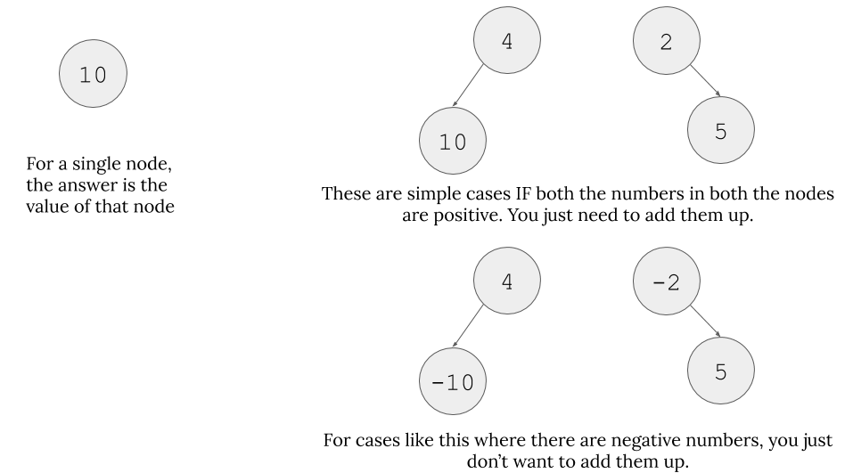
```

Base Cases
==========================
```
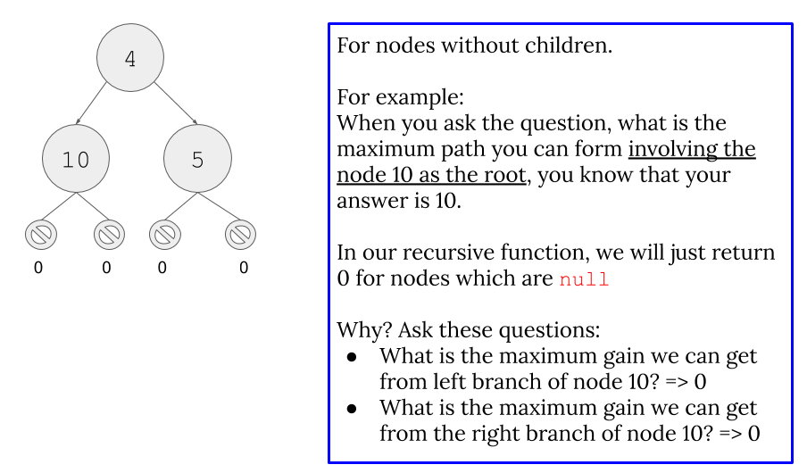
```
Important Observations
==========================
  * These important observations are very important to understand Line 9 and Line 10 in the code.
      [x] For example, in the code (Line 9), we do something like max(get_max_gain(node.left), 0). The important part is: why do we take maximum value between 0 and maximum gain we can get from left branch? Why 0?
      [x] Check the two images below first.
```
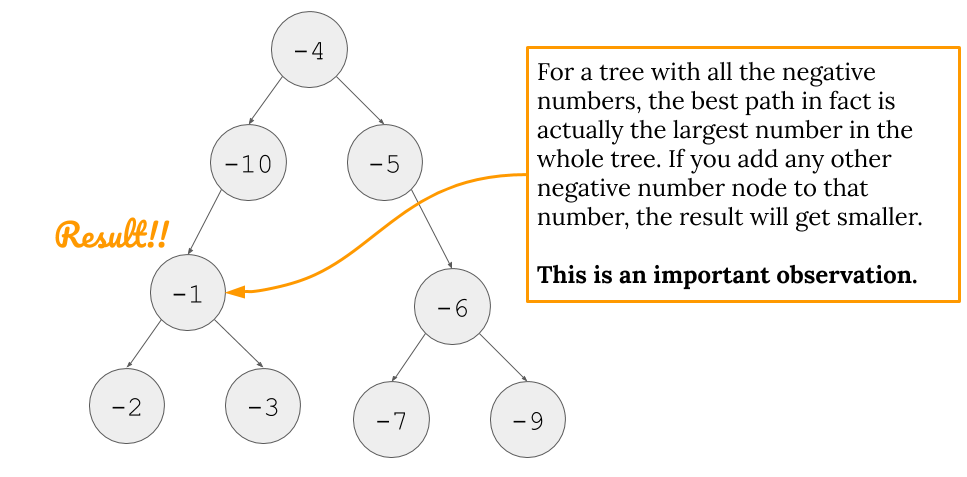
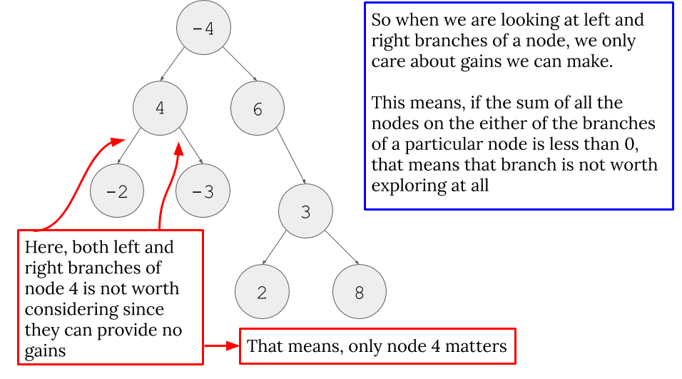
```
      [x] The important thing is "We can only get any sort of gain IF our branches are not below zero. If they are below zero, why do we even bother considering them? Just pick 0 in that case. Therefore, we do 
	      max(<some gain we might get or not>, 0)..

Going down the recursion stack for one example:
```
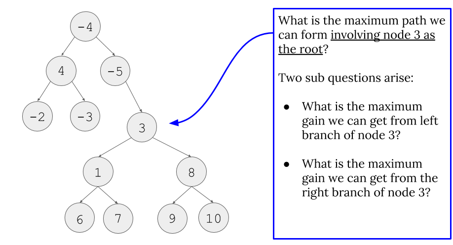
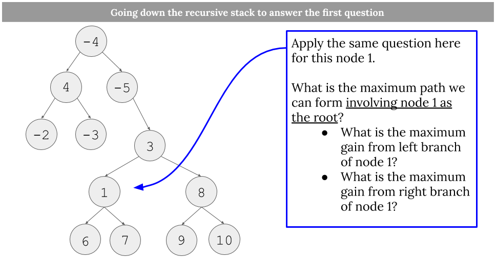
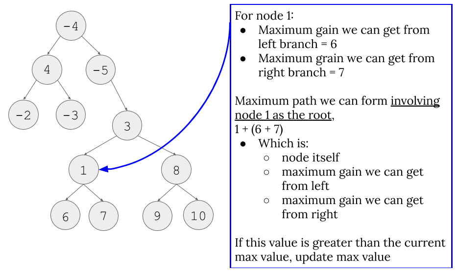
```
  * Because of this, we do Line 12 and Line 13. It is important to understand the different between looking for the maximum path INVOLVING the current node in process and what we return for the node which starts the recursion stack. 
    Line 12 and Line 13 takes care of the former issue and Line 15 (and the image below) takes care of the latter issue.
```
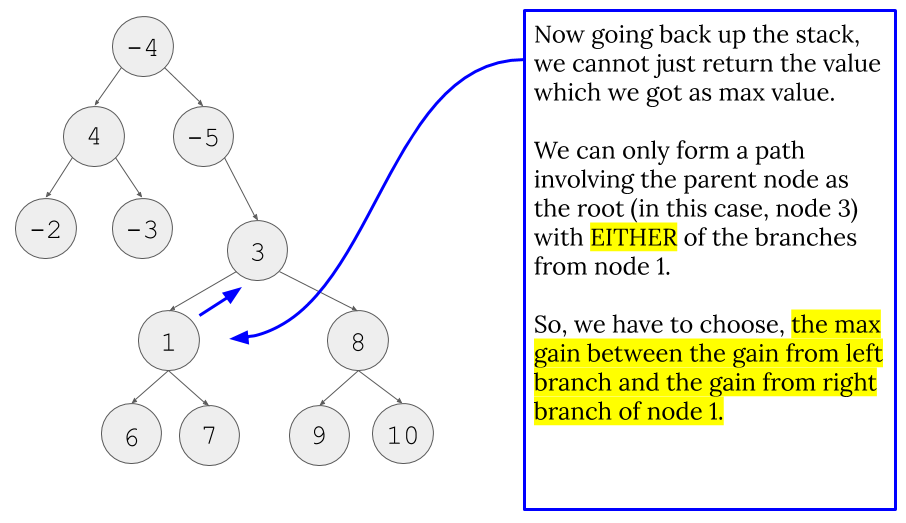
```
  * Because of this fact, we have to return like Line 15. For our example, for node 1, which is the recursion call that 
    node 3 does for max(get_max_gain(node.left), 0), node 1 cannot include both node 6 and node 7 for a path to include 
	node 3. Therefore, we can only pick the max gain from left path or right path of node 1.
```
##### Complexity Analysis:
```
SC: O(n)
================
Space complexity is O(1) if you ignore the recursion call stack, since we use fixed amount of variables. 
Otherwise space complexity could be O(n) for a skewed tree in worst case. 


TC: O(n)
================
For time complexity, since we will be visiting all the nodes at least once it is O(n)
```
```python
import math
class Solution:
    def maxPathSum(self, root: TreeNode) -> int:
        max_path = -math.inf # placeholder to be updated
        def get_max_gain(node):
            nonlocal max_path # This tells that max_path is not a local variable
            if node is None:
                return 0

            gain_on_left = max(get_max_gain(node.left), 0) # Read the part important observations ( Line #9 )
            gain_on_right = max(get_max_gain(node.right), 0) # Read the part important observations ( Line #10 )

 		    current_max_path = node.val + gain_on_left + gain_on_right # Read first three images of going down the recursion stack ( Line #12 )
 		    max_path = max(max_path, current_max_path) # Read first three images of going down the recursion stack ( Line #13 )

            return node.val + max(gain_on_left, gain_on_right) # Read the last image of going down the recursion stack ( Line #15 )

    get_max_gain(root) # Starts the recursion chain
    return max_path
```
```kotlin
fun maxPathSum(root: TreeNode?): Int {
    var max = Int.MIN_VALUE
    
    fun recursion(root: TreeNode?): Int {
        if (root == null) return 0
        
        val l = recursion(root.left)
        val r = recursion(root.right)
        
        val lmax = maxOf(l + root.`val`, root.`val`)
        val rmax = maxOf(r + root.`val`, root.`val`)
        
        max = maxOf(max, maxOf(l + r + root.`val`, maxOf(lmax, rmax)))

        return maxOf(root.`val`, maxOf(lmax, rmax))
    }
    
    recursion(root)
    return max
}
```

<br/>
<div align="right">
    <b><a href="#algorithms">⬆️ Back to Top</a></b>
</div>
<br/>

####  [LC-102:Binary Tree Level Order Traversal](https://leetcode.com/problems/binary-tree-level-order-traversal/)
##### Solution Explanation
```
# ----------------------------------------------------
# Approach-1: Breadth First Search
# ----------------------------------------------------

 * Using BFS, at any instant only L1 and L1+1 nodes are in the queue.
 * When we start the while loop, we have L1 nodes in the queue.
 * for _ in range(len(q)) allows us to dequeue L1 nodes one by one and add L2 children one by one.
 * Time complexity: O(N). Space Complexity: O(N)

# ----------------------------------------------------
# Approach-2: Depth First Search
# ----------------------------------------------------

 * Use a variable to track level in the tree and use simple Pre-Order traversal
 * Add sub-lists to result as we move down the levels
 * Time Complexity: O(N)
 * Space Complexity: O(N) + O(h) for stack space

```
##### Complexity Analysis
```
# ----------------------------------------------------
# Approach-1: Breadth First Search
# ----------------------------------------------------

TC: O(N)
SC: O(N)

# ----------------------------------------------------
# Approach-2: Depth First Search
# ----------------------------------------------------

TC: O(N)
SC: O(N) + O(h) for stack space

```
```python
# ----------------------------------------------------
# Approach-1: Breadth First Search
# ----------------------------------------------------
#TC: O(N)
#SC: O(N)

from collections import deque

# Definition for a binary tree node.
# class TreeNode:
#     def __init__(self, val=0, left=None, right=None):
#         self.val = val
#         self.left = left
#         self.right = right
class Solution:
    def levelOrder(self, root: TreeNode) -> List[List[int]]:
        """
        :type root: TreeNode
        :rtype: List[List[int]]
        """
        q, result = deque(), []
        if root:
            q.append(root)
        while len(q):
            level = []
            for _ in range(len(q)):
                x = q.popleft()
                level.append(x.val)
                if x.left:
                    q.append(x.left)
                if x.right:
                    q.append(x.right)
            result.append(level)
        return result

# ----------------------------------------------------
# Approach-2: Depth First Search
# ----------------------------------------------------
#TC: O(N)
#SC: O(N) + O(h) for stack space

# Definition for a binary tree node.
# class TreeNode:
#     def __init__(self, val=0, left=None, right=None):
#         self.val = val
#         self.left = left
#         self.right = right
class Solution:
    def levelOrder(self, root: TreeNode) -> List[List[int]]:
        result = []
        self.helper(root, 0, result)
        return result
    
    def helper(self, root, level, result):
        if root is None:
            return
        if len(result) <= level:
            result.append([])
        result[level].append(root.val)
        self.helper(root.left, level+1, result)
        self.helper(root.right, level+1, result)
```

<br/>
<div align="right">
    <b><a href="#algorithms">⬆️ Back to Top</a></b>
</div>
<br/>

####  [LC-297:Serialize and Deserialize Binary Tree](https://leetcode.com/problems/serialize-and-deserialize-binary-tree/)
##### Solution Explanation:
```
# --------------------------------------
# Approach 1 ( Level Order for encoding )
#              BFS
#              DFS ( Iterative and Recursive )
# --------------------------------------
Use level-order traversal to encode ( to match LeetCode's serialization format ).

Time complexity for both serialize and deserialize are O(n), where n is the number of nodes in the binary tree.

# --------------------------------------
# Approach 2 ( Using Native Serialization )
# --------------------------------------
Efficient for large integers which can be packed into 4 bytes.

Serializes the tree in to following format:

<val><size_of_left_tree><size_of_right_tree><left_data><right_data>

So constant 12 bytes (4 + 4 + 4) followed by arbiatry sized byte sequences one each for left and right subtree.

Time complexity for both serialize and deserialize are O(n), where n is the number of nodes in the binary tree.
```
##### Complexity Analysis:
```
N = the number of nodes in the binary tree.

For both solutions:

TC : O(N)
SC : O(N)
```
```python
# Definition for a binary tree node.
# class TreeNode(object):
#     def __init__(self, x):
#         self.val = x
#         self.left = None
#         self.right = None

# --------------------------------------
# Approach 1 ( Level Order for encoding )
#              BFS
#              DFS ( Iterative and Recursive )
# --------------------------------------
# N = the number of nodes in the binary tree.
# --------------------------------------
# TC : O(N)
# SC : O(N)
#
# BFS
class Codec:
    def serialize(self, root):
        """Encodes a tree to a single string.
        
        :type root: TreeNode
        :rtype: str
        """
        if not root:
            return "#"
        queue = [root]
        res = [str(root.val)]
        while queue:
            res += [str(node.val) if node else "#" for root in queue for node in (root.left,root.right)]
            queue = [node for root in queue for node in (root.left, root.right) if node]
        return ",".join(res)

    def deserialize(self, data):
        if data == "#":
            return None
        d = iter(data.split(","))
        root = TreeNode(int(next(d)))
        queue = [root]
        while queue:
            for node in queue:
                left = next(d)
                node.left = TreeNode(int(left)) if left!="#" else None
                right = next(d)
                node.right = TreeNode(int(right)) if right!="#" else None
            queue = [node for root in queue for node in (root.left, root.right) if node]
        return root

# Recursive DFS
class Codec:   
    def serialize(self, root):
        """Encodes a tree to a single string.
        
        :type root: TreeNode
        :rtype: str
        """
        if not root:
            return "#"
        s = "{},{},{}".format(root.val, self.serialize(root.left), self.serialize(root.right))
        return s

    def deserialize(self, data):
        """Decodes your encoded data to tree.
        
        :type data: str
        :rtype: TreeNode
        """
        d = iter(data.split(','))
        def helper(d):
            root = next(d)
            if root == "#":
                return None
            root = TreeNode(root)
            root.left = helper(d)
            root.right = helper(d)
            return root
        return helper(d) 
		
# Iterative DFS
class Codec:
    def serialize(self, root):
        """Encodes a tree to a single string.
        
        :type root: TreeNode
        :rtype: str
        """
        if not root:
            return "#"
        s = "{},{},{}".format(root.val, self.serialize(root.left), self.serialize(root.right))
        return s

    def deserialize(self, data):
        """Decodes your encoded data to tree.
        
        :type data: str
        :rtype: TreeNode
        """
        if data == "#":
            return None
        
        root = TreeNode(int(d[0]))
        stack = [[root,0]]
        for i in d[1:]:
            t = TreeNode(int(i)) if i !="#" else None
            if stack:
                last, status = stack[-1]
                if status == 0:
                    last.left = t
                    stack[-1][1] += 1
                else:
                    last.right = t
                    stack.pop()
            if t:
                stack.append([t,0])
        return root

# --------------------------------------
# Approach 2 ( Using Native Serialization )
# --------------------------------------
# N = the number of nodes in the binary tree.
# --------------------------------------
# TC : O(N)
# SC : O(N)
import struct

class Codec:
    def serialize(self, root):
        if not root:
            return ''
        left = self.serialize(root.left)
        right = self.serialize(root.right)
        return struct.pack('iii{0}s{1}s'.format(len(left), len(right)),
                           root.val, len(left), len(right), left, right)

    def deserialize(self, data):
        if not data:
            return None
        val, left_size, right_size = struct.unpack('iii', data[:12])
        left_data, right_data = struct.unpack(
            '{0}s{1}s'.format(
                left_size,
                right_size,
            ), data[12:])
        root = TreeNode(val)
        root.left, root.right = self.deserialize(left_data), self.deserialize(right_data)
        return root

# --------------------------------------
# --------------------------------------
# Your Codec object will be instantiated and called as such:
# ser = Codec()
# deser = Codec()
# ans = deser.deserialize(ser.serialize(root))
```
```kotlin
// Kotline BFS Solution
// TC : O(N)
// SC : O(N)
class Codec() {
	// Encodes a URL to a shortened URL.
    fun serialize(root: TreeNode?): String {
        val q = LinkedList<TreeNode?>()
        q.offer(root)
        
        val res = StringBuilder()
        var lastPos = 0
        while (!q.isEmpty()) {
            val node = q.poll()
            if (node == null) {
                res.append("null")
            } else {
                res.append(node.`val`)
                lastPos = res.length
                q.offer(node.left)
                q.offer(node.right)                
            }
            res.append(",")
        }
        return res.substring(0..lastPos - 1)
    }

    // Decodes your encoded data to tree.
    fun deserialize(data: String): TreeNode? {
        if (data.isEmpty()) return null
        val list = data.split(",")
        val root = TreeNode(list[0].toInt())
        val q = ArrayDeque<TreeNode>()
        q.offer(root)
        
        var i = 1
        while (i < list.size && !q.isEmpty()) {
            val node = q.poll()
            if (i < list.size && list[i] != "null") {
                node.left = TreeNode(list[i].toInt())
                q.offer(node.left)
            }
            i++
            if (i < list.size && list[i] != "null") {
                node.right = TreeNode(list[i].toInt())
                q.offer(node.right)
            }
            i++           
        }
        return root
    }
}
```

<br/>
<div align="right">
    <b><a href="#algorithms">⬆️ Back to Top</a></b>
</div>
<br/>

#### [LC-606:Construct String from Binary Tree](https://leetcode.com/problems/construct-string-from-binary-tree/)
##### Solution Explanation:
```
We do this recursively.

  * If the tree is empty, we return an empty string.
  * We record each child as '(' + (string of child) + ')'
  * If there is a right child but no left child, we still need to record '()' instead of empty string.
```
##### Complexity Analysis:
```
# Solution-1: Recursive Solution
O(T): O(n)
O(S): O(h)

# Solution-2: Iterative Solution
O(T): O(n)
O(S): O(n)
```
```python
# Solution-1: Recursive Solution
class Solution:
    def tree2str(self, t: TreeNode) -> str:
        if not t: return ''
        rst = f"{t.val}"
        l = self.tree2str(t.left)
        r = self.tree2str(t.right)
        if not l and not r: return rst
        #as long as it has next level, append left branch no matter what it is
        rst += f"({l})"
        #append right branch if and only if right branch has solid value
        if r: rst += f"({r})"
        return rst

# Solution-2: Iterative Solution
class Solution:
    def tree2str(self, t: TreeNode) -> str:
        rst, s = '', [t] if t else []
        while s:
            node = s.pop()
            #only left child can possibly be empty, because right child is strictly checked
            if not node: rst += '('; continue
            elif node == ")": rst += ')'; continue
                
            rst += f"({node.val}"
            if not node.left and not node.right: continue
                
            #from here, it is if node.left or node.right, i prefer shallow indentation
            if node.right:
                s.append(')')
                s.append(node.right)
            #right child is strictly checked while left child has no check at all
            s.append(')')
            s.append(node.left)
        return rst[1:]
```
```kotlin
class Solution {
    fun tree2str(t: TreeNode?): String {
        return when {
            t == null -> ""
            t.left == null && t.right == null -> t.`val`.toString()
            t.left == null && t.right != null -> String.format("%d()(%s)", t.`val`, tree2str(t.right))
            t.left != null && t.right == null -> String.format("%d(%s)", t.`val`, tree2str(t.left))
            else -> String.format("%d(%s)(%s)", t.`val`, tree2str(t.left), tree2str(t.right))
        }
    }
}
```

####  [LC-572:Subtree of Another Tree](https://leetcode.com/problems/subtree-of-another-tree/)
##### Solution Explanation:
```
Tree s is traversed in a preorder traversal. 

When the generator reaches a node with the same value as the root of t, we start traversing t. 

Now s and t are being traversed in parallel and the nodes are being compared by equalNodes 
(this function checks if two nodes are equal by comparing their value and left and right children). 

The while loop will stop if the generator for t (tCurr) returns None, or if the generator for s returns None 
(in which case tCurr will NOT be none and the function will return False).
```
##### Complexity Analysis:
```
TC: O(n)
SC: O(n+m)
```
```python
class Solution:
    def checkSubTree(self, t1: TreeNode, t2: TreeNode) -> bool:
        def preorder(node):
            if node:
                yield node
                yield from preorder(node.left)
                yield from preorder(node.right)

        for n in preorder(t1):
            if n.val == t2.val:
                if all(a.val==b.val for a, b in zip(preorder(n), preorder(t2))):
                    return True
        return False
		
# More verbose solution w/o using built-ins
class Solution:
    def checkSubTree(self, t1: TreeNode, t2: TreeNode) -> bool:
        def preOrder(root):
            if root:
                yield root
                for node in preOrder(root.left): yield node
                for node in preOrder(root.right): yield node
                    
        def equalNodes(sCurr, tCurr):
            if sCurr.val != tCurr.val or \
                sCurr.left and not tCurr.left or \
                tCurr.left and not sCurr.left or \
                tCurr.right and not sCurr.right or \
                sCurr.right and not tCurr.right or \
                sCurr.left and sCurr.left.val != tCurr.left.val or \
                sCurr.right and sCurr.right.val != tCurr.right.val:
                return False
            return True
        
        sIter, tIter = preOrder(s), preOrder(t)
        sCurr, tCurr = next(sIter,None), next(tIter,None) 
        while sCurr and tCurr:
            if equalNodes(sCurr,tCurr):
                sCurr, tCurr = next(sIter,None), next(tIter,None)
            else:
                if tCurr == t:
                    sCurr = next(sIter,None)
                else:
                    tIter = preOrder(t)
                    tCurr = next(tIter,None)
        return tCurr == None
```
```kotlin
class Solution {
    fun isSubtree(s: TreeNode?, t: TreeNode?): Boolean {
        return when {
            s == null && t == null -> true
            s == null && t != null -> false
            s != null && t == null -> false
            else -> isSameTree(s, t) || isSubtree(s?.left, t) || isSubtree(s?.right, t)
        }
    }

    private fun isSameTree(s: TreeNode?, t: TreeNode?): Boolean {
        return when {
            s == null && t == null -> true
            s == null && t != null -> false
            s != null && t == null -> false
            else -> s?.`val` == t?.`val` && isSameTree(s?.left, t?.left) && isSameTree(s?.right, t?.right)
        }
    }
}
```

<br/>
<div align="right">
    <b><a href="#algorithms">⬆️ Back to Top</a></b>
</div>
<br/>

####  [LC-105:Construct Binary Tree from Preorder and Inorder Traversal](https://leetcode.com/problems/construct-binary-tree-from-preorder-and-inorder-traversal/)
##### Solution Explanation:
```
Idea:
==========================
For this solution, we can take advantage of the order of nodes in the preorder and inorder traversals. A preorder traversal is [node, left, right] while an inorder traversal is [left, node, right].

Idea:
==========================
For this solution, we can take advantage of the order of nodes in the preorder and inorder traversals. A preorder traversal is [node, left, right] while an inorder traversal is [left, node, right].

We know that the root node for a tree is the first element of the preorder array (P). We also know that every element to the left of the root element in the inorder array (I) is on the left subtree, and everything to the right of the root element in I is on the right subtree.

Since we know the length of the left and right subtrees by finding the root in I, and since we know the order of the left and right subtrees in P, we can use that to determine the location of the root node in P for each of the two subtrees.

With this information, we can define a recursive helper function (splitTree) that will split the tree into two and then recursively do the same for each subtree.
```
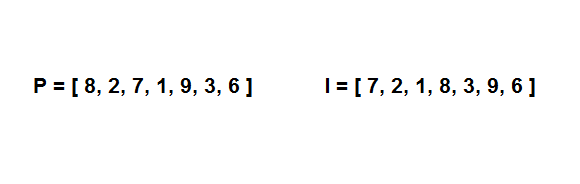
```
In order to make this work, we just need to pass left and right limits (ileft, iright) defining the subarray of the current subtree in I, as well as the index (pix) of the root node of the subtree in P.

At this point, we could iterate forward through I until we found out the location (imid) of the root node each time, but that would push this solution to a time complexity of O(N^2).

Instead, we can make a prelimanary index map (M) of the values in I, so that we can look up the value for imid in O(1) time in each recursion. This will lower the time complexity to O(N) at the cost of a space complexity of O(N).

In the example in the graphic above, where P = [8,2,7,1,9,3,6] and I = [7,2,1,8,3,9,6], the root would be 8, so we know that imid (its location in I) is 3, and since we still are using the full array, ileft = 0 and iright = I.length-1, or 6. This means that the left subtree is imid - ileft = 3 elements long ([7,2,1] to the left of 8 in I) and the right subtree is iright - imid = 3 elements long ([3,9,6] to the right of 8 in I).

We can apply those dimensions from I to figure out the ranges of those subtrees in P, as well. The left subtree will start right after the root in P (pix + 1), and the right subtree will start once the left subtree ends (pix + 1 + (imid - ileft).

At each recursion, if imid = ileft, then there are no nodes in the left subtree, so we shouldn't call a recursion for that side. The same applies to the right side if imid = iright.
```
##### Complexity Analysis:
```
Time Complexity: O(N) where N is the length of P and I
Space Complexity: O(N) for M
```
```python
class Solution:
    def buildTree(self, P: List[int], I: List[int]) -> TreeNode:
        M = {I[i]: i for i in range(len(I))}
        return self.splitTree(P, M, 0, 0, len(P)-1)
    
    def splitTree(self, P: List[int], M: dict, pix: int, ileft: int, iright: int) -> TreeNode:
        rval = P[pix]
        root, imid = TreeNode(rval), M[rval]
        if imid > ileft:
            root.left = self.splitTree(P, M, pix+1, ileft, imid-1)
        if imid < iright:
            root.right = self.splitTree(P, M, pix+imid-ileft+1, imid+1, iright)
        return root
```
```kotlin
/**
 * Example:
 * var ti = TreeNode(5)
 * var v = ti.`val`
 * Definition for a binary tree node.
 * class TreeNode(var `val`: Int) {
 *     var left: TreeNode? = null
 *     var right: TreeNode? = null
 * }
 */
class Solution {
    
    var ind = 0
    
    fun build(pre: IntArray, inOr: IntArray, l: Int, r: Int, map: MutableMap<Int, Int>): TreeNode? {
        if (ind >= inOr.size) return null
        val index = map[pre[ind]] as Int
        if (index == -1 || index > r || index < l) return null
        
        val root = TreeNode(pre[ind])
        ind++
        root.left = build(pre, inOr, l, index - 1, map)
        root.right = build(pre, inOr, index + 1, r, map)
        
        return root
    }
    
    fun buildTree(preorder: IntArray, inorder: IntArray): TreeNode? {
        val map = mutableMapOf<Int, Int>()
        for (i in 0 until inorder.size) {
            map[inorder[i]] = i
        }
        
        return build(preorder, inorder, 0, inorder.size - 1, map)
    }
}
```

<br/>
<div align="right">
    <b><a href="#algorithms">⬆️ Back to Top</a></b>
</div>
<br/>

####  [LC-98:Validate Binary Search Tree](https://leetcode.com/problems/validate-binary-search-tree/)
##### Solution Explanation:
```
# InOrder Traversal using Morris Traversal Algorithm
-----------------------------------------------------
If we do an inorder traversal of the nodes and find that they are increasing,
then the tree will be a binary tree (we could prove this by showing that if the
tree is not a BST then the inorder will not be increasing)

We can do an inorder traversal of the tree in O(1) space with the Morris inorder
traversal. This implementation of an inorder traversal makes use of the empty
right pointers at the far right of subtrees to store the recursion stack.

```
##### Complexity Analysis:
```
TC: O(N)
SC: O(1)
```
```python
# Definition for a binary tree node.
# class TreeNode:
#     def __init__(self, val=0, left=None, right=None):
#         self.val = val
#         self.left = left
#         self.right = right
class Solution:
    def morris(self, node):
        while node:
            if not node.left:
                yield node.val
                node = node.right
            else:
                pre = node.left
                while pre.right and pre.right is not node:
                    pre = pre.right
                
                if pre.right is node:
                    yield node.val
                    node = node.right
                    pre.right = None
                else:
                    pre.right = node
                    node = node.left
					
	def isValidBST(self, root: TreeNode) -> bool:
        if not root:
            return True
        
        values = self.morris(root)
        prev = next(values)
		# innocent until proven guilty
        result = True
        
        for value in values:
			# Make sure that the values are still increasing
            result = result and prev < value
            prev = value
        
        return result	
```

<br/>
<div align="right">
    <b><a href="#algorithms">⬆️ Back to Top</a></b>
</div>
<br/>

####  [LC-230:Kth Smallest Element in a BST](https://leetcode.com/problems/kth-smallest-element-in-a-bst/)
##### Data Structure and Algorithm Learning Points:
###### How to traverse the tree
There are two general strategies to traverse a tree:
* Depth First Search (DFS)
  In this strategy, we adopt the depth as the priority, so that one would start from a root 
  and reach all the way down to certain leaf, and then back to root to reach another branch.

  The DFS strategy can further be distinguished as preorder, inorder, and postorder 
  depending on the relative order among the root node, left node and right node.

* Breadth First Search (BFS)

  We scan through the tree level by level, following the order of height, from top to bottom.
  The nodes on higher level would be visited before the ones with lower levels.

On the following figure the nodes are numerated in the order you visit them,
please follow 1-2-3-4-5 to compare different strategies.


##### Python3 Learning Points
Introduced with [PEP 255](https://www.python.org/dev/peps/pep-0255), generator functions are a special kind of function  that 
return a [lazy iterator](https://en.wikipedia.org/wiki/Lazy_evaluation).
These are objects that you can loop over like a [list](https://realpython.com/python-lists-tuples/).
However, unlike lists, lazy iterators do not store their contents in memory.
##### Solution Explanation:
```
Hint: To solve the problem, one could use the property of BST : inorder traversal of BST is an array sorted in the ascending order.
-------------------------------

# --------------------------------------
# Approach 1: lazy in order traversal using an iterator with early stopping - condensed.
# --------------------------------------

It's a very straightforward approach with O(k) time complexity.
The idea is to build an inorder traversal of BST which is an array sorted in the ascending order.
Now the answer is the (k - 1)th element of this array.
```

```

# --------------------------------------
# Approach 2: morris in order traversal
# --------------------------------------


Reference: https://www.educative.io/edpresso/what-is-morris-traversal
```
##### Complexity Analysis:
```
```
```python
# --------------------------------------
# Approach 1: lazy in order traversal using an iterator with early stopping - condensed.
# --------------------------------------

# TC: O(k)
# SC: O(1)
#

# Definition for a binary tree node.
# class TreeNode:
#     def __init__(self, val=0, left=None, right=None):
#         self.val = val
#         self.left = left
#         self.right = right
class Solution:
    def kthSmallest(self, root: TreeNode, k: int) -> int:
        # lazy in order traversal using an iterator with early stopping
        def traverse(node: TreeNode):
            if not node:
                return
            yield from traverse(node.left)
            yield node.val
            yield from traverse(node.right)

        for i, val in enumerate(traverse(root)):
            if k - i == 1:
                return val

    # even more condensed
    def kthSmallest(self, root: TreeNode, k: int) -> int:  # O(k) time and O(1) space
        # lazy in order traversal using an iterator with early stopping - condensed
        def traverse(node: TreeNode):
            yield from (*traverse(node.left), node.val, *traverse(node.right)) if node else ()

        return next(val for i, val in enumerate(traverse(root), 1) if not k - i)


# --------------------------------------
# Approach 1: lazy in order traversal using an iterator with early stopping - condensed.
# --------------------------------------

# TC: O(k)
# SC: O(1)
#

# Definition for a binary tree node.
# class TreeNode:
#     def __init__(self, val=0, left=None, right=None):
#         self.val = val
#         self.left = left
#         self.right = right
class Solution:

    def kthSmallest(self, root: TreeNode, k: int) -> int:  # O(k) time and O(1) space
        # Morris traversal
        node = root
        while node:
            if not node.left:
                k -= 1
                if k == 0:
                    return node.val
                node = node.right
            else:
                rightmost = node
                node = temp = node.left
                while temp.right:
                    temp = temp.right
                rightmost.left = None
                temp.right = rightmost

    # even more condensed
    def kthSmallest(self, root: TreeNode, k: int) -> int:  # O(k) time and O(1) space
        # Morris traversal - condensed
        node, val = root, None
        while k:
            if not node.left:
                val, node, k = node.val, node.right, k - 1
            else:
                rightmost, node, temp = node, node.left, node.left
                while temp.right:
                    temp = temp.right
                rightmost.left, temp.right = None, rightmost
        return val
```

<br/>
<div align="right">
    <b><a href="#algorithms">⬆️ Back to Top</a></b>
</div>
<br/>

####  [LC-235:Lowest Common Ancestor of a Binary Search Tree](https://leetcode.com/problems/lowest-common-ancestor-of-a-binary-search-tree/)
##### Solution Explanation:
```
Solution-1: Iterate in BST
==============================
  * Let large = max(p.val, q.val), small = min(p.val, q.val).
  * We keep iterate root in our BST:
    [x] If root.val > large then both node p and q belong to the left subtree, go to left by root = root.left.
    [x] If root.val < small then both node p and q belong to the right subtree, go to right by root = root.right.
    [x] Now, small < root.val < large (all node.val are unique), the current root is the LCA between q and p.
```
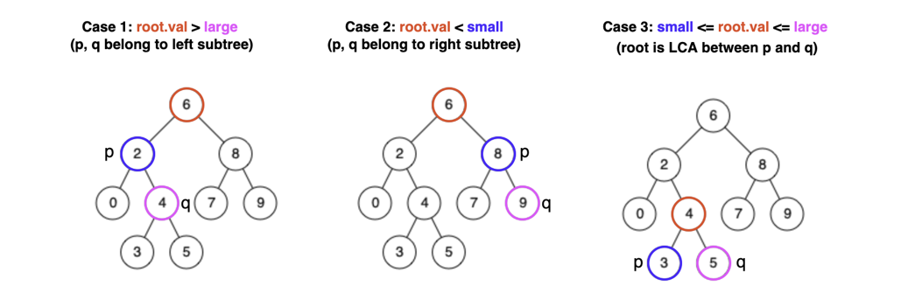
##### Complexity Analysis:
```
Complexity:
==============================
Time: O(H), where H is the heigh of Binary Tree.
Space: O(1)
```
```python
# Solution-1: Iterate in BST
# ==============================
# TC: O(H)
# SC: O(1)
class Solution:
    def lowestCommonAncestor(self, root: 'TreeNode', p: 'TreeNode', q: 'TreeNode') -> 'TreeNode':
        small = min(p.val, q.val)
        large = max(p.val, q.val)
        while root:
            if root.val > large:  # p, q belong to the left subtree
                root = root.left
            elif root.val < small:  # p, q belong to the right subtree
                root = root.right
            else:  # Now, small <= root.val <= large -> This is the LCA between p and q
                return root
        return None
```
##### Solution Explanation:
```
Solution 2: Find LCA of general Binary Tree
==============================
  * There are two other solutions, which take O(N) in Time Complexity to find the LCA between p and q in the general Binary Tree, please check out this article: 
    236. Lowest Common Ancestor of a Binary Tree => https://leetcode.com/problems/lowest-common-ancestor-of-a-binary-tree/discuss/1306476.


Article => 236. Lowest Common Ancestor of a Binary Tree => https://leetcode.com/problems/lowest-common-ancestor-of-a-binary-tree/discuss/1306476.
==============================
Solution 1: Depth First Search
==============================

  * Please note that p and q always exist in the tree.
  * When dfs from the root down to its children, if current root == p or root == q then current root is the their LCA.
  * If left subtree contains one of descendant (p or q) and right subtree contains the remaining descendant (q or p) then the root is their LCA.
  * If left subtree contains both p and q then return left as their LCA.
  * If right subtree contains both p and q then return right as their LCA.

For a clear explanation, you can check video title "Lowest Common Ancestor Binary Tree" by "Tushar Roy" on Youtube.

class Solution:
    def lowestCommonAncestor(self, root: 'TreeNode', p: 'TreeNode', q: 'TreeNode') -> 'TreeNode':
        if root == None or root == p or root == q: return root
        left = self.lowestCommonAncestor(root.left, p, q)
        right = self.lowestCommonAncestor(root.right, p, q)
        if left != None and right != None: return root
        if left != None: return left
        return right

Complexity:
==============================

  * Time: O(N), where N is number of nodes in the Binary Tree.
  * Space: O(H), where H is the heigh of Binary Tree.

Solution 2: Find Parent and Level of nodes
==============================

  * Using dfs to find parent and level of nodes.
  * Make p and q go to the same level that is if level[p] < level[q] then jump q to parents level[q] - level[p] times else jump p.
  * Jump both p and q util they meet at thier LCA.
  * Return their LCA.

class Solution:
    def lowestCommonAncestor(self, root: 'TreeNode', p: 'TreeNode', q: 'TreeNode') -> 'TreeNode':
        def jumpParent(u, steps):
            while steps > 0:
                u = parent[u]
                steps -= 1
            return u

        def dfs(u, p, depth):
            if u == None: return
            parent[u] = p
            level[u] = depth
            dfs(u.left, u, depth + 1)
            dfs(u.right, u, depth + 1)

        parent = dict()
        level = dict()
        dfs(root, None, 0)
        if level[p] < level[q]:  # Make node p and node q the same level
            q = jumpParent(q, level[q] - level[p])
        else:
            p = jumpParent(p, level[p] - level[q])
        while q != p:  # Jump util their LCA
            q = parent[q]
            p = parent[p]
        return q

Complexity:
==============================
Time & Space: O(N), where N is number of nodes in the Binary Tree.
```

<br/>
<div align="right">
    <b><a href="#algorithms">⬆️ Back to Top</a></b>
</div>
<br/>

####  [LC-208:Implement Trie (Prefix Tree)](https://leetcode.com/problems/implement-trie-prefix-tree/)
##### Solution Explanation
```
If we look at the following trie example, we notice that "APPLE" and "APPLY" are inserted as word (they are prefixes as well). However, "APP" is not a word, it is only a prefix. What diffrentiates "word" and "prefix" is the "is_word" flag in TrieNode class. Therefore, we can implement both search and startsWith methods together using dfs (going deep down until word/prefix is found).

A
|
P
|
P
|
L
| \
E  Y
trie.insert("APPLE")
trie.insert("APPLY")
trie.search("APPLE") // returns true
trie.search("APP") // returns false
trie.startsWith("APP") // returns true
```
```python
import collections

class TrieNode(object):
    def __init__(self):
        self.children = collections.defaultdict(TrieNode)  # Defines an empty dictionary whose "type" of "values" is TrieNode.
        self.is_word = False # determines if word is completed (end of word)

class Trie(object):
    def __init__(self):
        """
        Initialize your data structure here.
        """
        self.root = TrieNode()

    def insert(self, word: str) -> None:
        """
        Inserts a word into the trie.
        """
        current = self.root
        for letter in word:
            current = current.children[letter]
        current.is_word = True

    def search(self, word: str) -> bool:
        """
        Returns if the word is in the trie.
        """
        node = self.root
        return self.dfs(word, node)

    def startsWith(self, prefix: str) -> bool:
        """
        Returns if there is any word in the trie that starts with the given prefix.
        """
        node = self.root
        return self.dfs(prefix, node, False)
    
    def dfs(self, string, node, is_word_given=True):
		# if is_word_given is True: we are looking for word
		# if is_word_given is False: we are looking for prefix
	
		# the common part of search and startsWith
        for i, c in enumerate(string):
            if c not in node.children: return False
            node = node.children[c]

		# if we run "search", is_word determines the result
		# if we run "startsWith", we return True as long as "if c not in node.children: return False" does not happen
		 return node.is_word if is_word_given else True  

if __name__ == "__main__":
    trie = Trie()
    trie.insert("APPLE")
    trie.insert("APPLY")
    trie.search("APPLE") # returns true
    trie.search("APP") # returns false
    trie.startsWith("APP") # returns true
```

<br/>
<div align="right">
    <b><a href="#algorithms">⬆️ Back to Top</a></b>
</div>
<br/>

####  [LC-211:Add and Search Word - Data structure design](https://leetcode.com/problems/add-and-search-word-data-structure-design/)
##### Solution Explanation:
```
In this problem, we need to use Trie data structure. For more details go to the problem 208. Implement Trie (Prefix Tree).

So, what we have here?

TrieNode class with two values: dictionary of children and flag, if this node is end of some word.
Now, we need to implement addWord(self, word) function: we add symbol by symbol, and go deepere and deeper in our Trie. In the end we note our node as end node.
Now, about search(self, word) function. Here we use dfs(node, i) with backtracking, because we can have symbol . in our word (here node is link to Trie node and i is index of letter in word). So we need to check all options: we go to all possible children and call dfs recursively. If we found not ., but just some letter, we check if we have this letter as children, and if we have, we go deeper. If we are out of letters, that is i == len(word), we return True if current end_node is equal to 1 and false in opposite case. Finally, we return False if we can not go deeper, but we still have letters.
Now, we just return dfs(self.root, 0).
Complexity: Easy part is space complexity, it is O(M), where M is sum of lengths of all words in our Trie. This is upper bound: in practice it will be less than M and it depends, how much words are intersected. The worst time complexity is also O(M), potentially we can visit all our Trie, if we have pattern like ...... For words without ., time complexity will be O(h), where h is height of Trie. For words with several letters and several ., we have something in the middle.

```
##### Complexity Analysis:
```
```
```python
```
```kotlin
```

<br/>
<div align="right">
    <b><a href="#algorithms">⬆️ Back to Top</a></b>
</div>
<br/>

####  [LC-212:Word Search II](https://leetcode.com/problems/word-search-ii/)
##### Solution Explanation:
```
In this problem, we need to use Trie data structure. For more details go to the problem 208. Implement Trie (Prefix Tree).

So, what we have here?

TrieNode class with two values: dictionary of children and flag, if this node is end of some word.
Now, we need to implement addWord(self, word) function: we add symbol by symbol, and go deepere and deeper in our Trie. In the end we note our node as end node.
Now, about search(self, word) function. Here we use dfs(node, i) with backtracking, because we can have symbol . in our word (here node is link to Trie node and i is index of letter in word). So we need to check all options: we go to all possible children and call dfs recursively. If we found not ., but just some letter, we check if we have this letter as children, and if we have, we go deeper. If we are out of letters, that is i == len(word), we return True if current end_node is equal to 1 and false in opposite case. Finally, we return False if we can not go deeper, but we still have letters.
Now, we just return dfs(self.root, 0).
```
##### Complexity Analysis:
```
Complexity: Easy part is space complexity, it is O(M), where M is sum of lengths of all words in our Trie. 
This is upper bound: in practice it will be less than M and it depends, how much words are intersected. 

The worst time complexity is also O(M), potentially we can visit all our Trie, if we have pattern like ...... 
For words without . (i.e., the period sign), time complexity will be O(h), where h is height of Trie. 
For words with several letters and several . (i.e., period signs), 
we have something in the middle.

SC: O(M)
TC: O(M)
where, M = sum of length of all words in our Trie.
```
```python
# SC: O(M)
# TC: O(M)
# where, M = sum of length of all words in our Trie.
class TrieNode:
    def __init__(self):
        self.children = {}
        self.end_node = 0
        
class WordDictionary:
    def __init__(self):
        self.root = TrieNode()      

    def addWord(self, word: str) -> None:
        root = self.root
        for symbol in word:
            root = root.children.setdefault(symbol, TrieNode())
        root.end_node = 1
        
    def search(self, word: str) -> bool:
        def dfs(node, i):
            if i == len(word): return node.end_node
               
            if word[i] == ".":
                for child in node.children:
                    if dfs(node.children[child], i+1): return True
                    
            if word[i] in node.children:
                return dfs(node.children[word[i]], i+1)
            
            return False
    
        return dfs(self.root, 0)

# Your WordDictionary object will be instantiated and called as such:
# obj = WordDictionary()
# obj.addWord(word)
# param_2 = obj.search(word)
```
```kotlin
    /** Initialize your data structure here. */
    class TrieNode() {
        val children = Array<TrieNode?>(26) { null }
        var isWord = false
    }

    val trieTree = TrieNode()

    /** Adds a word into the data structure. */
    fun addWord(word: String) {
        var p = trieTree

        for (w in word) {
            val i = w - 'a'
            if (p.children[i] == null) p.children[i] = TrieNode()
            p = p.children[i]!!
        }

        p.isWord = true
    }

    /** Returns if the word is in the data structure. A word could contain the dot character '.' to represent any one letter. */
    fun search(word: String): Boolean {
        fun dfs(p: TrieNode?, start: Int): Boolean {
            if (p == null) return false

            if (start == word.length) return p.isWord
            
            if (word[start] == '.') {
                for (i in 0..25) {
                    if (dfs(p.children[i], start + 1)) {
                        return true
                    }
                }
                return false
            } else {
                val i = word[start] - 'a'
                return dfs(p.children[i], start + 1)
            }
        }
        
        return dfs(trieTree, 0)
    }
```

<br/>
<div align="right">
    <b><a href="#algorithms">⬆️ Back to Top</a></b>
</div>
<br/>


## Heap/Priority Queue
| #     | Title	                                         | url                                                                           | Time   | Space   | Difficulty | Tag	        | Note                            |
| ----- | ---------------------------------------------- | ----------------------------------------------------------------------------- | ------ | ------- | ---------- | ------------ | ------------------------------- |
| 0023  | [Merge k Sorted Lists Solution 2](#lc23-merge-k-sorted-lists-solution-2) | https://leetcode.com/problems/merge-k-sorted-lists/                       | _O(nlogk)_ | _O(1)_  | Hard       |              | Heap, Divide and Conquer        |
| 0347  | [Top K Frequent Elements](#lc-347top-k-frequent-elements) | https://leetcode.com/problems/top-k-frequent-elements/             | _O(n)_   | _O(n)_    | Medium     |              | Quick Select, Heap, Bucket Sort |
| 0295  | [Find Median from Data Stream](#lc-295find-median-from-data-stream) | https://leetcode.com/problems/find-median-from-data-stream/ | _O(nlogn)_ | _O(n)_  | Hard       | EPI, LintCode | BST, Heap                      |

####  [LC-23:Merge k Sorted Lists Solution 1](https://leetcode.com/problems/merge-k-sorted-lists/)
##### Data Structure Primer -- Difference between **heap** and **priority queue**
```
I have seen lots of solutions confuse priority queue with heap. I find a good link and list the talk below.

Concept:

1. Heap is a kind of data structure. It is a name for a particular way of storing data that makes certain operations very efficient. We can use a tree or array to describe it.

   18
  /	\
 10	 16
/ \   / \
9  5  8  12

18, 10, 16, 9, 5, 8, 12

2.Priority queue is an abstract datatype. It is a shorthand way of describing a particular interface and behavior, and says nothing about the underlying implementation.

A heap is a very good data structure to implement a priority queue. The operations which are made efficient by the heap data structure are the operations that the priority queue interface needs.
```
```
Algorithm:
Collect numbers from all lists and sort them. Then create a brand new linked list from the sorted numbers.

Implementation (99.47%):

class Solution:
    def mergeKLists(self, lists: List[ListNode]) -> ListNode:
        values = []
        for node in lists:
            while node:
                values.append(node.val)
                node = node.next 
        head = node = ListNode(None) #dummy head 
        for x in sorted(values):
            node.next = ListNode(x)
            node = node.next 
        return head.next

Analysis:
Time complexity O(Nklog(Nk), where k is number of lists and N is the length of each list;
Space complexity O(Nk)

Algorithm:
Loop through all k lists simultaneously and only advance the one with least value. The min node is tracked in a heap.

Implementation (104ms, 81.11%):

class Solution:
    def mergeKLists(self, lists: List[ListNode]) -> ListNode:
        pq = [(x.val, i, x) for i, x in enumerate(lists) if x]
        heapify(pq)
        dummy = node = ListNode()
        while pq: 
            _, i, x = heappop(pq)
            node.next = node = x
            if x.next: heappush(pq, (x.next.val, i, x.next))
        return dummy.next 
Analysis:
Time complexity O(Nklogk) where there are k lists and each has N nodes
Space complexity O(Nk)

Algorithm:
Divide the k lists into groups and progressively merge adjacent pairs into a bigger list.

Implementation (104ms, 81.11%):

class Solution:
    def mergeKLists(self, lists: List[ListNode]) -> ListNode:
        """divide & conquer"""
        if not lists: return None #edge case 
        
        def merge2Lists(l1, l2):
            head = node = ListNode(None) #dummy head 
            while l1 and l2: 
                if l1.val > l2.val: l1, l2 = l2, l1
                node.next = l1
                node = node.next
                l1 = l1.next 
            node.next = l1 if l1 else l2
            return head.next 
        
        d = 1 #step 
        while d < len(lists): 
            for i in range(0, len(lists)-d, 2*d): 
                lists[i] = merge2Lists(lists[i], lists[i+d])
            d *= 2
        return lists[0]
Analysis:
Time complexity O(Nklogk) where there are k lists and each has N nodes
Space complexity O(Nk)
```

<br/>
<div align="right">
    <b><a href="#algorithms">⬆️ Back to Top</a></b>
</div>
<br/>

####  [LC-347:Top K Frequent Elements](https://leetcode.com/problems/top-k-frequent-elements/)
##### Solution Explanation:
```
=================================================================================================================================================================
Solution Approach:
=================================================================================================================================================================
Make Heap
max_heap = [(-val, key) for key, val in dic.items()]
Why -val?
Inside Python is the defined Min-heap, the method of finding Max-heap in StackOverFlow, which is more in line with my lazy style: Link,set Value directly to -Value.heapify

Find K
Just put the biggest few pops out of Heap, remember that the pop out here is, nokeyval

for i in range(k):
    res.append(heapq.heappop(max_heap)[1])
return res   
```
##### Complexity Analysis:
```
TC: O(nlogk)
SC: O(n + k)
```
```python
import heapq
from collections import Counter
from typing import List

class Solution:
    def topKFrequent(self, nums: List[int], k: int) -> List[int]:
        res = []
		# Build frequency table
        dic = Counter(nums)
		# Construct max heap
        max_heap = [(-val, key) for key, val in dic.items()]
        heapq.heapify(max_heap)
		# Fetch the top K and append to the result list by doing heappop
        for i in range(k):
            res.append(heapq.heappop(max_heap)[1])
        return res 
```
```kotlin
import java.util.Comparator
import java.util.HashMap
import java.util.PriorityQueue

// Kotlin minHeap

fun topKFrequent(nums: IntArray, k: Int): IntArray {
    val map = HashMap<Int, Int>()
    val pq = PriorityQueue<Int>(Comparator { a, b ->
                        map[a]!!.compareTo(map[b]!!) })

    for (n in nums)
        map[n] = (map[n] ?: 0) + 1

    for (m in map) {
        pq.offer(m.key)
        if (pq.size > k)
            pq.poll()
    }

    return pq.toIntArray()
}

// Kotlin quick select

fun topKFrequent(nums: IntArray, k: Int): IntArray {
    val freq = HashMap<Int, Int>()
    for (n in nums) freq[n] = freq.getOrDefault(n, 0) + 1
    val arr = freq.keys.toIntArray()

    fun partition(start: Int, end: Int): Int {
        var l = start; var r = end
        var pivot = start
        while (l <= r) {
            while (l <= r && freq[arr[l]]!! <= freq[arr[pivot]]!!) l++
            while (l <= r && freq[arr[r]]!! > freq[arr[pivot]]!!) r--
            if (l < r) arr[l] = arr[r].also { arr[r] = arr[l] }
        }
        arr[r] = arr[pivot].also { arr[pivot] = arr[r] }
        return r
    }

    fun quickSelect(start: Int, end: Int, k: Int) {
        if (start >= end) return
        val pi = partition(start, end)
        if (pi < k) quickSelect(pi + 1, end, k)
        else if (pi > k) quickSelect(start, pi - 1, k)
    }

    quickSelect(0, arr.size - 1, arr.size - k)
    return arr.sliceArray(arr.size - k..arr.size - 1)
}
```

####  [LC-295:Find Median from Data Stream](https://leetcode.com/problems/find-median-from-data-stream/) 
##### Problem Description:
```
The median is the middle value in an ordered integer list. If the size of the list is even, 
there is no middle value and the median is the mean of the two middle values.

For example, for arr = [2,3,4], the median is 3.
For example, for arr = [2,3], the median is (2 + 3) / 2 = 2.5.
Implement the MedianFinder class:

MedianFinder() initializes the MedianFinder object.
void addNum(int num) adds the integer num from the data stream to the data structure.
double findMedian() returns the median of all elements so far. Answers within 10-5 of the actual answer will be accepted.
```
##### Solution Explanation:
```
=================================================================================================================================================================
Solution Approach:
=================================================================================================================================================================
The invariant of the algorithm is two heaps, small and large, each represent half of the current list.
The length of smaller half is kept to be n / 2 at all time and the length of the larger half is either n / 2 or n / 2 + 1 depend on n's parity.

This way we only need to peek the two heaps' top number to calculate median.

Any time before we add a new number, there are two scenarios, (total n numbers, k = n / 2):

(1) length of (small, large) == (k, k)
(2) length of (small, large) == (k, k + 1)
After adding the number, total (n + 1) numbers, they will become:

(1) length of (small, large) == (k, k + 1)
(2) length of (small, large) == (k + 1, k + 1)
Here we take the first scenario for example, we know the large will gain one more item and small will remain the same size,
but we cannot just push the item into large. 
What we should do is we push the new number into small and pop the maximum item from small then push it into large
(all the pop and push here are heappop and heappush). By doing this kind of operations for the two scenarios we can keep our invariant.

Therefore to add a number, we have 3 O(log n) heap operations. Luckily the heapq provided us a function "heappushpop" 
which saves some time by combine two into one. The document says:

Push item on the heap, then pop and return the smallest item from the heap. 
The combined action runs more efficiently than heappush() followed by a separate call to heappop().

Alltogether, the add operation is O(logn), The findMedian operation is O(1).

Note that the heapq in python is a min heap, thus we need to invert the values in the smaller half to mimic a "max heap".

A further observation is that the two scenarios take turns when adding numbers, thus it is possible to combine the two into one.
```
##### Complexity Analysis:
```
TC: O(log(n))
SC: O(1)
```
```python
from heapq import *

class MedianFinder:
    def __init__(self):
        self.small = []  # the smaller half of the list, max heap (invert min-heap)
        self.large = []  # the larger half of the list, min heap

    def addNum(self, num):
        if len(self.small) == len(self.large):
            heappush(self.large, -heappushpop(self.small, -num))
        else:
            heappush(self.small, -heappushpop(self.large, num))

    def findMedian(self):
        if len(self.small) == len(self.large):
            return float(self.large[0] - self.small[0]) / 2.0
        else:
            return float(self.large[0])
```
```kotlin
import java.util.Comparator
import java.util.PriorityQueue

class MedianFinder() {

    /** initialize your data structure here. */
    val smaller = PriorityQueue<Int>(Comparator { a, b -> b - a })
    val larger  = PriorityQueue<Int>()

    fun addNum(num: Int) {
        if (smaller.isEmpty() || num <= smaller.peek()) smaller.offer(num)
        else larger.offer(num)
        if (smaller.size > larger.size + 1) larger.offer(smaller.poll())
        else if (larger.size > smaller.size) smaller.offer(larger.poll())
    }

    fun findMedian(): Double {
        val even = (larger.size + smaller.size) % 2 == 0
        return if (even) (larger.peek() + smaller.peek()) / 2.0
               else smaller.peek().toDouble()
    }
}
```

<br/>
<div align="right">
    <b><a href="#algorithms">⬆️ Back to Top</a></b>
</div>
<br/>

## Binary Search
| #     | Title	                                         | url                                                                           | Time   | Space   | Difficulty | Tag	        | Note                  |
| ----- | ---------------------------------------------- | ----------------------------------------------------------------------------- | ------ | ------- | ---------- | ------------ | --------------------- |
| 0035  | [Search Insert Position](#lc35-search-insert-position) | https://leetcode.com/problems/search-insert-position/                 | _O(logn)_ | _O(1)_   | Medium     |              |                       |
| 0153  | [Find Minimum in Rotated Sorted Array Solution 2](#lc153-find-minimum-in-rotated-sorted-array-solution-2) | https://leetcode.com/problems/find-minimum-in-rotated-sorted-array/ | _O(logn)_ | _O(1)_   | Medium     |              |                       |
| 0033  | [Search in Rotated Sorted Array Solution 2](#lc33-search-in-rotated-sorted-array-solution-2) | https://leetcode.com/problems/search-in-rotated-sorted-array/ | _O(logn)_ | _O(1)_   | Medium     | CTCI         |                       |
| 1011  | [Capacity To Ship Packages Within D Days](#lc1011-capacity-to-ship-packages-within-d-days) | https://leetcode.com/problems/capacity-to-ship-packages-within-d-days/ | _O(nlogn)_ | _O(1)_ | Medium     |              |                       |

####  [LC-35:Search Insert Position](https://leetcode.com/problems/search-insert-position/)
##### Binary Search Primer:
```
Before We Begin
Have you ever wondered when to use while(lo<hi) while(lo <= hi) ?
Have you ever wondered when to use left = mid + 1 left = mid right = mid + 1 right = mid ?
Have you ever wondered why your binary search algorithm stuck in an infinity loop?
Well, at least I did all that, and if you are like me this article is for you.

*I'm not writing this article to have people "remember" the code, instead, I want use this article to introduce people a gateway of solving binary search problems.
*Some of the content are sourced from here(Chinese). Much thanks to the original author.

The Idea
Set lo and hi boundary, compute mid index
Compare target with mid , adjust lo & hi accordingly
```

##### Solution Explanation:
```
This is a very simple binary search. (Surprisingly, all the binary search solutions I found here are much longer than mine.)
The first solution only works when there is no duplicate. In this case, we return mid whenever nums[mid]==target. 
The second solution deals with the case where duplicates are allowed.

Note that it would exit the while loop ONLY when target is not in nums. 
When this happens, the if and else statement in the last loop will also adjust l so we simply return l at the end.
```
##### Complexity Analysis:
```
SC: 
TC: O(log(n))
```
```python
# For input without duplicates:
def searchInsert(self, nums, target):
    l , r = 0, len(nums)-1
    while l <= r:
        mid=(l+r)//2
        if nums[mid]== target:
            return mid
        if nums[mid] < target:
            l = mid+1
        else:
            r = mid-1
    return l

# For input with duplicates, we only need a little bit modification:
def searchInsert(self, nums: List[int], target: int) -> int:
    l , r = 0, len(nums)-1
    while l <= r:
        mid=(l+r)//2
		# or,
		# mid = l+(r-l)//2
        if nums[mid] < target:
            l = mid+1
        else:
            if nums[mid]== target and nums[mid-1]!=target:
                return mid
            else:
                r = mid-1
    return l
	
# For input with duplicates (More Concise Solution)
def searchInsert(self, nums: List[int], target: int) -> int:
	l, r = 0, len(nums)-1
	while l <= r:
		mid = l+(r-l)//2
		# or,
		# mid = (l+r)//2
		if nums[mid]>=target: r=mid-1
		else: l=mid+1
	return l
```
```kotlin
```

<br/>
<div align="right">
    <b><a href="#algorithms">⬆️ Back to Top</a></b>
</div>
<br/>

####  [LC-153:Find Minimum in Rotated Sorted Array Solution 2](https://leetcode.com/problems/find-minimum-in-rotated-sorted-array/)
##### Solution Explanation:
```
Binary Search Algorithm
=================================================================================================================================================================

Algorithm

1. Find the mid element of the array.

2. If mid element > first element of array this means that we need to look for the inflection point on the right of mid.

3. If mid element < first element of array this that we need to look for the inflection point on the left of mid.

          6 > 4
     +-------------+
     |             |
    \|/            |
 +---*--+------+---*--+------+------+------+
 |   4  |   5  |   6  |   7  |   2  |   3  |
 +------+------+------+------+------+------+
   Left           Mid                 Right
                     ---------------------->

In the above example mid element 6 is greater than first element 4. Hence we continue our search for the inflection point to the right of mid.

4 . We stop our search when we find the inflection point, when either of the two conditions is satisfied:

nums[mid] > nums[mid + 1] Hence, mid+1 is the smallest.

nums[mid - 1] > nums[mid] Hence, mid is the smallest.

                          +------+
                          |      |
                         \|/     |
 +------+------+------+---*--+---*--+------+
 |   4  |   5  |   6  |   7  |   2  |   3  |
 +------+------+------+------+------+------+
                        Left    Mid   Right

In the above example. With the marked left and right pointers. 
The mid element is 2. The element just before 2 is 7 and 7>2 i.e. nums[mid - 1] > nums[mid]. 
Thus we have found the point of inflection and 2 is the smallest element.

Detailed Algorithm
-----------------------

1) set left and right bounds
2) left and right both converge to the minimum index; DO NOT use left <= right because that would loop forever
  2.1) find the middle value between the left and right bounds (their average);
       can equivalently do: mid = left + (right - left) // 2,
       if we are concerned left + right would cause overflow (which would occur
       if we are searching a massive array using a language like Java or C that has
       fixed size integer types)
  2.2) the main idea for our checks is to converge the left and right bounds on the start
       of the pivot, and never disqualify the index for a possible minimum value.
  2.3) in normal binary search, we have a target to match exactly,
       and would have a specific branch for if nums[mid] == target.
       we do not have a specific target here, so we just have simple if/else.
  2.4) if nums[mid] > nums[right]
    2.4.1) we KNOW the pivot must be to the right of the middle:
           if nums[mid] > nums[right], we KNOW that the
           pivot/minimum value must have occurred somewhere to the right
           of mid, which is why the values wrapped around and became smaller.
    2.4.2) example:  [3,4,5,6,7,8,9,1,2]
           in the first iteration, when we start with mid index = 4, right index = 9.
           if nums[mid] > nums[right], we know that at some point to the right of mid,
           the pivot must have occurred, which is why the values wrapped around
           so that nums[right] is less then nums[mid]
    2.4.3) we know that the number at mid is greater than at least
           one number to the right, so we can use mid + 1 and
           never consider mid again; we know there is at least
           one value smaller than it on the right
  2.5) if nums[mid] <= nums[right]
    2.5.1) here, nums[mid] <= nums[right]:
           we KNOW the pivot must be at mid or to the left of mid:
           if nums[mid] <= nums[right], we KNOW that the pivot was not encountered
           to the right of middle, because that means the values would wrap around
           and become smaller (which is caught in the above if statement).
           this leaves the possible pivot point to be at index <= mid.

    2.5.2) example: [8,9,1,2,3,4,5,6,7]
           in the first iteration, when we start with mid index = 4, right index = 9.
           if nums[mid] <= nums[right], we know the numbers continued increasing to
           the right of mid, so they never reached the pivot and wrapped around.
           therefore, we know the pivot must be at index <= mid.

    2.5.3) we know that nums[mid] <= nums[right].
           therefore, we know it is possible for the mid index to store a smaller
           value than at least one other index in the list (at right), so we do
           not discard it by doing right = mid - 1. it still might have the minimum value.

3) at this point, left and right converge to a single index (for minimum value) since
   our if/else forces the bounds of left/right to shrink each iteration:

4) when left bound increases, it does not disqualify a value
   that could be smaller than something else (we know nums[mid] > nums[right],
   so nums[right] wins and we ignore mid and everything to the left of mid).

5) when right bound decreases, it also does not disqualify a
   value that could be smaller than something else (we know nums[mid] <= nums[right],
   so nums[mid] wins and we keep it for now).

6) so we shrink the left/right bounds to one value,
   without ever disqualifying a possible minimum.
```
##### Complexity Analysis:
```
Time  : O(log(N))
========================
Same as Binary Search O(log(N))

Space : O(1)
========================
```
```python
from typing import List

def findMin(nums: List[int]) -> int:
    """
    :type nums: List[int]
    :rtype: int
    """
    # set left and right bounds
    left, right = 0, len(nums)-1

    # left and right both converge to the minimum index;
    # DO NOT use left <= right because that would loop forever
    while left < right:
        # find the middle value between the left and right bounds (their average);
        # can equivalently do: mid = left + (right - left) // 2,
        # if we are concerned left + right would cause overflow (which would occur
        # if we are searching a massive array using a language like Java or C that has
        # fixed size integer types)
        #mid = (left + right) // 2
        mid = left + (right - left) // 2
            
        # the main idea for our checks is to converge the left and right bounds on the left
        # of the pivot, and never disqualify the index for a possible minimum value.

        # in normal binary search, we have a target to match exactly,
        # and would have a specific branch for if nums[mid] == target.
        # we do not have a specific target here, so we just have simple if/else.
            
        if nums[mid] > nums[right]:
            # we KNOW the pivot must be to the right of the middle:
            # if nums[mid] > nums[right], we KNOW that the
            # pivot/minimum value must have occurred somewhere to the right
            # of mid, which is why the values wrapped around and became smaller.

            # example:  [3,4,5,6,7,8,9,1,2] 
            # in the first iteration, when we left with mid index = 4, right index = 9.
            # if nums[mid] > nums[right], we know that at some point to the right of mid,
            # the pivot must have occurred, which is why the values wrapped around
            # so that nums[right] is less then nums[mid]

            # we know that the number at mid is greater than at least
            # one number to the right, so we can use mid + 1 and
            # never consider mid again; we know there is at least
            # one value smaller than it on the right
            left = mid + 1
        else:
            # here, nums[mid] <= nums[right]:
            # we KNOW the pivot must be at mid or to the left of mid:
            # if nums[mid] <= nums[right], we KNOW that the pivot was not encountered
            # to the right of middle, because that means the values would wrap around
            # and become smaller (which is caught in the above if statement).
            # this leaves the possible pivot point to be at index <= mid.
                
            # example: [8,9,1,2,3,4,5,6,7]
            # in the first iteration, when we left with mid index = 4, right index = 9.
            # if nums[mid] <= nums[right], we know the numbers continued increasing to
            # the right of mid, so they never reached the pivot and wrapped around.
            # therefore, we know the pivot must be at index <= mid.

            # we know that nums[mid] <= nums[right].
            # therefore, we know it is possible for the mid index to store a smaller
            # value than at least one other index in the list (at right), so we do
            # not discard it by doing right = mid - 1. it still might have the minimum value.
            right = mid

    # at this point, left and right converge to a single index (for minimum value) since
    # our if/else forces the bounds of left/right to shrink each iteration:

    # when left bound increases, it does not disqualify a value
    # that could be smaller than something else (we know nums[mid] > nums[right],
    # so nums[right] wins and we ignore mid and everything to the left of mid).

    # when right bound decreases, it also does not disqualify a
    # value that could be smaller than something else (we know nums[mid] <= nums[right],
    # so nums[mid] wins and we keep it for now).

    # so we shrink the left/right bounds to one value,
    # without ever disqualifying a possible minimum
    return nums[left]

if __name__ == "__main__":
    #Input: nums = [3,4,5,1,2]
    #Output: 1
    #Explanation: The original array was [1,2,3,4,5] rotated 3 times.
    nums = [3,4,5,1,2]
    print(findMin(nums))

### Uncommented concise solution
from typing import List

def findMin(nums: List[int]) -> int:
    left, right = 0, len(nums)-1
    while left < right:
        mid = left + (right - left) // 2            
        if nums[mid] > nums[right]:
            left = mid + 1
        else:
            right = mid

    return nums[left]

if __name__ == "__main__":
    #Input: nums = [3,4,5,1,2]
    #Output: 1
    #Explanation: The original array was [1,2,3,4,5] rotated 3 times.
    nums = [3,4,5,1,2]
    print(findMin(nums))
```
```kotlin
fun findMin(nums: IntArray): Int {
    var left = 0
    var right = nums.size - 1
    while (left < right) {
        //var mid = (right + left) / 2
        var mid = left + (right - left) / 2
        if (nums[mid] >= nums[left] && nums[mid] > nums[right]) {
            left = mid + 1
        } else {
            right = mid
        }
    }
    return nums[left]
}

fun main(args: Array<String>) {
    //Input: nums = [3,4,5,1,2]
    //Output: 1
    //Explanation: The original array was [1,2,3,4,5] rotated 3 times.
    val nums = intArrayOf(3,4,5,1,2)
    println(findMin(nums))
}
```

<br/>
<div align="right">
    <b><a href="#algorithms">⬆️ Back to Top</a></b>
</div>
<br/>

####  [LC-33:Search in Rotated Sorted Array Solution 2](https://leetcode.com/problems/search-in-rotated-sorted-array/) | 
##### Solution Explanation:
```
Binary Search Algorithm
=================================================================================================================================================================
Idea:
--------------------------
We have an ascending array, which is rotated at some pivot.
Let's call the rotation the inflection point. (IP)
One characteristic the inflection point holds is: arr[IP] > arr[IP + 1] and arr[IP] > arr[IP - 1]
So if we had an array like: [7, 8, 9, 0, 1, 2, 3, 4] the inflection point, IP would be the number 9.

One thing we can see is that values until the IP are ascending. And values from IP + 1 until end are also ascending (binary search, wink, wink).
Also the values from [0, IP] are always bigger than [IP + 1, n].

Intuition:
--------------------------
We can perform a Binary Search.
If A[mid] is bigger than A[left] we know the inflection point will be to the right of us, meaning values from a[left]...a[mid] are ascending.

So if target is between that range we just cut our search space to the left.
Otherwise go right.

The other condition is that A[mid] is not bigger than A[left] meaning a[mid]...a[right] is ascending.
In the same manner we can check if target is in that range and cut the search space correspondingly.
```
##### Complexity Analysis:
```
Time Complexity : O(log(N))
========================
Same as Binary Search O(log(N))

Space Complexity : O(1)
========================
```
```python
from typing import List

def search(nums: List[int], target: int) -> int:
    n = len(nums)
    left, right = 0, n - 1
    if n == 0: return -1
        
    while left <= right:
        mid = left + (right - left) // 2
        if nums[mid] == target: return mid
            
        # inflection point to the right. Left is strictly increasing
        if nums[mid] >= nums[left]:
            if nums[left] <= target < nums[mid]:
                right = mid - 1
            else:
                left = mid + 1
                    
        # inflection point to the left of me. Right is strictly increasing
        else:
            if nums[mid] < target <= nums[right]:
                left = mid + 1
            else:
                right = mid - 1
            
        return -1

if __name__ == "__main__":
    #Input: nums = [4,5,6,7,0,1,2], target = 0
    #Output: 4
    nums = [4,5,6,7,0,1,2]
    target = 0
    print(search(nums, target))
```
```kotlin
fun search(nums: IntArray, target: Int): Int {
    var left = 0
    var right = nums.size - 1
    while (left <= right) {
        val mid = left + (right - left) / 2
        when {
            nums[mid] == target -> return mid
            nums[left] <= nums[mid] -> if (target in nums[left] .. nums[mid]) right = mid - 1 else left = mid + 1
            nums[mid] <= nums[right] -> if (target in nums[mid] .. nums[right]) left = mid + 1 else right = mid - 1
        }
    }
    return -1
}

fun main(args: Array<String>) {
    //Input: nums = [4,5,6,7,0,1,2], target = 0
    //Output: 4
    val nums = intArrayOf(4,5,6,7,0,1,2)
    val target = 0
    println(search(nums, target))
}
```

<br/>
<div align="right">
    <b><a href="#algorithms">⬆️ Back to Top</a></b>
</div>
<br/>

####  [LC-1011:Capacity To Ship Packages Within D Days](https://leetcode.com/problems/capacity-to-ship-packages-within-d-days/)
##### Solution Explanation:
```
The intuition for this problem, stems from the fact that

a) Without considering the limiting limiting D days, if we are to solve, the answer is simply max(a)
b) If max(a) is the answer, we can still spend O(n) time and greedily find out how many partitions it will result in.

[1,2,3,4,5,6,7,8,9,10], D = 5

For this example, assuming the answer is max(a) = 10, disregarding D,
we can get the following number of days:
[1,2,3,4] [5] [6] [7] [8] [9] [10]

So by minimizing the cacpacity shipped on a day, we end up with 7 days, by greedily chosing the packages for a day limited by 10.

To get to exactly D days and minimize the max sum of any partition, we do binary search in the sum space which is bounded by [max(a), sum(a)]

Binary Search Update:
One thing to note in Binary Search for this problem, is even if we end up finding a weight, that gets us to days partitions, 
we still want to continue the space on the minimum side, because, there could be a better minimum sum that still passes <= D paritions.

In the code, this is achieved by:

if res <= D:
     hi = mid
With this check in place, when we narrow down on one element, lo == hi, we will end up with exactly the minimum sum that leads to <= D partitions.
```
##### Complexity Analysis:
```
TIME COMPLEXITY  : O(NlogN)
SPACE COMPLEXITY : O(1)

where, N = length of weights array
```
```python
from typing import List
class Solution:
    def shipWithinDays(self, weights: List[int], D: int) -> int:
        lo, hi = max(weights), sum(weights)   
        while lo < hi:
            mid = (lo + hi) // 2
            tot, res = 0, 1
            for wt in weights:
                if tot + wt > mid:
                    res += 1
                    tot = wt
                else:
                    tot += wt
            if res <= D:
                hi = mid
            else:
                lo = mid+1
        return lo	
```
```kotlin
```

<br/>
<div align="right">
    <b><a href="#algorithms">⬆️ Back to Top</a></b>
</div>
<br/>

## Recursion
| #     | Title	                                         | url                                                                           | Time   | Space   | Difficulty | Tag	        | Note                   |
| ----- | ---------------------------------------------- | ----------------------------------------------------------------------------- | ------ | ------- | ---------- | ------------ | ---------------------- |
| 0050  | [Pow(x, n)](#lc50-pow-x-n)                     | https://leetcode.com/problems/powx-n/                                         | _O(1)_ | _O(1)_  | Medium     |              |                        |
| 0779  | [K-th Symbol in Grammar](#lc-779k-th-symbol-in-grammar) | https://leetcode.com/problems/k-th-symbol-in-grammar/                | _O(1)_ | _O(1)_  | Medium     |              |                        |
| 0776  | [Split BST](#lc-776split-bst)                  | https://leetcode.com/problems/split-bst/                                      | _O(n)_ | _O(h)_  | Medium     | 🔒           |                        |

####  [LC-50:Pow(x, n)](https://leetcode.com/problems/powx-n/)
##### Solution Explanation:
```
Solution 1: Jump double step
============================================================
class Solution:
    def myPow(self, x: float, n: int) -> float:
        if n == 0: return 1
        if n < 0:
            x = 1 / x
            n = -n
        step = 1
        ans = x
        while step * 2 <= n:
            ans *= ans
            step *= 2
        return ans * self.myPow(x, n - step)
		
============================================================
Complexity:
============================================================
Time: O(logN)
Space: O(1)

============================================================
Solution 2: Half pow

class Solution:
    def myPow(self, x: float, n: int) -> float:
        if n == 0: return 1
        if n < 0: return self.myPow(1/x, -n)
        half = self.myPow(x, n//2)
        if n % 2 == 0:
            return half * half
        return half * half * x

============================================================
Complexity:
============================================================
Time: O(logN)
Space: O(1)
============================================================

Follow-up Question: Find nth root of a number
Problem statement:

Many times, we need to re-implement basic functions without using any standard library functions already implemented. For example, when designing a chip that requires very little memory space.

In this question we’ll implement a function root that calculates the n’th root of a number. The function takes a nonnegative number x and a positive integer n, and returns the positive n’th root of x within an error of 0.001 (i.e. suppose the real root is y, then the error is: |y-root(x,n)| and must satisfy |y-root(x,n)| < 0.001).

Examples:
input: x = 7, n = 3
output: 1.913

input: x = 9, n = 2
output: 3

def root(x, n):
    left = 0.0
    right = x
    epsilon = 1e-4

    def powEfficient(x, n, upBound):  # Cal x^n, up to upBound
        if n == 0: return 1
        half = powEfficient(x, n // 2, upBound)
        if half > upBound: return half
        if n % 2 == 0:
            return half * half
        return half * half * x

    while right - left > epsilon:
        mid = left + (right - left) / 2
        mul = powEfficient(mid, n, x)
        if mul <= x:  # Update answer -> Try better answer by searching in the right side
            left = mid
        else:
            right = mid
    return left

print(root(7, 3))
print(root(9, 2))

============================================================
Complexity:

Time: O(logX * logN)
Space: O(1)
============================================================
```

<br/>
<div align="right">
    <b><a href="#algorithms">⬆️ Back to Top</a></b>
</div>
<br/>

####  [LC-779:K-th Symbol in Grammar](https://leetcode.com/problems/k-th-symbol-in-grammar/)
##### Solution Explanation:
```
First one is by recursion with index and level
Second one is by rule of output and observation

Solution - 1: Implementation by recursion:
======================================================
```
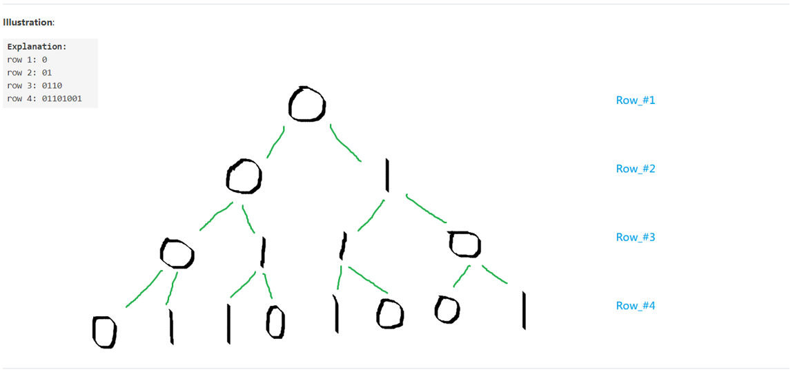
```
Solution - 2: Implementation by the rule of ouput:
======================================================

Observation:

Output value is decided by the number of 1s in binary representation of (K-1)

If binary representation of K-1 has odd 1s, then output value is 1
If binary representation of K-1 has even 1s, then output value is 0
```
##### Complexity Analysis:
```
TC: O(N)
SC: O(1)
```
```python
# Solution - 1: Implementation by recursion:
# ======================================================
class Solution:
    def kthGrammar(self, N: int, K: int) -> int:
        
        if N == 1:
            # Base case:
            return 0
        
        else:
            # General case:
            if K % 2 == 0:
                
                # even index of current level is opposite of parent level's [(K+1)//2]
                return 0 if self.kthGrammar(N-1, (K+1)//2) else 1
            else:
                # odd index of current level is the same as parent level's [(K+1)//2]
                return 1 if self.kthGrammar(N-1, (K+1)//2) else 0
				
# Solution - 2: Implementation by the rule of ouput:
# ======================================================
class Solution:
    def kthGrammar(self, N: int, K: int) -> int:
        
        return bin(K-1).count('1') % 2
```

<br/>
<div align="right">
    <b><a href="#algorithms">⬆️ Back to Top</a></b>
</div>
<br/>

####  [LC-776:Split BST](https://leetcode.com/problems/split-bst/)
##### Solution Explanation:
```
Recursion
=============================

Intuition and Algorithm
=============================
The root node either belongs to the first half or the second half. Let's say it belongs to the first half.

Then, because the given tree is a binary search tree (BST), the entire subtree at root.left must be in the first half. However, the subtree at root.right may have nodes in either halves, so it needs to be split.

```
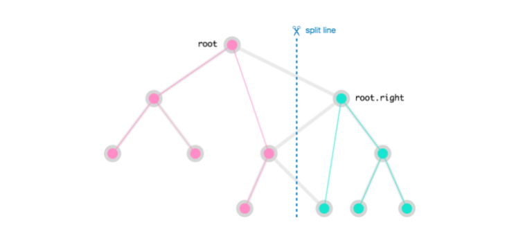
```
In the diagram above, the thick lines represent the main child relationships between the nodes, while the thinner colored lines represent the subtrees after the split.

Lets say our secondary answer bns = split(root.right) is the result of such a split. Recall that bns[0] and bns[1] will both be BSTs on either side of the split. The left half of bns must be in the first half, and it must be to the right of root for the first half to remain a BST. The right half of bns is the right half in the final answer.
```
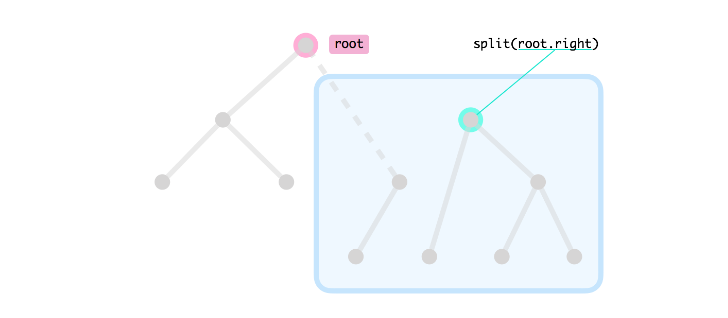
```
The diagram above explains how we merge the two halves of split(root.right) with the main tree, and illustrates the line of code root.right = bns[0] in the implementations.
```
##### Complexity Analysis:
```
Complexity Analysis
=====================
Time Complexity: O(N), where N is the number of nodes in the input tree, as each node is checked once.

Space Complexity: O(N).
```
```python
class Solution(object):
    def splitBST(self, root, V):
        if not root:
            return None, None
        elif root.val <= V:
            bns = self.splitBST(root.right, V)
            root.right = bns[0]
            return root, bns[1]
        else:
            bns = self.splitBST(root.left, V)
            root.left = bns[1]
            return bns[0], root
```

<br/>
<div align="right">
    <b><a href="#algorithms">⬆️ Back to Top</a></b>
</div>
<br/>

## Sliding Window
| #     | Title	                                         | url                                                                           | Time   | Space   | Difficulty | Tag	        | Note                   |
| ----- | ---------------------------------------------- | ----------------------------------------------------------------------------- | ------ | ------- | ---------- | ------------ | ---------------------- |
| 0003  | [Longest Substring Without Repeating Characters](#lc-3longest-substring-without-repeating-characters) | https://leetcode.com/problems/longest-substring-without-repeating-characters/ | _O(n)_   | _O(1)_    | Medium     |              |                        |
| 0209  | [Minimum Size Subarray Sum](#lc-209minimum-size-subarray-sum) | https://leetcode.com/problems/minimum-size-subarray-sum/       | _O(n)_ | _O(1)_  | Medium     |       | Binary Search, Sliding Window |

####  [LC-3:Longest Substring Without Repeating Characters](https://leetcode.com/problems/longest-substring-without-repeating-characters/)
##### Solution Explanation:
```
Sliding window
We use a dictionary to store the character as the key, the last appear index has been seen so far as value.
seen[charactor] = index

move the pointer when you met a repeated character in your window.

indext    0    1    2    3   4   5   6   7
string    a    c    b    d   b   a   c   d
          ^                  ^
          |                  |
		left               right
		seen = {a : 0, c : 1, b : 2, d: 3} 
		# case 1: seen[b] = 2, current window  is s[0:4] , 
		#        b is inside current window, seen[b] = 2 > left = 0. Move left pointer to seen[b] + 1 = 3
		seen = {a : 0, c : 1, b : 4, d: 3} 
indext    0    1    2    3   4   5   6   7
string    a    c    b    d   b   a   c   d
						 ^   ^
					     |   |
				      left  right		
indext    0    1    2    3   4   5   6   7
string    a    c    b    d   b   a   c   d
					     ^       ^
					     |       |
				       left    right		
		# case 2: seen[a] = 0,which means a not in current window s[3:5] , since seen[a] = 0 < left = 3 
		# we can keep moving right pointer.
```
##### Complexity Analysis:
```
* Time complexity :O(n).
n is the length of the input string.
It will iterate n times to get the result.

* Space complexity: O(m)
m is the number of unique characters of the input.
We need a dictionary to store unique characters.
```
```python
class Solution:
    def lengthOfLongestSubstring(self, s: str) -> int:
        seen = {}
        l = 0
        output = 0
        for r in range(len(s)):
            """
            If s[r] not in seen, we can keep increasing the window size by moving right pointer
            """
            if s[r] not in seen:
                output = max(output,r-l+1)
            """
            There are two cases if s[r] in seen:
            case1: s[r] is inside the current window, we need to change the window by moving left pointer to seen[s[r]] + 1.
            case2: s[r] is not inside the current window, we can keep increase the window
            """
            else:
                if seen[s[r]] < l:
                    output = max(output,r-l+1)
                else:
                    l = seen[s[r]] + 1
            seen[s[r]] = r
        return output
```

<br/>
<div align="right">
    <b><a href="#algorithms">⬆️ Back to Top</a></b>
</div>
<br/>

####  [LC-209:Minimum Size Subarray Sum](https://leetcode.com/problems/minimum-size-subarray-sum/)
##### Solution Explanation:
```
The result is initialized as res = n + 1.
One pass, remove the value from sum s by doing s -= A[j].
If s <= 0, it means the total sum of A[i] + ... + A[j] >= sum that we want.
Then we update the res = min(res, j - i + 1).
Finally we return the result res.
```
##### Complexity Analysis:
```
TC: O(N)
SC: O(1)
```
```python
# TC: O(N)
# SC: O(1)
class Solution:
    def minSubArrayLen(self, target: int, nums: List[int]) -> int:
        i, res = 0, len(nums) + 1
        for j in range(len(nums)):
            s -= nums[j]
            while s <= 0:
                res = min(res, j - i + 1)
                s += nums[i]
                i += 1
        return res % (len(nums) + 1)
```

<br/>
<div align="right">
    <b><a href="#algorithms">⬆️ Back to Top</a></b>
</div>
<br/>

## Greedy and Backtracking
| #     | Title	                                         | url                                                                           | Time   | Space   | Difficulty | Tag	        | Note                   |
| ----- | ---------------------------------------------- | ----------------------------------------------------------------------------- | ------ | ------- | ---------- | ------------ | ---------------------- |
| 0046  | [Permutations](#lc-46permutations)             | https://leetcode.com/problems/permutations/                                   | _O(n * n!)_  | _O(n)_ | Medium       |       |                        |
| 0078  | [Subsets](#lc-79subsets)                       | https://leetcode.com/problems/subsets/                                        | _O(n * 2^n)_ | _O(1)_ | Medium       |       |                        |
| 0039  | [Combination Sum](#lc-39combination-sum)       | https://leetcode.com/problems/combination-sum/                                | _O(k * n^k)_ | _O(k)_ | Medium       |       |                        |
| 0022  | [Generate Parentheses](#lc-22generate-parentheses) | https://leetcode.com/problems/generate-parentheses/                       | _O(4^n / n^(3/2))_ | _O(n)_ | Medium |       |                        |

####  [LC-46:Permuations](https://leetcode.com/problems/permutations/)
##### Solution Explanation:
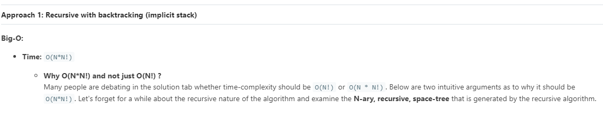
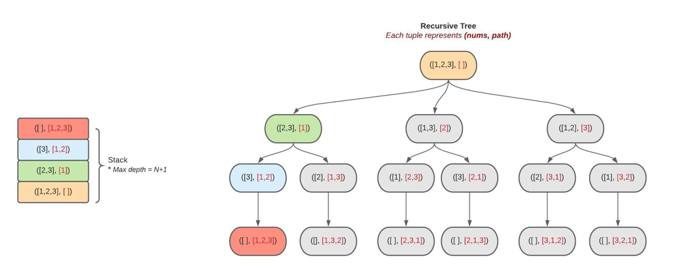
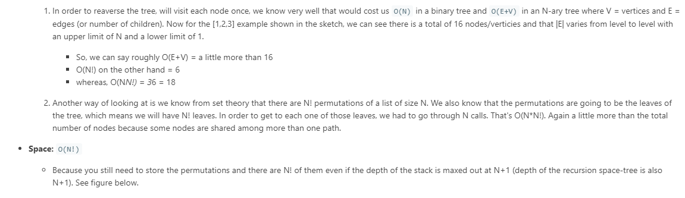
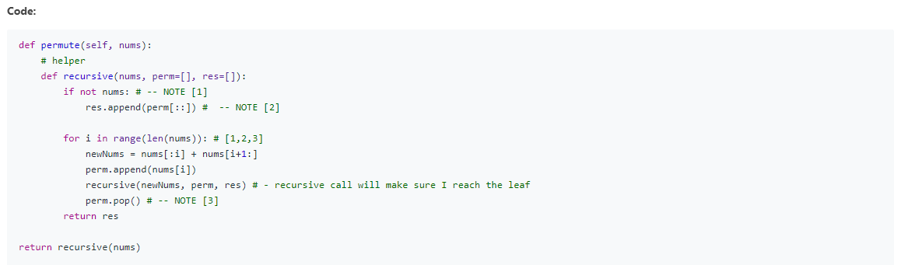
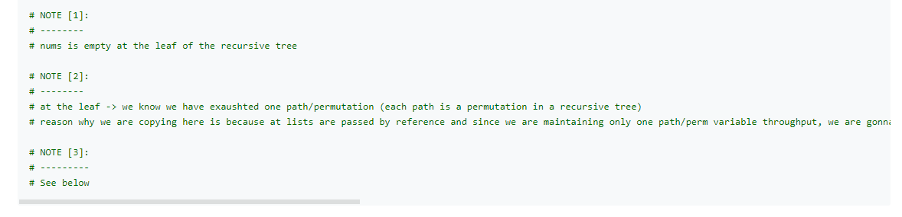
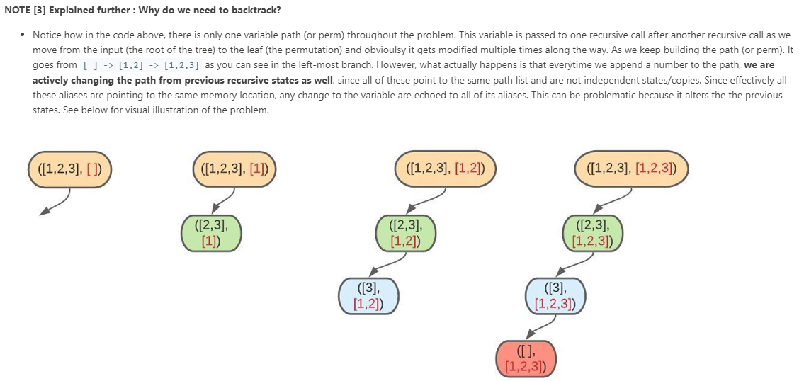
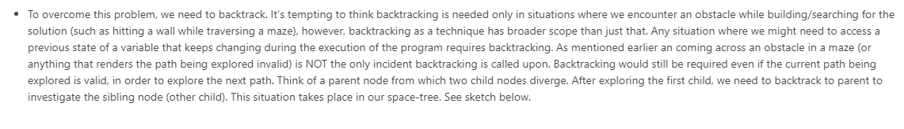
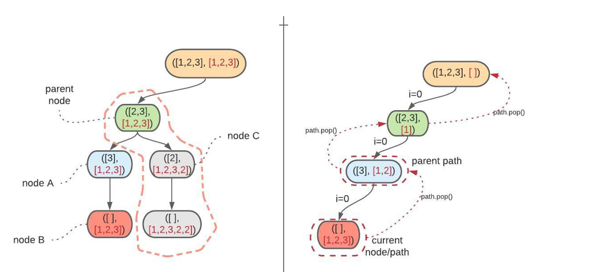

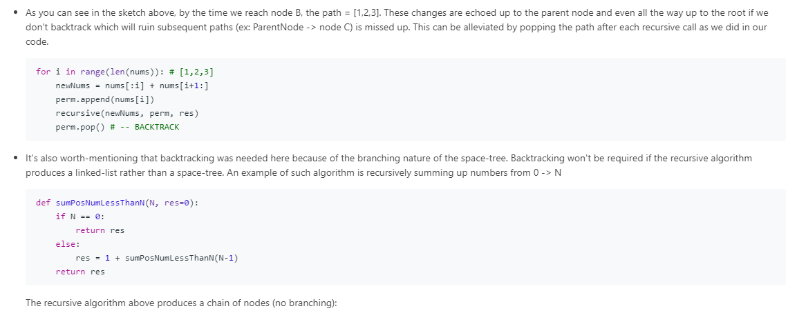
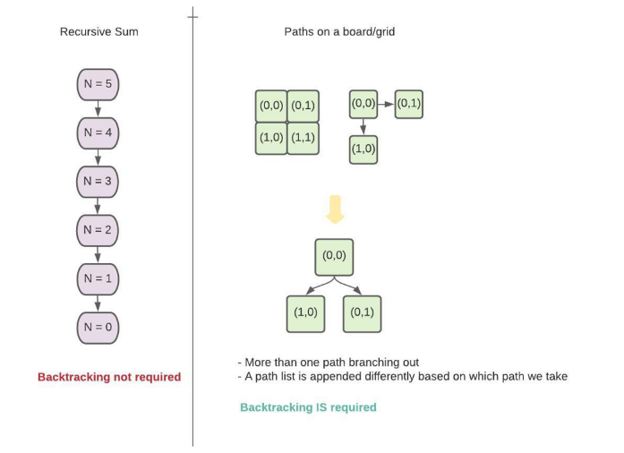
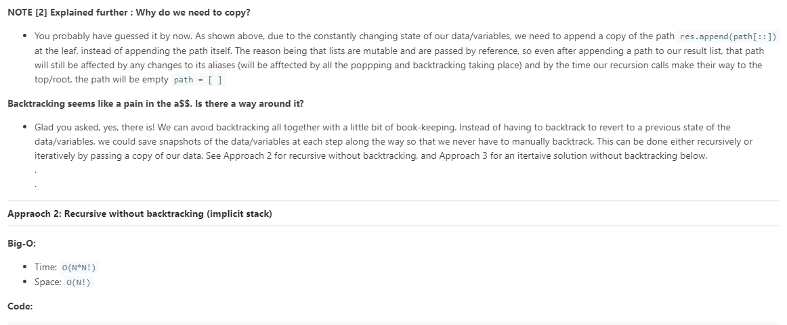
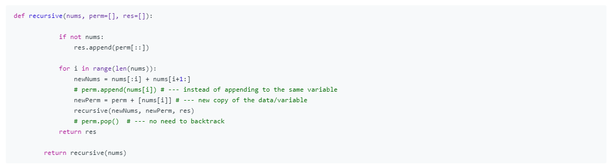
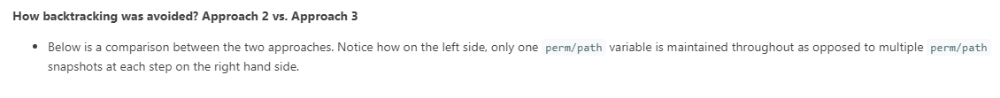

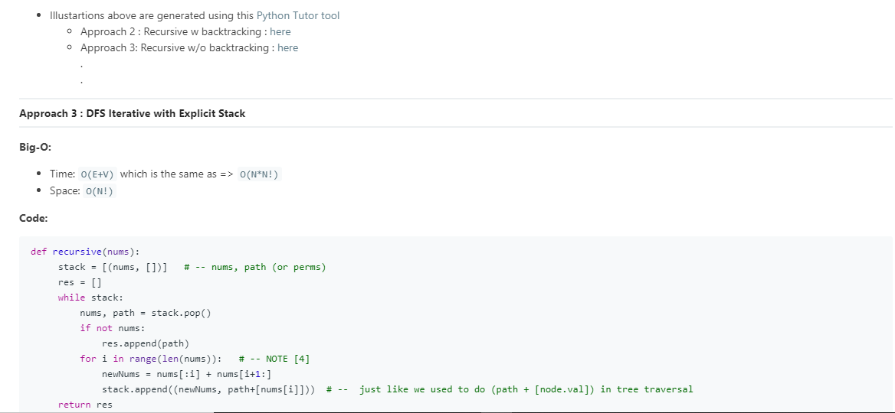
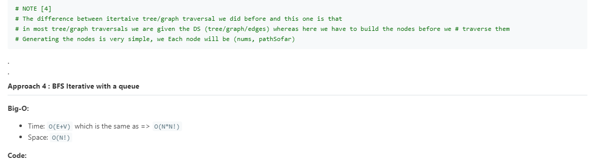
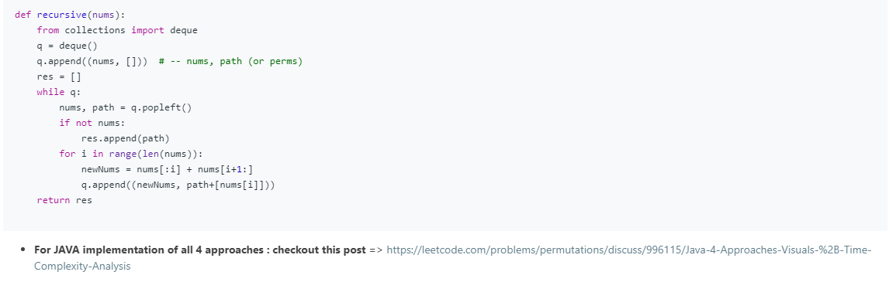
```python
# Approach 1: Recursive with backtracking (implicit stack)
# Time: O(N*N!)
# Space: O(N!)
from typing import List
class Solution:
    def permute(self, nums: List[int]) -> List[List[int]]:
	    # helper
	    def recursive(nums, perm=[], res=[]):
		    if not nums: # -- NOTE [1] 
			    res.append(perm[::]) #  -- NOTE [2] 

		    for i in range(len(nums)): # [1,2,3]
			    newNums = nums[:i] + nums[i+1:]
			    perm.append(nums[i])
			    recursive(newNums, perm, res) # - recursive call will make sure I reach the leaf
			    perm.pop() # -- NOTE [3] 
		    return res
        return recursive(nums)

# Approach 2: Recursive without backtracking (implicit stack)
# Time: O(N*N!)
# Space: O(N!)
from typing import List
class Solution:
    def permute(self, nums: List[int]) -> List[List[int]]:
        if not nums: 
            res.append(perm[::]) 

        for i in range(len(nums)): 
            newNums = nums[:i] + nums[i+1:]
            # perm.append(nums[i]) # --- instead of appending to the same variable
            newPerm = perm + [nums[i]] # --- new copy of the data/variable
            permute(newNums, newPerm, res) 
            # perm.pop()  # --- no need to backtrack
        return res
    return permute(nums)

# Approach 3 : DFS Iterative with Explicit Stack
# Time: O(E+V) which is the same as => O(N*N!)
# Space: O(N!)
from typing import List
class Solution:
    def permute(self, nums: List[int]) -> List[List[int]]:
	    stack = [(nums, [])]   # -- nums, path (or perms)
	    res = []
	    while stack:
		    nums, path = stack.pop()
		    if not nums:
			    res.append(path)
		    for i in range(len(nums)):   # -- NOTE [4]
			    newNums = nums[:i] + nums[i+1:]
			    stack.append((newNums, path+[nums[i]]))  # --  just like we used to do (path + [node.val]) in tree traversal
	    return res

# NOTE [4]
# The difference between itertaive tree/graph traversal we did before and this one is that
# in most tree/graph traversals we are given the DS (tree/graph/edges) whereas here we have to build the nodes before we # traverse them
# Generating the nodes is very simple, we Each node will be (nums, pathSofar)

# Approach 4 : BFS Iterative with a queue
# Time: O(E+V) which is the same as => O(N*N!)
# Space: O(N!)
from collections import deque
from typing import List
class Solution:
    def permute(self, nums: List[int]) -> List[List[int]]:
	    q = deque()
	    q.append((nums, []))  # -- nums, path (or perms)
	    res = []
	    while q:
		    nums, path = q.popleft()
		    if not nums:
			    res.append(path)
		    for i in range(len(nums)):
			    newNums = nums[:i] + nums[i+1:]
			    q.append((newNums, path+[nums[i]]))
	    return res
```

<br/>
<div align="right">
    <b><a href="#algorithms">⬆️ Back to Top</a></b>
</div>
<br/>

####  [LC-78:Subsets](https://leetcode.com/problems/subsets/)
##### Solution Explanation:
```
This is a classic backtracking problem. Every back tracking problem can be solved by using the "choose"-> "explore" -> "unchoose" strategy.
"Choosing" is based on the decision tree specific to the problem. Look at the image attached.
```

```
At every level, the decision is whether to include the first element from the remaining set into the chosen set. Based on the decision, further exploration follows.
```
##### Complexity Analysis:
```
Time Complexity: O(2 ^ n) :: where , n --> nums.size()
Space Complexity: O(n).
```
```python
class Solution:
    def subsets(self, nums: List[int]) -> List[List[int]]:
        def explore(chosen, remaining, res):
            if not remaining:
                res.append(chosen[:])
                return
            d = remaining.pop(0)
            #choose
            chosen.append(d)
            #explore
            explore(chosen, remaining, res)
            chosen.pop()
            explore(chosen, remaining, res)
            #unchoose
            remaining.insert(0, d)
        
        res = []
        chosen = []
        explore(chosen, nums, res)
        return res
```

<br/>
<div align="right">
    <b><a href="#algorithms">⬆️ Back to Top</a></b>
</div>
<br/>

####  [LC-39:Combination Sum](https://leetcode.com/problems/combination-sum/)
##### Solution Explanation:
```
# --------------------------------------
# Approach-1 : DFS (w/ Backtracking)
# --------------------------------------
Combination questions can be solved with dfs most of the time. I'm following caikehe's approach. Also, if you want to fully understand this concept and backtracking, try to finish this post and do all the examples.

We have an array [1, 2, ..., n], if k == 0, meaning combination of zero numbers which is nothing (lines #7, 8, 9), right? Return [[]].

def combine(self, n, k):
    res = [] #1
    self.dfs(range(1,n+1), k, 0, [], res) #2
    return res #3
    
def dfs(self, nums, k, index, path, res):  #4
	print('index is:', index)
    print('path is:', path)
    if k == 0:  #7
        res.append(path)  #8
        return # backtracking  #9 
    for i in range(index, len(nums)):  #10
        self.dfs(nums, k-1, i+1, path+[nums[i]], res)  #11
		
Lines #1, 2, 3 are the main function, where you initialize res = []. Also, you call the dfs function to find all the combinations, and finally, you return the res. The dfs function is the main part of the code. Lines #7, 8 were explained before. dfsfuction goes into deeper levels until these two lines get activated. Keep reading.

Let's do an example for the rest! I define levels as the number of times dfs gets called recursively before moving on in the for loop of line #10.

---- Level 0 (input: nums, k=2, index = 0, path = [], res = []).
The idea of dfs is that it starts from first entry of nums = [1, 2, ..., n]. At first, nums[0] gets chosen in line #10, it calls the dfs again in line #11 with updated inputs and goes basically one level deeper to choose the second number in the combination (note that his combination would look something like [1, ...], right? nums doesn't change, but since we have already chosen one entry, variables get updated k = k - 1. Also, since we're already chosen entry 0, index variable becomes i = i +1 to go one step deeper.

---- Level 1 (input: nums, k=1, index = 1, path = [1], res = []).
Now, in line #10, the range changes. It starts from 1 to len(nums). It goes in and calls dfs one more time.

--- Level 2 (input: nums, k=0, index = 2, path = [1,2]], res = []).
This time it gets stuck in line #7, and appends path to res. Now, res = [[1,2]].

Does this make sense?

All these level just return one combination, right? ( res = [[1,2]]). Remember going into deeper levels happened when we were in line #10 and called dfs for the first time in line #11, and then for the second time in level 1, and we ended up in level 2 and got stuck in line #7. Now, we go back one step to level 1 and move on in line #10. This time, i = 1 and index = 2. Again we go back to level 2 and return path = [1,3]. This will be appended to res to get to res = [[1,2],[1,3]]. Finally, we exhaust all indices in level 1. We end up with res = [[1,2],[1,3],[1,4]]. We go up one level, to level 0. Move on in line #10, this time, we'll get to path = [[2,3],[2,4]], and will update res = [[1,2],[1,3],[1,3],[2,3],[2,4]]. We keep going to get the final combination, we're done.

If you want to fully understand how this works, try to print some variables at the start of your dfs function. I printed index and path and this is the outcome.

index is: 0
path is: []
index is: 1
path is: [1]
index is: 2
path is: [1, 2]
index is: 3
path is: [1, 3]
index is: 4
path is: [1, 4]
index is: 2
path is: [2]
index is: 3
path is: [2, 3]
index is: 4
path is: [2, 4]
index is: 3
path is: [3]
index is: 4
path is: [3, 4]
index is: 4
path is: [4]

Final output: [[1, 2], [1, 3], [1, 4], [2, 3], [2, 4], [3, 4]]
Another way of doing this without the index variable is:

class Solution:
    def combine(self, n: int, k: int) -> List[List[int]]:
        res = []
        self.dfs(range(1,n+1), k, [], res)
        return res
        
    def dfs(self, nums, k, path, res):
        if k == 0:
            res.append(path)
            return res
        
        if len(nums) >= k:
            for i in range(len(nums)):
                self.dfs(nums[i+1:], k-1, path+[nums[i]], res)
        return
That's it!

# --------------------------------------
# Approach-2 : Dynamic Programming
# --------------------------------------
class Solution:
    def combinationSum(self, candidates: List[int], target: int) -> List[List[int]]:
        dp = [[[]]] + [[] for _ in range(target)]
        for candidate in candidates:
            for i in range(candidate, target + 1):
                dp[i] += [sublist + [candidate] for sublist in dp[i - candidate]]
        return dp[target]
```
##### Complexity Analysis:
```
```
```python
# --------------------------------------
# Approach-1 : DFS
# --------------------------------------
from typing import List

class Solution:
    def combine(self, n: int, k: int) -> List[List[int]]:
        res = []
        self.dfs(range(1,n+1), k, [], res)
        return res
        
    def dfs(self, nums, k, path, res):
        if k == 0:
            res.append(path)
            return res
        
        if len(nums) >= k:
            for i in range(len(nums)):
                self.dfs(nums[i+1:], k-1, path+[nums[i]], res)
        return

# --------------------------------------
# Approach-2 : Dynamic Programming
# --------------------------------------
from typing import List

class Solution:
    def combinationSum(self, candidates: List[int], target: int) -> List[List[int]]:
        dp = [[[]]] + [[] for _ in range(target)]
        for candidate in candidates:
            for i in range(candidate, target + 1):
                dp[i] += [sublist + [candidate] for sublist in dp[i - candidate]]
        return dp[target]
```

<br/>
<div align="right">
    <b><a href="#algorithms">⬆️ Back to Top</a></b>
</div>
<br/>

####  [LC-22:Generate Parentheses](https://leetcode.com/problems/generate-parentheses/)
##### Problem Description:

##### Learning Points (Catalan Numbers):
```
A famous ancient question in this context is:
"How many distinct arrangements of n pairs of left-right parentheses are there all of which close?"
The answer to this question is called the n-th Catalan number, C(n).
Here are the first few answers:
  * C(1)=1         ( )
  * C(2)=2         ()() and (())
  * C(3)=5         ()()(), ()(()), (())(), (()()) and ((()))


Generating all combinations of well formed parentheses is a typical example of catalan numbers.
You can use the links at the bottom here if you are not aware of the catalan numbers since they
are at the heart of the exercise.
Let time complexity for the generating all combinations of well-formed parentheses is f(n),
then,
f(n) = g(n) * h(n) where g(n) is the time complexity for calculating nth catalan number,
and h(n) is the time required to copy this combination to result array.

Therefore, f(n) = catalan(n) * O(n) which is O((4^n/n^1.5)*(n)).
Broadly saying just remember that this is a typical example of catalan number
and it's time complexity is similar to how catalan(n) is got.
Further readings in to catalan numbers:

https://en.wikipedia.org/wiki/Catalan_number
https://www.youtube.com/watch?v=GlI17WaMrtw
https://www.youtube.com/watch?v=eoofvKI_Okg
```
##### Solution Explanation:
```
# --------------------------------------
# Backtracking Solution:
# --------------------------------------
The idea is to have a empty string, and put “(” and “)” in one by one.
We put “(” in first. In total there are n “(”. We can keep adding “(” in until we used up all the “(”.
Then we start adding “)” in. To keep the resulting string well-formed, we only add in “)” 
when the number of existing “(” exceeds the number of “)” in the current string:
```

```
When current string length == 2*n, we got an answer. Therefore we record it, 
and return to previous step to search for other possible combinations.
```
##### Code Analysis
```
At first sight, it looks complicated to get a clear view of how it backtracks, specifically where the “return” returns to.
At least I struggled for a while.

I didn’t give up. In the end, I successfully get this tree, which clearly shows how the program goes.
It turned out, back tracking is just DFS, or in my opinion, traverse a tree:
```
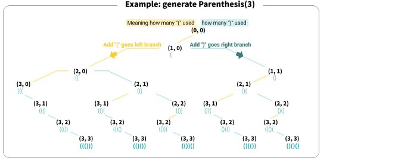
```
Note that the tree is not full, because our two if-cases cut some of the tree branches.
```
##### Complexity Analysis:
```
My Analysis:
---------------------------------
Time Complexity: The tree has a max height of 2n, therefore the max nodes the tree has is 2^ 2n. 
Therefore the time complexity is O(2^ 2n)=O(4^n).

Space Complexity: We have 2^(2n-1) leaves at most, therefore, the time complexity is O(4^n).
Clearly, my analysis over estimated the total tree nodes, and the number of leaves.

Leetcode Analysis:
---------------------------------
The tree is not full, and the number of leaves actually can be described by n-th Catalan number, which is bounded by 4^n /(n ^ 3/2).

Time Complexity: since each sequence at most back tracks 2n steps, time complexity is n-th Catalan number*2n, which gives O( 4^n / (n^ 1/2) ).
Space Complexity: since each sequence takes at most 2*n space, the answer list takes at most n-th Catalan number*2n space, which gives O( 4^n / (n^ 1/2) ).
---------------------------------

TC: O( 4^n / (n^ 1/2) )
SC: O( 4^n / (n^ 1/2) )
```
##### References:
[Crack Leetcode 22: Generate Parentheses](https://christinalalay.medium.com/crack-leetcode-22-generate-parentheses-895de3a677c7)
```python
# TC: O( 4^n / (n^ 1/2) )
# SC: O( 4^n / (n^ 1/2) )
from typing

class Solution:
    def generateParenthesis(self, n: int) -> List[str]:
        """
		:type n: int
		:rtype: List[str]
		"""
		res = []
		self.generateHelper(res, n, 0, 0, "")
		return res
		
    def generateHelper(self, res, n, left, right, temp):
        if len(temp) == 2*n:
            res.append(temp)
            return
        else:
            if left < n:
                self.generateHelper(res, n, left+1, right, temp+"(")
            if right < left:
                self.generateHelper(res, n, left, right+1, temp+")")
```

<br/>
<div align="right">
    <b><a href="#algorithms">⬆️ Back to Top</a></b>
</div>
<br/>
