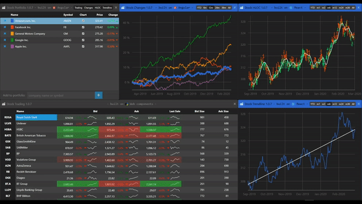

# Build a Stock Portfolio App with OpenFin Platform API

Wijmo Stock Portfolio is a financial sample that demonstrates the usage of [Wijmo Components](https://www.grapecity.com/wijmo) in an [OpenFin](https://openfin.co/) application. 
This application consists of several windows. [OpenFin’s new Platform API](https://openfin.co/platform-api/) allows users to arrange these windows in the 
desired workspace.

Here is an example of a possible workspace dashboard:


OpenFin notifications provide support for notifications. Wijmo Stock Portfolio utilizes this by providing the user the ability to view a portfolio change history in the Notification Center:


The stock portfolio app consists of several windows. Each window is implemented using different web frameworks (like React, Angular, and Web Components). OpenFin’s new Platform API allows users to arrange and customize windows into the desired workspace.

See the app in action! This video demonstrates how the app works while arranging windows like a dashboard:



As the images above illustrate, each window provides unique functionalities:

### Stock Portfolio Window
This window allows users to manage portfolios and view general stock info. Being a main window, this window is shown first on the application launch. It allows users to control the visibility of other windows within the toolbar in the header.

### Stock Changes Window
This window displays price changes on the chart for each stock in the portfolio.

### Stock HLOC Window
This window displays stock prices on the chart in two different formats: HLOC (high-low-open-close) and moving average. HLOC chart consists of a two-color scheme that represents whether a market is "bullish" (the closing price is higher than it opened) or "bearish" (the closing price is lower than it opened).

### Stock Trendline Window
As a previous one, this window also contains two different charts but in another format: raw prices and price trendline as a linear approximation.

### Stock Trading Window
This window provides users the ability to view live trading information in the table view.

## How to Build and Run the Financial Application
Install the application from GitHub:

```bash
git clone https://github.com/GrapeCity/wijmo-openfin.git
cd stock-portfolio && npm install
```

Next, build and run the application in development mode:

```bash
npm start
```

In addition, you can build a distribution package and run the application from there:

```bash
npm run package
```

## Running the App as a Non-Developer
If you aren’t a developer and still want to try this application, we published an installer [here](https://github.com/GrapeCity/wijmo-openfin/releases/download/v1.0.7/stock-portfolio-1.0.7.exe).

Install the app and launch it on a Windows machine. Zero technical expertise required!

## Directory Structure
This project is organized in the following way:


Directory ‘./packages’ includes different projects that act as building blocks for this sample application:

* Directory ‘stock-core’ contains a codebase shared between other projects.
* Directory ‘stock-portfolio’ holds the main web application project. This project is built on the Angular framework.
* Directory ‘stock-charts’ defines a location for the project that represents charts web application built on React framework.
* Directory ‘stock-trading’ holds the project that demonstrates the usage of Wijmo web components in building live trading web application.

Directory ‘./resources’ includes different resources required for building this sample application.

## Used Technologies
As previously discussed, Wijmo Stock Portfolio is OpenFin application. OpenFin provides a desktop experience for existing web applications by wrapping them into the corresponding desktop windows (just like web browsers load and display web pages).

In this sample, every application window loads separate web applications. For demonstration purposes, these web applications are built on different web technologies, as shown in this figure:


These web applications utilize Wijmo controls for building UI, regardless of what web technology used.

## The Stock Portfolio Architecture
The following diagram shows Wijmo Stock Portfolio architecture:


Every application window is running in a separate OpenFin application under OpenFin Runtime. When the user launches the application, OpenFin Runtime first loads the Stock Portfolio configuration file (step #1 on the diagram), then starts the Stock Portfolio application and opens web application in the main window by URL retrieved from the configuration file (step #2 on the diagram).

Once the user requests to open a window, the Stock Portfolio application uses OpenFin API to start the corresponding OpenFin application by providing its configuration in the parameters (step #3 on the diagram).

Then OpenFin Runtime opens the requested web application by URL from provided configuration (step #4 on the diagram).

## Inter-App Communincation
OpenFin supports different APIs to make it possible for multiple applications to communicate with each other and share data across themselves in the most efficient way.

In Wijmo Stock Portfolio, the main window provides stock data to other windows so that dataflow is directed from a single window to multiple ones. In order to exchange messages in such a paradigm, Wijmo Stock Portfolio uses OpenFin Channels API.

Here are the code excerpts that show how the connection is established between the main window and other ones respectively:

```JavaScript
this._channelPromise = fin.InterApplicationBus.Channel.create(ChannelName)
        .then(channel => this._handleCreate(channel));
```

Once the connection is established, windows can exchange messages with each other. In order to receive messages, the listener simply registers on those topics it needs. This code excerpt shows how the main window receives messages on the topic ‘SelectionChanged.‘

```JavaScript
    private _handleCreate(channel: ChannelProvider): ChannelProvider {
        console.log('Channels: connected');
        channel.register(ChannelTopics.SelectionChanged, symbol => this._selectionChanged(symbol));
        // ...
        return channel;
    }

    // ...

    // update grid selection to match portfolio selection
    private async _selectionChanged(symbol) {
        console.log('Channels: received message "currentChanged"');

        const p = this.portfolio;
        for (let i = 0; i < p.view.items.length; i++) {
            if (p.view.items[i].symbol == symbol) {
                p.view.moveCurrentToPosition(i);
                break;
            }
        }
    }
```

In order to send messages, the sender dispatches messages with specifying a topic. The following code excerpt shows how another window sends messages on the same topic ‘SelectionChanged.‘

```JavaScript
// send notifications about portfolio selection
  async selectionChanged(sender) {
    const selectedSeries = sender.selection;
    this.currentSymbol = selectedSeries ? selectedSeries.name : null;
    this.currentColor = this._getColor(this.currentSymbol);

    const connection = await this._channelPromise;
    connection.dispatch(ChannelTopics.SelectionChanged, this.currentSymbol);

    console.log('Channels: sent message "selectionChanged"');
  }
```

## Wijmo JavaScript Components
Wijmo controls provide a set of UI controls that allow building lightweight, high-speed HTML5/JavaScript apps fast with no dependencies, regardless of what JavaScript framework is being used. To be framework-agnostic, Wijmo includes full support for Angular, React, and Vue, with the same controls across each framework. Using Wijmo controls, the HTML markup is as easy as possible and usually only requires few lines of code.

This code excerpt shows an HTML markup of the companies table using Wijmo FlexGrid control in an Angular application.

```JavaScript
        <wj-flex-grid [itemsSource]="portfolio.view"
                      [headersVisibility]="'Column'"
                      [allowDragging]="'None'"
                      [allowResizing]="'None'"
                      [selectionMode]="'Row'">
            <wj-flex-grid-column [header]="''" [isReadOnly]="true" [width]="50" [align]="'center'">
                <ng-template wjFlexGridCellTemplate [cellType]="'Cell'" let-cell="cell">
                    <a href="#" (click)="removeExistingItem(cell.item.symbol)" [wjTooltip]="'Remove'" class="action-remove">
                        <span class="glyphicon glyphicon-remove"></span>
                    </a>
                </ng-template>
            </wj-flex-grid-column>
            <wj-flex-grid-column header="Name" binding="name" [isReadOnly]="true" [width]="'*'">
                <ng-template wjFlexGridCellTemplate [cellType]="'Cell'" let-cell="cell">
                    <span [ngStyle]="{'background-color': cell.item.color}">
                        &nbsp;&nbsp;&nbsp;
                    </span>
                    &nbsp;
                    {{cell.item.name}}
                </ng-template>
            </wj-flex-grid-column>
            <wj-flex-grid-column header="Symbol" binding="symbol" [isReadOnly]="true" [width]="80"></wj-flex-grid-column>
            <wj-flex-grid-column header="Chart" [isReadOnly]="true" [width]="60" [align]="'center'">
                <ng-template wjFlexGridCellTemplate [cellType]="'Cell'" let-cell="cell">
                    <input type="checkbox" [(ngModel)]="cell.item.chart" />
                </ng-template>
            </wj-flex-grid-column>
            <wj-flex-grid-column header="Price" binding="lastPrice" [isReadOnly]="true" format="n2" [width]="80"></wj-flex-grid-column>
            <wj-flex-grid-column header="Change" binding="changePercent" [isReadOnly]="true" format="p2" [width]="80">
                <ng-template wjFlexGridCellTemplate [cellType]="'Cell'" let-cell="cell">
                    <div class="chg-cell" [ngClass]="getChangeClass(cell.item.change)">
                        <span class="chg-val">{{cell.item.changePercent | percent:'1.2-2'}}</span>
                        <span class="chg-glyph" [ngClass]="getChangeGlyphClass(cell.item.change)"></span>
                    </div>
                </ng-template>
            </wj-flex-grid-column>
        </wj-flex-grid>
It only requires to provide data-binding information and describe how tables cells will look.

The following code excerpts show the methods that render two charts of different types using Wijmo FlexChart control in React application.

  renderChartContent() {
    if (this.props.current) {
      return [
        <wjChart.FlexChartSeries
            key="series"
            itemsSource={this.props.current.chartData}
            name={this.props.current.symbol}
            style={{ stroke: '#ff4700' }}
            altStyle={{ stroke: '#00ff75' }}>
        </wjChart.FlexChartSeries>,
        <wjChartAnalysis.FlexChartMovingAverage
            key="movingAverage"
            itemsSource={this.props.current.chartData}
            name="Moving Average"
            binding="close"
            style={{ stroke: 'white' }}
            period={6}
            type="Simple">
        </wjChartAnalysis.FlexChartMovingAverage>
      ];
    }
    return [];
  }

  render() {
    return (
      <wjChart.FlexChart chartType="HighLowOpenClose" binding="high,low,open,close" bindingX="date">
        {this.renderChartContent()}
        <wjChart.FlexChartAxis wjProperty="axisY" format="n0" majorGrid={true} majorTickMarks={0}></wjChart.FlexChartAxis>
        <wjChart.FlexChartAxis wjProperty="axisX" format="MMM-yyyy" majorGrid={true} majorTickMarks={0}></wjChart.FlexChartAxis>
        <wjChart.FlexChartLegend position="None"></wjChart.FlexChartLegend>
      </wjChart.FlexChart>
    );
  }
```

This code is self-describing and requires to provide data-binding information and defines some of the properties.

## Where can I find the code?
The code can be found in the GitHub repository => [https://github.com/sm2774us/full_stack_interview_prep_2021/tree/main/work_portfolio/openfin/openfin-and-wijmo-js-components-old](https://github.com/sm2774us/full_stack_interview_prep_2021/tree/main/work_portfolio/openfin/openfin-and-wijmo-js-components-old)

## OpenFin Platforms Overview
OpenFin Platforms introduces the new abstraction Views. It made possible to separate content from windows. Content (a web application) is loaded into an OpenFin View which is then attached to a window. Views have no windowing functionality of their own. They must be attached to a window, and given bounds relative to that window, in order to display their content. Views are possible to be configured in different arrangements: columns/rows, tabs and grid.

As stated in OpenFin documentation, OpenFin Platforms application has the following architecture:

* A Platform Controller that exposes functionality for coordinating views and windows.
* One or more child windows of the controller, which may or may not have a layout of views. A collection of windows is referred to as a snapshot.
* One or more views, which provide content. They reside as part of a window's layout.

## Migrating to a Single OpenFin App
The main concern was to move to the single app manifest. The fragment below describes the default snapshot used to define pre-configured workspace in the new Stock Portfolio App:

```json
"snapshot": {         
        "windows": [ 
            { 
                "layout": { 
                    "content": [ 
                        { 
                            "type": "column", 
                            "content": [ 
                                { 
                                    "type": "row", 
                                    "content": [ 
                                        { 
                                            "type": "component", 
                                            "componentName": "view", 
                                            "componentState": { 
                                                "name": "component_stock_portfolio", 
                                                "url": "http://localhost:4200" 
                                            } 
                                        }, 
                                        { 
                                            "type": "component", 
                                            "componentName": "view", 
                                            "componentState": { 
                                                "name": "component_stock_changes_chart", 
                                                "url": "http://localhost:4300/#/changes" 
                                            } 
                                        } 
                                    ] 
                                }, 
                                { 
                                    "type": "row", 
                                    "content": [ 
                                        { 
                                            "type": "component", 
                                            "componentName": "view", 
                                            "componentState": { 
                                                "name": "component_stock_trading", 
                                                "url": "http://localhost:3300" 
                                            } 
                                        } 
                                    ] 
                                } 
                            ] 
                        }                         
                    ] 
                } 
            }, 
            { 
                "layout": { 
                    "content": [ 
                        { 
                            "type": "column", 
                            "content": [ 
                                { 
                                    "type": "component", 
                                    "componentName": "view", 
                                    "componentState": { 
                                        "name": "component_stock_hloc_chart", 
                                        "url": "http://localhost:3100" 
                                    } 
                                }, 
                                { 
                                    "type": "component", 
                                    "componentName": "view", 
                                    "componentState": { 
                                        "name": "component_stock_trendline_chart", 
                                        "url": "http://localhost:3100" 
                                    } 
                                } 
                            ] 
                        }                         
                    ] 
                } 
            } 
        ]
```
As shown above, the default pre-configured workspace consists of two windows. These windows load web applications from the URLs provided in view configuration sections.

## Customizing Window
OpenFin Platforms comes pre-packaged with OpenFin’s Standard Window, which has standard window controls (close, minimize, maximize) and some style customization.

As the name suggests, the Standard Window is used as the default window you get if you don’t specify the window’s URL upon creation.

The concern was to retain Window styles from preview version as much as possible. OpenFin Platform supports two options to customize window:

  1. By providing URL to the styles of OpenFin’s Standard Window

  2. By providing URL to the custom window different than Standard OpenFin

It was decided that the second option is most appropriate.

This task consists of two steps. First, it is needed to define the HTML file that represents the custom window. The HTML file must contain a div HTML element with the ID layout-container where the layout will be rendered. In our case the HTML file is rather simple and represents the frameless window.

You can the find sources here:

```
packages\stock-ui\src\platform-window.
```

Then the URL to the HTML file should be specified in app manifest:

```json
"platform": { 
        ... 
        "defaultWindowOptions": { 
            "url": "http://localhost:3000/platform-window/index.html", 
            ... 
        } 
    }
```

## Customizing Platform Behavior
OpenFin Platform allows to overwrite or extend default Platform behavior by providing a custom Provider. The Platform Provider is the communication hub that coordinates between all windows in a Platform. This Provider runs in a hidden window which is represented by the HTML file.

Similar the window customization, the behavior customization also occurs in the HTML file. Custom HTML file must call fin.Platform.init to initialize the platform and open the manifest-defined snapshot. fin.Platform.init takes an options argument which may contain an overrideCallback property. The class that implements default Platform behavior is provided as an argument to this callback, and OpenFin uses the callback's return value to handle Platform functionality.

Using overrideCallback allows to override default functionality in order to customize Platform behavior.

The code below shows how to override getSnapshot behavior:

```JavaScript
const overrideCallback = (Provider) => { 
    class MyOverride extends Provider { 
        async getSnapshot() { 
            // Custom code here 
        } 
    } 
    return new MyOverride(); 
}; 
fin.Platform.init({ overrideCallback }); 
```

The new Stock Portfolio App uses this mechanism to save app layout when app quits and to restore app layout when app launches. It makes possible to persist user workspace between app launches.

As in the previous section, the URL to custom HTML file is also specified in app manifest. In our case it looks as follows:

```json
"platform": { 
        ... 
        "providerUrl": "http://localhost:3000/platform-provider/index.html", 
        ... 
    }
```

Both custom HTML file and Provider can be found here:

```
packages\stock-ui\src\platform-provider.
```

## Where can I find the code?
The code can be found in the GitHub repository => [https://github.com/sm2774us/full_stack_interview_prep_2021/tree/main/work_portfolio/openfin/openfin-and-wijmo-js-components](https://github.com/sm2774us/full_stack_interview_prep_2021/tree/main/work_portfolio/openfin/openfin-and-wijmo-js-components)

## Developing Financial Applications
Whether you’re developing financial applications, or regularly use financial apps, OpenFin delivers benefits from different points of view. On the technical side, OpenFin provides an environment for the rapid development of financial applications.

Built on top of Google’s Chromium and GitHub’s Electron, OpenFin allows you to leverage the latest HTML5/JavaScript features. In addition, OpenFin has built-in support for workspace management and cross-application interoperability. 
Leveraging enterprise [JavaScript Components like Wijmo](https://www.grapecity.com/wijmo) will allow you to develop your applications even faster.
