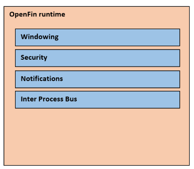

A little demo app to try out OpenFin

* [Overview](#overview)
* [What does the final product look like?](#what-does-the-final-product-look-like)
* [What tools will we use along the way](#what-tools-will-we-use-along-the-way)
* [Where is the code?](#where-is-the-code)
* [What exactly is Openfin, and what problem is it trying to solve?](#what-exactly-is-openfin--and-what-problem-is-it-trying-to-solve)
** [Isn't this Electron?](#isn't-this-electron)
** [What are are the important parts of OpenFin?](#what-are-the-important-parts-of-openfin)
* [A Demo Application](#a-demo-application)
** [How to run the demo app](#how-to-run-the-demo-app)
** [Bundler](#bundler)
** [Express Server Side code](#express-server-side-code)
** [OpenFin Manifest File](#openfin-manifest-file)
** [Launcher](#launcher)
*** [What is this page designed to do?](#what-is-this-page-designed-to-do)
*** [The Html](#the-html)
*** [The TypeScript](#the-typescript)
** [Tiles](#tiles)
*** [What is the Tiles page designed to do?](#what-is-the-tiles-page-designed-to-do)
*** [The Tiles Html/React root component](#the-tiles-htmlreact-root-component]
*** [The Tiles TypeScript](#the-tiles-typescript)
**** [Tiles Redux Workflow](#tiles-redux-workflow)
*** [What is the Tile component designed to do?](#what-is-the-tile-component-designed-to-do)
** [Blotter](#blotter)
*** [What is the Blotter page designed to do?](#what-is-the-blotter-page-designed-to-do)
*** [The Blotter Html/React root component](#the-blotter-htmlreact-root-component]
*** [The Blotter TypeScript](#the-blotter-typescript)
** [Chart](#chart)
*** [What is the Chart page designed to do?](#what-is-the-chart-page-designed-to-do)
*** [The Chart Html/React root component](#the-chart-htmlreact-root-component]
*** [The Chart TypeScript](#the-chart-typescript)
** [Persisting State](#persisting-state)
*** [Hand rolled solution](#hand-rolled-solution)
*** [Using the OpenFin Layouts API](#using-the-openfin-layouts-api)
** [Debugging](#debugging)

## Overview
So it has been a very long time since I wrote an article here at codeproject. I have been quite busy on my blog actually, so have been doing more there of late. Thing is I kind of heard about this technology years ago, and kind of knew what it did, but had never really used it.

That technology is called [OpenFin](https://openfin.co/), whos strap line is "OpenFin OS modernizes financial desktops, enabling instant distribution, strong security and application interoperability".

It just so happens that I am in the business of writing trading apps, it's kind of what I do. Those that know me, know that I used to use WPF a lot. Those days seem ages ago now. I don't really touch anything UI related at all anymore. Crist I was doing Scala and Akka for about 1.5 years, so no UI stuff there at all, and my new job is deep server side/cloud.

That said I do enjoy a bit of UI work, and try to keep up to date, and could not quite resist, looking at [OpenFin](https://openfin.co/), even though it is probably considered pretty old tech by some by now.

Before I started I did a quick search here at codeproject, and could not believe someone has not written about it before to be honest. So I thought Ok I need to do this then.

So this article will be about [OpenFin](https://openfin.co/), and also showing the good parts of it, and the not so good parts of it. We will also see a demo app written to use OpenFin, and learn more about what [OpenFin](https://openfin.co/) is.

So in nutshell this article will be about looking at [OpenFin](https://openfin.co/) and walking through a demo app

## What does the final product look like?
I think the best way to see what the final product looks like is via this small video


[CLICK TO DOWNLOAD VIDEO](https://youtu.be/lgbcAnJF5OQ)

Essentially what I have built is a demo app that is like a VERY VERY cutdown trading app, it has the following features

* Blotter for seeing past trades (in grid form)
* Tiles with FAKE ticking data
* Charts for the tiles, or for the past deals.

Although there are only 3 windows involved this give us enough meat to really try out Openfin

## What tools will we use along the way
This is a fairly chunky demo app, and if you do follow along right to the end you can expect to have seen, or could see in the source code the following technologies in use:

* React
* Redux
* Redux thunk
* ES6
* SCSS
* TypeScript
* Express JS
* Parcel JS
* OpenFin

## Where is the code?
The code for this article is actually hosted at Github : https://github.com/sm2774us/full_stack_interview_prep_2021/tree/main/work_portfolio/openfin/OpenFin-with-react-redux-parcel-js

## What exactly is Openfin, and what problem is it trying to solve?
So as stated above OpenFin think of themselves as the OS for the financial space. Why is this? Well traditionally financial apps have been very rich in data, and real time information, and have required many rich UI elements, such as charts, docking, desktop integration (notify icons, system tray, toast notifications) that sort of thing.

I think it is fair to say this used to be done in a mixture of Winforms/WPF and perhaps MFC.

However things have moved on, and a lot of the UIs that were traditonally done with these tech stacks are now being done with HTML5. However traders are fickle beats and still want their cake and eat it. They like their desktop type of apps.

The thing is HTML5 offers something that is quite unique, you write it once and run it anywhere.

So that's great, and a lot of places have switched to HTML5 and are all happily using the latest Single Page Application (SPA) framework. But there is still a need for proper windowed/workspace driven apps. SPA doesnt fit for all apps.

This is kind of where OpenFin fits in, where it allows you to write HTML5 applications which are then hosted inside an OpenFin container type framework, where the OpenFin runtime will inject itself into your running HTML5 code. There are other OpenFin APIs for different languages, but the HTML JavaScript API is really the main use case.

You can kind of think of it like this


Where OpenFin makes use of the Chromium browser stack. You can kind of think of your source ENTRY point HTML as a single single page app, you can still have all the usual stuff in it like routing etc etc, but if you are trying to emmulate a traditional desktop app, it may make more sense to think of one HTML page as one traditional form/window in a traditional desktop app.

OpenFin comes with a few key things inside it, namely these



What is clever about it, is it is capable of being run on Windows/Mac/Linux where it will emulate the native windowing of the chosen OS. Another important aspect for me is the inter process bus, we will see more on this later.

## Isn't this Electron?
That was exactly the question I came up with, and after looking around at a few things on the internet, it really boils down to these points

One thing to note is that OpenFin is a pretty thin layer on top of Electron, so from a technology perspective they are quite similar.

Security, Electron is not secure by default, it adds Node APIs directly to the renderer threading. As a result an XSS attack can cause havoc! However, Electron has done a lot of work to create a robust opt-in security model (this issue tracks a lot of those changes [https://github.com/electron/electron/issues/6712](https://github.com/electron/electron/issues/6712)). 
OpenFin is an electron fork that is secure by default, you have no access at all to Node APIs. However, if you don't host third party content in your app, XSS is unlikely, and Electron can be used quite safely.

Check out this video of Chuck, the OpenFin CTO, talking about security [https://www.youtube.com/watch?v=jhY4kdY_0Ho](https://www.youtube.com/watch?v=jhY4kdY_0Ho)

Distribution, the OpenFin distribution model involves installing their runtime once, with apps downloaded from the internet via a manifest file. With Electron you bundle the entire runtime with each app. The OpenFin model makes life easier in regulated environments where installation of desktop apps is painful.

## What are are the important parts of OpenFin?
As I alluded to above, there are a couple of core features that make OpenFin appealing:

* Native OS windows
* Small distribution that Electron due to not bundling Chromium with every app
* The inter process bus is very useful
* The JavaScript API is quite simple to work with
* The application manifest

We will be seeing all of these elements at pay when we disect the demo app in the next section. 

## A Demo Application
This section will walk through the demo app in some detail, however before we get into the detail lets just go through a few things in words

* There is a small bar that is the main window, this is called Launcher.html. From here you can
** Show the trade blotter window
** Show a chart window
** Show the tiles window
* The tile window may be used to send a message on the bus, to the blotter, so simulate a trade being made, where the blotter will add the new row to its list of trades
* The tile window is also able to either show a chart, or update the CCY pair for the current chart by sending a message on the bus
* The blotter window will listen to messages from the tile window, and will add a new trade on this message being receieved
* The blotter window is also able to either show a chart or update the CCY pair for the current chart by sending a message on the bus
* The chart window simply shows a chart for the requested Url or the one requested on the bus

So that is what we are trying to build, if you go back and watch the demo video again you will see all this in action 

## How to run the demo app
So if you do find that you want to run the demo app, this is what you need to do

**Build it**

* open the code folder (find the folder with server.js in it)
* open a node command prompt
* `npm install`
* `npm install -g parcel-bundler`
* `npm install -g openfin-cli`
* `cd public`
* `parcel launcher.html blotter.html chart.html tiles.html`
* Once its built **CTRL+C** as we **don't** want to use the Parcel web host
* If this worked you should see whole bunch of files in the `public\dist` folder

**Then Run It**

* navigate to root folder with `server.js` in it
* open a node command prompt
* `node server`
 
## Bundler
So far we have established the demo app will be a HTML5 project. Now no self respecting HTML5 project these days would be without a bundler. Webpack is the defacto gold standard winning this holy war right now, and I used to revel in the glory of crafting a WebPack config file such as this

```JavaScript
let _ = require('lodash');
let webpack = require('webpack');
let path = require('path');
let fs = require("fs");
let WebpackOnBuildPlugin = require('on-build-webpack');
let ExtractTextPlugin = require('extract-text-webpack-plugin');
let HtmlWebpackPlugin = require('html-webpack-plugin');

let babelOptions = {
    "presets": ["es2015", "react"]
};

function isVendor(module) {
    return module.context && module.context.indexOf('node_modules') !== -1;
}

let entries = {
    index: './src/index.tsx',
    indexCss: './scss/index.scss'

};

//build it to the Play Framework public folder, which is services by the assets controller
let buildDir = path.resolve(__dirname, '../public/dist');

module.exports = {

    context: __dirname,

    entry: entries,

    output: {
        filename: '[name].bundle.[hash].js',
        path: buildDir,
		//this is to make it play nice with the Play Framework Assets controllers
		//that deals with static data
		publicPath: '/assets/dist'
    },

    // these break for node 5.3+ when building WS stuff
    node: {
        fs: 'empty'
    },

    watch: true,

    devServer: {
        open: true, // to open the local server in browser
        contentBase: __dirname,
    },

    // Enable sourcemaps for debugging webpack's output.
    devtool: "source-map",

    resolve: {
        extensions: [".tsx", ".ts", ".js", ".jsx"],
        modules: [path.resolve(__dirname, "src"), "node_modules"]
    },

    plugins: [

        //The ProvidePlugin makes a module available as a variable in every other
        //module required by webpack
        new webpack.ProvidePlugin({
            $: "jquery",
            jQuery: "jquery",
            "window.jQuery": "jquery"
        }),

        // creates a common vendor js file for libraries in node_modules
        new webpack.optimize.CommonsChunkPlugin({
            names: ['vendor'],
            minChunks: function (module, count) {
                return isVendor(module);
            }
        }),

        // creates a common vendor js file for libraries in node_modules
        new webpack.optimize.CommonsChunkPlugin({
            name: "commons",
            chunks: _.keys(entries),
            minChunks: function (module, count) {
                return !isVendor(module) && count > 1;
            }
        }),


        //will unlink unused files on a build
        //http://stackoverflow.com/questions/40370749/how-to-remove-old-files-from-the-build-dir-when-webpack-watch
        new WebpackOnBuildPlugin(function (stats) {
            const newlyCreatedAssets = stats.compilation.assets;

            const unlinked = [];
            fs.readdir(path.resolve(buildDir), (err, files) => {
                files.forEach(file => {
                    if (file != "fonts") {
                        if (!newlyCreatedAssets[file]) {
                            fs.unlink(path.resolve(buildDir + '\\' + file));
                            unlinked.push(file);
                        }
                    }
                });
                if (unlinked.length > 0) {
                    console.log('Removed old assets: ', unlinked);
                }
            })
        }),

        //scss/sass files extracted to common css bundle
        new ExtractTextPlugin({
            filename: '[name].bundle.[hash].css',
            allChunks: true,
        }),

        new HtmlWebpackPlugin({
            filename: 'index.html',
            template: 'template.html',
        })
    ],

    module: {
        rules: [
            // All files with a '.ts' or '.tsx' extension will be handled by 'awesome-typescript-loader' 1st 
            // then 'babel-loader'
            // NOTE : loaders run right to left (think of them as a cmd line pipe)
            {
                test: /\.ts(x?)$/,
                exclude: /node_modules/,
                use: [
                  {
                      loader: 'babel-loader',
                      options: babelOptions
                  },
                  {
                      loader: 'awesome-typescript-loader'
                  }
                ]
            },


            // All files with a .css extenson will be handled by 'css-loader'
            {
                test: /\.css$/,
                loader: ExtractTextPlugin.extract(['css-loader?importLoaders=1']),
            },

            // All files with a .scss|.sass extenson will be handled by 'sass-loader'
            {
                test: /\.(sass|scss)$/,
                loader: ExtractTextPlugin.extract(['css-loader', 'sass-loader'])
            },


            // All files with a '.js' extension will be handled by 'babel-loader'.
            {
                test: /\.js$/,
                exclude: /node_modules/,
                use: [
                  {
                      loader: 'babel-loader',
                      options: babelOptions
                  }
                ]
            },

            { 
                test: /\.png$/, 
                loader: "url-loader?limit=100000" 
            },
      
            { 
                test: /\.jpg$/, 
                loader: "file-loader" 
            },

            {
                test: /\.woff(\?.*)?$/,
                loader: 'url-loader?prefix=fonts/&name=fonts/[name].[ext]&limit=10000&mimetype=application/font-woff'
            },

            {
                test: /\.woff2(\?.*)?$/,
                loader: 'url-loader?prefix=fonts/&name=fonts/[name].[ext]&limit=10000&mimetype=application/font-woff2'
            },

            {
                test: /\.ttf(\?.*)?$/,
                loader: 'url-loader?prefix=fonts/&name=fonts/[name].[ext]&limit=10000&mimetype=application/octet-stream'
            },

            {
                test: /\.eot(\?.*)?$/, loader: 'file-loader?prefix=fonts/&name=fonts/[name].[ext]'
            },

            {
                test: /\.svg(\?.*)?$/,
                loader: 'url-loader?prefix=fonts/&name=fonts/[name].[ext]&limit=10000&mimetype=image/svg+xml'
            },

            // All output '.js' files will have any sourcemaps re-processed by 'source-map-loader'.
            {
                enforce: "pre",
                test: /\.js$/,
                loader: "source-map-loader"
            }
        ]
    }
};
```

Where this config would give me the following features

* Babel transpiling to JS
* TypeScript transpiling to JS
* SCSS transpiling to CSS
* I could use entry points to correct grok the dependency graphs
* I could use SourceMaps
* I could use images that would be encoded to base64 strings if below a certain size
* I could use a HTML template that works with my sitributable hashed assets

Great all cool stuff indeed.....Then a much cleverer webdev collegue of mine showed me [https://parceljs.org/](https://parceljs.org/), 
which requires this much effort to achieve the same thing as above


Can you see all the effort in that white square. That's right there is NONE. None at all, no config. 
This is what I get produced for NO effort at all :


See how I get hashed JS files (even though the demo app uses TypeScript), multiple entry points one per file (so thats one dependency graph per etry point), I get CSS (even though the demo app used SCSS), oh and I also get source maps


Don't believe me, well here is the demo app running where I have debugged into it, and you can see we do indeed get the source maps sent to the browser (for PROD there is another procedure [https://parceljs.org/production.html](https://parceljs.org/production.html))

All of this is pretty amazing for a simple command line like this `parcel launcher.html blotter.html chart.html tiles.html`

## Express Server Side code
OpenFin may be a container but its not magical, for any HTML content, there MUST be something that is responsible for serving this data. While we are on this subject OpenFin does also create desktop shortcuts and menu icons, but these are just shortcuts to the `app.json` manifest file. If you don't have the actual backend that serves the app running the OpenFin shortcuts won't work at all.

For the demo app, this is done using Node and Express. The role of Express in this demo app is fairly important, as it is where the OpenFin boostrapping occurs where it reads the mainfest file, and also where it provides the various roots to serve the demo application as a whole. In this Express code you will find all the routes possible for the demo application.

Ideally I would link this all back to a proper backend store, but for this demo app, I am using the Express server code as an in memory repository.

```JavaScript
function formatDate(date) {
    var d = new Date(date);
    return [(d.getMonth() + 1).padLeft(),
    d.getDate().padLeft(),
    d.getFullYear()].join('/') + ' ' +
        [d.getHours().padLeft(),
        d.getMinutes().padLeft(),
        d.getSeconds().padLeft()].join(':');
}

function createGuid() {

    var r = (new Date()).getTime().toString(16) + Math.random().toString(16).substring(2) + "0".repeat(16);
    return r.substr(0, 8) + '-' + r.substr(8, 4) + '-4000-8' + r.substr(12, 3) + '-' + r.substr(15, 12);
}

function formatTo2Places(theNum) {
    var result = Math.round(theNum * 100) / 100
    return parseFloat(result.toString(10)).toFixed(2);
}

function copyFile(filename) {

    fs.copyFile('public/data/' + filename, 'public/dist/' + filename, (err) => {
        if (err) throw err;
    });
}

Number.prototype.padLeft = function (base, chr) {
    var len = (String(base || 10).length - String(this).length) + 1;
    return len > 0 ? new Array(len).join(chr || '0') + this : this;
}

var blotterData = [
    { "pair": "BTCEUR", "price": 5646.00 , "dateCreated": formatDate(Date.now()), "internalId": createGuid() },
    { "pair": "BTCGBP", "price": 5046.54, "dateCreated": formatDate(Date.now()), "internalId": createGuid() }
];

var express = require('express')
    , http = require('http')
    , path = require('path')
    , openfinLauncher = require('openfin-launcher')
    , bodyParser = require("body-parser")
    , fs = require('fs');


var app = express();
//Here we are configuring express to use body-parser as middle-ware.
app.use(bodyParser.urlencoded({ extended: false }));
app.use(bodyParser.json());

app.set('title','Express Parcel app');
app.use(express.static(path.join(__dirname, 'public/dist')));

copyFile('BTCEUR_d.csv');
copyFile('BTCGBP_d.csv');
copyFile('BTCUSD_d.csv');
copyFile('ETHEUR_d.csv');
copyFile('ETHUSD_d.csv');
copyFile('LTCEUR_d.csv');
copyFile('LTCUSD_d.csv');
copyFile('XRPUSD_d.csv');

/* serves main page  */
app.get('/', function (req, res) {
    res.sendFile("public/dist/launcher.html", { "root": __dirname });
});


app.get('/blotter', function (req, res) {
    res.sendFile("public/dist/blotter.html", { "root": __dirname });
});

app.post('/trade', function (req, res) {
    blotterData.push({ 
		"pair": req.body.pair, 
		"price": formatTo2Places(req.body.price), 
		"dateCreated": formatDate(Date.now()), 
		"internalId": createGuid() });
    res.sendStatus(200);
});

app.get('/chart', function (req, res) {
    res.sendFile("public/dist/chart.html", { "root": __dirname });
});

app.get('/tiles', function (req, res) {
    res.sendFile("public/dist/tiles.html", { "root": __dirname });
});

app.get('/tileInfos', function (req, res) {
    res.send(
        [
            { "tilePair": "BTCEUR", "tilePrice": 5646.00 },
            { "tilePair": "BTCGBP", "tilePrice": 5046.54 },
            { "tilePair": "BTCUSD", "tilePrice": 3799.92 },
            { "tilePair": "ETHEUR", "tilePrice": 195.3 },
            { "tilePair": "ETHUSD", "tilePrice": 134.46 },
            { "tilePair": "LTCEUR", "tilePrice": 51.61 },
            { "tilePair": "LTCUSD", "tilePrice": 44.96 },
            { "tilePair": "XRPUSD", "tilePrice": 0.3121 },
        ]
    );
});

app.get('/blotterInfos', function (req, res) {
    res.send(blotterData);
});

app.get('/csvdata/:pair', function (req, res) {
    var pair = req.params["pair"]
    res.sendFile('public/dist/' + pair + '_d.csv', { "root": __dirname });
});


/* process.env.PORT is used in case you want to push to Heroku, 
   for example, here the port will be dynamically allocated */
var port = process.env.PORT || 1234;

const configPath = path.join(__dirname, 'public', 'app.json');
const localServer = http.createServer(app).listen(port, function(){
    console.log('Express server listening on port ' + port);
    openfinLauncher.launchOpenFin({ configPath }).then(() => {
        localServer.close();
    });
});
```

## OpenFin Manifest File
For OpenFin to be able to run the app, we need to supply it with a manifest file. This file should be called `App.json` and should contain information about how to boostrap the app. Here is the one for the demo app

```JavaScript
{
  "devtools_port": 9090,
  "startup_app": {
    "name": "OpenfinPOC",
    "description": "OpenFin POC",
    "url": "http://localhost:1234",
    "showTaskbarIcon": true,
    "taskbarIcon": "http://cdn.openfin.co/hyperblotter/favicon.ico",
    "icon": "http://cdn.openfin.co/hyperblotter/favicon.ico",
    "uuid": "Openfin react-redux-parcel demo",
    "autoShow": true,
    "contextMenu": true,
    "defaultWidth": 480,
    "maxWidth": 480,
    "minWidth": 480,
    "defaultHeight": 120,
    "maxHeight": 120,
    "minHeight": 120,
    "frame": true,
    "defaultCentered": true,
    "resizable": false
  },
  "runtime": {
    "arguments": "--enable-crash-reporting --no-sandbox",
    "version": "stable"
  },
  "shortcut": {
    "company": "OpenFin",
    "description": "Openfin POC",
    "name": "Openfin POC"
  }
}
``` 

## Launcher
The Launcher is the main window for the demo app, and it is the one served up by the Express backend for a GET `http://localhost:1234`, and it looks like this


This is also one of the Parcel.JS entry points. You can kind of think of every single window as a individual standalone app, and as such it will require its own entry point with Parcel.js, and should have a HTML page. A Window in OpenFin lingo equates to a new HTML page. Which for Parcel means new entry point/new dependency graph.

As such this is pretty typical setup for a entry point (Tiles/Blotter/Graph all follow this pattern)

### What is this page designed to do?
This page is designed as a simple launcher (as its name suggests), and it simply launches other HTML windows using both the OpenFin JS API where the content for the page is served up using Express JS. 

### The Html
```html
<html>

<head>
	
</head>
<body id="launcher">
  <div id="root"></div>
  <script src="src/LauncherEntry.tsx"></script>
</body>
</html>
```

See how this references the src/LauncherEntry.tsx

### The TypeScript
Where the src/LauncherEntry.tsx looks like this

```JavaScript
import * as React from 'react';
import * as ReactDOM from 'react-dom';
import { LauncherComponent } from './Launcher';

if (window['module'] && window['module'].hot) {
  window['module'].hot.dispose(function() {});

  window['module'].hot.accept(function() {
      ReactDOM.render(<LauncherComponent />, document.getElementById('root'));
  });
}

ReactDOM.render(<LauncherComponent />, document.getElementById('root'));
```

Where this in turns uses hot module loading when it mounts the `React LauncherComponent` which is the view for the `Launcher` window, which looks like this

```JavaScript
import * as React from 'react';
import * as ReactDOM from 'react-dom';
import { interval } from 'rxjs';

//scss
import '../../node_modules/bootstrap/dist/css/bootstrap.min.css';
import { Button } from 'react-bootstrap';
import '../scss/index.scss';

//images
import chartColoredLogo from '../img/chartColored.png';
import chartGrayLogo from '../img/chartGray.png';
import tableColoredLogo from '../img/tableColored.png';
import tableGrayLogo from '../img/tableGray.png';
import tilesColoredLogo from '../img/tilesColored.png';
import tilesGrayLogo from '../img/tilesGray.png';
import HoverImage from "react-hover-image"

//components
import { showChartWindow } from "./utils/ChartUtils"
import { LayoutService } from "./utils/LayoutUtils"


document.addEventListener("DOMContentLoaded", function () {
    init();
});


function init() {
    console.log("Dom Loaded ", this);

    try {
        fin.desktop.main(function () {
            initWithOpenFin();
        })
    } catch (err) {
        initNoOpenFin();
    }
};

async function initWithOpenFin() {

    const app = await fin.Application.getCurrent();
    const mainWindow = await app.getWindow();
    console.log("mainWindow",mainWindow);

    await LayoutService.getInstance().hydrateWindows(mainWindow);

    interval(1000).subscribe(async x => {
        await LayoutService.getInstance().persistWindows(mainWindow);
    });
}

function initNoOpenFin() {
    alert("OpenFin is not available - you are probably running in a browser.");
}


class Launcher extends React.Component<undefined, undefined> {
    constructor(props: any) {
        super(props);
    }

    render() {
        return (
            <div id="launcherDiv">
                
                <HoverImage className="launcherImages"
                    src={tableGrayLogo}
                    hoverSrc={tableColoredLogo}
                    onClick={this.handleTableClick} />
                <HoverImage className="launcherImages"
                    src={chartGrayLogo}
                    hoverSrc={chartColoredLogo}
                    onClick={this.handleChartClick} />
                <HoverImage className="launcherImages"
                    src={tilesGrayLogo}
                    hoverSrc={tilesColoredLogo}
                    onClick={this.handleTilesClick} />
            </div>
        );
    }

    handleTableClick = async (e) => {
        await LayoutService.getInstance().showChildWindow("Blotter", '/blotter', 800, 200, true);
    }

    handleChartClick = async (e) => {
        await showChartWindow('BTCEUR');
    }

    handleTilesClick = async (e) => {
        await LayoutService.getInstance().showChildWindow("Tiles", '/tiles', 560, 350, false);
    }
}


export const LauncherComponent = () => (
    <Launcher/>
);
```

This is all pretty standard `React` stuff here, nice that JS has finally come of age and uses stuff like Lambdas (arrow functions to the JS crowd) and `async-await` YAY

The few special callout sin the code above are these

See how we check for the presence of OpenFin in the `Init()` method. This is pretty much the standard way of detecting if you are in OpenFin mode or attempting to run this app in a browser (where it probably wont work as it was designed to be an OpenFin app after all)

The other is how we launch a new OpenFin window which is achieved using this code:

```JavaScript
showChildWindow = async (name: string, url: string, width: number, height: number, resizable: boolean) => {

    return await fin.Window.create({
        name: name,
        url: url,
        defaultWidth: width,
        defaultHeight: height,
        width: width,
        height: height,
        resizable: resizable,
        autoShow: true
    });
}
``` 

## Tiles
### What is the Tiles page designed to do?
* This page is designed to show a number of static pairs (these are served up by the Express backend as a static array of data).
* This page taken the initial prices and then creates a new `Tile` for each pair seen.
* The `Tile` itself uses randomness to jiggle the current price up and down.
* A `Tile` can also send a "trade created" message on the bus to the "`blotter`" window
* A `Tile` can also show its pair in the "`chart`" window

This is what the overall `TilesInner` component looks like


### The Tiles Html/React root component
Is works in much the same way as we just saw above with the `src/LauncherEntry.tsx`

### The Tiles TypeScript
This `TilesComponent` is reponsible for rendering ALL individual `Tile` components based on the incoming data, it looks like this

```JavaScript
import * as React from 'react';
import * as ReactDOM from 'react-dom';

//scss
import '../../node_modules/bootstrap/dist/css/bootstrap.min.css';
import '../scss/index.scss';

//components
import { Button } from 'react-bootstrap';
import HoverImage from "react-hover-image"
import { Tile } from './Tile';
import { TileInfo } from './common/commonModels';

//Redux
import { Provider } from 'react-redux'
import { store } from './redux/store';
import { RootState } from './redux/root';
import { connect } from 'react-redux';
import { fetchTilesFromEndpoint } from './redux/tiles';

//images
import loaderLogo from '../img/ajax-loader.gif';


interface TilesProps {
    tileInfos: TileInfo[];
    tileLoadingError: Boolean
}

interface TilesActions {
    fetchTilesFromEndpoint: any;
}

interface TilesState { }

class TilesInner extends React.Component<TilesProps & TilesActions, TilesState> {
    constructor(props: any) {
        super(props);
    }

    render() {
        return (
            (this.props.tileInfos === undefined)
                ? <div className="Loader">
                    <div className="LoaderImage">
                        <span>
                            
                            <br />
                            <span className="Text">Loading</span>
                        </span>
                    </div>
                  </div>
                : <div id="tileContainer">
                    <ul id="listOfTiles">
                        {
                            this.props.tileInfos.map(d => <Tile tilePair={d.tilePair} tilePrice={d.tilePrice} />)
                        }
                    </ul>
                </div>
        );
    }

    componentDidMount() {
        this.props.fetchTilesFromEndpoint();
    }

    //NOTE : This method will be deprecated in near future should use above methods
    componentWillReceiveProps = (nextProps) => {
        var wasTileLoadingError = nextProps.tileLoadingError;
        if (wasTileLoadingError) {
            alert("Could not load tiles");
        }
    }
}

export const Tiles = connect<TilesProps, TilesActions, RootState>(
    state => ({
        tileInfos: state.tiles.tileInfos,
        tileLoadingError: state.tiles.tileLoadingError
    }),
    {
        fetchTilesFromEndpoint: fetchTilesFromEndpoint,
    }
)(TilesInner);


export const TilesComponent = () => (
    <Provider store={store}>
        <Tiles />
    </Provider>
);
```

Where it can be seen we make use of Redux to get the state from the store, and dispatch it back to the `TilesInner` component props.

Lets see how that works

#### Tiles Redux Workflow

We dispatch the call to the store to load state using this.props.fetchTilesFromEndpoint(); . So this gets dispatched to the Redux store. So lets move over to have a look at the redux store

```JavaScript
import { createStore, applyMiddleware } from 'redux';
import { rootReducer } from './root';
import { convertToPlainAction } from '../utils/redux-with-class/convert-to-plain-action';
import thunk  from 'redux-thunk'

let store = createStore(rootReducer, applyMiddleware(convertToPlainAction, thunk));

export { store };
```

Where we use this `rootReducer` to hold the global state

```JavaScript
import * as redux from 'redux';
import { TilesInfoState, tilesReducer } from './tiles';
import { BlotterInfoState, blotterReducer } from './blotter';
import { ChartInfoState, chartReducer } from './chart';

export interface RootState {
    tiles: TilesInfoState;
    blotter: BlotterInfoState;
    chart: ChartInfoState;
}

export const rootReducer = redux.combineReducers({
    tiles: tilesReducer,
    blotter: blotterReducer,
    chart: chartReducer
});
```

Where the actual reducer for the `TilesInner` component looks like this (notice how we use [Redux-Thunk](https://github.com/reduxjs/redux-thunk) to dispatch functions), where it can be see that this code uses the fetch api to call the Express JS backend (server side code basically), and then uses promises to deal with what to dispatch (ie error or good dispatch back the React store connnected component `TilesInner` in this case)

```JavaScript
import { ActionWrapper } from '../utils/redux-with-class/actionwrapper';
import { TileInfo } from '../common/commonModels';

export interface TilesInfoState {
    tileInfos: TileInfo[];
    tileLoadingError: boolean;
}

const initialState: TilesInfoState = {
    tileInfos: TileInfo[0],
    tileLoadingError: false
};

function fetchTileInfos() {
    return fetch('/tileInfos').then(x => {
        return x.json();
    });
}

export function fetchTilesFromEndpoint() {

    return function (dispatch) {
        return fetchTileInfos()
            .then(
                jsonTiles => dispatch(new TileLoadedAction(jsonTiles)),
                reason => dispatch(new TileLoadingErrorAction()
            ));
    };
}

export function tilesReducer(state: TilesInfoState = initialState, wrapper: ActionWrapper) {
  const action = wrapper.action;

  if (action instanceof TileLoadedAction) {
      return {
          ...state,
          tileInfos: action.tileInfos,
          tileLoadingError: false
      }
  }

  if (action instanceof TileLoadingErrorAction) {
    return {
        ...state,
        tileInfos: new Array<TileInfo>(),
        tileLoadingError: true
    };
  }

  return state;
}

class TileLoadedAction {
    type = 'My-App/Tile-Infos-Loaded';

    constructor(public tileInfos: TileInfo[]) {

    }
}


class TileLoadingErrorAction {
    type = 'My-App/Tile-Infos-Loading-Error';

    constructor() {

    }
}
```
The other windows "blotter" and "chart" also using React-Redux in a similar manner, so I won't be discussing how redux works again, as its just the same way.

Ok so now we have seen the `Tiles`, how does a single `Tile` work.

### What is the Tile component designed to do?
* The `Tile` itself uses randomness to jiggle the current price up and down.
* A `Tile` can also send a "trade created" message on the bus to the "`blotter`" window
* A `Tile` can also show its pair in the "`chart`" window

This is what the overall `Tile` component looks like


Well lets see its React markup

```JavaScript
import * as React from 'react';
import * as ReactDOM from 'react-dom';
import { interval } from 'rxjs';

//scss
import '../../node_modules/bootstrap/dist/css/bootstrap.min.css';
import '../scss/index.scss';

//images
import tickGrayLogo from '../img/tickGray.png';
import tickColoredLogo from '../img/tickColored.png';
import chart16GrayLogo from '../img/chart16Gray.png';
import chart16ColoredLogo from '../img/chart16Colored.png';
import blackTriangleUpLogo from '../img/BlackTriangleUp.png';
import greenTriangleUpLogo from '../img/GreenTriangleUp.png';
import blackTriangleDownLogo from '../img/BlackTriangleDown.png';
import redTriangleDownLogo from '../img/RedTriangleDown.png';

//components
import { Button } from 'react-bootstrap';
import HoverImage from "react-hover-image"
import { TileInfo } from './common/commonModels';
import { formatTo2Places } from './common/commonFunctions';
import { showChartWindow } from "./utils/ChartUtils"

interface TileProps {
    tilePair: string;
    tilePrice: number;
}


interface TileState {
    tilePriceRaw: number;
    tileFraction: string;
    tilePriceDigit: string;
    isInitaialised: boolean;
    isUp: boolean;
}


export class Tile extends React.Component<TileProps, TileState> {
    constructor(props: any) {
        super(props);
        this.state = {
            tilePriceDigit: "0",
            tileFraction: "0",
            tilePriceRaw: 0,
            isInitaialised: false,
            isUp:false
        };
    }

    render() {
        return (
            <li key={this.props.tilePair}>
                <div className="card">
                    <div className="tileDescription">
                        <p className="tilePair">{this.props.tilePair}</p>

                        <div id="tileNumbers">
                            <span>
                                <span className="tileLittleNumbers">{this.state.tilePriceDigit}</span>
                                <span className="tileLittleNumbers">.</span>
                                <span className="tileBigNumbers">{this.state.tilePriceFraction}</span>
                            </span>
                        </div>
                        <div className="tileArrowUp">
                            {this.state.isUp ?  : }
                        </div>
                        <div className="tileArrowDown">
                            {this.state.isUp ?  : }
                        </div>                    </div>
                    <div className="tileCommands">
                        <span>
                            <HoverImage className="tileImages"
                                src={tickGrayLogo}
                                hoverSrc={tickColoredLogo}
                                onClick={this.handleTilePlaceTradeClick} />
                        </span>
                        &nbsp;&nbsp;
                        <span>
                            <HoverImage className="tileImages2"
                                src={chart16GrayLogo}
                                hoverSrc={chart16ColoredLogo}
                                onClick={this.handleChartClick} />
                        </span>
                    </div>
                </div>
            </li>
        );
    }

    componentDidMount() {
        interval(500).subscribe(x => {
            this.randomlyJiggleState();
        });
        this.randomlyJiggleState();
    }

    handleTilePlaceTradeClick = async (e) => {
        this.publishMessage();
    }

    handleChartClick = async (e) => {
        await showChartWindow(this.props.tilePair);
    }

    publishMessage = () => {

        fetch('/trade', {
            method: 'POST',
            headers: {
                'Accept': 'application/json',
                'Content-Type': 'application/json',
            },
            body: JSON.stringify({
                pair: this.props.tilePair,
                price: this.state.tilePriceRaw
            })
        })
        .then(
            status => {
                fin.desktop.InterApplicationBus.publish("created-trade-from-tile", {
                    pair: this.props.tilePair,
                    price: this.state.tilePriceRaw
                });
            },
            reason => {
                alert('something went wrong while saving trade');
            }
        ));
    }

    generateRandomNumber = (divisor) => {
        var self = this;
        return Math.random() / divisor
    }

    randomlyJiggleState = () => {
        var self = this;

        if (self.state === undefined || self.state == null)
            return;

        if (self.state.isInitaialised === true) {
            var isNegativeChance = self.generateRandomNumber(1.0);
            var fiddleFactor = self.generateRandomNumber(20.0);
            if (isNegativeChance > 0.5) {
                fiddleFactor = -fiddleFactor;
            }
          
            var newTilePriceRaw = self.state.tilePriceRaw + fiddleFactor;
            var newIsUp = newTilePriceRaw > self.state.tilePriceRaw;

            var newTilePrice = formatTo2Places(newTilePriceRaw);
            var newTilePriceDigit = newTilePrice.substring(0, newTilePrice.indexOf('.'));
            var newTilePriceFraction = newTilePrice.substring(newTilePrice.indexOf('.') + 1);

            self.setState((state, props) => ({
                tilePriceDigit: newTilePriceDigit,
                tilePriceFraction: newTilePriceFraction,
                tilePriceRaw: newTilePriceRaw,
                isUp: newIsUp
            }));            
        }
        else {

            var newTilePriceRaw = self.props.tilePrice
            var newTilePrice = formatTo2Places(newTilePriceRaw)
            var newTilePriceDigit = newTilePrice.substring(0, newTilePrice.indexOf('.'));
            var newTilePriceFraction = newTilePrice.substring(newTilePrice.indexOf('.'));

            self.setState((state, props) => ({
                tilePriceDigit: newTilePriceDigit,
                tilePriceFraction: newTilePriceFraction,
                tilePriceRaw: newTilePriceRaw,
                isInitaialised: true,
                isUp:true
            }));
        }
    }
};
```

As previoulsy shown this component is able to show a new OpenFin window, it also makes use of the OpenFin inter process bus, if you look at these lines this is how the publishing works

```JavaScript
fin.desktop.InterApplicationBus.publish("created-trade-from-tile", {
    pair: this.props.tilePair,
    price: this.state.tilePriceRaw
});
```

## Blotter

### What is the Blotter page designed to do?
* This page is designed to show a static list of trades from the Express endpoint
* It also listens to new trades from a `Tile`
* It can also show a new chart when a row is clicked on, where the rows pair will be used to show the "`chart`" window

This is what the overall `BlotterInner` component looks like


### The Blotter Html/React root component
Is works in much the same way as we just saw above with the `src/LauncherEntry.tsx`

### The Blotter TypeScript
This `BlotterComponent` is responsible for rendering all the trades, and the code for it is like this.

```JavaScript
import * as React from 'react';
import * as ReactDOM from 'react-dom';
import ReactTable from "react-table";


//scss
import '../../node_modules/bootstrap/dist/css/bootstrap.min.css';
import '../scss/index.scss';
import 'react-table/react-table.css'

//components
import { Button } from 'react-bootstrap';
import HoverImage from "react-hover-image"
import { Tile } from './Tile';
import { BlotterInfo } from './common/commonModels';
import { formatTo2Places } from './common/commonFunctions';
import { showChartWindow } from "./utils/ChartUtils"

//Redux
import { Provider } from 'react-redux'
import { store } from './redux/store';
import { RootState } from './redux/root';
import { connect } from 'react-redux';
import { fetchBlotterFromEndpoint } from './redux/blotter';

//images
import loaderLogo from '../img/ajax-loader.gif';

interface BlotterProps {
    blotterInfos: BlotterInfo[];
    blotterLoadingError: Boolean
}

interface BlotterActions {
    fetchBlotterFromEndpoint: any;
}

interface BlotterState {
    selectedRow: number;
}

Number.prototype.padLeft = function (base, chr) {
    var len = (String(base || 10).length - String(this).length) + 1;
    return len > 0 ? new Array(len).join(chr || '0') + this : this;
}

class BlotterInner extends React.Component<BlotterProps & BlotterActions, BlotterState> {
    constructor(props: any) {
        super(props);
    }

    render() {
        const columns = [
            {
                
                Header: () => (
                    <div
                        style={{
                            textAlign: "left"
                        }}
                    >InternalId</div>),
                accessor: 'internalId',
                width:270
            },
            {
                Header: () => (
                    <div
                        style={{    
                            textAlign: "left"
                        }}
                    >Pair</div>),
                accessor: 'pair',
                width:100
            },
            {
                Header: () => (
                    <div
                        style={{
                            textAlign: "left"
                        }}
                    >Price</div>),
                accessor: 'price',
                width:100
            },
            {
                Header: () => (
                    <div
                        style={{
                            textAlign: "left"
                        }}
                    >Date Created</div>),
                accessor: 'dateCreated',
                width:200
            }
        ]
        return (
            (typeof this.props === "undefined" || this.props === null
                || typeof this.props.blotterInfos === "undefined" || this.props.blotterInfos === null))
                ? <div className="Loader">
                    <div className="LoaderImage">
                        <span>
                            
                            <br />
                            <span className="Text">Loading</span>
                        </span>
                    </div>
                </div>
                :
                <ReactTable
                    data={this.props.blotterInfos}
                    columns={columns}
                    getTrProps={(state, rowInfo, column, instance) => {
                        if (typeof rowInfo !== "undefined") {
                            return {
                                onClick: (e, handleOriginal) => {
                                    this.setState({
                                        ...this.state,
                                        selectedRow: rowInfo.index
                                    })
                                    this.handleRowClick(rowInfo, instance,"if")
                                },
                                style: {
                                    background: this.checkRowIsSelected(rowInfo) ? 'cornflowerblue' : '#2c2c2c',
                                    color: this.checkRowIsSelected(rowInfo) ? 'black' : 'white'
                                },
                            }
                        }
                        else {
                            return {
                                onClick: (e, handleOriginal) => {
                                    this.handleRowClick(rowInfo, instance, "else")
                                },
                                style: {
                                    background: '#2c2c2c',
                                    color: 'white'
                                },
                            }
                        }
                    }}

                />
        );
    }


    componentDidMount = () => {
        this.props.fetchBlotterFromEndpoint();
        this.initInterApp();
    }

    //NOTE : This method will be deprecated in near future should use above methods
    componentWillReceiveProps = (nextProps) => {
        var wasBlotterLoadingError = nextProps.blotterLoadingError;
        if (wasBlotterLoadingError) {
            alert("Could not load blotter");
        }
    }

    checkRowIsSelected = (rowInfo) => {
        var result = false;
        if (typeof rowInfo !== "undefined" && typeof this.state !== "undefined" && this.state != null) {
            result= rowInfo.index === this.state.selectedRow ? true : false;
        }
        console.log("result", result);
        return result;
    }

    handleRowClick = async (rowInfo, instance, fromwhere) => {
        console.log(rowInfo);
        if (typeof rowInfo !== "undefined") {
            await showChartWindow(rowInfo.row.pair);
        }
    }

    isSelected = (rowInfo) => {
        return false;
    }


    initInterApp = () => {
        self = this;
 
        fin.desktop.InterApplicationBus.subscribe("*","created-trade-from-tile",
            function (message, uuid) {
                self.props.fetchBlotterFromEndpoint();
            });
    };
}

export const Blotter = connect<BlotterProps, BlotterActions, RootState>(
    state => ({
        blotterInfos: state.blotter.blotterInfos,
        blotterLoadingError: state.blotter.blotterLoadingError
    }),
    {
        fetchBlotterFromEndpoint: fetchBlotterFromEndpoint,
    }
)(BlotterInner);


export const BlotterComponent = () => (
    <Provider store={store}>
        <Blotter/>
    </Provider>
);
``` 

The only really imoportant parts of this are

* It uses [React-Table](https://github.com/tannerlinsley/react-table) to render the grid
* It subscribes to the OpenFin interprocess bus like this

```JavaScript
fin.desktop.InterApplicationBus.subscribe("*","created-trade-from-tile",
    function (message, uuid) {
        self.props.fetchBlotterFromEndpoint();
    });	
``` 

## Chart
### What is the Chart page designed to do?
* This page is designed to show a chart for a given currency pair, where the chart data is a static CSV file served up by Express JS
* It also listens to bus messages from a `Tile`
* It also listens to bus messages from a `Blotter`
* It can also show a new chart window from the `Launcher` where the pair is part of the url for the `Chart` window

This is what the overall `ChartInner` component looks like


### The Chart Html/React root component
Is works in much the same way as we just saw above with the `src/LauncherEntry.tsx`

### The Chart TypeScript
This `ChartComponent` is reponsible for rendering all the trades, and the code for it is like this.

```JavaScript
import * as React from 'react';
import * as ReactDOM from 'react-dom';


//scss
import '../../node_modules/bootstrap/dist/css/bootstrap.min.css';
import '../scss/index.scss';
import 'react-table/react-table.css'


//Redux
import { Provider } from 'react-redux'
import { store } from './redux/store';
import { RootState } from './redux/root';
import { connect } from 'react-redux';
import { fetchChartDataFromWeb } from './redux/chart';

//images
import loaderLogo from '../img/ajax-loader.gif';

//chart
import { FixedWidthChart } from './CryptoChart';
import { getData } from "./utils/ChartUtils"


interface ChartProps {
    chartData: any;
    chartLoadingError: boolean;
}

interface  ChartActions {
    fetchChartDataFromWeb: any;
}


interface ChartState {
    chartData: any;
    pair: string;
}

export class ChartInner extends React.Component<ChartProps & ChartActions, ChartState> {
    constructor(props: any) {
        super(props);
    }

    render() {
        return (
            (typeof this.state === "undefined" || this.state === null
                || typeof this.state.chartData === "undefined" || this.state.chartData === null)
                ? <div className="Loader">
                    <div className="LoaderImage">
                        <span>
                            
                            <br />
                            <span className="Text">Loading</span>
                        </span>
                    </div>
                </div>
                :
                <div className="chartContainer">
                    <FixedWidthChart data={this.state.chartData} pair={this.state.pair} />
                </div>
        );
    }

    initInterApp = () => {
        self = this;

        fin.desktop.InterApplicationBus.subscribe("*", "view-chart-for-pair",
            function (message, uuid) {
                window.location.assign("/chart?pair=" + message.pair);
                document.title = window.location.hostname + ':' + window.location.port + "/chart?pair=" + message.pair;
            });
    };

    componentDidMount = () => {

        this.initInterApp();
        const searchParams = new URLSearchParams(location.search);
        var reqPair = searchParams.get('pair') || 'BTCEUR'
        console.log("Query string pair", reqPair);
        this.setState({ pair:reqPair });
        this.props.fetchChartDataFromWeb(reqPair);
    }

    //static getDerivedStateFromProps(nextProps, prevState) {
    //
    //}

    //componentDidUpdate(prevProps, prevState) {
    //
    //}

    //NOTE : This method will be deprecated in near future should use above methods
    componentWillReceiveProps = (nextProps) => {
        console.log("props data", nextProps.chartData);
        var wasChartLoadingError = nextProps.chartLoadingError;
        if (wasChartLoadingError) {
            alert("Could not load chart data");
            return;
        }
        //NOTE :Dont know why I have to use sta ebyt react-stockcharts doesnt like using the react state
        //transferred to props at all. Hey ho though
        if (nextProps.chartData != null) {
            this.setState({ chartData: nextProps.chartData });
        }
    }


}

export const TheChart = connect<ChartProps, ChartActions, RootState>(
    state => ({
        chartData: state.chart.chartData,
        chartLoadingError: state.chart.chartLoadingError
    }),
    {
        fetchChartDataFromWeb: fetchChartDataFromWeb
    }
)(ChartInner);


export const ChartComponent = () => (
    <Provider store={store}>
        <TheChart />
    </Provider>
);
```

Where the guts of creating the chart is handled by this React component

```JavaScript
import * as React from 'react';
import * as ReactDOM from 'react-dom';

import { format } from "d3-format";
import { timeFormat } from "d3-time-format";

import { ChartCanvas, Chart, ZoomButtons } from "react-stockcharts";
import {
    BarSeries,
    CandlestickSeries,
} from "react-stockcharts/lib/series";
import { XAxis, YAxis } from "react-stockcharts/lib/axes";
import {
    CrossHairCursor,
    MouseCoordinateX,
    MouseCoordinateY,
} from "react-stockcharts/lib/coordinates";

import { discontinuousTimeScaleProvider } from "react-stockcharts/lib/scale";
import {
    OHLCTooltip,
} from "react-stockcharts/lib/tooltip";
import { fitWidth } from "react-stockcharts/lib/helper";
import { last } from "react-stockcharts/lib/utils";

interface CandleStickChartWithZoomPanProps {
    data: any[],
    width: number,
    ratio: number,
    pair: string
};


class CandleStickChartWithZoomPan extends React.Component<CandleStickChartWithZoomPanProps, undefined> {
    constructor(props) {
        super(props);
        this.saveNode = this.saveNode.bind(this);
        this.resetYDomain = this.resetYDomain.bind(this);
        this.handleReset = this.handleReset.bind(this);
    }
    componentWillMount() {
        this.setState({
            suffix: "XXX"
        });
    }
    saveNode(node) {
        this.node = node;
    }
    resetYDomain() {
        this.node.resetYDomain();
    }
    handleReset() {
        this.setState({
            suffix: this.state.suffix + 1
        });
    }
    render() {
        const { data: initialData, width, ratio } = this.props;
        const type = 'svg';
        const mouseMoveEvent, panEvent, zoomEvent = true;
        const zoomAnchor, clamp = false;
        const xScaleProvider = discontinuousTimeScaleProvider
            .inputDateAccessor(d => d.date);
        const {
			data,
            xScale,
            xAccessor,
            displayXAccessor,
		} = xScaleProvider(initialData);

        const start = xAccessor(last(data));
        const end = xAccessor(data[Math.max(0, data.length - 150)]);
        const xExtents = [start, end];

        const margin = { left: 70, right: 70, top: 20, bottom: 30 };

        const height = 400;

        const gridHeight = height - margin.top - margin.bottom;
        const gridWidth = width - margin.left - margin.right;

        const showGrid = true;
        const yGrid = showGrid ? { innerTickSize: -1 * gridWidth, tickStrokeOpacity: 0.2 } : {};
        const xGrid = showGrid ? { innerTickSize: -1 * gridHeight, tickStrokeOpacity: 0.2 } : {};

        return (
            <div>
                <h1>{this.props.pair}</h1>

                <ChartCanvas ref={this.saveNode} height={height}
                    ratio={ratio}
                    width={width}
                    margin={{ left: 70, right: 70, top: 10, bottom: 30 }}

                    mouseMoveEvent={mouseMoveEvent}
                    panEvent={panEvent}
                    zoomEvent={zoomEvent}
                    clamp={clamp}
                    zoomAnchor={zoomAnchor}
                    type={type}
                    seriesName={`${this.state.suffix}`}
                    data={data}
                    xScale={xScale}
                    xExtents={xExtents}
                    xAccessor={xAccessor}
                    displayXAccessor={displayXAccessor}
                >

                    <Chart id={1} yExtents={d => [d.high, d.low]}>
                        <XAxis axisAt="bottom"
                            orient="bottom"
                            zoomEnabled={zoomEvent}
                            {...xGrid} />
                        <YAxis axisAt="right"
                            orient="right"
                            ticks={5}
                            zoomEnabled={zoomEvent}
                            {...yGrid}
                        />

                        <MouseCoordinateY
                            at="right"
                            orient="right"
                            displayFormat={format(".2f")} />

                        <CandlestickSeries />
                        <OHLCTooltip origin={[-40, 0]} />
                        <ZoomButtons
                            onReset={this.handleReset}
                        />
                    </Chart>
                    <Chart id={2}
                        yExtents={d => d.volume}
                        height={150} origin={(w, h) => [0, h - 150]}>
                        <YAxis
                            axisAt="left"
                            orient="left"
                            ticks={5}
                            tickFormat={format(".2s")}
                            zoomEnabled={zoomEvent}
                        />

                        <MouseCoordinateX
                            at="bottom"
                            orient="bottom"
                            displayFormat={timeFormat("%Y-%m-%d")} />
                        <MouseCoordinateY
                            at="left"
                            orient="left"
                            displayFormat={format(".4s")} />

                        <BarSeries yAccessor={d => d.volume} fill={(d) => d.close > d.open ? "#6BA583" : "#FF0000"} />
                    </Chart>
                    <CrossHairCursor />
                </ChartCanvas>
            </div>
        );
    }
}

export const FixedWidthChart: any = fitWidth(CandleStickChartWithZoomPan);
```

Since I showed you how the bus subscription stuff works, there is not much more to add for this component

## Persisting State
OpenFin comes with this cool [Layouts API](https://openfin.co/documentation/layouts-tutorial/) which takes care of docking, snapping of Windows, allows you to persist window state/positions etc etc.

### Hand rolled solution
Sounds great. Only snag is that if like me you have a small laptop but a 4k resolution, this doesnt play well with OpenFin. If you try and run the [OpenFin Layouts API](https://openfin.co/documentation/layouts-tutorial/) whilst you have a scaling value other than 100% you will receive a error message from the Layouts API  on startup.

Sure you could adjust this scaling to be 100% but then your PC is just unusable

You can change the scaling using your display settings, as shown here


So that was a real bummer for me. I wanted to be able to save state/restore state, so what could I do. Well I thought about it, and thought ok it won't be as fancy as the native OpenFin one, but I could just use local storage to save/restore by window layouts, so this is what I did

```JavaScript
import { PersistedWindowInfo } from './../common/commonModels';

export class LayoutService {
    private static instance: LayoutService;
    private static isLoading: boolean;

    private constructor() {

    }

    static getInstance() {
        if (!LayoutService.instance) {
            LayoutService.instance = new LayoutService();
        }
        return LayoutService.instance;
    }


    hydrateWindows = async (mainWindow) => {

        if (typeof (Storage) === "undefined") {
            console.log('browser doesnt support local storage');
            return;
        } 

        try {
            LayoutService.isLoading = true;
            var persistedPersistedWindowsJson = localStorage.getItem('persisted-app-state');
            if (persistedPersistedWindowsJson !== null) {
                var persistedPersistedWindows = [] as PersistedWindowInfo[];
                persistedPersistedWindows = JSON.parse(persistedPersistedWindowsJson);

                console.log('Hydrating using this from storage', persistedPersistedWindows);

                //deal with main window
                var mainWindowInfo = await mainWindow.getInfo();
                for (var i = 0; i > persistedPersistedWindows.length; i++) {
                    var persistedPersistedWindow = persistedPersistedWindows[i];
                    if (persistedPersistedWindow.isChildWindow === true) {
                        const theChildWindow = await this.showChildWindow(
                            persistedPersistedWindow.name,
                            persistedPersistedWindow.url,
                            persistedPersistedWindow.width,
                            persistedPersistedWindow.height,
                            persistedPersistedWindow.resizable);

                        await theChildWindow.setBounds({
                            height: persistedPersistedWindow.height,
                            width: persistedPersistedWindow.width,
                            top: persistedPersistedWindow.top,
                            left: persistedPersistedWindow.left
                        });
                    }
                }

            }
        }
        catch (e) {
            console.log(e);
        }
        finally {
            LayoutService.isLoading = false;
        }
    }


    persistWindows = async (mainWindow) => {

        if (typeof (Storage) === "undefined") {
            console.log('browser doesnt support local storage');
            return;
        } 

        if (LayoutService.isLoading)
            return;

        var persistedPersistedWindows = [] as PersistedWindowInfo[];

        //obtain main window details
        var persistedWindowInfo = await this.extractInfoForWindow(mainWindow, false);
        persistedPersistedWindows.push(persistedWindowInfo);

        //obtain child window details
        const app = await fin.Application.getCurrent();
        var childWindows = await app.getChildWindows();

        for (var i = 0; i > childWindows.length; i++) {
            persistedWindowInfo = await this.extractInfoForWindow(childWindows[i], true);

            var windowUrlWithoutQueryString = persistedWindowInfo.name;
            if (persistedWindowInfo.name.indexOf("?") > 0) {
                windowUrlWithoutQueryString = persistedWindowInfo.name.substring(0, persistedWindowInfo.name.indexOf("?"));
            }
        
            console.log("windowUrlWithoutQueryString",windowUrlWithoutQueryString);
            persistedPersistedWindows = persistedPersistedWindows.filter(function (value, index, arr) {
                return !value.name.startsWith(windowUrlWithoutQueryString);
            });
            persistedPersistedWindows.push(persistedWindowInfo);
        }


        console.log(persistedPersistedWindows);
        console.log("has this many items",persistedPersistedWindows.length);

        localStorage.removeItem('persisted-app-state');
        localStorage.setItem('persisted-app-state', JSON.stringify(persistedPersistedWindows));

    
        var fromStorage = JSON.parse(localStorage.getItem('persisted-app-state'));
        console.log(fromStorage);
        console.log("from storage has this many items", fromStorage.length);

    }


    extractInfoForWindow = async (theWindow, isChild) => {
        var bounds = await theWindow.getBounds();
        var info = await theWindow.getInfo();
        var options = await theWindow.getOptions();
        return new PersistedWindowInfo(
            info.title,
            info.url,
            bounds.width,
            options.defaultWidth,
            options.defaultHeight,
            bounds.height,
            bounds.left,
            bounds.top,
            options.resizable,
            isChild);
    }
	
	
	showChildWindow = async (name: string, url: string, width: number, height: number, resizable: boolean) => {

        return await fin.Window.create({
            name: name,
            url: url,
            defaultWidth: width,
            defaultHeight: height,
            width: width,
            height: height,
            resizable: resizable,
            autoShow: true
        });
    }
   
}
```

Worked very well actually

### Using the OpenFin Layouts API
So I decided to give this a go on my work machine where my monitors have 100% scaling. The code below is the revised `LayoutService`.

NOTE: if you want to run this from the demo code its in the "`using-layouts-api`" branch

```JavaScript
import * as Layouts from "openfin-layouts"
import { interval } from 'rxjs';


export class LayoutService {
    private static instance: LayoutService;

    private constructor() {
        Layouts.workspaces.setRestoreHandler(this.appRestoreHandler);
        Layouts.workspaces.setGenerateHandler(() => {
            //return custom data 
            //return {"foo":"bar"};
            return {}
         });
        Layouts.workspaces.ready();
    }

    static getInstance() {
        if (!LayoutService.instance) {
            LayoutService.instance = new LayoutService();
        }
        return LayoutService.instance;
    }


    persistWindows = async () => {


        const workspaceObject = await Layouts.workspaces.generate();
        
        localStorage.setItem('persisted-app-state', JSON.stringify(workspaceObject));
    }

    hydrateWindows = async () => {
        var persistedData = localStorage.getItem('persisted-app-state');
        if (persistedData !== null) {
            console.log('found old state restoring using it')
            var workspaceObject = JSON.parse(persistedData);
            await Layouts.workspaces.restore(workspaceObject);
        }

        interval(5000).subscribe(async x => {
            await LayoutService.getInstance().persistWindows();
        });
    }


    appRestoreHandler = async (workspaceApp) => {

        const sleep = m => new Promise(r => setTimeout(r, m))

        //iterate through the child windows of the workspaceApp data 
        for (var i = 0; i < workspaceApp.childWindows.length; i++) { 
            await this.openChild(workspaceApp.childWindows[i].name, workspaceApp.childWindows[i].url, workspaceApp.childWindows[i].bounds);
        }
        return layoutApp;
    }

    openChild = async (name: string, url: string, bounds : any) => {
        const win =  await fin.Window.create({
            name: name,
            url: url,
            defaultWidth: 100,
            defaultHeight: 100,
            width: 100,
            height: 100,
            resizable: false,
            autoShow: true
        });
        await this.positionWindow(win, bounds);
    }

    positionWindow = async (theWindow: any, bounds: any) => {

        await theWindow.setBounds({
            height: bounds.height,
            width: bounds.width,
            top: bounds.top,
            left: bounds.left
        });
    }

    showChildWindow = async (name: string, url: string, width: number, height: number) => {

        await fin.Window.create({
            name: name,
            url: url,
            defaultWidth: width,
            defaultHeight: height,
            width: width,
            height: height,
            resizable: false,
            autoShow: true
        });
    }
}
```

## Debugging
Now as a developer you will at some point want to debug your code, so you will likely want to know how to do that. For OpenFin the easiest way to do this is to allow the context menu in your app which you can set in the OpenFin manifest file app.json that we saw above. You basically set this line `"contextMenu": true`

With that turned on you can see a menu and just launch the chrome debug tools:


 