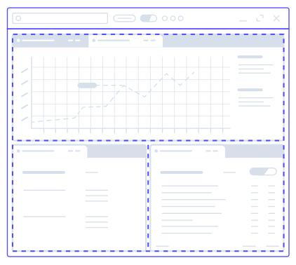
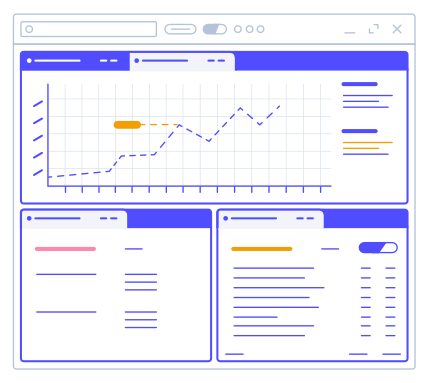
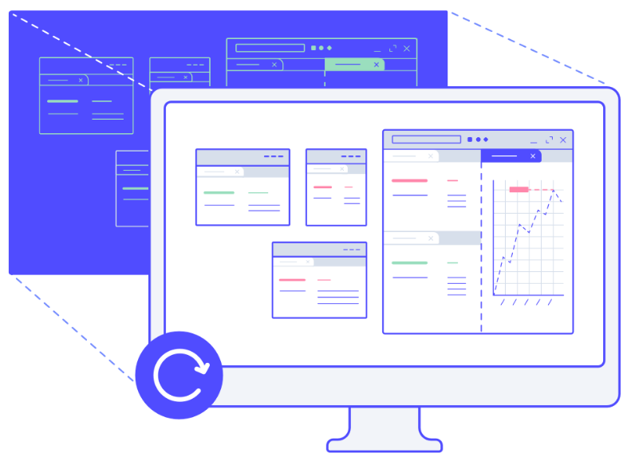
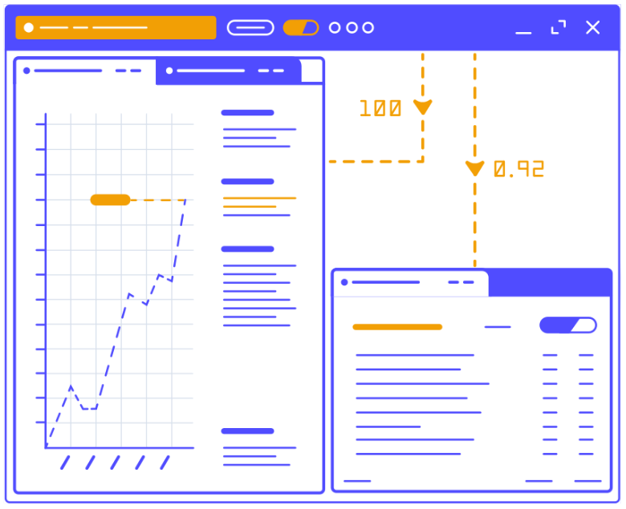

# Closer look at the DNA of the OpenFin Platform API

This blog takes a deep dive into the newly launched [Platform API](https://openfin.co/platform-api/) by [OpenFin](https://openfin.co/). 
After only a few days of playing around with the software, I realized just how much capacity it has and how many good features there are for developers. 
Ultimately, this robust set of features will significantly enhance your user’s experience.

Before I begin, let's start with a bit of background information on OpenFin!

**Dictionary**

**API:** Application Programming Interface **OS:** Operating System **CSS:** Cascading Style Sheets

### What is OpenFin?
Openfin is a tech company focused on modernizing desktops, and accelerating innovation in the financial sector. Simply put, OpenFin is the Operating System of Finance! With this, you get the power you need, the freedom you want, and the security you must have.

### The Problem
If you are in the financial sector, you know that it is very important to be able to visualize everything on one screen when interacting with multiple applications. We usually tend to arrange windows over and over, but that takes time, and our applications do not work with each other, nor do they share all data between them by nature. Most importantly, we have to try to make sure all of these apps are secure!

### The Solution
Platform API of course!

### What is the OpenFin Platform API?
It's a software that will help you build desktop platforms at the speed of light. The Platform API will also facilitate the work of creating a merged user experience across the multiple applications.

> “The Platform API is for central architecture teams who want to provide web apps with a unified desktop experience and common look & feel.” - OpenFin Engineer
>

### Key Features of the OpenFin Platform API
* Layout management (e.g. window drag-and-drop and tabbing)
* Customization of window look & feel
* Styling via CSS
* URL for loading the title bar window
* Customization of all Platform APIs (behaviors)
* Save and restore your window view.
* Window level context (different from FDC3)
* “Smart” Manifests to describe platforms via a single .JSON file

### The Powerful Gridlayout



One of my favorite features is their grid layout. This feature has helped me reduce the amount of time it takes to develop an app. It can get pretty complicated to create dynamic grids that work with internal and external windows, by dragging and dropping. Now, if you see it from the end user point of view, this is an awesome idea, because the grid is customizable!

Now, I know what you are thinking. And no, you don't need to ask the developer to change the layout of the application. You, as an end user, can change the layout as well. This gives every end user the opportunity to have customs views of their apps that best fit their needs, and grow their productivity.

As a developer, I believe this is a huge benefit, since I don't have to worry about writing the code for this dynamic grid, nor do I need to worry about customizing the layout for each end user or client, which allows me to focus on the actual applications that will be used inside of the Platform API.

### Because a Grid layout is not enough



The Platform API gives you the ability to power up your platform not only with custom layouts, but also with tabs! As a developer, I can develop my applications used inside of the platform with the assurance that they can be grouped together on tabs. And one of the coolest things is that you can customize them! If you are an end user of the platform, there are so many benefits here. E.g You can group the tabs by colors, where each color represents windows that belong to a certain group. This is huge. I have seen monitors of people working in the financial sector with 20 open windows and sometimes, users get lost in this. It's hard to manage what's going on.

### Your perfect setup...always



So while working with the Platform API, I found out that you can save the current platform setup. This is an amazing feature. When working with dynamic layout, having to re-arrange things every time the code compiles can become very tedious. Now, imagine the benefits of this for the end users!

As a developer, you can easily retrieve the existing snapshot of your saved platform by using the **applySnapshot** method.

```JavaScript
platform.applySnapshot(mySnapshot, {closeExistingWindows: true});
```

Thanks to this, you don't have to worry about losing the perfect setup that took you time to arrange. The setup will be always the same as long as you want to apply the saved snapshot!

### Advanced workflows



The Platform API allows you to get the current context of your window. Thanks to this, you can easily save it into the platform's snapshots to re-use the context when the **aplySnapShot** method is called.

### The Core
Now, let's take a closer look at the core of OpenFin’s Platform API and dive into some code examples. What is the core? It’s the manifest! I like to refer to it as the core because it is what carries all the information which constructs your Platform API project.

The manifest is located inside of a **.json** file AKA the **app.json**

### Let’s Get Started
Let's create our manifest:

```json
{
    "platform": {
        "uuid": "thisdot_platform"
    }
}
```

As you can see, this is the beginning of a new project using the Platform API. All you have to do is declare the "platform" object in your app.json.

Now let’s dive into the features to customize the application experience.

### Customizing the Platform API Window
Customize your window's look and feel using css, and by adding defaultWindowOptions. You manifest will look as follows:

```json
{
    "platform": {
        "uuid": "example_platform",
        "defaultWindowOptions": {
            "stylesheetUrl": "url-to-css-stylesheet"
        }
    }
}
```

**Take a look at [this file](https://github.com/openfin/layouts-v2-style-examples/blob/master/layout.css) to see what css selectors are available in the Platform API.**


You can also replace the default windows that come with the Platform API. To do this, specify the **url** property as a window option in your manifest. You can import your custom HTML as follows:

```json
...
"defaultWindowOptions": {
    "url": "url-to-html-file"
}
...
```

**When working with your custom window, all you have to do is consider the following:**

> This HTML file must specify a div component with the ID layout-container where you want the layout to be rendered. This will ensure that the window has a target to render the layout in. A url can also be specified in windowOptions in a snapshot, or when launching a snapshot via other methods.
>

### Window Commands
OpenFin enables your Platform API application to work and feel like a native desktop application. That's why Openfin engineers further enhanced this experience by adding commands (with appropriate hotkeys) to help improve user experience.

These commands can be added to the platform object inside of your Platform API manifest.

```json
...
"commands": [
  {
    "command": "stack.nextTab",
    "keys": "Ctrl+T"
  }
]
...
```

### Window Snapshot
Another important property of the manifest is the **snapshot**. This property defines the structure of your window inside of the Platform. The snapshot needs to contain the window property where we will define the objects that go inside of it like views, and you can even define the structure of the grid by the layout property each window has. One cool feature about windows is that they can be created and destroyed by the end user, or developer, at any time.

```json
{
  ...
    "snapshot": {
       "windows": [
            {
                "defaultWidth": 800,
                "defaultHeight": 600,
                "layout": {
                    // the structure of your grid
                }
            }
        ]
    }
  ...
}
```

### Window Layout
This property defines the structure of your window. The layout works on a grid system. When working with the layouts, you have to add the content property inside of the layouts property. This content property contains an inner property called type. The values inside of the type value are the following:

* row
* column
* stack
* component

In the following code snippet, you can see how I'm using the the content property with the value **stack** as my **type** value. Another thing to notice is that there's content inside of other content. The Platform API allows us to have nested content to have the ability to give our window the structure we want.

```json
...
"layout": {
  "content": [
    {
      "type": "stack",
      "content": [
        {
          "type": "component"
        }
      ]
    }
  ]
}
...
```

### View ComponentState
Finally, another property that is worth mentioning is the **componentState**. This property gives us the option to provide more information about our view. Let's take a look at the following example.

```json
...
"componentState": {
     "name": "example_labs_view",
     "url": "https://www.thisdot.co/"
 }
...
```
 
This view will render the website of [https://www.thisdot.co](https://www.thisdot.co/) inside of the view.

Take a look to this complete example:

```json
{
  "snapshot": {
    "windows": [
      {
        "defaultWidth": 600,
        "defaultHeight": 600,
        "layout": {
          "content": [
            {
              "type": "stack",
              "content": [
                {
                  "type": "component",
                  "componentName": "view",
                  "componentState": {
                    "name": "component_A1",
                    "processAffinity": "ps_1",
                    "url": "https://www.example.com"
                  }
                },
                {
                  "type": "component",
                  "componentName": "view",
                  "componentState": {
                    "name": "component_A2",
                    "url": "https://cdn.openfin.co/embed-web/chart.html"
                  }
                }
              ]
            }
          ]
        }
      }
    ]
  }
}
```


If you want to learn more about the manifest and the Platform API, take a look at the official resources:

* [https://developers.openfin.co/docs/platform-api](https://developers.openfin.co/docs/platform-api)
* [https://cdn.openfin.co/docs/javascript/canary/View.html#~options](https://cdn.openfin.co/docs/javascript/canary/View.html#~options)
* [https://cdn.openfin.co/docs/javascript/canary/Window.html#~options](https://cdn.openfin.co/docs/javascript/canary/Window.html#~options)
* [https://cdn.openfin.co/docs/javascript/stable/Platform.html](https://cdn.openfin.co/docs/javascript/stable/Platform.html)