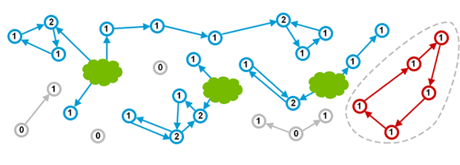
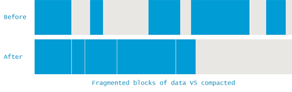
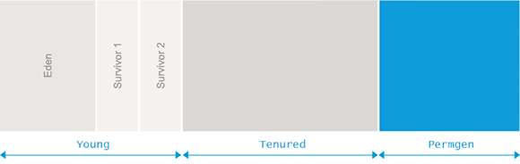
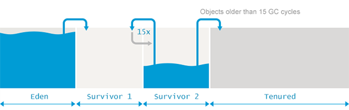
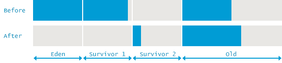
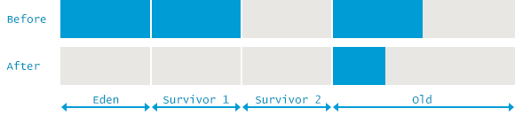
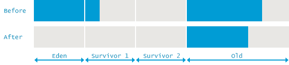

# Java Garbage Collection Handbook

## Contents

* [What is Garbage Collection](#what-is-garbage-collecton)
    * [Manual Memory Management](#manual-memory-management)
        * [Smart Pointers](#smart-pointers)
    * [Automated Memory Management](#automated-memory-management)
        * [Reference Counting](#reference-counting)
        * [Mark and Sweep](#mark-and-sweep)

* [Garbage Collection in Java](#garbage-collecton-in-java)
    * [Fragmenting and Compacting](#fragmenting-and-compacting)
    * [Generational Hypothesis](#generational-hypothesis)
    * [Memory Pools](#memory-pools)
        * [Eden](#eden)
        * [Survivor Spaces](#survivor-spaces)
        * [Old Generation](#old-generation)
        * [PermGen](#permgen)
        * [Metaspace](#metaspace)
    * [Minor GC vs Major GC vs Full GC](#minor-gc-vs-major-gc-vs-full-gc)
        * [Minor GC](#minor-gc)
        * [Major GC vs Full GC](#major-gc-vs-full-gc)

* [GC Algorithms: Basics](#gc-algorithms--basics)
    * [Marking Reachable Objects](#marking-reachable-objects)
    * [Removing Unused Objects](#removing-unused-objects)
        * [Sweep](#sweep)
        * [Compact](#compact)
        * [Copy](#copy)

* [GC Algorithms: Implementations](#gc-algorithms--implementations)
    * [Serial GC](#serial-gc)
        * [Minor GC](#minor-gc)
        * [Full GC](#full-gc)
    * [Parallel GC](#parallel-gc)
        * [Minor GC](#minor-gc)
        * [Full GC](#full-gc)
    * [Concurrent Mark and Sweep](#concurrent-mark-and-sweep)
        * [Minor GC](#minor-gc)
        * [Full GC](#full-gc)
    * [G1 - Garbage First](#g1-garbage-first)
        * [Evacuation Pause: Fully Young](#evacuation-pause-fully-young)
        * [Concurrent Marking](#concurrent-marking)
        * [Evacuation Pause: Mixed](#evacuation-pause-mixed)
        * [Summary](#summary)
    * [Low-Latency Concurrent GC](#low-latency-concurrent-gc)
        * [ZGC](#zgc)
        * [Shanandoah](#shenandoah)

* [GC Tuning: Basic](#gc-tuning--basics)
    * [Core Concepts](#core-concepts)
        * [Latency](#latency)
        * [Throughput](#throughput)
        * [Capacity](#capacity)
    * [Example](#example)
        * [Tuning for Latency](#tuning-for-latency)
        * [Tuning for Throughput](#tuning-for-throughput)
        * [Tuning for Capacity](#tuning-for-capacity)

* [GC Tuning: Tooling](#gc-tuning--tooling)
    * [JMX API](#jmx-api)
    * [JVisualVM](#jvisualvm)
    * [jstat](#jstat)
    * [GC logs](#gc-logs)
    * [GCViewer](#gcviewer)
    * [Profilers](#profilers)
        * [hprof](#hprof)
        * [Java VisualVM](#java-visualvm)
        * [AProf](#aprof)

* [GC Tuning: In Practice](#gc-tuning--in-practice)
    * [High Allocation Rate](#high-allocation-rate)
        * [How to Measure Allocation Rate?](#how-to-measure-allocation-rate)
        * [Why Should I Care?](#why-should-i-care-)
        * [Give me an Example](#give-me-an-example)
        * [Could my JVMs be Affected?](#could-my-jvms-be-affected)
        * [What is the Solution?](#what-is-the-solution)
    * [Premature Promotion](#premature-promotion)
        * [How to Measure Promotion Rate?](#how-to-measure-promotion-rate)
        * [Why Should I Care?](#why-should-i-care-)
        * [Give me an Example](#give-me-an-example)
        * [Could my JVMs be Affected?](#could-my-jvms-be-affected)
        * [What is the Solution?](#what-is-the-solution)
    * [Weak, Soft and Phantom References](#weak--soft-and-phantom-references)
        * [Why Should I Care?](#why-should-i-care-)
        * [Give me an Example](#give-me-an-example)
        * [Could my JVMs be Affected?](#could-my-jvms-be-affected)
        * [What is the Solution?](#what-is-the-solution)
    * [Other Examples](#other-examples)
        * [RMI & GC](#rmi--gc)
        * [JVMTI tagging & GC](#jvmti-tagging--gc)
        * [Humongous Allocations](#humongous-allocations)
        * [Conclusion](#conclusion)

---

### What Is Garbage Collection?

---

At first sight, garbage collection should be dealing with what the name suggests – finding and throwing away the garbage. In reality it is doing exactly the opposite. Garbage Collection is tracking down all the objects that are still used and marks the rest as garbage. Bearing this in mind, we start digging into more details of how the process of automated memory reclamation called ‘Garbage Collection’ is implemented for Java Virtual Machine.

Instead of rushing into specifics, we shall start from the very beginning, explaining the general nature of garbage collection and the core concepts and approaches.

Disclaimer: This content focuses on Oracle Hotspot and OpenJDK behaviour. In other runtimes or even on other JVMs, such as jRockit or IBM J9, some of the aspects covered in this handbook can behave differently.

#### Manual Memory Management

Before we can start covering Garbage Collection in its modern form, let’s do a quick recap of days where you had to manually and explicitly allocate and free memory for your data. And if you ever forgot to free it, you would not be able to reuse the memory. The memory would be claimed but not used. Such a scenario is called a **memory leak**.

Here is a simple example written in C using manual memory management:

```C
int send_request() {
    size_t n = read_size();
    int *elements = malloc(n * sizeof(int));

    if(read_elements(n, elements) < n) {
        // elements not freed!
        return -1;
    }

    // …

    free(elements)
    return 0;
}
```

As we can see, it is fairly easy to forget to free memory. Memory leaks used to be a lot more common problem than today. You could only really fight them by fixing your code. Thus, a much better approach would be to automate the reclamation of unused memory, eliminating the possibility of human error altogether. Such automation is called **Garbage Collection** (or **GC** for short).

##### Smart Pointers

One of the first ways to automate this was by using destructors. For instance, we could do the same thing in C++ using vector, the destructor of which will be automatically called when it’s no longer in scope:

```C++
int send_request() {
    size_t n = read_size();
    vector<int> elements = vector<int>(n);

    if(read_elements(elements.size(), &elements[0]) < n) {
        return -1;
    }

    return 0;
}
```

But in more complex cases, especially when sharing objects across multiple threads, just the destructor will not be sufficient. In comes the simplest form of garbage collection: reference counting. For each object, you simply know how many times it is referred to and when that count reaches zero the object can be safely reclaimed. A well-known example of that would be the shared pointers of C++:

```C++
int send_request() {
    size_t n = read_size();
    auto elements = make_shared<vector<int>>();

    // read elements

    store_in_cache(elements);

    // process elements further

    return 0;
}
```

Now, to avoid reading the elements next time the function is called, we may want to cache them. In such a case, destroying the vector when it’s out of scope is not an option. Therefore, we make use of `shared_ptr`. It keeps track of the number of references to it. This number increases as you pass it around and decreases as it leaves scope. As soon as the number of references reaches zero, the `shared_ptr` automatically deletes the underlying vector.

#### Automated Memory Management

In the C++ code above, we still had to explicitly say when we want to have memory management to be taken care of. But what if we could make all the objects behave this way? That would be very handy, since the developers no longer have to think about cleaning up after themselves. The runtime will automatically understand that some memory is no longer used and frees it. In other words, it automatically **collects the garbage**. The first garbage collector was created in 1959 for Lisp and the technology has only advanced since then.

##### Reference Counting

The idea that we have demonstrated with the shared pointers of C++ can be applied to all objects. Many languages such as Perl, Python or PHP take this approach. This is best illustrated with a picture:


The green clouds indicate that the object that they point to is still in use by the programmer. Technically, these may be things like a local variable in the currently executing method or a static variable or something else. It may vary from programming language to programming language so we will not focus on it here.

The blue circles are the live objects in memory, with the numbers inside denoting their reference counts. Finally, the grey circles are objects that are not referenced from any object that is still explicitly in use (these are directly referenced to by the green clouds). The grey objects are thus garbage and could be cleaned by the Garbage Collector.

This all looks really good, does it not? Well, it does, but the whole method has a huge drawback. It is quite easy to end up with a **detached cycle** of objects none of which are in scope yet due to cyclic references the count of their reference is not zero. Here’s an illustration:



See? The red objects are in fact garbage that the application does not use. But due to the limitations of reference counting there is still a memory leak.

There are some ways to overcome this, such as using special ‘weak’ references or applying a separate algorithm for collecting cycles. The aforementioned languages – Perl, Python and PHP – all handle cycles in one way or another, but this is outside the scope of this handbook. Instead, we will start investigating the approach taken by the JVM in more details.

##### Mark and Sweep

First of all, the JVM is more specific about what constitutes reachability of an object. Instead of the vaguely defined green clouds that we saw on earlier chapters, we have a very specific and explicit set of objects that are called the **Garbage Collection Roots**:

  * Local variables
  * Active threads
  * Static fields
  * JNI references

The method used by JVM to track down all the reachable (live) objects and to make sure the memory claimed by non-reachable objects can be reused is called the Mark and Sweep algorithm. It consists of two steps:

  * **Marking** is walking through all reachable objects, starting from GC roots and keeping a ledger in native memory about all such objects
  * **Sweeping** is making sure the memory addresses occupied by non-reachable objects can be reused by the next allocations.

Different GC algorithms within the JVM, such as ___Parallel Scavenge___, ___Parallel Mark+Copy___ or ___CMS___, are implementing those phases slightly differently, but at the conceptual level the process remains similar to the two steps described above.

A crucially important thing about this approach is that the cycles are no longer leaked:


The not-so-good thing is that the application threads need to be stopped for the collection to happen, as you cannot really count references if they keep changing all the time. Such a situation when the application is temporarily stopped so that the JVM can indulge in housekeeping activities is called a **Stop The World pause**. They may happen for many reasons, but garbage collection is by far the most popular one.

---

### Garbage Collection in Java

The introduction to Mark and Sweep Garbage Collection is a mostly theoretical one. When things come to practice, numerous adjustments need to be done to accommodate for real-world scenarios and needs. For a simple example, let us take a look at what sorts of bookkeeping the JVM needs to do so that we can safely continue allocating objects.

---

#### Fragmenting and Compacting

Whenever sweeping takes place, the JVM has to make sure the areas filled with unreachable objects can be reused. This can (and eventually will) lead to memory fragmentation which, similarly to disk fragmentation, leads to two problems:

  * Write operations become more time-consuming as finding the next free block of sufficient size is no longer a trivial operation.
  * When creating new objects, JVM is allocating memory in contiguous blocks. So if fragmentation escalates to a point where no individual free fragment is large enough to accommodate the newly created object, an allocation error occurs.

To avoid such problems, the JVM is making sure the fragmenting does not get out of hand. So instead of just marking and sweeping, a ‘memory defrag’ process also happens during garbage collection. This process relocates all the reachable objects next to each other, eliminating (or reducing) the fragmentation. Here is an illustration of that:



#### Generational Hypothesis

As we have mentioned before, doing a garbage collection entails stopping the application completely. It is also quite obvious that the more objects there are the longer it takes to collect all the garbage. But what if we would have a possibility to work with smaller memory regions? Investigating the possibilities, a group of researchers has observed that most allocations inside applications fall into two categories:

  * Most of the objects become unused quickly
  * The ones that do not usually survive for a (very) long time

These observations come together in the Weak Generational Hypothesis. Based on this hypothesis, the memory inside the VM is divided into what is called the **Young Generation** and the **Old Generation**. The latter is sometimes also called **Tenured**.


Having such separate and individually cleanable areas allows for a multitude of different algorithms that have come a long way in improving the performance of the GC.

This is not to say there are no issues with such an approach. For one, objects from different generations may in fact have references to each other that also count as ‘de facto’ GC roots when collecting a generation.

But most importantly, the generational hypothesis may in fact not hold for some applications. Since the GC algorithms are optimized for objects which either ‘die young’ or ‘are likely to live forever’, the JVM behaves rather poorly with objects with ‘medium’ life expectancy.

#### Memory Pools

The following division of memory pools within the heap should be familiar. What is not so commonly understood is how Garbage Collection performs its duties within the different memory pools. Notice that in different GC algorithms some implementation details might vary but, again, the concepts in this chapter remain effectively the same.



##### Eden

Eden is the region in memory where the objects are typically allocated when they are created. As there are typically multiple threads creating a lot of objects simultaneously, Eden is further divided into one or more **Thread Local Allocation Buffer** (**TLAB** for short) residing in the Eden space. These buffers allow the JVM to allocate most objects within one thread directly in the corresponding TLAB, avoiding the expensive synchronization with other threads.

When allocation inside a TLAB is not possible (typically because there’s not enough room there), the allocation moves on to a shared Eden space. If there’s not enough room in there either, a garbage collection process in Young Generation is triggered to free up more space. If the garbage collection also does not result in sufficient free memory inside Eden, then the object is allocated in the Old Generation.

When Eden is being collected, GC walks all the reachable objects from the roots and marks them as alive.

We have previously noted that objects can have cross-generational links so a straightforward approach would have to check all the references from other generations to Eden. Doing so would unfortunately defeat the whole point of having generations in the first place. The JVM has a trick up its sleeve: _card-marking_. Essentially, the JVM just marks the rough location of ‘dirty’ objects in Eden that may have links to them from the Old Generation. You can read more on that in [Nitsan’s blog entry](http://psy-lob-saw.blogspot.com/2014/10/the-jvm-write-barrier-card-marking.html).


After the marking phase is completed, all the live objects in Eden are copied to one of the _Survivor_ _spaces_. The whole Eden is now considered to be empty and can be reused to allocate more objects. Such an approach is called **“Mark and Copy”**: the live objects are marked, and then copied (not moved) to a survivor space.

##### Survivor Spaces

Next to the Eden space reside two **Survivor** spaces called _from_ and _to_. It is important to notice that one of the two Survivor spaces is always empty.

The empty Survivor space will start having residents next time the Young generation gets collected. All of the live objects from the whole of the Young generation (that includes both the Eden space and the non-empty ‘from’ Survivor space) are copied to the ‘to’ survivor space. After this process has completed, ‘to’ now contains objects and ‘from’ does not. Their roles are switched at this time.



This process of copying the live objects between the two Survivor spaces is repeated several times until some objects are considered to have matured and are ‘old enough’. Remember that, based on the generational hypothesis, objects which have survived for some time are expected to continue to be used for very long time.

Such ‘tenured’ objects can thus be **promoted** to the Old Generation. When this happens, objects are not moved from one survivor space to another but instead to the Old space, where they will reside until they become unreachable.

To determine whether the object is ‘old enough’ to be considered ready for propagation to Old space, GC tracks the number of collections a particular object has survived. After each generation of objects finishes with a GC, those still alive have their age incremented. Whenever the age exceeds a certain **tenuring threshold** the object will be promoted to Old space.

The actual tenuring threshold is dynamically adjusted by the JVM, but specifying `-XX:+MaxTenuringThreshold` sets an upper limit on it. Setting `-XX:+MaxTenuringThreshold=0` results in immediate promotion without copying it between Survivor spaces. By default, this threshold on modern JVMs is set to 15 GC cycles. This is also the maximum value in HotSpot.

Promotion may also happen prematurely if the size of the Survivor space is not enough to hold all of the live objects in the Young generation.

##### Old Generation

The implementation for the Old Generation memory space is much more complex. Old Generation is usually significantly larger and is occupied by objects that are less likely to be garbage.

GC in the Old Generation happens less frequently than in the Young Generation. Also, since most objects are expected to be alive in the Old Generation, there is no Mark and Copy happening. Instead, the objects are moved around to minimize fragmentation. The algorithms cleaning the Old space are generally built on different foundations. In principle, the steps taken go through the following:

  * Mark reachable objects by setting the marked bit next to all objects accessible through GC roots
  * Delete all unreachable objects
  * Compact the content of old space by copying the live objects contiguously to the beginning of the Old space

As you can see from the description, GC in Old Generation has to deal with explicit compacting to avoid excessive fragmentation.

##### PermGen

Prior to Java 8 there existed a special space called the ‘Permanent Generation’. This is where the metadata such as classes would go. Also, some additional things like internalized strings were kept in Permgen. It actually used to create a lot of trouble to Java developers, since it is quite hard to predict how much space all of that would require. Result of these failed predictions took the form of [java.lang.OutOfMemoryError: Permgen space](https://plumbr.io/outofmemoryerror/permgen-space). Unless the cause of such OutOfMemoryError was an actual memory leak, the way to fix this problem was to simply increase the permgen size similar to the following example setting the maximum allowed permgen size to 256 MB: 

> `java -XX:MaxPermSize=256m com.mycompany.MyApplication`
>

##### Metaspace

As predicting the need for metadata was a complex and inconvenient exercise, the Permanent Generation was removed in Java 8 in favor of the Metaspace. From this point on, most of the miscellaneous things were moved to regular Java heap.

The class definitions, however, are now loaded into something called Metaspace. It is located in the native memory and does not interfere with the regular heap objects. By default, Metaspace size is only limited by the amount of native memory available to the Java process. This saves developers from a situation when adding just one more class to the application results in the [java.lang.OutOfMemoryError: Permgen space](https://plumbr.io/outofmemoryerror/permgen-space). Notice that having such seemingly unlimited space does not ship without costs – letting the Metaspace to grow uncontrollably you can introduce heavy swapping and/or reach native allocation failures instead.

In case you still wish to protect yourself for such occasions you can limit the growth of Metaspace similar to following, limiting Metaspace size to 256 MB:

> `java -XX:MaxMetaspaceSize=256m com.mycompany.MyApplication`
>

#### Minor GC vs Major GC vs Full GC

The Garbage Collection events cleaning out different parts inside heap memory are often called Minor, Major and Full GC events. In this section we cover the differences between these events. Along the way we can hopefully see that this distinction is actually not too relevant.

What typically is relevant is whether the application meets its SLAs, and to see that you monitor your application for latency or throughput. And only then are GC events linked to the results. What is important about these events is whether they stopped the application and how long it took.

But as the terms Minor, Major and Full GC are widely used and without a proper definition, let us look into the topic in a bit more detail.

##### Minor GC

Collecting garbage from the Young space is called **Minor GC**. This definition is both clear and uniformly understood. But there are still some interesting takeaways you should be aware of when dealing with Minor Garbage Collection events:

  1. Minor GC is always triggered when the JVM is unable to allocate space for a new object, e.g. Eden is getting full. So the higher the allocation rate, the more frequently Minor GC occurs.

  2. During a Minor GC event, Tenured Generation is effectively ignored. References from Tenured Generation to Young Generation are considered to be GC roots. References from Young Generation to Tenured Generation are simply ignored during the mark phase.

  3. Against common belief, Minor GC does trigger stop-the-world pauses, suspending the application threads. For most applications, the length of the pauses is negligible latency-wise if most of the objects in the Eden can be considered garbage and are never copied to Survivor/Old spaces. If the opposite is true and most of the newborn objects are not eligible for collection, Minor GC pauses start taking considerably more time.

So defining Minor GC is easy – **Minor GC cleans the Young Generation**.

##### Major GC vs Full GC

It should be noted that there are no formal definitions for those terms – neither in the JVM specification nor in the Garbage Collection research papers. But on the first glance, building these definitions on top of what we know to be true about Minor GC cleaning Young space should be simple:

  * **Major GC** is cleaning the Old space.
  * **Full GC** is cleaning the entire Heap – both Young and Old spaces.

Unfortunately it is a bit more complex and confusing. To start with – many Major GCs are triggered by Minor GCs, so separating the two is impossible in many cases. On the other hand – modern garbage collection algorithms like G1 perform partial garbage cleaning so, again, using the term ‘cleaning’ is only partially correct.

This leads us to the point where **instead of worrying about whether the GC is called Major or Full GC, you should focus on finding out whether the GC at hand stopped all the application threads or was able to progress concurrently with the application threads**.

This confusion is even built right into the JVM standard tools. What I mean by that is best explained via an example. Let us compare the output of two different tools tracing the GC on a JVM running with Concurrent Mark and Sweep collector (`-XX:+UseConcMarkSweepGC`)

First attempt is to get the insight via the [jstat](http://docs.oracle.com/javase/8/docs/technotes/tools/unix/jstat.html) output:

> ```bash
> my-precious: me$ jstat -gc -t 4235 1s
> Time S0C    S1C    S0U    S1U      EC       EU        OC         OU       MC     MU    CCSC   CCSU   YGC     YGCT    FGC    FGCT     GCT   
>  5.7 34048.0 34048.0  0.0   34048.0 272640.0 194699.7 1756416.0   181419.9  18304.0 17865.1 2688.0 2497.6      3    0.275   0      0.000    0.275
>  6.7 34048.0 34048.0 34048.0  0.0   272640.0 247555.4 1756416.0   263447.9  18816.0 18123.3 2688.0 2523.1      4    0.359   0      0.000    0.359
>  7.7 34048.0 34048.0  0.0   34048.0 272640.0 257729.3 1756416.0   345109.8  19072.0 18396.6 2688.0 2550.3      5    0.451   0      0.000    0.451
>  8.7 34048.0 34048.0 34048.0 34048.0 272640.0 272640.0 1756416.0  444982.5  19456.0 18681.3 2816.0 2575.8      7    0.550   0      0.000    0.550
>  9.7 34048.0 34048.0 34046.7  0.0   272640.0 16777.0  1756416.0   587906.3  20096.0 19235.1 2944.0 2631.8      8    0.720   0      0.000    0.720
> 10.7 34048.0 34048.0  0.0   34046.2 272640.0 80171.6  1756416.0   664913.4  20352.0 19495.9 2944.0 2657.4      9    0.810   0      0.000    0.810
> 11.7 34048.0 34048.0 34048.0  0.0   272640.0 129480.8 1756416.0   745100.2  20608.0 19704.5 2944.0 2678.4     10    0.896   0      0.000    0.896
> 12.7 34048.0 34048.0  0.0   34046.6 272640.0 164070.7 1756416.0   822073.7  20992.0 19937.1 3072.0 2702.8     11    0.978   0      0.000    0.978
> 13.7 34048.0 34048.0 34048.0  0.0   272640.0 211949.9 1756416.0   897364.4  21248.0 20179.6 3072.0 2728.1     12    1.087   1      0.004    1.091
> 14.7 34048.0 34048.0  0.0   34047.1 272640.0 245801.5 1756416.0   597362.6  21504.0 20390.6 3072.0 2750.3     13    1.183   2      0.050    1.233
> 15.7 34048.0 34048.0  0.0   34048.0 272640.0 21474.1  1756416.0   757347.0  22012.0 20792.0 3200.0 2791.0     15    1.336   2      0.050    1.386
> 16.7 34048.0 34048.0 34047.0  0.0   272640.0 48378.0  1756416.0   838594.4  22268.0 21003.5 3200.0 2813.2     16    1.433   2      0.050    1.484
> ```

This snippet is extracted from the first 17 seconds after the JVM was launched. Based on this information we could conclude that after 12 Minor GC runs two Full GC runs were performed, spanning **50ms** in total. You would get the same confirmation via GUI-based tools, such as the [jconsole](http://docs.oracle.com/javase/7/docs/technotes/guides/management/jconsole.html) or [jvisualvm](http://download.oracle.com/javase/6/docs/technotes/tools/share/jvisualvm.html).

> NOTE: If your using OpenJDK 8+ onwards then instead of jconsole and jvisualvm , you need to use **JDK Flight Recorder** (**JFR** for short) and **JDK Mission Control** (**JMC** for short) as [explained here](https://developers.redhat.com/blog/2020/08/25/get-started-with-jdk-flight-recorder-in-openjdk-8u#demo__profiling_gc_allocation).
>

Before nodding at this conclusion, let’s look at the output of the garbage collection logs gathered from the same JVM launch. Apparently `-XX:+PrintGCDetails` tells us a different and a more detailed story:

> ```bash
> java -XX:+PrintGCDetails -XX:+UseConcMarkSweepGC eu.plumbr.demo.GarbageProducer
> ```
>
> ```bash
> 3.157: [GC (Allocation Failure) 3.157: [ParNew: 272640K->34048K(306688K), 0.0844702 secs] 272640K->69574K(2063104K), 0.0845560 secs] [Times: user=0.23 sys=0.03, real=0.09 secs] 
> 4.092: [GC (Allocation Failure) 4.092: [ParNew: 306688K->34048K(306688K), 0.1013723 secs] 342214K->136584K(2063104K), 0.1014307 secs] [Times: user=0.25 sys=0.05, real=0.10 secs] 
> ... cut for brevity ...
> 11.292: [GC (Allocation Failure) 11.292: [ParNew: 306686K->34048K(306688K), 0.0857219 secs] 971599K->779148K(2063104K), 0.0857875 secs] [Times: user=0.26 sys=0.04, real=0.09 secs] 
> 12.140: [GC (Allocation Failure) 12.140: [ParNew: 306688K->34046K(306688K), 0.0821774 secs] 1051788K->856120K(2063104K), 0.0822400 secs] [Times: user=0.25 sys=0.03, real=0.08 secs] 
> 12.989: [GC (Allocation Failure) 12.989: [ParNew: 306686K->34048K(306688K), 0.1086667 secs] 1128760K->931412K(2063104K), 0.1087416 secs] [Times: user=0.24 sys=0.04, real=0.11 secs] 
> 13.098: [GC (CMS Initial Mark) [1 CMS-initial-mark: 897364K(1756416K)] 936667K(2063104K), 0.0041705 secs] [Times: user=0.02 sys=0.00, real=0.00 secs] 
> 13.102: [CMS-concurrent-mark-start]
> 13.341: [CMS-concurrent-mark: 0.238/0.238 secs] [Times: user=0.36 sys=0.01, real=0.24 secs] 
> 13.341: [CMS-concurrent-preclean-start]
> 13.350: [CMS-concurrent-preclean: 0.009/0.009 secs] [Times: user=0.03 sys=0.00, real=0.01 secs] 
> 13.350: [CMS-concurrent-abortable-preclean-start]
> 13.878: [GC (Allocation Failure) 13.878: [ParNew: 306688K->34047K(306688K), 0.0960456 secs] 1204052K->1010638K(2063104K), 0.0961542 secs] [Times: user=0.29 sys=0.04, real=0.09 secs] 
> 14.366: [CMS-concurrent-abortable-preclean: 0.917/1.016 secs] [Times: user=2.22 sys=0.07, real=1.01 secs] 
> 14.366: [GC (CMS Final Remark) [YG occupancy: 182593 K (306688 K)]14.366: [Rescan (parallel) , 0.0291598 secs]14.395: [weak refs processing, 0.0000232 secs]14.395: [class unloading, 0.0117661 secs]14.407: [scrub symbol table, 0.0015323 secs]14.409: [scrub string table, 0.0003221 secs][1 CMS-remark: 976591K(1756416K)] 1159184K(2063104K), 0.0462010 secs] [Times: user=0.14 sys=0.00, real=0.05 secs] 
> 14.412: [CMS-concurrent-sweep-start]
> 14.633: [CMS-concurrent-sweep: 0.221/0.221 secs] [Times: user=0.37 sys=0.00, real=0.22 secs] 
> 14.633: [CMS-concurrent-reset-start]
> 14.636: [CMS-concurrent-reset: 0.002/0.002 secs] [Times: user=0.00 sys=0.00, real=0.00 secs]
> ```

Based on this information we can see that after 12 Minor GC runs ‘something different’ indeed started happening. But instead of two Full GC runs, this ‘different thing’ was in reality just a single GC running in Old generation and consisting of different phases:

  * Initial Mark phase, spanning for 0.0041705 seconds or approximately 4ms. This phase is a stop-the-world event stopping all application threads for initial marking.
  * Markup and Preclean phases. were executed concurrently with the application threads.
  * Final Remark phase, spanning for 0.0462010 seconds or approximately 46ms. This phase is again stop-the-world event.
  * Sweep operation was executed concurrently, without stopping the application threads.

So what we see from the actual garbage collection logs is that, instead of two Full GC operations, just one Major GC cleaning Old space was actually executed.

If you were after latency then the data revealed by jstat would have led you towards correct decisions. It correctly listed the two stop-the-world events totaling 50ms affecting the latency for all the active threads at that very moment. But if you were trying to optimize for throughput, you would have been misguided – listing just the stop-the-world initial mark and final remark phases, the jstat output completely hides the concurrent work being done.

---

### GC Algorithms: Basics

Before diving into the practical implementation details of Garbage Collection algorithms it will be beneficial to define the required terminology and to understand the basic principles supporting the implementations. Specific details vary from collector to collector but in general all collectors focus in two areas

  * find out all objects that are still alive
  * get rid of everything else – the supposedly dead and unused objects.

First part, the census on live objects, is implemented in all collectors with the help of a process called **Marking**.

---

#### Marking Reachable Objects

Every modern GC algorithm used in JVM starts its job with finding out all objects that are still alive. This concept is best explained using the following picture representing your JVM’s memory layout:


First, GC defines some specific objects as **Garbage Collection Roots**. Examples of such GC roots are:

  * Local variable and input parameters of the currently executing methods
  * Active threads
  * Static field of the loaded classes
  * JNI references

Next, GC traverses the whole object graph in your memory, starting from those Garbage Collection Roots and following references from the roots to other objects, e.g. instance fields. Every object the GC visits is **marked** as alive.

Live objects are represented as blue on the picture above. When the marking phase finishes, every live object is marked. All other objects (grey data structures on the picture above) are thus unreachable from the GC roots, implying that your application cannot use the unreachable objects anymore. Such objects are considered garbage and GC should get rid of them in the following phases.

There are important aspects to note about the marking phase:

  * The application threads need to be stopped for the marking to happen as you cannot really traverse the graph if it keeps changing under your feet all the time. Such a situation when the application threads are temporarily stopped so that the JVM can indulge in housekeeping activities is called a **safe point** resulting in a **Stop The World pause**. Safe points can be triggered for different reasons but garbage collection is by far the most common reason for a safe point to be introduced.
  * The duration of this pause depends neither on the total number of objects in heap nor on the size of the heap but on the number of **alive objects**. So increasing the size of the heap does not directly affect the duration of the marking phase.

When the **mark** phase is completed, the GC can proceed to the next step and start removing the unreachable objects.

#### Removing Unused Objects

Removal of unused objects is somewhat different for different GC algorithms but all such GC algorithms can be divided into three groups: sweeping, compacting and copying. Next sections will discuss each of such algorithms in more detail.

##### Sweep

**Mark and Sweep** algorithms use conceptually the simplest approach to garbage by just ignoring such objects. What this means is that after the marking phase has completed all space occupied by unvisited objects is considered free and can thus be reused to allocate new objects.

The approach requires using the so called **free-list** recording of every free region and its size. The management of the free-lists adds overhead to object allocation. Built into this approach is another weakness – there may exist plenty of free regions but if no single region is large enough to accommodate the allocation, the allocation is still going to fail (with an [OutOfMemoryError](http://plumbr.io/outofmemoryerror) in Java).


##### Compact

**Mark-Sweep-Compact** algorithms solve the shortcomings of Mark and Sweep by moving all marked – and thus alive – objects to the beginning of the memory region. The downside of this approach is an increased GC pause duration as we need to copy all objects to a new place and to update all references to such objects. The benefits to Mark and Sweep are also visible – after such a compacting operation new object allocation is again extremely cheap via pointer bumping. Using such approach the location of the free space is always known and no fragmentation issues are triggered either.


##### Copy

**Mark and Copy** algorithms are very similar to the Mark and Compact as they too relocate all live objects. The important difference is that the target of relocation is a different memory region as a new home for survivors. Mark and Copy approach has some advantages as copying can occur simultaneously with marking during the same phase. The disadvantage is the need for one more memory region, which should be large enough to accommodate survived objects.


---

### GC Algorithms: Implementations

Now that we have reviewed the core concepts behind GC algorithms, let us move to the specific implementations one can find inside the JVM. An important aspect to recognize first is the fact that, for most JVMs out there, two different GC algorithms are needed – one to clean the Young Generation and another to clean the Old Generation.

You can choose from a variety of such algorithms bundled into the JVM. If you do not specify a garbage collection algorithm explicitly, a platform-specific default will be used. In this chapter, the working principles of each of those algorithms will be explained.

For a quick cheat sheet, the following list is a fast way to get yourself up to speed with which algorithm combinations are possible. Note that this stands true for Java 8, for older Java versions the available combinations might differ a bit:

| Young | Tenured | JVM options |
| :- | :- | :- |
| Incremental | Incremental | `-Xincgc` |
| **Serial** | **Serial** |	<code><b>-XX:+UseSerialGC</b></code> |
| Parallel Scavenge | Serial | `-XX:+UseParallelGC -XX:-UseParallelOldGC` | 
| Parallel New | Serial | N/A |
| Serial | Parallel Old | N/A |
| **Parallel Scavenge** | **Parallel Old** | <code><b>-XX:+UseParallelGC -XX:+UseParallelOldGC</b></code> |
| Parallel New | Parallel Old | N/A |
| Serial | CMS | `-XX:-UseParNewGC -XX:+UseConcMarkSweepGC` | 
| Parallel Scavenge | CMS | N/A |
| **Parallel New** | **CMS** | <code><b>-XX:+UseParNewGC -XX:+UseConcMarkSweepGC</b></code> |
| **G1** | | <code><b>-XX:+UseG1GC</b></code> |

> **NOTE: Garbage First (G1) GC, has become the default GC from Java 9 onwards.**
>

If the above looks too complex, do not worry. In reality it all boils down to just four combinations highlighted in the table above. The rest are either [deprecated](http://openjdk.java.net/jeps/173), not supported or just impractical to apply in real world. So, in the following chapters we cover the working principles of the following combinations:

  * Serial GC for both the Young and Old generations
  * Parallel GC for both the Young and Old generations
  * Parallel New for Young + Concurrent Mark and Sweep (CMS) for the Old Generation
  * G1, which encompasses collection of both Young and Old generations

---

#### Serial GC

This collection of garbage collectors uses [mark-copy](#copy) for the Young Generation and [mark-sweep-compact](#compact) for the Old Generation. As the name implies – both of these collectors are single-threaded collectors, incapable of parallelizing the task at hand. Both collectors also trigger stop-the-world pauses, stopping all application threads.

This GC algorithm cannot thus take advantage of multiple CPU cores commonly found in modern hardware. Independent of the number of cores available, just one is used by the JVM during garbage collection.

Enabling this collector for both the Young and Old Generation is done via specifying a single parameter in the JVM startup script:

> ```bash
> java -XX:+UseSerialGC com.mypackages.MyExecutableClass
> ```

This option makes sense and is recommended only for the JVM with a couple of hundreds megabytes heap size, running in an environment with a single CPU. For the majority of server-side deployments this is a rare combination. Most server-side deployments are done on platforms with multiple cores, essentially meaning that by choosing Serial GC you are setting artificial limits on the use of system resources. This results in idle resources which otherwise could be used to reduce latency or increase throughput.

Let us now review how garbage collector logs look like when using Serial GC and what useful information one can obtain from there. For this purpose, we have turned on GC logging on the JVM using the following parameters:

> ```bash
> -XX:+PrintGCDetails -XX:+PrintGCDateStamps -XX:+PrintGCTimeStamps
> ```

The resulting output is similar to the following:

> ```bash
> 2015-05-26T14:45:37.987-0200: 151.126: [GC (Allocation Failure) 151.126: [DefNew: 629119K->69888K(629120K), 0.0584157 secs] 1619346K->1273247K(2027264K), 0.0585007 secs] [Times: user=0.06 sys=0.00, real=0.06 secs]
> 2015-05-26T14:45:59.690-0200: 172.829: [GC (Allocation Failure) 172.829: [DefNew: 629120K->629120K(629120K), 0.0000372 secs]172.829: [Tenured: 1203359K->755802K(1398144K), 0.1855567 secs] 1832479K->755802K(2027264K), [Metaspace: 6741K->6741K(1056768K)], 0.1856954 secs] [Times: user=0.18 sys=0.00, real=0.18 secs]
> ```

Such short snippet from the GC logs exposes a lot of information about what is taking place inside the JVM. As a matter of fact, in this snippet there were two Garbage Collection events taking place, one of them cleaning the Young Generation and another taking care of the entire heap. Let’s start by analyzing the first collection that is taking place in the Young Generation.

##### Minor GC

Following snippet contains the information about a GC event cleaning the Young Generation:

<div align="center">
	<br>
	<a href="./serial_gc_minor_gc.svg">
		
	</a>
	<br>
</div>

From the above snippet we can understand exactly what was happening with the memory consumption inside JVM during the GC event. Before this collection, heap usage totaled at 1,619,346K. Out of this, the Young Generation consumed 629,119K. From this we can calculate the Old Generation usage being equal to 990,227K.

A more important conclusion is hidden in the next batch of numbers indicating that, after the collection, Young Generation usage decreased by 559,231K but total heap usage decreased only by 346,099K. From this we can again derive that 213,132K of objects were promoted from the Young Generation to the Old Generation.

This GC event is also illustrated with the following snapshots showing memory usage right before the GC started and right after it finished:



##### Full GC

After understanding the first minor GC event, lets look into the second GC event in the logs:

<div align="center">
	<br>
	<a href="./serial_gc_full_gc.svg">
		
	</a>
	<br>
</div>

The difference with Minor GC is evident – in addition to the Young Generation, during this GC event the Old Generation and Metaspace were also cleaned. The layout of the memory before and after the event would look like the situation in the following picture:



#### Parallel GC

This combination of Garbage Collectors uses [mark-copy](#copy) in the Young Generation and [mark-sweep-compact](#compact) in the Old Generation. Both Young and Old collections trigger stop-the-world events, stopping all application threads to perform garbage collection. Both collectors run marking and copying / compacting phases using multiple threads, hence the name ‘Parallel’. Using this approach, collection times can be considerably reduced.

The number of threads used during garbage collection is configurable via the command line parameter `-XX:ParallelGCThreads=NNN`. The default value is equal to the number of cores in your machine.

Selection of Parallel GC is done via the specification of any of the following combinations of parameters in the JVM startup script:

> ```bash
> java -XX:+UseParallelGC com.mypackages.MyExecutableClass
> java -XX:+UseParallelOldGC com.mypackages.MyExecutableClass
> java -XX:+UseParallelGC -XX:+UseParallelOldGC com.mypackages.MyExecutableClass
> ```
>

Parallel Garbage Collector is suitable on multi-core machines in cases where your primary goal is to increase throughput. Higher throughput is achieved due to more efficient usage of system resources:

  * during collection, all cores are cleaning the garbage in parallel, resulting in shorter pauses
  * between garbage collection cycles neither of the collectors is consuming any resources

On the other hand, as all phases of the collection have to happen without any interruptions, these collectors are still susceptible to long pauses during which your application threads are stopped. So if latency is your primary goal, you should check the next combinations of garbage collectors.

Let us now review how garbage collector logs look like when using Parallel GC and what useful information one can obtain from there. For this, let’s look again at the garbage collector logs that expose once more one minor and one major GC pause:

> ```bash
> 2015-05-26T14:27:40.915-0200: 116.115: [GC (Allocation Failure) [PSYoungGen: 2694440K->1305132K(2796544K)] 9556775K->8438926K(11185152K), 0.2406675 secs] [Times: user=1.77 sys=0.01, real=0.24 secs]
> 2015-05-26T14:27:41.155-0200: 116.356: [Full GC (Ergonomics) [PSYoungGen: 1305132K->0K(2796544K)] [ParOldGen: 7133794K->6597672K(8388608K)] 8438926K->6597672K(11185152K), [Metaspace: 6745K->6745K(1056768K)], 0.9158801 secs] [Times: user=4.49 sys=0.64, real=0.92 secs]
> ```

##### Minor GC

The first of the two events indicates a GC event taking place in the Young Generation:

<div align="center">
	<br>
	<a href="./serial_gc_minor_gc.svg">
		
	</a>
	<br>
</div>

So, in short, the total heap consumption before the collection was 9,556,775K. Out of this Young generation was 2,694,440K. This means that used Old generation was 6,862,335K. After the collection young generation usage decreased by 1,389,308K, but total heap usage decreased only by 1,117,849K. This means that 271,459K was promoted from Young generation to Old.


##### Full GC

After understanding how Parallel GC cleans the Young Generation, we are ready to look at how the whole heap is being cleaned by analyzing the next snippet from the GC logs:

<div align="center">
	<br>
	<a href="./parallel_gc_full_gc.svg">
		
	</a>
	<br>
</div>

Again, the difference with Minor GC is evident – in addition to the Young Generation, during this GC event the Old Generation and Metaspace were also cleaned. The layout of the memory before and after the event would look like the situation in the following picture:



#### Concurrent Mark and Sweep


##### Minor GC

##### Full GC

#### G1 - Garbage First

##### Evacuation Pause: Fully Young

##### Concurrent Marking

##### Evacuation Pause: Mixed

##### Summary

#### Low-Latency Concurrent GC

##### ZGC

##### Shenandoah

---

### GC Tuning: Basics

---

#### Core Concepts

##### Latency

##### Throughput

##### Capacity

#### Example

##### Tuning for Latency

##### Tuning for Throughput

##### Tuning for Capacity

---

### GC Tuning: Tooling

---

#### High Allocation Rate

##### How to Measure Allocation Rate?

##### Why Should I Care?

##### Give me an Example

##### Could my JVMs be Affected?

##### What is the Solution?

#### Premature Promotion

##### How to Measure Promotion Rate?

##### Why Should I Care?

##### Give me an Example

##### Could my JVMs be Affected?

##### What is the Solution?

#### Weak, Soft and Phantom References

##### Why Should I Care?

##### Give me an Example

##### Could my JVMs be Affected?

##### What is the Solution?

#### Other Examples

##### RMI & GC

##### JVMTI tagging & GC

##### Humongous Allocations

##### Conclusion

---

