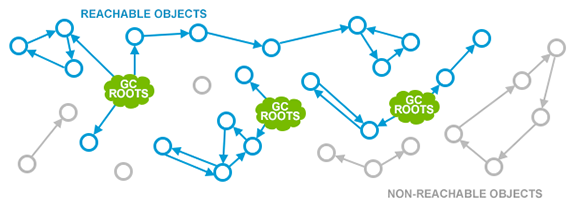
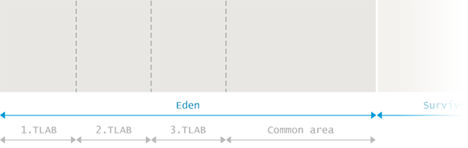

# Java Garbage Collection Handbook

## Contents

* [What is Garbage Collection](#what-is-garbage-collecton)
    * [Manual Memory Management](#manual-memory-management)
        * [Smart Pointers](#smart-pointers)
    * [Automated Memory Management](#automated-memory-management)
        * [Reference Counting](#reference-counting)
        * [Mark and Sweep](#mark-and-sweep)

* [Garbage Collection in Java](#garbage-collecton-in-java)
    * [Fragmenting and Compacting](#fragmenting-and-compacting)
    * [Generational Hypothesis](#generational-hypothesis)
    * [Memory Pools](#memory-pools)
        * [Eden](#eden)
        * [Survivor Spaces](#survivor-spaces)
        * [Old Generation](#old-generation)
        * [PermGen](#permgen)
        * [Metaspace](#metaspace)
    * [Minor GC vs Major GC vs Full GC](#minor-gc-vs-major-gc-vs-full-gc)
        * [Minor GC](#minor-gc)
        * [Major GC vs Full GC](#major-gc-vs-full-gc)

* [GC Algorithms: Basics](#gc-algorithms--basics)
    * [Marking Reachable Objects](#marking-reachable-objects)
    * [Removing Unused Objects](#removing-unused-objects)
        * [Sweep](#sweep)
        * [Compact](#compact)
        * [Copy](#copy)

* [GC Algorithms: Implementations](#gc-algorithms--implementations)
    * [Serial GC](#serial-gc)
        * [Minor GC](#minor-gc)
        * [Full GC](#full-gc)
    * [Parallel GC](#parallel-gc)
        * [Minor GC](#minor-gc)
        * [Full GC](#full-gc)
    * [Concurrent Mark and Sweep](#concurrent-mark-and-sweep)
        * [Minor GC](#minor-gc)
        * [Full GC](#full-gc)
    * [G1 - Garbage First](#g1-garbage-first)
        * [Evacuation Pause: Fully Young](#evacuation-pause-fully-young)
        * [Concurrent Marking](#concurrent-marking)
        * [Evacuation Pause: Mixed](#evacuation-pause-mixed)
        * [Summary](#summary)
    * [Low-Latency Concurrent GCs](#low-latency-concurrent-gcs)
        * [ZGC](#zgc)
        * [Shanandoah](#shenandoah)
    * [Low-Latency Concurrent GCs](#low-latency-concurrent-gcs)
        * [Shanandoah](#shenandoah)
        * [ZGC](#zgc)
    * [Getting rid of GC altogether Epsilon GC](#getting-rid-of-gc-altogether-epsilon-gc)

* [GC Tuning: Basic](#gc-tuning--basics)
    * [Core Concepts](#core-concepts)
        * [Latency](#latency)
        * [Throughput](#throughput)
        * [Capacity](#capacity)
    * [Example](#example)
        * [Tuning for Latency](#tuning-for-latency)
        * [Tuning for Throughput](#tuning-for-throughput)
        * [Tuning for Capacity](#tuning-for-capacity)

* [GC Tuning: Tooling](#gc-tuning--tooling)
    * [JMX API](#jmx-api)
    * [JVisualVM](#jvisualvm)
    * [jstat](#jstat)
    * [GC logs](#gc-logs)
    * [GCViewer](#gcviewer)
    * [Profilers](#profilers)
        * [hprof](#hprof)
        * [Java VisualVM](#java-visualvm)
        * [AProf](#aprof)

* [GC Tuning: In Practice](#gc-tuning--in-practice)
    * [High Allocation Rate](#high-allocation-rate)
        * [How to Measure Allocation Rate?](#how-to-measure-allocation-rate)
        * [Why Should I Care?](#why-should-i-care-)
        * [Give me an Example](#give-me-an-example)
        * [Could my JVMs be Affected?](#could-my-jvms-be-affected)
        * [What is the Solution?](#what-is-the-solution)
    * [Premature Promotion](#premature-promotion)
        * [How to Measure Promotion Rate?](#how-to-measure-promotion-rate)
        * [Why Should I Care?](#why-should-i-care-)
        * [Give me an Example](#give-me-an-example)
        * [Could my JVMs be Affected?](#could-my-jvms-be-affected)
        * [What is the Solution?](#what-is-the-solution)
    * [Weak, Soft and Phantom References](#weak--soft-and-phantom-references)
        * [Why Should I Care?](#why-should-i-care-)
        * [Give me an Example](#give-me-an-example)
        * [Could my JVMs be Affected?](#could-my-jvms-be-affected)
        * [What is the Solution?](#what-is-the-solution)
    * [Other Examples](#other-examples)
        * [RMI & GC](#rmi--gc)
        * [JVMTI tagging & GC](#jvmti-tagging--gc)
        * [Humongous Allocations](#humongous-allocations)
        * [Conclusion](#conclusion)

---

### What Is Garbage Collection?

---

At first sight, garbage collection should be dealing with what the name suggests – finding and throwing away the garbage. In reality it is doing exactly the opposite. Garbage Collection is tracking down all the objects that are still used and marks the rest as garbage. Bearing this in mind, we start digging into more details of how the process of automated memory reclamation called ‘Garbage Collection’ is implemented for Java Virtual Machine.

Instead of rushing into specifics, we shall start from the very beginning, explaining the general nature of garbage collection and the core concepts and approaches.

Disclaimer: This content focuses on Oracle Hotspot and OpenJDK behaviour. In other runtimes or even on other JVMs, such as jRockit or IBM J9, some of the aspects covered in this handbook can behave differently.

#### Manual Memory Management

Before we can start covering Garbage Collection in its modern form, let’s do a quick recap of days where you had to manually and explicitly allocate and free memory for your data. And if you ever forgot to free it, you would not be able to reuse the memory. The memory would be claimed but not used. Such a scenario is called a **memory leak**.

Here is a simple example written in C using manual memory management:

```C
int send_request() {
    size_t n = read_size();
    int *elements = malloc(n * sizeof(int));

    if(read_elements(n, elements) < n) {
        // elements not freed!
        return -1;
    }

    // …

    free(elements)
    return 0;
}
```

As we can see, it is fairly easy to forget to free memory. Memory leaks used to be a lot more common problem than today. You could only really fight them by fixing your code. Thus, a much better approach would be to automate the reclamation of unused memory, eliminating the possibility of human error altogether. Such automation is called **Garbage Collection** (or **GC** for short).

##### Smart Pointers

One of the first ways to automate this was by using destructors. For instance, we could do the same thing in C++ using vector, the destructor of which will be automatically called when it’s no longer in scope:

```C++
int send_request() {
    size_t n = read_size();
    vector<int> elements = vector<int>(n);

    if(read_elements(elements.size(), &elements[0]) < n) {
        return -1;
    }

    return 0;
}
```

But in more complex cases, especially when sharing objects across multiple threads, just the destructor will not be sufficient. In comes the simplest form of garbage collection: reference counting. For each object, you simply know how many times it is referred to and when that count reaches zero the object can be safely reclaimed. A well-known example of that would be the shared pointers of C++:

```C++
int send_request() {
    size_t n = read_size();
    auto elements = make_shared<vector<int>>();

    // read elements

    store_in_cache(elements);

    // process elements further

    return 0;
}
```

Now, to avoid reading the elements next time the function is called, we may want to cache them. In such a case, destroying the vector when it’s out of scope is not an option. Therefore, we make use of `shared_ptr`. It keeps track of the number of references to it. This number increases as you pass it around and decreases as it leaves scope. As soon as the number of references reaches zero, the `shared_ptr` automatically deletes the underlying vector.

#### Automated Memory Management

In the C++ code above, we still had to explicitly say when we want to have memory management to be taken care of. But what if we could make all the objects behave this way? That would be very handy, since the developers no longer have to think about cleaning up after themselves. The runtime will automatically understand that some memory is no longer used and frees it. In other words, it automatically **collects the garbage**. The first garbage collector was created in 1959 for Lisp and the technology has only advanced since then.

##### Reference Counting

The idea that we have demonstrated with the shared pointers of C++ can be applied to all objects. Many languages such as Perl, Python or PHP take this approach. This is best illustrated with a picture:


The green clouds indicate that the object that they point to is still in use by the programmer. Technically, these may be things like a local variable in the currently executing method or a static variable or something else. It may vary from programming language to programming language so we will not focus on it here.

The blue circles are the live objects in memory, with the numbers inside denoting their reference counts. Finally, the grey circles are objects that are not referenced from any object that is still explicitly in use (these are directly referenced to by the green clouds). The grey objects are thus garbage and could be cleaned by the Garbage Collector.

This all looks really good, does it not? Well, it does, but the whole method has a huge drawback. It is quite easy to end up with a **detached cycle** of objects none of which are in scope yet due to cyclic references the count of their reference is not zero. Here’s an illustration:


See? The red objects are in fact garbage that the application does not use. But due to the limitations of reference counting there is still a memory leak.

There are some ways to overcome this, such as using special ‘weak’ references or applying a separate algorithm for collecting cycles. The aforementioned languages – Perl, Python and PHP – all handle cycles in one way or another, but this is outside the scope of this handbook. Instead, we will start investigating the approach taken by the JVM in more details.

##### Mark and Sweep

First of all, the JVM is more specific about what constitutes reachability of an object. Instead of the vaguely defined green clouds that we saw on earlier chapters, we have a very specific and explicit set of objects that are called the **Garbage Collection Roots**:

  * Local variables
  * Active threads
  * Static fields
  * JNI references

The method used by JVM to track down all the reachable (live) objects and to make sure the memory claimed by non-reachable objects can be reused is called the Mark and Sweep algorithm. It consists of two steps:

  * **Marking** is walking through all reachable objects, starting from GC roots and keeping a ledger in native memory about all such objects
  * **Sweeping** is making sure the memory addresses occupied by non-reachable objects can be reused by the next allocations.

Different GC algorithms within the JVM, such as ___Parallel Scavenge___, ___Parallel Mark+Copy___ or ___CMS___, are implementing those phases slightly differently, but at the conceptual level the process remains similar to the two steps described above.

A crucially important thing about this approach is that the cycles are no longer leaked:



The not-so-good thing is that the application threads need to be stopped for the collection to happen, as you cannot really count references if they keep changing all the time. Such a situation when the application is temporarily stopped so that the JVM can indulge in housekeeping activities is called a **Stop The World pause**. They may happen for many reasons, but garbage collection is by far the most popular one.

---

### Garbage Collection in Java

The introduction to Mark and Sweep Garbage Collection is a mostly theoretical one. When things come to practice, numerous adjustments need to be done to accommodate for real-world scenarios and needs. For a simple example, let us take a look at what sorts of bookkeeping the JVM needs to do so that we can safely continue allocating objects.

---

#### Fragmenting and Compacting

Whenever sweeping takes place, the JVM has to make sure the areas filled with unreachable objects can be reused. This can (and eventually will) lead to memory fragmentation which, similarly to disk fragmentation, leads to two problems:

  * Write operations become more time-consuming as finding the next free block of sufficient size is no longer a trivial operation.
  * When creating new objects, JVM is allocating memory in contiguous blocks. So if fragmentation escalates to a point where no individual free fragment is large enough to accommodate the newly created object, an allocation error occurs.

To avoid such problems, the JVM is making sure the fragmenting does not get out of hand. So instead of just marking and sweeping, a ‘memory defrag’ process also happens during garbage collection. This process relocates all the reachable objects next to each other, eliminating (or reducing) the fragmentation. Here is an illustration of that:


#### Generational Hypothesis

As we have mentioned before, doing a garbage collection entails stopping the application completely. It is also quite obvious that the more objects there are the longer it takes to collect all the garbage. But what if we would have a possibility to work with smaller memory regions? Investigating the possibilities, a group of researchers has observed that most allocations inside applications fall into two categories:

  * Most of the objects become unused quickly
  * The ones that do not usually survive for a (very) long time

These observations come together in the Weak Generational Hypothesis. Based on this hypothesis, the memory inside the VM is divided into what is called the **Young Generation** and the **Old Generation**. The latter is sometimes also called **Tenured**.


Having such separate and individually cleanable areas allows for a multitude of different algorithms that have come a long way in improving the performance of the GC.

This is not to say there are no issues with such an approach. For one, objects from different generations may in fact have references to each other that also count as ‘de facto’ GC roots when collecting a generation.

But most importantly, the generational hypothesis may in fact not hold for some applications. Since the GC algorithms are optimized for objects which either ‘die young’ or ‘are likely to live forever’, the JVM behaves rather poorly with objects with ‘medium’ life expectancy.

#### Memory Pools

The following division of memory pools within the heap should be familiar. What is not so commonly understood is how Garbage Collection performs its duties within the different memory pools. Notice that in different GC algorithms some implementation details might vary but, again, the concepts in this chapter remain effectively the same.


##### Eden

Eden is the region in memory where the objects are typically allocated when they are created. As there are typically multiple threads creating a lot of objects simultaneously, Eden is further divided into one or more **Thread Local Allocation Buffer** (**TLAB** for short) residing in the Eden space. These buffers allow the JVM to allocate most objects within one thread directly in the corresponding TLAB, avoiding the expensive synchronization with other threads.

When allocation inside a TLAB is not possible (typically because there’s not enough room there), the allocation moves on to a shared Eden space. If there’s not enough room in there either, a garbage collection process in Young Generation is triggered to free up more space. If the garbage collection also does not result in sufficient free memory inside Eden, then the object is allocated in the Old Generation.

When Eden is being collected, GC walks all the reachable objects from the roots and marks them as alive.

We have previously noted that objects can have cross-generational links so a straightforward approach would have to check all the references from other generations to Eden. Doing so would unfortunately defeat the whole point of having generations in the first place. The JVM has a trick up its sleeve: _card-marking_. Essentially, the JVM just marks the rough location of ‘dirty’ objects in Eden that may have links to them from the Old Generation. You can read more on that in [Nitsan’s blog entry](http://psy-lob-saw.blogspot.com/2014/10/the-jvm-write-barrier-card-marking.html).



After the marking phase is completed, all the live objects in Eden are copied to one of the _Survivor_ _spaces_. The whole Eden is now considered to be empty and can be reused to allocate more objects. Such an approach is called **“Mark and Copy”**: the live objects are marked, and then copied (not moved) to a survivor space.

##### Survivor Spaces

Next to the Eden space reside two **Survivor** spaces called _from_ and _to_. It is important to notice that one of the two Survivor spaces is always empty.

The empty Survivor space will start having residents next time the Young generation gets collected. All of the live objects from the whole of the Young generation (that includes both the Eden space and the non-empty ‘from’ Survivor space) are copied to the ‘to’ survivor space. After this process has completed, ‘to’ now contains objects and ‘from’ does not. Their roles are switched at this time.


This process of copying the live objects between the two Survivor spaces is repeated several times until some objects are considered to have matured and are ‘old enough’. Remember that, based on the generational hypothesis, objects which have survived for some time are expected to continue to be used for very long time.

Such ‘tenured’ objects can thus be **promoted** to the Old Generation. When this happens, objects are not moved from one survivor space to another but instead to the Old space, where they will reside until they become unreachable.

To determine whether the object is ‘old enough’ to be considered ready for propagation to Old space, GC tracks the number of collections a particular object has survived. After each generation of objects finishes with a GC, those still alive have their age incremented. Whenever the age exceeds a certain **tenuring threshold** the object will be promoted to Old space.

The actual tenuring threshold is dynamically adjusted by the JVM, but specifying `-XX:+MaxTenuringThreshold` sets an upper limit on it. Setting `-XX:+MaxTenuringThreshold=0` results in immediate promotion without copying it between Survivor spaces. By default, this threshold on modern JVMs is set to 15 GC cycles. This is also the maximum value in HotSpot.

Promotion may also happen prematurely if the size of the Survivor space is not enough to hold all of the live objects in the Young generation.

##### Old Generation

The implementation for the Old Generation memory space is much more complex. Old Generation is usually significantly larger and is occupied by objects that are less likely to be garbage.

GC in the Old Generation happens less frequently than in the Young Generation. Also, since most objects are expected to be alive in the Old Generation, there is no Mark and Copy happening. Instead, the objects are moved around to minimize fragmentation. The algorithms cleaning the Old space are generally built on different foundations. In principle, the steps taken go through the following:

  * Mark reachable objects by setting the marked bit next to all objects accessible through GC roots
  * Delete all unreachable objects
  * Compact the content of old space by copying the live objects contiguously to the beginning of the Old space

As you can see from the description, GC in Old Generation has to deal with explicit compacting to avoid excessive fragmentation.

##### PermGen

Prior to Java 8 there existed a special space called the ‘Permanent Generation’. This is where the metadata such as classes would go. Also, some additional things like internalized strings were kept in Permgen. It actually used to create a lot of trouble to Java developers, since it is quite hard to predict how much space all of that would require. Result of these failed predictions took the form of [java.lang.OutOfMemoryError: Permgen space](https://plumbr.io/outofmemoryerror/permgen-space). Unless the cause of such OutOfMemoryError was an actual memory leak, the way to fix this problem was to simply increase the permgen size similar to the following example setting the maximum allowed permgen size to 256 MB: 

> `java -XX:MaxPermSize=256m com.mycompany.MyApplication`
>

##### Metaspace

As predicting the need for metadata was a complex and inconvenient exercise, the Permanent Generation was removed in Java 8 in favor of the Metaspace. From this point on, most of the miscellaneous things were moved to regular Java heap.

The class definitions, however, are now loaded into something called Metaspace. It is located in the native memory and does not interfere with the regular heap objects. By default, Metaspace size is only limited by the amount of native memory available to the Java process. This saves developers from a situation when adding just one more class to the application results in the [java.lang.OutOfMemoryError: Permgen space](https://plumbr.io/outofmemoryerror/permgen-space). Notice that having such seemingly unlimited space does not ship without costs – letting the Metaspace to grow uncontrollably you can introduce heavy swapping and/or reach native allocation failures instead.

In case you still wish to protect yourself for such occasions you can limit the growth of Metaspace similar to following, limiting Metaspace size to 256 MB:

> `java -XX:MaxMetaspaceSize=256m com.mycompany.MyApplication`
>

#### Minor GC vs Major GC vs Full GC

The Garbage Collection events cleaning out different parts inside heap memory are often called Minor, Major and Full GC events. In this section we cover the differences between these events. Along the way we can hopefully see that this distinction is actually not too relevant.

What typically is relevant is whether the application meets its SLAs, and to see that you monitor your application for latency or throughput. And only then are GC events linked to the results. What is important about these events is whether they stopped the application and how long it took.

But as the terms Minor, Major and Full GC are widely used and without a proper definition, let us look into the topic in a bit more detail.

##### Minor GC

Collecting garbage from the Young space is called **Minor GC**. This definition is both clear and uniformly understood. But there are still some interesting takeaways you should be aware of when dealing with Minor Garbage Collection events:

  1. Minor GC is always triggered when the JVM is unable to allocate space for a new object, e.g. Eden is getting full. So the higher the allocation rate, the more frequently Minor GC occurs.

  2. During a Minor GC event, Tenured Generation is effectively ignored. References from Tenured Generation to Young Generation are considered to be GC roots. References from Young Generation to Tenured Generation are simply ignored during the mark phase.

  3. Against common belief, Minor GC does trigger stop-the-world pauses, suspending the application threads. For most applications, the length of the pauses is negligible latency-wise if most of the objects in the Eden can be considered garbage and are never copied to Survivor/Old spaces. If the opposite is true and most of the newborn objects are not eligible for collection, Minor GC pauses start taking considerably more time.

So defining Minor GC is easy – **Minor GC cleans the Young Generation**.

##### Major GC vs Full GC

It should be noted that there are no formal definitions for those terms – neither in the JVM specification nor in the Garbage Collection research papers. But on the first glance, building these definitions on top of what we know to be true about Minor GC cleaning Young space should be simple:

  * **Major GC** is cleaning the Old space.
  * **Full GC** is cleaning the entire Heap – both Young and Old spaces.

Unfortunately it is a bit more complex and confusing. To start with – many Major GCs are triggered by Minor GCs, so separating the two is impossible in many cases. On the other hand – modern garbage collection algorithms like G1 perform partial garbage cleaning so, again, using the term ‘cleaning’ is only partially correct.

This leads us to the point where **instead of worrying about whether the GC is called Major or Full GC, you should focus on finding out whether the GC at hand stopped all the application threads or was able to progress concurrently with the application threads**.

This confusion is even built right into the JVM standard tools. What I mean by that is best explained via an example. Let us compare the output of two different tools tracing the GC on a JVM running with Concurrent Mark and Sweep collector (`-XX:+UseConcMarkSweepGC`)

First attempt is to get the insight via the [jstat](http://docs.oracle.com/javase/8/docs/technotes/tools/unix/jstat.html) output:

> ```bash
> my-precious: me$ jstat -gc -t 4235 1s
> Time S0C    S1C    S0U    S1U      EC       EU        OC         OU       MC     MU    CCSC   CCSU   YGC     YGCT    FGC    FGCT     GCT   
>  5.7 34048.0 34048.0  0.0   34048.0 272640.0 194699.7 1756416.0   181419.9  18304.0 17865.1 2688.0 2497.6      3    0.275   0      0.000    0.275
>  6.7 34048.0 34048.0 34048.0  0.0   272640.0 247555.4 1756416.0   263447.9  18816.0 18123.3 2688.0 2523.1      4    0.359   0      0.000    0.359
>  7.7 34048.0 34048.0  0.0   34048.0 272640.0 257729.3 1756416.0   345109.8  19072.0 18396.6 2688.0 2550.3      5    0.451   0      0.000    0.451
>  8.7 34048.0 34048.0 34048.0 34048.0 272640.0 272640.0 1756416.0  444982.5  19456.0 18681.3 2816.0 2575.8      7    0.550   0      0.000    0.550
>  9.7 34048.0 34048.0 34046.7  0.0   272640.0 16777.0  1756416.0   587906.3  20096.0 19235.1 2944.0 2631.8      8    0.720   0      0.000    0.720
> 10.7 34048.0 34048.0  0.0   34046.2 272640.0 80171.6  1756416.0   664913.4  20352.0 19495.9 2944.0 2657.4      9    0.810   0      0.000    0.810
> 11.7 34048.0 34048.0 34048.0  0.0   272640.0 129480.8 1756416.0   745100.2  20608.0 19704.5 2944.0 2678.4     10    0.896   0      0.000    0.896
> 12.7 34048.0 34048.0  0.0   34046.6 272640.0 164070.7 1756416.0   822073.7  20992.0 19937.1 3072.0 2702.8     11    0.978   0      0.000    0.978
> 13.7 34048.0 34048.0 34048.0  0.0   272640.0 211949.9 1756416.0   897364.4  21248.0 20179.6 3072.0 2728.1     12    1.087   1      0.004    1.091
> 14.7 34048.0 34048.0  0.0   34047.1 272640.0 245801.5 1756416.0   597362.6  21504.0 20390.6 3072.0 2750.3     13    1.183   2      0.050    1.233
> 15.7 34048.0 34048.0  0.0   34048.0 272640.0 21474.1  1756416.0   757347.0  22012.0 20792.0 3200.0 2791.0     15    1.336   2      0.050    1.386
> 16.7 34048.0 34048.0 34047.0  0.0   272640.0 48378.0  1756416.0   838594.4  22268.0 21003.5 3200.0 2813.2     16    1.433   2      0.050    1.484
> ```

This snippet is extracted from the first 17 seconds after the JVM was launched. Based on this information we could conclude that after 12 Minor GC runs two Full GC runs were performed, spanning **50ms** in total. You would get the same confirmation via GUI-based tools, such as the [jconsole](http://docs.oracle.com/javase/7/docs/technotes/guides/management/jconsole.html) or [jvisualvm](http://download.oracle.com/javase/6/docs/technotes/tools/share/jvisualvm.html).

> NOTE: If your using OpenJDK 8+ onwards then instead of jconsole and jvisualvm , you need to use **JDK Flight Recorder** (**JFR** for short) and **JDK Mission Control** (**JMC** for short) as [explained here](https://developers.redhat.com/blog/2020/08/25/get-started-with-jdk-flight-recorder-in-openjdk-8u#demo__profiling_gc_allocation).
>

Before nodding at this conclusion, let’s look at the output of the garbage collection logs gathered from the same JVM launch. Apparently `-XX:+PrintGCDetails` tells us a different and a more detailed story:

> ```bash
> java -XX:+PrintGCDetails -XX:+UseConcMarkSweepGC eu.plumbr.demo.GarbageProducer
> ```
>
> ```bash
> 3.157: [GC (Allocation Failure) 3.157: [ParNew: 272640K->34048K(306688K), 0.0844702 secs] 272640K->69574K(2063104K), 0.0845560 secs] [Times: user=0.23 sys=0.03, real=0.09 secs] 
> 4.092: [GC (Allocation Failure) 4.092: [ParNew: 306688K->34048K(306688K), 0.1013723 secs] 342214K->136584K(2063104K), 0.1014307 secs] [Times: user=0.25 sys=0.05, real=0.10 secs] 
> ... cut for brevity ...
> 11.292: [GC (Allocation Failure) 11.292: [ParNew: 306686K->34048K(306688K), 0.0857219 secs] 971599K->779148K(2063104K), 0.0857875 secs] [Times: user=0.26 sys=0.04, real=0.09 secs] 
> 12.140: [GC (Allocation Failure) 12.140: [ParNew: 306688K->34046K(306688K), 0.0821774 secs] 1051788K->856120K(2063104K), 0.0822400 secs] [Times: user=0.25 sys=0.03, real=0.08 secs] 
> 12.989: [GC (Allocation Failure) 12.989: [ParNew: 306686K->34048K(306688K), 0.1086667 secs] 1128760K->931412K(2063104K), 0.1087416 secs] [Times: user=0.24 sys=0.04, real=0.11 secs] 
> 13.098: [GC (CMS Initial Mark) [1 CMS-initial-mark: 897364K(1756416K)] 936667K(2063104K), 0.0041705 secs] [Times: user=0.02 sys=0.00, real=0.00 secs] 
> 13.102: [CMS-concurrent-mark-start]
> 13.341: [CMS-concurrent-mark: 0.238/0.238 secs] [Times: user=0.36 sys=0.01, real=0.24 secs] 
> 13.341: [CMS-concurrent-preclean-start]
> 13.350: [CMS-concurrent-preclean: 0.009/0.009 secs] [Times: user=0.03 sys=0.00, real=0.01 secs] 
> 13.350: [CMS-concurrent-abortable-preclean-start]
> 13.878: [GC (Allocation Failure) 13.878: [ParNew: 306688K->34047K(306688K), 0.0960456 secs] 1204052K->1010638K(2063104K), 0.0961542 secs] [Times: user=0.29 sys=0.04, real=0.09 secs] 
> 14.366: [CMS-concurrent-abortable-preclean: 0.917/1.016 secs] [Times: user=2.22 sys=0.07, real=1.01 secs] 
> 14.366: [GC (CMS Final Remark) [YG occupancy: 182593 K (306688 K)]14.366: [Rescan (parallel) , 0.0291598 secs]14.395: [weak refs processing, 0.0000232 secs]14.395: [class unloading, 0.0117661 secs]14.407: [scrub symbol table, 0.0015323 secs]14.409: [scrub string table, 0.0003221 secs][1 CMS-remark: 976591K(1756416K)] 1159184K(2063104K), 0.0462010 secs] [Times: user=0.14 sys=0.00, real=0.05 secs] 
> 14.412: [CMS-concurrent-sweep-start]
> 14.633: [CMS-concurrent-sweep: 0.221/0.221 secs] [Times: user=0.37 sys=0.00, real=0.22 secs] 
> 14.633: [CMS-concurrent-reset-start]
> 14.636: [CMS-concurrent-reset: 0.002/0.002 secs] [Times: user=0.00 sys=0.00, real=0.00 secs]
> ```

Based on this information we can see that after 12 Minor GC runs ‘something different’ indeed started happening. But instead of two Full GC runs, this ‘different thing’ was in reality just a single GC running in Old generation and consisting of different phases:

  * Initial Mark phase, spanning for 0.0041705 seconds or approximately 4ms. This phase is a stop-the-world event stopping all application threads for initial marking.
  * Markup and Preclean phases. were executed concurrently with the application threads.
  * Final Remark phase, spanning for 0.0462010 seconds or approximately 46ms. This phase is again stop-the-world event.
  * Sweep operation was executed concurrently, without stopping the application threads.

So what we see from the actual garbage collection logs is that, instead of two Full GC operations, just one Major GC cleaning Old space was actually executed.

If you were after latency then the data revealed by jstat would have led you towards correct decisions. It correctly listed the two stop-the-world events totaling 50ms affecting the latency for all the active threads at that very moment. But if you were trying to optimize for throughput, you would have been misguided – listing just the stop-the-world initial mark and final remark phases, the jstat output completely hides the concurrent work being done.

---

### GC Algorithms: Basics

Before diving into the practical implementation details of Garbage Collection algorithms it will be beneficial to define the required terminology and to understand the basic principles supporting the implementations. Specific details vary from collector to collector but in general all collectors focus in two areas

  * find out all objects that are still alive
  * get rid of everything else – the supposedly dead and unused objects.

First part, the census on live objects, is implemented in all collectors with the help of a process called **Marking**.

---

#### Marking Reachable Objects

Every modern GC algorithm used in JVM starts its job with finding out all objects that are still alive. This concept is best explained using the following picture representing your JVM’s memory layout:


First, GC defines some specific objects as **Garbage Collection Roots**. Examples of such GC roots are:

  * Local variable and input parameters of the currently executing methods
  * Active threads
  * Static field of the loaded classes
  * JNI references

Next, GC traverses the whole object graph in your memory, starting from those Garbage Collection Roots and following references from the roots to other objects, e.g. instance fields. Every object the GC visits is **marked** as alive.

Live objects are represented as blue on the picture above. When the marking phase finishes, every live object is marked. All other objects (grey data structures on the picture above) are thus unreachable from the GC roots, implying that your application cannot use the unreachable objects anymore. Such objects are considered garbage and GC should get rid of them in the following phases.

There are important aspects to note about the marking phase:

  * The application threads need to be stopped for the marking to happen as you cannot really traverse the graph if it keeps changing under your feet all the time. Such a situation when the application threads are temporarily stopped so that the JVM can indulge in housekeeping activities is called a **safe point** resulting in a **Stop The World pause**. Safe points can be triggered for different reasons but garbage collection is by far the most common reason for a safe point to be introduced.
  * The duration of this pause depends neither on the total number of objects in heap nor on the size of the heap but on the number of **alive objects**. So increasing the size of the heap does not directly affect the duration of the marking phase.

When the **mark** phase is completed, the GC can proceed to the next step and start removing the unreachable objects.

#### Removing Unused Objects

Removal of unused objects is somewhat different for different GC algorithms but all such GC algorithms can be divided into three groups: sweeping, compacting and copying. Next sections will discuss each of such algorithms in more detail.

##### Sweep

**Mark and Sweep** algorithms use conceptually the simplest approach to garbage by just ignoring such objects. What this means is that after the marking phase has completed all space occupied by unvisited objects is considered free and can thus be reused to allocate new objects.

The approach requires using the so called **free-list** recording of every free region and its size. The management of the free-lists adds overhead to object allocation. Built into this approach is another weakness – there may exist plenty of free regions but if no single region is large enough to accommodate the allocation, the allocation is still going to fail (with an [OutOfMemoryError](http://plumbr.io/outofmemoryerror) in Java).


##### Compact

**Mark-Sweep-Compact** algorithms solve the shortcomings of Mark and Sweep by moving all marked – and thus alive – objects to the beginning of the memory region. The downside of this approach is an increased GC pause duration as we need to copy all objects to a new place and to update all references to such objects. The benefits to Mark and Sweep are also visible – after such a compacting operation new object allocation is again extremely cheap via pointer bumping. Using such approach the location of the free space is always known and no fragmentation issues are triggered either.


##### Copy

**Mark and Copy** algorithms are very similar to the Mark and Compact as they too relocate all live objects. The important difference is that the target of relocation is a different memory region as a new home for survivors. Mark and Copy approach has some advantages as copying can occur simultaneously with marking during the same phase. The disadvantage is the need for one more memory region, which should be large enough to accommodate survived objects.


---

### GC Algorithms: Implementations

Now that we have reviewed the core concepts behind GC algorithms, let us move to the specific implementations one can find inside the JVM. An important aspect to recognize first is the fact that, for most JVMs out there, two different GC algorithms are needed – one to clean the Young Generation and another to clean the Old Generation.

You can choose from a variety of such algorithms bundled into the JVM. If you do not specify a garbage collection algorithm explicitly, a platform-specific default will be used. In this chapter, the working principles of each of those algorithms will be explained.

For a quick cheat sheet, the following list is a fast way to get yourself up to speed with which algorithm combinations are possible. Note that this stands true for Java 8, for older Java versions the available combinations might differ a bit:

| Young | Tenured | JVM options |
| :- | :- | :- |
| Incremental | Incremental | `-Xincgc` |
| **Serial** | **Serial** |	<code><b>-XX:+UseSerialGC</b></code> |
| Parallel Scavenge | Serial | `-XX:+UseParallelGC -XX:-UseParallelOldGC` | 
| Parallel New | Serial | N/A |
| Serial | Parallel Old | N/A |
| **Parallel Scavenge** | **Parallel Old** | <code><b>-XX:+UseParallelGC -XX:+UseParallelOldGC</b></code> |
| Parallel New | Parallel Old | N/A |
| Serial | CMS | `-XX:-UseParNewGC -XX:+UseConcMarkSweepGC` | 
| Parallel Scavenge | CMS | N/A |
| **Parallel New** | **CMS** | <code><b>-XX:+UseParNewGC -XX:+UseConcMarkSweepGC</b></code> |
| **G1** | | <code><b>-XX:+UseG1GC</b></code> |

> **NOTE: As of this writing ... Garbage First (G1) GC, has become the default GC from Java 9 onwards.**
>
> **NOTE: CMD will still continue to work Java 9 onwards, it has just been deprecated, so at some point it might go away.**
>
> Therefore, starting from Java 9, if you start the application with the `-XX:+UseConcMarkSweepGC` (a parameter to activate the CMS GC algorithm) parameter, a warning message will be displayed below:
>
> ```bash
> Java HotSpot(TM) 64-Bit Server VM warning: Option UseConcMarkSweepGC was deprecated in version 9.0 and will likely be removed in a future release.
> ```
>
> To figure out which Garbage Collector you are using,
> 
> ```bash
> java -XX:+PrintCommandLineFlags -version
> ```
>
> This will generate an output similar to given below (output below is for SUSE Linux ):
>
> 
>
> In particular, pay attention to the ___-XX:+UseG1GC___ and ___-XX:+UseParallelGC___ flags. They show the change to the default garbage collector by JDK 9.
>
> How to programmatically determine the Garbage Collector?
>
> ```java
> import java.lang.management.GarbageCollectorMXBean;
> import java.lang.management.ManagementFactory;
>
> public class Java9Features {
>     public static void main(String[] args) {
>         System.out.println();
>         java.util.List<GarbageCollectorMXBean> gcMxBeans = ManagementFactory.getGarbageCollectorMXBeans();
>         //for (GarbageCollectorMXBean gcMxBean : gxMxBeans) {
>         //    System.out.println(gcMxBean.getName() + ":\t" + gcMxBean.getObjectName());
>         //}
>         gcMxBeans
>         .stream()
>         .map(gcMxBean -> gcMxBean.getName() + ":\t" + gcMxBean.getObjectName())
>         .forEach(System.out::println);
>     }
> }
> ```
>
> This will generate an output similar to given below (output below is for Linux Mint ):
>
> ```bash
> adrian@adrian-ThinkPad-T520 ~/Downloads/CODE $ javac Java9Features.java
> adrian@adrian-ThinkPad-T520 ~/Downloads/CODE $ java Java9Features.java
>
> PS Scavenge:	java.lang:type=GarbageCollector,name=PS Scavenge
> PS MarkSweep:	java.lang:type=GarbageCollector,name=PS MarkSweep
>
> adrian@adrian-ThinkPad-T520 ~/Downloads/CODE $ javac Java9Features.java
> adrian@adrian-ThinkPad-T520 ~/Downloads/CODE $ java Java9Features.java
>
> G1 Young Generation:	java.lang:type=GarbageCollector,name=G1 Young Generation
> G1 Old Generation:	java.lang:type=GarbageCollector,name=G1 Old Generation
> ```
>

If the above looks too complex, do not worry. In reality it all boils down to just four combinations highlighted in the table above. The rest are either [deprecated](http://openjdk.java.net/jeps/173), not supported or just impractical to apply in real world. So, in the following chapters we cover the working principles of the following combinations:

  * Serial GC for both the Young and Old generations
  * Parallel GC for both the Young and Old generations
  * Parallel New for Young + Concurrent Mark and Sweep (CMS) for the Old Generation
  * G1, which encompasses collection of both Young and Old generations

---

#### Serial GC

This collection of garbage collectors uses [mark-copy](https://plumbr.io/handbook/garbage-collection-algorithms/removing-unused-objects/copy) for the Young Generation and [mark-sweep-compact](https://plumbr.io/handbook/garbage-collection-algorithms/removing-unused-objects/compact) for the Old Generation. As the name implies – both of these collectors are single-threaded collectors, incapable of parallelizing the task at hand. Both collectors also trigger stop-the-world pauses, stopping all application threads.

This GC algorithm cannot thus take advantage of multiple CPU cores commonly found in modern hardware. Independent of the number of cores available, just one is used by the JVM during garbage collection.

Enabling this collector for both the Young and Old Generation is done via specifying a single parameter in the JVM startup script:

> ```bash
> java -XX:+UseSerialGC com.mypackages.MyExecutableClass
> ```

This option makes sense and is recommended only for the JVM with a couple of hundreds megabytes heap size, running in an environment with a single CPU. For the majority of server-side deployments this is a rare combination. Most server-side deployments are done on platforms with multiple cores, essentially meaning that by choosing Serial GC you are setting artificial limits on the use of system resources. This results in idle resources which otherwise could be used to reduce latency or increase throughput.

Let us now review how garbage collector logs look like when using Serial GC and what useful information one can obtain from there. For this purpose, we have turned on GC logging on the JVM using the following parameters:

> ```bash
> -XX:+PrintGCDetails -XX:+PrintGCDateStamps -XX:+PrintGCTimeStamps
> ```

The resulting output is similar to the following:

> ```bash
> 2015-05-26T14:45:37.987-0200: 151.126: [GC (Allocation Failure) 151.126: [DefNew: 629119K->69888K(629120K), 0.0584157 secs] 1619346K->1273247K(2027264K), 0.0585007 secs] [Times: user=0.06 sys=0.00, real=0.06 secs]
> 2015-05-26T14:45:59.690-0200: 172.829: [GC (Allocation Failure) 172.829: [DefNew: 629120K->629120K(629120K), 0.0000372 secs]172.829: [Tenured: 1203359K->755802K(1398144K), 0.1855567 secs] 1832479K->755802K(2027264K), [Metaspace: 6741K->6741K(1056768K)], 0.1856954 secs] [Times: user=0.18 sys=0.00, real=0.18 secs]
> ```

Such short snippet from the GC logs exposes a lot of information about what is taking place inside the JVM. As a matter of fact, in this snippet there were two Garbage Collection events taking place, one of them cleaning the Young Generation and another taking care of the entire heap. Let’s start by analyzing the first collection that is taking place in the Young Generation.

##### Minor GC

Following snippet contains the information about a GC event cleaning the Young Generation:

<div align="center">
	<br>
	<a href="./serial_gc_minor_gc.svg">
		
	</a>
	<br>
</div>

From the above snippet we can understand exactly what was happening with the memory consumption inside JVM during the GC event. Before this collection, heap usage totaled at 1,619,346K. Out of this, the Young Generation consumed 629,119K. From this we can calculate the Old Generation usage being equal to 990,227K.

A more important conclusion is hidden in the next batch of numbers indicating that, after the collection, Young Generation usage decreased by 559,231K but total heap usage decreased only by 346,099K. From this we can again derive that 213,132K of objects were promoted from the Young Generation to the Old Generation.

This GC event is also illustrated with the following snapshots showing memory usage right before the GC started and right after it finished:


##### Full GC

After understanding the first minor GC event, lets look into the second GC event in the logs:

<div align="center">
	<br>
	<a href="./serial_gc_full_gc.svg">
		
	</a>
	<br>
</div>

The difference with Minor GC is evident – in addition to the Young Generation, during this GC event the Old Generation and Metaspace were also cleaned. The layout of the memory before and after the event would look like the situation in the following picture:


#### Parallel GC

This combination of Garbage Collectors uses [mark-copy](https://plumbr.io/handbook/garbage-collection-algorithms/removing-unused-objects/copy) in the Young Generation and [mark-sweep-compact](https://plumbr.io/handbook/garbage-collection-algorithms/removing-unused-objects/compact) in the Old Generation. Both Young and Old collections trigger stop-the-world events, stopping all application threads to perform garbage collection. Both collectors run marking and copying / compacting phases using multiple threads, hence the name ‘Parallel’. Using this approach, collection times can be considerably reduced.

The number of threads used during garbage collection is configurable via the command line parameter `-XX:ParallelGCThreads=NNN`. The default value is equal to the number of cores in your machine.

Selection of Parallel GC is done via the specification of any of the following combinations of parameters in the JVM startup script:

> ```bash
> java -XX:+UseParallelGC com.mypackages.MyExecutableClass
> java -XX:+UseParallelOldGC com.mypackages.MyExecutableClass
> java -XX:+UseParallelGC -XX:+UseParallelOldGC com.mypackages.MyExecutableClass
> ```
>

Parallel Garbage Collector is suitable on multi-core machines in cases where your primary goal is to increase throughput. Higher throughput is achieved due to more efficient usage of system resources:

  * during collection, all cores are cleaning the garbage in parallel, resulting in shorter pauses
  * between garbage collection cycles neither of the collectors is consuming any resources

On the other hand, as all phases of the collection have to happen without any interruptions, these collectors are still susceptible to long pauses during which your application threads are stopped. So if latency is your primary goal, you should check the next combinations of garbage collectors.

Let us now review how garbage collector logs look like when using Parallel GC and what useful information one can obtain from there. For this, let’s look again at the garbage collector logs that expose once more one minor and one major GC pause:

> ```bash
> 2015-05-26T14:27:40.915-0200: 116.115: [GC (Allocation Failure) [PSYoungGen: 2694440K->1305132K(2796544K)] 9556775K->8438926K(11185152K), 0.2406675 secs] [Times: user=1.77 sys=0.01, real=0.24 secs]
> 2015-05-26T14:27:41.155-0200: 116.356: [Full GC (Ergonomics) [PSYoungGen: 1305132K->0K(2796544K)] [ParOldGen: 7133794K->6597672K(8388608K)] 8438926K->6597672K(11185152K), [Metaspace: 6745K->6745K(1056768K)], 0.9158801 secs] [Times: user=4.49 sys=0.64, real=0.92 secs]
> ```

##### Minor GC

The first of the two events indicates a GC event taking place in the Young Generation:

<div align="center">
	<br>
	<a href="./parallel_gc_minor_gc.svg">
		
	</a>
	<br>
</div>

So, in short, the total heap consumption before the collection was 9,556,775K. Out of this Young generation was 2,694,440K. This means that used Old generation was 6,862,335K. After the collection young generation usage decreased by 1,389,308K, but total heap usage decreased only by 1,117,849K. This means that 271,459K was promoted from Young generation to Old.


##### Full GC

After understanding how Parallel GC cleans the Young Generation, we are ready to look at how the whole heap is being cleaned by analyzing the next snippet from the GC logs:

<div align="center">
	<br>
	<a href="./parallel_gc_full_gc.svg">
		
	</a>
	<br>
</div>

Again, the difference with Minor GC is evident – in addition to the Young Generation, during this GC event the Old Generation and Metaspace were also cleaned. The layout of the memory before and after the event would look like the situation in the following picture:


#### Concurrent Mark and Sweep

The official name for this collection of garbage collectors is “Mostly Concurrent Mark and Sweep Garbage Collector”. It uses the parallel stop-the-world [mark-copy](https://plumbr.io/handbook/garbage-collection-algorithms/removing-unused-objects/copy) algorithm in the Young Generation and the mostly concurrent [mark-sweep](https://plumbr.io/handbook/garbage-collection-algorithms/removing-unused-objects/sweep) algorithm in the Old Generation.

This collector was designed to avoid long pauses while collecting in the Old Generation. It achieves this by two means. Firstly, it does not compact the Old Generation but uses free-lists to manage reclaimed space. Secondly, it does most of the job in the mark-and-sweep phases concurrently with the application. This means that garbage collection is not explicitly stopping the application threads to perform these phases. It should be noted, however, that it still competes for CPU time with the application threads. By default, the number of threads used by this GC algorithm equals to ¼ of the number of physical cores of your machine.

This garbage collector can be chosen by specifying the following option on your command line:

> ```bash 
> java -XX:+UseConcMarkSweepGC com.mypackages.MyExecutableClass
> ```
>

This combination is a good choice on multi-core machines if your primary target is latency. Decreasing the duration of an individual GC pause directly affects the way your application is perceived by end-users, giving them a feel of a more responsive application. As most of the time at least some CPU resources are consumed by the GC and not executing your application’s code, CMS generally often worse throughput than Parallel GC in CPU-bound applications.

As with previous GC algorithms, let us now see how this algorithm is applied in practice by taking a look at the GC logs that once again expose one minor and one major GC pause:

> ```bash
> 2015-05-26T16:23:07.219-0200: 64.322: [GC (Allocation Failure) 64.322: [ParNew: 613404K->68068K(613440K), 0.1020465 secs] 10885349K->10880154K(12514816K), 0.1021309 secs] [Times: user=0.78 sys=0.01, real=0.11 secs]
> 2015-05-26T16:23:07.321-0200: 64.425: [GC (CMS Initial Mark) [1 CMS-initial-mark: 10812086K(11901376K)] 10887844K(12514816K), 0.0001997 secs] [Times: user=0.00 sys=0.00, real=0.00 secs]
> 2015-05-26T16:23:07.321-0200: 64.425: [CMS-concurrent-mark-start]
> 2015-05-26T16:23:07.357-0200: 64.460: [CMS-concurrent-mark: 0.035/0.035 secs] [Times: user=0.07 sys=0.00, real=0.03 secs]
> 2015-05-26T16:23:07.357-0200: 64.460: [CMS-concurrent-preclean-start]
> 2015-05-26T16:23:07.373-0200: 64.476: [CMS-concurrent-preclean: 0.016/0.016 secs] [Times: user=0.02 sys=0.00, real=0.02 secs]
> 2015-05-26T16:23:07.373-0200: 64.476: [CMS-concurrent-abortable-preclean-start]
> 2015-05-26T16:23:08.446-0200: 65.550: [CMS-concurrent-abortable-preclean: 0.167/1.074 secs] [Times: user=0.20 sys=0.00, real=1.07 secs]
> 2015-05-26T16:23:08.447-0200: 65.550: [GC (CMS Final Remark) [YG occupancy: 387920 K (613440 K)]65.550: [Rescan (parallel) , 0.0085125 secs]65.559: [weak refs processing, 0.0000243 secs]65.559: [class unloading, 0.0013120 secs]65.560: [scrub symbol table, 0.0008345 secs]65.561: [scrub string table, 0.0001759 secs][1 CMS-remark: 10812086K(11901376K)] 11200006K(12514816K), 0.0110730 secs] [Times: user=0.06 sys=0.00, real=0.01 secs]
> 2015-05-26T16:23:08.458-0200: 65.561: [CMS-concurrent-sweep-start]
> 2015-05-26T16:23:08.485-0200: 65.588: [CMS-concurrent-sweep: 0.027/0.027 secs] [Times: user=0.03 sys=0.00, real=0.03 secs]
> 2015-05-26T16:23:08.485-0200: 65.589: [CMS-concurrent-reset-start]
> 2015-05-26T16:23:08.497-0200: 65.601: [CMS-concurrent-reset: 0.012/0.012 se
> ```
>

##### Minor GC

First of the GC events in log denotes a minor GC cleaning the Young space. Let’s analyze how this collector combination behaves in this regard:

<div align="center">
	<br>
	<a href="./cms_gc_minor_gc.svg">
		
	</a>
	<br>
</div>

From the above we can thus see that before the collection the total used heap was 10,885,349K and the used Young Generation share was 613,404K. This means that the Old Generation share was 10,271,945K. After the collection, Young Generation usage decreased by 545,336K but total heap usage decreased only by 5,195K. This means that 540,141K was promoted from the Young Generation to Old.


##### Full GC

Now, just as you are becoming accustomed to reading GC logs already, this chapter will introduce a completely different format for the next garbage collection event in the logs. The lengthy output that follows consists of all the different phases of the mostly concurrent garbage collection in the Old Generation. We will review them one by one but in this case we will cover the log content in phases instead of the entire event log at once for more concise representation. But to recap, the whole event for the CMS collector looks like the following:

> ```bash
> 2015-05-26T16:23:07.321-0200: 64.425: [GC (CMS Initial Mark) [1 CMS-initial-mark: 10812086K(11901376K)] 10887844K(12514816K), 0.0001997 secs] [Times: user=0.00 sys=0.00, real=0.00 secs]
> 2015-05-26T16:23:07.321-0200: 64.425: [CMS-concurrent-mark-start]
> 2015-05-26T16:23:07.357-0200: 64.460: [CMS-concurrent-mark: 0.035/0.035 secs] [Times: user=0.07 sys=0.00, real=0.03 secs]
> 2015-05-26T16:23:07.357-0200: 64.460: [CMS-concurrent-preclean-start]
> 2015-05-26T16:23:07.373-0200: 64.476: [CMS-concurrent-preclean: 0.016/0.016 secs] [Times: user=0.02 sys=0.00, real=0.02 secs]
> 2015-05-26T16:23:07.373-0200: 64.476: [CMS-concurrent-abortable-preclean-start]
> 2015-05-26T16:23:08.446-0200: 65.550: [CMS-concurrent-abortable-preclean: 0.167/1.074 secs] [Times: user=0.20 sys=0.00, real=1.07 secs]
> 2015-05-26T16:23:08.447-0200: 65.550: [GC (CMS Final Remark) [YG occupancy: 387920 K (613440 K)]65.550: [Rescan (parallel) , 0.0085125 secs]65.559: [weak refs processing, 0.0000243 secs]65.559: [class unloading, 0.0013120 secs]65.560: [scrub symbol table, 0.0008345 secs]65.561: [scrub string table, 0.0001759 secs][1 CMS-remark: 10812086K(11901376K)] 11200006K(12514816K), 0.0110730 secs] [Times: user=0.06 sys=0.00, real=0.01 secs]
> 2015-05-26T16:23:08.458-0200: 65.561: [CMS-concurrent-sweep-start]
> 2015-05-26T16:23:08.485-0200: 65.588: [CMS-concurrent-sweep: 0.027/0.027 secs] [Times: user=0.03 sys=0.00, real=0.03 secs]
> 2015-05-26T16:23:08.485-0200: 65.589: [CMS-concurrent-reset-start]
> 2015-05-26T16:23:08.497-0200: 65.601: [CMS-concurrent-reset: 0.012/0.012 secs] [Times: user=0.01 sys=0.00, real=0.01 secs]
> ```

Just to bear in mind – in real world situation Minor Garbage Collections of the Young Generation can occur anytime during concurrent collecting the Old Generation. In such case the major collection records seen below will be interleaved with the Minor GC events covered in previous chapter.

**Phase 1: Initial Mark.** This is one of the two stop-the-world events during CMS. The goal of this phase is to mark all the objects in the Old Generation that are either direct GC roots or are referenced from some live object in the Young Generation. The latter is important since the Old Generation is collected separately.

[g1-06-591x187](./assets/g1-06-591x187.png)

<div align="center">
	<br>
	<a href="./cms_gc_full_gc_phase_1_initial_mark.svg">
		
	</a>
	<br>
</div>

**Phase 2: Concurrent Mark.** During this phase the Garbage Collector traverses the Old Generation and marks all live objects, starting from the roots found in the previous phase of “Initial Mark”. The “Concurrent Mark” phase, as its name suggests, runs concurrently with your application and does not stop the application threads. Note that not all the live objects in the Old Generation may be marked, since the application is mutating references during the marking.


In the illustration, a reference pointing away from the “Current object” was removed concurrently with the marking thread.

<div align="center">
	<br>
	<a href="./cms_gc_full_gc_phase_2_concurrent_mark.svg">
		
	</a>
	<br>
</div>

**Phase 3: Concurrent Preclean.** This is again a concurrent phase, running in parallel with the application threads, not stopping them. While the previous phase was running concurrently with the application, some references were changed. Whenever that happens, the JVM marks the area of the heap (called “Card”) that contains the mutated object as “dirty” (this is known as [Card Marking](http://psy-lob-saw.blogspot.com.ee/2014/10/the-jvm-write-barrier-card-marking.html)).


In the pre-cleaning phase, these dirty objects are accounted for, and the objects reachable from them are also marked. The cards are cleaned when this is done.


Additionally, some necessary housekeeping and preparations for the Final Remark phase are performed.

<div align="center">
	<br>
	<a href="./cms_gc_full_gc_phase_3_concurrent_preclean.svg">
		
	</a>
	<br>
</div>

**Phase 4: Concurrent Abortable Preclean.** Again, a concurrent phase that is not stopping the application’s threads. This one attempts to take as much work off the shoulders of the stop-the-world Final Remark as possible. The exact duration of this phase depends on a number of factors, since it iterates doing the same thing until one of the abortion conditions (such as the number of iterations, amount of useful work done, elapsed wall clock time, etc) is met.

<div align="center">
	<br>
	<a href="./cms_gc_full_gc_phase_4_concurrent_abortable_preclean.svg">
		
	</a>
	<br>
</div>


This phase may significantly impact the duration of the upcoming stop-the-world pause, and has quite a lot of non-trivial [configuration options](https://blogs.oracle.com/jonthecollector/entry/did_you_know) and fail modes.

**Phase 5: Final Remark.** This is the second and last stop-the-world phase during the event. The goal of this stop-the-world phase is to finalize marking all live objects in the Old Generation. Since the previous preclean phases were concurrent, they may have been unable to keep up with the application’s mutating speeds. A stop-the-world pause is required to finish the ordeal.

Usually CMS tries to run final remark phase when Young Generation is as empty as possible in order to eliminate the possibility of several stop-the-world phases happening back-to-back.

This event looks a bit more complex than previous phases:

<div align="center">
	<br>
	<a href="./cms_gc_full_gc_phase_5_final_remark.svg">
		
	</a>
	<br>
</div>

After the five marking phases, all live objects in the Old Generation are marked and now garbage collector is going to reclaim all unused objects by sweeping the Old Generation:

**Phase 6: Concurrent Sweep.** Performed concurrently with the application, without the need for the stop-the-world pauses. The purpose of the phase is to remove unused objects and to reclaim the space occupied by them for future use.


<div align="center">
	<br>
	<a href="./cms_gc_full_gc_phase_6_concurrent_sweep.svg">
		
	</a>
	<br>
</div>

**Phase 7:** Concurrent Reset. Concurrently executed phase, resetting inner data structures of the CMS algorithm and preparing them for the next cycle.

<div align="center">
	<br>
	<a href="./cms_gc_full_gc_phase_7_concurrent_reset.svg">
		
	</a>
	<br>
</div>

All in all, the CMS garbage collector does a great job at reducing the pause durations by offloading a great deal of the work to concurrent threads that do not require the application to stop. However, it, too, has some drawbacks, the most notable of them being the Old Generation fragmentation and the lack of predictability in pause durations in some cases, especially on large heaps.

#### G1 - Garbage First

> **NOTE: As of this writing ... Garbage First (G1) GC, has become the default GC from Java 9 onwards.**
>
> **NOTE: CMD will still continue to work Java 9 onwards, it has just been deprecated, so at some point it might go away.**
>
> Therefore, starting from Java 9, if you start the application with the `-XX:+UseConcMarkSweepGC` (a parameter to activate the CMS GC algorithm) parameter, a warning message will be displayed below:
>
> ```bash
> Java HotSpot(TM) 64-Bit Server VM warning: Option UseConcMarkSweepGC was deprecated in version 9.0 and will likely be removed in a future release.
> ```
>
> To figure out which Garbage Collector you are using,
> 
> ```bash
> java -XX:+PrintCommandLineFlags -version
> ```
>
> This will generate an output similar to given below (output below is for SUSE Linux ):
>
> 
>
> In particular, pay attention to the ___-XX:+UseG1GC___ and ___-XX:+UseParallelGC___ flags. They show the change to the default garbage collector by JDK 9.
>
> How to programmatically determine the Garbage Collector?
>
> ```java
> import java.lang.management.GarbageCollectorMXBean;
> import java.lang.management.ManagementFactory;
>
> public class Java9Features {
>     public static void main(String[] args) {
>         System.out.println();
>         java.util.List<GarbageCollectorMXBean> gcMxBeans = ManagementFactory.getGarbageCollectorMXBeans();
>         //for (GarbageCollectorMXBean gcMxBean : gxMxBeans) {
>         //    System.out.println(gcMxBean.getName() + ":\t" + gcMxBean.getObjectName());
>         //}
>         gcMxBeans
>         .stream()
>         .map(gcMxBean -> gcMxBean.getName() + ":\t" + gcMxBean.getObjectName())
>         .forEach(System.out::println);
>     }
> }
> ```
>
> This will generate an output similar to given below (output below is for Linux Mint ):
>
> ```bash
> adrian@adrian-ThinkPad-T520 ~/Downloads/CODE $ javac Java9Features.java
> adrian@adrian-ThinkPad-T520 ~/Downloads/CODE $ java Java9Features.java
>
> PS Scavenge:	java.lang:type=GarbageCollector,name=PS Scavenge
> PS MarkSweep:	java.lang:type=GarbageCollector,name=PS MarkSweep
>
> adrian@adrian-ThinkPad-T520 ~/Downloads/CODE $ javac Java9Features.java
> adrian@adrian-ThinkPad-T520 ~/Downloads/CODE $ java Java9Features.java
>
> G1 Young Generation:	java.lang:type=GarbageCollector,name=G1 Young Generation
> G1 Old Generation:	java.lang:type=GarbageCollector,name=G1 Old Generation
> ```
>
> One of the primary motivations behind the switch to the G1 garbage collector was to reduce application pauses (Stop-The-World pauses) due to GC activity. Time will tell whether lessening application pauses is more valuable than throughput. The decision to set G1 as the default GC in JDK9 is not without controversy, however, as many in the community feel that the Concurrent Mark and Sweep (CMS) Garbage Collector should have been selected as the default GC instead of G1 as some benchmarks indicate that CMS has demonstrated better performance for the purposes that G1 is slated to do better than the Parallel/Throughput Garbage Collector.
>
> **References:**
> [CMS Java Garbage Collector deprecated: What are the next steps?](https://jaxenter.com/cms-gc-jdk-9-java-161723.html)
> [Case for Defaulting to G1 Garbage Collector in Java 9](https://jaxenter.com/cms-gc-jdk-9-java-161723.html)
> [Best practice for JVM Tuning with G1 GC](https://backstage.forgerock.com/knowledge/kb/article/a75965340)
>

One of the key design goals of G1 was to make the duration and distribution of stop-the-world pauses due to garbage collection predictable and configurable. In fact, Garbage-First is a _soft_ _real-time_ garbage collector, meaning that you can set specific performance goals to it. You can request the stop-the-world pauses to be no longer than x milliseconds within any given y-millisecond long time range, e.g. no more than 5 milliseconds in any given second. Garbage-First GC will do its best to meet this goal with high probability (but not with certainty, that would be _hard_ _real-time_).

To achieve this, G1 builds upon a number of insights. First, the heap does not have to be split into contiguous Young and Old generation. Instead, the heap is split into a number (typically about 2048) smaller _heap_ _regions_ that can house objects. Each region may be an Eden region, a Survivor region or an Old region. The logical union of all Eden and Survivor regions is the Young Generation, and all the Old regions put together is the Old Generation:


This allows the GC to avoid collecting the entire heap at once, and instead approach the problem _incrementally_: only a subset of the regions, called the _collection_ _set_ will be considered at a time. All the Young regions are collected during each pause, but some Old regions may be included as well:


Another novelty of G1 is that during the concurrent phase it estimates the amount of live data that each region contains. This is used in building the collection set: the regions that contain the most garbage are collected first. Hence the name: _garbage-first_ collection.

To run the JVM with the G1 collector enabled, run your application as

> ```bash
> java -XX:+UseG1GC com.mypackages.MyExecutableClass
> ```
>

##### Evacuation Pause: Fully Young

In the beginning of the application’s lifecycle, G1 does not have any additional information from the not-yet-executed concurrent phases, so it initially functions in the fully-young mode. When the Young Generation fills up, the application threads are stopped, and the live data inside the Young regions is copied to Survivor regions, or any free regions that thereby become Survivor.

The process of copying these is called Evacuation, and it works in pretty much the same way as the other Young collectors we have seen before. The full logs of evacuation pauses are rather large, so, for simplicity’s sake we will leave out a couple of small bits that are irrelevant in the first fully-young evacuation pause. We will get back to them after the concurrent phases are explained in greater detail. In addition, due to the sheer size of the log record, the parallel phase details and “Other” phase details are extracted to separate sections:

<div align="center">
	<br>
	<a href="./g1_garbage_first_gc_evacuation_pause_fully_young.svg">
		
	</a>
	<br>
</div>

Most of the heavy-lifting is done by multiple dedicated GC worker threads. Their activities are described in the following section of the log:

<div align="center">
	<br>
	<a href="./g1_garbage_first_gc_evacuation_pause_fully_young_gc_worker_threads.svg">
		
	</a>
	<br>
</div>

Additionally, there are some miscellaneous activities that are performed during the Evacuation pause. We will only cover a part of them in this section. The rest will be covered later.

<div align="center">
	<br>
	<a href="./g1_garbage_first_gc_evacuation_pause_fully_young_miscellaneous_activities.svg">
		
	</a>
	<br>
</div>

##### Concurrent Marking

The G1 collector builds up on many concepts of CMS from the previous section, so it is a good idea to make sure that you have a sufficient understanding of it before proceeding. Even though it differs in a number of ways, the goals of the Concurrent Marking are very similar.  G1 Concurrent Marking uses the Snapshot-At-The-Beginning approach that marks all the objects that were live at the beginning of the marking cycle, even if they have turned into garbage meanwhile. The information on which objects are live allows to build up the liveness stats for each region so that the collection set could be efficiently chosen afterwards.

This information is then used to perform garbage collection in the Old regions. It can happen fully concurrently, if the marking determines that a region contains only garbage, or during a stop-the-world evacuation pause for Old regions that contain both garbage and live objects.

Concurrent Marking starts when the overall occupancy of the heap is large enough. By default, it is 45%, but this can be changed by the **InitiatingHeapOccupancyPercent** JVM option. Like in CMS, Concurrent Marking in G1 consists of a number of phases, some of them fully concurrent, and some of them requiring the application threads to be stopped.

**Phase 1: Initial Mark.** This phase marks all the objects directly reachable from the GC roots. In CMS, it required a separate stop-the world pause, but in G1 it is typically piggy-backed on an Evacuation Pause, so its overhead is minimal. You can notice this pause in GC logs by the “(initial-mark)” addition in the first line of an Evacuation Pause:

> <code>1.631: [GC pause (G1 Evacuation Pause) (young) <b>(initial-mark)</b>, 0.0062656 secs]</code>
>

**Phase 2: Root Region Scan.** This phase marks all the live objects reachable from the so-called root regions, i.e. the ones that are not empty and that we might end up having to collect in the middle of the marking cycle. Since moving stuff around in the middle of concurrent marking will cause trouble, this phase has to complete before the next evacuation pause starts. If it has to start earlier, it will request an early abort of root region scan, and then wait for it to finish. In the current implementation, the root regions are the survivor regions: they are the bits of Young Generation that will definitely be collected in the next Evacuation Pause.

> ```bash
> 1.362: [GC concurrent-root-region-scan-start]
> 1.364: [GC concurrent-root-region-scan-end, 0.0028513 secs]
> ```
>

**Phase 3. Concurrent Mark.** This phase is very much similar to that of CMS: it simply walks the object graph and marks the visited objects in a special bitmap. To ensure that the semantics of snapshot-at-the beginning are met, G1 GC requires that all the concurrent updates to the object graph made by the application threads leave the previous reference known for marking purposes.

This is achieved by the use of the Pre-Write barriers (not to be confused with Post-Write barriers discussed later and memory barriers that relate to multithreaded programming). Their function is to, whenever you write to a field while G1 Concurrent Marking is active, store the previous referee in the so-called log buffers, to be processed by the concurrent marking threads.

> ```bash
> 1.364: [GC concurrent-mark-start]
> 1.645: [GC concurrent-mark-end, 0.2803470 secs]
> ```
>

**Phase 4. Remark.** This is a stop-the-world pause that, like previously seen in CMS, completes the marking process. For G1, it briefly stops the application threads to stop the inflow of the concurrent update logs and processes the little amount of them that is left over, and marks whatever still-unmarked objects that were live when the concurrent marking cycle was initiated. This phase also performs some additional cleaning, e.g. reference processing (see the Evacuation Pause log) or class unloading.

> ```bash
> 1.645: [GC remark 1.645: [Finalize Marking, 0.0009461 secs] 1.646: [GC ref-proc, 0.0000417 secs] 1.646: [Unloading, 0.0011301 secs], 0.0074056 secs]
> [Times: user=0.01 sys=0.00, real=0.01 secs]
> ```
>

**Phase 5. Cleanup.** This final phase prepares the ground for the upcoming evacuation phase, counting all the live objects in the heap regions, and sorting these regions by expected GC efficiency. It also performs all the house-keeping activities required to maintain the internal state for the next iteration of concurrent marking.

Last but not least, the regions that contain no live objects at all are reclaimed in this phase. Some parts of this phase are concurrent, such as the empty region reclamation and most of the liveness calculation, but it also requires a short stop-the-world pause to finalize the picture while the application threads are not interfering. The logs for such stop-the-world pauses would be similar to:

> ```bash
> 1.652: [GC cleanup 1213M->1213M(1885M), 0.0030492 secs]
> [Times: user=0.01 sys=0.00, real=0.00 secs]
> ```
>

In case when some heap regions that only contain garbage were discovered, the pause format can look a bit different, similar to:

> ```bash
> 1.872: [GC cleanup 1357M->173M(1996M), 0.0015664 secs]
> [Times: user=0.01 sys=0.00, real=0.01 secs]
> 1.874: [GC concurrent-cleanup-start]
> 1.876: [GC concurrent-cleanup-end, 0.0014846 secs]
> ```
>

##### Evacuation Pause: Mixed

It’s a pleasant case when concurrent cleanup can free up entire regions in Old Generation, but it may not always be the case. After Concurrent Marking has successfully completed, G1 will schedule a mixed collection that will not only get the garbage away from the young regions, but also throw in a bunch of Old regions to the collection set.

A mixed Evacuation pause does not always immediately follow the end of the concurrent marking phase. There is a number of rules and heuristics that affect this. For instance, if it was possible to free up a large portion of the Old regions concurrently, then there is no need to do it.

There may, therefore, easily be a number of fully-young evacuation pauses between the end of concurrent marking and a mixed evacuation pause.

The exact number of Old regions to be added to the collection set, and the order in which they are added, is also selected based on a number of rules. These include the soft real-time performance goals specified for the application, the liveness and gc efficiency data collected during concurrent marking, and a number of configurable JVM options. The process of a mixed collection is largely the same as we have already reviewed earlier for fully-young gc, but this time we will also cover the subject of remembered sets.

Remembered sets are what allows the independent collection of different heap regions. For instance, when collecting region A,B and C, we have to know whether or not there are references to them from regions D and E to determine their liveness. But traversing the whole heap graph would take quite a while and ruin the whole point of incremental collection, therefore an optimization is employed. Much like we have the Card Table for independently collecting Young regions in other GC algorithms, we have Remembered Sets in G1.

As shown in the illustration below, each region has a remembered set that lists the references pointing to this region from the outside. These references will then be regarded as additional GC roots. Note that objects in Old regions that were determined to be garbage during concurrent marking will be ignored even if there are outside references to them: the referents are also garbage in that case.


What happens next is the same as what other collectors do: multiple parallel GC threads figure out what objects are live and which ones are garbage:


And, finally, the live objects are moved to survivor regions, creating new if necessary. The now empty regions are freed and can be used for storing objects in again.


To maintain the remembered sets, during the runtime of the application, a Post-Write Barrier is issued whenever a write to a field is performed. If the resulting reference is cross-region, i.e. pointing from one region to another, a corresponding entry will appear in the Remembered Set of the target region. To reduce the overhead that the Write Barrier introduces, the process of putting the cards into the Remembered Set is asynchronous and features quite a number of optimizations. But basically it boils down to the Write Barrier putting the dirty card information into a local buffer, and a specialized GC thread picking it up and propagating the information to the remembered set of the referred region.

In the mixed mode, the logs publish certain new interesting aspects when compared to the fully young mode:

<div align="center">
	<br>
	<a href="./g1_garbage_first_gc_evacuation_pause_mixed.svg">
		
	</a>
	<br>
</div>

##### Summary

This should give one a sufficient basic understanding of how G1 functions. There are, of course, still quite some implementation details that we have left out for brevity, like dealing with [humongous objects](https://plumbr.io/handbook/gc-tuning-in-practice#humongous-allocations). All things considered, G1 is the most technologically advanced production-ready collector available in HotSpot. On top of that, it is being relentlessly improved by the HotSpot Engineers, with new optimizations or features coming in with newer java versions.

As we have seen, G1 addressed a wide range of problems that CMS has, starting from pause predictability and ending with heap fragmentation. Given an application not constrained by CPU utilization, but very sensitive to the latency of individual operations, G1 is very likely to be the best available choice for HotSpot users, especially when running the latest versions of Java. However, these latency improvements do not come for free: throughput overhead of G1 is larger thanks to the additional write barriers and more active background threads. So, if the application is throughput-bound or is consuming 100% of CPU, and does not care as much about individual pause durations, then CMS or even Parallel may be better choices.

The only viable way to select the right GC algorithm and settings is through trial and errors, but we do give the general guidelines in the next chapter.

Note that G1 will probably be the default GC for Java 9: [http://openjdk.java.net/jeps/248](http://openjdk.java.net/jeps/248)

> **NOTE: As of this writing ... Garbage First (G1) GC, has become the default GC from Java 9 onwards.**
>
> **NOTE: CMD will still continue to work Java 9 onwards, it has just been deprecated, so at some point it might go away.**
>
> Therefore, starting from Java 9, if you start the application with the `-XX:+UseConcMarkSweepGC` (a parameter to activate the CMS GC algorithm) parameter, a warning message will be displayed below:
>
> ```bash
> Java HotSpot(TM) 64-Bit Server VM warning: Option UseConcMarkSweepGC was deprecated in version 9.0 and will likely be removed in a future release.
> ```
>
> To figure out which Garbage Collector you are using,
> 
> ```bash
> java -XX:+PrintCommandLineFlags -version
> ```
>
> This will generate an output similar to given below (output below is for SUSE Linux ):
>
> 
>
> In particular, pay attention to the ___-XX:+UseG1GC___ and ___-XX:+UseParallelGC___ flags. They show the change to the default garbage collector by JDK 9.
>
> How to programmatically determine the Garbage Collector?
>
> ```java
> import java.lang.management.GarbageCollectorMXBean;
> import java.lang.management.ManagementFactory;
>
> public class Java9Features {
>     public static void main(String[] args) {
>         System.out.println();
>         java.util.List<GarbageCollectorMXBean> gcMxBeans = ManagementFactory.getGarbageCollectorMXBeans();
>         //for (GarbageCollectorMXBean gcMxBean : gxMxBeans) {
>         //    System.out.println(gcMxBean.getName() + ":\t" + gcMxBean.getObjectName());
>         //}
>         gcMxBeans
>         .stream()
>         .map(gcMxBean -> gcMxBean.getName() + ":\t" + gcMxBean.getObjectName())
>         .forEach(System.out::println);
>     }
> }
> ```
>
> This will generate an output similar to given below (output below is for Linux Mint ):
>
> ```bash
> adrian@adrian-ThinkPad-T520 ~/Downloads/CODE $ javac Java9Features.java
> adrian@adrian-ThinkPad-T520 ~/Downloads/CODE $ java Java9Features.java
>
> PS Scavenge:	java.lang:type=GarbageCollector,name=PS Scavenge
> PS MarkSweep:	java.lang:type=GarbageCollector,name=PS MarkSweep
>
> adrian@adrian-ThinkPad-T520 ~/Downloads/CODE $ javac Java9Features.java
> adrian@adrian-ThinkPad-T520 ~/Downloads/CODE $ java Java9Features.java
>
> G1 Young Generation:	java.lang:type=GarbageCollector,name=G1 Young Generation
> G1 Old Generation:	java.lang:type=GarbageCollector,name=G1 Old Generation
> ```
>
> One of the primary motivations behind the switch to the G1 garbage collector was to reduce application pauses (Stop-The-World pauses) due to GC activity. Time will tell whether lessening application pauses is more valuable than throughput. The decision to set G1 as the default GC in JDK9 is not without controversy, however, as many in the community feel that the Concurrent Mark and Sweep (CMS) Garbage Collector should have been selected as the default GC instead of G1 as some benchmarks indicate that CMS has demonstrated better performance for the purposes that G1 is slated to do better than the Parallel/Throughput Garbage Collector.
>
> **References:**
> [CMS Java Garbage Collector deprecated: What are the next steps?](https://jaxenter.com/cms-gc-jdk-9-java-161723.html)
> [Case for Defaulting to G1 Garbage Collector in Java 9](https://jaxenter.com/cms-gc-jdk-9-java-161723.html)
> [Best practice for JVM Tuning with G1 GC](https://backstage.forgerock.com/knowledge/kb/article/a75965340)
>

#### Low-Latency Concurrent GCs

Some of the most exciting developments that have occurred in the past few years have been under the hood in the JDK’s garbage collectors (GCs). This section briefly covers a range of different improvements, many of which first appeared in JDK 12 and continued in JDK 13. First, we’ll describe Shenandoah, a low-latency GC that operates mostly concurrently with the application. We will also cover recent improvements to ZGC (a low-latency concurrent GC introduced in Java 11) that were released as part of JDK 12. And we’ll explain in detail two improvements to the Garbage First (G1) GC, which has been the default GC from Java 9 onwards.


Till Java 10, G1 garbage collector was being used as primary concurrent garbage collector. Java 10 offered parallel full GC for garbage-first (G1) GCs, improving its worst-case latency. It also improved source code isolation of multiple GCs for the GC code in HotSpot, introducing the GC interface. But, all these changes didn’t resolve the most important issues like long GC pauses with Garbage collector in Java.
The Z Garbage collector is a sincere try in right direction to iron out the issues and provide a smooth GC which works effectively with TBs of data.

**Problem with G1 Garbage Collector**

> During the Garbage collection process, a garbage collection pause, also known as a stop-the-world event, happens when a region of memory is full and the JVM requires space to continue. During a pause all operations are suspended. However, if the garbage collection pauses become too long they start to affect application response times negatively.
>

Increased latency in garbage collection do more harm to an application by directly affecting the throughput and performance of an application. Java By can be made more attractive platform for an even wider set of applications by removing or drastically reducing the length of GC pauses.
To take care of this problem, Oracle introduced two new garbage collectors called **Shenandoah** and **ZGC**.

For more information about the inner workings of the **Low-Latency Concurrent GC Algorithms** refer to the following articles:

* [Oracle - Understanding the JDK’s New Superfast Garbage Collectors](https://blogs.oracle.com/javamagazine/understanding-the-jdks-new-superfast-garbage-collectors)
* [Modern garbage collection - Go vs Java](https://blog.plan99.net/modern-garbage-collection-911ef4f8bd8e)
* [Modern garbage collection: Part 2](https://blog.plan99.net/modern-garbage-collection-part-2-1c88847abcfd)
* [Performance of Modern Java on Data-Heavy Workloads: The Low-Latency Rematch](https://jet-start.sh/blog/2020/06/23/jdk-gc-benchmarks-rematch)

##### Shenandoah

**Shenandoah** is a new GC that was released as part of **JDK 12**. In fact, the Shenandoah development effort backports improvements to JDK 8u and 11u releases as well, which is great if you haven’t had the opportunity to upgrade to JDK 12.

Let’s look at who should think about switching over to it and why. We won’t be going into too much detail about how Shenandoah works under the hood, but if you’re interested in the technology, you should look at the [accompanying article](https://blogs.oracle.com/javamagazine/the-new-garbage-collectors-in-openjdk) and also at [the Shenandoah page](https://wiki.openjdk.java.net/display/shenandoah/Main) on the OpenJDK wiki.

Shenandoah’s key advance over G1 is to do more of its garbage collection cycle work concurrently with the application threads. G1 can evacuate its heap regions, that is, move objects, only when the application is paused, while Shenandoah can relocate objects concurrently with the application. To achieve the concurrent relocation, it uses what’s known as a Brooks pointer. This pointer is an additional field that each object in the Shenandoah heap has and which points back to the object itself.

Shenandoah does this because when it moves an object, it also needs to fix up all the objects in the heap that have references to that object. When Shenandoah moves an object to a new location, it leaves the old Brooks pointer in place, forwarding references to the new location of the object. When an object is referenced, the application follows the forwarding pointer to the new location. Eventually the old object with the forwarding pointer needs to be cleaned up, but by decoupling the cleanup operation from the step of moving the object itself, Shenandoah can more easily accomplish the concurrent relocation of objects.

To use Shenandoah in your application from Java 12 onwards, enable it with the following options:

> ```bash
> -XX:+UnlockExperimentalVMOptions -XX:+UseShenandoahGC
> ```
>

If you can’t yet make the jump to Java 12, but you are interested in trying out Shenandoah, backports to Java 8 and Java 11 are available. It’s worth noting that Shenandoah isn’t enabled in the JDK builds that Oracle ships, but other OpenJDK distributors enable Shenandoah by default. More details on Shenandoah can be found in [JEP 189](https://openjdk.java.net/jeps/189).

Shenandoah isn’t the only option when it comes to concurrent GCs. ZGC is another GC that is shipped with OpenJDK (including with Oracle’s builds), and it has been improved in JDK 12. So if you have an app that suffers from garbage collection pause problems and you are thinking about trying Shenandoah, you should also look at ZGC, which we describe next.

##### ZGC

**Z Garbage Collector**, also known as **ZGC**, is a scalable low latency garbage collector. It was introduced in Java 11 through JEP 333 specification. ZGC performs all expensive work concurrently, without stopping the execution of application threads for more than 10ms, which makes is suitable for applications which require low latency and/or use a very large heap (multi-terabytes).

In Java 11, the Z Garbage Collector was only available on Linux 64 bit platform. Starting Java 14, ZGC is now available as an experimental feature on Windows as well as MacOS.

The main goals of ZGC are:
* Decrease GC pause times up to 10ms.
* Handle heap memory, ranging from KBs to a large TB memory
* No more than 15% application throughput reduction compared to using G1
* Lay a foundation for future GC features and optimizations **leveraging colored pointers and load barriers**.

> ZGC is able to have these small pause times because its’ stop-the-world pauses are limited to root scanning. Therefore, GC pause times do not increase with the size of the heap or the live set.
>

**ZGC Features**
ZGC is a concurrent, single-generation, region-based, NUMA-aware, low latency, compacting collector. Following are some of the features of ZGC which makes it attractive:
* ZGC helps to keep the general heap overhead down. It performs memory reclaim and reuse operation during the relocation/compaction phase. Moreover, this operation is performed before pointers pointing into the reclaimed/reused regions have been fixed.
* There is no need to implement a separate mark-compact algorithm to handle a full GC.
* ZGC keeps the runtime overhead down by having relatively few and simple GC barriers. This means that it’s easier to implement, optimize and maintain the GC barrier code in our interpreter and JIT compilers.

**Using ZGC**
The following command is being used to enable ZGC and use it:

> ```bash
> java -XX:+UnlockExperimentalVMOptions -XX:+UseZGC
> ```
>

Since ZGC is an experimental GC, you need to unlock it using the runtime option, that is, `XX:+UnlockExperimentalVMOptions`.
The detailed logging can be enabled by using the `-Xlog:gc*` option as follows:

> ```bash
> java -XX:+UnlockExperimentalVMOptions -XX:+UseZGC -Xlog:gc*
> ```
>

**Tuning Options in ZGC**
There are two most important tuning options available in ZGC:

**1. Setting the Heap Size**
The most important tuning option for ZGC is setting the max heap size (`-Xmx`). Since ZGC is a concurrent collector a max heap size must be selected such that,
1. the heap can accommodate the live-set of your application, and
2. there is enough headroom in the heap to allow allocations to be serviced while the GC is running.

**2. Setting Number of Concurrent GC Threads**
The second tuning option one might want to look at is setting the number of concurrent GC threads (`-XX:ConcGCThreads`). ZGC has heuristics to automatically select this number. This heuristic usually works well but depending on the characteristics of the application this might need to be adjusted. This option essentially dictates how much CPU-time the GC should be given.

**Limitations of ZGC**
The initial experimental version of ZGC will not have support for class unloading. The `ClassUnloading` and `ClassUnloadingWithConcurrentMark` options will be disabled by default. Enabling them will have no effect.
Also, ZGC will initially not have support for JVMCI (i.e. Graal). An error message will be printed if the `EnableJVMCI` option is enabled.

#### Getting rid of GC altogether Epsilon GC

You can't force garbage collection in Java. There are some strategies you can use to get the Java virtual machine to prioritize the task, but the indeterminate nature of garbage collection means the process can't be forced.

Similarly, you can't stop Java garbage collection from happening, either. You can change some configuration settings in the Java virtual machine (JVM) that impact the variables that trigger garbage collection (GC) routines, but you can't completely stop Java GC from happening. Or can you?

Epsilon GC, also known as Java's no-op garbage collector, provides memory allocation facilities but it doesn't do any memory reclamation. Epsilon GC doesn't just prevent Java garbage collection from happening -- it eliminates GC altogether.

Epsilon GC is an experimental feature released with JDK 11. To start an application or microservice on a JVM with Epsilon GC enabled, include the following JVM options:

> ```bash
> -XX:+UnlockExperimentalVMOptions -XX:+UseEpsilonGC
> ```
>


For more details read the following articles:
* [JEP 318: Epsilon: A No-Op Garbage Collector (Experimental)](https://openjdk.java.net/jeps/318)
* [How use Epsilon GC to stop Java garbage collection](https://www.theserverside.com/tutorial/How-use-Epsilon-GC-to-stop-Java-garbage-collection)
* [The Last Frontier in Java Performance: Remove the Garbage Collector](https://www.infoq.com/news/2017/03/java-epsilon-gc/)
* [An Introduction to Epsilon GC: A No-Op Experimental Garbage Collector](https://www.baeldung.com/jvm-epsilon-gc-garbage-collector]
* [Do It Yourself (OpenJDK) Garbage Collector](https://shipilev.net/jvm/diy-gc/)

---

### GC Tuning: Basics

---

Tuning garbage collection is no different from any other performance-tuning activity. It is easy to fall into the trap of randomly tweaking one of the 200 GC-related JVM parameters or to start changing random parts of your application code. Instead, following a simple process will guarantee that you are actually moving towards the right target while being transparent about the progress:

  1. State your performance goals
  2. Run tests
  3. Measure the results
  4. Compare the results with the goals
  5. If goals are not met, make a change and go back to running tests

So, as the first step we need to set clear performance goals in regards of Garbage Collection. The goals fall into three categories, which are common to all performance monitoring and management topics:

  * Latency
  * Throughput
  * Capacity

After explaining the concepts in general, we will demonstrate how to apply these goals in the context of Garbage Collection. If you are already familiar with the concepts of latency, throughput and capacity, you may decide to skip the next section.

#### Core Concepts
Let us start with an example from manufacturing by observing an assembly line in a factory. The line is assembling bikes from ready-made components. Bikes are built on this line in a sequential manner. Monitoring the line in action, we measure that it takes **four hours** to complete a bike from the moment the frame enters the line until the assembled bike leaves the line at the other end.


Continuing our observations we can also see that one bike is assembled after each minute, 24 hours a day, every day. Simplifying the example and ignoring maintenance windows, we can forecast that in **any given hour such an assembly line assembles 60 bikes**.

Equipped with these two measurements, we now possess crucial information about the current performance of the assembly line in regards of **latency** and **throughput**:

  * **Latency of the assembly line: 4 hours**
  * **Throughput of the assembly line: 60 bikes/hour**

Notice that latency is measured in time units suitable for the task at hand – anything from nanoseconds to millennia can be a good choice. Throughput of a system is measured in completed operations per time unit. Operations can be anything relevant to the specific system. In this example the chosen time unit was hours and operations were the assembled bikes.

Having been equipped with the definitions of latency and throughput, let us carry out a performance tuning exercise in the very same factory. The demand for the bikes has been steady for a while and the assembly line has kept producing bikes with the latency of four hours and the throughput of 60 bikes/hour for months. Let us now imagine a situation where the sales team has been successful and the demand for the bikes suddenly doubles. Instead of the usual 60*24 = 1,440 bikes/day the customers demand twice as many. The performance of the factory is no longer satisfactory and something needs to be done.

The factory manager seemingly correctly concludes that the latency of the system is not a concern – instead he should focus on the total number of bikes produced per day. Coming to this conclusion and assuming he is well funded, the hypothetical manager would immediately take the necessary steps to improve throughput by adding capacity.

As a result we would now be observing not one but two identical assembly lines in the same factory. Both of these assembly lines would be assembling the very same bike every minute of every day. By doing this, our imaginary factory has doubled the number of bikes produced per day. Instead of the 1,440 bikes the factory is now capable of shipping 2,880 bikes each day. It is important to note that we have not reduced the time to complete an individual bike by even a millisecond – it still takes four hours to complete a bike from start to finish.


In the example above a performance optimization task was carried out, coincidentally impacting both **throughput and capacity**. As in any good example we started by measuring the system’s current performance, then set a new target and optimized the system only in the aspects required to meet the target.

In this example an important decision was made – the focus was on increasing throughput, not on reducing latency. While increasing the throughput, we also needed to increase the capacity of the system. Instead of a single assembly line we now needed two assembly lines to produce the required quantity. So in this case the added throughput was not free, the solution needed to be scaled out in order to meet the increased throughput requirement.

An important alternative should also be considered for the performance problem at hand. The seemingly non-related latency of the system actually hides a different solution to the problem. If the latency of the assembly line could have been reduced from 1 minute to 30 seconds, the very same increase of throughput would suddenly be possible without any additional capacity.

Whether or not reducing latency was possible or economical in this case is not relevant. What is important is a concept very similar to software engineering – you can almost always choose between two solutions to a performance problem. You can either throw more hardware towards the problem or spend time improving the poorly performing code.

##### Latency
Latency goals for the GC have to be derived from generic latency requirements. Generic latency requirements are typically expressed in a form similar to the following:

  * All user transactions must respond in less than 10 seconds
  * 90% of the invoice payments must be carried out in under 3 seconds
  * Recommended products must be rendered to a purchase screen in less than 100 ms

When facing performance goals similar to the above, we would need to make sure that the duration of GC pauses during the transaction does not contribute too much to violating the requirements. “Too much” is application-specific and needs to take into account other factors contributing to latency including round-trips to external data sources, lock contention issues and other safe points among these.

Let us assume our performance requirements state that 90% of the transactions to the application need to complete under 1,000 ms and no transaction can exceed 10,000 ms. Out of those generic latency requirements let us again assume that GC pauses cannot contribute more than 10%. From this, we can conclude that 90% of GC pauses have to complete under 100 ms, and no GC pause can exceed 1,000 ms. For simplicity’s sake let us ignore in this example multiple pauses that can occur during the same transaction.

Having formalized the requirement, the next step is to measure pause durations. There are many tools for the job, covered in more detail in the chapter on [Tooling](#gc-tuning--tooling), but in this section, let us use GC logs, namely for the duration of GC pauses. The information required is present in different log snippets so let us take a look which parts of date/time data are actually relevant, using the following example:

> ```bash
> 2015-06-04T13:34:16.974-0200: 2.578: [Full GC (Ergonomics) [PSYoungGen: 93677K->70109K(254976K)] [ParOldGen: 499597K->511230K(761856K)] 593275K->581339K(1016832K), [Metaspace: 2936K->2936K(1056768K)], 0.0713174 secs] [Times: user=0.21 sys=0.02, real=0.07 secs
> ```
>

The example above expresses a single GC pause triggered at 13:34:16 on June 4, 2015, just 2,578 ms after the JVM was started.

The event stopped the application threads for **0.0713174 seconds**. Even though it took 210 ms of CPU times on multiple cores, the important number for us to measure is the total stop time for application threads, which in this case, where parallel GC was used on a multi-core machine, is equal to a bit more than 70 ms. This specific GC pause is thus well under the required 100 ms threshold and fulfils both requirements.

Extracting information similar to the example above from all GC pauses, we can aggregate the numbers and see whether or not we are violating the set requirements for any of the pause events triggered.

##### Throughput
Throughput requirements are different from latency requirements. The only similarity that the throughput requirements share with latency is the fact that again, these requirements need to be derived from generic throughput requirements. Generic requirements for throughput can be similar to the following:

  * The solution must be able to process 1,000,000 invoices/day
  * The solution must support 1,000 authenticated users each invoking one of the functions A, B or C every five to ten seconds
  * Weekly statistics for all customers have to be composed in no more than six hours each Sunday night between 12 PM and 6 AM

So, instead of setting requirements for a single operation, the requirements for throughput specify how many operations the system must process in a given time unit. Similar to the latency requirements, the GC tuning part now requires determining the total time that can be spent on GC during the time measured. How much is tolerable for the particular system is again application-specific, but as a rule of thumb, anything over 10% would look suspicious.

Let us now assume that the requirement at hand foresees that the system processes 1,000 transactions per minute. Let us also assume that the total duration of GC pauses during any minute cannot exceed six seconds (or 10%) of this time.

Having formalized the requirements, the next step would be to harvest the information we need. The source to be used in the example is again GC logs, from which we would get information similar to the following:

> ```bash
> 2015-06-04T13:34:16.974-0200: 2.578: [Full GC (Ergonomics) [PSYoungGen: 93677K->70109K(254976K)] [ParOldGen: 499597K->511230K(761856K)] 593275K->581339K(1016832K), [Metaspace: 2936K->2936K(1056768K)], 0.0713174 secs] [Times: user=0.21 sys=0.02, real=0.07 secs
> ```
>

This time we are interested in user and system times instead of real time. In this case we should focus on 23 milliseconds (21 + 2 ms in user and system times) during which the particular GC pause kept CPUs busy. Even more important is the fact that the system was running on a multi-core machine, translating to the actual stop-the-world pause of **0.0713174 seconds**, which is the number to be used in the following calculations.

Extracting the information similar to the above from the GC logs across the test period, all that is left to be done is to verify the total duration of the stop-the-world pauses during each minute. In case the total duration of the pauses does not exceed 6,000ms or six seconds in any of these one-minute periods, we have fulfilled our requirement.

##### Capacity
Capacity requirements put additional constraints on the environment where the throughput and latency goals can be met. These requirements might be expressed either in terms of computing resources or in cold hard cash. The ways in which such requirements can be described can, for example, take the following form:

  * The system must be deployed on Android devices with less than 512 MB of memory
  * The system must be deployed on ___Amazon EC2___ The maximum required instance size must not exceed the configuration ___c3.xlarge (8 G, 4 cores)___
  * The monthly invoice from Amazon EC2 for running the system must not exceed $12,000

Thus, capacity has to be taken into account when fulfilling the latency and throughput requirements. With unlimited computing power, any kind of latency and throughput targets could be met, yet in the real world the budget and other constraints have a tendency to set limits on the resources one can use.

#### Example

Now that we have covered the three dimensions of performance tuning, we can start investigating setting and hitting GC performance goals in practice.

For this purpose, let us take a look at an example code:

> ```java
> //imports skipped for brevity
> public class Producer implements Runnable {
>
>   private static ScheduledExecutorService executorService = Executors.newScheduledThreadPool(2);
>
>   private Deque<byte[]> deque;
>   private int objectSize;
>   private int queueSize;
>
>   public Producer(int objectSize, int ttl) {
>     this.deque = new ArrayDeque<byte[]>();
>     this.objectSize = objectSize;
>     this.queueSize = ttl * 1000;
>   }
>
>   @Override
>   public void run() {
>     for (int i = 0; i < 100; i++) { deque.add(new byte[objectSize]); if (deque.size() > queueSize) {
>         deque.poll();
>       }
>     }
>   }
>
>   public static void main(String[] args) throws InterruptedException {
>     executorService.scheduleAtFixedRate(new Producer(200 * 1024 * 1024 / 1000, 5), 0, 100, TimeUnit.MILLISECONDS);
>     executorService.scheduleAtFixedRate(new Producer(50 * 1024 * 1024 / 1000, 120), 0, 100, TimeUnit.MILLISECONDS);
>     TimeUnit.MINUTES.sleep(10);
>     executorService.shutdownNow();
>   }
> }
```

The code submits two jobs to run every 100 ms. Each job emulates objects with a specific lifespan: it creates objects, lets them leave for a predetermined amount of time and then forgets about them, allowing GC to reclaim the memory.

When running the example with GC logging turned on with the following parameters:

> ```bash
> -XX:+PrintGCDetails -XX:+PrintGCDateStamps -XX:+PrintGCTimeStamps
> ```
>

we immediately see the impact of GC in the log files, similarly to the following:

> ```bash
> 2015-06-04T13:34:16.119-0200: 1.723: [GC (Allocation Failure) [PSYoungGen: 114016K->73191K(234496K)] 421540K->421269K(745984K), 0.0858176 secs] [Times: user=0.04 sys=0.06, real=0.09 secs] 
> 2015-06-04T13:34:16.738-0200: 2.342: [GC (Allocation Failure) [PSYoungGen: 234462K->93677K(254976K)] 582540K->593275K(766464K), 0.2357086 secs] [Times: user=0.11 sys=0.14, real=0.24 secs] 
> 2015-06-04T13:34:16.974-0200: 2.578: [Full GC (Ergonomics) [PSYoungGen: 93677K->70109K(254976K)] [ParOldGen: 499597K->511230K(761856K)] 593275K->581339K(1016832K), [Metaspace: 2936K->2936K(1056768K)], 0.0713174 secs] [Times: user=0.21 sys=0.02, real=0.07 secs]
> ```
>

Based on the information in the log we can start improving the situation with three different goals in mind:

  1. Making sure the worst-case GC pause does not exceed a predetermined threshold
  2. Making sure the total time during which application threads are stopped does not exceed a predetermined threshold
  3. Reducing infrastructure costs while making sure we can still achieve reasonable latency and/or throughput targets

For this, the code above was run for 10 minutes on three different configurations providing three very different results summarized in the following table:

| Heap | GC Algorithm | Useful work | Longest pause |
| :- | :- | :- | :- |
| `-Xmx12g` | `-XX:+UseConcMarkSweepGC` | 89.8% | 560 ms |
| `-Xmx12g` | `-XX:+UseParallelGC` | 91.5% | 1,104 ms |
| `-Xmx8g` | `-XX:+UseConcMarkSweepGC` | 66.3% | 1,610 ms |

The experiment ran the same code with different GC algorithms and different heap sizes to measure the duration of Garbage Collection pauses with regards to latency and throughput. Details of the experiments and an interpretation of the results are given in the following chapters.

Note that in order to keep the example as simple as possible only a limited amount of input parameters were changed, for example the experiments do not test on different number of cores or with a different heap layout.

##### Tuning for Latency

Let us assume we have a requirement stating that **all jobs must be processed in under 1,000 ms**. Knowing that the actual job processing takes just 100 ms we can simplify and deduct the latency requirement for individual GC pauses. Our requirement now states that **no GC pause can stop the application threads for longer than 900 ms**. Answering this question is easy, one would just need to parse the GC log files and find the maximum pause time for an individual GC pause.

Looking again at the three configuration options used in the test:

| Heap | GC Algorithm | Useful work | Longest pause |
| :- | :- | :- | :- |
| `-Xmx12g` | `-XX:+UseConcMarkSweepGC` | 89.8% | **560 ms** |
| `-Xmx12g` | `-XX:+UseParallelGC` | 91.5% | 1,104 ms |
| `-Xmx8g` | `-XX:+UseConcMarkSweepGC` | 66.3% | 1,610 ms |

we can see that there is one configuration that already matches this requirement. Running the code with:

> ```bash
> java -Xmx12g -XX:+UseConcMarkSweepGC Producer
> ```
>

results in a maximum GC pause of **560 ms**, which nicely passes the **900 ms** threshold set for satisfying the latency requirement. If neither the throughput nor the capacity requirements are violated, we can conclude that we have fulfilled our GC tuning task and can finish the tuning exercise.

##### Tuning for Throughput
Let us assume that we have a throughput goal to process **13,000,000 jobs/hour**. The example configurations used again give us a configuration where the requirement is fulfilled:

| Heap | GC Algorithm | Useful work | Longest pause |
| :- | :- | :- | :- |
| `-Xmx12g` | `-XX:+UseConcMarkSweepGC` | 89.8% | 560 ms |
| `-Xmx12g` | `-XX:+UseParallelGC` | **91.5%** | 1,104 ms |
| `-Xmx8g` | `-XX:+UseConcMarkSweepGC` | 66.3% | 1,610 ms |

Running this configuration as:

> ```bash
> java -Xmx12g -XX:+UseParallelGC Producer
> ```
>

we can see that the CPUs are blocked by GC for 8.5% of the time, leaving **91.5%** of the computing power for useful work. For simplicity’s sake we will ignore other safe points in the example. Now we have to take into account that:

  1. One job is processed in 100 ms by a single core
  2. Thus, in one minute, 60,000 jobs could be processed by one core
  3. In one hour, a single core could thus process 3.6 M jobs
  4. We have four cores available, which could thus process 4 x 3.6 M = 14.4 M jobs in an hour

With this amount of theoretical processing power we can make a simple calculation and conclude that during one hour we can in reality process **91.5%** of the 14.4 M theoretical maximum resulting in **13,176,000** processed jobs/hour, fulfilling our requirement.

It is important to note that if we simultaneously needed to fulfill the latency requirements set in the previous section, we would be in trouble, as the worst-case latency for this case is close to two times of the previous configuration. This time the longest GC pause on record was blocking the application threads for 1,104 ms.

##### Tuning for Capacity
Let us assume we have to deploy our solution to the commodity-class hardware with up to four cores and 10 G RAM available. From this we can derive our capacity requirement that the **maximum heap space for the application cannot exceed 8 GB**. Having this requirement in place, we would need to turn to the third configuration on which the test was run:

| Heap | GC Algorithm | Useful work | Longest pause |
| :- | :- | :- | :- |
| <code>-Xmx12g</code> | `-XX:+UseConcMarkSweepGC` | 89.8% | 560 ms |
| <code>-Xmx12g</code> | `-XX:+UseParallelGC` | 91.5% | 1,104 ms |
| <code><b>-Xmx8g</b></code> | `-XX:+UseConcMarkSweepGC` | 66.3% | 1,610 ms |

The application is able to run on this configuration as

> ```bash
> java -Xmx8g -XX:+UseConcMarkSweepGC Producer
> ```
>

but both the latency and especially throughput numbers fall drastically:

  * GC now blocks CPUs from doing useful work a lot more, as this configuration only leaves **66.3%** of the CPUs for useful work. As a result, this configuration would drop the throughput from the best-case-scenario of **13,176,000 jobs/hour** to a meager **9,547,200 jobs/hour**
  * Instead of **560 ms** we are now facing **1,610 ms** of added latency in the worst case

Walking through the three dimensions it is indeed obvious that you cannot just optimize for “performance” but instead need to think in three different dimensions, measuring and tuning both latency and throughput, and taking the capacity constraints into account.

---

### GC Tuning: Tooling

---
Before you can optimize your JVM for more efficient garbage collection, you need to get information about its current behavior to understand the impact that GC has on your application and its perception by end users. There are multiple ways to observe the work of GC and in this chapter we will cover several different possibilities.

While observing GC behavior there is raw data provided by the JVM runtime. In addition, there are derived metrics that can be calculated based on that raw data. The raw data, for instance, contains:

  * current occupancy of memory pools,
  * capacity of memory pools,
  * durations of individual GC pauses,
  * duration of the different phases of those pauses.

The derived metrics include, for example, the allocation and promotion rates of the application. In this chapter will talk mainly about ways of acquiring the raw data. The most important derived metrics are described in the following chapter discussing the most common GC-related performance problems.

#### JMX API
The most basic way to get GC-related information from the running JVM is via the standard [JMX API](https://docs.oracle.com/javase/tutorial/jmx/index.html). This is a standardized way for the JVM to expose internal information regarding the runtime state of the JVM. You can access this API either programmatically from your own application running inside the very same JVM, or using JMX clients.

Two of the most popular JMX clients are [JConsole](http://docs.oracle.com/javase/7/docs/technotes/guides/management/jconsole.html) and [JVisualVM](http://docs.oracle.com/javase/7/docs/technotes/tools/share/jvisualvm.html) (with a corresponding plugin installed). Both of these tools are part of the standard JDK distribution, so getting started is easy. If you are running on JDK 7u40 or later, a third tool bundled into the JDK called Java Mission Control is also available.

All the JMX clients run as a separate application connecting to the target JVM. The target JVM can be either local to the client if running both in the same machine, or remote. For the remote connections from client, JVM has to explicitly allow remote JMX connections. This can be achieved by setting a specific system property to the port where you wish to enable the JMX RMI connection to arrive:

> ```bash
> java -Dcom.sun.management.jmxremote.port=5432 com.yourcompanyYourApp
> ```
>

In the example above, the JVM opens port 5432 for JMX connections.

After connecting your JMX client to the JVM of interest and navigating to the MBeans list, select MBeans under the node “`java.lang/GarbageCollector`”. See below for two screenshots exposing information about GC behavior from JVisualVM and Java Mission Control, respectively:


As the screenshots above indicate, there are two garbage collectors present. One of these collectors is responsible for cleaning the young generation and one for the old generation. The names of those elements correspond to the names of the garbage collectors used. In the screenshots above we can see that the particular JVM is running with ParallelNew for the young generation and with Concurrent Mark and Sweep for the old generation.

For each collector the JMX API exposes the following information:

  * CollectionCount – the total number of times this collector has run in this JVM,
  * CollectionTime – the accumulated duration of the collector running time. The time is the sum of the wall-clock time of all GC events,
  * LastGcInfo – detailed information about the last garbage collection event. This information contains the duration of that event, and the start and end time of the event along with the usage of different memory pools before and after the last collection,
  * MemoryPoolNames – names of the memory pools that this collector manages,
  * Name – the name of the garbage collector
  * ObjectName – the name of this MBean, as dictated by JMX specifications,
  * Valid – shows whether this collector is valid in this JVM. I personally have never seen anything but “true” in here

In my experience this information is not enough to make any conclusions about the efficiency of the garbage collector. The only case where it can be of any use is when you are willing to build custom software to get JMX notifications about garbage collection events. This approach can rarely be used as we will see in the next sections, which give better ways of getting beneficial insight into garbage collection activities.

#### JVisualVM

[JVisualVM](http://docs.oracle.com/javase/7/docs/technotes/tools/share/jvisualvm.html) adds extra information to the basic JMX client functionality via a separate plugin called “[VisualGC](http://www.oracle.com/technetwork/java/visualgc-136680.html)”. It provides a real-time view into GC events and the occupancy of different memory regions inside JVM.

The most common use-case for the Visual GC plugin is the monitoring of the locally running application, when an application developer or a performance specialist wants an easy way to get visual information about the general behavior of the GC during a test run of the application.


On the left side of the charts you can see the real-time view of the current usages of the different memory pools: Metaspace or Permanent Generation, Old Generation, Eden Generation and two Survivor Spaces.

On the right side, top two charts are not GC related, exposing JIT compilation times and class loading timings. The following six charts display the history of the memory pools usages, the number of GC collections of each pool and cumulative time of GC for that pool. In addition for each pool its current size, peak usage and maximum size are displayed.

Below is the distribution of objects ages that currently reside in the Young generation. The full discussion of objects tenuring monitoring is outside of the scope of this chapter.

When compared with pure JMX tools, the VisualGC add-on to JVisualVM does offer slightly better insight to the JVM, so when you have only these two tools in your toolkit, pick the VisualGC plug-in. If you can use any other solutions referred to in this chapter, read on. Alternative options can give you more information and better insight. There is however a particular use-case discussed in the “Profilers” section where JVisualVM is suitable for – namely allocation profiling, so by no means we are demoting the tool in general, just for the particular use case.

> NOTE: If your using OpenJDK 8+ onwards then instead of jconsole and jvisualvm , you need to use **JDK Flight Recorder** (**JFR** for short) and **JDK Mission Control** (**JMC** for short) as [explained here](https://developers.redhat.com/blog/2020/08/25/get-started-with-jdk-flight-recorder-in-openjdk-8u#demo__profiling_gc_allocation).
>

#### jstat
The next tool to look at is also part of the standard JDK distribution. The tool is called “[jstat](https://docs.oracle.com/javase/8/docs/technotes/tools/unix/jstat.html)” – a Java Virtual Machine statistics monitoring tool. This is a command line tool that can be used to get metrics from the running JVM. The JVM connected can again either be local or remote. A full list of metrics that jstat is capable of exposing can be obtained by running “jstat -option” from the command line. The most commonly used options are:

> ```
> +-----------------+---------------------------------------------------------------+
> |     Option      |                          Displays...                          |
> +-----------------+---------------------------------------------------------------+
> |class            | Statistics on the behavior of the class loader                |
> |compiler         | Statistics  on  the behavior of the HotSpot Just-In-Time com- |
> |                 | piler                                                         |
> |gc               | Statistics on the behavior of the garbage collected heap      |
> |gccapacity       | Statistics of the capacities of  the  generations  and  their |
> |                 | corresponding spaces.                                         |
> |gccause          | Summary  of  garbage collection statistics (same as -gcutil), |
> |                 | with the cause  of  the  last  and  current  (if  applicable) |
> |                 | garbage collection events.                                    |
> |gcnew            | Statistics of the behavior of the new generation.             |
> |gcnewcapacity    | Statistics of the sizes of the new generations and its corre- |
> |                 | sponding spaces.                                              |
> |gcold            | Statistics of the behavior of the old and  permanent  genera- |
> |                 | tions.                                                        |
> |gcoldcapacity    | Statistics of the sizes of the old generation.                |
> |gcpermcapacity   | Statistics of the sizes of the permanent generation.          |
> |gcutil           | Summary of garbage collection statistics.                     |
> |printcompilation | Summary of garbage collection statistics.                     |
> +-----------------+---------------------------------------------------------------+
> ```
>

This tool is extremely useful for getting a quick overview of JVM health to see whether the garbage collector behaves as expected. You can run it via “`jstat -gc -t PID 1s`”, for example, where PID is the process ID of the JVM you want to monitor. You can acquire PID via running “jps” to get the list of running Java processes. As a result, each second jstat will print a new line to the standard output similar to the following example:

> ```
> Timestamp  S0C    S1C    S0U    S1U      EC       EU        OC         OU       MC     MU    CCSC   CCSU   YGC     YGCT    FGC    FGCT     GCT   
> 200.0  	 8448.0 8448.0 8448.0  0.0   67712.0  67712.0   169344.0   169344.0  21248.0 20534.3 3072.0 2807.7     34    0.720  658   133.684  134.404
> 201.0 	 8448.0 8448.0 8448.0  0.0   67712.0  67712.0   169344.0   169343.2  21248.0 20534.3 3072.0 2807.7     34    0.720  662   134.612  135.332
> 202.0 	 8448.0 8448.0 8102.5  0.0   67712.0  67598.5   169344.0   169343.6  21248.0 20534.3 3072.0 2807.7     34    0.720  667   135.340  136.060
> 203.0 	 8448.0 8448.0 8126.3  0.0   67712.0  67702.2   169344.0   169343.6  21248.0 20547.2 3072.0 2807.7     34    0.720  669   136.178  136.898
> 204.0 	 8448.0 8448.0 8126.3  0.0   67712.0  67702.2   169344.0   169343.6  21248.0 20547.2 3072.0 2807.7     34    0.720  669   136.178  136.898
> 205.0 	 8448.0 8448.0 8134.6  0.0   67712.0  67712.0   169344.0   169343.5  21248.0 20547.2 3072.0 2807.7     34    0.720  671   136.234  136.954
> 206.0 	 8448.0 8448.0 8134.6  0.0   67712.0  67712.0   169344.0   169343.5  21248.0 20547.2 3072.0 2807.7     34    0.720  671   136.234  136.954
> 207.0 	 8448.0 8448.0 8154.8  0.0   67712.0  67712.0   169344.0   169343.5  21248.0 20547.2 3072.0 2807.7     34    0.720  673   136.289  137.009
> 208.0 	 8448.0 8448.0 8154.8  0.0   67712.0  67712.0   169344.0   169343.5  21248.0 20547.2 3072.0 2807.7     34    0.720  673   136.289  137.009
> ```
>

Let us interpret the output above using the explanation given to output attributes in the [jstat manpage](http://www.manpagez.com/man/1/jstat/). Using the knowledge acquired, we can see that:

  * jstat connected to the JVM 200 seconds from the time this JVM was started. This information is present in the first column labeled “_Timestamp_”. As seen from the very same column, the jstat harvests information from the JVM once every second as specified in the “1s” argument given in the command.
  * From the first line we can see that up to this point the young generation has been cleaned 34 times and the whole heap has been cleaned 658 times, as indicated by the “YGC” and “FGC” columns, respectively.
  * The young generation garbage collector has been running for a total of 0.720 seconds, as indicated in the “YGCT” column.
  * The total duration of the full GC has been 133.684 seconds, as indicated in the “FGCT” column. This should immediately catch our eye – we can see that out of the total 200 seconds the JVM has been running, **66% of the time has been spent in Full GC cycles**.

The problem becomes even clearer when we look at the next line, harvesting information a second later.

  * Now we can see that there have been four more Full GCs running during the one second between the last time jstat printed out the data as indicated in the “FGC” column.
  * These four GC pauses have taken almost the entire second – as seen in the difference in the “_FGCT_” column. Compared to the first row, the Full GC has been running for **928 milliseconds**, or **92.8% of the total time**.
  * At the same time, as indicated by the “_OC_” and “_OU_” columns, we can see that from **almost all of the old generation capacity** of 169,344.0 KB (“_OC_“), after all the cleaning work that the four collection cycles tried to accomplish, 169,344.2 KB (“_OU_“) is **still in use**. Cleaning 800 bytes in 928 ms should not be considered a normal behavior.

Only these two rows from the jstat output give us insight that something is terribly wrong with the application. Applying the same analytics to the next rows, we can confirm that the problem persists and is getting even worse.

The JVM is almost stalled, with GC eating away more than 90% of the available computing power. And as a result of all this cleaning, almost all the old generation still remains in use, further confirming our doubts. As a matter of fact, the example died in under a minute later with a “___java.lang.OutOfMemoryError: GC overhead limit exceeded___” error, removing the last remaining doubts whether or not things are truly sour.

As seen from the example, jstat output can quickly reveal symptoms about JVM health in terms of misbehaving garbage collectors. As general guidelines, just looking at the jstat output will quickly reveal the following symptoms:

  * Changes in the last column, “_GCT_”, when compared to the total runtime of the JVM in the “_Timestamp_” column, give information about the overhead of garbage collection. If you see that every second, the value in that column increases significantly in comparison to the total runtime, a high overhead is exposed. How much GC overhead is tolerable is application-specific and should be derived from the performance requirements you have at hand, but as a ground rule, anything more than 10% looks truly suspicious.
  * Rapid changes in the “_YGC_” and “_FGC_” columns tracking the young and Full GC counts also tend to expose problems. Much too frequent GC pauses when piling up again affect the throughput via adding many stop-the-world pauses for application threads.
  * When you see that the old generation usage in the “_OU_” column is almost equal to the maximum capacity of the old generation in the “_OC_” column without a decrease after an increase in the “_FGC_” column count has signaled that old generation collection has occurred, you have exposed yet another symptom of poorly performing GC.

#### GC logs
The next source for GC-related information is accessible via garbage collector logs. As they are built in the JVM, GC logs give you (arguably) the most useful and comprehensive overview about garbage collector activities. GC logs are de facto standard and should be referenced as the ultimate source of truth for garbage collector evaluation and optimization.

A garbage collector log is in plain text and can be either printed out by the JVM to standard output or redirected to a file. There are many JVM options related to GC logging. For example, you can log the total time for which the application was stopped before and during each GC event (`-XX:+PrintGCApplicationStoppedTime`) or expose the information about different reference types being collected (`-XX:+PrintReferenceGC`).

The minimum that each JVM should be logging can be achieved by specifying the following in your startup scripts:

> ```bash
> -XX:+PrintGCTimeStamps -XX:+PrintGCDateStamps -XX:+PrintGCDetails -Xloggc:<filename>
> ```
>

This will instruct JVM to print every GC event to the log file and add the timestamp of each event to the log. The exact information exposed to the logs varies depending on the GC algorithm used. When using ParallelGC the output should look similar to the following:

> ```bash
> 199.879: [Full GC (Ergonomics) [PSYoungGen: 64000K->63998K(74240K)] [ParOldGen: 169318K->169318K(169472K)] 233318K->233317K(243712K), [Metaspace: 20427K->20427K(1067008K)], 0.1473386 secs] [Times: user=0.43 sys=0.01, real=0.15 secs]
> 200.027: [Full GC (Ergonomics) [PSYoungGen: 64000K->63998K(74240K)] [ParOldGen: 169318K->169318K(169472K)] 233318K->233317K(243712K), [Metaspace: 20427K->20427K(1067008K)], 0.1567794 secs] [Times: user=0.41 sys=0.00, real=0.16 secs]
> 200.184: [Full GC (Ergonomics) [PSYoungGen: 64000K->63998K(74240K)] [ParOldGen: 169318K->169318K(169472K)] 233318K->233317K(243712K), [Metaspace: 20427K->20427K(1067008K)], 0.1621946 secs] [Times: user=0.43 sys=0.00, real=0.16 secs]
> 200.346: [Full GC (Ergonomics) [PSYoungGen: 64000K->63998K(74240K)] [ParOldGen: 169318K->169318K(169472K)] 233318K->233317K(243712K), [Metaspace: 20427K->20427K(1067008K)], 0.1547695 secs] [Times: user=0.41 sys=0.00, real=0.15 secs]
> 200.502: [Full GC (Ergonomics) [PSYoungGen: 64000K->63999K(74240K)] [ParOldGen: 169318K->169318K(169472K)] 233318K->233317K(243712K), [Metaspace: 20427K->20427K(1067008K)], 0.1563071 secs] [Times: user=0.42 sys=0.01, real=0.16 secs]
> 200.659: [Full GC (Ergonomics) [PSYoungGen: 64000K->63999K(74240K)] [ParOldGen: 169318K->169318K(169472K)] 233318K->233317K(243712K), [Metaspace: 20427K->20427K(1067008K)], 0.1538778 secs] [Times: user=0.42 sys=0.00, real=0.16 secs]
> ```
>

These different formats are discussed in detail in the chapter [GC Algorithms: Implementations](#gc-algorithms--implementations), so if you are not familiar with the output, please read this chapter first. If you can already interpret the output above, then you are able to deduct that:

  * The log is extracted around 200 seconds after the JVM was started.
  * During the 780 milliseconds present in the logs, the JVM paused five times for GC (we are excluding the 6th pause as it started, not ended on the timestamp present). All these pauses were full GC pauses.
  * The total duration of these pauses was 777 milliseconds, or **99.6% of the total runtime**.
  * At the same time, as seen from the old generation capacity and consumption, **almost all of the old generation capacity** (169,472 kB) **remains used (169,318 K)** after the GC has repeatedly tried to free up some memory.

From the output, we can confirm that the application is not performing well in terms of GC. The JVM is almost stalled, with GC eating away more than 99% of the available computing power. And as a result of all this cleaning, almost all the old generation still remains in use, further confirming our suspicions. The example application, being the same as used in the previous jstat section, died in just a few minutes later with the “___java.lang.OutOfMemoryError: GC overhead limit exceeded___” error, confirming that the problem was severe.

As seen from the example, GC logs are valuable input to reveal symptoms about JVM health in terms of misbehaving garbage collectors. As general guidelines, the following symptoms can quickly be revealed by just looking at GC logs:

  * Too much GC overhead. When the total time for GC pauses is too long, the throughput of the application suffers. The limit is application-specific, but as a general rule anything over 10% already looks suspicious.
  * Excessively long individual pauses. Whenever an individual pause starts taking too long, the latency of the application starts to suffer. When the latency requirements require the transactions in the application to complete under 1,000 ms, for example, you cannot tolerate any GC pauses taking more than 1,000 ms.
  * Old generation consumption at the limits. Whenever the old generation remains close to being fully utilized even after several full GC cycles, you face a situation in which GC becomes the bottleneck, either due to under-provisioning resources or due to a memory leak. This symptom always triggers GC overhead to go through the roof as well.

As we can see, GC logs can give us very detailed information about what is going on inside the JVM in relation to garbage collection. However, for all but the most trivial applications, this results in vast amounts of data, which tend to be difficult to read and interpret by a human being.

#### GCViewer

One way to cope with the information flood in GC logs is to write custom parsers for GC log files to visualize the information. In most cases it would not be a reasonable decision due to the complexity of different GC algorithms that are producing the information. Instead, a good way would be to start with a solution that already exists: [GCViewer](https://github.com/chewiebug/GCViewer).

[GCViewer](https://github.com/chewiebug/GCViewer) is an open source tool for parsing and analyzing GC log files. The GitHub web page provides a full description of all the presented metrics. In the following we will review the most common way to use this tool.

The first step is to get useful garbage collection log files. They should reflect the usage scenario of your application that you are interested in during this performance optimization session. If your operational department complains that every Friday afternoon, the application slows down, and if you want to verify whether GC is the culprit, there is no point in analyzing GC logs from Monday morning.

After you have received the log, you can feed it into GCViewer to see a result similar to the following:


The chart area is devoted to the visual representation of GC events. The information available includes the sizes of all memory pools and GC events. In the picture above, only two metrics are visualized: the total used heap is visualized with blue lines and individual GC pause durations with black bars underneath.

The first interesting thing that we can see from this picture is the fast growth of memory usage. In just around a minute the total heap consumption reaches almost the maximum heap available. This indicates a problem – almost all the heap is consumed and new allocations cannot proceed, triggering frequent full GC cycles. The application is either leaking memory or set to run with under-provisioned heap size.

The next problem visible in the charts is the frequency and duration of GC pauses. We can see that after the initial 30 seconds GC is almost constantly running, with the longest pauses exceeding 1.4 seconds.

On the right there is small panel with three tabs. Under the “Summary” tab the most interesting numbers are “Throughput” and “Number of GC pauses”, along with the “Number of full GC pauses”. Throughput shows the portion of the application run time that was devoted to running your application, as opposed to spending time in garbage collection.

In our example we are facing throughput of 6.28%. This means that **93.72% of the CPU time was spent on GC**. It is a clear symptom of the application suffering – instead of spending precious CPU cycles on actual work, it spends most of the time trying to get rid of the garbage.

The next interesting tab is “Pause”:


The “Pause” tab exposes the totals, averages, minimum and maximum values of GC pauses, both as a grand total and minor/major pauses separately. Optimizing the application for low latency, this gives the first glimpse of whether or not you are facing pauses that are too long. Again, we can get confirmation that both the **accumulated pause duration of 634.59 seconds** and the **total number of GC pauses of 3,938** is much too high, considering the total runtime of just over 11 minutes.

More detailed information about GC events can be obtained from the “Event details” tab of the main area:


Here you can see a summary of all the important GC events recorded in the logs: minor and major pauses and concurrent, not stop-the-world GC events. In our case, we can see an obvious “winner”, a situation in which full GC events are contributing the most to both throughput and latency, by again confirming the fact that the **3,928 full GC pauses took 634 seconds to complete**.

As seen from the example, GCViewer can quickly visualize symptoms that tell us whether or not the JVM is healthy in terms of misbehaving garbage collectors. As general guidelines, the following symptoms can quickly be revealed, visualizing the behavior of the GC:

  * Low throughput. When the throughput of the application decreases and falls under a tolerable level, the total time that the application spends doing useful work gets reduced. What is “tolerable” depends on your application and its usage scenario. One rule of thumb says that any value below 90% should draw your attention and may require GC optimization.
  * Excessively long individual GC pauses. Whenever an individual pause starts taking too long, the latency of the application starts to suffer. When the latency requirements require the transactions in the application to complete under 1,000 ms, for example, you cannot tolerate any GC pauses taking more than 1,000 ms.
  * High heap consumption. Whenever the old generation remains close to being fully utilized even after several full GC cycles, you face a situation where the application is at its limits, either due to under-provisioning resources or due to a memory leak. This symptom always has a significant impact on throughput as well.

As a general comment – visualizing GC logs is definitely something we recommend. Instead of directly working with lengthy and complex GC logs, you get access to humanly understandable visualization of the very same information.

#### Profilers
The next set of tools to introduce is [profilers](http://zeroturnaround.com/rebellabs/developer-productivity-report-2015-java-performance-survey-results/3/). As opposed to the tools introduced in previous sections, GC-related areas are a subset of the functionality that profilers offer. In this section we focus only on the GC-related functionality of profilers.

The chapter starts with a warning – profilers as a tool category tend to be misunderstood and used in situations for which there are better alternatives. There are times when profilers truly shine, for example when detecting CPU hot spots in your application code. But for several other situations there are better alternatives.

This also applies to garbage collection tuning. When it comes to detecting whether or not you are suffering from GC-induced latency or throughput issues, you do not really need a profiler. The tools mentioned in previous chapters (jstat or raw/visualized GC logs) are quicker and cheaper ways of detecting whether or not you have anything to worry about in the first place. Especially when gathering data from production deployments, profilers should not be your tool of choice due to the introduced performance overhead.

But whenever you have verified you indeed need to optimize the impact GC has on your application, profilers do have an important role to play by exposing information about object creation. If you take a step back – GC pauses are triggered by objects not fitting into a particular memory pool. This can only happen when you create objects. And all **profilers are capable** of tracking object allocations via allocation profiling, **giving you information about what actually resides in the memory along with the allocation traces**.

Allocation profiling gives you information about the places where your application creates the majority of the objects. Exposing the top memory consuming objects and the threads in your application that produce the largest number of objects is the benefit you should be after when using profilers for GC tuning.

In the following sections we will see three different allocation profilers in action: hprof, JVisualVM and AProf. There are plenty more different profilers out there to choose from, both commercial and free solutions, but the functionality and benefits of each are similar to the ones discussed in the following sections.

##### hprof
Bundled with the JDK distribution is [hprof profiler](http://docs.oracle.com/javase/8/docs/technotes/samples/hprof.html). As it is present in all environments, this is the first profiler to be considered when harvesting information.

To run your application with hprof, you need to modify the startup scripts of the JVM similarly to the following example:

> ```bash
> java -agentlib:hprof=heap=sites com.yourcompany.YourApplication
> ```
>

On application exit, it will dump the allocation information to a `java.hprof.txt` file to the working directory. Open the file with a text editor of your choice and search for the phrase “SITES BEGIN” giving you information similar to the following:

> ```bash
> SITES BEGIN (ordered by live bytes) Tue Dec  8 11:16:15 2015
>           percent          live          alloc'ed  stack class
>  rank   self  accum     bytes objs     bytes  objs trace name
>     1  64.43% 4.43%   8370336 20121  27513408 66138 302116 int[]
>     2  3.26% 88.49%    482976 20124   1587696 66154 302104 java.util.ArrayList
>     3  1.76% 88.74%    241704 20121   1587312 66138 302115 eu.plumbr.demo.largeheap.ClonableClass0006
>     ... cut for brevity ...
> SITES END
> ```
>

From the above, we can see the allocations ranked by the number of objects created per allocation. The first line shows that 64.43% of all objects were integer arrays (`int[]`) created at the site identified by the number _302116_. Searching the file for “TRACE 302116” gives us the following information:

> ```bash
> TRACE 302116:
>         eu.plumbr.demo.largeheap.ClonableClass0006.<init>(GeneratorClass.java:11)
>         sun.reflect.GeneratedConstructorAccessor7.newInstance(<Unknown Source>:Unknown line)
>         sun.reflect.DelegatingConstructorAccessorImpl.newInstance(DelegatingConstructorAccessorImpl.java:45)
>         java.lang.reflect.Constructor.newInstance(Constructor.java:422)
> ```
>

Now, knowing that 64.43% of the objects were allocated as integer arrays in the _ClonableClass0006_ constructor, in the line 11, you can proceed with optimizing the code to reduce the burden on GC.

##### Java VisualVM
JVisualVM makes a second appearance in this chapter. In the first section we ruled JVisualVM out from the list of tools monitoring your JVM for GC behavior, but in this section we will demonstrate its strengths in allocation profiling.

Attaching JVisualVM to your JVM is done via GUI where you can attach the profiler to a running JVM. After attaching the profiler:

  1. Open the “Profiler” tab and make sure that under the “Settings” checkbox you have enabled “Record allocations stack traces”.
  2. Click the “Memory” button to start memory profiling.
  3. Let your application run for some time to gather enough information about object allocations.
  4. Click the “Snapshot” button. This will give you a snapshot of the profiling information gathered.

After completing the steps above, you are exposed to information similar to the following:


From the above, we can see the allocations ranked by the number of objects created per class. In the very first line we can see that the vast majority of all objects allocated were `int[]` arrays. By right-clicking the row you can access all stack traces where those objects were allocated:


Compared to hprof, JVisualVM makes the information a bit easier to process – for example in the screenshot above you can see that all allocation traces for the `int[]` are exposed in single view, so you can escape the potentially repetitive process of matching different allocation traces.

> NOTE: If your using OpenJDK 8+ onwards then instead of jconsole and jvisualvm , you need to use **JDK Flight Recorder** (**JFR** for short) and **JDK Mission Control** (**JMC** for short) as [explained here](https://developers.redhat.com/blog/2020/08/25/get-started-with-jdk-flight-recorder-in-openjdk-8u#demo__profiling_gc_allocation).
>

##### AProf
Last, but not least, is [AProf](https://code.devexperts.com/display/AProf/About+Aprof) by Devexperts. AProf is a memory allocation profiler packaged as a Java agent.

To run your application with AProf, you need to modify the startup scripts of the JVM similarly to the following example:

> ```bash
> java -javaagent:/path-to/aprof.jar com.yourcompany.YourApplication
> ```
>

Now, after restarting the application, an aprof.txt file will be created to the working directory. The file is updated once every minute and contains information similar to the following:

> ```
> ========================================================================================================================
> TOTAL allocation dump for 91,289 ms (0h01m31s)
> Allocated 1,769,670,584 bytes in 24,868,088 objects of 425 classes in 2,127 locations
> ========================================================================================================================
>
> Top allocation-inducing locations with the data types allocated from them
> ------------------------------------------------------------------------------------------------------------------------
> eu.plumbr.demo.largeheap.ManyTargetsGarbageProducer.newRandomClassObject: 1,423,675,776 (80.44%) bytes in 17,113,721 (68.81%) objects (avg size 83 bytes)
>         int[]: 711,322,976 (40.19%) bytes in 1,709,911 (6.87%) objects (avg size 416 bytes)
>         char[]: 369,550,816 (20.88%) bytes in 5,132,759 (20.63%) objects (avg size 72 bytes)
>         java.lang.reflect.Constructor: 136,800,000 (7.73%) bytes in 1,710,000 (6.87%) objects (avg size 80 bytes)
>         java.lang.Object[]: 41,079,872 (2.32%) bytes in 1,710,712 (6.87%) objects (avg size 24 bytes)
>         java.lang.String: 41,063,496 (2.32%) bytes in 1,710,979 (6.88%) objects (avg size 24 bytes)
>         java.util.ArrayList: 41,050,680 (2.31%) bytes in 1,710,445 (6.87%) objects (avg size 24 bytes)
>           ... cut for brevity ... 
> ```
>

In the output above allocations are ordered by size. From the above you can see right away that 80.44% of the bytes and 68.81% of the objects were allocated in the `ManyTargetsGarbageProducer.newRandomClassObject()` method. Out of these, `int[]` arrays took the most space with 40.19% of total memory consumption.

Scrolling further down the file, you will discover a block with allocation traces, also ordered by allocation sizes:

> ```
> Top allocated data types with reverse location traces
> ------------------------------------------------------------------------------------------------------------------------
> int[]: 725,306,304 (40.98%) bytes in 1,954,234 (7.85%) objects (avg size 371 bytes)
>         eu.plumbr.demo.largeheap.ClonableClass0006.: 38,357,696 (2.16%) bytes in 92,206 (0.37%) objects (avg size 416 bytes)
>                 java.lang.reflect.Constructor.newInstance: 38,357,696 (2.16%) bytes in 92,206 (0.37%) objects (avg size 416 bytes)
>                         eu.plumbr.demo.largeheap.ManyTargetsGarbageProducer.newRandomClassObject: 38,357,280 (2.16%) bytes in 92,205 (0.37%) objects (avg size 416 bytes)
>                         java.lang.reflect.Constructor.newInstance: 416 (0.00%) bytes in 1 (0.00%) objects (avg size 416 bytes)
> ... cut for brevity ... 
> ```
>

From the above we can see the allocations for `int[]` arrays, again zooming in to the `ClonableClass0006` constructor where these arrays were created.

So, like other solutions, AProf exposed information about allocation size and locations, making it possible to zoom in to the most memory-hungry parts of your application. However, in our opinion AProf is the most useful allocation profiler, as it focuses on just one thing and does it extremely well. In addition, this open-source tool is free and has the least overhead compared to alternatives.

---

### GC Tuning: In Practice
Errors in applications could be caused by poor JVM performance, and other tricky causes. Use Plumbr to find root causes.

This chapter covers several typical performance problems that one may encounter with garbage collection. The examples given here are derived from real applications, but are simplified for the sake of clarity.

---

#### High Allocation Rate
Allocation rate is a term used when communicating the amount of memory allocated per time unit. Often it is expressed in MB/sec, but you can use PB/year if you feel like it. So that is all there is – no magic, just the amount of memory you allocate in your Java code measured over a period of time.

An excessively high allocation rate can mean trouble for your application’s performance. When running on a JVM, the problem will be revealed by garbage collection posing a large overhead.

##### How to Measure Allocation Rate?
One way to measure the allocation rate is to turn on GC logging by specifying `-XX:+PrintGCDetails -XX:+PrintGCTimeStamps` flags for the JVM. The JVM now starts logging the GC pauses similar to the following:

> ```
> 0.291: [GC (Allocation Failure) [PSYoungGen: 33280K->5088K(38400K)] 33280K->24360K(125952K), 0.0365286 secs] [Times: user=0.11 sys=0.02, real=0.04 secs] 
> 0.446: [GC (Allocation Failure) [PSYoungGen: 38368K->5120K(71680K)] 57640K->46240K(159232K), 0.0456796 secs] [Times: user=0.15 sys=0.02, real=0.04 secs] 
> 0.829: [GC (Allocation Failure) [PSYoungGen: 71680K->5120K(71680K)] 112800K->81912K(159232K), 0.0861795 secs] [Times: user=0.23 sys=0.03, real=0.09 secs]
> ```
>

From the GC log above, **we can calculate the allocation rate as the difference between the sizes of the young generation after the completion of the last collection and before the start of the next one**. Using the example above, we can extract the following information:

  * At **291** ms after the JVM was launched, **33,280 K** of objects were created. The first minor GC event cleaned the young generation, after which there were **5,088 K** of objects in the young generation left.
  * At **446** ms after launch, the young generation occupancy had grown to **38,368 K**, triggering the next GC, which managed to reduce the young generation occupancy to **5,120 K**.
  * At **829** ms after the launch, the size of the young generation was **71,680 K** and the GC reduced it again to **5,120 K**.

This data can then be expressed in the following table calculating the allocation rate as deltas of the young occupancy:

| **Event** | **Time** | **Young before** | **Young after** | **Allocated during** | **Allocation rate** |
| :- | :- | :- | :- | :- | :- |
| 1st GC | 291ms | 33,280KB | 5,088KB | 33,280KB | **114MB/sec** |
| 2nd GC | 446ms | 38,368KB | 5,120KB | 33,280KB | **215MB/sec** |
| 3rd GC | 829ms | 71,680KB | 5,120KB | 66,560KB | **174MB/sec** |
| Total | 829ms | N/A | N/A | 133,120KB | **161MB/sec** |

Having this information allows us to say that this particular piece of software had the allocation rate of **161 MB/sec** during the period of measurement.

##### Why Should I Care?
After measuring the allocation rate we can understand how the changes in allocation rate affect application throughput by increasing or reducing the frequency of GC pauses. First and foremost, you should notice that only [minor GC](#minor-gc) pauses cleaning the young generation are affected. Neither the frequency nor duration of the GC pauses cleaning the old generation are directly impacted by the **allocation rate**, but instead by the **promotion rate**, a term that we will cover separately in the next section.

Knowing that we can focus only on [Minor GC](#minor-gc) pauses, we should next look into the different memory pools inside the young generation. As the allocation takes place in [Eden](#eden), we can immediately look into how sizing Eden can impact the allocation rate. So we can hypothesize that increasing the size of Eden will reduce the frequency of minor GC pauses and thus allow the application to sustain faster allocation rates.

And indeed, when running the same application with different Eden sizes using `-XX:NewSize -XX:MaxNewSize & -XX:SurvivorRatio` parameters, we can see a two-fold difference in allocation rates.

  * Re-running with 100 M of Eden reduces the allocation rate to below 100 MB/sec.
  * Increasing Eden size to 1 GB increases the allocation rate to just below 200 MB/sec.

If you are still wondering how this can be true – **if you stop your application threads for GC less frequently you can do more useful work. More useful work also happens to create more objects, thus supporting the increased allocation rate**.

Now, before you jump to the conclusion that “bigger Eden is better”, you should notice that the allocation rate might and probably does not directly correlate with the actual throughput of your application. It is a technical measurement contributing to throughput. The allocation rate can and will have an impact on how frequently your minor GC pauses stop application threads, but to see the overall impact, you also need to take into account major GC pauses and measure throughput not in MB/sec but in the business operations your application provides.

##### Give me an Example
Meet the [demo application](https://github.com/gvsmirnov/java-perv/blob/master/labs-8/src/main/java/ru/gvsmirnov/perv/labs/gc/Boxing.java). Suppose that it works with an external sensor that provides a number. The application continuously updates the value of the sensor in a dedicated thread (to a random value, in this example), and from other threads sometimes uses the most recent value to do something meaningful with it in the `processSensorValue()` method:

```java
public class BoxingFailure {
  private static volatile Double sensorValue;

  private static void readSensor() {
    while(true) sensorValue = Math.random();
  }

  private static void processSensorValue(Double value) {
    if(value != null) {
      //...
    }
  }
}
```

As the name of the class suggests, the problem here is boxing. Possibly to accommodate the null check, the author made the `sensorValue` field a capital-D Double. This example is quite a common pattern of dealing with calculations based on the most recent value, when obtaining this value is an expensive operation. And in the real world, it is usually much more expensive than just getting a random value. Thus, one thread continuously generates new values, and the calculating thread uses them, avoiding the expensive retrieval.

The demo application is impacted by the GC not keeping up with the allocation rate. The ways to verify and solve the issue are given in the next sections.

##### Could my JVMs be Affected?
First and foremost, you should only be worried if the throughput of your application starts to decrease. As the application is creating too much objects that are almost immediately discarded, the frequency of minor GC pauses surges. Under enough of a load this can result in GC having a significant impact on throughput.

When you run into a situation like this, you would be facing a log file similar to the following short snippet extracted from the GC logs of the [demo application](https://github.com/gvsmirnov/java-perv/blob/master/labs-8/src/main/java/ru/gvsmirnov/perv/labs/gc/Boxing.java) introduced in the previous section. The application was launched as with the **-XX:+PrintGCDetails -XX:+PrintGCTimeStamps -Xmx32m** command line arguments:

> ```
> 2.808: [GC (Allocation Failure) [PSYoungGen: 9760K->32K(10240K)], 0.0003076 secs]
> 2.819: [GC (Allocation Failure) [PSYoungGen: 9760K->32K(10240K)], 0.0003079 secs]
> 2.830: [GC (Allocation Failure) [PSYoungGen: 9760K->32K(10240K)], 0.0002968 secs]
> 2.842: [GC (Allocation Failure) [PSYoungGen: 9760K->32K(10240K)], 0.0003374 secs]
> 2.853: [GC (Allocation Failure) [PSYoungGen: 9760K->32K(10240K)], 0.0004672 secs]
> 2.864: [GC (Allocation Failure) [PSYoungGen: 9760K->32K(10240K)], 0.0003371 secs]
> 2.875: [GC (Allocation Failure) [PSYoungGen: 9760K->32K(10240K)], 0.0003214 secs]
> 2.886: [GC (Allocation Failure) [PSYoungGen: 9760K->32K(10240K)], 0.0003374 secs]
> 2.896: [GC (Allocation Failure) [PSYoungGen: 9760K->32K(10240K)], 0.0003588 secs]
> ```
>

What should immediately grab your attention is the **frequency of minor GC events**. This indicates that there are lots and lots of objects being allocated. Additionally, the **post-GC occupancy of the young generation remains low, and no full collections are happening**. These symptoms indicate that the GC is having significant impact to the throughput of the application at hand.

##### What is the Solution?
In some cases, reducing the impact of high allocation rates can be as easy as increasing the size of the young generation. Doing so will not reduce the allocation rate itself, but will result in less frequent collections. The benefit of the approach kicks in when there will be only a few survivors every time. As the duration of a minor GC pause is impacted by the number of **surviving** objects, they will not noticeably increase here.

The result is visible when we run the very same [demo application](https://github.com/gvsmirnov/java-perv/blob/master/labs-8/src/main/java/ru/gvsmirnov/perv/labs/gc/Boxing.java) with increased heap size and, with it, the young generation size, by using the **-Xmx64m** parameter:

> ```
> 2.808: [GC (Allocation Failure) [PSYoungGen: 20512K->32K(20992K)], 0.0003748 secs]
> 2.831: [GC (Allocation Failure) [PSYoungGen: 20512K->32K(20992K)], 0.0004538 secs]
> 2.855: [GC (Allocation Failure) [PSYoungGen: 20512K->32K(20992K)], 0.0003355 secs]
> 2.879: [GC (Allocation Failure) [PSYoungGen: 20512K->32K(20992K)], 0.0005592 secs]
> ```
>

However, just throwing more memory at it is not always a viable solution. Equipped with the knowledge on allocation profilers from the previous chapter, we may find out where most of the garbage is produced. Specifically, in this case, 99% are **Doubles** that are created with the **readSensor** method. As a simple optimization, the object can be replaced with a primitive double, and the null can be replaced with [Double.NaN](https://docs.oracle.com/javase/7/docs/api/java/lang/Double.html#NaN). Since primitive values are not actually objects, no garbage is produced, and there is nothing to collect. Instead of allocating a new object on the heap, a field in an existing object is directly overwritten.

The [simple change](https://github.com/gvsmirnov/java-perv/blob/master/labs-8/src/main/java/ru/gvsmirnov/perv/labs/gc/FixedBoxing.java) ([diff](https://gist.github.com/gvsmirnov/0270f0f15f9498e3b655)) will, in the demo application, almost completely remove GC pauses. In some cases, the JVM may be clever enough to remove excessive allocations itself by using the escape analysis technique. To cut a long story short, the JIT compiler may in some cases prove that a created object never “escapes” the scope it is created in. In such cases, there is no actual need to allocate it on the heap and produce garbage this way, so the JIT compiler does just that: it eliminates the allocation. See [this benchmark](https://github.com/gvsmirnov/java-perv/blob/master/labs-8/src/main/java/ru/gvsmirnov/perv/labs/jit/EscapeAnalysis.java) for an example.

#### Premature Promotion
Before explaining the concept of premature promotion, we should familiarize ourselves with the concept it builds upon – the promotion rate. The promotion rate is measured in the amount of data propagated from the young generation to the old generation per time unit. It is often measured in MB/sec, similarly to the allocation rate.

Promoting long-lived objects from the young generation to the old is how JVM is expected to behave. Recalling the generation hypothesis we can now construct a situation where not only long-lived objects end up in the old generation. Such a situation, where objects with a short life expectancy are not collected in the young generation and get promoted to the old generation, is called **premature promotion**.

Cleaning these short-lived objects now becomes a job for major GC, which is not designed for frequent runs and results in longer GC pauses. This significantly affects the throughput of the application.

##### How to Measure Promotion Rate?
One of the ways you can measure the promotion rate is to turn on GC logging by specifying `-XX:+PrintGCDetails -XX:+PrintGCTimeStamps` flags for the JVM. The JVM now starts logging the GC pauses just like in the following snippet:

> ```
> 0.291: [GC (Allocation Failure) [PSYoungGen: 33280K->5088K(38400K)] 33280K->24360K(125952K), 0.0365286 secs] [Times: user=0.11 sys=0.02, real=0.04 secs] 
> 0.446: [GC (Allocation Failure) [PSYoungGen: 38368K->5120K(71680K)] 57640K->46240K(159232K), 0.0456796 secs] [Times: user=0.15 sys=0.02, real=0.04 secs] 
> 0.829: [GC (Allocation Failure) [PSYoungGen: 71680K->5120K(71680K)] 112800K->81912K(159232K), 0.0861795 secs] [Times: user=0.23 sys=0.03, real=0.09 secs]
> ```
>

From the above we can extract the size of the young Generation and the total heap both before and after the collection event. Knowing the consumption of the young generation and the total heap, it is easy to calculate the consumption of the old generation as just the delta between the two. Expressing the information in GC logs as:

| **Event** | **Time** | **Young decreased** | **Total decreased** | **Promoted** | **Promotion rate** |
| :- | :- | :- | :- | :- | :- |
| 1st GC | 291ms | 28,192K | 8,920K | 19,272K | **66.2 MB/sec** |
| 2nd GC | 446ms | 33,248K | 11,400K | 21,848K | **140.95 MB/sec** |
| 3rd GC | 829ms | 66,560K | 30,888K | 35,672K | **93.14 MB/sec** |
| Total | 829ms | | | 76,792K | **92.63 MB/sec** |

will allow us to extract the promotion rate for the measured period. We can see that on average the promotion rate was 92 MB/sec, peaking at 140.95 MB/sec for a while.

Notice that you can extract this information only from minor GC pauses. Full GC pauses do not expose the promotion rate as the change in the old generation usage in GC logs also includes objects cleaned by the major GC.

##### Why Should I Care?
Similarly to the allocation rate, the main impact of the promotion rate is the change of frequency in GC pauses. But as opposed to the allocation rate that affects the frequency of [minor GC](#minor-gc) events, the promotion rate affects the frequency of [major GC](#major-gc-vs-full-gc) events. Let me explain – the more stuff you promote to the old generation the faster you will fill it up. Filling the old generation faster means that the frequency of the GC events cleaning the old generation will increase.


As we have shown in earlier chapters, full garbage collections typically require much more time, as they have to interact with many more objects, and perform additional complex activities such as defragmentation.

##### Give me an Example
Let us look at a [demo application](https://github.com/gvsmirnov/java-perv/blob/master/labs-8/src/main/java/ru/gvsmirnov/perv/labs/gc/PrematurePromotion.java) suffering from premature promotion. This app obtains chunks of data, accumulates them, and, when a sufficient number is reached, processes the whole batch at once:

```java
public class PrematurePromotion {

   private static final Collection<byte[]> accumulatedChunks = new ArrayList<>();

   private static void onNewChunk(byte[] bytes) {
       accumulatedChunks.add(bytes);

       if(accumulatedChunks.size() > MAX_CHUNKS) {
           processBatch(accumulatedChunks);
           accumulatedChunks.clear();
       }
   }
}
```

The [demo application](https://github.com/gvsmirnov/java-perv/blob/master/labs-8/src/main/java/ru/gvsmirnov/perv/labs/gc/PrematurePromotion.java) is impacted by premature promotion by the GC. The ways to verify and solve the issue are given in the next sections.

##### Could my JVMs be Affected?
In general, the symptoms of premature promotion can take any of the following forms:

  * The application goes through frequent full GC runs over a short period of time.
  * The old generation consumption after each full GC is low, often under 10-20% of the total size of the old generation.
  * Facing the promotion rate approaching the allocation rate.

Showcasing this in a short and easy-to-understand [demo application](https://github.com/gvsmirnov/java-perv/blob/master/labs-8/src/main/java/ru/gvsmirnov/perv/labs/gc/PrematurePromotion.java) is a bit tricky, so we will cheat a little by making the objects tenure to the old generation a bit earlier than it happens by default. If we ran the demo with a specific set of GC parameters (`-Xmx24m -XX:NewSize=16m -XX:MaxTenuringThreshold=1`), we would see this in the garbage collection logs:

> ```
> 2.176: [Full GC (Ergonomics) [PSYoungGen: 9216K->0K(10752K)] [ParOldGen: 10020K->9042K(12288K)] 19236K->9042K(23040K), 0.0036840 secs]
> 2.394: [Full GC (Ergonomics) [PSYoungGen: 9216K->0K(10752K)] [ParOldGen: 9042K->8064K(12288K)] 18258K->8064K(23040K), 0.0032855 secs]
> 2.611: [Full GC (Ergonomics) [PSYoungGen: 9216K->0K(10752K)] [ParOldGen: 8064K->7085K(12288K)] 17280K->7085K(23040K), 0.0031675 secs]
> 2.817: [Full GC (Ergonomics) [PSYoungGen: 9216K->0K(10752K)] [ParOldGen: 7085K->6107K(12288K)] 16301K->6107K(23040K), 0.0030652 secs]
> ```
>

At first glance it may seem that premature promotion is not the issue here. Indeed, the occupancy of the old generation seems to be decreasing on each cycle. However, if few or no objects were promoted, we would not be seeing a lot of full garbage collections.

There is a simple explanation for this GC behavior: while many objects are being promoted to the old generation, some existing objects are collected. This gives the impression that the old generation usage is decreasing, while in fact, there are objects that are constantly being promoted, triggering full GC.

##### What is the Solution?
In a nutshell, to fix this problem, we would need to make the buffered data fit into the young generation. There are two simple approaches for doing this. The first is to increase the young generation size by using `-Xmx64m -XX:NewSize=32m` parameters at JVM startup. Running the application with this change in configuration will make Full GC events much less frequent, while barely affecting the duration of minor collections:

> ```
> 2.251: [GC (Allocation Failure) [PSYoungGen: 28672K->3872K(28672K)] 37126K->12358K(61440K), 0.0008543 secs]
> 2.776: [GC (Allocation Failure) [PSYoungGen: 28448K->4096K(28672K)] 36934K->16974K(61440K), 0.0033022 secs]
> ```
>

Another approach in this case would be to simply decrease the batch size, which would also give a similar result. Picking the right solution heavily depends on what is really happening in the application. In some cases, business logic does not permit decreasing batch size. In this case, increasing available memory or redistributing in favor of the young generation might be possible.

If neither is a viable option, then perhaps data structures can be optimized to consume less memory. But the general goal in this case remains the same: make transient data fit into the young generation.

#### Weak, Soft and Phantom References
Another class of issues affecting GC is linked to the use of non-strong references in the application. While this may help to avoid an unwanted [OutOfMemoryError](https://plumbr.io/outofmemory) in many cases, heavy usage of such references may significantly impact the way garbage collection affects the performance of your application.

##### Why Should I Care?
When using **weak references**, you should be aware of the way the weak references are garbage-collected. Whenever GC discovers that an object is weakly reachable, that is, the last remaining reference to the object is a weak reference, it is put onto the corresponding **ReferenceQueue**, and becomes eligible for finalization. One may then poll this reference queue and perform the associated cleanup activities. A typical example for such cleanup would be the removal of the now missing key from the cache.

The trick here is that at this point you can still create new strong references to the object, so before it can be, at last, finalized and reclaimed, GC has to check again that it really is okay to do this. Thus, the weakly referenced objects are not reclaimed for an extra GC cycle.

Weak references are actually a lot more common than you might think. Many caching solutions build the implementations using weak referencing, so even if you are not directly creating any in your code, there is a strong chance your application is still using weakly referenced objects in large quantities.

When using **soft references**, you should bear in mind that soft references are collected much less eagerly than the weak ones. The exact point at which it happens is not specified and depends on the implementation of the JVM. Typically the collection of soft references happens only as a last ditch effort before running out of memory. What it implies is that you might find yourself in situations where you face either more frequent or longer full GC pauses than expected, since there are more objects resting in the old generation.

When using **phantom references**, you have to literally do manual memory management in regards of flagging such references eligible for garbage collection. It is dangerous, as a superficial glance at the javadoc may lead one to believe they are the completely safe to use:

_In order to ensure that a reclaimable object remains so, the referent of a phantom reference may not be retrieved: The get method of a phantom reference always returns null._

Surprisingly, many developers skip the very next paragraph in the same javadoc (emphasis added):

_Unlike soft and weak references, **phantom references are not automatically cleared** by the garbage collector as they are enqueued. An object that is reachable via phantom references will remain so until all such references are cleared or themselves become unreachable._

That is right, we have to manually [clear()](http://docs.oracle.com/javase/7/docs/api/java/lang/ref/Reference.html#clear()) up phantom references or risk facing a situation where the JVM starts dying with an [OutOfMemoryError](https://plumbr.io/outofmemory). The reason why the Phantom references are there in the first place is that this is the only way to find out when an object has actually become unreachable via the usual means. Unlike with soft or weak references, you cannot resurrect a phantom-reachable object.

##### Give me an Example
Let us take a look at another [demo application](https://github.com/gvsmirnov/java-perv/blob/master/labs-8/src/main/java/ru/gvsmirnov/perv/labs/gc/WeakReferences.java) that allocates a lot of objects, which are successfully reclaimed during minor garbage collections. Bearing in mind the trick of altering the tenuring threshold from the previous section on promotion rate, we could run this application with **-Xmx24m -XX:NewSize=16m -XX:MaxTenuringThreshold=1** and see this in GC logs:

> ```
> 2.330: [GC (Allocation Failure)  20933K->8229K(22528K), 0.0033848 secs]
> 2.335: [GC (Allocation Failure)  20517K->7813K(22528K), 0.0022426 secs]
> 2.339: [GC (Allocation Failure)  20101K->7429K(22528K), 0.0010920 secs]
> 2.341: [GC (Allocation Failure)  19717K->9157K(22528K), 0.0056285 secs]
> 2.348: [GC (Allocation Failure)  21445K->8997K(22528K), 0.0041313 secs]
> 2.354: [GC (Allocation Failure)  21285K->8581K(22528K), 0.0033737 secs]
> 2.359: [GC (Allocation Failure)  20869K->8197K(22528K), 0.0023407 secs]
> 2.362: [GC (Allocation Failure)  20485K->7845K(22528K), 0.0011553 secs]
> 2.365: [GC (Allocation Failure)  20133K->9501K(22528K), 0.0060705 secs]
> 2.371: [Full GC (Ergonomics)  9501K->2987K(22528K), 0.0171452 secs]
> ```
>

Full collections are quite rare in this case. However, if the application also starts creating weak references (**-Dweak.refs=true**) to these created objects, the situation may change drastically. There may be many reasons to do this, starting from using the object as keys in a weak hash map and ending with allocation profiling. In any case, making use of weak references here may lead to this:

> ```
> 2.059: [Full GC (Ergonomics)  20365K->19611K(22528K), 0.0654090 secs]
> 2.125: [Full GC (Ergonomics)  20365K->19711K(22528K), 0.0707499 secs]
> 2.196: [Full GC (Ergonomics)  20365K->19798K(22528K), 0.0717052 secs]
> 2.268: [Full GC (Ergonomics)  20365K->19873K(22528K), 0.0686290 secs]
> 2.337: [Full GC (Ergonomics)  20365K->19939K(22528K), 0.0702009 secs]
> 2.407: [Full GC (Ergonomics)  20365K->19995K(22528K), 0.0694095 secs]
> ```
>

As we can see, there are now many full collections, and the duration of the collections is an order of magnitude longer! Another case of premature promotion, but this time a tad trickier. The root cause, of course, lies with the weak references. Before we added them, the objects created by the application were dying just before being promoted to the old generation. But with the addition, they are now sticking around for an extra GC round so that the appropriate cleanup can be done on them. Like before, a simple solution would be to increase the size of the young generation by specifying **-Xmx64m -XX:NewSize=32m**:

> ```
> 2.328: [GC (Allocation Failure)  38940K->13596K(61440K), 0.0012818 secs]
> 2.332: [GC (Allocation Failure)  38172K->14812K(61440K), 0.0060333 secs]
> 2.341: [GC (Allocation Failure)  39388K->13948K(61440K), 0.0029427 secs]
> 2.347: [GC (Allocation Failure)  38524K->15228K(61440K), 0.0101199 secs]
> 2.361: [GC (Allocation Failure)  39804K->14428K(61440K), 0.0040940 secs]
> 2.368: [GC (Allocation Failure)  39004K->13532K(61440K), 0.0012451 secs]
> ```
>

The objects are now once again reclaimed during minor garbage collection.

The situation is even worse when **soft references** are used as seen in the [next demo application](https://github.com/gvsmirnov/java-perv/blob/master/labs-8/src/main/java/ru/gvsmirnov/perv/labs/gc/SoftReferences.java). The softly-reachable objects are not reclaimed until the application risks getting an OutOfMemoryError. Replacing weak references with soft references in the demo application immediately surfaces many more Full GC events:

> ```
> 2.162: [Full GC (Ergonomics)  31561K->12865K(61440K), 0.0181392 secs]
> 2.184: [GC (Allocation Failure)  37441K->17585K(61440K), 0.0024479 secs]
> 2.189: [GC (Allocation Failure)  42161K->27033K(61440K), 0.0061485 secs]
> 2.195: [Full GC (Ergonomics)  27033K->14385K(61440K), 0.0228773 secs]
> 2.221: [GC (Allocation Failure)  38961K->20633K(61440K), 0.0030729 secs]
> 2.227: [GC (Allocation Failure)  45209K->31609K(61440K), 0.0069772 secs]
> 2.234: [Full GC (Ergonomics)  31609K->15905K(61440K), 0.0257689 secs]
> ```
>

And the king here is the **phantom reference** as seen in the [third demo application](https://github.com/gvsmirnov/java-perv/blob/master/labs-8/src/main/java/ru/gvsmirnov/perv/labs/gc/PhantomReferences.java). Running the demo with the same sets of parameters as before would give us results that are pretty similar as the results in the case with weak references. The number of full GC pauses would, in fact, be much smaller because of the difference in the finalization described in the beginning of this section.

However, adding one flag that disables phantom reference clearing (**-Dno.ref.clearing=true**) would quickly give us this:

> ```
> 4.180: [Full GC (Ergonomics)  57343K->57087K(61440K), 0.0879851 secs]
> 4.269: [Full GC (Ergonomics)  57089K->57088K(61440K), 0.0973912 secs]
> 4.366: [Full GC (Ergonomics)  57091K->57089K(61440K), 0.0948099 secs]
> Exception in thread "main" java.lang.OutOfMemoryError: Java heap space
> ```
>

One must exercise extreme caution when using phantom references and always clear up the phantom reachable objects in a timely manner. Failing to do so will likely end up with an OutOfMemoryError. And trust us when we say that it is quite easy to fail at this: one unexpected exception in the thread that processes the reference queue, and you will have a dead application at your hand.

##### Could my JVMs be Affected?
As a general recommendation, consider enabling the `-XX:+PrintReferenceGC` JVM option to see the impact that different references have on garbage collection. If we add this to the application from the WeakReference example, we will see this:

> ```
> 2.173: [Full GC (Ergonomics) 2.234: [SoftReference, 0 refs, 0.0000151 secs]2.234: [WeakReference, 2648 refs, 0.0001714 secs]2.234: [FinalReference, 1 refs, 0.0000037 secs]2.234: [PhantomReference, 0 refs, 0 refs, 0.0000039 secs]2.234: [JNI Weak Reference, 0.0000027 secs][PSYoungGen: 9216K->8676K(10752K)] [ParOldGen: 12115K->12115K(12288K)] 21331K->20792K(23040K), [Metaspace: 3725K->3725K(1056768K)], 0.0766685 secs] [Times: user=0.49 sys=0.01, real=0.08 secs] 
> 2.250: [Full GC (Ergonomics) 2.307: [SoftReference, 0 refs, 0.0000173 secs]2.307: [WeakReference, 2298 refs, 0.0001535 secs]2.307: [FinalReference, 3 refs, 0.0000043 secs]2.307: [PhantomReference, 0 refs, 0 refs, 0.0000042 secs]2.307: [JNI Weak Reference, 0.0000029 secs][PSYoungGen: 9215K->8747K(10752K)] [ParOldGen: 12115K->12115K(12288K)] 21331K->20863K(23040K), [Metaspace: 3725K->3725K(1056768K)], 0.0734832 secs] [Times: user=0.52 sys=0.01, real=0.07 secs] 
> 2.323: [Full GC (Ergonomics) 2.383: [SoftReference, 0 refs, 0.0000161 secs]2.383: [WeakReference, 1981 refs, 0.0001292 secs]2.383: [FinalReference, 16 refs, 0.0000049 secs]2.383: [PhantomReference, 0 refs, 0 refs, 0.0000040 secs]2.383: [JNI Weak Reference, 0.0000027 secs][PSYoungGen: 9216K->8809K(10752K)] [ParOldGen: 12115K->12115K(12288K)] 21331K->20925K(23040K), [Metaspace: 3725K->3725K(1056768K)], 0.0738414 secs] [Times: user=0.52 sys=0.01, real=0.08 secs]
> ```
>

As always, this information should only be analyzed when you have identified that GC is having impact to either the throughput or latency of your application. In such case you may want to check these sections of the logs. Normally, the number of references cleared during each GC cycle is quite low, in many cases exactly zero. If this is not the case, however, and the application is spending a significant period of time clearing references, or just a lot of them are being cleared, then further investigation is required.

##### What is the Solution?
When you have verified the application actually is suffering from the mis-, ab- or overuse of either weak, soft or phantom references, the solution often involves changing the application’s intrinsic logic. This is very application specific and generic guidelines are thus hard to offer. However, some generic solutions to bear in mind are:

  * Weak references – if the problem is triggered by increased consumption of a specific memory pool, an increase in the corresponding pool (and possibly the total heap along with it) can help you out. As seen in the example section, increasing the total heap and young generation sizes alleviated the pain.
  * Phantom references – make sure you are actually clearing the references. It is easy to dismiss certain corner cases and have the clearing thread to not being able to keep up with the pace the queue is filled or to stop clearing the queue altogether, putting a lot of pressure to GC and creating a risk of ending up with an [OutOfMemoryError](https://plumbr.io/outofmemory).
  * Soft references – when soft references are identified as the source of the problem, the only real way to alleviate the pressure is to change the application’s intrinsic logic.

#### Other Examples
Previous chapters covered the most common problems related to poorly behaving GC. Unfortunately, there is a long list of more specific cases, where you cannot apply the knowledge from previous chapters. This section describes a few of the more unusual problems that you may face.

##### RMI & GC
When your application is publishing or consuming services over [RMI](http://www.oracle.com/technetwork/articles/javaee/index-jsp-136424.html), the JVM periodically launches full GC to make sure that locally unused objects are also not taking up space on the other end. Bear in mind that even if you are not explicitly publishing anything over RMI in your code, third party libraries or utilities can still open RMI endpoints. One such common culprit is for example [JMX](http://www.oracle.com/technetwork/articles/java/javamanagement-140525.html), which, if attached to remotely, will use RMI underneath to publish the data.

The problem is exposed by seemingly unnecessary and periodic full GC pauses. When you check the old generation consumption, there is often no pressure to the memory as there is plenty of free space in the old generation, but full GC is triggered, stopping the application threads.

This behavior of removing remote references via [System.gc()](http://docs.oracle.com/javase/7/docs/api/java/lang/System.html#gc()) is triggered by the `sun.rmi.transport.ObjectTable` class requesting garbage collection to be run periodically as specified in the `sun.misc.GC.requestLatency()` method.

For many applications, this is not necessary or outright harmful. To disable such periodic GC runs, you can set up the following for your JVM startup scripts:

> ```bash
> java -Dsun.rmi.dgc.server.gcInterval=9223372036854775807L -Dsun.rmi.dgc.client.gcInterval=9223372036854775807L com.yourcompany.YourApplication
> ```
>

This sets the period after which `System.gc()` is run to `Long.MAX_VALUE`; for all practical matters, this equals eternity.

An alternative solution for the problem would to disable explicit calls to `System.gc()` by specifying `-XX:+DisableExplicitGC` in the JVM startup parameters. We do not however recommend this solution as it can have other side effects.

##### JVMTI tagging & GC
Whenever the application is run alongside with a Java Agent (`-javaagent`), there is a chance that the agent can tag the objects in the heap using [JVMTI tagging](http://docs.oracle.com/javase/7/docs/platform/jvmti/jvmti.html#Heap). Agents can use tagging for various reasons that are not in the scope of this handbook, but there is a GC-related performance issue that can start affecting the latency and throughput of your application if tagging is applied to a large subset of objects inside the heap.

The problem is hidden in the native code where `JvmtiTagMap::do_weak_oops` iterates over all the tags during each garbage collection event and performs a number of not-so-cheap operations for all of them. To make things worse, this operation is performed sequentially and is not parallelized.

With a large number of tags, this implies that a large part of the GC process is now carried out in a single thread and all the benefits of parallelism disappear, potentially increasing the duration of GC pauses by an order of magnitude.

To check whether or not a particular agent can be the reason for extended GC pauses, you would need to turn on the diagnostic option of `–XX:+TraceJVMTIObjectTagging`. Enabling the trace will allow you to get an estimate of how much native memory the tag map consumes and how much time the heap walks take.

If you are not the author of the agent yourself, fixing the problem is often out of your reach. Apart from contacting the vendor of a particular agent you cannot do much. In case you do end up in a situation like this, recommend that the vendor clean up the tags that are no longer needed.

##### Humongous Allocations
Whenever your application is using the G1 garbage collection algorithm, a phenomenon called humongous allocations can impact your application performance in regards of GC. To recap, humongous allocations are allocations that are larger than 50% of the region size in G1.

Having frequent humongous allocations can trigger GC performance issues, considering the way that G1 handles such allocations:

  * If the regions contain humongous objects, space between the last humongous object in the region and the end of the region will be unused. If all the humongous objects are just a bit larger than a factor of the region size, this unused space can cause the heap to become fragmented.
  * Collection of the humongous objects is not as optimized by the G1 as with regular objects. It was especially troublesome with early Java 8 releases – [until Java 1.8u40](https://bugs.openjdk.java.net/browse/JDK-8027959) the reclamation of humongous regions was only done during full GC events. More recent releases of the Hotspot JVM free the humongous regions at the end of the marking cycle during the cleanup phase, so the impact of the issue has been reduced significantly for newer JVMs.

To check whether or not your application is allocating objects in humongous regions, the first step would be to turn on GC logs similar to the following:

> ```bash
> java -XX:+PrintGCDetails -XX:+PrintGCTimeStamps -XX:+PrintReferenceGC -XX:+UseG1GC -XX:+PrintAdaptiveSizePolicy -Xmx128m MyClass
> ```
>

Now, when you check the logs and discover sections like these:

> ```
> 0.106: [G1Ergonomics (Concurrent Cycles) request concurrent cycle initiation, reason: occupancy higher than threshold, occupancy: 60817408 bytes, allocation request: 1048592 bytes, threshold: 60397965 bytes (45.00 %), source: concurrent humongous allocation]
> 0.106: [G1Ergonomics (Concurrent Cycles) request concurrent cycle initiation, reason: requested by GC cause, GC cause: G1 Humongous Allocation]
> 0.106: [G1Ergonomics (Concurrent Cycles) initiate concurrent cycle, reason: concurrent cycle initiation requested]
> 0.106: [GC pause (G1 Humongous Allocation) (young) (initial-mark) 0.106: [G1Ergonomics (CSet Construction) start choosing CSet, _pending_cards: 0, predicted base time: 10.00 ms, remaining time: 190.00 ms, target pause time: 200.00 ms]
> ```
>

you have evidence that the application is indeed allocating humongous objects. The evidence is visible in the cause for a GC pause being identified as G1 Humongous Allocation and in the “_allocation request: 1048592 bytes_” section, where we can see that the application is trying to allocate an object with the size of 1,048,592 bytes, which is 16 bytes larger than the 50% of the 2 MB size of the humongous region specified for the JVM.

The first solution for humongous allocation is to change the region size so that (most) of the allocations would not exceed the 50% limit triggering allocations in the humongous regions. The region size is calculated by the JVM during startup based on the size of the heap. You can override the size by specifying `-XX:G1HeapRegionSize=XX` in the startup script. The specified region size must be between 1 and 32 megabytes and has to be a power of two.

This solution can have side effects – increasing the region size reduces the number of regions available so you need to be careful and run extra set of tests to see whether or not you actually improved the throughput or latency of the application.

A more time-consuming but potentially better solution would be to understand whether or not the application can limit the size of allocations. The best tools for the job in this case are profilers. They can give you information about humongous objects by showing their allocation sources with stack traces.

##### Conclusion
With the enormous number of possible applications that one may run on the JVM, coupled with the hundreds of JVM configuration parameters that one may tweak for GC, there are astoundingly many ways in which the GC may impact your application’s performance.

Therefore, there is no real silver bullet approach to tuning the JVM to match the performance goals you have to fulfill. What we have tried to do here is walk you through some common (and not so common) examples to give you a general idea of how problems like these can be approached. Coupled with the tooling overview and with a solid understanding of how the GC works, you have all the chances of successfully tuning garbage collection to boost the performance of your application.

---

